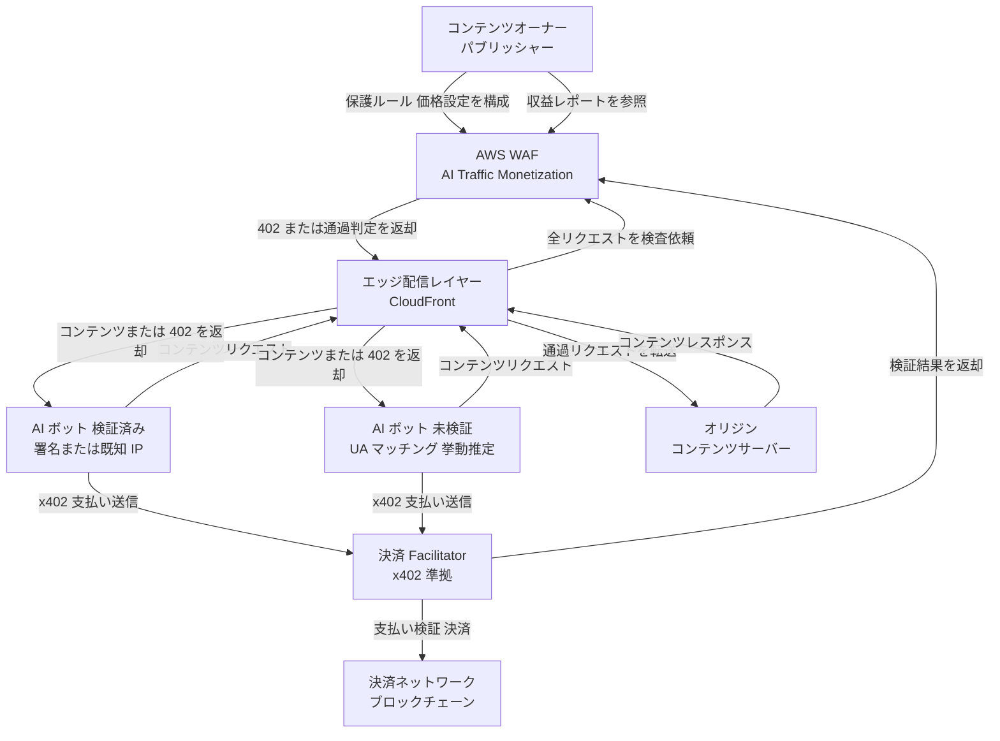
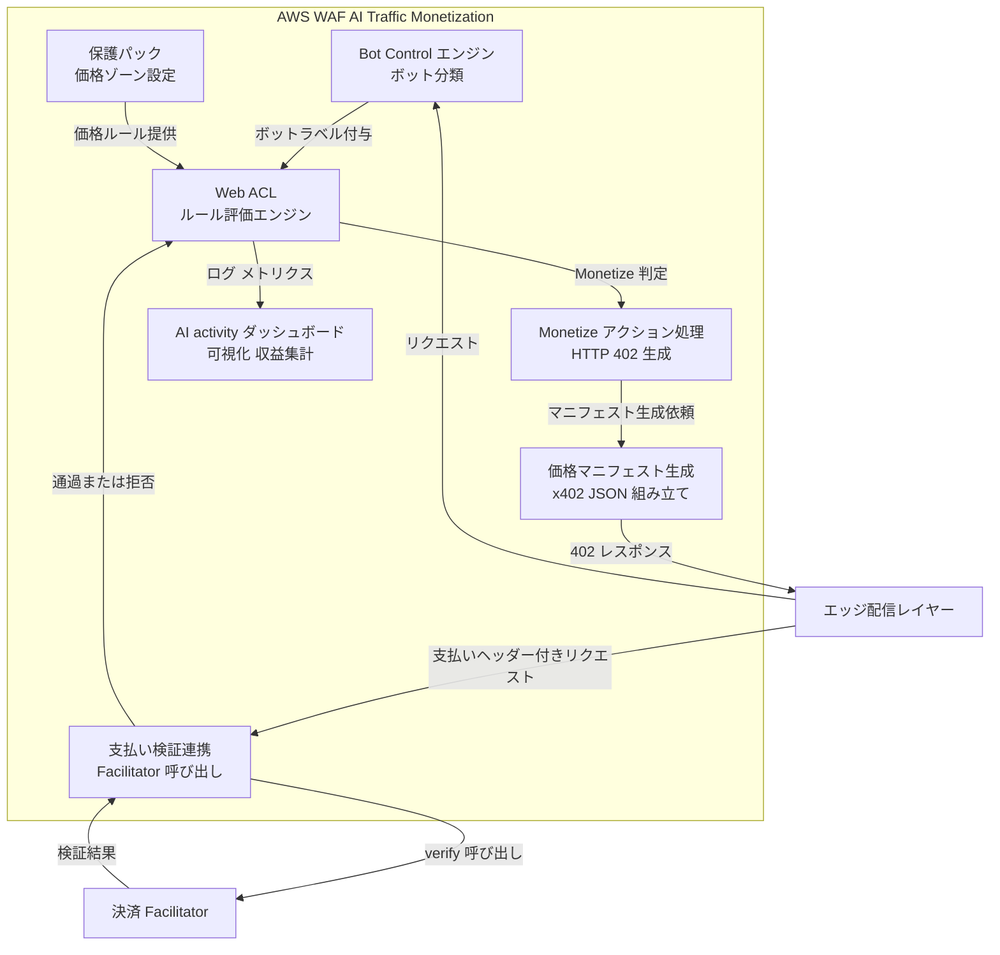
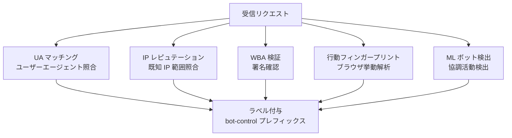
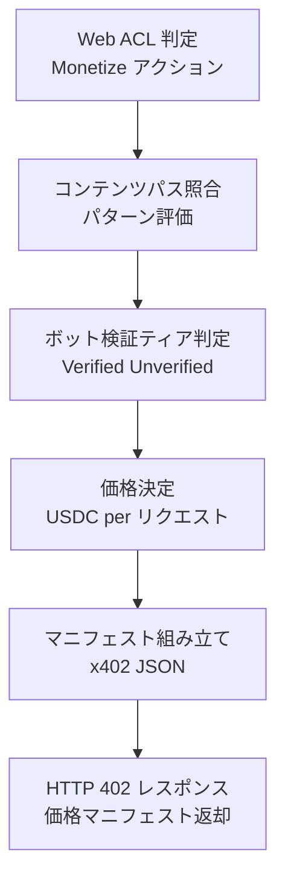
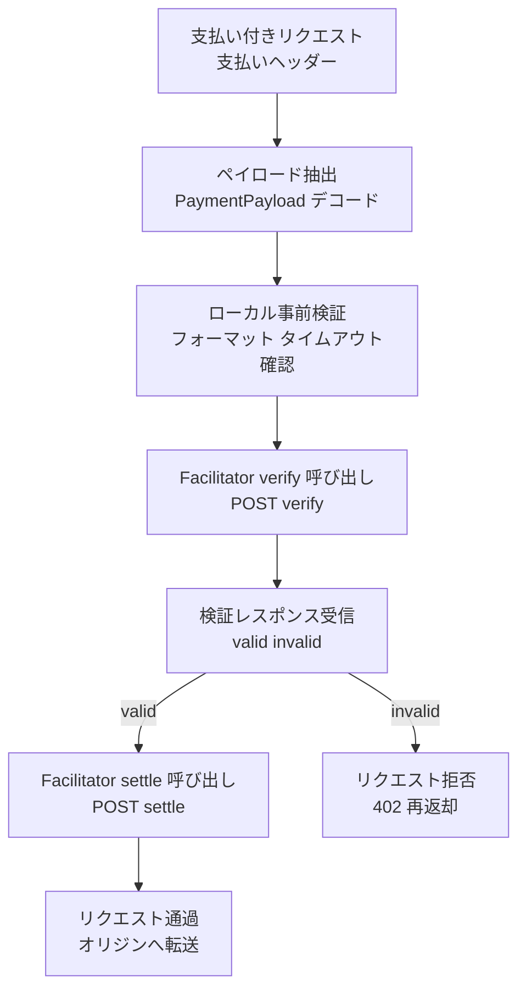
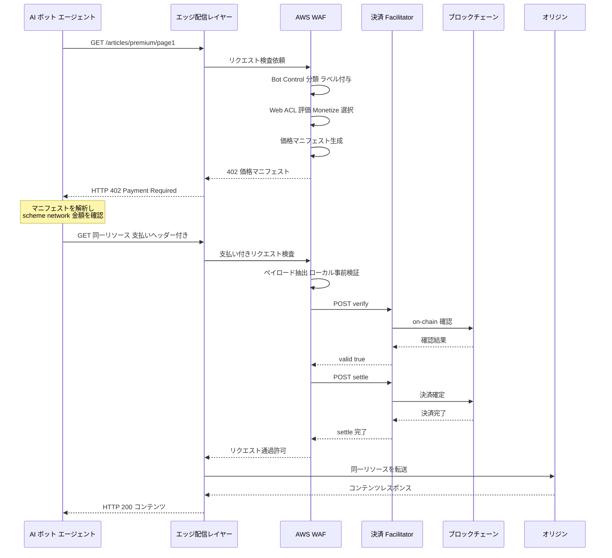
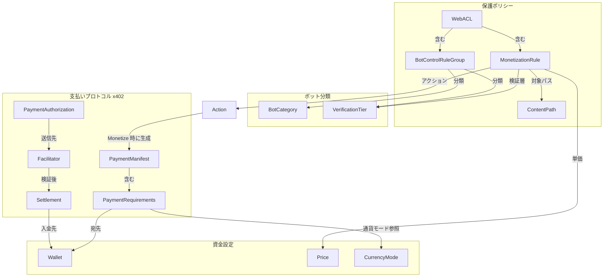
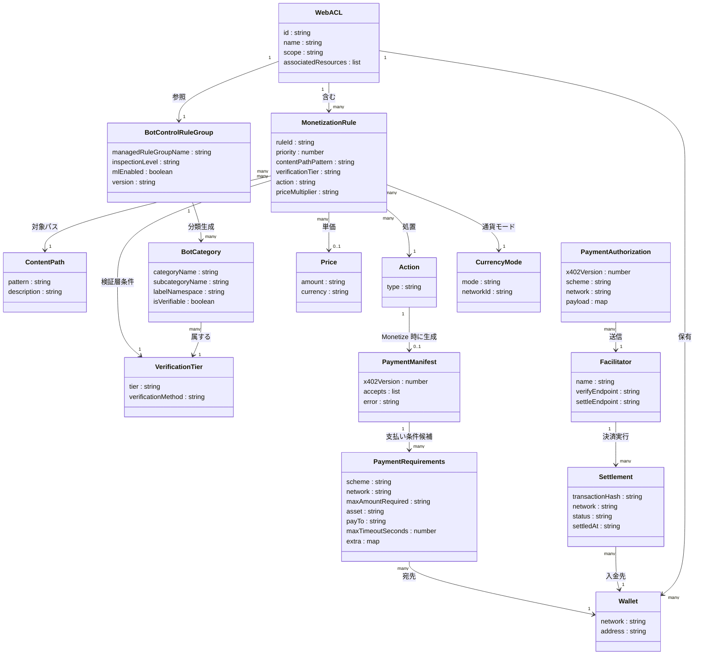

> AWS WAF Bot Control の新機能「AI traffic monetization」(2026 年 6 月 15 日発表) の技術調査です。AI ボット・エージェントのコンテンツアクセスを、ブロックと許可の二択ではなく「許可・計量・課金」の対象に変える仕組みを、構造・データ・構築・利用・運用の観点で整理します。

## 概要

### 背景と目的

AI ボットによる Web トラフィックは急増しています。多くのコンテンツプロバイダーでは、AI クローラーが全トラフィックの相当割合を占めます。AI クローラーは検索エンジンのクローラーと違い、コンテンツをモデル学習や要約生成に使うだけで、パブリッシャーへ参照トラフィックをほとんど返しません。コンテンツオーナーはインフラコストを一方的に負担し続けます。

**AWS WAF AI Traffic Monetization** は、この非対称な関係を解消するために 2026 年 6 月 15 日に発表された AWS WAF Bot Control の新機能です。コンテンツオーナーは、オリジンサーバーを改修せずに、エッジレイヤーで AI ボットのアクセスを計量・課金できます。

### 対象ユーザー

デジタルコンテンツを公開する事業者が対象です。ニュースメディア・技術ドキュメントサイト・API プロバイダー・EC サイトなどが該当します。特に既存の Amazon CloudFront + AWS WAF 構成を使うコンテンツオーナーは、追加の開発コストをかけずに収益化ルールを適用できます。

### AI エージェント時代の外部アクセス境界としての位置づけ

従来の Web セキュリティは「人間のユーザーを守る」ことを前提にし、ボット対策はブロックか通過かの二択でした。AI エージェントが自律的にコンテンツを消費・決済する時代では、エッジが「アクセス制御」と「収益化」を同時に担う新しい境界になります。AWS WAF AI Traffic Monetization は、セキュリティエッジをコンテンツマネタイゼーション層として再定義する試みです。

## 特徴

- **オリジン無改修**: AWS WAF + CloudFront のエッジで完結し、アプリケーションサーバーのコード変更が不要
- **6 種類のアクション**: `Monetize` / `Allow` / `Block` / `Count` / `CAPTCHA` / `Challenge` を、パス・ボット種別・検証ティアごとに組み合わせて設定
- **粒度の高い価格設定**: コンテンツパス / ボットカテゴリ / 検証ティア (Verified / Unverified) の 3 軸でルールを構成し、1 リクエスト単位で単価を設定
- **2 段階のボット検証ティア**: 暗号署名や既知 IP による Verified と、User-Agent パターンマッチや挙動推定による Unverified に分類し、ティアごとに異なる価格を適用
- **ステーブルコイン決済 (USDC)**: 法定通貨の為替リスクを排除し、Base / Solana ブロックチェーン上で決済
- **AWS は収益に手数料を取らない**: 決済はサードパーティの Facilitator (Coinbase x402 Facilitator) が処理し、AWS はコンテンツ収益に手数料を課さない
- **テストネット対応**: 本番稼働前に Base Sepolia / Solana Devnet でテスト資産を使って動作検証
- **単一ダッシュボードでの収益モニタリング**: AI activity dashboard の拡張として、ボット種別 / コンテンツパス別の収益・決済照合を一画面で確認
- **CloudFront 限定**: Monetize アクションは CloudFront ディストリビューションに関連付けた Web ACL でのみ動作し、リージョナル Web ACL では利用不可
- **追加料金なし**: 標準の AWS WAF 料金を超える追加コストが発生しない

### 関連技術との関係

#### AWS WAF Bot Control

AI Traffic Monetization は Bot Control の上に構築されます。Monetize アクションを使うには、Bot Control マネージドルールグループ (`AWSManagedRulesBotControlRuleSet`) を Common または Targeted レベルで有効化する必要があります。Monetize ルールは、Bot Control が提供するボット分類とラベル (`awswaf:managed:aws:bot-control:bot:verified` など) を参照します。

```
Bot Control (識別・分類)
    └── AI Traffic Monetization (計量・課金ルール)
            └── AI activity dashboard (可視化・収益モニタリング)
```

#### AWS WAF AI activity dashboard

AI activity dashboard は、AI ボットトラフィックの可視化に特化した前段機能です。ボット種別・検証ステータス・帯域幅・アクセスパターンを提供します。AI Traffic Monetization を有効化すると、収益とコンテンツパス別の決済照合を確認できるビューが加わります。

#### x402 プロトコルと HTTP 402

**x402** は、HTTP の予約済みステータスコード `402 Payment Required` を活用した機械間 (M2M) 決済のオープンプロトコルです。Coinbase が OSS として公開しています。`HTTP 402` は HTTP 仕様で「将来の課金用」として予約されてきたコードで、x402 はこれを実用化した標準のひとつです。

AWS WAF はこのプロトコルに沿って、価格マニフェストの生成・署名検証・決済確認をエッジで処理します。決済自体は Coinbase の **x402 Facilitator** (参照実装) を経由し、署名検証・ブロックチェーン送信・ガス代処理を抽象化します。Stripe および Machine Payments Protocol (MPP) との統合も予定されています。

### 類似サービスとの比較

| 比較項目 | AWS WAF AI Traffic Monetization | Cloudflare AI Crawl Control (pay-per-crawl) | 従来の robots.txt / Bot ブロック |
|---|---|---|---|
| 制御単位 | パス / ボットカテゴリ / 検証ティア | ボットカテゴリ / ドメイン単位 | ディレクトリ / User-Agent パターン |
| 課金手段 | USDC ステーブルコイン (Base, Solana) | 法定通貨 (Cloudflare 経由決済) | 課金不可 |
| 実装場所 | エッジ (CloudFront + WAF) | エッジ (Cloudflare) | オリジン / DNS 非依存 |
| 対応プロトコル | x402 (オープン M2M 決済標準) | Cloudflare 独自 + x402 連携 | なし (静的テキストファイル) |
| ボット識別 | 暗号署名による Verified / パターンマッチによる Unverified の 2 ティア | Cloudflare ボットスコア + 登録ボット照合 | User-Agent 文字列 (偽装可) |
| オリジン改修 | 不要 | 不要 | 不要 |
| 導入障壁 | CloudFront + WAF Bot Control が前提 | Cloudflare 上のサイトが前提 | なし (誰でも設置可) |

> **Stack Overflow × Cloudflare の事例**: Stack Overflow は Cloudflare の WAF ルールを設定するだけで pay-per-crawl を実装しました。従来の 403 ブロックでは bot が迂回を続けていましたが、402 応答に切り替えるとトラフィック送信を自主的に止めるボットも現れ、データライセンス交渉の起点としても機能しています。

## 構造

C4 model の 3 段階 (システムコンテキスト → コンテナ → コンポーネント) で内部アーキテクチャを図解し、最後にリクエスト処理のシーケンス図を補足します。

### システムコンテキスト図



| 要素名 | 説明 |
|---|---|
| コンテンツオーナー / パブリッシャー | Web ACL (保護パック) に価格ルールを設定し、収益ダッシュボードを参照する人間のオペレーター |
| AI ボット 検証済み | Web Bot Auth (WBA) の署名または既知 IP 範囲で身元が確認された AI エージェント |
| AI ボット 未検証 | User-Agent マッチング・行動フィンガープリント・IP レピュテーションで識別されるが、身元の暗号的証明がない AI エージェント |
| AWS WAF AI Traffic Monetization | 本調査対象。Bot Control エンジンと Monetize アクション処理を内包するサービス |
| エッジ配信レイヤー | CloudFront ディストリビューション。エッジロケーションで WAF 判定を受け付けるエントリーポイント |
| オリジン | S3 バケット・カスタム HTTP サーバーなど、実コンテンツを保持するバックエンド |
| 決済 Facilitator | x402 プロトコルの verify / settle エンドポイントを提供する仲介サービス |
| 決済ネットワーク | Base や Solana などのブロックチェーン。USDC 建ての実決済を実行 |

### コンテナ図



| 要素名 | 説明 |
|---|---|
| Bot Control エンジン | AI ボット種別を静的解析・行動フィンガープリント・機械学習で分類し、ラベルを付与するコアエンジン |
| Web ACL / ルール評価エンジン | 受信リクエストにルールを優先順位順に評価し、6 アクションのいずれかを決定 |
| 保護パック | コンテンツパスごとの価格帯・支払い方式・ライセンス条件を定義する設定単位。複数パックで 1 ディストリビューション内に複数価格ゾーンを設定可能 |
| Monetize アクション処理 | Web ACL が Monetize と判定した場合に HTTP 402 レスポンスを組み立てる処理モジュール |
| 価格マニフェスト生成 | x402 プロトコルに準拠した JSON 形式の価格マニフェストを生成するコンポーネント |
| 支払い検証連携 | 支払いヘッダーを受け取り、外部 Facilitator の verify エンドポイントを呼び出して結果を Web ACL に返すコンポーネント |
| AI activity ダッシュボード | ボットトラフィック分類・帯域コスト・収益・コンテンツパス別のアクセスを CloudWatch メトリクスから集計して可視化 |

### コンポーネント図

#### Bot Control エンジン



| 要素名 | 説明 |
|---|---|
| UA マッチング | HTTP User-Agent ヘッダーを既知ボット署名と照合し、`bot:name` / `bot:category` ラベルを付与 |
| IP レピュテーション | 公開 IP 範囲リストと照合し、`bot:verified` ラベルなどを付与 |
| WBA 検証 | Web Bot Auth の署名を公開鍵ディレクトリで検証し、`web_bot_auth:verified` などのラベルを付与 |
| 行動フィンガープリント | ブラウザ interrogation・挙動を解析し、自動化を示すラベルを付与 (Targeted レベル) |
| ML ボット検出 | 機械学習で分散協調ボット活動を検出 (Targeted レベル) |
| ラベル付与 | `awswaf:managed:aws:bot-control:` プレフィックスのラベルをリクエストに付加し、後続ルールで参照可能にする |

#### Monetize アクション処理と価格マニフェスト生成



x402 価格マニフェスト JSON の主要フィールドを示します (x402 v1 形式の例)。

```json
{
  "x402Version": 1,
  "accepts": [
    {
      "scheme": "exact",
      "network": "base",
      "maxAmountRequired": "1000000",
      "resource": "/articles/premium/page1",
      "description": "AI content access fee",
      "payTo": "0xABCD...1234",
      "maxTimeoutSeconds": 300,
      "asset": "0x833589...USDC",
      "extra": { "name": "USDC", "version": "2" }
    }
  ]
}
```

> `maxAmountRequired` はトークン最小単位の整数文字列です (USDC は 6 decimals のため `1000000` = 1.00 USDC)。
>
> **x402 のバージョン差異 (要確認)**: x402 はフィールド名・伝送方法が v1 と v2 で異なります。v1 は価格マニフェストを 402 レスポンスボディに置き、金額フィールドは `maxAmountRequired`、支払いはクライアントの `X-PAYMENT` ヘッダーで送ります。v2 は価格マニフェストを `PAYMENT-REQUIRED` ヘッダーに置き、金額フィールドは `amount`、支払いは `PAYMENT-SIGNATURE` ヘッダーで送ります。上記は v1 形式の例です。AWS WAF が採用する x402 バージョンは公式ブログに明記がないため、実装時は公式ドキュメントで確定してください。

| 要素名 | 説明 |
|---|---|
| コンテンツパス照合 | 保護パック設定のパスパターンに対してリクエストパスを上から順に評価し、最初にマッチしたルールを適用 |
| ボット検証ティア判定 | Bot Control ラベル (`bot:verified` / `bot:unverified`) に基づき価格帯を選択 |
| 価格決定 | ティアごとに設定された USDC 単価をリクエストに割り当て |
| マニフェスト組み立て | scheme / network / maxAmountRequired / payTo / maxTimeoutSeconds などを x402 仕様に準拠した JSON として組み立て |
| HTTP 402 レスポンス | ステータスコード 402 と価格マニフェスト (JSON) を返却 |

#### 支払い検証連携



| 要素名 | 説明 |
|---|---|
| ペイロード抽出 | 支払いヘッダーから base64 エンコードの PaymentPayload を取り出し、scheme・network・署名を解析 |
| ローカル事前検証 | タイムアウト期限・金額・対象リソースがマニフェストと一致するかをローカルで即時確認 |
| Facilitator verify 呼び出し | 外部 Facilitator の `/verify` エンドポイントに PaymentPayload を送信し、on-chain 状態を確認 |
| Facilitator settle 呼び出し | verify 成功後、Facilitator の `/settle` を呼び出してブロックチェーン上の USDC 送金を確定 |
| リクエスト通過 | 決済確認後、元のリクエストをオリジンへ転送し、支払い結果ヘッダーを付けてコンテンツを返却 |
| リクエスト拒否 | 検証失敗時は再度 HTTP 402 を返却し、支払いを促す |

#### 支払い処理シーケンス



## データ

### 概念モデル



| 要素名 | 説明 |
|---|---|
| WebACL | 保護ポリシーのルートコンテナ。CloudFront ディストリビューションまたはリージョナルリソースに関連付け |
| BotControlRuleGroup | マネージドルールグループ `AWSManagedRulesBotControlRuleSet`。Inspection Level を持ち、ボット分類ラベルを付与 |
| MonetizationRule | コンテンツパス × ボット検証層に対してアクションと価格を定義する単位 |
| ContentPath | 課金対象 URL パターン。パターンマッチまたは完全一致 |
| BotCategory | Bot Control が認識するボット分類 (AI Scraper / AI Tool / AI Agent など) |
| VerificationTier | Verified (署名またはドキュメント済み IP) と Unverified (シグネチャ推定) の 2 層 |
| Action | MonetizationRule に設定できる 6 種類の処置 |
| Price | コンテンツパスごとの USDC 単価 |
| PaymentManifest | HTTP 402 レスポンスに含まれる x402 価格マニフェスト |
| PaymentRequirements | PaymentManifest 内の個別支払い条件。チェーン・資産・宛先ウォレット・上限タイムアウトを含む |
| PaymentAuthorization | クライアントが署名して送信する支払い承認ペイロード |
| Facilitator | 支払い検証と決済を担う外部サービス (Coinbase x402 Facilitator / Stripe / MPP) |
| Settlement | Facilitator がオンチェーンで実行する最終決済トランザクション |
| Wallet | コンテンツオーナーが設定する受取ウォレットアドレス。チェーンごとに設定 |
| CurrencyMode | Test (テストネット) または Real (メインネット) の動作モード |

### 情報モデル



### 属性補足

#### Action の値

| 値 | 意味 |
|---|---|
| Monetize | HTTP 402 と価格マニフェストを返す |
| Allow | 無条件でコンテンツを返す |
| Block | アクセスを拒否する (403) |
| Count | ログ記録のみ (アクセスは通す) |
| CAPTCHA | CAPTCHA チャレンジを提示する |
| Challenge | サイレントブラウザ検証を実行する |

#### VerificationTier の値

| 値 | 検証方法 |
|---|---|
| Verified | Web Bot Auth (WBA) 署名、またはドキュメント済み IP レンジ |
| Unverified | User-Agent 一致、振る舞いフィンガープリント、IP レピュテーション |

#### BotControlRuleGroup.inspectionLevel の値

| 値 | 説明 |
|---|---|
| Common | 静的リクエスト解析によるシグネチャ照合。自己申告ボットを検出・検証 |
| Targeted | Common に加え、ブラウザ尋問・フィンガープリント・振る舞い解析で高度なボットを検出 |

#### CurrencyMode の値

| mode | 対応ネットワーク | 用途 |
|---|---|---|
| TEST | Base Sepolia / Solana Devnet | テストネット検証 |
| REAL | Base mainnet / Solana mainnet | 本番課金 |

#### PaymentRequirements.scheme の値

| 値 | 説明 |
|---|---|
| exact | 指定額をトークン転送で直接支払う |

> **公式記述からの推測**: `extra` オブジェクト内のフィールド (`name` / `version` など) は coinbase/x402 リポジトリの EVM スキームスペックから取得した補足です。AWS WAF 公式ブログには記載がありません。

#### Facilitator の対応状況 (2026 年 6 月時点)

| 名称 | 状態 |
|---|---|
| Coinbase x402 Facilitator | 提供中 |
| Stripe | 対応予定 |
| Machine Payments Protocol (MPP) | 対応予定 |

## 構築方法

### 前提条件

AI Traffic Monetization を有効化するには、以下の 3 点が必要です。

- **AWS WAF Bot Control の有効化**: CloudFront ディストリビューションに関連付けた Web ACL (または保護パック) で、Bot Control マネージドルールグループ (`AWSManagedRulesBotControlRuleSet`) が `Common` または `Targeted` レベルで有効。Monetize ルールが Bot Control のラベルを参照するため必須
- **Amazon CloudFront ディストリビューション**: Monetize アクションは CloudFront 向け Web ACL (Scope: CLOUDFRONT) 専用。Application Load Balancer・API Gateway などのリージョナル Web ACL には適用できず、リージョナル Web ACL に Monetize ルールを設定するとそのルールはスキップされる。CloudFront 向け Web ACL の操作は `us-east-1` リージョンを使用
- **x402 互換ウォレットアドレス**: 収益を受け取るウォレットを事前に用意する。EVM 系 (Base、Base Sepolia) は Ethereum アドレス (`0x` 始まり、実用上 42 文字)、Solana 系は Base58 公開鍵を使用。API の `WalletAddress` 制約は 26〜44 文字

### Protection pack の作成 (マネジメントコンソール)

1. AWS マネジメントコンソールにサインインし、**WAF & Shield** を開く
2. 左ナビゲーションから保護パック (web ACL) の一覧を選択する
3. **Add protection pack (web ACL)** をクリックする
4. アプリのカテゴリとトラフィックソース (API / Web / Both) を選択する
5. **Resources to protect** で **Amazon CloudFront distributions** を選択し、対象ディストリビューションを追加する。CloudFront の選択が必須
6. 保護レベルを選択する。Bot Control マネージドルールグループを含むプリセットを選ぶか、手動で追加する
7. ユニークな名前を入力する (作成後の変更は不可)
8. **Monetization configuration** セクションを展開し、支払いネットワーク・ウォレットアドレス・ベース価格を設定する (後から編集で追加も可能)
9. 設定を確認して保護パックを作成する

### Monetize アクションの有効化 (マネジメントコンソール)

1. 対象の保護パックを選択する
2. **Configure AI monetization** を選択する
3. 各エージェント検証ティア (Verified / Unverified など) に対して 6 つのアクションのうち 1 つを割り当てる
4. **Payment settlement** セクションでブロックチェーンネットワークを選択し、各ネットワークにウォレットアドレスと USDC ベース価格を設定する
5. 設定を保存する

### AWS SAM サンプルプロジェクトのデプロイ

AWS が提供するサンプル `sample-x402-content-monetization-with-cloudfront-and-waf` を使うと、CloudFront + Lambda@Edge + WAF 構成を一括デプロイできます。

```bash
git clone https://github.com/aws-samples/sample-x402-content-monetization-with-cloudfront-and-waf.git
cd sample-x402-content-monetization-with-cloudfront-and-waf
sam build
sam deploy --guided --region us-east-1 --capabilities CAPABILITY_NAMED_IAM
```

デプロイ時の主要パラメータを示します。

| パラメータ | 説明 | 例 |
|---|---|---|
| `PayToAddress` | USDC を受け取るウォレットアドレス | `0xYourAddress` |
| `Network` | ブロックチェーンネットワーク | `eip155:84532` (Base Sepolia) / `eip155:8453` (Base mainnet) |
| `FacilitatorType` | 支払い Facilitator | `x402.org` (テスト) / `cdp` (テスト・本番) |
| `RouteConfigJson` | パスごとの価格設定 JSON | 下記参照 |

```json
{
  "routes": [
    {
      "pattern": "/api/sports.json",
      "policies": [
        { "condition": "VerifiedBot", "action": "0.003" },
        { "condition": "default", "action": "block" }
      ]
    },
    {
      "pattern": "/articles/**",
      "policies": [
        { "condition": "VerifiedBot", "action": "0.002" },
        { "condition": "default", "action": "0.02" }
      ]
    }
  ]
}
```

> このサンプルは MIT-0 ライセンスの非公式サポート資産です。本番適用前に Count モードでの検証を推奨します。

## 利用方法

### 主要 API パラメータ一覧

Monetize 機能に関係する API パラメータは `CreateWebACL` / `UpdateWebACL` リクエストで使用します。

#### MonetizationConfig オブジェクト

| パラメータ | 型 | 必須 | 有効値 / 説明 |
|---|---|---|---|
| `MonetizationConfig.CurrencyMode` | String | No | `REAL` または `TEST`。未指定時は `REAL`。TEST は Base Sepolia / Solana Devnet を使用 |
| `MonetizationConfig.CryptoConfig` | Object | No | 暗号通貨支払い設定。PaymentNetworks を含む |
| `CryptoConfig.PaymentNetworks` | Array | Yes (CryptoConfig 指定時) | 1〜2 ネットワーク。本番同士またはテスト同士のみ混在可 |

#### PaymentNetwork オブジェクト

| パラメータ | 型 | 必須 | 有効値 / 説明 |
|---|---|---|---|
| `Chain` | String | Yes | `BASE` / `SOLANA` (本番) / `BASE_SEPOLIA` / `SOLANA_DEVNET` (テスト) |
| `WalletAddress` | String | Yes | API 制約は 26〜44 文字。EVM 系は `0x` 始まり (実用上 42 文字)、Solana は Base58 公開鍵 |
| `Prices` | Array | Yes | Price オブジェクト |

#### Price オブジェクト

| パラメータ | 型 | 必須 | 有効値 / 説明 |
|---|---|---|---|
| `Amount` | String | Yes | リクエスト単価 (USDC)。最小 `0.001`、最大 `999999999.999`、小数点以下 3 桁まで |
| `Currency` | String | Yes | 現在は `USDC` のみ |

#### Monetize アクション (ルール内)

| パラメータ | 型 | 必須 | 説明 |
|---|---|---|---|
| `Action.Monetize.PriceMultiplier` | String | No | このルールで適用する価格倍率。MonetizationConfig の base price に乗算する |

### Monetization rule の定義

Monetize ルールは Bot Control のラベルでリクエストを照合し、対象コンテンツパスと検証ティアごとに課金ポリシーを適用します。

#### 対象コンテンツパスの指定

ルール定義内の `Statement` に `ByteMatchStatement` (`UriPath` フィールド) や `RegexMatchStatement` を使い、課金対象のパスを絞り込みます。パスを限定しない場合は、すべてのリクエストが対象になります。

#### ボットカテゴリ・検証層ごとの価格設定

Bot Control が付与するラベルに基づいて検証ティアを識別します。主要なラベルを示します (ラベルの正式表記は AWS WAF Bot Control の公式ラベル一覧で確認してください)。

| ラベル | 意味 |
|---|---|
| `awswaf:managed:aws:bot-control:bot:verified` | 身元確認済みボット (IP アドレスで組織の所有を確認済み) |
| `awswaf:managed:aws:bot-control:bot:unverified` | 自己申告のみで第三者検証不可のボット |
| `awswaf:managed:aws:bot-control:bot:web_bot_auth:verified` | Web Bot Auth (WBA) による暗号署名検証済みボット |
| `awswaf:managed:aws:bot-control:bot:category:ai` | AI ボット (CategoryAI ルールにマッチ) |

検証ティアに対して異なる `PriceMultiplier` を設定すると、Verified ボットには低価格、Unverified ボットには高価格を適用できます。最終課金額は次の式で決まります。

```
最終課金額 = MonetizationConfig の base price (USDC) × ルールの PriceMultiplier
```

#### 受け付ける支払いネットワーク

| ネットワーク | Chain 値 | 環境 |
|---|---|---|
| Base mainnet | `BASE` | 本番 |
| Solana mainnet | `SOLANA` | 本番 |
| Base Sepolia | `BASE_SEPOLIA` | テスト |
| Solana Devnet | `SOLANA_DEVNET` | テスト |

> ライセンス条件はコンソールの **Configure AI monetization** 画面で設定できますが、対応する API パラメータ名は公式 API リファレンス (2026 年 6 月時点) では確認できませんでした (**公式ドキュメントで要確認**)。

### Test currency mode → Real currency mode の切り替え

`MonetizationConfig.CurrencyMode` で切り替えます。

- **`TEST`**: Base Sepolia / Solana Devnet 上のテストネット資産で決済する。資産に金銭的価値はなく、収益ダッシュボードには表示されない
- **`REAL`**: Base mainnet / Solana mainnet 上で USDC の実決済を行う。`CurrencyMode` 未指定時のデフォルト

AWS CLI での変更例を示します (`UpdateWebACL` を使用)。`LockToken` は事前に `GetWebACL` で取得します。

```bash
# LockToken を取得する
aws wafv2 get-web-acl \
  --name "my-protection-pack" \
  --scope CLOUDFRONT \
  --id "xxxxxxxx-xxxx-xxxx-xxxx-xxxxxxxxxxxx" \
  --region us-east-1 \
  --query "LockToken" \
  --output text
```

```bash
# CurrencyMode を TEST から REAL に変更する
aws wafv2 update-web-acl \
  --name "my-protection-pack" \
  --scope CLOUDFRONT \
  --id "xxxxxxxx-xxxx-xxxx-xxxx-xxxxxxxxxxxx" \
  --lock-token "<取得した LockToken>" \
  --region us-east-1 \
  --default-action '{"Allow":{}}' \
  --visibility-config '{"SampledRequestsEnabled":true,"CloudWatchMetricsEnabled":true,"MetricName":"my-protection-pack"}' \
  --monetization-config '{"CurrencyMode":"REAL","CryptoConfig":{"PaymentNetworks":[{"Chain":"BASE","WalletAddress":"0xYourWalletAddress","Prices":[{"Amount":"0.001","Currency":"USDC"}]}]}}'
```

> `UpdateWebACL` は WebACL 全体を上書きします。既存ルールを保持したまま `MonetizationConfig` だけを更新する場合は、`GetWebACL` で現在の設定を取得し `Rules` を含めて再送してください。

### AWS CLI での Protection pack 新規作成例

スコープは `CLOUDFRONT`、リージョンは `us-east-1` を指定します。

```bash
aws wafv2 create-web-acl \
  --name "ai-monetization-pack" \
  --scope CLOUDFRONT \
  --region us-east-1 \
  --default-action '{"Allow":{}}' \
  --visibility-config '{"SampledRequestsEnabled":true,"CloudWatchMetricsEnabled":true,"MetricName":"ai-monetization-pack"}' \
  --monetization-config '{
    "CurrencyMode": "TEST",
    "CryptoConfig": {
      "PaymentNetworks": [
        {
          "Chain": "BASE_SEPOLIA",
          "WalletAddress": "0xYourTestnetWalletAddress",
          "Prices": [ { "Amount": "0.001", "Currency": "USDC" } ]
        }
      ]
    }
  }' \
  --rules '[
    {
      "Name": "BotControlAIMonetize",
      "Priority": 1,
      "Statement": {
        "ManagedRuleGroupStatement": {
          "VendorName": "AWS",
          "Name": "AWSManagedRulesBotControlRuleSet",
          "ManagedRuleGroupConfigs": [
            { "AWSManagedRulesBotControlRuleSet": { "InspectionLevel": "TARGETED", "EnableMachineLearning": true } }
          ],
          "RuleActionOverrides": [
            { "Name": "CategoryAI", "ActionToUse": { "Monetize": { "PriceMultiplier": "1.0" } } }
          ]
        }
      },
      "OverrideAction": {"None": {}},
      "VisibilityConfig": { "SampledRequestsEnabled": true, "CloudWatchMetricsEnabled": true, "MetricName": "BotControlAIMonetize" }
    }
  ]'
```

> 上記は構造を示す参考例です。本番環境への適用前に Count モードでテストしてください。

### 6 アクションの使い分け

| アクション | HTTP レスポンス | 用途 |
|---|---|---|
| Monetize | 402 + x402 価格マニフェスト | AI ボットにコンテンツアクセスを有料化する。x402 対応エージェントは自律的に支払い処理を実行する |
| Allow | 通常コンテンツ | 無料でアクセスを許可する。信頼できるパートナーやパブリックコンテンツに適用する |
| Block | 403 Forbidden | アクセスを完全に拒否する。未認証ボットや悪意のあるクローラーを遮断する |
| Count | 通常コンテンツ (ログのみ) | アクセスは許可しつつトラフィックをログに記録する。段階的展開や影響調査に使用する |
| CAPTCHA | CAPTCHA パズル | 人間かどうかをインタラクティブに検証する (追加料金あり) |
| Challenge | サイレントブラウザ検証 | バックグラウンドでブラウザを検証する。CAPTCHA より摩擦が少ない (追加料金あり) |

#### 典型的な組み合わせ例

```
Verified AI ボット   → Monetize (低 PriceMultiplier)
Unverified AI ボット → Monetize (高 PriceMultiplier)
一般ユーザー         → Allow
未分類ボット         → Block または Count (様子見)
```

## 運用

### AI activity dashboard によるモニタリング

AWS WAF コンソールの保護パック (web ACL) の AI トラフィック解析ビューからアクセスします。ボットトラフィックが到達すると自動的にデータが反映されます。トラフィックは次の 4 カテゴリに分類されます。

- **All bot requests**: 全ボットリクエスト数
- **AI bot requests**: AI ボットに分類されたリクエスト数
- **Verified AI bot traffic**: 署名 (WBA) または公開済み IP/UA で身元確認済みのトラフィック
- **Unverified AI bot traffic**: UA マッチングや行動解析で識別されたが暗号的確認がないトラフィック

AI トラフィック解析は CloudWatch メトリクスとして自動出力されます。独自のアラームや BI パイプラインに組み込む場合は、API でプログラムから取得できます。

### 収益モニタリング

**Real currency mode** に切り替えると、収益モニタリングのビューが有効になります。総収益・検証済み/未検証ボット別収益・リクエスト単価平均・収益上位コンテンツパス・プロバイダー別決済照合・失敗した支払い履歴を確認できます。Test mode の取引は収益ビューには表示されません。

### 監査ログ (WAF ログ / CloudWatch Logs)

WAF ログを有効化すると、各リクエストに以下のフィールドが記録されます。

```json
{
  "terminatingRule": { "ruleId": "MonetizeAIBots", "action": "MONETIZE" },
  "labels": [
    { "name": "awswaf:managed:aws:bot-control:bot:category:ai" },
    { "name": "awswaf:managed:aws:bot-control:bot:verified" }
  ],
  "httpRequest": { "uri": "/articles/premium-content" }
}
```

| フィールド | 説明 |
|---|---|
| `terminatingRule.action` | `MONETIZE` / `ALLOW` / `BLOCK` / `COUNT` |
| `labels` | ボットカテゴリ・検証ステータス (`bot:verified` / `bot:unverified`) |
| `nonTerminatingMatchingRules` | Count モードの中間マッチルール |

ログ送信先は **CloudWatch Logs グループ / S3 バケット / Amazon Data Firehose** から選択でき、Amazon Security Lake 経由の収集にも対応します。

### ボット分類 (Verified / Unverified) の見直し

AWS WAF Bot Control は WBA (Web Bot Auth) をサポートします。WBA は Ed25519 暗号署名を HTTP メッセージに付与する IETF ドラフト標準です。付与されるラベルは次のとおりです。

| ラベル | 意味 |
|---|---|
| `awswaf:managed:aws:bot-control:bot:web_bot_auth:verified` | 署名検証成功 |
| `awswaf:managed:aws:bot-control:bot:web_bot_auth:failed` | 署名検証失敗 |
| `awswaf:managed:aws:bot-control:bot:web_bot_auth:expired` | 署名のタイムスタンプが有効期限外 |
| `awswaf:managed:aws:bot-control:bot:web_bot_auth:unknown_bot` | 未登録ボット |

Bot Control ルールグループが付与したラベルに対して、後続のカスタムルールで Label Match Statement を使い、個別ボットの扱いを変更できます。

```yaml
# 例: 特定の Verified AI ボットを無料アクセス (ALLOW) に上書き
Name: AllowVerifiedPartnerBot
Priority: 10
Statement:
  LabelMatchStatement:
    Scope: LABEL
    Key: awswaf:managed:aws:bot-control:bot:name:example-bot
Action:
  Allow: {}
```

### Test mode → Real currency mode 移行運用

| フェーズ | Currency mode | ネットワーク | 収益計上 |
|---|---|---|---|
| 検証・ステージング | TEST | Base Sepolia / Solana Devnet | 対象外 |
| 本番移行 | REAL | Base mainnet / Solana mainnet | 対象 |

1. Test mode で価格設定・ウォレット設定・x402 フローが正常に機能していることを確認する
2. 失敗した支払い試行がゼロであることを確認する
3. コンソールで Currency mode を **Real** に切り替える
4. ウォレットが本番ネットワークのアドレスに設定されていることを再確認する
5. 最初の数件のリクエストを手動でテストし、正常な決済レコードが記録されることを確認する

### 価格変更の運用

保護パックの料金設定は、アプリケーションコードの変更なしに WAF コンソールから更新できます。参照実装では、AWS Systems Manager Parameter Store に設定を保持し、変更をリアルタイムに伝播させています。

## ベストプラクティス

### 制御責任の境界 (本調査の核心)

コンテンツへの AI アクセスを管理する制御層は複数あります。各層の責任範囲を明確にすることが、運用安定性と収益最大化の鍵です。

| 制御層 | 主な責任 | 担えないこと |
|---|---|---|
| robots.txt / RFC 9309 | 礼儀的なクローラーへの訪問許可・禁止の意思表示 | 強制力なし。無視するクローラーが存在する |
| AI.txt / llms.txt | 用途別 (学習 / 推論 / 検索) の意図表明 | 強制力なし |
| AWS WAF Bot Control | ボット識別・分類・Verified/Unverified の振り分け・カテゴリ別レート制限/ブロック | 支払い処理・ライセンス条件の提示・収益集計 |
| WAF Monetize アクション (x402) | AI ボットへの HTTP 402 返却・価格マニフェスト提示・支払い検証・エッジ決済 | ライセンス条文の法的拘束力・x402 非対応エージェントへの支払い強制 |
| ウォレット / ブロックチェーン決済 | USDC 決済の受領・オンチェーン決済記録 | アクセスログの人的監査・法的証跡の作成 |
| CloudWatch / WAF ログ | リクエスト単位の監査証跡・課金根拠の記録・異常検知 | 支払い照合・法的証跡としての完結性 (別途アーカイブ推奨) |
| API キー / OAuth | 人間ユーザー向け認証・用途承認 | AI エージェントの自律的なマイクロ支払い処理 |

> **要点**: robots.txt は「意思表示」、WAF Bot Control は「識別と強制」、x402 Monetize は「課金」、ウォレット/ログは「証跡」と責任が分離しています。これらを補完的に重ねることが、堅牢な設計の前提になります。

### コンテンツパスごとの段階的課金設計

```
/public/**           → Allow (無料。SEO・認知拡大用)
/articles/summary/** → Monetize (低価格。ヘッドライン閲覧)
/articles/full/**    → Monetize (中価格。全文読み取り)
/data/premium/**     → Monetize (高価格。独自データ)
/api/bulk/**         → Block または Rate-limit (Unverified ボット)
```

ルートは上から順に評価されます。最初にマッチした条件が適用されるため、より限定的なパスを上位に配置します。

### 人間ユーザー向け規約と AI アクセス向け条件の分離

| 観点 | 人間ユーザー | AI エージェント |
|---|---|---|
| 認証 | OAuth / Cookie セッション | x402 USDC 支払い + WBA 署名 |
| レート制限 | ページ閲覧数 / セッション | リクエスト数 / 分 (WAF Rate-based ルール) |
| 利用条件 | 利用規約 (ToS) への同意 | x402 価格マニフェストのライセンス条項 |
| アクセス拒否 | 403 | 402 Payment Required または 403 Block |
| キャッシュ | 通常の CloudFront キャッシュ | エージェント識別子をキャッシュキーに含めた専用キャッシュ |

> ライセンス条項は、x402 の価格マニフェストに埋め込むことで、支払いと同時に条件提示が可能です。法的拘束力は管轄域によって異なるため、弁護士のレビューを推奨します。

### 収益最適化

- **Unverified ボットの価格倍率を高く設定する**: `PriceMultiplier` で Unverified ボットに Verified ボットの数倍の価格を適用する。これは WBA 登録を促すインセンティブにもなる
- **アクセスパターンを参照する**: AI activity dashboard で AI ボットが頻繁にアクセスするパスを特定し、そのパスの価格を優先的に最適化する
- **支払い失敗率を定期確認する**: 支払い失敗が多いパスは、価格が高すぎるか、エージェント側のウォレット残高が不足している可能性がある
- **Count → Monetize の段階移行**: 最初は Count モードでトラフィック量と分布を観察し、価格設定の根拠を固めてから Monetize に切り替える

### 過剰ブロック回避

- **Bot Control を最初は Count モードで展開する**: 正当なクローラーを特定してから Monetize / Block に切り替える
- **ラベルマッチルールで個別ボットを除外する**: 特定の Verified ボットは Block 対象から外し、Allow または Count にとどめる
- **CloudFront Functions / Lambda@Edge の注意**: WAF が生成する 402 レスポンスにはビューワーレスポンス関数が実行されない。CORS ヘッダー等の付加が必要な場合は **Response Headers Policy** を使用する

### キャッシュ設定 (収益漏洩防止)

> 収益化パスにキャッシュを適切に設定しないと、支払い済みレスポンスが他のエージェントに無料で提供されます。

| 設定項目 | 推奨値 | 理由 |
|---|---|---|
| Cache policy | `CachingDisabled` またはカスタム | エージェント間でのキャッシュ共有を防止する |
| Origin request policy | エージェント識別ヘッダーを含める | オリジン側でエージェント固有のトークンを検証できるようにする |
| TTL | 0 または短い値 | 各リクエストを AWS WAF が評価するために必要 |
| キャッシュキー | エージェント識別子を含めるカスタムキャッシュポリシー | 支払い済みエージェントに専用キャッシュコピーを提供する |

### セキュリティ

- **ウォレットアドレスは Secrets Manager または SSM Parameter Store に保管する**: 設定ファイルへのハードコーディングを避ける
- **Test mode と Real mode のウォレットを分離する**: テストネットアドレスを本番に流用しないよう設定を分ける
- **オンチェーン決済記録を WAF ログと突き合わせる**: 決済記録とトランザクション ID を定期照合し、不正な支払いスキップを検出する
- **Bot Control の RuleSet を最新バージョンに維持する**: WBA 対応には対応バージョン以降が必要

## トラブルシューティング

| # | 症状 | 原因 | 対処 |
|---|---|---|---|
| 1 | Monetize ルールが機能せずボットが通過する | リージョナル Web ACL (ALB / API Gateway 等) に Monetize ルールを設定している | CloudFront に関連付けた Web ACL のみが Monetize をサポートする。リージョナル Web ACL ではスキップされる |
| 2 | 収益ダッシュボードに何も表示されない | Currency mode が Test のまま | Currency mode を **Real** に切り替える。Test 取引は Real ダッシュボードに表示されない |
| 3 | Test mode で 402 が返らない | 保護パックに Monetize ルールが未追加 / Bot Control 未有効 | Bot Control ルールグループと Monetize アクションが正しく設定されているか確認する |
| 4 | x402 非対応エージェントが 402 を受け取り支払いせず諦める | エージェントが x402 を実装していない | Fallback action を `Block` にする。または `Count` でログのみ取得し Rate-based ルールでスロットリングする |
| 5 | ウォレットに USDC が入金されない | ウォレットがテストネット向けのまま / 本番ネットワーク未選択 | 本番ネットワークと対応する本番ウォレットアドレスを設定する |
| 6 | 支払い検証失敗が多発する | Facilitator の認証情報未設定または期限切れ / テスト用 Facilitator を本番で使用 | 本番は CDP Facilitator を選択し、有効な認証情報を設定する。x402.org はテストネット専用 |
| 7 | 正当なパートナーのクローラーが課金される | Bot Control がパートナーボットを AI ボットとして分類している | 対象ボットのラベルに対して Monetize より高優先度の Allow ルールを追加する |
| 8 | WBA Verified ボットが `unknown_bot` に分類される | ボット運営者が公開鍵を登録していない | ボット運営者に WBA 対応と鍵登録を依頼する。それまでは IP レンジ + UA による従来型 Verified 分類を確認する |
| 9 | 402 レスポンスにヘッダーを追加できない | WAF 生成の 402 にはビューワーレスポンス関数が実行されない | **Response Headers Policy** で CORS ヘッダー等を付加する |
| 10 | 支払い済みエージェントが再アクセス時に再度 402 を受け取る | 収益化パスのキャッシュ設定が不適切 | キャッシュキーにエージェント識別子を含め、TTL を適切に設定する |
| 11 | 支払い記録はあるが収益合計が 0 | USDC がテストネットアドレスに送金されている | ウォレットアドレスと選択ネットワークが本番用か再確認する |
| 12 | AI activity dashboard にボット情報が出ない | Bot Control 未有効 / トラフィック量が少なく集計未発火 | Bot Control を有効化し Count モードで待機する。トラフィック到達後に反映される |

## まとめ

AWS WAF AI Traffic Monetization は、セキュリティエッジを「ブロックか許可か」の境界から「許可・計量・課金」の境界へ拡張し、AI ボットのコンテンツアクセスを x402 と USDC でオリジン無改修のまま収益化します。robots.txt が「意思表示」、Bot Control が「識別と強制」、Monetize が「課金」、ウォレット/ログが「証跡」と責任を分離して重ねる設計が、AI エージェント時代の外部アクセス境界を堅牢にする鍵になります。

この記事が少しでも参考になった、あるいは改善点などがあれば、ぜひリアクションやコメント、SNSでのシェアをいただけると励みになります！

## 参考リンク

- 概要・特徴
  - [AWS WAF adds AI traffic monetization capability to help content owners charge AI bots for content access (AWS Blog)](https://aws.amazon.com/blogs/aws/aws-waf-adds-ai-traffic-monetization-capability-to-help-content-owners-charge-ai-bots-for-content-access/)
  - [Introducing AI traffic analysis dashboards for AWS WAF (AWS Security Blog)](https://aws.amazon.com/blogs/security/introducing-ai-traffic-analysis-dashboards-for-aws-waf/)
  - [AWS WAF AI Activity Dashboard — What's New](https://aws.amazon.com/about-aws/whats-new/2026/02/aws-waf-ai-activity-dashboard)
  - [Beyond block or allow: How pay-per-crawl is reshaping public data monetization (Stack Overflow Blog)](https://stackoverflow.blog/2026/02/26/how-pay-per-crawl-is-reshaping-data-monetization/)
  - [Cloudflare AI Crawl Control Documentation](https://developers.cloudflare.com/ai-crawl-control/)
- 構造・データ
  - [x402 Protocol Official Site](https://www.x402.org/)
  - [coinbase/x402 — GitHub](https://github.com/coinbase/x402)
  - [coinbase/x402 — exact scheme (EVM) spec](https://github.com/coinbase/x402/blob/main/specs/schemes/exact/scheme_exact_evm.md)
  - [AWS WAF Bot Control components (公式ドキュメント)](https://docs.aws.amazon.com/waf/latest/developerguide/waf-bot-control-components.html)
  - [x402 and Agentic Commerce (AWS for Industries ブログ)](https://aws.amazon.com/blogs/industries/x402-and-agentic-commerce-redefining-autonomous-payments-in-financial-services/)
- 構築方法・利用方法
  - [Creating a protection pack (web ACL) in AWS WAF](https://docs.aws.amazon.com/waf/latest/developerguide/web-acl-creating.html)
  - [AWS WAF API Reference: CreateWebACL](https://docs.aws.amazon.com/waf/latest/APIReference/API_CreateWebACL.html)
  - [AWS WAF API Reference: MonetizationConfig](https://docs.aws.amazon.com/waf/latest/APIReference/API_MonetizationConfig.html)
  - [AWS WAF API Reference: PaymentNetwork](https://docs.aws.amazon.com/waf/latest/APIReference/API_PaymentNetwork.html)
  - [AWS WAF API Reference: Price](https://docs.aws.amazon.com/waf/latest/APIReference/API_Price.html)
  - [aws-samples/sample-x402-content-monetization-with-cloudfront-and-waf](https://github.com/aws-samples/sample-x402-content-monetization-with-cloudfront-and-waf)
- 運用・ベストプラクティス・トラブルシューティング
  - [AWS WAF Bot Control (公式ドキュメント)](https://docs.aws.amazon.com/waf/latest/developerguide/aws-waf-bot-control.html)
  - [Logging AWS WAF traffic (公式ドキュメント)](https://docs.aws.amazon.com/waf/latest/developerguide/logging.html)
  - [Using AWS WAF with Amazon CloudFront (公式ドキュメント)](https://docs.aws.amazon.com/waf/latest/developerguide/cloudfront-features.html)
  - [How to Manage AI Bots with AWS WAF and Enhance Security (AWS Networking Blog)](https://aws.amazon.com/blogs/networking-and-content-delivery/how-to-manage-ai-bots-with-aws-waf-and-enhance-security/)
  - [RFC 9309: Robots Exclusion Protocol](https://www.rfc-editor.org/rfc/rfc9309.html)
  - [How x402 brings real-time crypto payments to the web (Alchemy)](https://www.alchemy.com/blog/how-x402-brings-real-time-crypto-payments-to-the-web)
