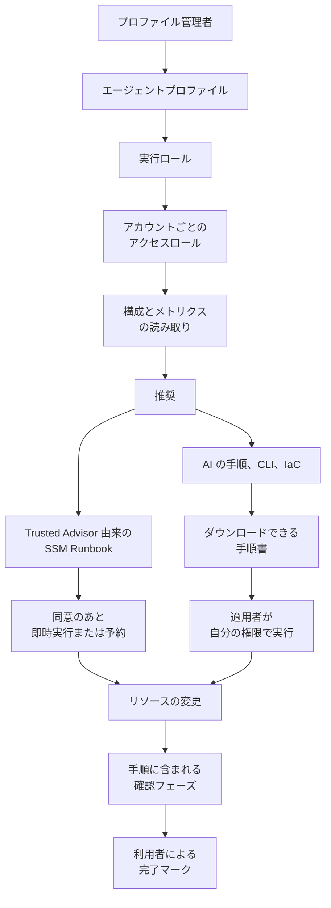

AWS Well-Architected Agent のパブリックプレビューで、プロファイルが何を監視し、推奨がどの層で返り、リソース ID がどの面に載り、スキャン用ロールと変更の経路がどこで分かれるかを追えます。記述は 2026年10月2日に確認した公式文書に基づきます。

*この記事の全体像。以下、順に解説します。*

## AWS Well-Architected Agentとは

AWS Well-Architected Agent（以下、AWS WA Agent）は、2026年10月1日にパブリックプレビューになったクラウド最適化サービスです。AWS Support が提供し、AWS Well-Architected コンソールと `wellarchitected` API から使います。

利用者は、エージェントプロファイルで監視アカウント、リージョン、最適化の柱、業務目標を定義します。サービスは、リソース、アプリケーション、アーキテクチャの 3 層で推奨を返します。出所に応じて、SSM Runbook または guided actions が付く場合があります。ユーザーガイドの製品説明では、分析の柱はコスト、セキュリティ、レジリエンス、性能の 4 つです。

### プロファイルが監視の単位になる

プロファイルが監視の単位です。1 プロファイルの上限は 100 アカウント、有効な業務目標は 10 個です。プロファイルのホストリージョンは us-east-1、us-east-2、us-west-2 です。スキャン対象は商用リージョン全体と書かれています。

ユーザーガイドの資格表では、使えるプランは Business+、Enterprise On-Ramp、Enterprise Support、Unified Operations です。Developer と Business の行は Access = No です。Business+ はプロファイル 2、アプリケーション 7 です。上位 3 ティアはプロファイル 10、アプリケーション 30 です。

リソース推奨とアプリケーション推奨は、スケジュールで生成されます。Getting started、API quickstart、troubleshooting は、初回をセットアップ完了から 48 時間以内と書いています。1 回の生成の上限は 30 件です。保存総数の上限は無い、とクォータ表が書いています。

アーキテクチャ推奨は、IaC のオンデマンドレビューです。回数は 1 プロファイルあたり 1 日 5 回です。zip は 25 MB、S3 フォルダは 100 MB、フォルダ内の個別ファイルは 1 MB です。

アプリケーションコンテキストが 1 件も無いプロファイルは、`eligibleForScheduledGeneration` が false になります。そのプロファイルでは、スケジュール生成が走りません。

### 推奨の詳細と取り込むシグナル

推奨の詳細画面は、影響を受けたリソースの表を出します。列は ARN、サービス、アカウント、リージョンです。ARN を選ぶと、そのリソースのコンソールへ移動する、と View ページが書いています。

API の `list-agent-recommendation-items` は、項目種別 `AWS_RESOURCE` と `RECOMMENDATION` を返します。各項目の `metadata` は document 型です。生成時点のスナップショットと説明されています。

関連シグナルの取り込み先として、ユーザーガイドは次を挙げています。Trusted Advisor、Compute Optimizer、Security Hub CSPM、Resilience Hub、Cost Optimization Hub、Cost Explorer、Well-Architected Tool、Systems Manager です。

Cost Explorer とリソース単位の日次データが無いとき、コストは公開価格からの見積もりになります。コンソールの Cost Explorer 利用自体は無料です。API リクエストと granular data には別料金がかかる、と Getting started が書いています。

ユーザーガイド PDF の Data handling and privacy は、リソースのテレメトリ、利用パターン、構成を分析する、と書いています。同じ節は、S3 オブジェクトやデータベースレコードの中身にはアクセスしない、と書いています。

News Blog は、対象を 65 を超える AWS サービスと書いています。

### 修正の経路は2系統ある

Trusted Advisor 由来の推奨には、事前に用意された SSM Runbook が付きます。同意のうえで one-click 実行するか、時刻を指定して繰り返し実行します。

AI が生成したリソース、アプリケーション、アーキテクチャの手順は guided actions です。渡し方は、コンソール手順、CLI、SDK、更新済み IaC です。implement ページは、AI 生成の手順を AWS WA Agent が代わりに実行しない、と書いています。

### スキャン用のIAMは2段である

スキャン用の IAM は 2 段です。プロファイルと同じアカウントの execution role を、`wellarchitected.amazonaws.com` が引き受けます。そのロールが、各アカウントの access role を `sts:AssumeRole` します。access role には、マネージドポリシー `WellArchitectedAgentResourceScanning` が推奨されます。concepts ページは、どちらのロールもリソース変更の権限をエージェントに与えない、と書いています。

このポリシーの公式ページは version v2 です。作成は 2026-07-16 20:27 UTC、編集は 2026-09-30 18:37 UTC です。2026-10-02 に確認した JSON では、アクション文字列が 1,121 件、ユニークで 1,119 件です。Get、List、Describe などの参照接頭辞に当てはまらなかったのは、`gamelift:ValidateMatchmakingRuleSet` と `cloudformation:BatchDescribeTypeConfigurations` の 2 件です。

### 診断から変更までの流れ

診断の入口はプロファイルです。スキャンは、execution role から access role への引き受けです。読み取り結果が推奨になります。推奨の出どころが Trusted Advisor のときは、SSM Runbook が変更の経路になります。出どころが AI のときは、手順書が変更の経路になります。実行者は、手順を手元で動かす人です。

コンソールの共有には Read only と Read/write があります。Read/write の受け手は、remediation の開始と完了マークができる、と View ページが書いています。

## 注意点

発表文、ユーザーガイド、Service Quotas、CLI 制約が、同じ項目を別の数で書いています。項目ごとに、どちらがどの文書の数かを並べて読みます。

| 項目 | 文書 A | 文書 B |
| --- | --- | --- |
| 誰が使えるか | What's New と News Blog は AWS Support plan の顧客と書く | ユーザーガイドは Business+ 以上。Developer と Business は Access = No |
| 初回までの時間 | News Blog はプロファイル作成後 24 時間以内 | Getting started、API quickstart、troubleshooting は 48 時間以内、または最大 48 時間 |
| その後の周期 | agent-rec-management はおよそ 24 時間ごと。クォータの cooldown は 24 時間 | What is と refresh ページは weekly。refresh はリソースとアプリケーションのオンデマンド生成をしない、と書く |
| プロファイル数 | ユーザーガイドは Business+ で 2、上位で 10 | Service Quotas の Profiles per account は各リージョン 0、Adjustable = No |
| アプリケーション数 | ユーザーガイドは Business+ で 7、上位で 30 | Service Quotas の Applications per profile は各リージョン 0、Adjustable = No |
| アーキテクチャレビュー | ユーザーガイドは 1 日 5 回、プロファイル単位 | Service Quotas は 1 日 5 回、アカウント単位 |
| 分析の柱 | 製品説明は 4 柱 | CreateAgentProfile の Valid Values は 5 値で `OPERATIONAL_EXCELLENCE` を含む。配列の最大は 5 |
| 推奨 ARN の形 | CLI 2.37.7 の制約は `agent-recommendation/` に UUID | ユーザーガイドの CLI 例は `agent-profile/.../recommendation/rec-id`。Service Authorization Reference の資源型は `agent-recommendation/${ResourceId}` |
| サービスリンクロール | security-iam-agent は顧客管理ロールでありサービスリンクロールではない、と書く。IAM 機能表は Service roles = No、Service-linked roles = No | `WellArchitectedConsoleFullAccess` は `iam:CreateServiceLinkedRole` の条件に `agent.wellarchitected.amazonaws.com` を含む。`AWSWellArchitectedAgentResourceScanningServiceRolePolicy` はサービスリンクロール用ポリシーとして公開されている |
| 人手の支援 | implement ページは Premier Support プランで human-in-the-loop 支援があると書く | クォータの資格表に Premier の行は無い |

次の言い方は、その文が載っている文書の範囲を超えます。

- 「65 を超えるサービス」は News Blog の文です。ユーザーガイドが公開しているのは、非対応 CloudFormation タイプの表です。65 の内訳リストは、確認した文書にはありません。
- View ページの "Up to 99% KMS cost reduction" は、画面説明の例文です。顧客計測の結果としては、確認した文書にありません。
- Well-Architected Tool の料金ページは "There is no additional charge for the AWS Well-Architected Tool" と書いています。主語は Tool です。Agent の単価、無料枠、GA 時の価格は、2026-10-02 の確認では公式料金ページとして見つかっていません。
- What's New の "next-gen evolution of AWS Trusted Advisor and the AWS Well-Architected Tool" は、発表の位置づけです。ユーザーガイドは、Trusted Advisor の所見を取り込み、Tool の手作業レビューと併用できる、と書いています。
- スキャンポリシーの説明は read-only です。concepts は、access role を利用者が望むアクションだけに絞れる、とも書いています。推奨ポリシーが参照系であることと、顧客が書き込みを足せることが、同時に文書にあります。
- `WellArchitectedConsoleFullAccess` はスキャンロールではありません。このポリシーは `wellarchitected:*` を `Resource` `"*"` で許し、`iam:PassRole` の `iam:PassedToService` に `wellarchitected.amazonaws.com` と `agent.wellarchitected.amazonaws.com` を含みます。execution role の信頼先としてユーザーガイドが書くプリンシパルは `wellarchitected.amazonaws.com` です。
- 完了は `update-agent-recommendation-status --status COMPLETED` です。refresh ページは、タイムスタンプが内容不変でも更新される、と書いています。新しいタイムスタンプを修正成功の証拠にする記述は、確認したページにありません。
- 公開 CLI 例のアカウント `111122223333` と `rec-id` はプレースホルダです。顧客の実リソース ID のサンプルは、確認した HTML にはありません。
- application 推奨は beta と、What is と Recommendations の両方が書いています。SOP は生成 AI で、誤りや欠落がありうる、と implement ページが書いています。News Blog も、生成 AI の推奨に誤りや欠落がありうること、評価と安全策は利用者の責任であること、を併記しています。
- HTML の data-protection.html の "How AWS uses your data" は、Well-Architected Tool のワークロード属性を列挙します。列挙されているのは、名前、所有者、環境、リージョン、アカウント ID、業種です。Agent のテレメトリとデータストア中身の文は、ユーザーガイド PDF の Data handling and privacy にあります。
- 同じ PDF 節は、マネージドポリシーの権限を Get\*、List\*、Describe\* の read-only に限り、リソースの作成、変更、削除はできない、と書いています。v2 の JSON では、その 3 接頭辞の外に `gamelift:ValidateMatchmakingRuleSet` と `cloudformation:BatchDescribeTypeConfigurations` があります。Create、Put、Delete、Update、Start の接頭辞は、その JSON にはありません。

次の点は、2026年10月2日の公式文書では閉じていません。

- SSM の one-click と preschedule が使う IAM ロールの名前と、スキャンロールとの関係。
- `metadata` ドキュメントの実キー。コンソール表の ARN と一致するか。
- スケジュールの実周期。24 時間、48 時間、weekly のどれを運用カレンダーに載せるか。
- Service Quotas の 0 と、ユーザーガイドのティア別上限のどちらがコンソールの実挙動か。
- Agent 自体の追加料金。
- スキャンの AssumeRole 主体が `wellarchitected.amazonaws.com` か `agent.wellarchitected.amazonaws.com` か、サービスリンクロールか。
- 構成とテレメトリが、アカウント外のモデルへ送られるかどうか。ユーザーガイド PDF は、オブジェクト本文と DB レコードの中身にはアクセスしない、と書いています。送信先がアカウント外かは、その文にはありません。
- `OPERATIONAL_EXCELLENCE` をプロファイルに渡したときの挙動。製品説明の 4 柱との関係。

## 推奨に載るリソースIDの読み方

変更チケットのリソース欄に写す前に、どの面が構造化されていて、どの面が生成文かを分けます。

| 面 | 公式が書く中身 | 機械処理に使うときの条件 |
| --- | --- | --- |
| コンソールの Affected resources | ARN、サービス、アカウント、リージョンの表 | 画面の列として文書化されている |
| Insights の signals | 特定リソースの ARN と構成状態を参照する、と View が書く | 文章中の ARN |
| SOP のフェーズ | 実リソース名と ARN を参照する。バケットが 4 つならフェーズも分かれる、と implement が書く | 生成文。誤り得る、と同じページが書く |
| `get-agent-recommendation` | `numberOfResources`、`awsServices`、`applications`。個別 ARN の配列フィールドは CLI 出力に無い | 件数とサービス名までが構造化フィールド |
| `list-agent-recommendation-items` | `id` と document 型 `metadata` | ARN のキー名は CLI リファレンスに無い |
| remediation の `steps[].content` | 80 文字以上 8000 文字以下の文字列。コード例と確認リストを含められる | 自由文 |
| `resourceLinks` | 外部 URL と任意の title | リソース ARN のフィールドとしては書かれていない |
| ユーザーガイドの CLI 例 | `agent-profile/.../recommendation/rec-id` | CLI 制約の `agent-recommendation/{uuid}` と一致しない |

変更チケットのリソース欄に使う値は、コンソール表の ARN か、自分のアカウントで見た `metadata` の実キーです。ガイドの例 ARN は、実行入力にしません。

非対応タイプは分析対象外です。リソースレベル推奨にも入りません。クォータページがそう書いています。例は `AWS::OpenSearchService::Domain`、`AWS::WAFv2::WebACL`、`AWS::IAM::RolePolicy`、`AWS::ElasticLoadBalancingV2::ListenerRule` です。表はこれより長いです。

## 誰の権限で診断し、誰の権限で変えるか

主体ごとに、公式が名前を書いている権限が違います。変更チケットに渡す権限は、この表の行を混ぜずに選びます。

| 主体 | 公式が名前を書く権限 | 変更チケットとの関係 |
| --- | --- | --- |
| プロファイル管理者 | `wellarchitected:CreateAgentProfile`、`iam:CreateRole`、`iam:AttachRolePolicy`、`iam:PassRole` | 診断の入口を開く。コンソール用 FullAccess は上記より広い |
| 推奨の利用者 | `ListAgentRecommendations`、`GetAgentRecommendation`、ステータス更新 | 採否と完了マーク。Read/write 共有では remediation 開始も含まれる |
| execution role | access role への `sts:AssumeRole`。信頼先は `wellarchitected.amazonaws.com` | スキャンのオーケストレーション |
| access role | 推奨は `WellArchitectedAgentResourceScanning`。代替として利用者がアクションを選ぶ | 診断の読み取り。適用ロールとして文書は推奨していない |
| SSM の実行主体 | Agent の implement ページと preschedule ページにロール名は無い | 同意後の変更経路。主体は未記載 |
| AI 手順の実行者 | 手順を動かす人のコンソール、CLI、SDK の権限 | チケットを実行する人 |
| サービス API | Service Authorization Reference の Agent 関連に Apply と Execute のアクション名は、確認した列挙範囲では無かった。生成開始は `wellarchitected:StartAgentRecommendationGeneration` | 推奨オブジェクトの操作と、リソース変更 API は別 |

SSM 一般の文書は、Automation の assume role を指定しない実行は、呼び出しユーザーの権限で走る、と書いています。State Manager で Automation を定期実行するときは、`AutomationAssumeRole` が必須、とも書いています。Agent の preschedule が State Manager の関連付けであるかは、Agent のページに書かれていません。`AmazonSSMAutomationRole` は、SSM が挙げる広いマネージドポリシーです。Agent がそのポリシーを付けるとは書かれていません。

## Well-Architected Tool、Trusted Advisor、Configとの違い

同じ「推奨のあとで直す」でも、入力、出力、誰がリソースを変えるかが違います。

| 基準 | Well-Architected Tool | Trusted Advisor 由来の SSM | AI の guided actions | AWS Config の修復 |
| --- | --- | --- | --- | --- |
| 入力 | 人がレンズと質問に答える | 既存チェックの所見を Agent が取り込む | スキャンと目標、または IaC | Config ルールの非準拠 |
| 出力 | レビュー結果 | Runbook。one-click または予約 | 手順、CLI、SDK、IaC | SSM ドキュメントの関連付け |
| 誰がリソースを変えるか | レビュー自体は変更しない | 同意後の Runbook 実行。主体の IAM は Agent 文書に無い | 手順を実行する人。Agent は実行しない、と implement が書く | Config に関連付けた Automation |
| リソース ID | ワークロード ARN | 推奨の影響リソース表と、Runbook の対象 | SOP 本文と影響リソース表 | `ResourceKeys` の resourceId |
| 適用後の印 | マイルストーン | 利用者の COMPLETED | 利用者の COMPLETED。再発時は次周期で新しい推奨 | 修復実行の結果 |

Config の `StartRemediationExecution` は Config の API です。Well-Architected Agent の API 名としては、確認した Service Authorization の列挙にありません。

## 運用では4つの役に分ける

AI が書いた手順は、変更チケットの下書きとして扱います。この分け方は、implement ページの文言と一致します。implement ページは、AI 生成手順をエージェントが実行しないと書き、SOP のダウンロード用途に変更管理チケットへの添付を含めています。

スキャン用の execution role と access role は、診断の読み取りに残します。concepts ページは、この 2 つのロールが変更権限を与えない、と書いています。スキャン用ポリシー v2 のアクションは、参照系が中心です。View ページは、影響リソースを ARN、アカウント、リージョンの表として書いています。管理者、閲覧者、スキャンロールの権限例は、access model と Getting started で分かれています。

Trusted Advisor 由来の SSM は、同意のあとリソースを変える別経路です。実行ロールは、アカウント側で表示を確認してから渡します。preschedule ページは、所定時刻の Runbook 適用を manual intervention なしと書いています。one-click は、同意のうえでエージェントが代わりに起動できる、と implement が書いています。`AUTO_REMEDIATION` は、remediation type の値です。その変更権限のロール名は、2026年10月2日の Agent 文書では未定義です。

同じ文書が、この分け方に次の限定を残しています。

- concepts は、access role の権限を利用者が選んだアクションにできる、と書いています。read-only は推奨です。製品が書き込みの付与を拒否するとは書かれていません。
- コンソール FullAccess とサービスリンクロール用ポリシーは、スキャン用 2 ロールの説明と並立したまま公開されています。現在のスキャンがどちらを使うかは未確認です。
- item の `metadata` に ARN のキー名がありません。ガイドの推奨 ARN 例は、CLI の pattern と一致しません。SOP は誤り得ます。
- 1 回の生成は最大 30 件です。非対応タイプは表に出ません。application は beta です。
- 完了マークと Not Useful による suppress は、利用者の操作です。Read/write 共有は、採否と適用開始を同じ受け手に渡せます。

運用では、次の 4 役に分けます。

1. 採否役は、推奨を読み、抑止するか残すかを決めます。Read/write 共有の受け手が remediation を開始できる、という記述は、適用役へ権限を渡した記録としては使いません。
2. 適用役は 2 種類に分けます。AI の手順、CLI、IaC は変更チケットの本文です。適用役が自分の権限で実行します。Trusted Advisor 由来の SSM は、同意ボタンのあと変更が起きる経路です。Systems Manager 側に表示された Automation ロールを読んでから、そのロールだけを適用役に渡します。
3. スキャン用の execution role と access role は、診断役のままにします。`WellArchitectedAgentResourceScanning` は、スキャン用 access role に残します。access role へ書き込みアクションを足す代替手順は、診断と変更の分離を崩す変更として、別承認にします。
4. 確認役は、手順の確認フェーズと、次の生成で同じ条件が残っているかを見ます。`COMPLETED` は作業記録のステータスとして残します。確認役の合格印には使いません。周期の記述が割れているので、確認期限は自前の変更チケットで決めます。閉じるまでは、適用後の確認を「翌日の再スキャンが証明する」とは書きません。

試す資格の説明は、ユーザーガイドの Business+ 以上を使います。What's New の "an AWS Support plan" は、その表より広いです。

境界を書き直す条件は 2 つです。公式が、SSM 実行ロールをスキャンロールと同一だと明記した場合です。公式が、AI 手順の自動実行を既定にした場合です。Service Quotas の 0 が実アカウントでプロファイル作成を拒否するなら、プレビューの利用可否自体を先に疑います。

直近の確認は 3 つです。

1. Business+ 以上のアカウントでプロファイルを 1 つ作り、`list-agent-recommendation-items` の `metadata` に ARN 相当のキーがあるかを 1 件見ます。
2. Trusted Advisor 由来の推奨では、Execute の前に Runbook の assume role を控えます。この確認では Runbook を実行しません。
3. ガイド例の `agent-profile/.../recommendation/rec-id` は CLI に渡しません。API が返した `agent-recommendation/{uuid}` を使います。

## まとめ

AWS WA Agent のプレビューは、プロファイルを入口に、リソース、アプリケーション、アーキテクチャの推奨を返します。AI の手順は、手元で実行する手順書です。Trusted Advisor 由来の SSM は、同意のあと変更が起きる別経路です。スキャン用ロールは診断の読み取りに残し、適用役には表示された Automation ロールだけを渡します。文書間で数が割れている項目は 1 つに揃えず、確認期限は変更チケット側で持ちます。

この記事が少しでも参考になった、あるいは改善点などがあれば、ぜひリアクションやコメント、SNSでのシェアをいただけると励みになります！

## 参考リンク

- [News Blog（2026-10-01）](https://aws.amazon.com/blogs/aws/announcing-aws-well-architected-agent-an-ai-powered-intelligence-to-optimize-your-cloud-environment-preview/)
- [What's New（2026-10-01）](https://aws.amazon.com/about-aws/whats-new/2026/10/aws-well-architected-agent/)
- [What is AWS Well-Architected Agent](https://docs.aws.amazon.com/wellarchitected/latest/userguide/agent.html)
- [Concepts](https://docs.aws.amazon.com/wellarchitected/latest/userguide/agent-concepts.html)
- [Access model](https://docs.aws.amazon.com/wellarchitected/latest/userguide/security-iam-agent.html)
- [Getting started](https://docs.aws.amazon.com/wellarchitected/latest/userguide/agent-getting-started.html)
- [Quotas](https://docs.aws.amazon.com/wellarchitected/latest/userguide/agent-quotas.html)
- [Related services](https://docs.aws.amazon.com/wellarchitected/latest/userguide/agent-related-services.html)
- [Recommendations](https://docs.aws.amazon.com/wellarchitected/latest/userguide/agent-rec-management.html)
- [Refresh](https://docs.aws.amazon.com/wellarchitected/latest/userguide/agent-refresh-cadence.html)
- [View](https://docs.aws.amazon.com/wellarchitected/latest/userguide/agent-view-rec.html)
- [Implement](https://docs.aws.amazon.com/wellarchitected/latest/userguide/agent-implement-rec.html)
- [Prescheduled remediations](https://docs.aws.amazon.com/wellarchitected/latest/userguide/agent-prescheduled-rec.html)
- [API quickstart](https://docs.aws.amazon.com/wellarchitected/latest/userguide/agent-api-quickstart.html)
- [Troubleshooting](https://docs.aws.amazon.com/wellarchitected/latest/userguide/agent-troubleshooting.html)
- [Data protection（HTML。Tool のワークロード属性）](https://docs.aws.amazon.com/wellarchitected/latest/userguide/data-protection.html)
- [User Guide PDF（Data handling and privacy）](https://docs.aws.amazon.com/pdfs/wellarchitected/latest/userguide/wellarchitected-ug.pdf)
- [Service endpoints and quotas](https://docs.aws.amazon.com/general/latest/gr/wellarchitected.html)
- [CLI get-agent-recommendation（2.37.7）](https://docs.aws.amazon.com/cli/latest/reference/wellarchitected/get-agent-recommendation.html)
- [CLI list-agent-recommendation-items](https://docs.aws.amazon.com/cli/latest/reference/wellarchitected/list-agent-recommendation-items.html)
- [CreateAgentProfile API](https://docs.aws.amazon.com/wellarchitected/latest/APIReference/API_CreateAgentProfile.html)
- [Service Authorization Reference](https://docs.aws.amazon.com/service-authorization/latest/reference/list_wellarchitected.html)
- [WellArchitectedAgentResourceScanning](https://docs.aws.amazon.com/aws-managed-policy/latest/reference/WellArchitectedAgentResourceScanning.html)
- [AWSWellArchitectedAgentResourceScanningServiceRolePolicy](https://docs.aws.amazon.com/aws-managed-policy/latest/reference/AWSWellArchitectedAgentResourceScanningServiceRolePolicy.html)
- [WellArchitectedConsoleFullAccess](https://docs.aws.amazon.com/aws-managed-policy/latest/reference/WellArchitectedConsoleFullAccess.html)
- [Well-Architected Tool pricing](https://aws.amazon.com/well-architected-tool/pricing/)
- [IAM feature table](https://docs.aws.amazon.com/wellarchitected/latest/userguide/security_iam_service-with-iam.html)
