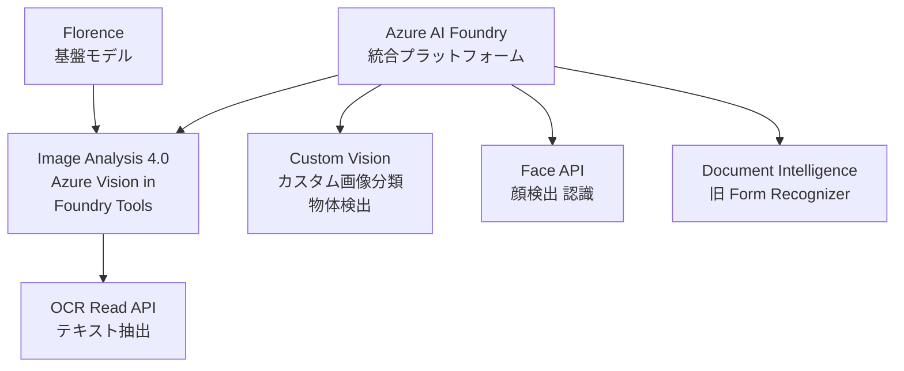
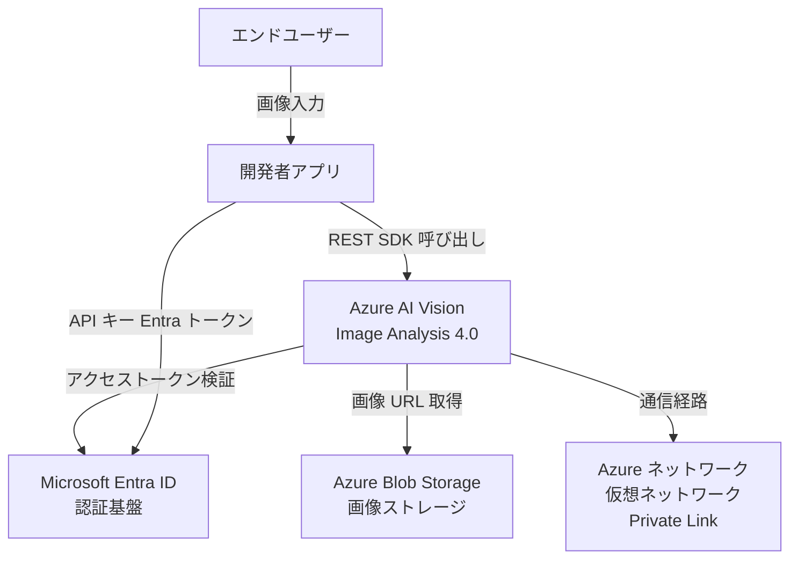
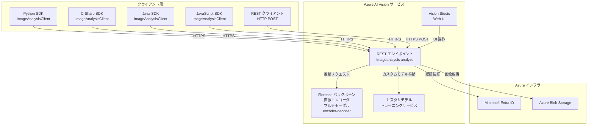
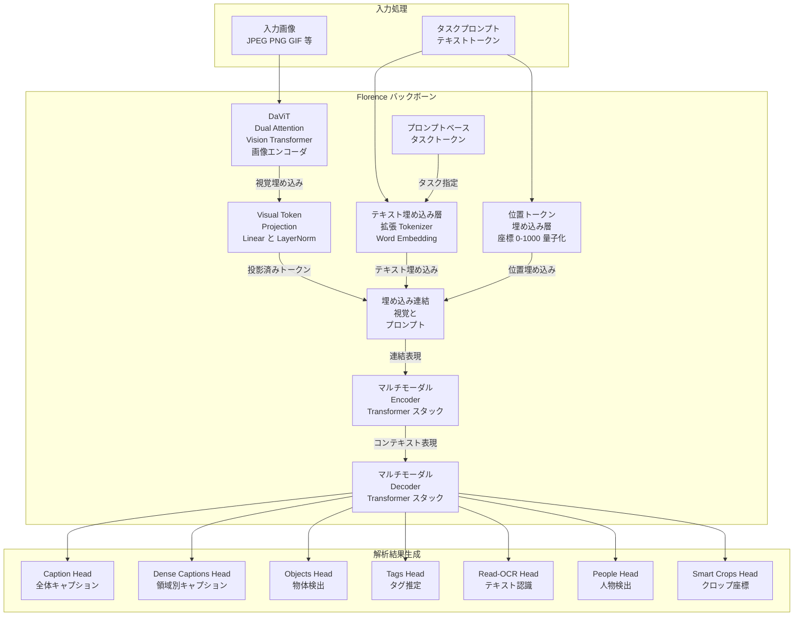
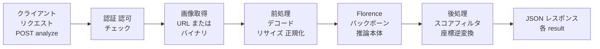
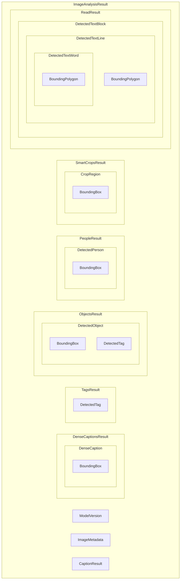
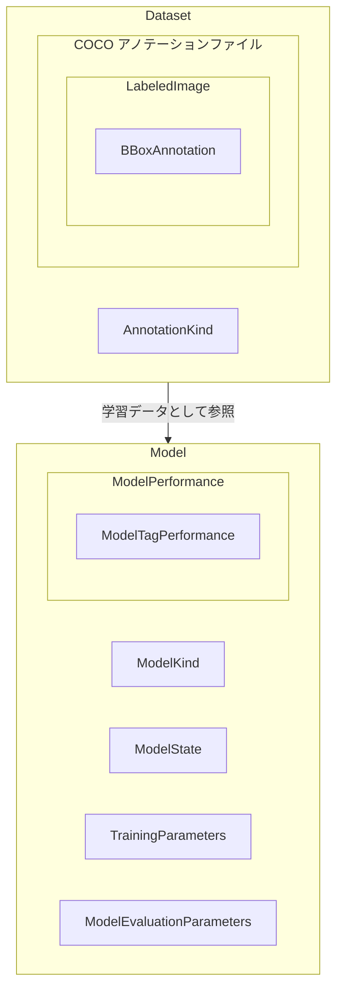
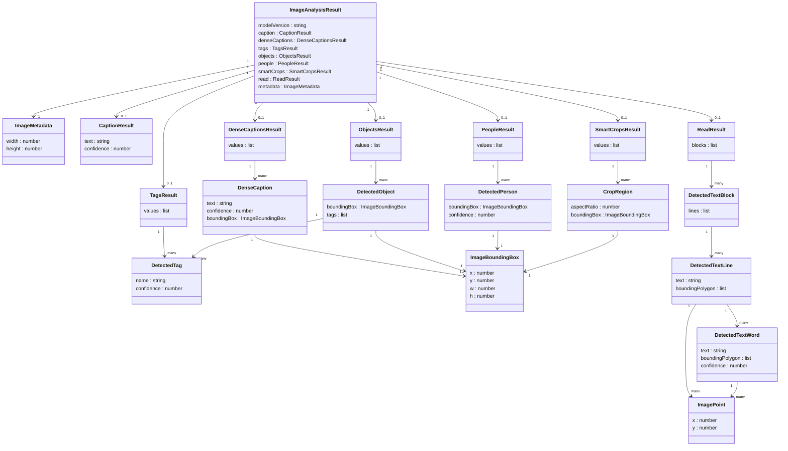
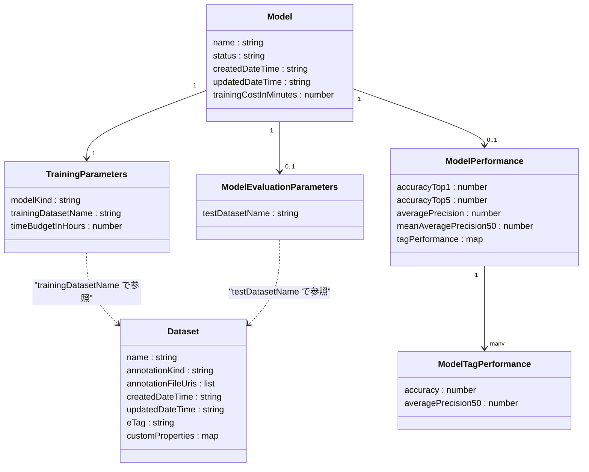

> 対象: Microsoft の Florence foundation model を基盤とする Azure AI Vision の Image Analysis 4.0（現名称 Azure Vision in Foundry Tools）
> 調査日: 2026-06-09

## ■概要

Florence は Microsoft Research が開発したコンピュータビジョン向けの基盤モデル（foundation model）です。単一モデルで複数の視覚タスクを処理する「マルチタスク統一モデル」として設計されています。

バージョンの変遷は次のとおりです。

| バージョン | 発表時期 | 位置づけ |
|---|---|---|
| Florence v1.0 | 2021年 | 研究発表。Transformer ベースのデュアルエンコーダ構成。Unified Contrastive Learning で事前学習 |
| Florence-2 | 2023年11月 | 論文発表（arXiv:2311.06242）。Seq2Seq 構成に刷新。FLD-5B（126M 枚・54億アノテーション）で訓練。プロンプト入力で単一モデルがキャプション・検出・セグメンテーション・OCR を横断処理 |

Florence v1.0 は階層型 Vision Transformer の画像エンコーダと Unified Contrastive Learning（UniCL）による画像-テキスト対照学習を採用しました。Florence-2 ではこれを seq2seq の単一モデルに統合し、タスク切り替えを「プロンプト切り替え」で表現する方式へ移行しました。

Microsoft は Image Analysis 4.0 を「Florence foundation model を基盤とする」と説明しています。Florence-2 はこの系譜を公開研究モデルとして実装したもので、本調査の構造・データの記述は公開された Florence-2 の論文・実装に基づきます。Azure がホストする本番モデルの正確なチェックポイントは非公開です。

### Azure サービスとしての位置づけ

Florence モデルは Azure AI Vision（旧称 Azure Cognitive Services Computer Vision）の Image Analysis 4.0 に統合されています。2023年3月に SDK パブリックプレビューとして統合が発表され、その後 GA となりました。

Analyze Image 4.0 の REST API は 2023年11月に GA となり、Python SDK（`azure-ai-vision-imageanalysis` 1.0.0）は 2024年10月に GA となりました。現行のサービス名は **Azure Vision in Foundry Tools** です。ただし Image Analysis 4.0 自体は 2028年9月25日に廃止予定であり、Microsoft は後継サービスへの移行を推奨しています。

### 関連サービスとの関係



#### Azure Vision in Foundry Tools 内のサービス

| 要素名 | 説明 |
|---|---|
| Florence 基盤モデル | Image Analysis 4.0 のコアモデル。Microsoft の Florence foundation model（公開研究モデル Florence-2 と同系譜。本番チェックポイントは非公開） |
| Image Analysis 4.0 | キャプション・タグ・物体検出・OCR・スマートクロップ・マルチモーダル埋め込みを単一 API で提供 |
| OCR Read API | 印刷・手書きテキスト抽出に特化した API。多言語に対応 |

#### Azure AI Foundry 傘下のサービス

| 要素名 | 説明 |
|---|---|
| Azure AI Foundry | Azure AI Vision / Face / Document Intelligence 等を統括するプラットフォーム |
| Custom Vision | ユーザー独自の画像分類・物体検出モデルを学習するサービス。Image Analysis 4.0 のカスタムモデル機能廃止後の後継推奨先 |
| Face API | 顔検出・識別・感情分析に特化した専用サービス |
| Document Intelligence | 請求書・フォーム等のドキュメント構造解析。OCR を超えた構造理解に対応 |

## ■特徴

### マルチタスク統一モデル

- 単一の Florence-2 モデルがキャプション・物体検出・OCR・セグメンテーションを横断処理します。
- プロンプト（テキスト指示）でタスクを切り替えるため、タスクごとに別モデルを用意する必要がありません。
- 1回の API 呼び出し（`features` パラメータにカンマ区切り）で複数機能を同時取得できます。

### 高精度キャプション生成（Caption / Dense Captions）

- **Caption**: 画像全体を1文の自然言語で説明します。v4.0 では「人間同等のパリティ精度」と公式が述べています。
- **Dense Captions**: 画像内の最大10領域それぞれに詳細な1文キャプションとバウンディングボックス座標を返します。
- ジェンダーニュートラルパラメータに対応し、alt-text や Seeing AI 用途で性別推測を制御できます。

### マルチモーダル埋め込み（Vectorize）

- 画像とテキストを同一の 1024 次元ベクトル空間にマッピングします。
- テキストクエリで画像を検索するセマンティック検索を、タグや追加メタデータなしで実現します。
- `2024-02-01` API のモデルは102言語のテキスト検索に対応しています。
- コサイン距離・ユークリッド距離でベクトル類似度を計算します。

### 統合 OCR（Read）

- 画像とドキュメント画像の印刷・手書きテキストを抽出します。
- v4.0 では他の視覚機能と同一リクエストに混在できます（v3.2 の非同期 Read とは設計が異なります）。
- 返却構造は `blocks > lines > words` の階層 JSON です。

### 物体検出とタグ付け

- **Object detection**: 物体のバウンディングボックス座標と信頼スコアを返します。タグ名は英語のみです。
- **Tags**: 多数のカテゴリから画像内容を示すタグ列を返します。`language` パラメータで言語を指定できます。

### スマートクロップ（Smart Crop）

- 指定アスペクト比で関心領域を保持したクロップ矩形座標を返します。
- サムネイル生成・メディアコンテンツ最適化に利用します。

### 人物検出

- 画像内の人物のバウンディングボックス座標と信頼スコアを返します。
- 顔識別は行わず、位置検出のみです（顔識別は Face API が担当）。

### 廃止済み機能（参照用）

以下の機能は 2025年3月31日に廃止されました。

| 機能 | 後継推奨 |
|---|---|
| Background Removal（背景除去） | Florence-2 OSS モデルのセグメンテーション機能、または BiRefNet |
| Model Customization（カスタムモデル） | Azure AI Custom Vision |
| Product Recognition（商品認識） | Azure AI Custom Vision |

> 参照用: Background Removal は `POST /computervision/imageanalysis:segment?api-version=2023-02-01-preview&mode=backgroundRemoval`（または `mode=foregroundMatting`）で呼び出し、`image/png` のマスク適用済み画像を返す preview 機能でした。2025-03-31 に退役済みのため現在は呼び出せません。

### 類似サービスとの比較

| 比較項目 | Azure AI Vision Image Analysis 4.0 | Google Cloud Vision API | Amazon Rekognition |
|---|---|---|---|
| 基盤モデル | Florence foundation model（公開 Florence-2 系譜。Microsoft Research 製）| 非公開（Google 独自モデル） | 非公開（AWS 独自モデル） |
| キャプション生成 | あり（Caption / Dense Captions） | なし | なし |
| マルチモーダル埋め込み | あり（102言語） | なし | なし |
| OCR | 統合 OCR（Read）。多言語 | Text Detection / Document Text Detection | DetectText（基本的なテキスト検出） |
| OCR 精度の方向性 | 一般画像の手書き・印刷テキストに強い | ドキュメント・混合言語 OCR に強い | 基本的なシーンテキスト検出向け |
| 物体検出 | あり | Object Localization | DetectLabels / DetectObjects |
| 顔検出 | あり（位置のみ。識別は Face API） | Facial Detection | DetectFaces（感情・年齢推定も含む） |
| カスタムモデル対応 | Custom Vision（別サービス）に委譲 | AutoML Vision（別サービス） | Custom Labels |
| ランドマーク・有名人検出 | v3.2 のみ（v4.0 は非対応） | Landmark / Celebrity Recognition | セレブ認識は別途 |
| 料金体系（目安） | 約 $1.00 / 1,000 transactions | $1.50 / 1,000 ユニット（～500万） | $1.00 / 1,000 画像（初回100万） |
| 無料枠 | あり（F0 ティア） | 1,000 ユニット / 月 | 1,000 画像 / 月（12ヶ月） |
| エコシステム統合 | Azure AI Foundry / AI Search / Power Platform | Google Cloud / Vertex AI | AWS S3 / Lambda / Kinesis |

### ユースケース別推奨

| ユースケース | 推奨サービス | 理由 |
|---|---|---|
| 画像への自然言語キャプション自動付与 | Azure AI Vision | Dense Captions が統合機能として提供 |
| テキスト検索による画像ライブラリ検索 | Azure AI Vision | マルチモーダル埋め込みで102言語のセマンティック検索が可能 |
| 請求書・フォーム等の複雑ドキュメント OCR | Azure Document Intelligence または Google Cloud Vision | 混合言語・レイアウト保持精度が高い |
| セキュリティ・監視での顔認識・感情分析 | Amazon Rekognition | 顔比較・感情推定・動画ストリームを一体で提供 |
| Azure 環境への統合（Cognitive Search 等） | Azure AI Vision | Azure AI Search との直接統合でインデックス構築が容易 |
| 小売・EC での商品画像類似検索 | Azure AI Vision（マルチモーダル埋め込み） | ベクトル空間での視覚的類似検索に対応 |
| 動画コンテンツの一括ラベリング | Amazon Rekognition Video | 動画向け API が同一サービス内に統合されている |

## ■構造

### ●システムコンテキスト図



| 要素名 | 説明 |
|---|---|
| 開発者アプリ | Azure AI Vision を呼び出すクライアントアプリケーション。REST または SDK 経由でリクエストを送る |
| エンドユーザー | 開発者アプリを通じて画像解析結果を受け取る最終利用者 |
| Azure AI Vision Image Analysis 4.0 | Florence foundation model を基盤とした画像解析マネージドサービス。本調査対象 |
| Microsoft Entra ID | API キーまたは Entra トークンによる認証・認可を担う Azure の ID 基盤 |
| Azure Blob Storage | 解析対象画像を URL 経由で取得するためのオブジェクトストレージ |
| Azure ネットワーク | 仮想ネットワーク・Private Link によるセキュアな通信経路 |

### ●コンテナ図



#### コンテナ図 — クライアント層

| 要素名 | 説明 |
|---|---|
| Python SDK ImageAnalysisClient | `azure-ai-vision-imageanalysis` パッケージのクライアント。`analyze` / `analyze_from_url` メソッドを提供 |
| C-Sharp SDK ImageAnalysisClient | .NET 向け SDK クライアント。NuGet パッケージとして配布 |
| Java SDK ImageAnalysisClient | Java / Android 向け SDK クライアント。Maven パッケージとして配布 |
| JavaScript SDK ImageAnalysisClient | Node.js / ブラウザ向け SDK クライアント。npm パッケージとして配布 |
| REST クライアント | HTTP POST を直接送るネイティブクライアント。SDK 非依存 |

#### コンテナ図 — Azure AI Vision サービス

| 要素名 | 説明 |
|---|---|
| REST エンドポイント imageanalysis analyze | `POST /computervision/imageanalysis:analyze` を受け付けるサービス入口。`features` クエリパラメータで機能を選択する |
| Florence バックボーン | DaViT 画像エンコーダとマルチモーダル encoder-decoder から成る推論コア。各 visual feature の出力を生成する |
| カスタムモデルトレーニングサービス | ユーザー提供の画像とラベルからカスタム分類・物体検出モデルを訓練するサービス（v4.0 preview、退役済み） |
| Vision Studio Web UI | ブラウザから各機能を試験的に呼び出すためのノーコード GUI |

### ●コンポーネント図

> 以下の Florence バックボーン内部は、公開研究モデル Florence-2 の論文・実装に基づく構造です。Azure がホストする本番モデルの内部は非公開のため、推論パイプラインの一般的な構成として捉えてください。

#### Florence バックボーン内部



##### 入力処理

| 要素名 | 説明 |
|---|---|
| 入力画像 | REST エンドポイントが受け取る画像データ。URL 参照またはバイナリ直送に対応 |
| タスクプロンプト | 実行する visual feature を指示するテキスト形式のプロンプト。タスクトークンを含む |

##### Florence バックボーン

| 要素名 | 説明 |
|---|---|
| DaViT | Florence-2 の画像エンコーダ。デュアルアテンション機構（チャネルアテンション + ウィンドウアテンション）で画像を視覚埋め込みに変換する |
| Visual Token Projection | DaViT の出力をマルチモーダル encoder-decoder の次元に合わせる射影層。Linear + LayerNorm の 2 層構成 |
| テキスト埋め込み層 | BART ベースの拡張トークナイザと単語埋め込み層。標準テキストトークンに加えタスクトークンと位置トークンを扱う |
| 位置トークン埋め込み層 | バウンディングボックスやポリゴン座標を 0-1000 スケールで量子化した位置トークンを埋め込む層 |
| 埋め込み連結 | 視覚トークンとプロンプト埋め込みを連結する結合ステップ |
| マルチモーダル Encoder | 連結埋め込みを入力として受け取り、コンテキスト表現を生成する BART 準拠のエンコーダスタック |
| マルチモーダル Decoder | エンコーダのコンテキスト表現をもとにテキストおよび位置トークン列を自己回帰的に生成する BART 準拠のデコーダスタック |
| プロンプトベース タスクトークン | タスクを指示する特殊テキストトークン。アーキテクチャを変更せずにタスクを切り替える |

##### 解析結果生成（Feature Heads）

| 要素名 | 説明 |
|---|---|
| Caption Head | デコーダ出力から画像全体を説明する 1 文のキャプションを生成する |
| Dense Captions Head | 画像内の最大 10 領域それぞれについてキャプションとバウンディングボックスを生成する |
| Objects Head | 物体名とバウンディングボックス座標ペアを生成する物体検出ヘッド |
| Tags Head | 画像内容に関連するタグ名と信頼スコアの列を生成する |
| Read-OCR Head | 画像内の可視テキストを認識し、行・単語・バウンディングポリゴンの構造化 JSON を出力する |
| People Head | 人物のバウンディングボックスと信頼スコアを生成する人物検出ヘッド |
| Smart Crops Head | 指定アスペクト比に合わせた関心領域クロップ矩形座標を計算する |

#### REST エンドポイント内部パイプライン



| 要素名 | 説明 |
|---|---|
| クライアントリクエスト | `features` クエリパラメータで解析機能を指定した POST リクエスト |
| 認証・認可チェック | API キーまたは Microsoft Entra トークンを検証するゲートウェイ処理 |
| 画像取得 | `url` フィールドの URL から画像をダウンロードするか、`application/octet-stream` ボディから画像バイナリを受信する |
| 前処理 | 受信画像のデコード、モデル入力サイズへのリサイズ、ピクセル値の正規化を行う |
| Florence バックボーン | DaViT エンコーダとマルチモーダル encoder-decoder による推論本体。選択された features に対応するタスクトークンを使って推論する |
| 後処理 | モデル出力の信頼スコアフィルタリング、量子化座標から画素座標への逆変換、JSON 形式へのシリアライズを行う |
| JSON レスポンス | `captionResult` / `denseCaptionsResult` / `tagsResult` / `objectsResult` / `readResult` / `smartCropsResult` / `peopleResult` / `metadata` フィールドを含む構造化レスポンス |

## ■データ

### ●概念モデル

#### analyze レスポンス



| 要素名 | 説明 |
|---|---|
| ImageAnalysisResult | analyze API レスポンスのルートエンティティ |
| ModelVersion | 使用された AI モデルのバージョン識別子 |
| ImageMetadata | 画像の幅・高さ（ピクセル） |
| CaptionResult | 画像全体の 1 文キャプション + 信頼スコア |
| DenseCaptionsResult | 最大 10 領域のキャプション集合 |
| DenseCaption | 1 領域のキャプション・信頼スコア・位置矩形 |
| TagsResult | 画像に関連するタグの集合 |
| DetectedTag | タグ名 + 信頼スコア |
| ObjectsResult | 物体検出結果の集合 |
| DetectedObject | 検出物体の位置矩形 + タグ |
| PeopleResult | 人物検出結果の集合 |
| DetectedPerson | 検出人物の位置矩形 + 信頼スコア |
| SmartCropsResult | スマートクロップ候補の集合 |
| CropRegion | クロップ候補のアスペクト比 + 位置矩形 |
| ReadResult | OCR テキスト抽出結果（ブロック集合） |
| DetectedTextBlock | テキスト行の集合 |
| DetectedTextLine | テキスト行の文字列 + 境界ポリゴン |
| DetectedTextWord | 単語の文字列 + 境界ポリゴン + 信頼スコア |
| BoundingBox | 矩形領域（x, y, w, h） |
| BoundingPolygon | 4 頂点の座標配列（x, y ペアのリスト） |

#### カスタムモデル学習データ



| 要素名 | 説明 |
|---|---|
| Dataset | 学習・テスト用画像とアノテーションファイル群の登録エンティティ |
| AnnotationKind | アノテーション種別（imageClassification / imageObjectDetection） |
| COCO アノテーションファイル | COCO 形式の JSON アノテーションファイル（Azure Blob 上） |
| LabeledImage | アノテーション付き画像（COCO images + annotations エントリ） |
| BBoxAnnotation | 物体検出用の矩形アノテーション（COCO bbox フォーマット） |
| Model | カスタムモデルの学習実行エンティティ |
| ModelKind | モデル種別（Generic-Classifier / Generic-Detector / Product-Recognizer） |
| ModelState | 学習ステータス（notStarted / training / succeeded / failed 他） |
| TrainingParameters | 学習設定（データセット名・時間予算・ModelKind） |
| ModelPerformance | 学習済みモデルの性能指標集合 |
| ModelTagPerformance | タグ別の性能指標 |
| ModelEvaluationParameters | 評価に使用するテストデータセット名 |

### ●情報モデル

> 命名規約: 以下の classDiagram は SDK プロパティ名（`caption` / `tags` 等）で表現します。REST JSON では各ルートキーが `captionResult` / `tagsResult` のように `Result` サフィックス付きで、配列要素は `values` 配下に入ります。Python SDK は配列を `.list`、C# / Java は `.Values` / `getValues()` で公開します。

#### analyze レスポンス



| 要素名 | 説明 |
|---|---|
| ImageBoundingBox | REST / SDK 共通の矩形領域。x・y は左上座標（ピクセル）、w は幅、h は高さ。caption・objects・people・smartCrops で使用 |
| ImagePoint | 単一座標点。x・y はピクセル整数。boundingPolygon の構成要素 |
| boundingPolygon | ImagePoint のリスト。read の line / word で使用し、傾いたテキストを囲む四角形を表す |
| confidence | すべての検出エンティティで 0〜1 の数値（小数）。閾値フィルタリングに使用 |
| values | 各 `*Result` が要素配列を保持する REST JSON キー（例 `tagsResult.values`）。Python SDK では同じ配列を `.list` 属性で公開する |

#### カスタムモデル学習エンティティ



| 要素名 | 説明 |
|---|---|
| Dataset.annotationKind | `imageClassification`（画像全体ラベル）または `imageObjectDetection`（矩形ラベル）の 2 値 |
| Dataset.annotationFileUris | Azure Blob 上の COCO 形式 JSON ファイルへの URI リスト |
| TrainingParameters.modelKind | `Generic-Classifier`・`Generic-Detector`・`Product-Recognizer` の 3 種 |
| TrainingParameters.timeBudgetInHours | 最大学習時間 |
| Model.status | `notStarted` / `training` / `succeeded` / `failed` / `cancelling` / `cancelled` |
| ModelPerformance.meanAveragePrecision50 | 物体検出モデル専用。IoU 閾値 50% での mAP |
| ModelPerformance.accuracyTop1 | 分類モデル専用。トップ 1 予測の正解率 |

## ■構築方法

### 前提条件

- Azure サブスクリプション
- **Captions / DenseCaptions 機能を使う場合**: 対応リージョンへのリソース配置が必須です。対応リージョン例は East US / West US / France Central / Korea Central / North Europe / Southeast Asia / East Asia / West Europe です。その他の機能（Tags, Objects, Read 等）は Caption ほど厳しいリージョン制約はありませんが、利用可否は公式 Region availability で確認してください。
- 開発ツール: Python 3.8+ / .NET 6.0+ / Node.js / Java 8+ + Maven のいずれか

### Computer Vision リソースの作成

#### Azure Portal

1. Computer Vision リソース作成ページを開きます。
2. サブスクリプション・リソースグループ・リージョン・名前・価格レベル（試用は `F0`）を設定して作成します。
3. デプロイ完了後、**リソースに移動** を選択します。
4. 左メニュー **リソース管理** > **キーとエンドポイント** でキーとエンドポイント URL を確認します。

#### Azure CLI

```bash
az cognitiveservices account create \
  --name <resource-name> \
  --resource-group <resource-group> \
  --kind ComputerVision \
  --sku F0 \
  --location eastus \
  --yes
```

キーとエンドポイントの取得:

```bash
az cognitiveservices account keys list \
  --name <resource-name> \
  --resource-group <resource-group>

az cognitiveservices account show \
  --name <resource-name> \
  --resource-group <resource-group> \
  --query properties.endpoint
```

### エンドポイントとキーの設定（環境変数）

**Windows**:

```console
setx VISION_KEY <your-key>
setx VISION_ENDPOINT <your-endpoint>
```

**Linux / macOS**:

```bash
export VISION_KEY=<your-key>
export VISION_ENDPOINT=<your-endpoint>
```

> キーはコードに直接埋め込まない方針が安全です。本番環境では Azure Key Vault への保存と Microsoft Entra ID 認証を推奨します。

### SDK のインストール

#### Python

```bash
pip install azure-ai-vision-imageanalysis
```

- パッケージ名: `azure-ai-vision-imageanalysis`
- バージョン: 1.0.0（2024年10月リリース、MIT ライセンス）
- 要件: Python 3.8 以上

#### .NET (C#)

```bash
dotnet add package Azure.AI.Vision.ImageAnalysis
```

- NuGet パッケージ名: `Azure.AI.Vision.ImageAnalysis`

#### JavaScript / TypeScript

```bash
npm install @azure-rest/ai-vision-image-analysis
```

- npm パッケージ名: `@azure-rest/ai-vision-image-analysis`（2026-06 時点では beta 版 `1.0.0-beta.3`。GA 未達のため最新版は npm で確認）

#### Java (Maven)

`pom.xml` に依存を追加します。

```xml
<dependency>
  <groupId>com.azure</groupId>
  <artifactId>azure-ai-vision-imageanalysis</artifactId>
  <version>1.0.8</version>
</dependency>
```

## ■利用方法

### 必須・主要パラメータ一覧

#### Analyze API クエリパラメータ（REST）

| パラメータ名 | 必須 | 値の例 | 説明 |
|---|---|---|---|
| `api-version` | 必須 | `2024-02-01` | API バージョン。現行 GA は `2024-02-01` |
| `features` | 必須 | `caption,read,tags` | 取得する視覚機能をカンマ区切りで指定 |
| `language` | 任意 | `en`（デフォルト） | 返却データの言語 |
| `gender-neutral-caption` | 任意 | `true` / `false`（デフォルト） | ジェンダーニュートラルなキャプションを返す |
| `smartcrops-aspect-ratios` | 任意 | `0.9,1.33` | SmartCrops のアスペクト比（複数指定可） |
| `model-version` | 任意 | `latest` | モデルバージョン。省略時は最新 |

#### `features` に指定できる値

| 値 | SDK 定数 | 説明 |
|---|---|---|
| `caption` | `CAPTION` | 画像全体を1文で説明（リージョン制限あり） |
| `denseCaptions` | `DENSE_CAPTIONS` | 最大10領域に詳細キャプション（リージョン制限あり） |
| `read` | `READ`（Python は `READ` / C# は `Read`） | OCR でテキストを抽出 |
| `tags` | `TAGS` | 画像に関連するタグ一覧 |
| `objects` | `OBJECTS` | 物体検出（英語のみ） |
| `people` | `PEOPLE` | 人物検出 |
| `smartCrops` | `SMART_CROPS` | 指定アスペクト比でのクロップ座標 |

### 認証方式

#### 方式 1: API キー（AzureKeyCredential）

シンプルな開発・テスト向けです。

```python
from azure.core.credentials import AzureKeyCredential
credential = AzureKeyCredential(key)
```

REST では HTTP ヘッダーを使います。

```
Ocp-Apim-Subscription-Key: <your-key>
```

#### 方式 2: Microsoft Entra ID（DefaultAzureCredential）

クラウドデプロイ時の推奨認証方式です。マネージド ID と組み合わせると、コードにシークレットを持ちません。

**Python**:

```python
from azure.identity import DefaultAzureCredential
from azure.ai.vision.imageanalysis import ImageAnalysisClient

credential = DefaultAzureCredential()
client = ImageAnalysisClient(
    endpoint="<your-endpoint>",
    credential=credential
)
```

**C#**:

```csharp
using Azure.Identity;
using Azure.AI.Vision.ImageAnalysis;

var credential = new DefaultAzureCredential();
var client = new ImageAnalysisClient(new Uri(endpoint), credential);
```

### URL 画像解析（analyze_from_url）

#### Python

```python
import os
from azure.ai.vision.imageanalysis import ImageAnalysisClient
from azure.ai.vision.imageanalysis.models import VisualFeatures
from azure.core.credentials import AzureKeyCredential

endpoint = os.environ["VISION_ENDPOINT"]
key = os.environ["VISION_KEY"]

client = ImageAnalysisClient(
    endpoint=endpoint,
    credential=AzureKeyCredential(key)
)

result = client.analyze_from_url(
    image_url="https://learn.microsoft.com/azure/ai-services/computer-vision/media/quickstarts/presentation.png",
    visual_features=[
        VisualFeatures.CAPTION,
        VisualFeatures.DENSE_CAPTIONS,
        VisualFeatures.READ,
        VisualFeatures.TAGS,
        VisualFeatures.OBJECTS,
        VisualFeatures.PEOPLE,
        VisualFeatures.SMART_CROPS,
    ],
    smart_crops_aspect_ratios=[0.9, 1.33],
    gender_neutral_caption=True,
    language="en"
)

if result.caption is not None:
    print(f"Caption: '{result.caption.text}', Confidence {result.caption.confidence:.4f}")

if result.read is not None:
    for line in result.read.blocks[0].lines:
        print(f"Line: '{line.text}', Bounding box {line.bounding_polygon}")

if result.tags is not None:
    for tag in result.tags.list:
        print(f"Tag: '{tag.name}', Confidence {tag.confidence:.4f}")

print(f"Model version: {result.model_version}")
print(f"Image size: {result.metadata.width} x {result.metadata.height}")
```

#### C#

```csharp
using Azure;
using Azure.AI.Vision.ImageAnalysis;
using System;

string endpoint = Environment.GetEnvironmentVariable("VISION_ENDPOINT");
string key = Environment.GetEnvironmentVariable("VISION_KEY");

ImageAnalysisClient client = new ImageAnalysisClient(
    new Uri(endpoint),
    new AzureKeyCredential(key));

ImageAnalysisResult result = client.Analyze(
    new Uri("https://learn.microsoft.com/azure/ai-services/computer-vision/media/quickstarts/presentation.png"),
    VisualFeatures.Caption | VisualFeatures.Read | VisualFeatures.Tags | VisualFeatures.SmartCrops,
    new ImageAnalysisOptions
    {
        GenderNeutralCaption = true,
        Language = "en",
        SmartCropsAspectRatios = new float[] { 0.9F, 1.33F }
    });

Console.WriteLine($"Caption: '{result.Caption.Text}', Confidence {result.Caption.Confidence:F4}");

foreach (DetectedTextBlock block in result.Read.Blocks)
    foreach (DetectedTextLine line in block.Lines)
        Console.WriteLine($"Line: '{line.Text}'");

foreach (DetectedTag tag in result.Tags.Values)
    Console.WriteLine($"Tag: '{tag.Name}', Confidence {tag.Confidence:F4}");
```

#### JavaScript / TypeScript

```javascript
import createClient from "@azure-rest/ai-vision-image-analysis";
import { AzureKeyCredential } from "@azure/core-auth";

const client = createClient(
  process.env.VISION_ENDPOINT,
  new AzureKeyCredential(process.env.VISION_KEY)
);

const result = await client.path("/imageanalysis:analyze").post({
  queryParameters: { features: "caption,read", "api-version": "2024-02-01" },
  body: { url: "https://learn.microsoft.com/azure/ai-services/computer-vision/media/quickstarts/presentation.png" },
  contentType: "application/json",
});

console.log(result.body.captionResult?.text);
```

### バイナリ画像解析（analyze / ローカルファイル）

#### Python

```python
with open("sample.jpg", "rb") as f:
    image_data = f.read()

result = client.analyze(
    image_data=image_data,
    visual_features=[VisualFeatures.CAPTION, VisualFeatures.READ],
    gender_neutral_caption=True
)
```

#### C#

```csharp
using FileStream stream = new FileStream("sample.jpg", FileMode.Open);
BinaryData imageData = BinaryData.FromStream(stream);

ImageAnalysisResult result = client.Analyze(
    imageData,
    VisualFeatures.Caption | VisualFeatures.Read,
    new ImageAnalysisOptions { GenderNeutralCaption = true });
```

### REST 直接呼び出し（curl）

URL 画像を解析する基本呼び出し:

```bash
curl -H "Ocp-Apim-Subscription-Key: <subscription-key>" \
  -H "Content-Type: application/json" \
  "<endpoint>/computervision/imageanalysis:analyze?features=caption,read&model-version=latest&language=en&api-version=2024-02-01" \
  -d '{"url":"https://learn.microsoft.com/azure/ai-services/computer-vision/media/quickstarts/presentation.png"}'
```

ローカルバイナリ画像を解析する場合:

```bash
curl -H "Ocp-Apim-Subscription-Key: <subscription-key>" \
  -H "Content-Type: application/octet-stream" \
  "<endpoint>/computervision/imageanalysis:analyze?api-version=2024-02-01&features=caption,read" \
  --data-binary @sample.jpg
```

レスポンス例:

```json
{
  "modelVersion": "2023-10-01",
  "captionResult": {
    "text": "a person pointing at a screen",
    "confidence": 0.7768
  },
  "metadata": { "width": 1038, "height": 692 },
  "readResult": {
    "blocks": [
      {
        "lines": [
          {
            "text": "9:35 AM",
            "boundingPolygon": [{"x":131,"y":130},{"x":214,"y":130},{"x":214,"y":148},{"x":131,"y":148}],
            "words": [{"text":"9:35","boundingPolygon":[],"confidence":0.977}]
          }
        ]
      }
    ]
  },
  "tagsResult": { "values": [{"name": "text", "confidence": 0.998}] },
  "smartCropsResult": { "values": [{"aspectRatio": 0.9, "boundingBox": {"x":0,"y":0,"w":100,"h":111}}] }
}
```

### 画像検索（Multimodal Embeddings / vectorizeImage, vectorizeText）

Florence ベースのマルチモーダル埋め込みで画像とテキストを同一ベクトル空間にマッピングします。テキストクエリで画像をメタデータなしに検索できます。


> リージョン制限があります。`2024-02-01` API が対応する多言語モデル（102 言語）のバージョンは `2023-04-15` です。旧英語専用モデル（`2022-04-11`）とはベクトルの互換性がなく、同一インデックス内で混在できません。

#### 画像ベクトル化（vectorizeImage）

```bash
curl -X POST "<endpoint>/computervision/retrieval:vectorizeImage?api-version=2024-02-01&model-version=2023-04-15" \
  -H "Content-Type: application/json" \
  -H "Ocp-Apim-Subscription-Key: <subscription-key>" \
  --data-ascii '{"url":"https://learn.microsoft.com/azure/ai-services/computer-vision/media/quickstarts/presentation.png"}'
```

#### テキストベクトル化（vectorizeText）

```bash
curl -X POST "<endpoint>/computervision/retrieval:vectorizeText?api-version=2024-02-01&model-version=2023-04-15" \
  -H "Content-Type: application/json" \
  -H "Ocp-Apim-Subscription-Key: <subscription-key>" \
  --data-ascii '{"text":"cat jumping"}'
```

#### コサイン類似度による画像マッチング

取得したベクトルのコサイン類似度でテキストクエリと画像の類似度を算出します。

```python
import numpy as np

def cosine_similarity(vector1, vector2):
    return np.dot(vector1, vector2) / (np.linalg.norm(vector1) * np.linalg.norm(vector2))
```

## ■運用

### 料金 tier と課金

Image Analysis のリソースは **F0（Free）** と **S1（Standard）** の 2 tier があります。

| 項目 | F0 (Free) | S1 (Standard) |
|---|---|---|
| 月間無料枠 | あり（件数制限あり） | なし |
| 超過課金 | 不可（超過リクエストはエラー） | 1,000 トランザクション単位で従量課金 |
| SLA | なし | あり |

課金の単位は **トランザクション（API 呼び出し 1 回）** です。1 回のリクエストで指定した `features` の数に関わらず 1 トランザクションとして計上されます。S1 の詳細単価は Azure の料金ページを一次情報として参照してください（価格は変動します）。

- **Analyze Image**: 標準解析 API として 1 トランザクション扱いです。同一呼び出しで複数 features を指定しても 1 トランザクションです。
- **Multimodal Embeddings**: 別課金カテゴリです。image および text それぞれのベクトル化リクエストに対してトランザクションが発生します。

### レート制限とスロットリング（429）時のリトライ

公式ドキュメントに Image Analysis 4.0 GA の具体的な TPS/RPS 数値は記載されていません（S1 tier の制限はサポート経由での増枠申請が可能です）。Azure AI サービス全体の標準的なスロットリング挙動として、以下が適用されます。

- レート超過時は HTTP **429 Too Many Requests** が返ります。
- レスポンスヘッダーの `Retry-After` 値（秒）を読み、その時間が経過してから再試行します。
- 指数バックオフ + ジッターを実装し、連続リトライによるバースト増幅を避けます。

### 監視（Azure Monitor / メトリクス / 診断ログ）

Azure Portal の「監視」→「メトリクス」から以下を参照できます。

| メトリクス名 | 説明 |
|---|---|
| Total Calls | 総リクエスト数 |
| Successful Calls | 成功リクエスト数 |
| Client Errors | 4xx エラー数（認証失敗・入力不正など） |
| Server Errors | 5xx エラー数 |
| Latency | エンドツーエンドのレイテンシ（ms） |
| Blocked Calls | スロットリングされたリクエスト数 |

診断ログは Portal で対象リソース →「監視」→「診断設定」から、Log Analytics ワークスペース / Storage Account / Event Hub へ出力できます。

Log Analytics クエリ例:

```kusto
AzureDiagnostics
| where ResourceProvider == "MICROSOFT.COGNITIVESERVICES"
| summarize avg(DurationMs) by OperationName
```

### リージョン可用性と機能制約

下表は代表的なリージョン例です（West US 2 / Sweden Central / Switzerland North / Australia East 等、標準解析と Multimodal Embeddings のみ対応するリージョンは省略しています）。最新の一覧は公式 overview の Region availability を確認してください。

| リージョン | 標準解析（Captions 除く） | Captions / DenseCaptions | Multimodal Embeddings |
|---|:---:|:---:|:---:|
| East US | 〇 | 〇 | 〇 |
| West US | 〇 | 〇 | 〇 |
| France Central | 〇 | 〇 | 〇 |
| North Europe | 〇 | 〇 | 〇 |
| West Europe | 〇 | 〇 | 〇 |
| Southeast Asia | 〇 | 〇 | 〇 |
| East Asia | 〇 | 〇 | — |
| Korea Central | 〇 | 〇 | 〇 |
| Japan East | 〇 | — | 〇 |

追加の機能制約:

- **`objects`（物体検出）**: 返却されるタグ名は英語のみです。
- **`caption` / `denseCaptions`**: 上表の Captions 対応リージョンのリソースでのみ利用できます。リージョン外のリソースで使用すると `NotSupportedVisualFeature` エラーが返ります。
- **Multimodal Embeddings**: 特定リージョンのみ対応します。
- **Product Recognition・Custom Image Classification / Object Detection（v4.0 preview）**: 2025-03-31 に退役済みです。

### api-version の固定とバージョニング戦略

- 本番環境では `api-version` を必ず固定します（例: `api-version=2024-02-01`）。
- GA バージョン（`2023-10-01`、`2024-02-01`）を使用します。Preview バージョンは既に退役済みです。
- SDK バージョンと API バージョンの対応を CI/CD パイプラインで固定し、依存を `requirements.txt` / `package.json` に明示します。

### Retirement（退役）と移行スケジュール

> 重要: 以下は 2026-06-09 時点の一次情報による確認結果です。

**サービス本体 (Image Analysis 4.0 GA)**

| イベント | 日付 | 備考 |
|---|---|---|
| Image Analysis 4.0 **retirement** | **2028-09-25** | この日以降 API 呼び出しが失敗する |
| 移行計画着手の推奨期限 | **2026-09-25** | 公式移行ガイドに明記（退役の 2 年前） |

**既に退役済みの機能**

| 機能 | 退役日 |
|---|---|
| Image Analysis 4.0 Preview API 全バージョン | 2025-03-31 |
| Custom Image Classification (v4.0 preview) | 2025-03-31 |
| Custom Object Detection (v4.0 preview) | 2025-03-31 |
| Product Recognition (v4.0 preview) | 2025-03-31 |
| Background Removal / Segment API (v4.0 preview) | 2025-03-31 |

**ブランド変遷の経緯**

Azure Computer Vision → Azure AI Vision → Azure Vision in Foundry Tools（現名称）と変遷しています。

**2028-09-25 retirement に向けた移行先（公式推奨）**

| ユースケース | 推奨移行先 |
|---|---|
| OCR / Read | Azure Document Intelligence（Read モデル） |
| 顔検出 | Azure Face API |
| 画像・テキストの Embeddings | Microsoft Foundry の Embeddings モデル |
| 汎用画像解析・カスタムシナリオ | Microsoft Foundry の GPT 系マルチモーダルモデル |
| カスタム分類ワークフロー | Azure AI Content Understanding (Foundry Tools) |
| Custom Image Classification / Object Detection | Azure Custom Vision |

## ■ベストプラクティス

### features は必要なものだけ指定する

不要な `features` を含めると、処理時間が増加します。同一呼び出し内での課金は features 数に関わらず 1 トランザクションのため、ここで削減できるのは主にレイテンシです。

```python
# 必要なものだけ指定する
visual_features = [VisualFeatures.CAPTION, VisualFeatures.READ]
```

### 認証は API キーより Microsoft Entra ID（マネージド ID）を優先する

公式ドキュメントが明示する推奨事項として、クラウド上で稼働するアプリケーションには **マネージド ID** による Entra ID 認証を使用します。

- API キーはソースコードに直接書かず、Azure Key Vault に格納します。
- 2 つのキーを定期的にローテーションし、ローテーション中も無停止になるよう設計します。
- Microsoft Entra 認証を使用する場合は **カスタムサブドメイン** 形式のエンドポイント（`<name>.cognitiveservices.azure.com`）が必須です。
- ローカル認証（API キー）を組織全体で無効化する場合は `disableLocalAuth: true` プロパティを設定します。

```python
from azure.identity import ManagedIdentityCredential
from azure.ai.vision.imageanalysis import ImageAnalysisClient

credential = ManagedIdentityCredential()
client = ImageAnalysisClient(endpoint=endpoint, credential=credential)
```

### 画像サイズ・形式の制約を守る

| 要件 | Image Analysis 4.0 | Image Analysis 3.2 |
|---|---|---|
| 対応フォーマット | JPEG, PNG, GIF, BMP, WEBP, ICO, TIFF, MPO | JPEG, PNG, GIF, BMP |
| 最小サイズ | 50 × 50 px 超 | 50 × 50 px 超 |
| 最大サイズ | 16,000 × 16,000 px 未満 | 16,000 × 16,000 px 未満 |
| 最大ファイルサイズ | 20 MB 未満 | 4 MB 未満 |

入力前に画像サイズと形式をバリデーションし、条件を超える場合はリサイズ・変換してから送信します。

### ネットワーク・セキュリティの設定

- 本番リソースは Azure Portal →「ネットワーク」で **「選択したネットワークとプライベートエンドポイント」** を選択し、インターネットからの直接アクセスを遮断します。
- VNet 内のアプリからアクセスする場合はサービスエンドポイント（`Microsoft.CognitiveServices`）またはプライベートエンドポイントを使用します。

```bash
az cognitiveservices account network-rule add \
    --resource-group "myresourcegroup" --name "myaccount" \
    --ip-address "203.0.113.0/24"
```

### コンテンツモデレーションとの併用

Image Analysis 4.0 はアダルトコンテンツ検出機能を提供していません（v3.2 のみ提供）。有害コンテンツ対策が必要な場合は **Azure AI Content Safety** を組み合わせて使用します。

## ■トラブルシューティング

| 症状 | 原因 | 対処 |
|---|---|---|
| HTTP 400 `InvalidImageUrl` | 画像 URL にアクセスできない（プライベート / 存在しない） | URL の公開アクセス可否を確認。バイナリ送信（`application/octet-stream`）に切り替える |
| HTTP 400 `InvalidImageSize` | 画像が 50×50 px 未満、または 20 MB 以上（4.0）/ 4 MB 以上（3.2） | 送信前に画像寸法・ファイルサイズをバリデーションする |
| HTTP 400 `InvalidImageFormat` | 対応外フォーマット | JPEG / PNG に変換してから送信する |
| HTTP 400 `NotSupportedVisualFeature` | 指定した `features` がリソースのリージョンで非対応（例: caption を非対応リージョンで使用） | リージョン可用性テーブルを確認し、対応リージョンにリソースを作成する |
| HTTP 401 `PermissionDenied` | API キーが無効・期限切れ、またはエンドポイント URL 誤り | Azure Portal でキーを再確認。Entra ID 認証の場合はトークンの有効期限とロール割り当てを確認する |
| HTTP 403 `Forbidden` | ネットワークルールによるブロック、またはローカル認証が無効化済み | VNet/IP ルールの設定を確認。`disableLocalAuth` が `true` の場合は Entra ID 認証に切り替える |
| HTTP 404 エンドポイントにアクセス不可 | リソースが存在しない、または api-version 誤り | `api-version=2024-02-01`（GA）を明示する。Preview バージョンは 2025-03-31 に退役済み |
| HTTP 429 `TooManyRequests` | レート制限超過 | `Retry-After` ヘッダーを読んで待機後にリトライ。指数バックオフを実装する |
| HTTP 500 / 503 | サービス側の一時障害 | `Retry-After` を確認しリトライ。Azure Service Health でリージョン障害を確認する |
| `objects` の検出結果が英語のみ | 仕様: objects はタグが英語のみ | 多言語対応が必要な場合は `tags` を使用する（tags は `language` パラメータで言語指定可） |
| SDK でレスポンスが欠落する | 旧 SDK バージョン使用（1.0.0-beta.1 以前） | SDK を `azure-ai-vision-imageanalysis>=1.0.0` にアップデートする |
| プライベートエンドポイント経由で認証エラー | `*.privatelink.cognitiveservices.azure.com` を直接呼び出している | カスタムサブドメイン URL（`<name>.cognitiveservices.azure.com`）を使用する |

## ■まとめ

Azure AI Vision の Image Analysis 4.0 は、Microsoft の Florence foundation model を基盤に、キャプション・OCR・物体検出・マルチモーダル埋め込みを単一 API で提供するマネージドサービスです。本記事では C4 構造図・analyze レスポンスのデータモデル・SDK と REST の利用例・リージョン制約や退役スケジュール（本体 2028-09-25、Custom 系 preview は 2025-03-31 退役済み）まで一次情報ベースで整理しました。

この記事が少しでも参考になった、あるいは改善点などがあれば、ぜひリアクションやコメント、SNSでのシェアをいただけると励みになります！

## ■参考リンク

- 公式ドキュメント (Microsoft Learn / Azure)
  - [Image Analysis overview](https://learn.microsoft.com/en-us/azure/ai-services/computer-vision/overview-image-analysis)
  - [What's new in Azure Vision](https://learn.microsoft.com/en-us/azure/ai-services/computer-vision/whats-new)
  - [Image Analysis SDK overview](https://learn.microsoft.com/en-us/azure/ai-services/computer-vision/sdk/overview-sdk)
  - [Call the Analyze Image 4.0 API](https://learn.microsoft.com/en-us/azure/ai-services/computer-vision/how-to/call-analyze-image-40)
  - [Image Analysis REST API reference](https://learn.microsoft.com/en-us/rest/api/computervision/image-analysis/analyze-from-url)
  - [azure-ai-vision-imageanalysis Python SDK reference](https://learn.microsoft.com/en-us/python/api/overview/azure/ai-vision-imageanalysis-readme)
  - [Quickstart: Image Analysis 4.0 SDK](https://learn.microsoft.com/en-us/azure/ai-services/computer-vision/quickstarts-sdk/image-analysis-client-library-40)
  - [Image retrieval / multimodal embeddings](https://learn.microsoft.com/en-us/azure/ai-services/computer-vision/how-to/image-retrieval)
  - [Migration options](https://learn.microsoft.com/en-us/azure/ai-services/computer-vision/migration-options)
  - [Authentication for Azure AI services](https://learn.microsoft.com/en-us/azure/ai-services/authentication)
  - [Diagnostic logging](https://learn.microsoft.com/en-us/azure/ai-services/diagnostic-logging)
  - [Configure virtual networks for Azure AI services](https://learn.microsoft.com/en-us/azure/ai-services/cognitive-services-virtual-networks)
  - [Azure AI Vision pricing](https://azure.microsoft.com/en-us/pricing/details/cognitive-services/computer-vision/)
- 論文・モデル
  - [Florence v1.0 (Microsoft Research)](https://www.microsoft.com/en-us/research/blog/azure-ai-milestone-new-foundation-model-florence-v1-0-pushing-vision-and-vision-language-state-of-the-art/)
  - [Florence-2: Advancing a Unified Representation for a Variety of Vision Tasks (arXiv:2311.06242)](https://arxiv.org/abs/2311.06242)
  - [Florence-2 (Microsoft Research publication page)](https://www.microsoft.com/en-us/research/publication/florence-2-advancing-a-unified-representation-for-a-variety-of-vision-tasks/)
  - [Florence-2 論文 HTML 版 (ar5iv)](https://ar5iv.labs.arxiv.org/html/2311.06242)
  - [microsoft/Florence-2-large (Hugging Face)](https://huggingface.co/microsoft/Florence-2-large)
- GitHub / パッケージ
  - [Azure-Samples/azure-ai-vision-sdk (GitHub)](https://github.com/Azure-Samples/azure-ai-vision-sdk)
  - [azure-ai-vision-imageanalysis (PyPI)](https://pypi.org/project/azure-ai-vision-imageanalysis/)
- 記事
  - [Explore Azure Computer Vision 4.0 (Florence model)](https://sfoteini.github.io/blog/explore-azure-computer-vision-4-florence-model/)
