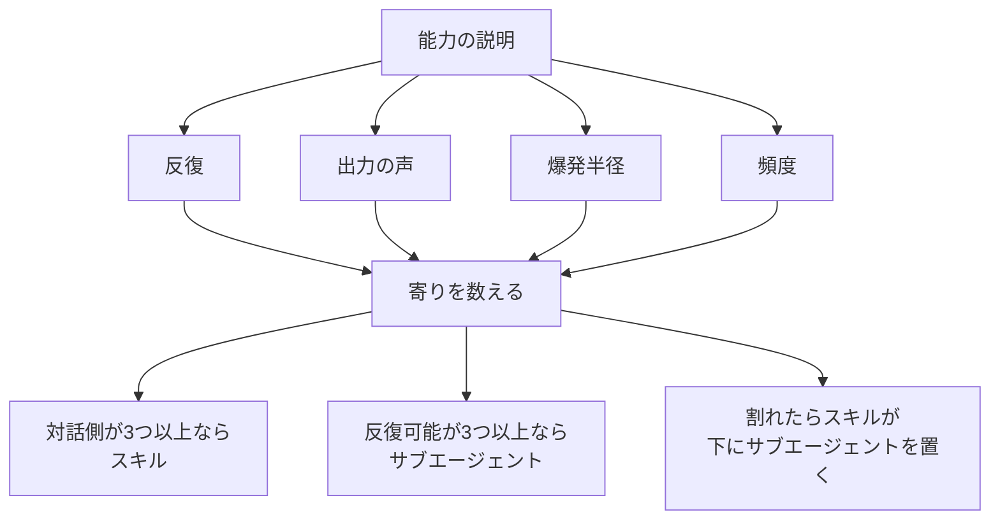

クラウドアーキテクト、プラットフォームエンジニア、エンジニアリングリーダーが、新しい能力をバックログに載せるときに見る判定です。この記事では、4つの点検、数え方、割れたときの置き方、注意点、手順書への1回の適用、新しい手順の前に書く2行を順に示します。判定表の正本は2026-07-30の Azure Architecture Blog であり、InfoQ Japan（2026-10-02）は日本語の入口です。

*この記事の全体像。以下、順に解説します。*

## スキルとサブエージェントの選択とは

対象は、Azure Architecture Blog の "Skill or Sub-Agent. Choosing AI Capabilities You Will Actually Reuse" です。公開時刻は米国太平洋時（UTC-7）の 2026-07-30 13:50 です。`postTime` と `lastPublishTime` はどちらも `2026-07-30T13:50:02.097-07:00` です。`revisionNum` は 4 です。著者のコミュニティログインは `KishoreKumarPattabiraman`（user id `3426309`）です。登録時刻は `2026-03-25T06:44:10.646-07:00` です。公開時点のプロフィール本文 `biography` は空です。

記事は、新しい能力をバックログに載せたとき、道具を選ぶ前に4つの点検を回す、と書いています。点検は反復、出力、爆発半径、頻度です。3つ以上が会話的・主観的ならスキルです。3つ以上が構造化・反復可能ならサブエージェントです。割れれば、スキルがサブエージェントを下に置きます。

InfoQ 英語版の JSON-LD は、`datePublished` と `dateModified` をどちらも `2026-08-03T19:00:00+0000` としています。著者は Sergio De Simone です。InfoQ Japan は 2026-10-02 付で、翻訳者は Hiroaki.Sugimura です。日本語版の「原文リンク(2026-08-04)」は、同じ UTC 瞬間の日本時間の暦日です。2026-08-03 19:00 UTC は 2026-08-04 04:00 JST です。

### 4つの点検

本文の4点検は次のとおりです。爆発半径のサブエージェント側は、同じ表の短句としては置かれていません。後段の人間ゲートと、失敗の単位の記述が対になっています。

| 点検 | スキル側 | サブエージェント側 |
|---|---|---|
| 反復 Iteration | conversation（会話の中で進む） | one hand-off（1回の受け渡し） |
| 出力 Output | subjective and voiced（主観的で声がある） | structured and neutral（構造化されて中立） |
| 爆発半径 Blast radius | an early wrong turn corrupts the rest（早い段階の誤りが残りを汚す） | 同じセルの短句は無く、後段の人間ゲートと失敗の単位で書く |
| 頻度 Frequency | a one-off craft piece（一回きりの作問） | a repeatable batch job（反復できるバッチ） |

数え方は本文のままです。主観・反復に3つ以上寄ればスキルです。構造化・反復可能に3つ以上寄ればサブエージェントです。割れた答えは、スキルがサブエージェントをオーケストレーションします。

同じ節の人間ゲートは、スキルが every turn（毎ターン）、サブエージェントが once, at the end（末尾で1回）です。ゲートは爆発半径に合わせます。爆発半径が大きく品質が主観ならスキルです。爆発半径が小さく出力が客観ならサブエージェントです。避ける罠は、ワンショットのエージェントが40分の無人作業をし、人間が後からほどくことです。

### 人間のゲートと失敗の単位

失敗の単位も分かれています。スキルは小さい可視のステップで失敗し、その場で直せます。サブエージェントは1ブロックとして失敗し、事後に検査します。スキルのコストは注意です。人がループに残る時間です。サブエージェントのコストはやり直しです。ワンショットが壊れると、出力全体が疑わしくなります。

声の例として本文は `banned_phrases` と `self_check` を示しています。

同じチーム・同じモデルでも、定型の状況照会と、声のある技術記事では形が違う、と本文は書いています。前者は1プロンプト入力、1レポート出力、末尾で1回のゲートです。後者を同じサブエージェントに押し込むと、文章が平たくなり、毎回人手で書き直します。本文は、最初に作った形へ全部押し込むことを失敗として名指ししています。

### 合成と今週の一手

合成のパターンは4行です。

1. スキルがオーケストレーションし、声を持つ。
2. サブエージェントが境界のある部分作業を実行する。
3. 人間はスキル層でレビューする。
4. 各層は得意なことだけをする。

実例は、スキルが著者と記事を推敲し、参照資料の取得と要約をサブエージェントに渡す、です。

頻度の単独文は、一回きりの作問はスキルへ、反復バッチはサブエージェントへ寄る、です。段階表（Table 2）の今週の一手は、既に持っているものによります。

| 今あるもの | 今週の一手 |
|---|---|
| 何も無い | いちばん繰り返す1作業の能力説明を1段落書く |
| 1つの道具に全部載せている | 形が合わない1件だけ作り直す |
| 少数の艦隊がある | いちばん大きい層状ワークフローを分ける |

分ける先は、声と人間ゲートを持つスキルと、境界のある作業をするサブエージェントです。Table 2 は、反復・出力・爆発半径・頻度を1段落で書いてから形を決める、と書いています。

### 判定の流れ

判定は、能力の説明を書いてから4点検を数え、形を3つのどれかに落とします。

閉じの一文は、問いを「モデルに何ができるか」から「作業の形は何か」へ移す、と書いています。対話的で声が重いものはスキルです。境界があり機械的なものはサブエージェントです。大きく層状のものは、スキルがサブエージェントをオーケストレーションします。著者自身の艦隊は、対話スキルと自律サブエージェントを別の場所に置き、上にオーケストレータを載せます。その分割が、増えても保守できる理由だ、と結んでいます。

## 注意点

入口の要約、肩書き、時刻、コメント、未確認をここにまとめます。点検そのものの説明は前節です。

### 入口記事の言い換え

InfoQ の導入は、再利用性、単純さ、長期の保守性を選ぶ基準としてまとめています。Azure 本文の判定表は4点検であり、単純さはその4語にはありません。再利用はタイトル "You Will Actually Reuse" にあります。保守は結びの "that split is what keeps it maintainable" にあります。InfoQ Japan が挙げる4次元の日本語名は、反復モデル、ボイス忠実度、ヒューマンゲートの配置、タスクの繰り返し頻度です。これは Azure の4点検の言い換えであり、別の表ではありません。

### 肩書きと時刻

「Azure lead engineer」は InfoQ の肩書きです。ブログのユーザーオブジェクトでは `biography` が空で、職名の文字列はありません。この肩書きは InfoQ の記述として読みます。裏は取れていません。

HTML の `article:modified_time` は `2026-07-29T12:58:01.422-07:00` で、公開時刻より前です。公開後の改稿時刻としては使いません。`revisionNum` 4 は下書きを含む改訂番号です。公開後に4回直した、とは読みません。

### 声のキー

2026-08-12 のコメント（message `4546198`、uid `197496`、表示名 EvdV）は、スキルはコンテキストに読み込まれるテキストであり、`banned_phrases` や `self_check` は標準化されたキーではない、と述べています。著者返信（message `4546347`）は仕組みを認め、それらのキーは illustrative であり予約語ではない、と書いています。実行時の契約は、スキルのあとで人が作る決定的な lint が下書きを止める、という構成だと説明しています。続く返信 `4546349` への著者返信 `4546354` は、強制したいものは自分で作る、という同じ線です。本文のキー名を、実行時が解釈する契約としては扱いません。

### 点検の数え方

頻度の単独文と、3つ以上の数え方は、同時に本文にあります。頻度だけがサブエージェント側で、残り3つがスキル側なら、数え方はスキルです。爆発半径の節は、それとは別に「40分の無人作業を後からほどく」ことを罠と呼んでいます。バッチだからサブエージェント、と1点検だけで決める読みは、本文の数え方より短いです。

description の文面だけで3点検を数えることは、記事が先に求めている能力説明ではありません。

### コメントから採る範囲

Hacker News にこの記事専用のスレッドがある、という InfoQ の言及は、スレッド URL を一次確認していません。

Reddit のライブ HTML と `.json` は 2026-10-04 に 403 で取得できませんでした。一次として使うのは PullPush のコメント本文だけです。ライブ本文との差分は未照合です。

| id | 著者 | 時刻 (UTC) | 本文から採る範囲 |
|---|---|---|---|
| `oz8e6q5` | Ashlesha-msft | 2026-07-23 06:37:29 | Copilot Studio の planner が skill / tool / topic / sub-agent を動的に選ぶ。似たプロンプトでも skill が毎回走るとは限らない。毎回走らせたい段は topic か flow に置く |
| `ozbojn1` | dan-does-ai | 2026-07-23 17:39:46 | 再利用でき、たまに呼ばれなくてもよいなら skill。別コンテキスト・権限・知識が要るなら sub-agent。毎ターン必須なら決定的な経路。Airia 所属の発言であり Microsoft の仕様ではない |
| `ny5v84c` | enthusiast_bob | 2026-01-07 07:38:15 | サブエージェントは別のトークン窓。スキルは会話全体を渡し、システムプロンプトへ常設せずメインが選ぶ。文は "In this case the main loop will" で切れている |

InfoQ が enthusiast_bob に帰す "always start clean and don't pollute" は、このコメント本文の逐語ではありません。InfoQ の言い換えとして読みます。

手順書の中の件数と分数は、ファイルが自分で書いた記録です。YouTube 同期の「実測 285 件で約 6 分 (2026-09-22)」は 2026-10-04 に測り直していません。

### 閉じていない点

次は、この記事の範囲では閉じていません。

- 著者の職名は、ブログのプロフィールでは空です。
- この Azure 記事を主題にした Hacker News スレッドの URL は未確認です。
- 手順書 89 件のうち、description がサブエージェント側に見えなかった本文は、後述の2単位で通読していません。
- 移す前と移した後の手戻りを比べた記録はありません。
- Kestra の `run-skill.sh` ワンショットを、Azure の言うサブエージェントと同一視するかは、製品をまたぐ解釈です。この記事は同一視しません。筆者の定期実行は、Kestra が `run-skill.sh` で手順を1回起動します。
- Claude Code の引用は、2026-10 に取得したドキュメントの版です。`background` の既定や、版が要る記述は、そのページに従います。

## 手順書を移すかどうかの判断

ここからは、Azure の4点検を、手順書を別の委譲主体へ移すかどうかに写します。移す条件は、次の2単位の両方を見てから決めます。

| 単位 | 記事のどの点検に対応するか | サブエージェント側とみなす中身 |
|---|---|---|
| 再利用したい単位 | 頻度と、手順が共有されるか | 1回の受け渡しで終わる反復バッチ |
| 失敗時に戻す単位 | 爆発半径と、人間ゲートの位置 | その実行の成果物1つを捨てれば足り、途中の人間判断が無い |

両方を満たし、既存のワンショットの内側に別の LLM 委譲主体を足さない行だけを「移す」とします。片方でも下流の台帳へ届く行は、取得と書き込みが分かれるまで名前を確定しません。下流の台帳とは、公開一覧、採番、ポリシー、請求です。

Claude Code の公式ドキュメント（2026-10 に取得した skills と sub-agents）は、隔離を別の語で置いています。

- `context: fork` は、指定したエージェント種の新しいサブエージェントを起動し、スキル本文をプロンプトとして渡します。会話履歴は見えません。名前に反して、現在の会話のフォークではありません。履歴が要る作業は、会話のフォークを使います。
- `background` の既定は `true`（v2.1.218 以降）です。`false` にすると、起動したターンで結果を待ちます。
- バックグラウンドの fork が入れた編集は、セッションのチェックポイントの外です。`/rewind` はそれを戻しません。戻す手段は git です。
- 会話のフォーク以外のサブエージェントは、フレッシュなコンテキストで始まります。親の会話履歴、既に呼んだスキル、既に読んだファイルは見えません。同時に、Explore と Plan 以外は CLAUDE.md 階層を読みます。`skills` フィールドに書いたスキルは本文ごと起動時に入ります。
- すべてのサブエージェントから外れるツールに `AskUserQuestion` があります。

この定義では、スキルファイルを消してサブエージェント定義へ移す必要はありません。`context: fork` は手順書を残したまま、実行時だけ履歴から切り離します。筆者の呼び方では、定期実行がワンショットで回す手順もスキルです。Azure の「会話のスキル」と、リポジトリの「手順書ファイル」は同じ綴りで別のものを指します。

Copilot Studio の Skills 概要（Learn、`ms.date` 2026-09-09、ページ更新 2026-09-10）は、スキルをエージェント間で再利用する Markdown パッケージ（name、description、instructions）と書いています。オーケストレーションは、依頼が description に合うとスキルを呼びます。PullPush の `oz8e6q5` は、その選択が毎回同じとは限らない、と書いています。これは Claude Code の保証としては使いません。製品の語彙が違います。

移す判断を弱める事実は次です。

1. サブエージェントの起動は空ではありません。CLAUDE.md と、preload したスキル本文が入ります。会話のフォークは親の履歴を継ぎます。resume は停止地点の履歴を持ちます。
2. バックグラウンド編集は `/rewind` の外に出ます。爆発半径の「捨てやすい」は、チェックポイントの内側だけでは満たしません。
3. `AskUserQuestion` はサブエージェントから外れます。権限ダイアログ、ログイン依頼、入力の確認、判断に迷ったときの日付提示は、途中で人に戻る手順です。
4. 声のキーは、前節のとおり例示です。契約として残るのは、別途作る決定的 lint です。
5. 割れは「実行の置き換え」ではありません。本文は「スキルがサブエージェントをオーケストレーションする」と書いています。
6. 既にワンショットで回している収集へ、内側の LLM サブエージェントを足すと、起動側が2段になります。
7. `marketing-insights-collect` は、恒常失敗が混ざっても主成果があれば `OVERALL_STATUS=ok` と書く、と手順書の分岐が述べています。失敗が成果物の外、翌日の欠測に残ります。
8. `note-schedule-list` の自己記録は、一覧の欠落が `plaud-to-note` の重複チェックまで届いた、と書いています。戻す単位は当日ファイルより広いです。
9. `idea-triage` の自己記録は、誤エッジが Asana の `#NN` 再採番まで届いた、と 2026-07-23 run 3604 を記録しています。

移す前後の所要時間、トークン、手戻り件数を比べた測定は、見つかっていません。

## 89件へ1回当てた結果

適用単位は、筆者が 2026-10-04 時点で持っている手順書 89 ファイルです。ユーザー設定のスキルとプラグインのスキルは数に入れていません。同じ表で本文を読んだのは、description がサブエージェント側に見えた 11 件と、声を本体にする代表を残す判断です。89 件すべてを同じ表で採点してはいません。

description の文面だけを数えると、次の 11 件がサブエージェント側に見えます。本文を読んだ結果、移す行は 0 件です。

| 手順 | 再利用したい単位 | 失敗時に戻す単位 | 判定 |
|---|---|---|---|
| `marketing-insights-collect` | 日次の raw JSONL | 当日ファイルは上書きできる。恒常失敗が混ざっても主成果があれば `OVERALL_STATUS=ok` になる、と手順書の分岐が書いている | 分割待ち。内側はスクリプト。LLM の委譲主体は足さない |
| `buffer-insights-collect` | 週次手動の metrics JSONL | 当日 JSONL の上書き。権限ダイアログは user 承認待ち。未ログインは手動ログイン | 分割待ち |
| `x-csv-export` | 週次手動の CSV | 当日 CSV の上書き。未ログインは手動ログイン。`launchd` 自動化不可と本文にある | 分割待ち |
| `note-publish-sync` | 日次ミラー | Step 2 が `schedule.md` を上書きする。Cookie 失効は exit 2 で人待ち | 分割待ち |
| `note-schedule-list` | 予約と下書きの一覧 | `schedule.md` を上書きする。`perPage=100` で 4 ページ取った回は、本日〜2 週間先の reserved が抜け、`plaud-to-note` の重複チェックが空振りした、と本文が記録している | 分割待ち |
| `youtube-publish-sync` | 公開動画一覧 | 公開動画の一覧を上書きする。取得日が今日なら再取得をスキップする。所要の自己記録は 285 件で約 6 分 | 分割待ち |
| `journal-review` | 直近 3 日の日報検出 | `NO_CONTENT` の条件は「実質的な内容がない」。検出は報告であり、日報本文は消さない | スキル側に残す |
| `slack-huddle-summary` | 指定月のハドル時間 | 再実行で表を作り直せる。入力はチャンネル URL、期間、自分のユーザー名。ログイン確認と検索ペインのスクロールが途中にある | 分割待ち |
| `freee-invoice-list` | 見積と請求の一覧表示 | 表示は捨てられる。続きの絞り込みは、直前に出した表とユーザーの要望を親が持っている | 分割待ち |
| `idea-triage` | 実施順レポート | `PAT_ASANA` があるときタイトル接頭辞へ `#NN` を付ける。本文は、誤エッジ 1 本で 1 位が入れ替わり Asana 再採番まで届いた、と 2026-07-23 run 3604 を記録している | スキル側。採番は決定的スクリプトのまま |
| `loop-v2-probe` | 完了マーカー 1 つ | マーカー 1 つ。決定的スクリプトが書く | 既にワンショット。内側へサブエージェントは足さない |

声と推敲を本体にする手順はスキルのまま置きます。代表は `deep-research`、`to-zenn`、`to-note`、`content-marketing-pipeline`、各 `*-common`、`mermaid-lint` です。

公開、請求、ポリシー書換、マージのように、戻す単位が下流の台帳へ届く手順も、この回では移しません。代表は `pr-concierge`、`ci-concierge`、`release-concierge`、`zenn-weekly-publisher-publish`、`marketing-insights-weekly`、`work-monthly-contract`、`youtube-schedule-unlisted`、`skills-weekly-refactor`、`marketing-mechanism-apply`、`plaud-to-note-publish` です。

今回の抽出は、新しいサブエージェントへ移す行が 0 件です。分割が終わるまで名前を保留する行は 8 件です。上の表から `journal-review`、`idea-triage`、`loop-v2-probe` を除いた行です。

## 新しい手順の前に書く2行

新しい手順を足すときは、先に2行だけ書きます。再利用したい単位です。失敗したときに捨てる単位です。

両方が「その実行の成果物1つ」で、途中の人の判断が無いとき、実行は既存のワンショットに置きます。定期実行の1回か、Claude Code なら `context: fork` かつ `background: false` です。手順書のファイルはそのまま残します。スキル名をサブエージェント名へ改名しません。

戻す単位が、公開一覧、採番、ポリシー、請求、重複チェックの台帳に届くときは、取得と書き込みが分かれるまで名前を確定しません。

収集の手順の内側に、新しい LLM の委譲主体を足しません。決定的なスクリプトが既に、1回の受け渡しを担っています。

声の規則はスキル本文に残します。強制は、著者がコメントで書いた形にします。スキルのあとに、人が作った決定的な lint を1段置きます。`banned_phrases` というキー名がランタイムに解釈される、とは扱いません。

## まとめ

Azure Architecture Blog の判定は、モデルの能力ではなく作業の形を見ます。反復、出力、爆発半径、頻度の4点検を数え、3つ以上が会話的・主観的ならスキル、3つ以上が構造化・反復可能ならサブエージェント、割れればスキルがサブエージェントを下に置きます。単純さは、その4語にはありません。声のキー名は予約語ではなく、強制は後段の決定的な lint です。

筆者の手順書 89 件へ 2026-10-04 に1回当てた範囲では、description がサブエージェント側に見えた 11 件の本文を読んでも、移す行は 0 件でした。名前を保留するのは、戻す単位が当日ファイルより広い 8 件です。新しい手順は、再利用したい単位と、失敗時に捨てる単位の2行を書いてから置きます。

この記事が少しでも参考になった、あるいは改善点などがあれば、ぜひリアクションやコメント、SNSでのシェアをいただけると励みになります！

## 参考リンク

- [Skill or Sub-Agent. Choosing AI Capabilities You Will Actually Reuse](https://techcommunity.microsoft.com/blog/azurearchitectureblog/skill-or-sub-agent-choosing-ai-capabilities-you-will-actually-reuse/4542099)（Azure Architecture Blog、KishoreKumarPattabiraman、公開 `2026-07-30T13:50:02.097-07:00`。コメント message 4546198、4546347、4546354 は同ページ）
- [InfoQ English, choosing-between-subagent-skills](https://www.infoq.com/news/2026/08/choosing-between-subagent-skills/)（Sergio De Simone、JSON-LD `2026-08-03T19:00:00+0000`）
- [InfoQ Japan, choosing-between-subagent-skills](https://www.infoq.com/jp/news/2026/10/choosing-between-subagent-skills/)（2026-10-02、翻訳 Hiroaki.Sugimura）
- [Claude Code skills](https://code.claude.com/docs/en/skills)（2026-10 に取得）
- [Claude Code sub-agents](https://code.claude.com/docs/en/sub-agents)（2026-10 に取得）
- [Use skills in Copilot Studio](https://learn.microsoft.com/en-us/microsoft-copilot-studio/agents-experience/skills-overview)（Microsoft Learn、`ms.date` 2026-09-09）
- [PullPush comments oz8e6q5, ozbojn1, ny5v84c](https://api.pullpush.io/reddit/search/comment/?ids=oz8e6q5,ozbojn1,ny5v84c)
