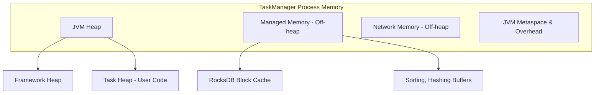
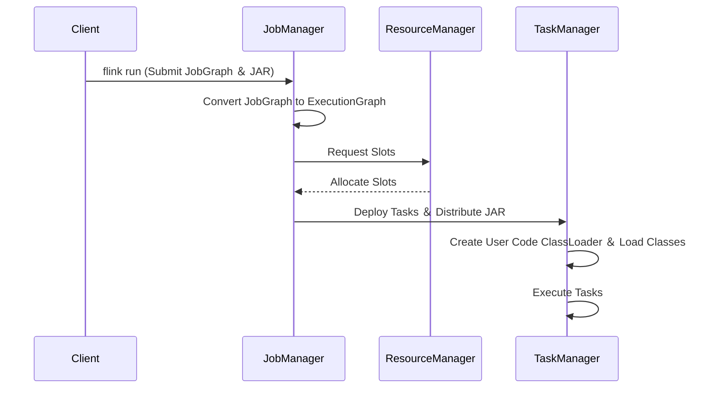

### はじめに

Apache Beamは、バッチとストリーミングの両方に対応する統一プログラミングモデルです。Beamで記述したパイプラインは、Apache Flink、Apache Spark、Google Cloud Dataflowなど、複数の分散処理エンジン（ランナー）で実行できます。特にApache Flinkは、低遅延、高スループット、堅牢なステートフル処理能力を持つため、ストリーミング処理の主要な選択肢です。

しかし、Beam Java SDKで開発したアプリケーションをFlinkクラスタへ本番デプロイする際には、以下のような多くの課題が存在します。

  * 依存関係の競合
  * 不適切なパッケージング
  * 非効率なリソース設定
  * 不十分な耐障害性構成

これらの課題は、パイプラインの不安定化やパフォーマンス低下を引き起こします。

この記事では、Gradleをビルドツールとして利用し、Beam Java SDKアプリケーションをFlinkクラスタへデプロイするためのベストプラクティスを解説します。データエンジニアが堅牢でスケーラブルなデータパイプラインを構築するための、実践的で詳細なガイドを提供します。


### セクション1：プロジェクト基盤の設計

堅牢なプロジェクト基盤は、開発後半で発生する問題を未然に防ぎます。特にバージョン互換性の確保と依存関係の管理が重要です。

#### 要約

  * `build.gradle.kts`に`java`, `application`, `shadow`プラグインを適用し、ビルドの基盤を確立します。
  * Apache Beam公式の互換性マトリクスに基づき、Beam SDK、Flink Runner、Flinkクラスタのバージョンを厳密に揃えます。
  * Apache Beamが提供するBOM (Bill of Materials) を利用して、数十に及ぶ推移的依存関係のバージョンを競合なく一元管理します。

#### プラクティス1.1：堅牢な`build.gradle.kts`構成の確立

保守性の高いプロジェクトの礎として、適切に構造化された`build.gradle.kts`ファイルを作成します。

1.  **プラグインの適用**:

      * `java`プラグイン: Javaのコンパイル機能を提供します。
      * `application`プラグイン: アプリケーションのエントリポイント（メインクラス）を指定します。`flink run`コマンドでの実行に必要です。
      * `com.gradleup.shadow`プラグイン: 全ての依存関係を含む単一の実行可能JARファイル（Fat JAR）を作成します。

2.  **`build.gradle.kts`の初期設定例**:

    ```kotlin
    // build.gradle.kts

    // 必要なプラグインを適用
    plugins {
        java
        application
        // Fat JARを作成するためのShadow Plugin
        id("com.gradleup.shadow") version "8.3.0"
    }

    // プロジェクトの基本情報
    group = "org.example.beam"
    version = "0.1-SNAPSHOT"

    // 依存関係を解決するためのリポジトリ
    repositories {
        mavenCentral()
    }

    // Javaのバージョンを指定
    java {
        sourceCompatibility = JavaVersion.VERSION_11
        targetCompatibility = JavaVersion.VERSION_11
    }

    // アプリケーションのメインクラスを指定
    // 'flink run -c' コマンドで必要
    application {
        mainClass.set("org.example.beam.WordCount")
    }
    ```

#### プラクティス1.2：スタック全体でのバージョン互換性の強制

Beam SDK、Flink Runner、Flinkクラスタ間のバージョン非互換性は、最も頻繁に発生する失敗原因です。

  * **互換性の重要性**: Flink Runnerは特定のFlinkバージョンの内部APIに密結合しています。そのため、ターゲットのFlinkクラスタバージョンに適合するRunnerを正確に選択する必要があります。
  * **互換性マトリクスの参照**: プロジェクト開始時に、Apache Beamの公式ドキュメントが提供する互換性マトリクスを確認し、バージョンの組み合わせを決定します。

##### Beam Flink Runner 互換性マトリクス

| Flink Version | Artifact Id | Supported Beam Versions |
| :--- | :--- | :--- |
| 1.19.x | `beam-runners-flink-1.19` | ≥ 2.61.0 |
| 1.18.x | `beam-runners-flink-1.18` | ≥ 2.57.0 |
| 1.17.x | `beam-runners-flink-1.17` | ≥ 2.56.0 |
| 1.16.x | `beam-runners-flink-1.16` | 2.47.0 - 2.60.0 |
| 1.15.x | `beam-runners-flink-1.15` | 2.40.0 - 2.60.0 |
| 1.14.x | `beam-runners-flink-1.14` | 2.38.0 - 2.56.0 |
| 1.13.x | `beam-runners-flink-1.13` | 2.31.0 - 2.55.0 |

#### プラクティス1.3：Apache Beam BOMによる依存関係管理の簡素化

Bill of Materials (BOM) を使用して、数十の推移的依存関係のバージョンを安全に管理します。

  * **BOMの利点**: 依存関係のバージョンを個別に管理する手間を省き、「ダイヤモンド依存問題」のような競合を防ぎます。
  * **推奨されるBOM**: Beamは2つのBOMを提供しますが、gRPCやProtobufなどの競合を最小限に抑えるため、より包括的な`beam-sdks-java-google-cloud-platform-bom`の使用を推奨します。
  * **設定方法**: Gradleの`dependencies`ブロック内で`platform()`キーワードを使いBOMをインポートします。その後、個々のBeam依存関係からバージョン指定を削除します。

##### `build.gradle.kts`の依存関係ブロック設定例

```kotlin
// build.gradle.kts

// バージョンを一元管理するための変数
val beamVersion = "2.57.0"
// ターゲットのFlinkバージョンに対応するランナーのバージョンを指定
val flinkRunnerVersion = "1.18"

dependencies {
    // 包括的なBOMをインポートして、すべての依存関係のバージョンを管理
    implementation(platform("org.apache.beam:beam-sdks-java-google-cloud-platform-bom:$beamVersion"))

    // Beamの依存関係をバージョン指定なしで宣言
    implementation("org.apache.beam:beam-sdks-java-core")
    implementation("org.apache.beam:beam-runners-flink-$flinkRunnerVersion")

    // 必要に応じて他のI/Oや依存関係を追加（例：KafkaIO）
    implementation("org.apache.beam:beam-sdks-java-io-kafka")

    // ロギングのためのSLF4J API
    implementation("org.slf4j:slf4j-api:2.0.13")
}
```


### セクション2：Flink向けアプリケーションパッケージングの習得

アプリケーションを、依存関係を含んだ単一のデプロイ可能なアーティファクト（Fat JAR）にパッケージングします。

#### 要約

  * Gradle Shadow Pluginを使い、アプリケーションコードと依存関係をすべて含む自己完結型のFat JARをビルドします。
  * Flinkクラスタが実行時に提供するライブラリ（Flink APIなど）は、`compileOnly`スコープで指定し、Fat JARへのパッケージングから除外します。
  * GuavaやProtobufなど、避けられない依存関係の競合は、パッケージリロケーション機能でクラスを別名前に変更して分離・解決します。
  * Java ServiceLoaderの仕組みが正しく機能するように、`META-INF/services`配下のファイルをマージする設定を有効化します。

#### プラクティス2.1：Gradle Shadow Pluginによる自己完結型実行可能ファイルのビルド

`flink run`コマンドは、全ての依存関係を含む単一のJARファイルを要求します。Gradle Shadow Pluginは、この「Fat JAR」を作成するための標準ツールです。

  * **`shadowJar`タスク**: このタスクは、プロジェクトの依存関係をすべて内包したJARファイルを生成します。
  * **設定**: `shadowJar`タスクを設定して、出力ファイル名のカスタマイズや、後述するSPIファイルのマージを有効化します。

##### `build.gradle.kts`のShadowJar設定例

```kotlin
// build.gradle.kts
import com.github.jengelman.gradle.plugins.shadow.tasks.ShadowJar

// ... (plugins, repositories, dependencies ブロック) ...

tasks.withType<ShadowJar> {
    // CI/CDスクリプトで扱いやすいようにベース名を指定
    archiveBaseName.set("my-beam-app")
    // どのランナー向けかを示す分類子を追加
    archiveClassifier.set("flink-runner")
    // デプロイスクリプトのためにバージョンなしの名前にすることが多い
    archiveVersion.set("")
    // ServiceLoaderファイルのマージを有効化
    mergeServiceFiles()
}

// 'gradle build' を実行した際に shadowJar も実行されるように設定
tasks.build {
    dependsOn(tasks.shadowJar)
}
```

以下のコマンドでFat JARが`build/libs/`ディレクトリに生成されます。

```bash
./gradlew shadowJar
```

#### プラクティス2.2：`compileOnly`スコープによるクラスタ依存関係の分離

アプリケーションのJARファイルには、Flinkクラスタのランタイムに既に存在するライブラリ（Flink自体やHadoopライブラリ）を含めるべきではありません。

  * **`compileOnly`の役割**: このスコープで宣言された依存関係は、コンパイル時には利用できますが、最終的なFat JARにはパッケージングされません。これにより、実行環境が提供するライブラリとのクラスパス競合を防ぎます。
  * **環境との契約**: `compileOnly`の使用は、アプリケーションが実行時にFlinkクラスタによって提供されるクラスに依存することを意味します。これにより、クラスタのバージョンとアプリケーションの依存関係を一致させることが極めて重要になります。

##### `build.gradle.kts`の`compileOnly`使用例

```kotlin
// build.gradle.kts
val flinkVersion = "1.18.1" // Flinkクラスタのバージョンと一致させる

dependencies {
    // ... (implementation 依存関係) ...

    // Flinkの依存関係はコンパイルに必要だが、クラスタによって提供される。
    // Fat JARにバンドルしてはならない。
    compileOnly("org.apache.flink:flink-java:$flinkVersion")
    compileOnly("org.apache.flink:flink-streaming-java:$flinkVersion")

    // FlinkのAPIを直接使用する場合は、他のFlinkモジュールも追加する
}
```

#### プラクティス2.3：パッケージリロケーションによる競合の事前解決

BOMを使用しても避けられない依存関係の競合は、パッケージリロケーションという高度なテクニックで解決します。

  * **リロケーションの仕組み**: Shadow Pluginが、Fat JARにバンドルされた依存関係のバイトコードを書き換え、パッケージ名を変更します。これにより、同じライブラリの異なるバージョンが互いに干渉することなく共存できます。
  * **最終手段**: 依存関係の競合を「解決」するのではなく「分離」するための強力な手法です。特に、Flinkが内部で使用するGuavaやProtobufとの競合を防ぐのに有効です。

##### `build.gradle.kts`のリロケーション設定例

```kotlin
// build.gradle.kts
import com.github.jengelman.gradle.plugins.shadow.tasks.ShadowJar

tasks.withType<ShadowJar> {
    // ... (他のshadow設定) ...

    // Flink/Hadoopが使用するバージョンとの競合を避けるためにGuavaをリロケートする
    relocate("com.google.common", "my.beam.app.shadow.com.google.common")
    relocate("com.google.protobuf", "my.beam.app.shadow.com.google.protobuf")
}
```

#### プラク-ティス2.4：Service Provider Interface (SPI) のマージ処理

多くのJavaライブラリは、`META-INF/services`ディレクトリにある設定ファイルを使って、実行時に実装を発見します（Java ServiceLoader）。

  * **マージの必要性**: Fat JAR作成時、複数の依存関係が同名のサービスファイルを持つ場合、これらは上書きされず、内容を結合（マージ）する必要があります。この処理を怠ると、Beam I/Oコネクタなどのサービスが読み込まれず、ランタイムエラーが発生します。
  * **`mergeServiceFiles()`**: Shadow Pluginが提供するこの設定を有効にすることで、サービスファイルが正しくマージされ、SPIメカニズムが期待通りに機能します。

##### `build.gradle.kts`のマージ設定例

```kotlin
// build.gradle.kts
import com.github.jengelman.gradle.plugins.shadow.tasks.ShadowJar

tasks.withType<ShadowJar> {
    // ... (他のshadow設定) ...
    mergeServiceFiles()
}
```


### セクション3：デプロイと開発のワークフロー

パイプラインのテストと実行のワークフローを確立します。ローカルでの迅速な開発と、クラスタへの本番デプロイの両方を扱います。

#### 要約

  * 開発段階では、ローカルの単一JVMでパイプラインを実行する`DirectRunner`を使い、ロジックの正当性を迅速にテスト・デバッグします。
  * 本番環境へは、`flink run`コマンドを使い、ビルドしたFat JARをFlinkクラスタにサブミットして実行します。
  * `flink run`コマンドのオプションを理解し、実行環境（デタッチモードなど）とパイプラインの振る舞い（Runner指定、並列度など）を正しく設定します。

#### プラクティス3.1：DirectRunnerによる開発の加速

パイプラインのロジックを、完全なFlinkクラスタにデプロイする前にローカルでテストします。

  * **DirectRunnerの目的**: ローカルマシンの単一JVM上でパイプラインを実行し、ロジックの正当性を検証するために使用します。パフォーマンスよりも正確性に最適化されており、分散環境で発生しうるバグを早期に発見できます。
  * **使用方法**: `beam-runners-direct-java`への依存関係を`testImplementation`スコープで追加し、パイプラインオプションとして`--runner=DirectRunner`を渡します。

##### `build.gradle.kts`のテスト依存関係設定例

```kotlin
// build.gradle.kts
dependencies {
    // ... (他の依存関係) ...

    // DirectRunnerはテストとローカル実行のために使用
    testImplementation("org.apache.beam:beam-runners-direct-java")
}
```

##### Gradle `run`タスクによるローカル実行コマンド

```bash
# プロジェクトのルートディレクトリから実行
./gradlew run --args="--runner=DirectRunner --inputFile=./input.txt --output=./output"
```

#### プラクティス3.2：`flink run`によるFlinkクラスタでのパイプライン実行

パッケージ化したBeamアプリケーションをFlinkクラスタにサブミットするための標準的な方法です。

  * **コマンドの構造**: `flink run`コマンドは、Flink固有のオプションとBeamパイプラインのオプションの2つに分かれます。JARファイルパス以降の引数が、パイプラインの`main`メソッドに渡されます。
  * **主要なオプション**:

| オプション | 説明 |
| :--- | :--- |
| `-c`, `--class` | エントリポイントとなるメインクラス |
| `-d`, `--detached` | クライアント終了後もジョブを実行し続けるデタッチモード（本番用） |
| `--runner=FlinkRunner` | BeamにFlink実行エンジンを使用させる必須オプション |
| `-p`, `--parallelism` | ジョブ全体の並列度 |

##### `flink run`コマンドの完全な例

```bash
# Flinkがインストールされ、そのbinディレクトリがPATHに含まれていることを想定
# Fat JARがbuild/libs/にあることを想定

flink run \
  -d \
  # 本番用のデタッチモード
  -c org.example.beam.WordCount \
  # メインクラス
  /path/to/project/build/libs/my-beam-app-flink-runner.jar \
  # パイプラインオプションの開始
  --runner=FlinkRunner \
  --jobName=MyWordCountJob \
  --inputFile=hdfs:///data/input.txt \
  --output=hdfs:///data/output \
  --parallelism=16
  # Flink固有のオプション
```


### セクション4：ステート管理と信頼性の確保

ステートフルなストリーミングアプリケーションにとって、耐障害性は最重要です。ここではFlinkのチェックポイント機構とステート管理について解説します。

#### 要約

  * チェックポイントを有効化し、アプリケーションの状態を定期的にスナップショットすることで、障害からの回復（Exactly-Onceセマンティクス）を可能にします。
  * 本番環境のステートバックエンドには、大規模な状態を効率的に扱える`RocksDBStateBackend`を選択します。
  * パイプラインの設計において、Windowの集計方法を工夫したり、不要なステートをTTLで削除したりすることで、ステートサイズを最適化し、長期的な安定稼働を実現します。

#### プラクティス4.1：チェックポイントによる耐障害性の設定

チェックポイントは、アプリケーションの状態の整合性あるスナップショットを作成するFlinkの仕組みです。障害発生時、最新のチェックポイントから処理を再開し、データ損失を防ぎます。

  * **重要性**: 本番環境でステートフルなストリーミングパイプラインを実行する場合、チェックポイントは必須です。Exactly-Onceセマンティクスと耐障害性を実現する中心的なメカニズムです。
  * **有効化**: BeamのFlink Runnerではデフォルトで無効になっており、パイプラインオプションで明示的に有効にする必要があります。
  * **主要なオプション**:

| オプション | 説明 |
| :--- | :--- |
| `checkpointingInterval` | チェックポイントを取得する間隔（ミリ秒） |
| `checkpointTimeoutMillis` | チェックポイントが失敗と見なされるまでの最大時間（ミリ秒） |
| `checkpointingMode` | `EXACTLY_ONCE` または `AT_LEAST_ONCE` |
| `externalizedCheckpointsEnabled` | `true`に設定すると、ジョブキャンセル後もチェックポイントを保持し、手動での再起動やアップグレードが可能 |

##### チェックポイントオプション付きの`flink run`コマンド例

```bash
flink run ... \
  --runner=FlinkRunner \
  # 60秒ごとにチェックポイントを実行
  --checkpointingInterval=60000 \
  # 3分後にタイムアウト
  --checkpointTimeoutMillis=180000 \
  # Exactly-Onceセマンティクスを保証
  --checkpointingMode=EXACTLY_ONCE \
  # ジョブキャンセル後もチェックポイントを保持
  --externalizedCheckpointsEnabled=true
```

#### プラクティス4.2：本番用ステートバックエンドの選択：RocksDB

ステートバックエンドは、Flinkが状態をどこに、どのように保存するかを決定します。

##### ステートバックエンドの比較

| バックエンド | 状態の保存場所（実行中） | 特徴 | 用途 |
| :--- | :--- | :--- | :--- |
| `MemoryStateBackend` | JVMヒープ | 高速だが、ヒープサイズに制限され、GCの影響を受ける | ローカルテスト、非常に小さな状態 |
| `FsStateBackend` | JVMヒープ | チェックポイントは分散ファイルシステム（HDFS, S3）に永続化 | 中間的な選択肢 |
| `RocksDBStateBackend` | オフヒープメモリ、ローカルディスク | 状態サイズはディスク容量にのみ依存。インクリメンタルチェックポイントをサポート | **すべての大規模本番ワークロード（推奨）** |

`RocksDBStateBackend`を選択すると、パフォーマンスのボトルネックがJVMヒープからローカルディスクのI/Oとオフヒープメモリ管理へ移行します。そのため、TaskManagerノードには高速なローカルディスク（NVMe SSDなど）を搭載することが重要です。

はい、承知いたしました。「オフヒープ (Off-Heap)」について、特にJavaやApache Flinkの文脈で分かりやすく解説します。

:::message
**オフヒープとは？**

一言で言うと、オフヒープとは **「Java仮想マシン(JVM)のガベージコレクション(GC)の管理対象外にあるメモリ領域」** のことです。

通常のJavaアプリケーションでは、`new`キーワードで作成したオブジェクトはすべて**ヒープ(On-Heap)メモリ**という領域に格納されます。このヒープ領域はJVMによって自動的に管理されており、不要になったオブジェクトはガベージコレクタが見つけて自動的に解放してくれます。これは非常に便利な仕組みですが、いくつかの弱点もあります。

**ヒープ (On-Heap) と オフヒープ (Off-Heap) の比較**

| 項目 | ヒープ (On-Heap) メモリ | オフヒープ (Off-Heap) メモリ |
| :--- | :--- | :--- |
| **管理主体** | Java仮想マシン (JVM) | OS / アプリケーション（手動管理） |
| **主な内容** | `new`で作られたJavaオブジェクト | バイトデータ、シリアライズされたデータ |
| **最大の特徴** | **ガベージコレクション(GC)の対象** | **ガベージコレクション(GC)の対象外** |
| **メリット** | ・メモリ管理が自動で楽<br>・一般的なオブジェクトの扱いは高速 | ・GCによる停止（Stop-the-World）がない<br>・JVMヒープの上限を超えた巨大なメモリを確保できる<br>・OSとのデータ連携（I/O）が効率的 |
| **デメリット** | ・GCが頻発するとパフォーマンスが低下する<br>・巨大なデータを扱うとGC停止時間が長くなる | ・メモリの確保/解放を明示的に行う必要があり、メモリリークのリスクがある<br>・アクセスに若干のオーバーヘッドがある |
:::

##### `flink-conf.yaml`でのRocksDB設定例

```yaml
# デフォルトのステートバックエンドとしてRocksDBを使用
state.backend: rocksdb

# 大規模なステートを持つ場合にスナップショットを高速化するため、インクリメンタルチェックポイントを有効化
state.backend.incremental: true

# TaskManagerのローカルディスク上のRocksDBファイル用ディレクトリ
# 重要：このためには高速な専用ディスク（SSDなど）を使用すること
state.backend.rocksdb.localdir: /data/flink/rocksdb

# チェックポイントを保存する分散ファイルシステム（HDFS, S3）上のディレクトリ
state.checkpoints.dir: hdfs:///flink/checkpoints
```

#### プラクティス4.3: ステートサイズの決定要因と最適化戦略

ステートのサイズは、パフォーマンス、リソース要件、チェックポイント時間に直接影響します。

##### ステートサイズを決定する主要因

  * **Windowの構成**:
      * **期間**: Windowの期間が長いほど、保持するデータが増え、ステートは増大します。
      * **種類**: ウィンドウが重複するスライディングウィンドウは、タンブリングウィンドウよりも多くのステートを必要とします。
      * **集計方法**: ウィンドウ内の全要素をListとして保持するとステートが肥大化します。CombineやReduceを使い、逐次的に集計することで、ステートサイズをほぼ一定に保てます。
  * **Windowに依存しないキー付きステート**:
      * `DoFn`内で明示的に管理されるステートは自動的にクリアされません。不要になったステートを明示的に削除するか、State TTL (Time-To-Live) を設定して自動的に期限切れにする戦略が不可欠です。
  * **キーのカーディナリティ**:
      * Flinkのステートはキーごとに分割されます。ユニークキーの数が、ステート全体のサイズを決定する主要な乗数となります。キーが増え続けるユースケースでは、古いキーをTTLで削除することが長期的な安定運用のために必須です。


### セクション5：リソース設定とサイジングによるパフォーマンスの最適化

アプリケーションのニーズに合わせてFlinkのリソースを設定し、スループットを最大化します。

#### 要約

  * 並列度はジョブのスケーリングの主要な手段であり、`flink run`コマンドで設定します。
  * TaskManagerあたりのタスクスロット数は、通常はCPUコア数に合わせ、リソースを効率的に利用します。
  * Flinkの詳細なメモリモデルを理解し、ワークロードの特性（特にRocksDBの使用有無）に応じて、JVMヒープと管理メモリ（オフヒープ）の割合を調整します。
  * ワークロード分析に基づき、ホストスペックを選定し、並列度とクラスタ台数を体系的に決定します。

#### プラク-ティス5.1：並列度とタスクスロットの設定

  * **並列度 (Parallelism)**: あるオペレーションが同時に実行されるタスクにどれだけ分割されるかを示す度合いです。
  * **タスクスロット (Task Slots)**: 各TaskManagerが提供するリソースの単位で、1つの並列タスクが実行される場所です。クラスタ内の総タスクスロット数が、ジョブの最大可能並列度を決定します。

##### TaskManager数とスロット数のトレードオフ

| 構成 | 特徴 |
| :--- | :--- |
| **多数のTM、少数のスロット** (例: 1スロット/TM) | ・最良のリソース分離 (1つのタスク障害が影響する範囲が限定的) <br> ・ネットワークオーバーヘッドが増加する可能性 |
| **少数のTM、多数のスロット** (例: 8スロット/TM) | ・同じTM内のタスクがTCP接続などを共有でき、ネットワークオーバーヘッドを削減 <br> ・1つのタスク障害がTM全体をクラッシュさせ、他のタスクも停止する可能性 |

ジョブの並列度だけでなく、その並列度を物理リソースにどう分散させるかを考慮することが重要です。

##### 並列度の設定コマンド

```bash
# ジョブのデフォルト並列度を128に設定
flink run -p 128 ...
```

#### プラクティス5.2：FlinkのTaskManagerメモリモデル

Flinkのメモリを正しく設定することは、安定性とパフォーマンスにとって不可欠です。特にRocksDBを使用する場合は、管理メモリの割り当てが重要になります。

##### TaskManagerメモリモデルの図解



##### メモリ領域の役割

| 要素名 | 説明 |
| :--- | :--- |
| JVM Heap | Flinkフレームワークとユーザーコード（DoFnなど）が利用するメモリ。GCの対象。 |
| Managed Memory | Flinkが制御するオフヒープメモリ。RocksDBのブロックキャッシュやソート処理に使われる。GCの対象外。 |
| Network Memory | タスク間のデータ転送（シャッフル）に使われるバッファ。 |
| JVM Metaspace & Overhead | ロードされたクラス定義やJVM自体のためのメモリ。 |

RocksDBを使用する場合、ディスクI/Oを削減するために、メモリの大部分を**管理メモリ**に割り当てることが極めて重要です。

**サンプル flink-conf.yaml（RocksDBワークロード向けメモリ設定）:**

```yaml: flink-conf.yaml
# TaskManagerのコンテナ/プロセスに割り当てられる総メモリ
taskmanager.memory.process.size: 8192m

# Flinkが管理するメモリ（RocksDBキャッシュ用）にメモリの大部分を割り当てる
# これによりJVMヒープは少なくなるが、状態がオフヒープにあるため問題ない
taskmanager.memory.managed.fraction: 0.6

# ネットワークバッファのサイズ
taskmanager.memory.network.fraction: 0.1
```

#### プラクティス5.3: 実践的なクラスタサイジングと設定例

##### ホストスペックの選定ガイド

| スペック | 小規模 / 開発 | 中規模 / 一般的なステートフル処理 | 大規模 / 高負荷・巨大ステート |
| :--- | :--- | :--- | :--- |
| CPUコア | 2 - 4 コア | 8 - 16 コア | 16 - 64 コア以上 |
| メモリ (RAM) | 8 - 16 GB | 32 - 128 GB | 128 GB 以上 |
| ディスク | 一般的なSSD | 高速なSSD | **NVMe SSD (強く推奨)** |
| ネットワーク | 1 Gbps | 10 Gbps | 10 - 25 Gbps |

##### ワークロード別`flink-conf.yaml`設定シナリオ

  * **シナリオA: ステートが小さい / CPU負荷が高いワークロード**

      * JVMヒープ上で多くのオブジェクトを処理するため、**タスクヒープ**の割合を高く設定します。
      * Hostスペック例: 16コア, 64GB RAM

        ```yaml:flink-conf.yaml 設定例
        # OS用に8GB残し、56GBをTMプロセスに割り当てる
        taskmanager.memory.process.size: 56320m

        # JVMヒープの割合を比較的高く設定 (例: 60%)
        taskmanager.memory.task.heap.size: 33792m

        # RocksDBを使わないため、管理メモリはソート等で使われる分だけで良い
        taskmanager.memory.managed.fraction: 0.2
        ```

  * **シナリオB: ステートが大きい / I/O負荷が高いワークロード (RocksDB)**

      * RocksDBのキャッシュ性能が重要になるため、**管理メモリ**の割合を非常に高く設定します。
      * Hostスペック例: 32コア, 128GB RAM, NVMe SSD

        ```yaml: flink-conf.yaml 設定例
        # OS用に16GB残し、112GBをTMプロセスに割り当てる
        taskmanager.memory.process.size: 114688m

        # RocksDBのキャッシュのために管理メモリの割合を非常に高く設定
        taskmanager.memory.managed.fraction: 0.7
        ```

##### クラスタ台数の決定プロセス

1.  **ワークロード分析**: スループット要件、ステートサイズ、ソースのパーティション数を分析します。
2.  **単一TMの設定**: ホストスペックとワークロードに基づき、1台のTMあたりのスロット数（通常はCPUコア数）とメモリ設定を決定します。
3.  **並列度の決定**: ソースのパーティション数（例: Kafkaトピックのパーティション数）を基準に、ベースとなる並列度を決定します。
4.  **クラスタ台数の計算**: `必要なTM台数 = 並列度 / (1TMあたりのスロット数)` で算出します。
5.  **テストと調整**: 算出した構成でジョブを実行し、Flink Web UIでバックプレッシャーやチェックポイント時間などを監視し、ボトルネックがあれば設定を調整します。


### セクション6：運用準備：ロギングとモニタリング

デプロイしたジョブは、その状態が観測可能でなければなりません。ロギングとモニタリングのベストプラクティスを解説します。

#### 要約

  * アプリケーションコードではSLF4J APIを使い、Flinkのデフォルト実装（Log4j 2）と一貫したロギングを行います。
  * 本番環境では、ディスクを圧迫しないようにログローテーションを設定します。
  * Flink Web UIでリアルタイムのジョブ状態を監視し、本番モニタリングではPrometheusなどの外部システムにメトリクスをエクスポートします。
  * 健全性、スループット、レイテンシ、バックプレッシャー、JVMメトリクスを主要な監視対象とします。

#### プラクティス6.1：一貫したロギング戦略の実装

FlinkはSLF4Jロギングファサードを使用しています。デバッグには一貫性のあるロギングが不可欠です。

  * **SLF4J APIの使用**: アプリケーションコードでもSLF4J APIを使用し、Flinkのロギング実装との一貫性を保ちます。
  * **設定ファイル**: Flinkの`conf`ディレクトリにある`log4j.properties`（または`logback.xml`）でログレベルや出力先を管理します。
  * **ログローテーション**: 本番環境では、ログファイルがディスクを使い切ることを防ぐため、サイズや時間に基づいたログローテーションを設定します。

##### `DoFn`でのロギング実装例

```java
import org.apache.beam.sdk.transforms.DoFn;
import org.slf4j.Logger;
import org.slf4j.LoggerFactory;

public class MyDoFn extends DoFn<String, String> {
    // 各クラスでロガーを静的フィールドとして初期化
    private static final Logger LOG = LoggerFactory.getLogger(MyDoFn.class);

    @ProcessElement
    public void processElement(ProcessContext c) {
        String element = c.element();
        // ログレベルを適切に使い分ける（例：デバッグレベル）
        LOG.debug("Processing element: {}", element);
        try {
            // ... business logic ...
            c.output(element.toUpperCase());
        } catch (Exception e) {
            // エラー発生時はエラーレベルでログを記録
            LOG.error("Failed to process element: {}", element, e);
        }
    }
}
```

#### プラクティス6.2：アプリケーションの健全性とパフォーマンスのモニタリング

Flinkは、ジョブの健全性を理解するために豊富な内部メトリクスを提供します。

  * **Flink Web UI**: リアルタイムでジョブグラフ、データフロー、各オペレータのメトリクスを確認できる主要ツールです。デフォルトではJobManagerのポート8081で実行されます。
  * **メトリクスレポーター**: 本番モニタリングでは、メトリクスをPrometheusやJMXなどの外部システムにエクスポートします。

##### 監視すべき主要メトリクス

  * **健全性**:
      * `restartingTime`
      * `numberOfCompletedCheckpoints`
      * `numberOfFailedCheckpoints`
  * **スループット**:
      * `numRecordsInPerSecond`
      * `numRecordsOutPerSecond`
  * **レイテンシ**:
      * Flinkのレイテンシ追跡マーカーを使用して測定
  * **バックプレッシャー**:
      * Flink UIで可視化。高い値はパイプラインのボトルネックを示す
  * **JVMメトリクス**:
      * ヒープ/非ヒープメモリ使用量
      * GC時間

##### `flink-conf.yaml`でのPrometheusレポーター設定例

```yaml
metrics.reporters: prom
metrics.reporter.prom.class: org.apache.flink.metrics.prometheus.PrometheusReporter
metrics.reporter.prom.port: 9250-9260
```


### セクション7：マルチジョブデプロイメントと共通コードの管理

複数の独立したFlinkジョブ間で共通のロジック（データモデル、ユーティリティ関数など）を管理する方法について解説します。

#### 要約

  * **アンチパターン**: 共通コードをJARにまとめ、Flinkクラスタの`lib`フォルダに配置する方法は、バージョニングの競合やデプロイの密結合を引き起こすため、強く非推奨です。
  * **ベストプラクティス**: 各ジョブが、共通コードを含む全ての依存関係を内包した、自己完結型のFat JARとしてパッケージングされるべきです。これにより、各ジョブの独立したデプロイとライフサイクルが保証されます。
  * Gradleのマルチプロジェクトビルド機能を使えば、このベストプラクティスを効率的に実現できます。

#### アンチパターン：共通JARをFlinkクラスタのクラスパスに配置する

このアプローチは、以下の深刻な問題を引き起こします。

  * **バージョニングの競合（"Dependency Hell"）**: あるジョブが共通ライブラリのv1.0に、別のジョブがv2.0に依存する場合、両方を同時に稼働させることができなくなります。共通ライブラリの更新が、それを利用する全てのジョブの同時更新を強制します。
  * **デプロイの密結合**: 共通ライブラリの更新が、アプリケーションのデプロイだけでなく、Flinkクラスタ自体の構成変更や再起動を必要とし、各ジョブの独立性が失われます。
  * **クラスローディングの予測不能性**: Flinkは`lib`フォルダ内のクラスをアプリケーションJAR内のクラスより優先してロードするため、意図しないバージョンのライブラリが使われ、予期せぬエラーを引き起こします。

#### ベストプラクティス：各ジョブが自己完結したFat JARを持つ

各ジョブは、自身のコードと、共通処理モジュールを含む全ての依存ライブラリをパッケージングした単一のFat JARを生成します。

  * **独立したデプロイとライフサイクル**: 異なるバージョンの共通ライブラリを内包したジョブが、同じクラスタ上で互いに影響なく同時に稼働できます。
  * **依存関係の分離と予測可能性**: ローカルでのテスト環境とクラスタ上の実行環境の依存関係が完全に一致するため、環境差異による問題を劇的に減らせます。
  * **CI/CDとロールバックの簡素化**: 各ジョブのビルドは単一のアーティファクトを生成するだけで完結します。問題発生時も、以前のバージョンのFat JARを再デプロイするだけで安全にロールバックできます。

#### Gradleマルチプロジェクトビルドによる実装

このベストプラクティスは、Gradleのマルチプロジェクト構成で効率的に実現できます。

##### プロジェクト構造

```
my-flink-system/
├── settings.gradle.kts
├── common-library/
│   ├── build.gradle.kts
│   └── src/main/java/...
├── job-a/
│   ├── build.gradle.kts
│   └── src/main/java/...
└── job-b/
    ├── build.gradle.kts
    └── src/main/java/...
```

##### `settings.gradle.kts`

```kotlin
rootProject.name = "my-flink-system"
include("common-library", "job-a", "job-b")
```

##### `job-a/build.gradle.kts`

```kotlin
import com.github.jengelman.gradle.plugins.shadow.tasks.ShadowJar

plugins {
    java
    application
    id("com.gradleup.shadow") version "8.3.0"
}

// ... group, version, repositories...

dependencies {
    // 共通ライブラリモジュールを通常の依存関係として追加
    implementation(project(":common-library"))

    // BeamやFlink Runnerなどの他の依存関係
    implementation(platform("org.apache.beam:beam-sdks-java-google-cloud-platform-bom:2.57.0"))
    implementation("org.apache.beam:beam-sdks-java-core")
    // ...
}

tasks.withType<ShadowJar> {
    // ... shadowJarの設定...
}
```

この構成により、`./gradlew :job-a:shadowJar` を実行すると、`job-a`と`common-library`のコードが単一のFat JARにパッケージングされます。


### セクション8：Flinkジョブ実行のライフサイクル：JARからメモリまで

`flink run`コマンド実行後、データが処理されるまでの内部的な流れを解説します。

#### 要約

  * ジョブ投入時、FlinkクライアントはBeamパイプラインをFlinkの`JobGraph`に変換し、Fat JARと共に`JobManager`へ送信します。
  * `JobManager`は`JobGraph`を物理実行計画である`ExecutionGraph`に変換し、JARファイルを各`TaskManager`に配布してタスクの実行を指示します。
  * 各`TaskManager`では、ジョブごとに独立した`User Code ClassLoader`が作成され、Fat JARからクラスをロードします。これにより、ジョブ間の依存関係が分離されます。
  * タスク実行時、ユーザーコードが生成するオブジェクトはJVMヒープに、RocksDBのキャッシュなどはオフヒープの管理メモリに格納され、ワークロードに応じてメモリ領域が使い分けられます。

#### ジョブ実行フロー



##### 実行ステップの詳細

| ステップ | 実行主体 | アクション |
| :--- | :--- | :--- |
| **1. ジョブ投入** | Flinkクライアント | 1. `main`メソッドを実行し、Beamパイプラインを`JobGraph`に変換。<br>2. `JobGraph`とFat JARを`JobManager`に送信。 |
| **2. 調整** | JobManager | 1. Fat JARを全`TaskManager`に配布。<br>2. `JobGraph`を物理実行計画である`ExecutionGraph`に変換。<br>3. `ResourceManager`にスロットを要求し、タスクをデプロイ。 |
| **3. 準備** | TaskManager | 1. ジョブごとに新しい`User Code ClassLoader`を作成。<br>2. 配布されたFat JARから、親クラスローダー（Flinkフレームワーク）に存在しないクラスをロード。 |
| **4. 実行** | TaskManager | 1. スロット内でタスクを実行。<br>2. ワークロードに応じてJVMヒープや管理メモリなどのメモリ領域を利用。 |

#### TaskManagerのメモリ利用

スロット内で実行されるタスクは、TaskManagerのJVMが持つメモリ領域を共有して利用します。

| メモリ領域 | 格納されるもの | 主な特徴 |
| :--- | :--- | :--- |
| **JVMヒープ** (Task Heap) | ・ユーザーコード内で生成されるJavaオブジェクト<br>・`DoFn`などの関数インスタンス<br>・Memory/FsStateBackendの実行中ステート | ・GCの対象<br>・巨大なステートを保持するとGC停止が頻発するリスク |
| **管理メモリ** (Managed Memory) | ・RocksDBのブロックキャッシュ<br>・ソート、ハッシュ処理用の一時バッファ | ・通常はオフヒープ<br>・GCの対象外で、パフォーマンスが予測可能<br>・巨大なステートを持つRocksDBの性能を左右する |
| **ネットワークメモリ** | ・タスク間データ転送用のバッファ | ・オフヒープ<br>・シャッフル性能に影響 |
| **JVMメタスペース** | ・ロードされたクラスの定義情報 | ・クラスのメタデータが格納される領域 |


### まとめ

Apache Beam on FlinkアプリケーションをGradleで構築し、本番デプロイを成功させるには、体系的なアプローチが必要です。本レポートで解説したベストプラクティスは、以下の核心的な原則に集約されます。

  * **厳格なバージョン管理**:
    プロジェクト初期に、Beam SDK、Flink Runner、Flinkクラスタ間の互換性を公式マトリクスで検証し、BOMで依存関係を一元管理します。

  * **意図的なパッケージングと分離**:
    各ジョブを、共通ライブラリを含む自己完結型のFat JARとしてパッケージングします。これにより、ジョブの独立したデプロイとライフサイクルを保証します。

  * **目的に応じた実行環境の選択**:
    `DirectRunner`によるローカルテストと、`flink run`によるクラスタデプロイを明確に使い分け、開発サイクルを効率化します。

  * **耐障害性とステート管理の設計**:
    チェックポイントを必須機能とし、本番では`RocksDBStateBackend`を採用します。ステートサイズを意識した設計で、長期的な安定稼働を目指します。

  * **データ駆動型のリソース設計**:
    Flinkのクラスタ構成（メモリ、並列度）を、画一的ではなく、ワークロードの特性に応じて体系的に設計・調整します。

  * **観測可能性の確保**:
    一貫したロギング戦略と、健全性やスループットを網羅するメトリクス監視を実装し、安定運用と迅速な問題解決を可能にします。

これらのプラクティスを遵守することで、Beamの抽象化とFlinkの強力な実行能力を最大限に引き出し、真に本番環境グレードのデータ処理基盤を構築できるようになります。この記事が、あなたの開発の一助になれば幸いです。

この記事が少しでも参考になった、あるいは改善点などがあれば、ぜひリアクションやコメント、SNSでのシェアをいただけると励みになります！


-----

### 参考リンク

  * **Beam/Flink入門・概要**

      * [Apache Beam Java SDK quickstart](https://beam.apache.org/get-started/quickstart/java/)
      * [Apache Flink Runner](https://beam.apache.org/documentation/runners/flink/)
      * [Using the Direct Runner - Apache Beam®](https://beam.apache.org/documentation/runners/direct/)
      * [Apache Flink® — Stateful Computations over Data Streams | Apache Flink](https://flink.apache.org/)
      * [Use Apache Beam with Managed Service for Apache Flink applications - AWS Documentation](https://docs.aws.amazon.com/managed-flink/latest/java/how-creating-apps-beam.html)

  * **Gradleビルドと依存関係管理**

      * [Dependencies Guide - Apache Beam®](https://beam.apache.org/contribute/dependencies/)
      * [Java SDK dependencies - Apache Beam®](https://beam.apache.org/documentation/sdks/java-dependencies/)
      * [Managing Beam dependencies in Java - Apache Beam®](https://beam.apache.org/blog/managing-beam-dependencies-in-java/)
      * [Project Configuration | Apache Flink](https://ci.apache.org/projects/flink/flink-docs-release-1.13/docs/dev/datastream/project-configuration/)
      * [Overview - Shadow Gradle Plugin - GradleUp](https://gradleup.com/shadow/configuration/)
      * [Relocation - Shadow Gradle Plugin - GradleUp](https://gradleup.com/shadow/configuration/relocation/)
      * [Using Gradle Shadow Plugin to Resolve Java Version Conflict | by Rui Jiang | Medium](https://medium.com/@ruijiang/using-gradle-shadow-plugin-to-resolve-java-version-conflict-183bd6ea4228)
      * [Creating a shadow jar in gradle? - Stack Overflow](https://stackoverflow.com/questions/70787750/creating-a-shadow-jar-in-gradle)
      * [Gradle and Shadow Jar - Help/Discuss](https://discuss.gradle.org/t/gradle-and-shadow-jar/19532)
      * [Introducing Compile-Only Dependencies - The Gradle Blog](https://blog.gradle.org/introducing-compile-only-dependencies)
      * ['Provided' dependency in Gradle - Stack Overflow](https://stackoverflow.com/questions/30731084/provided-dependency-in-gradle)
      * [How to use provided scope for jar file in Gradle build? - Stack Overflow](https://stackoverflow.com/questions/18738888/how-to-use-provided-scope-for-jar-file-in-gradle-build)

  * **Flinkアーキテクチャとジョブ実行**

      * [Apache Flink 1.2 Documentation: Distributed Runtime Environment](https://ci.apache.org/projects/flink/flink-docs-release-1.2/concepts/runtime.html)
      * [Flink Architecture - My Flink Studies](https://jbcodeforce.github.io/flink-studies/architecture/)
      * [Apache Flink Series 3 — Architecture of Flink | by mehmetozanguven | Medium](https://medium.com/@mehmetozanguven/apache-flink-series-3-architecture-of-flink-a1ae34f0a8d2)
      * [In-depth Analysis of Flink Job Execution: Flink Advanced Tutorials - Alibaba Cloud](https://www.alibabacloud.com/blog/in-depth-analysis-of-flink-job-execution-flink-advanced-tutorials_596633)
      * [Mastering Flink Job and Task Managers | by Benjamin Barrett - Medium](https://medium.com/@benjamin_84392/mastering-flink-job-and-task-managers-df6a94196b2b)
      * [Confused about FLINK task slot - Stack Overflow](https://stackoverflow.com/questions/47197744/confused-about-flink-task-slot)
      * [Apache Flink Fundamentals: Five Modes of Client Operations - Alibaba Cloud Community](https://www.alibabacloud.com/blog/apache-flink-fundamentals-five-modes-of-client-operations_595729)

  * **ステート管理とチェックポイント**

      * [State Management in Apache FlinkR - Data Intensive Computing Platforms](https://id2221kth.github.io/papers/2017%20-%20State%20Management%20in%20Apache%20Flink.pdf)
      * [Using RocksDB State Backend in Apache Flink](https://flink.apache.org/2021/01/18/using-rocksdb-state-backend-in-apache-flink-when-and-how/)
      * [Deep Dive into Flink's State Backend: Options, Functionality, and Trade-offs - Medium](https://medium.com/@sant1/deep-dive-into-flinks-state-backend-options-functionality-and-trade-offs-e464deec2ca)
      * [How to manage your RocksDB memory size in Apache Flink - Ververica](https://www.ververica.com/blog/manage-rocksdb-memory-size-apache-flink)
      * [The Impact of Disks on RocksDB State Backend in Flink: A Case Study - Ververica](https://www.ververica.com/blog/the-impact-of-disks-on-rocksdb-state-backend-in-flink-a-case-study)
      * [Flink Checkpoints — Best Practices (By FlinkPOD) | by VerticalServe Blogs - Medium](https://verticalserve.medium.com/flink-checkpoints-best-practices-bf91dfc70f8f)
      * [How to optimize Apache Flink's Checkpointing Mechanism for Large-Scale Stateful Stream Processing - Coditation](https://www.coditation.com/blog/optimize-apache-flinks-checkpointing-mechanism-for-large-scale-stateful-stream-processing)

  * **リソース管理とパフォーマンス最適化**

      * [BigData & Web3. What does Task Manager memory consist of in Apache Flink? - Medium](https://medium.com/pharos-production/bigdata-web3-what-does-task-manager-memory-consist-of-in-apache-flink-5759466311b7)
      * [Apache Flink Memory Model, Metrics and Optimisation | by Amit Patel - Medium](https://medium.com/@amitptl.in/apache-flink-memory-model-metrics-and-optimisation-b09707b69c63)
      * [Memory Management in Apache Flink: Techniques for Efficient State Handling - IJIRMPS](https://www.ijirmps.org/papers/2023/6/231999.pdf)
      * [Realtime Compute for Apache Flink:Configure resources for a deployment - Alibaba Cloud](https://www.alibabacloud.com/help/en/flink/configure-deployment-resources)
      * [Flink parameters - IBM](https://www.ibm.com/docs/en/bai/24.0.1?topic=parameters-flink)
      * [Setting up memory for Flink - Configuration - DEV Community](https://dev.to/kination/setting-up-memory-for-flink-configuration-4jm1)
      * [Configuration - Apache Flink 1.3-SNAPSHOT 中文文档](http://flink.iteblog.com/setup/config.html)

  * **ロギングとモニタリング**

      * [Use the Flink UI to monitor Flink jobs - Amazon EMR](https://docs.aws.amazon.com/emr/latest/EMR-on-EKS-DevelopmentGuide/jobruns-flink-monitoring-ui.html)
      * [Monitoring Apache Flink Applications 101 - Ververica](https://www.ververica.com/blog/monitoring-apache-flink-applications-101)
      * [Apache Flink Metrics: Using Tutorial and Monitoring Practices - Alibaba Cloud](https://alibaba-cloud.medium.com/metrics-principles-and-practices-flink-advanced-tutorials-6e39f272772f)
      * [Apache Flink monitoring integration | New Relic Documentation](https://docs.newrelic.com/install/apache-flink/)
      * [Metrics with Confluent Manager for Apache Flink](https://docs.confluent.io/platform/current/flink/jobs/configure/metrics.html)
      * [How to configure and view logs in Flink | ADH Arenadata Docs](https://docs.arenadata.io/en/ADH/current/how-to/flink/flink-logging.html)
      * [Logging configuration in Flink - Computer Science 101](https://cs101.blog/2018/01/03/logging-configuration-in-flink/)
      * [SLF4J Manual](https://www.google.com/search?q=https://www.slf4j.org/manual/)
      * [Logging in Java: SLF4J, Logback, and Log4j Explained | by Marcelo Domingues - Medium](https://medium.com/devdomain/logging-in-java-slf4j-logback-and-log4j-explained-f69bf68df796)

  * **運用とベストプラクティス**

      * [Apache Flink 1.5 Documentation: Best Practices](https://ci.apache.org/projects/flink/flink-docs-release-1.5/dev/best_practices.html)
      * [Maintain best practices for Managed Service for Apache Flink applications](https://docs.aws.amazon.com/managed-flink/latest/java/best-practices.html)
      * [Stream processing best practices - HERE Technologies](https://www.here.com/docs/bundle/pipelines-api-developer-guide/page/topics/stream-processing.html)
      * [Apache Flink best practices - Flink Forward lessons learned - Waitingforcode](https://www.waitingforcode.com/apache-flink/apache-flink-best-practices-flink-forward-lessons-learned/read)
      * [Mastering Apache Flink in Production: A Guide to Monitoring & Optimization](https://bigdataboutique.com/blog/mastering-apache-flink-in-production-a-guide-to-monitoring-and-optimization-0b50d7)
      * [Multiple jobs in the same Flink project](http://deprecated-apache-flink-user-mailing-list-archive.369.s1.nabble.com/Multiple-jobs-in-the-same-Flink-project-td43155.html)

  * **クラスローディング**

      * [Class Loaders in Java - Baeldung](https://www.baeldung.com/java-classloaders)
      * [Loading user classes in flink RichFilterFunction using User code classloader](https://stackoverflow.com/questions/49320745/loading-user-classes-in-flink-richfilterfunction-using-user-code-classloader)
      * [Debugging Classloading - Apache Flink 1.3-SNAPSHOT 中文文档](http://flink.iteblog.com/monitoring/debugging_classloading.html)