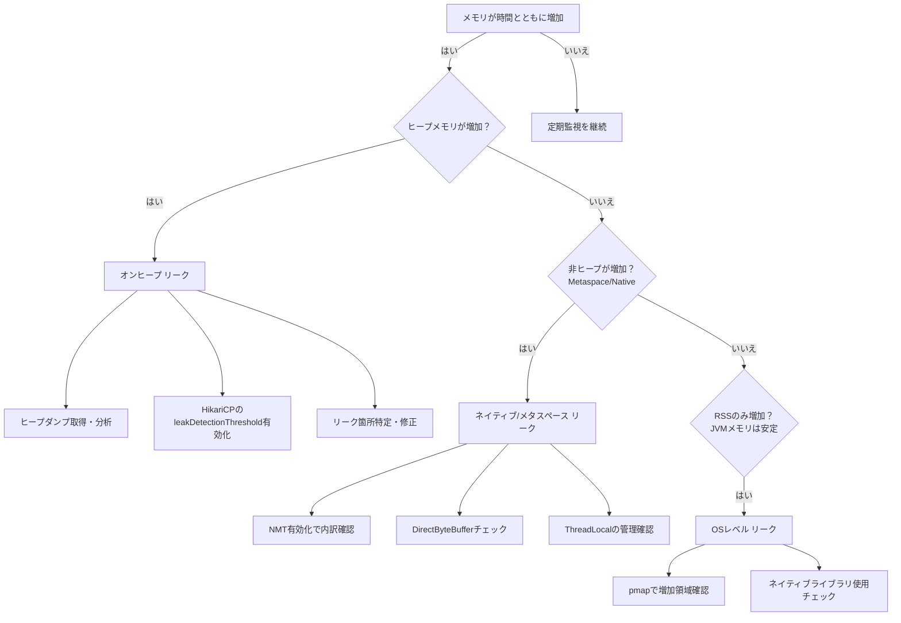

この記事では、Apache Beam、Flink、Spring JDBC、HikariCP、PostgreSQL JDBCドライバを組み合わせた環境で発生するメモリリークの原因を分析し、その対策を解説します。


## 第1章: 問題の切り分けと診断戦略

メモリの問題は、アプリケーション、接続プール、JDBCドライバ、分散フレームワークなど、複数の層の相互作用によって発生します。調査の第一歩は、問題の所在を特定することです。

### 1.1. リークのタイプを特定します

まず、発生している問題が「接続リーク」「オンヒープメモリリーク」「オフヒープメモリリーク」のどれに該当するかを切り分けます。

| リークのタイプ | 症状 | 主な原因 |
| :--- | :--- | :--- |
| **接続リーク** | プールが枯渇し、接続要求がタイムアウトします (`SQLTransientConnectionException`)。 | アプリケーションが接続をプールに返却していません。 |
| **オンヒープ メモリリーク** | JVMヒープ使用量が継続的に増加し、最終的に `OutOfMemoryError: Java heap space` が発生します。 | オブジェクトへの参照が残り続け、GC（ガベージコレクション）が機能しません。 |
| **オフヒープ メモリリーク** | JVMヒープは安定していますが、コンテナのRSS（常駐セットサイズ）が増加し続け、コンテナが強制終了されます。 | Flinkのネットワークバッファや、ネイティブライブラリが直接確保したメモリが解放されていません。 |
| **メタスペース リーク** | ジョブの再起動時にJVMメタスペース使用量が増加し、`OutOfMemoryError: Metaspace` が発生します。 | クラスローダーへの参照が残り、ロードされたクラス定義がGCされません。 |

### 1.2. 診断フローチャート

以下のフローチャートは、リーク箇所を特定するための基本的な診断プロセスです。



**図1: 診断フローチャートの説明**

| 要素名 | 説明 |
| :--- | :--- |
| **オンヒープ リーク** | Javaのヒープ領域で発生する最も一般的なリーク。 |
| **ヒープダンプ分析** | Eclipse MATなどのツールで、メモリを保持しているオブジェクトを特定。 |
| **leakDetectionThreshold** | HikariCPの設定。接続リーク箇所（スタックトレース）をログに出力。 |
| **ネイティブ/メタスペース リーク** | JVM管理外のメモリ、またはクラス定義情報がリーク。 |
| **NMT (Native Memory Tracking)** | JVMのネイティブメモリ使用状況を追跡する機能。 |
| **RSS (Resident Set Size)** | プロセスが使用している物理メモリの総量。 |

### 1.3. 監視すべき主要メトリクス

問題の切り分けと監視のため、以下のメトリクスを収集します。

  * **JVMメモリ:** `jvm.memory.heap.used`, `jvm.memory.non_heap.used`, `jvm.memory.metaspace.used`
  * **GC:** `jvm.gc.pause.duration` (GCによる停止時間), `jvm.gc.overhead.percent` (GC負荷率)
  * **コンテナ (RSS):** `process.resident_memory`
  * **HikariCP:** `hikaricp.connections.active` (アクティブ接続), `hikaricp.connections.idle` (アイドル接続), `hikaricp.connections.pending` (待機スレッド)
  * **Flink:** `flink.taskmanager.heap.used`, `flink.taskmanager.Status.Network.TotalMemorySegments`


## 第2章: アプリケーション層のリーク対策

最も修正が容易で、頻繁に問題が発生する層はアプリケーション層です。

### 2.1. Spring JDBC Template のリソース管理

`JdbcTemplate` はリソースを自動管理しますが、特定のメソッドでは注意が必要です。

#### `queryForStream()` は `try-with-resources` で囲みます

`JdbcTemplate.queryForStream()` が返す `Stream` は、データベース接続を保持しています。この `Stream` を閉じないと、接続がリークします。

```java
// ❌ 悪い例: Streamがクローズされず、接続がリークします
public List<Entity> getAll() {
    return jdbcTemplate.queryForStream(sql, rowMapper)
        .collect(Collectors.toList()); 
}

// ✅ 良い例: try-with-resourcesでStreamを確実にクローズします
public List<Entity> getAll() {
    try (Stream<Entity> stream = jdbcTemplate.queryForStream(sql, rowMapper)) {
        return stream.collect(Collectors.toList());
    }
}
```

#### `@Transactional` 内での長時間処理を避けます

`@Transactional` アノテーションが付いたメソッド内で外部API呼び出しや重い計算を実行すると、その処理が完了するまでデータベース接続が保持され続けます。これにより、接続プールが枯渇する可能性があります。

トランザクションはデータベース操作のみに限定し、長時間かかる処理はトランザクションの外に出します。

```java
// ❌ 悪い例: トランザクション内で外部APIを呼び出します
@Transactional
public List<EntityDto> getAll() {
    return repository.findAll().stream()
        .map(entity -> {
            // 外部API呼び出し中も接続を保持
            ExternalData data = externalClient.getData(entity.getId());
            return toDto(entity, data);
        })
        .toList();
}

// ✅ 良い例: トランザクションと外部呼び出しを分離します
public List<EntityDto> getAll() {
    // 1. データベースアクセスをトランザクション内で完了させる
    List<Entity> entities = getAllEntities();
    
    // 2. 接続解放後、長時間処理を実行する
    return entities.stream()
        .map(entity -> {
            ExternalData data = externalClient.getData(entity.getId());
            return toDto(entity, data);
        })
        .toList();
}

@Transactional(readOnly = true)
public List<Entity> getAllEntities() {
    return repository.findAll();
}
```

### 2.2. Beam/Flink のライフサイクル管理

分散環境では、`DoFn` (Beam) や `RichFunction` (Flink) のライフサイクルを正しく理解することが不可欠です。

#### `@Setup` で初期化し、`@Teardown` でクローズします

データベース接続のような高コストなリソースは、`@Setup` (または `open()`) メソッドでインスタンス化し、`@Teardown` (または `close()`) メソッドでクローズします。

`@ProcessElement` (または `invoke()`) メソッド内で接続を初期化すると、要素ごとに接続の生成・破棄が発生し、パフォーマンスが著しく低下します。

```java
// ✅ 正しいパターン
public class GoodDoFn extends DoFn<String, Void> {
    private transient HikariDataSource dataSource;
    
    @Setup
    public void setup() {
        // ワーカーごとに1回だけ呼ばれる
        HikariConfig config = new HikariConfig();
        config.setMaximumPoolSize(10);
        dataSource = new HikariDataSource(config);
    }
    
    @ProcessElement
    public void processElement(@Element String element) throws SQLException {
        // try-with-resourcesで接続を確実にクローズする
        try (Connection conn = dataSource.getConnection()) {
            // 処理
        }
    }
    
    @Teardown
    public void teardown() {
        // インスタンス破棄時にプールをクローズする
        if (dataSource != null) {
            dataSource.close();
        }
    }
}
```

#### 静的シングルトンパターンで接続プールを共有します

上記パターンでは、`DoFn` のインスタンスごとに接続プールが作成されます。ワーカー（JVM）あたり1つの接続プールを共有するには、静的シングルトンパターンとダブルチェックロックを使用します。

これにより、ワーカー内の全スレッドが1つの `DataSource` を共有し、総接続数を管理下に置けます。

```java
public class JdbcWriteDoFn extends DoFn<Record, Void> {
    // transient: シリアライズ対象外
    // static: JVMごとに1つ
    private static transient HikariDataSource dataSource; 
    private static final Object LOCK = new Object();
    
    @Setup
    public void setup() {
        if (dataSource == null) {
            synchronized (LOCK) {
                if (dataSource == null) { // ダブルチェックロック
                    HikariConfig config = new HikariConfig();
                    config.setMaximumPoolSize(10); // ワーカーあたり10接続
                    dataSource = new HikariDataSource(config);
                }
            }
        }
    }
    
    @ProcessElement
    public void processElement(...) {
        try (Connection conn = dataSource.getConnection()) {
            // ...
        }
    }
    // Teardownでのclose()は、静的シングルトンの場合、
    // ジョブ終了時にフックするなど別の管理方法を検討します。
}
```

**表2: プール管理パターンの比較**

| 側面 | 静的プール（推奨） | インスタンスプール |
| :--- | :--- | :--- |
| スコープ | ワーカー（JVM）あたり1つ | `DoFn` インスタンスごと |
| メモリ使用量 | 低 | 高 |
| 総接続数 | `[ワーカー数] × [poolSize]` | `[ワーカー数] × [スレッド数] × [poolSize]` |

### 2.3. バッチ処理とリトライ

`@ProcessElement` ごとに書き込む代わりに、バンドル単位でバッチ処理を行います。

  * **`@StartBundle`:** バッチ用リストを初期化します。
  * **`@ProcessElement`:** レコードをリストに追加します。バッチサイズに達したら `flushBatch()` を呼び出します。
  * **`@FinishBundle`:** 残りのレコードをフラッシュします。
  * **`flushBatch()`:** 実際のDB書き込み（`executeBatch()`）とリトライロジックを実装します。

<!-- end list -->

```java
public class OptimizedDoFn extends DoFn<Record, Void> {
    private static transient HikariDataSource dataSource;
    private transient List<Record> batch;
    private static final int BATCH_SIZE = 1000;
    
    // ... @SetupでdataSourceを初期化 ...
    
    @StartBundle
    public void startBundle() {
        batch = new ArrayList<>(BATCH_SIZE);
    }
    
    @ProcessElement
    public void processElement(@Element Record record) {
        batch.add(record);
        if (batch.size() >= BATCH_SIZE) {
            flushBatch();
        }
    }
    
    @FinishBundle
    public void finishBundle() {
        if (!batch.isEmpty()) {
            flushBatch();
        }
    }
    
    private void flushBatch() {
        // リトライロジックを実装
        try (Connection conn = dataSource.getConnection()) {
            conn.setAutoCommit(false);
            try (PreparedStatement stmt = conn.prepareStatement("INSERT ...")) {
                for (Record record : batch) {
                    stmt.setString(1, record.getId());
                    stmt.addBatch();
                }
                stmt.executeBatch();
                conn.commit();
            } catch (SQLException e) {
                conn.rollback();
                throw e; // Flink/Beamのリトライ機構に委ねる
            }
        } catch (SQLException e) {
            // 接続取得失敗時の処理
        }
        batch.clear();
    }
}
```


## 第3章: 接続プール層 (HikariCP) の設定

HikariCPの設定ミスは、リソース枯渇の一般的な原因です。

### 3.1. プールサイズ (`maximumPoolSize`)

`maximumPoolSize` は小さく設定します。過剰な接続はパフォーマンスを低下させます。

**推奨計算式:** `connections = ((core_count × 2) + effective_spindle_count)`

  * 多くの場合、**1インスタンスあたり10接続**で十分です。
  * `minimumIdle` は設定せず、`maximumPoolSize` と同値（固定サイズプール）にすることを推奨します。

### 3.2. リーク検出 (`leakDetectionThreshold`)

接続リークを特定するため、この設定を**必ず有効化します**。デフォルト（0）は無効です。

接続が指定時間（ミリ秒）以上返却されない場合、取得箇所のスタックトレースがWARNログに出力されます。

| 環境 | 推奨値 (ms) |
| :--- | :--- |
| 開発環境 | `20000` (20秒) |
| 本番環境 (OLTP) | `60000` (60秒) |
| 本番環境 (長時間クエリ) | `300000` (5分) |

### 3.3. タイムアウト設定の整合性

データベース側のタイムアウト設定と矛盾すると、プールが枯渇します。

  * **`maxLifetime` (接続の最大生存期間):**
      * **必須:** データベース側の接続タイムアウト（例: 30分）より**数分短く**設定します（例: 28分）。
      * `maxLifetime` がDB側より長いと、DBが切断した「死んだ」接続がプールに残り、プールが枯渇します。
  * **`idleTimeout` (アイドル接続の解放):** `maxLifetime` より短く設定します（例: 10分）。
  * **`keepaliveTime` (接続維持):** `idleTimeout` より短く設定します（例: 5分）。アイドル状態でも、この間隔で接続をテストし、プールからの除外を防ぎます。


## 第4章: JDBCドライバ層 (PostgreSQL) の問題

JDBCドライバ自体に、特定のバージョンや設定でリークやメモリを過剰消費する問題が存在します。

### 4.1. 推奨バージョンと既知のリーク

ドライバのバージョンは慎重に選択します。

| バージョン | 問題点 |
| :--- | :--- |
| 42.2.2以前 | **UTF-8デコーダリーク。** 大きなテキストを読み込むとメモリが拡大し続けます。 |
| 42.6.0 | **LazyCleaner クラスローダーリーク。** Tomcatなど、頻繁にクラスローダーの再読み込みが発生する環境でアプリケーションを再デプロイすると、ClassLoaderがリークします。 |

**推奨バージョン:**

  * **Tomcat/Jetty環境:** **`42.5.4`** (LazyCleanerリークを回避)
  * **スタンドアロン/Spring Boot/Flink環境:** **`42.7.x`** (最新の修正を適用)

### 4.2. 大規模ResultSetのストリーミング設定 (`fetchSize`)

PostgreSQL JDBCドライバは、デフォルトで**すべての結果セットを一度にメモリにフェッチします**。数百万行のデータをSELECTすると、即座にヒープを使い果たします。

カーソルを使い、ストリーミングでデータを取得するには、以下の**両方**を設定します。

```java
// 1. 自動コミットを無効化
conn.setAutoCommit(false); 

PreparedStatement stmt = conn.prepareStatement(sql,
    ResultSet.TYPE_FORWARD_ONLY,
    ResultSet.CONCUR_READ_ONLY);

// 2. フェッチサイズを設定 (0以外)
// この値がカーソルから一度に読み込む行数になる
stmt.setFetchSize(5000); 

ResultSet rs = stmt.executeQuery();
while (rs.next()) {
    // 5000行ずつフェッチされる
}
```

### 4.3. 警告チェーンリーク (`clearWarnings()`)

ドライバは `SQLWarning` オブジェクトを接続にチェーン状に蓄積します。接続プールがこれをクリアしないと、メモリリークの原因となります。

**対策:**
`HikariCP` は、接続をプールに返却する際に内部で `clearWarnings()` を自動的に呼び出すため、**通常はHikariCPユーザーがこの問題を意識する必要はありません。**

ただし、自前で接続管理を行う場合や、HikariCP以外のプール（特に古いもの）を使用する場合は、接続をプールに返却する直前に `connection.clearWarnings()` を `finally` ブロックで呼び出すことを検討してください。


## 第5章: 分散フレームワーク特有の問題

Beam/Flinkの分散実行モデルとステート管理に起因する問題です。

### 5.1. シリアライゼーション (`transient`)

`DoFn` や `RichFunction` は、シリアライズされてワーカーに配布されます。`HikariDataSource` のような接続プールオブジェクトはシリアライズ不可能です。

フィールドに `transient` 修飾子を付け、シリアライズ対象から除外します。`transient` フィールドはデシリアライズ後に `null` になるため、`@Setup` や `open()` で再初期化します。

```java
// 接続プールはシリアライズ不可のため transient を付ける
private transient HikariDataSource dataSource;

@Setup
public void setup() {
    // ワーカー上でデシリアライズされた後、null になっている
    // dataSource をここで初期化する
    dataSource = new HikariDataSource(config); 
}
```

### 5.2. クラスローダーリーク (ThreadLocal)

Flinkはスレッドプールでスレッドを再利用します。`ThreadLocal` を使用した後、`finally` ブロックで `.remove()` を呼び出さないと、値がスレッドに残り続けます。

ジョブが再起動すると、古いジョブの `FlinkUserClassLoader` への参照が `ThreadLocal` 経由で残り、メタスペースがリークします。

```java
// ❌ 悪い例: remove() を呼び出していません
public static final ThreadLocal<Connection> dbConnection = new ThreadLocal<>();

public void processStreamRecord(Record record) {
    dbConnection.set(getConnection());
    // 処理
}

// ✅ 良い例: finallyブロックで確実にremove()を呼び出します
public void processStreamRecord(Record record) {
    try {
        dbConnection.set(getConnection());
        // 処理
    } finally {
        dbConnection.remove(); 
    }
}
```

### 5.3. 無限の状態増大

これはバグではなく、ロジック上の問題です。「キー空間が無限（例: ユーザーIDごと）」かつ「状態をクリアする仕組みがない（例: `GlobalWindow` をトリガーなしで使用）」場合、状態は無限に増大し続け、いずれメモリを使い果たします。

**対策:**

  * `State TTL (Time-To-Live)` を設定し、古い状態を自動的に破棄します。
  * ウィンドウイングのロジックを見直し、有限なキー空間や、適切にクローズされるウィンドウを使用します。


## 第6章: 対策まとめ (本番チェックリスト)

Beam/Flink環境でのJDBCメモリリークを防止するための最終チェックリストです。

### 6.1. 必須対策リスト

1.  **HikariCP設定の確認:**
      * `maximumPoolSize` を小さな値（例: 10）に設定します。
      * `leakDetectionThreshold` を有効化します（例: 60000）。
      * `maxLifetime` をDBのタイムアウトより短く設定します。
2.  **Beam/Flinkのライフサイクル管理:**
      * `DataSource` フィールドに `transient` 修飾子を付けます。
      * `@Setup` (`open`) で初期化し、`@Teardown` (`close`) でクローズします。
      * 静的シングルトンパターンを使用し、ワーカー（JVM）ごとに1つのプールを共有します。
3.  **PostgreSQL JDBCドライバ:**
      * 推奨バージョン（`42.5.4` または `42.7.x`）を使用します。
      * 大規模な `SELECT` では `fetchSize` と `autoCommit=false` を設定します。
4.  **Spring JDBC Template:**
      * `queryForStream()` は `try-with-resources` で囲みます。
      * `@Transactional` 内で外部API呼び出しなどの長時間処理を実行しません。
5.  **リソース管理の徹底:**
      * `ThreadLocal` は `finally` ブロックで `.remove()` を呼び出します。
      * `try-with-resources` を使用して、`Connection`, `Statement`, `ResultSet` を確実にクローズします。

### 6.2. 推奨設定値の例

**表3: 推奨設定パラメータ**

| コンポーネント | パラメータ | 設定例 | 目的と重要性 |
| :--- | :--- | :--- | :--- |
| JVM | `-Xmx` / `-Xms` | `-Xmx8g -Xms8g` | ヒープサイズ。開始時と最大値を揃え、安定動作させます。 |
| JVM | `-XX:+HeapDumpOnOutOfMemoryError` | `true` | 診断に必須。OOM発生時にヒープダンプを自動生成します。 |
| JVM | `-XX:NativeMemoryTracking` | `summary` | 診断用。オフヒープリーク調査時に使用します。 |
| HikariCP | `maximumPoolSize` | `10` | 接続数の上限。過剰設定を避けます。 |
| HikariCP | `leakDetectionThreshold` | `60000` | 診断に必須。接続リーク箇所をログに出力します。 |
| HikariCP | `maxLifetime` | `1680000` (28分) | DBタイムアウト（例: 30分）より短く設定し、死んだ接続を回避します。 |
| HikariCP | `keepaliveTime` | `300000` (5分) | アイドル時も接続を維持し、`idleTimeout` による解放を防ぎます。 |
| Postgres | `prepareThreshold` | `0` | PgBouncerのトランザクションモード使用時に、サーバー側プリペアドステートメントを無効化します。 |

この記事が、あなたの問題解決の一助になれば幸いです。

この記事が少しでも参考になった、あるいは改善点などがあれば、ぜひリアクションやコメント、SNSでのシェアをいただけると励みになります！


-----

## 参考リンク

- **Apache Beam & Flink**
  - [Dataflow pipeline best practices | Google Cloud](https://cloud.google.com/dataflow/docs/guides/pipeline-best-practices)
  - [ParDo - Apache Beam® - The Apache Software Foundation](https://beam.apache.org/documentation/transforms/python/elementwise/pardo/)
  - [Overview: Developing a new I/O connector - Apache Beam®](https://beam.apache.org/documentation/io/developing-io-overview/)
  - [Classloader memory leak on job restart (FlinkRunner) - Apache Mail Archives](https://lists.apache.org/thread/84j3dofc8k7goqcpdz2n6kwyl0rkhrpc)
  - [Flink local mini cluster is causing memory leak when triggered ... - Apache Mail Archives](https://lists.apache.org/thread/hp3gj89or92o4vkqk7p2qp1v4r8ncrc9)
  - [[Bug]: Flink Job manager metaspace classloader leak caused by not releasing PipelineOptionFactory DESERIALIZATION_CONTEXT · Issue #29890 · apache/beam](https://github.com/apache/beam/issues/29890)
  - [[Python SDK] Memory leak in 2.47.0 - 2.51.0 SDKs. · Issue #28246 · apache/beam](https://github.com/apache/beam/issues/28246)
  - [Beam on Flink runner not able to advance watermarks on a high load - Stack Overflow](https://stackoverflow.com/questions/69980556/beam-on-flink-runner-not-able-to-advance-watermarks-on-a-high-load)
  - [Apache Flink OutOfMemoryError - Doctor Droid](https://drdroid.io/stack-diagnosis/apache-flink-outofmemoryerror)
  - [How to debug Flink OutOfMemory Errors from Checkpoints - Coditation](https://www.coditation.com/blog/how-to-debug-flink-outofmemory-errors-from-checkpoints)
  - [Apache Flink Table: In-Memory Concepts Explained — Clear Your Doubts | by Kamal Maiti](https://medium.com/@kamal.maiti/apache-flink-table-in-memory-concepts-explained-clear-your-doubts-e15b816da8ba)
  - [Memory Management in Apache Flink: Techniques for Efficient State Handling - IJIRMPS](https://www.ijirmps.org/papers/2023/6/231999.pdf)
  - [Flink webUI - GC time - Stack Overflow](https://stackoverflow.com/questions/78905698/flink-webui-gc-time)
- **HikariCP (Connection Pool)**
  - [New minimumIdle connections every maxLifetime causing MySQL'AbandonedConnectionCleanupThread Memory Leak · Issue #1473 · brettwooldridge/HikariCP](https://github.com/brettwooldridge/HikariCP/issues/1473)
  - [Memory leak when constantly resetting pool as a result of system time changes · Issue #746 · brettwooldridge/HikariCP](https://github.com/brettwooldridge/HikariCP/issues/746)
  - [How to Deal with HikariCP Connection Leaks. Part 1. | Medium](https://medium.com/@eremeykin/how-to-deal-with-hikaricp-connection-leaks-part-1-1eddc135b464)
  - [Optimizing Database Connections with HikariCP in Spring Boot 3+ and Java 21 - Medium](https://medium.com/@ahmettemelkundupoglu/optimizing-database-connections-with-hikaricp-in-spring-boot-3-and-java-21-80fab58cc1c7)
  - [Optimizing Database Connectivity: A Comparative Analysis of Tomcat JDBC vs. HikariCP - DZone](https://dzone.com/articles/optimizing-database-connections)
  - [Why does HikariCP recommend fixed size pool for better performance - Stack Overflow](https://stackoverflow.com/questions/28987540/why-does-hikaricp-recommend-fixed-size-pool-for-better-performance)
- **PostgreSQL JDBC Driver**
  - [Changelogs | pgJDBC](https://jdbc.postgresql.org/changelogs/)
  - [PostgreSQL® Extensions to the JDBC API | pgJDBC](https://jdbc.postgresql.org/documentation/server-prepare/)
  - [Fix Postgresql JDBC driver leaking memory · 80476a51df - gerrit - OpenDev](https://opendev.org/opendev/gerrit/commit/80476a51df8361814e9cd5d91ceb60e8bf41cae5)
  - [Memory leak for long running connections · Issue #1336 - pgjdbc/pgjdbc](https://github.com/pgjdbc/pgjdbc/issues/1336)
  - [Profiling on PostgreSQL database fails with the OutOfMemory Error - Search](https://knowledge.informatica.com/s/article/Profiling-on?language=en_US)
- **Spring Framework**
  - [Connection leaks with Spring JdbcTemplate | by Fan Liu | Medium](https://medium.com/@sharprazor.app/connection-leak-with-spring-jdbctemplate-93e7d6bb0704)
- **Java メモリリーク（一般）と診断ツール**
  - [Java VisualVM - Oracle Help Center](https://docs.oracle.com/javase/8/docs/technotes/guides/visualvm/heapdump.html)
  - [Memory Analyzer (MAT) - The Eclipse Foundation](https://eclipse.dev/mat/)
  - [Java & Android Memory Analyzer | Heap Dump Analysis - HeapHero](https://heaphero.io/)
  - [How to Spot and Fix Memory Leaks in Java? - Last9](https://last9.io/blog/how-to-spot-and-fix-memory-leaks-in-java/)
  - [Java memory leak investigation - Medium](https://medium.com/@chrisbrat_17048/java-memory-leak-investigation-8add1314e33b)
  - [Understanding Memory Leaks in Java: Common Causes & How to Detect Them - Sematext](https://sematext.com/blog/java-memory-leaks/)
  - [Memory Leaks in Java - GeeksforGeeks](https://www.geeksforgeeks.org/java/memory-leaks-in-java/)
  - [Lessons from debugging a tricky direct memory leak | by Pinterest ...](https://medium.com/pinterest-engineering/lessons-from-debugging-a-tricky-direct-memory-leak-f638c722d9f2)
