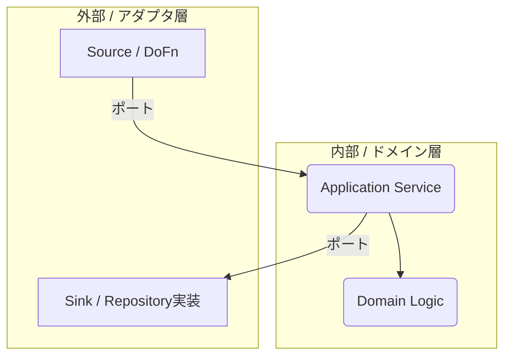

このガイドは、Java版 Apache Beam を用いて、高性能で堅牢、かつ保守性の高いデータパイプラインを構築するための、実践的なベストプラクティス集です。基本的な設計原則から、パフォーマンスチューニング、テスト戦略、さらにはヘキサゴナルアーキテクチャの導入まで、Beam のポテンシャルを最大限に引き出すための知見を体系的に解説します。Beam の基本を習得した開発者が、次のレベルへとステップアップするための指針となることを目指します。

### 第1章 パイプラインアーキテクチャの基本原則

優れたパイプラインの構築は、処理の有向非巡回グラフ（DAG）をいかに設計するかにかかっています。この章では、モジュール性、可読性、保守性を高めるためのグラフ設計パターンについて説明します。

#### 1.1 パイプライングラフの設計

Beamのパイプラインは、データセット（`PCollection`）とデータ処理操作（`PTransform`）で構成されるDAGです。単純な直線的な処理だけでなく、データの流れを分岐させたり、複数の流れを合流させたりすることで、より洗練されたパイプラインを構築できます。

##### 分岐パターン

`PCollection`を分岐させる主な方法には、以下の2つがあります。

1.  **複数の変換を同一の`PCollection`に適用する**
    最も直感的な方法です。一つの入力`PCollection`を、複数の異なる`PTransform`の入力として使用します。この方法は概念的に単純ですが、各要素に対する共通の初期処理（例：データ形式のデコード）を分岐後の各`PTransform`が個別に行うことになり、非効率になる場合があります。

2.  **タグ付き出力を持つ単一の変換を使用する**
    単一の`ParDo`変換内で各要素を一度だけ処理し、条件に応じて「タグ付き出力（Tagged Outputs）」を使い、異なる`PCollection`に振り分ける、より効率的な方法です。計算コストの高い処理を伴う複雑な条件分岐に特に有効です。

##### マージと結合パターン

分岐した`PCollection`をまとめるには、以下の方法があります。

| パターン | 説明 |
| :--- | :--- |
| **Flatten** | 同じ型を持つ複数の`PCollection`を、単一の`PCollection`にマージ |
| **CoGroupByKey** | 同じキーを持つ全ての値をグループ化し、柔軟な操作を実現 |
| **Join** | スキーマを持つ`PCollection`に対し、SQLのような内部/外部結合を提供 |

結合方法の選択は、データサイズや処理内容に依存します。片方の`PCollection`がワーカーのメモリに収まるほど小さい場合は、Side Inputとしてブロードキャストする方が効率的です。一方、巨大な`PCollection`同士を結合する場合は`CoGroupByKey`が適しています。

#### 1.2 Composite Transformによるカプセル化と再利用

パイプラインが複雑になるにつれて、特定のロジックをカプセル化し、再利用可能にすることが重要です。`Composite Transform`は、一連のサブトランスフォームを単一のユーザー定義`PTransform`として束ねる仕組みです。

例えば、「行の読み込み → 単語への分割 → カウント」という一連の処理を`CountWords`という`Composite Transform`にまとめることができます。

**リファクタリング前（フラットなパイプライン）**

```java
// Flat pipeline structure
PCollection<String> lines =...;
PCollection<String> words = lines.apply("ExtractWords", ParDo.of(new DoFn<String, String>() {
    @ProcessElement
     public void processElement(@Element String line, OutputReceiver<String> out) {
         for (String word : line.split("[^\\p{L}]+")) {
             if (!word.isEmpty()) {
               out.output(word);
            }
     }
    }
}));
PCollection<KV<String, Long>> wordCounts = words.apply(Count.perElement());
```

**Composite Transformの定義**

```java
public class CountWords extends PTransform<PCollection<String>, PCollection<KV<String, Long>>> {
    @Override
     public PCollection<KV<String, Long>> expand(PCollection<String> lines) {
        // Transform a PCollection of lines into a PCollection of words.
        PCollection<String> words = lines.apply("ExtractWords", ParDo.of(new DoFn<String, String>() {
            @ProcessElement
             public void processElement(@Element String line, OutputReceiver<String> out) {
                 for (String word : line.split("[^\\p{L}]+")) {
                     if (!word.isEmpty()) {
                        out.output(word);
                    }
                }
            }
        }));
        // Count the number of times each word occurs.
        PCollection<KV<String, Long>> wordCounts = words.apply(Count.perElement());
         return wordCounts;
    }
}
```

**リファクタリング後（Composite Transformの使用）**

```java
// Main pipeline using the composite transform
PCollection<KV<String, Long>> wordCounts = lines.apply("Count Words", new CountWords());
```

このカプセル化には、以下の利点があります。

  * **可読性の向上**: メインパイプラインのビジネスロジックが高レベルで記述される
  * **再利用性の向上**: `CountWords`を他のパイプラインで簡単に利用できる
  * **テスト容易性の向上**: `Composite Transform`を一つのユニットとして分離してテストできる

### 第2章 DoFnの粒度とランナーのフュージョン

`DoFn`はパイプラインの心臓部ですが、その内部ロジックをどのように構成するか（粒度）は、性能と保守性を大きく左右します。本章では、「モノリシック（巨大な単一DoFn）」と「グラニュラー（小さな複数DoFn）」という対照的な2つのアプローチを、Beamランナーの強力な最適化機能である「フュージョン」との関係性から深く分析します。

#### 2.1 DoFnの設計アプローチ

##### モノリシックDoFn：単一のロジック集約点

複数の論理操作（例：JSONのパース、検証、外部API連携）を、単一の`@ProcessElement`メソッド内に実装する設計です。

  * **利点**
      * **データ局所性**: 全ての操作が同じ関数内で完結し、理解しやすい場合がある
      * **シリアライゼーションの削減（可能性）**: 中間`PCollection`を実体化しないため、オーバーヘッドを回避できる可能性がある
  * **欠点**
      * **低い再利用性**: ロジックが密結合しており、分離して再利用できない
      * **困難なテスト**: 特定のロジックをテストするために、他の処理をモックする必要がある
      * **可読性の低下**: メソッドが長くなり、理解と保守が困難になる

##### グラニュラーDoFn：単一責任の原則

それぞれが単一のタスクを担当する複数の`DoFn`としてパイプラインを構成する設計です。

  * **利点**
      * **高い再利用性**: 各`DoFn`を他のパイプラインでも再利用できる
      * **単純化されたテスト**: 各`DoFn`を独立したユニットとしてテストできる
      * **可読性と保守性の向上**: パイプライングラフ自体が処理ステップを文書化する
  * **欠点**
      * **パフォーマンスオーバーヘッドへの懸念**: 複数の`PCollection`を生成することによるオーバーヘッドが懸念される

#### 2.2 決定要因：ランナーのフュージョン最適化

「複数のDoFnに分けると、中間データの受け渡しでオーバーヘッドが生じるのではないか？」というグラニュラーアプローチへの懸念を解消する鍵が、ランナーによる「フュージョン（融合）」最適化です。

  * **フュージョンとは**
    ランナーが連続する複数の`ParDo`変換を単一の実行ステージに結合する最適化手法です。これにより、中間`PCollection`を永続化することなく、要素はメモリ内で直接次の処理に渡されます。

  * **フュージョンが発生する条件**
    フュージョンは通常、`ParDo`、`Map`、`Filter`のような要素ごとの逐次的な操作に対して行われます。`GroupByKey`や`Reshuffle`のように、データのシャッフルを必要とする操作は「フュージョンブレーク」として機能し、ステージの境界を定義します。

フュージョンにより、グラニュラーな`DoFn`の連鎖は、モノリシックな`DoFn`とほぼ同等のパフォーマンスを達成しつつ、ソフトウェアエンジニアリング上の利点を維持できます。

#### 2.3 Reshuffleによる戦略的なフュージョンブレーク

ランナーの自動フュージョンは強力ですが、意図的にフュージョンを中断した方が良い場合もあります。`Reshuffle`は、データを実体化し、ワーカー間で再分配を強制する変換です。

**主なユースケース**

  * **データスキューの解消**: 処理が特定のワーカーに偏る「ホット」なパーティションを解消し、データを均等に再分配
  * **高ファンアウト後の並列化**: 一つの入力から大量の出力が生成された後、後続の処理を並列化
  * **チェックポイント**: ストリーミングパイプラインで障害発生時の再計算コストを削減

`Reshuffle`は、開発者がランナーのデフォルトの実行計画が最適でないと判断した場合に使用する高度なツールです。

#### 2.4 DoFn粒度戦略の比較

| 特性 | モノリシック DoFn | グラニュラー DoFn |
| :--- | :--- | :--- |
| **可読性** | 低い。複数責務が混在。 | 高い。パイプラインが処理を文書化。 |
| **再利用性** | 非常に低い。ロジックが密結合。 | 非常に高い。独立したコンポーネント。 |
| **テスト容易性** | 困難。モックが必要で複雑化。 | 容易。単体テストが可能。 |
| **ランナーのフュージョン** | 適用外。 | ランナーが自動的に最適化。 |
| **パフォーマンス** | デフォルトでは良好だが、スキューやファンアウト時に単一ワーカーがボトルネックになる可能性。 | フュージョンにより良好。Reshuffleを併用し、より高いスケーラビリティを発揮可能。 |

**結論として、まずグラニュラーな設計から始め、ランナーの最適化に任せるべきです。** パフォーマンスボトルネックが観測された場合にのみ、`Reshuffle`を戦略的に挿入するアプローチが最も効果的です。

### 第3章 高性能パイプラインの実装

この章では、リソース使用率とスループットを最大化するための、具体的な実装テクニックを解説します。

#### 3.1 Coderの重要な役割

`Coder`は、`PCollection`の要素をバイト列表現に変換（シリアライズ・デシリアライズ）する役割を担います。この変換処理は、ワーカー間のデータシャッフル時や、中間データの永続化時に頻繁に発生するため、`Coder`の選択はパイプライン全体のパフォーマンス（特にネットワーク帯域、ディスクI/O、CPU使用率）に絶大な影響を与えます。

* **ベストプラクティス**
    * デフォルトのJavaシリアライゼーションは避け、`AvroCoder`や`ProtoCoder`のような効率的なCoderを使用します。
    * 特に、Beam Schemaと`@DefaultSchema`アノテーションを使用すると、Beamが非常に効率的な`RowCoder`を自動生成するため、最善の選択肢となります。

    | 特徴 | `@DefaultSchema` (RowCoder) | `AvroCoder` | `ProtoCoder` |
    | :--- | :--- | :--- | :--- |
    | **主な用途** | **Beamパイプライン内部**の処理 | データレイク、スキーマ進化、Kafka連携 | RPC、パフォーマンス重視、gRPC連携 |
    | **手軽さ** | ◎ (アノテーションのみ) | ◯ (スキーマ定義ファイルが必要) | ◯ (スキーマ定義とコード生成が必要) |
    | **エコシステム** | **Beamネイティブ** | Hadoop, Spark, Kafka | gRPC, マイクロサービス |
    | **パフォーマンス** | ◎ (Beam内部で最適化) | ◯ (高速) | ◎ (非常に高速) |


* **`@DefaultSchema` と `RowCoder` の仕組み**
  * **Schemaの自動推論**: Beamは`@DefaultSchema`が付いたクラス（POJO）から、フィールド名や型などのスキーマ情報を自動で推論します。
  *  **`RowCoder`の自動適用**: 推論したスキーマ情報をもとに、Beamはそのクラス専用の非常に効率的な`Coder`である **`RowCoder`** を生成し、対象の`PCollection`に自動で適用します。
  *  **自動的な変換**: この`RowCoder`が、パイプラインの内部でデータがワーカー間を移動（シャッフル）する際に、シリアライズ（Javaオブジェクト → `Row` → バイト列）と **デシリアライズ（バイト列 → `Row` → Javaオブジェクト）** の全ての処理を裏側で担当します。

* **サンプル**

  ```java
  import org.apache.beam.sdk.schemas.JavaBeanSchema;
  import org.apache.beam.sdk.schemas.annotations.DefaultSchema;
  import java.io.Serializable;

  /** ユーザーイベントを表すPOJO */
  @DefaultSchema(JavaBeanSchema.class)
  public class UserEvent implements Serializable {
    private String userId;
    private String eventType;
    private long eventTimestamp;

    // publicなデフォルトコンストラクタと、各フィールドのgetter/setterが必須
    public UserEvent() {}

    // getters and setters...
  }
  ```

  ```java
  // PCollection<UserEvent>を処理するDoFn
  public class ProcessUserEventFn extends DoFn<UserEvent, String> {

    @ProcessElement
    public void processElement(@Element UserEvent event, OutputReceiver<String> out) {
      // このメソッドが呼ばれる時点で、'event'は完全にデシリアライズされた
      // UserEventオブジェクトになっています。
      
      // あとは通常のJavaオブジェクトとしてプロパティにアクセスするだけです。
      String summary = String.format(
          "User %s did '%s' at %d",
          event.getUserId(),
          event.getEventType(),
          event.getEventTimestamp()
      );
      
      out.output(summary);
    }
  }
  ```


#### 3.2 データスキューとホットキーの緩和

データスキュー（データの偏り）は、分散処理における深刻なパフォーマンスキラーです。`GroupByKey`のような集約処理において、特定のキーにデータが極端に集中すると、そのキーを担当する単一のワーカーに処理が偏り、パイプライン全体がそのワーカーの処理完了を待つ「ホットキー」問題を引き起こします。

* **解決策: `Combine.PerKey.withHotKeyFanout`**
  この変換は、ホットキーを複数のサブキーに分割して事前集約を行い、負荷を分散させます。これにより、開発者が手動でキーにソルトを追加するような複雑な回避策を実装することなく、データスキュー問題を堅牢に解決できます。
* **サンプル**

  ```java
  public class HotKeyFanoutExample {

    public static void main(String[] args) {
      // --- 1. セットアップ ---
      PipelineOptions options = PipelineOptionsFactory.create();
      Pipeline p = Pipeline.create(options);

      // --- 2. スキューのあるテストデータを作成 ---
      // "hotkey" という単語が10,000回出現し、他の単語は1回だけ。
      // これにより、"hotkey" が集計処理のボトルネック（ホットキー）になる状況を再現。
      final List<String> skewedData = new ArrayList<>();
      skewedData.addAll(Collections.nCopies(10_000, "hotkey"));
      skewedData.addAll(Arrays.asList("normal", "regular", "common"));

      // --- 3. パイプラインの構築 ---
      p.apply("CreateSkewedData", Create.of(skewedData))
      
      // 各単語を (単語, 1) のKVペアに変換する
      .apply("MapToKV", MapElements
          .into(TypeDescriptors.kvs(TypeDescriptors.strings(), TypeDescriptors.longs()))
          .via(word -> KV.of(word, 1L)))
      
      // --- ここが重要：withHotKeyFanout を使った集計 ---
      // Sum.ofLongs() は、キーごとの値を合計するCombineFn（集計関数）。
      .apply("CombineWithHotKeyFanout", Combine.<String, Long, Long>perKey(new Sum.OfLongs())
          // ホットキーが検出された場合、最大4つのサブキーに分割して並列処理する
          .withHotKeyFanout(4))

      // 結果をコンソールに出力
      .apply("FormatAndPrint", MapElements
          .into(TypeDescriptors.strings())
          .via(kv -> kv.getKey() + ": " + kv.getValue()))
      .apply("PrintToConsole", MapElements.into(TypeDescriptors.voids()).via(output -> {
        System.out.println(output);
        return null;
      }));

      // --- 4. パイプラインの実行 ---
      p.run().waitUntilFinish();
    }
  ```

#### 3.3 外部システムとの効率的な連携

ナイーブな実装では、各要素に対してRPCコールを行い、外部サービスを簡単に過負荷状態にしてしまいます。

* **解決策: DoFnライフサイクル内でのバッチ処理**
  `@StartBundle`でバッチ用のコレクションを初期化し、`@ProcessElement`で要素をバッチに追加します。そして、`@FinishBundle`でバッチを単一のRPCコールとして外部サービスに送信します。これにより、RPCコールのコストが償却され、外部システムへの負荷が劇的に削減されます。
* **サンプル**

  ```java
  public class BundleLifecycleExample {
    // --- バンドルライフサイクルアノテーションを利用したDoFn ---
    public static class BatchApiWriterFn extends DoFn<String, Void> {

      // DoFnと一緒にシリアライズされないようにtransientで宣言
      private transient ApiClient client;
      
      // 現在のバンドルのレコードを保持するバッファ
      private List<String> batch;

      // メモリを使いすぎないようにバッチサイズを定義
      private static final int BATCH_SIZE = 100;

      @Setup
      public void setup() {
        // DoFnインスタンスごとに1回だけ呼ばれる。シリアライズ不可能なフィールドの初期化に適している
        client = new ApiClient();
      }

      @StartBundle
      public void startBundle() {
        // 要素のバンドル処理を開始する直前に呼ばれる
        // ここでバッチバッファを初期化する
        batch = new ArrayList<>();
        System.out.println("--- バンドル開始。バッチを初期化しました。 ---");
      }

      @ProcessElement
      public void processElement(@Element String element) {
        // バンドル内の各要素に対して呼ばれる
        // 要素をバッチバッファに追加するだけ
        batch.add(element);

        // バッチが最大サイズに達したら、すぐに書き出す
        // これにより、バッファがメモリ内で大きくなりすぎるのを防ぐ
        if (batch.size() >= BATCH_SIZE) {
          flushBatch();
        }
      }

      @FinishBundle
      public void finishBundle() {
        // バンドル内のすべての要素が処理された後に呼ばれる
        // バッファに残っている要素を処理する最後のチャンス
        flushBatch();
        System.out.println("--- バンドル終了。 ---");
      }
      
      @Teardown
      public void teardown() {
        // DoFnインスタンスが破棄される直前に1回だけ呼ばれる
        // コネクションのクローズなど、リソースの解放に適している
        client.close();
      }
      
      private void flushBatch() {
          // 外部サービスにバッチを送信するヘルパーメソッド
          if (!batch.isEmpty()) {
              client.writeBatch(batch);
              batch.clear(); // 書き込み後にバッチをクリア
          }
      }
    }


    public static void main(String[] args) {
      PipelineOptions options = PipelineOptionsFactory.create();
      Pipeline p = Pipeline.create(options);

      // 処理対象の250件のレコードを作成
      // Beamランナーは、これをいくつかのバンドルに分割する可能性が高い
      List<String> data = IntStream.range(1, 251)
                                  .mapToObj(i -> "Record-" + i)
                                  .collect(Collectors.toList());

      p.apply("CreateData", Create.of(data))
      .apply("BatchWriteToApi", ParDo.of(new BatchApiWriterFn()));

      p.run().waitUntilFinish();
      // 正確な出力はBeamランナーのバンドル分割方法に依存しますが、おおよそ以下のようになります。
      // 
      // > client 初期化
      // --- バンドル開始。バッチを初期化しました。 ---
      // > client.writeBatch: 100件
      // > client.writeBatch: 100件
      // > client.writeBatch: 50件
      // --- バンドル終了。 ---
      // > client.close
    }
  }
  ```


#### 3.4 パフォーマンス最適化技術のまとめ

| ボトルネック/問題 | 説明 | 主要なApache Beamソリューション |
| :--- | :--- | :--- |
| **シリアライゼーションのオーバーヘッド** | 非効率なデータ表現による、シャッフル中の過剰なCPU/ネットワーク使用 | `@DefaultSchema`とRowCoderの使用 |
| **ホットキー / データスキュー** | GroupByKeyやCombine操作中に単一のワーカーが過負荷になる状態 | `Combine.PerKey.withHotKeyFanout()` |
| **外部サービスの過負荷** | 大量の書き込みによるAPIレート制限やDB接続プールの枯渇 | `@StartBundle`と`@FinishBundle`を使用したRPCコールのバッチ処理 |

### 第4章 堅牢性と耐障害性の確保

本番環境のパイプラインは、不完全なデータや一時的なインフラ障害を乗り越えなければなりません。この章では、データの正確性とパイプラインの安定性を保証する技術を解説します。

#### 4.1 デッドレターキューパターンの実装

処理不可能なレコードが一つでもあると、バンドル全体が失敗し、パイプラインが停止する可能性があります。

* **解決策**
  デッドレターキューパターンは、処理に失敗したレコードをメインのデータフローから分離し、別の`PCollection`に出力する手法です。これにより、パイプライン本体は正常なデータの処理を継続できます。`DoFn`内でtry-catchブロックとタグ付き出力（`TupleTag`）を使用して実装するのが一般的です。

このパターンは、入力データが不完全であっても、パイプラインが有効なデータを時間通りに処理するというSLA（Service Level Agreement）の達成を可能にします。

* **サンプル**

  ```java
  public class DlqPatternExample {

    // --- 1. TupleTagの定義 ---
    // 処理成功データの出力先タグ (POJOクラスの型を指定)
    static final TupleTag<ParsedEvent> mainOutputTag = new TupleTag<ParsedEvent>(){};
    // 処理失敗データの出力先タグ (今回は元の文字列をそのまま流すのでString型)
    static final TupleTag<String> deadLetterTag = new TupleTag<String>(){};


    // JSONパース後のデータ形式を定義するPOJO
    public static class ParsedEvent implements Serializable {
      String eventId;
      String payload;

      @Override
      public String toString() {
        return "ParsedEvent{" + "eventId='" + eventId + '\'' + ", payload='" + payload + '\'' + '}';
      }
    }

    // --- 2. try-catchとタグ付き出力を持つDoFnの実装 ---
    public static class JsonParsingFn extends DoFn<String, ParsedEvent> {
      
      // Gsonインスタンスはシリアライズ可能なので、transientにする必要はない
      private final Gson gson = new Gson();

      @ProcessElement
      public void processElement(@Element String json, MultiOutputReceiver out) {
        try {
          // JSON文字列をPOJOにパースしてみる
          ParsedEvent event = gson.fromJson(json, ParsedEvent.class);
          
          // 成功したら、メインの出力タグへデータを送る
          out.get(mainOutputTag).output(event);

        } catch (JsonSyntaxException e) {
          // パースに失敗したら(JsonSyntaxExceptionなど)、
          // 元のJSON文字列をDLQ用のタグへ送る
          out.get(deadLetterTag).output(json);
        }
      }
    }

    public static void main(String[] args) {
      Pipeline p = Pipeline.create(PipelineOptionsFactory.create());

      // 正しいJSONと、不正なJSONが混在したテストデータ
      final List<String> jsonData = Arrays.asList(
          "{\"eventId\": \"id-001\", \"payload\": \"hello world\"}",
          "{\"eventId\": \"id-002\", \"payload\": \"beam pipeline\"}",
          "this is not a valid json", // 不正なデータ
          "{\"eventId\": \"id-003\", \"payload\": \"dlq example\"}",
          "{\"broken_json\": true" // 不正なデータ
      );

      // --- 3. パイプラインの構築 ---
      // タグをDoFnに知らせるために`.withOutputTags()`を使用する
      PCollectionTuple outputs = p.apply("CreateJsonData", Create.of(jsonData))
                                  .apply("ParseJson", ParDo.of(new JsonParsingFn())
                                      .withOutputTags(mainOutputTag, // メインの出力タグ
                                                      TupleTag.of(deadLetterTag))); // 副次的な出力タグ(DLQ)

      // PCollectionTupleから、それぞれのタグに対応するPCollectionを取り出す
      PCollection<ParsedEvent> successCollection = outputs.get(mainOutputTag);
      PCollection<String> failureCollection = outputs.get(deadLetterTag);

      // 処理成功データの後続処理（今回はコンソール出力）
      successCollection.apply("PrintSuccesses", MapElements.into(TypeDescriptors.voids())
          .via(event -> {
            System.out.println("[SUCCESS] " + event);
            return null;
          }));

      // 処理失敗データ（DLQ）の後続処理（今回はエラーログとしてコンソール出力）
      failureCollection.apply("PrintFailures", MapElements.into(TypeDescriptors.voids())
          .via(json -> {
            System.out.println("[FAILURE-DLQ] Failed to parse: " + json);
            return null;
          }));

      p.run().waitUntilFinish();
      // [SUCCESS] ParsedEvent{eventId='id-001', payload='hello world'}
      // [SUCCESS] ParsedEvent{eventId='id-002', payload='beam pipeline'}
      // [FAILURE-DLQ] Failed to parse: this is not a valid json
      // [SUCCESS] ParsedEvent{eventId='id-003', payload='dlq example'}
      // [FAILURE-DLQ] Failed to parse: {"broken_json": true
    }
  }
  ```

  * **`TupleTag`の定義**
    * `TupleTag<T>`は、複数の出力`PCollection`を区別するための、型付けされた一意なキーです。
    * `new TupleTag<ParsedEvent>(){}`のように、匿名クラスの構文（`{}`）を使うことで、Javaの型消去後もジェネリクスの型情報（この場合は`ParsedEvent`）を保持できます。
  * **`DoFn`の実装**
    * `@ProcessElement`メソッドの引数に、通常の`OutputReceiver`ではなく`MultiOutputReceiver`を使います。
    * `try`ブロック内で正常な処理を行い、成功した場合は`out.get(mainOutputTag).output(data)`のようにしてメインのタグにデータを出力します。
    * `catch`ブロックで想定される例外を捕捉し、失敗した場合は`out.get(deadLetterTag).output(originalData)`のようにしてDLQ用のタグにデータを出力します。
  * **パイプラインの構築**
    * `ParDo.of(...)`の後ろに`.withOutputTags(mainTag, sideTags)`メソッドを呼び出します。
    * 第1引数にメインの出力タグ、第2引数に`TupleTag.of(...)`でラップした副次的な出力タグのリストを指定します。
    * この`ParDo`変換の戻り値は、単一の`PCollection`ではなく、複数の`PCollection`を格納した`PCollectionTuple`になります。
    * `outputs.get(someTag)`とすることで、`PCollectionTuple`から目的の`PCollection`を取り出し、それぞれに後続の処理を繋げていきます。


#### 4.2 冪等性とランナーのリトライの理解

ワーカーの障害などにより、Beamランナーは失敗した処理単位（バンドル）を自動的にリトライします。このため、バンドル内の各要素は複数回処理される可能性があります。この動作は耐障害性を高めますが、外部システムへの書き込みのような副作用を持つ `DoFn` を設計する際には、 **冪等性（idempotent）** の確保が極めて重要になります。

  * **冪等性の重要性**
    冪等性とは、同じ入力で操作を複数回実行しても、結果が常に同じになる性質です。

ランナーは「少なくとも1回」の処理を保証します。開発者は冪等な`DoFn`を記述することで、これをビジネス上の「事実上1回」の結果に変換する責任を負います。

  * **冪等性を実現する具体的な戦略**
    開発者は、副作用を伴う`DoFn`を冪等にする責任を負います。最も汎用的で堅牢なアプローチは、**「冪等キー」を用いて書き込み先のシステム側で重複を排除する**ことです。

    1.  **冪等キーを定義する**: パイプラインのできるだけ早い段階（理想はSource）で、各処理を一意に識別するキーを確保します。
        * **業務キーの利用**: データ自体に含まれるユニークなID（例: `注文ID`, `決済ID`）を利用します。
        * **IDの生成**: 業務キーがない場合、Source側で各レコードに`UUID`などを生成・付与します。

    2.  **Sink側のデータベース機能で重複を排除する**: 書き込み先のデータベースが持つ制約やアトミックな操作を利用するのが最も効率的で安全です。単純な「`SELECT`して`INSERT`」では、競合状態により重複が発生する可能性があります。
        * **ユニークキー制約を利用**: 冪等キーを持つカラムに`UNIQUE`制約を設定しておきます。`INSERT`時に重複エラーが発生したら、それを「処理済み」として正常に扱います。PostgreSQLの`ON CONFLICT DO NOTHING`のように、重複を無視する構文を利用するのが最もシンプルです。
        * **UPSERT操作を利用**: データベースの`MERGE`文や`INSERT ... ON CONFLICT DO UPDATE`構文を使い、キーが存在すれば更新、なければ挿入というアトミックな操作を行います。

この設計により、Beamランナーが処理を何回リトライしても、最終的な副作用は一度だけの実行と等価になり、データの整合性が保証されます。

### 第5章 高度な状態および時間ベースの処理

この章では、複雑なステートフルストリーミングアプリケーションを構築するためのBeamの強力な機能を探求します。

#### 5.1 ステートフルDoFnのベストプラクティス

ステートフル処理により、`DoFn`はキーごと、ウィンドウごとに状態を維持できます。

  * **状態プリミティブ**: `ValueState`（単一の値）、`MapState`（キーと値のマップ）などの状態型を提供します。
  * **タイマーAPI**: イベント時間または処理時間に基づくコールバックを設定し、特定のタイミングでアクションをトリガーできます。

#### 5.2 状態のパフォーマンスとメモリに関する考慮事項

  * **状態とメモリ**
    ランナーはパフォーマンスのために状態をメモリ内に保持するため、単一キーの状態が過大になると`OutOfMemoryError`（OOM）を引き起こす可能性があります。

  * **状態のガベージコレクション**
    状態はウィンドウに紐づいており、ウィンドウの期限が過ぎるとランナーはその状態を破棄できます。そのため、ウィンドウイングは状態のライフタイム管理に極めて重要です。グローバルウィンドウを使用する場合は、手動で状態をクリアする慎重な設計が求められます。

  * **最適化戦略**
    非常に大きな状態を扱う場合は、Beamの組み込み状態の代わりに、BigtableやRedisのような外部のキーバリューストアに状態をオフロードすることを検討します。

### 第6章 厳密なテストアプローチ

テストは、信頼性の高いパイプラインを構築するために不可欠です。この章では、Beamのテスト方法論を解説します。

#### 6.1 TestPipelineとPAssertによる単体テスト

現在のベストプラクティスは、`TestPipeline`を使用してミニパイプラインのコンテキスト内で変換をテストすることです。このアプローチは、変換がシリアライゼーションのようなランナーの仕組みと共にテストされることを保証します。

  * **テストパターン**
    1.  JUnitの`@Rule`を使用して`TestPipeline`を作成します。
    2.  `Create.of()`を使用して、テスト入力`PCollection`を構築します。
    3.  テスト対象の`DoFn`または`Composite PTransform`を適用します。
    4.  `PAssert.that(outputPCollection).containsInAnyOrder(...)`を使用して、出力`PCollection`の内容を検証します。
    5.  `p.run()`を呼び出してテストを実行します。

#### 6.2 TestStreamによるストリーミングパイプラインのテスト

イベント時間、トリガー、遅延データなど、ストリーミングパイプラインのテストは本質的に困難です。

  * **解決策: TestStream**
    `TestStream`は、ストリーミングパイプラインに対して決定的で再現可能なテストシナリオを作成するための`PTransform`です。 これにより、以下のイベントシーケンスを構築できます。
      * 特定のタイムスタンプを持つ要素の追加
      * ウォーターマークの進行
      * 処理時間の進行

`TestStream`は、パイプラインの時間ベースの振る舞いに対する実行可能な仕様書として機能します。

### 第7章 高度なアーキテクチャパターン：ヘキサゴナルアーキテクチャ

これまでの章で高性能かつ堅牢なパイプラインの構築方法を学びました。しかし、パイプラインが複雑化するにつれ、ビジネスロジックとBeamの技術的実装が密結合し、テストや変更が困難になるという新たな課題が生まれます。本章では、この課題に対する強力な解決策として、ヘキサゴナルアーキテクチャ（別名：ポートとアダプタ）をBeamパイプラインに適用する方法を探求します。ビジネスロジックをBeamのAPIから完全に分離することで、テスト容易性と保守性を劇的に向上させることが可能になります。

#### 7.1 ヘキサゴナルアーキテクチャの原則

このアーキテクチャは、アプリケーションを「内部（ドメイン）」と「外部（インフラ）」に明確に分割します。



| 要素名 | 説明 |
| :--- | :--- |
| **内部 (Inside)** | アプリケーションの核心的なビジネスロジック。Beamを含む外部技術から完全に独立。 |
| **外部 (Outside)** | 外部の世界と内部のビジネスロジックをつなぐ「アダプタ」。 |
| **ポート** | 内部と外部の間の通信規約を定義するインターフェース。 |

最大の利点は、ビジネスロジックを純粋なJavaオブジェクト（POJO）として実装できるため、Beamの複雑さを考慮せずに高速な単体テストが可能になる点です。

#### 7.2 Beamパイプラインへのマッピング

| レイヤー | 責務 | Beamでの実装 |
| :--- | :--- | :--- |
| **Domain Layer (内部)** | ビジネスルールとエンティティ。フレームワーク非依存。 | 純粋なJavaのPOJO、ドメインサービス、リポジトリのインターフェース |
| **Application Layer (内部)** | ユースケースの調整。ドメインオブジェクトの操作。 | Beam非依存のアプリケーションサービス |
| **Adapter/Infrastructure Layer (外部)** | 外部システムとの連携。Beam APIとの接着。 | `DoFn`（インプットアダプタ）、リポジトリの実装（アウトプットアダプタ）、Beam I/Oコネクタ |

#### 7.3 実装のポイント

`DoFn`は、Application Serviceを呼び出すだけの薄いラッパーになります。シリアライズできないサービスは`transient`として宣言し、`@Setup`メソッドで初期化するのが鍵です。

#### 7.4 テスト戦略

このアーキテクチャは、テスト戦略を劇的に単純化します。

  * **Domain/Application Layer**: Beamから完全に独立しているため、JUnitやMockitoのような標準的なツールで高速に単体テストできます。
  * **Adapter Layer (DoFn)**: `TestPipeline`と`PAssert`を使用します。テスト対象は、`DoFn`が正しくApplication Serviceを呼び出すかに絞られます。

### 結論

Apache Beam Java SDK を真にマスターするには、単にAPIを覚えるだけでなく、その背後にある分散処理の原則と実行モデルを深く理解することが不可欠です。本ガイドで解説したベストプラクティスは、その理解を具体的なコードと設計に落とし込むための羅針盤となるでしょう。

  * **アーキテクチャの基本**: `Composite Transform`を用いてロジックをカプセル化し、可読性と再利用性を高めます。
  * **DoFnの粒度**: グラニュラーな`DoFn`設計を基本とし、ランナーのフュージョン最適化を活用します。
  * **パフォーマンス**: 効率的な`Coder`の選択、`withHotKeyFanout`によるデータスキュー対応、`DoFn`ライフサイクルを利用したバッチ処理でI/Oを最適化します。
  * **堅牢性**: デッドレターキューパターンを実装し、副作用を持つ操作は冪等に設計します。
  * **テスト**: `TestPipeline`と`TestStream`を活用し、厳密なテストを開発プロセスに組み込みます。
  * **ヘキサゴナルアーキテクチャ**: 入出力とビジネスロジックを分離してテスト容易性を向上させます。

これらの原則を実践することで、単純なETL処理から、複雑なリアルタイム分析システムまで、ビジネス要件の変化に強く、長期的に価値を提供し続けることができる、洗練されたデータ処理ソリューションを構築できるはずです。

少しでも参考になった、あるいは改善点などがあれば、ぜひリアクションやコメント、SNSでのシェアをいただけると励みになります！

---

### 関連リンク

https://zenn.dev/suwash/articles/apache_beam_20250522

https://zenn.dev/suwash/articles/apache_flink_20250522

https://zenn.dev/suwash/articles/apache_beam_flink_20250523

これらの記事を読み込ませたNotebookLMを公開しています

https://notebooklm.google.com/notebook/bf316077-e909-40c5-89c7-2f5a841439eb

-----

### 参考文献

  - **公式ドキュメント (Apache Beam)**
      - [Unit Testing in Beam: An opinionated guide](https://beam.apache.org/blog/unit-testing-in-beam/)
      - [Basics of the Beam model](https://beam.apache.org/documentation/basics/)
      - [Design Your Pipeline](https://beam.apache.org/documentation/pipelines/design-your-pipeline/)
      - [Schema Patterns - Apache Beam®](https://beam.apache.org/documentation/patterns/schema/)
      - [WordCount.CountWords (Apache Beam 2.44.0)](https://beam.apache.org/releases/javadoc/2.44.0/org/apache/beam/runners/spark/structuredstreaming/examples/WordCount.CountWords.html)
      - [Apache Beam Programming Guide](https://beam.apache.org/documentation/programming-guide/)
      - [Test Your Pipeline](https://beam.apache.org/documentation/pipelines/test-your-pipeline/)
      - [Execution model - Apache Beam®](https://beam.apache.org/documentation/runtime/model/)
      - [Reshuffle - Apache Beam®](https://beam.apache.org/documentation/transforms/python/other/reshuffle/)
      - [IO Standards - Apache Beam®](https://beam.apache.org/documentation/io/io-standards/)
      - [Apache Beam YAML Error Handling](https://beam.apache.org/documentation/sdks/yaml-errors/)
      - [BigQuery patterns - Apache Beam®](https://beam.apache.org/documentation/patterns/bigqueryio/)
      - [WithFailures (Apache Beam 2.67.0)](https://beam.apache.org/releases/javadoc/current/org/apache/beam/sdk/transforms/WithFailures.html)
      - [PTransform Style Guide](https://beam.apache.org/contribute/ptransform-style-guide/)
      - [Stateful processing with Apache Beam](https://beam.apache.org/blog/stateful-processing/)
      - [High-Performing and Efficient Transactional Data Processing for OCTO Technology's Clients - Apache Beam®](https://beam.apache.org/case-studies/octo/)
      - [Using the Direct Runner - Apache Beam®](https://beam.apache.org/documentation/runners/direct/)
      - [PAssert - Apache Beam®](https://beam.apache.org/releases/javadoc/2.4.0/org/apache/beam/sdk/testing/PAssert.html)
      - [PAssert - Apache Beam®](https://beam.apache.org/documentation/transforms/java/other/passert/)
      - [TestStream (Apache Beam 2.66.0)](https://beam.apache.org/releases/javadoc/current/org/apache/beam/sdk/testing/TestStream.html)
      - [Testing Unbounded Pipelines in Apache Beam](https://beam.apache.org/blog/test-stream/)
  - **公式ドキュメント (Google Cloud)**
      - [Dataflow pipeline best practices - Google Cloud](https://cloud.google.com/dataflow/docs/guides/pipeline-best-practices)
      - [Develop and test Dataflow pipelines - Google Cloud](https://cloud.google.com/dataflow/docs/guides/develop-and-test-pipelines)
      - [Use Apache Beam notebook advanced features | Cloud Dataflow - Google Cloud](https://cloud.google.com/dataflow/docs/guides/notebook-advanced)
      - [Troubleshoot Dataflow errors | Google Cloud](https://cloud.google.com/dataflow/docs/guides/common-errors)
  - **記事**
      - [Advanced Data Engineering Pipelines with Apache Beam - Wilco](https://www.trywilco.com/post/data-engineering-pipelines-with-apache-beam-advanced-18d57)
      - [Top 10 dataflow design patterns for Apache Beam](https://learnbeam.dev/article/Top_10_dataflow_design_patterns_for_Apache_Beam.html)
      - [Apache Beam Tutorial - PTransforms - Sanjaya's Blog](https://sanjayasubedi.com.np/apachebeam/beam-ptransforms/)
      - [Apache Beam/Dataflow Reshuffle - Stack Overflow](https://stackoverflow.com/questions/54121642/apache-beam-dataflow-reshuffle)
      - [google cloud dataflow - Apache Beam - What are the key concepts ...](https://stackoverflow.com/questions/58041925/apache-beam-what-are-the-key-concepts-for-writing-efficient-data-processing-pi)
      - [Fanouts in Apache Beam's combine transform - Waitingforcode](https://www.waitingforcode.com/apache-beam/fanouts-apache-beam-combine-transform/read)
      - [Error handling with Apache Beam : presentation of Asgarde | by ...](https://medium.com/google-cloud/error-handling-with-apache-beam-presentation-of-asgarde-ce5e5dfb2d74)
      - [Issues with Stateful processing in Apache Beam - java - Stack Overflow](https://stackoverflow.com/questions/50031442/issues-with-stateful-processing-in-apache-beam)
      - [Dataflow Stateful processing Issue || worker failed with OOM - Data Analytics](https://discuss.google.dev/t/dataflow-stateful-processing-issue-worker-failed-with-oom/138060)
      - [Cost optimization of Dataflow pipelines - Beam Summit 24](https://beamsummit.org/slides/2024/CostoptimizationofDataflowpipelines.pdf)
      - [java - What is the current best practice for testing a DoFn that use ...](https://stackoverflow.com/questions/48797414/what-is-the-current-best-practice-for-testing-a-dofn-that-use-mapstate)
      - [Comparing objects using PAssert containsInAnyOrder in Apache Beam - Stack Overflow](https://stackoverflow.com/questions/63610954/comparing-objects-using-passert-containsinanyorder-in-apache-beam)
      - [Apache Beam: Testing. Writing tests for our pipeline is an… | by Irvi Aini | Google Cloud - Community | Medium](https://medium.com/google-cloud/apache-beam-testing-5684874afb51)
