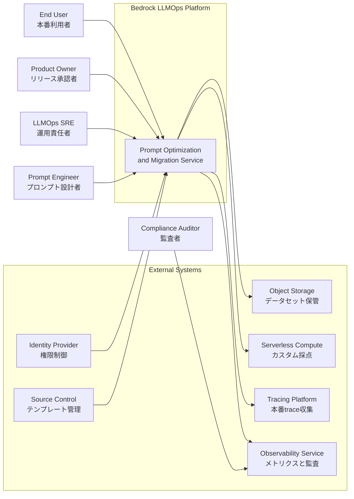
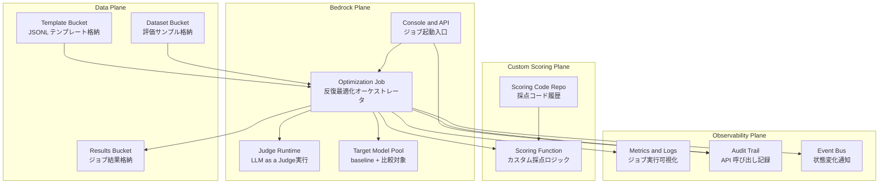
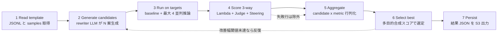
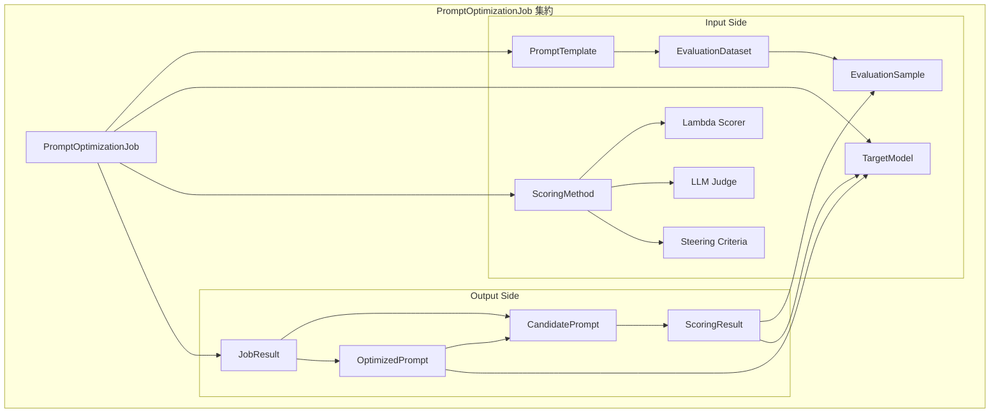
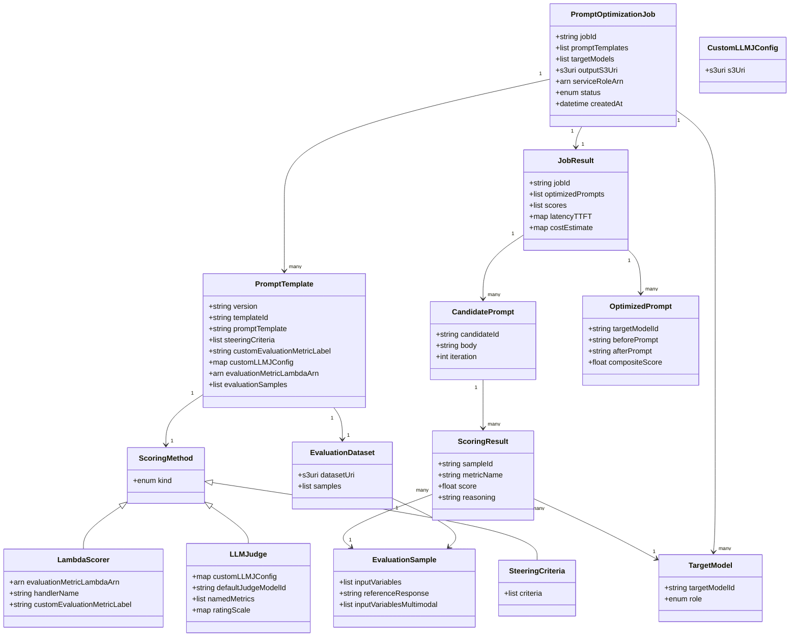
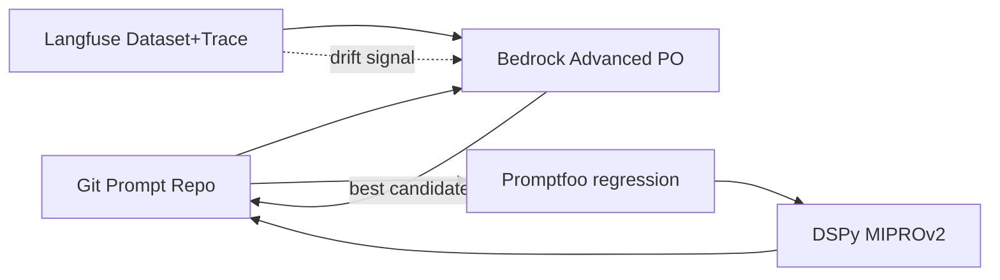

> 検証日: 2026-05-16 / 対象: Amazon Bedrock Advanced Prompt Optimization (2026-05-14 GA)

## 概要

Amazon Bedrock Advanced Prompt Optimization は、2026 年 5 月 14 日に GA したジョブ型機能です。プロンプトを評価データセットで反復的に改善します。既存の 1 ショット書換 API である `OptimizePrompt` (`bedrock-agent-runtime`) と名前が似ますが別物です。データモデル、採点機構、複数モデル並列比較の 3 点で構造的に異なります。

公式 News Blog のタイトルにある「Migration Tool」は独立した API や SDK ではありません。Advanced Prompt Optimization のマルチモデル並列比較を「baseline = 現行モデル、targets = 移行先候補モデル群」として使うときのユースケース呼称にすぎません。`CreateAdvancedPromptOptimizationJob` の同じ設定ファイルで baseline と targets を並べるだけで移行検証になります。

位置づけは、AWS が PromptOps を「文章を書く作業」から「評価データセット + 採点関数 + モデル比較を持つ運用ジョブ」へ転換させるためのコンソール統合型ツールです。Vertex AI Prompt Optimizer や DSPy MIPROv2 と同じ inference → evaluate → rewrite の反復ループに属します。Bedrock 内のモデル群 (Anthropic / Mistral / Meta / Amazon Nova / DeepSeek) を IAM や VPC を意識せず横断比較できる点と、Console UX で 5 モデル並列比較を完結できる点が主な差別化軸です。

ただし AWS 自身の公開ベンチで Nova migration の QA-RAG タスクは 52.71 (元 baseline) から 51.60 (Bedrock 単段後) へ 1.11 ポイント退行しています。DSPy MIPROv2 の二段最適化を併用すると 57.15 まで到達し、Bedrock 単段比で +5.55pt、元 baseline 52.71 比で +4.44pt の改善になります。Advanced Prompt Optimization は到達点ではなく、評価可能な運用ジョブの最低ラインに到達した段階と理解するのが現実的です。

## 特徴

### 採点 3 系統

評価メソッドを 3 系統からジョブ単位で選択できます。排他ではなく組み合わせも可能です。

1. **Lambda Scorer** (`evaluationMetricLambdaArn`)。accuracy、F1、execution accuracy、structured-JSON match などの決定論的メトリクスをユーザー実装します。News Blog はコア関数名として `compute_score` を例示しています (Lambda の entry point とは別)。
2. **LLM-as-a-Judge** (`customLLMJConfig`)。S3 上の config ファイルで named metric、structured instructions、rating scale を定義します。デフォルト judge は Claude Sonnet 4.6 で、他の judge モデルへの差し替えも可能です。
3. **Steering Criteria** (`steeringCriteria[]`)。自然言語の評価基準を配列で渡します。LLM judge が holistic に採点します。rubric の試作段階や、ブランドボイスや安全制約のような言語化しやすい品質に向きます。

### 5 モデル並列比較

1 ジョブで baseline 1 モデル + targets 最大 4 モデル = 合計 5 モデルを並列で評価できます。各モデルについて、最適化前後のプロンプト、評価サンプルごとのスコア、Time To First Token、コスト見積もりが出力されます。Migration ユースケースはこの並列比較を「現行モデル + 移行先候補」として使う運用に過ぎません。

### GA 仕様

| 項目 | 内容 |
|---|---|
| GA 日 | 2026-05-14 |
| GA リージョン | 14 リージョン (`us-east-1`, `us-east-2`, `us-west-2`, `ap-south-1`, `ap-northeast-1`, `ap-northeast-2`, `ap-southeast-1`, `ap-southeast-2`, `ca-central-1`, `eu-central-1`, `eu-central-2`, `eu-west-1`, `eu-west-2`, `sa-east-1`) |
| 追加料金 | なし。機能利用は無料で、内部で発生する Bedrock 推論トークンと Lambda 実行が通常レートで課金。LLM-as-a-Judge の呼び出しも通常の Bedrock 推論として課金 |
| 所要時間 | 単一プロンプト + 少量サンプルで 15〜20 分、サンプルが多い場合は数時間 |
| マルチモーダル | png / jpg / PDF を S3 経由で `inputVariablesMultimodal` に渡せる |
| API | `CreateAdvancedPromptOptimizationJob` (Console および API から起動可) |

### JSONL テンプレート + 評価サンプル入力

入力は 1 つの JSONL ファイルにプロンプトテンプレートと評価サンプル群をまとめる形式です。プレースホルダーは `{{placeholder}}` 形式で、マルチモーダル入力はプレースホルダーには入れず payload に直接添付します。

下記は News Blog の例示と aws-samples ワークショップから組み立てた **推測形式** です。`inputVariables` の要素形式 (`{ "name": "...", "value": "..." }` 配列か直書き map か) は公式 JSONL サンプルが未掲載のため、本記事の他コードブロックと合わせて `{name, value}` 配列形式に統一しています。利用前に AWS Samples で正規スキーマを必ず確認してください。

```jsonc
{
  "version": "bedrock-2026-05-14",
  "templateId": "string",
  "promptTemplate": "次の質問に答えてください: {{question}}",
  "steeringCriteria": ["ブランドボイスを保つ", "PII を含めない"],
  "customEvaluationMetricLabel": "qa_accuracy",
  "customLLMJConfig": { "s3Uri": "s3://.../judge-config.yaml" },
  "evaluationMetricLambdaArn": "arn:aws:lambda:...",
  "evaluationSamples": [
    {
      "inputVariables": [{ "name": "question", "value": "東京駅の中央線ホームは何番か?" }],
      "referenceResponse": "1〜2 番線",
      "inputVariablesMultimodal": [{ "s3Uri": "s3://.../diagram.png" }]
    }
  ]
}
```

### 既存類似ツールとの比較

PromptOps 領域の主要プロダクトと Advanced Prompt Optimization を、5 軸で比較します。

| 製品 | アルゴリズム | 実行環境 | 評価ループ粒度 | Vendor Neutrality | 料金体系 |
|---|---|---|---|---|---|
| **Bedrock Advanced PO** | rewriter LLM + judge LLM の反復ループ (OPRO / APE 系、内部反復回数は非公開) | AWS マネージド Console / API ジョブ | 単一 prompt template、5 モデル並列、オフライン専用 | 低 (Bedrock 内モデル + S3 + Lambda にロック) | 機能料金 0、推論トークンと Lambda 実行のみ |
| **Vertex AI Prompt Optimizer (APO)** | Google Research APO (NeurIPS 2024)。instruction と demonstrations を分離して同時最適化 | Vertex AI マネージド SDK | 単一 prompt + few-shot 例、Vertex Evaluation Service と連携 | 低 (GCP 内モデル + Vertex Eval にロック) | 推論料 + Vertex compute、評価は char 単価 |
| **DSPy MIPROv2** | few-shot bootstrap + instruction 候補生成 + Bayesian Optimization で同時探索 | Python ライブラリ、ローカル / 任意環境 | multi-stage program 全体 (retriever + reader + judge を一括 compile) | 高 (LLM プロバイダ agnostic) | OSS 無料、消費する LLM API 料のみ |
| **Braintrust Loop** | 内蔵 AI agent が eval を自走させプロンプト改善を提案 | SaaS (Playground + Loop) | dataset + scorer 単位、agent trace 観測寄り | 中 (モデル agnostic だが SaaS ロック) | Free: 1M spans + 10k scores、Pro $249/月で 5GB + 50k scores |
| **Langfuse Prompt Experiments** | rewriter ループは内蔵せず、prompt experiments + LLM judge + human label の組合せ | OSS (MIT)、self-host / Cloud | prompt version + dataset 単位、本番 trace と接続 | 高 (OSS、任意 LLM、ClickHouse 配下) | Cloud Hobby $0 / Core $29 / Pro $199 / Enterprise $2499、self-host は OSS 無料 |

要点は次のとおりです。Bedrock の rewriter ループは Vertex APO や DSPy MIPROv2 の系譜にあり、アルゴリズム面での独自性はありません。差別化は Console UX、5 モデル並列比較の GUI 完結、Bedrock 内モデルへの直接適用の 3 点に絞られます。逆に弱点は vendor neutrality の低さ、オンライン評価不可、red team / adversarial 機能の欠落、内部反復回数の非公開、DSPy MIPROv2 と比較したときの最終精度の劣後 (AWS 自身のベンチで実証) です。

## 構造

C4 model の 3 段階で本機能の構造を表現します。System Context と Container は具体的な製品名・モデル名を避け、役割名・カテゴリ名で抽象化します。Component 層は Optimization Pipeline の内部ステップを示すため具体例を含みます。

### システムコンテキスト図

最上位の境界を Bedrock LLMOps Platform とし、人間アクター 5 種と外部システム群との関係を示します。本機能は単体で閉じず、Object Storage / Compute / SCM / Observability / Identity / Tracing といった外部カテゴリと協調します。



| 要素名 | 説明 |
|---|---|
| Prompt Engineer | プロンプトテンプレートと評価データセットを設計し最適化ジョブを起動する役割 |
| LLMOps SRE | クォータ・コスト・SLO を管理し本番運用の安定性に責任を持つ役割 |
| Product Owner | 最適化結果のビジネス受け入れ判定と本番昇格を承認する役割 |
| Compliance Auditor | 監査ログと評価データの取り扱いを監督する役割 |
| End User | 本番系で最適化後プロンプトに基づく応答を受け取る最終利用者 |
| Prompt Optimization and Migration Service | 本論で扱う最適化と移行検証の中核サービス境界 |
| Object Storage | 評価データセット・テンプレート・ジョブ結果の一次ストア |
| Serverless Compute | カスタム採点ロジックを実行する利用者所有の計算基盤 |
| Source Control | プロンプトテンプレートと採点コードのバージョン管理基盤 |
| Tracing Platform | 本番推論 trace を収集しデータセット成長へ還流する基盤 |
| Identity Provider | 起動・承認・監査の権限を分離するアイデンティティ基盤 |
| Observability Service | ジョブメトリクスと API 監査ログを集約する基盤 |

### コンテナ図

サービス内部を 4 つの Plane に分割します。Bedrock Plane が中核で、Custom Scoring Plane / Data Plane / Observability Plane が周辺責務を担います。



| 要素名 | 説明 |
|---|---|
| Console and API | 利用者がジョブ作成・参照を行う制御平面の入口 |
| Optimization Job | テンプレート読込から best 選定まで指揮する非同期オーケストレータ |
| Judge Runtime | rubric と steering 基準に基づき候補出力を採点する LLM 実行環境 |
| Target Model Pool | baseline と比較対象を含む 1 から 5 並列のモデル群 |
| Scoring Function | 利用者所有の決定論的採点を行うサーバーレス関数 |
| Scoring Code Repo | 採点関数のソースコードとデプロイ履歴を管理するリポジトリ |
| Dataset Bucket | inputVariables と referenceResponse を含む評価サンプルの一次ストア |
| Template Bucket | promptTemplate と steeringCriteria を含む JSONL の一次ストア |
| Results Bucket | 候補プロンプト・スコア・コスト見積を保持する出力ストア |
| Metrics and Logs | ジョブ進捗とエラーを時系列で観測する基盤 |
| Audit Trail | API 呼び出しと principal を全量記録する監査基盤 |
| Event Bus | ジョブ状態遷移を後続ワークフローへ配信する非同期通知基盤 |

### コンポーネント図

Optimization Job 1 件の内部を 7 ステップに分解します。具体例として採点 3 系統 (Lambda Scorer / LLM-as-a-Judge / Steering Criteria) や反復制御を含めて記述します。



| 要素名 | 説明 |
|---|---|
| 1 Read template | promptTemplate と evaluationSamples を読み込み placeholder 展開準備を行う |
| 2 Generate candidates | rewriter LLM が変異戦略 (instruction 強化 / few-shot 追加 / chain-of-thought / output schema 強化) を適用し候補を複数生成 |
| 3 Run on targets | 各サンプルを baseline と比較対象モデルに投げ candidate × sample × model 行列の推論結果を取得 |
| 4 Score 3-way | Lambda Scorer (F1・JSON match 等の決定論的指標)、LLM-as-a-Judge (rubric ベース)、Steering Criteria (自然言語 holistic) を組み合わせて採点 |
| 5 Aggregate | candidate × metric の集計行列を生成し失敗行を除外 |
| 6 Select best | 多目的合成スコア (品質・コスト・レイテンシ) で best candidate を target model 別に決定し未収束なら 2 に戻す |
| 7 Persist | 旧/新 promptTemplate・per-candidate スコア・コスト見積・TTFT を結果 JSON として出力 |

## データ

公式 JSONL スキーマ (News Blog / User Guide で確認できた範囲) と運用上必要となる派生エンティティを合わせて整理します。`PromptMigrationJob` という独立エンティティは存在せず、`PromptOptimizationJob` の `TargetModel` 構成 (baseline + 比較対象) として表現されます。

### 概念モデル

主要エンティティの所有関係と参照関係をまとめます。`PromptOptimizationJob` を集約ルートとし、テンプレート / 評価データ / 採点方式 / ターゲットモデル群を所有します。`JobResult` 配下に候補プロンプトと採点結果が積み上がります。



| 要素 | 説明 |
|---|---|
| PromptOptimizationJob | 反復的にプロンプトを書き換え・採点・選定する非同期ジョブの集約ルート |
| PromptTemplate | `{{placeholder}}` を含むプロンプト本文と採点方式参照を持つ JSONL の 1 エントリ |
| EvaluationDataset | PromptTemplate に紐づく評価サンプル集合。S3 上の JSONL またはローカルアップロード |
| EvaluationSample | 1 サンプル。プレースホルダ値、期待応答、必要に応じ画像/PDF 参照を保持 |
| CandidatePrompt | 反復ループ内で rewriter が生成したプロンプト候補。最終的に target model ごとに best が選ばれる |
| TargetModel | 評価対象のモデル。最大 5 (Migration 用途では baseline + 4 比較) |
| ScoringResult | (CandidatePrompt × EvaluationSample × TargetModel) ごとの採点結果 |
| ScoringMethod | 採点方式の上位概念。Lambda / Judge / Steering のいずれかまたは組合せ |
| Lambda Scorer | `evaluationMetricLambdaArn` で参照される Lambda 関数 (関数名 `compute_score`) |
| LLM Judge | `customLLMJConfig` の S3 設定で named metric × rubric × rating scale を定義。既定 judge は Claude Sonnet 4.6 |
| Steering Criteria | `steeringCriteria[]` 配列。自然言語の評価基準を judge が holistic 評価 |
| JobResult | ジョブの最終結果。before/after prompt、score、TTFT、cost estimate を含む |
| OptimizedPrompt | target model ごとの最終ベストプロンプト |

### 情報モデル

主要クラスと属性を整理します。公式 JSONL の確認済みフィールドはそのまま、公式仕様未確認の補助属性は推測と明示します。型は list / map / string / float / int / enum / s3uri / arn / bool の汎用名で表記します。



主要属性の説明:

| クラス / 属性 | 説明 |
|---|---|
| PromptTemplate.version | JSONL スキーマバージョン (例: `bedrock-2026-05-14`)。News Blog 例示で確認済み |
| PromptTemplate.promptTemplate | `{{placeholder}}` を含む本文。マルチモーダル入力は placeholder ではなく `inputVariablesMultimodal` に置く |
| PromptTemplate.steeringCriteria | 自然言語評価基準の配列。LLM judge が holistic 評価に使用 |
| PromptTemplate.customLLMJConfig | LLM-as-a-Judge 用設定。News Blog 例示は `{ "s3Uri": "s3://..." }` のオブジェクト型。内部 (S3 ファイル本体) のスキーマは未公開 |
| PromptTemplate.evaluationMetricLambdaArn | 採点 Lambda の ARN |
| EvaluationSample.inputVariablesMultimodal | png / jpg / PDF の S3 パス等のリスト |
| LambdaScorer.handlerName | News Blog で言及されたコア関数 `compute_score`。event/return スキーマは推測 |
| LLMJudge.defaultJudgeModelId | 既定 `anthropic.claude-sonnet-4-6` (公式 Cost 節で明記) |
| TargetModel.role | `baseline` / `comparison` の区別 (Migration 用途呼称、属性自体は推測) |
| JobResult.optimizedPrompts | 公式に明記された出力: before/after prompt templates |
| JobResult.scores | 公式に明記された出力: evaluation scores for each evaluation sample |
| JobResult.latencyTTFT | 公式に明記された出力: time to first token per model |
| JobResult.costEstimate | 公式に明記された出力: cost estimates per model |

### データストレージと参照関係

| データ | 物理ストレージ | 参照タイミング |
|---|---|---|
| PromptTemplate JSONL | S3 import またはローカルアップロード | ジョブ開始時に読み込み |
| EvaluationSample multimodal | S3 (JSONL から相対参照) | 推論ループの入力組み立て時 |
| Lambda Scorer コード | Lambda function (ARN 参照) | 採点ステップで invoke |
| LLM Judge config | S3 (`customLLMJConfig` 参照) | judge プロンプト構築時 |
| JobResult | ジョブ作成時に指定する S3 出力先 | ジョブ完了後に書き出し |
| 監査ログ | CloudTrail (API 呼び出し) / CloudWatch Logs (ジョブ実行) | 実行中・実行後 |

公式の文言:

> "you can upload files directly or import prompt templates from Amazon Simple Storage Service (Amazon S3)"
> "set an S3 output location where prompt optimization results and evaluation data will be stored"
> — News Blog (取得日 2026-05-16)

## 構築方法

### 必須パラメータ早見表

| カテゴリ | 項目 | 例 | 必須 |
|---|---|---|---|
| アカウント | Bedrock 利用可能な AWS アカウント | プロダクション用 sandbox 分離 | 必須 |
| モデルアクセス | 対象 Foundation Model の access 申請済み | Claude Sonnet 4.6 / Nova Pro / Llama 4 等 | 必須 |
| リージョン | GA 14 リージョンのいずれか | `ap-northeast-1` (Tokyo) | 必須 |
| S3 | 入出力バケット (KMS 暗号化推奨) | `s3://llmops-eval/` | 必須 |
| 評価データセット | JSONL ファイル | `regression-2026-05.jsonl` | 必須 |
| 評価メソッド | Lambda / LLM-as-a-Judge / Steering のいずれか | `evaluationMetricLambdaArn` | 必須 (いずれか) |
| Target Model | 1〜5 モデル ID | baseline + 比較 4 | 必須 |
| IAM Role | Bedrock サービスロール | `BedrockAdvancedOptRole` | 必須 |
| Lambda 関数 | `compute_score` 実装 | `arn:aws:lambda:...:function:scorer` | 採点に依存 |

### AWS アカウントとモデルアクセス申請

- Bedrock を有効化済みの AWS アカウントを用意
- 利用予定の全 Target Model について Bedrock Console の Model access から access 申請を完了
- baseline + 比較 4 = 最大 5 モデルすべて。1 つでも未承認だとジョブが `ValidationException` で失敗

### IAM 権限例

User Guide の Cost 節に「All inference and Lambda function invocations run in your AWS account」と明記があります。Bedrock サービスロールが顧客アカウント内で Bedrock invoke と Lambda invoke を行う構成です。Advanced 向け IAM 仕様の正式ページは一次取得できておらず、以下は推測ベースの最小権限例です。

```json
{
  "Version": "2012-10-17",
  "Statement": [
    {
      "Sid": "AdvancedPromptOptimizationJobControl",
      "Effect": "Allow",
      "Action": [
        "bedrock:CreateAdvancedPromptOptimizationJob",
        "bedrock:GetAdvancedPromptOptimizationJob",
        "bedrock:ListAdvancedPromptOptimizationJobs",
        "bedrock:StopAdvancedPromptOptimizationJob"
      ],
      "Resource": "*"
    },
    {
      "Sid": "ModelInvocation",
      "Effect": "Allow",
      "Action": ["bedrock:InvokeModel", "bedrock:InvokeModelWithResponseStream"],
      "Resource": [
        "arn:aws:bedrock:ap-northeast-1::foundation-model/anthropic.claude-sonnet-4-6-*",
        "arn:aws:bedrock:ap-northeast-1::foundation-model/amazon.nova-pro-v1:0",
        "arn:aws:bedrock:ap-northeast-1::foundation-model/meta.llama4-*"
      ]
    },
    {
      "Sid": "S3IO",
      "Effect": "Allow",
      "Action": ["s3:GetObject", "s3:PutObject", "s3:ListBucket"],
      "Resource": [
        "arn:aws:s3:::llmops-eval",
        "arn:aws:s3:::llmops-eval/*"
      ]
    },
    {
      "Sid": "LambdaScorerInvoke",
      "Effect": "Allow",
      "Action": ["lambda:InvokeFunction"],
      "Resource": "arn:aws:lambda:ap-northeast-1:123456789012:function:bedrock-scorer-*"
    },
    {
      "Sid": "PassRoleToBedrock",
      "Effect": "Allow",
      "Action": "iam:PassRole",
      "Resource": "arn:aws:iam::123456789012:role/BedrockAdvancedOptRole",
      "Condition": {"StringEquals": {"iam:PassedToService": "bedrock.amazonaws.com"}}
    }
  ]
}
```

### S3 バケット準備と評価データセット配置

```bash
aws s3api create-bucket \
  --bucket llmops-eval \
  --region ap-northeast-1 \
  --create-bucket-configuration LocationConstraint=ap-northeast-1

aws s3api put-bucket-versioning \
  --bucket llmops-eval \
  --versioning-configuration Status=Enabled

aws s3api put-bucket-encryption \
  --bucket llmops-eval \
  --server-side-encryption-configuration '{
    "Rules":[{"ApplyServerSideEncryptionByDefault":{"SSEAlgorithm":"aws:kms","KMSMasterKeyID":"alias/llmops"}}]
  }'

aws s3 cp ./datasets/intent-eval-2026-05.jsonl s3://llmops-eval/datasets/intent/
```

### Lambda Scorer の準備

News Blog で「Inside the Lambda, the core is a `compute_score` implementation that programmatically compares model outputs against reference responses」と説明されています。`event` / 戻り値の正式スキーマは公式に未公開のため、以下は aws-samples ワークショップを踏まえた推測の最小実装例です。

```python
# scorer/handler.py (推測ベース。公式スキーマ未公開のため、実運用前に aws-samples を要確認)
import json
import re
from typing import Any, Dict

def compute_score(event: Dict[str, Any], context: Any) -> Dict[str, Any]:
    expected = (event.get("reference_response") or "").strip()
    actual   = (event.get("model_output")       or "").strip()

    try:
        exp_obj = json.loads(expected)
        act_obj = json.loads(re.search(r"\{.*\}", actual, re.S).group(0))
        score = 1.0 if exp_obj == act_obj else 0.0
    except Exception:
        score = 0.0

    return {
        "score": score,
        "details": {"matched": score == 1.0, "actual_len": len(actual)}
    }

def lambda_handler(event, context):
    return compute_score(event, context)
```

```bash
cd scorer
zip -r function.zip handler.py
aws lambda create-function \
  --function-name bedrock-scorer-intent \
  --runtime python3.12 \
  --role arn:aws:iam::123456789012:role/LambdaScorerExecRole \
  --handler handler.lambda_handler \
  --zip-file fileb://function.zip \
  --timeout 30 --memory-size 512

aws lambda add-permission \
  --function-name bedrock-scorer-intent \
  --statement-id bedrock-invoke \
  --action lambda:InvokeFunction \
  --principal bedrock.amazonaws.com
```

### Console 操作の流れ

- Bedrock Console を開く (GA 14 リージョンのいずれか)
- 左ペインの Prompt management を展開し Advanced Prompt Optimization を選択
- Create prompt optimization をクリック
- Prompt template (JSONL) / Target models / Evaluation method / Output S3 location を指定
- ジョブを起動し Jobs 一覧でステータスを監視
- 完了後、Result 画面で旧/新プロンプト、評価スコア、TTFT、推定コストを比較

## 利用方法

### JSONL テンプレートの書き方

News Blog 本文に記載されたフィールド構造を踏襲します。1 ファイル内に複数テンプレートを並べる JSONL 形式です。

```json
{
  "version": "bedrock-2026-05-14",
  "templateId": "intent-classifier-v1",
  "promptTemplate": "あなたは請求書サポート担当です。次のユーザー発話を JSON で intent と slots に分類してください。\n\n発話: {{user_query}}\n出力: ",
  "steeringCriteria": [
    "出力は必ず有効な JSON オブジェクトであること",
    "intent は invoice.* / payment.* / other のいずれかに正規化すること",
    "確証が低い場合は intent を other に倒すこと"
  ],
  "customLLMJConfig": {
    "s3Uri": "s3://llmops-eval/judges/intent-rubric-v3.yaml"
  },
  "evaluationMetricLambdaArn": "arn:aws:lambda:ap-northeast-1:123456789012:function:bedrock-scorer-intent",
  "customEvaluationMetricLabel": "intent_exact_match",
  "evaluationSamples": [
    {
      "inputVariables": [{"name": "user_query", "value": "請求書の支払期日を変更したい"}],
      "referenceResponse": "{\"intent\":\"invoice.update_due_date\",\"slots\":{\"invoice_id\":null}}"
    },
    {
      "inputVariables": [{"name": "user_query", "value": "添付画像の請求書の合計金額を教えて"}],
      "inputVariablesMultimodal": [
        {"name": "invoice_image", "s3Uri": "s3://llmops-eval/assets/intent/screenshot01.png", "mediaType": "image/png"}
      ],
      "referenceResponse": "{\"intent\":\"invoice.read_total\",\"slots\":{\"total\":12800}}"
    }
  ]
}
```

注意点:

- `{{placeholder}}` には**テキスト変数のみ**を入れる。画像/PDF を `{{}}` で参照してはいけないと公式が明示
- マルチモーダル入力は `inputVariablesMultimodal` に S3 URI とメディアタイプを並べ、payload としてモデルへ渡す
- `referenceResponse` は任意だが、Lambda Scorer での厳密比較や regression 検出に必要なので、可能なら必ず付与

### 5 モデル並列比較の指定

- News Blog: 「select your current model as a baseline and up to 4 other models」
- baseline 1 + 比較 4 = 最大 5 モデルを `targetModels` に並べる
- baseline と比較を同じモデルにすると最適化前後の before/after のみが得られる
- Migration 用途では baseline=現行モデル、比較=移行候補 1〜4 個 (例: Claude 3.5 Sonnet → Claude Sonnet 4.6 / Nova Pro / Llama 4 / DeepSeek-R1) と並べる

### ジョブ起動から結果取得まで

下記の boto3 / CLI 実行例の引数体系 (`inputDataConfig` / `targetModels` / `role` 等) は公式 API Reference 未公開のため、News Blog の機能記述から推測した擬似コードです。`role` 属性自体も baseline/comparison の区別呼称であり、正式パラメータ名は GA 後の SDK / CLI Reference で要照合してください。

```python
import time, json
import boto3

br = boto3.client("bedrock", region_name="ap-northeast-1")
s3 = boto3.client("s3",      region_name="ap-northeast-1")

# 以下の引数名はすべて推測。GA 後の boto3 docs と照合すること
job = br.create_advanced_prompt_optimization_job(
    jobName="intent-optimize-2026-05-16",
    roleArn="arn:aws:iam::123456789012:role/BedrockAdvancedOptRole",
    inputDataConfig={"s3Uri": "s3://llmops-eval/datasets/intent/intent-eval-2026-05.jsonl"},
    outputDataConfig={"s3Uri": "s3://llmops-eval/results/intent/"},
    targetModels=[
        {"modelId": "anthropic.claude-3-5-sonnet-20241022-v2:0", "role": "baseline"},
        {"modelId": "anthropic.claude-sonnet-4-6-20260101-v1:0"},
        {"modelId": "amazon.nova-pro-v1:0"},
    ],
)
job_arn = job["jobArn"]

while True:
    desc = br.get_advanced_prompt_optimization_job(jobIdentifier=job_arn)
    status = desc["status"]
    print(status)
    if status in ("Completed", "Failed", "Stopped"):
        break
    time.sleep(60)

out_prefix = "results/intent/" + job_arn.rsplit("/", 1)[-1] + "/"
obj = s3.get_object(Bucket="llmops-eval", Key=out_prefix + "summary.json")
summary = json.loads(obj["Body"].read())
print(json.dumps(summary, ensure_ascii=False, indent=2))
```

結果として受け取れる主な項目は User Guide により以下と明示されています。

- 最適化前後のプロンプトテンプレート (original / final)
- 評価サンプル単位のスコア
- モデルごとの TTFT (Time To First Token)
- モデルごとのコスト見積

### LLM-as-a-Judge デフォルト

> "The current default LLM-as-a-judge model is Anthropic Claude Sonnet 4.6, unless you select a different one for your custom LLMJ prompt." — User Guide

- `customLLMJConfig` を指定しない場合でも `steeringCriteria` を書けば Bedrock 内部の LLM-as-a-Judge (Claude Sonnet 4.6) が holistic に採点
- `customLLMJConfig` の S3 ファイルでは named metric + 評価指示 + rating scale を定義し、別の judge モデルを指定可能
- 課金: judge モデル呼び出しも通常の Bedrock on-demand 推論として課金。Advanced Prompt Optimization にサービス追加料金は発生しない
- 日本語コミュニティの観察として、LLM-as-a-Judge は位置バイアス / 冗長性バイアス / 自己選好バイアスの影響を受けやすく、JMDC では同一タスクで実行ごとに正解率が 10% 近く振れた事例が報告されています (詳細条件は参照元 JMDC TECH BLOG 参照)

## 運用

### ジョブ起動と進捗確認

下記の CLI 引数名 (`--prompt-template-s3-uri` / `--baseline-model` / `--target-models` 等) は公式 CLI Reference 未公開のため、News Blog の機能記述から推測した擬似コマンドです。boto3 例とパラメータ体系が異なるのも、両方とも推測由来である理由です。GA 後の `aws bedrock help` 出力で正規名を確認してください。

```bash
aws bedrock create-advanced-prompt-optimization-job \
  --job-name "intent-opt-2026-05-16" \
  --prompt-template-s3-uri "s3://llmops-eval/templates/intent_v8.jsonl" \
  --dataset-s3-uri "s3://llmops-eval/intent/regression-2026-05.jsonl" \
  --baseline-model "anthropic.claude-3-5-sonnet-20241022" \
  --target-models '["anthropic.claude-sonnet-4-6","amazon.nova-pro-v1","mistral.large-2407"]' \
  --evaluation-metric-lambda-arn "arn:aws:lambda:ap-northeast-1:123:function:compute_score:7" \
  --steering-criteria '["回答は必ず日本語で返すこと","JSONスキーマを厳守"]' \
  --output-s3-uri "s3://llmops-eval/results/" \
  --region ap-northeast-1

aws bedrock get-advanced-prompt-optimization-job \
  --job-identifier popt-2026-05-16-abc123 \
  --query 'status'

aws s3 cp s3://llmops-eval/results/popt-2026-05-16-abc123/output.json ./result.json
```

- 所要時間はサンプル数で 15 分から数時間の幅がある。CI では非同期 polling 構成にする
- Lambda 呼び出し回数は `16 × N` (N = dataset 件数) という観察があり (二次情報、User Guide 本文では proprietary internal optimization parameters とのみ記載)、dataset 100 件で約 1,600 invoke/template と試算。係数 16 は内部反復・候補数・モデル数に依存する可能性があるため、実測でキャリブレーションが必要

### CloudWatch / CloudTrail でのログ確認

```bash
aws logs tail /aws/bedrock/advanced-prompt-optimization \
  --since 1h --follow --filter-pattern "popt-2026-05-16-abc123"

# EventName は API 名からの推測。GA 後の CloudTrail Reference で要確認
aws cloudtrail lookup-events \
  --lookup-attributes AttributeKey=EventName,AttributeValue=CreateAdvancedPromptOptimizationJob \
  --start-time 2026-05-16T00:00:00Z

aws cloudwatch get-metric-statistics \
  --namespace AWS/Lambda --metric-name Duration \
  --dimensions Name=FunctionName,Value=compute_score \
  --start-time 2026-05-16T00:00:00Z --end-time 2026-05-16T23:59:59Z \
  --period 300 --statistics p50,p95,Maximum
```

- CloudWatch Logs にジョブ実行ログとスコア時系列が出力
- CloudTrail には API 呼び出し (誰がいつジョブを起動したか) を記録
- judge model の出力 (理由文) は監査要件 (GDPR Art.22) の観点から保存推奨

### EventBridge での状態変化フック

Bedrock ジョブ完了を `aws.bedrock` source の EventBridge イベントで受け、Step Functions の承認フローや Slack 通知に流します。自動本番投入は禁止し、必ず PR レビュー / Step Functions 承認を経由させます (`detail-type` の正式名称は GA 後の EventBridge イベントカタログで要確認)。

```json
{
  "source": ["aws.bedrock"],
  "detail-type": ["Advanced Prompt Optimization Job State Change"],
  "detail": {
    "status": ["Completed", "Failed"]
  }
}
```

```bash
aws events put-rule --name bedrock-popt-done \
  --event-pattern file://rule.json
aws events put-targets --rule bedrock-popt-done \
  --targets "Id=1,Arn=arn:aws:states:ap-northeast-1:123:stateMachine:PromptApprovalFlow"
```

### 評価データセットのバージョン管理

- 評価データセット JSONL は Git で管理し、S3 versioning + KMS で二重化
- 1 行 = 1 サンプル、`id / inputVariables / referenceResponse / metadata / tags` を全社標準スキーマとする
- ファイルパスに日付・世代を埋め込み、`s3://llmops-eval/intent/regression-2026-05.jsonl` のように世代固定参照
- 本番ログから採取した新規ケースは Comprehend / Macie で PII redaction を通してから merge
- Optimization Job 結果には dataset の `s3 version id` を埋め、再現性を担保

### Lambda Scorer の更新と canary deploy

```bash
aws lambda publish-version --function-name compute_score --description "f1 + json_match v8"

aws lambda update-alias --function-name compute_score \
  --name canary --function-version 8 \
  --routing-config 'AdditionalVersionWeights={"7"=0.9}'

aws lambda put-provisioned-concurrency-config \
  --function-name compute_score --qualifier prod \
  --provisioned-concurrent-executions 10
```

- Scorer コードは Git で管理し、SAM / CDK で deploy
- `$LATEST` は禁止、必ず version pin (`:7`) と alias (`prod` / `canary`) を使う
- Provisioned concurrency を 10〜20 程度確保し、`16 × N` のコールドスタート連鎖を防ぐ

## ベストプラクティス

### ハイブリッド構成

Bedrock Advanced Prompt Optimization は rewriter / explorer に役割を限定します。履歴・PR・所有者管理は Git、本番 trace 収集と golden dataset 育成は Langfuse、regression と adversarial eval は Promptfoo、数値タスクの最終チューニングは DSPy MIPROv2 に分担させます。これにより vendor lock-in を避けつつ Console UX の生産性は取り込めます。



### judge 交差検証

- デフォルト judge は Claude Sonnet 4.6 だが、self-preference / perplexity-familiarity bias が arXiv 2410.21819 で実証されている
- 同一サンプルを別系統 judge (Amazon Nova Pro / Mistral Large 等) で並走採点し、相関 (Spearman) が 0.7 を下回る指標は信頼しない運用とする (0.7 は社内運用上の経験則。タスク特性に応じてキャリブレーション)
- judge model 更新で過去スコアと非互換になるため、`judge_model_id` と version を結果 JSON に必ず保存する

### golden dataset を本番ログから継続採取

- Langfuse / CloudWatch から本番 trace を sampling rate を SLA class で制御して採取 (gold 全件、bronze 1%)
- redaction (Comprehend / Macie) を経由し、ハッシュで重複排除してから merge
- ドリフトは 2 軸 (既存ケースのスコア低下 / 新規ログの分布乖離 KL divergence) で検知し、Bedrock 再最適化のトリガとする

### 採点 3 系統の組み合わせ

- 1 ジョブで Lambda Scorer (決定論的指標) / LLM-as-a-Judge (主観品質) / Steering Criteria (安全性・スキーマ遵守) を同時に走らせ、合成スコアではなくマトリクスで意思決定
- 単一スコアで best を決めると未測定品質次元が静かに壊れる (format drift / citation 喪失、arXiv 2601.22025) ため、必ず指標別に diff を出す

### Console「ベスト候補」をそのまま本番投入しない

- Bedrock Console が示す best candidate は judge bias と position bias を含むため、PR レビュー必須とする
- CI が Bedrock 結果を PR コメントに貼り、Product Owner が承認した上で Prompt Management の alias (`prod`) を Step Functions 経由で切り替える
- アプリ側は alias 参照を徹底し、固定 version 直叩きを禁止する (ロールバックを 1 操作で済ませる)

### 規制業界では HIPAA 確認まで保留

- Bedrock は HIPAA eligible だが、`BAA + 対象リージョン + 対象モデル` の三点が揃う必要がある
- Advanced Prompt Optimization の完全機能は US East / US West 中心で、ap-northeast-1 で全機能が揃わない可能性がある
- Lambda Scorer / Judge / Optimization engine が同じ dataset を消費する三経路構造のため、PII 最小化原則と相反する
- PHI を含むデータでは BAA 配下リージョンのみ採用、それ以外は保留が安全

### Step Functions での承認フロー

- EventBridge `Completed` → Step Functions → Slack 承認 → Prompt Management alias 切替の 3 段構成を標準とする
- 「Engineer ≠ Approver」を IAM で強制し、`bedrock:CreatePromptVersion` で alias 指定できるのは approver タグ付き Role のみに絞る

```json
{
  "Effect": "Deny",
  "Action": "bedrock:CreatePromptVersion",
  "Resource": "arn:aws:bedrock:ap-northeast-1:123:prompt/*",
  "Condition": {"StringNotEquals": {"aws:PrincipalTag/role": "approver"}}
}
```

## トラブルシューティング

| 症状 | 原因 | 対処 |
|---|---|---|
| 日本語入力が英語に書き換わる | rewriter LLM のバイアス (サーバーワークス事例、英語推奨が公式ガイダンス) | `steeringCriteria` に「回答は必ず日本語で返すこと」「入力言語を維持」を明示。promptTemplate にも「日本語で」を埋める |
| QA-RAG タスクで -1.11pt 退行 (52.71 → 51.60) | Bedrock 単段最適化の限界 (AWS 公式 Nova migration ベンチ) | DSPy MIPROv2 を後段に併用 (57.15、Bedrock 単段比 +5.55pt / 元 baseline 比 +4.44pt まで到達)。Bedrock 結果を seed として DSPy に渡す |
| judge スコアが Anthropic 系出力に偏る | self-preference bias (perplexity-familiarity, arXiv 2410.21819) | judge 交差検証 (Claude + Nova + Mistral)。Spearman 相関が 0.7 未満の指標は採用しない |
| Lambda コールドスタートでジョブ長時間化 | 16 × N 呼び出し × cold start が multiplicative に効く | provisioned concurrency 10〜20 を `prod` alias に設定。Scorer を軽量化し外部 API 呼び出しを避ける |
| JMDC 事例で正解率が 10% 振れる | judge 評価のスコア非一貫性 | 複数回 (3〜5 回) 実行して平均化。評価サンプル数を 250 → 500 に増やす。冗長性バイアス対策に rubric で長さペナルティを明示 |
| オンライン評価したい | Lambda Scorer は offline batch 専用 (DevelopersIO 英語記事で明示) | Langfuse / Arize Phoenix で本番 trace を継続採点。Bedrock は週次バッチ専用と割り切る |
| Nova 移行で「ステップバイステップ無視」「日本語文字化け」 | Model Drifting (PromptBridge arXiv 2512.01420) の本質限界 | Migration tool だけでなく target model 用に手動でテンプレ再設計。`regression_cases` が空でない場合は自動昇格停止 |
| judge スコアが優秀でも本番品質が劣化 | shortcut bias (The Silent Judge, arXiv 2509.26072) で語尾・定型語を学習 | adversarial eval (Promptfoo) を併用。本番 KPI (CTR / 解決率) を最終 gate にする |
| 過去ジョブとスコア比較不能 | judge model / rubric の更新で評価非互換 | `judge_model_id` / `rubric_version` を結果 JSON に固定保存。rubric を変えたら過去スコアと比較しないルールを明文化 |
| Optimization 課金が想定の数倍 | judge token + Lambda invoke + Bedrock 推論の多重課金 | 候補数を絞る。小モデル (Nova Lite / Haiku) で粗評価し top-K のみ大モデル評価のカスケード構成。Cost Allocation Tag を `prompt_id / team / env` で必須化 |
| Bedrock Prompt Management で誤って draft が本番に出た | バージョン指定なしで draft が適用される仕様 (Qiita @har1101) | アプリは必ず alias (`prod`) を参照、固定 version も明示。CI で `version: draft` 参照を禁止 lint |

## まとめ

Bedrock Advanced Prompt Optimization は、プロンプト改善を「文章を書く作業」から「評価データセット + 採点関数 + モデル比較を持つ運用ジョブ」へ転換する Console 統合型ツールです。アルゴリズム的独自性は低く、AWS 自身のベンチでも単段では退行ケースがあるため、版管理とプロンプト管理 (Git + Langfuse + Promptfoo + DSPy MIPROv2) と組み合わせるハイブリッド構成で「アイデア出し」と「並列比較」の生産性に絞って取り込むのが現実解です。

この記事が少しでも参考になった、あるいは改善点などがあれば、ぜひリアクションやコメント、SNSでのシェアをいただけると励みになります！

## 参考リンク

- AWS 公式
  - [AWS News Blog: Amazon Bedrock introduces new advanced prompt optimization and migration tool](https://aws.amazon.com/blogs/aws/amazon-bedrock-introduces-new-advanced-prompt-optimization-and-migration-tool/)
  - [AWS What's New (2026-05-14)](https://aws.amazon.com/about-aws/whats-new/2026/05/amazon-bedrock-advanced-prompt-optimization-migration-tool/)
  - [AWS ML Blog: Improve Amazon Nova migration performance with data-aware prompt optimization](https://aws.amazon.com/blogs/machine-learning/improve-amazon-nova-migration-performance-with-data-aware-prompt-optimization/)
  - [Bedrock User Guide: How Advanced Prompt Optimization works](https://docs.aws.amazon.com/bedrock/latest/userguide/advanced-prompt-optimization-how.html)
  - [Bedrock User Guide: Optimize a prompt (Simple)](https://docs.aws.amazon.com/bedrock/latest/userguide/prompt-management-optimize.html)
  - [Bedrock User Guide: Prompt Management prerequisites](https://docs.aws.amazon.com/bedrock/latest/userguide/prompt-management-prereq.html)
  - [Bedrock User Guide: Prompt Management](https://docs.aws.amazon.com/bedrock/latest/userguide/prompt-management.html)
  - [Bedrock API Reference: OptimizePrompt](https://docs.aws.amazon.com/bedrock/latest/APIReference/API_agent-runtime_OptimizePrompt.html)
  - [Bedrock pricing](https://aws.amazon.com/bedrock/pricing/)
  - [Bedrock endpoints / quotas](https://docs.aws.amazon.com/general/latest/gr/bedrock.html)
- GitHub
  - [aws-samples/sample-amazon-bedrock-prompt-optimization-workshop](https://github.com/aws-samples/sample-amazon-bedrock-prompt-optimization-workshop)
- 学術論文
  - [arXiv 2410.21819: Self-Preference Bias in LLM Judges](https://arxiv.org/abs/2410.21819)
  - [arXiv 2512.01420: PromptBridge - Cross-Model Prompt Migration](https://arxiv.org/abs/2512.01420)
  - [arXiv 2410.02736: Justice or Prejudice? LLM-as-a-Judge bias survey](https://arxiv.org/html/2410.02736v1)
  - [arXiv 2601.22025: When Better Prompts Hurt](https://arxiv.org/html/2601.22025v1)
  - [arXiv 2509.26072: The Silent Judge (shortcut bias)](https://www.arxiv.org/pdf/2509.26072)
- 競合 / OSS
  - [Vertex AI Prompt Optimizer (Cloud Blog)](https://cloud.google.com/blog/products/ai-machine-learning/announcing-vertex-ai-prompt-optimizer)
  - [Vertex AI Prompt Optimizer docs](https://cloud.google.com/vertex-ai/generative-ai/docs/learn/prompts/prompt-optimizer)
  - [DSPy MIPROv2](https://dspy.ai/api/optimizers/MIPROv2/)
  - [Braintrust pricing](https://www.braintrust.dev/pricing)
  - [Langfuse Prompt Management](https://langfuse.com/docs/prompts/get-started)
  - [Langfuse self-host pricing](https://langfuse.com/pricing-self-host)
  - [Promptfoo](https://www.promptfoo.dev/)
- 日本語コミュニティ
  - [DevelopersIO: Prompt Optimization for Amazon Bedrock GA レポート](https://dev.classmethod.jp/articles/prompt-optimization-amazon-bedrock-generally-available/)
  - [DevelopersIO (英語版): Prompt Optimization GA detail](https://dev.classmethod.jp/en/articles/prompt-optimization-amazon-bedrock-generally-available/)
  - [DevelopersIO: Bedrock AgentCore Evaluations - code-based Evaluator](https://dev.classmethod.jp/en/articles/bedrock-agentcore-evaluations-code-based-evaluator-lambda/)
  - [サーバーワークス: プロンプト最適化を試してみた](https://blog.serverworks.co.jp/try-aws-bedrock-prompt-optimization)
  - [Qiita @moritalous: Bedrock Prompt Management](https://qiita.com/moritalous/items/0c5f4a2f0a6980e1968e)
  - [JMDC TECH BLOG: LLM-as-a-Judge を実際に利用して見えてきた課題と対策](https://techblog.jmdc.co.jp/entry/20251208)
  - [AI Shift Tech Blog: LLM-as-a-Judge にまつわるバイアスまとめ](https://www.ai-shift.co.jp/techblog/6252)
  - [LayerX: 安定したAIエージェント開発・運用](https://tech.layerx.co.jp/entry/stable-ai-agent-dev-with-langfuse)
  - [Humanloop Shutdown Migration Guide](https://blog.promptlayer.com/humanloop-shutdown-guide-to-migrating-your-prompts-and-evals-to-promptlayer/)
  - [Amazon Bedrock HIPAA Compliance](https://www.accountablehq.com/post/amazon-bedrock-hipaa-compliance-what-you-need-to-know-about-baa-phi-and-best-practices)
