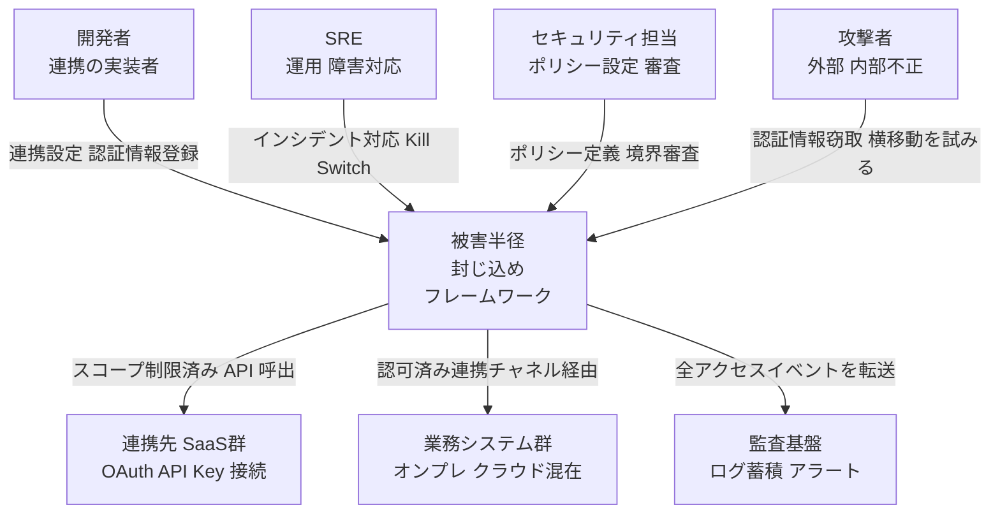
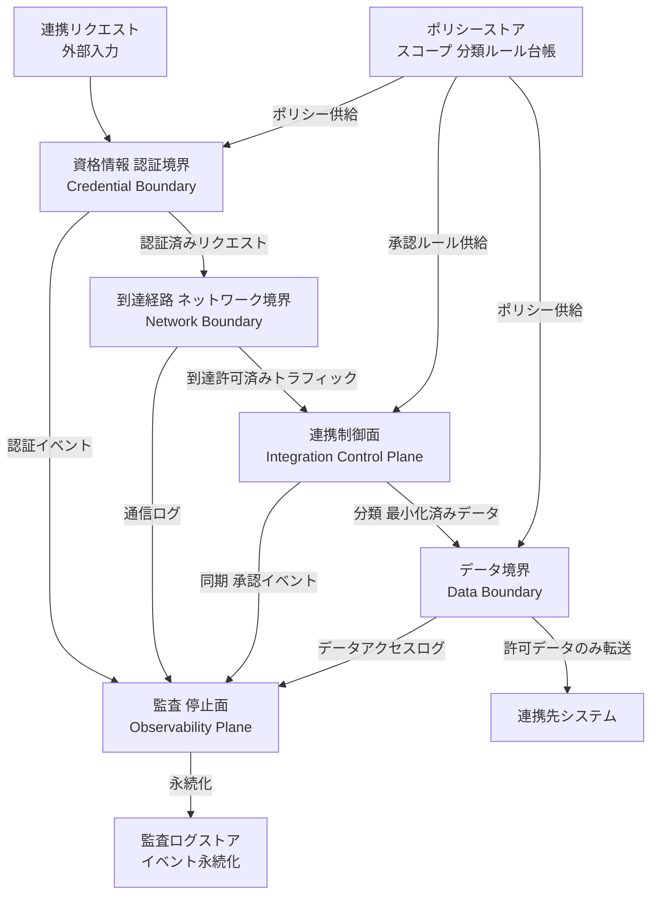
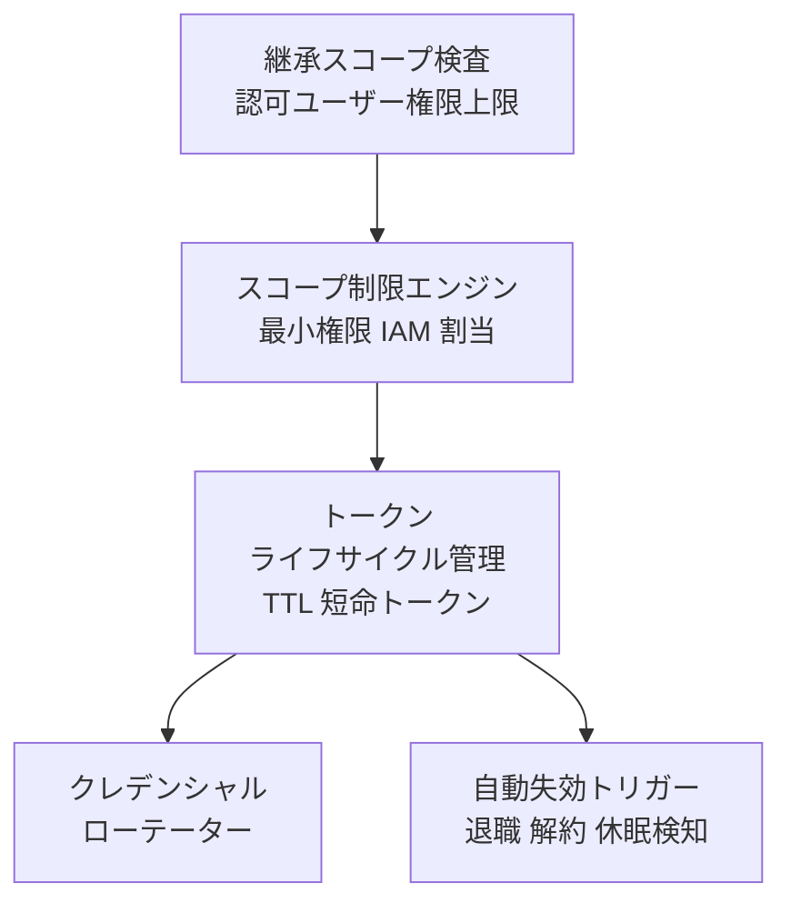
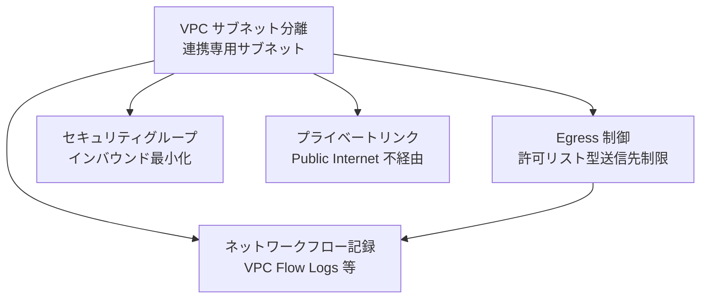
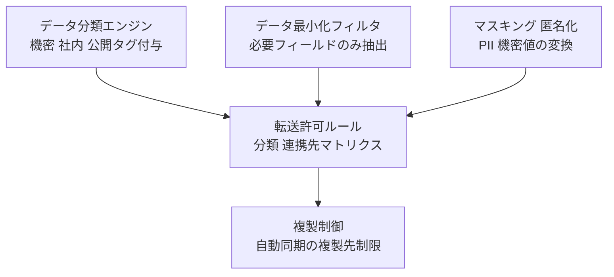
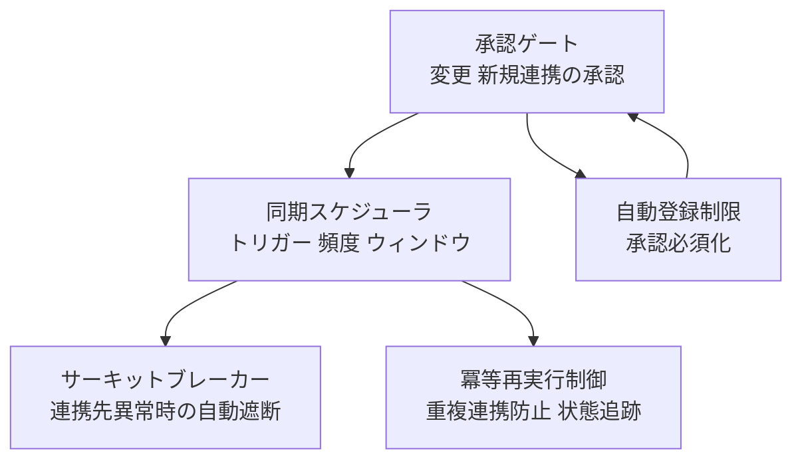
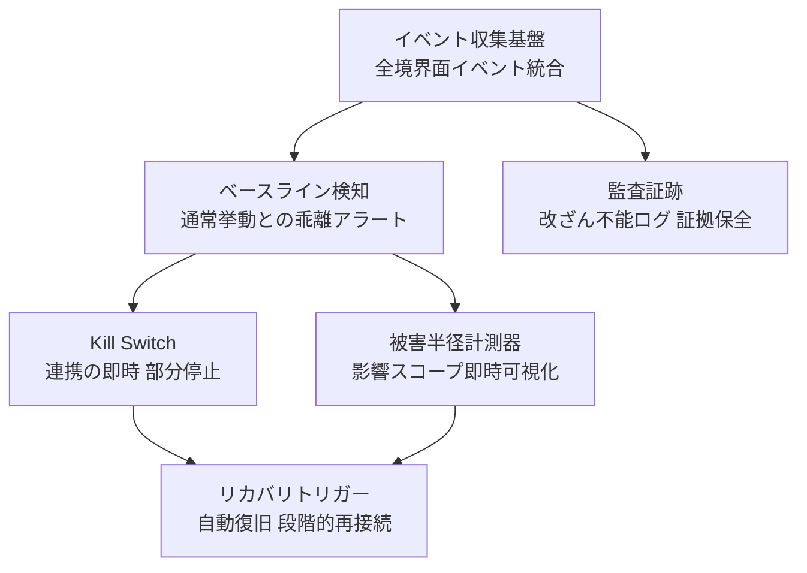
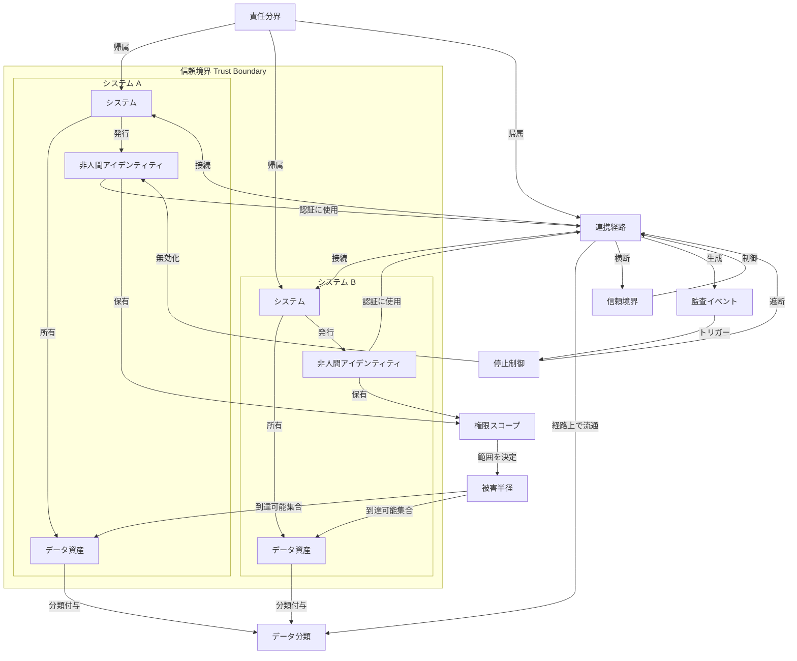
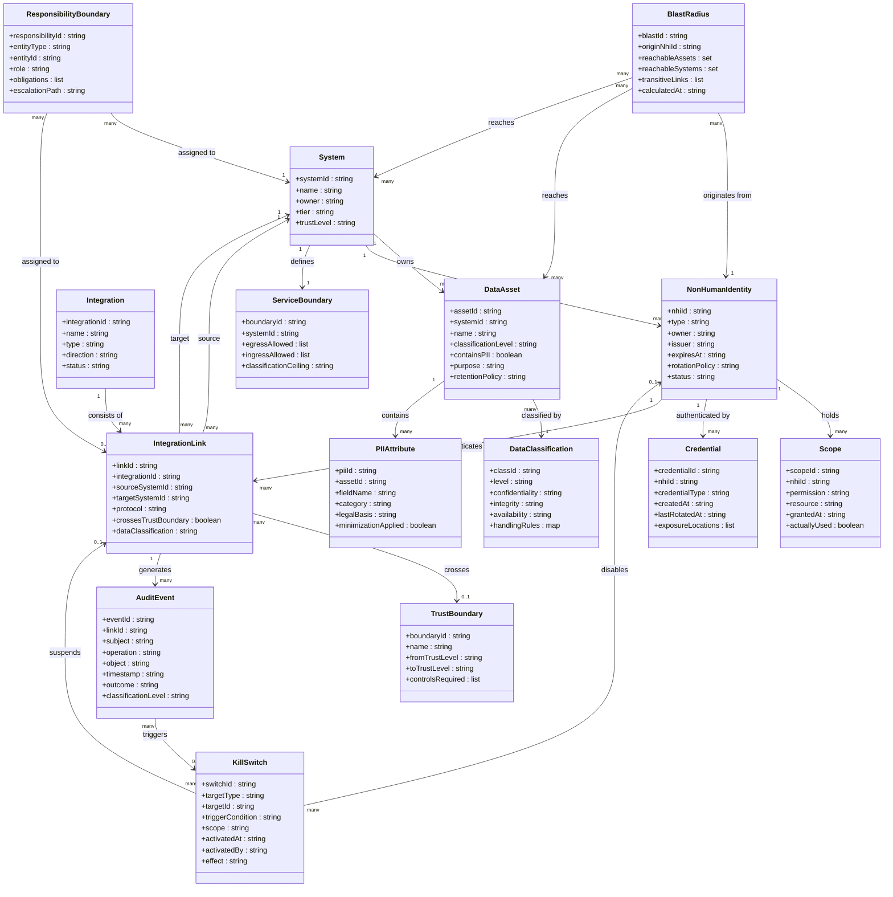

「便利だから」と入れた自動連携や自動登録が、いざ侵害が起きたときに被害を一気に広げてしまう。本記事は、この「被害半径(blast radius)」をシステム連携の境界設計の問題として整理し、信頼境界・データ境界・責任境界の三つの観点から、被害を封じ込めるアーキテクチャと実装パターンをまとめます。

起点は、国内損害保険会社の不正アクセス事案を「便利な自動連携が被害範囲を広げた」という観点で論じた日経クロステックの記事です。被害件数の内訳は公式発表で確認できますが、自動登録・他商品連携の機構そのものは公式に明記がなく、本記事では日経記事の分析的フレーミングとして扱います。

## 概要

### blast radius とは

blast radius（被害半径）は、セキュリティ侵害またはシステム障害から生じる潜在的な影響・損害の最大範囲を指します。具体的には「攻撃者が最初の侵入点から到達できるシステムの幅、アクセス可能なデータの量、引き起こせる業務停止の規模」として定義されます。

この概念はもともと信頼性工学に由来します。AWS Well-Architected Framework は blast radius を「システム障害が発生した際に被りうる最大の影響範囲」と定義し、障害封じ込め設計の中心指標に据えています。サイバーセキュリティの文脈では、侵入後の横展開（lateral movement）がどこまで到達できるかを表します。

blast radius は「攻撃対象領域（attack surface）」や「攻撃手法（attack vector）」とは異なる概念です。攻撃対象領域は侵入の入口の広さを示し、blast radius は侵入後の到達範囲を示します。

### システム間連携・自動登録・自動同期が被害半径を拡大する構造

システム間連携は、単一侵入点の blast radius を設計上の意図なく増幅します。理由は次の三点です。

第一に、連携経路は「信頼済み」として扱われます。あるシステム A が侵害されると、A から B への自動連携リクエストは正規のトラフィックとして処理されます。B 側は A を信頼しているため、追加の認証・検証なしにデータ書き込みや登録が実行されます。

第二に、自動登録・自動同期は人間の介在なしに連鎖します。不正アクセスがシステム A に入った瞬間、A から連携先 B・C への自動同期が発火し、B・C のデータも被害対象になります。人間が異常に気づく前に被害が拡大します。

第三に、連携先に独立したデータ境界が存在しない場合、1 つの侵害が連鎖的に全連携先へ伝播します。

### 起点インシデントと一般化

起点となった事例は、国内損害保険会社（アクサ損害保険、2025 年）のペット保険システムへの不正アクセスです。流出した可能性がある情報は最大で約 55.3 万件にのぼり、内訳は次のとおりと公表されています。

| 区分 | 件数（公表値） |
|---|---|
| 既契約者・被保険者（解約含む） | 約 14.3 万件 |
| 見積もり・資料請求をした方 | 約 39.9 万件 |
| 賠償責任保険の被害者 | 約 1 千件 |
| 動物医療機関・医療調査業務協力先 | 約 1 万件 |
| 保険代理店 | 199 件 |

注目すべきは、直接の契約者（約 14.3 万件）よりも、見積もり・資料請求などの周辺チャネル経由で 1 つのシステムに集約されていた顧客情報（約 39.9 万件）のほうが大きい点です。日経クロステックの記事は、こうした「別経路で取り込まれた・自動登録された情報まで同一システムに集まっていたために被害半径が広がった」構図に注目しています（被害拡大の具体的な内部連携機構については一次の公表資料に明記がないため、本稿では記事の分析的フレーミングとして扱います）。

一般化すると次の構図になります。

```
[不正アクセス] → [システム A 侵害] → [A への自動取り込み・A→B 自動連携が正規動作として実行]
                                     → [他チャネル・他商品の顧客情報まで被害範囲に入る]
```

「便利さのために作った自動連携・自動取り込み」が「攻撃者にとって無料の横展開経路」になります。これが連携境界のセキュリティ設計における根本課題です。

### 三つの境界概念

連携境界を設計するうえで、以下の三概念を区別します。

| 境界 | 定義 | 侵食されると起きること |
|---|---|---|
| 信頼境界（trust boundary） | 制御・検証・権限が変わる点。異なる信頼レベルのアクター・システムが接触する箇所 | 侵害元システムが「信頼済み」として連携先を操作できる |
| データ境界（data boundary） | データの流れに対する管理・フィルタリングが変わる点。信頼されない入力はここで検証が必要 | 連携先システムが本来受け取るべきでないデータを受領・保存する |
| 責任境界（responsibility boundary） | セキュリティ管理の責任が切り替わる点。プロバイダとカスタマの責任分界もここに入る | どのシステムが何を守るか不明確になり、抜け漏れが生じる |

これら三つの境界が連携設計で曖昧になるとき、blast radius は設計者の意図を超えて拡大します。

加えて、複数システムが同一の IdP（Identity Provider）を信頼している場合、IdP の侵害は全連携先の信頼境界を同時に崩壊させます。SAML/OIDC によるシングルサインオンは利便性を高める一方で、IdP を単一信頼点（single point of trust）にします。IdP ごと・アプリケーションごとにスコープを分離し、IdP 侵害時の影響を局所化する設計（フェデレーションの分割、条件付きアクセス、トークン監査）を併用します。

### 攻撃者視点での対応（MITRE ATT&CK）

連携境界の侵害は、攻撃者視点では以下の TTP に対応します。脅威モデリングの議論で共通言語として使えます。

| TTP | 名称 | 連携境界での現れ方 |
|---|---|---|
| T1078.004 | Valid Accounts: Cloud Accounts | 漏えいしたサービスアカウント・連携用クラウド認証情報の悪用 |
| T1550.001 | Use Alternate Authentication Material: Application Access Token | 窃取した OAuth トークンによる連携先 API への正規アクセス |
| T1021 | Remote Services | 信頼済み連携経路を辿った横展開（lateral movement） |

## 特徴

- 便利さと blast radius 拡大のトレードオフ：自動連携・自動登録・シングルサインオンは利用者体験を向上させますが、同時に単一侵入点から到達できる範囲を広げます。利便性機能はすなわち blast radius 拡大機能でもあります。
- 自動連携が責任分界を曖昧にする：手動処理には「承認者」が存在するため責任の所在が明確です。自動連携では処理がシステム間をトランスペアレントに流れるため、「誰がどのデータの安全を保証するか」が不明確になります。
- 被害は「最初の侵入点」より「連携経路」で広がる：攻撃者の目的が、侵入した A システムのデータより連携先 B・C のデータにある場合もあります。連携経路は「横展開のハイウェイ」として機能します。
- フラットな連携ネットワークは単一障害点を持つ：すべてのシステムが互いに直接連携する設計（フルメッシュ）では、任意の 1 点が侵害されると全体に伝播します。連携の深さとノード数の積が blast radius の規模を決めます。
- 最小権限原則の未適用が blast radius を増幅する：連携アカウントが「全データ読み書き権限」を持つ場合、攻撃者がそのアカウントを悪用すると連携先の全データが被害範囲になります。必要最小限の権限に絞ることが直接の縮小手段です。
- 自動化が検出を遅らせる：人間が承認に関わらない自動連携では、異常な連携リクエストが「正規の自動処理」として通過します。発覚が遅れるほど blast radius は拡大します。
- 非人間アイデンティティ（NHI: Non-Human Identity）の急増が新たなリスクを生む：クラウドネイティブ環境では NHI（サービスアカウント、API キー等）が人間アカウントを大きく上回って存在します。これらが適切に管理されないと、単一の侵害された認証情報が多数のシステムへのアクセスを可能にします。

### 被害半径を縮小する設計アプローチの比較

| アプローチ | 目的 | 縮小する境界 | コスト | 適用条件 |
|---|---|---|---|---|
| ネットワーク分離（マイクロセグメンテーション） | 横展開経路を物理・論理的に遮断する | 信頼境界 | 高（ネットワーク再設計、運用複雑化） | 独立したセキュリティドメインを持つ複数システムが存在する |
| 最小権限の原則（Least Privilege） | 侵害されたアカウントが到達できる範囲を限定する | 責任境界・データ境界 | 中（権限設計の工数、定期レビュー） | すべての連携。とくに API キー・サービスアカウントを使う連携 |
| セルベースアーキテクチャ（Cell-Based Architecture） | 障害・侵害をセル単位に封じ込め、他セルへの伝播を防ぐ | 信頼境界・データ境界 | 高（アーキテクチャ再設計、インフラ増加） | 高可用性・極高耐障害性が求められる大規模サービス |
| Bulkhead パターン | リソースプールを分割し、一部の過負荷・侵害が他に波及しないようにする | 信頼境界 | 中（スレッドプール・接続プールの分割設計） | マイクロサービス、複数の下流依存を持つサービス |
| データ最小化（Data Minimization） | 連携に必要な最小限のデータのみを転送し、漏えい時の影響を限定する | データ境界 | 低〜中（フィールドフィルタリング設計） | 法規制が適用される連携、個人情報を扱う連携 |
| 同期連携 vs 非同期連携の選択 | 非同期化により連携の伝播速度を下げ、異常検知の時間を確保する | 信頼境界・責任境界 | 低〜中（メッセージキュー導入） | リアルタイム性よりも安全性を優先できる業務連携 |
| Zero Trust（ゼロトラスト） | 「ネットワーク内＝安全」の前提を排除し、すべての連携リクエストを検証する | 信頼境界・責任境界 | 高（認証基盤刷新、全リクエスト検証の実装） | クラウド・ハイブリッド環境、多拠点・多組織連携 |

補足を以下に示します。

- ネットワーク分離（マイクロセグメンテーション）は NIST SP 800-207（Zero Trust Architecture）で推奨される手法であり、デフォルト拒否（default deny）を原則に「明示的に許可されたフローのみ通す」実装で実現します。攻撃者が 1 セグメントに侵入しても、他セグメントへの横展開をセグメント境界が阻止します。
- セルベースアーキテクチャは AWS が Availability Zones・Regions に適用する障害分離の考え方をアプリケーションレベルに持ち込んだものです。各セルは独立した完結したシステムであり、あるセルの侵害は限定された一部のユーザーに留まります。
- Bulkhead パターンは Michael Nygard が "Release It!"（2007 年）で提唱した概念です。船の防水隔壁が一区画の浸水を船全体の沈没に発展させないのと同様に、障害を「小さなリクエスト・ユーザー群」に封じ込めます。
- 同期 vs 非同期の選択では、同期連携は侵害が即時に伝播し速度優先である一方、非同期連携は伝播に時間差が生まれるため異常検知が介入できる余地があります。リアルタイム性が必須でない場合は非同期化が blast radius 縮小に有効です。

## 構造

Pattern B（方法論）調査のため、C4 model を「被害半径封じ込めフレームワーク」の論理構造として読み替えて図解します。

### システムコンテキスト図



#### アクター・外部システム

| 要素名 | 説明 |
|---|---|
| 開発者 | 連携先 SaaS の OAuth フローや API Key を設定・登録する実装担当者 |
| SRE | 障害・インシデント時に Kill Switch を操作し連携を強制停止する運用担当 |
| セキュリティ担当 | 認証スコープ・データ分類・境界ポリシーを定義し変更を審査する担当 |
| 攻撃者 | 漏えいした認証情報や過剰スコープを悪用し横移動・データ窃取を試みる |
| 連携先 SaaS 群 | OAuth / API Key で接続される外部 SaaS（CRM, チャット, メール, 分析等） |
| 業務システム群 | オンプレまたはクラウドに存在する社内の業務データソース・API 群 |
| 監査基盤 | 全連携イベントのログを蓄積しアラートを発する外部の観測システム |

### コンテナ図



#### 論理コンポーネント（境界面）

| 要素名 | 説明 |
|---|---|
| 資格情報・認証境界 | API Key / OAuth トークンのスコープ最小化・ライフサイクル管理・失効制御を行う境界面 |
| 到達経路・ネットワーク境界 | VPC/サブネット分離・許可リスト型 Egress 制御で横移動到達経路を封じる境界面 |
| データ境界 | データ分類タグに基づき転送・複製・同期を許可するデータセットを制限する境界面 |
| 連携制御面 | 自動登録・複製・同期の起動を管理し変更承認ゲートを設ける制御面 |
| 監査・停止面 | 全境界面のイベントを収集し異常検知・Kill Switch 発動・被害半径計測を行う観測面 |
| ポリシーストア | 認証スコープ定義・データ分類ルール・承認ポリシーを格納する台帳（変更は審査が必要） |
| 監査ログストア | 全イベントを改ざん不能な形式で永続化するストア（外部 SIEM への転送先も含む） |

### コンポーネント図

各境界面をドリルダウンします。ここでは具体的な実装要素名を使用します。

#### 資格情報・認証境界



| 要素名 | 説明 |
|---|---|
| スコープ制限エンジン | IAM ロール・OAuth スコープを最小必要権限に絞り込む。過剰付与を検出しブロック |
| トークンライフサイクル管理 | TTL を設定し短命トークンを発行。有効期限切れを自動廃棄 |
| 自動失効トリガー | 担当者退職・SaaS 解約・長期休眠（例: 30 日超アクセスなし）で自動失効 |
| クレデンシャルローテーター | 定期ローテーションを自動実行し長期固定トークンを排除 |
| 継承スコープ検査 | OAuth 認可実行ユーザーが持つ権限を上限に、連携アプリのスコープが超えていないか検査 |

#### 到達経路・ネットワーク境界



| 要素名 | 説明 |
|---|---|
| VPC サブネット分離 | 連携処理を専用サブネットに閉じ込め他ワークロードとの横移動を防止 |
| Egress 制御 | 送信先を許可リストに登録済みの連携先 FQDN/IP のみに制限 |
| セキュリティグループ | インバウンドを最小限のポート・送信元 IP に絞り、不要到達経路を遮断 |
| プライベートリンク | AWS PrivateLink / Azure Private Link 等で Public Internet を経由しない経路を確立 |
| ネットワークフロー記録 | VPC Flow Logs / NSG Flow Logs で全通信を記録し異常な宛先・量を検知 |

#### データ境界



| 要素名 | 説明 |
|---|---|
| データ分類エンジン | データセット・フィールド単位に「機密 / 社内 / 公開」等のタグを付与 |
| データ最小化フィルタ | 連携ユースケースに必要なフィールドのみを抽出し余分な属性を除去 |
| マスキング・匿名化処理 | PII・クレデンシャル等の機密値をマスキングまたはトークン化してから転送 |
| 転送許可ルール | 「データ分類タグ × 連携先システム」のマトリクスで転送可否を制御 |
| 複製制御 | 自動同期・レプリケーションの複製先範囲を許可リストで制限 |

#### 連携制御面



| 要素名 | 説明 |
|---|---|
| 承認ゲート | 新規連携設定・スコープ拡張・自動登録を人間またはポリシーエンジンが承認する関門 |
| 同期スケジューラ | 連携の起動トリガー・実行頻度・実行ウィンドウを管理し野良実行を排除 |
| 自動登録制限 | クラウドサービスの Auto-provisioning・自動招待を承認必須フローに組み込む |
| サーキットブレーカー | 連携先の異常（エラー率・遅延閾値超過）を検知し自動で呼出を遮断 |
| 冪等再実行制御 | 重複実行を防止し冪等性を保証することで被害半径の二次拡大を抑止 |

#### 監査・停止面



| 要素名 | 説明 |
|---|---|
| イベント収集基盤 | 資格情報・ネットワーク・データ・制御面の全イベントをリアルタイムに統合収集 |
| ベースライン検知 | 正常時の API コール量・アクセスパターン・送信先を基準に乖離を検知しアラート |
| 被害半径計測器 | インシデント発生時に影響を受けた連携先・データ種別・ユーザー範囲を即時可視化 |
| Kill Switch | 特定連携または全連携を即時停止する操作（SRE・自動トリガー双方から発動可） |
| 監査証跡 | 全アクセスイベントを改ざん不能な形式で保全し規制準拠・フォレンジックを支援 |
| リカバリトリガー | Kill Switch 停止後の自動復旧手順または段階的再接続フローを起動する |

## データ

方法論が対象とする概念を「概念モデル」と「情報モデル」でモデル化します。

### 概念モデル



| 要素名 | 説明 |
|---|---|
| システム | データ資産を所有し、NHI を発行する自律的なサービス・アプリケーション単位 |
| データ資産 | システムが保持するデータの集合。データ分類が付与される |
| 非人間アイデンティティ | 人間の操作なしに認証・動作する機械的アイデンティティ（API キー・サービスアカウント・OAuth トークン等） |
| 連携経路 | システム間の同期・複製・自動登録フローを表す経路。NHI が認証手段として使用される |
| データ分類 | データ資産の機密レベル・種別を表すラベル体系 |
| 権限スコープ | NHI が行使できる操作範囲を定義する権限の集合 |
| 被害半径 | 単一 NHI または資産が侵害された際に攻撃者が到達できるデータ資産・システムの集合 |
| 信頼境界 | 異なる信頼レベルを持つゾーン間の境界線。連携経路が横断するとき制御が必要 |
| 監査イベント | 連携経路上の操作・アクセスを記録したイベントレコード |
| 停止制御 | NHI の認証または連携経路を緊急停止するメカニズム |
| 責任分界 | インシデント時の帰属・対応責任をシステム・経路単位で割り当てる境界 |

### 情報モデル



| 要素名 | 説明 |
|---|---|
| System | サービス・アプリケーション単体。`tier` はクリティカリティ、`trustLevel` は Zero Trust ゾーン区分 |
| ServiceBoundary | システムが宣言する入出力の分類上限と許可エンドポイント一覧 |
| Integration | 同期・複製・自動登録の論理フロー定義。`type` は push/pull/event など |
| IntegrationLink | 具体的な通信経路。`crossesTrustBoundary` が true のとき制御強化が必要 |
| NonHumanIdentity | サービスアカウント・API キー・OAuth トークン等の機械的アイデンティティ。`rotationPolicy` で有効期限管理 |
| Scope | NHI に付与された個々の権限。`actuallyUsed` でスコープクリープを検出する |
| Credential | NHI が認証に使う秘密情報。`exposureLocations` でシークレットの漏出先リストを管理 |
| DataAsset | システムが保有するデータ集合。`purpose` は目的限定原則に対応 |
| DataClassification | 機密度区分に C-I-A（機密性・完全性・可用性）の各評価を保持するラベル |
| PIIAttribute | DataAsset 内の個人情報フィールド。法的根拠（`legalBasis`）と最小化適用フラグを持つ |
| TrustBoundary | ゾーン間の信頼レベル遷移点。`controlsRequired` に認証・暗号化・検証要件を列挙 |
| BlastRadius | 侵害起点 NHI から到達可能な資産・システムの集合。推移的連携経路を含む |
| AuditEvent | 連携経路上の操作を (subject, operation, object) タプルで記録 |
| KillSwitch | `targetType` で NHI またはリンクを選択し、`scope` でセッション限定か全停止かを区別 |
| ResponsibilityBoundary | システム・経路への責任帰属を `role` (owner/operator/processor 等) で区分 |

### 補足：被害半径の計算モデル

被害半径 (BlastRadius) は「侵害された NHI の権限スコープ (Scope) が許可するリソース集合」を起点とし、連携経路 (IntegrationLink) を通じた推移的到達可能性を加算した集合として定義できます。

```
BlastRadius = {DataAsset | accessible(NHI.scopes)}
              ∪ {DataAsset | reachable via IntegrationLink chain}
```

スコープが最小化されるほど、また連携経路が信頼境界で分断されるほど集合は縮小します（最小権限原則の効果）。IntegrationLink の `dataClassification` が ServiceBoundary の `classificationCeiling` を超える場合、その経路は規約違反として停止制御の対象になります。AuditEvent が異常パターン（高頻度・未認可操作・分類上限違反）を示すとき、KillSwitch を自動トリガーできます。

## 構築方法

### 連携インベントリの作成

連携インベントリは、どのシステムが何と連携し、どんなデータ・権限が流れるかを一覧化した台帳です。

- 全 SaaS 連携・内部 API 連携を列挙し、各連携の「送信元 / 送信先 / 流れるデータ項目 / 使用クレデンシャル種別 / 更新頻度」を記録します。
- インベントリの最小カラム構成例:

| 連携 ID | 送信元 | 送信先 | データ分類 | クレデンシャル種別 | スコープ / 権限 | 停止手順 URL |
|---|---|---|---|---|---|---|
| INT-001 | CRM | ERP | 個人情報(氏名/メール) | OAuth 2.0 refresh_token | contacts.read | /runbooks/int-001-kill |
| INT-002 | ETL | S3 | 財務データ | IAM ロール (一時) | s3:PutObject (特定バケット) | /runbooks/int-002-kill |

- インベントリは YAML またはスプレッドシートで管理し、CI/CD パイプラインのゲートとして参照できる状態にします。
- 未登録連携が発見された場合は即座にブロックするポリシーをゲートウェイ層に設定します。

### 信頼境界の特定とデータフロー図（DFD）作成

データフロー図（DFD）は、プロセス・外部エンティティ・データストア・データフロー・信頼境界の 5 要素で構成されます。

1. 外部エンティティを描く: ユーザー、外部 SaaS、パートナー API などシステム境界外のアクターを列挙します。
2. プロセスを描く: データ変換・処理を行うコンポーネントを描きます。
3. データストアを描く: DB・ファイルストレージ・キャッシュを配置します。
4. データフローを描く: データが実際に移動する経路を線で結び、移動するデータ名を付記します。
5. 信頼境界を引く: 異なるセキュリティドメイン間の境界（例: インターネット ↔ DMZ ↔ 内部 LAN）を明示します。

OWASP Threat Dragon を使った DFD のバージョン管理例（実装案。実際は GUI で作成し JSON エクスポートしてコミットします）:

```json
{
  "summary": { "title": "CRM-ERP 連携 脅威モデル", "owner": "security-team" },
  "detail": {
    "diagrams": [
      {
        "title": "DFD Level 1",
        "diagramType": "STRIDE",
        "cells": [
          { "type": "process", "label": "CRM API Gateway" },
          { "type": "process", "label": "ERP Adapter" },
          { "type": "store",   "label": "顧客 DB" },
          { "type": "actor",   "label": "営業担当者" },
          { "type": "flow",    "label": "顧客データ(氏名/メール)", "from": "CRM API Gateway", "to": "ERP Adapter" },
          { "type": "boundary","label": "インターネット境界" }
        ]
      }
    ]
  }
}
```

STRIDE で脅威を洗い出します。

- S（Spoofing / なりすまし）: クレデンシャル盗用によるシステム偽装
- T（Tampering / 改ざん）: 連携経路でのデータ書き換え
- R（Repudiation / 否認）: 誰がどの連携を実行したかの証跡欠如
- I（Information Disclosure / 情報漏えい）: 不要なデータ項目の送信
- D（Denial of Service / サービス妨害）: 連携の停止・遅延
- E（Elevation of Privilege / 権限昇格）: 過剰スコープによる権限悪用

### 最小権限スコープの設計

OAuth 2.0 スコープの最小化（実装案）。連携フローに必要な最小限のスコープだけ要求します。

```python
# OAuth 2.0 認可リクエスト時のスコープを連携ごとに分割する例
# 参考: https://curity.io/resources/learn/scope-best-practices/

# 連携フローに必要な最小限のスコープのみ定義する
INTEGRATION_SCOPES = {
    "crm_to_erp":         ["contacts.read"],
    "erp_to_billing":     ["invoices.read", "invoices.write"],
    "analytics_exporter": ["reports.read"],
}

def request_token(integration_id: str, auth_server_url: str) -> str:
    scopes = INTEGRATION_SCOPES.get(integration_id, [])
    if not scopes:
        raise ValueError(f"Unknown integration: {integration_id}")
    scope_str = " ".join(scopes)
    # 実際は OAuth 2.0 Client Credentials Flow を使う
    return f"{auth_server_url}/token?scope={scope_str}&grant_type=client_credentials"
```

AWS IAM 最小権限ポリシーの例（実装案）。Action・Resource・Condition の 3 点すべてを絞り込みます。

```json
{
  "Version": "2012-10-17",
  "Statement": [
    {
      "Sid": "AllowETLPutToSpecificPrefix",
      "Effect": "Allow",
      "Action": ["s3:PutObject"],
      "Resource": "arn:aws:s3:::my-data-lake-bucket/incoming/crm/*",
      "Condition": {
        "StringEquals": { "aws:RequestedRegion": "ap-northeast-1" },
        "Bool": { "aws:SecureTransport": "true" }
      }
    }
  ]
}
```

OPA Rego v1 構文による連携承認ポリシー例（実装案）。

```rego
# policies/integration_authz.rego
# OPA v1.0 対応: import rego.v1 を先頭に置く
# 参考: https://www.openpolicyagent.org/docs/cheatsheet
package integration.authz

import rego.v1

default allow := false

allow if {
    input.integration_id in data.approved_integrations
    all_scopes_approved
}

all_scopes_approved if {
    approved := data.integration_scopes[input.integration_id]
    every scope in input.requested_scopes {
        scope in approved
    }
}

deny_reason := "unregistered integration" if {
    not input.integration_id in data.approved_integrations
}

deny_reason := "scope not approved" if {
    input.integration_id in data.approved_integrations
    not all_scopes_approved
}
```

### ネットワーク分離・セグメンテーション

Terraform による AWS セキュリティグループの 3 層セグメンテーション（実装案、ALB → App → DB）。現行リソース型 `aws_vpc_security_group_ingress_rule` / `aws_vpc_security_group_egress_rule` を使用します。

```hcl
# terraform/modules/integration-segmentation/main.tf
# 参考: https://spacelift.io/blog/terraform-security-group

resource "aws_vpc" "main" {
  cidr_block           = "10.0.0.0/16"
  enable_dns_hostnames = true
  tags = { Name = "main-vpc" }
}

resource "aws_security_group" "alb" {
  name   = "sg-alb"
  vpc_id = aws_vpc.main.id
  tags   = { Name = "sg-alb" }
}

resource "aws_vpc_security_group_ingress_rule" "alb_https" {
  security_group_id = aws_security_group.alb.id
  from_port         = 443
  to_port           = 443
  ip_protocol       = "tcp"
  cidr_ipv4         = "0.0.0.0/0"
  description       = "Allow HTTPS from internet"
}

resource "aws_vpc_security_group_egress_rule" "alb_to_app" {
  security_group_id            = aws_security_group.alb.id
  from_port                    = 8080
  to_port                      = 8080
  ip_protocol                  = "tcp"
  referenced_security_group_id = aws_security_group.app.id
  description                  = "Allow traffic to app tier only"
}

resource "aws_security_group" "app" {
  name   = "sg-app"
  vpc_id = aws_vpc.main.id
  tags   = { Name = "sg-app" }
}

resource "aws_vpc_security_group_ingress_rule" "app_from_alb" {
  security_group_id            = aws_security_group.app.id
  from_port                    = 8080
  to_port                      = 8080
  ip_protocol                  = "tcp"
  referenced_security_group_id = aws_security_group.alb.id
  description                  = "Accept only from ALB security group"
}

resource "aws_vpc_security_group_egress_rule" "app_to_db" {
  security_group_id            = aws_security_group.app.id
  from_port                    = 5432
  to_port                      = 5432
  ip_protocol                  = "tcp"
  referenced_security_group_id = aws_security_group.db.id
  description                  = "Allow DB access to DB tier only"
}

resource "aws_security_group" "db" {
  name   = "sg-db"
  vpc_id = aws_vpc.main.id
  tags   = { Name = "sg-db" }
}

resource "aws_vpc_security_group_ingress_rule" "db_from_app" {
  security_group_id            = aws_security_group.db.id
  from_port                    = 5432
  to_port                      = 5432
  ip_protocol                  = "tcp"
  referenced_security_group_id = aws_security_group.app.id
  description                  = "Accept only from App security group"
}
```

Kubernetes NetworkPolicy によるネームスペース分離（実装案）。デフォルト拒否 + 承認済み名前空間のみ許可します。

```yaml
# k8s/network-policy/default-deny-ingress.yaml
apiVersion: networking.k8s.io/v1
kind: NetworkPolicy
metadata:
  name: default-deny-ingress
  namespace: integration-ns
spec:
  podSelector: {}
  policyTypes:
    - Ingress
---
# k8s/network-policy/allow-from-crm-ns.yaml
apiVersion: networking.k8s.io/v1
kind: NetworkPolicy
metadata:
  name: allow-from-crm-ns
  namespace: integration-ns
spec:
  podSelector:
    matchLabels:
      app: erp-adapter
  policyTypes:
    - Ingress
  ingress:
    - from:
        - namespaceSelector:
            matchLabels:
              kubernetes.io/metadata.name: crm-ns
          podSelector:
            matchLabels:
              app: crm-gateway
      ports:
        - protocol: TCP
          port: 8080
```

## 利用方法

### 承認ゲート + 監査 + 停止手順を備えた連携設計

自動連携はゲートのないまま稼働させると、連携先の拡大が追跡できなくなります。以下の 3 点を初期設計に組み込みます。

- 承認ゲート: 新規連携の本番開始に Security / Privacy の承認を必須化し CI/CD に組み込む。
- 監査ログ: すべての連携呼び出しをアクター・タイムスタンプ・送受信データサイズとともに記録する。
- 停止手順（Runbook）: 各連携に kill switch URL と停止担当者を事前定義する。

```yaml
# 連携登録テンプレート（PR ゲートとして使用する YAML フォーム、実装案）
integration:
  id: INT-003
  name: "Salesforce -> Slack 商談通知"
  owner: "sales-ops@example.com"
  data_classification: "internal"      # public / internal / confidential / secret
  data_fields:
    - deal_name                        # 商談名（個人情報なし）
    - amount                           # 金額
    # 禁止: customer_email, phone_number
  credentials:
    type: "oauth2_client_credentials"
    scope: "deals.read"
    ttl_hours: 1
  approvals:
    - role: "security-team"
      approved_at: ""                  # 承認日時を記入するまでマージ不可
    - role: "privacy-team"
      approved_at: ""
  kill_switch:
    runbook_url: "https://wiki.example.com/runbooks/int-003-kill"
    on_call_slack: "#security-incidents"
```

### データ最小化フィルタ

送信前フィルタを連携アダプター層に実装し、不要なフィールドを削除します（allowlist 方式）。

```python
# データ最小化フィルタ（実装案）
# 参考: https://complydog.com/blog/api-data-protection-developers-gdpr-implementation-guide
from typing import Any

ALLOWED_FIELDS: dict[str, set[str]] = {
    "INT-001": {"deal_name", "amount", "stage"},   # 個人情報フィールドを除外
    "INT-002": {"invoice_id", "total", "due_date"},
}

def minimize_payload(integration_id: str, raw_payload: dict[str, Any]) -> dict[str, Any]:
    allowed = ALLOWED_FIELDS.get(integration_id)
    if allowed is None:
        raise ValueError(f"Unknown integration: {integration_id}")
    filtered = {k: v for k, v in raw_payload.items() if k in allowed}
    removed = set(raw_payload.keys()) - allowed
    if removed:
        import logging
        # 削除したフィールド名のみログに記録する（値は記録しない）
        logging.getLogger(__name__).info(
            "data_minimization removed fields",
            extra={"integration_id": integration_id, "removed_fields": sorted(removed)},
        )
    return filtered
```

### kill switch / フィーチャーフラグによる即時停止

kill switch は「コードデプロイなしで即時停止できる」ことが最低条件です。

```python
# kill switch（環境変数による緊急停止 + フラグストア、実装案）
# 参考: https://launchdarkly.com/docs/home/flags/killswitch
import os

def is_integration_enabled(integration_id: str) -> bool:
    # 1. 環境変数による緊急 kill switch（デプロイ不要・即時反映）
    env_key = f"INT_{integration_id.replace('-', '_')}_DISABLED"
    if os.getenv(env_key, "").lower() == "true":
        return False
    # 2. フラグストア（LaunchDarkly / Unleash / Flagsmith 等に差し替え可能）
    return _load_flag(integration_id)

def _load_flag(integration_id: str) -> bool:
    flags_file = os.getenv("FLAGS_CONFIG_PATH", "/etc/integration-flags/flags.json")
    try:
        import json
        with open(flags_file) as f:
            flags = json.load(f)
        return flags.get(integration_id, True)   # 未設定時はデフォルト有効
    except FileNotFoundError:
        return True
```

### 短命・回収前提の資格情報

長期クレデンシャル（IAM アクセスキーや OAuth refresh_token）のハードコードを避け、操作の直前に短命クレデンシャルを取得します。

AWS STS AssumeRole による一時クレデンシャル取得（実装案）。`DurationSeconds` は 900〜43200 秒の範囲で、ロールの最大セッション時間設定が上限になります（ロールチェーン時は最大 3600 秒）。エフェメラルジョブは最小値（900 秒）を推奨します。

```python
# 参考: https://docs.aws.amazon.com/STS/latest/APIReference/API_AssumeRole.html
import boto3

def get_temp_credentials(role_arn: str, session_name: str, duration_seconds: int = 900) -> dict:
    sts = boto3.client("sts", region_name="ap-northeast-1")
    response = sts.assume_role(
        RoleArn=role_arn,
        RoleSessionName=session_name,
        DurationSeconds=duration_seconds,
        # セッションポリシーでロール権限をさらに絞る
        Policy='{"Version":"2012-10-17","Statement":[{"Effect":"Allow","Action":["s3:PutObject"],"Resource":"arn:aws:s3:::my-data-lake-bucket/incoming/crm/*"}]}',
    )
    creds = response["Credentials"]
    return {
        "access_key_id":     creds["AccessKeyId"],
        "secret_access_key": creds["SecretAccessKey"],
        "session_token":     creds["SessionToken"],
        "expiration":        creds["Expiration"].isoformat(),
    }
```

CI/CD では長期キーを置かず OIDC フェデレーションで一時クレデンシャルを得ます（実装案）。

```yaml
# .github/workflows/deploy.yml
permissions:
  id-token: write   # OIDC トークン要求に必須
  contents: read
jobs:
  deploy:
    runs-on: ubuntu-latest
    steps:
      - uses: actions/checkout@v4
      - name: Configure AWS credentials via OIDC
        uses: aws-actions/configure-aws-credentials@v4
        with:
          role-to-assume: arn:aws:iam::123456789012:role/GithubActionsDeployRole
          aws-region: ap-northeast-1
          role-duration-seconds: 900
      - name: Deploy
        run: aws s3 sync ./dist s3://my-static-bucket/
```

## 運用

### 被害半径の継続的な計測

被害半径は「インシデント後に算出するもの」ではなく、常時ライブシグナルとして維持する指標として扱います。NHI はクラウド環境で人間アカウントを大きく上回って増殖するため、手動棚卸しでは追いつきません。

- Identity Reachability マップ: 侵害された ID（サービスアカウント、API キー、OAuth トークン）から到達できる資産を定期的に列挙します。
- Endpoint Reachability マップ: 1 台の端末・コンテナが侵害された場合に数ホップ以内に届くシステムの割合を算出します。
- セグメンテーションカバレッジ率: 「全資産のうちセグメント化済みの割合」と「内部トラフィックのうち制限なしの割合」のギャップをレポートします。
- Critical Asset Exposure: ドメインコントローラー・シークレット管理サーバー・データ基盤など高価値資産への経路数を定点観測します。
- 棚卸し自動化: CNAPP（Cloud-Native Application Protection Platform）または SSPM（SaaS Security Posture Management）で棚卸しをスキャン自動化します。

計測頻度の推奨を以下に示します。

| 対象 | 頻度 |
|---|---|
| 非人間 ID（サービスアカウント・API キー）棚卸し | 週次（自動スキャン）+ 四半期手動レビュー |
| OAuth/SaaS 連携スコープ棚卸し | 月次 |
| ネットワークセグメンテーションカバレッジ | 月次 |
| 高価値資産への到達可能経路数 | 週次（自動計測） |

### 連携の監査ログ監視・異常検知

連携経路を経由する侵害は、単一システム内の監視では検知できません。

- SaaS-to-SaaS 連携のイベントログを、接続元と接続先の双方から取得します。
- ログには「誰が」「どの連携 ID で」「何にアクセスしたか」「いつ」を必ず含めます。
- SIEM（Security Information and Event Management）にすべての連携ログを集約し、単一ビューで横断監視できる状態を作ります。
- ログにはペイロード本体ではなくメタデータのみを記録します（ログ自体が新たな漏えい面にならないようにするため）。

最小ログスキーマ例（JSON Lines）:

```jsonl
{"event_id":"evt-001","ts":"2026-06-22T10:00:00Z","integration_id":"INT-001","actor_nhi_id":"svc-crm-exporter","operation":"GET","resource":"contacts","record_count":150,"outcome":"success","data_classification":"internal"}
```

異常検知の観点を以下に示します。

- 行動ベースライン逸脱: UEBA（User and Entity Behavior Analytics）で連携 ID の通常パターンから外れた操作を検知します。
- 地理的・時間的異常: 連携トークンが通常と異なる地域・時間帯に使われた場合にアラートを発します。
- 大量データアクセス: API 経由の異常なデータ取得量をしきい値アラートで捕捉します。
- User-Agent 異常: 既知の連携以外の User-Agent をホワイトリスト管理し差分を検知します。
- ゾンビトークン利用検知: 退職者・廃止プロジェクトに紐づくトークンが動作した場合に即アラートします。

アラートのトリアージ優先度の例:

```
P1（即時対応）: 廃止済みトークン利用 / 退職者IDによるアクセス / 境界外データ移動
P2（1時間以内）: 通常の10倍超のAPI呼び出し / 未知User-Agent / 地理的異常
P3（24時間以内）: スコープ外アクセス試行 / 設定変更の未承認実施
```

### インシデント時の連携停止と封じ込め

連携の停止方法はインシデント発生前に定義し、テスト済みの状態にしておく必要があります。「止め方が不明」という状態は封じ込め時間を延ばし被害半径を拡大させます。

Kill Switch の 3 段階アーキテクチャを以下に示します。

| レベル | 対象 | 操作 | 使用場面 |
|---|---|---|---|
| L1（グローバル停止） | 全連携・全エージェント | すべての API キーを無効化し連携フリーズ | 大規模侵害・ゼロデイ対応 |
| L2（セグメント停止） | 特定システム群・特定ベンダー連携 | 対象カテゴリの連携のみ停止 | 侵害ベンダーの切り離し |
| L3（セッション停止） | 個別エージェント・トークン | 対象トークン無効化・セッション終了 | 単一アカウント侵害 |

封じ込めの一般化手順:

1. 検知: SIEM/UEBA または外部報告で異常を把握する。
2. 影響スコープの特定: 侵害された ID が到達できる資産をリアルタイムグラフで確認する。
3. 連携トークン・API キーの即時無効化: 該当連携のクレデンシャルをシークレット管理基盤から無効化する。
4. ネットワーク隔離: セキュリティグループ・VPC ACL・ファイアウォールルールを変更し侵害システムをセグメントから切り離す。
5. 下流への通知: 連携先ベンダー・パートナーに侵害の可能性を即時通知する。
6. 証跡保全: フォレンジック用スナップショットを取得してから侵害システムを操作する。
7. 封じ込め確認: 到達可能経路が遮断されたことを再計測で確認する。

AWS 環境での封じ込め操作例:

```bash
# IAM クレデンシャルの即時無効化
aws iam update-access-key --access-key-id <KEY_ID> --status Inactive

# EC2 インスタンスをネットワークから隔離（セキュリティグループ差し替え）
aws ec2 modify-instance-attribute --instance-id <INSTANCE_ID> --groups <ISOLATION_SG_ID>

# Lambda のリトライを止める（再実行による二次拡大を抑止）
aws lambda put-function-event-invoke-config --function-name <FUNCTION_NAME> --maximum-retry-attempts 0
```

Kill Switch 発動後の再接続は段階的に行います（一括復旧は二次被害を招くため）。

1. L3 から: 該当トークンを最小権限で再発行し、限定スコープで動作確認する。
2. L2 へ: セグメント単位で段階的に連携を解除し、監査ログで異常がないことを確認する。
3. L1 へ: ポストモーテムと封じ込め確認の完了後に全面再開する。

自律型エージェント・自動連携には、Kill Switch とは別に Circuit Breaker を実装します。状態フラグは Redis などの低レイテンシストアに持ち、エージェントコード内ではなくインフラ層で評価します（エージェント自身の自己停止を当てにしないため）。

```python
# Circuit Breaker（実装案）。固定ウィンドウのカウンタで呼出回数を評価する
import redis, time

def is_tripped(integration_id: str, limit: int = 5, window_sec: int = 600) -> bool:
    r = redis.Redis()
    # ウィンドウ境界をキーに含めることで固定時間窓のカウントになる
    key = f"cb:{integration_id}:{int(time.time()) // window_sec}"
    count = r.incr(key)
    r.expire(key, window_sec)
    return count > limit   # True なら遮断（クールダウンへ）
```

```
しきい値例:
- 10分以内に同一ツールを5回連続呼び出し → セッション一時停止（15分クールダウン）
- 1時間のAPI呼び出しコストが閾値超過 → 自動停止 + アラート
- 通常の100倍超のデータ読み取り → 即時停止 + P1アラート
```

### 資格情報・トークンのローテーション（NHI ガバナンス）

NHI は従来の人間 ID ガバナンスとは別のプロセスが必要です。ライフサイクルを Discover → Understand → Enforce → Monitor の 4 ステップで管理します。

| クレデンシャル種別 | ローテーション頻度 | 推奨実装 |
|---|---|---|
| 長期 API キー | 90 日以内 | シークレット管理基盤で自動ローテーション |
| OAuth アクセストークン | 短命（数十分〜数時間） | 短命トークン設計 |
| サービスアカウントキー | 90 日以内 | SPIFFE/SPIRE 証明書での代替が理想 |
| システム間認証（JWT 等） | 有効期限を短く設定 | 15〜60 分有効の短命トークン |
| DB パスワード | 90 日以内 | Vault 動的シークレットで使い捨て化 |

孤児 ID（Orphaned NHI）対策として、退職・プロジェクト終了時の自動無効化をオフボーディング手順に組み込み、長期未使用のトークン・API キーを休眠フラグ後に削除します。ソースコードに埋め込まれたハードコードシークレットは truffleHog / git-secrets 等で継続的に検知します。

## ベストプラクティス

### 便利機能を入れる前に確認するチェックリスト

停止権の確認:

- この連携を「誰が」「どの手順で」即時停止できるかが文書化されているか。
- Kill Switch の実装と動作テストが完了しているか。
- 連携停止時に依存する下流サービスへの影響が評価されているか。

監査証跡の確認:

- 連携経路を通過するすべてのデータアクセスにログが出力されるか。
- ログは接続元と接続先の双方で取得できているか。
- ログの保持期間が要件を満たしているか。SIEM に集約済みか。

境界定義の確認:

- 連携が読み書きできるデータの範囲（スコープ）が最小限に絞られているか。
- スコープは外部承認（セキュリティチームまたはデータオーナー）を受けているか。
- データ境界（どのデータが連携先に渡るか）が文書化されているか。
- 連携先がさらに外部に流出させる経路が存在しないことを確認したか。

### 同期・複製・自動登録の設計レビュー観点

- データ最小化: 連携に必要な最小フィールドのみを渡す。フルレコードを渡す設計は被害半径を広げる。
- 方向性の明示: 「どちらが正本か」「更新は一方向か双方向か」を明示し、自動上書きによるデータ破壊を防ぐ。
- イベント駆動 vs ポーリング: ポーリングは「全件取得 → 差分検出」になりがちで過剰アクセスの温床。イベント駆動（Webhook）で必要な変更のみを送受信する設計を優先する。
- 自動登録の可視性: 「何がいつ登録されたか」を追跡するイベントログを必須とする。

### 最小権限・データ最小化の運用ルール

- すべての連携トークン・API キーに最小スコープを割り当て、承認フローで拡大禁止とする。
- 「広め権限で動かして後で絞る」アプローチを禁止し、設定当初から最小に始める。
- 権限レビューを四半期ごとに実施し、「使っていないスコープ」を自動削除の対象とする。
- SaaS 連携の OAuth スコープレビューを Identity Governance（IGA）プロセスに組み込み、特権アカウントと同等に扱う。

### セルベース / Bulkhead による封じ込めの段階的実装

1. Discovery Only モードで開始: 既存通信パターンを観察しガードレールを設定する。
2. ラベリング標準化: 資産・ID・データクラスに一貫したタグを付与する。
3. 変更シミュレーション: ポリシー変更の影響をシミュレーションし段階的に展開する。
4. オーナーシップ・変更管理と紐づけ: セグメント境界を変更管理プロセスのレビュー対象とする。

適用条件にも注意します。連携数が少なく組織が小規模な段階では、VPC 分離やマイクロセグメンテーションの運用コストが blast radius 縮小効果を上回ることがあります。その場合は「連携インベントリ台帳 + 最小権限 + Kill Switch」の 3 点を先に固め、ネットワーク分離は後段の計画とする判断が現実的です。逆に Egress 許可リストの誤設定は正規連携を止めるため、Discovery（Simulation）モードで影響を確認してから本適用します。

### 責任分界（RACI）の明確化

連携を止める権限と手順が明確でないと、インシデント時に「誰が止めるか」で時間を浪費します。各連携に対し「停止を判断する人間（Accountable）」と「実際に停止できる人間（Responsible）」を事前に指名し文書化します。

| アクション | データオーナー | セキュリティチーム | 連携担当チーム | 外部ベンダー |
|---|---|---|---|---|
| 連携停止の判断 | A | R | C | I |
| Kill Switch 実行 | I | R | A | I |
| スコープ縮小 | A | R | R | C |
| インシデント通知 | I | A | R | R |
| ログ提供 | I | R | R | A |
| フォレンジック協力 | I | A | C | R |

（R: 実施 / A: 最終責任 / C: 相談 / I: 報告）

### AI / RAG / 社内連携基盤への応用

「自動取り込みほど、何を連れてくるか・止め方を先に定義する」原則は、AI 基盤にそのまま当てはまります。

- RAG インデックスへの自動取り込み: 「どのデータを取り込むか」「除外条件」「誰が承認するか」を設計フェーズで定義する。後から発見した機密データの混入はインデックス全体の信頼性を失わせる。
- AI エージェントの連携スコープ: エージェントが呼び出せるツール・API を最小権限で設計し、汎用ツールセットを与えずタスク固有のスコープに限定する。
- 自動登録フローの Kill Switch: Kestra / Airflow 等のワークフロー基盤では、各フローに即時停止メカニズムを必ず用意する。
- Shadow AI 対策: セキュリティ可視性の外で動作する非認可 AI エージェントを SSPM / CNAPP で継続的に検出する。

## トラブルシューティング

| 症状 | 原因 | 対処 |
|---|---|---|
| 1 システムの侵害が他システムの顧客情報に波及した | 過剰スコープの OAuth トークン・サービスアカウントが横断利用され、被害が連携経路を伝播した | 侵害 ID の全トークンを即時無効化 → 到達可能資産リストを生成 → 全連携先に通知 → スコープ最小化と連携ホワイトリスト化 |
| 連携を止めたいが止め方が不明・担当者不在 | Kill Switch 手順の未文書化・未テスト、知識の属人化 | 連携基盤の管理者権限保有者を緊急特定 → 管理画面から OAuth アプリを無効化 → 事後に手順の文書化と演習を義務化 |
| 過剰スコープのトークンが流出した | 「広め権限で設定し後で絞る」設計、またはベンダー要求の最大スコープをそのまま承認 | 流出トークンを即時無効化 → 最小スコープで再発行 → IGA にスコープ審査ゲートを追加 → 90 日ごとのレビュー定期化 |
| 監査ログが連携経路をカバーしていない | SaaS-to-SaaS 連携はプロキシ・EDR・NDR の死角になりやすく設計時に見落とされた | SSPM を導入し SaaS 連携を可視化 → 各 SaaS の監査ログ API を有効化し SIEM に集約 → 連携経路を明示したログ設計を作成 |
| 退職者の API キーがまだ有効 | オフボーディングに NHI 無効化が含まれない、または所有者不明の孤児 ID | 全 API キーのオーナー棚卸し → 長期未使用キーを即時無効化 → オフボーディングに NHI 無効化を追加 → 全 NHI にオーナーを紐づけ |
| サードパーティ連携が増え続け全体像が不明 | 各チームが個別に SaaS 連携を追加し中央管理がない（Shadow IT・Shadow NHI） | SSPM で全 OAuth 接続を自動検出 → 未承認連携を要審査フラグ → 新規追加にセキュリティ承認ゲート → 月次で連携台帳を更新 |
| 連携が止まらず下流でデータが汚染され続ける | ネットワーク隔離後も API キーが有効で別経路で連携が継続 | Kill Switch L1（全停止）で API キーを一括無効化 → ネットワークとアプリ双方で遮断を確認 → 下流の汚染範囲を特定し巻き戻し |
| 連携停止後に被害範囲が不明 | インシデント時点の到達可能資産リストやリアルタイムグラフが存在しない | CNAPP の履歴スナップショット・監査ログから過去アクセスを再構成 → フォレンジックタイムライン作成 → 以後 CNAPP/SSPM で到達可能性グラフを継続整備 |
| 分離強化後に正規連携（決済 API 等）が突然遮断された | Egress 許可リスト・セキュリティグループの誤設定による過剰分離 | Discovery/Simulation モードで影響を事前確認 → 必要な送信先 FQDN/IP を許可リストに追加 → 変更管理プロセスでセグメント境界変更をレビュー対象化 |

## まとめ

システム間の自動連携・自動登録は、利便性と引き換えに被害半径(blast radius)を広げます。資格情報・到達経路・データ・連携制御・監査停止の各境界に、最小権限・ネットワーク分離・データ最小化・Kill Switch を設計段階から組み込み、「何を連れてくるか」「どう止めるか」を先に定義することが、AI / RAG を含む現代の連携基盤での実効的な防衛線になります。

この記事が少しでも参考になった、あるいは改善点などがあれば、ぜひリアクションやコメント、SNSでのシェアをいただけると励みになります！

## 参考リンク

### 起点インシデント

- [当社システムに対する不正アクセスの発生および情報流出の可能性について（第2報）｜アクサ損害保険](https://www.axa-direct.co.jp/company/official_info/announce/2025/251016.html)
- [当社システムに対する不正アクセスの発生および情報流出の可能性について（第1報）｜アクサ損害保険](https://www.axa-direct.co.jp/company/official_info/announce/2025/250725.html)
- [ペット保険システムから契約者情報など流出した可能性 - アクサ損保｜Security NEXT](https://www.security-next.com/176362)
- [日経クロステック 起点記事（ペイウォール）](https://xtech.nikkei.com/atcl/nxt/mag/nc/18/020600011/061800209/)

### 概要・被害半径の概念

- [AWS Well-Architected: Fault isolation (REL10)](https://wa.aws.amazon.com/wellarchitected/2020-07-02T19-33-23/wat.question.REL_10.en.html)
- [Reducing the Scope of Impact with Cell-Based Architecture - AWS Well-Architected](https://docs.aws.amazon.com/wellarchitected/latest/reducing-scope-of-impact-with-cell-based-architecture/reducing-scope-of-impact-with-cell-based-architecture.html)
- [Bulkhead pattern - Wikipedia](https://en.wikipedia.org/wiki/Bulkhead_pattern)
- [Blast Radius in Cybersecurity - Entro Security Glossary](https://entro.security/glossary/blast-radius-in-cybersecurity/)
- [What Is Blast Radius in Cybersecurity? Best Practices - Zero Networks](https://zeronetworks.com/blog/what-is-blast-radius-in-cybersecurity-best-practices-for-breach-containment)
- [Understanding the Blast Radius - Cloud Security Alliance](https://cloudsecurityalliance.org/blog/2026/05/29/understanding-the-blast-radius-how-cloud-threat-detection-speeds-up-incident-scoping)

### 構造（C4 / アーキテクチャ）

- [Cell-based architecture: Cell deployment - AWS](https://docs.aws.amazon.com/wellarchitected/latest/reducing-scope-of-impact-with-cell-based-architecture/cell-deployment.html)
- [Bulkhead pattern - Azure Architecture Center](https://learn.microsoft.com/en-us/azure/architecture/patterns/bulkhead)
- [Deployment Stamps pattern - Azure Architecture Center](https://learn.microsoft.com/en-us/azure/architecture/patterns/deployment-stamp)
- [NIST SP 800-207, Zero Trust Architecture](https://csrc.nist.gov/pubs/sp/800/207/final)
- [OWASP Threat Modeling Cheat Sheet](https://cheatsheetseries.owasp.org/cheatsheets/Threat_Modeling_Cheat_Sheet.html)
- [SaaS Integration Security Best Practices - Obsidian Security](https://www.obsidiansecurity.com/blog/saas-integration-security-best-practices)

### データ（分類・最小化・NHI）

- [NIST IR 8496 (Data Classification, IPD)](https://csrc.nist.gov/pubs/ir/8496/ipd)
- [Data Minimization (GDPR Article 5) - Legiscope](https://www.legiscope.com/blog/data-minimization-gdpr.html)
- [What Are Non-Human Identities (NHI) - Obsidian Security](https://www.obsidiansecurity.com/blog/what-are-non-human-identities-nhi-security-guide)
- [What Makes OAuth Tokens Risky in NHI Environments - NHI Mgmt Group](https://nhimg.org/faq/what-makes-oauth-tokens-risky-in-nhi-environments/)
- [Data Flow Diagrams and Trust Boundaries](https://securecodingpractices.com/data-flow-diagrams-trust-boundaries/)
- [Rethinking Least Privilege: the Blast Radius Blind Spot - Blast Security](https://blast.security/blog/rethinking-least-privilege-in-the-cloud-the-blast-radius-blind-spot/)

### 構築・利用（実装案の補完元）

- [OWASP Threat Dragon](https://owasp.org/www-project-threat-dragon/)
- [AWS IAM Temporary Security Credentials](https://docs.aws.amazon.com/IAM/latest/UserGuide/id_credentials_temp.html)
- [AWS STS AssumeRole API Reference](https://docs.aws.amazon.com/STS/latest/APIReference/API_AssumeRole.html)
- [AWS IAM Security Best Practices](https://docs.aws.amazon.com/IAM/latest/UserGuide/best-practices.html)
- [Kubernetes NetworkPolicy](https://kubernetes.io/docs/concepts/services-networking/network-policies/)
- [OPA Rego Cheat Sheet](https://www.openpolicyagent.org/docs/cheatsheet)
- [OAuth Scopes Best Practices - Curity](https://curity.io/resources/learn/scope-best-practices/)
- [OAuth 2.0 Access Tokens and Least Privilege - Auth0](https://auth0.com/blog/oauth2-access-tokens-and-principle-of-least-privilege/)
- [Terraform AWS Security Groups Best Practices - Spacelift](https://spacelift.io/blog/terraform-security-group)
- [LaunchDarkly Kill Switch Flags](https://launchdarkly.com/docs/home/flags/killswitch)
- [GDPR API Data Protection Guide - ComplyDog](https://complydog.com/blog/api-data-protection-developers-gdpr-implementation-guide)

### 運用・インシデント（SaaS 連携・サプライチェーン）

- [AWS Well-Architected Security Pillar: Incident Response](https://docs.aws.amazon.com/wellarchitected/latest/security-pillar/incident-response.html)
- [The Salesloft Drift OAuth Supply Chain Attack - Cloud Security Alliance](https://cloudsecurityalliance.org/blog/2025/09/25/the-salesloft-drift-oauth-supply-chain-attack-cross-industry-lessons-in-third-party-access-visibility)
- [Salesforce Supply Chain: how one breach impacted 700 organizations - NetSecurity](https://www.netsecurity.com/a-full-recap-of-salesforce-supply-chain-nightmare-how-one-breach-impacted-700-organizations/)
- [OAuth Token Governance for SaaS Security - NHI Mgmt Group](https://nhimg.org/articles/oauth-token-governance-is-the-missing-control-for-saas-security/)
- [Microsegmentation and Zero Trust - Zscaler](https://www.zscaler.com/zpedia/microsegmentation-zero-trust)
- [Microsegmentation to control blast radius - Akamai](https://www.akamai.com/blog/security/microsegmentation-zero-trust-control-blast-radius-design)
- [Security RACI matrix - AWS Security IR User Guide](https://docs.aws.amazon.com/security-ir/latest/userguide/raci-matrix.html)
