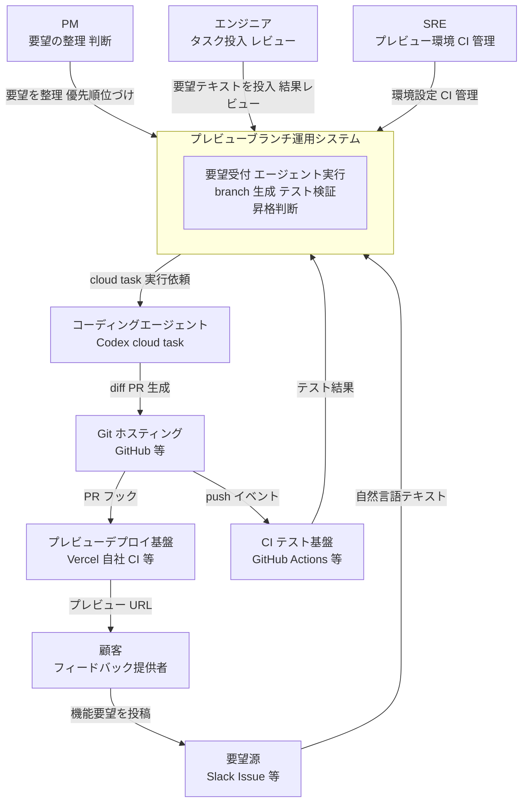
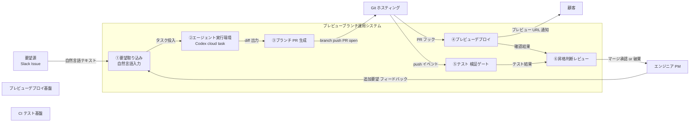
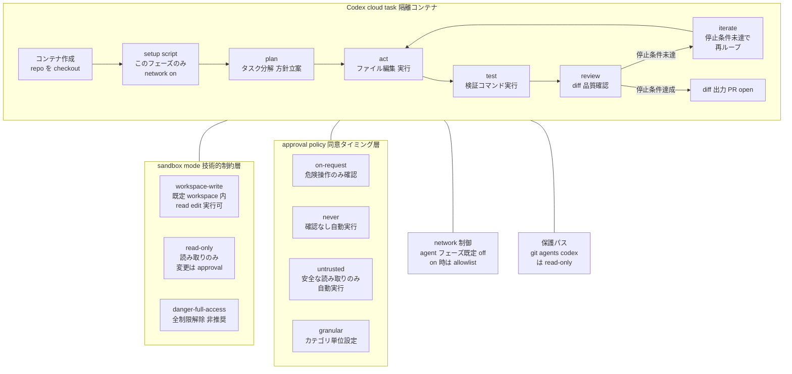
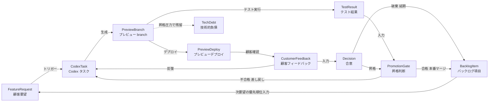
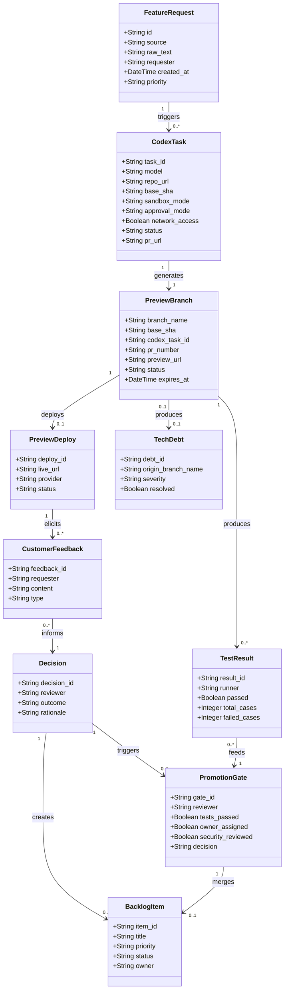
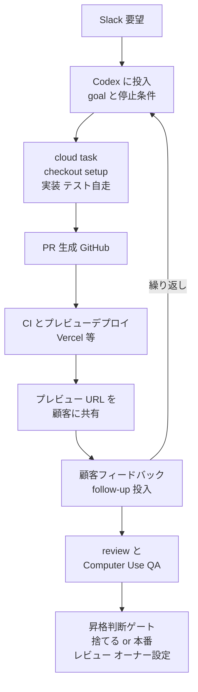

> 検証日: 2026-05-31 / 起点: OpenAI 公開事例「How Braintrust turns customer requests into code with Codex」
> 対象読者: AI コーディングエージェント(OpenAI Codex)を開発プロセスに組み込もうとする実装エンジニア・テックリード・PM

## 概要

OpenAI が 2026 年 5 月末に公開した Braintrust の事例は、一見すると「Codex で速くコードが書ける」という話に見えます。しかし本質は **顧客フィードバックループの短縮** にあります。

Braintrust は AI プロダクトの評価・オブザーバビリティ基盤です。同社 CEO の Ankur Goyal は次のように語っています。

> 「copy-paste the Slack message into Codex and then create a preview branch and show the feature request to the customer within like 10 minutes」

> 「We get to iterate and ideate on feature requests with the customer in real time.」

— Goyal の発言。StartupHub.ai の二次記事で確認 [二次情報]

この操作が意味するのは、**従来は「バックログに積んで優先順位づけして開発する」工程を、「動く仮説を即座に見せて顧客と対話する」に置き換えた** ことです。要望整理の粒度が「仕様を書く」から「動く仮説を見せる」へ移ります。

ただし、この「速さ」が解決するのは **作ること** だけです。Anthropic CPO の Mike Krieger は、ボトルネックが engineering(コードを書くこと)から decision-making(何を作るかの判断)と merge queue(コードを本番に入れること)へ移ったと述べています(なお Krieger は OpenAI の競合 Anthropic の CPO です。Codex 評価の文脈で引用している点は割り引いて読んでください)。Braintrust 事例はこの移動を体現しており、**難所は「作る」から「検証・合意・捨てる判断」へ移っただけ** なのです。

未解決のまま残るものは次の3つです。

- 動くブランチが **本当に動くか** の検証(品質・セキュリティ)
- 動くものを **本当に作るべきか** の合意(代替案・非機能要件の検討)
- プレビューを **捨てるか本番昇格するか** の判断規律

移動先を設計しないチームは、速度の代わりに技術的負債とスコープ発散を抱えます。動くブランチを見せた瞬間に「もう動いているなら出して」という昇格圧力が生まれ、「捨てる判断」がかえって難しくなるからです(EQengineered や Hacker News の議論で観察されています)。

なお「動く仮説を見せて顧客と対話する」こと自体は新しい思想ではありません。Marty Cagan のプロトタイプ論(「プロトタイプが仕様になる」「2〜3割の品質で先に試す」)、Lean Startup の Build-Measure-Learn と MVP、Google Ventures のデザインスプリント(短時間で見せかけを作って検証する)が、同じ問題意識を先取りしています。本運用の新規性は思想ではなく、**プロトタイピングのコストを日単位から分単位へ圧縮した** 点にあります。裏を返せば、Lean の MVP が「最小の労力で学習する」ことを目的としたのに対し、「動くコード = MVP」と短絡すると、学習目的を超えた本番品質のコードを安易に量産する罠が生じます。

## 特徴

事例と公式仕様から読み取れる、この運用の構成要素は次のとおりです。

- **トリガーは自然言語の要望そのもの**: 整形された仕様書ではなく、Slack メッセージを丸ごとエージェントへ渡します。要望から実装の間にある「仕様化」工程を圧縮します。
- **成果物は動くブランチ**: Codex の cloud task は隔離コンテナで repo を branch/SHA で checkout し、完了時に diff を出して PR 化します。「プレビューブランチ」は Codex 固有の公式機能ではなく、**Codex のブランチ生成と利用側のプレビューデプロイ慣行(Vercel 等)の組み合わせ** である点に注意してください(公式機能リスト確認済み)。
- **使用モデルは gpt-5.5**: Codex の推奨デフォルト「For most tasks, start with gpt-5.5」と一致します。Braintrust での使用も OpenAI の記述で確認できます。
- **リアルタイム反復**: 顧客と動くものを見ながら、その場で作り変えます。
- **テスト・サンドボックス先行を支える公式機能**: `/goal`(検証停止条件を持つ。2026-05-21 正式化)、`/review`、Computer Use による QA があります。sandbox(workspace-write / read-only / danger-full-access)と approval の2層で、ネットワークは既定オフです。
- **採用規模の主張と宣伝バイアス**: OpenAI は「1ヶ月でチームの半数が Codex に移行」と公表しています。ただしこれは **OpenAI 自社事例ページが唯一の出典で、独立報道(StartupHub.ai)には現れません**。velocity 改善率や本番昇格率などの定量メトリクスはゼロで、引用は CEO 1名のみです。再現の前提条件(小規模チーム・eval/LLM ドメイン・CEO 主導・preview deploy 基盤の存在)も明示されていません。ベンダー公開事例ゆえの宣伝バイアスを前提に読む必要があります。

## 構造

C4 モデルを「プレビューブランチ運用」の論理構造に読み替えて記述します。

### システムコンテキスト図



| 要素 | 説明 |
|---|---|
| 顧客 | 機能要望の発信源。プレビュー URL を受け取り実機確認・フィードバック |
| PM | 要望の優先順位づけと昇格判断の承認者 |
| エンジニア | Codex へのタスク投入・生成コードのレビュー・PR マージ判断 |
| SRE | プレビュー環境・CI パイプライン・sandbox 設定の維持 |
| 要望源 | 顧客の自然言語フィードバックを受け取るチャネル。仕様書に変換せず直接投入 |
| コーディングエージェント | 隔離コンテナでリポジトリを checkout し、計画・実装・テスト・レビューを自走 |
| Git ホスティング | branch / PR を保持。`@codex` メンションで agent を起動するエントリポイント |
| プレビューデプロイ基盤 | PR フックを受けてプレビュー URL を自動生成。Codex 固有機能ではなくユーザー側慣行 |
| CI テスト基盤 | push / PR に対してテストを実行し、マージの品質ゲートを担当 |

「プレビューブランチ」は Codex の単独の固有機能名ではありません。Codex がブランチを生成し diff/PR を出す機能と、ユーザー側のプレビューデプロイ慣行の **組み合わせ** です。なお公式の use-cases には「Deploy an app or website」として Vercel 等と連携して preview / live URL を払い出すワークフローの記載があります(Codex 本体が単独でライブ URL を払い出すわけではありません)。

### コンテナ図



| コンポーネント | 説明 |
|---|---|
| ①要望取り込み | 自然言語をそのままエージェントへ渡す入口。仕様化工程を圧縮 |
| ②エージェント実行環境 | Codex cloud task。隔離コンテナで repo を checkout し自走。ネットワーク既定 off |
| ③ブランチ PR 生成 | 完了 diff を branch に commit し PR を open。ここまでが Codex の直接関与範囲 |
| ④プレビューデプロイ | PR フックでプレビュー URL を生成し顧客に提示。Codex の機能ではなくユーザー側 CI/CD |
| ⑤テスト 検証ゲート | `/goal` の停止条件・`/review`・Computer Use QA。動くデモと検証済みを分離する関門 |
| ⑥昇格判断レビュー | 確認結果とテスト結果から本番マージ・破棄・追加反復を判断。最大の難所 |

### コンポーネント図

Codex cloud task の内部をドリルダウンします。



| コンポーネント | 説明 |
|---|---|
| コンテナ作成 | 投入時に隔離コンテナを生成し指定 branch/SHA で checkout。キャッシュ最大12時間 |
| setup script | このフェーズのみ network 有効。依存インストールをここで実施 |
| plan | タスクをサブゴールに分解し実装方針を立案 |
| act | ファイル編集・コマンド実行。sandbox mode に従い操作範囲を制約 |
| test | `/goal` で定義した検証コマンドを実行。`/review` や Computer Use QA もここで機能 |
| review | diff と品質基準を照合。検証停止条件を評価 |
| iterate | 停止条件未達なら act に戻る。`/goal` は複数時間の自走が可能 |
| diff 出力 PR open | 完了時に diff を表示し PR を open。Codex の直接関与の終端 |
| sandbox: workspace-write | 既定。active workspace 内の read / edit / コマンド実行が可能 |
| sandbox: read-only | 読み取りと回答のみ。変更・実行・network は approval 必要 |
| sandbox: danger-full-access | 全制限解除。sandbox も approval も無効。非推奨 |
| approval: on-request | workspace 内の読み取り・編集・実行は自動許可。workspace 外編集・ネットワーク等の危険操作のみ承認を要求 |
| approval: never | 確認なしで自動実行 |
| approval: untrusted | 既知の安全な読み取りのみ自動実行。それ以外は approval |
| approval: granular | sandbox / rules / MCP / permissions / skills のカテゴリ単位で設定 |
| network 制御 | agent フェーズ既定 off。有効化時は domain allowlist と HTTP method 制限 |
| 保護パス | `.git` / `.agents` / `.codex` は writable root 内でも read-only |

sandbox mode(技術的制約)と approval policy(同意タイミング)は独立した2層です。Enterprise では Managed configuration により組織全体へ強制適用できます。なお plan/act/test/review/iterate の5フェーズ名称は公式ドキュメントに明示の記述がなく、`/goal`(objective と検証停止条件と checkpoint validation)の概念を本記事が図としてモデル化したものです。

## データ

### 概念モデル

この運用に登場する概念をエンティティとして定義し、相互関係を関係マップで示します。



| エンティティ | 説明 |
|---|---|
| FeatureRequest | 顧客が Slack 等で送る機能要望。整形された仕様書ではなく自然言語テキストが中心 |
| CodexTask | Codex cloud に投入されたバックグラウンドタスク。隔離コンテナで diff を生成 |
| PreviewBranch | Codex タスクが作成した feature branch。Codex 固有機能ではなく運用上の組み合わせ |
| PreviewDeploy | PR に紐づく一時的なライブ環境 URL。Vercel 等の PR プレビュー機能で払い出し |
| TestResult | `/goal` の検証ループ・CI テスト・Computer Use QA から得られるテスト合否 |
| CustomerFeedback | プレビューを見た顧客の反応・修正依頼。リアルタイム反復の起点 |
| Decision | 昇格・破棄・延期のいずれかを選ぶ合意。事例では顧客と共同で判断 |
| PromotionGate | 本番ブランチへ昇格させる際の明示的チェックポイント。テスト合否・レビュー・所有者を要求 |
| BacklogItem | 正式に開発キューに積まれたタスク。scope creep の防波堤、破棄・延期の受け皿 |
| TechDebt | 昇格圧力で throwaway branch が本番混入した際に生じる技術的負債 |

### 情報モデル

主要エンティティの属性を定義します。属性は運用実態・公式仕様から抽出し、未記載のものは `(推測 / 一般的運用から補完)` と注記しています。



| 属性 | 注記 |
|---|---|
| CodexTask.model | 公式推奨デフォルトは `gpt-5.5`。Braintrust 事例も GPT-5.5 を使用 |
| CodexTask.sandbox_mode | `workspace-write`(既定) / `read-only` / `danger-full-access`。公式仕様 |
| CodexTask.approval_mode | `on-request` / `never` / `untrusted` / `granular`。公式仕様 |
| CodexTask.network_access | エージェントフェーズは既定 `false`。setup フェーズのみ有効。公式仕様 |
| PreviewBranch.preview_url | Codex 固有機能ではなく、ユーザー側 PR プレビュー環境が払い出す URL |
| PromotionGate.security_reviewed | AI 生成コードの脆弱性混入率の高さ(Veracode 2025 [二次情報])を踏まえた必須フラグ。(推測 / 一般的運用から補完) |
| PromotionGate.owner_assigned | 「動いている」だけを昇格根拠にしないための所有者明示。(推測 / 一般的運用から補完) |
| TechDebt.origin_branch_name | throwaway branch が昇格圧力で本番混入した際のトレース用。反証エビデンスから設計 |

## 構築方法

この運用を自チームで立ち上げる手順です。

### ① Codex セットアップ

前提プランは ChatGPT の Plus / Pro / Business / Edu / Enterprise です。Enterprise ワークスペースでは管理者セットアップが追加で必要な場合があります。

Cloud(Web UI)経由のセットアップ手順は次のとおりです。

1. `https://chatgpt.com/codex` にアクセスし、GitHub アカウントを接続する。
2. リポジトリへのアクセス権限を付与し、cloud task がコードを checkout できる状態にする。
3. GitHub の Issue / PR に `@codex` をタグ付けし、タスクを自動起動して完了後に PR を生成する。

CLI セットアップ例(実装案)です。

```bash
# CLI のインストール(公式 cli ページで確認済みのパッケージ名)
npm install -g @openai/codex

# インストール確認
codex doctor

# API キー設定(Business/Enterprise の API Key 利用時)
export OPENAI_API_KEY=sk-...

# ローカル起動(インタラクティブ)
codex

# クラウドタスクとして非同期実行(--attempts 1-4 で best-of-N 実行も可)
codex cloud exec --env <ENV_ID> "Add dark mode toggle to settings page"
```

出典は developers.openai.com/codex/cli/features です。パッケージ名 `@openai/codex` と `codex cloud exec --env <ID>` は公式で確認済みです。`config.toml` のキー名はバージョン更新で変わりうるため、現行 configuration ページを正とします。

### ② 環境定義

Codex Cloud の環境設定画面で setup script を登録します。setup フェーズのみネットワークが有効になるため、依存インストールはここで実施します。

```bash
# --- cloud environment setup script 例(実装案) ---
# Node.js プロジェクトの場合
pnpm install

# Python プロジェクトの場合
poetry install --with test
pip install pyright
```

環境変数とシークレットの扱いは次のとおりです。

- 環境変数: setup フェーズ・agent フェーズの両方で参照可能。
- シークレット: 追加の暗号化層で保存し、**setup スクリプトのみ利用可能**。agent フェーズ開始前に削除(セキュリティ設計)。
- `export` は setup から agent へ引き継がれない。永続化は環境設定 UI で実施。

コンテナキャッシュは最大 12 時間保持され、setup script・環境変数・シークレットの変更で自動無効化します。

domain allowlist は cloud environment のネットワーク設定で次の3択から選びます。

| 設定 | 説明 |
|---|---|
| None | 空リストから手動追加。最もセキュア |
| Common dependencies | npm / PyPI / RubyGems / GitHub / Docker 等のプリセット。開発用途に推奨 |
| All(unrestricted) | 全ドメイン許可。セキュリティリスク要確認 |

追加で、GET / HEAD / OPTIONS のみ許可し、状態を変える HTTP method を遮断することも可能です。

### ③ テスト先行ゲートの用意

重要な前提認識があります。Codex はブランチを作成して PR を出すところまでが担当範囲です。**ライブ URL を顧客に見せるには、Vercel / Netlify 等の PR プレビューデプロイ基盤が別途必要** です。公式 use-cases も preview / live URL を「Vercel 等と連携するワークフロー」として記載しており、Codex 単体がライブ URL を払い出すわけではありません(2026-05 時点確認)。

CI テスト基盤の準備例(実装案)です。

```yaml
# .github/workflows/ci.yml 例
name: CI
on:
  pull_request:
    branches: [main]
jobs:
  test:
    runs-on: ubuntu-latest
    steps:
      - uses: actions/checkout@v4
      - uses: actions/setup-node@v4
        with:
          node-version: 20
      - run: pnpm install
      - run: pnpm test
      - run: pnpm run type-check
```

プレビューデプロイ基盤の例(実装案・Vercel)です。

```yaml
# .github/workflows/preview-deploy.yml 例(Vercel 連携)
name: Preview Deploy
on:
  pull_request:
jobs:
  deploy:
    runs-on: ubuntu-latest
    steps:
      - uses: actions/checkout@v4
      - uses: amondnet/vercel-action@v25
        with:
          vercel-token: ${{ secrets.VERCEL_TOKEN }}
          vercel-org-id: ${{ secrets.ORG_ID }}
          vercel-project-id: ${{ secrets.PROJECT_ID }}
          # PR ごとにプレビュー URL が発行される
```

補完元は github.com/amondnet/vercel-action(実装案)です。Netlify Deploy Previews や AWS Amplify Hosting でも同等の PR プレビュー機能があります。

テスト先行ゲートの設計方針として、Codex の `/goal` を使う場合は **停止条件としてテストコマンドを明示する** ことが公式推奨です(出典: developers.openai.com/codex/use-cases/follow-goals)。テストが「通る」まで Codex が自走するため、既存テストスイートの充実が必須前提になります。

### ④ sandbox / approval ポリシー設定

Codex CLI の設定ファイル(`~/.codex/config.toml` 等)に記述します(実装案。キー名は現行ドキュメントで要確認)。

```toml
# 基本ポリシー設定例(実装案)
approval_policy = "on-request"
sandbox_mode = "workspace-write"

[sandbox_workspace_write]
network_access = false   # agent フェーズはオフを明示
```

sandbox モードの選択指針です。

| モード | 用途 |
|---|---|
| workspace-write(既定) | active workspace 内の read/edit/コマンド実行を許可 |
| read-only | 読み取りのみ。変更・実行には都度 approval |
| danger-full-access | 全制限解除。信頼できるリポジトリのみ。非推奨 |

approval ポリシーの選択指針です。

| ポリシー | 用途 |
|---|---|
| on-request | スコープ外や昇格時のみ確認。通常推奨 |
| never | 完全自動化パイプライン向け。要注意 |
| untrusted | 既知の安全な読み取りのみ自動実行、それ以外は approval |
| granular | sandbox / rules / MCP / permissions / skills のカテゴリ単位で設定 |

`.git` / `.agents` / `.codex` は writable root 内でも read-only に保護されます。`danger-full-access` は sandbox も approval も無効になります。Enterprise では Managed Configuration で組織全体へ強制適用できます。

## 利用方法

日々の運用フローです。

### ① Slack 要望を Codex に投入

1. 顧客が Slack で機能要望を投稿する。
2. 担当エンジニアが要望メッセージを Codex に貼り付け、停止条件を付与して投入する。

```bash
# CLI 経由での投入例(実装案)
codex cloud exec --env <ENV_ID> "
顧客要望: ダッシュボードにエクスポートボタンを追加してほしい。CSV と JSON の2形式対応。
完了条件:
- export.test.ts が全てパスすること
- pnpm run type-check がエラーゼロであること
- E2E で export ボタンのクリックと DL 確認ができること
"
```

既存の GitHub Issue に要望を起票している場合は、Issue 本文・コメントで `@codex` をメンションして実装を依頼します。

`/goal` は目標設定と自走開始を行います。公式の Follow a goal ページには `/goal pause` / `/goal resume` / `/goal clear` のサブコマンドも記載されています。Goal mode は 2026 年 5 月に正式化され、デフォルト有効です(出典: Codex changelog)。

### ② cloud task が branch を作り PR 化

Codex がタスクを完了すると、変更差分が表示され「Open a PR」で GitHub に PR が生成されます。エンジニア側の確認ポイントは次のとおりです。

- cloud task のログ(work log)で変更内容を確認する。
- CI(unit test / type-check)が通るか確認する。
- テストが失敗した場合は follow-up で指示を追加する。

### ③ プレビュー URL を顧客に提示

前提として、Vercel 等の PR プレビューデプロイ基盤が設定済みであることが必要です(構築方法 ③ 参照)。Codex が PR を作成すると、CI の後に Vercel 等が自動でプレビュー URL を発行し、PR コメントに投稿します。その URL を顧客に共有します。

OpenAI 事例ページは「Braintrust engineers ... turn customer feature requests into preview branches in minutes」と述べています。実際の時間は要望の複雑さ・CI 実行時間・デプロイ時間に依存します。**約10分** という言及は Braintrust の特定ユースケースの数値であり、一般的な保証ではありません。

### ④ リアルタイム反復

顧客がプレビューを確認しながら、エンジニアが Codex にフォローアップを投入します。反復時の注意点は次のとおりです。

- 反復生成ではコード品質・セキュリティが累積劣化するリスクがある(IEEE-ISTAS 2025 査読)。
- **1反復ごとにテストを通す** ことで品質劣化を検知する。
- 見た目が動いても `/review` で差分を都度確認する。

### ⑤ `/review` と Computer Use QA で検証

```bash
/review                 # review presets を開き diff をレビュー
# カスタム指示付き例: セキュリティ観点(XSS / CSRF)を重点的に
```

`/review` は review presets を開きます(出典: developers.openai.com/codex/cli/features)。`--uncommitted` 等の具体フラグ構文は公式未明示のため、UI のプリセット選択を正とします。

Computer Use QA は GUI を視覚的に操作して検証するモードです。公式推奨の反復パターンは「バグを再現し、それを引き起こす最小のコードパスを直し、変更ごとに同じ UI フローを再実行する」です(出典: developers.openai.com/codex/app/computer-use)。

### 運用フロー全体図



## 運用

プレビューブランチ運用を持続可能に回すには、生成速度の向上と引き換えに増える管理コストを制度で吸収する必要があります。

### 1. プレビューブランチのライフサイクル管理

基本原則は「既定は破棄、昇格は例外」です。プレビューブランチは既定で TTL 付きの一時物として扱います。

- TTL の目安は顧客デモ完了から 48〜72 時間。反復が長引く場合は所有者が明示的に延長。
- 未マージ・未クローズの `preview/` prefix branch を週次スキャンし、TTL 超過分を自動削除。

```yaml
# .github/workflows/cleanup-preview-branches.yml
name: Cleanup preview branches
on:
  schedule:
    - cron: '0 3 * * 1'   # 毎週月曜 03:00 UTC
jobs:
  cleanup:
    runs-on: ubuntu-latest
    steps:
      - uses: actions/checkout@v4
      - name: Delete stale preview branches
        run: |
          TTL_DAYS=3
          CUTOFF=$(date -d "-${TTL_DAYS} days" +%s)
          git fetch --prune origin
          git branch -r | grep 'origin/preview/' | sed 's|origin/||' | while read branch; do
            LAST=$(git log -1 --format=%ct "origin/$branch" 2>/dev/null || echo 0)
            if [ "$LAST" -lt "$CUTOFF" ]; then
              git push origin --delete "$branch"
            fi
          done
```

### 2. 昇格判断ゲートの運用

「動いている」は昇格理由になりません。プレビューを見た顧客の「これをそのまま出して」という圧力が最大のリスクです。昇格パスを別ルートとして明示的に設けます。

PR テンプレートにゲートを埋め込む例です。

```markdown
<!-- .github/PULL_REQUEST_TEMPLATE/preview_promotion.md -->
## プレビューブランチ昇格チェック
- [ ] 所有者エンジニアが明示されている
- [ ] CI 全パス済み
- [ ] SAST スキャン実行済み(結果リンク: )
- [ ] 代替案を検討・棄却済み(concept fixation 対策)
- [ ] バックログチケット番号: #
- [ ] 非機能要件(パフォーマンス / アクセシビリティ / ロギング)レビュー済み
```

プレビュー昇格 PR のレビューは「プレビュー生成者以外」が行うルールにします。生成者は sunk cost による昇格バイアスが強いためです。

### 3. コスト管理

Codex のローカルメッセージとクラウドタスクは **5時間ウィンドウのメッセージ数を共有** します(出典: developers.openai.com/codex/pricing)。プレビューブランチ運用では1要望あたり複数ターンの反復が発生するため、ウィンドウ内のターン消費を意識した設計が必要です。

- 初回生成は `/goal` に検証停止条件を付けて1ターンで完結させ、反復はその後に行う。
- 顧客との反復ループを Codex タスク1件に集約し、細切れ投入を避ける。
- 複雑でない UI 変更は下位モデルに下げてウィンドウ消費を抑える。
- Business / Enterprise の従量課金では、usage API で月次使用量を取得し閾値超えで通知。1プレビューあたりのトークンコストを昇格率・捨て率と対比して追跡。

プラン別のメッセージ上限やモデル別のトークン単価は頻繁に改定されるため、本記事では具体値を固定せず、現行の pricing ページを正とします。

### 4. sandbox / network のセキュリティ運用

Codex のセキュリティモデルは2層構造(sandbox mode と approval policy)で、既定でネットワークアクセスは OFF です(出典: developers.openai.com/codex/agent-approvals-security)。

- 依存インストールは setup フェーズで完結させ、agent フェーズへ network を引き継がない。
- 反復生成のセキュリティ劣化対策として、反復途中でも SAST(Semgrep, Bandit 等)を毎コミット走らせる。反復が3ターンを超えたらクリーンな branch から再生成する。
- `.git` / `.agents` / `.codex` は sandbox 内でも read-only。Secrets はコンテナ外で管理し setup script 経由で注入する。
- 大規模チームでは Enterprise の Managed Configuration で個人設定に依存しない強制を行う。

### 5. メトリクス

「速さ」だけを測ると必ず誤ります。健全性は昇格・捨て・コストの比率で測ります。

| メトリクス | 計測方法 |
|---|---|
| 昇格率 | 昇格 PR 数 / 生成 branch 総数 |
| 捨て branch 数 / 期間 | TTL 期限切れ削除数 |
| 検証コスト | branch あたり SAST 指摘数の CI ログ集計 |
| 1プレビューあたりのターン数 | Codex usage log |
| 顧客 scope 変更率 | プレビュー後の要望変更 PR 数 |

## ベストプラクティス

反証調査で得た「よくある誤解」と、それを覆す実証エビデンス、推奨する実践をセットで示します。

### BP-1: 合意形成の速さについて

- **誤解**: 動くものをすぐ顧客に見せれば、合意形成が速く・正確になる。
- **反証**: プロトタイプを構築して試した被験者は早期の概念選択に固執し、作らず情報のみで判断した群の方が優れた概念選択をした、という査読研究があります(ScienceDirect)。動くものは **anchoring 装置** として働き、代替案・非機能要件の検討を早期収束させます。
- **推奨**: 見せる **前** に、採用しない代替案(最低1案)・捨てる選択肢とその理由・非機能要件の合格基準を一度言語化します。合意の質はプロトタイプの高忠実度ではなく **提示前の選択肢の多様性** で決まります。

### BP-2: throwaway コードの昇格について

- **誤解**: 「捨てる前提で作る」のだからプレビューブランチはいつでも捨てられる。Brooks の "plan to throw one away" もそれを支持している。
- **反証**: Brooks 本人が『人月の神話』20周年版 Epilog でこの原則を撤回しています(「これは今や誤りだと思う。急進すぎるからではなく単純すぎるから」)。実務上も新機能プロトタイプは「製品から取り除かれず技術的負債として残る」のが常態とされます(EQengineered)。AI 生成コードはさらに悪化し、「動くようにする」コードを優先生成しがちで、本番昇格するとアーキテクチャ腐敗の種になります(Augment Code)。
- **推奨**: 昇格は **別ゲート(チェックリストと非生成者レビュー)** を必ず経由させ、「動いている」を昇格根拠にしません。昇格確定後は AI 生成コードを **リファクタリング前提の再実装** として扱います。負債の複利化は spec-driven development で防ぎ、昇格フェーズでは「仕様を書く」への回帰を厭わないようにします。

### BP-3: 反復生成とセキュリティについて

- **誤解**: 顧客とのリアルタイム反復を何度繰り返しても、各生成は独立だからセキュリティリスクは累積しない。
- **反証**: IEEE-ISTAS 2025 採択の査読論文(arXiv 2506.11022)は、反復的な AI コード生成が脆弱性の累積劣化を引き起こすと実証しています。AI 生成コード全体の脆弱性混入率も高いと報告されています。Veracode 2025 系の集計では AI 生成コードの 45% が OWASP 脆弱性を少なくとも1つ含むとされ [二次情報]、別系統の二次集計では人間比 2.74倍という指摘もあります [二次情報・出典系統が異なるため単純比較は不可]。顧客とのリアルタイム反復は「反復生成」そのもので、最もリスクが高いパターンに該当します。
- **推奨**: SAST を **プレビューブランチへの push ごと** に走らせ、反復が3ターンを超えたらクリーンな branch から再生成します。セキュリティ要件(OWASP Top 10 等)を `/goal` の検証停止条件として明示します。

```text
/goal
objective: Implement the rate-limiting feature requested in #1234.
done: all unit tests pass AND semgrep --config auto exits 0 AND no new OWASP A03/A07 findings
```

### BP-4: バックログとスコープ管理について

- **誤解**: プレビューブランチ運用はバックログを持たない俊敏な開発であり、バックログへの積み上げは速度を殺す。
- **反証**: 整理されたバックログこそ scope creep の防波堤であり、要望が backlog 更新を経ずに静かに混入するのが典型的な scope creep の起点です(NimbleWork)。顧客が動くプロトタイプを見て「完成済みという誤った印象」を持つことで、追加要求が次々と発生する構造も指摘されています。
- **推奨**: プレビューブランチ作成時に、最小限の **バックログチケット**(タイトル・顧客・起票日・TTL・決定期限)を同時起票します。バックログを「捨てる」のではなく「プレビューの入力として使い、プレビューの結果で更新する」サイクルにします。反復で要望が変化したら、新規チケットを起票してから次の Codex 投入を許可します。

### BP-5: 生産性の前提と適用範囲の限定

- **誤解**: AI コーディングエージェントはすべての開発者・規模・フェーズで速度を向上させる。
- **反証**: METR の RCT(熟練 OSS 開発者16名・246タスク)では、AI 使用時にタスク完了が **19% 遅延** し、本人は20%速いと体感しました(知覚と現実のギャップ)[二次情報]。なお METR 自身が選択バイアスを認め実験デザインを変更しており、効果量の頑健性には留保があります。AI エージェント生成コードの out-of-the-box 実行成功率は 68.3% にとどまるとの報告もあります [二次情報]。「10分で動くプレビュー」の "動く" には構造的な留保が必要です。
- **推奨**: 適用範囲を明示的に限定します。

| 向く条件 | 向かない条件 |
|---|---|
| 既存 preview deploy 基盤あり | preview deploy 基盤なし |
| スコープが小さい(UI 変更・単一エンドポイント追加等) | 大規模リファクタリング・クロスカット変更 |
| 探索フェーズ・初期検証 | 本番品質・規制対象・セキュリティクリティカル |
| チームが小規模 | 大規模・複数 repo 跨ぎ変更 |

Braintrust 事例自体が、eval/LLM ツールという特定ドメイン・小規模チーム・CEO 主導・独立検証なしという条件下の一事例です [二次情報]。汎用プラクティスとして無条件に展開することは、原典が支持していません。

## トラブルシューティング

### TS-1: プレビューが本番昇格して技術的負債になる

- **症状**: 「動いているから」とレビューなしに main にマージされ、保守コストが跳ね上がる。
- **対処**: Branch protection rule で `preview/` prefix の `main` 直接マージを禁止。昇格ゲートチェックリスト(BP-2)を PR テンプレートに強制。昇格後の最初のスプリントで「AI 生成コードのリファクタリングタスク」を自動起票。昇格率が 70% を超えたら昇格圧力を疑いゲートを見直す。

### TS-2: 顧客の期待が動くものに固定化する

- **症状**: プレビューを見た顧客が「これでいい、これを出して」と言い、代替案・非機能要件・費用対効果の議論ができなくなる。
- **対処**: 提示前に「今日はアイデアを試す段階で、出荷可否は未定」と口頭・文書で明示。プレビューと同時に「採用しなかった選択肢リスト」を見せる(比較対象があると anchoring は緩和)。提示前に `/review` で現状の問題点・限界を資料化して同席させる。

### TS-3: レビュー負荷の増大

- **症状**: 生成が速いためレビュー待ち branch が溜まり、レビュアーが追いつかない。
- **対処**: 「昇格候補になった時点で初めてレビュー依頼」を徹底し、生成直後の即時依頼を禁止。TTL を短く設定し未昇格 branch はレビューなしで自動削除。機械的に弾けるもの(SAST / lint / test)は人間レビューの前段に置く。生成者が「昇格 or 廃棄」の1次判断を24時間以内に行う。

### TS-4: AI 生成コードが out-of-the-box で動かない

- **症状**: 生成 branch を checkout して実行しても動かない(依存未解決・環境変数欠落・テスト不通過)。
- **背景**: AI エージェント生成コードの out-of-the-box 実行成功率は 68.3% との報告があり、3割程度は追加作業なしには動きません [二次情報]。
- **対処**: `/goal` 停止条件に「`docker compose up` で統合テストが全パス」を含め、環境再現性を生成時に検証。setup script で依存をロックファイルでピン留め。動かない場合は ① `codex doctor` で環境・認証問題を排除 ② `pip-audit` / `npm audit` で hidden dependency を洗い出し ③ 依存を明記する objective で `/goal` を再実行。

### TS-5: スコープが発散する

- **症状**: 反復の中で要望が膨らみ、最初の要望と別物を作っている。
- **対処**: 投入要望テキストを変更せず保存し、3ターンごとに「最初の要望と合っているか」を確認。反復中の新要望はその場で対応せず新規チケットに記録して別 branch に分離。スコープ変更は「branch を新規作成し直す」を既定ルールにする(既存 branch のパッチ上書きは累積劣化の原因)。

## まとめ

顧客要望を Codex で即座にプレビューブランチ化する運用は、開発の難所を「作ること」から「検証・合意・捨てる判断」へ移しただけです。速さの恩恵を負債やスコープ発散に変えないために、捨てる規律・テスト先行ゲート・昇格判断ゲート・適用範囲の限定をセットで設計することが重要になります。

この記事が少しでも参考になった、あるいは改善点などがあれば、ぜひリアクションやコメント、SNSでのシェアをいただけると励みになります！

## 参考リンク

- 公式ドキュメント
  - [How Braintrust turns customer requests into code with Codex](https://openai.com/index/braintrust/)
  - [OpenAI Codex docs](https://developers.openai.com/codex)
  - [Codex Cloud Environments](https://developers.openai.com/codex/cloud/environments)
  - [Codex Cloud Internet Access](https://developers.openai.com/codex/cloud/internet-access)
  - [Codex Agent Approvals & Security](https://developers.openai.com/codex/agent-approvals-security)
  - [Codex Use Cases — Follow a Goal](https://developers.openai.com/codex/use-cases/follow-goals)
  - [Codex CLI Features](https://developers.openai.com/codex/cli/features)
  - [Codex Computer Use](https://developers.openai.com/codex/app/computer-use)
  - [Codex Pricing](https://developers.openai.com/codex/pricing)
- GitHub / ツール
  - [amondnet/vercel-action](https://github.com/amondnet/vercel-action)
  - [Vercel Preview Deployments](https://vercel.com/docs/deployments/preview-deployments)
- 記事・系譜
  - [StartupHub.ai: Braintrust CEO on Codex](https://www.startuphub.ai/ai-news/artificial-intelligence/2026/braintrust-ceo-codex-speeds-up-feature-iteration)
  - [Lenny's Newsletter: Anthropic CPO Mike Krieger](https://www.lennysnewsletter.com/p/anthropics-cpo-heres-what-comes-next)
  - [Marty Cagan / SVPG: Prototypes](https://www.svpg.com/prototypes/)
  - [The Lean Startup](http://theleanstartup.com/)
  - [Google Ventures: Design Sprint](https://www.gv.com/sprint/)
- 反証・限界(査読・実証)
  - [ScienceDirect: Fixation on premature concept choices](https://www.sciencedirect.com/science/article/pii/S2212827119308935)
  - [arXiv 2506.11022: Security Degradation in Iterative AI Code Generation](https://arxiv.org/html/2506.11022v2)
  - [METR: uplift update](https://metr.org/blog/2026-02-24-uplift-update/)
  - [Veracode 2025: AI 生成コードの脆弱性率](https://www.softwareseni.com/why-45-percent-of-ai-generated-code-contains-security-vulnerabilities/)
  - [arXiv 2512.22387: AI エージェント生成コードの実行成功率](https://arxiv.org/pdf/2512.22387)
  - [EQengineered: Throwaway Work](https://www.eqengineered.com/insights/throwaway-work-the-loan-shark-of-tech-debt)
  - [Augment Code: AI Technical Debt Compounds](https://www.augmentcode.com/guides/ai-technical-debt-compounds-spec-driven-development)
  - [NimbleWork: How To Stop Scope Creep](https://www.nimblework.com/blog/stop-scope-creep/)
