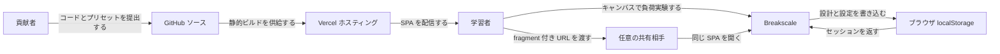
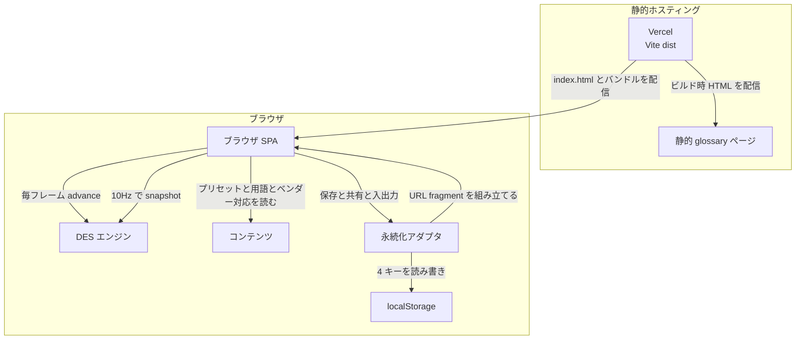
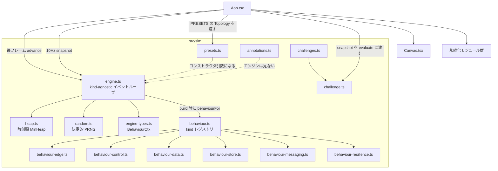
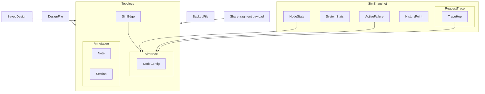
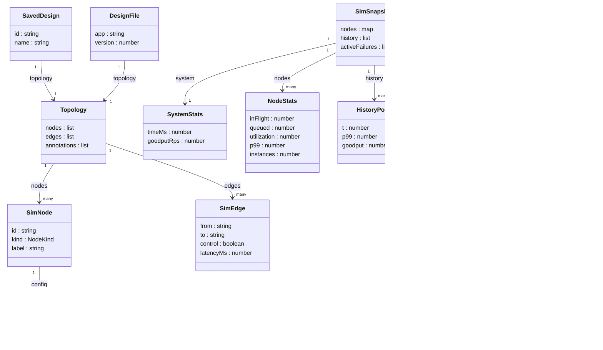

[Breakscale](https://github.com/xevrion/breakscale) は、ブラウザ上で分散システムを組み立て、負荷や障害を与えて挙動を観察できる学習用シミュレータです。待ち行列、テールレイテンシ、リトライストーム、サーキットブレーカといった現象を、静的な構成図ではなく離散事象シミュレーションの結果として確認できます。


この記事では、2026年8月30日時点の `main` ブランチを基に、Breakscale の構造とデータモデル、シミュレーションの仕組み、導入・利用・運用方法を実装レベルで解説します。クラウドの容量計画や SLA 予測へ使う製品ではなく、分散システムの振る舞いを安全に壊して学ぶ教材である点が重要です。


*この記事の全体像。以下、順に解説します。*

## 概要

Breakscale の基本操作は単純です。キャンバスへクライアント、サービス、データベース、キャッシュ、キューなどを置いて接続し、トラフィックを増やします。シミュレータは各リクエストを実オブジェクトとしてトポロジ上に流し、完了レイテンシ、goodput、エラー、キュー長、利用率を測定します。

バックエンドやアカウントはありません。アプリケーションは Vite で構築された React SPA で、シミュレーションも保存もブラウザ内で完結します。設計の保存先は `localStorage`、`.breakscale` ファイル、URL fragment のいずれかです。

| 項目 | 2026年8月30日時点の内容 |
|---|---|
| アプリケーション | `package.json` version `0.1.0`、private package |
| 実装言語 | TypeScript |
| UI | React 19、Vite 8 |
| テスト | Vitest 4 |
| ランタイム | Bun、または Node.js 20 以上と npm |
| コンポーネント | `NodeKind` 33種類 |
| プリセット | 教学用16件、公開アーキテクチャ再構成7件 |
| ライセンス | コードは MIT、同梱 Caveat font は SIL Open Font License 1.1 |

Breakscale が類似ツールと異なるのは、汎用 DES、静的な system design 教材、実インフラ向けカオス基盤の中間に位置することです。SimPy のような汎用モデルより分散 Web の部品語彙に寄せ、静的教材より時間変化を具体化し、Gremlin のような基盤より安全で小さな学習環境を提供します。

## 特徴

中心にある設計原則は「表示する数値をシミュレーションから得る」ことです。p50、p95、p99 は、成功した完了リクエストのレイテンシを保持するリングバッファから算出され、平均値への係数掛けではありません。失敗、shed、timeout の応答時間はこのパーセンタイルに含まれません。

- 通常の service 系コンポーネントでは、並列処理数は `instances × capacity`
- 空きスロットを超えた要求は FIFO 待ち行列へ入り、`queueLimit` を超えると shed
- サービス時間は平均 `serviceMs` と変動係数 `serviceCv` からガンマ分布で抽選
- 呼び出し元のタイムアウト後も下流処理は継続し、abandoned work として資源を消費
- キューは投入時に即 ACK し、メッセージをワーカー向けバックログへ保持
- 同じ seed と同じトポロジなら、スナップショットは再現可能
- `src/sim` は React、DOM、I/O に依存せず、スクリプトからも実行可能

特に abandoned work はリトライストームの理解に効きます。呼び出し元がタイムアウトして再試行しても、遅いデータベースでは最初の仕事が終わっていません。新旧の仕事が同じスロットを奪い合い、goodput がゼロに近づいてもデータベースだけは稼働し続ける状態を再現できます。

一方、モデルの境界も明確です。ブラウザの `requestAnimationFrame` が時計なので、バックグラウンドタブでは進行が止まって見えます。また `SimEdge.bandwidthRps` と `lossRate` は型にはありますが、現行エンジンでは未使用です。リンク帯域の飽和や損失まで再現するものではありません。

33種類のコンポーネントは、役割で次のように整理できます。

| 分類 | kind |
|---|---|
| 基本経路 | `client`, `lb`, `service`, `cache`, `db`, `queue`, `worker` |
| エッジ・制御 | `autoscaler`, `region`, `cdn`, `ratelimiter`, `breaker` |
| データストア | `replica`, `shard`, `objectstore`, `searchindex`, `timeseriesdb`, `graphdb`, `coldstorage`, `vectordb` |
| メッセージング | `streambroker`, `pubsub`, `websocket`, `apigateway`, `sidecar`, `lambda`, `cron` |
| レジリエンス | `bulkhead`, `retryqueue`, `transcoder`, `edgecompute`, `writebehind`, `loadshedder` |

## 構造

Breakscale は、静的ホスティング、ブラウザ SPA、UI 非依存の DES エンジン、ブラウザ内永続化で構成されます。シミュレーションの種別ごとの処理は behaviour オブジェクトへ分離され、`engine.ts` のイベントループ自体は kind に依存しません。

### システムコンテキスト図

利用者から見える外部境界は次のとおりです。共有 URL の設計データは fragment に入るため、通常の HTTP リクエストとしてホスティング先へ送信されません。



Vercel は静的成果物を配信します。アプリ用 API はなく、GitHub が開発・貢献の入口です。共有相手は同じ SPA を開き、URL fragment からトポロジを復元します。

### コンテナ図

ブラウザ内部では SPA が DES エンジンを所有します。毎フレーム `advance` を呼ぶ一方、React の表示更新は 10Hz に抑えています。



この分離により、シミュレーションの時間進行を React の再レンダリング頻度へ結び付けずに済みます。プリセットや用語集は教育コンテンツであり、イベントループには入りません。カオス注入も独立サービスではなく、エンジンが保持する run 中の状態です。

### コンポーネント図

`src/sim` の中心は、時刻順のヒープ、決定的乱数、behaviour レジストリです。UI はエンジンの公開操作だけを利用します。



`engine.ts` は到着、サービス完了、タイムアウト、ワーカー poll、リトライ、リンク到着を処理します。同時刻イベントはヒープへの挿入順で処理されるため、決定性を維持できます。`behaviourFor` は kind に対応する behaviour を返し、未知 kind は `service` へフォールバックします。

```typescript
export function behaviourFor(kind: NodeKind): ComponentBehaviour {
  const behaviour = BY_KIND.get(kind);
  if (behaviour) return behaviour;
  return service;
}
```

ただし、共有・ファイル・保存済み設計からの入力は `isTopology` が未知 kind を拒否します。フォールバックは、検証済みトポロジを直接 `Engine` へ渡した場合の互換策と捉えるのが安全です。

## データ

永続化される中心データは `Topology` です。実行中の観測値は `SimSnapshot` に分離され、カオス状態も設計データへ混ぜません。

### 概念モデル

保存済み設計、ファイル、共有 fragment は、いずれも同じ `Topology` を包む入れ物です。`SimSnapshot` はノード統計、システム統計、履歴、トレース、障害状態をまとめます。



`Topology` は `nodes`、`edges`、任意の `annotations` を持ちます。エンジンが読むのはノードとエッジだけです。ノートやセクションは教材上の説明であり、実行結果へ影響しません。

### 情報モデル

主要型の関係は次のとおりです。`NodeConfig` は kind ごとに別クラスを持たず、共通フィールドと多数の optional フィールドを単一 interface へ集約しています。



共通設定で特に重要なのは次のフィールドです。

| フィールド | 意味 |
|---|---|
| `capacity` | 1インスタンス内の並列スロット |
| `instances` | インスタンス数。省略時は1 |
| `serviceMs` | 平均サービス時間 |
| `serviceCv` | サービス時間の変動係数 |
| `queueLimit` | 待ち行列の上限 |
| `timeoutMs` | 呼び出し元が待つ期限。0は無期限 |
| `retries` | 失敗・タイムアウト後の再試行回数 |
| `rps` | client が提示する基準 RPS |

サービス時間はガンマ分布でサンプルされます。`serviceCv <= 0.01` なら常に平均値、`serviceCv = 1` なら指数分布です。

```typescript
serviceTime(mean: number, cv: number): number {
  if (mean <= 0) return 0;
  if (cv <= 0.01) return mean;
  const shape = 1 / (cv * cv);
  const scale = mean / shape;
  return this.gamma(shape, scale);
}
```

エッジの `latencyMs` は実装済みですが、`bandwidthRps` と `lossRate` は宣言のみです。`control: true` の辺はリクエストを運びません。FailureReason には `error`、`shed`、`timeout`、`throttled`、`rejected`、`crashed`、`partitioned` などがあります。`failuresByReason` は、シミュレーション開始後に最終失敗した root request の原因別累積件数です。割合は `SystemStats.errorRate` や `NodeStats.errorRate`、秒間件数は `shedRate` と `timeoutRate` で確認します。

永続化契約もバージョン付きです。

| 対象 | 契約 |
|---|---|
| 名前付き設計 | `breakscale.designs.v1`、最大20件、名前最大60文字 |
| 設計ファイル | `app: "breakscale"`、`version: 1`、拡張子 `.breakscale` |
| バックアップ | `app: "breakscale-backup"`、`version: 1` |
| 共有 URL | `#d1.` と base64url、展開後最大2MiB |

`BackupFile` に `designs` 配列はありません。`data: Record<string, string>` が4つの `localStorage` 値を生文字列で保持し、設計一覧は `data["breakscale.designs.v1"]` の中へ間接的に含まれます。

## 構築方法

Bun を使う最短手順は次のとおりです。

```bash
git clone https://github.com/xevrion/breakscale.git
cd breakscale
bun install
bun dev
```

開発サーバーを起動したら、通常は `http://localhost:5173` を開きます。ポートが使用中なら Vite は次の空きポートを選ぶため、ターミナルの出力を確認してください。Node.js を使う場合は 20 以上が前提です。

主な npm scripts は次のとおりです。

| script | 処理 |
|---|---|
| `dev` | Vite 開発サーバー |
| `build` | `tsc -b && vite build` |
| `preview` | 本番ビルドのプレビュー |
| `test` | `vitest run` |
| `test:coverage` | Vitest のカバレッジ |
| `typecheck` | `tsc -b --noEmit` |
| `lint` | oxlint |
| `format:check` | Prettier の検査 |

テストは `bun test` ではなく `bun run test` を使います。前者は Bun 内蔵ランナーを直接起動し、Vitest の設定や jsdom 環境を適用しないため、多数の見かけ上の失敗が発生します。

新しいコンポーネントを加える場合は、`NodeKind`、設定フィールド、対応 behaviour、`defaultConfig`、キャンバスの readout、用語集、テストを一式で追加します。既存 kind の既定値を変えただけでは新しい挙動にならないため、最後のテストが採用可否の基準です。

通常の `service` など、`instances × capacity` のスロットモデルを使うノードの理論上限は、感覚ではなく次の式から組み立てます。

```text
capacity * instances * (1000 / serviceMs) rps
```

たとえば既定の service は 8 slots、1 instance、25ms なので理論上限は 320 rps です。トポロジ全体の上限は、経路上で最小となるノードや kind 固有のモデルから求めます。shard、replica、objectstore、queue などへこの式をそのまま適用することはできません。プリセットは既定負荷でおおむね安定し、2〜4倍の負荷で学びたい劣化が現れるように設計されています。

## 利用方法

ブラウザでは example を開き、traffic slider を上げるだけで実験を始められます。Retry Storm では goodput、データベース利用率、abandoned work の関係を確認できます。Circuit Breaker では payments API に crash を注入すると、4秒窓の失敗率に応じて breaker が開きます。3秒後に HALF-OPEN で probe し、payments API を heal して probe が成功すれば CLOSE します。crash が続いていれば probe は失敗し、再び OPEN になります。

UI を使わずに `Engine` を直接駆動することもできます。次は公式 README と同じ呼び出し形です。

```typescript
import { Engine } from './src/sim/engine';
import { PRESETS } from './src/sim/presets';

const engine = new Engine(PRESETS[0].topology, 42);
for (let i = 0; i < 600; i += 1) {
  engine.advance(1000 / 60);
}
console.log(engine.snapshot().system);
```

`advance` へ渡した正の時間は最大100msに clamp され、0以下は no-op です。600回 × 約16.67ms なので、この例は約10秒分のシミュレーションを進めます。

カオス注入には実装上の public API 名を使います。

```typescript
const engine = new Engine(PRESETS[0].topology, 42);
engine.advance(100);

engine.injectFailure('db', 'crash');
engine.injectFailure('api', 'slow', { factor: 3 });
console.log(engine.activeFailures());
engine.clearFailure('api');

engine.injectFailure('api', 'errors', { rate: 0.5 });
console.log(engine.activeFailures());
engine.clearFailure('api');

engine.injectFailure('api', 'partition', { edgeIds: ['api->db'] });

console.log(engine.activeFailures());
engine.clearFailure('db');
engine.reset();
```

`heal`、`injectChaos`、`crashNode` というメソッドはありません。1ノードが同時に持てる fault は1つで、同じノードへの再注入は直前の fault を置換します。そのため上の例では `clearFailure('api')` を挟み、3種類を別々に観測しています。ノード ID とエッジ ID はプリセットごとに異なるため、実際の `nodes` と `edges` を確認してから渡してください。`reset()` は乱数 seed を巻き戻し、run 中の fault も消します。

設計の持ち運びには3つの経路があります。

- 名前を付けて `localStorage` へ保存
- `.breakscale` ファイルとして export / import
- `#d1.` から始まる URL fragment で共有

共有データは untrusted input です。デコード結果は `ok`、`absent`、`invalid` のいずれかになり、壊れたリンクからは利用者自身の設計を開く安全側の挙動になります。

## 運用

ローカル運用では次のコマンドを使います。

```bash
bun dev
bun run test
bun run typecheck
bun run lint
bun run format:check
bun run build
bun run preview
```

pre-push hook は typecheck、lint、format check、test を実行しますが、build は含みません。CI の `check` job は Ubuntu で静的検査を行い、`test` job は Ubuntu と Windows の双方で test と build を実行します。Windows を含めることで、drive letter や path separator に依存する不具合を検出します。

UI の時計は `requestAnimationFrame` です。復帰時の急激な catch-up を避けるため、1回の進行は `MAX_DELTA_MS = 100` に制限されます。ただし hidden タブでの停止そのものは解消しません。長時間実験する場合はタブを前面に保ってください。

`localStorage` のバックアップ復元は merge ではなく置換です。復元前に現在のデータを export しておくのが安全です。また autoscaler が変更するのは kind の `scaleField` です。多くのサービス系では `instances`、shard では `shardCapacity` であり、1台当たりの `capacity` は変更しません。

## ベストプラクティス

### 数値を実測する

パーセンタイルは完了レイテンシから測り、意味のないメトリクスへもっともらしい値を表示しません。新しい behaviour は、スクリプトが期待した実数を出すところまでテストします。

### UIの都合をエンジンへ持ち込まない

`src/sim` は UI 非依存を維持します。エンジンは React の ref または lazy `useState` で所有し、フレームごとの `advance` と 10Hz の表示更新を分離します。UI の不具合を隠すためにシミュレーションロジックを変更すると、決定性と再利用性を失います。

### 容量と速度を区別する

ベンダーサイズから導出される `capacity` は並列数です。`serviceMs` は自動で短くなりません。大きなマシンを選ぶと同時実行数は増えますが、単一クエリが速くなるわけではありません。

### 外部入力を検証する

clipboard、backup、share は同じトポロジ検証を通します。設計の注釈もサニタイズ対象です。共有リンクの XSS など、セキュリティ上の問題は公開 Issue ではなく private vulnerability reporting へ報告します。

## トラブルシューティング

| 症状 | 主な原因 | 対処 |
|---|---|---|
| `bun test` で大量に失敗 | Bun 内蔵ランナーが Vitest 設定を使わない | `bun run test` を実行 |
| バックグラウンドタブで数値が止まる | rAF の suspend | タブを前面にし、`visibilityState` を確認 |
| HMR 後に表示が不自然 | stale HMR | hard reload |
| Safari でトラックパッド pinch が効かない | `gesture*` リスナーが未実装 | Chrome / Firefox を使うか Issue #9 を確認 |
| Object store が autoscale しない | instance model ではなく `prefixRps` モデル | prefix 分散または `prefixRps` を調整 |
| 共有リンクが開かない | prefix、圧縮対応、サイズ、base64url の問題 | `d1.` と URL 全体を確認 |
| Windows CI だけ失敗 | drive letter や path separator | `fileURLToPath` を使い `.pathname` を直接 fs へ渡さない |
| 大きい vendor でも単一処理が速くならない | `serviceMs` は導出されない | 必要なら `serviceMs` を明示調整 |
| バックアップ復元で現データが消える | restore は置換 | 復元前に export |

共有リンクを詳しく切り分ける場合は、次の順で確認します。

1. fragment が `d1.` で始まるか
2. DEFLATED payload を読む環境に `DecompressionStream` があるか
3. 展開後データが2MiBを超えていないか
4. base64url に `+`、`/`、`=` が残っていないか

シミュレーションが凍結したように見える場合は、タブの可視性、hard reload、pause 状態、注入中の crash を順に確認します。`activeFailures()` はカオス状態の確認に利用できます。

## まとめ

Breakscale は、分散システムの構成を描くだけでなく、有限スロット、待ち行列、サービス時間の分布、タイムアウト後も続く仕事を離散事象シミュレーションで結び付ける教材です。UI 非依存の `src/sim`、kind-agnostic なイベントループ、behaviour レジストリ、バージョン付きの永続化契約が、学習用 SPA としての扱いやすさを支えています。

数値は実測ですが、現実のクラウド容量や SLA を予測するモデルではありません。未実装のリンク帯域・損失やブラウザ時計の制約を理解したうえで、負荷を上げ、故障を入れ、なぜ壊れたのかを観察する用途に向いています。

この記事が少しでも参考になった、あるいは改善点などがあれば、ぜひリアクションやコメント、SNSでのシェアをいただけると励みになります！

## 参考リンク

- [xevrion/breakscale](https://github.com/xevrion/breakscale)
- [Breakscale 公式サイト](https://breakscale.tech)
- [README](https://raw.githubusercontent.com/xevrion/breakscale/main/README.md)
- [CONTRIBUTING](https://raw.githubusercontent.com/xevrion/breakscale/main/CONTRIBUTING.md)
- [SECURITY](https://raw.githubusercontent.com/xevrion/breakscale/main/SECURITY.md)
- [package.json](https://raw.githubusercontent.com/xevrion/breakscale/main/package.json)
- [シミュレーション型定義](https://raw.githubusercontent.com/xevrion/breakscale/main/src/sim/types.ts)
- [DES エンジン](https://raw.githubusercontent.com/xevrion/breakscale/main/src/sim/engine.ts)
- [behaviour レジストリ](https://raw.githubusercontent.com/xevrion/breakscale/main/src/sim/behaviour.ts)
- [プリセット定義](https://raw.githubusercontent.com/xevrion/breakscale/main/src/sim/presets.ts)
- [設計ファイル実装](https://raw.githubusercontent.com/xevrion/breakscale/main/src/designFile.ts)
- [共有 URL 実装](https://raw.githubusercontent.com/xevrion/breakscale/main/src/share.ts)
- [CI workflow](https://raw.githubusercontent.com/xevrion/breakscale/main/.github/workflows/ci.yml)
