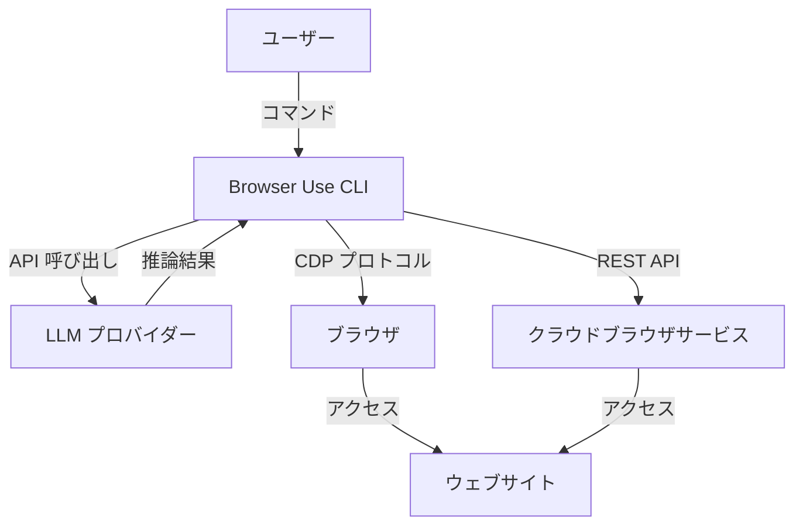
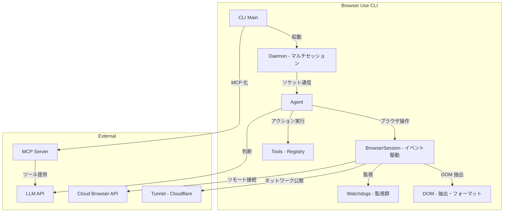
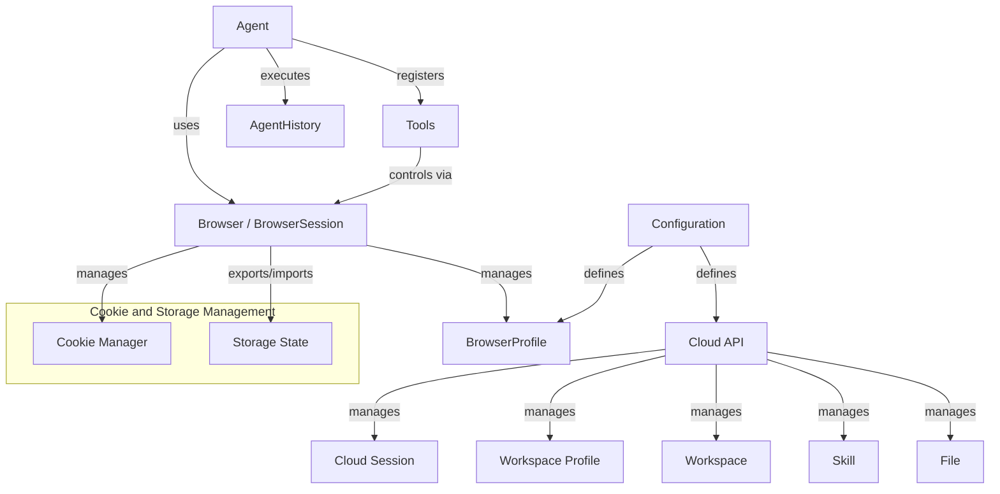
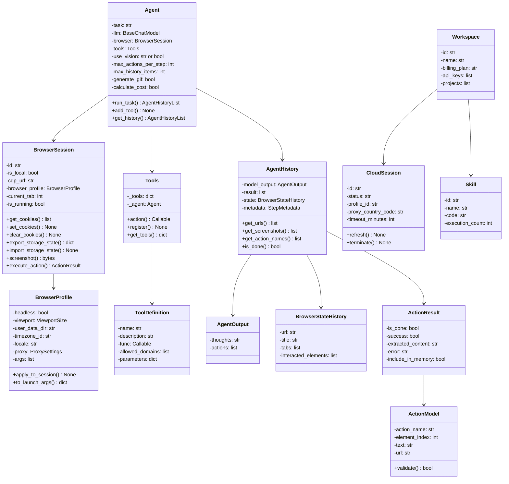
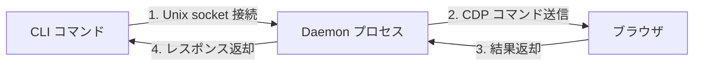

## 概要

この記事では、AI エージェント向けブラウザ自動化ツール「Browser Use CLI 2.0」の構造・データモデル・利用方法・運用ノウハウを調査した結果をまとめています。AI エージェントにブラウザ操作を組み込みたい開発者や、Selenium / Playwright の代替を検討しているエンジニアを対象としています。

> 調査時点: 2026年3月（v0.11.4 ベース、GitHub スター数 81.6k）

Browser Use CLI 2.0 は、AI エージェントがコマンドラインからブラウザを直接制御するための自動化ツールです。Playwright ベースのバックエンド上に構築されており、Chrome DevTools Protocol（CDP）を活用して効率的にブラウザを制御します。

従来の Selenium や Playwright 単体と比較した場合の特徴は以下の 3 点です。

| 比較軸 | Selenium / Playwright 単体 | Browser Use CLI 2.0 |
|--------|---------------------------|---------------------|
| 実行モデル | スクリプト単位でブラウザを起動・終了 | デーモン常駐で約 50ms のコマンドレイテンシ |
| AI 統合 | 別途 LLM 連携コードが必要 | LLM プロバイダ統合済み、ビジョン機能内蔵 |
| 運用形態 | ライブラリとして組み込み | CLI / MCP サーバー / Python API の 3 形態で利用可能 |

## 特徴

### 性能最適化

- 前世代比 2 倍の高速化、コスト半減
- デーモン常駐による約 50ms のコマンド実行レイテンシ
- ダイレクト CDP 接続による実行中 Chrome への直接接続

### アーキテクチャ

- マルチセッションデーモンによるバックグラウンドでのブラウザ保持
- 名前付きセッションによる複数ブラウザインスタンスの並列管理
- `~/.browser-use/` 下へのソケットとプロセス ID の保存

### ブラウザモード

| モード | 説明 |
|--------|------|
| ヘッドレス Chromium | デフォルトモード |
| 可視ブラウザウィンドウ | `--headed` オプションで起動 |
| 実 Chrome プロファイル | `--profile` で既存のログイン状態を保持 |
| CDP 接続 | `--cdp-url` で指定 |
| クラウドブラウザ | Cloud API 経由で接続 |

### AI モデル対応

- 複数 LLM プロバイダへの対応（OpenAI、Anthropic、Google Gemini、Groq、DeepSeek）
- ChatBrowserUse による自動化タスク最適化（従来比 3-5 倍高速）
- スクリーンショットベースのビジョン機能によるページ認識

### クラウドプラットフォーム統合

- REST パススルーによる Browser Use API（v2・v3）への汎用接続
- エージェントタスク、クラウドブラウザセッション、プロファイル、ワークスペース、ファイル、スキル、課金の一元管理
- MCP サーバーモードによる Claude Desktop 等からの自動化機能利用

### エージェントスキル統合

- Claude Code 向けの公式 Agent Skill を提供（[skills.sh](https://skills.sh/browser-use/browser-use/browser-use) で公開）
- スキルインストールにより、Claude Code エージェントが自然言語から browser-use コマンドを自動生成・実行

## 構造

### システムコンテキスト図



| 要素名 | 説明 |
|--------|------|
| ユーザー | Browser Use CLI を操作するエンドユーザーまたは開発者 |
| Browser Use CLI | コマンドを処理し、ブラウザ自動化を制御するシステム |
| LLM プロバイダー | Claude、GPT、Gemini など、エージェントの意思決定に使用する言語モデル |
| ブラウザ | CDP プロトコルで制御される Chromium ベースのブラウザ |
| クラウドブラウザサービス | リモートホスト上で実行されるマネージドブラウザ環境 |
| ウェブサイト | ブラウザがアクセスする対象の Web ページ群 |

### コンテナ図



| 要素名 | 説明 |
|--------|------|
| CLI Main | コマンドラインインターフェース、初回起動でデーモンをスポーン |
| Daemon | バックグラウンド常駐プロセス、Unix ソケット経由で CLI / Agent からのコマンドを受信 |
| Agent | タスク実行エンジン、LLM と連携し意思決定・ステップ制御を実行 |
| BrowserSession | ブラウザ制御の抽象層、イベントドリブンで Watchdog と DOM を統合 |
| Tools Registry | ナビゲーション、クリック、入力など約 40 個のアクションを登録・実行 |
| Watchdogs | 11 種類の監視モジュール（CAPTCHA、ポップアップ、クラッシュなど） |
| DOM | HTML の解析・シリアライズ、LLM 向けの形式変換を実行 |
| LLM API | 外部 LLM プロバイダーとの通信 |
| Cloud Browser API | クラウドブラウザサービスへの REST API 呼び出し |
| Tunnel | Cloudflare Quick Tunnel によるローカルネットワークの外部公開 |
| MCP Server | Model Context Protocol サーバー、Claude Desktop などから自動化機能を利用可能 |

### コンポーネント図

```mermaid
graph TB
    subgraph "Agent System"
        Agent_Service["Agent - service.py"]
        Message_Manager["MessageManager"]
        System_Prompt["SystemPrompt - prompts.py"]
        Judge["Judge - judge.py"]
        Variable_Detector["VariableDetector"]
    end

    subgraph "Browser Control"
        Browser_Session["BrowserSession - session.py"]
        Session_Manager["SessionManager"]
        CDPSession["CDPSession - CDP 通信層"]
        Target_Node["Target - ターゲット管理"]
    end

    subgraph "Watchdog Layer"
        WD_Base["BaseWatchdog"]
        WD_DOM["DOMWatchdog"]
        WD_Crash["CrashWatchdog"]
        WD_Popup["PopupsWatchdog"]
        WD_CAPTCHA["CaptchaWatchdog"]
        WD_Download["DownloadsWatchdog"]
        WD_Perm["PermissionsWatchdog"]
        WD_HAR["HarRecordingWatchdog"]
        WD_Blank["AboutBlankWatchdog"]
        WD_Record["RecordingWatchdog"]
        WD_Security["SecurityWatchdog"]
    end

    subgraph "DOM and Action"
        DOM_Service["DOMService - service.py"]
        Serializer_Node["Serializer - serializer.py"]
        Tools_Service["Tools - service.py"]
        Registry_Node["Registry - registry.py"]
    end

    subgraph "LLM and Inference"
        LLM_Base["BaseChatModel"]
        Chat_OpenAI["ChatOpenAI"]
        Chat_Claude["ChatAnthropic"]
        Chat_Google["ChatGoogle"]
        Chat_Groq["ChatGroq"]
    end

    subgraph "Peripheral"
        File_System["FileSystem"]
        Profile_Node["BrowserProfile - profile.py"]
        Cloud_Client["CloudBrowserClient - cloud.py"]
        Daemon_Node["Daemon - daemon.py"]
        MCP_Server["MCPServer - server.py"]
        Token_Service["TokenCost"]
        Skill_Service["SkillService"]
    end

    Agent_Service -->|メッセージ管理| Message_Manager
    Agent_Service -->|プロンプト生成| System_Prompt
    Agent_Service -->|判定実行| Judge
    Agent_Service -->|変数検知| Variable_Detector
    Agent_Service -->|ブラウザ操作| Browser_Session
    Agent_Service -->|アクション実行| Tools_Service

    Browser_Session -->|セッション管理| Session_Manager
    Browser_Session -->|CDP 通信| CDPSession
    Browser_Session -->|ターゲット管理| Target_Node
    Browser_Session -->|監視| WD_Base
    Browser_Session -->|DOM 抽出| DOM_Service
    Browser_Session -->|プロファイル設定| Profile_Node
    Browser_Session -->|クラウド接続| Cloud_Client

    WD_Base -->|詳細監視| WD_DOM
    WD_Base -->|詳細監視| WD_Crash
    WD_Base -->|詳細監視| WD_Popup
    WD_Base -->|詳細監視| WD_CAPTCHA
    WD_Base -->|詳細監視| WD_Download
    WD_Base -->|詳細監視| WD_Perm
    WD_Base -->|詳細監視| WD_HAR
    WD_Base -->|詳細監視| WD_Blank
    WD_Base -->|詳細監視| WD_Record
    WD_Base -->|詳細監視| WD_Security

    DOM_Service -->|HTML 変換| Serializer_Node
    Tools_Service -->|アクション登録| Registry_Node
    Tools_Service -->|ブラウザ操作| Browser_Session

    LLM_Base -->|実装| Chat_OpenAI
    LLM_Base -->|実装| Chat_Claude
    LLM_Base -->|実装| Chat_Google
    LLM_Base -->|実装| Chat_Groq

    Agent_Service -->|LLM 呼び出し| LLM_Base
    Judge -->|LLM 呼び出し| LLM_Base

    Agent_Service -->|ファイル操作| File_System
    Daemon_Node -->|バックグラウンド化| Agent_Service
    MCP_Server -->|ツール提供| Agent_Service
    Tools_Service -->|コスト計算| Token_Service
    Agent_Service -->|スキル利用| Skill_Service
```



| 要素名 | 説明 |
|--------|------|
| Agent | タスク実行の中核エンジン、ステップループ・リトライ・履歴管理を担当 |
| MessageManager | LLM との会話履歴、メッセージの圧縮・検証を管理 |
| SystemPrompt | エージェントへの指示、コンテキスト、行動ルールを定義 |
| Judge | LLM に現状の評価・判定を依頼する判別エンジン |
| VariableDetector | タスク中の機密情報や変数を検出・保護 |
| BrowserSession | Playwright / CDP をラップするブラウザ抽象層 |
| SessionManager | 複数タブ、複数ターゲット、ライフサイクルを一元管理 |
| CDPSession | Chrome DevTools Protocol 通信チャネル |
| Target | ページ、iframe、ワーカーなどブラウザ制御対象 |
| BaseWatchdog | イベント駆動で監視タスクを登録・実行する基盤 |
| DOMWatchdog | DOM 変化監視、構造変更検知 |
| CrashWatchdog | ブラウザクラッシュ検知、自動リカバリ |
| PopupsWatchdog | ポップアップ自動拒否 |
| CaptchaWatchdog | CAPTCHA チャレンジの待機・検知 |
| DownloadsWatchdog | ファイルダウンロード自動承認・トラッキング |
| PermissionsWatchdog | ブラウザパーミッション自動許可 |
| HarRecordingWatchdog | ネットワーク HAR アーカイブ記録 |
| AboutBlankWatchdog | 新規タブの about:blank 状態監視 |
| RecordingWatchdog | 動画・スクリーンショット記録制御 |
| SecurityWatchdog | セキュリティイベント監視 |
| DOMService | HTML パース、DOM ツリー構築・クエリ |
| Serializer | DOM を LLM 向け Markdown / JSON 形式に変換 |
| Tools | ブラウザ操作アクションの実行 |
| Registry | ツールの登録・探索・実行メカニズム |
| BaseChatModel | LLM プロバイダーの抽象インターフェース |
| ChatOpenAI | OpenAI API 統合 |
| ChatAnthropic | Anthropic API 統合 |
| ChatGoogle | Google Gemini API 統合 |
| ChatGroq | Groq API 統合 |
| FileSystem | タスク中のファイル I/O、サンドボックス管理 |
| BrowserProfile | ブラウザ起動オプション設定 |
| CloudBrowserClient | クラウドブラウザ API 接続 |
| Daemon | マルチセッション管理、Unix ソケット通信サーバー |
| MCPServer | Model Context Protocol サーバー |
| TokenCost | LLM トークン使用量・コスト計算 |
| SkillService | カスタムスキルの登録・実行 |

## データ

### 概念モデル



| 要素名 | 説明 |
|--------|------|
| Agent | タスク実行を制御し、LLM とブラウザを調整するオーケストレーター |
| Browser / BrowserSession | ブラウザインスタンスを管理し、ページ操作を実行するセッション |
| Tools | エージェントが実行可能なカスタムアクションを提供するレジストリ |
| AgentHistory | エージェント実行の全ステップを記録する履歴 |
| BrowserProfile | ブラウザ設定をテンプレート化して再利用可能にしたプロファイル |
| Configuration | システムおよびセッション全体の設定情報 |
| Cloud API | クラウド上のリソースを管理する API |
| Cookie Manager | ブラウザの Cookie を取得、設定、クリア、エクスポート、インポートする機能 |
| Storage State | Cookie および localStorage をファイル形式で永続化する仕組み |
| Cloud Session | クラウドで実行されるブラウザセッション |
| Workspace Profile | クラウドに保存される再利用可能なブラウザプロファイル |
| Workspace | クラウドプロジェクトとリソースを統合するコンテナ |
| Skill | 再利用可能なエージェント処理タスク |
| File | クラウドストレージで管理されるファイル |

### 情報モデル



## 構築方法

### インストール

#### 推奨インストール方法

一行インストーラーでのインストールが推奨されています。

```bash
# macOS/Linux
curl -fsSL https://browser-use.com/cli/install.sh | bash

# フル機能でインストール
curl -fsSL https://browser-use.com/cli/install.sh | bash -s -- --full

# ローカルのみ
curl -fsSL https://browser-use.com/cli/install.sh | bash -s -- --local-only

# リモートのみ
curl -fsSL https://browser-use.com/cli/install.sh | bash -s -- --remote-only
```

#### 手動インストール

```bash
# パッケージをインストール
uv pip install browser-use

# Chromium をインストール
browser-use install

# API キーを設定（リモートモード用）
export BROWSER_USE_API_KEY=your_key

# インストール検証
browser-use doctor
```

#### システム要件

- Python 3.11 以上
- Git（Windows の場合）

### セットアップと検証

```bash
# 診断実行
browser-use doctor

# 対話的なセットアップ
browser-use setup

# モードを指定して非対話的にセットアップ
browser-use setup --mode local|remote|full
```

## 利用方法

### 基本ワークフロー

以下の 3 ステップで基本的なブラウザ操作を実行できます。

```bash
# 1. ページへナビゲーション
browser-use open https://example.com

# 2. 要素インデックスを取得
browser-use state

# 3. 要素を操作
browser-use click 5
browser-use input 3 "john@example.com"
```

### ブラウザ操作コマンド

#### ナビゲーション

```bash
browser-use open https://example.com
browser-use back
browser-use scroll down
browser-use close-tab
```

#### クリック・マウス操作

```bash
browser-use click 5           # インデックスでクリック
browser-use click 100 200     # 座標でクリック
browser-use hover 5
browser-use dblclick 3
browser-use rightclick 8
```

#### テキスト入力・フォーム操作

```bash
browser-use type "Hello World"
browser-use input 3 "john@example.com"
browser-use select 7 "Option Value"
browser-use upload 10 /path/to/file.pdf
browser-use keys "ctrl+a"
```

#### データ取得・実行

```bash
browser-use screenshot output.png
browser-use get "input[name='email']"
browser-use eval "document.title"
browser-use python "result = browser.get_state()"
```

#### Wait 条件

```bash
# CSS セレクタで要素の出現を待機
browser-use wait selector ".submit-button"

# 要素の非表示を待機
browser-use wait selector ".loading" --state hidden

# テキストの出現を待機（カスタムタイムアウト）
browser-use wait text "Success" --timeout 10000
```

### ブラウザモード

```bash
# ヘッドレス（デフォルト）
browser-use open https://example.com

# 可視モード
browser-use open https://example.com --headed

# 実 Chrome プロファイル（既存ログイン・Cookie を保持）
browser-use open https://gmail.com --profile "Default"

# 自動検出 CDP 接続（Chrome, Chromium, Brave, Edge, Vivaldi を自動検出）
browser-use --connect open https://example.com

# CDP URL を明示指定
browser-use open https://example.com --cdp-url "ws://localhost:9222"
```

### セッション管理

```bash
# 名前付きセッション
browser-use --session work open https://example.com
browser-use --session work state

# セッションリスト表示
browser-use sessions

# 環境変数でセッション指定
export BROWSER_USE_SESSION=work
browser-use state

# セッション終了
browser-use --session work close
browser-use close --all
```

### クラウドブラウザ

```bash
# 認証（API キーを ~/.browser-use/config.json に保存）
browser-use cloud login <api-key>

# クラウドブラウザに接続
browser-use cloud connect
browser-use cloud connect --proxy-country US

# REST API パススルー（v2/v3）
browser-use cloud v2 GET /sessions
browser-use cloud v2 POST /tasks
browser-use cloud v2 poll <task-id>   # 長時間タスクのポーリング

# セッション管理
browser-use --session cloud cloud connect
```

### テンプレート初期化

```bash
browser-use init              # 対話的にテンプレート選択
browser-use init --list       # テンプレート一覧
browser-use init --template basic
browser-use init --output my_script.py --force
```

### MCP サーバーモード

Browser Use CLI は MCP サーバーとして起動でき、Claude Desktop などの MCP クライアントから自動化機能を利用できます。

```bash
# MCP サーバーとして起動
browser-use --mcp

# uvx 経由で起動
uvx browser-use[cli] --mcp
```

### Claude Code スキル統合

Browser Use は、Claude Code 向けの公式 Agent Skill を提供しています。このスキルをインストールすると、Claude Code のエージェントが Browser Use CLI のコマンドを自然言語指示から自動的に組み立てて実行できるようになります。

スキルは [skills.sh](https://skills.sh/browser-use/browser-use/browser-use) でも公開されており、以下のコマンドでインストールできます。

```bash
# Claude Code スキルのインストール
mkdir -p ~/.claude/skills/browser-use
curl -o ~/.claude/skills/browser-use/SKILL.md \
  https://raw.githubusercontent.com/browser-use/browser-use/main/skills/browser-use/SKILL.md
```

インストール後、Claude Code に「このページのフォームを入力して」などと指示すると、スキルが browser-use コマンドに変換して実行します。

### Python API 統合

CLI だけでなく、Python API からも利用できます。

```python
from browser_use import Agent, Browser, ChatBrowserUse

agent = Agent(
    task="フォームに入力して送信する",
    llm=ChatBrowserUse(),
    browser=Browser()
)
result = await agent.run()
```

## 運用

### デーモン管理

デーモンの通信フローは以下のとおりです。



| 要素名 | 説明 |
|--------|------|
| CLI コマンド | ユーザーが実行する browser-use コマンド |
| Daemon プロセス | バックグラウンドで常駐し、ブラウザとの通信を仲介するプロセス |
| ブラウザ | CDP プロトコルで制御される Chromium インスタンス |

デーモンは以下のライフサイクルで動作します。

- auto-start：初回コマンド時に自動起動
- auto-stop：ブラウザプロセス終了時に自動終了
- 明示的停止：`browser-use server stop`
- Unix socket（Windows は TCP）経由で後続コマンドと通信
- 約 50ms のコマンドレイテンシを実現

### ディレクトリ構造

CLI 状態は `~/.browser-use/` に一元管理されます。`BROWSER_USE_HOME` 環境変数で変更できます。

```
~/.browser-use/
├── config.json                    # Cloud API キー・設定
├── bin/                           # マネージド実行ファイル
├── sessions/
│   ├── default/
│   │   ├── .sock                  # Unix ソケット
│   │   ├── .pid                   # デーモン PID
│   │   └── browser.log            # ブラウザログ
│   └── <session-name>/
│       ├── .sock
│       └── .pid
├── tunnels/
│   └── <tunnel-id>.json           # トンネルメタデータ
└── profiles/
    └── <profile-dir>/             # ブラウザプロファイル
```

### Cookie 管理

```bash
browser-use cookies get
browser-use cookies get --url <url>
browser-use cookies set <name> <value> --domain .example.com --secure
browser-use cookies clear
browser-use cookies export <file>
browser-use cookies import <file>
```

### プロファイル同期

```bash
# ローカルプロファイルリスト表示
browser-use -b real profile list

# プロファイル同期
browser-use profile sync --from "Default" --domain github.com
```

### トンネル機能

```bash
browser-use tunnel <port>        # トンネル作成
browser-use tunnel list          # リスト表示
browser-use tunnel stop <id>     # 停止
browser-use tunnel stop --all    # すべて停止
```

### リソースクリーンアップ

```bash
browser-use close                # カレントセッション終了
browser-use session stop --all   # クラウドセッション全停止
browser-use tunnel stop --all    # トンネル全停止
```

## ユースケース別推奨構成

| ユースケース | ブラウザモード | セッション | LLM | 備考 |
|-------------|--------------|-----------|-----|------|
| ローカル開発・デバッグ | `--headed` | デフォルト | ChatBrowserUse | 可視モードで動作を目視確認 |
| CI/CD パイプライン | ヘッドレス（デフォルト） | 使い捨て | Gemini Flash | 高速・低コスト、失敗時は新規セッション |
| 既存ログイン状態の活用 | `--profile "Default"` | 名前付き | 任意 | Cookie・認証情報を保持 |
| Claude Desktop 連携 | 任意 | 任意 | Claude（MCP 経由） | `--mcp` で MCP サーバーとして起動 |
| 大量ページ並列処理 | クラウドブラウザ | 複数セッション | 任意 | Cloud API 経由でスケールアウト |

## ベストプラクティス

### インストール・セットアップ

| プラクティス | 理由 |
|-------------|------|
| `uv` でパッケージ管理 | `pip` より依存解決が高速で再現性が高い |
| `uv venv --python 3.11` で仮想環境作成 | Python 3.11 以上が必須要件 |
| `browser-use doctor` で検証 | Chromium・API キー・Python バージョンを一括チェック |

### パフォーマンス最適化

| プラクティス | 理由 |
|-------------|------|
| Gemini Flash を優先利用 | 高速・低価格で、自動化タスクに十分な精度 |
| `max_agent_steps` で上限設定 | 無限ループ防止とコスト制御 |
| 不要な Proxy 機能の無効化 | 接続オーバーヘッド削減 |
| 要素ハイライトの無効化 | レンダリング負荷を軽減 |

### セッション設計

| プラクティス | 理由 |
|-------------|------|
| 連続タスク時は `--keep-alive` で同一セッション利用 | ブラウザ再起動のオーバーヘッド回避 |
| セッション失敗時は新規作成 | 破損状態の引き継ぎを防止 |
| プロファイル ID を明示指定 | Cookie・ログイン状態の予測可能な管理 |
| 未終了セッション・トンネルの定期クリーンアップ | リソースリーク防止 |

### エラー耐性

| プラクティス | 理由 |
|-------------|------|
| 30 秒のタイムアウト設定 | ページ読み込み遅延による無限待機を防止 |
| リトライロジックの実装 | 一時的なネットワーク障害への対応 |
| 完全なエラーハンドリング | 失敗原因の特定と適切なフォールバック |

## トラブルシューティング

### 診断ツール

```bash
browser-use doctor
```

Python バージョン、Chromium インストール状況、API キー設定状況を検出します。

### "Failed to start session server" エラー（Windows）

原因は、ゾンビプロセスがポートを占有していることです。以下のコマンドで解消できます。

```bash
netstat -ano | findstr 49698
taskkill /PID <pid> /F
```

### 仮想環境の不具合

古いキャッシュや依存関係に起因する問題が発生した場合、以下の手順で環境を再構築します。

```bash
# Python プロセス終了
taskkill /IM python.exe /F

# 環境ディレクトリ削除
Remove-Item -Recurse -Force "$env:USERPROFILE\.browser-use-env"

# 再インストール
browser-use install
```

### ブラウザ起動失敗

```bash
browser-use close --all           # セッション終了
browser-use --headed open <url>   # 可視モードでテスト
browser-use state                 # 状態確認
```

### 要素が見つからない場合

```bash
browser-use state       # 状態確認
browser-use scroll down # スクロール
browser-use state       # 再確認
```

### タスクが停止している場合

新しいセッションを作成して解決します。

```bash
browser-use session create --profile <profile-id> --keep-alive
browser-use -b remote run "task" --session-id <new-session-id>
```

### macOS/Linux: デーモンプロセスの残留

`browser-use close` 後もプロセスが残る場合は、以下の手順で解消します。

```bash
# デーモンプロセスの確認
ps aux | grep browser-use

# 手動でプロセスを終了
kill <pid>

# ソケットファイルの残骸を削除
rm -f ~/.browser-use/sessions/default/.sock
rm -f ~/.browser-use/sessions/default/.pid
```

## まとめ

Browser Use CLI 2.0 は、デーモン常駐アーキテクチャと CDP 直接接続により、AI エージェントが約 50ms のレイテンシでブラウザを制御できるツールです。LLM 統合・Watchdog 監視・MCP サーバーモードなど、AI エージェントによるブラウザ自動化を本番運用するために必要な機能を一通りカバーしています。

この記事が少しでも参考になった、あるいは改善点などがあれば、ぜひリアクションやコメント、SNSでのシェアをいただけると励みになります！

## 参考リンク

- 公式ドキュメント
  - [Browser Use CLI Documentation](https://docs.browser-use.com/open-source/browser-use-cli)
  - [Browser Use CLI Install Script](https://browser-use.com/cli/install.sh)
- GitHub
  - [Browser Use GitHub](https://github.com/browser-use/browser-use)
  - [Browser Use skill_cli README](https://github.com/browser-use/browser-use/blob/main/browser_use/skill_cli/README.md)
  - [Browser Use README](https://github.com/browser-use/browser-use/blob/main/README.md)
  - [Browser Use Organizations](https://github.com/orgs/browser-use/repositories)
  - [Browser Use Release 0.11.4 - CLI](https://github.com/browser-use/browser-use/releases/tag/0.11.4)
- 記事
  - [Browser Use CLI Skills](https://skills.sh/browser-use/browser-use/browser-use)
  - [Browser Use MCP Server](https://lobehub.com/mcp/saik0s-mcp-browser-use)
