> 検証日: 2026-06-10 / 起点: Anthropic「Claude Fable 5 と Claude Mythos 5」発表 (2026-06-09)
> 対象読者: AIエージェント実装エンジニア / LLMOps / セキュリティ担当

高性能 LLM の導入は「どのモデルを選ぶか」という問いではなく、「**どの入力を上位モデルに渡さないか / ログを何日保持するか / 例外アクセスを誰に許すか**」を設計する問いに移っています。Anthropic が 2026-06-09 に公開した Claude Fable 5 / Mythos 5 は、この問いに対する一つの答えを「分類器フォールバック + 30 日ログ保持 + trusted access」という形で明示しました。

本記事では、この設計を **能力制限付きルーティング (capability-limited routing)** という再利用可能なパターンとして抽出し、自社の LLM ゲートウェイ (LiteLLM / Cloudflare AI Gateway / Portkey / AWS Bedrock) でどう実装するかまで落とし込みます。なお本記事では、capability-limited routing を総称、**高リスク時に制限モデルへ回答を落とす下位動作を degrade-routing** と呼び分けます。

## 概要

従来の LLM ガードレールは「拒否 (refuse) か回答 (answer) か」の二値で設計されました。分類器が危険領域を検出したら要求を弾き、そうでなければ高性能モデルがそのまま答えます。単純ですが、拒否はユーザー体験を断絶し、攻撃者には「フラグを立てずに通過する」研究課題を与えます。

能力制限付きルーティングはこの二値から脱します。制御変数を「**どのモデルが答えるか**」に置き換え、高リスク領域を検出しても会話を打ち切らず、**能力を一段落とした別モデルが回答を引き継ぎます (degrade/fallback)**。危険な能力だけを選択的に抑制しつつ、無害なトラフィックは高性能モデルで処理し続ける設計です。

Anthropic の Fable 5 では、サイバーセキュリティ / 生物・化学 / 蒸留 (distillation) の 3 領域を対象とする分類器が高リスクを検出すると、Fable 5 ではなく **Opus 4.8 へ自動的に回答を委譲**します。発火は平均で **5% 未満のセッション**にとどまり (ベンダー自己申告値)、発火時はユーザーに通知されます。同時に **30 日ログ保持の義務化** と **trusted access (Project Glasswing)** による二層アクセス制度も一体で設計されています。

重要なのは、これが Anthropic 固有の選択ではない点です。OpenAI は GPT-5.3-Codex (2026-02) の時点で同型の分類器リルートを実装・公表済みであり、2026 年時点でフロンティアラボへ広がりつつある**事実上の収束パターン**です。

### 関連技術との位置づけ

能力制限付きルーティングは既存の複数パターンの合成として理解できます。

| 関連技術 | 関係 |
|---|---|
| safety classifier / guardrail | 入力・出力を検査する分類器は guardrail の系譜。Llama Guard や Anthropic の Constitutional Classifiers (ASL-3 対応) と同系統。本パターンは分類器を「ブロック」でなく「ルーティングのトリガー」として使う |
| model routing (SafeRoute) | SafeRoute は hard/easy で guard モデルの大小を切り替える効率のためのルーティング。本パターンは目的が逆向きで「能力を抑制するために回答本体を弱モデルへフォールバック」させる。新規性の核はここ |
| capability-based access control | セキュリティ分野の概念を AI 推論層へ転用。degrade-routing による能力抑制と trusted access による能力解放の両面を持つ |

### パターン対比

| 比較項目 | 従来 guardrail (拒否型) | SafeRoute 型 (効率ルーティング) | 能力制限付きルーティング (degrade 型) |
|---|---|---|---|
| 制御変数 | 要求を通すか拒否するか | どのサイズの guard モデルを使うか | どのモデルが回答するか |
| 高リスク時の挙動 | 拒否・ブロック・エラー返却 | 大型 guard モデルへエスカレート | 能力の低いモデルへ回答を委譲 |
| 目的 | 危険な回答の防止 | 安全チェックのコスト最適化 | 危険能力の選択的抑制 + 高性能維持 |
| ユーザー体験 | 会話断絶・エラーメッセージ | ほぼ透過的 (速度差のみ) | 会話は継続 (発火時は通知あり) |
| 通常トラフィックへの影響 | なし | なし | なし (95% 超はそのまま高性能モデル) |

### ベンダー実装の対応表

| Anthropic (Fable 5 / Mythos 5, 2026-06) | OpenAI の対応物 | Google DeepMind の対応物 |
|---|---|---|
| 分類器で高リスク検出 → Opus 4.8 へフォールバック | GPT-5.3-Codex (2026-02): 自動分類器が高リスクトラフィックを less cyber-capable な GPT-5.2 へ reroute (製品内通知あり) | degrade-routing の一次記述は確認できた範囲では未発見 (拒否・フィルタ + アカウント執行が中心) |
| 2 段階分類 (検出 → escalate) | fast topical classifier → 2nd-tier safety reasoner | Frontier Safety Framework v2.0 の Critical Capability Levels (CBRN / cyber / ML R&D) |
| Mythos 5 を Glasswing 参加者へ trusted access | GPT-5.4-Cyber: 検証済みセキュリティ防御者へ trusted access (二次情報。本人確認は GPT-5.3-Codex の chatgpt.com/cyber で一次確認) | SecGemini: gated research project (サイバー特化) |
| 生物版 Fable 5 を研究者へセーフガード除外で提供 | ChatGPT agent を bio で "High Capability" 扱い + Rosalind Biodefense | Gemini 2.5 Deep Think: usage monitoring + account enforcement |
| 30 日ログ保持義務 (ZDR 不可) | 30 日 abuse monitoring (承認制 ZDR で例外あり) | usage monitoring の保持期間は一次記述として明示なし |

## 特徴

- **degrade-routing**: 分類器が高リスクを検出しても拒否メッセージを返さず、能力水準を落として (Opus 4.8) 回答を継続します。サイバーは exploit discovery / offensive cyber、生物・化学は精度より broad なセーフガードを優先、蒸留は能力の大規模抽出を検出・ブロックします。
- **発火率 5% 未満という設計目標**: 「95% 超がフォールバックなしで完結する」ことを意味します。「発火率を低く保つ = over-refusal を抑制する」という指向は、従来の guardrail (安全側に倒す) と方向が異なります。ただしベンダー自己申告値で第三者検証は未公開です。
- **30 日保持義務と ZDR 不可**: Mythos クラス全トラフィックに 30 日保持を義務付け、Zero Data Retention は選べません。保持は安全目的限定・学習禁止・人的アクセスは記録・原則 30 日後削除です。要件未達の組織のリクエストは、Claude API では `400 invalid_request_error` で拒否されます (Bedrock/Vertex/Foundry 経由は各プラットフォームの設定に従います)。
- **trusted access の二層構造**: 下層は全ユーザー向け degrade-routing で危険能力を抑制し、上層は審査済みアクターにセーフガードを外した上位モデルを開放します。技術セーフガード不足を KYC・契約・保持義務・アクセスログという**ガバナンス統制で代替**します。
- **フロンティアラボの収束パターン**: OpenAI が GPT-5.3-Codex で先行実装・公表済み。Anthropic の差分は (1) 対象を cyber から生物化学・蒸留へ拡張、(2) フォールバック先を汎用最上位 (Opus 4.8) にした点です。

## 構造

具体プロダクトでなく設計パターンのため、C4 を「能力制限付きルーティングを実装するシステムの論理構造」として描きます。

### システムコンテキスト図

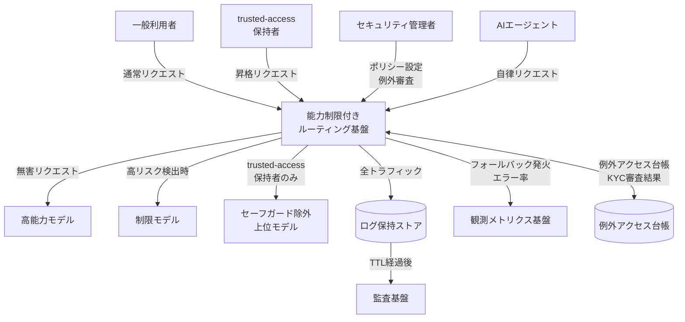

| 要素名 | 説明 |
|---|---|
| 一般利用者 | セーフガードが適用された状態で高能力モデルを利用するエンドユーザー |
| trusted-access 保持者 | KYC 審査・vetting を通過し、セーフガード除外の上位モデルへのアクセスが許可された主体 |
| セキュリティ管理者 | 分類ポリシーの定義・例外審査・監査証跡の確認を担うオペレーター |
| AI エージェント | ツール呼び出し・コード実行など自律タスクを行う非人間アクター。固有 identity として扱う |
| 能力制限付きルーティング基盤 | 本記事が示す設計パターンの中心システム |
| 高能力モデル | 無害と判定されたリクエストを処理する上位モデル。危険能力を保持する |
| 制限モデル | 高リスク検出時のフォールバック先となる低能力モデル |
| セーフガード除外上位モデル | trusted-access 保持者にのみ開放される、セーフガードを外した上位モデル |
| ログ保持ストア | 全トラフィックを TTL 設定に従い保持するデータストア |
| 観測メトリクス基盤 | フォールバック発火率・制限モデル到達率などの KPI を可視化するシステム |
| 例外アクセス台帳 | KYC 審査結果・発行キー有効期限・利用履歴を管理する台帳 |
| 監査基盤 | TTL 経過後も保持が必要な安全フラグ・監査メタデータを長期管理するシステム |

### コンテナ図

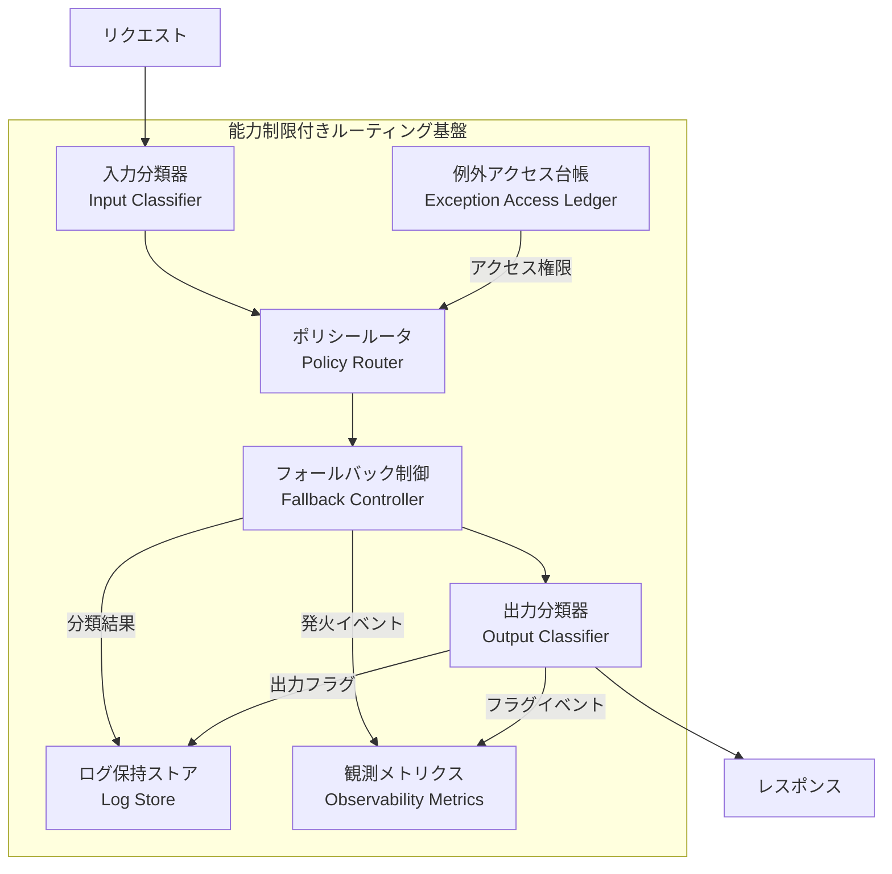

| 要素名 | 説明 |
|---|---|
| 入力分類器 | 受信リクエストを高リスク領域かどうかスコアリングする。全リクエストがここを通過する単一チェックポイント |
| ポリシールータ | 分類スコアとアクセス台帳の権限を照合し、上位モデル・制限モデル・除外上位モデルのいずれへ転送するかを決定する |
| フォールバック制御 | 能力系のフォールバックと技術的エラー系のフォールバックを分離して管理し、実際のモデル呼び出しを実行する |
| 出力分類器 | モデルの出力を検査し、能力の無断抽出や漏洩パターンを検出する。入力分類器とは独立したライフサイクルで動作する |
| ログ保持ストア | 会話本文・安全フラグ・監査メタデータをデータクラスごとに異なる TTL で保持する |
| 例外アクセス台帳 | KYC 審査結果・発行キー・有効期限・利用上限を管理し、ポリシールータに権限情報を提供する |
| 観測メトリクス | フォールバック発火率・制限モデル到達率・フラグ率などの運用 KPI を集計・配信する補助コンテナ |

### コンポーネント図

各コンテナを構成するコンポーネントを、実在する実装例の具体名とともに示します。

#### 入力分類器

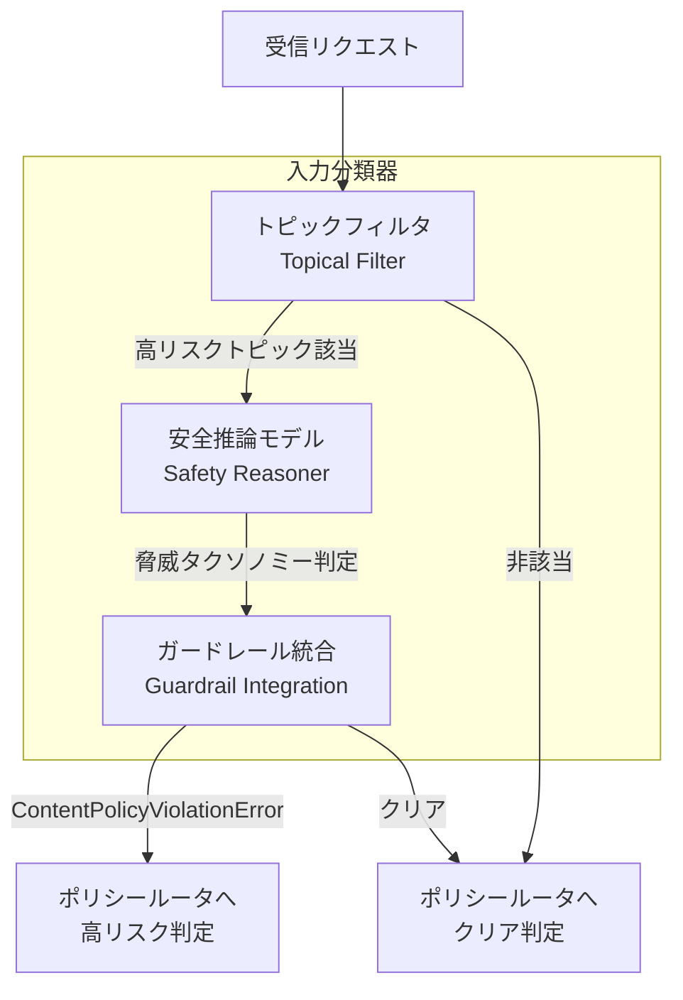

| 要素名 | 説明 |
|---|---|
| トピックフィルタ | リクエストが高リスクトピックに関連するかを高速に一次判定する軽量分類器。OpenAI GPT-5.3-Codex の fast topical classifier と同型。Cloudflare AI Gateway Guardrails の prompt evaluation がこの役割を担える |
| 安全推論モデル | 高リスク判定リクエストを脅威タクソノミーに照らして精査する二次分類器。LLM-as-judge 型または fine-tune 型で実装する |
| ガードレール統合 | Presidio・Bedrock Guardrails・OpenAI Moderation などの既存ガードレールをアダプタ経由で差し込む統合点。LiteLLM Guardrails の `litellm_content_filter` や custom callback で差し替え可能 |

#### ポリシールータ

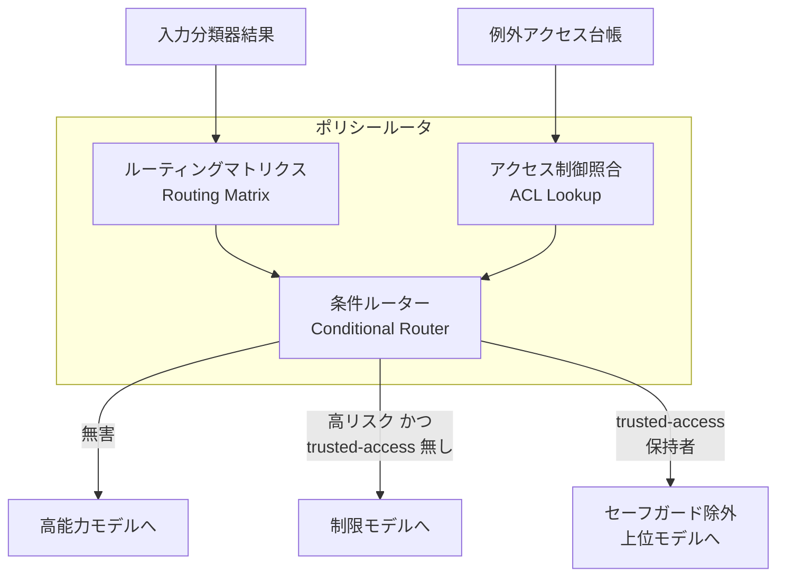

| 要素名 | 説明 |
|---|---|
| ルーティングマトリクス | 分類スコアとリスクカテゴリの組み合わせに対してモデル選択ルールを定義したテーブル |
| アクセス制御照合 | 例外アクセス台帳を参照し、リクエスト元が trusted-access 権限を持つかを確認する。LiteLLM virtual key の allowed_models でモデルごとのアクセス可否を表現できる |
| 条件ルーター | ルーティングマトリクスと ACL 照合結果を統合して転送先を決定する。Portkey Conditional Routing の metadata / params 演算子による条件ルーティングで実装できる |

#### フォールバック制御

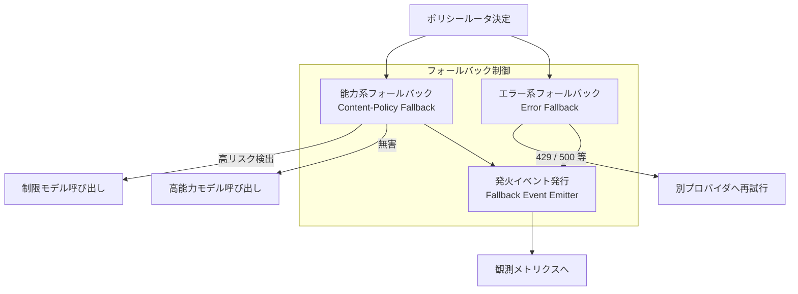

| 要素名 | 説明 |
|---|---|
| 能力系フォールバック | コンテンツポリシー違反を検出したときに制限モデルへ委譲する。LiteLLM の `content_policy_fallbacks` が直接対応し、`ContentPolicyViolationError` 専用に一般エラー用 `fallbacks` とは別キーで設定する |
| エラー系フォールバック | 429・500 などの技術的エラーを別プロバイダへの再試行で吸収する。LiteLLM の `fallbacks` および Policy Flow Builder の `on_error` が対応する。能力系と分離することで「壊れたから落とす」と「能力を抑制するために落とす」を区別できる |
| 発火イベント発行 | フォールバック発火時にイベントを発行し観測メトリクスへ送る。Cloudflare AI Gateway の `cf-aig-step` レスポンスヘッダがこの観測点に相当する (ただし `cf-aig-step` は failover step の観測であり、コンテンツポリシー由来の degrade の直接指標ではない点に注意) |

#### 出力分類器

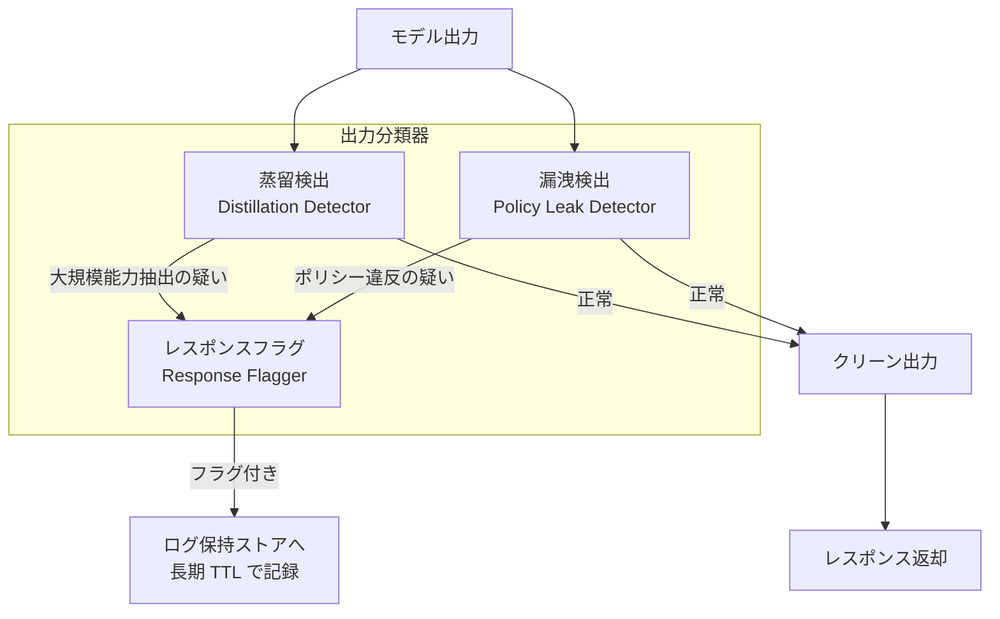

| 要素名 | 説明 |
|---|---|
| 蒸留検出 | モデルの能力を大規模に抽出しようとするパターンをレスポンス側で検出する。Anthropic の分類器領域「distillation」に対応する |
| 漏洩検出 | モデルがポリシー違反に近い内容を出力していないかを評価する。Cloudflare AI Gateway Guardrails の response evaluation 設定が対応する |
| レスポンスフラグ | 疑いのある出力にフラグを付け、ログ保持ストアへの長期 TTL 記録を指示する。Anthropic では flag された session を最大 2 年保持する設計と対応する |

#### ログ保持ストア

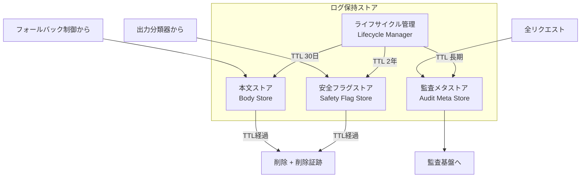

| 要素名 | 説明 |
|---|---|
| 本文ストア | 会話の入力・出力を保持する。TTL は安全目的の業界標準窓である 30 日が基準。AWS Bedrock Model Invocation Logging を使う場合は S3 lifecycle で TTL を自社管理できる |
| 安全フラグストア | フラグが立った session の入出力を保持する。Anthropic は最大 2 年保持を規定しており、本文ストアとは別ライフサイクルで管理する |
| 監査メタストア | 誰がいつどのモデルを呼んだか・フォールバック発火有無・アクセス権限変更などのメタデータを保持する。規制業種では 7 年保持も必要になる |
| ライフサイクル管理 | データクラスごとの TTL 設定・Glacier 移行・確実削除・削除証跡の生成を管理する。AWS S3 lifecycle rules や CloudWatch Logs retention で IaC 化できる |

#### 例外アクセス台帳

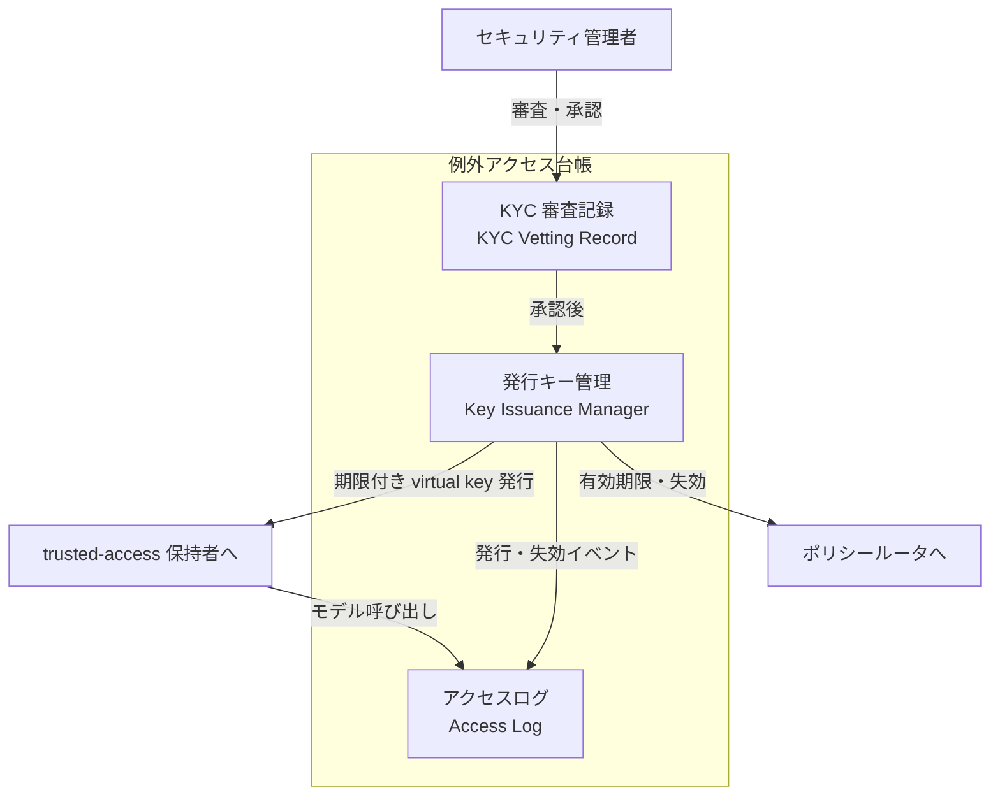

| 要素名 | 説明 |
|---|---|
| KYC 審査記録 | 申請者の身元確認・用途確認・承認基準充足の記録。Project Glasswing の「セキュリティ要件充足確認」に対応する |
| 発行キー管理 | 期限付き・利用上限付きのアクセスキーを発行・失効・更新する。LiteLLM virtual key の allowed_models に高能力モデルを追加したキーを trusted-access 保持者だけに発行する形で実装できる。Model Access Groups で複数モデルをグループ管理し proxy 再起動なしで権限を即時変更できる |
| アクセスログ | 発行・失効・実際のモデル呼び出しをすべて記録する。人的アクセスも含め全ログ化することで、Mythos クラスの「人的アクセス全ログ」要件を自社実装で再現する |

### リクエストフロー

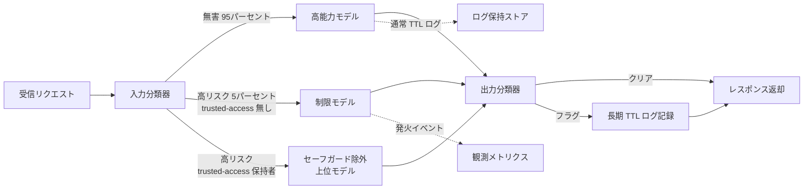

| 要素名 | 説明 |
|---|---|
| 無害 95% パス | 入力分類器をパスしたリクエストが高能力モデルへ直通するメインパス。Anthropic Fable 5 では平均 95% 超がこのパスを通る |
| 高リスク 5% パス | 入力分類器で高リスクと判定されたリクエストが制限モデルへ委譲される。ユーザーには通知が行われるが会話は継続する degrade 設計 |
| trusted-access パス | KYC 審査を通過した主体が、セーフガードを外した上位モデルを利用できる昇格パス。出力分類器は通過するため出力側の監視は継続する |

## データ

このパターンが扱うエンティティをモデル化します。

### 概念モデル

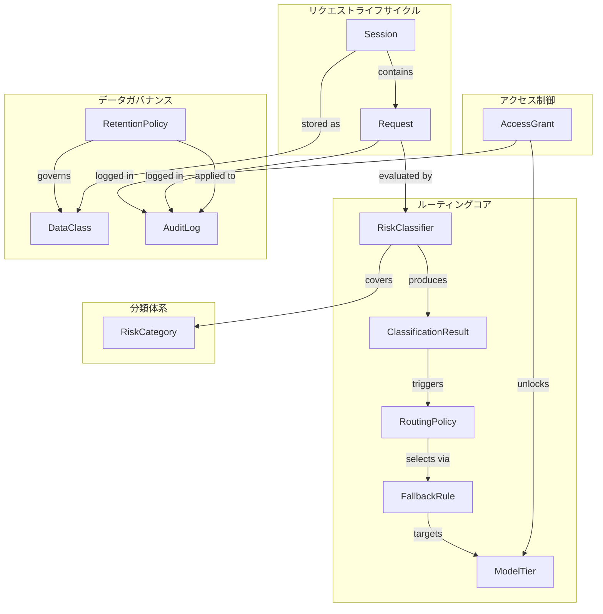

| 要素名 | 説明 |
|---|---|
| Session / Request | ユーザーのセッションと個々のリクエスト。分類とログ保持の単位 |
| RiskClassifier / RiskCategory / ClassificationResult | 分類器と、それが扱うリスクカテゴリ (cyber / bio-chem / distillation 等)、分類結果 |
| RoutingPolicy / FallbackRule / ModelTier | ルーティングポリシー、フォールバックルール、モデル等級 (高能力 / 制限) |
| RetentionPolicy / DataClass / AuditLog | 保持ポリシー、データクラス、監査ログ |
| AccessGrant | trusted access の付与 (主体 / 承認 / 期限 / allowed_models) |

### 情報モデル

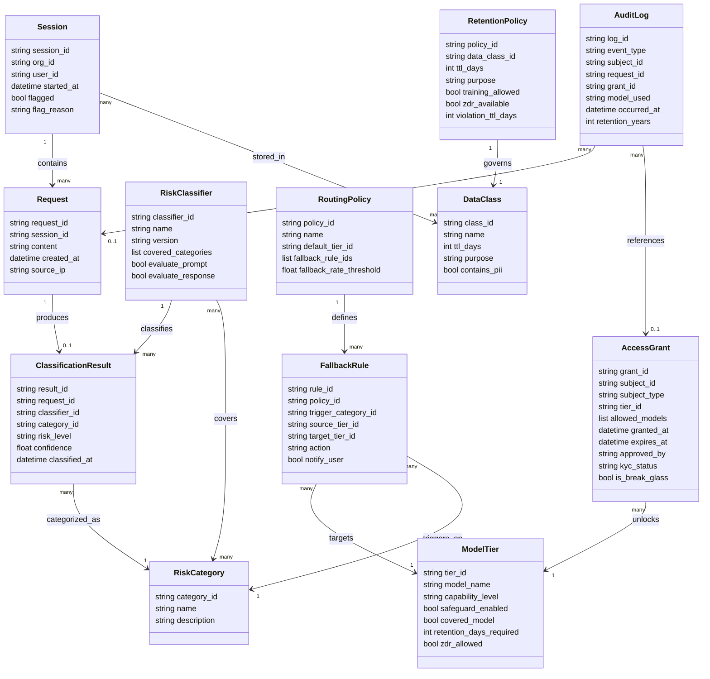

### データクラス別ライフサイクル

| DataClass.name | ttl_days | purpose | training_allowed | 備考 |
|---|---|---|---|---|
| conversation_content | 30 | abuse_detection | false | Fable 5 / Mythos 5 は ZDR 不可 |
| safety_flag | 730 | safety_investigation | false | 違反 session は最大 2 年保持 (ZDR 契約組織を含む全 API 共通のポリシー) |
| audit_metadata | 2190 | compliance_audit | false | Activity Feed は 6 年 (推測・実装から補完) |
| batch_content | 29 | batch_processing | false | Batch API 仕様由来 (30 日とは別) |
| file_content | -1 | user_explicit | false | 明示削除まで保持 (-1=無期限) |

`AccessGrant.kyc_status` の状態遷移 (推測・実装から補完):

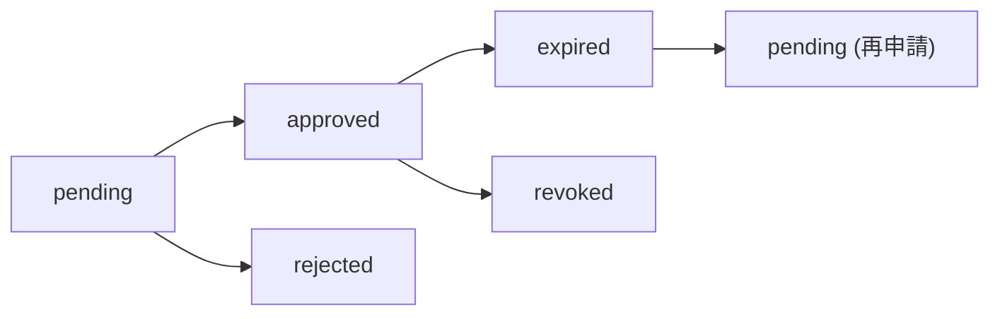

- `is_break_glass`: 緊急昇格フラグ。`true` の場合は事後レビュー必須かつ全フィールドを AuditLog に記録する。
- `allowed_models`: 付与されたモデルの許可リスト。ModelTier 全体でなく個別モデルを限定する。

## 構築方法

### gateway 層の位置づけと前提

能力制限付きルーティングを実装する際は、**実プロバイダキーを隠蔽する gateway 層を 1 箇所に置く**ことが前提になります。アプリケーション各所に分散させると、ゲートを通らないリクエストが生まれます。LiteLLM proxy / Cloudflare AI Gateway / Portkey のいずれも、このキー隠蔽と一元制御を前提に設計されています。

```
クライアント
  │ virtual key (実キーを知らない)
  ▼
gateway (LiteLLM proxy / Cloudflare AI GW / Portkey)
  │ 実プロバイダキー (アプリから見えない)
  ▼
LLM プロバイダ (Anthropic / OpenAI / Bedrock 等)
```

### LiteLLM proxy の最小セットアップ

`config.yaml` の `litellm_settings` に 4 種のフォールバックキーを置きます。各キーの発火条件は**独立**しています。

```yaml
# config.yaml
model_list:
  - model_name: high-capability       # 一次: 高能力モデル
    litellm_params:
      model: anthropic/claude-fable-5
      api_key: os.environ/ANTHROPIC_API_KEY

  - model_name: limited-capability    # フォールバック先: 制限モデル
    litellm_params:
      model: anthropic/claude-opus-4-8
      api_key: os.environ/ANTHROPIC_API_KEY

  - model_name: large-context         # コンテキスト超過時の代替
    litellm_params:
      model: anthropic/claude-opus-4-8
      api_key: os.environ/ANTHROPIC_API_KEY

router_settings:
  enable_pre_call_checks: true        # コンテキスト超過の事前チェックを有効化

litellm_settings:
  num_retries: 2

  # (1) コンテンツポリシー違反専用: ContentPolicyViolationError で発火
  #     高能力モデルが危険コンテンツを検出 → 制限モデルへ委譲
  content_policy_fallbacks:
    - "high-capability": ["limited-capability"]

  # (2) 一般エラー(429/500)用: ポリシー違反では発火しない
  fallbacks:
    - "high-capability": ["limited-capability"]

  # (3) コンテキスト超過専用: ContextWindowExceededError で発火
  context_window_fallbacks:
    - "high-capability": ["large-context"]

  # (4) モデル固有設定なし時の汎用フォールバック
  default_fallbacks:
    - "limited-capability"
```

`content_policy_fallbacks` と `fallbacks` は**別キー**で独立して動作します。`fallbacks` だけではコンテンツポリシー違反を拾えません。「能力で落とす」と「エラーで落とす」を分離することで、フォールバック発火の原因を監視ログで区別できます。

### 必須パラメータ早見表

| ツール | キー / パラメータ | 役割 | 備考 |
|---|---|---|---|
| LiteLLM | `content_policy_fallbacks` | ContentPolicyViolationError 専用フォールバック | `fallbacks` とは別キー |
| LiteLLM | `fallbacks` | 429/500 等の一般エラー用フォールバック | ポリシー違反では発火しない |
| LiteLLM | `context_window_fallbacks` | ContextWindowExceededError 専用 | |
| LiteLLM | `default_fallbacks` | モデル固有設定なしの汎用フォールバック | |
| LiteLLM guardrail | `mode` | `pre_call` / `post_call` / `during_call` / `logging_only` | モデルに個別 attach 可 |
| LiteLLM Policy Flow | `on_fail` | ガードレール発火時の次ステップ | `next` / `allow` / `block` / `modify_response` |
| LiteLLM Policy Flow | `on_error` | 技術的障害時の次ステップ | 省略時は `on_fail` と同動作 |
| LiteLLM virtual key | `models` | 許可モデルまたはアクセスグループ名の配列 | `/key/generate` の request body |
| LiteLLM virtual key | `duration` | キーの有効期間 (例: `"30d"`) | |
| LiteLLM model_info | `access_groups` | モデルを名前付きグループに割り当て | config.yaml の `model_info` 配下 |
| Cloudflare AI GW | `cf-aig-step` ヘッダ | フォールバック発火ステップ番号 | `0`=プライマリ成功、`1`以上=フォールバック |
| Portkey | `strategy.mode: conditional` | 条件付きルーティング | |
| Portkey | `strategy.default` | 未マッチ時のフォールバックターゲット名 | deny/block 機構は無し |

## 利用方法

### (A) 能力ゲーティング: content_policy_fallbacks + LiteLLM guardrails

LiteLLM は Presidio / Bedrock Guardrails / OpenAI Moderation / カスタムガードレールを差し替え式で利用でき、ガードレールはモデル単位で個別 attach も可能です。

```yaml
# config.yaml (guardrails セクション追加例)
guardrails:
  - guardrail_name: pii-presidio
    litellm_params:
      guardrail: presidio
      mode: pre_call               # 入力に対してのみ実行
      presidio_analyzer_api_base: "http://localhost:5002"
      presidio_anonymizer_api_base: "http://localhost:5001"

  - guardrail_name: openai-moderation
    litellm_params:
      guardrail: openai-moderation
      mode: pre_call
      api_key: os.environ/OPENAI_API_KEY

model_list:
  - model_name: high-capability
    litellm_params:
      model: anthropic/claude-fable-5
      api_key: os.environ/ANTHROPIC_API_KEY
      guardrails: ["pii-presidio", "openai-moderation"]  # このモデルにのみ適用
```

LiteLLM の Policy Flow Builder を使うと「能力で落とす」と「壊れたから落とす」を分離できます。公式では `policies` / `pipeline.steps` で段階ガードを定義し、各ステップに `on_fail` / `on_error` を設定します (正確なキー構造は公式ドキュメントを参照)。以下は段階分離の考え方を示すイメージです。

```yaml
# イメージ: 段階ガードの考え方 (正確な YAML キーは公式 Policy Flow Builder ドキュメントを参照)
pipeline:
  steps:
    - guardrail: fast-topical-filter   # 軽量な一次分類
      on_fail: next                    # 発火 → 次のより厳格なガードへ
      on_error: next                   # 技術障害 → 次のガードへ(ブロックしない)
    - guardrail: strict-safety-reasoner # 高精度な二次分類
      on_fail: block                   # 発火 → ブロック(能力制限フォールバックを発動)
      on_error: allow                  # 技術障害 → 通過させる(可用性優先の場合)
```

`on_fail: next` で「fast topical classifier → stricter safety reasoner」の 2 段階判定を組めます。なお `on_error` を省略すると `on_fail` と同じ挙動になり、技術障害時に意図せずブロックする恐れがあるため、可用性を優先する場合は明示的に `on_error: allow` を指定します。

### (B) Cloudflare AI Gateway: フォールバック観測

Universal endpoint にプロバイダ配列を渡し、一次が失敗・タイムアウトすると次に切り替わります。`cf-aig-step` ヘッダでどのプロバイダが最終処理したかを観測できます。

| `cf-aig-step` 値 | 意味 |
|---|---|
| `0` | プライマリ(高能力モデル)が成功 |
| `1` | フォールバック 1 段目(制限モデル)が処理 |
| `2` 以上 | さらに後段のフォールバックが処理 |

```python
step = response.headers.get("cf-aig-step", "unknown")
# step == "0": 高能力モデル到達
# step >= "1": フォールバック発火 → KPI カウンタをインクリメント
if int(step) >= 1:
    metrics.increment("capability_limited_routing.fallback_fired")
```

ただし `cf-aig-step` が示すのは **fallback 配列のステップ (= 一次プロバイダの失敗・タイムアウトによる failover)** であり、ガードレール判定による能力制限ルーティングそのものは直接表しません。「95% のセッションはフォールバック無し」のようなコンテンツポリシー由来の degrade を計測したい場合は、Guardrails の `flag` イベントログや LiteLLM の `content_policy_fallbacks` 発火件数を別途集計します。Guardrails は prompt と response を別々に評価し、`block` (遮断) または `flag` (ログ記録のみ・通過) を選べます。

### (C) Portkey 条件付きルーティング

```json
{
  "strategy": {
    "mode": "conditional",
    "conditions": [
      {
        "query": {
          "$and": [
            { "metadata.user_tier": { "$eq": "trusted" } },
            { "metadata.clearance_level": { "$eq": "high" } }
          ]
        },
        "then": "high-capability-target"
      },
      {
        "query": { "metadata.user_tier": { "$eq": "standard" } },
        "then": "limited-capability-target"
      }
    ],
    "default": "limited-capability-target"
  },
  "targets": [
    {
      "name": "high-capability-target",
      "provider": "@anthropic-trusted-key",
      "override_params": { "model": "claude-fable-5" },
      "input_guardrails": ["pii-detector"],
      "output_guardrails": ["distillation-checker"]
    },
    {
      "name": "limited-capability-target",
      "provider": "@anthropic-standard-key",
      "override_params": { "model": "claude-opus-4-8" }
    }
  ]
}
```

**重要な制約**: Portkey の conditional routing 自体には**明示的な deny/block 機構は無い**です。未マッチのリクエストは常に `default` ターゲットへ流れます。「拒否」を実現するには `default` ターゲットを制限モデルに向けるか、ターゲットに付与した guardrail 側で deny します。

### (D) 例外アクセス(trusted access): LiteLLM virtual key + Access Groups

**Step 1: config.yaml でモデルをアクセスグループに割り当てる**

```yaml
model_list:
  - model_name: claude-fable-5
    litellm_params:
      model: anthropic/claude-fable-5
      api_key: os.environ/ANTHROPIC_API_KEY
    model_info:
      access_groups: ["trusted-access"]   # 高能力モデルは trusted-access グループに限定

  - model_name: claude-opus-4-8
    litellm_params:
      model: anthropic/claude-opus-4-8
      api_key: os.environ/ANTHROPIC_API_KEY
    model_info:
      access_groups: ["standard-access"]  # 制限モデルは standard-access グループ
```

**Step 2: 全員に standard-access キーを発行する**

```bash
curl 'http://localhost:4000/key/generate' \
  -H 'Authorization: Bearer <master-key>' \
  -H 'Content-Type: application/json' \
  -d '{"models": ["standard-access"], "duration": "90d", "metadata": {"tier": "standard"}}'
```

**Step 3: 審査を通った主体にだけ高能力モデル入りキーを期限付きで発行する**

```bash
curl 'http://localhost:4000/key/generate' \
  -H 'Authorization: Bearer <master-key>' \
  -H 'Content-Type: application/json' \
  -d '{
    "models": ["trusted-access", "standard-access"],
    "duration": "30d",
    "max_budget": 100,
    "metadata": {"tier": "trusted", "approved_by": "security-review", "purpose": "cyber-defense-research"}
  }'
```

この構成で「Mythos 5 は Glasswing 参加者だけ」を自社 gateway で再現できます。発行・利用・期限切れはすべて proxy ログに残り、監査証跡になります。

## 運用

### フォールバック発火率の監視

能力制限付きルーティングの稼働品質は「上位モデルへ届かず制限モデルへ落ちた割合」で把握します。Anthropic は全体の 5% 未満がフォールバック発火と公表していますが (ベンダー自己申告。二次情報: CyberScoop)、これは**自社トラフィックでの実測**が必須です。下表の 5% / 95% は Anthropic 公表値を初期参考値として置いたもので、自社 baseline 確立後に更新します。

| KPI 名 | 計算式 | 閾値の目安 |
|---|---|---|
| フォールバック発火率 | 制限モデルへ落ちたリクエスト数 / 全リクエスト数 | 5% 超で分類器の誤検知増加を疑う |
| 上位モデル到達率 | 上位モデルで最終応答した数 / 全リクエスト数 | 95% 未満を継続的に下回る場合は over-refusal を検査 |
| 分類エラー率 | ポリシー違反以外のエラーでのフォールバック数 / 全フォールバック数 | 技術的失敗とポリシー違反フォールバックの分離に使う |
| over-refusal 申告率 | 「不当に制限された」件数 / 全フォールバック数 | 実運用で 10% 超なら分類器チューニングを検討 |

```yaml
# Grafana アラートルール例 (PromQL): 発火率が 10% を 5分超継続したら通知
- alert: HighFallbackRate
  expr: |
    rate(litellm_content_policy_fallback_total[5m])
    / rate(litellm_requests_total[5m]) > 0.10
  for: 5m
  labels:
    severity: warning
  annotations:
    summary: "フォールバック発火率が 10% を超過"
```

### ログ保持運用

一律 TTL は誤りです。Anthropic 自身がデータクラスごとに保持を分離しています。AWS Bedrock Model Invocation Logging はデフォルト無効で、有効化すると request/response/metadata を CloudWatch Logs / S3 へ収集し、保持期間は自社設定で完全制御できます。

```hcl
# Terraform: 規制業種 (医療・金融) は CloudWatch 90日 / 180日後 Glacier / 7年保持
resource "aws_cloudwatch_log_group" "bedrock_regulated" {
  name              = "/aws/bedrock/invocations/regulated"
  retention_in_days = 90
}

resource "aws_s3_bucket_lifecycle_configuration" "bedrock_logs_regulated" {
  bucket = aws_s3_bucket.bedrock_logs_regulated.id
  rule {
    id     = "regulated-ttl"
    status = "Enabled"
    transition {
      days          = 180
      storage_class = "GLACIER"
    }
    expiration {
      days = 2555  # 7年
    }
  }
}
```

確実な削除と削除証跡:

- **S3 lifecycle の動作検証**: `aws s3api list-objects-v2` で expiration 後にオブジェクトが存在しないことを週次確認する。
- **削除証跡**: S3 Object Lock (Compliance モード) または CloudTrail で DeleteObject イベントを記録する。
- **DB の物理削除確認**: 論理削除フラグでは GDPR 消去権 (Right to Erasure) を満たせない。

人的アクセスは IAM で最小権限化し、CloudTrail のデータイベント (`s3:GetObject`) で「誰がいつどのログを参照したか」を別バケットに長期保存します。これが Mythos クラスの「人的アクセス全ログ」要件の自社再現になります。

### 例外アクセス運用

PAM (Privileged Access Management) の型を gateway 層で実装します。高能力モデルを含む virtual key には有効期限を必ず付与し、恒久キーは発行しません。break-glass (緊急昇格) は発動条件を文書化し、24 時間以内の事後レビュー SLA を設定して、CloudTrail + Lambda で Slack へ即時通知します。

## ベストプラクティス

モデル選定を「性能比較」から始めると、稼働後に保持要件・分類器チューニング・例外アクセス管理が後付けになります。Fable 5 のように「保持要件を満たさなければ API が `400 invalid_request_error` で弾く」時代では、設計の順序を守ることが稼働の前提条件です。

### Phase A: 能力ゲーティング (モデル選定の前提)

- 自社の「高リスク入力カテゴリ」を言語化する (例: 外部公開コードの脆弱性探索、認証情報の操作、本番 DB 破壊系ツール呼び出し、PII 大量処理)。
- gateway 層に入力ゲートを 1 箇所置き、全リクエストが必ずゲートを通る構成にする。実プロバイダキーは virtual key で隠蔽する。
- 高リスク検出時は「拒否」より「ダウングレード」を基本にする。拒否を主体にすると over-refusal が業務を止める。
- prompt と response の両方を評価するか判断する (出力側の蒸留・漏洩対策)。
- フォールバック発火率の観測を稼働初日から入れる。
- 分類器を単独防御とせず、出力検査・ツール権限制限・監査と組み合わせた多層防御にする。

### Phase B: ログ保持 (モデルが保持要件を課す前提)

- 採用候補モデルの保持要件を事前確認する (Fable 5 / Mythos 5 は ZDR 不可・30 日必須・未達は `400`)。
- データクラス (本文 / 安全フラグ / 監査メタ / PII) を分離し、クラスごとに TTL・アクセス権・削除方式を独立定義する。一律 TTL は GDPR データ最小化原則 (第 5 条 1 項 e) と衝突しうる。
- TTL を目的から逆算する (安全=短期 ≈30 日 / 監査・規制=長期)。目的のない保持はしない。
- コンプライアンス境界 (HIPAA/PHI) をテナント/組織で物理分離する。Anthropic は HIPAA と非 HIPAA の混在を組織レベルで禁止している。
- structured output の schema に機密を入れない (JSON schema は本文と別キャッシュされ保護対象外になりうる)。

### Phase C: 例外アクセス (高リスク能力を開く前提)

- 高リスク能力をデフォルト拒否にし、審査を通った主体にだけ高能力モデル入りキーを期限付きで発行する。
- KYC 的審査・承認基準を文書化する (Project Glasswing の「セキュリティ要件充足」に相当)。
- 付与を just-in-time + 期限付き + 多要素/HITL 承認にする。
- break-glass と事後レビュー SLA・全証跡保持を事前設計する。
- 人・サービス・AI エージェントを identity として扱い、付与/失効/利用を完全監査する (agentic identity)。

## トラブルシューティング

| 症状 | 原因 | 対処 |
|---|---|---|
| 正当な業務要求がフォールバックされ続ける (over-refusal) | 入力分類器が良性プロンプトと高リスクプロンプトの表層類似性で誤検知。安全整合化された分類器は無害な要求まで拒否する傾向 (FalseReject 等で報告) | 発火ログをサンプリングして誤検知率を計測。閾値引き上げまたは allow-list 追加。拒否でなくダウングレードで業務停止を回避 |
| フォールバック先で能力が低下し業務が成立しない | 制限モデルの能力が上位モデルと大幅に乖離。フォールバック先 (Opus 4.8) は高リスクタスクで能力が大幅に低下すると一部報道が指摘 (二次情報: CyberScoop) | フォールバック先を事前ベンチマーク。例外アクセス (Phase C) の審査フローへ誘導。タスクを上位モデル不要の粒度に分解 |
| 分類器が jailbreak で回避され高能力モデルへ到達 | 分類器ベース防御は character injection 等で高い攻撃成功率 (特定ガードレールで最大 91% 超) が報告され構造的に回避可能 (二次情報: arXiv:2504.11168)。Anthropic も「universal jailbreak の完全防止はおそらく不可能」と認める | 分類器を単独防御とせず多層防御と組み合わせる。出力側分類器で第二層を設ける。高リスクツールのスコープを最小化し悪用を局限 |
| LLM-judge 入力分類でレイテンシが 1〜5 秒増加 | LLM を入力分類に使うと追加推論コストが発生 (二次情報: LogRocket) | 高速ルールベース (Presidio/OpenAI Moderation) を第一層に置き LLM-judge は疑わしいケースに限定。Cloudflare AI Gateway はエッジ評価でレイテンシ増を最小化。分類結果を短期キャッシュ |
| 分類器の誤分類でルーティングが「節約より高コスト」になる | 分類精度が 80% を下回ると過剰に制限モデルへ送り経済性が崩れる (二次情報: LogRocket) | precision/recall を定期測定し 80% 未満ならチューニング優先。フォールバックコストを usage ログで追跡。分類器を guardrails で差し替え可能にしておく |
| Fable 5 / Mythos 5 を呼ぶと `400 invalid_request_error` | 組織のデータ保持設定が Covered Model 要件 (30 日必須・ZDR 不可) を満たしていない | Console で Data Retention を確認し ZDR を無効化。Bedrock/Vertex 経由は各プラットフォーム設定を確認。ZDR 必須業務では Covered Model 採用を断念 |
| ZDR 契約があるのにログが保持される | Usage Policy 違反で flag された session は ZDR 下でも最大 2 年保持されうる (ZDR 組織を含む全 API 共通) | 契約条項に明記された挙動でインシデントではない。flag 条件と 2 年保持の範囲を契約で確認しコンプラ担当に周知。zero-retention 要件業務は採用前にリーガルレビュー必須 |
| 期限付き例外キーが失効せず使い続けられる | virtual key の expires 設定漏れ、または失効ジョブ停止 | `GET /key/info` で全高能力モデルキーの expires を定期確認。expires 未設定キーを週次 cron で自動検出。発行フローに expires 必須バリデーションを入れる |
| break-glass アクセスが事後レビューされず放置 | 発動通知がない、または SLA 内に未レビュー | 発行を CloudTrail + Lambda で検出し Slack 即時通知。24 時間以内の未レビューをリマインダー再通知。完了チケットをアクセスログに紐付け週次棚卸し |

## まとめ

能力制限付きルーティングは、「拒否か回答か」の二値ガードレールを「どのモデルが答えるか」へと作り替え、分類器フォールバック・データクラス別のログ保持・KYC 型の例外アクセスを一体で設計するパターンです。Anthropic Fable 5 / Mythos 5 と OpenAI GPT-5.3-Codex の収束が示すとおり、これは今後の高リスク AI 運用の標準形になりつつあり、自社でも LiteLLM / Cloudflare AI Gateway / Bedrock を使って「モデル選定の前に能力ゲート・ログ保持・例外アクセスを決める」順序で実装できます。一方で、分類器層の構造的な脆弱性・強制ログ保持のコンプライアンス摩擦・自前実装の over-refusal という 3 つの留保があり、分類器は「侵害の到達範囲を絞る一層」であって単独の安全保証ではない点を忘れてはいけません。

この記事が少しでも参考になった、あるいは改善点などがあれば、ぜひリアクションやコメント、SNSでのシェアをいただけると励みになります！

## 参考リンク

### 公式ドキュメント

- [Anthropic: Claude Fable 5 と Claude Mythos 5](https://www.anthropic.com/news/claude-fable-5-mythos-5)
- [Anthropic: API and data retention](https://platform.claude.com/docs/en/manage-claude/api-and-data-retention)
- [Anthropic: Project Glasswing](https://www.anthropic.com/glasswing)
- [Anthropic: Activating ASL-3 protections](https://www.anthropic.com/news/activating-asl3-protections)
- [OpenAI: Codex Cyber Safety](https://developers.openai.com/codex/concepts/cyber-safety)
- [OpenAI: Your data in the API](https://platform.openai.com/docs/guides/your-data)
- [LiteLLM: Fallbacks / content_policy_fallbacks](https://docs.litellm.ai/docs/proxy/reliability)
- [LiteLLM: Guardrails Quick Start](https://docs.litellm.ai/docs/proxy/guardrails/quick_start)
- [LiteLLM: Policy Flow Builder](https://docs.litellm.ai/docs/proxy/guardrails/policy_flow_builder)
- [LiteLLM: Virtual Keys](https://docs.litellm.ai/docs/proxy/virtual_keys)
- [LiteLLM: Model Access Groups](https://docs.litellm.ai/docs/proxy/model_access_groups)
- [LiteLLM: Access Control](https://docs.litellm.ai/docs/proxy/access_control)
- [Cloudflare AI Gateway: Guardrails](https://developers.cloudflare.com/ai-gateway/features/guardrails/)
- [Cloudflare AI Gateway: Fallbacks (cf-aig-step)](https://developers.cloudflare.com/ai-gateway/configuration/fallbacks/)
- [Portkey: Conditional Routing](https://portkey.ai/docs/product/ai-gateway/conditional-routing)
- [AWS Bedrock: Model Invocation Logging](https://docs.aws.amazon.com/bedrock/latest/userguide/model-invocation-logging.html)

### 学術論文

- [SafeRoute (arXiv:2502.12464)](https://arxiv.org/pdf/2502.12464)
- [Guarded Query Routing for LLMs (arXiv:2505.14524)](https://arxiv.org/pdf/2505.14524)
- [Bypassing Prompt Injection and Jailbreak Detection in LLM Guardrails (arXiv:2504.11168)](https://arxiv.org/html/2504.11168v1)
- [FalseReject (arXiv:2505.08054)](https://arxiv.org/pdf/2505.08054)
- [Model Access should be a Key Concern in AI Governance (arXiv:2412.00836)](https://arxiv.org/pdf/2412.00836)

### 解説記事

- [CyberScoop: Anthropic Claude Fable 5 release, Mythos guardrails](https://cyberscoop.com/anthropic-claude-fable-5-release-mythos-guardrails/)
- [TechCrunch: Anthropic released Claude Fable 5](https://techcrunch.com/2026/06/09/anthropic-released-claude-fable-5-its-most-powerful-model-publicly-days-after-warning-ai-is-getting-too-dangerous/)
- [Unite.AI: Claude Fable 5 Makes Frontier AI a Metered Utility](https://www.unite.ai/claude-fable-5-makes-frontier-ai-a-metered-utility/)
- [LogRocket: LLM routing in production](https://blog.logrocket.com/llm-routing-right-model-for-requests/)
- [GDPR Local: LLM GDPR compliance](https://gdprlocal.com/large-language-models-llm-gdpr/)
