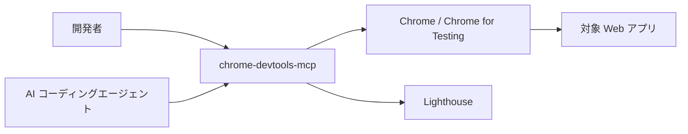
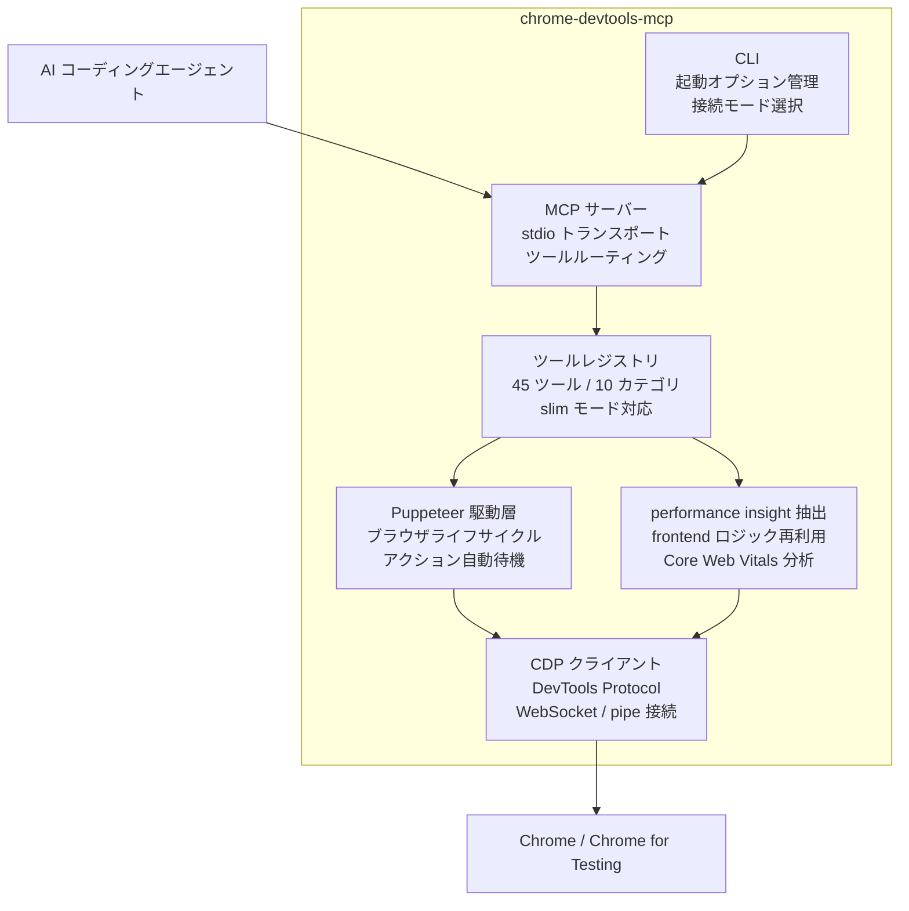
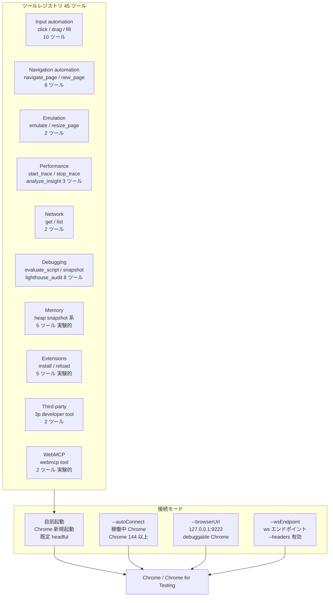
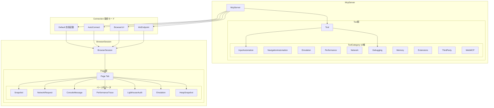
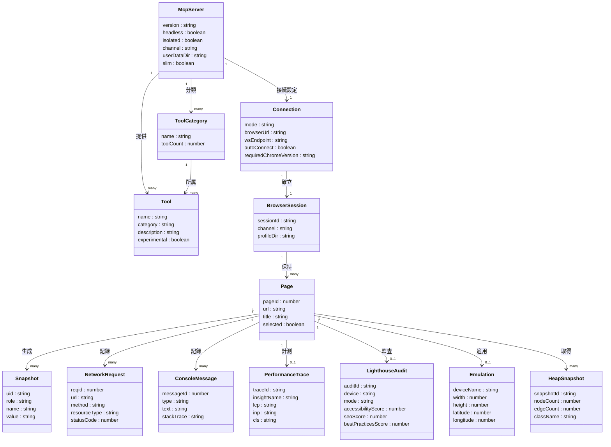

> 検証日: 2026-05-24 / 対象バージョン: v1.0.1（2026-05-18 リリース）/ 分類: Browser Automation / QA / Coding Agent

## 概要

「Chrome DevTools for agents」の実体は、Google Chrome チームが公開する MCP サーバー兼 CLI **`chrome-devtools-mcp`**（GitHub: `ChromeDevTools/chrome-devtools-mcp`、Apache-2.0）です。

公式はこのツールの問題意識を次のように表現しています。

> "Coding agents face a fundamental problem: they are not able to see what the code they generate actually does when it runs in the browser."

AI コーディングエージェントは、生成したコードがブラウザ上で実際にどう動くか見えません。この「目隠しプログラミング（coding blindfolded）」状態を解消する基盤が chrome-devtools-mcp です。エージェントが「コード修正 → ブラウザで自動検証」というフィードバックループを回せるようにします。

### 技術的な実体

内部アーキテクチャは 3 層で構成されます。

| レイヤ | 役割 |
|---|---|
| 操作レイヤ | Puppeteer でブラウザを自動操作し、アクション結果を自動待機 |
| 計測レイヤ | DevTools frontend のロジックを再利用してパフォーマンストレースを記録し、actionable な insight を抽出 |
| 接続プロトコル | Model Context Protocol (MCP) 経由でエージェントと接続。下層は Chrome DevTools Protocol (CDP) |

### プロダクト情報

| 項目 | 値 |
|---|---|
| リポジトリ | ChromeDevTools/chrome-devtools-mcp |
| ライセンス | Apache-2.0 |
| 初公開 | 2025-09-23（プレビュー） |
| stable 1.0 | 2026-05-18（v1.0.1 同日） |
| star 数 | 41,317（2026-05-23 時点） |
| Node.js 要件 | `^20.19.0 \|\| ^22.12.0 \|\| >=23` |
| 対応ブラウザ | Google Chrome と Chrome for Testing のみ |

v1.0.0 到達後も公式は「public preview」と明記しています。方針変更の可能性に注意してください。

### 「AI assistance パネル（Gemini in DevTools）」との違い

混同しやすいですが別物です。

| 観点 | chrome-devtools-mcp | AI assistance / Gemini in DevTools |
|---|---|---|
| 利用者 | 外部コーディングエージェント | DevTools を開いている人間の開発者 |
| アクセス方法 | MCP / CLI | DevTools パネル内（Settings で有効化） |
| 動作 | ライブ Chrome を外部から操作・計測 | パネル内で説明・助言を受ける |

## 特徴

### 1. 45 ツール / 10 カテゴリによる包括的な観測能力

エージェントが Chrome 上で行える操作は 4 系統に整理されます。

| 系統 | 内容 | 代表ツール |
|---|---|---|
| ユーザー体験のエミュレーション | レスポンシブ確認、ジオロケーション偽装、フォーム入力・クリックによるユーザーフロー再現 | Input automation (10) / Emulation (2) / Navigation (6) |
| ライブブラウザデバッグ | 稼働中 Chrome に接続し、コンソール・DOM・ネットワークをリアルタイムで inspect | Debugging (8) / Network (2) |
| Lighthouse 監査 | accessibility / SEO / best practices / agentic browsing の 4 カテゴリを自動評価（performance カテゴリは対象外） | `lighthouse_audit` |
| パフォーマンストレース | Core Web Vitals（LCP / INP / CLS）を計測し、actionable な insight を抽出 | Performance (3) |

実験的フラグで利用できる追加カテゴリとして、Memory（ヒープスナップショット）・Extensions（拡張機能デバッグ）・WebMCP があります。

### 2. 稼働中 Chrome への attach — 3 系統の接続方式

| モード | フラグ | 前提 | 用途 |
|---|---|---|---|
| 自前起動（既定） | `--headless` で切替 | headful が既定 | クリーン環境での検証 |
| 稼働中 Chrome へ attach | `--autoConnect` | Chrome 144 以上 | 認証済みタブ・拡張機能の状態を継承して検証 |
| URL / WS 接続 | `--browserUrl` / `--wsEndpoint` | 専用 user-data-dir 推奨 | サンドボックス・常駐 Chrome 運用 |

`--autoConnect` を使うと、エージェントがユーザーの認証済みセッションを引き継いで検証を実行できます。ただし公式 README も「リモートデバッグポートを開くと同一マシンの任意プロセスがブラウザを制御可能になる」と警告しています。セキュリティ上の配慮が必要です（ベストプラクティス節を参照）。

### 3. 複数エージェントへの対応

Antigravity 2.0 はブラウザ sub-agent としてプリバンドルされています。Claude Code・Codex・Gemini CLI は構築方法に示すコマンドで追加できます。特定エージェントに依存しない検証基盤として扱える点が特徴です。

### 4. 観測（debugging）の専門基盤という役割分担

公式の位置づけおよび複数の分析が一致して提示する整理軸は「Playwright MCP = 操作（driving）、chrome-devtools-mcp = 観測（debugging）」です。

> "What Playwright tells you is what happened from the user's perspective. What Chrome DevTools MCP tells you is why it happened from the browser's perspective."

### 競合ツールとの比較

定量比較（リポジトリ規模、2026-05-23 取得）:

| リポジトリ | star | 最終 push |
|---|---|---|
| ChromeDevTools/chrome-devtools-mcp | 41,317 | 2026-05-23 |
| microsoft/playwright-mcp | 32,926 | 2026-05-23 |
| browser-use/browser-use | 95,235 | 2026-05-23 |

機能比較:

| 観点 | chrome-devtools-mcp | Playwright MCP | browser-use |
|---|---|---|---|
| 実行方式 | Puppeteer + CDP（MCP 経由） | アクセシビリティツリー + element ref（MCP 経由） | LLM 駆動の自律エージェント |
| 主目的 | 観測・デバッグ・性能計測 | 操作・E2E 自動化 | 自律タスク遂行 |
| CI 適性 | 中（headful 前提、flaky リスクあり） | 高（headless 既定） | 低（LLM 駆動で非決定的） |
| 対応ブラウザ | Google Chrome / Chrome for Testing のみ | Chromium / Firefox / WebKit | Chromium 系 |
| 認証済みセッション継承 | `--autoConnect` で可 | 基本不可 | 永続プロファイルで可 |
| 性能・品質監査 | Lighthouse / Core Web Vitals / ヒープ分析 | なし | なし |

実務での推奨構成は競合ではなく補完関係です。詳細はベストプラクティス節の役割分担を参照してください。

## 構造

### システムコンテキスト図



| 要素名 | 説明 |
|---|---|
| 開発者 | MCP ツールを CLI 経由で直接呼び出す人間のユーザー |
| AI コーディングエージェント | MCP プロトコル経由で chrome-devtools-mcp に接続する外部エージェント（Claude Code / Codex / Gemini CLI 等） |
| chrome-devtools-mcp | AI エージェントと Chrome DevTools 能力を仲介する MCP サーバー兼 CLI |
| Chrome / Chrome for Testing | 唯一の公式対応ブラウザ。headful / headless 両モードで稼働 |
| 対象 Web アプリ | Chrome 上で動作する検証・計測・デバッグ対象のアプリケーション |
| Lighthouse | chrome-devtools-mcp が内部から呼び出す品質監査エンジン |

### コンテナ図



| 要素名 | 説明 |
|---|---|
| MCP サーバー | stdio トランスポートで MCP プロトコルを実装し、ツール登録とリクエストルーティングを担う。Mutex で単一スレッド実行を保証 |
| CLI | 起動フラグ（`--headless` / `--isolated` / `--channel` 等）とブラウザ接続モードを管理する設定層 |
| Puppeteer 駆動層 | Puppeteer インスタンスのライフサイクルを管理し、ブラウザ起動・接続・コンテキスト保持を行う |
| CDP クライアント | Chrome DevTools Protocol を介して Chrome に接続するクライアント層。Puppeteer の下層で動作し、pipe / WebSocket の両接続形態を扱う |
| performance insight 抽出 | `chrome-devtools-frontend` のロジックを再利用してトレースを解析し、LCP / INP / CLS 等の insight を抽出する |
| ツールレジストリ | 45 ツール・10 カテゴリを登録・公開する。`--slim` フラグで最小 3 ツールセットに絞り込み可能 |

### コンポーネント図



#### ツールカテゴリ

| 要素名 | 説明 |
|---|---|
| Input automation（10 ツール） | クリック・ドラッグ・フォーム入力・ダイアログ処理・キー操作・ファイルアップロード等、ユーザー操作を再現するツール群 |
| Navigation automation（6 ツール） | ページのナビゲーション・タブ管理・待機処理を行うツール群 |
| Emulation（2 ツール） | デバイスエミュレーションとビューポートリサイズ。レスポンシブ確認やジオロケーション偽装に使用 |
| Performance（3 ツール） | トレース記録の開始・停止と insight 分析。Core Web Vitals（LCP / INP / CLS）を計測する |
| Network（2 ツール） | ネットワークリクエストの一覧取得と個別リクエスト詳細の取得。CORS 問題の調査等に使用 |
| Debugging（8 ツール） | スクリプト評価・コンソールログ取得・Lighthouse 監査・スクリーンショット・スナップショット・画面録画を含むデバッグツール群 |
| Memory（5 ツール） | ヒープスナップショットの取得・詳細分析・リテイナー探索・クラス別ノード一覧。実験的フラグが必要 |
| Extensions（5 ツール） | Chrome 拡張機能のインストール・一覧・リロード・アクション実行・アンインストール。Chrome 149 リリース以前は pipe 接続モードのみ対応（autoConnect / browserUrl / wsEndpoint との併用は不可） |
| Third-party（2 ツール） | アプリが公開する外部開発者向けカスタムツールの一覧取得と実行 |
| WebMCP（2 ツール） | Web Model Context Protocol ツールの一覧取得と実行。実験的フラグが必要 |

#### 接続モード

| 要素名 | 説明 |
|---|---|
| 自前起動 | MCP サーバーが Chrome stable を新規起動するデフォルトモード。headful が既定で `--headless` で切替可能 |
| --autoConnect | Chrome 144 以上が必要。`chrome://inspect/#remote-debugging` でリモートデバッグを有効化した稼働中 Chrome に接続する |
| --browserUrl | `--remote-debugging-port=9222` で起動した Chrome の HTTP エンドポイントに接続するモード |
| --wsEndpoint | WebSocket エンドポイントで直接接続するモード。`--headers`（JSON）はこのモードでのみ有効 |

## データ

### 概念モデル



> 図中の `Tool` からカテゴリへの矢印は代表 2 カテゴリ（InputAutomation / Debugging）のみ描画しています。実際は全 10 カテゴリが同一の `ToolCategory` 配下で `McpServer` の単一ツールレジストリに属します。

### 情報モデル



### uid 体系の補足

`take_snapshot` は現在の Page の a11y ツリーを走査し、各インタラクティブ要素に **uid**（文字列）を付与して返します。uid は **スナップショット取得時点のみ有効**で、公式の操作指針は「Always use the latest snapshot」です。エージェントは uid を `click` / `fill` / `hover` / `drag` / `upload_file` の引数として渡します。これにより座標指定なしに要素を操作できます。座標指定の `click_at` は実験的フラグが別途必要です。

## 構築方法

### 前提条件

| 項目 | 要件 |
|---|---|
| Node.js | LTS バージョン（README は「Node.js LTS version」と記載）。package.json の engines は `^20.19.0 \|\| ^22.12.0 \|\| >=23` |
| ブラウザ | Google Chrome または Chrome for Testing のみ公式サポート |
| npm / npx | `npx -y chrome-devtools-mcp@latest` で都度最新版を取得するため、個別インストールは不要 |

### エージェント別セットアップ

#### Claude Code（MCP のみ）

```bash
claude mcp add chrome-devtools --scope user npx chrome-devtools-mcp@latest
```

#### Claude Code（Plugin 版 = MCP + Skills 同梱、推奨）

Claude Code のチャット画面で以下を順に実行します。

```
/plugin marketplace add ChromeDevTools/chrome-devtools-mcp
/plugin install chrome-devtools-mcp@chrome-devtools-plugins
```

インストール後に Claude Code を再起動し、`/skills` でロードされていることを確認してください。すでに MCP のみ版をインストール済みの場合は、プラグイン化の前に削除してください。

#### Codex

```bash
codex mcp add chrome-devtools -- npx chrome-devtools-mcp@latest
```

Windows 11 環境では `.codex/config.toml` に以下を追記します。

```toml
[mcp_servers.chrome-devtools]
command = "cmd"
args = ["/c", "npx", "-y", "chrome-devtools-mcp@latest"]
env = { SystemRoot="C:\\Windows", PROGRAMFILES="C:\\Program Files" }
startup_timeout_ms = 20_000
```

#### Gemini CLI

```bash
# MCP のみ（プロジェクト単位）
gemini mcp add chrome-devtools npx chrome-devtools-mcp@latest

# user スコープ
gemini mcp add -s user chrome-devtools npx chrome-devtools-mcp@latest

# Extension 版（MCP + Skills 同梱）
gemini extensions install --auto-update https://github.com/ChromeDevTools/chrome-devtools-mcp
```

### 接続モード

MCP サーバーが Chrome に接続する方法は複数あります。既定はサーバーが Chrome を自前で起動します。

| モード | フラグ（正式名 / エイリアス） | 前提・用途 |
|---|---|---|
| 自前起動（既定） | なし | MCP サーバーが Chrome stable を起動（既定は headful）。`--headless` で UI なし起動に切替 |
| 自動接続 | `--autoConnect` / `--auto-connect` | Chrome 144 以上必須。`chrome://inspect/#remote-debugging` でリモートデバッグを有効化し、起動済み Chrome に接続 |
| URL 接続 | `--browserUrl` / `--browser-url` / `-u` | `--remote-debugging-port=9222` で起動済みの Chrome に接続。サンドボックス環境向き |
| WebSocket 接続 | `--wsEndpoint` / `--ws-endpoint` / `-w` | `ws://127.0.0.1:9222/devtools/browser/<id>` で直結。`--browserUrl` の代替 |

> `--wsHeaders`（`--ws-headers`）フラグは `--wsEndpoint` との併用時のみ有効です。認証ヘッダを JSON で渡します。

URL 接続の Chrome 起動例（macOS）:

```bash
/Applications/Google\ Chrome.app/Contents/MacOS/Google\ Chrome \
  --remote-debugging-port=9222 \
  --user-data-dir=/tmp/chrome-profile-stable
```

MCP の設定例（`--browserUrl` を使う場合）:

```json
{
  "mcpServers": {
    "chrome-devtools": {
      "command": "npx",
      "args": ["-y", "chrome-devtools-mcp@latest", "--browserUrl=http://127.0.0.1:9222"]
    }
  }
}
```

### 主要フラグ一覧

| フラグ | 説明 |
|---|---|
| `--headless` | headless（UI なし）で起動。既定 false（headful）|
| `--isolated` | 一時 user-data-dir を作成し、ブラウザ終了後に自動削除。既定 false |
| `--channel` | 使用する Chrome channel（canary / dev / beta / stable）。既定 stable |
| `--executablePath` / `-e` | カスタム Chrome 実行ファイルのパス |
| `--userDataDir` | user data directory のパス。既定は `$HOME/.cache/chrome-devtools-mcp/chrome-profile-$CHANNEL` |
| `--viewport` | 初期 viewport サイズ（例: `1280x720`）。headless では最大 3840x2160 |
| `--proxyServer` | Chrome のプロキシ設定 |
| `--slim` | slim 専用の `navigate` / `evaluate` / `screenshot` の 3 ツールのみ公開する軽量モード（標準の `navigate_page` 等とは別名）|

テレメトリ制御:

| フラグ / 環境変数 | 内容 |
|---|---|
| `--no-usage-statistics` / env `CHROME_DEVTOOLS_MCP_NO_USAGE_STATISTICS` | 使用統計の送信を無効化 |
| env `CI` | CI 環境では使用統計を自動的に無効化 |
| `--no-performance-crux` | トレース URL の CrUX 送信を無効化 |

## 利用方法

### 必須パラメータ早見表

| ツール | 必須パラメータ | 備考 |
|---|---|---|
| `navigate_page` | `type`（url / back / forward / reload）。url の場合は `url` も指定 | ナビゲーションの種別を `type` で指定 |
| `click` | `uid` | `take_snapshot` で取得した要素 uid |
| `fill` | `uid`, `value` | フォーム入力。長いテキストの切り詰めに既知 Issue あり |
| `take_screenshot` | なし（オプション: `format`, `fullPage`） | png / jpeg / webp を返す |
| `take_snapshot` | なし | a11y tree ベースのスナップショット。uid 取得に使う |
| `performance_start_trace` | なし（オプション: `autoStop`, `reload`） | Core Web Vitals（LCP / INP / CLS）を記録 |
| `lighthouse_audit` | なし（オプション: `device`, `mode`, `outputDirPath`） | accessibility / SEO / best-practices / agentic browsing を評価（performance は除外） |
| `list_network_requests` | なし（オプション: `resourceTypes`） | リソース種別でフィルタ可 |

### 基本作法: take_snapshot で uid を取得してから操作する

エージェントが要素を操作する際の基本フローは次の通りです。

1. `take_snapshot` を呼び出してページの a11y ツリーを取得する
2. スナップショット内の各要素に付与された `uid` を確認する
3. `click` / `fill` / `hover` 等に `uid` を渡して操作する

`take_snapshot` はスクリーンショットよりもトークン効率が高く、要素の uid を確実に取得できます。視覚的な確認が必要な場合を除いて優先します。

### ナビゲーションと操作

```text
navigate_page(type="url", url="https://example.com")
navigate_page(type="reload")

take_snapshot()
→ uid: "s4e2" のリンクを確認

click(uid="s4e2")
fill(uid="s4e2", value="検索ワード")
```

### スクリーンショット取得

```text
take_screenshot(format="png", fullPage=true)
take_screenshot(uid="s4e2")
```

### パフォーマンストレース

ページ読み込みのパフォーマンスを計測します。LCP / INP / CLS を取得できます。

```text
performance_start_trace(reload=true)
performance_stop_trace()
performance_analyze_insight(insightName="LCPBreakdown", insightSetId="<trace_result_id>")
```

`performance_analyze_insight` は `insightName` と `insightSetId` の両方が必須です。`insightSetId` はトレース結果に含まれる ID を渡します。

> 注: `lighthouse_audit` は **performance カテゴリを評価しません**。パフォーマンス計測はトレース系ツールを使用します。

### Lighthouse 監査

```text
lighthouse_audit(
  device="desktop",
  mode="navigation"
)
```

- 評価対象は accessibility / SEO / best-practices / agentic browsing の 4 観点で、performance は除外されます（カテゴリ選択パラメータはなく、ツールが上記観点を一括評価します）
- `device`: `desktop` または `mobile`
- `mode`: `navigation` または `snapshot`
- `outputDirPath`: 監査結果の出力先ディレクトリ

### ネットワークリクエスト確認

```text
list_network_requests(resourceTypes=["fetch", "xhr"])
```

`resourceTypes` を省略するとすべてのリクエストを返します。詳細は `get_network_request` で取得できます。

## 運用

### 稼働中 Chrome への attach 運用

常駐 Chrome に CDP で接続する方式は、認証済みセッションや拡張機能の状態を引き継いで検証できる点で実用的です。接続方法は 2 系統あります。

**`--autoConnect`（Chrome 144 以降推奨）**

```json
{
  "mcpServers": {
    "chrome-devtools": {
      "command": "npx",
      "args": ["-y", "chrome-devtools-mcp@latest", "--autoConnect"]
    }
  }
}
```

Chrome 側で `chrome://inspect/#remote-debugging` を開いてリモートデバッグを有効化し、許可ダイアログを承認します。MCP 側はブラウザを起動せず、起動済みの Chrome に接続します。

**`--browserUrl`（リモートデバッグポート指定）**

```bash
# macOS
/Applications/Google\ Chrome.app/Contents/MacOS/Google\ Chrome \
  --remote-debugging-port=9222 \
  --user-data-dir=/tmp/chrome-profile-dev
```

Chrome を専用の `--user-data-dir` 付きで起動し、セキュリティ上のリスクを分離します。

### headful 前提のための CI 組み込みと使い分け

chrome-devtools-mcp の既定動作は headful（GUI あり）です。CI 環境でそのまま実行すると画面が存在せずブラウザ起動に失敗します。

| モード | フラグ | 用途 | 注意 |
|---|---|---|---|
| headful（既定） | なし | 開発者手元でのライブデバッグ・状態共有 | CI 不可。#1914（macOS freeze）に注意 |
| ヘッドレス | `--headless` | 軽量な UI 検証・スクリーンショット取得 | `--viewport` 最大 3840×2160 |
| 使い捨てプロファイル | `--isolated` | クリーンな検証・Cookie 汚染防止 | セッション状態は引き継がない |
| 固定プロファイル | `--userDataDir=<path>` | セッション継続が必要な検証 | user-data-dir を個別に管理する |

CI に組み込む場合の構成例:

```json
{
  "mcpServers": {
    "chrome-devtools": {
      "command": "npx",
      "args": ["-y", "chrome-devtools-mcp@latest", "--headless", "--isolated", "--slim"]
    }
  }
}
```

ただし CI への常設組み込みには不安定性（Issue #1921 / #1914、後述）が障壁になります。決定論的な回帰テストは Playwright に任せ、chrome-devtools-mcp は開発ループ内の観測専用と位置づける役割分担が現実的です。

### トークン消費の管理

デフォルトスキーマは全 45 ツールのメタデータを含み、ツール発見のたびにコンテキストを消費します（Issue #340 で公式に認識済み）。対策の `--slim` フラグは slim 専用の `navigate` / `evaluate` / `screenshot` の 3 ツールに絞り、コンテキスト消費を抑えます。

```bash
# --slim: 3 ツールのみ
npx -y chrome-devtools-mcp@latest --slim --headless
```

複数 MCP を並列利用する構成では `--slim` の利用を推奨します。

## ベストプラクティス

### セキュリティ — リモートデバッグポートの二重リスクを理解する

**誤解**: `--autoConnect` や `--browserUrl=:9222` で常駐 Chrome に接続しても、セキュリティリスクは軽微である。

**反証（公式 README の自認）**:

> "Enabling the remote debugging port opens up a debugging port on the running browser instance. Any application on your machine can connect to this port and control the browser."

- `:9222` を開いたまま常駐させると、同一マシン上の任意プロセスがブラウザ全体を制御できます。
- DOM / コンソール / ネットワーク応答は出力サニタイズなしでモデルコンテキストに渡ります。悪意あるページに埋め込まれた指示が LLM の行動空間に直結します（Web 由来 prompt injection）。
- Issue #1247（CLOSED, セキュリティ監査）でツール記述インジェクションと出力サニタイズ欠如が指摘されています。独立監査（stacklok/dockyard #407）でも critical 問題として報告されています。

**推奨**:

- 認証情報・Cookie を含む本番プロファイルは絶対に共有しない。
- `--isolated`（使い捨て user-data-dir）または専用の非認証プロファイルで運用する。
- 信頼できないサイトを MCP セッション中に開かない。

```bash
# 安全な運用例: 専用プロファイル + ヘッドレス + isolated
npx -y chrome-devtools-mcp@latest --headless --isolated
```

### 検証の役割分担 — 観測・行動・証跡の 3 レイヤ

**誤解**: chrome-devtools-mcp だけで CI 回帰テストまで完結できる。

**反証**: 複数の二次分析（Steve Kinney・test-lab.ai 等、参考リンク参照）が「chrome-devtools-mcp は observe に最適化、Playwright は act に最適化」と整理しています。WebKit を駆動できず test runner を所有しないため、クロスブラウザの決定論的回帰テストは不得手です。

**推奨（役割分担）**:

| レイヤ | ツール | 担当 |
|---|---|---|
| ループ内の自己検証（観測） | chrome-devtools-mcp | Lighthouse / 性能トレース / ネットワーク / ライブデバッグ |
| CI 常設の決定論的回帰 | Playwright MCP / CLI | クロスブラウザ E2E、再現性保証 |
| 人間レビュー用の証跡 | スクショ / Lighthouse スコア / コンソールログ | 「動いた」の可視化と監査証跡 |

### 自己申告化の防止 — エージェントの「検証した」を鵜呑みにしない

**誤解**: エージェントに「完了条件にブラウザ検証を含める」と指示すれば必ず実行される。

**反証**: Issue #940（OPEN）で「明示指示なしでは MCP ツールを自動起動しない」ことが確認されています。エージェントが MCP ツールを呼んでも誤用により検証が失敗し、そのまま完了報告する事例も公式 eval で報告されています。

**推奨**:

- 完了条件にブラウザ検証ツールの呼び出しを明示的に記述する（「`take_screenshot` / `lighthouse_audit` を実行して結果ファイルを添付すること」等）。
- スクリーンショット・Lighthouse JSON・コンソールログを成果物として要求し、人間がレビューできる状態にする。
- 「検証しました」報告は証跡ファイルで裏付けるまで承認しない運用にする。

### Storybook を完了条件の対象に含める

コンポーネント単位の自律監査を chrome-devtools-mcp で実現する事例として、CyberAgent の Spindle デザインシステムの取り組みが報告されています（二次情報、定量値は未確認）。Storybook を `:6006` で起動し MCP 経由で各 story を Lighthouse 監査する構成は、コンポーネント数の増加に比例してスケールします。

```bash
# Storybook を起動した状態で接続する例
npx -y chrome-devtools-mcp@latest --browserUrl=http://localhost:6006
```

`CLAUDE.md` 等に既定デバッグサーバとして Storybook URL を明記し、完了条件に「各 story の Lighthouse accessibility スコアが閾値以上」を加えることで制度化できます（二次情報に基づく推奨）。

## トラブルシューティング

### 症状 → 原因 → 対処 一覧

| 症状 | 原因 | 対処 |
|---|---|---|
| ツール呼び出しでブラウザがハング / クラッシュする | 多数タブの Chrome に接続すると全 page-target に CDP セッションを張り負荷でブラウザが停止する（#1921） | タブを絞るか、専用プロファイル（タブゼロ）で接続する。`--isolated` で使い捨てプロファイルを使う |
| macOS で headful 起動時にクライアントがフリーズする | headed モードで Chrome を MCP から起動すると macOS でフリーズすることがある（#1914、起因不明） | `--headless` に切り替えるか、Chrome を先に手動起動して `--autoConnect` / `--browserUrl` で接続する |
| Claude Code CLI から 2 つ目の Chrome インスタンスを起動できない | Claude Code CLI 環境固有の制約（#2052） | 1 インスタンスに絞るか、手動起動した Chrome に `--browserUrl` で接続する |
| エージェントが MCP ツールを呼ばずに「検証した」と申告する | 明示指示しないとエージェントがツールを自動起動しない（#940） | プロンプトに「`take_screenshot` を実行して添付せよ」等、ツール名を明示する |
| トークン上限に近づき会話が途切れる | 全 45 ツールのスキーマをデフォルトでロードしコンテキストを圧迫する（#340） | `--slim` フラグで 3 ツールに絞る |

### 既知 Issue 一覧（2026-05-24 時点）

> Issue 番号・状態は `gh issue view <番号> --repo ChromeDevTools/chrome-devtools-mcp` で再確認を推奨します。

| # | 状態 | 症状 | URL |
|---|---|---|---|
| #1921 | OPEN | 多数タブの Chrome に接続するとハング/クラッシュ | https://github.com/ChromeDevTools/chrome-devtools-mcp/issues/1921 |
| #1914 | OPEN | headful 起動で macOS クライアントがフリーズ | https://github.com/ChromeDevTools/chrome-devtools-mcp/issues/1914 |
| #2052 | OPEN | Claude Code CLI で 2 つ目の Chrome を起動できない | https://github.com/ChromeDevTools/chrome-devtools-mcp/issues/2052 |
| #940 | OPEN | 明示指示なしでは MCP ツールを自動起動しない | https://github.com/ChromeDevTools/chrome-devtools-mcp/issues/940 |
| #340 | CLOSED | ツールスキーマ冗長によるトークン過消費 → `--slim` で対処 | https://github.com/ChromeDevTools/chrome-devtools-mcp/issues/340 |
| #1247 | CLOSED | セキュリティ監査（ツール記述インジェクション） | https://github.com/ChromeDevTools/chrome-devtools-mcp/issues/1247 |

## まとめ

chrome-devtools-mcp は、AI コーディングエージェントに「生成したコードがブラウザでどう動くか」を観測させる MCP サーバー兼 CLI です。Playwright MCP（操作）と役割分担しつつ、Lighthouse 監査・Core Web Vitals 計測・ライブデバッグを開発ループ内の自己検証に組み込めます。リモートデバッグポートのセキュリティリスクと「検証したと自己申告する」問題を理解し、証跡ファイルで裏付ける運用が前提になります。

この記事が少しでも参考になった、あるいは改善点などがあれば、ぜひリアクションやコメント、SNSでのシェアをいただけると励みになります！

## 参考リンク

- 公式ドキュメント
  - [Chrome DevTools for agents（Chrome for Developers 公式）](https://developer.chrome.com/docs/devtools/agents)
  - [Chrome DevTools (MCP) for your AI agent（2025-09-23 発表ブログ）](https://developer.chrome.com/blog/chrome-devtools-mcp)
  - [Streamline your AI coding workflow with Chrome DevTools for agents 1.0（2026-05-19）](https://developer.chrome.com/blog/devtools-for-agents-v1)
  - [Get started with Chrome DevTools for agents](https://developer.chrome.com/docs/devtools/agents/get-started)
  - [Chrome リモートデバッグ](https://developer.chrome.com/docs/devtools/remote-debugging/)
- GitHub
  - [ChromeDevTools/chrome-devtools-mcp](https://github.com/ChromeDevTools/chrome-devtools-mcp)
  - [docs/tool-reference.md（v1.0.1）](https://github.com/ChromeDevTools/chrome-devtools-mcp/blob/main/docs/tool-reference.md)
  - [docs/cli.md](https://github.com/ChromeDevTools/chrome-devtools-mcp/blob/main/docs/cli.md)
  - [microsoft/playwright-mcp](https://github.com/microsoft/playwright-mcp)
  - [browser-use/browser-use](https://github.com/browser-use/browser-use)
  - [Issue #1247（セキュリティ監査）](https://github.com/ChromeDevTools/chrome-devtools-mcp/issues/1247)
  - [stacklok/dockyard #407（独立セキュリティ監査）](https://github.com/stacklok/dockyard/issues/407)
- 記事
  - [deepwiki: ChromeDevTools/chrome-devtools-mcp](https://deepwiki.com/ChromeDevTools/chrome-devtools-mcp)
  - [npm: chrome-devtools-mcp](https://www.npmjs.com/package/chrome-devtools-mcp)
  - [Steve Kinney 比較記事（二次情報）](https://stevekinney.com/courses/self-testing-ai-agents/runtime-tools-compared)
  - [test-lab.ai 比較記事（二次情報）](https://www.test-lab.ai/blog/chrome-devtools-mcp-vs-playwright-mcp-cli)
