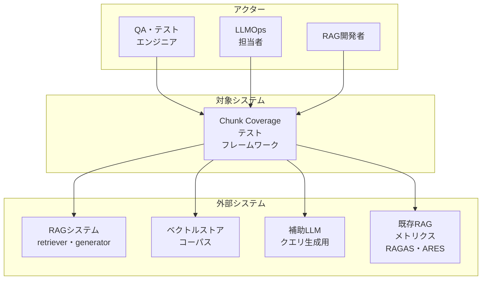
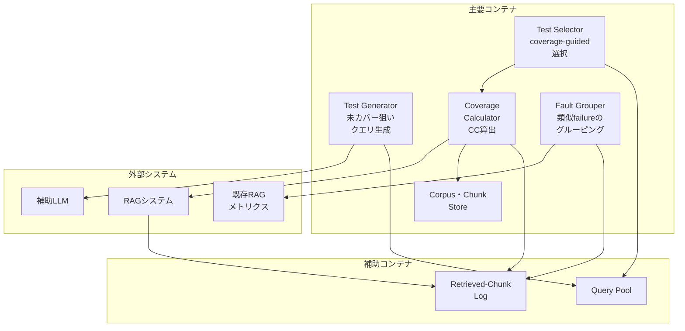
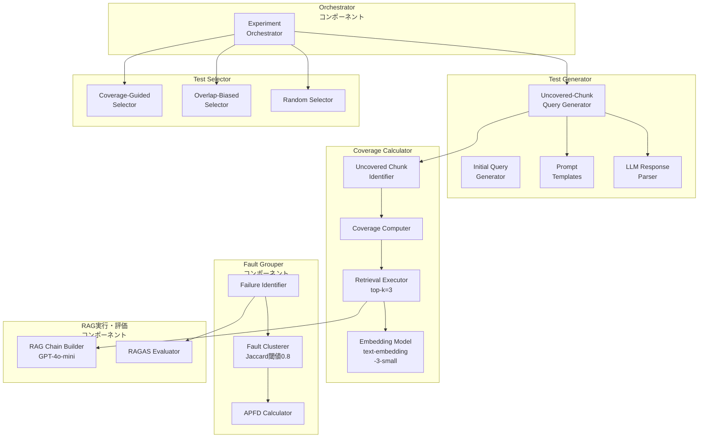
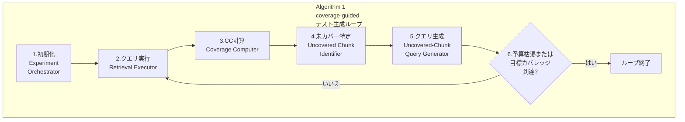
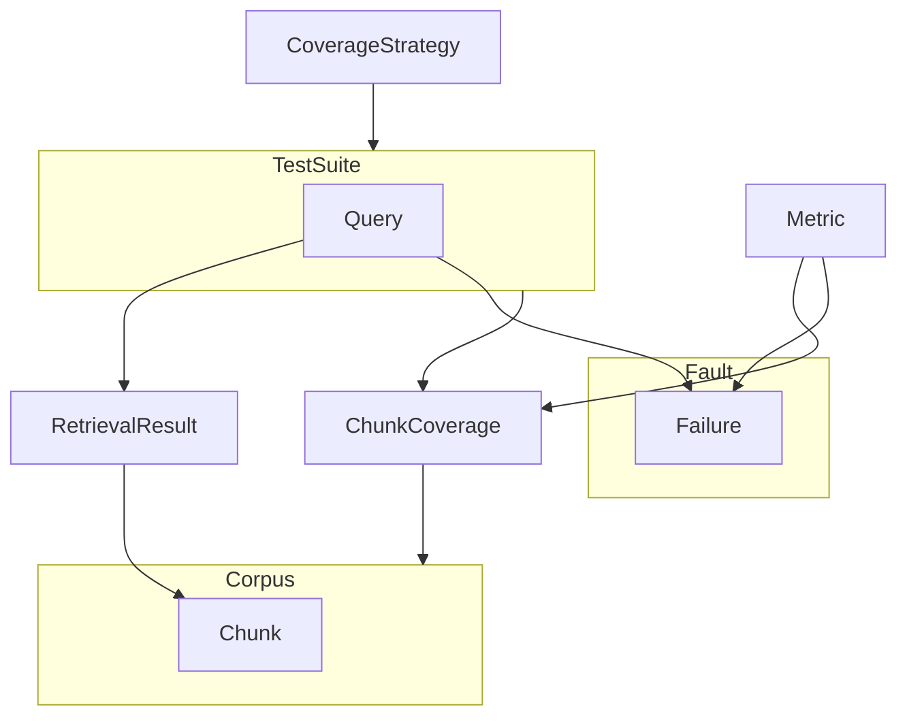
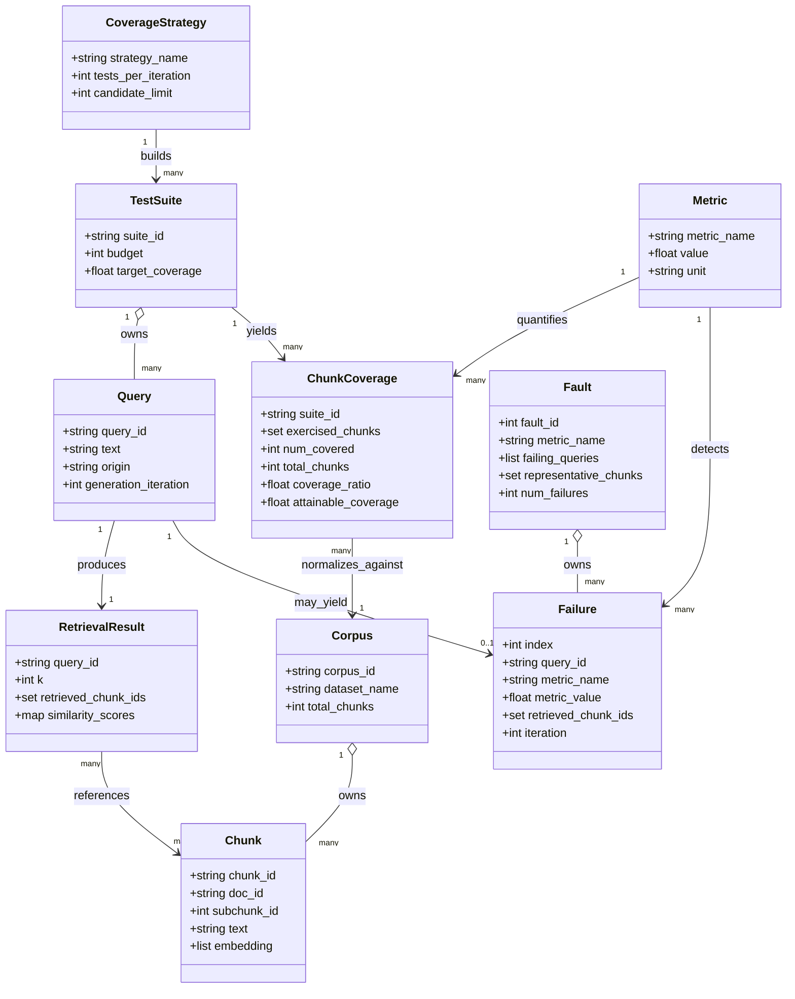
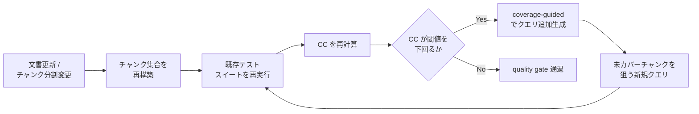

> RAG（Retrieval-Augmented Generation）のテストは、クエリ単位で回答の質を測る指標に偏ってきました。本稿は、正解データを使わずに「テストスイートが検索空間のどこに触れていないか」を測る新しいテスト十分性基準 **Chunk Coverage（CC）** を、ISSTA 2026 採録論文と公開実装から構造化して解説します。既存の RAGAS/ARES を置き換えるのではなく、検索網羅性という別軸を足す考え方と、CI/CD の回帰試験設計への落とし込みまで扱います。

> 検証日: 2026-07-22 ／ 対象: 論文 "Testing Retrieval-Augmented Generation Systems with Chunk Coverage"（Jinhan Kim, Samuele Pasini, Paolo Tonella / Università della Svizzera italiana, Lugano・ISSTA 2026 採録・arXiv:2607.18155、提出 2026-07-20） ／ 公開実装 [dbr7/issta26-chunk-coverage-artifact](https://github.com/dbr7/issta26-chunk-coverage-artifact)

## 概要

### 何を解決するか

RAG（Retrieval-Augmented Generation）システムのテストは、これまで「回答がどれだけ正しいか」を測る per-query メトリクスに頼ってきました。論文は既存指標として RAGAS と ARES を挙げます。加えて、一般的な情報検索（IR）評価では Recall@k や nDCG も使われます（本記事の補足であり、論文自体の言及ではありません）。これらはいずれも 1 つのクエリに対する回答・検索の質を採点する指標です。

論文はこの前提に次の限界があると指摘します。

> "A test suite may achieve strong average evaluation scores while repeatedly retrieving the same small subset of popular documents, leaving large portions of the corpus effectively untested."

つまり、テストスイート全体としての平均スコアが高くても、検索器がコーパスのごく一部だけを繰り返し引き当てている可能性を、既存指標は検出できません。原因は次の点にあります。

> "This gap arises because current evaluation practices focus on per-query outcomes, while retrieval behaviour is inherently a suite-level phenomenon."

この「見えない盲点」を埋めるために、論文は **Chunk Coverage（CC）** を提案します。CC は、テストスイート全体で少なくとも 1 回検索されたコーパスチャンクの割合として定義される、**oracle-independent な test adequacy criterion（テスト十分性基準）** です。

$$CC(T) = \frac{|\bigcup_{q \in T} R_k(q)|}{|\mathcal{C}|}$$

（$R_k(q)$: クエリ $q$ の top-k 検索チャンク集合、$\mathcal{C}$: コーパス全チャンク集合）

CC は正解データ（ground-truth relevance annotation や参照回答）を一切必要とせず、検索トレースのみから計算できます。

> "Importantly, CC is oracle-independent: it requires neither ground-truth relevance annotations nor reference answers, and can be computed solely from retrieval traces."

### 学術的位置づけ

CC は「回答品質を測る」既存指標を置き換えるものではありません。回答品質とは異なる軸——検索コンポーネントがどれだけ網羅的に運動させられたか——を測ります。

> "It is not intended to detect faults or replace per-query evaluation metrics."

この位置づけにより、CC は RAGAS/ARES と競合せず補完します。RAGAS/ARES が「個々のクエリでどれだけうまく動くか」を測るのに対し、CC は「テストスイートが検索空間をどれだけ動かしたか」を測ります。

論文はソフトウェアテスト分野の test adequacy criterion の系譜に CC を位置づけます。従来のコードカバレッジ（statement / branch / path coverage）に始まり、深層学習テスト分野で提案された DeepXplore / DeepGauge 等のモデル内部カバレッジ（neuron coverage 等）を経て、CC は「外部から観測できる検索チャンク」という新しい対象に構造カバレッジの発想を適用した点が独自性です。

> "CC follows the same structural-adequacy principle but covers externally retrieved chunks rather than program structures or model-internal activations."

## 特徴

- **oracle 不要（oracle-independent）**: 正解データ・参照回答なしで、検索トレースだけから計算できます。
- **構造カバレッジ**: 回答の正誤ではなく、検索空間（コーパスチャンク集合）がどれだけ網羅されたかを測ります。
- **suite-level の指標**: 1 クエリ単位でなく、テストスイート全体を単位に評価します。
- **coverage-guided なテスト生成**: 未カバーチャンクを狙って補助 LLM が新規クエリを生成し、増分カバレッジを最大化します（Algorithm 1）。
- **attainable coverage（到達可能カバレッジ）**: 与えられたチャンク分割と利用可能クエリ集合のもとで達成できる CC の理論上限を定義します（例: MIMIC-IV 25.42%、VQAonBD 38.33%）。
- **fault グルーピング**: 検索チャンク集合の Jaccard 類似度が 0.8 を超える failure 群を同一 fault として集約し、failure（メトリクス上の逸脱の観測）と fault（根本原因の単位）を区別します。
- **多様性指標との強い相関**: CC はエントロピー（平均 r=0.853）と強い正相関、Gini 係数（平均 r=-0.881）と強い負相関を示します。
- **回帰試験設計への応用**: 文書追加時に未検索領域を優先してテストクエリを設計する土台になります。
- **既存指標を置き換えない**: fault 検出や per-query 評価の代替ではなく、これらと並走する別軸の基準です。

### ソフトウェアテストの「コードカバレッジ」との類推

論文は CC を明示的に、従来ソフトウェアにおけるコードカバレッジのアナロジーとして位置づけています。

| 対応関係 | 従来のコードカバレッジ | Chunk Coverage |
|---|---|---|
| 対象 | プログラムの構造（文・分岐・パス） | 検索対象コーパスのチャンク |
| 測るもの | テストが構造をどれだけ実行したか | テストスイートが検索空間をどれだけ引き当てたか |
| 判定材料 | 出力の正誤とは独立 | 回答の正誤とは独立 |
| 用途 | 未実行コードの発見・追加テスト設計 | 未検索チャンクの発見・追加テストクエリ設計 |
| 限界 | 未実行イコールバグとは限らない | 未検索チャンク全てが追加テスト必須とは限らない |

> "From a software testing perspective, CC plays a role analogous to code coverage in traditional programs."

> "As with traditional code coverage, not all uncovered elements necessarily warrant additional testing."

### 既存 RAG 評価手法との比較

| 比較項目 | RAGAS / ARES | Recall@k / nDCG | Chunk Coverage |
|---|---|---|---|
| 正解データ要否 | 必要（Faithfulness 等は生成品質の参照が前提） | 必要（正解の関連文書ラベルが前提） | 不要（oracle-independent） |
| 測定単位 | per-query | per-query | suite-level（テストスイート全体） |
| 何を測るか | 回答品質・検索結果の関連性（クエリ単位） | 検索結果の精度・順位品質（クエリ単位） | 検索空間の網羅性（構造カバレッジ） |
| 代表手法 | RAGAS の Context Precision / Context Relevance / Response Relevancy / Faithfulness、ARES | Recall@k、nDCG | Chunk Coverage（CC） |

公開実装は artifact リポジトリ [dbr7/issta26-chunk-coverage-artifact](https://github.com/dbr7/issta26-chunk-coverage-artifact) として提供されており、CC 算出・coverage-guided テスト生成（RQ1〜RQ3 の実験スクリプト）・財務ドメイン（ConvFinQA / FinQA / TAT-DQA / VQAonBD）と医療ドメイン（MIMIC-IV）のデータ・プロンプトを含みます。

## 構造

論文には Figure 1（RAG の一般的な処理概観）と Figure 2（Chunk Coverage を使ったテスト生成フロー）がありますが、C4 モデルのシステムコンテキスト・コンテナ・コンポーネントの 3 階層には分解されていません。本セクションでは、論文 §3（Chunk Coverage の定義・生成アルゴリズム）と §4（実験セットアップ）の記載、および公開実装 [dbr7/issta26-chunk-coverage-artifact](https://github.com/dbr7/issta26-chunk-coverage-artifact) のコード構成（`utils.py` / `run_finance_rq2_rq3_experiments.py` / `run_medical_llm_testgen_experiments.py` / `analyze_faults.py`）を突き合わせ、「提案フレームワークの論理構造」として C4 モデルの 3 段階に読み替えます。具体的な製品名・ツール名は、コンポーネント図でのみ使用します。

### システムコンテキスト図

Chunk Coverage テストフレームワークを中心に、利用者（アクター）と外部システムとの関係を示します。



#### アクター

| 要素名 | 説明 |
|---|---|
| QA・テストエンジニア | テストスイートを実行し、Chunk Coverage の到達度を確認する |
| LLMOps担当者 | 文書追加時の回帰試験や、リリース判定の材料として CC を利用する |
| RAG開発者 | 未カバー領域の解析結果を受け取り、チャンク分割やコーパス設計を見直す |

#### 対象システム

| 要素名 | 説明 |
|---|---|
| Chunk Coverageテストフレームワーク | oracle 非依存のテスト十分性基準（CC）を軸に、テスト選択・生成・fault 分析までを担う本体 |

#### 外部システム

| 要素名 | 説明 |
|---|---|
| RAGシステム（retriever・generator） | フレームワークが駆動する被試験対象。クエリに対して top-k チャンクを検索し回答を生成する |
| ベクトルストア・コーパス | チャンク分割済みの全文書集合。CC の分母（全チャンク集合 𝒞）を提供する |
| 補助LLM（クエリ生成用） | 未カバーチャンクを狙った新規クエリを生成する、フレームワーク専用の LLM 呼び出し先 |
| 既存RAGメトリクス（RAGAS・ARES） | per-query の品質スコアを提供し、failure 判定の入力として使われる |

### コンテナ図

フレームワーク本体を構成する主要コンテナ（論文 §3 に対応）と、それを支える補助コンテナを示します。



#### 主要コンテナ

| 要素名 | 説明 |
|---|---|
| Test Generator | 未カバーチャンクを狙って新規クエリを生成する。補助 LLM を呼び出す |
| Test Selector | クエリプールから次に実行するテストを選ぶ。coverage-guided／overlap-biased／random の 3 戦略を持つ |
| Coverage Calculator | 現在のテストスイートに対する CC(T) を算出し、未カバーチャンクを特定する |
| Fault Grouper | RAG メトリクスから failure を判定し、検索チャンク集合の類似度で fault にグルーピングする |
| Corpus・Chunk Store | チャンク分割済みコーパス全体を保持し、全チャンク集合（CC の分母）を提供する |

#### 補助コンテナ

| 要素名 | 説明 |
|---|---|
| Query Pool | 初期クエリと生成済みクエリを蓄積するプール。Test Selector と Test Generator が共有する |
| Retrieved-Chunk Log | 実行済みクエリごとの検索結果（チャンク ID 集合）を記録するログ。CC 算出と fault 判定の両方が参照する |

#### 外部システム

| 要素名 | 説明 |
|---|---|
| RAGシステム | Coverage Calculator がクエリを投げ、top-k 検索結果を取得する対象 |
| 補助LLM | Test Generator が未カバーチャンク向けクエリ生成を依頼する対象 |
| 既存RAGメトリクス | Fault Grouper が failure 判定の材料として値を取得する対象 |

### コンポーネント図

各コンテナをドリルダウンし、artifact のコード構成（クラス・関数単位）に対応させます。



#### Test Generator コンポーネント

| 要素名 | 説明 |
|---|---|
| Initial Query Generator | クエリ未提供のデータセット（MIMIC-IV など）向けに、初期クエリプールを LLM で生成する（`generate_initial_queries` 相当） |
| Uncovered-Chunk Query Generator | Algorithm 1 のステップ 5 に対応。未カバーチャンクの内容を渡し、それを狙う新規クエリを補助 LLM に生成させる（`generate_queries_for_uncovered_chunks` 相当） |
| Prompt Templates | 通常のクエリ生成用と、未カバーチャンク狙い専用の 2 種のプロンプトテンプレートを保持する（`testgen_system` / `testgen_system_uncovered_chunks` 相当） |
| LLM Response Parser | 補助 LLM の生出力から生成クエリのリストを構造化データとして取り出す（`parse_testgen_response_list` 相当） |

#### Test Selector コンポーネント

| 要素名 | 説明 |
|---|---|
| Coverage-Guided Selector | 候補クエリのうち、現時点の未カバーチャンクへの追加カバレッジが最大のものを貪欲に選ぶ（`select_coverage_guided` 相当） |
| Overlap-Biased Selector | 既カバー領域との重複が大きいクエリをあえて選ぶ、比較用ベースライン（`select_overlap_biased` 相当） |
| Random Selector | クエリプールから一様サンプリングする、比較用ベースライン（`select_random` 相当） |

#### Coverage Calculator コンポーネント

| 要素名 | 説明 |
|---|---|
| Retrieval Executor | top-k=3 の設定で RAG システムにクエリを投げ、検索チャンクを取得する（`compute_query_retrievals` 相当） |
| Coverage Computer | 選択済みテスト集合の和集合から CC(T) を算出する（`compute_coverage` 相当） |
| Uncovered Chunk Identifier | Algorithm 1 のステップ 4 に対応。全チャンク集合から既カバー分を差し引き、未カバーチャンクとその本文を特定する（`get_uncovered_chunks` 相当） |
| Embedding Model | text-embedding-3-small でチャンクとクエリをベクトル化し、検索の基盤を提供する |

#### Fault Grouper コンポーネント

| 要素名 | 説明 |
|---|---|
| Failure Identifier | RAGAS メトリクスが極端な値（ゼロなど）を示すクエリを failure として検出する（`identify_failures` 相当） |
| Fault Clusterer | failure 同士の検索チャンク集合の Jaccard 類似度が 0.8 を超える場合、同一 fault として集約する（`cluster_failures_into_faults` 相当） |
| APFD Calculator | fault 検出の早さを APFD（Average Percentage of Faults Detected）として算出する（`compute_apfd` 相当） |

#### RAG実行・評価 コンポーネント

| 要素名 | 説明 |
|---|---|
| RAG Chain Builder | GPT-4o-mini を用いて検索結果から回答を生成する RAG チェーンを構築する（`build_rag_chain` / `build_agent_chain` 相当） |
| RAGAS Evaluator | 生成された回答と検索結果を RAGAS 指標（faithfulness・context precision 等）で評価する（`evaluate_with_ragas` 相当） |

#### Orchestrator コンポーネント

| 要素名 | 説明 |
|---|---|
| Experiment Orchestrator | テスト選択戦略を 1 つ選び、予算・目標カバレッジに達するまで検索実行→カバレッジ計算→未カバー特定→クエリ生成のループを制御する（`run_experiment` 相当。次項の Algorithm 1 ループの起点） |

#### Algorithm 1: coverage-guided テスト生成ループ

論文 §3 記載のアルゴリズムを、上記コンポーネントの相互作用として表現します（論文 Figure 2 も同種のループを図示しています）。



| 要素名 | 説明 |
|---|---|
| 1.初期化 | Experiment Orchestrator がテストスイート T と既カバーチャンク集合 E を初期状態に設定する |
| 2.クエリ実行 | Retrieval Executor が選択済みクエリを RAG システムに投げ、検索チャンクを記録する |
| 3.CC計算 | Coverage Computer が記録済みチャンクの和集合から、既カバー集合の大きさをコーパス総数で割って CC(T) を算出する |
| 4.未カバー特定 | Uncovered Chunk Identifier が全チャンク集合から既カバー分を差し引き、未カバーチャンク集合を求める |
| 5.クエリ生成 | Uncovered-Chunk Query Generator が未カバー集合内のチャンクを狙う新規クエリを補助 LLM で生成し、テストスイート T に追加する |
| 6.予算枯渇または目標カバレッジ到達? | 判定が「いいえ」ならステップ 2 に戻って反復、「はい」ならループを終了する |

## データ

Chunk Coverage 論文（§3 定義・§4 実験設定）と公開実装 `issta26-chunk-coverage-artifact` から、提案手法が扱うエンティティを概念モデルと情報モデルに整理します。

### 概念モデル



| 要素名 | 説明 |
|---|---|
| Corpus | 埋め込み対象のドキュメント群を分割した全チャンク集合。Chunk を所有する |
| Chunk | コーパスを構成する最小テキスト単位。Corpus の一部として存在する |
| Query | テストケースとなる検索クエリ。実データ由来（predefined test queries）と補助 LLM 生成（GenerateQueries）の 2 種がある |
| TestSuite | Query の集合。Query を所有し、CoverageStrategy によって構築される |
| RetrievalResult | Query 実行によって得られる top-k 検索結果。Chunk を参照する |
| ChunkCoverage | TestSuite 全体を対象に算出する suite-level 網羅率。Corpus の総数で正規化する |
| Failure | 個々の Query が RAG 評価メトリクスで閾値以下となった観測結果。Fault の要素になり得る |
| Fault | Jaccard 類似度でグルーピングした Failure の同値クラス。Failure を所有する |
| Metric | CC・entropy・Gini・Jaccard・APFD など、ChunkCoverage と Failure/Fault を定量化する指標群 |
| CoverageStrategy | TestSuite を構築する選択則（coverage-guided / overlap-biased / random） |

### 情報モデル



| 要素名 | 主要属性の要点 |
|---|---|
| Corpus | データセット名（MIMIC-IV / ConvFinQA / FinQA / TAT-DQA / VQAonBD）とチャンク総数を持つ |
| Chunk | text-embedding-3-small で埋め込んだベクトルとテキストを保持。chunk_id + subchunk_id で一意化する |
| Query | text（質問文）に加え、由来（origin）と生成時のイテレーション番号を持つ |
| TestSuite | budget（テスト予算）と target_coverage（目標カバレッジ）を Algorithm 1 の入力として保持する |
| RetrievalResult | k（top-k、評価では 3）と検索チャンク ID 集合、類似度スコアを持つ |
| ChunkCoverage | exercised_chunks・num_covered・coverage_ratio（CC）に加え、データセット依存の attainable_coverage 上限を持つ |
| Failure | 失敗を検知したメトリクス名・値・その時点の検索チャンク集合・検知イテレーションを持つ |
| Fault | Jaccard 類似度 0.8 でグルーピングした Failure リストと、代表チャンク集合を持つ |
| Metric | metric_name（CC / entropy / gini / avg_jaccard / APFD）と値、単位（nats/bits/ratio 等）を持つ |
| CoverageStrategy | 戦略名と、1 反復あたりの選択テスト数・候補プール上限を持つ |

> **論文記述からの推測 / artifact 実装からの補完**: `Chunk.doc_id` / `subchunk_id` は artifact の `chunk_key(chunk_id, subchunk_id)` およびベクトルストア構築処理から補完しました。`ChunkCoverage.num_covered` / `coverage_ratio` は artifact `compute_suite_metrics()` の戻り値キーから、`Failure` / `Fault` の属性は artifact `analyze_faults.py` の `FailingQuery` / `Fault` dataclass に対応します（ただし `Failure.query_id` は可読性のための改名で、実体のフィールド名は `query`＝質問文そのものです）。fault クラスタリング閾値 0.8 は論文 §4 の記述と一致し、artifact 実装は `jaccard >= tau`（デフォルト 0.8）で判定します。`RetrievalResult.similarity_scores` は論文が「cosine similarity で top-k を取得」と述べるのみでスキーマ定義が確認できず、論文記述からの推測にとどまります。

## 構築方法

### 前提

公開実装は [dbr7/issta26-chunk-coverage-artifact](https://github.com/dbr7/issta26-chunk-coverage-artifact) です。README には実験再現用のスクリプト一式が含まれています。

| 項目 | 内容 |
|---|---|
| Python | 3.8 以上 |
| 必須外部サービス | OpenAI API（`ragas` ライブラリ・カスタムエージェントが LLM/embedding 呼び出しに利用） |
| ベクトル DB | Chroma（`langchain-chroma`） |
| 補助ライブラリ | `langchain` / `langchain-openai` / `ragas` / `chromadb` |

### セットアップ手順（README 準拠）

```bash
# 1. リポジトリを取得
git clone https://github.com/dbr7/issta26-chunk-coverage-artifact.git
cd issta26-chunk-coverage-artifact

# 2. 依存関係をインストール
pip install -r requirements.txt

# 3. OpenAI API key を環境変数に設定
export OPENAI_API_KEY="your-api-key-here"
```

README には「`sqlite3` を `pysqlite3` に差し替えて Chroma との互換性を確保する」との注記があります。実際にスクリプト冒頭には次の差し替えコードが入っています（`run_finance_rq2_rq3_experiments.py` 先頭）。

```python
__import__('pysqlite3')
import sys
sys.modules['sqlite3'] = sys.modules.pop('pysqlite3')
```

自分の環境で `sqlite3` が古い場合は `pip install pysqlite3-binary` が必要になることがあります（README に明記がないため実装案として付記します）。

### データセット取得

| データセット | 入手方法 |
|---|---|
| ConvFinQA / FinQA / TAT-DQA / VQAonBD | `data/` にリポジトリ同梱（T2-RAGBench 由来の金融ドメイン text+table 文書） |
| MIMIC-IV | 同梱されない。ライセンス同意が必要なため [PhysioNet](https://physionet.org/content/mimiciv/3.1/) から別途ダウンロード |

MIMIC-IV を使う医療ドメイン実験は、ダウンロード後に前処理スクリプトを実行します。

```bash
# MIMIC-IV の後処理（コード内のパスは環境に合わせて __main__ ブロックを書き換える必要あり）
# デフォルト想定パス: /home/physionet.org/files/mimic-iv-ext-cdm/1.1
python create_mimic_data.py
```

### 実験再現コマンド（動作確認用の最小セット）

RQ1（Chunk Coverage の分析、多様性指標との相関）:

```bash
# 金融ドメイン
python run_finance_rq1_experiments.py --datasets ConvFinQA FinQA --suite_size 50

# 医療ドメイン
python run_medical_rq1_experiments.py --suite_size 50 --num_suites 100
```

RQ2 & RQ3（coverage-guided テスト生成の効果、fault 検出）:

```bash
python run_finance_rq2_rq3_experiments.py \
  --datasets ConvFinQA \
  --strategies coverage_guided overlap_biased random \
  --budget 100 \
  --num_of_retrievals 3 \
  --llm_model gpt-4o-mini-2024-07-18 \
  --embedding_model text-embedding-3-small
```

医療ドメインの LLM テスト生成（Algorithm 1 に対応する実装）:

```bash
python run_medical_llm_testgen_experiments.py --patient_num 5 --budget 50
```

`run_finance_rq2_rq3_experiments.py` の主要オプション一覧（デフォルト値は README + ソースの `argparse` から確認）:

| オプション | デフォルト | 意味 |
|---|---|---|
| `--datasets` | `ConvFinQA` | 対象データセット（`all` 指定可） |
| `--budget` | `100` | 選択するテスト総数 |
| `--tests_per_iteration` | `1` | 1 反復あたりの選択数 |
| `--num_of_retrievals` | `3` | top-k（1 クエリあたりの検索チャンク数） |
| `--strategies` | `coverage_guided overlap_biased random` | 比較する選択戦略 |
| `--llm_model` | `gpt-4o-mini-2024-07-18` | 補助 LLM（テスト生成・RAGAS 評価） |
| `--embedding_model` | `text-embedding-3-small` | 埋め込みモデル |
| `--seed` | `42` | 乱数シード |

## 利用方法

### 必須パラメータ早見表

| パラメータ | 論文設定値 | 備考 |
|---|---|---|
| top-k | 3 | `R_k(q)` の k。artifact でも `--num_of_retrievals=3` がデフォルト |
| embedding model | `text-embedding-3-small` | OpenAI embeddings API。チャンク・クエリの両方をこのモデルで埋め込む |
| 補助 LLM（テスト生成 / 評価用） | `gpt-4o-mini-2024-07-18`（pinned） | Algorithm 1 の `GenerateQueries(c)` と RAGAS 評価の両方に使用 |
| カバレッジ目標 τ（target coverage） | データセット依存（例: MIMIC-IV 25.42%、VQAonBD 38.33% が到達可能上限） | 論文はこれを「Attainable Coverage」と呼び、100% 未満が通常 |
| 予算 B（budget） | 実験では 50〜100 クエリ | artifact のデフォルトは `--budget=100`（金融）/ `--budget=50`（医療） |

出典: 上記は論文数値（arXiv 2607.18155）と artifact repo の `argparse` デフォルト値を突き合わせたものです。

### 最小コード例: 自分の RAG で Chunk Coverage を計算する

以下は「論文の意図を反映した実装案」です。artifact repo の `precompute_query_retrievals` / `get_all_chunk_keys` / `compute_coverage`（`run_finance_rq2_rq3_experiments.py`）を土台に、依存を最小化して書き直しています。

```python
"""
Chunk Coverage (CC) を計算する最小実装例。
- 補完元: artifact repo run_finance_rq2_rq3_experiments.py の
  precompute_query_retrievals / get_all_chunk_keys / compute_coverage を単純化。
- embedding は OpenAI Embeddings API を想定
  (参考: https://platform.openai.com/docs/guides/embeddings)。
"""
from langchain_chroma import Chroma
from langchain_openai import OpenAIEmbeddings

TOP_K = 3
EMBEDDING_MODEL = "text-embedding-3-small"

def build_vectorstore(chunks: list[dict], persist_dir: str = "vectorstore") -> Chroma:
    """chunks: [{"chunk_id": str, "content": str}, ...] からベクトルストアを構築する。"""
    emb = OpenAIEmbeddings(model=EMBEDDING_MODEL)
    texts = [c["content"] for c in chunks]
    metadatas = [{"chunk_id": c["chunk_id"]} for c in chunks]
    return Chroma.from_texts(texts=texts, embedding=emb, metadatas=metadatas, persist_directory=persist_dir)


def retrieve_chunk_ids(vectorstore: Chroma, query: str, k: int = TOP_K) -> set[str]:
    """R_k(q): クエリ q に対する top-k 検索チャンク ID 集合。"""
    docs = vectorstore.similarity_search(query, k=k)
    return {doc.metadata["chunk_id"] for doc in docs if doc.metadata.get("chunk_id")}


def all_chunk_ids(vectorstore: Chroma) -> set[str]:
    """C: コーパス全チャンク ID 集合。"""
    collection = vectorstore._client.get_collection(vectorstore._collection.name)
    records = collection.get(include=["metadatas"])
    return {md["chunk_id"] for md in records["metadatas"] if md and md.get("chunk_id")}


def chunk_coverage(vectorstore: Chroma, queries: list[str], k: int = TOP_K) -> float:
    """CC(T) = |∪_{q∈T} R_k(q)| / |C|"""
    exercised: set[str] = set()
    for q in queries:
        exercised |= retrieve_chunk_ids(vectorstore, q, k=k)
    corpus = all_chunk_ids(vectorstore)
    return len(exercised) / len(corpus) if corpus else 0.0


if __name__ == "__main__":
    chunks = [
        {"chunk_id": "doc1-1", "content": "..."},
        {"chunk_id": "doc1-2", "content": "..."},
    ]
    vs = build_vectorstore(chunks)
    test_queries = ["質問1", "質問2", "質問3"]
    cc = chunk_coverage(vs, test_queries)
    print(f"Chunk Coverage: {cc * 100:.2f}%")
```

補完元:

- ベクトルストア構築・検索 API: [Chroma × LangChain integration docs](https://python.langchain.com/docs/integrations/vectorstores/chroma/)
- embedding モデル: [OpenAI Embeddings API guide](https://platform.openai.com/docs/guides/embeddings)（`text-embedding-3-small` は論文・artifact 双方の指定モデル）
- 元実装: artifact repo `run_finance_rq2_rq3_experiments.py` の `precompute_query_retrievals` / `get_all_chunk_keys` / `compute_coverage`

### Coverage-guided テスト選択の擬似コード（Algorithm 1）

論文 arXiv 2607.18155 HTML 版に記載の Algorithm 1 を、日本語コメント付きで転記します。

```text
Input:  チャンクコーパス C, リトリーバー R, k, 初期テストスイート T0,
        予算 B, 目標カバレッジ τ
Output: テストスイート T

T ← T0
E ← ∅                                  # 検索済み(exercised)チャンク集合

while 予算 B が尽きるまで do
  for T 内の各クエリ q（予算が尽きるまで） do
    R ← R_k(q)                         # top-k 検索を実行
    B ← B - 1                          # クエリ実行1回につき予算を1消費
    E ← E ∪ R
  end for

  CC(T) ← |E| / |C|

  if CC(T) ≥ τ then
    break                              # 目標カバレッジ到達で終了
  end if

  U ← C \ E                            # 未カバーチャンク
  for U 内の各チャンク c do
    Qc ← GenerateQueries(c)            # 補助 LLM でチャンク c を狙うクエリを生成
    T ← T ∪ Qc
  end for
end while

return T
```

artifact repo では、この Algorithm 1 の「未カバーチャンクを狙うクエリ生成」部分が `run_medical_llm_testgen_experiments.py` の `get_uncovered_chunks` → `generate_queries_for_uncovered_chunks` → `run_experiment` の反復ループとして実装されています。`select_coverage_guided`（金融ドメイン版）の実体はシンプルな貪欲法です。

```python
def select_coverage_guided(candidate_queries, query_to_chunks, covered_chunks, num_to_select=1):
    selected = []
    current_covered = covered_chunks.copy()
    remaining = set(candidate_queries)
    for _ in range(num_to_select):
        best_query, best_new_coverage = None, -1
        for query in remaining:
            new_coverage = len(query_to_chunks.get(query, set()) - current_covered)
            if new_coverage > best_new_coverage:
                best_new_coverage, best_query = new_coverage, query
        if best_query is None:
            break
        selected.append(best_query)
        current_covered.update(query_to_chunks.get(best_query, set()))
        remaining.remove(best_query)
    return selected
```

未カバーチャンクを狙うクエリ生成プロンプト（artifact repo `prompts/medical/testgen_system_uncovered_chunks.txt` + `testgen_user_uncovered_chunks.txt` より原文引用）:

```text
[system]
You are an AI assistant specialized in generating test cases for a RAG
(Retrieval-Augmented Generation)-based LLM-assisted medical system.
The uncovered chunk refers to the portion of data that has not been
retrieved by the existing test queries (in this context, "covered" means
the chunks are retrieved through vector search in RAG when provided with
a test query). The goal is to create a test query that can effectively
retrieve or address this uncovered chunk. The uncovered chunk is provided
below:

[user]
Based on the provided information, generate two concise test queries.
Each query should be designed to retrieve or analyze specific information
from the given data and should be answerable with a short response
(e.g., a number, word, or brief phrase), without requiring explanation or
elaboration. Please focus specifically on generating test queries that
can cover the uncovered chunk. Format your output as a valid Python list
named test_queries (do not include any explanations, code, comments, or
text outside the list). For example:

test_queries = [
    "What is ...",
    "What is ..."
]
```

### 3 つの選択戦略の比較（artifact 実装ベース）

| 戦略 | 選択ロジック | 位置づけ |
|---|---|---|
| `coverage_guided` | 未カバーチャンクを最も多く増やすクエリを貪欲選択 | 提案手法。CC 最大化 |
| `overlap_biased`（redundancy-biased） | 既カバー済みチャンクと最も重なるクエリを選択（コールドスタート時は最小チャンク集合のクエリから開始） | 比較用ベースライン（意図的な冗長選択） |
| `random` | クエリプールから一様サンプリング | 比較用ベースライン |

論文の主要数値: coverage-guided は到達可能カバレッジの 50% 到達まで random の 1.7 倍速、overlap-biased の 4.2 倍速。fault 検出（APFD）は random 比 10〜25% 改善。

### 文書追加時の回帰試験設計（使い方）

新規文書投入時にチャンク集合が拡張されるため、既存テストスイートの CC は自動的に低下します（分母が増えるため）。運用の考え方は次の手順です。

1. 新チャンクをベクトルストアに追加し、`all_chunk_ids(vectorstore)` でコーパス全体を再取得する。
2. 既存テストスイートで `chunk_coverage(vectorstore, T)` を再計算し、新チャンクがどれだけ未カバーかを確認する。
3. `get_uncovered_chunks` 相当の処理で「新チャンク ∩ 未カバー」を特定する。
4. Algorithm 1 の `GenerateQueries(c)` を新チャンクだけに限定して回し、回帰テストクエリを追加生成する。
5. 追加後のテストスイートで CC を再計算し、目標カバレッジに達しているかを確認する。

```python
# 文書追加時の回帰試験フロー（実装案。artifact の get_uncovered_chunks /
# generate_queries_for_uncovered_chunks の呼び出し順を踏襲）
new_chunk_ids = {c["chunk_id"] for c in newly_added_chunks}
exercised = set()
for q in existing_test_suite:
    exercised |= retrieve_chunk_ids(vectorstore, q)

uncovered_new = new_chunk_ids - exercised
if uncovered_new:
    # generate_queries_for_uncovered_chunks 相当を uncovered_new に限定して呼び出す
    new_queries = generate_queries_for_uncovered_chunks(testgen_chain, uncovered_new)
    existing_test_suite.extend(new_queries)
```

この設計により、文書追加のたびに全クエリを作り直すのではなく、「増分で生まれた未カバーチャンク」だけを狙って回帰テストを最小追加できます。

## 運用

### CI/CD への組み込み方針

論文自体は CI/CD パイプラインへの組み込み手順を規定していません。ここでは論文の Algorithm 1（coverage-guided test generation）と artifact の実行スクリプトの引数構造から、実運用フローを組み立てます。Chunk Coverage は「検索コンポーネントの回帰試験」という位置づけです。既存の RAG regression testing のプラクティス（コンポーネントのバージョン管理・失敗時の build 停止）と組み合わせます。



### いつ再計算するか

| トリガー | 再計算する理由 |
|---|---|
| コーパス文書の追加・更新・削除 | チャンク集合が変わり CC の分母が変わる |
| チャンク分割戦略（chunk size / overlap）の変更 | チャンク集合の要素そのものが再定義される |
| embedding モデルの変更・バージョンアップ | $R_k(q)$（top-k 検索結果）が変わり CC が別物になる |
| top-k（$k$）の変更 | $R_k(q)$ の集合サイズが変わり CC が単調に変化する |
| テストスイートの追加・削除 | CC は suite-level 指標のため、スイート変更のたびに再計算が必要 |

論文はチャンク分割・embedding の変更を「異なる RAG 構成」として扱い、構成間の CC を単純比較すべきでないと述べています。

> "the results depend on specific RAG configurations, such as chunking and embedding choices"

CC は「固定された RAG 構成の中でテストスイートがどれだけ検索空間を動かせたか」を測る指標です。構成 A の CC 30% と構成 B の CC 30% を同列に比較しないでください。

### quality gate への組み込み

CC を絶対値（例: 「CC 80% 以上で pass」）で quality gate にすることは推奨しません。attainable coverage（到達可能カバレッジ）が構成・クエリ集合に依存するためです（論文実測値: MIMIC-IV 25.42%、ConvFinQA 13.28%、FinQA 16.89%、TAT-DQA 24.02%、VQAonBD 38.33%）。

| Gate 案 | 内容 | 留意点 |
|---|---|---|
| 相対 gate（推奨） | CC / attainable_coverage の比率が前回リリースを下回ったら fail | attainable coverage は事前に別途推定しておく必要がある |
| 絶対値 gate（非推奨） | CC が X% 以上で pass | 構成依存のため誤検知しやすい。100% を目標に設定しない |
| トレンド gate | CC の増分（新規テスト追加後の未カバーチャンク削減数）が 0 に近づいたら生成停止 | Algorithm 1 の目標閾値 τ と対応 |

### 未検索チャンクのアラート

未検索チャンク（コーパスから既検索分を差し引いた集合）は「バグの疑いがある箇所」ではなく「テストされていない箇所」です。従来のコードカバレッジと同じ扱いをします。

> "As with traditional code coverage, not all uncovered elements necessarily warrant additional testing."

未検索チャンクのリストをそのまま障害チケット化せず、次の優先順位付けを挟みます。

1. 業務上重要な文書（例: 法規制・臨床ガイドライン）に属する未検索チャンクを優先する。
2. Algorithm 1 の補助 LLM で当該チャンクを狙うクエリを自動生成する。
3. 生成クエリの妥当性（現実のユーザーが尋ねうる質問か）を人がレビューする。
4. レビュー済みクエリのみテストスイートに追加する。

### コスト管理（embedding + 補助 LLM 呼び出し）

| コスト要因 | 発生箇所 | 論文/artifact の設定値 |
|---|---|---|
| embedding 呼び出し | 全チャンク・全クエリのベクトル化 | `text-embedding-3-small` |
| 検索実行 | クエリ毎の top-k 検索 | $k=3$ 固定、感度分析なし |
| 補助 LLM 呼び出し（クエリ生成） | Algorithm 1 の未カバーチャンク狙いクエリ生成 | `gpt-4o-mini-2024-07-18` |
| 評価 LLM 呼び出し | RAGAS 等 per-query メトリクス算出（CC 自体には不要） | ragas ライブラリ経由 |
| budget パラメータ | 生成クエリ総数の上限 | artifact 既定値: 医療 `--budget 50`、財務 `--budget 100` |

CC 自体（検索トレースからの集合演算）はモデル呼び出し不要で軽量です。コストの大半は「未カバーチャンクを埋めるための補助 LLM クエリ生成」と「per-query 品質メトリクス（RAGAS/ARES）の生成 LLM 呼び出し」に集中します。目標を attainable coverage の 50〜80% 程度に区切り、budget を段階的に投入してください（論文の RQ2 実験は「50% attainable coverage 到達までの速度」を主要な効率指標にしています）。embedding は文書更新時のみ再計算すれば足りるため、日次実行では新規追加チャンクの差分 embedding に留めるとコストを抑えられます（差分更新戦略は一般的な RAG 運用のプラクティスとして付記します）。

## ベストプラクティス

### CC と per-query メトリクスの併用

CC は per-query メトリクス（RAGAS/ARES/Recall@k/nDCG）の代替ではありません。

> "It is not intended to detect faults or replace per-query evaluation metrics."

| 指標 | 測る対象 | 単位 | oracle 要否 |
|---|---|---|---|
| RAGAS (Context Precision/Relevance, Faithfulness, Response Relevancy) | 回答品質・検索結果の関連性 | per-query | 必要 |
| ARES | 回答品質（fine-tuned judge） | per-query | 必要（校正用の人手ラベルあり） |
| Recall@k / nDCG（一般 IR 指標、論文の言及外） | 検索の精度・順位品質 | per-query | 必要（正解関連文書ラベル） |
| Chunk Coverage | 検索空間の網羅性 | suite-level | 不要（oracle-independent） |

CC で「テストスイートがコーパスのどこを触っていないか」を特定し、その領域を優先して新規クエリを作った上で、RAGAS/ARES で「その新規クエリに対する回答が正しいか」を評価します。CC 単独では回答の正誤は一切わかりません。

### attainable coverage を上限とした目標設定

CC の理論上限は 100% ではなく、チャンク分割とクエリ集合に依存する **attainable coverage** です。

| データセット | Attainable Coverage（実測） |
|---|---|
| MIMIC-IV | 25.42% |
| ConvFinQA | 13.28% |
| FinQA | 16.89% |
| TAT-DQA | 24.02% |
| VQAonBD | 38.33% |

「CC 100%」を目標に置かないでください。まず attainable coverage を推定し（クエリプール全体を投入した際の CC 上限を一度計測する）、そこに対する到達率（CC / attainable coverage）を KPI にします。attainable coverage 自体が低いデータセット（例: ConvFinQA 13.28%）は、クエリ集合の多様性かチャンク分割の粒度に構造的な制約がある可能性を示唆します。

### coverage-guided 生成の予算配分

| 比較 | 効果 |
|---|---|
| coverage-guided vs random | 50% attainable coverage 到達まで **1.7 倍速** |
| coverage-guided vs overlap-biased（冗長選択ベースライン） | 50% attainable coverage 到達まで **4.2 倍速** |
| データセット別の random 比改善幅 | 1.4〜2.1 倍 |

限られた budget（補助 LLM 呼び出し回数）は coverage-guided に優先配分します。overlap-biased（同じ人気チャンクを繰り返し引き当てる冗長選択）は比較用ベースラインであり、実運用のテスト生成方針としては採用しません。

### fault グルーピングで重複欠陥を圧縮

Failure（RAGAS 等で観測される逸脱）と Fault（根本原因）を区別し、検索チャンク集合の Jaccard 類似度が **0.8** を超える failure 群を同一 fault として集約します。論文の感度分析（τ ∈ {0.6, 0.7, 0.8, 0.9, 1.0}）では、96.6% のケースで閾値選択に対して結果が頑健でした。τ=0.8 を初期値として採用し、自社データで感度が大きく変わらないか一度確認すれば、以降は固定運用で問題ありません。fault グルーピングにより、triage 対象の failure 件数を削減し、根本原因単位でのデバッグに集中できます。

### チャンク分割戦略（chunk size / overlap）への注意

論文はチャンク分割・embedding の選択が結果に影響することを Threats to Validity で認めていますが、chunk size / overlap を変えた場合の CC 感度分析は行っていません。

> "the results depend on specific RAG configurations, such as chunking and embedding choices"

自社で chunk size / overlap を変更する際は、CC を「構成間の優劣比較」に使わないでください。CC は同一チャンク分割の下で「テストスイートの網羅性」を測る指標であり、チャンク分割そのものの最適性を測る指標ではありません。分割戦略を変えたら、その都度 attainable coverage を再計測し、新しい基準値として扱います。

## トラブルシューティング

| 症状 | 原因 | 対処 |
|---|---|---|
| CC が一定値で頭打ちになり、テストを追加しても上がらない | attainable coverage の上限に近づいている（チャンク分割・利用可能クエリ集合の構造的制約） | attainable coverage を再計測し、現在の CC との比を確認する。上限に近ければ「これ以上のテスト追加は無意味」と判断し、目標を再設定する |
| CC が伸びない別パターン（未カバーチャンクが実務上到達不能な内容） | クエリ多様性不足、またはコーパス内に実質アクセスされ得ない chunk が存在 | 未カバーチャンクの内容を確認し、業務上意味のある文書かを精査する。ノイズ chunk なら前処理でコーパスから除外を検討する |
| coverage-guided が random に負ける（MIMIC-IV の response groundedness で実際に発生） | 補助 LLM のクエリ生成能力の限界。生成クエリが「未カバーチャンクを狙う」意図と実際の検索結果が乖離 | より高性能な生成モデルに切り替えて再実行する。論文でもこのケースはより強いモデルでの再実行が有効と報告 |
| 補助 LLM が生成するクエリが非現実的（実際のユーザーが尋ねない質問） | Algorithm 1 は「チャンクの情報を使わないと答えられない質問」を生成するよう指示するのみで、現実性の検証ステップを持たない | 生成クエリを自動でテストスイートに追加せず、人によるレビューを挟む。plausibility チェックを運用フローに追加する |
| embedding モデルを変えたら CC の値が大きく変動した | $R_k(q)$ は embedding モデル・ベクトル DB・top-k の組み合わせで決まるため、モデル変更で検索結果集合そのものが変わる | embedding モデル変更は「別の RAG 構成」として扱い、CC・attainable coverage を両方再計測する。旧構成との単純比較をしない |
| CC は高いのに本番で誤答が多発する | CC は検索網羅性のみを測り、回答の正しさ・関連性は測らない（構造的な設計上の限界） | RAGAS/ARES 等 per-query メトリクスを必ず併用する。CC 単独を「品質保証済み」の根拠にしない |
| 同じ failure が大量に報告されテスト結果の見通しが悪い | 同一根本原因（fault）から生じた failure が個別に計上されている | Jaccard 類似度が 0.8 を超える範囲で fault グルーピングし、根本原因単位で triage する |

### 限界・適用条件（誤解 → 反証 → 推奨）

論文の Threats to Validity（§7）と外部の反証エビデンスを統合します。

**誤解1: CC が高ければ検索は「正しく」機能している** — 反証: CC は検索が「実行された」ことのみを示し、検索結果が「正しい・関連している」ことは示しません。論文自身も、CC は retrieval fault の検出や「検索されたチャンクがそのクエリにとって正しい・関連する」かの判定を目的としないと明言しています（"CC is not designed to detect retrieval faults or to assess whether retrieved chunks are correct or relevant for a given query."）。推奨: CC を「品質保証済み」の根拠にせず、必ず RAGAS/ARES 等の回答品質評価と併用します。なお別研究 Beyond Relevance（arXiv:2603.08819）は、検索カバレッジ系メトリクスと生成品質に強い正相関があると報告しており（＝検索網羅性は生成品質の proxy になりうる）、複雑な iterative RAG パイプラインでは相関が部分的に弱まりうると留保しています。CC が測るのはあくまで「検索実行の網羅性」であり、この相関は「回答が正しい」ことまでは保証しません。

**誤解2: CC 100% を目指すべき** — 反証: attainable coverage（実測 13.28%〜38.33%）が構造的な上限として存在し、チャンク分割・クエリ集合に依存します。100% は通常到達不能です。推奨: attainable coverage を事前に推定し、それに対する到達率を目標にします。

**誤解3: CC はドメインを問わず一般化できる** — 反証: 論文の実験は臨床（MIMIC-IV）と金融（ConvFinQA/FinQA/TAT-DQA/VQAonBD）という 2 つの高リスク・retrieval 依存ドメインに限定されています。オープンドメインの一般的な QA システムへの一般化は未検証です。推奨: 自社ドメインが論文の実験ドメインと性質が異なる場合は、CC の有効性を自前のデータで検証してから本番導入を判断します。

**誤解4: coverage-guided 生成は常に random より優れる** — 反証: MIMIC-IV の response groundedness では random が coverage-guided をわずかに上回るケースが報告されています。原因は補助 LLM の生成能力の限界です。推奨: coverage-guided 生成の効果は補助 LLM の性能に依存する前提を持ち、生成クエリの品質を定期的に確認します。

**誤解5: 実験の非決定性・k=3 固定は無視してよい** — 反証: 論文は LLM の非決定性を Internal Validity への脅威として認め、複数回実行の平均で対処しています。top-k は k=3 に固定されており、他の k 値での感度分析はありません。推奨: 本番導入時の k が 3 と異なる場合、CC の挙動が論文の報告値と異なる可能性を考慮し、自環境で再検証します。

**誤解6: 既存の「coverage」概念と同一視してよい** — 反証: RAG 分野には CC 以外にも複数の「coverage」概念が並行して提案されています。sub-question coverage や semantic test coverage は、CC とは測定対象が異なります。推奨: 「coverage」という語だけで手法を混同せず、導入時にどの coverage 概念を採用しているか明示します。

## まとめ

Chunk Coverage（CC）は、正解データを使わずに検索トレースだけから「テストスイートがコーパスのどこを検索していないか」を測る、oracle 非依存のテスト十分性基準です。RAGAS/ARES など回答品質を測る per-query 指標を置き換えるものではなく、検索空間の網羅性という別軸を足すことで、未検索チャンクを狙った回帰試験の設計と CI/CD の quality gate に構造的な根拠を与えます。ただし CC は回答の正しさを一切測らないため、attainable coverage を上限とした到達率で運用し、per-query 評価と必ず併用することが前提になります。

この記事が少しでも参考になった、あるいは改善点などがあれば、ぜひリアクションやコメント、SNSでのシェアをいただけると励みになります！

## 参考リンク

### 一次論文・実装
- [Testing Retrieval-Augmented Generation Systems with Chunk Coverage (arXiv HTML)](https://arxiv.org/html/2607.18155v1)
- [同 PDF](https://arxiv.org/pdf/2607.18155)
- [公開実装 dbr7/issta26-chunk-coverage-artifact](https://github.com/dbr7/issta26-chunk-coverage-artifact)
- [artifact README.md](https://github.com/dbr7/issta26-chunk-coverage-artifact/blob/main/README.md)
- [artifact utils.py](https://github.com/dbr7/issta26-chunk-coverage-artifact/blob/main/utils.py)
- [artifact run_finance_rq1_experiments.py](https://github.com/dbr7/issta26-chunk-coverage-artifact/blob/main/run_finance_rq1_experiments.py)
- [artifact run_finance_rq2_rq3_experiments.py](https://github.com/dbr7/issta26-chunk-coverage-artifact/blob/main/run_finance_rq2_rq3_experiments.py)
- [artifact run_medical_llm_testgen_experiments.py](https://github.com/dbr7/issta26-chunk-coverage-artifact/blob/main/run_medical_llm_testgen_experiments.py)
- [artifact run_finance_llm_testgen_experiments.py（財務ドメインのテスト生成）](https://github.com/dbr7/issta26-chunk-coverage-artifact/blob/main/run_finance_llm_testgen_experiments.py)
- [artifact analyze_faults.py](https://github.com/dbr7/issta26-chunk-coverage-artifact/blob/main/analyze_faults.py)
- [artifact requirements.txt](https://github.com/dbr7/issta26-chunk-coverage-artifact/blob/main/requirements.txt)
- [未カバーチャンク狙いのテスト生成プロンプト（system）](https://github.com/dbr7/issta26-chunk-coverage-artifact/blob/main/prompts/medical/testgen_system_uncovered_chunks.txt)

### 補完元（構築・利用）
- [OpenAI Embeddings API guide](https://platform.openai.com/docs/guides/embeddings)
- [LangChain × Chroma vectorstore integration docs](https://python.langchain.com/docs/integrations/vectorstores/chroma/)
- [RAGAS ドキュメント](https://docs.ragas.io/)
- [MIMIC-IV データセット（PhysioNet）](https://physionet.org/content/mimiciv/3.1/)

### 関連研究
- [Beyond Relevance: On the Relationship Between Retrieval and RAG Information Coverage (arXiv:2603.08819)](https://arxiv.org/pdf/2603.08819)（検索カバレッジと生成品質の強い正相関を報告。iterative パイプラインでの部分的な decouple を留保）
- [Methodological Framework for Quantifying Semantic Test Coverage in RAG Systems (arXiv:2510.00001)](https://arxiv.org/abs/2510.00001)
- [Do RAG Systems Cover What Matters? Evaluating and Optimizing Responses with Sub-Question Coverage (arXiv:2410.15531)](https://arxiv.org/pdf/2410.15531)

### 実務記事
- [RAG Evaluation in CI/CD with DeepEval (Confident AI)](https://www.confident-ai.com/blog/how-to-evaluate-rag-applications-in-ci-cd-pipelines-with-deepeval)
- [RAG Regression Testing: Prevent Quality Drift 2026](https://qaskills.sh/blog/rag-regression-testing-guide)
