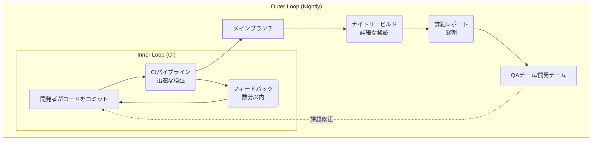
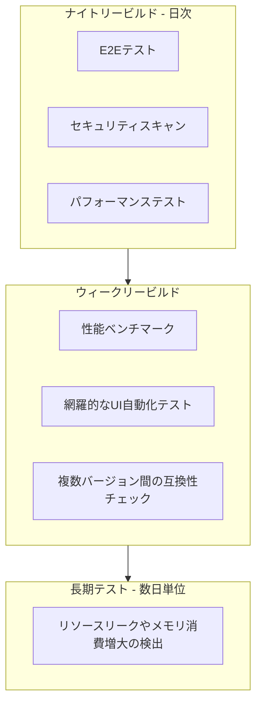
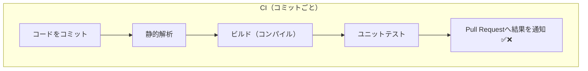
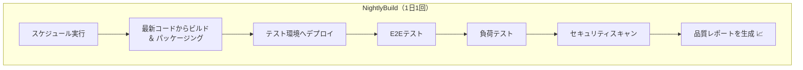

**「CIパイプラインの実行が遅い…」**
そんな悩みを抱えていませんか？その原因は、コミットごとのCIに多くのテストを詰め込みすぎていることにあるかもしれません。CIによる迅速なフィードバックは強力ですが、それだけではカバーしきれない品質保証の側面があります。そこで重要な役割を担うのが、時代遅れと思われがちな「ナイトリービルド」です。

この記事では、CIとナイトリービルドの基本的な違いを整理し、両者を戦略的に組み合わせて**迅速なフィードバック と 深い品質保証**を両立させる現代的なパイプライン設計を考えます。

### 1. CI（継続的インテグレーション）とは

CIは、アジャイル開発やDevOpsの思想に基づく開発プラクティスです。開発者が行ったコードの変更を、1日に複数回、自動的に共有リポジトリへ統合するプロセスを指します。

#### 1.1. CIの主な特徴

  * **トリガー**: コードのコミットやプッシュといった**イベントを起点**にパイプラインが自動で起動します。
  * **目的**: 開発者に対して、コード変更に関する**フィードバックを数分以内に提供**します。
  * **フィードバックループ**: 「早く失敗し、早く修正する」という考え方に基づき、問題を即座に特定できる短いフィードバックループを構築します。

#### 1.2. CIがもたらす利点

  * **早期のバグ発見**: 小さな変更単位でテストを実行し、開発サイクルの早い段階でバグを発見
  * **統合問題の軽減**: 頻繁な統合により、大規模なマージコンフリクト（通称：マージ地獄）を回避
  * **開発者の生産性向上**: ビルドやテストといった反復作業の自動化
  * **リリース可能な状態の維持**: メインブランチを常に安定した状態に保持し、継続的デリバリーの基盤を構築

### 2. ナイトリービルドとは

ナイトリービルドは、CIが普及する以前に主流だった開発手法です。深夜など、あらかじめ決められた時間に1日1回、その日の全てのコード変更をまとめてビルドします。

#### 2.1. ナイトリービルドの主な特徴

  * **トリガー**: 毎日深夜0時など、**スケジュールを起点**にプロセスが自動で開始します。
  * **目的**: 1日分の開発作業を集約し、**システム全体の健全性を保証**します。
  * **フィードバックループ**: 結果が判明するのは翌朝になるため、フィードバックループは最大24時間と長くなります。

#### 2.2. ナイトリービルドが担っていた役割

  * **ビルドの健全性確保**: コードベースがコンパイル不可能な状態に陥ることを防止
  * **包括的なテストの実行**: 時間のかかるリグレッションテストなどを夜間に実行
  * **安定した成果物の提供**: QAチームがテストするための安定したバージョンを提供

### 3. CIとナイトリービルドの比較

両者の違いを以下の表にまとめます。

| 特徴 | 継続的インテグレーション（CI） | ナイトリービルド |
| :--- | :--- | :--- |
| **主要なトリガー** | イベント駆動（コードのコミット、プッシュ） | 時間駆動（固定スケジュール） |
| **実行頻度** | 高頻度（1日に複数回） | 低頻度（24時間に1回） |
| **フィードバック速度** | 非常に高速（数分以内） | 低速（最大24時間） |
| **検証スコープ** | 小さな個別の変更 | 1日分の全ての変更 |
| **主要な目的** | 統合問題を未然に防ぎ、変更の正しさを即座に検証 | 1日の作業全体の健全性を確保し、網羅的なチェックを実行 |
| **テストの種類** | 高速なテスト（ユニットテスト、静的解析など） | 時間のかかる包括的なテスト（E2Eテスト、負荷テストなど） |
| **現代での役割** | 中核的な統合プラクティス | 詳細な品質を保証する補完的なプロセス |

### 4. なぜCIとナイトリービルドを組み合わせるのか？

現代のソフトウェア開発は、CIによる高速なイテレーションが基本です。しかし、システムの複雑化やセキュリティ要件の高度化に伴い、コミットごとのCIパイプラインで全ての品質検証を行うのは、フィードバック速度の低下を招き、開発のボトルネックになりかねません。

そこで、「CIかナイトリービルドか」という二者択一ではなく、両者の長所を活かして組み合わせるのが効果的です。CIを**迅速な検証を行う「内側のループ（Inner Loop）」**、ナイトリービルドを **詳細な検証を行う「外側のループ（Outer Loop）」** として位置づけ、多層的な品質保証体制を構築します。

| 要素名 | 説明 |
| :--- | :--- |
| **内側のループ (Inner Loop)** | コミットごとに実行される高速なCIプロセス。開発者の生産性を維持し、即時フィードバックを提供。 |
| **外側のループ (Outer Loop)** | 1日に1回実行されるナイトリービルドプロセス。CIでは時間がかかりすぎる包括的なテストや分析を実施。 |

### 5. 現代のナイトリービルドが担う多様な役割

Outer Loopとして位置づけられる現代のナイトリービルドは、単なるビルドやテストに留まらない、多様な役割を担います。

**主な用途：包括的な品質検証**

CIで実行するには時間のかかる検証を担い、システムの品質を深く保証します。

| 分類 | 具体例 |
| :--- | :--- |
| **包括的なテスト** | 完全なエンドツーエンド（E2E）テスト、リグレッションテスト |
| **詳細なセキュリティスキャン** | SAST/DAST、コンテナイメージスキャン、依存関係の脆弱性スキャン（SCA） |
| **パフォーマンステスト** | 自動化された負荷テスト、ストレステストによる性能低下の検知 |
| **高度なレポート生成** | コードカバレッジ、品質メトリクスの詳細なレポート作成とトレンド分析 |
| **テスト環境の準備** | 最新の安定版をQA環境やステージング環境へ自動デプロイ |

**継続的なメンテナンス**

**Dependabot**や**Renovate**といったツールを夜間に実行し、依存関係の更新を自動化します。これにより、開発者の作業時間を圧迫せずにシステムの安全性を高め、継続的なメンテナンスサイクルを構築できます。

**週次・長期での多層的な品質保証**

ナイトリービルド（日次）を基本とし、**ウィークリービルド**や**長期テスト**を組み合わせることで、品質保証体制をさらに強化できます。

| ビルドサイクル | 主な目的 |
| :--- | :--- |
| **日次 (Nightly)** | 日々の変更に対する包括的な品質を保証 |
| **週次 (Weekly)** | より網羅度の高いテストや性能ベンチマークを実施 |
| **長期 (Long-term)** | 数日間システムを稼働させ、長期的な安定性を検証 |

### 6. 実践的な2パイプライン設計パターン

ここでは、役割を明確に分離した2つのパイプライン設計パターンを紹介します。CIパイプラインは**迅速なフィードバック**を、ナイトリービルドは**詳細な品質保証**を目的とします。

#### 6.1 CIパイプライン：開発のスピードを支える迅速なフィードバック

開発者がコードをコミットするたびに実行され、15分以内の完了を目指す高速なループです。変更に対する基本的な健全性を即座に検証し、「マージしても問題ないか」を判断します。

| 名前 | 説明 |
| :--- | :--- |
| **静的解析** | コードスタイルや潜在的なバグをソースコードの段階で素早く検出します。 |
| **ビルド（コンパイル）** | コードが文法的に正しく、実行可能な形式に変換できることを保証します。 |
| **ユニットテスト** | 機能単位のロジックが正しく動作するかを、高速に実行できるテストで検証します。 |
| **結果通知** | Pull Requestなどに検証結果を自動で通知し、マージ可否の判断を支援します。 |

#### 6.2 ナイトリービルド：リリースの品質を守る詳細な検証

深夜など、1日に1回スケジュール実行される包括的なパイプラインです。CIでは時間的に難しい、システム全体を対象とした詳細なテストを行い、アプリケーションの品質を深く保証します。

| 名前 | 説明 |
| :--- | :--- |
| **ビルド & パッケージング** | 最新のソースコードから、テスト対象となる実行可能な成果物（Dockerイメージなど）を作成します。 |
| **テスト環境へデプロイ** | 作成した成果物を、本番に近いテスト環境へ自動でデプロイします。 |
| **E2Eテスト** | ユーザーの操作を模倣し、複数のサービスや画面をまたがるシナリオが正常に動作するかを検証します。 |
| **負荷テスト** | システムが想定される負荷に耐えられるか、パフォーマンスに問題がないかを確認します。 |
| **セキュリティスキャン** | アプリケーションに脆弱性がないかを動的にスキャンします。 |
| **品質レポートを生成** | テスト結果やコードカバレッジなどを集計し、品質の定点観測ができるレポートを作成します。 |

#### 運用上のヒント

  * **失敗の通知**: CIパイプラインの失敗は即時に関係者（コミットした開発者など）に通知すべきですが、ナイトリービルドの失敗は、翌朝チーム全体で確認する、あるいは特定の品質担当者にレポートを送るなど、運用ルールを分けておくと混乱を防げます。
  * **レポートの活用**: ナイトリービルドで生成されるカバレッジレポートや性能測定結果を定点観測し、品質の劣化トレンドを早期に発見する仕組みを整えましょう。

### まとめ

CIとナイトリービルドは対立する概念ではなく、「**CIはスピード、ナイトリービルドは深さ**」を担う、互いを補完し合う関係です。

  * **CI (Inner Loop)**: **コミットごと**に**迅速なフィードバック**を提供し、「壊れていないこと」を素早く保証します。
  * **ナイトリービルド (Outer Loop)**: **1日に1回**、時間のかかる**詳細な検証**を行い、「期待通り高品質であること」を深く保証します。

現代のソフトウェア開発では、この2つのループを戦略的に統合することが、スピードと品質を両立させる鍵となります。あなたのチームのCI/CDパイプラインが複雑化しているなら、まずは時間のかかるテストをナイトリービルドに分離することから始めてみてはいかがでしょうか。

この記事が少しでも参考になった、あるいは改善点などがあれば、ぜひリアクションやコメント、SNSでのシェアをいただけると励みになります！

---

### 参考リンク

* **CI（継続的インテグレーション）**
  * [CI とは? - 継続的インテグレーションの説明 - AWS](https://aws.amazon.com/jp/devops/continuous-integration/)
  * [継続的インテグレーション (CI) とは？ - CircleCI](https://circleci.com/ja/continuous-integration/)
  * [Continuous integration best practices - GitLab](https://about.gitlab.com/topics/ci-cd/continuous-integration-best-practices/)
  * [継続的インテグレーションとは | IBM](https://www.ibm.com/jp-ja/think/topics/continuous-integration)
  * [CI(継続的インテグレーション)とは？ » わかりやすく解説 » - CloudBees|テクマトリックス](https://cloudbees.techmatrix.jp/devops/ci/)
  * [CI/CDとは？意味やメリット、導入方法を解説 - Ｓｋｙ株式会社](https://www.skygroup.jp/media/article/2745/)
  * [今さら聞けないCI/CD（継続的インテグレーション/継続的デリバリー）とは - Qiita](https://qiita.com/shinkai_/items/13e76a5641d9ec9a41d2)
* **ナイトリービルド／デイリービルド**
  * [ナイトリービルド - TypeScript: Documentation](https://www.typescriptlang.org/ja/docs/handbook/nightly-builds.html)
  * [デイリービルド - Wikipedia](https://ja.wikipedia.org/wiki/%E3%83%87%E3%82%A4%E3%83%AA%E3%83%BC%E3%83%93%E3%83%AB%E3%83%89)
  * [Daily build - Wikipedia](https://en.wikipedia.org/wiki/Daily_build)
  * [ナイトリービルドとは？ わかりやすく解説 - Weblio辞書](https://www.weblio.jp/content/%E3%83%8A%E3%82%A4%E3%83%88%E3%83%AA%E3%83%BC%E3%83%93%E3%83%AB%E3%83%89)
  * [デイリービルド | 今更聞けないIT用語集 - 株式会社APPSWINGBY](https://appswingby.com/%E3%83%87%E3%82%A4%E3%83%AA%E3%83%BC%E3%83%93%E3%83%AB%E3%83%89-%E4%BB%8A%E6%9B%B4%E8%81%9E%E3%81%91%E3%81%AA%E3%81%84it%E7%94%A8%E8%AA%9E%E9%9B%86/)
* **CIとナイトリービルドの比較・議論**
  * [Continuous Integration vs. Nightly Builds - Stack Overflow](https://stackoverflow.com/questions/417134/continuous-integration-vs-nightly-builds)
  * [Nightly Builds vs. Continuous Integration: Long-Running Automated Tests - Stack Overflow](https://stackoverflow.com/questions/4899681/nightly-builds-vs-continuous-integration-long-running-automated-tests)
  * [What does 'Nightly Builds' mean? - Software Engineering Stack Exchange](https://softwareengineering.stackexchange.com/questions/56490/what-does-nightly-builds-mean)
  * [Running CI tests: nightly or before every code change? : r/node - Reddit](https://www.reddit.com/r/node/comments/14rnbgk/running_ci_tests_nightly_or_before_every_code/)
* **CI/CDパイプラインとテスト戦略**
  * [Tests for CI/CD pipelines - AWS Prescriptive Guidance](https://docs.aws.amazon.com/prescriptive-guidance/latest/strategy-cicd-litmus/tests-for-cicd-pipelines.html)
  * [Best Practices for Successful CI/CD | TeamCity CI/CD Guide - JetBrains](https://www.jetbrains.com/teamcity/ci-cd-guide/ci-cd-best-practices/)
  * [Test Strategies for Daily and Nightly Builds | BrowserStack](https://www.browserstack.com/guide/test-strategies-for-daily-and-nightly-builds)
  * [The CI/CD Pipeline: Why Testing Is Required at Every Stage | Copado](https://www.copado.com/resources/blog/the-ci-cd-pipeline-why-testing-is-required-at-every-stage)
  * [Software Testing Types for the CI/CD Pipeline - QMetry](https://www.qmetry.com/blog/software-testing-types-in-your-continuous-delivery-pipeline)
  * [【DevOps】CI/CDパイプラインの全体像とその役割 - サーバーワークスエンジニアブログ](https://blog.serverworks.co.jp/devops-cicd-pipeline-summary)
  * [Continuous Testing Strategies That Actually Prevent Production Bugs - DevOps.com](https://devops.com/continuous-testing-strategies-that-actually-prevent-production-bugs/)
  * [Best Test Prioritisation Strategies for Continuous Deployment Scenarios - aqua cloud](https://aqua-cloud.io/test-prioritisation-strategies-for-cds/)
  * [Best approach to running additional tests during nightly build? – TeamCity Support](https://teamcity-support.jetbrains.com/hc/en-us/community/posts/206883915-Best-approach-to-running-additional-tests-during-nightly-build)
  * [Nightly builds for ui automation - Archive - The Club](https://club.ministryoftesting.com/t/nightly-builds-for-ui-automation/18245)
  * [What Do You Put in Ci/Cd Pipeline Testing? : r/ExperiencedDevs - Reddit](https://www.reddit.com/r/ExperiencedDevs/comments/1h506x8/what_do_you_put_in_cicd_pipeline_testing/)
