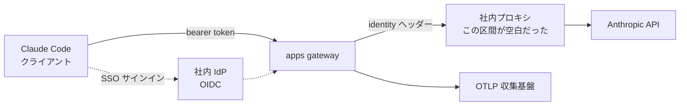
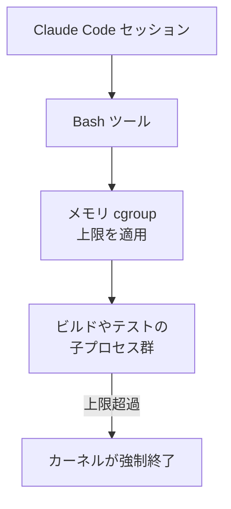

Claude Code v2.1.233 に、組織運用向けのオプトイン機能が2つ入りました。

- `forward_user_identity` — apps gateway が、サインイン中の利用者の identity をヘッダーとしてAnthropic upstream へ転送する設定
- `CLAUDE_CODE_TOOL_MEMORY_LIMIT` — Linux で Bash ツールのコマンドにメモリ cgroup を適用する環境変数

どちらも「コストを人に紐づけたい」「暴走ビルドでセッションを止めたくない」という、導入部門が実際に抱える要求に直接対応しています。一方でこの2つは、**既存の仕組みで埋まらなかった隙間を埋める補助機能**であって、それ単体でガバナンスを成立させるものではありません。

この記事では、公開されている一次情報に何が書かれ、何が書かれていないかを整理したうえで、導入判断の前に決めておくべき点をまとめます。対象読者は、社内で Claude Code の展開方針や課金設計を決める立場の方です。


*この記事の全体像。以下、順に解説します。*

## 2.1.233 で入った2つのオプトイン

リリースノートの該当箇所は次の2行です。

> Added an opt-in `forward_user_identity` apps gateway setting on Anthropic upstreams that sends the signed-in user's identity as headers, so a proxy behind the gateway can attribute spend per user

> Added opt-in memory cgroup support for Bash tool commands on Linux (`CLAUDE_CODE_TOOL_MEMORY_LIMIT`) so a runaway build can't stall the session

読み取れる事実を、拡大解釈せずに列挙します。

| 項目 | `forward_user_identity` | `CLAUDE_CODE_TOOL_MEMORY_LIMIT` |
|---|---|---|
| 種別 | apps gateway の設定 | 環境変数 |
| 既定 | 無効（オプトイン） | 無効（オプトイン） |
| 適用範囲 | Anthropic upstream 経由のリクエスト | Linux での Bash ツール実行 |
| 目的 | gateway の背後にあるプロキシが利用者別に費用を按分できるようにする | 暴走したビルドがセッションを止めるのを防ぐ |
| 手段 | 利用者 identity を HTTP ヘッダーとして送出 | メモリ cgroup による上限 |

### 一次リファレンスにはまだ載っていない

導入判断の前提として重要なのは、**2026-08-17 時点で、この2つは公式のリファレンスページに項目として現れていない**という点です。

- `gateway.yaml` の全オプションを列挙する [apps gateway configuration](https://code.claude.com/docs/en/claude-apps-gateway-config) に `forward_user_identity` の記載はありません
- [Settings](https://code.claude.com/docs/en/settings) の環境変数一覧に `CLAUDE_CODE_TOOL_MEMORY_LIMIT` の記載はありません

つまり現時点の根拠はリリースノートの1行だけです。ヘッダー名、値の書式、失敗時の挙動といった運用に効く詳細は、公開情報からは確定できません。**本番の課金処理や監査要件をこの2つに依存させる前に、リファレンス掲載を待つか、自組織での実測で挙動を確定させる**のが妥当です。

## forward_user_identity はどの空白を埋めるのか

誤解しやすいのは「これで利用者別のコスト管理ができるようになった」という読み方です。apps gateway は、この機能が入る前から利用者を識別しています。

- 開発者は API キーではなく **corporate IdP の SSO** でサインインし、gateway が短命の bearer token を発行する
- OTLP テレメトリは既定で **token 数・モデル・user identity・レイテンシ**を送出する
- **per-user / per-group の spend limit** が既に機能として提供されている

これらは [apps gateway のドキュメント](https://code.claude.com/docs/en/claude-apps-gateway)に記載があります。埋まっていなかったのは、gateway が知っている identity が **gateway より下流（gateway と Anthropic API のあいだ）に置かれたプロキシには見えない**、という区間の話です。



自組織のエグレスプロキシやコスト按分基盤を gateway の後段に置いている構成でだけ、この設定は意味を持ちます。gateway の telemetry を直接使っている構成なら、そもそも不要です。

### ヘッダーを信頼の根拠にしない

`forward_user_identity` が送るのは、リクエストヘッダーです。ヘッダーは経路上で書き換えられる可能性がある値であり、**それ単体では identity の証明になりません**。

受け取り側のプロキシが、ヘッダーの値をそのまま課金の帰属先として採用すると、次のような設計上の穴が残ります。

- 経路上でヘッダーを差し替えられれば、他人にコストを付け替えられる
- 監査ログの利用者名が、実際の実行者と一致している保証がない

したがって、受け側では次のいずれかを前提にします。

1. **改ざんできない経路にする** — gateway とプロキシの区間を mTLS で閉じ、そこ以外からの流入を受け付けない
2. **検証可能な identity と突き合わせる** — OIDC トークンの検証結果や、gateway が別途出す OTLP テレメトリ側の identity と照合する
3. **ヘッダーは補助情報として扱う** — 課金の正としては gateway の per-user spend limit / telemetry を使い、ヘッダーはプロキシ側の可視化にとどめる

「ヘッダーを送れるようになった」ことと「そのヘッダーを信じてよい」ことは別問題です。**信頼境界を決めるのは受け側の設計**であって、この設定ではありません。

## CLAUDE_CODE_TOOL_MEMORY_LIMIT は Linux 限定

こちらは、Bash ツールが実行するコマンドを cgroup に載せてメモリ上限をかけるものです。長時間ビルドやテストをエージェントに任せる運用で、メモリを食い潰したプロセスがセッション全体を巻き込むのを防ぎます。



運用上、押さえておくべき点は3つあります。

### 1. 対象プラットフォームは Linux

リリースノートの記載は `on Linux` です。cgroup は Linux カーネルの機能なので、**macOS では同じ仕組みが成立しません**。開発端末が macOS 中心の組織では、この保護は端末側では効かないと考えるのが安全です。

保護を効かせたいなら、実行環境そのものを Linux 側に寄せる選択になります。

- CI / セルフホストランナー上でエージェントを走らせる
- 開発端末でもコンテナ内で実行する

「設定したから安全になった」と全社に周知すると、**保護されていない端末が保護されているつもりで動く**という、最も避けたい状態になります。適用範囲を明示して周知してください。

### 2. 上限に当たったときの終わり方を想定しておく

メモリ上限による強制終了は、プロセスに後片付けの機会を与えません。エージェントが回す典型的なコマンドは、途中で強制終了されるとロックや中間状態を残します。

- `.git/index.lock` が残り、以降の git 操作が失敗し続ける
- パッケージマネージャのロックやキャッシュが不整合のまま残る
- 中途半端な生成物が、次の実行で「完了済み」と誤認される

これはこの機能に固有の不具合ではなく、強制終了一般の性質です。ただし**上限を設定するということは、この終わり方を意図的に発生させる**ということでもあります。

エージェントに自走させるなら、回復手順を先に持たせておきます。

```text
Bash コマンドが異常終了したときは、まず残留ロックを確認してから再試行する。
- git 操作が lock エラーになる場合は .git/index.lock の有無を確認する
- 別プロセスが動いていないことを確認してから削除し、同じコマンドを1回だけ再試行する
- 2回続けて同じ失敗をしたら、再試行せず状況を報告する
```

### 3. 失敗時の挙動は未確定として扱う

cgroup の作成に失敗した場合、セッションがエラーで止まるのか、上限なしで続行するのかは、公開情報からは判断できません。

ここが運用上いちばん怖い分岐です。上限なしで続行する設計なら、**設定ファイルに値が書かれているのに保護は効いていない**という状態が、無言で成立し得ます。

自組織で採用するなら、周知の前に実測で確定させてください。小さめの上限を設定し、意図的に超過するコマンドを1つ流して、期待どおり止まるかを確認する。この1回の検証が、「効いているつもり」を防ぎます。

## 導入前に決めておくこと

2つの機能に共通するのは、**オプトインであること**と、**リファレンス未掲載であること**です。判断は次の順序で切り分けられます。

| 問い | Yes のとき | No のとき |
|---|---|---|
| gateway の後段に自前のプロキシや按分基盤があるか | `forward_user_identity` を検討する | 検討不要。gateway の telemetry と spend limit を使う |
| 受け側でヘッダーを検証・保護できるか | 課金帰属に使ってよい | 可視化までにとどめ、課金の正には使わない |
| エージェントの実行環境は Linux か | `CLAUDE_CODE_TOOL_MEMORY_LIMIT` が効く | 効かない。コンテナや CI へ寄せるかを別途決める |
| 上限超過と初期化失敗の挙動を実測したか | 適用範囲を明示して展開する | 展開前に実測する |

いずれも「機能を入れるか」ではなく、**その機能が守る範囲と守らない範囲を、運用側が言語化できているか**を問う形になっています。オプトインの機能は、有効化した時点で「対策済み」という認識を組織に作ってしまいます。認識と実効範囲がずれたときの損失は、機能を入れなかった場合より大きくなりがちです。

## まとめ

- v2.1.233 のガバナンス系追加は `forward_user_identity` と `CLAUDE_CODE_TOOL_MEMORY_LIMIT` の2つ。どちらもオプトイン
- 2026-08-17 時点で、両者とも公式リファレンスには未掲載。根拠はリリースノートのみなので、詳細挙動は自組織で実測して確定させる
- `forward_user_identity` が埋めるのは gateway 後段のプロキシとの区間。identity 管理そのものは SSO・telemetry・spend limit として既に存在する
- 転送されるのはヘッダー。信頼するかどうかは受け側の設計で決める。mTLS や OIDC 検証との併用が前提
- メモリ上限は Linux の cgroup。macOS では効かないため、適用範囲を明示せずに周知すると「保護されているつもり」を生む
- 上限超過は強制終了なので、ロック残留からの回復手順をエージェント側に持たせておく

この記事が少しでも参考になった、あるいは改善点などがあれば、ぜひリアクションやコメント、SNSでのシェアをいただけると励みになります！

## 参考リンク

- [Claude Code v2.1.233 リリースノート](https://github.com/anthropics/claude-code/releases/tag/v2.1.233)
- [Claude apps gateway](https://code.claude.com/docs/en/claude-apps-gateway) — SSO サインイン、per-user / per-group spend limit、OTLP telemetry
- [Claude apps gateway configuration](https://code.claude.com/docs/en/claude-apps-gateway-config) — `gateway.yaml` の全オプションリファレンス
- [Claude Code settings](https://code.claude.com/docs/en/settings) — 設定の優先順位と環境変数一覧
- [Monitoring usage](https://code.claude.com/docs/en/monitoring-usage) — OTLP メトリクスの項目
