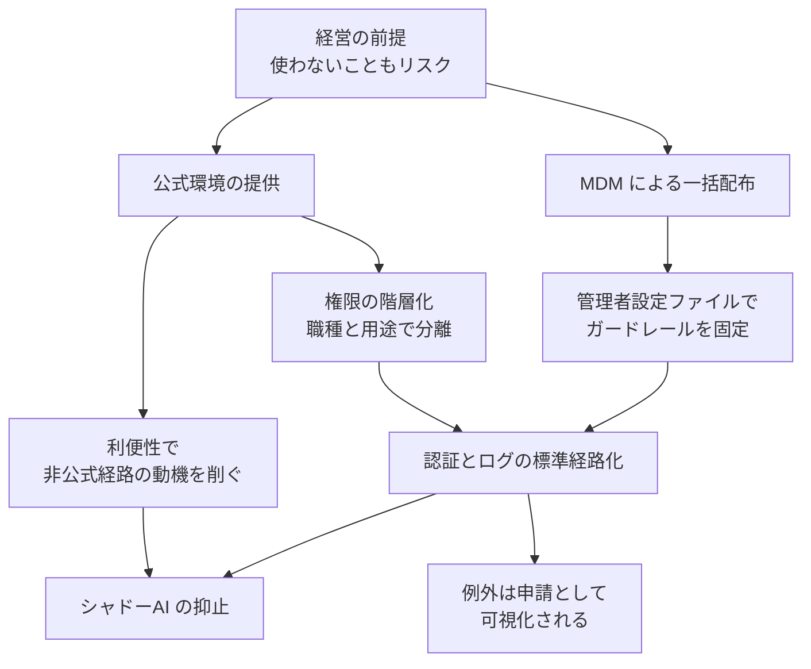

強い実行権限を持つコーディングエージェントを全社に配るとき、多くの組織は 2 つの問題を別々に扱います。

1. どうやってエージェントを安全に配るか（導入とガバナンス）
2. どうやって従業員の個人アカウント利用を止めるか（シャドーAI 抑止）

メルカリが 2026 年 5 月に開始した Claude Code / Claude Cowork の全社展開は、この 2 つを**同じ 1 つの運用課題**として設計した事例として報じられました。本記事では、その設計の骨格、破れやすい箇所、そして開発者体験とのトレードオフを、導入を判断する立場から整理します。

読み終えると、次の 3 つが得られます。

- 「禁止」でなく「管理された利便性」で統制する構造の意味
- MDM と管理者設定ファイルで何が固定でき、何が固定できないか
- 自社へ移すときに先に決めておくべき論点

## 前提：AI を使わない選択もリスクになった

議論の出発点は「AI を使うリスク」だけではありません。メルカリは「AI を使わない選択自体がビジネスリスク」と位置づけて全社展開を決めています。

この置き方を採ると、意思決定の問いが変わります。

| 前提 | 問い | 起きやすい帰結 |
|---|---|---|
| 使うことがリスク | 使ってよいか | 承認が長期化し、現場が個人アカウントへ流れる |
| 使わないこともリスク | どう使える状態を作るか | 公式環境の整備が優先タスクになる |

シャドーAI は「規則を守らない従業員の問題」に見えますが、構造としては**公式経路の使い勝手が非公式経路に負けている状態**です。前提を後者に置き換えると、抑止策は禁止規則ではなく経路設計の問題になります。

## 設計の骨格

報じられた構成を、判断のレイヤーで整理すると次のようになります。

要点は 3 つです。

### 1. 管理された利便性で動機を削ぐ

非公式ツールへ流れる動機は「速い」「制限が少ない」「すぐ使える」です。公式環境がこれらで大きく劣ると、規則の強さに関係なくコードのコピー＆ペーストは続きます。公式環境の応答速度と制限の妥当性は、セキュリティ施策の一部として扱う必要があります。

### 2. 設定をユーザーの手から外す

Claude Code は、管理者が配布する設定ファイル（`managed-settings.json`）によって、ユーザー側のローカル設定より優先される制約を与えられます。これを MDM で全端末へ配布すると、ユーザーが個別に緩められない層ができます。

固定したい対象は、おおむね次の区分になります。

| 区分 | 例 | 固定の意味 |
|---|---|---|
| 実行の許可・拒否 | 破壊的コマンド、外部への送信を伴う操作 | エージェントの行動範囲の上限 |
| 接続先 | 利用するモデル提供元、プロキシ経路 | データ境界の維持 |
| 認証 | 会社アカウントでのログイン強制 | 個人アカウント利用の遮断 |
| ログ | 操作ログの収集先 | 事後追跡の可能性 |

重要なのは、**この層はユーザーの逸脱は防げても、エージェント自身の誤作動は防げない**点です。後述します。

### 3. 権限を階層化し、例外を標準経路に集約する

全員に同じ権限を渡さず、エンジニアと非エンジニアなど用途ごとに必要な権限を分離します。そのうえで、認証・ログ取得・データ境界を越える際の例外申請を 1 つの標準経路へ集約します。

例外申請を潰すのではなく**可視化する**ことが設計の眼目です。申請できない例外は、承認外の経路で処理されます。

## この設計が破れる箇所

「公式ツールを配り、MDM でガードレールを敷けば安全」という結論には、いくつかの構造的な反証があります。

### 動機は完全には消えない

職場での AI 利用率は 75〜80% 台と報告される一方、承認外のツールへソースコードを貼り続ける層は残ると指摘されています（二次情報のため、自社の実測で確認する前提の数字として扱ってください）。公式環境の制限が現場の作業実態に合わない限り、動機は残ります。

### 間接的プロンプトインジェクション

エージェントは、人間の指示だけでなく**読み込んだファイルの中身**にも従い得ます。外部リポジトリの `README.md` や依存パッケージに指示文が仕込まれていた場合、エージェントがそれをユーザー指示と誤認して動く可能性があります。

これは設定ファイルによる許可・拒否リストでは根本的に塞げません。許可された操作の組み合わせで目的が達成されてしまうためです。

### 構造的シェルインジェクション

コマンドのフィルタリングは、多くの場合**シェル展開の前**の文字列を検査します。展開後に別のコマンドとして成立する書き方をされると、検査を通過した文字列が意図しない実行につながります（GuardFall として報告された類型）。

### 権限の強さがアタックサーフェスになる

エージェント自体が新しい攻撃対象になった事例も報告されています。

- 2026 年 3 月、Claude Code の npm リリースにソースマップが混入し、未公開機能を含む大量の TypeScript コードが流出したとされるインシデント（二次情報）
- 細工したファイルを読ませることで機密データを外部に流出させる EchoLeak、ローカルの `GITHUB_TOKEN` を窃取する RoguePilot として実証された攻撃

つまり、防御層は次のように分けて考える必要があります。

| 層 | 防げるもの | 防げないもの |
|---|---|---|
| MDM + 管理者設定 | ユーザーによる設定の緩和、認証の逸脱 | エージェントが騙されて動くこと |
| 実行環境の分離（サンドボックス、権限の最小化） | 誤作動時の被害範囲 | 誤作動そのもの |
| ログと事後検知 | 再発防止、影響範囲の特定 | 初回の被害 |

MDM 層だけで完結させると、2 段目が空きます。

## ガバナンスと開発者体験のトレードオフ

見落とされやすいのが、統制を強めた結果として**開発の流量そのものが詰まる**問題です。

### レビューが律速になる

コード生成の速度だけが上がり、セキュリティチェックと人手レビューの基準を従来のまま据え置くと、レビュー待ちのプルリクエストが滞留します。生成量の増加に対して、レビュー能力は増えないためです。結果としてデプロイ頻度が落ち、導入の効果が数字に出ません。

対処は、レビューの手前で機械的に落とせる範囲を広げることです。

- 自動テストと静的解析の適用範囲を先に広げる
- レビュー対象を差分の性質で階層化する（生成物か、境界に触れる変更か）
- 同期レビュー前提をやめ、非同期で回せる粒度に分割する

### 責任だけを個人に寄せると反発する

「AI が生成したコードの最終責任はすべて開発者が負う」という方針は、統制としては明快ですが、事実確認とバグ探しの認知負荷を個人に集約します。いわゆるモラル・クランプル・ゾーンで、経験のあるエンジニアほど「自分で書いた方が早い」という判断に傾きます。

責任の所在を決めるだけでなく、**責任を果たすための道具（差分の説明、テスト、根拠の提示）をセットで配れているか**が分岐点になります。なお、メルカリ社内でこの負荷が実際にどの程度発生し、どう解消されたかは公開情報からは確認できません。

## 自社へ移すときに先に決めること

事例をそのまま真似るのではなく、判断が必要な論点として抜き出すと次の 6 点になります。

| # | 論点 | 決め方の目安 |
|---|---|---|
| 1 | 公式環境の使い勝手の目標水準 | 個人利用のツールと比較して許容できる差を明示する |
| 2 | 固定する設定の範囲 | ユーザーが緩められない項目を先に列挙する |
| 3 | 権限の階層 | 職種ではなく、触れるデータ境界で分ける |
| 4 | 例外申請の経路 | 申請が通る前提で作る。通らない設計は迂回を生む |
| 5 | 実行環境の分離 | エージェントが騙された場合の被害範囲を先に見積もる |
| 6 | レビュー能力の拡張 | 生成量の増加率に対する処理能力の計画を持つ |

導入の可否を議論する前に、この 6 点のうち何が未定かを確認すると、論点が「使う・使わない」から「どの状態を作るか」に移ります。

## まとめ

- メルカリの事例は、シャドーAI 抑止を規則ではなく**経路設計**の問題として扱っている
- MDM と管理者設定ファイルで固定できるのは、ユーザーによる逸脱の層まで
- エージェントが騙される層（間接的プロンプトインジェクション、シェル展開後の実行）は、実行環境の分離で受ける必要がある
- 統制を強めるとレビューが律速になり、責任を個人に寄せると反発が出る。ガバナンスの設計は開発の流量の設計と不可分
- 自社へ移すときは、事例の手順ではなく上記 6 つの未定事項を先に埋める

この記事が少しでも参考になった、あるいは改善点などがあれば、ぜひリアクションやコメント、SNSでのシェアをいただけると励みになります！

## 参考リンク

- [メルカリ、Claude Code全社展開とシャドーAI抑止を同じ運用課題として設計（＠IT）](https://atmarkit.itmedia.co.jp/ait/articles/2608/04/news002.html)
- Anthropic「Claude Code settings（managed-settings.json による管理者設定）」
- GuardFall（コマンドフィルタのシェル展開前検査を突く構造的シェルインジェクションの報告）
- EchoLeak / RoguePilot（エージェントに細工ファイルを読ませる情報流出・トークン窃取の実証報告）
