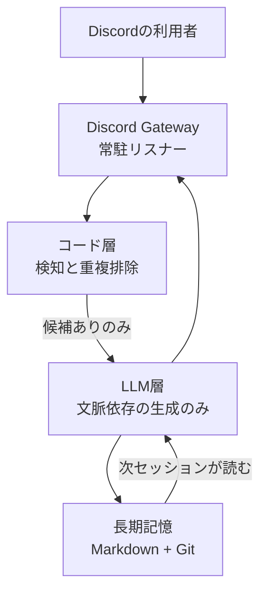
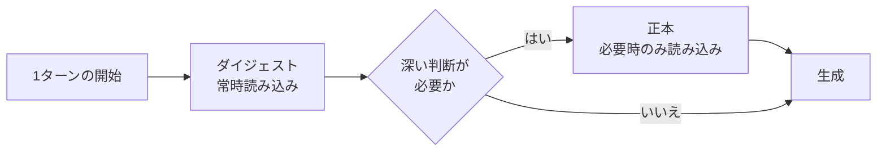
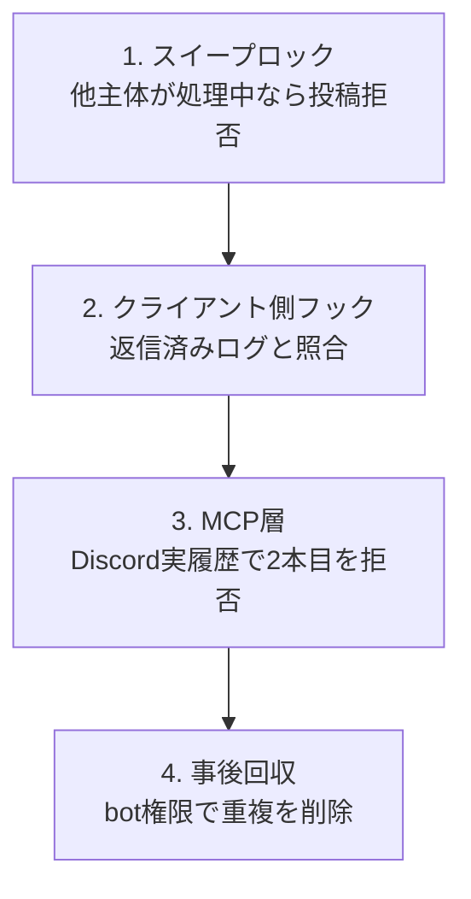

常駐させたAIエージェントの請求額が想定を超えたとき、多くの現場はまずモデルを安いものへ落とします。しかし実測を分解すると、コストの主因は「何を聞いたか」ではなく「毎ターン何を読み直させているか」にあります。

この記事では、Claude CodeをDiscordに常駐させた運用事例の実測値を出発点に、常駐型LLMエージェントのコストがどこで発生し、どこに設計の分界点を置けば止まるのかを整理します。読み終えたときに、自分たちの常駐エージェントに対して「セッションの寿命」「LLMとコードの責務」「文脈の持ち込み量」の3点をレビューできる状態を目指します。

対象読者は、社内でAIエージェントの常駐運用を始めた、あるいは始めようとしているチームと、その投資判断を行う立場の方です。

*この記事の全体像。以下、順に解説します。*

## 1268万トークンの内訳が示していること

事例では、1セッションで約1,268万トークン、金額にして10.30ドルが消費されました。注目すべきは総量ではなく内訳です。

| 種別 | 全体に占める割合 |
|---|---|
| キャッシュ読み込み | 約60% |
| 出力 | 約24% |
| 生の入力 | ほぼゼロ |

生の入力がほぼゼロという事実が重要です。つまり、人間が投げた質問文の量はコストにほとんど寄与していません。支配的なのは、蓄積した会話履歴を毎ターン読み直す分でした。

原典はこれを「議事録が分厚くなり、何か一言話す前に毎回それを最初から読む同僚」と表現しています。1回あたりの読み直しは安価でも、常駐している限り回数は際限なく積み上がります。

### プロンプトキャッシュは「安さ」ではなく「読み回数」の問題

プロンプトキャッシュは、キャッシュ読み込みの単価を通常入力より大幅に下げます。Anthropicの公称ではキャッシュ読み込みが基本入力の0.1倍、キャッシュ書き込み（5分TTL）が1.25倍です。

この価格構造は、同じトークン量でも「読めているか、書き直しているか」で単価差が最大12.5倍になることを意味します。裏を返すと、単価が10分の1でも読み回数が10倍を超えれば、キャッシュは節約になりません。

事例の運用でも、最終的な打ち手はキャッシュ単価の最適化ではなく、**読み回数そのものの削減**へ寄っています。

### コストは平均ではなく裾で膨らむ

さらに実測では、セッションごとの偏りが顕著でした。

- 当初はキャッシュ読み50Mトークンで通知する運用
- 通知後も伸び続け、109M〜218Mトークンに達したセッションが存在
- **上位3セッションだけで全体の69.6%を占有**

平均値で管理すると、この裾を見落とします。監視すべきは1リクエストあたりの単価ではなく、セッション単位の累積トークンです。

## 常駐エージェントを分散システムとして捉え直す

コストの話に見えて、本質はアーキテクチャの話です。常駐型LLMエージェントは「賢いチャットボット」ではなく、非決定的なプロセスを複数抱える分散システムとして扱う必要があります。

この図で効いているのは、コード層からLLM層への矢印に条件が付いている点です。以降、事例から抽出できる4つの分界点を順に見ます。

## 分界点1: 決定的な処理をLLMの外へ出す

初期の運用では、5分ごとのcronがLLMを起動していました。その結果、**1日あたり48ターンの空振り**が発生します。反応すべきメンションが無くても、エージェントは起動し、文脈を読み、何もせずに終わる。この空振りが累積トークンを押し上げます。

対処は単純で、判定をコードへ降ろすことです。

| 層 | 担当する処理 |
|---|---|
| コード | メンション候補の検知、外部データの差分監視、重複返信の拒否、タイムアウト処理 |
| LLM | 文脈を踏まえた返信生成、キャラクター性の付与 |

判断基準は「入力が同じなら出力が同じであるべきか」です。答えがYesの処理は、LLMに任せる理由がありません。差分監視やテンプレート流し込みは、そもそもモデルを呼ばずに完結させられます。

この分界点を引くと、LLM呼び出しは「候補が存在するとき」だけに絞られ、空振り分がまるごと消えます。

## 分界点2: 持ち込む文脈を階層化する

次に削るのは、1ターンあたりの読み込み量です。事例では、エージェントのペルソナ定義を2層に分けています。

- **正本**: 長文制作や設定の見直しなど、深い判断が必要なときだけ読む
- **ダイジェスト**: 日常の返信で常に読む短縮版

この分離だけで、1ターンあたり**約1.5万字**の読み込みが削減されました。

同じ考え方はリポジトリ参照にも適用されます。全ファイルを常に読ませるのではなく、タスクに応じて必要なものだけを読ませる。ドキュメントを「常時ロードする資料」と「参照する資料」に分類する作業は、実質的に情報アーキテクチャの設計です。

ここで注意したいのは、削減対象が**知識の総量ではなく、常時読み込みの量**である点です。正本を捨てるわけではありません。捨てると品質が落ち、結局やり直しのターンが増えます。

## 分界点3: 多重実行を前提に、多層で止める

実行主体が増えると、コストとは別の問題が立ち上がります。事例では8月時点で、人間と対話するClaude、常駐ワーカー、別ハーネスの3種類が同じチャンネルに向き合う構成になりました。

複数の非決定的プロセスが同じ外部状態を触るため、二重返信が起きます。しかも、0.7秒差で同時投稿されるケースまで観測されています。単一のロックでは取りこぼします。

事例が採ったのは、粒度の異なる4層での防御です。

層ごとに参照している「真実」が違う点が肝です。1はプロセス状態、2はローカルログ、3は外部システムの実履歴、4は結果。同じ情報源を見る多重チェックは冗長なだけですが、情報源が違えば、それぞれ別の失敗を捕まえます。

あわせて、状態更新の順序にも設計が要ります。

- 処理済みフラグは**返信後**に更新する（返信前に更新すると、失敗時に応答が永久に失われる）
- 候補は退避と確定の2段階で扱う
- タイムアウト時も、再送前に実履歴を確認する

いずれも「送信は成功したが記録が失敗した」という中間状態への対処です。分散システムの定石を、そのままエージェント運用に持ち込む必要があります。

## 分界点4: 記憶を外部化して、セッションを使い捨てにする

ここまでの3点を実施しても、セッションが不死身である限り累積は止まりません。最後の分界点は、セッションを計画的に終わらせることです。

そのためには、セッションの中にしか無い情報を無くす必要があります。事例では、セッション終了前に「判断したこと、迷ったこと、捨てた案」をMarkdownの日誌へ書き出し、Gitで管理しています。次のセッションは日誌を読んで続きから始めます。

閾値の運用も、実測を受けて引き下げられました。

| 時期 | 交代の閾値 | 結果 |
|---|---|---|
| 当初 | キャッシュ読み50Mトークンで通知 | 通知後も109M〜218Mまで伸びた |
| 修正後 | キャッシュ読み25Mへ引き下げ | 余裕があるうちに区切りを作る運用へ |

通知の閾値を「限界の手前」ではなく「余裕のあるうち」に置く判断です。通知から実際の交代までに人間の作業が挟まる以上、閾値と限界の間には作業時間ぶんの緩衝が要ります。

自己改変の抑止も同じ文脈で設計されています。ペルソナ定義、スキル、設定ファイルの変更時にはフックで人間確認を挟む。エージェントが自分の行動規範を書き換えられる構成は、記録の信頼性そのものを壊します。

## この設計に対する反論

一方で、この方向性が常に正しいわけではありません。採用判断の前に、少なくとも次の3点は検討に値します。

**キャッシュを捨てる方向へ振り切ると、逆に高くつく**
セッションを短く切りすぎたり、都度起動のサーバーレス構成へ寄せたりすると、キャッシュミスが多発します。前述の通り読み込みと書き込みの単価差は大きく、切り替え頻度によっては総額が増えます。「長寿命が悪」ではなく、「監視されていない長寿命が悪」と捉えるのが正確です。

**Git/Markdownの記憶は並行書き込みに弱い**
複数エージェントが協調する構成では、書き込み競合やマージコンフリクトが現実的な運用負荷になります。エージェント数と書き込み頻度が上がる局面では、SQLiteのような軽量DBへ寄せるハイブリッド構成のほうが素直です。移行の境界がどこかは、事例でも未解決の問いとして残っています。

**ガードレール自体が負債になりうる**
多層のフックと履歴検証は、調整のためのコストを増やします。層が増えるほど、層同士の相互作用に起因する障害が生まれ、原因の切り分けも難しくなります。層を足すときは「どの情報源を見ているか」「どの失敗を捕まえるか」を明示できることを条件にすべきです。

## 発注側が確認すべき論点

外部にエージェント開発を委託する場合も、社内で内製する場合も、レビューの観点は共通します。設計書に次が書かれているかを確認してください。

1. **セッションの寿命は誰がどう決めるか** — 累積トークンの監視対象と閾値、通知後の交代手順まで含めて定義されているか
2. **LLMを呼ばない条件は何か** — 「候補が無ければ呼ばない」がコード側で保証されているか
3. **常時読み込みの量はいくつか** — 毎ターンの固定コンテキストが文字数で把握されているか
4. **二重実行はどこで止まるか** — 参照する情報源が異なる層が複数あるか
5. **セッションが消えたとき何が失われるか** — 答えが「何も失われない」でなければ、記憶の外部化が不十分

いずれも、モデル選定より前に決めるべき論点です。単価の交渉は、この5点が定まってからでも遅くありません。

## まとめ

- 実測で支配的だったのはキャッシュ読み込み約60%であり、生の入力はほぼゼロだった。コストは質問量ではなく読み直し量で決まる
- コストは平均ではなく裾で膨らむ。上位3セッションが全体の69.6%を占めた事実は、監視単位をセッション累積へ移すべきことを示す
- 引くべき分界点は4つ。決定的処理をコードへ、文脈を正本とダイジェストへ、多重実行を情報源の異なる多層で、記憶をセッション外へ
- 反論も成立する。切り替えすぎればキャッシュミスで高くつき、Markdown記憶は並行書き込みに弱く、ガードレールは調整コストを生む
- モデルを安くする前に、セッションの寿命、責務の分界、持ち込む資料を見直す余地のほうが大きい

この記事が少しでも参考になった、あるいは改善点などがあれば、ぜひリアクションやコメント、SNSでのシェアをいただけると励みになります！

## 参考リンク

- [Claude CodeをDiscordに住まわせたら、1セッション1268万トークン溶けた話](https://zenn.dev/tyamahori/articles/df489c04a0193a) — 本記事が参照した実測値と運用事例の一次情報
- [Prompt caching - Anthropic Docs](https://docs.claude.com/en/docs/build-with-claude/prompt-caching) — キャッシュ書き込み・読み込みの単価構造
- [Model Context Protocol](https://modelcontextprotocol.io/) — MCP層でのツール提供と履歴確認の仕組み
