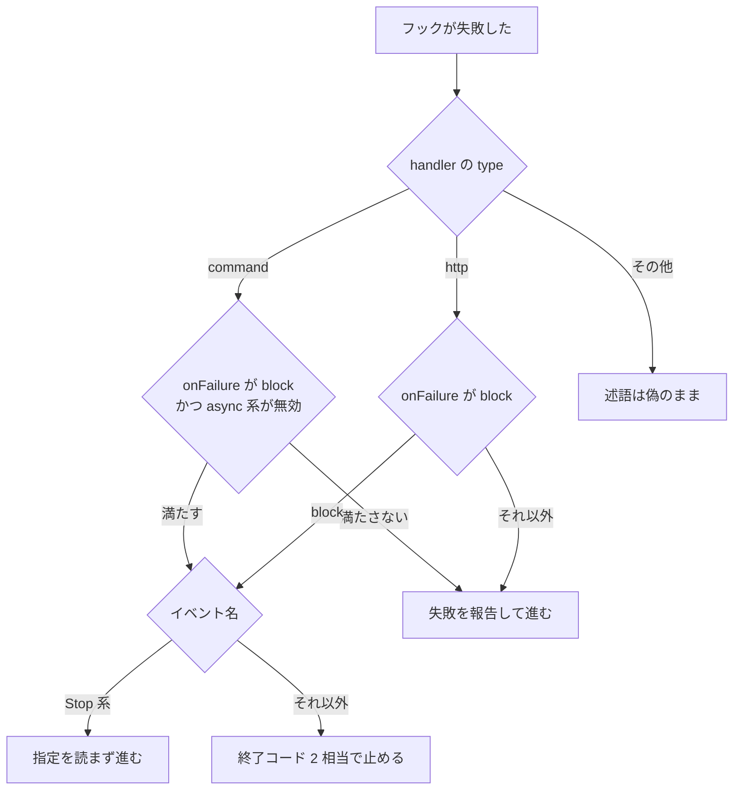

Claude Code 2.1.295 は、command フックと HTTP フックに任意項目 `onFailure` を追加しました。
値は `continue` と `block` の2つです。
この記事では、`block` がどの失敗を終了コード 2 相当にするか、どの type とイベントで述語が真になるか、危険なツール呼び出しの手前にだけ載せるときの試験をまとめます。
公開の [Hooks reference](https://code.claude.com/docs/en/hooks) を 2026-10-09 に取得した時点では、本文に `onFailure` の文字列は無く、項目の意味は同版バイナリのスキーマ説明から読んでいます。


*この記事の全体像。以下、順に解説します。*

## Claude Code の onFailure とは

`onFailure` は、command フックと HTTP フックの定義に足す任意フィールドです。
対象バージョンは Claude Code 2.1.295 です。
[v2.1.295](https://github.com/anthropics/claude-code/releases/tag/v2.1.295) は 2026-10-08T19:48:38Z に公開され、draft でも prerelease でもありません。
使う人は、ツール呼び出しや権限確認をフックで止めたい運用者です。

リリースノートの追加項目は、次の一文です。

> Added `onFailure: "block"` for command and HTTP hooks: a hook that can't start, times out, or exits with an unexpected code blocks the action instead of letting it through

同版バイナリの zod は `U(["continue","block"]).optional()` です。
値が無いときの名前は `continue` (default) です。
`continue` は失敗を報告して操作を進めます。
`block` は失敗を終了コード 2 と数え、そのイベントが守る操作を止めます。
守る操作として説明文が挙げるのは、tool call、permission request、prompt です。

同じ説明文が列挙する失敗は4つです。

- スクリプトまたはプラグインディレクトリが無く、起動できない
- 時間切れ
- 終了コードが 0 でも 2 でもない
- 出力した JSON が不正である、または検証に落ちる

同じ説明文は、async のフックと、Stop、SubagentStop、TaskCompleted、TeammateIdle では、この指定を無視すると書きます。
判定関数は type で分かれます。
command は、`onFailure` が `block` であり、`async` も `asyncRewake` も `true` でないときだけ真です。
http は、`onFailure` が `block` のとき真です。
mcp_tool、prompt、agent など、それ以外の type は偽です。
この判定は、2.1.295 のバイナリでは関数 `tOe` に対応します。

述語が真のとき、上の4イベント以外では終了コード 2 相当の停止に進みます。
結果が成功でも、既に block でも、cancelled でもない場合、結果を blocked に上げる関数があります。
バイナリでは関数 `Y_t` です。
出力が `Hook cancelled` なら文言は timed out、それ以外は failed です。
PermissionRequest では、同じ近傍に `permissionRequestResult` の `behavior: "deny"` を足す断片があります。

公開ドキュメントの PreToolUse の形に、この1項目を足すと次になります。
`matcher` と `command` の骨格は [Hooks reference の例](https://code.claude.com/docs/en/hooks) と同じで、`onFailure` だけが 2.1.295 の追加です。

```json
{
  "hooks": {
    "PreToolUse": [
      {
        "matcher": "Bash",
        "hooks": [
          {
            "type": "command",
            "command": "${CLAUDE_PROJECT_DIR}/.claude/hooks/block-rm.sh",
            "onFailure": "block"
          }
        ]
      }
    ]
  }
}
```

失敗したあと、2.1.295 のバイナリが使う述語は次の流れです。
図は公開の Hooks reference には無く、同版バイナリの分岐を描いたものです。



図の「async 系が無効」は、`async` と `asyncRewake` のどちらも `true` でないことです。
「その他」は mcp_tool、prompt、agent など、command と http 以外です。
「Stop 系」は Stop、SubagentStop、TaskCompleted、TeammateIdle です。

HTTP フックには、別フィールド `cloud` があります。
値は `device` と `skip` です。
説明は、`skip` のときクラウドセッションへ出さない、`device` または省略のとき出す、解釈できない値は `skip` として読む、と書きます。

## 注意点

公開文の “blocks the action” と、バイナリの “exit code 2” は、すべてのイベントで操作が未実行のまま止まる、という意味には読めません。

| 読み方 | どこまで言えるか | 出典 |
|---|---|---|
| 2.1.295 から失敗は必ず止まる | 値を付けた command / HTTP のうち、述語が真のイベントに限る。既定の名前は `continue` | バイナリの説明文と関数 `tOe` |
| unexpected code は終了コード全般 | バイナリは 0 と 2 以外、と書く。公開 changelog は集合を定義しない | changelog の一文とバイナリ説明 |
| HTTP の non-2xx と接続失敗も `block` で止まる | 公開 Hooks reference は、non-2xx と接続失敗を non-blocking とし、実行を続けると書く。バイナリ説明の失敗列挙は終了コードと JSON で、HTTP ステータスを名前では含まない。失敗結果を blocked に上げる関数はある。non-2xx がその関数へ入るかは未確認 | [Hooks reference の HTTP](https://code.claude.com/docs/en/hooks) とバイナリの `Y_t` |
| フィールドが無いフックは必ず通す | 多くの既定失敗は通す。別経路がある | 下記 |
| ドキュメントに無いので CLI は拒否する | SchemaStore に項目が無い。公式は、スキーマは最新 CLI より遅れ、最近文書化されたキーへの警告は設定無効を意味しない、と書く | [Settings](https://code.claude.com/docs/en/settings) |
| 説明文の async 無視と判定関数は同じ範囲 | 説明文は async のフック全般で無視すると書く。判定関数は command だけ `async` と `asyncRewake` を見る。http は `onFailure` が `block` なら真 | バイナリの説明文と `tOe` |

公開 Hooks reference（2026-10-09 取得、文字列 `onFailure` は 0 件）が書く既定は、フィールドを付けないときの説明として読みます。

- 終了コード 2 だけが、多くのイベントで単独で止めます。それ以外の終了コードは、ほとんどのイベントで単独では止めません。妥当な JSON の決定は、標準の決定モデルでは終了コードとあわせて効きます。終了コード 2 の停止は、JSON の allow では上書きできない、と書きます。
- command / http / mcp_tool の時間切れは出力を捨て、多くのイベントで決定を残しません。PreToolUse では、時間切れの command / http / mcp_tool はツール呼び出しを止めません。呼び出しは通常の権限フローへ進みます。
- HTTP の non-2xx と接続失敗は non-blocking です。止めるには 2xx と、決定を含む JSON を返します。
- `async: true` の command フックは、完了した操作をあとから制御できません。バイナリの述語も、`async` または `asyncRewake` が `true` の command では `onFailure: "block"` を真にしません。
- PostToolUse の終了コード 2 は、stderr を Claude に見せます。ツールは既に実行済みです。
- EndConversation は PreToolUse と PostToolUse を発火しません。
- Stop は、stop フックが連続 8 回ターンを続けたあと、次の block を上書きしてターンを終えます。ツール呼び出しで回数は戻ります。`onFailure` は Stop 系の失敗を block にしないので、この上限の穴は埋まりません。
- 既定の timeout は、command / http / mcp_tool が 600 秒です。UserPromptSubmit、PreModelSwitch、PostModelSwitch では command / http / mcp_tool を 30 秒に縮めます。MessageDisplay では 10 秒です。SessionEnd は共有の 1.5 秒で、設定を伸ばしても上限は 60 秒です。prompt フックの既定は 30 秒、agent フックの既定は 60 秒です。

フィールドが無いときも、別の条件で止める経路がバイナリにあります。

- stdio が end-of-stream の前に閉じた、または quiet になった出力を、許可系の判定として読まない拒否文があります。どのイベントで blocking になるかは未確認です。
- `CLAUDE_CODE_RESTRICT_PERSONAL_CONFIG` が立っているとき、利用者自身の同期 command または HTTP が、PreToolUse、PermissionRequest、PreModelSwitch、UserPromptSubmit、UserPromptExpansion で失敗すると、フィールド無しでも止めるメッセージがあります。この環境変数が既定で立っている、という記述は見つかっていません。

設定の読み込みは別問題です。
対話セッションの Settings Error は、不正な JSON、またはスキーマが拒否する値で、壊れた設定なしで続行できます。
Settings Warning は個別エントリの失敗で、例は壊れた権限ルールと未知のフックイベント名です。
その値を飛ばし、残りは有効のままです。
`-p` はダイアログを出さず、壊れたファイルまたは値を飛ばして続きます。
`claude doctor` が拒否したエントリを出します。
`onFailure` という未知フィールドが Error になるか Warning になるかは、公開文は分類していません。
2.1.295 の zod は値 `continue` と `block` を受理します。
[JSON Schema Store の claude-code-settings](https://json.schemastore.org/claude-code-settings.json) の command / http は `additionalProperties: false` で、2026-10-09 取得分に `onFailure` は無いです。
そのスキーマの最新コミットは `ce64da2a95a2bd40740c2d608206f8a36024d30b`（2026-10-08T18:30:56Z）で、リリースの約 1 時間 18 分前です。
エディタ警告は起きえます。
警告をもって CLI が `block` を拒否する、とは読みません。

二次情報の [Termux Muscle 0.19.0](https://github.com/octocore-autonomous-systems/termux-muscle/blob/main/docs/releases/0.19.0.md) は、command と HTTP フックが `onFailure: "block"` を得たので、起動できない、時間切れ、想定外終了は通さない、と書きます。
`continue` が既定であることと、値を付けたときだけであることが落ちています。

同じリリースの隣の修正は、このフィールドの対象ではありません。

- 2.1.294 は、指示文として書かれた prompt フックと agent フックが、止めるべきものを通していた点の修正です。command / HTTP の `onFailure` とは別です。
- `--tools` と `--restricted` の修正文は、遅れて登録される組み込みツールの名前を列挙しません。[CLI reference](https://code.claude.com/docs/en/cli-reference) は、`--tools` が組み込みツールを絞り、MCP ツールには効かない、と書きます。MCP を外すには `--disallowedTools "mcp__*"` を使います。`--restricted` は、コマンドやコードを実行する組み込みツールと WebFetch を外し、個別名を `--tools` に書いた場合を除きます。ファイルツールは作業ディレクトリに限ります。managed settings と `--settings` だけを読みます。
- mod のネスト入力の修正文は、深さ、修正後にエラーを返すか、command / HTTP の標準入力が同じ入力を受けるかを書きません。公開の mods 参照にも、ネストの打ち切り行は無いです。公開リポジトリの code search（2026-10-09、`onFailure` は 3 件）に、この設定フィールドの実装は無いです。3 件は changelog の feed、`mods/sec-default` の登録、`plugin.register` 失敗の表示で、settings の `onFailure` ではありません。

フックが走らない設定もあります。
`disableAllHooks: true` は、managed 以外のファイルでは user / project / local / plugin のフックを止めます。
managed のフックと、managed の `enabledPlugins` で force-enable された plugin フックは残ります。
`allowManagedHooksOnly: true` は managed のフック、Agent SDK のフック、force-enable された plugin フック以外を止めます。
既定はどちらも unset です。
対話セッションは、フォルダの trust を受けるまで、`~/.claude/settings.json` を含む全 settings のフックを保留します。
`-p` と SDK はダイアログを出さず、信頼済みとしてリポジトリの `.claude/settings.json` のフックを走らせます。
定義は [Settings reference](https://code.claude.com/docs/en/settings-reference) にあります。

## 危険な呼び出しを守るフックにだけ付ける

Claude Code 2.1.295 以上で、危険なツール呼び出しを止める同期の command または HTTP の PreToolUse にだけ、`onFailure: "block"` を付けます。
ログを取るだけのフック、`async: true` の command、Stop 系には付けません。
付ける前に、そのマシンの 2.1.295 で下の試験を行い、`claude doctor` でそのエントリが落ちていないことを見ます。
2026-10-09 時点の読みは、バイナリの静的読取までです。
下表の試験そのものは未実施です。

採用しない案は3つです。

- 何も付けない。公開ドキュメントの PreToolUse では、起動失敗と時間切れはツール呼び出しを権限フローへ進めます。
- すべてのフックに `block` を付ける。観測用フックの停止が、作業そのものを止めます。
- 2.1.294 の prompt / agent 修正、または mod の入力修正で、command / HTTP の故障も閉じたとみなす。対象が別です。

### 載せる前の試験

期待結果は、バイナリ説明からの読みです。
実行結果ではありません。

| 試験 | 見るもの |
|---|---|
| `claude --version` が 2.1.295 以上 | 別版の説明を混ぜない |
| フィールドを足す前後の `claude doctor` | エントリが Warning で落ちていない |
| 実行ファイルが無い、または終了コード 127 | `block` のとき操作が止まる。フィールドが無いときは公開ドキュメントどおり進む |
| timeout より長く sleep する | 上と同じ。PreToolUse の既定 timeout は 600 秒なので、試験用に短い `timeout` を書く |
| 終了コード 1、stdout は空 | バイナリは 0 と 2 以外を失敗に含める |
| 終了コード 1、stdout は妥当な allow の JSON | 公開文は、終了コード 2 の停止を JSON の allow が上書きできないと書く。`block` が終了コード 2 相当なら、allow は効かない。ここは実行で確認する |
| 不正な JSON | バイナリの失敗列挙に含まれる。3つの終了試験だけでは見えない |
| HTTP の non-2xx と、接続できない URL | 公開文は続行。`block` で昇格するかは未確認 |
| `async: true` に同じフィールド | 述語は偽。門番にならない |
| ログ用フックに同じフィールドを付けない | ロガーの停止が作業を止めない |

### 付けても残る穴

| 穴 | このフィールドとの関係 |
|---|---|
| PostToolUse | ツールは実行済み。終了コード 2 は取り消しではない |
| EndConversation | PreToolUse が走らない |
| Stop 系の失敗 | `onFailure: "block"` を無視する |
| Stop の連続 8 回 | 通常の block を上書きする。`onFailure` はこの上限を変えない |
| mcp_tool / prompt / agent | 述語の真になる type は command と http |
| `--tools` の外の MCP | CLI 参照は、`--tools` が MCP に効かないと書く |
| 遅延登録ツールの名前一覧 | changelog は修正を述べ、名前は書かない |
| mod のネスト入力 | 対象は mod のフック。exit 0 のまま欠けた入力を許可する穴は、`onFailure` の失敗定義の外 |
| `.catch` 付き mod guard の reload | 対象は mod の再読み込み。command / HTTP の PreToolUse とは書かない |
| `disableAllHooks`、`allowManagedHooksOnly`、trust 前 | フィールドより前にフックが走らない |
| HTTP の `cloud: "skip"` | クラウドセッションへ出さない |
| 遮断の回数 | フックが止めた回数は、危険な操作が通った回数の分母ではない |

最後の行は、遮断件数と危険な操作の通過を分けて見る問いです。
[Claude CodeのHook、822回の遮断件数では測れなかった危険操作の通過経路](https://suwa-sh.github.io/zenn-contents/articles/claude-code-hook-822-zenn-p2_20260921/) が数えた 822 は、あの記事の遮断回数であり、ここでは測り直していません。
v2.1.295 は、ガードが起動できないときの扱いを任意で閉じる項目を足しました。
ガードが走った回数は、ガードが故障した回数を含みません。

### まだ閉じていない点

- 公開 Hooks reference が `onFailure` を載せるまで、エディタのスキーマと実行時の zod はズレたままです。
- HTTP の non-2xx と接続失敗が `Y_t` に入るかは未確認です。
- stdio 途中切れがどのイベントで blocking になるかは未確認です。
- 妥当な allow JSON を終了コード 1 で出したとき、`block` がそれを上書きするかは未確認です。
- `continue` と `block` 以外の文字列を書いたとき、エントリが落ちるかファイルが落ちるかは未試験です。

### 推奨を取り消す条件

次のどれかが見つかったら、上の推奨は取り消します。

- 2.1.295 上の試験で、`onFailure: "block"` を無視して起動失敗や時間切れが通る。
- 同じ試験で、ログ用のフックまで作業を止める、または PostToolUse を「未実行のまま止めた」と表示する。
- Anthropic が、既定は `block` である、または対象 type が command / HTTP 以外も含む、と文書化する。
- 読んでいるバイナリが 2.1.295 ではない。

## まとめ

Claude Code 2.1.295 の `onFailure` は、command フックと HTTP フックの任意項目です。
既定の名前は `continue` で、失敗を報告して操作を進めます。
`block` は、起動できない、時間切れ、0 と 2 以外の終了、不正または検証に落ちた JSON を、終了コード 2 相当として扱います。
述語が真になるのは、同期の command と、`onFailure` が `block` の http です。
Stop、SubagentStop、TaskCompleted、TeammateIdle では指定を無視します。
危険なツール呼び出しを止める PreToolUse にだけ付け、載せる前に版と `claude doctor` と故障試験を見ます。
遮断回数は、危険な操作が通った回数の分母にはなりません。

この記事が少しでも参考になった、あるいは改善点などがあれば、ぜひリアクションやコメント、SNSでのシェアをいただけると励みになります！

## 参考リンク

- [Claude Code v2.1.295](https://github.com/anthropics/claude-code/releases/tag/v2.1.295)。published_at は 2026-10-08T19:48:38Z。
- [Hooks reference](https://code.claude.com/docs/en/hooks)。2026-10-09 取得。`onFailure` の文字列は 0 件。
- [Settings](https://code.claude.com/docs/en/settings)。スキーマ遅延、Settings Error、Settings Warning。
- [Settings reference](https://code.claude.com/docs/en/settings-reference)。`disableAllHooks`、`allowManagedHooksOnly`。
- [CLI reference](https://code.claude.com/docs/en/cli-reference)。`--tools`、`--restricted`。
- [Changelog](https://code.claude.com/docs/en/changelog)。2.1.295 と 2.1.294。
- [JSON Schema Store の claude-code-settings](https://json.schemastore.org/claude-code-settings.json)。2026-10-09 取得。commit `ce64da2a95a2bd40740c2d608206f8a36024d30b`（2026-10-08T18:30:56Z）。
- [Termux Muscle 0.19.0](https://github.com/octocore-autonomous-systems/termux-muscle/blob/main/docs/releases/0.19.0.md)。二次情報。
- [Claude CodeのHook、822回の遮断件数では測れなかった危険操作の通過経路](https://suwa-sh.github.io/zenn-contents/articles/claude-code-hook-822-zenn-p2_20260921/)。遮断件数と通過経路を分けた前回の記事。
