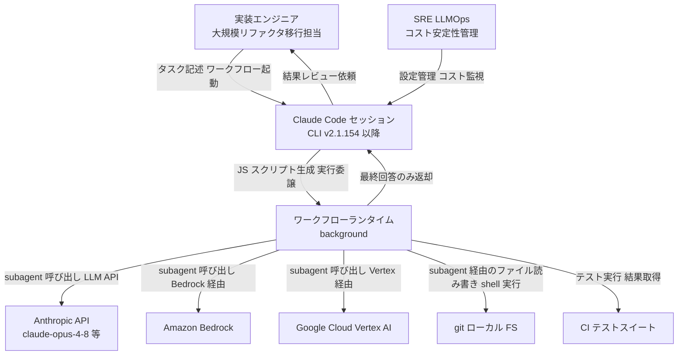
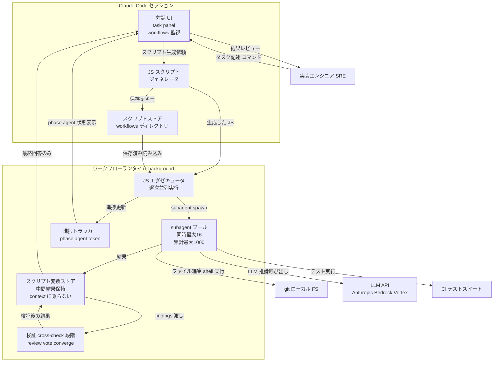
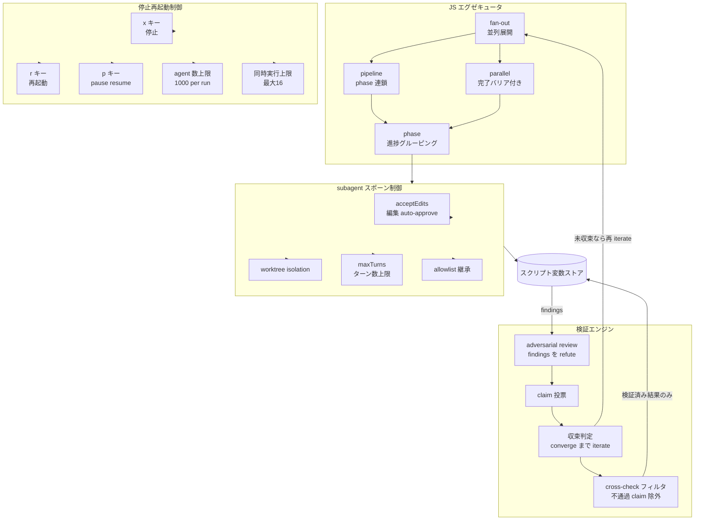
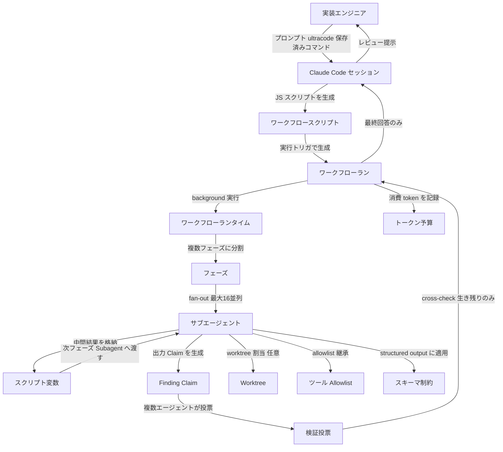
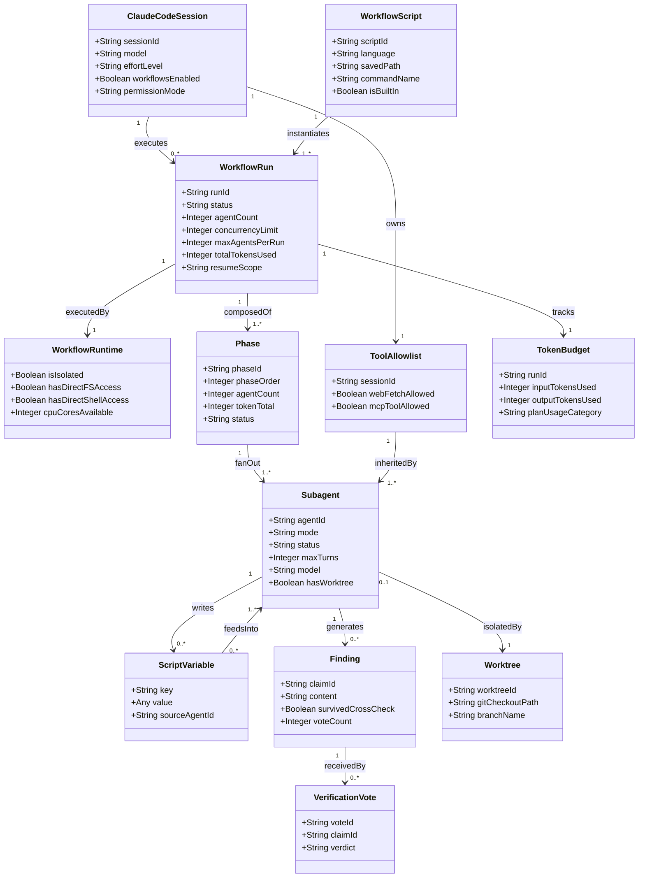

> 調査日: 2026-05-30 / 対象: Claude Code dynamic workflows（Claude Opus 4.8 と同時提供、2026-05-28、research preview）
> 視座: 「便利機能ではなく、並列実行時の責任境界と検証設計の問題として読む」

## 概要

2026-05-28、Anthropic は Claude Opus 4.8（`claude-opus-4-8`）と同時に、Claude Code へ **dynamic workflows（動的ワークフロー）** を **research preview** として追加しました。

公式は次のように定義します（一次: code.claude.com/docs/en/workflows）。

> "A dynamic workflow is a JavaScript script that orchestrates subagents at scale. Claude writes the script for the task you describe, and a runtime executes it in the background while your session stays responsive."

**この機能が解決する課題を整理します。** 従来の subagents や skills では、Claude がオーケストレーターとしてターンごとに次の手を判断します。その結果、中間結果がすべて Claude の context window に蓄積し、大規模タスクでは context 枯渇がボトルネックになります。dynamic workflows はこの構造を根本から変えます。

> "A workflow moves the plan into code. ... A workflow script holds the loop, the branching, and the intermediate results itself, so Claude's context holds only the final answer."

本質は「**Claude が書く JavaScript のオーケストレーションスクリプトを、ランタイムが background で実行する**」仕組みです。ループ・分岐・中間結果はスクリプト変数に外出しされ、Claude の会話 context には最終回答だけが戻ります。これにより context 枯渇を回避し、桁違いのスケールに到達します。

**Claude Opus 4.8 との関係を確認します。** dynamic workflows は Opus 4.8 と同日リリースですが、モデルへの依存は技術的制約というより機能的要件に近いものです。Opus 4.8 が実現した次の改善が、数百エージェント・数千ファイル規模の長時間ワークフローを「現実的に完走できる」前提になります（一次: anthropic.com/news/claude-opus-4-8）。

- longer agentic runs の持続力
- tool calling の効率化（同じ知能で fewer steps）
- コードの flaw 見逃し確率が前世代比 約 1/4
- `xhigh` effort による ultracode（`xhigh` reasoning と自動 workflow orchestration の組み合わせ）のサポート

**利用要件をまとめます。**

- CLI バージョン: **Claude Code v2.1.154 以降が必須**（research preview）
- 対応プラン: Claude Code docs では **全有料プラン（Pro / Max / Team / Enterprise）** に加え、Anthropic API・Amazon Bedrock・Google Cloud Vertex AI・Microsoft Foundry。ローンチブログは Max / Team / Enterprise のみ言及し Pro に触れていないため、docs とブログで粒度が異なります。Pro は `/config` から手動 ON が必要です。

## 特徴

### 並列上限: 同時 16 / 累計 1,000

- **同時実行**: 最大 16 concurrent agents。CPU コアが少ないマシンでは動的に減少します。
- **1 ラン累計上限**: 1,000 agents total per run。runaway loop（暴走ループ）を防ぐ backstop です。

マーケティング文言「hundreds of parallel subagents」の実体は「同時 16 並列 × 累計最大 1,000」というランタイム制約であり、現実的なスケールは「数十〜数百 / ラン」です。

### 対応プラン

| 観点 | 内容 |
| :-- | :-- |
| 対応範囲（docs） | Pro / Max / Team / Enterprise の全有料プラン + Anthropic API + Bedrock / Vertex / Foundry |
| Pro の扱い | デフォルト off。`/config` で手動 ON が必要 |
| docs とブログの差 | ローンチブログは Max / Team / Enterprise のみ言及。一次 docs が Pro を含む全有料プランと明記のため一次を採用 |
| 課金 | Claude Code 通常セッションでは追加課金の明示なし。通常プランの usage / rate limit に算入し token 消費は顕著に増加。Agent SDK / `claude -p` / GitHub Actions は後述の 2026-06-15 課金分離に注意 |

### 制御プリミティブ

| プリミティブ | 説明 |
| :-- | :-- |
| fan-out | タスクをサブタスクに分解し並列 subagent に展開 |
| parallel | 全 subagent 完了を待つバリア付き並列実行 |
| pipeline | phase を連鎖させる段階構成。段階間バリアなしで前段出力を次段入力へ |
| phase | runtime / UI レベルの第一級概念。phase ごとに agent count / token total / elapsed time を追跡 |
| schema / structured output | 中間結果を JS オブジェクトとして構造化保持し次段 subagent へ渡す。専用 API の明示はなくスクリプト変数経由が実態 |
| worktree isolation | `isolation: "worktree"` で subagent のファイル編集を個別 git worktree へ。並列編集の衝突を回避 |
| budget 制御 | 大規模ラン前に `/model` を確認し、一部 stage を安価なモデルにルートして token 節約 |

### self-verification = 敵対的クロスチェック

公式は次のように述べます。

> "Moving the plan into code also lets a workflow apply a repeatable quality pattern: it can have independent agents adversarially review each other's findings before they're reported, or draft a plan from several angles and weigh them against each other."

`/deep-research` の具体動作は次のとおりです。

> "Fans out web searches on a question across several angles, fetches and cross-checks the sources it finds, votes on each claim, and returns a cited report with claims that didn't survive cross-checking filtered out."

実体は次の 3 つです。

1. 独立エージェント同士の敵対的相互レビュー
2. claim 単位の投票とクロスチェック落ちのフィルタ
3. 複数アングルからのプラン起案と相互比較

「出力を検証してから報告する」の正体がこれです。ただし同系統モデルによるクロスチェックは同じ盲点を共有するリスクが残ります。品質保証と読み替えてはいけません（詳細は「トラブルシューティング」）。

### 起動 3 ルート

| ルート | 起動方法 | 補足 |
| :-- | :-- | :-- |
| プロンプト | `workflow` の語を含める | その 1 タスクだけを workflow 化。誤検知時は `alt+w` で無視 |
| ultracode | `/effort ultracode` | `xhigh` reasoning + 自動 workflow orchestration。`xhigh` 対応モデル限定。セッション限り |
| 保存済みコマンド | bundled `/deep-research` または `s` 保存の `/<name>` | 保存先は `.claude/workflows/`（プロジェクト共有）か `~/.claude/workflows/`（自分専用）。同名はプロジェクト優先 |

## 構造

公式一次ソース（code.claude.com/docs/en/workflows）を C4 model の 3 段階で整理します。

### システムコンテキスト図



| 要素名 | 説明 |
| :-- | :-- |
| 実装エンジニア | タスクを記述し結果をレビューする人間アクター。分割単位・schema・失敗条件を設計する責任を持つ |
| SRE / LLMOps | コスト上限・無効化設定を管理し unattended ランの安定性を監視する人間アクター |
| Claude Code セッション | CLI v2.1.154 以降。タスクを受け取り JS スクリプトを生成しランタイムに委譲。最終回答のみを受け取る |
| ワークフローランタイム | セッションと隔離された background 環境で JS スクリプトを実行。subagent を spawn し中間結果を変数に保持 |
| Anthropic API / Bedrock / Vertex AI | claude-opus-4-8 等のモデルを提供する subagent の推論バックエンド |
| git / ローカル FS | subagent がファイルを読み書きする対象。worktree 分離で並列衝突を回避 |
| CI / テストスイート | subagent がテストを実行し合否を判定する外部ゲート |

### コンテナ図



| コンテナ名 | 説明 |
| :-- | :-- |
| 対話 UI | 入力受付・task panel の 1 行進捗サマリ・`/workflows` 監視ビュー |
| JS スクリプトジェネレータ | タスク記述から JS オーケストレーションスクリプトを動的生成。プランのコード化が context 節約の肝 |
| スクリプトストア | `.claude/workflows/`（プロジェクト共有）と `~/.claude/workflows/`（個人）。同名はプロジェクト優先 |
| JS エグゼキュータ | 隔離 background 環境でスクリプトを実行。ループ・分岐・並列起動を担う。スクリプト自体は FS / shell へ直接アクセス不可 |
| subagent プール | 同時最大 16 並列・累計最大 1,000。各 subagent は独立 context と system prompt を持ち acceptEdits で動作 |
| スクリプト変数ストア | 中間結果を JS 変数として保持。Claude の context に乗らないため枯渇を回避。resume 時は完了済み結果をキャッシュ返却 |
| 検証 cross-check 段階 | 独立 subagent が findings を敵対的レビュー・claim 投票・生き残りのみ次段へ |
| 進捗トラッカー | phase / agent / token total / elapsed を追跡。Claude Code 終了で状態は消え次セッションは fresh start |

### コンポーネント図



| コンポーネント | 説明 |
| :-- | :-- |
| fan-out | タスクを分解して複数 subagent に並列展開 |
| parallel | 全 subagent 完了を待つバリア付き並列実行 |
| pipeline | phase を連鎖させる段階型制御。段階間バリアなしで前段出力を次段入力へ |
| phase | runtime / UI が明示的に追跡する進捗グルーピング単位 |
| acceptEdits | spawn される subagent はすべて acceptEdits で動作しファイル編集を auto-approve |
| worktree isolation | subagent ごとに個別 git checkout を割り当て衝突を回避 |
| maxTurns | subagent の最大 agentic turns を制限。時間でなくターン数で制御 |
| allowlist 継承 | subagent はセッションの allowlist を継承。allowlist 外 call はラン中でも permission prompt を発生 |
| adversarial review | 独立 subagent が他の findings を refute しようとする敵対的レビュー |
| claim 投票 | 複数 subagent が個々の claim に vote |
| 収束判定 | answers が converge するまで iterate。未収束なら fan-out へ戻る |
| cross-check フィルタ | 生き残れなかった claim を最終出力から除外 |
| x / r / p キー | 個別全体停止・running agent 再起動・pause resume。完了済み作業は保持 |
| agent 数上限 / 同時実行上限 | 1,000 per run の runaway backstop と最大 16 の同時実行制限 |

## データ

### 概念モデル



| エンティティ | 説明 |
| :-- | :-- |
| ClaudeCodeSession | ユーザーが操作するインタラクティブセッション。workflow 実行中も responsive を維持 |
| WorkflowScript | Claude が生成する JavaScript スクリプト。ループ・分岐・中間結果保持・subagent 起動をコードで表現 |
| WorkflowRun | スクリプトの 1 回の実行インスタンス。同一セッション内で resume 可能 |
| WorkflowRuntime | background でスクリプトを実行する isolated environment。会話 context から分離 |
| Phase | Run を構成する進捗グループ。phase ごとに agent count / token total / elapsed time を表示 |
| Subagent | Phase 内で fan-out される worker。常に acceptEdits モードで file 編集を auto-approve |
| ScriptVariable | Subagent の中間結果を保持する JS 変数。Claude の context window に載らないスケールの鍵 |
| Finding / Claim | Subagent が生成した主張・調査結果の単位。claim 単位で cross-check |
| VerificationVote | 複数 Subagent が Finding に賛否投票する検証プリミティブ。生き残った Claim のみ最終結果へ |
| Worktree | git worktree による個別 checkout。`isolation: "worktree"` で並列編集衝突を回避 |
| TokenBudget | Run 全体の token 消費量。プランの usage / rate limit に算入。workflow 専用課金なし |
| ToolAllowlist | セッションが許可した tool のリスト。Subagent はこれを継承 |
| Schema | structured output に適用する型制約。ScriptVariable 経由で次 Phase へ渡す整合性を担保 |

### 情報モデル



| 属性 | 一次確認 | 注記 |
| :-- | :-- | :-- |
| concurrencyLimit = 16 | 確認済 | "Up to 16 concurrent agents, fewer on machines with limited CPU cores" |
| maxAgentsPerRun = 1000 | 確認済 | "1,000 agents total per run" |
| resumeScope = same-session | 確認済 | "Resume works within the same Claude Code session..." |
| status 値域 | 推測 | running / paused / completed / stopped。公式列挙なし |
| isIsolated = true | 確認済 | "executes the script in an isolated environment, separate from your conversation" |
| hasDirectFSAccess = false | 確認済 | "No direct filesystem or shell access from the workflow itself" |
| mode = acceptEdits | 確認済 | "Subagents spawned by workflows always run in acceptEdits mode" |
| value 型 | 推測 | JS オブジェクトで任意型。型定義の明示なし |
| verdict 値域 | 推測 | support / refute。公式は "votes on each claim" のみ |
| planUsageCategory | 確認済 | "Runs count toward your plan's usage and rate limits..." |
| timeout | 公式未明記 | タイムアウト秒数の記載なし。runaway 防止は agent 数で担保 |

## 構築方法

### 前提条件

- **CLI バージョン**: Claude Code v2.1.154 以降が必須（research preview）
- **プラン**: 全有料プラン対応（Pro / Max / Team / Enterprise）。Anthropic API・Bedrock・Vertex AI・Foundry でも利用可能
- **Pro の注意**: デフォルト無効。`/config` を開き「Dynamic workflows」行から ON にします
- **推奨モデル**: Opus 4.8（`claude-opus-4-8`）。`ultracode`（effort xhigh）はこのモデルで利用可能

### 無効化方法

```bash
# 方法1: 対話コマンド（永続）
/config            # → "Dynamic workflows" トグルを OFF

# 方法2: 設定ファイル（~/.claude/settings.json、永続）
#   { "disableWorkflows": true }

# 方法3: 環境変数（起動時に読まれる）
export CLAUDE_CODE_DISABLE_WORKFLOWS=1
```

組織単位では managed settings の `{ "disableWorkflows": true }`、または admin settings ページのトグルで無効化します。無効化すると、バンドルワークフローコマンドが使用不可になり、`workflow` キーワードが非トリガーになり、`/effort` から `ultracode` が消えます。

### 設定パス

```text
.claude/workflows/          # プロジェクト配下 → クローンした全員と共有
~/.claude/workflows/        # ホーム → 全プロジェクトで自分のみ利用可
```

同名が両方に存在する場合は **プロジェクト側が優先** されます。保存したワークフローは `/<name>` として `/` autocomplete に表示されます。

### 保存・再利用手順

1. ワークフローを実行する
2. `/workflows` でラン一覧を開く
3. 保存したいランを選択し **`s`** を押す
4. Tab で保存先を切り替える（`.claude/workflows/` ↔ `~/.claude/workflows/`）
5. Enter で保存し、以降 `/<name>` として呼び出す

## 利用方法

### 3 つの起動方法

```text
# 方法1: プロンプトに workflow の語を含める（その1タスクだけ workflow 化）
Run a workflow to audit every API endpoint under src/routes/ for missing auth checks
#   → 誤検知時は alt+w で無視

# 方法2: /effort ultracode（セッション全体で自動 workflow 計画）
/effort ultracode
#   → 通常作業に戻すなら /effort high

# 方法3: 保存済み bundled コマンドを直接実行
/deep-research What changed in the Node.js permission model between v20 and v22?
```

### bundled ワークフロー `/deep-research`

現時点で公式 docs に掲載されているバンドルワークフローは `/deep-research` のみです（WebSearch tool が必要）。動作フローは次のとおりです。

1. 質問を複数角度に展開して Web 検索を fan-out
2. 各ソースを fetch しクロスチェック
3. 各 claim に投票
4. 生き残らなかった claim をフィルタ
5. 引用付きレポートを返す

### オーケストレーションスクリプトの構造例

ワークフローの実体は Claude が生成する JavaScript スクリプトです。**公式 docs に完全なコード例の掲載はないため、以下は公式の説明・制約から導出した構造例です。** `agent()` 等の関数名は説明用の仮称であり、実際の記法は Claude が生成するため変動します。

```javascript
// 【例: fan-out パターン】src/routes/ 配下の全 API を並列監査
const routes = await agent("List all API endpoint files under src/routes/");
// → スクリプト変数に格納。Claude の context には入らない
const auditResults = await Promise.all(
  routes.files.map(file =>
    agent(`Audit ${file} for missing auth checks. Return { file, issues: [] }`)
  )
);
// 同時実行は最大 16 並列（CPU コアが少ない場合はより少ない）
```

```javascript
// 【例: pipeline パターン】段階連鎖（前段出力をスクリプト変数経由で次段へ）
const lifetimeMap = await agent("Map correct Rust lifetimes for all Zig struct fields in src/");
const portResults = await Promise.all(
  lifetimeMap.structs.map(struct =>
    agent(`Port ${struct.file} from Zig to behavior-identical Rust. Lifetime map: ${JSON.stringify(struct.lifetimes)}`)
  )
);
const buildResult = await agent(`Run build and tests. Fix failures in: ${portResults.map(r => r.file).join(", ")}`);
```

```javascript
// 【例: adversarial cross-check パターン】各 claim を別エージェントが反証
const findings = await Promise.all(
  angles.map(angle => agent(`Research: "${question}" from angle: ${angle}`))
);
const crossChecks = await Promise.all(
  findings.map(f => agent(`Try to refute this finding with counter-evidence: ${f.claim}`))
);
const survivedClaims = findings.filter((_, i) => !crossChecks[i].refuted);
const report = await agent(`Synthesize a cited report from these verified claims: ${JSON.stringify(survivedClaims)}`);
```

```javascript
// 【例: worktree isolation】並列ファイル編集の衝突を回避
const results = await Promise.all(
  files.map(file => agent(`Refactor ${file}`, { isolation: "worktree" }))
  // → 各 subagent が個別の git checkout を持つ
);
```

公式が示すランタイムの limits は次のとおりです。

| 制約 | 内容 |
| :-- | :-- |
| 同時実行エージェント数 | 最大 16 並列（CPU コアが少ない場合はより少ない） |
| 1 ラン累計エージェント数 | 最大 1,000 agents per run（runaway loop 防止） |
| mid-run ユーザー入力 | 不可（agent permission prompt のみがランを pause） |
| ワークフロー自身の FS / shell アクセス | 不可（読み書き・コマンド実行は subagent が担う） |

### 実行中の操作

```text
/workflows    # ラン一覧 → 矢印キーで選択 → Enter で進捗ビュー
```

| キー | 操作 |
| :-- | :-- |
| `↑` / `↓` | フェーズ / エージェントを選択 |
| `Enter` / `→` | ドリルイン（プロンプト・直近ツールコール・結果を表示） |
| `Esc` | 1 レベル戻る |
| `j` / `k` | エージェント詳細ビュー内のスクロール（オーバーフロー時） |
| `p` | ラン全体を pause / resume |
| `x` | 選択エージェント停止 / 全体停止 |
| `r` | 選択中の running エージェントを再起動 |
| `s` | ランのスクリプトをコマンドとして保存 |

### resume の挙動と制約

- 再開すると完了済みエージェントはキャッシュ結果を返し、残りだけライブ実行されます。完了済み作業は保持されます。
- **重要な制約**: resume は **同一 Claude Code セッション内のみ** 有効です。Claude Code を終了すると次セッションでは最初からやり直しになります。

## 運用

### コスト管理: token budget で自分から止める設計

- 公式 docs は「dynamic workflows は通常セッションより *meaningfully more usage* を消費し、コストが急速に climb する」と認めています。
- **公式の 1,000 エージェント上限は runaway 防止の backstop** であり運用上限ではありません。コスト管理はスクリプト内に組み込む必要があります。
  - `maxTurns` で各 subagent の最大 agentic turns を制限します。
  - phase ごとにスクリプトを分割し、各段階の完了を確認してから次を走らせます。
  - 大規模ラン前に `/model` を確認し、一部 stage を小さいモデルにルートして節約します。
- `claude -p` や Agent SDK は `bypassPermissions` 相当で承認ダイアログが出ません。unattended 実行ではコスト爆発への歯止めがなく、「このタスクをオーケストレーションするな」と止めるガバナンス層が欠けます。

#### 2026-06-15 の Agent SDK 課金分離

- Anthropic ヘルプセンターによると、2026-06-15 から Agent SDK / `claude -p` / GitHub Actions 経由の使用量は **月次の Agent SDK クレジットから先に消費** されます。
- クレジット超過分は usage credits（標準 API レート）が適用されます（事前に usage credits の有効化が必要）。未使用クレジットの繰り越しは不可です。
- 課金倍率の試算（12x〜）は二次情報で正確な値はワークロード次第ですが、「独立コンテキストごとにフルにトークンを焼く」構造的コスト増は公式が認めています。

```text
# コスト管理の最小チェックリスト
1. 小規模スコープ（単一ディレクトリ / 機能単位）から試す
2. ultracode はセッション全体に適用されるため選択的に使う
3. 長時間ランの前に tool allowlist を完備する（prompt 待ちでランが滞留し再開不能や無駄な再実行につながる）
4. unattended 実行は 2026-06-15 以降 Agent SDK クレジット消費に切り替わる
```

### 並列度設計: 16 / 1,000 上限の意味

| 制約 | 公式値 | 理由 |
| :-- | :-- | :-- |
| 同時実行 concurrency | 最大 16 並列（CPU コアが少ないマシンではそれ未満） | ローカルリソースの上限 |
| 1 ラン累計 | 1,000 agents | runaway loop 防止の backstop |

- **16 並列を前提にした負荷設計が必要** です。fan-out 幅を 16 より広くしてもキューに詰まり、速度は変わらず token 消費だけ増えます。
- subagents 単体（workflow でない場合）には 16 / 1,000 の明示的上限は適用されません（workflow 固有の制約）。

### acceptEdits を本番直結しない

- ワークフローが spawn する subagent は **常に `acceptEdits` モードで走り、ファイル編集を auto-approve** します（session の permission mode に関わらず適用）。
- 推奨隔離パターンは、`isolation: "worktree"` で subagent ごとに個別 git worktree を割り当て、本番 main への直接適用ではなく feature / review ブランチへの PR として出す方法です。
- **非 git プロジェクトは worktree 分離が効きません**。worktree 内 agent は main checkout の未コミット変更を参照できず環境認識を失うリスクがあります。

### 再開制約: 同一セッション内のみ

公式 docs は次のように述べます。

> "Resume works within the same Claude Code session. If you exit Claude Code while a workflow is running, the next session starts the workflow fresh."

- 中断・再開は同一セッション内に限ります。background subagent が allowlist 外のコマンドや MCP ツールを使おうとすると、**permission prompt でランが一時停止** します（auto-deny ではなく pause）。夜間の unattended ランが permission 待ちで止まり、セッションが途切れると再開不能になります。
- 対策は、ランの前に必要な全コマンドを allowlist に追加することです（`/config` や `settings.json`）。

### 責任境界の 4 層

| 層 | 担当 | 検証ポイント |
| :-- | :-- | :-- |
| 依頼層（人間） | 何を・どの単位で・どの順序で分割するか | スクリプトの設計意図が正しく JS に変換されているか確認 |
| オーケストレーション層（JS） | 並列度・段階・依存関係・schema 制約 | 承認前にスクリプトをレビューし fan-out 幅・停止条件を確認 |
| 実行層（subagent 群） | acceptEdits でファイルを直接書き換える | worktree 分離・diff レビュー・CI による自動検証 |
| 検証層（cross-check） | refute / vote で findings を絞る | 同系統モデルの限界を受け継ぐため人間レビューと CI を最終ゲートに |

## ベストプラクティス

### 依頼文より「分割単位・レビュー観点・失敗時巻き戻し条件」を先に設計する

- **誤解**: 自然言語で依頼すれば Claude が勝手に分割して並列化してくれる。
- **反証**: 「dispatch problem（どこで分割し、何を parallel に、何を sequential に保つか）は未解決で、あなたの頭の中にある。アーキテクチャがその穴を埋めてくれない」（rundatarun.io）。worktree 分離があっても、各 subagent の schema と責務境界を事前に決めないと fabricated result を返します（Issue #29181）。
- **推奨**: ランを承認する前に次を確認します。

```text
ワークフロー設計チェックリスト
[ ] 分割単位: 各 subagent が担当する範囲は排他的か
[ ] schema: 各 subagent が返すべき structured output を定義したか
[ ] 依存関係: 段階間バリアが必要な箇所はどこか
[ ] レビュー観点: cross-check エージェントへの refute すべき軸を明示したか
[ ] 巻き戻し条件: どの段階で失敗したら全体を止めるか
[ ] allowlist: ランに必要な全ツール コマンドは事前追加済みか
[ ] worktree: git プロジェクトで isolation worktree を使うか確認
```

### コスト上限・停止条件をワークフローに組み込む

- **誤解**: 公式の 1,000 上限があるからコスト爆発は起きない。
- **反証**: Anthropic 自身が「1,000 は runaway loop の backstop」であり運用上限ではないと認めています。`claude -p` や SDK ではユーザー確認なしで即実行されます。2026-06-15 以降は Agent SDK クレジットの先消費になり超過分は標準 API レートで請求されます。
- **推奨**: スクリプト段階を分割し、各段階の完了を人間が確認してから次を走らせます。`No mid-run user input` 制約があるため、段階を別ワークフローとして逐次起動するのが公式推奨パターンです。unattended 実行では最大 agent 数をスクリプト変数で自前管理し、閾値超えで early exit します。

### 自己検証出力を「検証済み」と読まない

- **誤解**: dynamic workflows は自己検証してから報告するので品質が担保されている。
- **反証**: arXiv 2603.18740v2（査読前）は、コードを「bug-free」と framing するとバグ検出率が 16.2〜93.5pt 低下し false-negative bias が支配的になることを示します（Claude Opus 4.5 は非有意 -4.9pt）。**adversarial 第 2 パスが同系統モデルなら同じ盲点を共有し同時に見逃します**。「50 個の plausible bug を fan-out すると単一の慎重なパスより悪い。人間がノイズを triage させられる」（rundatarun.io）。
- **推奨**: CI（外部テスト）を最終ゲートに必ず置きます。異なるモデル（Codex / Gemini 等）に並行レビューさせる adversarial review を CI に加えます。schema 定義から逸脱した出力は必ず reject する仕組みを入れます。

## トラブルシューティング

### GitHub Issue 実在事例

`anthropics/claude-code` リポジトリで存在を確認した 4 件です。

| Issue | 状態 | 症状 | 対策 |
| :-- | :-- | :-- | :-- |
| #29181 | closed（not planned） | 複数 parallel Task を意図しても 1 個しか結果を emit せず残りは fabricated result（`claude-opus-4-6` で再現報告） | 各 subagent に structured output schema を必須指定し返却値の型・件数を検証。空 / undefined なら破棄して再実行 |
| #7955 | closed（not planned） | test 失敗時に並列インスタンスが多重 spawn しリソース浪費・ファイル衝突 | `isolation: "worktree"` で隔離。失敗時に spawn を止めて report するロジック |
| #14867 | closed（duplicate） | 並列 subagent が一斉に context 上限に達して halt、手動 `/compact` が必要に | 担当スコープを絞り context を圧迫しない粒度に分割。`maxTurns` で早期終了 |
| #57037 | open | 1 メッセージで複数 Agent tool call で permission cascade-failure。逐次なら成功（v2.1.126） | tool allowlist を事前完備。失敗した background subagent は foreground で同タスク再実行が公式推奨 |

### self-verification の限界

- **論文**: "Measuring and Exploiting Contextual Bias in LLM-Assisted Security Code Review"（arXiv:2603.18740v2, submitted 2026-03-19 / revised 2026-04-23、査読前）
- **主な知見**: コードを「バグフリー」と framing すると対象モデルのバグ検出率が 16.2〜93.5pt 低下します（false-negative bias 支配）。Claude Opus 4.5 は耐性があり低下は非有意（-4.9pt）でしたが、Opus 4.8 での結果は本論文の対象外で未確認です。
- **実務的含意**: dynamic workflows の「findings を refute する adversarial 第 2 パス」が同一モデル群で構成される場合、構造的に同じ blind spot を持つリスクがあります。自己検証を通過した出力でも CI と人間レビューを省略できない根拠になります。

### allowlist 漏れで夜間ラン停止

```jsonc
// 事前設定: ~/.claude/settings.json（または .claude/settings.json）
{
  "permissions": {
    "allow": [
      "Bash(git:*)",
      "Bash(npm:*)",
      "Bash(pytest:*)"
      // ... ランに必要な全コマンドを事前列挙
    ]
  }
}
```

発生後は `/workflows` で状態を確認し、停止中ランを `x` で終了し、allowlist 追加後に再実行します。権限不足で失敗した subagent は foreground で同タスクを再起動して interactive prompt で権限を付与します。

### worktree 隔離の落とし穴

- 非 git プロジェクトでは worktree 分離が機能せず working-dir 衝突リスクが残ります。
- worktree 内 agent は main checkout の未コミット変更（`.env`・ローカル設定）を参照できません。必要な状態は事前に git commit し、worktree が参照するブランチに含めます。

## まとめ

Claude Code の動的ワークフローは、プランを JavaScript スクリプトへ外出しして並列 subagent を background 実行し、中間結果を context から切り離すことで大規模作業のスケールを実現します。一方で、同時 16 / 累計 1,000 の上限・acceptEdits の自動編集・同一セッション内のみの resume・自己検証の構造的限界があり、便利機能ではなく「並列実行時の責任境界と検証設計」の問題として読むと、依頼文より先に分割単位・レビュー観点・コスト上限・失敗時巻き戻し条件を設計すべきだと分かります。

この記事が少しでも参考になった、あるいは改善点などがあれば、ぜひリアクションやコメント、SNSでのシェアをいただけると励みになります！

## 参考リンク

- 公式ドキュメント
  - [Orchestrate subagents at scale with dynamic workflows](https://code.claude.com/docs/en/workflows)
  - [Run agents in parallel](https://code.claude.com/docs/en/agents)
  - [Create custom subagents](https://code.claude.com/docs/en/sub-agents)
  - [Manage costs](https://code.claude.com/docs/en/costs)
  - [Introducing Claude Opus 4.8](https://www.anthropic.com/news/claude-opus-4-8)
  - [Introducing dynamic workflows in Claude Code](https://claude.com/blog/introducing-dynamic-workflows-in-claude-code)
  - [Models overview](https://platform.claude.com/docs/en/docs/about-claude/models/overview)
  - [Model deprecations](https://platform.claude.com/docs/en/about-claude/model-deprecations)
  - [Use the Claude Agent SDK with your Claude plan](https://support.claude.com/en/articles/15036540)
- GitHub
  - [anthropics/claude-code Issues](https://github.com/anthropics/claude-code/issues)
- 記事
  - [Measuring and Exploiting Contextual Bias in LLM-Assisted Security Code Review (arXiv:2603.18740)](https://arxiv.org/abs/2603.18740)
  - [rundatarun.io](https://rundatarun.io)
