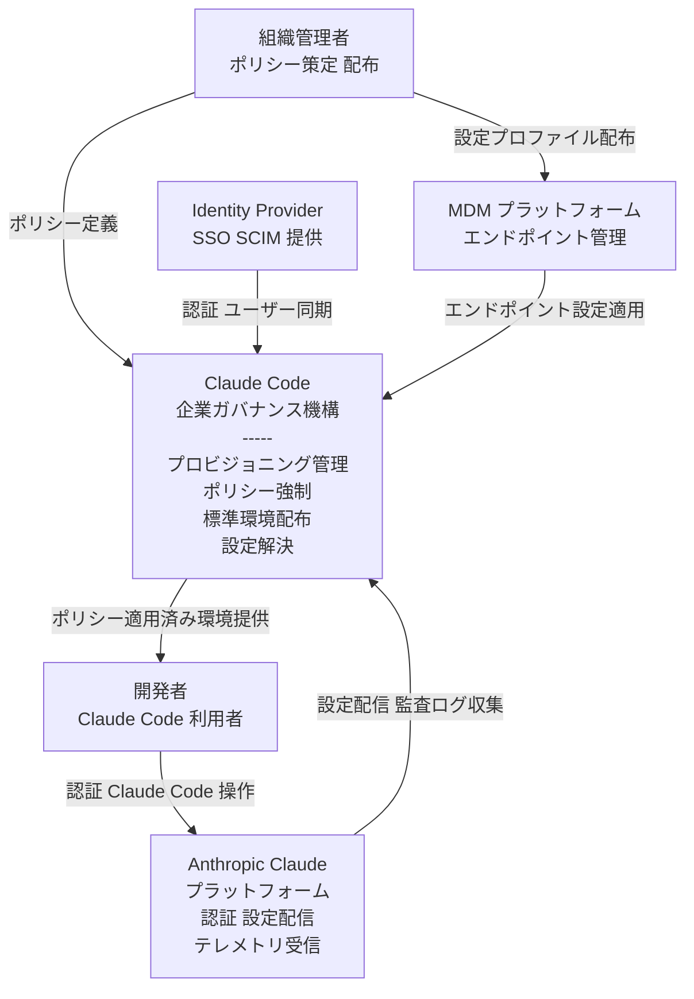
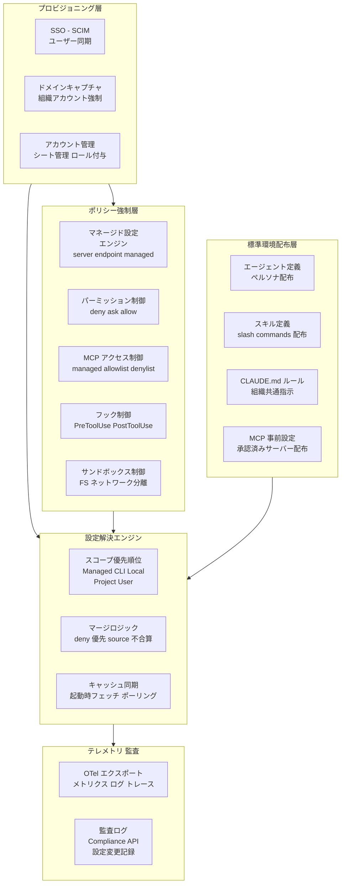
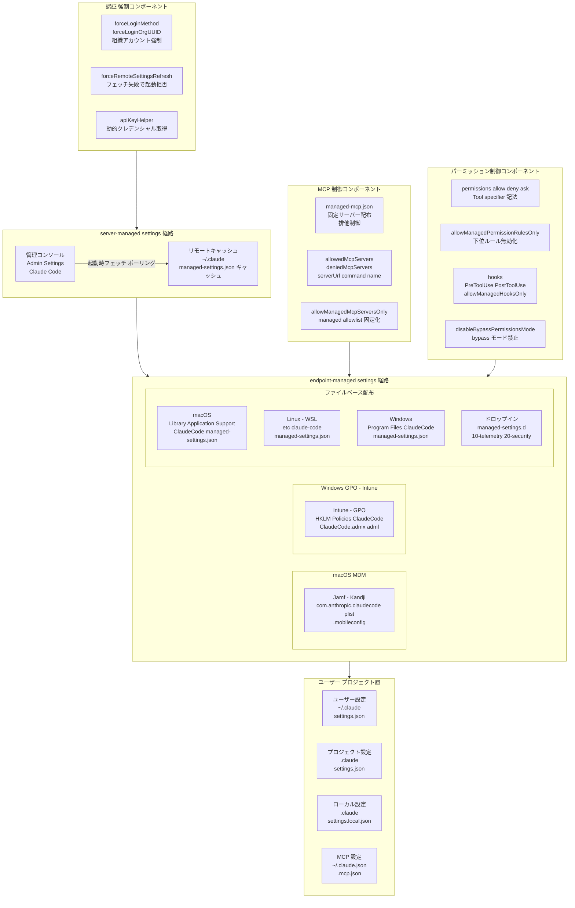
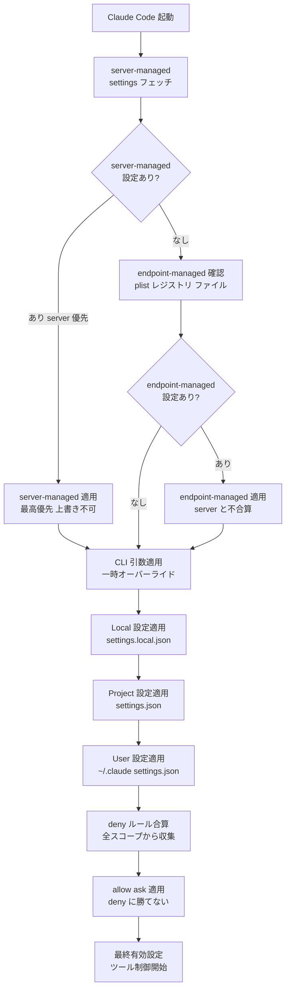
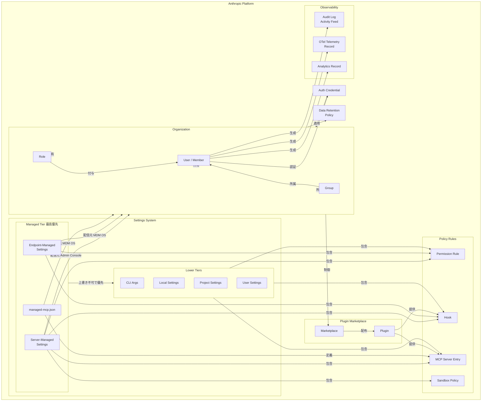
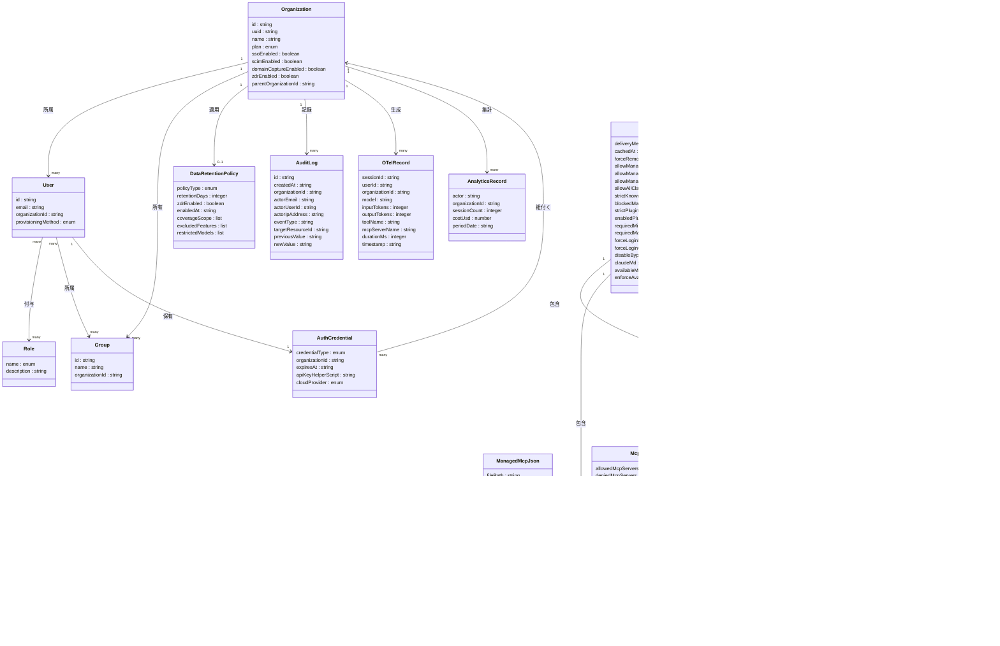

> この記事は 2026-06 時点の Claude Code 公式ドキュメント（settings / server-managed-settings / IAM / permissions / zero-data-retention 等）を一次情報として検証した技術調査です。

## ■概要

Claude Code は Anthropic が提供する CLI 形式の AI コーディングツールです。ファイル削除・本番環境変更・外部ネットワーク通信など、開発環境に対して広範な操作権限を持ちます。個人利用であれば柔軟性が価値になりますが、企業組織に配布するとき、その柔軟性はそのままリスクになります。

企業展開の本質的な課題は「誰が使えるか」「何を許可するか」「どんな使い方を配るか」という 3 つの問いが、それぞれ異なる仕組みで答えを持つ点にあります。これらを混同すると統制が機能しません。

Claude Code のガバナンス設計は、この 3 つの問いを層ごとに分離して管理する「3 層分離モデル」として整理できます。

### 3 層分離モデルの全体像

| 層 | 問い | 主な担い手 | 強制力 |
|---|---|---|---|
| ① プロビジョニング層 | 誰が使えるか | Claude for Teams/Enterprise、SSO（SAML）、SCIM、ドメインキャプチャ | あり |
| ② ポリシー強制層 | 何を許すか・何を禁止するか | managed settings、permissions、hooks、MCP 制御、forceLoginOrgUUID | あり |
| ③ 標準環境配布層 | どんな使い方を配るか | Starter Kit（agents・commands・skills・hooks・CLAUDE.md） | 原則なし |

基本原則を一言で表すと次のようになります。

> **「道具は Starter Kit で配り、境界線は managed settings で強制する」**

①②は技術的に強制できる層です。③はユーザーが編集できる推奨層であり、強制したい統制を③に置くと無効化されます。本調査は、この 3 層をどう分離し、②をどう強制するかを構造・データ・構築・利用・運用の観点で整理します。

### Starter Kit 単体アプローチの限界

Starter Kit（③層）は、ワンコマンドで標準化された開発環境をセットアップするツールです。標準エージェント・コマンド・CLAUDE.md・安全網スクリプトを一括配布し、チーム全体の使い方を統一します。

しかし Starter Kit のファイルはユーザーが編集できます。ローカルの `settings.json` や `.claude/` 以下の設定は、ユーザーが書き換えれば即座に無効化されます。Starter Kit は「推奨する使い方」を配布できますが、「外せない境界線」を強制できません。

### アプローチ別比較

| 比較項目 | Starter Kit 単体 | managed settings 併用 | MDM/OS-level 強制 |
|---|---|---|---|
| 強制力 | なし（ユーザーが編集可能） | あり（最高優先度・上書き不可） | 最強（OS レベルで保護） |
| 改ざん耐性 | なし | 低〜中（キャッシュ改ざんは次回フェッチで復元） | 高（ファイルを OS が保護） |
| 配布手段 | インストールスクリプト / git clone | 管理コンソール / MDM / ファイル配置 | Jamf / Kandji / Intune / Group Policy |
| 適用規模 | 小〜中（手動配布） | 中〜大（全組織に自動配信） | 大（MDM 管理デバイス全台） |

server-managed settings は MDM 不要で利用でき、Claude for Teams/Enterprise プランで利用可能です。ユーザーが組織の認証情報でログインすると、Anthropic のサーバーから自動的に設定が配信されます。MDM 管理デバイスでは endpoint-managed settings（macOS plist・Windows レジストリ・managed-settings.json）が OS レベルの改ざん保護を加えます。

## ■特徴

### Starter Kit でできること

- ワンコマンドによる初期セットアップ（macOS / Windows 対応）
- 標準化されたエージェント（security-reviewer・architect 等）の配布
- 標準コマンド（`/plan`・`/tdd` 等）の配布
- CLAUDE.md によるコーディングルールの統一
- 安全網スクリプト（Safety Net）による自動検査の組み込み
- 新メンバーのオンボーディング加速

### Starter Kit でできないこと

- 会社管理アカウントでのログイン強制（①層が担当）
- 個人 Claude アカウントへの切り替え禁止（②層が担当）
- MCP サーバーの組織的な制御（②層が担当）
- 全社ログ収集・監査（OpenTelemetry・Compliance API が担当）
- permissions・hooks の強制適用（②層が担当）

### managed settings の特徴

- **優先度が最高**: ユーザー設定・プロジェクト設定・コマンドライン引数でも上書きできません
- **複数の配信方式**: server-managed settings（管理コンソール経由）・MDM/OS-level policy・ファイルベースから選択できます
- **リアルタイム更新**: permissions・hooks は再起動不要で即時反映されます。起動時フェッチ＋約 1 時間間隔のポーリングで取得します
- **Managed-only 設定**: `allowManagedPermissionRulesOnly`・`allowManagedMcpServersOnly`・`forceLoginOrgUUID` など、managed からのみ有効な設定キーが存在します
- **フェールクローズ対応**: `forceRemoteSettingsRefresh: true` を設定すると、設定フェッチ失敗時に CLI が起動を拒否します

### 個人アカウント切替が引き起こす問題

ユーザーが組織アカウントから個人の Claude Pro/Max に切り替えると、以下の影響が生じます。

- server-managed settings の配信対象外になります
- managed permissions・hooks・MCP 制御の強制が外れます
- 組織の監査ログ・billing 集計から外れます
- データ保持ポリシーが Consumer 条件（モデル改善対象になり得る）に切り替わります

この問題は単なる課金回避ではなく、**監査・保持・MCP 制御の境界そのものが変わる**という本質的なリスクを持ちます。`forceLoginOrgUUID` を managed settings に設定すると、組織外アカウントでのログインを技術的にブロックできます。ただし管理者権限を持つユーザーに対する完全な保護には MDM との組み合わせが必要です。また Amazon Bedrock / Google Vertex AI / Microsoft Foundry 経由で接続した場合、server-managed settings は配信されません。

## ■構造

設定の優先順位・配布経路・強制の仕組みを「論理アーキテクチャ」として C4 の 3 段階で表現します。具体的な製品インフラではなく、ガバナンス機構の構造を描きます。

### ●システムコンテキスト図

ガバナンス機構本体と、それに関わる外部アクター・外部システムの関係を示します。



#### 要素説明

| 要素名 | 説明 |
|---|---|
| 組織管理者 | ポリシー定義・MDM プロファイル配布・server-managed settings 設定を担う企業内 IT / DevOps ロール |
| 開発者 | Claude Code を日常的に使用するエンドユーザー。ポリシー制約の内側で操作する |
| Identity Provider | SSO 認証・SCIM によるユーザープロビジョニングを提供する外部 IdP |
| MDM プラットフォーム | エンドポイントへ設定ファイル・レジストリポリシーを配布する管理基盤 |
| Anthropic Claude プラットフォーム | 認証・server-managed settings 配信・テレメトリ収集・Compliance API を提供する |
| Claude Code 企業ガバナンス機構 | 本調査の対象。3 層構造でポリシーを強制し、設定を解決してエンドポイントに適用する |

### ●コンテナ図

ガバナンス機構を構成する主要コンテナとその責務・相互依存を示します。



#### プロビジョニング層

| 要素名 | 説明 |
|---|---|
| SSO - SCIM | IdP 連携による SSO 認証・SCIM 自動プロビジョニング。SSO は Teams/Enterprise/Console が対応、SCIM は Enterprise/Console のみ対応する |
| ドメインキャプチャ | メールドメインで組織アカウントを強制する。個人アカウントへの切り替えによる境界逸脱を防ぐ |
| アカウント管理 | シート割り当て・ロール付与（Primary Owner / Owner / Member 等）を管理する |

#### ポリシー強制層

| 要素名 | 説明 |
|---|---|
| マネージド設定エンジン | server-managed settings と endpoint-managed settings の両配信経路を受け取り、最上位スコープとして適用する |
| パーミッション制御 | deny - ask - allow の 3 種ルールを評価順に適用し、ツール呼び出しを制御する |
| MCP アクセス制御 | managed-mcp.json による固定配布・allowlist/denylist によるフィルタリングを組み合わせて制御する |
| フック制御 | PreToolUse - PostToolUse フックのスクリプト実行を制御し、監査・ブロックを実装する |
| サンドボックス制御 | OS レベルでファイルシステム・ネットワークアクセスを分離する |

#### 標準環境配布層

| 要素名 | 説明 |
|---|---|
| エージェント定義 | 組織共通のペルソナ（agents/）を Starter Kit として配布する |
| スキル定義 | 再利用可能な slash commands（skills/）を Starter Kit として配布する |
| CLAUDE.md ルール | プロジェクト横断のインストラクションを組織レベルで配布する |
| MCP 事前設定 | `.mcp.json` や plugin で推奨 MCP サーバーを配布する。排他固定は ② の `managed-mcp.json` が担う |

#### 設定解決エンジン

| 要素名 | 説明 |
|---|---|
| スコープ優先順位 | Managed > CLI 引数 > Local > Project > User の順で解決する |
| マージロジック | server-managed と endpoint-managed は先着優先で不合算。deny は全スコープで合算して優先する |
| キャッシュ同期 | server-managed settings を起動時にフェッチし、約 1 時間ごとにポーリングで更新する |

#### テレメトリ 監査

| 要素名 | 説明 |
|---|---|
| OTel エクスポート | メトリクス・ログ・トレース（beta）を OTLP/Prometheus 等へエクスポートする |
| 監査ログ | Compliance API・audit log export で設定変更・ユーザー操作を記録する |

### ●コンポーネント図

各コンテナのドリルダウンです。実ファイル名・実チャネル名を含みます。



#### server-managed settings 経路

| 要素名 | 説明 |
|---|---|
| 管理コンソール | Admin Settings の Claude Code セクションで managed settings JSON を定義・保存する |
| リモートキャッシュ | フェッチした設定を `~/.claude/` 配下にキャッシュし、ネットワーク障害時に適用する |

#### endpoint-managed settings 経路（macOS MDM）

| 要素名 | 説明 |
|---|---|
| Jamf - Kandji | `com.anthropic.claudecode` plist ドメインへ設定プロファイルを配布する。`.mobileconfig` 形式 |

#### endpoint-managed settings 経路（Windows GPO - Intune）

| 要素名 | 説明 |
|---|---|
| Intune - GPO | `HKLM\SOFTWARE\Policies\ClaudeCode\Settings` レジストリに JSON を書き込む。`ClaudeCode.admx` / `ClaudeCode.adml` で GPO テンプレートを提供する |

#### endpoint-managed settings 経路（ファイルベース）

| 要素名 | 説明 |
|---|---|
| macOS | `/Library/Application Support/ClaudeCode/managed-settings.json` と `managed-mcp.json` を配置する |
| Linux - WSL | `/etc/claude-code/managed-settings.json` と `managed-mcp.json` を配置する |
| Windows | `C:\Program Files\ClaudeCode\managed-settings.json` と `managed-mcp.json` を配置する |
| ドロップイン | `managed-settings.d/` 配下に番号付き JSON を配置し、アルファベット順にマージする |

#### ユーザー プロジェクト層

| 要素名 | 説明 |
|---|---|
| ユーザー設定 | `~/.claude/settings.json`。全プロジェクト共通の個人設定 |
| プロジェクト設定 | `.claude/settings.json`。Git 管理・チーム共有設定 |
| ローカル設定 | `.claude/settings.local.json`。gitignore 対象の個人オーバーライド |
| MCP 設定 | ユーザースコープは `~/.claude.json`、プロジェクトスコープは `.mcp.json` |

#### MCP 制御コンポーネント

| 要素名 | 説明 |
|---|---|
| managed-mcp.json | 固定サーバーセットを排他的に配布する。ユーザーによる追加・変更を禁止する |
| allowedMcpServers - deniedMcpServers | serverUrl / serverCommand / serverName でサーバーをフィルタリングする |
| allowManagedMcpServersOnly | managed settings の allowlist のみを有効化し、下位スコープの allowlist を無視する |

#### パーミッション制御コンポーネント

| 要素名 | 説明 |
|---|---|
| permissions allow deny ask | `Tool(specifier)` 記法でツール呼び出しを制御する。deny > ask > allow の順に評価する |
| allowManagedPermissionRulesOnly | ユーザー・プロジェクト・ローカル設定の allow/ask/deny ルールを無効化する |
| hooks | PreToolUse / PostToolUse フックで監査・ブロックを実装する。`allowManagedHooksOnly` で managed hooks のみ有効化する |
| disableBypassPermissionsMode | `bypassPermissions` モードを禁止する |

#### 認証 強制コンポーネント

| 要素名 | 説明 |
|---|---|
| forceLoginMethod - forceLoginOrgUUID | 特定の組織アカウントでのログインを強制し、個人アカウントへの切り替えを防ぐ |
| forceRemoteSettingsRefresh | フェッチ失敗時に CLI をシャットダウンし、ポリシー未適用での起動を防ぐ |
| apiKeyHelper | 動的クレデンシャル（Vault 連携等）を取得するスクリプトを設定する |

### ●設定解決フロー図

スコープ優先順位にしたがって、最終的な有効設定を決定するフローを示します。



#### 設定解決フロー 要素説明

| 要素名 | 説明 |
|---|---|
| server-managed settings フェッチ | 起動時に Anthropic サーバーから設定を取得し、ローカルにキャッシュする |
| server-managed settings 適用 | いずれかのキーが含まれていれば endpoint-managed を完全に無視する（先着優先・不合算） |
| endpoint-managed settings 確認 | plist / レジストリ / `managed-settings.json` / `managed-settings.d/` を確認する |
| CLI 引数適用 | 一時オーバーライドを適用する。managed settings には勝てない |
| Local 設定適用 | `.claude/settings.local.json` を適用する。gitignore 対象 |
| Project 設定適用 | `.claude/settings.json` を適用する。Git で共有する |
| User 設定適用 | `~/.claude/settings.json` を適用する。全プロジェクト共通 |
| deny ルール合算 | 全スコープの deny ルールを収集し、最優先で評価する |
| allow - ask ルール適用 | deny 通過後に allow / ask を評価する。deny には勝てない |
| 最終有効設定 | ツール呼び出し制御・MCP フィルタリング・フック実行に使用する設定が確定する |

## ■データ

このガバナンス設計が扱うエンティティを、概念モデルと情報モデルで表現します。

### ●概念モデル



| 要素名 | 説明 |
|--------|------|
| Organization | Anthropic Platform 上の組織テナント。SSO / SCIM でユーザーを管理する。親組織とリンクした子組織（claude.ai / Console）を持つ |
| User / Member | 組織に所属する個人。Role と Group で権限を持つ |
| Role | ユーザーに付与される役割（Primary Owner / Owner / Member 等） |
| Group | ユーザーのグループ。Compliance API で列挙できる |
| Server-Managed Settings | Admin Console から Claude Code クライアントへ配信される設定。Teams / Enterprise で利用できる |
| Endpoint-Managed Settings | MDM・plist・registry・system ファイル経由で端末へ展開される設定 |
| managed-mcp.json | 固定 MCP サーバーセットを定義するファイル。endpoint 経由で展開。server-managed 経由は不可 |
| CLI Args | セッション単位の一時的な設定上書き。Managed Tier には劣る |
| Local Settings | `.claude/settings.local.json`。gitignore 対象でリポジトリ非共有 |
| Project Settings | `.claude/settings.json`。Git 管理でチーム共有できる |
| User Settings | `~/.claude/settings.json`。全プロジェクト共通だが管理対象外 |
| Permission Rule | ツール実行を allow / ask / deny する規則。ツール名 + パターン指定子で定義する |
| Hook | イベント駆動のシェルコマンド / HTTP / MCP ツール呼び出し。監査・ブロック・通知に使用する |
| MCP Server Entry | 接続を許可または拒否する MCP サーバーの識別情報（URL / コマンド / 名前） |
| Sandbox Policy | Bash コマンドの OS レベルファイルシステム・ネットワーク分離設定 |
| Plugin | スキル・エージェント・フック・MCP サーバーをパッケージ化した配布単位 |
| Marketplace | Plugin の配布元。managed 設定で allowlist / blocklist 制御する |
| Audit Log / Activity Feed | 組織内のユーザー操作イベント。Compliance API で取得できる（Enterprise） |
| OTel Telemetry Record | OpenTelemetry 経由で出力されるセッション・モデル・ツール使用ログ |
| Analytics Record | 集計済み生産性メタデータ。プロンプト内容は含まない |
| Data Retention Policy | ZDR（即時削除）/ Standard（30 日）/ モデル固有制約を定義するポリシー |
| Auth Credential | OAuth / API Key / Cloud Provider 認証情報。優先順位付きで管理する |

### ●情報モデル



| 要素名 | 説明 |
|--------|------|
| Organization | plan は Teams / Enterprise / Console 等の enum。uuid は forceLoginOrgUUID で参照される識別子 |
| User | provisioningMethod は JIT / SCIM / ManualInvite の enum |
| Role | name は PrimaryOwner / Owner / Member 等の enum |
| Group | Compliance API のグループ列挙エンドポイントで取得できる |
| SettingsScope | tier は Managed / CLI / Local / Project / User の enum。priority は 1（最高）= Managed |
| ManagedSettings | managed-only 設定キーを属性として持つ。deliveryMethod は ServerManaged / EndpointMDM / SystemFile の enum |
| PermissionRule | ruleType は allow / ask / deny の enum。specifier は Bash コマンドパターン・ファイルパス・ドメイン等 |
| Hook | eventType は PreToolUse / PostToolUse / SessionStart / SessionEnd 等の enum。handlerType は command / http 等の enum |
| McpServerEntry | entryType は allowed / denied の enum。transportType は stdio / http / sse の enum |
| ManagedMcpJson | mcpServers はサーバー名をキー、接続設定を値とする map。endpoint 管理でのみ配信できる |
| McpAccessPolicy | allowedMcpServers 未設定 = 全許可、空配列 = 全拒否。deniedMcpServers は常に全スコープからマージする |
| SandboxPolicy | macOS Seatbelt / Linux 機構で実施。Bash ツールのプロセスに適用する |
| Plugin | Marketplace からインストールする。enabledPlugins に列挙すると下位設定より優先して有効化する |
| Marketplace | strictKnownMarketplaces で既知 marketplace のみ許可。blockedMarketplaces でソースを禁止する |
| AuthCredential | credentialType は OAuth / APIKey / Cloud 等の enum。優先順位は Cloud > 環境変数トークン > apiKeyHelper > SubscriptionOAuth の順 |
| AuditLog | Compliance API で取得する。Enterprise のみ。標準保持期間は 180 日 |
| OTelRecord | `OTEL_LOG_TOOL_DETAILS=1` で MCP サーバー名・ツール名が含まれる |
| AnalyticsRecord | Claude Code Analytics API から取得する。日次集計でプロンプト内容を含まない |
| DataRetentionPolicy | policyType は ZDR / Standard / PolicyViolation の enum。ZDR は Enterprise の適格アカウントで個別有効化が必要 |

## ■構築方法

### 前提条件: プランと機能の対応

| 機能 | Claude for Teams | Claude for Enterprise | Claude Console |
|---|---|---|---|
| server-managed settings | 対応 | 対応 | 非対応 |
| SSO（SAML） | 対応 | 対応 | 対応 |
| JIT プロビジョニング | 対応 | 対応 | 対応 |
| SCIM プロビジョニング | 非対応 | 対応 | 対応 |
| ドメインキャプチャ | 非対応 | 対応 | 非対応 |
| managed settings（MDM/ファイル） | 対応 | 対応 | 対応 |
| 監査ログ export | 非対応 | 対応 | 非対応 |
| Compliance API | 非対応 | 対応 | 一部（Admin API key で Activity Feed のみ） |

> プランと最小バージョンの対応は更新されるため、`https://code.claude.com/docs/en/server-managed-settings` の現行記載を正とします。

### SSO / ドメインキャプチャのセットアップ

SCIM を使う前に SSO の設定が必要です。

1. **IdP 側の設定**: Okta / Microsoft Entra ID / Google Workspace / OneLogin / JumpCloud 等に対し Anthropic の SAML アプリを設定します（追加 IdP は WorkOS 経由で対応します）。
2. **ドメイン検証**: 管理コンソールで組織ドメインを登録し、DNS TXT レコードで所有権を証明します。
3. **必要な権限**:

| 操作 | 必要なロール |
|---|---|
| SSO 設定 | Primary Owner / Owner |
| ドメイン検証 | Primary Owner / Owner |
| SCIM 設定 | Admin（Console）/ Owner（Claude） |
| managed settings 編集 | Primary Owner / Owner |

### JIT / SCIM プロビジョニングのセットアップ

**前提**: SSO 設定とドメイン検証が完了していること。

`Organization settings > Organization and access` で以下から選択します。

| モード | 動作 |
|---|---|
| Invite only（デフォルト） | 手動招待のみ |
| JIT | 初回ログイン時に User ロールで自動プロビジョニング |
| SCIM directory sync | IdP のグループ割り当てに基づき自動プロビジョニング・デプロビジョニング |

SCIM 設定手順（Enterprise / Console のみ）:

```
1. Organization and access 画面で「Setup SCIM」をクリック
2. WorkOS セットアップガイドに従い IdP を設定
3. WorkOS が生成する SCIM エンドポイント URL とトークンを IdP の Anthropic アプリに入力
```

- Primary Owner ロールは SCIM の自動調整から除外されます。
- プロビジョニング前に十分なシート数が必要です。

### managed-settings.json の配置先（OS 別）

| OS | managed-settings.json | managed-settings.d/ | managed-mcp.json |
|---|---|---|---|
| macOS | `/Library/Application Support/ClaudeCode/managed-settings.json` | 同ディレクトリ配下 `managed-settings.d/` | `/Library/Application Support/ClaudeCode/managed-mcp.json` |
| Linux / WSL | `/etc/claude-code/managed-settings.json` | `/etc/claude-code/managed-settings.d/` | `/etc/claude-code/managed-mcp.json` |
| Windows | `C:\Program Files\ClaudeCode\managed-settings.json` | `C:\Program Files\ClaudeCode\managed-settings.d\` | `C:\Program Files\ClaudeCode\managed-mcp.json` |

ドロップイン（`managed-settings.d/`）のマージ動作:

1. `managed-settings.json` をベースとして読み込みます
2. `managed-settings.d/*.json` をアルファベット順にマージします
3. スカラー値は後のファイルが上書きします
4. 配列は連結し重複排除します
5. オブジェクトはディープマージします
6. `.` で始まる隠しファイルは無視します

```
/etc/claude-code/
  managed-settings.json     # ベース
  managed-settings.d/
    10-telemetry.json       # テレメトリ設定
    20-security.json        # セキュリティポリシー
    30-mcp-policy.json      # MCP ポリシー
```

### server-managed settings（管理コンソール配信）の有効化

MDM インフラが不要な配信方法です。ユーザーが認証した際に Anthropic サーバーから自動取得されます。

```
1. 管理コンソールで Admin Settings の Claude Code セクションを開く
2. JSON で設定を入力（settings.json と同じキーが使用可能）
3. Save で保存
4. クライアントは次回起動時、またはポーリングで設定を取得
```

設定例:

```json
{
  "permissions": {
    "deny": [
      "Bash(curl *)",
      "Read(./.env)",
      "Read(./.env.*)",
      "Read(./secrets/**)"
    ],
    "disableBypassPermissionsMode": "disable"
  },
  "allowManagedPermissionRulesOnly": true,
  "forceLoginOrgUUID": "xxxxxxxx-xxxx-xxxx-xxxx-xxxxxxxxxxxx"
}
```

制限事項:

- 組織全ユーザーに一律適用します（グループ別設定は未対応）。
- `managed-mcp.json` はサーバー配信できません（MDM またはファイルベースで配布します）。

managed tier 内の優先順位（公式 server-managed-settings の記載）:

- server-managed settings と endpoint-managed settings は、ともに設定階層の最上位 tier を占めます。CLI 引数を含む他のどのスコープでも上書きできません。
- managed tier 内では「最初に非空の設定を返したソースが勝つ」方式です。最初に server-managed settings を確認し、次に endpoint-managed settings を確認します。
- **ソースはマージされません**。server-managed settings がキーを 1 つでも返すと、endpoint-managed settings は完全に無視されます。server-managed settings が何も返さない場合に endpoint-managed settings が適用されます。
- endpoint-managed の内部（plist / レジストリ / `managed-settings.json` ファイル）の優先順位は公式に明示されていません。

> server-managed の設定を管理コンソールで消して endpoint-managed（plist / レジストリ）へフォールバックする際は、クライアントのキャッシュ（`~/.claude/remote-settings.json`）が次回フェッチ成功まで残る点に注意します。`/status` で現在有効な managed ソースを確認できます。

### MDM 配布テンプレート

公式テンプレート: `https://github.com/anthropics/claude-code/tree/main/examples/mdm`

| ファイル | 対象 | 用途 |
|---|---|---|
| `managed-settings.json` | 全プラットフォーム | システム設定ディレクトリへ配置 |
| `com.anthropic.claudecode.plist` | Jamf / Kandji | Custom Settings ペイロード |
| `com.anthropic.claudecode.mobileconfig` | macOS MDM 全般 | ローカルテスト用設定プロファイル |
| `Set-ClaudeCodePolicy.ps1` 等 | Intune | `C:\Program Files\ClaudeCode\` へ書き込み |
| `ClaudeCode.admx` + `ClaudeCode.adml` | Group Policy / Intune | ADMX インポート → `HKLM\SOFTWARE\Policies\ClaudeCode\Settings` |

Windows のレジストリは `HKLM\SOFTWARE\Policies\ClaudeCode` の `Settings` 値（`REG_SZ`）に JSON 文字列を格納します。ユーザーレベルの `HKCU\SOFTWARE\Policies\ClaudeCode` は最低優先で改ざん耐性が弱くなります。

Linux は構成管理ツールでファイルを配置します。

```yaml
# Ansible タスク例
- name: Deploy Claude Code managed settings
  copy:
    src: managed-settings.json
    dest: /etc/claude-code/managed-settings.json
    owner: root
    group: root
    mode: '0644'
```

### requiredMinimumVersion の指定

クライアントの最小バージョンを強制します。条件を満たさない場合は起動をブロックします。

```json
{
  "requiredMinimumVersion": "2.1.150",
  "requiredMaximumVersion": "2.1.200"
}
```

| キー | 効果 |
|---|---|
| `requiredMinimumVersion` | 指定バージョン未満は起動ブロック（managed のみ） |
| `requiredMaximumVersion` | 指定バージョン超過は起動ブロック（managed のみ） |

## ■利用方法

### 主要 managed settings キー一覧

| キー | 型 | 意味 | 強制力 |
|---|---|---|---|
| `allowManagedPermissionRulesOnly` | boolean | ユーザー/プロジェクトの permissions 定義を禁止 | managed のみ |
| `allowManagedHooksOnly` | boolean | managed / SDK / 指定プラグインのフックのみ許可 | managed のみ |
| `allowManagedMcpServersOnly` | boolean | managed の allowedMcpServers のみ有効 | managed のみ |
| `allowedMcpServers` | array | MCP サーバーのアローリスト | 全スコープ（ハード統制は managed + `allowManagedMcpServersOnly`） |
| `deniedMcpServers` | array | MCP サーバーのデナイリスト | 全スコープからマージ |
| `forceLoginOrgUUID` | string/array | ログイン先の組織 UUID を強制 | managed のみ |
| `forceLoginMethod` | string | ログイン方式を強制（`claudeai` / `console`） | managed のみ |
| `forceRemoteSettingsRefresh` | boolean | リモート設定取得成功まで起動ブロック | managed のみ |
| `requiredMinimumVersion` | string | 最小バージョン強制 | managed のみ |
| `requiredMaximumVersion` | string | 最大バージョン強制 | managed のみ |
| `blockedMarketplaces` | array | マーケットプレイスのブロックリスト | managed のみ |
| `strictKnownMarketplaces` | array | 追加可能なマーケットプレイスを指定名に限定 | managed のみ |
| `strictPluginOnlyCustomization` | boolean/array | プラグイン/managed 以外のスキル・エージェント・フック・MCP を禁止 | managed のみ |
| `disableBypassPermissionsMode` | string | `disable` で bypassPermissions モードを禁止 | 全スコープ |
| `disableAutoMode` | string | `disable` で auto モードを禁止（`Shift+Tab` サイクルと `--permission-mode auto` を拒否） | 全スコープ（managed 推奨） |
| `availableModels` / `enforceAvailableModels` | array / boolean | 使用可能モデルを制限 | managed のみ |
| `env` | object | 環境変数を最高優先で強制注入（ユーザー上書き不可。テレメトリ等に使用） | 全スコープ（managed 最優先） |
| `allowAllClaudeAiMcps` | boolean | `managed-mcp.json` 配備時に claude.ai コネクタ経由の MCP を併用許可 | managed のみ |
| `autoMode` | object | auto モード分類器に信頼する repo/bucket/domain を教える | 全スコープ（managed 推奨） |

### permissions の deny / ask / allow 記法

**優先順位**: deny → ask → allow の順に評価し、最初のマッチが結果を決定します。

**スコープをまたいだマージ**: 全スコープ（managed / local / project / user）の `allow`・`ask`・`deny` 配列は union でマージされます。managed の deny はユーザーレベルの allow で上書きできません。

```json
{
  "permissions": {
    "deny": [
      "Bash(sudo *)",
      "Bash(rm -rf *)",
      "Bash(git push --force *)",
      "Read(**/.env)",
      "Read(**/.env.*)",
      "Read(**/secrets/**)",
      "Read(~/.ssh/**)"
    ],
    "ask": [
      "Bash(curl *)",
      "Bash(wget *)"
    ],
    "allow": [
      "Bash(git status)",
      "Bash(git diff *)",
      "Bash(npm run test *)",
      "Bash(npm run lint *)"
    ]
  }
}
```

ツールパターン記法:

| パターン | マッチ対象 |
|---|---|
| `Bash(npm run *)` | `npm run` で始まるすべての Bash コマンド |
| `Read(**/.env)` | 任意深さの `.env` ファイル |
| `Read(~/.ssh/**)` | ホームディレクトリの `.ssh/` 以下 |
| `Edit(src/**/*.ts)` | プロジェクトルートからの `src/**/*.ts` |
| `WebFetch(domain:*.example.com)` | `example.com` のすべてのサブドメイン |
| `mcp__github__*` | github MCP サーバーのすべてのツール |

`allowManagedPermissionRulesOnly: true` を設定すると、managed settings 以外（user / project / local）の `allow`・`ask`・`deny` 定義が無視されます。

`disableBypassPermissionsMode: "disable"` は `bypassPermissions` モード（`--dangerously-skip-permissions` フラグ相当）を禁止します。permissions ブロック内に置きますが、全スコープで有効です。

```json
{
  "permissions": {
    "disableBypassPermissionsMode": "disable"
  }
}
```

### hooks（PreToolUse / PostToolUse）

| タイプ | 発火タイミング |
|---|---|
| `PreToolUse` | ツール呼び出し前（ブロック・プロンプト強制が可能） |
| `PostToolUse` | ツール呼び出し後 |
| `ConfigChange` | 設定変更検知時（無許可の設定変更をログ・ブロックする） |
| `SessionStart` | セッション開始時 |
| `SessionEnd` | セッション終了時 |

`PreToolUse` フックの command が非ゼロの終了コードを返すと、対象ツールの実行をブロックできます。実行時の設定変更を監視するには `ConfigChange` フックで変更を記録し、適用前にブロックします。

設定例:

```json
{
  "hooks": {
    "PreToolUse": [
      {
        "matcher": "Bash",
        "hooks": [
          {
            "type": "command",
            "command": "/usr/local/bin/validate-bash.sh"
          }
        ]
      }
    ],
    "PostToolUse": [
      {
        "matcher": "Edit|Write",
        "hooks": [
          {
            "type": "command",
            "command": "/usr/local/bin/audit-edit.sh"
          }
        ]
      }
    ]
  }
}
```

HTTP フックを使う場合は許可 URL を明示します。

```json
{
  "hooks": {
    "PostToolUse": [
      {
        "matcher": "Bash",
        "hooks": [
          {
            "type": "http",
            "url": "https://hooks.example.com/audit"
          }
        ]
      }
    ]
  },
  "allowedHttpHookUrls": ["https://hooks.example.com/*"]
}
```

`allowManagedHooksOnly: true` を設定すると、managed settings のフック・SDK フック・`enabledPlugins` で明示的に有効化したプラグインのフックのみロードします。シェルコマンドを含むフックはユーザーにセキュリティ承認ダイアログを表示します。

### MCP 制御

| パターン | 設定 |
|---|---|
| MCP を完全無効 | `managed-mcp.json` に空の `mcpServers: {}` |
| 固定セットのみ配布 | `managed-mcp.json` にサーバーを定義 |
| 承認カタログ制 | `allowedMcpServers` + `allowManagedMcpServersOnly: true` |
| デナイリストのみ | `deniedMcpServers` |

`managed-mcp.json` の形式:

```json
{
  "mcpServers": {
    "github": {
      "type": "http",
      "url": "https://api.githubcopilot.com/mcp/"
    },
    "company-internal": {
      "type": "stdio",
      "command": "/usr/local/bin/company-mcp-server",
      "args": ["--config", "/etc/company/mcp-config.json"],
      "env": {
        "COMPANY_API_URL": "https://internal.example.com"
      }
    }
  }
}
```

> `managed-mcp.json` はサーバー配信できません。MDM またはファイルベースで配布します。
> `env` ブロックに API キー等の機密情報を直書きしません。`${VAR}` 展開を使います。

`allowedMcpServers` / `deniedMcpServers` のマッチキー:

| キー | 対象 | 注意 |
|---|---|---|
| `serverUrl` | HTTP/SSE サーバーの URL（ワイルドカード `*` 対応） | セキュリティ有効 |
| `serverCommand` | stdio サーバーのコマンドと引数（完全一致） | セキュリティ有効 |
| `serverName` | ユーザーが付けた名称 | ユーザーが偽装可能。単独使用は非推奨 |

```json
{
  "allowedMcpServers": [
    { "serverUrl": "https://api.githubcopilot.com/*" },
    { "serverCommand": ["npx", "-y", "@modelcontextprotocol/server-filesystem", "."] }
  ],
  "deniedMcpServers": [
    { "serverName": "dangerous-server" }
  ],
  "allowManagedMcpServersOnly": true
}
```

`allowManagedMcpServersOnly: true` を設定すると、user / project / local の `allowedMcpServers` は無視されます。`deniedMcpServers` は全スコープからマージされます。

### 認証強制

```json
{
  "forceLoginOrgUUID": "xxxxxxxx-xxxx-xxxx-xxxx-xxxxxxxxxxxx",
  "forceLoginMethod": "claudeai",
  "forceRemoteSettingsRefresh": true
}
```

| キー | 動作 |
|---|---|
| `forceLoginOrgUUID` | 指定した組織 UUID へのログインのみ許可。配列で複数組織も指定可 |
| `forceLoginMethod` | `claudeai`（Claude.ai アカウント）または `console`（Console アカウント）に限定 |
| `forceRemoteSettingsRefresh` | リモート設定の取得に失敗した場合に起動を拒否（fail-closed） |

組織 UUID は管理コンソールで確認します。`forceRemoteSettingsRefresh` 有効化前に、Anthropic への API エンドポイントへのネットワークアクセスを確認します。`claude auth` サブコマンドは fail-closed チェックから除外されるため、認証情報の失効時はユーザーが再ログインできます。

> **限界**: ドメインキャプチャ（Enterprise 限定）が無効な場合、ユーザーが別メールアドレスで個人アカウントを新規作成する経路は `forceLoginOrgUUID` だけでは技術的に塞げません。完全な境界強制にはドメインキャプチャと MDM の組み合わせが必要です。

### プラグイン / マーケットプレイス制御

```json
{
  "blockedMarketplaces": [
    { "source": "github", "repo": "untrusted/plugins" }
  ],
  "strictKnownMarketplaces": ["acme-corp-plugins", "claude-plugins-official"],
  "strictPluginOnlyCustomization": true
}
```

| キー | 効果 |
|---|---|
| `blockedMarketplaces` | 特定のマーケットプレイスソースをブロック。ダウンロード前にチェックする |
| `strictKnownMarketplaces` | ユーザーが追加・インストールできるマーケットプレイスを指定名に限定 |
| `strictPluginOnlyCustomization` | プラグインまたは managed settings 以外のスキル・エージェント・フック・MCP を禁止。`["skills", "hooks"]` のように面を絞ることも可 |

### サンドボックス

Bash コマンドの OS レベルのファイルシステム・ネットワーク分離を設定します。

```json
{
  "sandbox": {
    "filesystem": {
      "allowRead": ["/home", "/tmp", "/usr"],
      "denyRead": ["/etc/passwd", "/etc/shadow"],
      "allowManagedReadPathsOnly": true
    },
    "network": {
      "allowedDomains": ["*.internal.example.com", "api.github.com"],
      "deniedDomains": ["*.social.example.com"],
      "allowManagedDomainsOnly": true
    }
  }
}
```

> JSON 上は `sandbox` 配下にネストして記述します。`allowManagedReadPathsOnly` は `sandbox.filesystem` に、`allowManagedDomainsOnly` は `sandbox.network` に置きます。

| キー | 動作 |
|---|---|
| `sandbox.filesystem.allowManagedReadPathsOnly` | managed の allowRead のみ有効（denyRead は全スコープマージ） |
| `sandbox.network.allowManagedDomainsOnly` | managed の allowedDomains のみ有効。非許可ドメインはプロンプトなくブロック |

### 設定の確認コマンド

```bash
# 設定の健全性チェック（無効な設定値の一覧表示）
claude doctor

# MCP サーバーのリスト確認
claude mcp list
```

インタラクティブセッション内では `/status`（有効な設定ソース確認）と `/permissions`（有効な権限ルール確認）を使います。

## ■運用

### 監査ログ

- Enterprise organizations 専用の機能です。Team プランでは利用できません。
- 過去 **180 日間** の管理イベントを保持します。
- エクスポートしたダウンロードリンクの有効期限は 24 時間です。

組織の Owner / Primary Owner が管理コンソールの Data and Privacy から CSV をエクスポートします。記録対象はユーザー認証・プロジェクト管理・組織メンバー管理・ファイル操作・会話管理など 30 種以上のイベントです。記録フィールドは `created_at`・`actor_info`・`event`・`event_info`・`entity_info`・`ip_address`・`device_id`・`user_agent`・`client_platform` 等です。

> チャット本文とプロジェクトタイトルはエクスポート対象外です。本文取得には Compliance API を使います。Claude Code セッション固有の監視（ツール実行・コスト等）には OpenTelemetry / Analytics API を使います。

### Compliance API

Claude Enterprise 顧客向けに、組織内の活動・チャット・ファイル・プロジェクト・ユーザー情報へプログラムからアクセスする API です。

- 認証: `x-api-key` ヘッダー
- レート制限: 親組織ごとに 600 リクエスト/分の共有制限

| キー種別 | 作成場所 | 到達できるエンドポイント |
|---|---|---|
| Compliance Access Key | 管理コンソール | 全エンドポイント |
| Admin API key | Claude Console | Activity Feed のみ |

| エンドポイント | 機能 |
|---|---|
| Activity Feed | 認証・チャット作成等のイベント取得 |
| chats | チャット本文の取得・削除 |
| files | ファイルの取得 |
| projects | プロジェクト情報の取得 |
| organizations | 組織・ユーザー・ロール・グループ一覧 |

Audit log エクスポートとの差異:

| 比較軸 | Audit log エクスポート | Compliance API |
|---|---|---|
| 形式 | CSV ダウンロード | JSON（プログラムアクセス） |
| 保持・取得範囲 | 過去 180 日 | API で現存データにアクセス（保持は対象データの保持ポリシーに依存） |
| チャット本文 | 取得不可 | 取得可能 |
| SIEM 連携 | 手動 | 可能 |

### テレメトリ（OpenTelemetry）

`CLAUDE_CODE_ENABLE_TELEMETRY=1` で有効化します。managed settings の `env` ブロックに記載した値は最高優先度で適用され、ユーザーが上書きできません。

```json
{
  "env": {
    "CLAUDE_CODE_ENABLE_TELEMETRY": "1",
    "OTEL_METRICS_EXPORTER": "otlp",
    "OTEL_LOGS_EXPORTER": "otlp",
    "OTEL_EXPORTER_OTLP_PROTOCOL": "grpc",
    "OTEL_EXPORTER_OTLP_ENDPOINT": "http://collector.example.com:4317"
  }
}
```

主要な環境変数:

| 変数 | 説明 | デフォルト |
|---|---|---|
| `CLAUDE_CODE_ENABLE_TELEMETRY` | テレメトリ有効化（必須） | 無効 |
| `OTEL_METRICS_EXPORTER` | メトリクスエクスポーター（`otlp` / `prometheus` / `console`） | — |
| `OTEL_LOGS_EXPORTER` | ログ/イベントエクスポーター（`otlp` / `console`） | — |
| `OTEL_METRIC_EXPORT_INTERVAL` | メトリクスエクスポート間隔（ms） | 60000 |
| `OTEL_LOGS_EXPORT_INTERVAL` | ログエクスポート間隔（ms） | 5000 |
| `OTEL_LOG_USER_PROMPTS` | ユーザープロンプト本文をログに含める | 無効 |
| `OTEL_LOG_TOOL_DETAILS` | Bash コマンド名・MCP ツール名・ファイルパス等を含める | 無効 |
| `OTEL_RESOURCE_ATTRIBUTES` | チーム・部署・コストセンター等のカスタム属性 | — |

```bash
export OTEL_RESOURCE_ATTRIBUTES="department=engineering,team.id=platform,cost_center=eng-123"
```

値にスペースは含められません。必要な場合はパーセントエンコードします。

主要メトリクスは `claude_code.session.count`・`claude_code.lines_of_code.count`・`claude_code.pull_request.count`・`claude_code.commit.count`・`claude_code.cost.usage`・`claude_code.token.usage`・`claude_code.code_edit_tool.decision`・`claude_code.active_time.total` 等です。

SIEM 連携時の注意:

- `OTEL_LOG_USER_PROMPTS=1` を有効化するとプロンプト本文がログに含まれ、ログ自体の機密度が上がります。
- Bedrock / Vertex / Foundry 経由のセッションではテレメトリはデフォルト無効です。
- `OTEL_*` 変数は Claude Code が起動するサブプロセス（Bash ツール・MCP サーバー等）には引き継がれません。

### Claude Code Analytics API

日次集計の利用メトリクスをプログラムから取得する API です。Console / API 顧客は Admin API キーを使います。Claude Enterprise 組織では Enterprise Analytics API と専用の Analytics API キーを使い、Admin API キーとは別系統になります。

```bash
curl "https://api.anthropic.com/v1/organizations/usage_report/claude_code?starting_at=2026-06-17&limit=20" \
  --header "anthropic-version: 2023-06-01" \
  --header "x-api-key: $ADMIN_API_KEY"
```

取得できる指標はディメンション（date / actor / organization_id 等）・コアメトリクス（セッション数・追加削除行数・コミット数・PR 数）・ツールアクション（Edit / Write 等の承認拒否数）・モデル別トークンと推定コストです。

- データは最大 1 時間の遅延があります。リアルタイム監視には OTel を使います。
- Bedrock / Vertex / Foundry 経由の利用は対象外です。

### データ保持

| アカウント種別 | 保持期間 | 補足 |
|---|---|---|
| Consumer（Free / Pro / Max）モデル改善許可あり | 5 年 | デフォルト設定 |
| Consumer（Free / Pro / Max）モデル改善許可なし | 30 日 | データプライバシー設定で変更可 |
| Commercial（Team / Enterprise / API）標準 | 30 日 | |
| Commercial ZDR 有効 | リアルタイム処理後に削除 | Enterprise 限定・個別申請制 |

Zero Data Retention（ZDR）:

- 対象は Claude for Enterprise の適格アカウントのみです。標準の Enterprise プランには含まれません。
- セールスまたは担当 Anthropic チームに連絡して個別に有効化します。
- 適用単位は組織ごとです。新規組織には自動適用されません。

| ZDR 適用範囲 | 適用 |
|---|---|
| Claude Code 推論リクエスト（Claude for Enterprise 経由） | 対象 |
| claude.ai 上のチャット会話 | 対象外 |
| Analytics メタデータ（メールアドレス・使用統計） | 対象外 |
| サードパーティ統合（MCP サーバー等） | 対象外 |

一部のモデルはデータ保持を必須とするため ZDR 組織では利用できません。公式 ZDR ドキュメントは Claude Fable 5 を ZDR 非対応モデルとして明記しています（このモデルクラスはデータ保持を要求します）。

ZDR 有効時は会話履歴のサーバー側ストレージを要する機能（Claude Code on the Web、Desktop アプリのクラウドセッション、`/feedback` 送信）が無効化されます。ポリシー違反対応や法令遵守のために、最大 2 年間データを保持する例外があります。

クライアントはセッション再開のためトランスクリプトを `~/.claude/projects/` に平文で保存します。デフォルトの保持期間は 30 日で、`cleanupPeriodDays` 設定で変更できます。

Bedrock / Vertex / Foundry 利用時は各クラウドプロバイダーの暗号化・保持ポリシーが適用され、Compliance API / audit log の対象外になります。

### 設定の更新運用

- `requiredMinimumVersion` を引き上げると、古いバージョンのユーザーを起動時に締め出せます。`claude update` / `claude install` / `claude doctor` はブロックされず、復旧操作が可能です。
- `forceRemoteSettingsRefresh: true` は起動時にリモートの managed settings を必ず新規取得し、失敗時はキャッシュを使わず起動をブロックします。
- ドロップイン方式（`managed-settings.d/`）で、セキュリティ・コンプライアンス・テレメトリの設定を番号付きファイルに分割し、段階的に適用できます。
- 設定変更後は `claude doctor` で無効な設定値を確認します。

| 配布方式 | 反映タイミング |
|---|---|
| server-managed | `forceRemoteSettingsRefresh: true` なら次回起動時に即時。通常はキャッシュ更新後に反映 |
| MDM（plist / レジストリ） | MDM プロファイル適用後の次回起動時 |
| ファイルベース | ファイル書き換え後の次回起動時 |

### 個人アカウント切替のリスクと検知

| リスク | 詳細 |
|---|---|
| server-managed settings の無効化 | 統制ポリシーがすべて外れる |
| 監査ログ・Analytics の欠落 | 利用状況の可視化が失われる |
| データ保持条件の変化 | Consumer 条件に切り替わる |
| MCP 制御の喪失 | `allowManagedMcpServersOnly` 等が機能しなくなる |
| コスト追跡の欠落 | 個人アカウントの利用コストは組織の請求に現れない |

予防策は `forceLoginOrgUUID` の設定です。ただし Bedrock / Vertex / Foundry 経由の認証はこの制御外です。検知には OTel の `organization.id` 属性の監視や、Compliance API の Activity Feed でのログイン認証イベントのポーリングを使います。

## ■ベストプラクティス

### 「道具は Starter Kit で配り、境界線は managed settings で強制する」原則

Starter Kit はユーザーが編集可能な領域に置かれます。セキュリティ設定をここに置くとユーザーが削除できます。企業として外せない統制は managed settings に配置します。

| 配置場所 | 役割 | ユーザーによる変更 |
|---|---|---|
| Starter Kit | 開発効率向上ツール・agents・commands | 可能 |
| managed settings | セキュリティ境界・ポリシー強制 | 不可 |

Starter Kit に含まれるセキュリティ設定（deny リスト等）は managed settings に「昇格」させます。

### MCP の段階的解禁

| フェーズ | 方針 | 設定例 |
|---|---|---|
| 初期 PoC | MCP 原則禁止 | `allowManagedMcpServersOnly: true` + `allowedMcpServers: []` |
| 限定 PoC | GitHub 等最小限のみ承認 | `allowedMcpServers` に GitHub のみ |
| 部門展開 | 許可制（承認済みサーバーのみ） | `allowedMcpServers` に承認済みカタログ |
| 全社展開 | 承認カタログ管理 | `allowManagedMcpServersOnly: true` + 承認カタログ |
| 高セキュリティ | managed-mcp.json 固定配布または完全禁止 | MDM で managed-mcp.json を配布 |

### 企業規模別の推奨パターン

| 規模 | 契約 | 配布方式 | managed settings | MCP | 認証 |
|---|---|---|---|---|---|
| 〜5 名 | Pro / Team | 手動 | ファイルベース or 不要 | 禁止または個別設定 | Claude.ai ログイン |
| 5〜30 名 | Team | server-managed またはファイルベース | `allowManagedPermissionRulesOnly` | 原則禁止 | Claude.ai ログイン |
| 30〜100 名 | Team / Enterprise | server-managed + MDM 検討 | `forceLoginOrgUUID` + `allowManagedMcpServersOnly` | 許可制 | SSO / domain capture 検討 |
| 100 名以上 | Enterprise | MDM 必須 | managed-only 全設定 + `forceRemoteSettingsRefresh` | 承認カタログ制 | SSO + domain capture 必須 |
| 規制業種 | Enterprise + ZDR | MDM + 固定配布 | 全 allow-managed-only + バージョン固定 | 完全禁止または固定 | SSO + `forceLoginOrgUUID` + ZDR |

### 最小限の deny リスト

企業として最低限 managed settings の `permissions.deny` に含める設定です。

```json
{
  "permissions": {
    "deny": [
      "Read(**/.env)",
      "Read(**/.env.*)",
      "Read(**/secrets/**)",
      "Read(~/.ssh/**)",
      "Bash(sudo *)",
      "Bash(rm -rf *)",
      "Bash(git push --force *)"
    ]
  },
  "allowManagedPermissionRulesOnly": true
}
```

### Bedrock / Vertex AI / Foundry 利用時の注意

| 機能 | Bedrock / Vertex / Foundry での可否 |
|---|---|
| server-managed settings | 利用不可 |
| `forceLoginOrgUUID` | 利用不可 |
| Compliance API / audit log | 対象外 |
| Analytics API | 対象外（コンソールの Usage ページを使用） |
| ZDR | 各クラウドプロバイダーのポリシーに依存 |
| OTel テレメトリ | デフォルト無効（環境変数設定で有効化可能） |

これらの経由を採用する場合は各クラウドの IAM（AWS IAM / Google Cloud IAM / Azure RBAC）で制御します。

## ■トラブルシューティング

| 症状 | 原因 | 対処 |
|---|---|---|
| managed settings が適用されない | server-managed への接続失敗、またはキャッシュが古い | `claude doctor` で確認。`forceRemoteSettingsRefresh: true` でキャッシュを強制更新 |
| permission rules がユーザー設定で上書きされる | `allowManagedPermissionRulesOnly` が未設定 | `allowManagedPermissionRulesOnly: true` を managed settings に追加 |
| MCP サーバーが禁止できない | `allowManagedMcpServersOnly` が未設定 | `allowManagedMcpServersOnly: true` を設定し許可リストを明示 |
| 個人アカウントで使われて統制が外れた | `forceLoginOrgUUID` が未設定 | managed settings に `forceLoginOrgUUID` を設定 |
| Bedrock 経由で forceLogin が効かない | Bedrock / Vertex / Foundry は `forceLoginOrgUUID` の対象外 | 各クラウドの IAM ポリシーでアクセス制御 |
| remote settings の取得に失敗して起動できない | `forceRemoteSettingsRefresh: true` 時のネットワーク障害 | ネットワークを確認。緊急時は一時的に解除 |
| 旧バージョンのユーザーが起動できない | `requiredMinimumVersion` でブロック | `claude update` でバージョンを更新。`claude doctor` でも確認 |
| OTel にデータが届かない | `CLAUDE_CODE_ENABLE_TELEMETRY` またはエクスポーターが未設定 | `CLAUDE_CODE_ENABLE_TELEMETRY=1` と `OTEL_METRICS_EXPORTER=otlp` を設定 |
| Bash コマンド名が OTel に出力されない | `OTEL_LOG_TOOL_DETAILS` が未設定 | `OTEL_LOG_TOOL_DETAILS=1` を設定 |
| Analytics API でデータが取得できない | Admin API キー未発行、または Bedrock/Vertex 経由 | Console で Admin API キーを発行。Bedrock/Vertex 経由は対象外 |
| `allowManagedPermissionRulesOnly` 設定後にワークフローが壊れた | ユーザー・プロジェクト設定の allow/deny が全て無効化された | まず未設定で監査運用し、必要なルールを managed settings に移してから有効化 |
| managed settings の一部設定が無視される | スキーマ検証エラー | `claude doctor` でエラー内容を確認し、無効な値を修正 |

## ■まとめ

Claude Code の企業統制は「誰が使えるか（プロビジョニング層）」「何を許すか（ポリシー強制層）」「どんな使い方を配るか（標準環境配布層）」の 3 層を分離し、外せない境界線だけを managed settings で強制する設計が要になります。Starter Kit はユーザーが編集できる推奨層なので、セキュリティ境界は server-managed settings や MDM へ昇格させ、個人アカウント切替・MCP・データ保持の境界変化まで含めて統制します。

この記事が少しでも参考になった、あるいは改善点などがあれば、ぜひリアクションやコメント、SNS でのシェアをいただけると励みになります！

## ■参考リンク

### 起点記事

- [Claude Code 企業配布、標準環境と強制ポリシーの3層分離（CloudNative BLOGs）](https://blog.cloudnative.co.jp/articles/claude-code-enterprise-starter-kit-best-practices/)

### Anthropic / Claude Code 公式

- [Claude Code settings](https://code.claude.com/docs/en/settings)
- [Configure server-managed settings](https://code.claude.com/docs/en/server-managed-settings)
- [Identity and access management（IAM）](https://code.claude.com/docs/en/iam)
- [Manage permissions](https://code.claude.com/docs/en/permissions)
- [Plugin marketplaces](https://code.claude.com/docs/en/plugin-marketplaces)
- [Zero data retention](https://code.claude.com/docs/en/zero-data-retention)
- [Data usage](https://code.claude.com/docs/en/data-usage)
- [Compliance API](https://platform.claude.com/docs/en/manage-claude/compliance-api)
- [Claude Code Analytics API](https://platform.claude.com/docs/en/manage-claude/claude-code-analytics-api)
- [Set up JIT or SCIM provisioning](https://support.claude.com/en/articles/13133195-set-up-jit-or-scim-provisioning)
- [Access audit logs](https://support.claude.com/en/articles/9970975-access-audit-logs)

### GitHub / テンプレート

- [anthropics/claude-code — examples/mdm](https://github.com/anthropics/claude-code/tree/main/examples/mdm)
- [anthropics/claude-code — examples/settings](https://github.com/anthropics/claude-code/tree/main/examples/settings)
- [cloudnative-co/claude-code-starter-kit](https://github.com/cloudnative-co/claude-code-starter-kit)

### 関連解説

- [Claude Code admin controls: a complete guide for IT and DevOps teams（eesel AI）](https://www.eesel.ai/blog/admin-controls-claude-code)
</content>
</invoke>
