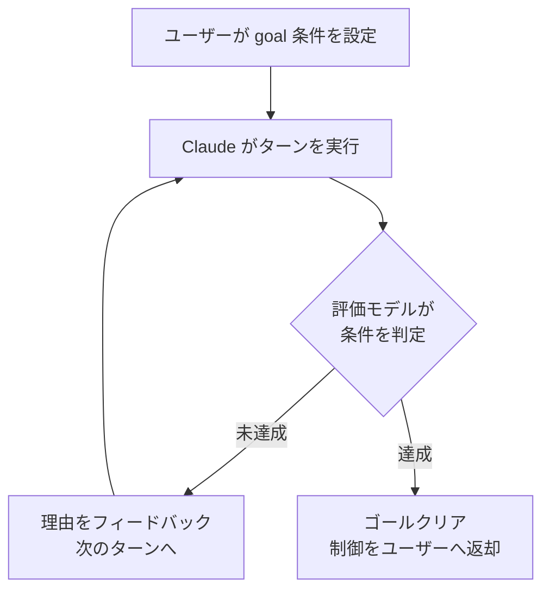
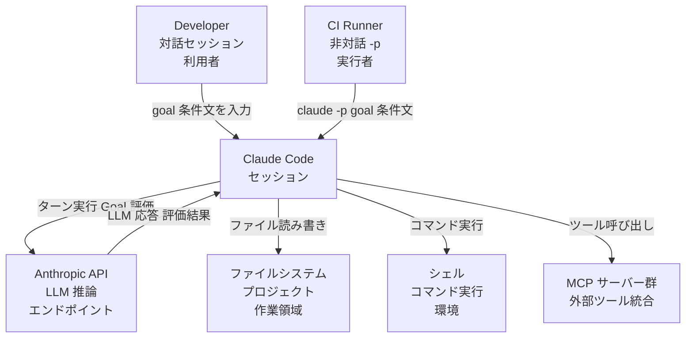
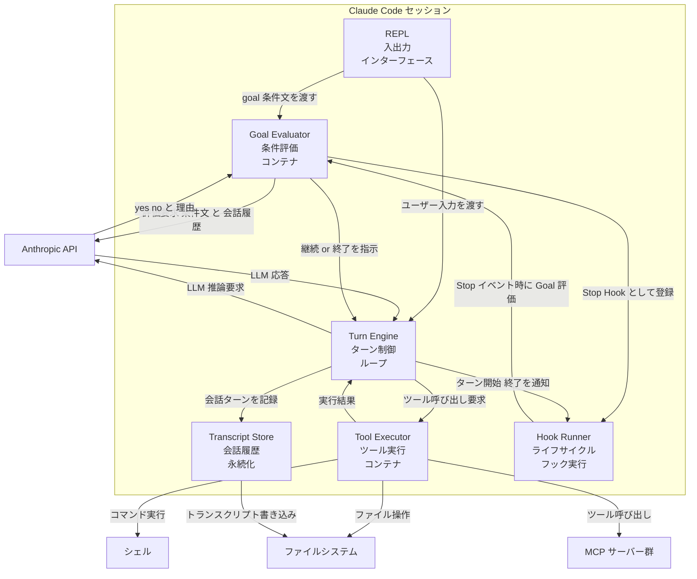
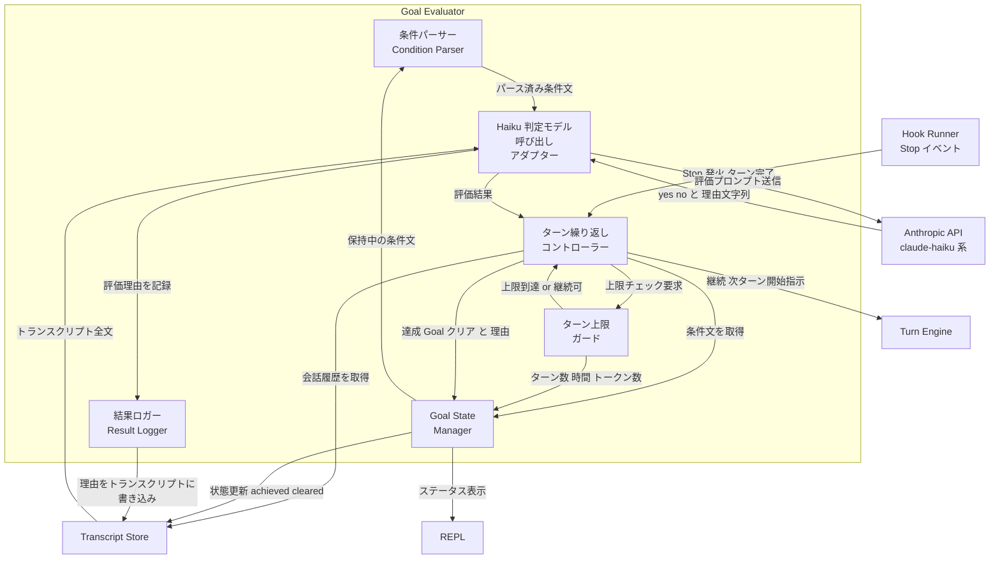
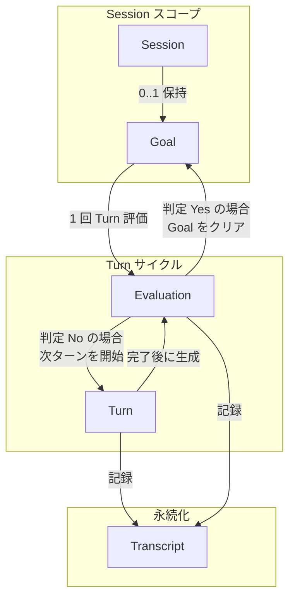
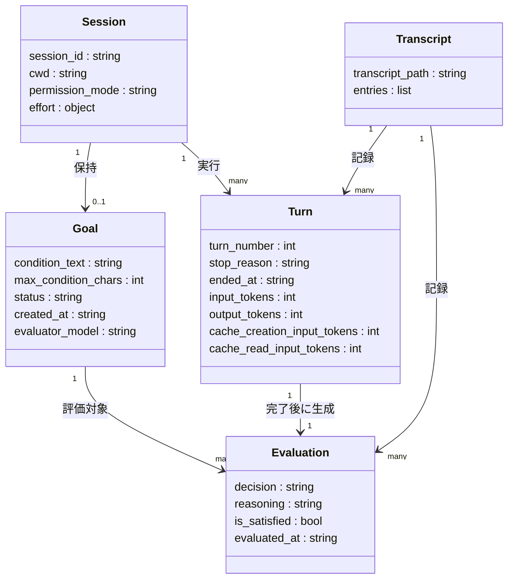

> 調査日: 2026-05-14 / 対象バージョン: Claude Code v2.1.139 (GitHub Releases 表示: 2026-05-11 UTC / JST: 2026-05-12)
> 一次情報: [Keep Claude working toward a goal - Claude Code Docs](https://code.claude.com/docs/en/goal)

## 概要

### 背景

Claude Code はターン制で動作します。
Claude が 1 ターンの作業を終えると制御がユーザーに戻り、次の指示を待ちます。
大規模な移行作業やバックログ処理のように反復が必要な作業では、ユーザーが手動で何度も次の指示を送る必要がありました。

`/goal` コマンドは反復コストを解消するために Claude Code v2.1.139 (2026 年 5 月、UTC ベースで 5-11、JST ベースで 5-12 公開) で追加されました。
完了条件をあらかじめ宣言しておくと、Claude が条件を満たすまで自律的に複数ターンを継続します。

### 位置づけ

`/goal` はセッションスコープの自律実行機能です。
Claude がターンを終えるたびに、小型の高速モデル (デフォルト: Haiku) が完了条件を評価します。
条件未達なら Claude が次のターンを開始し、条件達成時点でゴールが自動的にクリアされます。



### 類似機能との比較

`/goal` は「前のターンが終わったら次を開始する」仕組みです。
他のアプローチとの違いを以下に整理します。
公式ドキュメントの比較範囲は `/goal` / `/loop` / Stop Hook / Auto Mode / スケジュール機能までで、Plan Mode と TaskCreate は本記事独自の整理として並べます。

| 機能 | 次のターンの<br/>トリガー | 終了条件 | 評価者 | 主なユースケース |
|---|---|---|---|---|
| `/goal` | 前のターン完了 | モデルが条件を確認 | 小型高速モデル (Haiku 相当) | 検証可能な完了状態がある作業 |
| `/loop` | 時間間隔の経過 | ユーザーが停止、または Claude が判断 | Claude 自身 | 定期ポーリング・繰り返し実行 |
| Stop Hook | 前のターン完了 | 独自スクリプトまたはプロンプトが判断 | スクリプト / モデル | セッション横断の自動化 |
| ScheduleWakeup (`/schedule` 相当) | 指定時刻の到来 | 単発実行 (再スケジュールしない限り) | Claude 自身 | 定時バッチ・非同期待ち合わせ |
| Auto Mode | — | Claude が完了と判断した時点 | Claude 自身 | 1 ターン内のツール呼び出しの自動承認 |
| Plan Mode | — | ユーザーが承認した時点 | ユーザー | 大規模変更前の計画確認 |
| TaskCreate | — | サブエージェントが完了報告 | サブエージェント | 並列バックグラウンドタスク |

補足事項を以下に挙げます。

- `/goal` と Stop Hook はどちらもターン終了後に動作します。`/goal` はセッション限定の簡易設定で、Stop Hook は設定ファイルに保存されセッション横断で適用されます。Stop Hook を選ぶ条件は、セッション横断で恒久的に適用したい場合、またはスクリプトで非 LLM 判定 (終了コード・パターンマッチ等) をしたい場合です。
- ScheduleWakeup は時刻トリガーであり、条件達成までの自律継続を目的とした `/goal` とは交わりません。CI バッチで一定時刻に `/goal` を起動する組み合わせは可能です。
- Auto Mode は `/goal` と相補的な関係です。Auto Mode がターン内のツール承認を省略し、`/goal` がターン間の手動操作を省略します。組み合わせると完全な自律実行になります。

## 特徴

- 完了条件ベースの自律実行: 条件文を宣言するだけで、Claude が達成まで複数ターンを継続します。
- 独立した評価モデル: 作業中の Claude とは別の小型高速モデル (Haiku) が条件を判定し、客観的な評価を行います。
- 評価理由のフィードバック: 条件未達成時にその理由が次ターンへ渡され、Claude が方向を修正できます。
- リアルタイムの進捗表示: 経過時間・ターン数・トークン消費量をオーバーレイで確認できます。
- セッション復元: `--resume` または `--continue` でセッションを再開すると、アクティブなゴールが復元されます。
- ターン・時間制限の宣言: 条件文に「20 ターン後に停止」などのクローズを含めて実行上限を設定できます。
- 複数モードで動作: インタラクティブ・`-p` (非インタラクティブ)・Remote Control のいずれでも利用できます。
- 条件文の上限は 4,000 文字: 詳細な完了基準を記述できます。
- フックシステムの利用: 内部実装はセッションスコープのプロンプトベース Stop Hook のラッパーです。

## 構造

> 公式に図示されていないため、ドキュメント記述から論理的に整理した構造図です。

### システムコンテキスト図



#### システムコンテキスト要素

| 要素名 | 説明 |
|---|---|
| Developer | 対話モードで `/goal` コマンドを入力し、セッション進捗を監視するアクター |
| CI Runner | `-p` フラグで非対話実行し、完了を待つ自動化アクター |
| Claude Code セッション | `/goal` の受付・ターン制御・Goal 評価を包含するシステム本体 |
| Anthropic API | LLM 推論を提供するエンドポイント。主ターンモデルと Goal 評価用小型モデルの両方に利用 |
| ファイルシステム | プロジェクトコード・トランスクリプト・設定ファイルの永続化領域 |
| シェル | Bash ツール経由でコマンドを実行する環境 |
| MCP サーバー群 | 外部ツール (データベース・ブラウザ等) を提供する統合レイヤー |

### コンテナ図



#### コンテナ要素

| コンテナ名 | 説明 |
|---|---|
| REPL | ユーザー入力の受付・表示。`/goal` コマンドをパースして Goal Evaluator へ渡す |
| Goal Evaluator | 条件文を保持し、各ターン完了後に評価を実行。内部的にセッションスコープの Stop Hook として動作 |
| Turn Engine | ReAct パターンの while ループ。ターン開始・LLM 呼び出し・ツール実行・ターン完了を制御 |
| Tool Executor | Read/Edit/Bash/MCP ツール群を実行。パーミッションチェックを経由してファイルシステム・シェル・MCP を操作 |
| Transcript Store | 会話履歴をセッション単位で永続化。Goal 評価・セッション再開・コンパクション対象 |
| Hook Runner | SessionStart/PreToolUse/Stop 等のライフサイクルイベントを管理し、登録済みフックを並列実行 |

### コンポーネント図

Goal Evaluator のドリルダウンを示します。



#### Goal Evaluator コンポーネント要素

| コンポーネント名 | 責務 |
|---|---|
| 条件パーサー | 自然言語の条件文 (最大 4,000 文字) を受け取り、評価プロンプトとして整形 |
| Goal State Manager | 条件文・経過ターン数・経過時間・トークン消費量・達成/クリア状態を保持。セッション再開時に復元 |
| ターン繰り返しコントローラー | Stop イベントを受信し、評価結果に応じて Turn Engine に次ターン開始または停止を指示 |
| Haiku 判定モデル呼び出しアダプター | セッション設定の小型高速モデル (デフォルト: claude-haiku 系) に条件文と会話履歴を送信。yes/no と理由を受け取る。ツール呼び出しは行わない |
| ターン上限ガード | 条件文に記述されたターン数上限・時間上限を解釈し、超過時に強制終了シグナルを返す |
| 結果ロガー | 各ターンの評価理由をトランスクリプトに書き込み、`/goal` ステータス表示および次ターンへのガイダンスとして提供 |

## データ

> 公式 ER 図は未提示。`/goal` のコマンドリファレンスおよび Hooks リファレンスのドキュメント記述から論理的に整理した概念/情報モデルです。

### 概念モデル

Session が 1 つの Goal を保持し、Goal の評価は Turn 単位で実施されます。
各 Turn が完了するたびに Evaluation が生成され、その結果を Transcript が記録します。



#### 概念モデル要素

| 要素名 | 説明 |
|---|---|
| Session | Claude Code の 1 セッション。1 つの Goal を保持 |
| Goal | 完了条件と状態を保持するエンティティ |
| Turn | Claude の 1 ターン。完了時に Evaluation を生成 |
| Evaluation | Haiku が返す yes/no 判定と理由 |
| Transcript | Turn と Evaluation を時系列で記録する JSONL |

### 情報モデル



#### Session

1 セッションに対して 1 つの Goal のみ有効化できます。
セッション再開時 (`--resume`/`--continue`) に Goal は復元されますが、Turn カウント・経過時間・トークン消費のベースラインはリセットされます。

| 属性 | 説明 |
|---|---|
| `session_id` | セッションを一意に識別する識別子。Stop フックの入力 JSON から取得可能 |
| `cwd` | フック実行時のカレントディレクトリ |
| `permission_mode` | `default` / `plan` / `acceptEdits` / `auto` / `dontAsk` / `bypassPermissions` のいずれか |
| `effort` | (存在する場合) `level` フィールドを持つネストオブジェクト。`effort.level` の値は `low` / `medium` / `high` / `xhigh` / `max` のいずれか |

#### Goal

`/goal <condition>` で設定されます。
同一セッションで再度 `/goal <condition>` を実行すると既存の Goal を置き換えます。

| 属性 | 説明 |
|---|---|
| `condition_text` | 達成条件テキスト。最大 4,000 文字 |
| `max_condition_chars` | 条件テキストの上限 (4,000) |
| `status` | `active` / `achieved` / `cleared` のいずれか |
| `created_at` | Goal が設定された時刻 |
| `evaluator_model` | 評価に使用するモデル。デフォルトは設定済みの小型高速モデル (Haiku 系) |

#### Turn

Goal がアクティブな間、前の Turn 完了後に自動的に次の Turn が開始されます。

| 属性 | 説明 |
|---|---|
| `turn_number` | 会話内の Turn 番号 (0 起算想定)。Stop フック入力経由で参照される概念フィールド (公式 Hook reference では明示的な記載が薄い項目) |
| `stop_reason` | `end_turn` / `tool_use` / `max_tokens` / `stop_sequence` 等のいずれか (API SDK 側で他の値も発生し得る) |
| `ended_at` | Turn の終了時刻 |
| `input_tokens` | Turn で消費した入力トークン数 |
| `output_tokens` | Turn で生成した出力トークン数 |
| `cache_creation_input_tokens` | プロンプトキャッシュへ書き込んだトークン数 |
| `cache_read_input_tokens` | プロンプトキャッシュから読み込んだトークン数 |

#### Evaluation

`/goal` はセッションスコープのプロンプトベース Stop フックのラッパーとして動作します。
各 Turn 完了後に `condition_text` と会話履歴がモデルに送信され、yes/no の判定と短い理由が返されます。

| 属性 | 説明 |
|---|---|
| `decision` | `yes` (条件充足) または `no` (未充足) |
| `reasoning` | 条件を満たした/満たしていない理由のテキスト。次 Turn の開始時に Claude へのガイダンスとして渡される |
| `is_satisfied` | `decision` を論理値で表したフィールド |
| `evaluated_at` | 評価が実施された時刻 |

評価モデルはツールを呼び出せないため、Claude が会話に出力したテキストのみを根拠に判定します。

#### Transcript

セッションの全履歴を JSONL 形式で記録するファイルです。
評価モデルは会話履歴 (このファイル由来) をもとに Goal の条件を判定します (ファイルを直接読むかは公式に未記載)。

| 属性 | 説明 |
|---|---|
| `transcript_path` | JSONL ファイルのパス。Stop フック入力の `transcript_path` に対応 |
| `entries` | Turn と Evaluation の記録エントリの一覧 |

## 構築方法

### 前提条件

- インターネット接続が必須です。
- 対応プラットフォームは macOS 13.0 以上、Windows 10 1809 以上、Ubuntu 20.04 以上、Debian 10 以上、Alpine Linux 3.19 以上です。
- ハードウェアは RAM 4GB 以上、x64 または ARM64 プロセッサが必要です。

### アカウント・認証要件

- Claude Pro、Max、Team、Enterprise、または Console (API アクセス) アカウントが必要です。
- 無料の Claude.ai プランは Claude Code へのアクセスを含みません。
- Amazon Bedrock、Google Vertex AI、Microsoft Foundry 経由でも利用できます。
- Anthropic API キーを直接使用する場合は、環境変数 `ANTHROPIC_API_KEY` に設定します。

### インストール

#### ネイティブインストール (推奨)

```bash
# macOS / Linux / WSL
curl -fsSL https://claude.ai/install.sh | bash

# Windows PowerShell
irm https://claude.ai/install.ps1 | iex

# Windows CMD
curl -fsSL https://claude.ai/install.cmd -o install.cmd && install.cmd && del install.cmd
```

- ネイティブインストールはバックグラウンドで自動更新されます。

#### Homebrew (macOS)

```bash
brew install --cask claude-code        # 安定版チャンネル
brew install --cask claude-code@latest # 最新版チャンネル
```

- Homebrew インストールは自動更新されません。手動で `brew upgrade claude-code` を実行します。

#### WinGet (Windows)

```powershell
winget install Anthropic.ClaudeCode
```

#### npm (Node.js 18 以上が必要)

```bash
npm install -g @anthropic-ai/claude-code
```

#### Linux パッケージマネージャ

```bash
# apt (Debian / Ubuntu)
sudo apt install claude-code

# dnf (Fedora / RHEL)
sudo dnf install claude-code

# apk (Alpine Linux)
apk add claude-code
```

### インストールの確認

```bash
claude --version
claude doctor   # 詳細な診断チェック
```

### 認証

```bash
claude   # 初回起動時にログインプロンプトが表示される
/login   # ブラウザプロンプトに従ってログイン
```

### `/goal` 利用のための追加要件

- `/goal` コマンドはワークスペースでトラストダイアログに同意済みのセッションでのみ動作します。
- フックシステムの一部として動作するため、`disableAllHooks` が設定されている場合は利用できません。
- `allowManagedHooksOnly` が managed 設定で有効な場合も利用できません。
- 制限がある場合、コマンドはサイレントに失敗せず理由を表示します (v2.1.139 以降)。

## 利用方法

### 引数・サブコマンド一覧

| 引数 / サブコマンド | 挙動 | エイリアス |
|---|---|---|
| `/goal <condition>` | 完了条件を設定してゴールを開始 | なし |
| `/goal` (引数なし) | 現在のゴール状態を確認 | なし |
| `/goal clear` | アクティブなゴールをクリア | `stop`, `off`, `reset`, `none`, `cancel` |
| `/clear` | 会話を新規開始し、アクティブなゴールも削除 | なし |

### 基本構文 `/goal <condition>`

```text
/goal <完了条件>
```

- ゴールを設定すると、その条件文がディレクティブとしてすぐにターンが開始されます。
- 別途プロンプトを送る必要はありません。
- ゴールがアクティブな間、`◎ /goal active` インジケーターに経過時間が表示されます。
- 1 セッションにつき 1 ゴールのみ有効です。新たに設定すると既存のゴールを上書きします。

実例を以下に示します。

```text
/goal all tests in test/auth pass and the lint step is clean
```

```text
/goal CHANGELOG.md has an entry for every PR merged this week
```

```text
/goal fix the failing checkout test and stop after tests pass
```

### 状態確認 `/goal` (引数なし)

```text
/goal
```

アクティブなゴールがある場合、以下の情報を表示します。

- 設定された完了条件
- 経過時間
- 評価済みターン数
- 現在のトークン消費量
- エバリュエーターの最新判定理由

ゴールがすでに達成済みの場合は、達成済み条件・経過時間・ターン数・トークン消費量を表示します。

### クリア `/goal clear` (および各エイリアス)

```text
/goal clear
/goal stop
/goal off
/goal reset
/goal none
/goal cancel
```

完了条件が満たされる前にアクティブなゴールを手動で削除します。

> 注意: `/goal stop` はゴールクリアの省略形であり、バックグラウンドセッションを停止する `/stop` コマンドとは別物です。

### 非対話 (headless) 実行

`-p` フラグでゴールを非対話モードで実行できます。

```bash
claude -p "/goal CHANGELOG.md has an entry for every PR merged this week"
```

- 条件が満たされるまでループを実行して 1 回の呼び出しで完結します。
- Ctrl+C で途中停止できます。

追加フラグとの組み合わせ例を以下に示します。

```bash
# ツール自動承認と組み合わせる
claude -p "/goal all tests pass" --allowedTools "Bash,Read,Edit"

# 出力を JSON 形式で取得する
claude -p "/goal fix all type errors" --output-format json
```

### セッションの再開とゴールの復元

```bash
# 最新セッションを継続
claude -c

# セッションピッカーを開く (引数なし)
claude -r

# 特定セッションを再開 (session-id 指定)
claude -r <session-id>
```

- セッション終了時にゴールがアクティブだった場合、`--resume` または `--continue` で再開するとゴールが復元されます。
- ターン数・タイマー・トークン消費のベースラインは再開時にリセットされます。
- 達成済みまたはクリア済みのゴールは復元されません。

### Remote Control 経由

- `/goal` は Remote Control 経由でも動作します。
- 非対話モードと同様に、設定した条件が満たされるまでループが継続します。

### 条件文の書き方

エバリュエーターは Claude の会話出力のみを判断材料にします。
ファイルを直接読んだりコマンドを実行したりしません。
Claude 自身が出力として示せる内容を条件にします。

効果的な条件文の要素を以下に整理します。

| 要素 | 説明 | 例 |
|---|---|---|
| 測定可能な終了状態 | テスト結果・ビルド終了コード・ファイル数・キュー空 | `npm test exits 0` |
| 検証コマンドの明示 | Claude が証明する方法を明示 | `` `git status` is clean `` |
| 制約条件 | 変更してはいけないファイルや範囲 | `no other test file is modified` |
| ターン上限付与 | 無限ループを防ぐ上限設定 | `or stop after 20 turns` |

条件文の文字数上限は最大 4,000 文字です。

推奨パターン例を以下に挙げます。

```text
/goal all TypeScript errors are resolved, tests pass with `npm test`, and no ESLint warnings remain — no other test files are modified
```

```text
/goal migrate the auth module to the new API until every call site compiles and tests pass, or stop after 30 turns
```

```text
/goal split large-file.ts into focused modules until each is under 300 lines, verified by running `wc -l src/*.ts`
```

避けるべき条件例も整理します。

| NG 条件 | 問題 |
|---|---|
| `/goal the code is clean` | 「clean」の定義が曖昧で、評価モデルが常に true / false どちらにも倒せる |
| `/goal fix everything` | 終了状態が定義されておらず、達成判定の根拠が会話に現れない |
| `/goal src/config.ts exists` | ファイル存在はツール実行が前提で、評価モデルは会話履歴からのみ判断する |

### 1 セッションあたり 1 ゴール制約と上書き挙動

- セッション内でアクティブなゴールは常に 1 つです。
- 新しい `/goal <condition>` を実行すると、既存のゴールが即座に上書きされます。
- `/clear` で会話履歴をリセットすると、アクティブなゴールも同時に削除されます。

### 評価の仕組み

- `/goal` はセッションスコープのプロンプトベース Stop フックのラッパーです。
- 各ターン終了後、完了条件と会話内容が設定済みの小型高速モデル (デフォルト: Haiku) に送られます。
- モデルは yes/no の判定と短い理由を返します。
- "no" の場合、Claude に次のターンへの指針として理由が渡されます。
- "yes" の場合、ゴールがクリアされ達成エントリがトランスクリプトに記録されます。
- 評価トークンは主ターンの消費量に比べると軽微です。

## 運用

### ゴール実行中のステータス確認

`/goal` を引数なしで実行すると、現在のゴール状態を確認できます。

```text
/goal
```

表示される情報を以下に示します。

- 設定した条件文
- ゴールが動き始めてからの経過時間
- 評価済みのターン数
- 現在のトークン消費量
- 評価モデル (Haiku) が最後に返した判断理由

インタラクティブモードでは、セッション中に `◎ /goal active` というインジケーターが表示され、ゴールが稼働中であることを示します。

### トランスクリプトでのターン数・トークン記録の確認

各ターン終了後、評価モデルは条件が満たされているかどうかと短い理由を返します。
この判断理由はステータスビューとトランスクリプトの両方に記録されます。
セッション終了後にトランスクリプトを確認する場合は、`~/.claude/projects/<project-path>/` 以下に保存されている `.jsonl` ファイルを参照します。

ゴールが達成されると、トランスクリプトに「achieved」エントリが記録されます。
達成済みゴールの情報 (条件・経過時間・ターン数・トークン消費量) は、同一セッション内では、その後の `/goal` コマンドで参照できます。

トークン使用量の詳細確認には `/usage` コマンドを使用します。

```text
/usage
```

出力例を以下に示します。

```text
Total cost:            $0.55
Total duration (API):  6m 19.7s
Total duration (wall): 6h 33m 10.2s
Total code changes:    0 lines added, 0 lines removed
```

### 途中介入の方法

ゴール実行中に Claude の動作が意図と異なると判断した場合、以下の方法で介入します。

- Escape キー押下: 現在実行中のツール呼び出しまたはターンを即座に中断します。
- 新しいゴールの設定: `/goal <新しい条件>` を実行すると、既存のゴールが置き換わります。
- 非対話モードでの中断: `claude -p "/goal ..."` で起動した場合、`Ctrl+C` でプロセスを停止できます。

### ゴールのキャンセル方法

条件が達成される前にゴールを終了させるには、`/goal clear` を実行します。

```text
/goal clear
```

以下のエイリアスも同じ動作をします。

```text
/goal stop
/goal off
/goal reset
/goal none
/goal cancel
```

セッション全体をリセットする `/clear` コマンドを実行した場合も、ゴールは自動的に削除されます。

## ベストプラクティス

### 測定可能なゴール条件の設計

ゴールの評価モデルはツールを実行しません。
Claude が会話の中で明示した情報だけを判断材料にします。
そのため、条件は「Claude 自身の出力で証明できる形」で記述します。

効果的な条件の 3 要素を以下に整理します。

1. 単一の測定可能な終了状態: テスト結果・ビルド終了コード・ファイル数・キューの空など
2. 検証手段の明示: `npm test` が終了コード 0 で終わる、`git status` がクリーンなど
3. 途中で守るべき制約: 「他のテストファイルを変更しない」など副作用の境界を含める

良い条件例を以下に示します。

```text
/goal all tests in test/auth pass (`npm test` exits 0) and lint is clean, without modifying any file outside test/auth
```

### ターン上限の付け方

条件文の中にターン数または時間の節を含めると、実行の上限を設けられます。

```text
/goal all tests pass, or stop after 20 turns
```

Claude は各ターンで当該節に対する進捗を報告し、評価モデルもその情報をもとに判断します。

非対話モード (`-p`、print mode) 専用フラグとして `--max-turns` も使用できます (対話モードでは使用不可)。

```bash
claude -p --max-turns 20 "/goal all tests in test/auth pass"
```

上限に達した場合、プロセスはエラーで終了します。

### 無限ループ防止

`/goal` 自体は条件不一致が続く限りターンを繰り返します。
以下の対策を組み合わせるとループを防止できます。

- 条件に "or stop after N turns" 節を含める: 評価モデルがターン数を追跡し、上限到達と判断するとゴールを完了扱いにします。ただし自然言語条件として評価されるため、確実に止めたい場合は `--max-turns` を併用します。
- Stop フックによる介入: 同じファイルの繰り返し読み取り、エラーの連続発生などのパターンを検出して `additionalContext` で方針転換を促すスクリプトを Stop フックに登録します。`decision: "block"` は「停止を阻止して継続させる」挙動である点に注意します。
- `--max-turns` フラグの使用 (非対話モード専用): ハードリミットとしてターン数を設定します。確実な停止を保証する手段はこちらです。

Stop フックでアプローチ転換を促す介入例を以下に示します (継続させつつ別アプローチを指示する用途)。

```bash
#!/bin/bash
# ~/.claude/hooks/circuit-breaker.sh
DATA=$(jq . < /dev/stdin)
TRANSCRIPT=$(jq -r '.transcript_path' <<< "$DATA")

# 直近 3 ターンで同じエラーが繰り返されていれば停止
RECENT_ERRORS=$(tail -20 "$TRANSCRIPT" | grep -c "same_error_pattern" || true)
if [ "$RECENT_ERRORS" -ge 3 ]; then
  jq -n '{
    "decision": "block",
    "reason": "同じエラーが3回連続しました。別のアプローチを試みてください。",
    "hookSpecificOutput": {
      "hookEventName": "Stop",
      "additionalContext": "直近3ターンで同じエラーが繰り返されています。現在のアプローチを変更してください。"
    }
  }'
  exit 0
fi
exit 0
```

`settings.json` への登録例を以下に示します。

```json
{
  "hooks": {
    "Stop": [
      {
        "hooks": [
          {
            "type": "command",
            "command": "~/.claude/hooks/circuit-breaker.sh",
            "timeout": 10
          }
        ]
      }
    ]
  }
}
```

### コスト管理

ゴールを使用した長時間実行セッションではトークン消費が大きくなります。
以下の設定と習慣でコストを抑制できます。

- モデルの使い分け: Sonnet でゴールを実行し、複雑な設計判断のみ Opus を使用します。サブエージェントには `model: haiku` を指定します。
- コンテキストを小さく保つ: 無関係な作業の前に `/clear` を実行し、CLAUDE.md は 200 行以下に保ちます。
- MCP サーバーの絞り込み: 使っていないサーバーは `/mcp` で無効化します。各サーバーの定義がターンごとにコンテキストに追加されるためです。
- エフォートレベルの調整: 単純な繰り返し作業には `/effort low` を使用します。
- 予算上限の設定 (非対話モード専用、print mode のみ): `--max-budget-usd` フラグで金額上限を設けます。

```bash
claude -p --max-budget-usd 5.00 "/goal all tests pass"
```

- `/usage` でのリアルタイム監視: ゴール実行中でも別ターミナルから `/usage` で消費状況を把握できます。

ワークスペース単位の支出上限は Claude Console の Workspace Limits で設定できます。
Bedrock・Vertex・Foundry 環境では LiteLLM などのゲートウェイを使うと API キー単位のコスト追跡が可能です。

### 副作用の制約

ゴール条件の中に「変更してはいけないファイルやディレクトリ」を明記すると、副作用を制限できます。

```text
/goal all tests in test/auth pass, without modifying any file outside the src/auth directory
```

さらに強い制約が必要な場合は `--allowedTools` で使用可能なツールを限定します。

```bash
claude -p --allowedTools "Read,Bash(npm test *),Bash(git status *)" \
  "/goal all tests pass"
```

### CI / 非対話モードでの安全運用

CI 環境でゴールを使用する際は、以下のポイントを守ります。

- `--permission-mode dontAsk` または `acceptEdits` を指定: パーミッションプロンプトで処理が止まらないようにします。
- `--max-turns` と `--max-budget-usd` を両方設定: ターン数と金額の両面でセーフガードを設けます。
- `--output-format json` で結果を構造化出力: `total_cost_usd` や `session_id` を後続処理で活用できます。

CI での使用例 (シェル) を以下に示します。

```bash
claude -p \
  --permission-mode acceptEdits \
  --allowedTools "Bash(npm test *),Read,Edit" \
  --max-turns 30 \
  --max-budget-usd 10.00 \
  --output-format json \
  "/goal all tests pass and lint is clean"
```

GitHub Actions ワークフローでの最小例を以下に示します。

```yaml
- name: Run /goal
  env:
    ANTHROPIC_API_KEY: ${{ secrets.ANTHROPIC_API_KEY }}
  run: |
    claude -p \
      --permission-mode acceptEdits \
      --max-turns 30 \
      --max-budget-usd 10.00 \
      --output-format json \
      "/goal all tests pass and lint is clean"
```

`/goal` はフックシステムを使用しているため、`disableAllHooks` や `allowManagedHooksOnly` が有効な環境では使用できません。
その場合は Stop フックを直接設定するか、`--max-turns` による代替手段を使用します。

## トラブルシューティング

### 症状・原因・対処 一覧

| 症状 | 原因 | 対処 |
|---|---|---|
| ゴール条件が常に `false` のまま進み続ける | 条件がツール実行なしに判定できない (例: 「ファイルが存在する」を直接確認する命令がない) | 条件文に「Claude に `ls` を実行させ、ファイルの存在を確認する」のように検証手順を明示 |
| ゴール条件が即座に `true` になる | 条件が曖昧すぎる、あるいは初期状態が既に条件を満たしている | より具体的で現在の状態から変化を必要とする条件に書き直す |
| Haiku が評価を誤判定する | 条件文が曖昧で yes/no 判定が不定になる / (prompt-based hook 全般の注意として) 出力フォーマットが乱れてパース失敗する | 条件を「`npm test` が終了コード 0 で終わる」のように客観的かつ二値で判定できる形に書き直す。`--debug "hooks"` フラグで評価ログを確認 |
| ターン上限に達したが条件を記録せず終了する | 条件文に "or stop after N turns" が含まれておらず、`--max-turns` にも達していない状態で別のエラーが発生 | `--max-turns` フラグを使用し、終了コードを確認。上限到達時は非ゼロ終了コードで終了 |
| トランスクリプトに評価記録が残らない | `CLAUDE_CODE_SKIP_PROMPT_HISTORY` が設定されている、またはセッションが正常終了しなかった | 環境変数を確認し、トランスクリプトパスを `Stop` フック入力の `transcript_path` フィールドで確認 |
| `/goal` を設定してもインジケーターが表示されず何も起きない | `disableAllHooks` または `allowManagedHooksOnly` が設定されている (v2.1.139 以降はエラーメッセージが表示される) | `/goal` を実行したときに表示されるエラーメッセージに従い、hooks の設定を確認 |
| コスト爆発が発生する | コンテキストが肥大化しターンごとの処理量が増加した / 思考 (thinking) トークンが大量消費されている | `/usage` でコストを監視。`/effort low` でエフォートを下げる。`MAX_THINKING_TOKENS=8000` で思考予算を制限。`/compact` でコンテキストを圧縮 |
| ゴールがセッション再開後にリセットされる | セッション再開時にターン数・タイマー・トークン消費量のベースラインがリセットされる (仕様) | 条件文自体はリセットされない。「or stop after N turns」節を大きめに設定しておくと再開後のターン消費に余裕が生まれる |

### デバッグ方法

フックの評価ログを詳細に確認するには `--debug` フラグを使用します。

```bash
claude --debug "hooks" -p "/goal all tests pass"
```

特定ファイルにデバッグログを書き出す場合は以下を使います。

```bash
claude --debug-file /tmp/claude-goal-debug.log "/goal all tests pass"
```

Stop フックの入力を確認する最小構成フックの例を以下に示します。

```bash
#!/bin/bash
# デバッグ用: Stop フックに渡される全入力をログに書く
jq . < /dev/stdin >> /tmp/stop-hook-input.jsonl
exit 0
```

## まとめ

Claude Code v2.1.139 で追加された `/goal` コマンドは、完了条件をセッションに宣言するだけで Claude が条件達成まで自律的に複数ターンを継続する機能です。
内部はセッションスコープの prompt-based Stop Hook ラッパーで、設定済みの小型高速モデル (デフォルト: Haiku) が各ターン後に yes/no を判定し、条件文には「or stop after N turns」「他ファイルを変更しない」などの上限・副作用制約も自然言語で記述できます。

この記事が少しでも参考になった、あるいは改善点などがあれば、ぜひリアクションやコメント、SNS でのシェアをいただけると励みになります！

## 参考リンク

- 公式ドキュメント
  - [Keep Claude working toward a goal - Claude Code Docs](https://code.claude.com/docs/en/goal)
  - [Commands reference - Claude Code Docs](https://code.claude.com/docs/en/commands)
  - [Hooks reference - Claude Code Docs](https://code.claude.com/docs/en/hooks)
  - [Automate workflows with hooks (Guide) - Claude Code Docs](https://code.claude.com/docs/en/hooks-guide)
  - [Run Claude Code programmatically (headless) - Claude Code Docs](https://code.claude.com/docs/en/headless)
  - [Claude Code クイックスタート](https://code.claude.com/docs/en/quickstart)
  - [Claude Code セットアップ (詳細)](https://code.claude.com/docs/en/setup)
  - [CLI reference - Claude Code Docs](https://code.claude.com/docs/en/cli-reference)
  - [Manage costs effectively - Claude Code Docs](https://code.claude.com/docs/en/costs)
  - [Settings - Claude Code Docs](https://code.claude.com/docs/en/settings)
- GitHub
  - [Releases · anthropics/claude-code (公式 Changelog)](https://github.com/anthropics/claude-code/releases)
  - [Release v2.1.139 · anthropics/claude-code](https://github.com/anthropics/claude-code/releases/tag/v2.1.139)
- 記事
  - [Claude Code 2.1.139 adds /goal command - explainx.ai](https://explainx.ai/blog/claude-code-goal-command-long-running-agents-2026)
  - [Claude Code v2.1.139 Release Notes - ClaudeWorld](https://claude-world.com/articles/claude-code-21139-release/)
  - [Claude Code コマンドチートシート - scriptbyai.com](https://www.scriptbyai.com/claude-code-commands-cheat-sheet/)
  - [Claude Code Changelog - claudelog.com](https://claudelog.com/claude-code-changelog/)
  - [Claude Code Token Optimization - Build to Launch](https://buildtolaunch.substack.com/p/claude-code-token-optimization)
  - [23 Tips for Smart Claude Code Token Saving - Analytics Vidhya](https://www.analyticsvidhya.com/blog/2026/05/tips-for-claude-code-token-saving/)
  - [Claude Code Autonomous Mode Guide - pasqualepillitteri.it](https://pasqualepillitteri.it/en/news/141/claude-code-dangerously-skip-permissions-guide-autonomous-mode)
  - [Claude Code as an Autonomous Agent: Advanced Workflows 2026 - SitePoint](https://www.sitepoint.com/claude-code-as-an-autonomous-agent-advanced-workflows-2026/)
