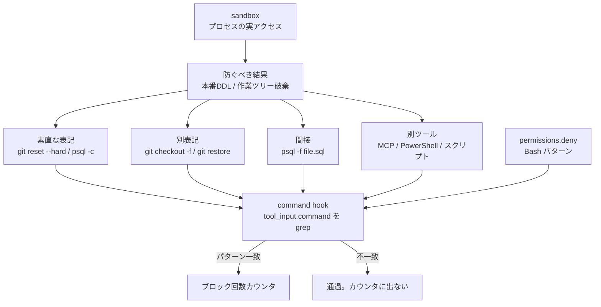
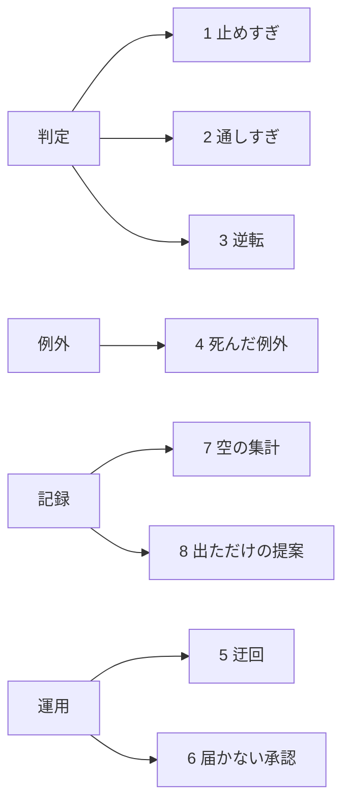
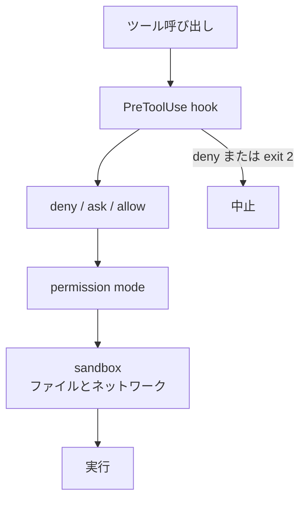

Claude Code の PreToolUse hook は、ツール実行前にコマンド文字列を見て止める仕組みです。
くぅ『Claude Code のガードレール』第0章から第2章と、Anthropic 公式の Hooks / permissions / sandboxing を突き合わせます。

数値と fixture は著者1環境の運用スナップショットです。
読み終えると、ブロック回数が何を数えるか、同じ危険結果への到達経路、経路表と通過ログの足し方を判断できます。

## Claude CodeのHookとは

対象プロダクトは Claude Code の lifecycle hook です。
コマンド実行前の `PreToolUse` で、シェルスクリプトが stdin の JSON を読みます。
Bash の command hook が見る入力は `tool_input.command` 文字列です。

くぅの本は、2026-05-17 から 2026-09-20 までの著者環境を記録しています。
記録のあるセッションは 160 件、ブロック総数は 822 回、1セッション最多は 70 回、ブロック 0 回は 23 件です。
同じ期間に、本番データベースへ DDL を適用したコマンドは hook を一度も通らず、使い捨ての検証用コンテナへの `DROP DATABASE` は 3 回止まっています。

本の中心操作は、コマンドを実行せず hook に文字列を渡して終了コードだけ見る棚卸しです。
fixture 28 件の判定は、危険を止めた 6、危険が通った 12、無害を止めた 6、無害を通した 4 です。
8 つのずれ型は、止めすぎ、通しすぎ、逆転、死んだ例外、迂回、届かない承認、空の集計、出ただけの提案です。
通しすぎの対は、`git reset --hard` 対 `git checkout -f`、`git branch -D` 対 `git update-ref -d`、`psql -c "INSERT …"` 対 `psql -f file.sql` です。

止める側スクリプトの最終変更は 2026-07-11 です。
執筆時点で 71 日前でした。

数える手順は 5 つです。

1. ガードレール一覧
2. 素直な書き方と言い換えの対
3. BLOCK / PASS 表
4. 見逃しと誤ブロックの読み
5. 記録の内訳

公式 Claude Code では、ツールイベントの `matcher` はツール名です。
`if` は permission 規則でサブコマンドと `$()` を見ます。
公式 permissions の優先順は deny → ask → allow です。
`Bash(rm *)` は複合コマンドの各サブコマンドに効きます。
絶対パスや `sh -c` の別綴りは別物として扱います。

隣接研究 GuardFall（Adversa 2026-06-30、CSA 2026-07-11）は、敵対的な quote / `$IFS` / 置換で文字列ガードを抜ける話です。
本書が扱う対象は、誠実な別表記とファイル経由 SQL です。

### 何を見るか

ガードレールは「結果」ではなく「見た文字列」に発火します。
同じ危険結果へ、複数の到達経路があります。

第1章の表では、8型を判定・例外・運用・記録の4層に置きます。

公式の制御は hook 単体ではありません。
permissions と sandbox が別レーンにあります。

## 注意点

160 / 822 / 28 / 12 は著者1環境の自己集計です。
第三者の追試は書誌上ありません。
Zenn API の `liked_count` は、2026-09-21 の取得時点で 0 でした。

fixture 28 件は、著者が選んだ「コマンドの形をした文字列」です。
危険 18 件のうち 12 件通過は、その集合に対する通過率です。
全コマンド空間の推定ではありません。

第1章は内訳空を 153/160、第2章は 154 empty / 6 has と書きます。
同じ記録の数え方差です。
著者自身が JSON キー直読み（160 件すべて空）と字下げ全部（124 件に有り）で別の数を出しています。

本番 DDL が「hook を一度も通っていない」は、hook が見るコマンド文字列にキーワードが無かった、という観察です。
sandbox や DB 側権限が別途あったかは、公開章にありません。

公式 `if` と permissions は `;` / `&&` / `$()` をサブコマンド単位で見ます。
本書の「`;` の先の `grep -f` で誤発火」は、著者がコマンド全体を 1 文字列として grep した脚本の症状です。

公式 command hook の例 `block-rm.sh` も `grep -q 'rm -rf'` です。
プラットフォームがシェル正規化済みの意味で判定しているわけではありません。

GuardFall の「11中10」「約 548,000 stars（2026-05 時点の選定集合）」は、敵対的 obfuscation の調査です。
本書の honest 別表記と足し合わせないでください。

第3章以降（止めすぎの詳細、通しすぎの詳細、付録ツール全文）は未確認です。
目次と公開章の要約だけを根拠にします。

agent hook（`type: "agent"`）はファイルを Read できます。
experimental です。
本番推奨は command hook です。

## ブロック回数は何を数えているか

著者 intro の 822 は、「パターンに一致した回数」です。
一致しなかった危険操作はカウンタに出ません。

公式監視には `claude_code.hook_execution_complete` の `num_blocking` があります。
拒否回数は監視イベントとして定義されています。
`claude_code.tool_decision` は accept / reject と source（config / hook / user_*）を持ちます。

822 は「hook が発火して止めた」量です。
保護したい結果の分母（本番 DDL、作業ツリー破棄）ではありません。

1セッション 70 回は、保護成功よりループや誤ブロック騒音の候補です。
Issue [`anthropics/claude-code#37935`](https://github.com/anthropics/claude-code/issues/37935)（closed）は、拒否後に同一操作をリトライし続ける故障を記録しています。
タイトルは `[BUG] Agent in headless -p mode infinitely retries on permission denial instead of terminating` です。

`num_blocking` は廃棄する指標ではありません。
ループと誤ブロック騒音の SLO として残す判断材料になります。

## 同じ危険結果にどう到達するか

公開章では、`psql -f` はコマンド文字列に SQL キーワードが無いので hook を通ると書きます。
`psql -c "INSERT"` は止まります。

公式 PreToolUse の Bash 入力は `tool_input.command` です。
Read の入力は `file_path` と任意の `offset` / `limit` です。
PreToolUse 時点にファイル本文は乗りません。

公式は、Edit / Write だけの matcher では Bash によるファイル書き換えを見ないと明記しています。
FileChanged は事後です。
block できません。

経路網羅の最小セットは、ツール名（Bash / PowerShell / MCP）× 素直な表記 × 言い換え × ファイル間接、です。
`psql -f` を command grep だけで止めるには、`-f` 自体を危険にするか、agent hook でファイルを読む必要があります。
後者は experimental です。

MCP のツール名は `mcp__server__tool` です。
Bash 専用 matcher は届きません。

PreToolUse の command hook は timeout 時 fail-open です。
止まらず permission フローへ進みます。
Agent SDK callback や PreModelSwitch の timeout は別挙動です。

## 公式permissionsとsandboxはどこまで埋めるか

deny は hook の `allow` より強いです。
hook は managed deny を緩められません。

`Bash(git push *)` は `git -C . push` にマッチしません。
公式表は「セキュリティ境界ではない」と書きます。
現行 docs（2026-09-21）では、Read / Edit deny は認識済みの `cat` / `head` / `sed` / リダイレクト先にも効きます。
穴は名前しない読み（`grep -r`）と任意サブプロセスです。

本書の穴の一部は、`permissions.deny` に別表記を並べれば埋まります。
全部は埋まりません。
絶対パス、`sh -c`、Python 経由が残ります。

公式の推奨階層は次です。

1. sandbox（結果境界）
2. permission（よくある呼び出し）
3. hook（追加検査）

`permissions.deny` に `Bash(git checkout -f *)` を足せば、カスタム hook 無しでも一部の別表記は止まります。
agent hook はファイルを Read できますが、experimental です。

hook 見逃しは、本番無防備と同義ではありません。
sandbox と DB 権限は別レーンです。
公開章はそこを測っていません。

著者は、quote 内キーワードの誤発火が、数え直し時点で直っていたと書きます。
記録は最新状態を表しません。

公式 `if` の `$()` 分解は、changelog v2.1.163 前後で挙動が変わっています。
著者 hook が公式 `if` を使っていたか、コマンド全体 grep だけかは、公開章からは確定できません。
Claude Code の版も未記載です。

ドキュメントの `if` 照合は、Issue [`anthropics/claude-code#65501`](https://github.com/anthropics/claude-code/issues/65501)（closed）でも論点になっています。
タイトルは `[DOCS] Hooks docs do not explain if: "Bash(...)" matching for subshells, backticks, and variable expansions` です。

## 隣接研究との違い

GuardFall は、文字列を見るガードと bash 展開の不一致を Class A–E に分けます。
Continue だけが tokenize-and-canonicalize です。
CVE は 2026-06-30 時点で未割当です。

Trail of Bits（2025-10-22）は、許可済み `git show --output` と `rg --pre bash` でファイル作成と実行を示しています。

本書は運用上の honest 別表記です。
GuardFall は敵対的難読化です。
評価指標を混ぜると、822 回の話と bypass 率が潰れます。

どちらも「コマンド文字列を危険度の代理にする」失敗です。
発注側の問いは同じです。
結果から経路を列挙しているか、です。

28 件 fixture は著者選定です。
経路網羅率を「完備」にすると、同値コマンドは無限です。
公式自身が Bash 規則を fragile と呼んでいます。

## 発注側が今取る棚卸し

ブロック回数ダッシュボードを捨てる必要はありません。
分母を「防ぐべき結果」に置き、経路表と通過ログを足します。

| 結果（分母） | 最低限の経路 |
|---|---|
| 本番スキーマ変更 | `psql -c` / `-f` / stdin / `cat \| psql` / マイグレーション CLI / MCP DB ツール |
| 作業ツリー破棄 | `reset --hard` / `checkout -f` / `restore` / `clean -fd` |
| 秘密ファイル読み | Read ツール / 認識済み `cat` / `grep -r` / Python open / MCP |

直近の手順は次です。

1. `~/.claude/hooks/` と `settings.json` の hooks / permissions.deny を一覧し、最終 git 日付を取る
2. 防ぐべき結果ごとに、素直な書き方と言い換えを対で fixture 化する。実行しない
3. hook に流して見逃しを先に読む。誤ブロックは迂回の入口として残す
4. 通過したコマンドを、ブロック回数と同じ期間で残す。内訳キーが空なら件数は使わない
5. Bash 文字列 deny を境界にしない。sandbox と DB 権限を結果側の制御にする
6. `num_blocking` はループと誤ブロック騒音の SLO として残す

自環境の hook 棚卸し開始は、公開章の構造だけで始められます。
著者の 822 を自社 KPI にコピーする根拠はありません。

逆転条件は 2 つです。

- エージェントがシェルを持たず、許可済み API だけを叩く構成なら、この本の Bash 別表記問題は縮小します
- OS sandbox が子プロセスのファイルとネットワークを強制していて、かつ通過ログがあるなら、hook の経路網羅は補助で足ります

回数そのものを捨てると、誤ブロック騒音と無限リトライを見失います。
指標は置換ではなく併記がよいです。

公開章の構造に対する確信度は高いです。
数値の一般化と、未確認章の手順詳細に対する確信度は低いです。

## まとめ

Claude Code の command hook は、`tool_input.command` の文字列にパターンを当てます。
822 回は一致した回数であり、本番 DDL や作業ツリー破棄の分母ではありません。

同じ危険結果へは、素直な表記、言い換え、ファイル間接、別ツールの経路があります。
`psql -c` は止まり、`psql -f` は通る、という分かれ目は危険度ではなく書き方です。

公式 permissions は一部の別表記を埋めます。
絶対パス、`sh -c`、MCP、ファイル本文は残り、sandbox が結果境界です。

発注側の評価は、防ぐべき結果から経路を列挙し、通過ログと `num_blocking` を併記することです。
著者1環境の 822 を、自社の保護 KPI にコピーしないでください。

この記事が少しでも参考になった、あるいは改善点などがあれば、ぜひリアクションやコメント、SNSでのシェアをいただけると励みになります！

## 参考リンク

- [くぅ, 『Claude Code のガードレール』, Zenn, 2026-09-20](https://zenn.dev/kuu_dqx/books/blocked-is-not-safe)
- [第0章 intro](https://zenn.dev/kuu_dqx/books/blocked-is-not-safe/viewer/00-intro)
- [Zenn API 書誌](https://zenn.dev/api/books/blocked-is-not-safe)
- [Anthropic, Hooks reference](https://code.claude.com/docs/en/hooks)
- [Anthropic, Automate actions with hooks](https://code.claude.com/docs/en/hooks-guide)
- [Anthropic, Configure permissions](https://code.claude.com/docs/en/permissions)
- [Anthropic, Sandboxing](https://code.claude.com/docs/en/sandboxing)
- [Anthropic, Monitoring usage](https://code.claude.com/docs/en/monitoring-usage)
- [Omer Ben Simon / Adversa AI, GuardFall, 2026-06-30](https://adversa.ai/blog/opensource-ai-coding-agents-shell-injection-vulnerability/)
- [Cloud Security Alliance, GuardFall research note, 2026-07-11](https://labs.cloudsecurityalliance.org/research/csa-research-note-guardfall-ai-coding-agent-shell-injection/)
- [Trail of Bits, Prompt injection to RCE in AI agents, 2025-10-22](https://blog.trailofbits.com/2025/10/22/prompt-injection-to-rce-in-ai-agents/)
- [GitHub Issue anthropics/claude-code#65501](https://github.com/anthropics/claude-code/issues/65501)
- [GitHub Issue anthropics/claude-code#37935](https://github.com/anthropics/claude-code/issues/37935)
