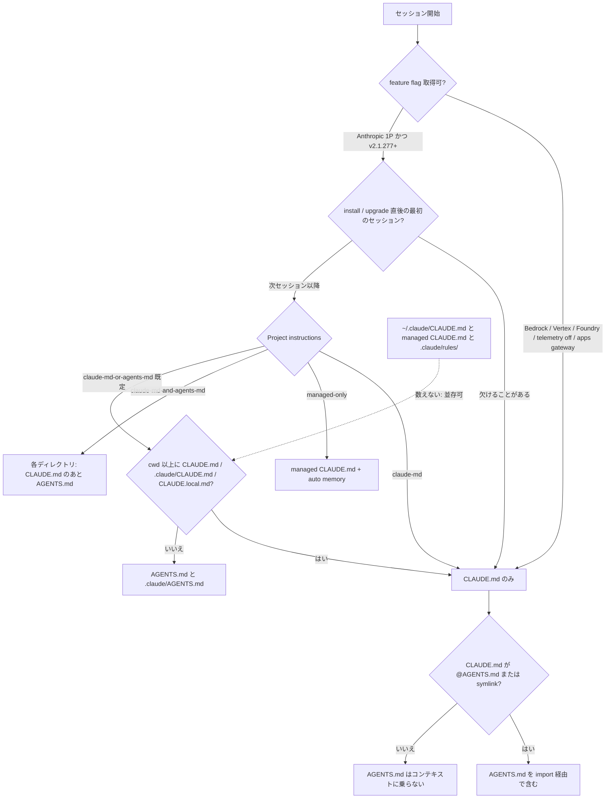
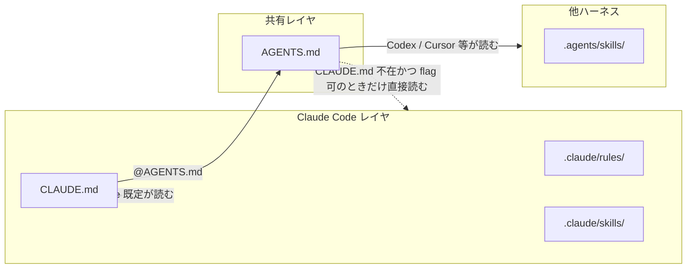

Claude Code v2.1.277（2026-09-18）は、プロジェクトに `CLAUDE.md` が無いとき `AGENTS.md` をプロジェクト指示として読む互換導線を追加しました。
設定名は `/config` の Project instructions です。

この記事では、どのファイルがどの条件でコンテキストに載るか、ローダの差、リポジトリの置き方を整理します。
読み終えると、既存の `CLAUDE.md` を消してよいか、共有正本をどこに置くかを判断できます。

仕様の記述は Anthropic 公式 docs と GitHub Release、公開ディレクトリ `mods/agents-md` の README に依ります。
コミュニティ反応と変動メトリクスは 2026-09-19 時点のスナップショットです。


*この記事の全体像。以下、順に解説します。*

## Claude CodeのAGENTS.md互換導線とは

`AGENTS.md` は、Linux Foundation 傘下の Agentic AI Foundation が steward する、コーディングエージェント向けのプレーン Markdown 規約です。
Claude Code はこれまで `CLAUDE.md` をネイティブに読み、他ツールは `AGENTS.md` をネイティブに読む、というファイル名の分岐が続いていました。

v2.1.277 が足したのは、その分岐を跨ぐフォールバックです。
実装はエンジン本体ではなく、builtin プラグイン `agents-md@builtin` です。
公開ディレクトリは [`mods/agents-md`](https://github.com/anthropics/claude-code/tree/main/mods/agents-md) です。

[GitHub Release v2.1.277](https://github.com/anthropics/claude-code/releases/tag/v2.1.277) と [docs changelog](https://code.claude.com/docs/en/changelog) は同一文で、次を定義しています。

- `CLAUDE.md` が無いプロジェクトでは `AGENTS.md` を読む
- `/config` の Project instructions で変更する
- Bedrock / Vertex / Foundry では未提供

以前の公式回答は、2026-08-17 にクローズした [anthropics/claude-code#6235](https://github.com/anthropics/claude-code/issues/6235) のとおり、`@AGENTS.md` import または symlink でした。
277 はその上に直接読みを足しています。

### 何をするか

既定値は `claude-md-or-agents-md` です。
cwd とその上に `CLAUDE.md` / `.claude/CLAUDE.md` / `CLAUDE.local.md` が無ければ、`AGENTS.md` と `.claude/AGENTS.md` を読みます。
祖先に上記 3 種のいずれかがあると、既定では `CLAUDE.md` 側だけを読みます。

切替は 4 値です。

| 設定 | 読むもの |
|---|---|
| `claude-md-or-agents-md`（既定） | `CLAUDE.md` 群。無ければ `AGENTS.md` |
| `claude-md-and-agents-md` | 両方。ディレクトリ内は `CLAUDE.md` が先、`AGENTS.md` が後 |
| `claude-md` | `CLAUDE.md` のみ |
| `managed-only` | 組織 managed と auto memory。project / local / user の `CLAUDE.md`、rules、すべての `AGENTS.md` は起動時対象外 |

設定場所は `/config`、または user / `--settings` / managed の `pluginConfigs["agents-md@builtin"].options.instructionFiles` です。
プロジェクトと local の settings は読みません。
クローンしたリポから注入できない、と [settings-reference](https://code.claude.com/docs/en/settings-reference#pluginconfigs) が理由を書いています。
v2.1.207 より前は project / local も読んでいました。

手書きの例は次です。

```json
{
  "pluginConfigs": {
    "agents-md@builtin": {
      "options": { "instructionFiles": "claude-md-and-agents-md" }
    }
  }
}
```

直接読みは v2.1.277 以降、かつ Anthropic から feature flag を取得できるセッションに限ります。
セッション開始時は cwd とその祖先の `AGENTS.md` / `.claude/AGENTS.md` を載せます。
サブディレクトリ分はテキスト `Read` 時に添付します。

`@path` import は `AGENTS.md` 内でも展開します。
既に import / symlink したファイルは、パスまたは内容の比較で二重読みしません。
読まない対象は `AGENTS.local.md`、`AGENTS.override.md`、`.agents/` 配下です。

直接読んだ `AGENTS.md` は `/memory` と `/context` の Memory files に出ません。
確認は `no CLAUDE.md found; AGENTS.md loaded: <path>` のような行です。
`AGENTS.md loaded` を含む行を見ます。

公式の dual 経路は、`CLAUDE.md` 先頭の `@AGENTS.md`、または `ln -s AGENTS.md CLAUDE.md` です。

### どのファイルが、どの条件で載るか

対象は「どのファイルが、どの条件で、どのコンテキスト枠に入るか」です。



ファイルの役割分担は次です。



`~/.claude/CLAUDE.md`、組織 managed の `CLAUDE.md`、`.claude/rules/` は「数える CLAUDE.md」に入りません。
これらが有っても、プロジェクト側に 3 種が無ければ `AGENTS.md` は載ります。

## 注意点

「Claude Code が AGENTS.md に対応した」は、ファイル名のフォールバックです。
`.agents/skills` は対象外です。
公式 memory は `.agents/` 配下を読まないと書いています。
Hacker News のコメントも「does not include `.agents/skills`」と注記しています。

「CLAUDE.md を消せる」は、flag が取れるセッションかつ Claude 固有指示が無いリポに限ります。
公式は、直接読めないセッション向けに `@AGENTS.md` import を残せと書いています。

「共通規約を AGENTS.md、Claude 固有を CLAUDE.md に置く」は、既定の OR モードでは成立しません。
`CLAUDE.md` を置いた瞬間、`AGENTS.md` は読まれません。

Bedrock / Vertex / Foundry、telemetry 無効、Claude apps gateway では、changelog 原文どおり **not yet** です。
回避は import です。

アップグレード直後の最初のセッションでは、flag 未取得のため直接読みが欠けることがあります。
次セッションから有効です。

実装は builtin の mod / plugin です。
`/plugin` で `agents-md` を切ると `CLAUDE.md` のみになります。

`disableAllHooks` と `allowManagedHooksOnly` が builtin を止めるかについて、docs 同士が食い違います。
[memory](https://code.claude.com/docs/en/memory#agents-md) は、これらの設定や plugin 無効化を「AGENTS.md 直接読みが使えないセッション」に列挙します。
一方 [`mods/agents-md` README](https://github.com/anthropics/claude-code/blob/main/mods/agents-md/README.md) は、`disableAllHooks` / `allowManagedHooksOnly` / `--bare` は settings hooks と installed plugin を対象にし、builtin は止めないと書きます。
運用では、`/config` に Project instructions が出るかで判定してください。
出なければそのセッションは直接読み対象外です。

star 数は `gh repo view anthropics/claude-code` で 146267（2026-09-19）でした。
本文では約 146k（2026-09-19 時点）と読んでください。
agents.md サイトの「60k+ examples」はサイト自己表示です。
Hacker News 本スレは取得時 約 311 points / 131 comments で、同日のスナップショットです。

## どのファイルがコンテキストに載るか

互換入口の意味は、「他ツール用リポを、Claude 用ファイル無しで開ける」ことです。
既存 Claude リポの読み込み集合は、既定では変わりません。

### 数える CLAUDE.md

次の 3 種があると、既定では `AGENTS.md` を止めます。

- `CLAUDE.md`
- `.claude/CLAUDE.md`
- `CLAUDE.local.md`

`CLAUDE.local.md` が含まれる点が実務上の落とし穴です。
gitignored の個人メモが、共有 `AGENTS.md` を止めます。
`AGENTS.md` 依拠リポで個人メモを残したいときは、Project instructions を `claude-md-and-agents-md` にします。

矛盾する指示が両ファイルにあるとき、公式は「Claude は任意に一方を選ぶ」と書きます。
後勝ちは保証されません。

`managed-only` では、起動時に project / local / user の `CLAUDE.md`、`.claude/rules/`、すべての `AGENTS.md` が対象外です。
サブディレクトリの `CLAUDE.md` と path-scoped rules は、その配下を Read したときに載ります。

### feature flag が取れないセッション

[env-vars](https://code.claude.com/docs/en/env-vars) の「Features that need feature-flag fetching」は、fetch を skip する条件を列挙します。

- `DISABLE_GROWTHBOOK` / `DISABLE_TELEMETRY` / `DO_NOT_TRACK` / `CLAUDE_CODE_DISABLE_NONESSENTIAL_TRAFFIC`
- 第三者プロバイダ: Amazon Bedrock、Claude Platform on AWS、Google Cloud Agent Platform、Microsoft Foundry。例外はホストが `CLAUDE_CODE_PROVIDER_MANAGED_BY_HOST` をセットした場合
- Claude apps gateway

fetch off の先頭項目が、`AGENTS.md` 直接読みの禁止です。
これらのセッションでは `/config` に Project instructions が出ません。

CI で「AGENTS.md だけリポ」を検証するなら、1P セッションと Bedrock / telemetry-disabled セッションを分ける必要があります。
後者は `CLAUDE.md` import が残っていないと指示が消えます。

### 標準 AGENTS.md との差

[agents.md FAQ](https://agents.md/) は、編集対象に最も近いファイルが勝つ、チャット指示がすべてを上書きする、必須フィールドは無い、と書きます。

Claude Code の `CLAUDE.md` 規則は、発見したファイルを連結します。
上書きしません。
根から cwd へ並べ、近いものが後に来ます。

`AGENTS.md` 直接読みも「cwd とその上のすべて」を載せると memory は書きます。
nested はテキスト Read 時です。
`AGENTS.override.md` は読みません。
Codex 側は override を優先する、と Codex ドキュメントが書きます。

ファイル名を揃えても、monorepo の nested 指示はハーネスごとに載る集合が違います。

## CLAUDE.mdローダとの差

`mods/agents-md` README が、plugin では届かない差を列挙します。
memory ページの表と突き合わせると、次が実務に効きます。

- nested 添付はテキスト Read のみ。`@` mention、IDE 開ファイル、notebook / 画像 / PDF Read では `CLAUDE.md` 側だけが付きます
- 直接読みでは InstructionsLoaded hooks が発火しません。import / symlink 経由なら発火します
- nested `AGENTS.md` は read-file state に載りません。compaction 後は、そのディレクトリへの次の Read で再添付します
- `--add-dir` の `AGENTS.md` は載りません。エンジンは同じディレクトリの `CLAUDE.md` を載せられます
- `/memory` と `#` ショートカットは `AGENTS.md` を知りません
- 外部 `@import` の承認ダイアログは `CLAUDE.md` 用です。`AGENTS.md` 側は既存承認が無ければ黙って省略します
- fork でない subagent は、親が既に読んだ nested `AGENTS.md` を自分の初回 Read で再添付します

確認方法も違います。
`CLAUDE.md` は `/context` の Memory files に出ます。
直接読みの `AGENTS.md` は出ません。
対話に `AGENTS.md loaded` が出たか、指示内容を尋ねて確認します。

## 旧workaroundの扱い

公式の「Remove an earlier AGENTS.md workaround」は、次を書いています。

- `@AGENTS.md` だけの `CLAUDE.md` は残してよい。二重読みしません。直接読めないセッション用に残す価値があります
- 「AGENTS.md を読め」と文章で書いた `CLAUDE.md` は、開く保証がありません。import に置き換えるか、その `CLAUDE.md` を消します
- symlink は残しても消しても、内容は一度だけ載ります
- SessionStart で `AGENTS.md` を print する hook は、二重投入になるので削除します

Windows では symlink に Admin / Developer Mode が要ります。
Git は `core.symlinks` 無しだとプレーンテキストになります。
公式は Windows 利用者に import を勧めています。

Edit / Write は symlink 越しの書き込みを拒否し、リンク先の `AGENTS.md` を編集するよう誘導します。

## リポジトリをどう置くか

比較の軸は、Claude 1P だけでなく、Bedrock 相当と他ハーネスを含めたときの指示の残存です。

| 基準 | AGENTS.md のみ | CLAUDE.md のみ | CLAUDE.md が `@AGENTS.md` | `claude-md-and-agents-md` |
|---|---|---|---|---|
| Claude 1P v2.1.277+ | AGENTS.md が載る | 従来どおり | 両方（import） | 両方（設定） |
| Bedrock / Vertex / Foundry | 指示が消える | 従来どおり | AGENTS.md が import で残る | 設定 UI が出ない。CLAUDE.md のみ |
| Codex / Cursor 等 | 読める | 読まない（別ファイルが要る） | AGENTS.md を読む | AGENTS.md を読む |
| Claude 固有指示 | 置けない | 置ける | CLAUDE.md 下部に置ける | 両ファイルに置けるが矛盾は任意選択 |
| チームで dual-read を強制 | 不要 | 不要 | リポにコミットできる | project settings では無効 |
| Windows | 問題なし | 問題なし | 問題なし | 問題なし |
| 既存 hook workaround | 二重投入リスク | 不要 | 不要 | 不要 |

向き不向きは次です。

- **AGENTS.md のみ**: Claude 固有指示が無く、利用者全員が 1P の 277 以降で、Bedrock が居ない
- **CLAUDE.md のみ**: Claude Code 単体運用
- **`@AGENTS.md` import**: 複数ハーネスと複数実行基盤が混在するリポ。公式の「share one file」経路
- **`claude-md-and-agents-md`**: 個人または org managed で、`CLAUDE.md` を残したまま `AGENTS.md` も載せたいとき

推奨レイアウトは、ファイル名フォールバックに頼らず、正本とアダプターを明示する形です。

1. **共有正本**: `AGENTS.md`（ビルド、テスト、ディレクトリ規約、エージェント非依存の禁止事項）
2. **Claude アダプター**: `CLAUDE.md` の先頭を `@AGENTS.md` にし、その下に Claude 固有（subagent、slash、hooks、MCP）だけを書く
3. **既定フォールバックに頼らない**: `CLAUDE.md` があるリポでは `AGENTS.md` は自動では載らない、と README か `AGENTS.md` 自身に書く
4. **CLAUDE.md を消さない**: Bedrock / Vertex / Foundry / telemetry-disabled / アップグレード直後セッションが残る限り、import を残す
5. **CLAUDE.local.md**: `AGENTS.md` 依拠リポでは、既定のまま置くと共有指示が消える。必要なら個人設定を `claude-md-and-agents-md` にする
6. **旧 hook**: SessionStart で `AGENTS.md` を cat しているなら削除する
7. **skills**: `.agents/skills` は別問題。Claude は `.claude/skills`。共有するならアダプター（symlink または生成）を残す
8. **CI**: 1P と flag 無しセッションで「どのファイルが載ったか」を検査する。検査項目は (a) `CLAUDE.md` 無しで `AGENTS.md` が載るか (b) `CLAUDE.md` ありで `AGENTS.md` が載らないか (c) import ありで中身が残るか (d) Bedrock 相当で (a) が失敗し (c) が成功するか

既存リポで `AGENTS.md` が「CLAUDE.md を読め」と書くだけのアダプターになっている場合、Claude Code 277 既定は `CLAUDE.md` を読むので Claude 側は従来どおり動きます。
Codex 等は引き続き `AGENTS.md` 経由で `CLAUDE.md` に誘導されます。
共有正本を `AGENTS.md` に移すなら、`CLAUDE.md` を薄くして `@AGENTS.md` に逆転する作業が別途必要です。
この逆転は必須ではありません。

import の最小形は公式どおりです。

```markdown
@AGENTS.md

## Claude Code

Use plan mode for changes under `src/billing/`.
```

symlink は次です。Windows 混在なら import を選びます。

```bash
ln -s AGENTS.md CLAUDE.md
```

次の条件が揃ったら、「import 必須」を緩めてよいです。

- Anthropic が Bedrock / Vertex / Foundry でも直接読みを有効化した
- 既定が `claude-md-and-agents-md` に変わった
- `.agents/skills` も読むようになった

設計選択は、Bedrock 利用者が居なければブロックしません。
Bedrock 利用者を含むなら、`CLAUDE.md` 削除はブロック条件になります。

未確認のまま残る問いは次です。

- `disableAllHooks` / `allowManagedHooksOnly` が builtin `agents-md` を止めるか（docs 同士が矛盾）
- nested `AGENTS.md` の実コンテキストが spec の closest-wins に近いか、連結に近いか
- 277 翌日時点の回帰バグ票
- import 本文が `CLAUDE.md` 本文より従われにくいか（コミュニティ報告、一次未検証）

市場シェアや「Astra への流出」を理由とする動機付けは、Hacker News の意見であり仕様ではありません。
60k リポジトリ採用はサイト自己表示です。
第三者対応表の多くは 277 時点でも「Claude は非対応」のままです。更新日が 277 以前、または当日でも未反映の二次情報として扱ってください。

[anthropics/claude-code#31005](https://github.com/anthropics/claude-code/issues/31005) は「in addition to」を要求していました。
277 の既定は **instead of** です。

## まとめ

v2.1.277 は、`CLAUDE.md` が無いときの `AGENTS.md` フォールバックを足しました。
共有入口は増えました。
ただし既定では `CLAUDE.md` が `AGENTS.md` を隠します。

複数エージェント向けのリポ設計は、ファイル名フォールバックに頼らず、`AGENTS.md` を共有正本、`CLAUDE.md` を `@AGENTS.md` 付きアダプターにする方が再現できます。
優先順位の明示はドキュメントと CI に書く対象であり、既定ハーネスが dual-read してくれるわけではありません。

この記事が少しでも参考になった、あるいは改善点などがあれば、ぜひリアクションやコメント、SNSでのシェアをいただけると励みになります！

## 参考リンク

- [Claude Code v2.1.277 Release](https://github.com/anthropics/claude-code/releases/tag/v2.1.277)
- [Claude Code changelog](https://code.claude.com/docs/en/changelog)
- [How Claude remembers your project（memory）](https://code.claude.com/docs/en/memory)
- [Environment variables](https://code.claude.com/docs/en/env-vars)
- [Glossary: AGENTS.md](https://code.claude.com/docs/en/glossary#agents-md)
- [Settings reference: pluginConfigs](https://code.claude.com/docs/en/settings-reference#pluginconfigs)
- [mods/agents-md README](https://github.com/anthropics/claude-code/blob/main/mods/agents-md/README.md)
- [agents.md](https://agents.md/)
- [anthropics/claude-code#6235（closed 2026-08-17）](https://github.com/anthropics/claude-code/issues/6235)
- [anthropics/claude-code#31005](https://github.com/anthropics/claude-code/issues/31005)
- [Hacker News 本スレ](https://news.ycombinator.com/item?id=49760187)
- [Hacker News 関連スレ](https://news.ycombinator.com/item?id=49758250)
- [bendrucker/claude-code-agents-md（deprecated: 277 で native）](https://github.com/bendrucker/claude-code-agents-md)
