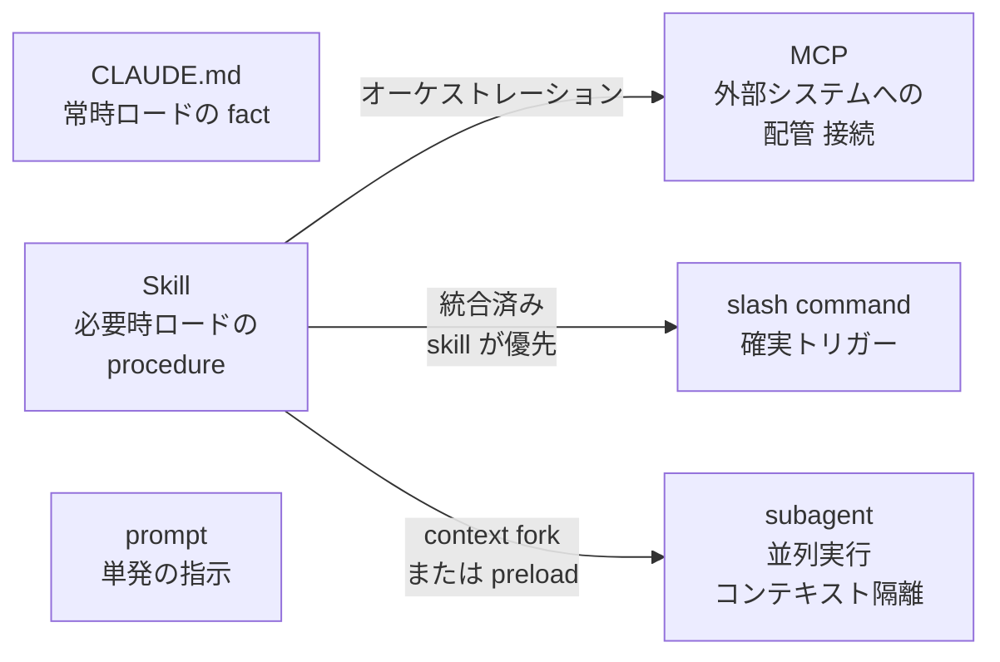
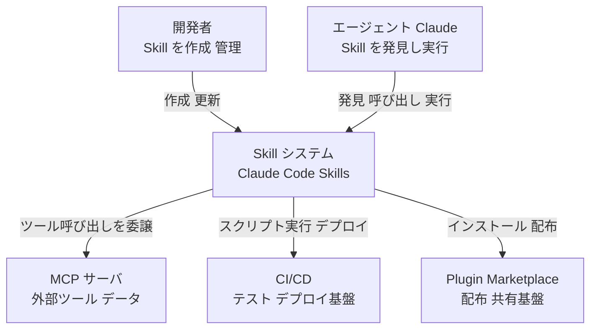
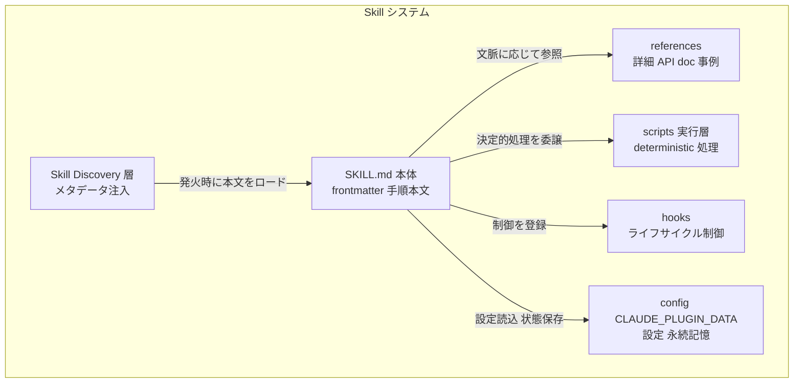
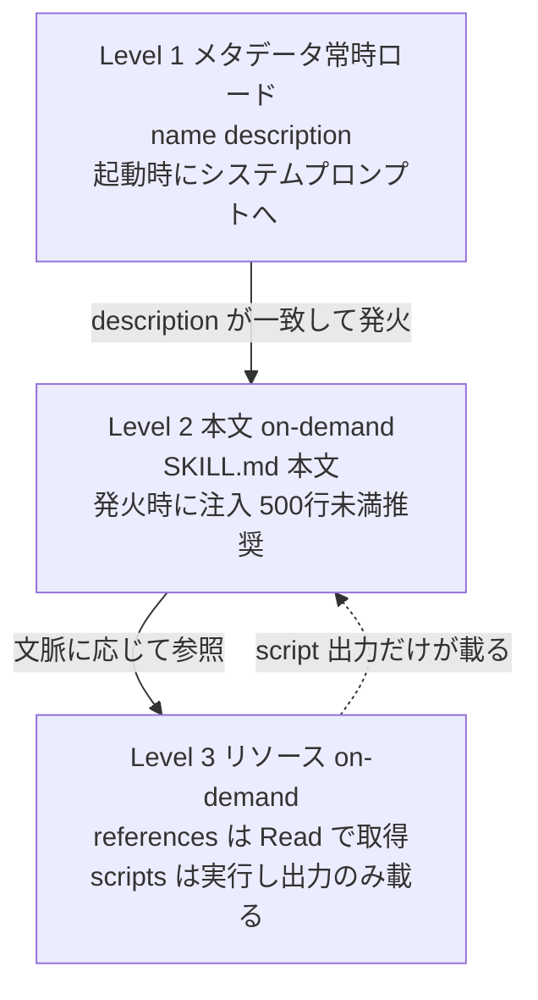
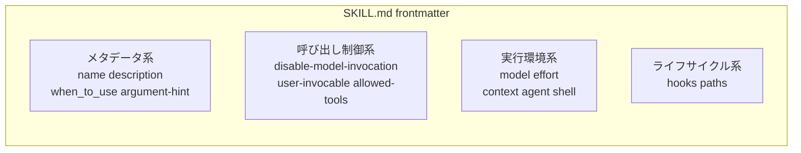
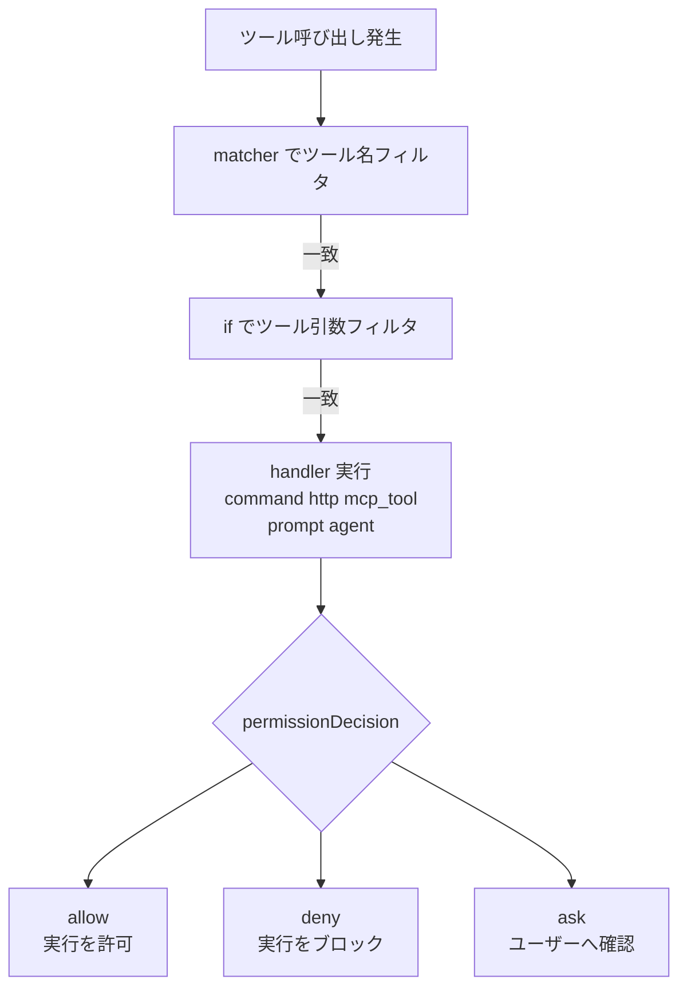
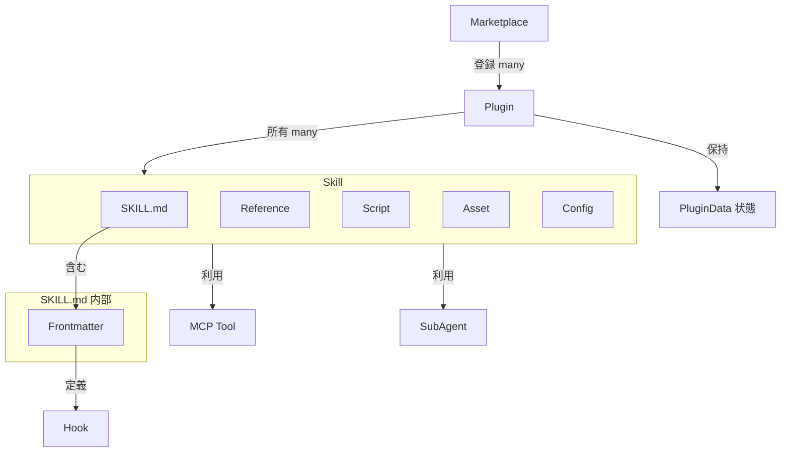
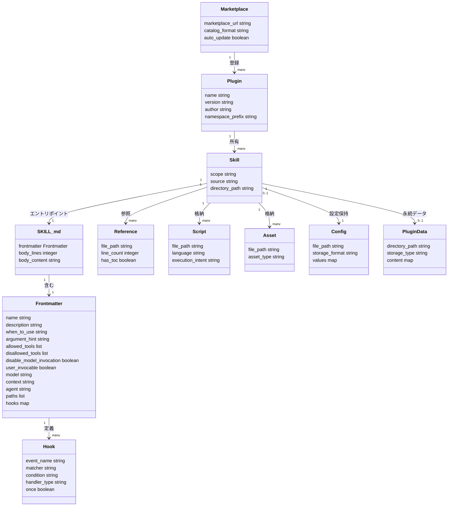

> 調査日: 2026-06-06
> 中核一次ソース: Anthropic 公式ブログ "Lessons from building Claude Code: How we use Skills"(Thariq Shihipar, 2026-06-03)
> 設計思想の起点: Engineering blog "Equipping agents for the real world with Agent Skills"(Barry Zhang ほか, 2025-10-16)

## 概要

Anthropic は公式ブログ "Lessons from building Claude Code: How we use Skills" で、Claude Code を社内利用する中で蓄積した Agent Skills(以下 Skill)の設計原則を公開しました。本記事は「なぜ Skill なのか」を論じた Engineering blog の続編で、「社内で実際にどう使い、何が効いたか」を担当します。

Skill の核心的な位置づけは、「手順(instructions)・スクリプト(scripts)・参照資料(references)・状態(state)をひとまとめにした、エージェントが発見して実行できる作業単位」です。「気の利いたプロンプト集」でも「参照用ドキュメント」でもありません。Skill とドキュメントの本質的な違いは、「読まれるもの」か「実行されるもの」かにあります。

実務的な要点は3つに集約されます。

1. **Skill は大きな万能文書ではなく、用途別に分割された小さな単位であるべきです。** Anthropic の社内カタログは Skill を9カテゴリに分類しています。
2. **Product verification Skill が出力品質に最も効きます。** Anthropic は社内で「最も測定可能なインパクトを持つ」と位置づけています([Anthropic 社内主張])。
3. **progressive disclosure(段階的開示)が Skill の設計を成立させる土台です。** 常時ロードされるのはメタデータだけで、本文・参照・スクリプトは必要になって初めて読まれます。

「用途別に分割すべき」という原則は無条件の善ではありません。Skill を増やすほど発火判定が確率的に不安定になる逆説があり、実務では「分割」と「再統合」を行き来する設計判断が求められます。本記事はこの両面を扱います。

## 特徴

### 9つの Skill カテゴリ(Anthropic 社内カタログ)

Anthropic が社内カタログを棚卸しして整理した9分類です。良い Skill は1カテゴリにきれいに収まります。複数カテゴリにまたがる Skill は設計しすぎのサインです。

| # | カテゴリ | 役割 |
|---|---|---|
| 1 | Library and API reference | 社内・外部ライブラリの使い方・gotchas・エッジケース集 |
| 2 | **Product verification** | Playwright / tmux 等での検証。社内で「出力品質に最も測定可能なインパクト」とされる[Anthropic 社内主張] |
| 3 | Data fetching and analysis | データ・監視スタックへの接続とクエリパターン |
| 4 | Business process and team automation | 反復ワークフローの自動化(依存関係の管理を含む) |
| 5 | Code scaffolding and templates | フレームワークのボイラープレートを自然言語要件から生成 |
| 6 | Code quality and review | 品質強制・コードレビュー支援 |
| 7 | CI/CD and deployment | ビルド・push・デプロイ |
| 8 | Runbooks | 症状から構造化レポートを生む調査ワークフロー |
| 9 | Infrastructure operations | 破壊的操作にガードレールを付けた定常保守 |

### 9つの設計原則

Anthropic が示す9原則の一覧です。各原則の実装は後段のベストプラクティスで扱います。

| 原則 | 意味 |
|---|---|
| Don't state the obvious | Claude が既に知っていることを書かない。デフォルト挙動を覆す情報に集中する |
| Build gotchas sections | 実運用で踏んだ失敗点・エッジケースを蓄積する。これが Skill の最高シグナルとされる |
| Use progressive disclosure | references / scripts / assets にフォルダ分割し、Claude が文脈に応じて必要なものだけ読む |
| Avoid railroading Claude | 必要情報は与えつつ、適応の自由度を残す(狭い橋 vs 広い原野の比喩) |
| Think through setup | 設定は config.json に保存し、不足は AskUserQuestion で構造化質問する |
| Write descriptions for the model | description は人間でなくモデル向け。トリガー語を含む三人称記述で Skill 選択を導く |
| Help Claude remember | append-only ログや JSON に `${CLAUDE_PLUGIN_DATA}` を使って状態を保存する |
| Store scripts and generate code | helper スクリプトを提供し、Claude をボイラープレートでなく「組み立て」に集中させる |
| Use on-demand hooks | セッション固有 hook(例: `/careful` で破壊的コマンドをブロック)を Skill 呼出時だけ有効化する |

### 他機構との使い分け

Skill と他機構の関係を整理します。これらは相互排他ではなく、積み重ねて使うことが前提です。



| 機構 | 性質 | 最適な用途 |
|---|---|---|
| CLAUDE.md | 常時ロードの「fact(規約)」 | 毎回効かせたいルール・プロジェクト規約 |
| Skill | 必要時ロードの「procedure(手順)」 | 用途別の再利用可能な作業手順。自動発火 |
| slash command | ユーザーが明示的に引く確実なトリガー | 自動発火より確実性が欲しい操作(Skill に統合済み) |
| subagent | 並列実行・コンテキスト隔離 | 重い調査・コンテキストを汚したくない処理 |
| MCP | 外部システムへの「接続(tool)」 | データ・ツールへのアクセス。Skill がオーケストレーション |
| prompt | 単発の指示 | 一回限りの使い捨て指示 |

Skill と MCP は競合ではなく補完関係にあります。「Skill が PR レビューの手順・チェックリスト・品質基準を教え、GitHub MCP がレビュー対象の PR にアクセスする」のように役割が分かれます。また Claude Code docs は slash command について「Custom commands have been merged into skills」と明記しており、`.claude/commands/deploy.md` と `.claude/skills/deploy/SKILL.md` はどちらも `/deploy` を作りますが、Skill はさらに補助ファイル用ディレクトリ・起動制御・自動ロードの3点を追加で持ちます。

## 構造

Claude Code Skills の仕組みを C4 モデルの3段階で表現します。

### システムコンテキスト図



| 要素名 | 説明 |
|---|---|
| 開発者 | SKILL.md・scripts・references を作成し、Skill システムに登録・更新する人物 |
| エージェント Claude | メタデータから Skill を発見し、必要に応じて本文・リソースをロードして実行する AI エージェント |
| Skill システム | Skill の発見・ロード・実行・記憶を担う Claude Code の拡張基盤 |
| MCP サーバ | Skill がオーケストレーションするデータ取得・外部ツール操作の実行先 |
| CI/CD | Skill のスクリプトやデプロイ手順が呼び出すビルド・テスト・デプロイ基盤 |
| Plugin Marketplace | Skill をパッケージ化した Plugin を配布・インストールするリポジトリ基盤 |

### コンテナ図



| 要素名 | 説明 |
|---|---|
| Skill Discovery 層 | 起動時に全 Skill の name と description だけをシステムプロンプトに注入する。Claude はこのメタデータだけを見て Skill を選択する |
| SKILL.md 本体 | YAML frontmatter と markdown 手順本文からなるエントリポイント。発火時に1メッセージとして会話に注入され、セッション中再読込されない |
| references | API ドキュメント・使用例・gotchas などの詳細資料。本文が文脈に応じて読み込む on-demand リソース |
| scripts 実行層 | deterministic な処理を担う helper スクリプト群。コード本体はコンテキストにロードされず、実行結果の出力だけが載る |
| hooks | PreToolUse などのライフサイクルイベントに応じた制御ロジック。Skill がアクティブな間だけスコープされる |
| config CLAUDE_PLUGIN_DATA | `config.json` が setup 設定を保持し、`${CLAUDE_PLUGIN_DATA}` 配下の永続ディレクトリにログ・状態を蓄積する |

### コンポーネント図

progressive disclosure の3レベルが、Skill 設計を成立させる中核メカニズムです。



| 要素名 | 説明 |
|---|---|
| Level 1 メタデータ常時ロード | name と description だけが起動時からシステムプロンプトに常駐する。listing 全体の budget はコンテキストウィンドウの1%にスケールし、overflow 時は低頻度 Skill の description から drop される |
| Level 2 本文 on-demand | description がユーザーの意図に一致したとき初めて SKILL.md 本文が注入される。本文はセッション中再読込されないため全行が再帰コストになる。公式は 500 行未満を推奨する |
| Level 3 リソース on-demand | references は必要なときだけ Read ツールで読み込まれる。scripts は bash で実行され、コード本体はコンテキストに載らず出力トークンのみ消費する。これが「実質無制限のリソース」を扱える根拠 |

frontmatter フィールドは役割別に4グループへ整理できます。



| 要素名 | 説明 |
|---|---|
| メタデータ系 | Skill の識別と発見に使うフィールド群。description と when_to_use は合算で 1,536 文字に truncate される。先頭にキーユースケースとトリガー語を置く |
| 呼び出し制御系 | Claude による自動呼び出し可否(`disable-model-invocation`)とユーザーメニュー表示(`user-invocable`)を制御する。`allowed-tools` は列挙ツールを skill アクティブ中に事前承認し、禁止は `disallowed-tools` または `permissions.deny` で行う |
| 実行環境系 | Skill アクティブ中のモデル・effort・context(`fork` でサブエージェント実行)・シェルを上書きする。当該ターン内のみ有効 |
| ライフサイクル系 | `hooks` で Skill スコープのイベントハンドラを定義する。`paths` は glob に一致するファイルを扱うときだけ自動ロードする条件を指定する |

PreToolUse hook の解決フローを示します。`/careful` のような on-demand ガードレールはこの機構で実装されます。



| 要素名 | 説明 |
|---|---|
| matcher | ツール名で Hook の適用対象を絞る。`Bash`・`Edit\|Write`・`mcp__.*` のような正規表現パターンを受け付ける |
| if | permission-rule 構文でツール引数をさらに絞る。`Bash(rm *)` のように記述する |
| handler | `command`・`http`・`mcp_tool`・`prompt`・`agent` の5種類。`once: true` でセッション1回のみ実行(skill frontmatter 内でのみ有効。settings ファイルと agent frontmatter では無視) |
| permissionDecision | handler の判定結果。`allow`・`deny`・`ask`・`defer` の4値を取る |
| on-demand フックの典型例 | `/careful` Skill は呼び出し時だけ PreToolUse hook を有効化し、`rm -rf`・`DROP TABLE`・force-push などをブロックする。常時 ON にせず必要時だけ呼ぶことでオーバーヘッドを排除する |

## データ

### 概念モデル

Skill が扱う概念の所有関係と利用関係を示します。所有は入れ子(subgraph)で、利用は矢印で表現します。



| 要素名 | 説明 |
|---|---|
| Marketplace | Plugin を登録・配布するカタログ。実体は `.claude-plugin/marketplace.json` |
| Plugin | Skill の集合を配布単位にまとめたもの。`${CLAUDE_PLUGIN_DATA}` 配下に状態を持つ |
| Skill | SKILL.md・Reference・Script・Asset・Config を所有する作業単位 |
| SKILL.md | frontmatter と本文からなるエントリポイント |
| Frontmatter | Skill のメタデータと制御を定義する。Hook もここで定義する |
| Hook / MCP Tool / SubAgent | Skill が利用する外部の機構。Hook は frontmatter 定義、MCP Tool と SubAgent は実行時に連携 |

### 情報モデル

各エンティティの主要属性を示します。型名は汎用名(string / list / map / boolean / integer)を使います。



主要エンティティの属性補足を示します。

| エンティティ | 主要属性と制約 |
|---|---|
| Skill | `scope` は enterprise / personal / project / plugin のいずれか。`source` は filesystem パス・plugin namespace・API skill_id |
| Frontmatter | `name` は最大64文字・小文字英数字とハイフン(API サーフェスでは予約語 anthropic/claude を含められない)。`description` は最大1,024文字(API)、`when_to_use` と合算し listing で1,536文字に truncate |
| Reference | SKILL.md から1階層の深さに保つ。100行超は冒頭に目次を付ける |
| Script | `execution_intent` は `execute`(出力のみ載る)または `read_as_reference`(内容を読み込む) |
| PluginData | `${CLAUDE_PLUGIN_DATA}` 配下に格納。`storage_type` は log(append-only) / json / sqlite |
| Hook | `event_name` は PreToolUse / PostToolUse / SessionStart / Stop 等。`once: true` でセッション内1回のみ |
| Plugin | `namespace_prefix` は plugin の name。配下 Skill は `<namespace_prefix>:<skill-name>` で参照 |

`name` と `description` は Anthropic API / オープン標準(agentskills.io)では必須ですが、Claude Code 拡張では全フィールドが任意になります(推奨は `description` のみ)。`when_to_use` は他フィールドがハイフン区切りなのに対しアンダースコア表記である点に注意します(公式準拠)。`context: fork` 時の `agent` は省略すると `general-purpose` になります。`disallowed-tools` の制約は次のユーザーメッセージ送信でクリアされます。なお情報モデルの `Marketplace.catalog_format` は実体 `.claude-plugin/marketplace.json` を指す概念属性で、正式フィールド名は一次未確認です。

## 構築方法

### ディレクトリ構成

Skill はディレクトリ単位で管理します。ディレクトリ名が slash command 名になります。

```text
my-skill/
├── SKILL.md              # エントリポイント(必須)
├── references/           # 参照ドキュメント(任意、必要時に読込)
│   └── REFERENCE.md
├── scripts/              # ユーティリティスクリプト(任意、実行のみ)
│   └── helper.py
└── assets/               # テンプレート・画像・データ(任意)
```

`SKILL.md` だけが必須で、それ以外はすべて任意です。`references/` と `assets/` 内のファイルは Claude が明示的に読むまでトークンを消費しません。`scripts/` 内のスクリプトは実行時に出力だけがトークンを消費し、コード本体は context に載りません。オープン標準(agentskills.io)は `scripts/`・`references/`・`assets/` の3ディレクトリを規定しており、Claude Code はこれを継承しています。

### SKILL.md の frontmatter 記述例

`SKILL.md` は YAML frontmatter と markdown 本文の2部構成です。

```yaml
---
name: processing-pdfs
description: >
  Extracts text, tables, and form fields from PDF files.
  Use when the user mentions PDFs, forms, or document extraction.
when_to_use: >
  Triggered by: "parse this PDF", "extract from PDF", "fill out this form".
argument-hint: "[file-path]"
allowed-tools: Bash Read Write
disable-model-invocation: false
user-invocable: true
model: inherit
---

## 手順

1. `${CLAUDE_SKILL_DIR}/scripts/extract.py` を実行してフィールドを抽出する。
2. 詳細仕様は `references/REFERENCE.md` を参照する。
```

`name` と `description` はオープン標準では必須ですが、Claude Code では全フィールドが optional です。`disable-model-invocation`・`hooks`・`context`・`when_to_use` 等は Claude Code 独自の拡張フィールドです。

### description の書き方の原則

description はシステムプロンプトに注入されるため、モデル向けの客観記述が必要です。

```yaml
# 良い例(三人称、何をするか + いつ使うか)
description: >
  Processes Excel files and generates summary reports.
  Use when working with spreadsheets or when the user mentions Excel, CSV,
  or data analysis tasks.

# 悪い例(一人称、トリガー語なし)
description: "I can help you process Excel files"
```

- 必ず三人称で書きます。一人称・二人称だと discovery 問題が起きます(公式 best-practices で Warning として明記)。
- 「何をするか」と「いつ使うか」の両方を含めます。Claude は description だけを見て多数の skill から選択します。
- skill-creator は「少し pushy に書け」と推奨します。Claude は有用な場面でも skill を発火させない傾向(undertrigger)があるため、トリガー語を明示的に列挙します。
- description + when_to_use の合算は listing で 1,536 文字に truncate されるため、先頭にキーユースケースを置きます。

### skill-creator と evaluation-first

`anthropics/skills` リポジトリに公式の `skill-creator` skill が含まれています。

```bash
# anthropics/skills を marketplace に登録
/plugin marketplace add anthropics/skills

# skill-creator を含む plugin をインストール
/plugin install example-skills@anthropic-agent-skills
```

skill-creator は「意図決定 → ドラフト → テストプロンプト作成 → 評価 → 書き直し → 反復」の流れで進みます。テスト・評価を先に作ってから skill を書く evaluation-first を公式が推奨します。Claude A が skill を設計し、Claude B(fresh instance)が実タスクで使い、その挙動を A に戻す Claude A/B 反復モデルにより、暗黙知が description・gotchas・references へ明示化されます。

### scripts/ への helper 配置

決定的(deterministic)な処理は Claude に毎回生成させず、`scripts/` に helper として配置します。

```python
# scripts/extract.py の例
import os, sys, json

def extract_fields(pdf_path):
    # Solve, don't punt: エラー条件を script 側で処理する
    if not os.path.exists(pdf_path):
        return {"fields": [], "error": f"File not found: {pdf_path}"}
    # ... 処理 ...
    return {"fields": []}

if __name__ == "__main__":
    print(json.dumps(extract_fields(sys.argv[1])))
```

scripts/ の設計規律は次のとおりです。

- Solve, don't punt: エラー条件は script 側で処理し Claude に丸投げしません。
- No voodoo constants: マジックナンバーは禁止し、値はコメントで根拠を示します。
- plan-validate-execute: 破壊的・バッチ操作は中間 `changes.json` を生成 → script で検証 → 実行 → 検証の順序を踏みます。

公式は pre-made script の利点として「生成コードより信頼性が高い」「トークンを節約できる」「生成時間を省ける」「一貫した挙動が保証される」を挙げています。

### config.json と ${CLAUDE_PLUGIN_DATA}

setup 情報は `config.json` に保存し、記憶は `${CLAUDE_PLUGIN_DATA}` に保存します。

```markdown
## Setup

1. config.json が存在しない、または必要なキーが未設定の場合は AskUserQuestion で
   構造化された選択肢をユーザーに提示して値を取得する。
2. 取得した値を ${CLAUDE_SKILL_DIR}/config.json に書き込む。
3. 次回以降は config.json を読んで再質問をスキップする。

## 履歴保存(standup-post skill の例)

1. 前回の実行履歴を ${CLAUDE_PLUGIN_DATA}/standups.log から読む。
2. 前回からの変化点を判断に使う。
3. 生成後、今回の内容を ${CLAUDE_PLUGIN_DATA}/standups.log に追記する。
```

主要な環境変数を示します。

| 変数 | 用途 |
|---|---|
| `${CLAUDE_PLUGIN_DATA}` | セッション横断の安定データ保存ディレクトリ |
| `${CLAUDE_SKILL_DIR}` | SKILL.md があるディレクトリ(bundled script 参照に使う) |
| `${CLAUDE_SESSION_ID}` | session 固有ファイル・ログ用 |
| `${CLAUDE_EFFORT}` | 現在の effort level |

background loop で実行する skill では `disallowed-tools: AskUserQuestion` を設定し、インタラクティブな中断を防ぎます。

### hooks の frontmatter 埋め込み

frontmatter に `hooks:` を書くことで、skill がアクティブな間だけ発火するフックを定義できます。

```yaml
---
name: careful
description: >
  Adds safety guards for destructive operations.
  Use when the user says "production", "prod", or "be careful".
hooks:
  PreToolUse:
    - matcher: "Bash"
      hooks:
        - type: command
          command: "./scripts/safety-check.sh"
          once: true
---
```

`safety-check.sh` から次の JSON を返すとツール実行をブロックできます(exit 0 + JSON)。

```json
{
  "hookSpecificOutput": {
    "hookEventName": "PreToolUse",
    "permissionDecision": "deny",
    "permissionDecisionReason": "Destructive command blocked by safety hook"
  }
}
```

`permissionDecision` は `deny` / `allow` / `ask` / `defer` を取ります。`/careful` パターンは常時 ON にせず、prod を触るときだけ skill を呼ぶ on-demand ガードレールの典型例です。

## 利用方法

### 自動発火と明示呼び出し

起動時に全 skill の `name` と `description` だけがシステムプロンプトに pre-load されます。Claude はユーザーのメッセージとこのメタデータを照合して skill を自動選択します。

```bash
# 自動発火: description に "PDF" "extract" を含む skill がロードされる

# 明示呼び出し: ディレクトリ名が slash command になる
/processing-pdfs document.pdf
/my-plugin:processing-pdfs document.pdf   # plugin 名前空間付き
```

- description に、ユーザーが自然に使うトリガー語・example request を含めることが自動発火精度を上げる主要な設計要素です(公式は必須でなく推奨と位置づけ)。
- `disable-model-invocation: false`(default)の skill のみ自動発火の対象です。`true` にすると自動発火を止めるだけでなく、サブエージェントへのプリロードも防ぎます。
- `paths` フィールドを設定した skill は、glob にマッチするファイルを扱うときだけ自動ロードされます。
- slash command は skill に統合済みで、衝突時は skill が優先されます。

### marketplace からの導入と scope

```bash
# marketplace 登録と個別インストール
/plugin marketplace add anthropics/skills
/plugin install document-skills@anthropic-agent-skills

# GitHub リポジトリやブランチ指定
/plugin marketplace add owner/repo
/plugin marketplace add https://github.com/owner/repo.git#main

# install scope の指定
claude plugin install p@m --scope project   # 共同作業者に適用
claude plugin install p@m --scope local     # 自分のみ
```

scope 別の置き場所と優先順位を示します。

| scope | パス | 適用範囲 |
|---|---|---|
| Enterprise | managed settings 参照 | 組織全員(変更不可) |
| Personal | `~/.claude/skills/<name>/SKILL.md` | 全プロジェクト |
| Project | `.claude/skills/<name>/SKILL.md` | そのプロジェクトのみ(commit で共有可) |
| Plugin | `<plugin>/skills/<name>/SKILL.md` | plugin が有効な場所 |

同名衝突時の優先順位は enterprise > personal > project です。plugin skill は `plugin-name:skill-name` で名前空間化されるため衝突しません。`~/.claude/skills/` と `.claude/skills/` の SKILL.md テキスト変更はセッション内でライブ反映されます。

### 呼び出し制御(disable-model-invocation / permission)

```yaml
# 自動ロードも description の listing も止める(手動 /name 専用にする)
---
name: sensitive-ops
description: Handles sensitive production operations
disable-model-invocation: true
---
```

```json
// .claude/settings.json — skill ごとの invocation 制御
{
  "permissions": {
    "deny": ["Skill(sensitive-ops)"],
    "allow": ["Skill(review-pr *)"]
  }
}
```

`Skill(commit)` は完全一致、`Skill(review-pr *)` は prefix マッチです。`skillOverrides` を `.claude/settings.local.json` に設定すると、SKILL.md を編集せず可視性を `on` / `name-only` / `user-invocable-only` / `off` で変更できます。

### plugin 化して配布する

```text
my-plugin/
├── .claude-plugin/
│   └── plugin.json      # manifest(ここにのみ置く)
├── skills/
│   └── my-skill/
│       └── SKILL.md
└── hooks/hooks.json     # (任意)
```

```json
{
  "name": "my-plugin",
  "description": "My skill collection",
  "version": "1.0.0",
  "author": { "name": "Your Name" }
}
```

重要な構造ルールとして、`skills/`・`agents/`・`hooks/` は `.claude-plugin/` の中に置かず plugin root 直下に置きます。`.claude-plugin/` には `plugin.json` のみです。`version` を bump したときだけ更新が配信され、省略すると git commit SHA がバージョンになります。`claude --plugin-dir ./my-plugin` でローカルテストし、`/reload-plugins` で変更を反映します。

## 運用

### skill 利用ログによる観測

PreToolUse hook は全ツール呼び出しの実行前に発火します。skill もツールとして呼ばれるため、同一機構で利用ログを取れます。

```bash
#!/bin/bash
# .claude/hooks/skill-usage-logger.sh
input=$(cat)
tool_name=$(echo "$input" | jq -r '.tool_name')
session_id=$(echo "$input" | jq -r '.session_id')
timestamp=$(date -u +"%Y-%m-%dT%H:%M:%SZ")
echo "$timestamp,$session_id,$tool_name" >> ~/.claude/skill-usage.csv
exit 0
```

```bash
# 人気/未使用 skill の集計
sort -t',' -k3 ~/.claude/skill-usage.csv | uniq -c -f2 | sort -rn
```

`/doctor` コマンドでも description budget の溢れと影響 skill を確認できます。

### marketplace 配布と SHA 固定

marketplace.json の plugin source に `sha` で40文字の git commit SHA を指定すると、そのコミットにピン固定できます。

```json
{
  "plugins": [
    {
      "name": "code-formatter",
      "source": {
        "source": "github",
        "repo": "company/code-formatter",
        "ref": "main",
        "sha": "a3f2c1d4e5b6789012345678901234567890abcd"
      }
    }
  ]
}
```

`ref`(ブランチ/タグ)は可変ですが `sha` は不変です。元 AWS の Michael Tuszynski は **"Pin to a commit hash, not a tag. Tags move. Commits don't."** とガバナンス論を述べています。

### Managed Settings での集中制御

managed settings はユーザーが上書きできない組織横断ポリシーを適用します(優先順位は Managed > コマンドライン引数 > Local > Project > User)。permissions ルールはスコープ間で上書きでなくマージされる点に注意します。

```json
{
  "skillListingBudgetFraction": 0.02,
  "maxSkillDescriptionChars": 2048,
  "disableSkillShellExecution": true,
  "strictKnownMarketplaces": [
    { "source": "github", "repo": "company/approved-plugins", "ref": "v2.0" }
  ]
}
```

| フィールド | デフォルト | 説明 |
|---|---|---|
| `skillListingBudgetFraction` | 0.01(1%) | コンテキストウィンドウの何%を skill listing に使うか。超過時は低頻度 skill の description から削られる |
| `maxSkillDescriptionChars` | 1536 | description と when_to_use を合わせた文字数上限 |
| `disableSkillShellExecution` | false | skill 内のシェル実行を無効化。managed skill は対象外 |
| `strictKnownMarketplaces` | 未設定 | 許可 marketplace を列挙。未設定は全許可、`[]` は全禁止 |

### skill rot の定期 lint

skill rot とは、gotchas や手順が古くなり、skill が「もっともらしい誤出力」を静かに生むようになる状態です[二次情報]。SKILL.md には型チェック・lint・drift 検出が無いため、定期 lint が必要です。

```bash
# 参照切れ検出(SKILL.md が参照する相対パスの存在確認)
grep -rE '\[.*\]\(\./' .claude/skills/ | while IFS= read -r line; do
  file=$(echo "$line" | cut -d: -f1)
  ref=$(echo "$line" | grep -oE '\./[^)]+')
  dir=$(dirname "$file")
  [ ! -e "$dir/$ref" ] && echo "BROKEN REF: $file -> $ref"
done

# description 重複(trigger フレーズが重なる skill)
grep -h "^description:" .claude/skills/*/SKILL.md | sort | uniq -d
```

推奨周期は、週次で参照切れ・未使用 skill の検出、月次で trigger フレーズと usage ログの照合、API/ライブラリ更新時に gotchas の陳腐化確認です。実務者 Jenny Ouyang は自環境192ファイルで Broken References 59件・Orphan Files 20件・Duplicate Doctrine 30件を確認したと報告しています[二次情報、著者自身のデータ]。

## ベストプラクティス

### Don't state the obvious

Claude が既に知っていることを書くのはコンテキストの浪費です。デフォルト挙動を覆す情報に絞ります。

- 良い例: 「このリポジトリでは `git commit -m` でなく `git commit -s -m` を使う(DCO 署名必須)」
- 悪い例: 「git commit はステージされた変更をコミットするコマンドです」

### Gotchas セクションが最高シグナル

[Anthropic 社内主張] Skill の最も価値の高いコンテンツは Gotchas セクションです。実運用でエージェントがハマった失敗点を、発生するたびに追記します。

```markdown
## Gotchas

- user_id フィールドは snake_case だが API レスポンスでは userId になる
- orders テーブルは append-only。UPDATE/DELETE は使わない
- ステージング SMTP は localhost:1025 に向いていて外部送信しない
```

### Avoid railroading — 適応の自由度を残す

skill は「狭い橋」でなく「広い原野」であるべきです。必要な制約情報は与えつつ、エージェントが状況に応じて判断する余地を残します。すべてのステップを列挙して逸脱を禁止するのは悪い例です。意図と制約を示し、具体的な手順はエージェントに任せます。

### Evaluation-first — 評価を書いてから skill を書く

skill を書く前に「成功したかどうかをどう確かめるか」を先に決めます。評価基準が定まっていない skill は、使われても効果を計測できません。

```markdown
## 成功条件(評価基準)
- `npm test` が 0 で終了する
- `dist/` に `.js` ファイルが生成されている
- `CHANGELOG.md` の先頭行が今日の日付で始まっている
```

### Product verification — Trust nothing, prove it

[Anthropic 社内主張] Product verification skill は出力品質に最も測定可能なインパクトをもちます。なお、この主張は社内データに基づくもので、Library and API reference skill や Runbooks skill との相対評価・比較試験の設計は公開されていません。「完了報告を信じない」を仕組みにする実装パターンは次のとおりです。

- UI ONLY 黒箱: エージェントにソースコードを読ませず UI アクセスのみを与え、実装の辻褄合わせによる「カンニング」を防ぎます。
- tmux ドライバ: TTY を要するインタラクティブ CLI の検証には tmux を使います。Playwright はブラウザ UI 向けです。
- アサーション + 証跡: 各ステップでプログラム的アサーションを入れ、動画・スクリーンショット・PR コメントなど外部から観測可能な証跡を残します。

```markdown
## 検証 skill の骨格
1. dev server を起動する
2. 対象 URL を headless ブラウザで開く(ソースコード参照は禁止)
3. 各機能フローを UI 操作で実行し、ステップごとにアサーションを確認する
4. 結果を APPROVED / FAILED で出力し、スクリーンショット付きで PR コメントに投稿する
```

### 凝集した少数 skill + 分岐 — 過剰分割を避ける

分割すべき理由と過剰分割の弊害を両論で理解することが重要です。

- 分割すべき理由: 複数カテゴリにまたがる skill はエージェントが使う場面に迷う。本文が大きいと発火時に毎ターンそのコストが発生する(500行未満が目安)。
- 過剰分割の弊害: description がシステムプロンプトの budget(デフォルト context window の1%)を食い合う。budget 超過時は least-used skill の description が bare name に collapse され、skill 名は見えても用途説明が落ちて発火精度が下がる(skill 自体は invoke 可能)。description マッチングが確率的なため、skill が増えるほど個々の発火確率が下がる。
- 実務の収束点: 関連能力は分岐ロジック付きの単一 skill にまとめる。確実に発火させたい操作は `disable-model-invocation: true` で手動専用にするか slash command にする。低優先 skill は `skillOverrides` で `name-only` にして budget を節約する。

## トラブルシューティング

| 症状 | 原因 | 対処 |
|---|---|---|
| skill が全く発火しない | description に trigger フレーズがない | 「〜を依頼されたとき」のような具体的 trigger を description に追加する |
| skill が発火したりしなかったりする | description が曖昧/汎用、または確率的マッチング | description を絞る。確実性が必要なら slash command か MANDATORY 注記にする |
| 多数の skill の一部で発火精度が落ちる | budget 超過で least-used skill の description が bare name に collapse され用途説明が落ちる | `/doctor` で collapse された skill を確認。`skillListingBudgetFraction` を 0.02 に上げるか低優先 skill を name-only にする |
| skill が見つからない扱いになる | 自動 discover の失敗(過去 Issue #11266, #22533) | Claude Code のバージョンを更新する。`/reload-plugins` を試す |
| 特定の `.md` タスクで誤発火する | description が出力形式を問わない広い語を含む(Issue #43259) | description を用途限定に絞る |
| compaction 後に skill が効かなくなる | 再付与される skill は合算 25,000 トークン上限で、最後に呼んだ skill から順に埋めるため、多数呼び出すと古い skill が落ちる | 必要な skill を再呼び出しして content を戻す |
| managed 環境で scripts が実行されない | `disableSkillShellExecution: true` が設定されている | managed 管理者に確認する。bundled / managed skill は対象外 |
| skill rot による誤出力が検知できない | SKILL.md に型チェック・lint・drift 検出が無い[二次情報] | 週次 lint(参照切れ・未使用・重複定義)と usage ログ突合で未使用 skill を削除する |
| 第三者 skill 経由で任意コードが実行された | marketplace 無審査・サンドボックス不在[一次ベンダー: Repello AI] | 第三者 skill は SHA 固定 + PreToolUse hook で `curl\|sh` をブロック。`strictKnownMarketplaces` で限定する |

### 関連 CVE(NVD 一次確認)

下記2件は Claude Code 本体の trust 境界の脆弱性で、skill 機構そのものの CVE ではありません。ただし skill / scripts をリポジトリ経由で配布・実行する運用が攻撃面を広げる文脈で直結します。

| CVE | CVSS 3.1 | CWE | 影響バージョン | 修正 | 概要 |
|---|---|---|---|---|---|
| CVE-2025-59536 | 8.8 HIGH | CWE-94 | < 1.0.111 | 1.0.111 | trust ダイアログ承認前にプロジェクト内コードが実行されうる |
| CVE-2026-21852 | 7.5 HIGH | CWE-522 | < 2.0.65 | 2.0.65 | 悪意ある repo が `ANTHROPIC_BASE_URL` を攻撃者へ向け trust 確認前に API キーを exfiltrate |

## まとめ

Claude Code Skills の設計原則は、「Skill を文書ではなく検証可能で再利用可能な作業単位として捉え、progressive disclosure でコンテキストコストを抑えながら用途別に分割する」という一点に集約されます。ただし分割は発火 budget とのトレードオフを伴うため、凝集した少数 skill と確実なトリガー(slash command)を組み合わせ、検証 skill とガードレールで「完了報告を信じない」運用を仕組み化することが実務の勘所です。

この記事が少しでも参考になった、あるいは改善点などがあれば、ぜひリアクションやコメント、SNSでのシェアをいただけると励みになります！

## 参考リンク

- 公式ドキュメント
  - [Lessons from building Claude Code: How we use Skills](https://claude.com/blog/lessons-from-building-claude-code-how-we-use-skills)
  - [Equipping agents for the real world with Agent Skills](https://www.anthropic.com/engineering/equipping-agents-for-the-real-world-with-agent-skills)
  - [Claude Code docs — Skills](https://code.claude.com/docs/en/skills)
  - [Claude Code docs — Hooks](https://code.claude.com/docs/en/hooks)
  - [Claude Code docs — Plugins](https://code.claude.com/docs/en/plugins)
  - [Claude Code docs — Plugin marketplaces](https://code.claude.com/docs/en/plugin-marketplaces)
  - [Claude Code docs — Settings](https://code.claude.com/docs/en/settings)
  - [Agent Skills overview](https://platform.claude.com/docs/en/agents-and-tools/agent-skills/overview)
  - [Skill authoring best practices](https://platform.claude.com/docs/en/agents-and-tools/agent-skills/best-practices)
  - [Agent Skills Specification](https://agentskills.io/specification)
- GitHub
  - [anthropics/skills](https://github.com/anthropics/skills)
  - [Issue #35053(不発火)](https://github.com/anthropics/claude-code/issues/35053)
  - [Issue #43259(誤発火)](https://github.com/anthropics/claude-code/issues/43259)
  - [Issue #22533(発見不全)](https://github.com/anthropics/claude-code/issues/22533)
  - [Issue #11266(発見不全)](https://github.com/anthropics/claude-code/issues/11266)
- 記事・セキュリティ
  - [Jesse Vincent — skill description budget 超過の技術分析](https://blog.fsck.com/2025/12/17/claude-code-skills-not-triggering/)
  - [Jenny Ouyang — skill の構造的故障パターンと監査](https://buildtolaunch.substack.com/p/claude-skills-not-working-fix)
  - [Michael Tuszynski — enterprise skill ガバナンス](https://www.mpt.solutions/your-claude-plugin-marketplace-needs-more-than-a-git-repo/)
  - [Repello AI — skill セキュリティ監査](https://repello.ai/blog/claude-code-skill-security)
  - [Cato Networks CTRL — MedusaLocker PoC](https://www.catonetworks.com/blog/cato-ctrl-weaponizing-claude-skills-with-medusalocker/)
  - [NVD CVE-2025-59536](https://nvd.nist.gov/vuln/detail/CVE-2025-59536)
  - [NVD CVE-2026-21852](https://nvd.nist.gov/vuln/detail/CVE-2026-21852)
