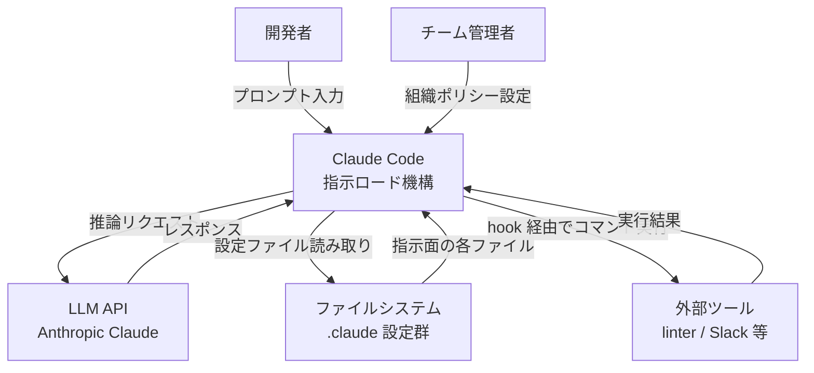
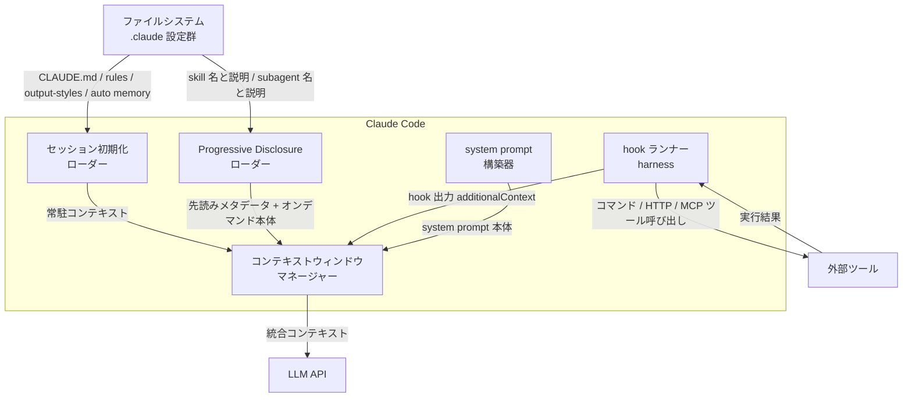
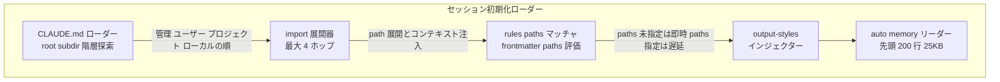
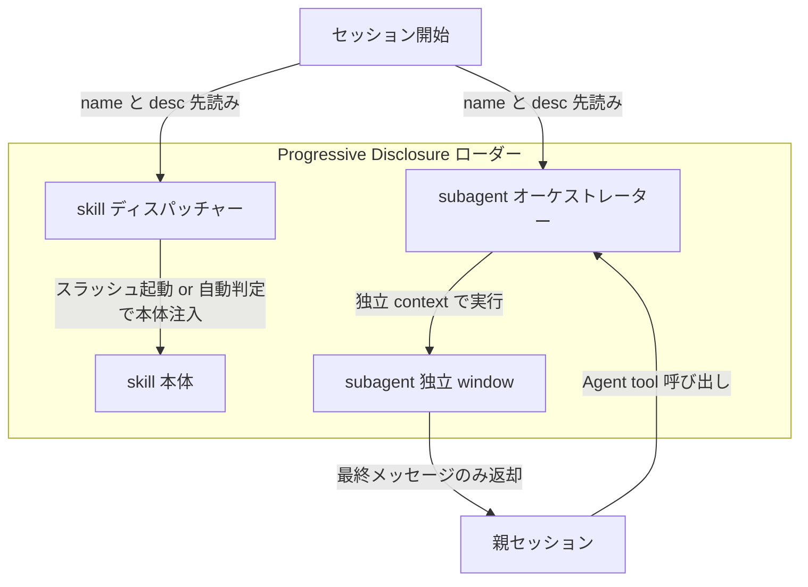
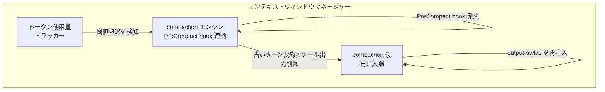
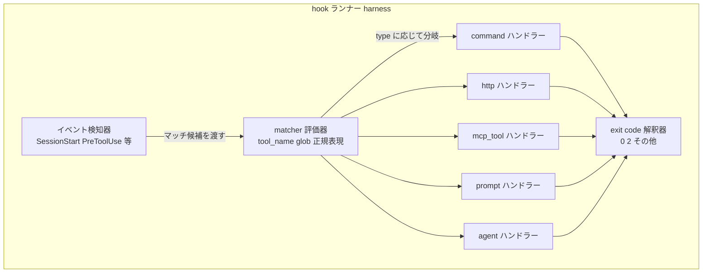
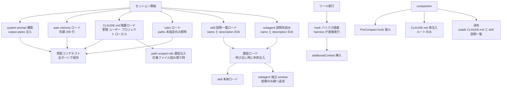
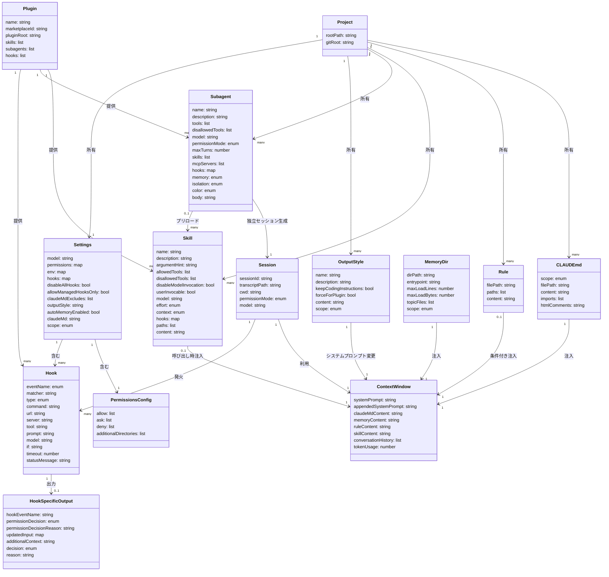

Claude Code には、AI の挙動を制御する手段が 7 つあります。`CLAUDE.md`・Rules・Skills・Subagents・Hooks・Output styles・System prompt 追加です。これらに加えて memory・plugins・managed settings も挙動を左右します。

問題は「どの指示をどこに書くか」です。置き場を誤ると、性能より先に運用が壊れます。たとえば手順をすべて `CLAUDE.md` に書くと、関係ない作業でも毎回ロードされ、コンテキストを浪費します。長いセッションでは圧縮 (compaction) によって指示が失われ、Claude が従わなくなります。

この記事では、各手段を「読込タイミング / 圧縮 (compaction) 後の残り方 / 権威の強さ / コンテキストコスト」の 4 軸で整理します。さらに C4 モデルでロード機構を構造化し、設定データモデル・構築方法・運用・ベストプラクティスまで通しで示します。出典は Anthropic 公式ブログ「Steering Claude Code: skills, hooks, rules, subagents and more」と Claude Code 公式ドキュメントです。

## 概要

Claude Code は、コーディングタスクを自律的に実行するエージェントです。長いセッション・複数ファイルにまたがる作業・サブエージェントへの委任を通じて動作するため、「どの指示をどこに書いたか」が性能より先に問われる設計課題になります。

Anthropic はこの課題に対して **7 つの指示面 (steering surfaces)** を提供します。指示面とは、Claude の挙動を制御する手段群の総称です。各手段は次の 3 軸で異なります。

1. **いつコンテキストに読み込まれるか** (セッション開始 / オンデマンド / ライフサイクルイベント)
2. **圧縮 (compaction) 後も残るか** (消える / 再注入される / 圧縮をバイパスする)
3. **どれだけの権威 (authority) を持つか** (Claude の判断に委ねる指示か / 確定的に強制するか)

### なぜ指示の置き場を誤ると運用が壊れるのか

Claude Code はすべての指示をコンテキストウィンドウ上で処理します。コンテキストは有限であり、セッションが長くなると **compaction (圧縮)** が発生して古い内容が失われます。

**コンテキスト負債 (context debt)** とは、この問題が蓄積した状態です。典型的な進行は次のとおりです。

- チーム全員が CLAUDE.md に指示を追記し続け、誰も削除しません。
- 結果として、エンジニア全員の全セッションで関係のない指示が毎回ロードされます。
- トークン消費が増え、Claude が指示に従う精度が下がります。
- compaction で失われるべきでない指示まで失われ、運用が不安定になります。

正しい指示面を選ぶと、「必要なときだけ必要な指示をロードする」設計になり、コンテキスト効率と指示の確実性が両立します。本ドキュメントは「何をコンテキストに載せずに済ませるか」を判断軸として、各手段の配置・ロード機構・データモデル・運用知見を整理します。

## 特徴

### 7 手段の一言要約

| # | 手段 | 一言要約 |
|---|------|----------|
| 1 | **CLAUDE.md** | 毎セッション自動ロードされる、チームで共有する常駐知識の置き場 |
| 2 | **Rules** | CLAUDE.md を補完するモジュール型の制約ファイル。パス指定で特定ファイル操作時のみロード可能 |
| 3 | **Skills** | 名前と説明はセッション開始時にロード、本体は呼び出し時のみロードされる手順書 |
| 4 | **Subagents** | 独立したコンテキストウィンドウで動作し、結果のサマリだけを返す隔離ワーカー |
| 5 | **Hooks** | ライフサイクルイベントに確定的に発火する自動化 |
| 6 | **Output styles** | system prompt を直接変更し、Claude のロールそのものを変える (built-in 指示は keep-coding-instructions で保持) |
| 7 | **System prompt 追加** | CLI 起動時に `--append-system-prompt` でセッション単位の追加指示を渡す |

### 全体を貫く設計思想

**Progressive disclosure (段階的開示)**

- Skills と Subagents は名前・説明だけを先にロードし、本体はオンデマンドでロードします。
- 「必要になるまで全体を読み込まない」ことで、コンテキストコストをゼロに近づけます。
- `disable-model-invocation: true` を設定すると、Claude がこのスキルを自動起動しなくなり、説明の事前ロードも抑制されます (`/name` での手動起動は可能です)。

**コンテキストに載せないで済ませることが設計目標**

- Hooks は設定がコンテキスト外に存在し、発火してもコンテキストを汚しません。
- Subagents は独立したコンテキストウィンドウを持ち、中間処理が親セッションを汚しません。
- Path-scoped rules は対象ファイルを触るまでロードされません。

**指示と強制を区別する**

- CLAUDE.md / Rules / Skills への記述はすべて「指示 (instruction)」であり、Claude が守るかどうかは確率的です。
- 「絶対に起きてはいけない操作」は Hooks (PreToolUse) と Permissions (deny ルール) で確定的に強制します。
- Managed settings は管理者デプロイによる上書き不可の組織全体ガードレールです。

### 4 軸比較テーブル

| 手段 | 配置パス | 読込タイミング | compaction 後 | 権威の強さ | コンテキストコスト | 主な用途 |
|------|----------|--------------|--------------|-----------|----------------|--------|
| **CLAUDE.md (root)** | `CLAUDE.md` / `.claude/CLAUDE.md` / `~/.claude/CLAUDE.md` | セッション開始 (全文) | 再読み込みされ再注入 | 中 (Claude の判断に委ねる) | 高 (毎リクエスト全行) | ビルドコマンド、ディレクトリ構成、コーディング規約 |
| **CLAUDE.md (サブディレクトリ)** | `<subdir>/CLAUDE.md` | オンデマンド (対象ディレクトリ接触時) | 自動再注入なし | 中 | 低〜中 (接触時のみ) | ディレクトリ固有の規約 |
| **Rules** | `.claude/rules/*.md` / `~/.claude/rules/*.md` | セッション開始 (paths 未指定) / ファイルマッチ時 (path-scoped) | 再注入される | 中 | 中 (path-scoped なら低) | 言語・ディレクトリ固有の制約 |
| **Skills** | `.claude/skills/<name>/SKILL.md` / プラグイン内 | 名前と説明: セッション開始 / 本体: 呼び出し時 | 呼び出し済みのみ予算内で再注入 | 中 | 低 (本体は呼び出し時のみ) | デプロイ手順、リリースチェックリスト、参照手順書 |
| **Subagents** | `.claude/agents/<name>.md` / `~/.claude/agents/` | 名前・説明・ツール一覧: セッション開始 / 本体: 呼び出し時 | 最終メッセージのみ返却 | 中 | 低 (独立コンテキストウィンドウ) | 並列作業、ログ解析、深い検索などの副タスク |
| **Hooks** | `settings.json` の `hooks` キー / プラグイン内 | ライフサイクルイベント発火時 | compaction をバイパス (常時有効) | 高 (確定的実行) | ゼロ (出力を返す場合のみ追加) | リンター実行、危険コマンドのブロック、Slack 通知 |
| **Output styles** | `.claude/output-styles/*.md` | セッション開始 (キャッシュ後再利用) | 圧縮されない (再適用される) | 最高 (システムプロンプトを直接変更) | 高 (システムプロンプトレベル) | Claude のロール大幅変更 |
| **System prompt 追加** | CLI フラグ `--append-system-prompt` | 起動時 (そのセッションのみ) | 圧縮されない | 高 (システムプロンプトに付加) | 中 (プロンプトキャッシュ後は低) | 特定セッションの規約・フォーマット指定 |
| **Auto memory (MEMORY.md)** | `~/.claude/projects/<project>/memory/MEMORY.md` | セッション開始 (先頭 200 行 / 25KB) | セッション開始時に再読込 | 低 (Claude が自律的に書く学習メモ) | 低 (先頭部分のみ) | ビルドコマンド、デバッグパターン、プロジェクト知見 |

### 補足: Managed settings と Plugins

**Managed settings** (`managed-settings.json` / MDM / レジストリ) は、管理者がデプロイしてユーザー設定で上書きできない組織ガードレールです。許可・拒否コマンド、利用モデル制限、MCP サーバー制御を強制し、`claudeMd` キーで managed CLAUDE.md 相当の指示も埋め込めます。

**Plugins** (`.claude-plugin/plugin.json` + `skills/` + `agents/` + `hooks/`) は、Skills / Subagents / Hooks / MCP servers を 1 ディレクトリにまとめて配布・再利用するパッケージング層です。スキル名はプラグイン名でネームスペース化 (`/plugin-name:skill-name`) され、衝突を防ぎます。`.claude/skills/` 直下の standalone 設定と動作は同じですが、複数リポジトリへの配布・バージョン管理・マーケットプレイス登録が可能です。

## 構造

7 手段が「どのタイミングで・どの経路でコンテキストに載るか / compaction でどう扱われるか / hook はどこで harness が実行するか」というロード機構を、C4 model の 3 段階で示します。

### システムコンテキスト図



#### システムコンテキスト図の要素

| 要素名 | 説明 |
|---|---|
| 開発者 | Claude Code を対話利用してコーディング作業を行うユーザー |
| チーム管理者 | 組織ポリシー CLAUDE.md や managed settings を配布する IT / DevOps 担当者 |
| Claude Code 指示ロード機構 | 各指示面を収集・統合してコンテキストを組み立て、LLM に送信する本体 |
| LLM API | 推論を担う Anthropic Claude モデル群 |
| ファイルシステム | CLAUDE.md / rules / skills / agents / hooks 設定 / output-styles を格納するローカルファイルシステム |
| 外部ツール | hook のハンドラーが呼び出す外部プロセス・HTTP エンドポイント・MCP サーバー |

### コンテナ図

ここでの「コンテナ」は、claude プロセス内の論理処理単位を指します。実際にはすべて単一プロセス内で動作します。



#### コンテナ図の要素

| 要素名 | 説明 |
|---|---|
| セッション初期化ローダー | セッション開始時に CLAUDE.md 階層・rules・output-styles・auto memory を一括読み込みするコンテナ |
| Progressive Disclosure ローダー | skill と subagent の名前と説明をセッション開始時に先読みし、本体はオンデマンドでロードするコンテナ |
| コンテキストウィンドウマネージャー | トークン使用量を監視し、compaction トリガーと再注入ルールを管理するコンテナ |
| hook ランナー harness | ライフサイクルイベント発火時に hook ハンドラーを実行し、結果を additionalContext としてコンテキストへ挿入するコンテナ |
| system prompt 構築器 | output-style・append-system-prompt・環境情報を結合して system prompt を組み立てるコンテナ |

### コンポーネント図

#### セッション初期化ローダー



| 要素名 | 説明 |
|---|---|
| CLAUDE.md ローダー | 作業ディレクトリから上位へ CLAUDE.md / CLAUDE.local.md を探索し、ルートへ向かう順で連結注入する |
| import 展開器 | `@path/to/file` 構文で参照するファイルをセッション開始時に展開する。最大再帰深度は 4 ホップ |
| rules paths マッチャ | `.claude/rules/*.md` の `paths` を評価し、グロブ一致するファイルを Claude が読んだ時点でルールを遅延注入する |
| output-styles インジェクター | 選択中の output-style を system prompt 末尾に追記する。`keep-coding-instructions: true` でデフォルト指示を保持する |
| auto memory リーダー | `MEMORY.md` の先頭 200 行または 25KB をセッション開始時に注入する |

#### Progressive Disclosure ローダー



| 要素名 | 説明 |
|---|---|
| skill ディスパッチャー | セッション開始時に全 skill の name と description を注入し、呼び出し時にのみ SKILL.md 本体をロードする。`disable-model-invocation: true` は先読みリストから除外する |
| skill 本体 | スラッシュ起動または自動判定時にコンテキストへ追加される SKILL.md 本文 |
| subagent オーケストレーター | `.claude/agents/` の name と description を先読みし、Agent tool 呼び出しで独立コンテキストの subagent を起動する |
| subagent 独立 window | subagent 専用のコンテキストウィンドウ。最終メッセージのみ親セッションへ返す |

#### コンテキストウィンドウマネージャー



| 要素名 | 説明 |
|---|---|
| トークン使用量トラッカー | コンテキストウィンドウの残量を監視し、compaction トリガー条件を判定する |
| compaction エンジン | `/compact` または自動コンパクションを実行し、発火前に `PreCompact` hook を呼び出す |
| compaction 後再注入器 | compaction 後にプロジェクトルートの CLAUDE.md を再読み込みし、output-styles を再適用する。サブディレクトリ CLAUDE.md と skill 説明一覧は再注入しない |

#### hook ランナー harness



| 要素名 | 説明 |
|---|---|
| イベント検知器 | `SessionStart` `PreToolUse` `PostToolUse` `PreCompact` `Stop` などのライフサイクルイベントを検知してマッチャーに渡す |
| matcher 評価器 | `matcher` のツール名完全一致・OR リスト・正規表現・`if` 条件で hook の発火を絞り込む |
| command ハンドラー | shell または exec 形式でスクリプトを起動し、イベント JSON を stdin で渡す |
| http ハンドラー | 指定 URL へイベント JSON を POST し、レスポンス JSON を受け取る |
| mcp_tool ハンドラー | 接続済み MCP サーバーのツールをイベント情報とともに呼び出す |
| prompt ハンドラー | 指定モデルへ単発プロンプトを送り yes / no 判定を受け取る |
| agent ハンドラー | 検証用 subagent を起動し結果を yes / no で返す |
| exit code 解釈器 | exit 0 で JSON 出力を採用、exit 2 でイベント別の確定的ブロック (PreToolUse はツール呼び出し、Stop は停止、PreCompact は圧縮をブロック)、その他は非ブロッキングエラーとして継続 |

#### 指示がコンテキストに載る経路



| 要素名 | 説明 |
|---|---|
| 常駐コンテキスト | compaction 後も再注入される、全ターンで保持されるコンテキスト領域 |
| 遅延ロード | skill / subagent の本体を必要になるまで載せない Progressive Disclosure の経路 |
| skill 本体ロード | スラッシュ起動または自動判定時に SKILL.md 本体を追加する |
| subagent 独立 window | subagent が独自のコンテキストで動作し、最終メッセージのみ親へ返す |
| path-scoped rule 遅延注入 | `paths` を持つ rules を、一致ファイルを読んだ時点で初めて注入する |
| hook バイパス経路 | hook は LLM コンテキストを経由せず harness が直接実行するため compaction の影響を受けない |
| additionalContext 挿入 | hook が JSON 出力の `hookSpecificOutput.additionalContext` で返した内容のみコンテキストへ追加される |
| CLAUDE.md 再注入 | compaction 後はプロジェクトルートの CLAUDE.md のみ再読み込みする |
| 消失 | サブディレクトリ CLAUDE.md は次回ファイル読み取りまで、skill 説明一覧は呼び出し済みのみ予算内で保持する |

## データ

各手段の設定ファイルが持つエンティティ・属性・関連をモデル化します。

### 概念モデル

```mermaid
graph TD
  subgraph UserScope["ユーザースコープ"]
    UserCLAUDE["ユーザー CLAUDE.md"]
    UserRules["ユーザー Rule"]
    UserSkills["ユーザー Skill"]
    UserSubagents["ユーザー Subagent"]
    UserOutputStyles["ユーザー OutputStyle"]
    UserSettings["ユーザー Settings"]
    UserMemoryDir["ユーザー MemoryDir"]
  end

  subgraph ProjectScope["プロジェクトスコープ"]
    ProjectCLAUDE["プロジェクト CLAUDE.md"]
    ProjectLocalCLAUDE["CLAUDE.local.md"]
    ProjectRules["プロジェクト Rule"]
    ProjectSkills["プロジェクト Skill"]
    ProjectSubagents["プロジェクト Subagent"]
    ProjectOutputStyles["プロジェクト OutputStyle"]
    ProjectSettings["プロジェクト Settings"]
  end

  subgraph ManagedScope["管理スコープ"]
    ManagedCLAUDE["管理 CLAUDE.md"]
    ManagedSettings["管理 Settings"]
  end

  subgraph PluginScope["プラグインスコープ"]
    Plugin["Plugin"]
    PluginSkills["プラグイン Skill"]
    PluginSubagents["プラグイン Subagent"]
    PluginHooks["プラグイン Hook"]
  end

  Project["Project リポジトリ"]
  Session["Session"]
  ContextWindow["ContextWindow"]
  Hook["Hook"]
  SystemPromptAppend["SystemPromptAppend"]

  Project --> ProjectCLAUDE
  Project --> ProjectLocalCLAUDE
  Project --> ProjectRules
  Project --> ProjectSkills
  Project --> ProjectSubagents
  Project --> ProjectOutputStyles
  Project --> ProjectSettings

  Plugin --> PluginSkills
  Plugin --> PluginSubagents
  Plugin --> PluginHooks

  Session --> ContextWindow
  Session --> Hook

  ManagedSettings -->|上書き| ProjectSettings
  ManagedSettings -->|上書き| UserSettings
  ProjectSettings --> Hook
  UserSettings --> Hook

  UserCLAUDE -->|注入| ContextWindow
  ManagedCLAUDE -->|注入| ContextWindow
  ProjectCLAUDE -->|注入| ContextWindow
  ProjectLocalCLAUDE -->|注入| ContextWindow
  UserMemoryDir -->|先頭注入| ContextWindow

  UserRules -->|条件付き注入| ContextWindow
  ProjectRules -->|条件付き注入| ContextWindow

  UserSkills -->|呼び出し時注入| ContextWindow
  ProjectSkills -->|呼び出し時注入| ContextWindow
  PluginSkills -->|呼び出し時注入| ContextWindow

  UserOutputStyles -->|システムプロンプト変更| ContextWindow
  ProjectOutputStyles -->|システムプロンプト変更| ContextWindow

  SystemPromptAppend -->|末尾追記| ContextWindow

  Hook -->|イベントで実行| Session

  UserSubagents -->|委譲| Session
  ProjectSubagents -->|委譲| Session
  PluginSubagents -->|委譲| Session
```



### 情報モデル



### エンティティの要点

| エンティティ | 要点 |
|---|---|
| CLAUDEmd | セッション開始時に注入される永続指示ファイル。`scope` は `managed` / `user` / `project` / `local` の 4 種類。作業ディレクトリから上方向に探索し、発見ファイルを連結注入する |
| Rule | `.claude/rules/*.md` のモジュール型指示。`paths` の glob 一致時のみ注入。`paths` 省略時はセッション開始時に無条件ロード |
| Skill | `SKILL.md` と補助ファイルで構成する手順書。ディレクトリ名がスラッシュコマンド名。本体は呼び出し時注入で、compaction 後も呼び出し済みのみ予算内で保持 |
| Subagent | 独立コンテキストを持つ専用アシスタント。markdown 本文 (`body`) がそのままシステムプロンプトになる (独立した `systemPrompt` フィールドは無い)。スコープ優先度は 管理 > CLI `--agents` > プロジェクト > ユーザー > プラグイン |
| Hook | `settings.json` で定義するライフサイクルフック。skill / subagent の frontmatter にも記述可能。`hookSpecificOutput.permissionDecision` は `PreToolUse` の `hookSpecificOutput` 内にネストする |
| OutputStyle | `output-styles/*.md`。本文がシステムプロンプト追加指示。ビルトインは `Default` / `Proactive` / `Explanatory` / `Learning` |
| Settings | `settings.json`。優先度は 管理 > CLI > ローカル > プロジェクト > ユーザー。permissions は全スコープで結合マージ、スカラー値は上位が下位を上書き |
| MemoryDir | `~/.claude/projects/<project>/memory/`。`MEMORY.md` の先頭 200 行または 25KB をセッション開始時にロード。同一 git リポジトリの全ワークツリーで共有 |

## 構築方法

### CLAUDE.md

スコープに応じて複数の場所に置けます。ロード順はブロードなスコープが先です。

| スコープ | パス | 共有 |
|---------|------|------|
| 組織ポリシー | OS 依存のシステムパス | 全ユーザー |
| ユーザー個人 | `~/.claude/CLAUDE.md` | 自分の全プロジェクト |
| プロジェクト | `./CLAUDE.md` または `./.claude/CLAUDE.md` | チームで共有可 |
| ローカル個人 | `./CLAUDE.local.md` (`.gitignore` 推奨) | 自分のみ |

`/init` で既存コードベースを解析して自動生成できます。既存ファイルがあれば上書きせず改善提案を行います。

```bash
/init
```

`@path` インポート記法で他ファイルを読み込めます。最大 4 ホップで再帰インポートでき、バックティックで囲うとインポートされません。

```markdown
プロジェクト概要は @README を参照してください。
利用可能な npm コマンドは @package.json を参照してください。
git ワークフローは @docs/git-instructions.md を参照してください。
```

推奨記述スタイルは次のとおりです。目安は 200 行以内で、HTML コメント (`<!-- ... -->`) はコンテキストに注入されないため、メンテナ向け注記に使えます。

```markdown
# ビルドコマンド
- テスト実行: `npm test`
- ビルド: `npm run build`

# コーディング規約
- インデント: スペース 2 文字
- 全 API エンドポイントで Zod による入力バリデーションを行う
```

大規模モノレポで他チームの CLAUDE.md を除外するには `claudeMdExcludes` を使います。

```json
{
  "claudeMdExcludes": ["**/other-team/CLAUDE.md"]
}
```

### Rules

`.claude/rules/*.md` に配置し、`paths` frontmatter で適用ファイルを限定します。`paths` がない場合はセッション開始時に常時ロードされます。

```markdown
---
paths:
  - "src/api/**/*.ts"
  - "lib/**/*.ts"
---

# API 開発ルール

- 全エンドポイントで入力バリデーションを実施する
- エラーレスポンスは標準フォーマットを使う
```

ユーザーレベルのルールは `~/.claude/rules/` に置き、全プロジェクトに適用されます。シンボリックリンクで共有ルールを使い回せます。

### Skills

`.claude/skills/<skill-name>/SKILL.md` を本体に、補助ファイルを同ディレクトリに置きます。

```
.claude/skills/deploy/
├── SKILL.md          # メイン手順書 (必須)
├── examples/sample.md
└── scripts/validate.sh
```

| 場所 | パス | 適用範囲 |
|------|------|---------|
| 個人 | `~/.claude/skills/<name>/SKILL.md` | 自分の全プロジェクト |
| プロジェクト | `.claude/skills/<name>/SKILL.md` | このプロジェクトのみ |
| プラグイン | `<plugin>/skills/<name>/SKILL.md` | プラグインが有効な場所 |

SKILL.md の記述例と主要フィールドは次のとおりです。

```yaml
---
name: deploy-staging
description: ステージング環境へデプロイします。「ステージングにデプロイ」「デプロイしたい」に反応します。
argument-hint: "[env]"
allowed-tools: Bash
---

デプロイ手順:
1. テストスイートを実行する: `npm test`
2. ビルドする: `npm run build`
3. ステージングへプッシュする: `./scripts/deploy.sh $ARGUMENTS`
```

| フィールド | 必須 | 説明 |
|-----------|------|------|
| `name` | 任意 | 表示名 (コマンド名はディレクトリ名) |
| `description` | 推奨 | スキルの用途。自動マッチに使用 |
| `argument-hint` | 任意 | オートコンプリート用ヒント |
| `disable-model-invocation` | 任意 | `true` で自動起動を無効化 |
| `user-invocable` | 任意 | `false` で `/` メニューから非表示 |
| `allowed-tools` / `disallowed-tools` | 任意 | スキル中に許可 / 禁止するツール |
| `model` / `effort` | 任意 | スキル中のモデル・エフォート上書き |
| `context` | 任意 | `fork` でサブエージェントとして実行 |
| `hooks` / `paths` | 任意 | スキルに紐づくフック / 自動有効化 glob |

`` !`command` `` 構文でスキル実行時にシェルコマンドの出力を差し込めます。

### Subagents

`.claude/agents/<name>.md` の frontmatter で定義し、本文がシステムプロンプトになります。`/agents` コマンドで対話的に作成・編集できます。

```markdown
---
name: code-reviewer
description: コードレビューを行い、品質・セキュリティ・ベストプラクティスを指摘します。コード変更後に自動で呼ばれます。
tools: Read, Glob, Grep
model: sonnet
color: blue
memory: project
---

あなたはシニアコードレビュアーです。コード品質・セキュリティ・ベストプラクティス準拠を確認し、現在のコードと改善案を示してください。
```

| フィールド | 必須 | 説明 |
|-----------|------|------|
| `name` | 必須 | 小文字英数字とハイフンの一意な識別子 |
| `description` | 必須 | いつこのエージェントに委任すべきか |
| `tools` / `disallowedTools` | 任意 | 使用可能 / 除外ツール (省略時は全ツール継承) |
| `model` | 任意 | `sonnet` / `opus` / `haiku` / `fable` / フルモデル ID / `inherit` |
| `permissionMode` | 任意 | `default` / `acceptEdits` / `auto` / `dontAsk` / `bypassPermissions` / `plan` |
| `maxTurns` | 任意 | 最大ターン数 |
| `skills` / `mcpServers` / `hooks` | 任意 | プリロードするスキル / MCP サーバー / 紐づくフック |
| `memory` | 任意 | 永続メモリスコープ (`user` / `project` / `local`) |
| `isolation` | 任意 | `worktree` で独立した git ワークツリーで実行 |

CLI フラグでセッション限定のサブエージェントを定義することもできます。

```bash
claude --agents '{"code-reviewer":{"description":"コードレビュー専門","prompt":"品質とセキュリティに集中","tools":["Read","Grep","Glob"],"model":"sonnet"}}'
```

### Hooks

`settings.json` の `hooks` キーに登録します。スキル / エージェントの frontmatter にも記述できます。

```json
{
  "hooks": {
    "EventName": [
      {
        "matcher": "ToolName",
        "hooks": [
          {
            "type": "command",
            "command": "${CLAUDE_PROJECT_DIR}/.claude/hooks/script.sh",
            "timeout": 60,
            "statusMessage": "検証中..."
          }
        ]
      }
    ]
  }
}
```

| 種類 (`type`) | 説明 |
|------|------|
| `command` | シェルコマンドを実行する |
| `http` | HTTP エンドポイントを呼び出す |
| `mcp_tool` | MCP サーバーのツールを呼び出す |
| `prompt` | Claude に yes / no 判定させる |
| `agent` | サブエージェントを起動して検証させる |

主なライフサイクルイベントは `PreToolUse` (ツール前・ブロック可) / `PostToolUse` (ツール成功後) / `UserPromptSubmit` / `Stop` / `SessionStart` / `SessionEnd` / `PreCompact` (圧縮前) / `PostCompact` / `SubagentStart` / `SubagentStop` / `FileChanged` です。これらは一部であり、完全なイベント一覧は公式 Hooks リファレンスを参照してください。

マッチャーは完全一致 (`"Bash"`)、パイプ区切り (`"Edit|Write"`)、正規表現 (`"^Notebook"`)、空文字 (全ツール) を取れます。終了コードは `0` で stdout の JSON を解析、`2` でイベント別の確定的ブロック (`PreToolUse` はツール呼び出しをブロックして stderr を Claude に渡す、`Stop` は停止を防止、`PreCompact` は圧縮をブロック) を行い、その他は非ブロッキングエラーとして継続します。

### Output styles

`.claude/output-styles/<name>.md` に置き、本文がシステムプロンプト追加指示になります。

```markdown
---
name: Diagrams first
description: すべての説明の冒頭に図を提示する
keep-coding-instructions: true
---

コード・アーキテクチャ・データフローを説明するときは、必ず Mermaid 図から始めてください。
```

`keep-coding-instructions: true` は応答スタイルだけを変え、コーディング向けデフォルト指示を保持します。省略すると built-in のソフトウェアエンジニアリング指示を引き継ぎません。`force-for-plugin` はプラグイン有効時の自動適用 (プラグイン専用) です。

### System prompt 追加

CLI フラグで呼び出し時に指定します。

| フラグ | 動作 |
|-------|------|
| `--append-system-prompt` | デフォルトプロンプトに追記する |
| `--append-system-prompt-file` | ファイルの内容を追記する |
| `--system-prompt` | デフォルトプロンプト全体を置き換える |
| `--system-prompt-file` | ファイルの内容で全体を置き換える |

追記フラグ (`--append-system-prompt` 系) は置き換えフラグ (`--system-prompt` 系) と併用できます。公式ドキュメントは併用時の優先順位や排他を明記していないため、置き換えフラグを複数同時に指定する使い方は避けます。

```bash
claude --append-system-prompt "常に型アノテーションを記述する" \
  -p "src/api/users.ts のリファクタリング計画を作成してください"
```

## 利用方法

各手段の起動・適用方法をまとめます。

| 手段 | 起動方法 | 適用タイミング |
|------|---------|--------------|
| CLAUDE.md | 自動 (セッション開始時) | 毎ターン常時 |
| Rules | 自動 (paths 一致時) | 対象ファイルアクセス時 |
| Skills | `/skill-name` または自動マッチ | 呼び出し時のみ |
| Subagents | Claude が自動委任または明示指示 | タスク実行時 |
| Hooks | イベント発火で自動実行 | ライフサイクルイベント時 |
| Output styles | `/config` でスタイル選択 (`/output-style` は v2.1.91 で削除済み) | セッション全体 |
| System prompt 追加 | CLI フラグで呼び出し時指定 | その呼び出しのみ |

### 確認・起動コマンド

- `/memory`: ロード済みの CLAUDE.md・ルール・auto memory を一覧・編集する。
- Skills は `/deploy-staging production` のようにスラッシュ起動するか、`description` 一致で自動起動する。ネストは `/apps/web:deploy` の修飾名で呼ぶ。引数は `$ARGUMENTS` / `$0` / `$name` で参照する。
- Subagents は `description` 一致で自動委任される。明示する場合は「Use the code-reviewer agent to analyze src/api/」のように指示する。ネスト深度は最大 5 レベル。`/agents` で実行状況とライブラリを確認する。
- Hooks は設定後に自動実行され、`/hooks` で登録済みフックを一覧する。スクリプト内では `${CLAUDE_PROJECT_DIR}` / `${CLAUDE_PLUGIN_ROOT}` などのパス変数を使える。
- Output styles は `/config` で切り替え、選択は `.claude/settings.local.json` の `outputStyle` に保存される。変更は `/clear` またはセッション再起動後に反映される。

## 運用

### CLAUDE.md の肥大化管理

CLAUDE.md は毎セッション全文がコンテキストに読み込まれます。肥大化すると重要な指示がノイズに埋もれ、コンテキスト消費が増え、セッション後半のパフォーマンスが下がります。公式の推奨は 1 ファイル 200 行未満で、各行に「これを削除したら Claude が間違えるか」を問い、No なら削ります。

共有リポジトリでは誰も削除しない状態になりがちです。CLAUDE.md にオーナーを置き、コードと同等の変更レビューを行います。ブロックレベルの HTML コメントはコンテキスト投入前に除去されるため、トークンコストなしでメンテナ注記を残せます。

| 状態 | 対処 |
|---|---|
| 手順書が数十行に及ぶ | `.claude/skills/<name>/SKILL.md` へ切り出す |
| 特定ディレクトリのみのルール | `.claude/rules/` のパススコープルールへ移行 |
| 個人設定がチーム用ファイルに混在 | `CLAUDE.local.md` または `~/.claude/CLAUDE.md` へ移動 |
| 他チームの CLAUDE.md が取り込まれる | `claudeMdExcludes` で除外 |

### コンテキスト負債のモニタリング

`/context` でシステムプロンプト・ツール・メモリファイル・スキル・会話履歴別のトークン消費量を確認できます。メモリファイルがセッション開始前に大きな割合を占めていれば見直しが必要です。

コンテキスト汚染の兆候は、同じ失敗を 2 回以上訂正した・Claude が以前の指示に従わなくなった・CLAUDE.md に書いてある事項を Claude が質問してきた、です。これらは長いセッションに蓄積した無関係な情報が原因のことが多く、`/clear` してより具体的な初期プロンプトで再スタートするのが有効です。

| コマンド | 用途 |
|---|---|
| `/context` | コンテキスト使用量をカテゴリ別に表示 |
| `/memory` | ロードされた CLAUDE.md・ルール・auto memory の一覧と編集 |
| `/hooks` | 設定済みフックの一覧確認 |
| `/permissions` | 許可・拒否ルールの確認・管理 |
| `/rewind` | チェックポイント一覧からの状態復元 |

### compaction との付き合い方

コンテキストウィンドウが上限に近づくと自動的に圧縮 (compaction) が走り、重要なコードや決定事項を保持しながらスペースを確保します。

| 種別 | compaction 後の挙動 |
|---|---|
| プロジェクトルート CLAUDE.md | 再読み込みされ再投入される |
| サブディレクトリの CLAUDE.md | 自動再投入されない (次回そのディレクトリのファイルを読むまで待機) |
| パススコープルール | マッチするファイルへのアクセス時に再投入される |
| 会話中にのみ与えた指示 | 消失する |

compaction 後に確実に再注入したい情報は、`SessionStart` hook に `matcher: "compact"` を指定して stdout で渡します。

```json
{
  "hooks": {
    "SessionStart": [
      {
        "matcher": "compact",
        "hooks": [
          { "type": "command", "command": "echo 'Reminder: use Bun, not npm. Run bun test before committing.'" }
        ]
      }
    ]
  }
}
```

`/compact <instructions>` で圧縮対象と保持対象を指示できます。

### plugin によるチーム配布・継続的共有

スタンドアロンの `.claude/` 設定を plugin として配布すると、複数リポジトリに同一設定を展開できます。

| 観点 | スタンドアロン `.claude/` | プラグイン |
|---|---|---|
| スキル名 | `/hello` | `/my-plugin:hello` (名前空間付き) |
| 共有方法 | 手動コピー | `/plugin install` |
| 用途 | 個人・単一プロジェクト | チーム・組織・コミュニティ配布 |
| バージョン管理 | なし | `plugin.json` の `version` |

`managed-settings.json` で `enabledPlugins` を指定すると、管理者が承認したプラグインのみが有効化され、ユーザーは無効化できません。

## ベストプラクティス

### 使い分け原則の全体図

| 何をしたいか | 使う手段 | 理由 (コンテキストコスト・権威・圧縮残存) |
|---|---|---|
| 毎セッション常駐させる規約 | **CLAUDE.md** | セッション開始時に全文ロード。compaction 後も再読み込みされる |
| 明示的に呼び出す手順書 | **skill** | 説明文だけ常駐 (低コスト)、本文は呼び出し時のみロード |
| 特定パスにのみ適用される規約 | **paths スコープ付き rule** | 対象ファイル操作時にのみロード。不要なコンテキスト消費を防ぐ |
| 並列・隔離の調査・分業 | **subagent** | 別コンテキストウィンドウで動作。中間成果が親に蓄積しない |
| 確定的に必ず実行させる処理 | **hook** | ライフサイクルイベントに紐づく。compaction の影響を受けない |
| ロールそのものを切り替える | **output style** | システムプロンプトに注入。最高の従属優先度を持つが既定指示を上書きする |

### 原則 1: 手順は skill へ (常駐禁止)

CLAUDE.md にデプロイ手順を書くと、関係ない作業のコンテキストも消費し続けます。手順は `.claude/skills/<name>/SKILL.md` に移し、説明文だけをセッション開始時に常駐させ、本文は呼び出し時のみロードします。

### 原則 2: 並列分業・調査の孤立は subagent へ

調査タスクを親セッションで行うと、読んだファイルすべてがコンテキストに蓄積します。subagent は独立コンテキストで動作し、最終メッセージ (+ メタデータ) のみを親に返すため、中間の大量ファイル読み込みが親を汚しません。ネスト深度は最大 5 レベルです。

調査系 subagent には `Write` 権限を与えないと成果物の保存が silent fail することがあります。保存させるなら全ツールを持つ汎用エージェントを使い、直後に `ls` / `Read` で実体を確認します。

### 原則 3: 強制実行は hook へ

CLAUDE.md に「必ず lint を実行してからコミットせよ」と書いても、長いセッションや曖昧な状況、プロンプトインジェクションで従わない可能性があります。「絶対に」が必要なら hook で確定的に実行します。

```json
{
  "hooks": {
    "PostToolUse": [
      {
        "matcher": "Edit|Write",
        "hooks": [
          { "type": "command", "command": "jq -r '.tool_input.file_path' | xargs npx prettier --write" }
        ]
      }
    ]
  }
}
```

hook 自体はコンテキストを消費しません。`hookSpecificOutput.additionalContext` を使った場合のみ、その内容がコンテキストに追加されます。

### 原則 4: 常駐すべき規約だけ CLAUDE.md へ

| 含めるもの | 含めないもの |
|---|---|
| Claude が推測できない Bash コマンド | コードを読めば分かること |
| デフォルトと異なるコードスタイルルール | 標準的な言語規約 |
| テスト方法と好みのテストランナー | 詳細な API ドキュメント (リンクで十分) |
| リポジトリ慣習 (ブランチ命名等) | 頻繁に変わる情報 |
| プロジェクト固有のアーキテクチャ決定 | 手順書 (skill へ) |

### 原則 5: ファイル固有制約は paths スコープ rule へ

`paths: ["src/api/**/*.ts"]` のように対象を絞ると、`src/api/` 以下を操作するときのみロードされ、無関係な作業ではコンテキストを消費しません。

### 原則 6: 大幅なロール変更は output style (ただし慎重に)

output style はシステムプロンプトに注入され最高の従属優先度を持ちますが、デフォルト指示 (スコープ・コメント・セキュリティ・確認事項) を上書きします。`--append-system-prompt` フラグはデフォルトを削除せず追記のみ行う安全な代替ですが、コンテキストコストは高めです。

### 原則 7: 親セッションに本文を入れない subagent 設計

subagent は独立コンテキストで動き、最終メッセージだけを親に返す設計にします。数十のファイルを読んでも、親セッションは差分と判断結果のみを受け取ります。

## トラブルシューティング

### 誤用→正用の対照表

| 症状 | 原因 | 対処 |
|---|---|---|
| CLAUDE.md に「毎回 X したら Y」と書いたが実行されない | 指示は確定的保証でない | `PostToolUse` / `Stop` hook で確定的に実行させる |
| CLAUDE.md に「絶対 Z するな」と書いたが従わない | 指示ベースの禁止は抜け穴がある | `PreToolUse` hook で exit code 2 で拒否、または managed settings の `permissions.deny` で強制 |
| CLAUDE.md が 30 行の手順書で埋まっている | 手順がセッション開始時から常駐し続ける | `.claude/skills/<name>/SKILL.md` に移動して呼び出し時ロードにする |
| API のルールを CLAUDE.md にフラットに書いている | 全ファイル操作でロードされ無関係なコンテキストを消費 | `.claude/rules/` に `paths: ["src/api/**"]` スコープ付きで記述 |
| チーム共用の CLAUDE.md に個人設定が混在 | プロジェクト CLAUDE.md は git にコミットされ全員に影響 | `CLAUDE.local.md` または `~/.claude/CLAUDE.md` へ移動 |
| output style を使ったら Claude が確認しなくなった | output style はデフォルト指示を完全に上書きする | 既製スタイルを先に確認、または `--append-system-prompt` を使う |
| compaction 後に指示が消えた | 会話中にのみ与えた指示は compaction で失われる | CLAUDE.md に書くか `SessionStart` hook (`matcher: compact`) で再注入 |

### 症状: CLAUDE.md の指示に従わない

1. `/memory` でファイルがロードされているか確認する。
2. ファイルが正しい場所 (scope) にあるか確認する。
3. 指示をより具体的に書き直す (「コードをきれいに書け」→「2 スペースインデントを使え」)。
4. 複数 CLAUDE.md ファイル間の矛盾を探す。
5. ファイルが 200 行を超えていないか確認する。
6. 必ず守らせたいなら hook に書き換える。

### 症状: hook が動かない

`/hooks` で登録を確認し、スクリプトに `chmod +x` で実行権限を付与します。exit 0 で JSON を返す場合は、シェル起動出力が混入しないよう有効な JSON のみを出力します。managed settings で `allowManagedHooksOnly: true` の場合、user / project フックは無効化されています。

### 症状: PreToolUse でブロックしたいが動かない

exit code 2 方式 (シンプル) と JSON 方式 (理由付き) の 2 通りがあります。

```bash
#!/bin/bash
COMMAND=$(jq -r '.tool_input.command' < /dev/stdin)
if [[ "$COMMAND" == *"rm -rf"* ]]; then
  echo "Blocked: rm -rf commands are not allowed" >&2
  exit 2
fi
exit 0
```

```bash
#!/bin/bash
INPUT=$(cat)
COMMAND=$(echo "$INPUT" | jq -r '.tool_input.command')
if echo "$COMMAND" | grep -q 'rm -rf'; then
  jq -n '{hookSpecificOutput: {hookEventName: "PreToolUse", permissionDecision: "deny", permissionDecisionReason: "Destructive command blocked by hook"}}'
else
  exit 0
fi
```

exit 2 の場合は JSON 出力が無視されるため、どちらか一方を選びます。優先順位は `permissions.deny` > hook の exit 2 ブロック > `permissions.allow` ルールです。

### 症状: subagent が成果物を保存したと報告するが実体がない

`Write` 不可のエージェント (例: 読み取り専用の探索エージェント) を使うと保存が silent fail します。保存させるなら全ツールを持つ汎用エージェントを使い、保存後すぐに `ls` / `Read` で実体を確認します。

### 症状: managed settings で設定したが反映されない

managed-only 設定は管理者レベルのファイルにのみ記述できます。user / project の settings.json に書いても効果がありません。

| OS | managed settings のパス |
|---|---|
| macOS | `/Library/Application Support/ClaudeCode/managed-settings.json` |
| Linux / WSL | `/etc/claude-code/managed-settings.json` |
| Windows | `C:\Program Files\ClaudeCode\managed-settings.json` |

managed-only の主要キーは `allowManagedHooksOnly` (managed 以外のフックをブロック)、`allowManagedPermissionRulesOnly` (user / project の permission rule をブロック)、`strictPluginOnlyCustomization` (カスタマイズを plugin 経由のみに制限) です。

## まとめ

Claude Code の 7 つの指示面は、「読込タイミング / 圧縮後の残り方 / 権威の強さ / コンテキストコスト」で性格が分かれます。手順は skill、並列分業は subagent、確定実行は hook、常駐規約だけ `CLAUDE.md`、ファイル固有制約は path-scoped rule、と置き場を分けると、コンテキスト負債を抑えながら指示の確実性を保てます。「何をコンテキストに載せずに済ませるか」を判断軸にすると、長いセッションでも性能が落ちにくくなります。

この記事が少しでも参考になった、あるいは改善点などがあれば、ぜひリアクションやコメント、SNSでのシェアをいただけると励みになります！

## 参考リンク

- 公式ブログ
  - [Steering Claude Code: skills, hooks, rules, subagents and more (英語)](https://claude.com/blog/steering-claude-code-skills-hooks-rules-subagents-and-more)
  - [Claude Code の制御方法 (日本語)](https://claude.com/ja/blog/steering-claude-code-skills-hooks-rules-subagents-and-more)
- 公式ドキュメント
  - [How Claude remembers your project (CLAUDE.md / Auto memory)](https://code.claude.com/docs/en/memory)
  - [Extend Claude with skills](https://code.claude.com/docs/en/skills)
  - [Create custom subagents](https://code.claude.com/docs/en/sub-agents)
  - [Hooks reference](https://code.claude.com/docs/en/hooks)
  - [Automate actions with hooks (hooks-guide)](https://code.claude.com/docs/en/hooks-guide)
  - [Output styles](https://code.claude.com/docs/en/output-styles)
  - [Claude Code settings](https://code.claude.com/docs/en/settings)
  - [CLI reference](https://code.claude.com/docs/en/cli-reference)
  - [Explore the context window](https://code.claude.com/docs/en/context-window)
  - [Best practices for Claude Code](https://code.claude.com/docs/en/best-practices)
  - [Configure permissions](https://code.claude.com/docs/en/permissions)
  - [Create plugins](https://code.claude.com/docs/en/plugins)
  - [Extend Claude Code (features-overview)](https://code.claude.com/docs/en/features-overview)
