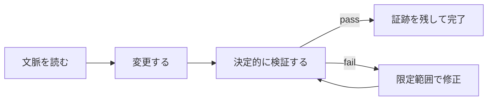
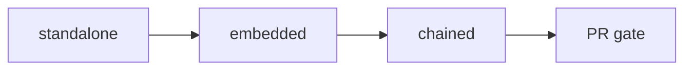
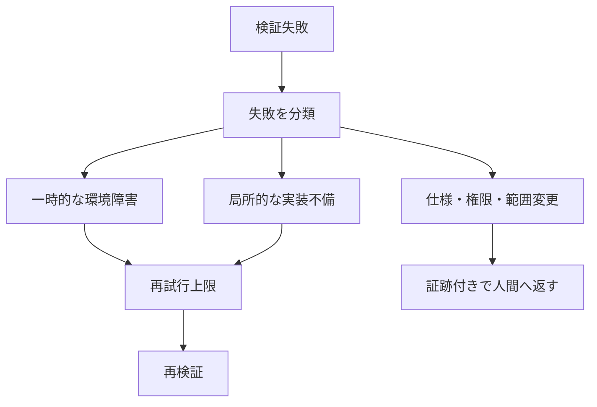
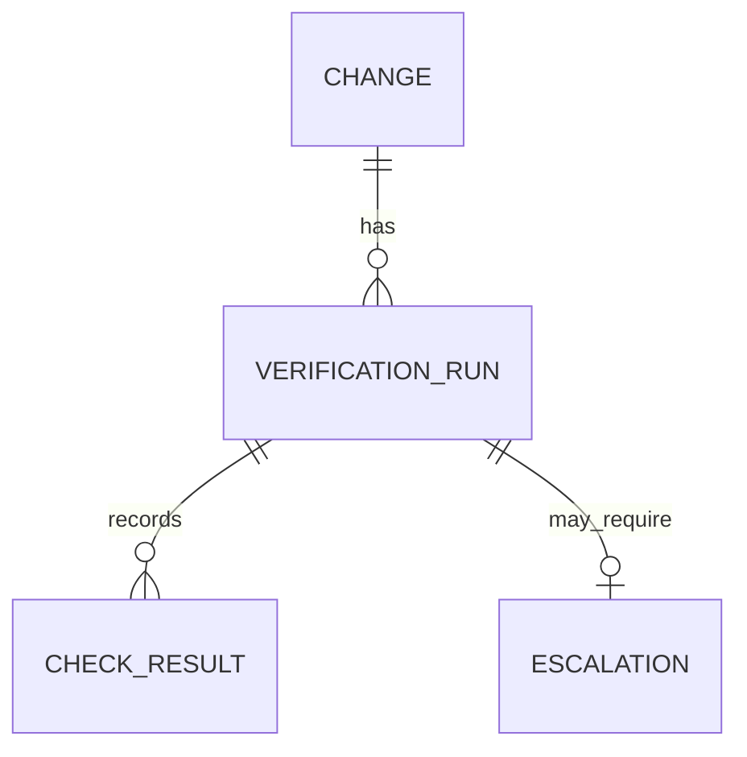

AIコーディングエージェントをチームへ入れると、実装そのものよりも「誰が、どこで、何を確認するか」が先に詰まります。テストを一度通すだけでは足りず、修正後にどこまで再検証するか、失敗時にいつ人間へ返すかも必要です。

Anthropic が紹介した Claude Code の verification loop は、この確認作業を Skill として再利用可能にする考え方です。ポイントは、エージェントに「慎重に確認して」と頼むことではありません。決定的な検証器、起動位置、停止条件を設計し、品質確認を開発フローの一部にすることです。

本記事では、Skill を使った verification loop を、導入順序と運用データの両面から整理します。

## verification loop は「自己採点」ではない

verification loop は、変更を生成した後にテスト、lint、型検査、独自ルールを実行し、失敗したときだけ限定して修正へ戻る反復です。



ここで合否を決めるのは、モデルの「問題なさそう」という説明ではありません。テストの exit code、静的解析、スナップショット、仕様照合のような外部信号です。モデルは信号を読んで次の行動を選びますが、判定器そのものと分けておくことで、自己肯定バイアスを小さくできます。

Anthropic の記事は、既に Claude Code が type checker、linter、test、runtime error といった決定的な信号を観測できることを前提に、毎回人間が補っている確認を Skill に移す方法を示しています。[公式記事](https://claude.com/blog/building-verification-loops-in-claude-code-with-skills)

## 先に設計するべきは、検査よりも配置

同じ検査でも、どこで起動するかで意味が変わります。

| 配置 | 向く検証 | 失敗時の扱い |
|---|---|---|
| standalone | リリース前監査、横断スキャン | 人間が明示的に起動する |
| embedded | コンポーネント生成直後のlintとtest | 生成フロー内で修正する |
| chained | review、簡素化、検証の連鎖 | 前段の成果を次段へ渡す |
| PR gate | 安定した組織標準 | CIで合否を固定する |



私は、新しい検証を最初から PR gate に置くのは好みません。誤検知、実行時間、対象範囲が分からないまま全員の待ち行列へ入るからです。まず standalone で意図的な失敗ケースを含めて試し、安定したら生成Skillへ埋め込み、最後にPRへ昇格する方が運用上安全です。

## Skill は確認作業の契約書になる

Skill には、発動条件、検査対象、使うツール、失敗時の振る舞いを書きます。説明が曖昧だと、エージェントは毎回異なる範囲を確認します。

```markdown
---
name: verify-log-hygiene
description: Run when error handling or logging changes.
allowed-tools: [Read, Edit, Grep]
---

Read error-handling paths in the current diff.
For each error log, confirm it includes a request ID and excludes
request bodies, headers, and user-supplied payloads.
Report each violation, then make the smallest safe fix.
```

これは一般的な linter が見つけにくい、リポジトリ固有の品質条件を扱う例です。重要なのは「ログを確認する」ではなく、何を含め、何を含めないかまで条件にする点です。

## 無限修正を防ぐ停止条件を先に書く

verification loop は、失敗を見つけるほど価値があります。しかし、修正を無制限に許すと、同じ失敗を反復したり、元の変更範囲を超えて作り替えたりします。



最低限、次の4条件を持たせます。

1. 最大試行回数
2. 同一失敗の連続回数
3. 実行時間またはトークン予算
4. 変更対象が当初の許可範囲を広げたか

```yaml
verification:
  max_attempts: 2
  retryable: [network_timeout, transient_runner_error]
  escalate_when:
    - same_failure_repeats
    - changed_scope
    - policy_violation
```

テスト失敗をネットワーク障害と同じ再試行にしないことも大切です。前者は仕様や実装を見直すシグナルであり、後者だけが一時的な再実行候補です。

## チーム運用で残すデータ

導入後に見るべきなのは、pass/fail だけではありません。Skill の価値は、手戻りを減らしたのか、単に自動実行回数を増やしたのかで決まります。

| 残すデータ | 判断できること |
|---|---|
| 最初の検証での合格率 | 要求や生成の品質が上がったか |
| 試行回数の中央値 | ループが膨らんでいないか |
| 失敗分類 | 実装、仕様、環境のどれが詰まりやすいか |
| 実行時間とトークン | 品質向上に見合う費用か |
| 人間への返却率 | 自動化境界が正しいか |



変更ID、Skill の版、実行コマンド、exit code、試行回数、最終状態を結び付けておけば、Skill 自体の改善もデータで判断できます。例えば、特定の検査だけが繰り返し timeout するなら、品質ルールではなく実行環境の問題です。

## 導入は小さく、昇格は慎重に

最初の1本は、チームが毎回手で直している小さな確認から選びます。ログの機微情報、migration の backfill、API互換性、UI変更後のアクセシビリティなどが候補です。

1. 手作業の確認を自然言語で書く
2. 意図的な失敗ケースで、検査が本当に落ちることを確認する
3. standalone で誤検知と実行時間を測る
4. 安定したら生成Skillに embedded する
5. 失敗分類と停止条件が安定してから PR gate にする

Skill chaining は便利ですが、連鎖するたびに時間とトークンを使います。すべてを自動化するより、変更の性質に応じて検証を選び、人間へ返すべき判断は明示的に残す方が、長期的には再現性の高い開発フローになります。

## まとめ

AI コーディングの品質を上げる中心は、より強いモデルを選ぶことだけではありません。人間が繰り返している確認を、外部信号で判定できる Skill に変え、適切な場所へ配置し、失敗時の停止条件を決めることです。

verification loop は agent を無制限に自律化する仕組みではなく、変更を安全に閉じるための境界設計です。まずは1つの手作業を契約に変え、通過率、試行回数、返却率を見ながらチームの標準へ育てていくのがよいでしょう。

## 参考リンク

- [Building verification loops in Claude Code with skills](https://claude.com/blog/building-verification-loops-in-claude-code-with-skills)
- [Extend Claude with skills, Claude Code Docs](https://code.claude.com/docs/en/skills)
- [GitHub Actions documentation](https://docs.github.com/actions)
