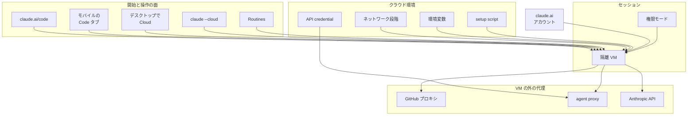

Claude Code のクラウドセッションは、開発者のマシン以外で動く Claude Code のセッションです。既定の実行先は Anthropic が管理する仮想マシンで、組織が振り向けたときはその組織の self-hosted 環境になります。開発者が自分で始める面は、ブラウザの claude.ai/code、Claude モバイルアプリの Code タブ、デスクトップアプリで Cloud を選んだセッション、ターミナルの `claude --cloud`、定期実行の Routines です。セッションはラップトップを閉じたあとも続き、別の端末から進捗の確認と追加の指示ができます。2026-09-23 の一般提供の告知はブログの更新行と @ClaudeDevs の投稿にあり、同じブログの本文には公開当時の "Now in beta as a research preview" が残っています。この記事では、使えるプラン、環境の構成、承認と秘密と停止と課金をどの主体が持つかを整理します。

*この記事の全体像。以下、順に解説します。*

## Claude Codeのクラウドセッションとは

クラウドセッションは、開発者の手元の外にある Claude Code のセッションです。組織の Claude Tag も、同じ種類のクラウドセッションを組織の環境で始めます。個人の Pro と Max には、この実行形態を試すための一度きりのクレジットがあります。

### 使えるプランと開始の面

提供プランは Pro、Max、Team、および premium 席か Chat + Claude Code 席の Enterprise です。根拠は [製品ドキュメント](https://code.claude.com/docs/en/claude-code-on-the-web) の冒頭注記と、[ブログ更新行](https://claude.com/blog/claude-code-on-the-web) の 2026-09-23 です。

開始と操作の面は次のとおりです。

- ブラウザの claude.ai/code
- Claude モバイルアプリの Code タブ
- デスクトップアプリで Cloud を選んだセッション
- ターミナルの `claude --cloud`
- 定期実行の Routines
- 組織の Claude Tag（組織の環境で同じ種類のセッションを始める）

`claude --cloud` は、現在のディレクトリの GitHub remote の現在ブランチを clone します。GitHub への接続は、Claude GitHub App か、ターミナルの `/web-setup` で送る `gh` トークンです。

### 環境と仮想マシン

各セッションはクラウド環境を一つ使います。環境はネットワーク段階、環境変数、setup script を持ちます。Pro と Max の Anthropic ホスト環境は、セッションから見えない API credential も持てます。

既定の Default 環境は Trusted ネットワークだけで、環境変数も setup script もありません。

Anthropic ホストの VM は Ubuntu 24.04、x86_64 です。文書が書くリソースの目安は 4 vCPU、16 GB RAM、30 GB disk で、概算であり変わりえます。人間は VM のシェルを持ちません。コマンドは Claude が実行します。

単一リポジトリのセッションは、クローンに含まれる `CLAUDE.md`、`.claude/settings.json` のフックと権限ルール、`.mcp.json`、`.claude/skills/` を読みます。複数リポジトリのセッションと project の thread は、クローンの外から始まり、各リポジトリの設定は読みません。

権限のドロップダウンは Accept edits、Plan、Auto です。権限プロンプトは claude.ai に出ます。

セッションは自分の ID を `CLAUDE_CODE_REMOTE_SESSION_ID` から読めます。クラウドセッションの VM では `CLAUDE_CODE_REMOTE` が `true` です。

### 利用上限と試用クレジット

クラウドセッションは、アカウントの Claude / Claude Code 利用上限を、他の利用と共有します。クラウド VM への別のコンピュート料金は、製品ドキュメントとクレジットのヘルプの両方に無いと書いてあります。

試用クレジットは Pro が 100 米ドル、Max が 250 米ドルです。対象は 2026-09-23 14:00 PDT 時点で有効だった個人の Pro と Max で、claude.ai アカウントに付きます。請求期限は 2026-10-07 23:59 PT、失効は 2026-11-04 23:59 PT です。1 アカウント 1 回です。一部のアカウントは自動で付与され、それ以外は 2026-10-07 23:59 PT までに請求します。クラウドセッションを始めると、残っているクレジットが自動で充当されます。

クレジットが残っているあいだ、クラウドセッションの利用はそのクレジットが払い、プランの利用上限には数えません。尽きたあとは、ローカルセッションと同じくプランの利用上限に数えます。

### 4つに分かれる構成

クラウドセッションは「どの面から始めるか」「どの環境設定で走るか」「どの資格情報が VM の外に残るか」「どのアカウントが認証と課金を持つか」の4つに分かれます。

ネットワーク段階は None、Trusted、Full、Custom の4つです。Trusted は許可ドメインだけを、セッションのネットワーク経由で届けます。GitHub プロキシ、有効にした MCP connector、API credential に列挙したホスト、Anthropic API は、この許可リストの外を通ります。None でも Anthropic API への通信は残ります。

API credential は、リクエストが VM を出たあとで agent proxy が付けます。キー自体は Claude、コマンド、セッションの環境変数には届きません。この仕組みは Pro と Max の Anthropic ホスト環境にあり、Team と Enterprise にはまだ無く、self-hosted 環境にもありません。

## 注意点

告知の「ラップトップを閉じても作業が続く」と、クレジットの「上限とは別」は、文書の中では条件付きです。到達を書いた面も一枚ではありません。

### 一般提供と研究プレビューが併記されている面

| 面 | 日付 | 状態の書き方 |
|---|---|---|
| [ブログ更新行](https://claude.com/blog/claude-code-on-the-web) | 2026-09-23 | generally available。対象は Pro、Max、Team、Enterprise の premium 席または Chat + Claude Code 席 |
| 同じブログの本文 | ページ日付は 2025-10-20 | "Now in beta as a research preview"。更新行の下に残っている公開当時の文 |
| [@ClaudeDevs の投稿](https://x.com/ClaudeDevs/status/2102871550974427462) | 2026-09-23 21:23:41 GMT | "officially available and out of research preview" |
| [現行の製品ドキュメント](https://code.claude.com/docs/en/claude-code-on-the-web) | 2026-09-25 に開いた本文 | preview とは書かず、プランを列挙する |
| [ヘルプのベータ一覧](https://support.claude.com/en/articles/14503520-available-beta-and-research-preview-features) | ページ日付 July 7, 2026 | 表の「Claude Code web (CCR)」が Research preview のまま |

2026-09-23 の到達として採用できるのは、ブログ更新行、告知投稿、現行の製品ドキュメントです。ヘルプ目録は 2026-07-07 の表のままなので、目録の1行を現在の製品状態には使いません。self-hosted 環境は別で、Team と Enterprise の public beta であり、既定はオフです。

ヘルプ目録の Research preview 行が、意図した現状なのか、2026-07-07 の表の更新漏れなのかは、文書からは決まりません。

### 切断したあとも動き続ける範囲

クイックスタートの比較表は、クラウドセッションの "Keeps running if you disconnect" を Yes と書きます。同じページのトラブルシュートは、タブを閉じたり画面を離れたりしてもセッションは止まらず、Claude が現在のタスクを終えてからアイドルになると書きます。

その先で VM は回収されます。製品ドキュメントとセキュリティ文書は、どちらも "a period of inactivity" とだけ書き、分数も時間も書きません。Anthropic ホストが VM を回収するまでの非活動時間は、文書にありません。MCP connector のツール呼び出しを承認する待ちと、MCP サーバへのサインイン待ちは、非活動に数えます。その待ちのあいだに期限切れになりえます。開き直すと会話履歴は戻ります。回収の瞬間に走っていた subagent とシェルコマンドは戻りません。

質問でアイドルになったセッションは、環境が期限切れになるまでなら、戻って答えれば続きから進みます。

開始そのものが失敗する条件も、文書にあります。

- 組織ポリシー `allow_remote_sessions` がオフ
- 組織ポリシーを取得できない
- Amazon Bedrock、Google Cloud の Agent Platform、その他の第三者プロバイダで CLI が設定されている
- GitHub に届かない
- 容量不足で `Session creation failed`
- setup script が非ゼロで終わる
- Zero Data Retention の組織は、`/web-setup` と、その他のクラウドセッション機能を使えない
- 組織の IP 許可リストがあると、Anthropic ホストのセッションは Anthropic のネットワークから API を呼ぶため、認証エラーになる

### 停止、アーカイブ、削除

製品ドキュメントが手順として書くのは次です。

- キューに入り、Claude がまだ読んでいないメッセージは、✕ で取り消して入力欄に戻せます
- アーカイブは、サイドバーの既定一覧から隠します。アーカイブ済みの ID へ CLI から追送すると、新しいメッセージを受け付けません
- 削除は、セッションとそのデータを恒久的に消します。data-usage は、イベントデータを恒久的に消す、と書きます
- クイックスタートは、タブを閉じてもセッションは止まらず、現在のタスクのあとでアイドルになると書きます。その案内の続きで、一覧から隠すアーカイブと、データを消す削除を並べています。計算を捨てるとは書いていません

changelog 2.1.261（September 4, 2026）は、最初のプロンプトの直後で、ターンが始まる前に送った Stop または interrupt をクラウドセッションが無視していたのを修正し、そのターンは完走せず止まると書きます。この修正が示すのは、そのタイミングの信号が届くことです。実行中のターン一般を止める手順は、この1行にはありません。製品ドキュメントは、そのボタンの名前も、信号が VM の計算を捨てるかも書いていません。デスクトップアプリの説明にある stop button と Esc は、セッション種別をクラウドに限った記述ではありません。

実行中ターンを捨てる操作が、Stop、アーカイブ、削除のどれに当たるかは、文書の範囲では決まりません。言えるのは、changelog のその信号と、claude.ai 上のセッション操作までです。クラウド VM が実行している Claude Code の版も文書に無く、changelog の修正がすべてのクラウドセッションに入っているとは言えません。

### Remote Control と teleport

Remote Control は別製品です。ローカルの Claude Code プロセスを、claude.ai やモバイルから操縦します。比較表の「切断後も動く」は、マシン上のセッションが開いているあいだです。実行とファイルはローカルのままです。`--cloud` と `--remote-control` は、製品ドキュメントが無関係と書きます。`--teleport` はクラウドセッションの会話とブランチを端末へコピーします。そこからの新しい作業はローカルに残り、claude.ai 上のクラウドセッションには出ません。

### 秘密の見え方

| 置き方 | VM から見えるか | 誰が読めるか |
|---|---|---|
| クラウド環境の環境変数 | 開始時に一度コピーされ、Claude が動かすコマンドから読める | その環境を使う人。ダイアログは秘密を置くなと書く |
| API credential（Pro / Max の Anthropic ホスト） | キーは届かない。agent proxy が VM の外で付ける | 保存後に値は再表示できない |
| GitHub App または `/web-setup` のトークン | 本物のトークンは GitHub プロキシ側。VM 内の git はスコープ付き資格情報を使う | 自分で `GH_TOKEN` か `GITHUB_TOKEN` を環境変数に置くと、その値はコンテナにそのまま入る。置かなければ変数は `proxy-injected` というプレースホルダになる |
| ユーザーの `~/.claude` と、端末の MDM | Anthropic ホストのセッションには届かない | マシン上に残る |
| 組織の server-managed settings | 開始時に Anthropic のサーバから取得する | 組織の管理面 |
| 単一リポジトリにコミットした `.claude/settings.json` のフックと権限ルール | そのセッションは読む | リポジトリを読める人 |
| 複数リポジトリのセッションと、project の thread | クローンの外から始まり、各リポジトリの設定は読まない | 読者の指定は無い |

IAM の認証順は、クラウドセッションについて別に書いています。クラウドセッションはサブスクリプション資格情報を使い、クラウド環境に `ANTHROPIC_API_KEY` または `ANTHROPIC_AUTH_TOKEN` を置いても、そのサブスクリプション資格情報は上書きされません。同じページは、クラウドセッションが `apiKeyHelper`、`ANTHROPIC_API_KEY`、`ANTHROPIC_AUTH_TOKEN` を読まず、OAuth を使う、と書きます。これは Claude Code 自身の認証の話です。環境変数をコマンドが読める、というクラウド環境の説明とは別の文です。キーを環境変数に置けばプロセスから読める、という露出は残ります。請求先が API キーの組織に移る、とは書いていません。

`claude --cloud` がローカルを bundle して送るとき、macOS、Linux、WSL では `.env`、Terraform の `*.tfvars`、`id_rsa`、`*.pem` のような未コミット変更を除外し、除外したファイル名を示します。linked worktree、submodule、同様のレイアウトでは、それらの変更をアップロードし、ファイル名を示します。bundle は 100 MB 未満が要件です。超えると現在ブランチだけ、それでも大きければ作業ツリーの単一 squashed snapshot に落ち、それでも大きければ失敗します。

Pro と Max の共有は Private と Public です。Public は、claude.ai にログインした人からセッションが見えます。セッションにはプライベートリポジトリのコードと資格情報が含まれえます。このプランでは、受け手のリポジトリアクセス検証は既定でオフです。

Auto-fix は、レビューコメントへの返信を利用者の GitHub アカウント名義で投稿し、Claude Code 由来とラベルします。`issue_comment` でデプロイや特権操作が走るリポジトリでは、その返信がワークフローを起動しえます。

### クラウドの承認メニュー

クラウドセッションのドロップダウンは Accept edits、Plan、Auto です。Accept edits は設定値 `default` に対応し、クラウドセッションはモードにかかわらずファイル編集を事前承認します。そのため表示は Manual ではなく Accept edits になります。`defaultMode: "acceptEdits"` は設定から尊重します。Auto は、組織が許し、選択したモデルが対応するときだけ出ます。

`defaultMode: "bypassPermissions"` と `"dontAsk"` は、設定ファイルにあってもクラウドセッションは尊重しません。無視は黙って行われ、セッションはドロップダウンに出ているモードで始まります。リポジトリに commit した設定で、クラウドセッションを bypass から始めることはできません。

### クレジットの対象外

ヘルプがクレジットの対象外と書くものは、Projects、Routines、Remote Control、Chat、Cowork、クラウドセッション以外の Claude 利用です。Routines は各実行がクラウドセッションである、と製品ドキュメントが書きます。クレジットの対象外であることと、実行形態がクラウドセッションであることは、両立する記述です。

Team、Enterprise、無料トライアル、支払い遅延は、このプロモーションの対象外です。Amazon Bedrock、Google Vertex AI、API キー認証でもクレジットは使えません。

Pro で Fable を選ぶには、usage credits がオンで残高があることが要ります。ボーナスクレジットを先に使い、ボーナスが尽きた直後から Fable は usage credits を引きます。

請求の URL は、告知スレッドが `https://claude.ai/code/claim-credit/10`、ヘルプの見える文言が `https://claude.ai/code/claim-credit/104` です。どちらが開くかは、HTTP で確認していません。CLI の `/claim-credit` は両方の案内にあります。

期限の原文は太平洋時間です。米国太平洋時間の夏時間は 2026-11-01 に終わります。その前提での換算は、請求期限が 2026-10-08 15:59 JST、失効が 2026-11-05 16:59 JST、資格判定の 2026-09-23 14:00 PDT が 2026-09-24 06:00 JST です。換算は告知文ではありません。

### ドキュメントが書いていないこと

- Anthropic ホスト VM のリージョン、データレジデンシー、SLA。data-usage と security の cloud 節にはありません。保持期間はアカウント種別で、学習利用を許した Consumer が 5 年、許さない Consumer が 30 日、Commercial の標準が 30 日です
- クラウドセッション専用の RPM、TPM、同時セッション数。書いてあるのは、アカウントの利用上限を共有し、並列はその分を消費する、までです
- セキュリティプロキシの rate limiting の数値
- self-hosted のアイドル解放の既定分数。参照したページの範囲では数字が取れないため、この記事には置きません

## 起動した端末と揃わない主体

ハーネスが仕事を渡したあとで見るべき主体は、起動した端末の設定ファイル一つには揃いません。

| 見たいもの | 主体 | 起動端末との関係 |
|---|---|---|
| プロセスが生きている場所 | Anthropic ホストの VM、または self-hosted runner | ラップトップのプロセスではない。Remote Control のときだけローカルプロセスである |
| 承認 | claude.ai のドロップダウンと、そこに出るプロンプト。単一リポジトリではコミット済みの権限ルールとフック。組織では server-managed settings | ユーザーの `~/.claude` と端末 MDM は Anthropic ホストへ届かない。bypass と dontAsk の defaultMode は無視される。ファイル編集は事前承認される |
| 秘密 | クラウド環境の環境変数はセッションから読める。API credential と GitHub の本物のトークンは、条件が揃えば VM の外 | ローカルのキーチェーンや `~/.claude/.credentials.json` は、クラウドセッションの認証には使われない。認証は claude.ai の OAuth である |
| ネットワーク | 環境の None / Trusted / Full / Custom。加えて許可リスト外の4経路 | ラップトップの到達範囲でも、ローカルのサンドボックス許可でもない |
| 止める | claude.ai のセッション操作と、文書が名前を付けない不活動回収。changelog 上の Stop / interrupt | ローカルプロセスの終了では止まらない。アーカイブを計算停止と書く文は、Anthropic ホストの手順に無い |
| 課金 | 同じ claude.ai サブスクリプション。資格期間中のクラウドセッションだけ試用クレジット | 起動したマシンの API キーでは上書きされない。クレジットは Bedrock / Vertex / API キー認証では使えない |
| 在席 | フォローアップは、同じアカウントでログインした別マシンの `claude -p --cloud <session-id>` から送れる | 在席は生存の条件ではない。承認待ちと不活動は、生存を止める条件になる |

self-hosted に振り向けたセッションは、上の「Anthropic ホスト」の列をそのまま使えません。隔離、外向き通信、git 資格情報は運用者の責任です。推論は Anthropic API のままで、Bedrock やゲートウェイには振れません。課金は、Anthropic ホストのセッションと同じく組織の Claude Code 利用を消費します。

## 仕事を渡すときに分ける4つの設定

クラウドセッションをハーネスの実行先にするなら、承認、秘密、停止、課金、生存を、開発者が席にいることとも、そのラップトップのユーザー設定とも、別の欄で定義します。

### 実行先

実行先は、Anthropic ホストか、self-hosted か、ローカルか、Remote Control かを分けます。Remote Control は、マシンが開いているあいだの操縦です。self-hosted は public beta で、既定オフです。self-hosted を、一般提供の Anthropic VM と同じ生存ルールで書くと、別製品と混ざります。

### 承認方針

承認の入力は、クラウドのドロップダウンで選べる Accept edits、Plan、Auto と、単一リポジトリにコミットしたルールだけにします。ユーザー設定の bypass がクラウドでも効く前提は置きません。ファイル編集は事前承認される前提で、レビューの位置をセッションの diff と PR に置きます。

単一リポジトリにコミットした権限ルールとフックは、クラウドセッションの承認の一部になります。ローカル設定が一切届かない、とは書けません。

### 停止と生存

停止操作の主体は、claude.ai のセッションと、長さが文書に無い不活動回収です。ローカルプロセスの終了を停止として記録しません。アーカイブは「一覧から隠した」と記録し、計算を止めたこととは分けて書きます。MCP の承認待ちは非活動に数えるので、無人で承認が必要なコネクタは、生存の条件を別に書きます。

### 課金

課金の主体は claude.ai のサブスクリプションです。個人 Pro / Max で、2026-09-23 14:00 PDT 時点の契約者だけが、請求期限内の試用クレジットをクラウドセッションに使えます。クレジットの残額、プラン上限、Pro で Fable を使うときの usage credits を、同じ残高として表示しません。Projects と Routines はクレジットの外です。Team と Enterprise は製品を使えても、このプロモーションはありません。

### 秘密

秘密は、クラウド環境の環境変数に置きません。外に出せるキーは、Pro / Max の API credential に置きます。GitHub はプロキシに任せ、`GH_TOKEN` を環境変数に追加しません。Public 共有の前に、セッションに資格情報が残っていないかを見ます。

API credential の分離は、Pro / Max の Anthropic ホストに限ります。環境変数に置いた秘密は、セッションプロセスから読めます。None でも Anthropic API へデータは出えます。Full を選べば、セッションのネットワークは任意のドメインへ届きます。

### ドキュメントが支えている範囲

次は、公開ドキュメントが直接支えている範囲です。

- 製品ドキュメントは、セッションがマシンの外で動き、ラップトップを閉じたあとも続き、別端末から操縦できる、と書きます
- クイックスタートは、ローカル設定の使用を "No, repo only" と書きます
- IAM は、クラウド環境の API キーがサブスクリプション認証を上書きしない、と書きます
- 権限モードの文書は、クラウドのメニューが端末の全モードより狭く、bypass と dontAsk を設定から無視する、と書きます
- クレジットのヘルプは、支払い主体を claude.ai の個人 Pro / Max に限定し、残額があるあいだはプラン上限と分け、コンテナ別料金は無い、と書きます

同じ文書の範囲で、次の3つは強く言えません。

- すべての公式面が研究プレビューを取り下げたこと。ヘルプ目録は Claude Code web (CCR) を Research preview のまま載せています
- アーカイブが計算を止めること。文書は、一覧から隠すことと、データを消すことを書いています
- 秘密がセッションから見えないこと。環境変数に置いた値はコマンドから読めます

請求 URL は、告知の `/claim-credit/10` とヘルプの `/claim-credit/104` で違います。次に画面で確認するなら、実行中セッションの Stop が VM の作業を捨てるかと、請求ページがどちらのパスに着地するかです。

## まとめ

Claude Code のクラウドセッションは、開発者のマシンの外で動き、Pro、Max、Team、および所定の Enterprise 席で使えます。2026-09-23 の一般提供は、ブログ更新行、@ClaudeDevs の投稿、現行の製品ドキュメントで読めます。ヘルプ目録の Research preview 行と、ブログ本文に残る研究プレビューの文は、その到達の現在形には使いません。

仕事を渡す側は、実行先、承認、停止と生存、課金を別の設定として持ちます。秘密は環境変数に置かず、Pro / Max の Anthropic ホストでは API credential に出します。切断後も動く、という比較表の Yes は、タスク完了後のアイドルと、長さが書いていない不活動回収と、承認待ちで崩れます。アーカイブは一覧から隠す操作であり、計算を止めた記録にはしません。

この記事が少しでも参考になった、あるいは改善点などがあれば、ぜひリアクションやコメント、SNSでのシェアをいただけると励みになります！

## 参考リンク

- ClaudeDevs. "Cloud sessions are officially available and out of research preview!" 2026-09-23. https://x.com/ClaudeDevs/status/2102871550974427462
- Anthropic. "Claude Code on the web." 公開 2025-10-20。更新行 2026-09-23. https://claude.com/blog/claude-code-on-the-web
- Anthropic. "Use Claude Code in the cloud." https://code.claude.com/docs/en/claude-code-on-the-web
- Anthropic. "Configure cloud environments." https://code.claude.com/docs/en/cloud-environments
- Anthropic. "Get started with cloud sessions." https://code.claude.com/docs/en/web-quickstart
- Anthropic. "Choose a permission mode." https://code.claude.com/docs/en/permission-modes
- Anthropic. "Authentication." https://code.claude.com/docs/en/iam
- Anthropic. "Security." https://code.claude.com/docs/en/security
- Anthropic. "Data usage." https://code.claude.com/docs/en/data-usage
- Anthropic. "Self-hosted environments." https://code.claude.com/docs/en/self-hosted-environments
- Anthropic. "Claude Code changelog." 2.1.261、September 4, 2026. https://code.claude.com/docs/en/changelog
- Anthropic. "Cloud sessions bonus credit promotion." https://support.claude.com/en/articles/17152539-cloud-sessions-bonus-credit-promotion
- Anthropic. "Available beta and research preview features." July 7, 2026. https://support.claude.com/en/articles/14503520-available-beta-and-research-preview-features
