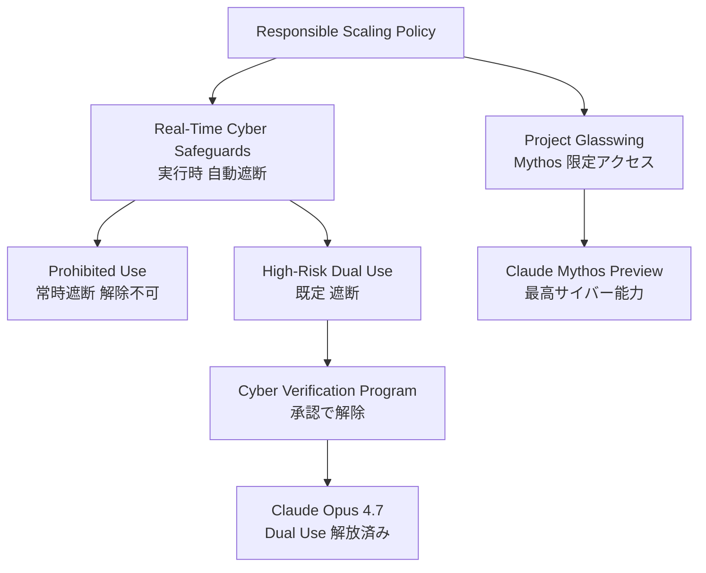
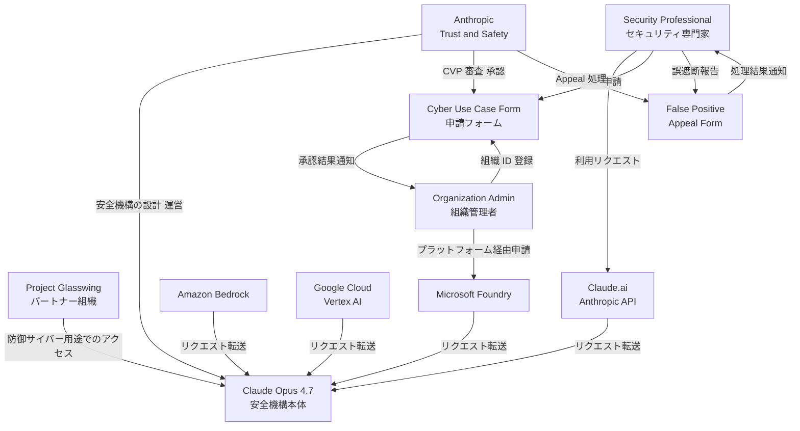
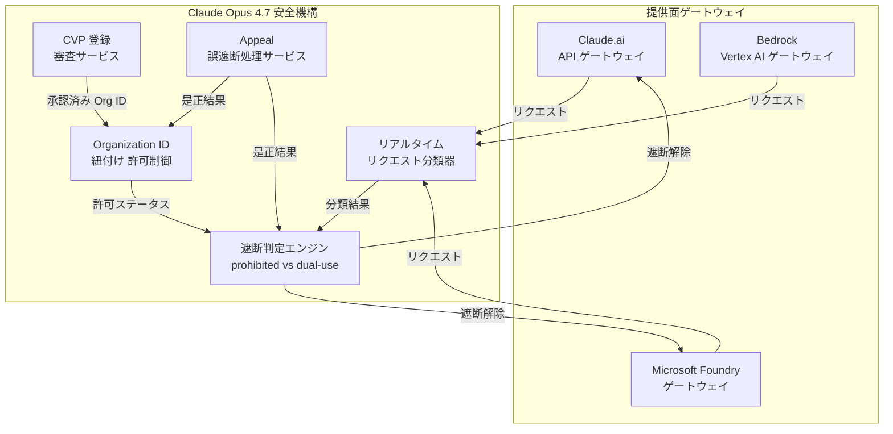
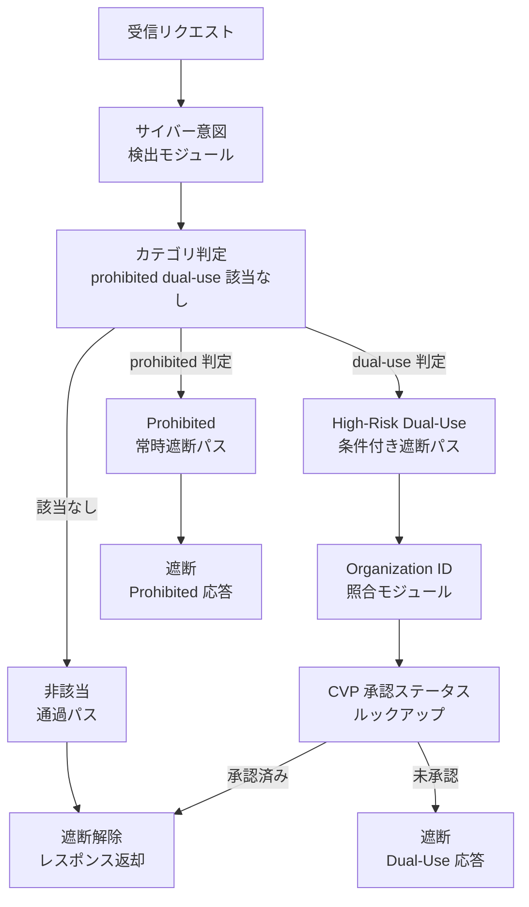
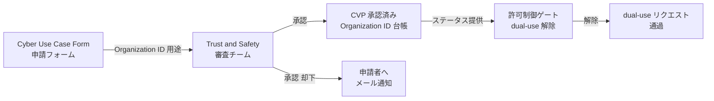
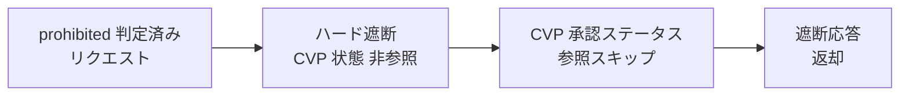
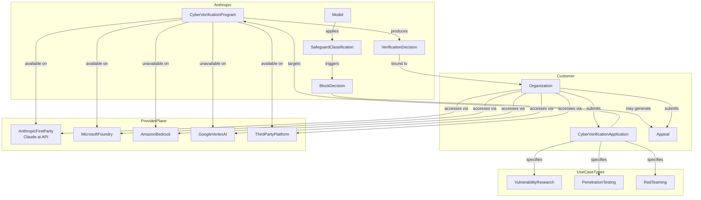
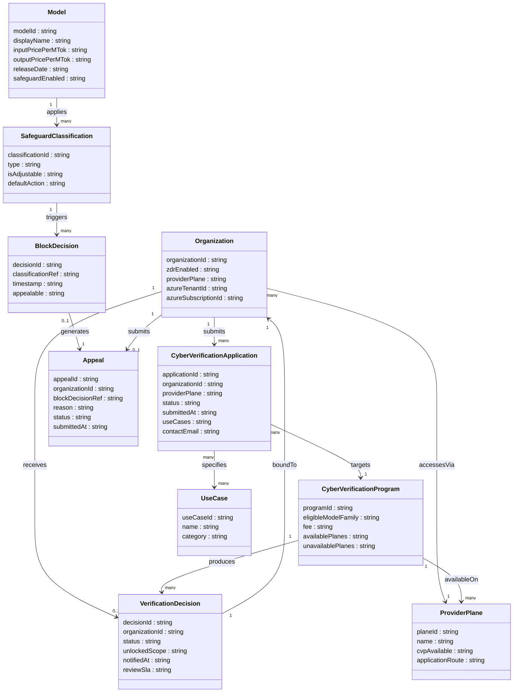

> 検証日: 2026-06-23 / 対象: Claude Opus 4.7 (`claude-opus-4-7`、2026-04-16 リリース)
> 本記事は Anthropic 公式発表・Help Center・Project Glasswing 発表、および AWS Bedrock / Microsoft Foundry / Google Vertex AI の各公式ドキュメントを一次情報として照合しています。

## 概要

Claude Opus 4.7 (モデル ID: `claude-opus-4-7`) は 2026 年 4 月 16 日にリリースされたモデルです (Anthropic 本体・AWS の表記。Google Cloud のモデルページは 2026 年 4 月 15 日と記載しており、パートナー間で 1 日の差があります)。価格は入力 $5 / MTok・出力 $25 / MTok で Opus 4.6 から据え置きです。

このリリースが注目される理由は「能力の強化」と「利用境界の設計」を同時に打ち出した点にあります。従来のモデル更新は能力向上だけを訴求してきました。Opus 4.7 は高リスクサイバー用途を自動遮断する safeguards をモデルと一体で提供しました。

なぜ能力強化と利用境界設計を同時に出したのでしょうか。背景には次の構造的な問題があります。コーディング・vision・メモリの能力が上がるほど、脆弱性探索や攻撃ツール開発への転用リスクも上がります。Anthropic はこの問題を「能力自体を抑制する」方向ではなく「境界で制御する」方向で解きました。具体的には次の三層構造です。

1. 訓練段階でサイバー能力を差分的に削減する (Mythos Preview 比)
2. Real-Time Cyber Safeguards で実行時に高リスク用途を遮断する
3. Cyber Verification Program (CVP) で正当な防御用途だけを解放する

この設計は「委任先の能力を絞る」のではなく「委任先に何を許すかを境界で管理する」という発想です。モデル選定が性能比較だけで完結しなくなり、拒否制御・正規利用の認証フロー・クラウド提供面の一貫性まで含めた調達設計が必要になります。

### Project Glasswing という文脈

このタイミングの背景には Project Glasswing があります。Anthropic は当初およそ 50 のパートナーに Claude Mythos Preview へのアクセスを提供し、その後およそ 150 の新規組織 (15 カ国以上) へ拡大しました。パートナーはモデルを自社コードベースのスキャンに投入し、高または重大度の脆弱性を 10,000 件超発見しています。Anthropic は「大規模攻撃が起きれば 1 億人超に影響しうる」と見積もっています。

Glasswing が描く順序は「防御先行 → safeguards 構築 → より広い公開」です。最高のサイバー能力を持つ Mythos Preview をまず厳選パートナーに防御目的で提供し、一般リリースを可能にする safeguards を構築し、その safeguards をより能力を抑えたモデルに載せて公開します。Opus 4.7 はこの順序を一般向けに展開した位置づけにあたります。

## 特徴

### Real-Time Cyber Safeguards

Opus 4.7 は prohibited または high-risk なサイバー用途を示すリクエストを自動検出・遮断します。遮断対象は 2 分類に分かれます。

| 分類 | 代表的な用途例 | 解除可否 |
|---|---|---|
| Prohibited Use | 大規模データ窃取・ランサムウェアコード開発 | いかなるプログラムでも解除不可 |
| High-Risk Dual Use | 脆弱性エクスプロイト・攻撃的セキュリティツール開発 | CVP 承認で解除可 |

High-Risk Dual Use は正当な防御用途が存在するため、既定で遮断しつつ CVP で解放できる設計です。Prohibited Use は防御的価値がほぼないため、どのプログラムでも解除されません。

### Cyber Verification Program (CVP)

CVP は Opus モデル向けの無料・申請制プログラムです。セキュリティ専門家が正当なサイバー防御用途で High-Risk Dual Use の遮断を解除するために使います。審査結果は 2 営業日以内のメール通知を目標としています (公式は "we aim to send...within 2 business days" と目標値として記述)。

申請方法はアクセス経路によって異なります。

| アクセス経路 | 申請方法 |
|---|---|
| Claude.ai / Claude Code / API | Organization ID を Cyber Use Case Form で提出 |
| サードパーティプラットフォーム | 各プラットフォーム経由で申請 (参加プラットフォームのみ) |
| Microsoft Foundry | Azure Tenant ID + Subscription ID をフォームで提出 |
| Amazon Bedrock | 現時点で CVP 非対応 |
| Google Cloud Vertex AI | 現時点で CVP 非対応 |

CVP 承認は特定の Organization ID に紐づきます。承認された組織と異なる組織でサインインしていると承認は引き継がれません。また、Zero Data Retention (ZDR) を利用している組織は現時点で CVP 非対象です。Sales Managed ZDR account の場合は Anthropic Sales Representative に問い合わせます。

### Project Glasswing との関係

Project Glasswing は AI でサイバー攻撃から重要インフラを守るパートナーシッププログラムです。パートナーは Claude Mythos Preview にアクセスでき、コードベーススキャン・パッチ生成・ペネトレーションテスト・脅威検出に活用できます。

CVP と Glasswing の違いは、対象モデルとアクセス審査の厳密さにあります。

| 観点 | Cyber Verification Program | Project Glasswing |
|---|---|---|
| 対象モデル | Claude Opus 4.7 (Opus 系) | Claude Mythos Preview |
| アクセス方法 | 申請制 (フォーム提出) | 招待制 (Anthropic による vetting) |
| 解放範囲 | High-Risk Dual Use の遮断解除 | Mythos Preview への防御用途アクセス |
| 主眼 | 正当なセキュリティ専門家への広い開放 | 最高能力を防御先行で安全運用する実験場 |



| 要素名 | 説明 |
|---|---|
| Responsible Scaling Policy | 能力閾値ごとに要求される safeguards を定める Anthropic の基本方針 |
| Project Glasswing | Mythos Preview を厳選パートナーに提供するプログラム。防御先行の順序の実装 |
| Real-Time Cyber Safeguards | リクエスト単位でサイバー悪用を自動検出・遮断する実行時機構 |
| Prohibited Use | 悪用がほぼ確実で防御的価値がない用途。解除不可 |
| High-Risk Dual Use | 防御用途があるが既定遮断。CVP 承認で解放 |
| Cyber Verification Program | 正当なセキュリティ専門家が Dual Use 遮断を解除するための申請制プログラム |
| Claude Mythos Preview | 最高のサイバー能力を持つモデル。Glasswing パートナー限定 |
| Claude Opus 4.7 | CVP 承認済みユーザーに Dual Use を解放できる一般公開モデル |

### Responsible Scaling Policy との関係

RSP は能力閾値を超えたモデルに対して強化された safeguards の実装を義務づける Anthropic の基本方針です。Real-Time Cyber Safeguards は RSP の実装の一つであり、能力 (モデルが何をできるか) と権限制御 (誰に何を許すか) を分離して設計する点に特徴があります。能力を一律に下げるのではなく、利用者の正当性を境界で判定する設計です。

### マルチクラウド提供と CVP 対応状況

Opus 4.7 は Claude products・API・Amazon Bedrock・Google Cloud Vertex AI・Microsoft Foundry の 5 経路で提供されます。ただし CVP は Bedrock と Vertex AI では現時点で提供されていません。セキュリティ用途で dual-use の解除が必要な場合は、Anthropic 直接経路または Microsoft Foundry を使います。

### モデル能力の要点

| 能力領域 | 要点 |
|---|---|
| コーディング | CursorBench 70% (Opus 4.6 は 58%)。Rakuten-SWE-Bench で Opus 4.6 比 3 倍の本番タスク解決 |
| vision | 長辺最大 2,576px (約 3.75 MP)。従来 Claude 比 3 倍超の解像度 |
| メモリ | ファイルシステムベースのメモリで複数セッションをまたいだ継続作業が可能 |
| セキュリティ評価 (XBOW visual-acuity) | 98.5% (Opus 4.6 は 54.5%) |
| サイバー能力の差分 | 訓練段階で Mythos Preview 比のサイバー能力を差分削減 |

## 構造

調査対象は製品ではなくモデルガバナンス機構です。C4 model を「安全機構と CVP の論理構造」に読み替えて図解します。以下の図は、公式が開示する申請・遮断・解除の挙動から再構成した概念モデルです。内部コンポーネント構成やデータモデルは公式未開示のため、実装の確定仕様ではありません。

### システムコンテキスト図



| 要素名 | 説明 |
|---|---|
| Security Professional | 脆弱性調査・ペネトレーションテスト・レッドチームに従事する専門家 |
| Organization Admin | CVP 申請時に Organization ID を登録・管理する組織の担当者 |
| Anthropic Trust and Safety | 安全機構の設計・CVP 審査・Appeal 処理を担うチーム |
| Project Glasswing パートナー組織 | Anthropic が vetting した防御サイバー用途の組織群 |
| Claude Opus 4.7 安全機構本体 | リアルタイム分類・遮断・CVP 許可制御を実行する中核システム |
| Claude.ai / Anthropic API | CVP 対応の主要提供面 |
| Amazon Bedrock | CVP 非対応の提供面 |
| Google Cloud Vertex AI | CVP 非対応の提供面 |
| Microsoft Foundry | Azure Tenant ID と Subscription ID による CVP 申請が可能な提供面 |
| Cyber Use Case Form | CVP 申請を受け付けるフォーム。Organization ID を収集する |
| False Positive Appeal Form | 誤遮断・CVP 却下に対する異議申し立てフォーム (正式名: Cyber Block False Positive Report / CVP Rejection Appeal) |

### コンテナ図



| 要素名 | 説明 |
|---|---|
| Claude.ai / API ゲートウェイ | CVP に完全対応する主要提供面。Organization ID で CVP 承認を引き継ぐ |
| Microsoft Foundry ゲートウェイ | Azure Tenant ID と Subscription ID を用いて CVP 申請が可能な提供面 |
| Bedrock / Vertex AI ゲートウェイ | CVP プログラムが提供されない提供面。高リスク dual-use は常時遮断 |
| リアルタイムリクエスト分類器 | 受信リクエストをサイバー用途の観点でリアルタイムに評価する (内部実装は公式未開示) |
| 遮断判定エンジン | 分類結果と許可ステータスを照合し、遮断または通過を決定する |
| CVP 登録・審査サービス | 申請受付・審査・承認通知を担う。目標 2 営業日以内にメールで結果を通知する |
| Organization ID 紐付け許可制御 | CVP 承認を特定 Organization ID に紐づけて管理し、遮断判定エンジンに許可ステータスを提供する |
| Appeal・誤遮断処理サービス | 誤遮断・CVP 却下申し立てを受け付け、分類ミスや Org ID 不一致を是正する |

### コンポーネント図

#### リクエスト分類と遮断判定パイプライン



| 要素名 | 説明 |
|---|---|
| サイバー意図検出モジュール | リクエストのサイバーセキュリティ関連意図をリアルタイムに評価する (モデル種別は公式未開示) |
| カテゴリ判定 | prohibited / high-risk dual-use / 非該当の 3 経路に振り分ける |
| Prohibited 常時遮断パス | 大規模データ窃取・ランサムウェア開発などが対象。CVP 承認でも解除不可 |
| High-Risk Dual-Use 条件付き遮断パス | 脆弱性の悪用・攻撃的セキュリティツール開発が対象。既定で遮断、CVP 承認で解除 |
| Organization ID 照合モジュール | リクエスト元のセッションが保持する組織 ID と CVP 登録を照合する |
| CVP 承認ステータスルックアップ | Organization ID に紐づく承認状態を参照し、遮断解除の可否を決定する |

#### CVP 承認が dual-use 遮断を解除する経路



| 要素名 | 説明 |
|---|---|
| Cyber Use Case Form | Organization ID と用途説明を収集する申請フォーム |
| Trust and Safety 審査チーム | 提出内容を審査し、目標 2 営業日以内に承認または却下を決定する |
| CVP 承認済み Organization ID 台帳 | 承認された組織 ID を保持し、許可制御ゲートに参照される |
| 許可制御ゲート | 台帳照合で承認済みと判定された場合のみ dual-use 遮断を解除する |

#### Prohibited 常時遮断経路



| 要素名 | 説明 |
|---|---|
| prohibited 判定済みリクエスト | 大規模データ窃取・ランサムウェアコード開発などに分類されたリクエスト |
| ハード遮断 | CVP 承認ステータスを参照せずに無条件で遮断する |
| CVP 承認ステータス参照スキップ | prohibited 経路では CVP 承認が遮断判定に影響しないことを示す構造的分岐 |

## データ

公式記述に明示された属性を基本とし、推測で補完した属性には「※推測」と注記します。

### 概念モデル



### 情報モデル



### エンティティ補足

#### SafeguardClassification

| type 値 | isAdjustable | 解除手段 |
|---|---|---|
| `Prohibited` | `false` | 解除不可 (どのプログラムでも) |
| `HighRiskDualUse` | `true` | CVP 承認で解除可 |

#### CyberVerificationProgram

| 属性 | 値 / 根拠 |
|---|---|
| eligibleModelFamily | `opus` (公式: "Opus models") |
| fee | `free` (公式: "free application-based program") |
| availablePlanes | `anthropic_first_party`, `microsoft_foundry`, `third_party` |
| unavailablePlanes | `amazon_bedrock`, `google_vertex_ai` (公式明記) |

#### ProviderPlane

| name | cvpAvailable | applicationRoute |
|---|---|---|
| AnthropicFirstParty (Claude.ai / API) | `true` | Organization ID を Cyber Use Case Form で提出 |
| MicrosoftFoundry | `true` | Azure Tenant ID + Subscription ID を提出 |
| ThirdPartyPlatform | `true` | 各プラットフォーム経由で申請 |
| AmazonBedrock | `false` | プログラム提供なし (公式記述) |
| GoogleVertexAI | `false` | プログラム提供なし (公式記述) |

#### UseCase

| name | category |
|---|---|
| VulnerabilityResearch | HighRiskDualUse |
| PenetrationTesting | HighRiskDualUse |
| RedTeaming | HighRiskDualUse |

Prohibited に分類される例として、大規模データ窃取・ランサムウェアコード開発があります。これらは UseCase ではなく BlockDecision の trigger 例として公式に登場します。

#### VerificationDecision

| 属性 | 値 / 根拠 |
|---|---|
| reviewSla | 目標 2 営業日以内 (公式: "aim to send...within 2 business days") |
| unlockedScope | `HighRiskDualUse` のみ。`Prohibited` は対象外 (公式記述) |
| status | `approved` / `rejected` ※推測 (公式は "email notification with review decision" と記述) |

## 構築方法

### 提供面ごとのモデル ID と前提条件

| 提供面 | モデル ID | CVP 対応 | 備考 |
|---|---|---|---|
| Claude API / Claude.ai / Claude Code | `claude-opus-4-7` | あり | Anthropic アカウントと API キーが必要 |
| Amazon Bedrock | `anthropic.claude-opus-4-7` | なし | bedrock-runtime / bedrock-mantle 両エンドポイント対応 |
| Google Cloud Vertex AI | `claude-opus-4-7` | なし | GCP プロジェクトと Vertex AI API の有効化が必要 |
| Microsoft Foundry | `claude-opus-4-7` | あり (Azure Tenant ID + Subscription ID 要提出) | Azure Marketplace サブスクリプションが必要 |

- Bedrock および Vertex AI は CVP プログラム非対応です。これらのプラットフォームでは high-risk dual-use カテゴリのリクエストは解除されません。
- Zero Data Retention (ZDR) 組織は CVP 申請の対象外です。ZDR 契約者は担当セールスに問い合わせます。

### Claude API でのアクセス開始手順

- [console.anthropic.com](https://console.anthropic.com) にサインインし、組織を作成または選択します。
- 「API Keys」画面で API キーを発行します。
- `ANTHROPIC_API_KEY` 環境変数にキーをセットします。
- `anthropic` Python パッケージをインストールします。

```bash
pip install anthropic
```

### Amazon Bedrock でのアクセス開始手順

- AWS コンソールの Bedrock 画面で「Model access」を開き、Claude Opus 4.7 へのアクセスを申請します。
- 承認後、Messages API を使うなら `anthropic[bedrock]`、Invoke/Converse API を使うなら `boto3` をインストールします。

```bash
pip install -U "anthropic[bedrock]"
```

- Bedrock API キー (Long-term API Key) で認証します。

```bash
export AWS_BEARER_TOKEN_BEDROCK="<Bedrock API Key>"
```

### Google Cloud Vertex AI でのアクセス開始手順

- GCP プロジェクトで Vertex AI API を有効化します。
- Vertex AI Model Garden から Claude Opus 4.7 を有効化します。
- `gcloud auth application-default login` で認証情報を設定します。
- `anthropic[vertex]` をインストールします。

```bash
pip install "anthropic[vertex]"
```

### Microsoft Foundry でのアクセス開始手順

- Azure Portal で Azure Marketplace を通じて Claude Opus 4.7 のサブスクリプションを作成します。
- Microsoft Foundry で Global Standard デプロイメントを作成します。利用可能リージョンは East US2 と Sweden Central に限定されます。
- デプロイ後のエンドポイント URL (`https://<resource-name>.services.ai.azure.com/anthropic/v1/messages`) と API キーを取得します。

### CVP 申請手順 (提供面別)

CVP は Opus モデル向けの無料申請制プログラムです。承認後は high-risk dual-use カテゴリの遮断が解除されます。審査目標は 2 営業日以内です。

#### Claude.ai / Claude API / Claude Code 経由の場合

- [console.anthropic.com](https://console.anthropic.com) の「Settings → Account」または「Settings → Organization」画面を開きます。
- 「Organization ID」をコピーします。
- Anthropic の「Cyber Use Case Form」にアクセスし、Organization ID と用途を提出します。
- 審査完了後、登録メールアドレスに結果通知が届きます。
- 承認後は、該当 Organization ID でサインインした状態でモデルを使用します。

#### Microsoft Foundry 経由の場合

- Azure Portal で「Tenant ID」(Microsoft Entra ID の概要画面) と「Subscription ID」(サブスクリプション画面) を確認します。
- Cyber Use Case Form でプラットフォーム選択として Azure を選びます。
- Tenant ID と Subscription ID を提出します。

#### サードパーティプラットフォーム経由の場合

- 各プラットフォームに直接 CVP 参加申請の問い合わせを行います。すべてのサードパーティが CVP に参加しているわけではありません。

#### Amazon Bedrock / Google Vertex AI の場合

- CVP は提供されていません。これらのプラットフォームでは dual-use の遮断解除ができません。

## 利用方法

### 必須パラメータ一覧 (提供面別)

| 提供面 | エンドポイント | 認証 | model フィールド |
|---|---|---|---|
| Claude API | `POST https://api.anthropic.com/v1/messages` | `x-api-key: $ANTHROPIC_API_KEY` ヘッダ | `claude-opus-4-7` |
| Amazon Bedrock (Messages / bedrock-mantle) | `POST https://bedrock-mantle.{region}.api.aws/anthropic/v1/messages` | `AWS_BEARER_TOKEN_BEDROCK` | `anthropic.claude-opus-4-7` |
| Amazon Bedrock (Invoke / Converse) | `bedrock-runtime` エンドポイント (boto3) | IAM / Bedrock API Key | `anthropic.claude-opus-4-7` |
| Google Vertex AI | `publishers/anthropic/models/{MODEL}:rawPredict` | `gcloud auth application-default` | `claude-opus-4-7` |
| Microsoft Foundry | `POST https://<resource>.services.ai.azure.com/anthropic/v1/messages` | API キー または Microsoft Entra ID | `claude-opus-4-7` |

Messages API / rawPredict の基本呼び出しでは `max_tokens` と `messages` を指定します (Bedrock の Converse API はメッセージ配列のみで動作します)。Opus 4.7 から `temperature`・`top_p`・`top_k` は非対応となりました。これらは送信せず、プロンプトで挙動を誘導します。拡張思考は `thinking.type: "adaptive"` のみ対応し、Opus 4.6 までの `thinking.type: "enabled"` + `budget_tokens` は 400 エラーになります。

以下のコード例は 2026-06-23 時点の代表例です。Bedrock のモデル ID・エンドポイントは AWS model card で確認済みですが、Vertex AI / Microsoft Foundry のエンドポイント形式・バージョン文字列・初期化方法は各プラットフォームの最新ドキュメントで確認してください。

### Claude API での最小呼び出し例

```bash
curl https://api.anthropic.com/v1/messages \
  -H "Content-Type: application/json" \
  -H "anthropic-version: 2023-06-01" \
  -H "x-api-key: $ANTHROPIC_API_KEY" \
  -d '{"model":"claude-opus-4-7","max_tokens":1024,"messages":[{"role":"user","content":"Hello"}]}'
```

```python
import anthropic

client = anthropic.Anthropic()  # ANTHROPIC_API_KEY 環境変数から取得

message = client.messages.create(
    model="claude-opus-4-7",
    max_tokens=1024,
    messages=[{"role": "user", "content": "Hello"}],
)
print(message.content[0].text)
```

### Amazon Bedrock での最小呼び出し例

```python
from anthropic import AnthropicBedrockMantle

client = AnthropicBedrockMantle(aws_region="us-east-1")

message = client.messages.create(
    model="anthropic.claude-opus-4-7",
    max_tokens=1024,
    messages=[{"role": "user", "content": "Hello"}],
)
print(message.content[0].text)
```

```python
import json
import boto3

client = boto3.client("bedrock-runtime", region_name="us-east-1")
response = client.invoke_model(
    modelId="anthropic.claude-opus-4-7",
    body=json.dumps({
        "anthropic_version": "bedrock-2023-05-31",
        "messages": [{"role": "user", "content": "Hello"}],
        "max_tokens": 1024,
    }),
)
print(json.loads(response["body"].read()))
```

クロスリージョン推論を使う場合は、geo inference ID (`us.` / `eu.` / `jp.` / `au.anthropic.claude-opus-4-7`) または global inference ID (`global.anthropic.claude-opus-4-7`) を modelId に指定します。これらは `bedrock-runtime` エンドポイント専用です。`bedrock-mantle` エンドポイントでは固定モデル ID `anthropic.claude-opus-4-7` を使い、geo / global ID は提供されません。

### Google Cloud Vertex AI での最小呼び出し例

```bash
export PROJECT_ID="your-project-id"
export LOCATION="us-east5"
export MODEL_ID="claude-opus-4-7"

curl -X POST \
  -H "Authorization: Bearer $(gcloud auth application-default print-access-token)" \
  -H "Content-Type: application/json" \
  "https://${LOCATION}-aiplatform.googleapis.com/v1/projects/${PROJECT_ID}/locations/${LOCATION}/publishers/anthropic/models/${MODEL_ID}:rawPredict" \
  -d '{"anthropic_version":"vertex-2023-10-16","max_tokens":1024,"messages":[{"role":"user","content":[{"type":"text","text":"Hello"}]}]}'
```

Vertex AI では `anthropic_version` に `"vertex-2023-10-16"` を使います (Claude API の `2023-06-01` とは異なります)。Claude API では `anthropic-version` を HTTP ヘッダで渡しますが、Vertex AI では `anthropic_version` をリクエストボディに含めます。

### Microsoft Foundry での最小呼び出し例

```python
import anthropic

client = anthropic.Anthropic(
    base_url="https://<resource-name>.services.ai.azure.com/anthropic/v1",
    api_key="<Foundry API Key>",
    default_headers={"anthropic-version": "2023-06-01"},
)

message = client.messages.create(
    model="claude-opus-4-7",
    max_tokens=1024,
    messages=[{"role": "user", "content": "Hello"}],
)
print(message.content[0].text)
```

### safeguards 下での挙動

#### Prohibited Use の遮断

- 大規模データ窃取やランサムウェアコード生成など、正当な防御用途がほぼない用途が対象です。
- CVP 承認の有無に関わらず、常に遮断されます。

#### High-Risk Dual Use の遮断 (CVP 承認前)

- 脆弱性エクスプロイトや攻撃的セキュリティツール開発など、正当な防御用途も持つ用途が対象です。
- CVP 未承認状態では自動的に遮断されます。

#### CVP 承認後の挙動

- 承認された Organization ID に紐づいて遮断が解除されます。
- 正しい Organization ID でサインインしている状態でのみ解除が有効です。
- Organization をまたいで承認は引き継がれません。
- Prohibited Use のリクエストは CVP 承認後も遮断が継続します。

### 誤遮断 (false positive) 時の appeal 手順

- リクエストが dual-use カテゴリに誤分類された可能性があると判断したら、Anthropic の false positive 報告フォーム (Cyber Block False Positive Report / CVP Rejection Appeal) にアクセスします。
- Organization ID、遮断されたリクエストの概要、正当な用途の説明を記入して提出します。
- Anthropic がレビューし、CVP 承認の適否または分類の見直しを行います。

## 運用

### CVP 承認の Organization ID 紐付け管理

CVP 承認は、Anthropic first-party 経路 (Claude.ai / API) では Organization ID 単位で紐付けられ、個人アカウントや別の組織には引き継がれません。Microsoft Foundry では Azure Tenant ID + Subscription ID 単位、サードパーティプラットフォームではプラットフォーム依存の識別子で管理されます。以下は first-party 経路の挙動です。

| 状況 | 挙動 |
|---|---|
| 承認済み組織にサインイン中 | CVP 有効、dual-use 制限が解除される |
| 個人ワークスペースにサインイン中 | CVP 無効、dual-use 制限が継続する |
| 別の組織ワークスペースにサインイン中 | CVP 無効 (その組織は別途申請が必要) |
| 組織を切り替えた直後 | サインイン先の Organization ID で判定される |

承認が引き継がれない場合の第一確認事項は、現在のサインイン組織と承認メール記載の Organization ID の一致です。

### ZDR (Zero Data Retention) 組織での扱い

- ZDR 契約を締結している組織は現時点で CVP の対象外です。
- ZDR 組織から通常の CVP 申請フォームを提出しても受理されません。
- 該当組織は Anthropic セールス担当者に別途相談します。代替経路の詳細は公式未開示です。

### マルチクラウドをまたぐ場合の CVP 対応差分

| プラットフォーム | CVP 対応 | 申請経路 | 必要情報 |
|---|---|---|---|
| Claude.ai / Anthropic API | 対応 | Cyber Use Case Form | Organization ID |
| Microsoft Foundry | 対応 | Cyber Use Case Form (Azure 面を選択) | Azure Tenant ID + Subscription ID |
| Amazon Bedrock | 非対応 | — | — |
| Google Cloud Vertex AI | 非対応 | — | — |
| サードパーティプラットフォーム | プラットフォーム依存 | 各プラットフォーム経由 | プラットフォームによる |

Bedrock・Vertex を主要プラットフォームとして採用している組織は CVP を利用できません。セキュリティチームの正当用途が制約されることを調達段階で考慮します。

### Mythos / Project Glasswing 経路との使い分け

| 観点 | CVP | Project Glasswing |
|---|---|---|
| 対象モデル | Claude Opus 4.7 (Opus 系) | Claude Mythos Preview |
| アクセス方法 | 申請制 (フォーム提出) | 招待制 (Anthropic による vetting) |
| 対象組織 | セキュリティ用途の正当な組織全般 | 重要インフラ・主要 OSS メンテナー等 |
| 想定ユースケース | 脆弱性調査・ペンテスト・レッドチーム | 大規模コードベース脆弱性発見・パッチ生成 |

Project Glasswing は現時点で公開申請フォームを持たず、招待ベースのアクセスです。

## ベストプラクティス

### モデル選定を「拒否制御・認証フロー・クラウド一貫性」を含む調達ルールにする

性能比較だけでモデルを選定しないことが重要です。セキュリティ用途で Opus 4.7 を使う場合、次を調達・運用ルールに組み込みます。

- 利用するクラウドで CVP が利用可能かを確認する (Bedrock・Vertex は非対応)。
- ZDR 契約の有無を確認し、対象外なら代替手段を検討する。
- セキュリティチームが所属する組織の Organization ID を CVP 申請単位として確定する。
- 複数クラウドにまたがる場合、各プラットフォームで個別申請が必要かを確認する。

### 正規利用の認証フローを設計する

CVP 承認後も正当用途を止めないための運用ルールを定めます。

- セキュリティチーム専用の Organization を作成し、CVP 申請をその Organization ID に紐付ける。
- 個人ワークスペースでの業務利用を禁止し、承認済み組織へのサインインを必須とする。
- Microsoft Foundry を使う場合は Azure Tenant ID / Subscription ID の管理台帳を整備する。
- リクエストは目的・文脈を明示する。「このスクリプトを書け」より「この CVE を検証するためのテストコードを書いて」のように、防御目的を含む表現が誤遮断率を下げます。

### 委任契約・レビュー可能性・管理設定の強制

- 外部ベンダーや委託先がセキュリティ用途で Claude を使う場合、委任元が CVP 承認を持っていても、ベンダーの Organization ID には承認が引き継がれません。ベンダーに個別申請を求めるか、委任元の Anthropic API 経由で使わせる経路を選びます。
- セキュリティチームが利用する Organization の管理者を明確にし、CVP ステータスの変化 (失効・申請状況) を把握できる体制を整えます。
- 利用ログは Organization 管理者が確認できる範囲でレビュー可能性を確保します (Anthropic 側のログ保持ポリシーは公式未開示)。

## トラブルシューティング

| 症状 | 原因の可能性 | 対処 |
|---|---|---|
| セキュリティ調査リクエストが遮断される (CVP 未申請) | Dual-use 制限が既定で有効 | CVP に申請する |
| CVP 承認後も遮断が続く | 別の Organization にサインインしている | 承認メール記載の Organization ID と現在のサインイン組織を照合し切り替える |
| Bedrock / Vertex で CVP が使えない | 両プラットフォームは CVP 非対応 | Claude.ai / API / Microsoft Foundry に移行する |
| ZDR のため CVP 申請できない | ZDR 組織は CVP 対象外 | Anthropic セールス担当者に連絡し代替経路を確認する |
| 正当なペンテスト依頼が遮断される (CVP 承認済み) | CVP 判定の誤動作、または Prohibited-use 誤分類 | false positive 報告フォームから appeal を提出する |
| `thinking.type: "enabled"` で 400 エラー | Opus 4.7 は adaptive のみ対応 | `thinking.type: "adaptive"` に変更する |
| `temperature` 等で 400 エラー | Opus 4.7 は sampling パラメータ非対応 | `temperature`・`top_p`・`top_k` を送らない |
| Microsoft Foundry で CVP が通らない | Tenant ID / Subscription ID の不一致または未提出 | Azure Portal で両 ID を確認しフォームを再提出する |

### CVP 承認後も遮断が続く場合の診断順序

1. 現在サインインしている Organization ID を確認する (Claude.ai > Settings > Organization)。
2. CVP 承認メール記載の Organization ID と照合する。一致しなければ正しい組織に切り替える。
3. Prohibited-use の可能性を確認する。ランサムウェア・大規模データ窃取は CVP では解除されない。
4. 上記を確認しても継続する場合は false positive 報告フォームから appeal する。

## まとめ

Claude Opus 4.7 は「モデルの能力強化」と「高リスクサイバー用途の利用境界設計」をセットで出したリリースです。Real-Time Cyber Safeguards で prohibited / high-risk dual-use を実行時に遮断し、Cyber Verification Program で正当な防御用途だけを Organization ID 単位で解放するため、モデル選定は性能比較だけでなく拒否制御・認証フロー・クラウド提供面の一貫性まで含めた調達設計が必要になります。

この記事が少しでも参考になった、あるいは改善点などがあれば、ぜひリアクションやコメント、SNSでのシェアをいただけると励みになります！

## 参考リンク

- Anthropic 公式 (一次情報)
  - [Introducing Claude Opus 4.7 (Anthropic)](https://www.anthropic.com/news/claude-opus-4-7)
  - [Real-time cyber safeguards on Claude (Claude Help Center)](https://support.claude.com/en/articles/14604842-real-time-cyber-safeguards-on-claude)
  - [Expanding Project Glasswing (Anthropic)](https://www.anthropic.com/news/expanding-project-glasswing)
  - [Responsible Scaling Policy (Anthropic)](https://www.anthropic.com/rsp)
  - [Anthropic Usage Policy](https://www.anthropic.com/legal/aup)
  - [Cyber Use Case Form (CVP 申請)](https://claude.com/form/cyber-use-case)
  - [Cyber Block False Positive Report / CVP Rejection Appeal (誤遮断申し立て)](https://claude.com/form/cyber-block-false-positive-report-cvp-rejection-appeal)
- プラットフォーム公式 (提供面)
  - [Claude Models Overview (Anthropic Docs)](https://platform.claude.com/docs/en/about-claude/models)
  - [Messages API Reference (Anthropic Docs)](https://platform.claude.com/docs/en/api/messages)
  - [Claude Opus 4.7 - Amazon Bedrock Model Card (AWS Docs)](https://docs.aws.amazon.com/bedrock/latest/userguide/model-card-anthropic-claude-opus-4-7.html)
  - [Claude models in Microsoft Foundry (Microsoft Learn)](https://learn.microsoft.com/en-us/azure/foundry/foundry-models/concepts/claude-models)
  - [Use Claude models on Vertex AI (Google Cloud Docs)](https://docs.cloud.google.com/vertex-ai/generative-ai/docs/partner-models/use-claude)
