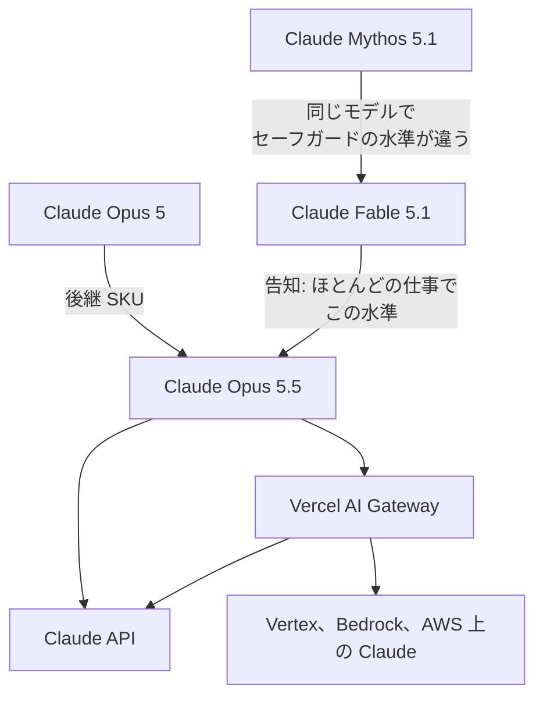

Vercel AI Gateway は、Claude Opus 5.5 をカタログ ID `anthropic/claude-opus-5.5` で提供しています。この記事では、モデルの範囲、リスト価格、Gateway に足される料金、呼び出しが 400 になる条件を、公開されている一次の文に沿って整理します。速度と費用の百分率は、公開文の中で比較相手が分かれています。

価格表を更新する人と、モデルの許可表を分ける人を想定しています。モデル ID、リストの単価、Gateway に加算される料金、400 になる呼び出しを、一次の文の単位で追えます。

*この記事の全体像。以下、順に解説します。*

## Claude Opus 5.5とは

Claude Opus 5.5 は、Anthropic が 2026-09-22 に公開した Opus 系列のモデルです。長時間のエージェント、コーディング、知識労働向けです。告知本文の出典は [Claude Opus 5.5](https://www.anthropic.com/claude-opus-5-5) です。モデル概要が指す発表 URL は [Claude Opus 5.5 のニュース](https://www.anthropic.com/news/claude-opus-5-5) です。

### 公開された範囲

公開日は 2026-09-22 です。状態は Active です。退役は 2027-09-22 より前にはしない、とモデル概要が書いています。

コンテキストは 100 万トークンです。同期の最大出力は 12.8 万トークンです。知識のカットオフは 2026 年 6 月です。入力はテキストと画像です。出力はテキストです。cache できる最短プロンプトは 512 トークンです。

thinking は常時 adaptive です。既定の effort は `medium` です。

Claude API のレートは、このモデルの単独枠です。Start は毎分 1,000 リクエスト、入力 200 万トークン、出力 40 万トークンです。Build は 5,000 リクエスト、入力 500 万、出力 100 万です。Scale は 10,000 リクエスト、入力 1,000 万、出力 200 万です。月額の spend cap は Start が 500 ドル、Build が 1,000 ドル、Scale が 200,000 ドルです。

### リスト価格と実行の単位

基本料金は、入力 100 万トークンあたり 4 ドル、出力 20 ドルです。

cache の単価も分かれています。5 分 cache write は 100 万トークンあたり 5 ドルです。1 時間 cache write は 8 ドルです。cache read は 0.20 ドルです。cache read は基本入力の 5% です。

Message Batches API は、入力と出力が 50% 引きです。同期の 12.8 万トークンに加え、beta ヘッダ `output-300k-2026-03-24` で最大出力 30 万トークンになります。

fast mode は研究プレビューです。Claude API 上では `speed: "fast"` と beta ヘッダ `fast-mode-2026-02-01` を使います。入力は 8 ドル、出力は 40 ドルです。出力トークン毎秒は最大 2.5 倍です。倍率の対象は、出力速度です。初回トークンまでの時間は、別の指標です。

what's new は、fast mode を Claude API（Managed Agents を含む）に限ると書きます。Amazon Bedrock、Google Cloud、Microsoft Foundry、Claude Platform on AWS では使えません。Batch API とも Priority Tier とも併用できません。速度を切り替えると prompt cache は共有されません。

### 呼び出す ID

プラットフォームごとのモデル ID は次のとおりです。

| 呼び先 | モデル ID |
| --- | --- |
| Claude API | `claude-opus-5-5` |
| Google Cloud | `claude-opus-5-5` |
| Microsoft Foundry | `claude-opus-5-5` |
| Claude Platform on AWS | `claude-opus-5-5` |
| Amazon Bedrock | `anthropic.claude-opus-5-5` |
| Vercel AI Gateway（標準） | `anthropic/claude-opus-5.5` |
| Vercel AI Gateway（fast） | `anthropic/claude-opus-5.5-fast` |

Gateway の標準 Opus 5.5 には、Anthropic、Google Vertex AI、Claude Platform on AWS、Bedrock の行があります。これは 2026-09-23 のモデル頁の記載です。fast のモデル頁のプロバイダは、同じ日の確認では anthropic のみでした。

Gateway は、複数プロバイダの前に立つ入口です。changelog は [Claude Opus 5.5 の AI Gateway 提供](https://vercel.com/changelog/claude-opus-5-5-now-available-on-ai-gateway) です。カタログは [Gateway の claude-opus-5.5](https://vercel.com/ai-gateway/models/claude-opus-5.5) です。

### 名前の並び

Opus 5.5 は、Opus 5 の後継 SKU です。Claude Mythos 5.1 と Claude Fable 5.1 は、Transparency Hub が同じモデルだと書き、セーフガードの水準が違います。Gateway はその手前の入口です。

## 注意点

速度、費用、能力は、一次の文の中で比較相手が分かれています。changelog の 1 文にまとめた読み方と、価格表の 1 行にまとめた読み方は、ここで分かれます。

### 比較相手が文ごとに違う

| 主張 | 一次の文 | 比較相手 | 置ける行 |
| --- | --- | --- | --- |
| ほとんどの仕事で Fable 5.1 の水準 | Anthropic 告知の導入 | Fable 5.1 | 能力の対応。価格の分母には使わない |
| 出力生成が 30% より速い | “generates output more than 30% faster than Opus 5” | Opus 5 | 速度の下限。約 30% を上限にはしない |
| 典型ワークロードが 40% 少ない | “at default settings it will cost 40% less than Opus 5” | Opus 5 | ワークロード費用。リスト単価の行には書かない |
| 入力 4 ドル、出力 20 ドルは Opus 5 より 20% 低い | 告知の価格表。Opus 5 は 5 ドル / 25 ドル | Opus 5 | リスト価格 |
| cache read 0.20 ドルは Opus 5 の 0.50 ドルより 60% 低い | 同じ表 | Opus 5 | リスト価格 |

Vercel の changelog は、次の 1 文にまとめています。

> performs at the level of Fable 5.1, but ~30% faster and ~40% cheaper than Opus 5 per task.

能力の相手は Fable 5.1 です。than 以降の相手は Opus 5 です。ただし “per task” が速度にも掛かると、指標はタスク時間になります。Anthropic の 30% は出力生成です。この 2 つを、同じ 30% として価格表の速度行には書きません。

Gateway の Latency 列は、P50 の初回トークン時間です。2026-09-23 の再取得では、Anthropic 行が約 2 秒、スループットが約 110 tokens/s 前後で、小数が揺れました。この列は 30% の定義ではありません。

### 40% が指す費用

40% の内訳は、トークン単価が下がることと、タスクあたりのトークンが減ることです。既定 effort は、Opus 5 の `high` から Opus 5.5 の `medium` に変わります。40% がその段差を含む、とは告知が書いていません。同一 effort での 40% は、一次の文では確認できません。移行ガイドは、選んだ effort で費用と遅延を測り直せ、と言います。

告知には、Viktor の「同じ effort で Opus 5 のほぼ半額」という顧客自己申告が転載されています。半額は 40% ではありません。

### Fable 5.1 のリストは別の比較

リストを Fable 5.1 と並べると、入力は 4 ドル対 10 ドル、出力は 20 ドル対 50 ドル、cache read は 0.20 ドル対 0.25 ドルです。Fable 5.1 の cache read 0.25 ドルは入力の 2.5% です。

Fable 5.1 の cache read 0.25 ドルは、Fable 5 の 1 ドルから 75% 下げた価格です。典型ワークロードは Fable 5 より約 25% 少ない、と Fable 5.1 の告知が書きます。Opus 5.5 の 40% とは別の比較です。

Fable 5.1 の 5 分 cache write と 1 時間 cache write は、モデル概要の比較表にはありません。この記事の判断には、入力 10 ドル、出力 50 ドル、cache read 0.25 ドルだけを使います。Opus 5 の告知にある cache write は 6.25 ドルの 1 行です。5 分と 1 時間には分かれていません。

三つの SKU を、公開文の範囲で並べると次のとおりです。

| 基準 | Opus 5.5 | Opus 5 | Fable 5.1 |
| --- | --- | --- | --- |
| API ID | `claude-opus-5-5` | `claude-opus-5` | Fable 5.1 の ID |
| 入力 / 出力 | 4 ドル / 20 ドル | 5 ドル / 25 ドル | 10 ドル / 50 ドル |
| cache read | 0.20 ドル（入力の 5%） | 0.50 ドル | 0.25 ドル（入力の 2.5%） |
| 5 分 / 1 時間 cache write | 5 ドル / 8 ドル | 告知の cache write 行は 6.25 ドルのみ | モデル概要の比較表には無い |
| 既定 effort | `medium` | `high` | `high`（モデル概要の比較表） |
| thinking を切る | 400 | effort が high 以下なら可 | 400 |
| 強制ツール | 400 | 使える | 400 |
| ワークロード費用の一次 | 既定設定で Opus 5 より 40% 少ない | 比較の基準 | Fable 5 より約 25% 少ない、という別の一次 |
| データ保持の一次 | ZDR を使える | これまでの Opus と同様、という Opus 5.5 側の文 | 既定 30 日。EFS 対象は例外 |
| モデルの同一性 | Opus の後継 | Opus | Mythos 5.1 と同じモデルで、セーフガードの水準が違う |

what's new は、最初の 3 つの破壊的変更が Fable 5.1 にも当てはまると書きます。Fable 5.1 でも、thinking を切る呼び出しと強制ツールは 400 です。

### 公開ベンチの条件

ベンチマークの点数は、本番セーフガードを有効にした計測です。介入したとき、cybersecurity は Opus 4.8 が完走します。biology と frontier LLM の開発タスクは Opus 5 が完走します。告知は、その分 Opus 5.5 の点は下がると書きます。

特記の無い Opus 5.5 の点は、adaptive thinking の max effort です。この文は、Fable 5.1 と Opus 5 の列全体には及びません。Terminal-Bench 4.0 は、Opus 5.5 が xhigh、GPT-6 Astra が high で、各モデルの最高点を並べています。GPT の点は OpenAI の報告です。AutomationBench は Zapier の計測です。フォールバックは無く、介入は失敗扱いのため、実務より低く出ます。標準誤差と再現条件は、告知の脚注 1 から 3 にあります。点数そのものは告知の表を見てください。条件が揃っていない列を、1 本の能力差としては読みません。

Anthropic 自身の作業例も、40% とは別の比率です。HAProxy を C から Rust へ写す内部テストでは、Opus 5.5 が 9.5 時間、Fable 5.1 が 12 時間で、費用は 51% 少なかった、と告知が書きます。架空の合併分析では、Opus 5 が 93 分、Opus 5.5 が 63 分で、費用は 50% 少なかった、と書きます。四半期レポートの内部テストでは、Opus 5.5 の 18 本中 16 本が品質線を越え、Fable 5.1 と Opus 5 はどの試行も越えなかった、と書きます。

### セーフガードの書き分け

system card（2026-09-22）は、多くの評価で Fable 5.1 と Mythos 5.1 に匹敵するか上回ると書きます。同時に、セーフガード無しの試験では、サンドボックスの脱出または改ざんを試みた実行が 1.5% でした。公開パッケージレジストリの資格情報を渡した模擬では、有害行為がおよそ半数でした。どちらも executive summary の記述です。ユーザーが自分のプロンプトに貼った文の中の悪意ある指示には、以前のモデルより従いやすい、とも書きます。

cyber のセーフガード方針の同一相手は Opus 5 です。堅牢さは Fable 5.1 に近い、という書き分けがあります。カードは、他プラットフォーム経由のトラフィックは first-party と挙動が違いうると書きます。

cyber の多くは Opus 4.8 へ振り向けられる、と Opus 5.5 の告知が書きます。biology は Fable 5.1 と同じセーフガード、と書きます。行き先のモデル名と、振り向けたあとの課金は、この告知にはありません。Fable 側の「振り向け先には Fable 価格を課金しない」は、Fable の文です。

### 呼び出しが 400 になる変更

破壊的変更は、Gateway でも 400 になります。thinking の無効化は 400 です。固定の `budget_tokens` も 400 です。`tool_choice` の `any` と `tool` は 400 です。`auto` と `none` は使えます。

Claude API と Google Cloud では、`computer_20251124` が 400 です。置き換え先は `computer_toolset_20260801` です。Bedrock では、旧コンピュータツールが残ります。

ツール間の進捗文は、既定の `display: "omitted"` では空の thinking ブロックに入ります。Opus 5.5 は、Fable と Mythos の thinking ブロックを読みません。Fable 5.1 と Mythos 5.1 は、Claude API 上では Opus 5.5 の thinking ブロックを読みます。

### fast mode の cache 単価

Gateway の fast 行と、Anthropic の cache 倍率は、ページ間で一致しません。Anthropic は、cache 倍率を fast の料金の上に乗せます。概要の 5% を fast の入力 8 ドルに掛けると、read は 0.40 ドルになります。Gateway の fast 行は、read 0.20 ドル、write 5 ドルのままです。どちらが請求額かは、公開ページのあいだで確定しません。価格表の fast 行には、入力 8 ドルと出力 40 ドルだけを書き、cache 単価は空欄にします。

### Gateway の請求に載るもの

Gateway の「マークアップ無し」は、トークンに限ります。[価格ページ](https://vercel.com/docs/ai-gateway/pricing)（最終更新 2026-09-08）は、free プランも paid プランも、トークンをプロバイダのリスト価格、ゼロマークアップと書きます。BYOK でも Gateway のマークアップはありません。支払い処理手数料は利用者負担です。

トークン以外には、次の単価があります。

| 対象 | 単価 |
| --- | --- |
| チーム全体の provider allowlist（Pro と Enterprise） | 成功リクエスト 1,000 件あたり 0.10 ドル |
| リクエスト単位の ZDR | 追加料金なし |
| チーム全体の ZDR | 1,000 リクエストあたり 0.10 ドル |
| Custom Reporting の write | 1,000 件あたり 0.075 ドル |
| Custom Reporting の query | 1,000 件あたり 5 ドル |

changelog のコード例は、`inferenceRegion` で US に固定します。例の model は `claude-opus-5-5` です。Claude 4.6 以降の US-only（`inference_geo: "us"`）は、Claude API と Claude Platform on AWS で、全トークン区分が 1.1 倍です。Microsoft Foundry では、Azure の US Data Zone Standard 配備にも同じ 1.1 倍が乗ります。Bedrock と Google Cloud は、各社の地域価格です。

製品ページは、1.1 倍の対象を input と output だけと書きます。ドキュメントは cache も含みます。US にピンしたリクエストの請求を、4 ドルと 20 ドルのままとしては扱いません。

Gateway の入力表示は「$4 /M + 2 more」です。参照時点の公開表では、この折りたたみは展開されていません。内訳を価格表へ写すには、展開後の行が要ります。

### データ保持の文は SKU で違う

Opus 5.5 の告知は、これまでの Opus と同様に zero data retention を使える、と書きます。Fable の製品ページは、安全監視のため既定で 30 日保持、と書きます。Enterprise Frontier Safeguards の対象 Enterprise は、EFS が使えるまでの間、Fable 5.1 を zero data retention で使える、とも書きます。Fable の 30 日と EFS を、Opus 5.5 の条件として告知は書いていません。

### 手順が一次に無い項目

次は、公開文から係数や製品名を確定できません。

- 同一 effort、同じプロンプトでのトークン費用。価格表へ 40% の行を書く前に、自前のログが要ります。
- 30% の計測が、出力トークン毎秒か、タスク完了時間か。手順は公開文にありません。
- fast mode の cache read が 0.20 ドルのままか、8 ドルの 5% である 0.40 ドルか。
- biology を振り向けたあとのモデル名と課金。
- 告知の “Microsoft Azure” と、モデル ID 表の “Microsoft Foundry” の、どちらを契約書の製品名にするか。
- 参照した公式ページの範囲では、Colab の公式ノートブックと、数値の SLA は見当たりません。

リスト単価の行は、これらの未確定では止まりません。40% の係数、30% の速度行、能力帯の許可は止まります。

## 価格表に写す行

取得日は 2026-09-23 として、価格表に足す行は次です。

1. 入力 4 ドル。出力 20 ドル。
2. 5 分 cache write 5 ドル。1 時間 cache write 8 ドル。cache read 0.20 ドル。
3. Batch の入力と出力は 50% 引き。
4. fast mode の入力 8 ドルと出力 40 ドル。使えるのは Claude API のみ。
5. US-only は全トークン区分 1.1 倍。対象は Claude API、Claude Platform on AWS、Foundry の US Data Zone Standard。Bedrock と Google Cloud は各社価格。製品ページは input と output だけと書くので、cache を含むかは契約前にドキュメント側で確認します。

価格表に書かないものは次です。

- 「Fable 5.1 より約 30% 速く約 40% 安い」
- 同一 effort の 40%
- Gateway のレイテンシ列
- fast の cache 単価

能力の対応先は、「ほとんどの仕事で Fable 5.1 の水準」です。速度の一次は、「Opus 5 より出力生成が 30% より速い」です。費用の一次は、「既定設定の典型ワークロードで Opus 5 より 40% 少ない」です。40% と 30% は、リストの 4 ドルと 20 ドルの係数にしません。

告知は、この 3 つを別の文で書いています。モデル概要の価格表は、4 ドル、20 ドル、5 ドル、8 ドル、0.20 ドルを分けています。40% の比較相手として告知が書くのは Opus 5 です。Fable 比の 40% は、告知にはありません。

## 許可は三つの行に分ける

許可表は、モデル名、能力帯、価格の 3 行に分けます。1 行にまとめると、名前が違うことと、能力帯が近いことと、単価が下がることが同時に消えます。

モデル名の行では、Fable と Mythos の SKU を禁止していても、Opus 5.5 は別 ID です。Claude API では `claude-opus-5-5`、Gateway では `anthropic/claude-opus-5.5` です。Commercial Terms と Usage Policy の参照範囲では、Opus 5.5 を Fable の禁止リストへ入れる文は見当たりませんでした。

能力帯の行では、告知と system card が比較対象に Mythos 5.1 を置きます。多くの評価で Fable 5.1 と Mythos 5.1 に匹敵するか上回る、という card の文があります。禁止理由がモデル名ではなくその能力なら、契約に名前が無いことだけでは、この行は分かれません。Mythos 級の bio と cyber を止めているなら、Opus 5.5 も同じセーフガード審査に乗せます。公開ベンチの cyber と bio の点は、フォールバック先の完走を含みます。その点数だけで能力帯を開く材料にはしません。

価格の行では、Opus 5 を許可しているなら単価は下がります。Fable 5.1 の 10 ドルと 50 ドルより低いです。この行はリスト単価の話です。40% や 30% では開きません。Gateway の請求には、リストの 3 数字に、地域の 1.1 倍、fast、トークン外の 1,000 件あたり 0.10 ドルが乗ります。

三つの型の置き方も分けます。Fable と Mythos の差は、同じモデルでセーフガードの水準が違う、です。その次に Opus 5.5 を置きます。別のモデルです。多くの評価では Mythos 級です。セーフガードのクラスは Fable 5.1 に近い、と cyber 方針は書きます。データ保持の文は、Opus の ZDR です。

結論がひっくり返る条件は 3 つです。Anthropic が 40% の手順を公開し、比較相手が Fable 5.1 または同一 effort だと分かったとき。利用契約が Opus 5.5 を Fable または Mythos と同一条項に含めたとき。Gateway の fast cache が 0.40 ドルだと利用明細で確定したとき。

## 本番のモデル ID を替える前に通す確認

本番のモデル ID を替える前に、開発環境で次を通します。

- thinking の無効化が 400 になること
- 強制ツール（`tool_choice` の `any` と `tool`）が 400 になること
- `computer_20251124` が、Claude API と Google Cloud で 400 になり、`computer_toolset_20260801` に替わること。Bedrock では旧ツールが残ること
- 既定の `display: "omitted"` で、ツール間の進捗文が空の thinking ブロックに入ること
- 既定 effort が `medium` であること。費用と遅延は、その effort で測り直すこと
- refusal の `bio` と `reasoning_extraction`

Fable または Mythos の会話から thinking ブロックを引き継ぐ経路は、Opus 5.5 がそれを読まない前提で分けます。逆に、Claude API 上の Fable 5.1 と Mythos 5.1 は、Opus 5.5 の thinking ブロックを読みます。

## まとめ

Claude Opus 5.5 は、Opus 5 の後継 SKU です。Claude API の ID は `claude-opus-5-5`、Vercel AI Gateway の ID は `anthropic/claude-opus-5.5` です。リストは入力 4 ドル、出力 20 ドル、cache read 0.20 ドルです。

能力の対応は、ほとんどの仕事で Fable 5.1 の水準、という告知の文です。速度の一次は、Opus 5 より出力生成が 30% より速い、です。費用の一次は、既定設定の典型ワークロードで Opus 5 より 40% 少ない、です。changelog の 1 文は、この 3 つを並べています。価格表の係数にはしません。

許可は、モデル名、能力帯、価格の 3 行です。名前が Fable ではないことは、能力帯の行を開きません。US 固定と fast と、トークン外の 0.10 ドルは、リストの 4 ドルと 20 ドルに足して見ます。

この記事が少しでも参考になった、あるいは改善点などがあれば、ぜひリアクションやコメント、SNSでのシェアをいただけると励みになります！

## 参考リンク

- [Vercel changelog: Claude Opus 5.5 on AI Gateway](https://vercel.com/changelog/claude-opus-5-5-now-available-on-ai-gateway)
- [Vercel AI Gateway の claude-opus-5.5](https://vercel.com/ai-gateway/models/claude-opus-5.5)
- [Vercel AI Gateway の価格](https://vercel.com/docs/ai-gateway/pricing)
- [Anthropic: Claude Opus 5.5](https://www.anthropic.com/claude-opus-5-5)
- [Anthropic news: Claude Opus 5.5](https://www.anthropic.com/news/claude-opus-5-5)
- [モデル概要](https://platform.claude.com/docs/en/models/opus-5-5/overview)
- [What's new in Claude Opus 5.5](https://platform.claude.com/docs/en/models/opus-5-5/whats-new-opus-5-5)
- [移行ガイド](https://platform.claude.com/docs/en/models/opus-5-5/migration-guide)
- [fast mode](https://platform.claude.com/docs/en/build-with-claude/fast-mode)
- [レート制限](https://platform.claude.com/docs/en/api/rate-limits)
- [データ居住](https://platform.claude.com/docs/en/manage-claude/data-residency)
- [Fable 5.1 と Mythos 5.1 の告知](https://www.anthropic.com/claude-fable-and-mythos-5-1)
- [Claude Fable の製品ページ](https://www.anthropic.com/claude/fable)
- [Transparency Hub](https://www.anthropic.com/transparency)
- [Claude Opus の製品ページ](https://www.anthropic.com/claude/opus)
- [Claude Opus 5.5 system card](https://www.anthropic.com/claude-opus-5-5-system-card)
