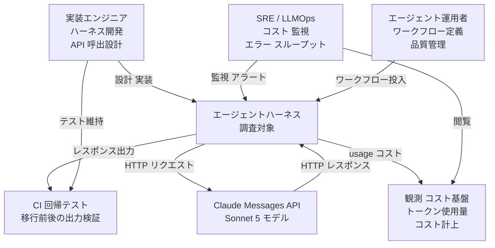
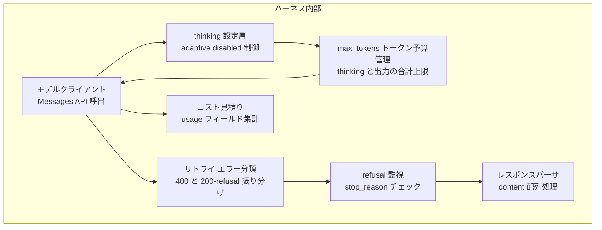
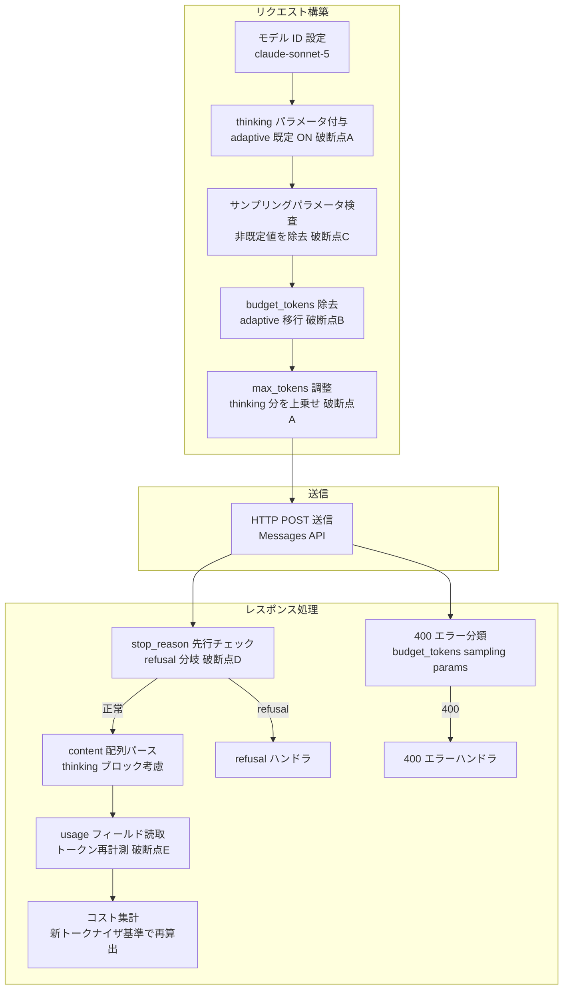
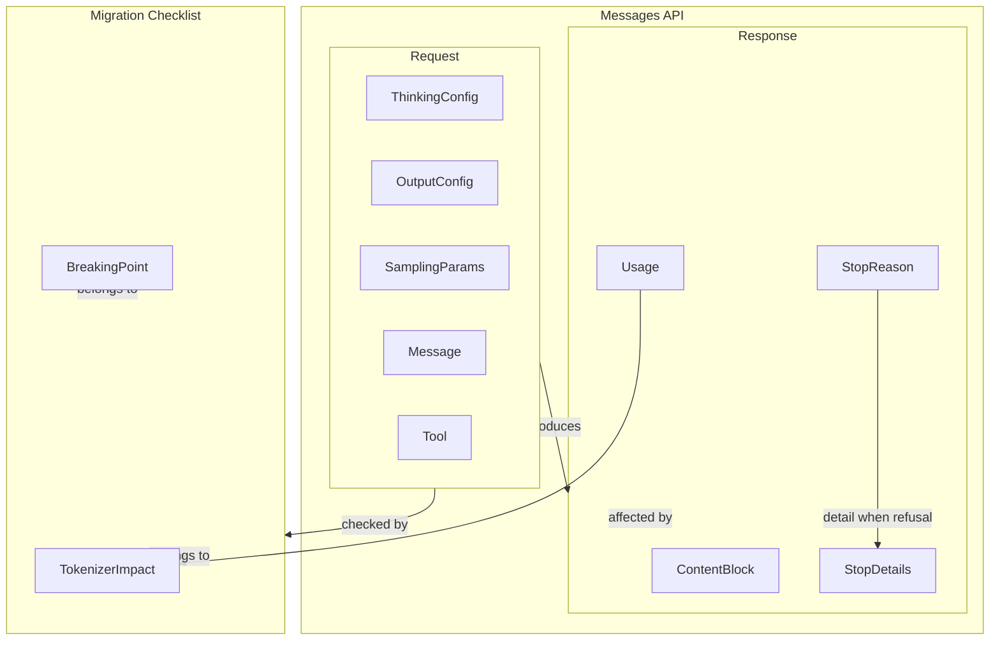
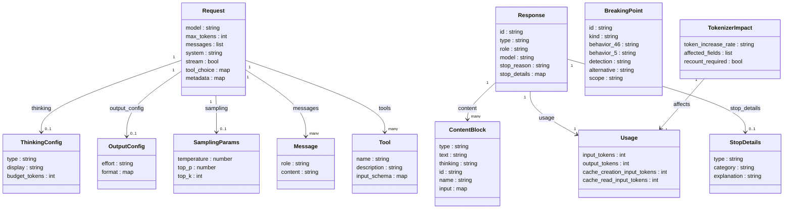

> 本記事の角度は「モデル差（性能比較）」ではなく「**エージェント運用の破断点棚卸し**」です。既存ハーネスを Claude Sonnet 4.6 から Claude Sonnet 5 へ移行する実装エンジニア・SRE・LLMOps を読者に想定します。モデル更新は品質比較より先に、`max_tokens`・コスト見積り・リトライ条件・パラメータ禁止（400）・拒否応答（refusal）の扱いを回帰確認する、という観点で整理します。出典は Anthropic 公式ドキュメント（2026-07-01 取得）です。

## 概要

Claude Sonnet 5 は、Claude Sonnet 4.6 の drop-in 後継モデルです。「speed と intelligence の最良バランス」というポジションを継承しつつ、Sonnet 系列で最もエージェント的に動作します。API モデル ID を **`claude-sonnet-5`** に変更するだけで移行できますが、3 つの behavior change と新トークナイザの影響を既存ハーネスで先に把握します。

| 破断点 | 内容 |
|---|---|
| adaptive thinking 既定 ON | `thinking` フィールドを省略すると、Sonnet 4.6 では thinking なしで実行するが、Sonnet 5 では adaptive thinking を自動適用する |
| manual extended thinking が 400 | `thinking: {type: "enabled", budget_tokens: N}` は Sonnet 4.6 で deprecated、Sonnet 5 では削除し 400 エラーを返す |
| sampling params 非既定値が 400 | `temperature` / `top_p` / `top_k` を非既定値に設定すると 400 エラーを返す（Sonnet クラスで初導入。Opus 4.7 で先に導入済みの制約） |
| 新トークナイザ 約 30% 増 | 同一テキストで Sonnet 4.6 比 約 30% 多いトークンを生成する。API 形状は不変だが、`max_tokens` 予算・コスト見積もり・context 容量に影響する |

これら以外（ツール定義・レスポンス形状・assistant prefill 非対応）は Sonnet 4.6 から変わりません。移行の本質は「静かに前提を壊す変更を、回帰確認で先に洗い出す」ことにあります。

新トークナイザ自体は Claude Opus 4.7 で先行導入したもので、Sonnet 5 固有ではありません。Sonnet 4.6（旧トークナイザ）から Sonnet 5（新トークナイザ）への移行で、同一テキストあたり約 30% 増が顕在化します。

## 特徴

- エージェント・コーディング性能が Sonnet 4.6 から大幅に向上します。Sonnet の速度と価格のまま、より高い agentic 性能を提供します。
- 価格は Sonnet 4.6 と同額です。標準 $3/$15 per MTok（input/output）で、2026-08-31 まで導入価格 $2/$10 per MTok を適用します。per-token 単価は不変ですが、新トークナイザで同一テキストのトークン数が増えるため、等価リクエストのコストは 4.6 と変わりえます。
- コンテキストウィンドウは 1M トークン（最大かつデフォルト、小さい variant なし）、最大出力は 128K トークンです。最大出力は Sonnet 4.6 と同じ 128K です。ただし新トークナイザにより、同じ 1M 窓に入るテキスト量は 4.6 より少なくなります。
- ZDR（ゼロデータ保持）に対応します。ZDR 契約を持つ組織で利用できます（30 日保持を必須とする Fable 5 と対照的です）。
- Priority Tier は非提供です。Sonnet 4.6 で利用できた Priority Tier を Sonnet 5 では提供しません。Priority Tier に依存したルーティングは standard tier へ見直します。
- Sonnet 系初のリアルタイム・サイバーセキュリティ safeguards を搭載します。禁止・高リスクなサイバーセキュリティ題材のリクエストを拒否します。拒否は HTTP 200 + `stop_reason: "refusal"` で返るため、エラーとの区別が必要です。
- adaptive thinking が既定 ON です。タスク複雑度に応じて思考深さを自動調整します。`output_config: {effort: ...}` で thinking 深さを制御でき、既定は `high` です。
- AWS（Claude in Amazon Bedrock / Claude Platform on AWS）・Google Cloud Vertex AI・Microsoft Foundry（preview）で利用できます。ただし Bedrock の legacy InvokeModel / Converse API は非対応です。

### モデル比較

| 観点 | Sonnet 4.6 | Sonnet 5 | Opus 4.8 |
|---|---|---|---|
| API モデル ID | `claude-sonnet-4-6` | `claude-sonnet-5` | `claude-opus-4-8` |
| 価格（input/output per MTok） | $3 / $15 | $3 / $15（導入価格 $2/$10 〜2026-08-31） | $5 / $25 |
| コンテキストウィンドウ | 1M トークン | 1M トークン | 1M トークン |
| 最大出力 | 128K トークン | 128K トークン | 128K トークン |
| thinking 既定 | OFF（`thinking` 省略 → thinking なし） | ON（`thinking` 省略で adaptive 自動適用） | 明示時のみ ON（`thinking` 省略では OFF。`{type: "adaptive"}` で ON） |
| manual extended thinking（`budget_tokens`） | deprecated（機能は動作） | 削除（400 エラー） | 削除（400 エラー） |
| sampling params 非既定値 | 受理 | 400 エラー | 400 エラー |
| effort パラメータ既定 | `high`（adaptive 対応済み） | `high` | `high` |
| トークナイザ | 旧トークナイザ | 新トークナイザ（同テキストで約 30% 増） | 新トークナイザ |
| ZDR 対応 | 対応 | 対応 | 対応 |
| Priority Tier | 提供あり | 非提供 | 提供あり |
| サイバーセキュリティ safeguards | なし | あり（Sonnet 系初） | あり |

### ユースケース別推奨

| 場面 | 推奨モデル | 理由 |
|---|---|---|
| エージェント・コーディングの主力ワークロード | Sonnet 5 | Sonnet 価格で高い agentic 性能。速度と品質のバランスが最良 |
| 既存ハーネスで sampling params 調整が必須 | Sonnet 4.6 据え置き（短期）→ パラメータ除去後に Sonnet 5 移行 | Sonnet 5 は temperature/top_p/top_k 非既定値で 400。挙動制御を system prompt 指示へ移す必要がある |
| 高度な推論・長期水平タスク・最高品質が要件 | Opus 4.8 | Sonnet 5 で不足する複雑さのタスクには Opus 4.8 へ昇格 |
| Priority Tier が必要 | Sonnet 4.6 または Opus 4.8 | Sonnet 5 は Priority Tier 非提供 |
| Bedrock legacy（InvokeModel/Converse）利用中 | 移行作業が先行 | Sonnet 5 は legacy Bedrock エンドポイント非対応。新 API へ移行してから |
| コスト最優先（大量バッチ処理） | Haiku 4.5 または Sonnet 5 導入価格期間中 | 2026-08-31 までの導入価格 $2/$10 は Sonnet 5 のコスト競争力を高める。ただし新トークナイザで等価リクエストコストは試算が必要 |

## 構造

Claude Sonnet 5 は単体製品ではなく API モデルです。本節では C4 model の 3 段階を「Claude Sonnet 5 を Messages API 経由で呼ぶエージェントハーネス」の論理構造として読み替えます。各段階で、移行における破断点（3 つの behavior change とトークナイザ変化）が構造上のどこで顕在化するかを位置づけます。

### システムコンテキスト図



| 要素名 | 説明 |
|---|---|
| 実装エンジニア | ハーネスのコードを設計・実装し、API 呼出パラメータを決定する |
| SRE / LLMOps | コスト・エラー率・スループットを継続監視し、異常を検知する |
| エージェント運用者 | ワークフローの入力を定義し、出力品質を評価・管理する |
| エージェントハーネス | 調査対象。Sonnet 5 を呼び出すソフトウェア全体 |
| Claude Messages API（Sonnet 5 モデル） | Anthropic が提供する HTTP API。モデル ID `claude-sonnet-5` で呼び出す |
| 観測 コスト基盤 | `usage` フィールドを集計してトークン消費・コストを記録する |
| CI 回帰テスト | モデル移行前後の出力差分を自動検証する |

### コンテナ図



| 要素名 | 説明 |
|---|---|
| モデルクライアント | HTTP リクエストを構築して Messages API へ送信し、レスポンスを受け取る |
| thinking 設定層 | `thinking` フィールドの型（adaptive / disabled）を決定してリクエストに付与する |
| max_tokens トークン予算管理 | thinking と出力テキストの合計に対する上限を設定・管理する |
| リトライ エラー分類 | 400 エラーと HTTP 200 refusal を区別し、リトライ可否を判断する |
| コスト見積り | `usage` フィールドのトークン数を集計してコストを算出する |
| refusal 監視 | `stop_reason` の値を先行チェックし、拒否応答を検出する |
| レスポンスパーサ | `content` 配列を処理して最終出力を取り出す |

### コンポーネント図



#### リクエスト構築

| 要素名 | 説明 |
|---|---|
| モデル ID 設定 | リクエストに `model: "claude-sonnet-5"` を設定する |
| thinking パラメータ付与（破断点A） | Sonnet 5 は adaptive thinking が既定 ON。`thinking: {type: "disabled"}` を明示しない限り thinking が有効になる |
| サンプリングパラメータ検査（破断点C） | `temperature` / `top_p` / `top_k` が非既定値の場合 400 になるため、除去またはデフォルト値に戻す |
| budget_tokens 除去（破断点B） | `thinking: {type: "enabled", budget_tokens: N}` は 400 になるため、adaptive thinking 形式へ書き換える |
| max_tokens 調整（破断点A） | thinking 有効時は thinking トークンも上限に含まれるため、4.6 時の設定値を見直す |

#### 送信

| 要素名 | 説明 |
|---|---|
| HTTP POST 送信 | 構築済みリクエストを Messages API エンドポイントへ送信する |

#### レスポンス処理

| 要素名 | 説明 |
|---|---|
| stop_reason 先行チェック（破断点D） | `stop_reason: "refusal"` を先行チェックする。HTTP 200 で返るため `content[0]` を無条件に読むコードは壊れる |
| 400 エラー分類 | `budget_tokens` 使用や sampling params 非既定値による 400 を識別し、リトライ不可として扱う |
| content 配列パース | adaptive thinking が有効な場合、`content` 配列に thinking ブロックが含まれることを考慮して処理する |
| usage フィールド読取（破断点E） | 新トークナイザにより同一テキストのトークン数が約 30% 増加する。4.6 の計測値を流用せず再計測する |
| コスト集計 | 新トークナイザ基準のトークン数に基づいてコストを再算出する |

## データ

Messages API リクエスト/レスポンスと、移行チェックリストを構成する破断点エンティティをモデル化します。

### 概念モデル



| 要素名 | 説明 |
|---|---|
| Request | Messages API への送信オブジェクト。ThinkingConfig・OutputConfig・SamplingParams・Message・Tool を所有する |
| ThinkingConfig | thinking の有効化方式と表示方式を制御する設定オブジェクト |
| OutputConfig | effort レベルと出力フォーマットを制御する設定オブジェクト |
| SamplingParams | temperature / top_p / top_k。Sonnet 5 では非既定値で 400 |
| Message | role と content を持つ会話ターン |
| Tool | モデルが呼び出せる関数定義 |
| Response | API が返すメッセージオブジェクト |
| ContentBlock | レスポンス本体の構成単位。type で種別を区別する |
| Usage | 消費トークン数の内訳。新トークナイザの影響を直接受ける |
| StopReason | 生成が止まった理由。`refusal` は Sonnet 系で新しい挙動 |
| StopDetails | stop_reason が refusal のときのみ付く詳細オブジェクト |
| MigrationChecklist | 移行で確認すべき破断点と影響を束ねる概念エンティティ |
| BreakingPoint | 個別の破断点。4.6 挙動・5 挙動・検知方法・代替手段を持つ |
| TokenizerImpact | 新トークナイザがもたらす定量的影響の記録エンティティ |

### 情報モデル



#### ThinkingConfig

| 属性名 | 型 | 説明 |
|---|---|---|
| type | string | `"adaptive"` / `"disabled"`。Sonnet 5 では `"enabled"` は 400 |
| display | string | `"summarized"` / `"omitted"`。Sonnet 5 の既定は `"omitted"`（adaptive-thinking ドキュメントに明記。要約表示には `display: "summarized"` を明示。`signature` には暗号化された full thinking が載りマルチターン継続に使う） |
| budget_tokens | int | `"enabled"` 専用。Sonnet 5 では削除済み（400）。Sonnet 4.6 では deprecated |

Sonnet 5 における thinking の挙動は次のとおりです。

- `type: "enabled"` かつ `budget_tokens` 指定 → 400 エラー
- `thinking` 省略 / `type: "adaptive"` → adaptive thinking が ON
- `type: "disabled"` → 明示的に thinking を無効化

#### OutputConfig（effort とモデルの対応）

| effort 値 | Sonnet 5 | Sonnet 4.6 | Opus 4.7 / 4.8 |
|---|---|---|---|
| `low` | 対応 | 対応 | 対応 |
| `medium` | 対応 | 対応 | 対応 |
| `high`（既定） | 対応 | 対応 | 対応 |
| `xhigh` | 対応 | 非対応 | 対応 |
| `max` | 対応 | 対応 | 対応 |

`effort` は `output_config` の中で指定します（top-level ではありません）。`format` は構造化出力のスキーマ定義（`{type: "json_schema", schema: {...}}`）です。

#### SamplingParams（Sonnet 5 制約）

| 属性名 | Sonnet 5 挙動 |
|---|---|
| temperature | 既定値（または省略）のみ受理。非既定値は 400 |
| top_p | 既定値（または省略）のみ受理。非既定値は 400 |
| top_k | 既定値（または省略）のみ受理。非既定値は 400 |

`temperature` / `top_p` / `top_k` は Request のトップレベル任意パラメータです（`sampling` という入れ子オブジェクトは存在しません。本情報モデルでは説明上 SamplingParams としてグルーピングしています）。

#### ContentBlock の type 一覧

| type 値 | 出現方向 | 説明 |
|---|---|---|
| `text` | 入力・出力 | テキストコンテンツ |
| `thinking` | 入力・出力 | 思考ブロック |
| `redacted_thinking` | 出力のみ | 編集済み思考ブロック |
| `tool_use` | 出力のみ | ツール呼び出し（id + name + input） |
| `tool_result` | 入力のみ | ツール実行結果（tool_use_id + content） |
| `image` | 入力のみ | 画像（base64 または URL） |
| `document` | 入力のみ | PDF 等のドキュメント |
| `server_tool_use` | 出力のみ | サーバーサイドツール（web_search 等）の呼び出し |

#### StopReason と StopDetails

| stop_reason 値 | 意味 | stop_details |
|---|---|---|
| `end_turn` | 自然な終端 | null |
| `max_tokens` | max_tokens 上限到達 | null |
| `stop_sequence` | カスタムストップシーケンス検出 | null |
| `tool_use` | ツール呼び出し発生 | null |
| `pause_turn` | サーバーサイドツールの一時停止 | null |
| `model_context_window_exceeded` | コンテキストウィンドウ上限到達（`max_tokens` とは別の切り詰め） | null |
| `refusal` | ポリシー違反（サイバーセキュリティ safeguards 等） | あり（HTTP 200、エラーではない） |

`stop_details`（refusal 時のみ）は `type`（`"refusal"` 固定）・`category`（`"cyber"` / `"bio"` / `"reasoning_extraction"` / `"frontier_llm"` / `null` 等。値は将来拡張されうるため、特定値を列挙する前提で実装しない）・`explanation`（null の場合あり）を持ちます。`stop_reason` が refusal 以外のとき `stop_details` は null なので、参照前にガードします。

#### Usage と新トークナイザの影響

| 影響フィールド | 内容 |
|---|---|
| input_tokens | 同一テキストで Sonnet 4.6 比 約 30% 増 |
| output_tokens | thinking を含む。同一出力内容で約 30% 増 |
| cache_creation/read_input_tokens | 同様に増加 |
| max_tokens 予算 | 4.6 でチューニングした値は Sonnet 5 で出力を切り詰める恐れあり |

thinking 消費分は公式定義の read-only フィールド `usage.output_tokens_details.thinking_tokens` で確認できます。observability 用の内訳で、`output_tokens` 以下の値です。`output_tokens` から引くと応答テキスト分を概算でき、`output_tokens` が請求の権威値です。SDK バージョンによりアクセサが異なる場合があるため、本記事のコード例は `getattr` で防御的に参照します。

### 破断点エンティティ（BreakingPoint）

| id | kind | 4.6 挙動 | 5 挙動 | 検知方法 | 代替手段 | 影響範囲 |
|---|---|---|---|---|---|---|
| BP-01 | thinking-default | thinking 無しで実行 | adaptive thinking ありで実行 | 応答遅延・トークン増・コスト増 | `thinking: {type: "disabled"}` を明示 | thinking フィールド省略のリクエスト全件 |
| BP-02 | thinking-manual | `budget_tokens: N` が deprecated（機能する） | 400 エラー | HTTP 400 レスポンス | `thinking: {type: "adaptive"}` + `output_config.effort` | `budget_tokens` を使用するリクエスト全件 |
| BP-03 | sampling-params | 非既定値で動作 | 400 エラー | HTTP 400 レスポンス | パラメータ除去。挙動制御は system prompt 指示 | temperature / top_p / top_k を非既定値で送るリクエスト全件 |
| BP-04 | tokenizer | トークン数 N | 同一テキストで約 1.3N | usage 増加。token counting API で再計測 | max_tokens 見直し。Sonnet 5 指定で再計測 | usage 計測・コスト見積もり・max_tokens 予算・context 容量 |
| BP-05 | refusal | 非対応（Sonnet クラス初） | HTTP 200 + `stop_reason: "refusal"` | stop_reason チェック漏れによる content 読取失敗 | レスポンス処理で `stop_reason` を先にチェックし refusal 分岐を追加 | サイバーセキュリティ関連を含む可能性のあるリクエスト全件 |
| BP-06 | prefill | 400（4.6 時点で既に非対応） | 400（変化なし） | HTTP 400 | structured outputs / system prompt / `output_config.format` | assistant prefill を使うリクエスト（4.6 移行済みなら不要） |
| BP-07 | priority-tier | 利用可能 | 非対応 | サービス契約・ルーティング設定 | standard tier へ切替 | Priority Tier を利用している運用環境 |

## 構築方法

### モデル ID の変更

モデル ID は `claude-sonnet-4-6` から `claude-sonnet-5` に変更します。日付サフィックスの付かない dateless 形式が正式名称です（メジャー版は minor セグメントを省きます）。

```python
import anthropic

client = anthropic.Anthropic()  # ANTHROPIC_API_KEY を環境変数から読む

# 変更前: model = "claude-sonnet-4-6"
# 変更後:
model = "claude-sonnet-5"

response = client.messages.create(
    model=model,
    max_tokens=4096,
    thinking={"type": "disabled"},  # 既定 ON の adaptive を切り content[0] を text に固定
    messages=[{"role": "user", "content": "こんにちは"}],
)
print(response.content[0].text)
```

- SDK は `anthropic` Python パッケージを使います。`output_config` 等の新フィールドは比較的新しいリリースで追加したため、最新版を使います。
- API キーは環境変数 `ANTHROPIC_API_KEY` か `anthropic.Anthropic(api_key="...")` で渡します。
- Bedrock のモデル ID は `anthropic.claude-sonnet-5`（`anthropic.` プレフィックス付き）です。legacy InvokeModel / Converse API は非対応です。
- Vertex AI のモデル ID はプレフィックス無しの素の `claude-sonnet-5` です。

### 移行前のトークン再計測

Sonnet 5 は新トークナイザを採用しており、同一テキストで約 30% 多くカウントします。旧モデルで計測した値を流用せず、移行先モデルで再計測します。

```python
import anthropic

client = anthropic.Anthropic()

prompt_messages = [{"role": "user", "content": "移行前に計測したいプロンプト"}]
system_text = "あなたは役に立つアシスタントです。"

count_46 = client.messages.count_tokens(
    model="claude-sonnet-4-6", system=system_text, messages=prompt_messages,
)
count_5 = client.messages.count_tokens(
    model="claude-sonnet-5", system=system_text, messages=prompt_messages,
)
print(f"Sonnet 4.6: {count_46.input_tokens} トークン")
print(f"Sonnet 5  : {count_5.input_tokens} トークン")
print(f"増加率    : {count_5.input_tokens / count_46.input_tokens:.2f}x")
```

- `tiktoken` 等の汎用トークナイザは Claude 用ではないため使いません。公式の `count_tokens` エンドポイント（`POST /v1/messages/count_tokens`、返却は `input_tokens` 整数）が Claude 公式の事前見積りを返します。tiktoken より正確ですが、実送信時の値と小差が出る場合があります。
- token counting には RPM の上限があります。

## 利用方法

### 破断点パラメータ一覧

Sonnet 4.6 では動作したが Sonnet 5 で動作が変わるパラメータです。

| パラメータ | Sonnet 4.6 | Sonnet 5 | 代替手段 |
|---|---|---|---|
| `thinking: {type: "enabled", budget_tokens: N}` | deprecated だが動作 | 400 エラー | `thinking: {type: "adaptive"}` + `output_config: {effort: "..."}` |
| `thinking` フィールド省略 | thinking OFF で実行 | adaptive thinking ON（挙動変化） | 切るなら `thinking: {type: "disabled"}` を明示 |
| `temperature`（非デフォルト値） | 動作 | 400 エラー | 省略 or デフォルト値。挙動制御は system prompt |
| `top_p`（非デフォルト値） | 動作 | 400 エラー | 同上 |
| `top_k`（非デフォルト値） | 動作 | 400 エラー | 同上 |
| assistant メッセージ prefill | 400 エラー（4.6 から不変） | 400 エラー（継続） | structured outputs / `output_config.format` / system prompt |

構造化出力は本節のコード例の形（`output_config.format`）を使います。Python SDK には `client.messages.parse()` の便宜引数 `output_format` もありますが、Messages API の正式フィールドは `output_config.format` です。これは Sonnet 5 固有の変更ではありません。

### adaptive thinking への移行

```python
# Before: manual extended thinking（Sonnet 5 では 400）
# thinking={"type": "enabled", "budget_tokens": 10000}

# After: adaptive thinking + effort
response = client.messages.create(
    model="claude-sonnet-5",
    max_tokens=16000,
    thinking={"type": "adaptive"},
    output_config={"effort": "high"},  # low / medium / high(既定) / xhigh / max
    messages=[{"role": "user", "content": "複雑な問題を解いてください"}],
)
for block in response.content:
    if block.type == "thinking":
        print(f"思考: {block.thinking}")
    elif block.type == "text":
        print(f"回答: {block.text}")
```

thinking を完全に切る場合は `{type: "disabled"}` を明示します。thinking を表示したい場合は `display: "summarized"` を明示します。

```python
# 最小レイテンシ（thinking 無効）
client.messages.create(
    model="claude-sonnet-5", max_tokens=4096,
    thinking={"type": "disabled"},
    messages=[{"role": "user", "content": "今日の天気は？"}],
)
# thinking を要約表示
client.messages.create(
    model="claude-sonnet-5", max_tokens=16000,
    thinking={"type": "adaptive", "display": "summarized"},
    messages=[{"role": "user", "content": "証明してください"}],
)
```

### sampling params 除去

```python
# Before（Sonnet 5 では 400）
# temperature=0.7, top_p=0.9, top_k=40

# After: パラメータを除去し、system prompt で挙動を誘導する
response = client.messages.create(
    model="claude-sonnet-5",
    max_tokens=4096,
    system="創造的で多様な表現を使い、ユニークな視点で文章を書いてください。",
    messages=[{"role": "user", "content": "創作文を書いてください"}],
)
```

デフォルト値（または省略）は受理されます。非デフォルト値のみ拒否されます。

### max_tokens の見直し

adaptive thinking では thinking トークンと応答テキストが `max_tokens` の合計上限を共有します。4.6 で thinking なし運用だった場合は thinking 分のトークンを追加で確保します。

```python
response = client.messages.create(
    model="claude-sonnet-5",
    max_tokens=16000,   # thinking + 応答テキストの合計上限
    thinking={"type": "adaptive"},
    messages=[{"role": "user", "content": "..."}],
)
if response.stop_reason == "max_tokens":
    print("max_tokens に到達。上限引き上げを検討。")
```

- Sonnet 5 の最大出力は 128K トークン（Sonnet 4.6 と同じ）です。大きな `max_tokens` ではストリーミングを使い HTTP タイムアウトを避けます。

### refusal を踏まえた安全な応答取得

Sonnet 5 はサイバーセキュリティ safeguards を搭載し、禁止・高リスクな要求を HTTP 200 + `stop_reason: "refusal"` で返します。例外キャッチでは検知できないため、`stop_reason` を先に確認してから `content` を読みます。

```python
response = client.messages.create(
    model="claude-sonnet-5", max_tokens=4096,
    messages=[{"role": "user", "content": "..."}],
)
if response.stop_reason == "refusal":
    print("リクエストが拒否されました。内容を見直してください。")
elif response.stop_reason == "max_tokens":
    print("出力が max_tokens に達しました。上限を引き上げてください。")
else:
    text_blocks = [b for b in response.content if b.type == "text"]
    if text_blocks:
        print(text_blocks[0].text)
```

### prefill の置換（structured outputs / output_config.format）

```python
# Before: assistant prefill（Sonnet 4.6 でも 400、Sonnet 5 でも同様）
# messages=[..., {"role": "assistant", "content": "{"}]

# After 案1: system prompt で JSON 出力を指示
client.messages.create(
    model="claude-sonnet-5", max_tokens=4096,
    system="必ず有効な JSON のみを返してください。余分なテキストは不要です。",
    messages=[{"role": "user", "content": "ユーザー情報を JSON で返してください"}],
)

# After 案2: output_config.format で JSON スキーマを指定（structured outputs）
response = client.messages.create(
    model="claude-sonnet-5", max_tokens=4096,
    thinking={"type": "disabled"},  # content[0] を JSON text に固定（adaptive は既定 ON）
    messages=[{"role": "user", "content": "ユーザー情報を返してください"}],
    output_config={
        "format": {
            "type": "json_schema",
            "schema": {
                "type": "object",
                "properties": {
                    "name": {"type": "string"},
                    "age": {"type": "integer"},
                },
                "required": ["name", "age"],
                "additionalProperties": False,
            },
        }
    },
)
import json
print(json.loads(response.content[0].text))
```

### 移行チェックリスト（実装者向け）

- モデル ID を `claude-sonnet-4-6` から `claude-sonnet-5` に変更
- `budget_tokens` 指定を `thinking: {type: "adaptive"}` + `output_config: {effort: "..."}` へ移行
- `temperature` / `top_p` / `top_k` の非デフォルト値指定を除去
- `max_tokens` を adaptive thinking 込みの合計量に見直し
- `count_tokens` を `model="claude-sonnet-5"` で再実行してコスト見積りを更新
- `stop_reason` チェックを先行させる安全パターンへ書き換え
- assistant prefill があれば structured outputs / `output_config.format` へ置換

## 運用

### コスト再見積り

per-token 単価は Sonnet 4.6 と同じ（$3/$15 per MTok）ですが、新トークナイザにより同一テキストで約 30% 多くトークンを消費するため、等価リクエストの実コストは 4.6 より高くなります。

- 導入価格は 2026-08-31 まで $2/$10 per MTok です。
- 標準価格への切替は 2026-09-01 以降で $3/$15 です。この切替で月次コストが上昇するため、導入期間中に実トークン使用量を計測しておきます。

```python
usage = response.usage
log = {
    "input_tokens": usage.input_tokens,
    "output_tokens": usage.output_tokens,
    "cache_read_input_tokens": getattr(usage, "cache_read_input_tokens", 0),
    "cache_creation_input_tokens": getattr(usage, "cache_creation_input_tokens", 0),
}
```

- `cache_read_input_tokens` が多いほど実コストは下がります。プロンプトキャッシュ命中率を監視して予測精度を上げます。
- 新規にトークンを計測する際は `count_tokens` に `model: "claude-sonnet-5"` を指定します。4.6 の計測値を流用すると約 30% 過小評価になります。

### max_tokens 切り詰めの監視

adaptive thinking が既定 ON のため、`max_tokens` は「thinking トークン + 応答テキスト」の合計に対する hard limit として機能します。4.6 で thinking 無し運用だったワークロードは `max_tokens` が実質的に不足します。`stop_reason == "max_tokens"` をログで検知し、上限引き上げか `effort` 引き下げで対処します。

```python
if response.stop_reason == "max_tokens":
    logger.warning("max_tokens exceeded", extra={
        "request_id": response._request_id,
        "output_tokens": response.usage.output_tokens,
    })
```

### リトライ条件の回帰

SDK の自動リトライ対象（サーバー起因）とリトライ不可（クライアント起因）を分けて管理します。Anthropic SDK は接続エラー・408・409・429・5xx を指数バックオフで自動リトライします（既定 `max_retries=2`）。

| HTTP | エラー種別 | 自動リトライ | 対処方針 |
|---|---|---|---|
| 429 | `rate_limit_error` | あり | `retry-after` を尊重。流量を段階的に増やす |
| 500 | `api_error` | あり | 継続発生なら `request-id` を添えて Anthropic サポートへ |
| 529 | `overloaded_error` | あり | 急激な流量増を避けトラフィックを平滑化 |
| 400 | `invalid_request_error` | なし | コードを修正する。再送しても同じ結果 |
| 401 | `authentication_error` | なし | API キー / 認証設定を確認 |
| 403 | `permission_error` | なし | リソースへのアクセス権限を確認 |

Sonnet 5 で新たに 400 を返すのは 2 パターン（manual extended thinking / sampling params 非既定値）です。assistant prefill は 4.6 から継続して 400 です。いずれも自動リトライが効かないため、ハーネス起動前に CI でチェックします。

### refusal 監視

拒否は HTTP 200 で返るためエラーログに現れません。`stop_reason` を先に評価しないと空の content をそのまま処理します。

```python
if response.stop_reason == "refusal":
    details = getattr(response, "stop_details", None)
    category = getattr(details, "category", None) if details else None
    logger.warning("refusal", extra={"category": category, "request_id": response._request_id})
    raise RefusalError(f"Request refused: category={category}")
```

サイバーセキュリティ関連プロンプト（ペネトレーションテスト自動化・脆弱性スキャン等）では false positive が起こりえます。意図的なセキュリティ用途では system prompt に目的・文脈を明示して誤拒否を減らします。

## ベストプラクティス

### 移行回帰テスト設計

Sonnet 4.6 から Sonnet 5 の移行で CI に組み込む 5 観点です。

| 観点 | テスト内容 | 期待結果 |
|---|---|---|
| `max_tokens` 充足 | thinking 込みで `stop_reason` を確認 | `"end_turn"` であること |
| コスト見積り | `usage.output_tokens` を 4.6 計測値と比較 | 増加を許容範囲内に収める |
| リトライ条件 | 429/500/529 発生時に SDK 自動リトライを確認 | 期待リトライ回数でリカバリ |
| パラメータ禁止（400） | `budget_tokens` / 非既定 sampling params / prefill を送信 | 400 が返り、リトライしないこと |
| refusal 応答 | サイバーセキュリティ関連プロンプトを送信 | `stop_reason == "refusal"` を検知し適切にハンドリング |

### 段階移行（カナリアリリース）

全リクエストを一度に切り替えず、一定割合を並行計測します。

```python
import random

def get_model(canary_fraction: float = 0.10) -> str:
    if random.random() < canary_fraction:
        return "claude-sonnet-5"
    return "claude-sonnet-4-6"
```

カナリア期間中の比較指標は、トークン数（新トークナイザの影響量を実測）・コスト（導入価格 $2/$10 と標準 $3/$15 の切替を織り込む）・品質（正解率・タスク完了率）・停止理由（`stop_reason` の分布）です。

### 観測設計

`request_id`・`model`・`stop_reason`・`usage` 各フィールド・`latency_ms` をログ化します。`request_id` はサポート問い合わせ時に即提示できます。`cache_read_input_tokens` が増加傾向なら prompt caching が有効に機能しています。

### effort と max_tokens のチューニング

| effort | 推奨ユースケース | thinking 挙動 |
|---|---|---|
| `low` | 大量・低レイテンシ処理、簡易チャット | 単純問題は thinking をスキップ |
| `medium` | 高スループット維持しつつコスト削減 | 中程度 |
| `high`（既定） | 複雑推論・コーディング・エージェント | ほぼ常に thinking |
| `xhigh` | 難易度の高いコーディング・長時間エージェント | 常に深く thinking |
| `max` | 最高品質が必要なタスク | 制約なし |

手順は次のとおりです。まず `high`（既定）で `stop_reason == "max_tokens"` の発生有無を確認します。頻発するなら上限引き上げか `effort` 引き下げを行います。品質不足なら `xhigh` に引き上げ `max_tokens` を確保します。`low` で多段推論の品質が落ちる場合は system prompt に「複数ステップの推論が必要です。応答前によく考えてください。」と追記します。

## トラブルシューティング

| 症状 | 原因 | 対処 |
|---|---|---|
| `400 invalid_request_error`（移行直後） | `thinking: {type: "enabled", budget_tokens: N}` が残存 | `thinking: {type: "adaptive"}` に変更し `budget_tokens` を削除 |
| `400 invalid_request_error`（パラメータ） | `temperature` / `top_p` / `top_k` に非既定値 | これらを削除。挙動制御は system prompt 指示 |
| `400 invalid_request_error`（prefill） | `messages[-1].role == "assistant"` で prefilling | structured outputs / `output_config.format` / system prompt で代替 |
| `400 invalid_request_error`（thinking blocks 改変） | 前ターンの `thinking` / `redacted_thinking` を編集・並び替え・除外 | thinking blocks は受け取ったまま変更せず送り返す |
| 出力が途中で切れる（`stop_reason: "max_tokens"`） | adaptive thinking ON で thinking が `max_tokens` を消費 | `max_tokens` を引き上げるか `output_config.effort` を下げる |
| 突然の空 content | `stop_reason: "refusal"` なのに `content[0]` を無条件に読んでいる | `stop_reason` を先にチェックしてから `content` を読む |
| コスト超過（旧計測値でバジェット設定） | Sonnet 4.6 のトークン数を Sonnet 5 に流用 | `count_tokens` に `model: "claude-sonnet-5"` を指定して再計測 |
| AWS Bedrock で `404 not_found_error` | Bedrock legacy（InvokeModel / Converse）を使用 | Claude in Amazon Bedrock（新 API）または Claude Platform on AWS へ移行 |
| thinking ブロックが空文字 | Sonnet 5 の `thinking.display` 既定が `"omitted"` のため `thinking` フィールドが空になる | `thinking: {type: "adaptive", display: "summarized"}` を明示 |
| Sonnet 5 切替後に Priority Tier が使えない | Sonnet 5 は Priority Tier 非対応 | Priority Tier が必要なら Sonnet 4.6 を継続使用 |

## まとめ

Claude Sonnet 5 はモデル ID を変えるだけで移行できますが、adaptive thinking 既定 ON・manual extended thinking と非既定 sampling params の 400・新トークナイザ約 30% 増という「静かに前提を壊す」変更を含みます。品質比較より先に、`max_tokens`・コスト見積り・リトライ条件・パラメータ禁止・refusal の 5 観点を回帰確認することが、エージェント運用での安全な移行につながります。

この記事が少しでも参考になった、あるいは改善点などがあれば、ぜひリアクションやコメント、SNSでのシェアをいただけると励みになります！

## 参考リンク

- 公式ドキュメント（モデル / 移行）
  - [What's new in Claude Sonnet 5 - Claude Platform Docs](https://platform.claude.com/docs/en/about-claude/models/whats-new-sonnet-5)
  - [Models overview - Claude Platform Docs](https://platform.claude.com/docs/en/about-claude/models/overview)
  - [Migration guide - Claude Platform Docs](https://platform.claude.com/docs/en/about-claude/models/migration-guide)
  - [Introducing Claude Sonnet 5 - Anthropic](https://www.anthropic.com/news/claude-sonnet-5)
  - [Pricing - Claude Platform Docs](https://platform.claude.com/docs/en/about-claude/pricing)
- 公式ドキュメント（API / 機能）
  - [Messages API - Claude Platform Docs](https://platform.claude.com/docs/en/api/messages)
  - [Adaptive thinking - Claude Platform Docs](https://platform.claude.com/docs/en/build-with-claude/adaptive-thinking)
  - [Extended thinking - Claude Platform Docs](https://platform.claude.com/docs/en/build-with-claude/extended-thinking)
  - [Effort parameter - Claude Platform Docs](https://platform.claude.com/docs/en/build-with-claude/effort)
  - [Token counting - Claude Platform Docs](https://platform.claude.com/docs/en/build-with-claude/token-counting)
  - [Structured outputs - Claude Platform Docs](https://platform.claude.com/docs/en/build-with-claude/structured-outputs)
  - [Errors - Claude Platform Docs](https://platform.claude.com/docs/en/api/errors)
  - [Service tiers - Claude Platform Docs](https://platform.claude.com/docs/en/api/service-tiers)
