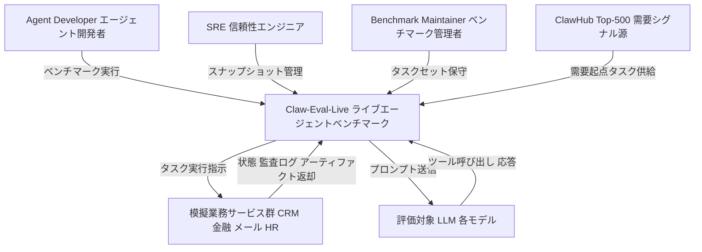
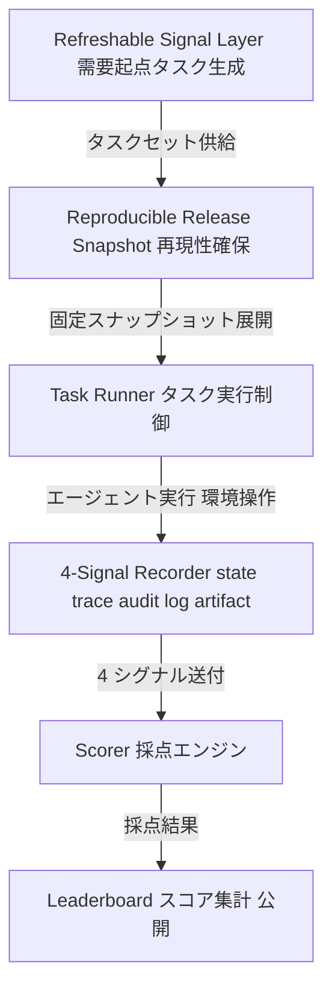
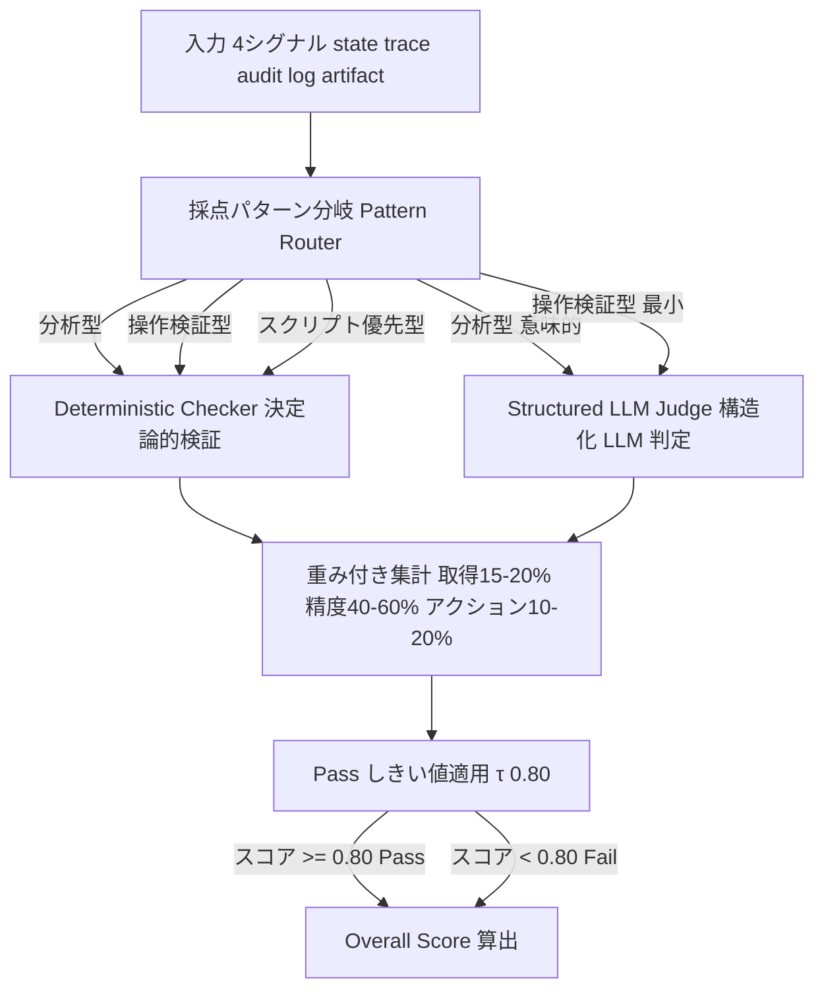
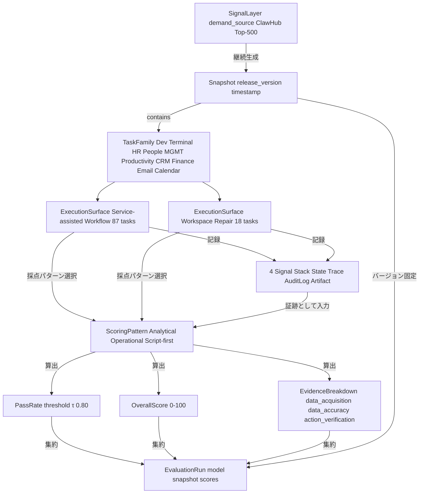
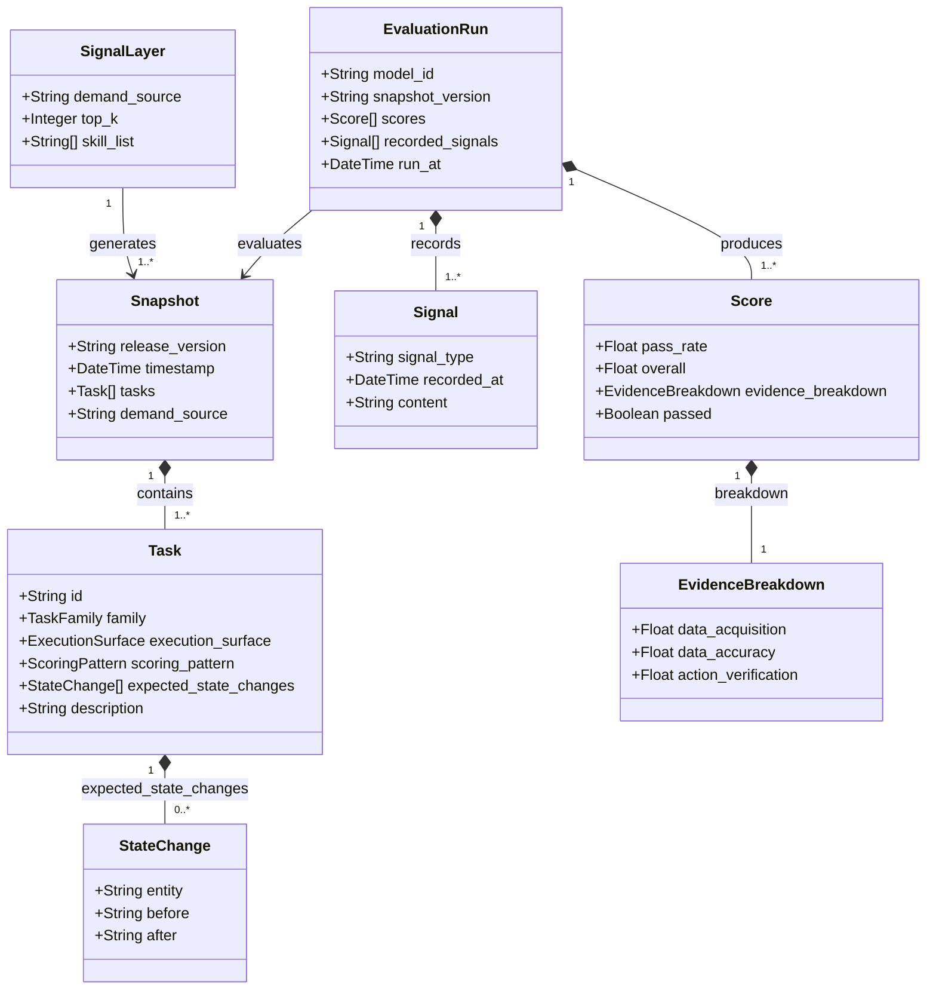

> 対象論文: Claw-Eval-Live (arXiv:2604.28139) — A Live Agent Benchmark for Evolving Real-World Workflows
> 想定読者: LLMOps / SRE / プロダクトエンジニア

## 概要

Claw-Eval-Live は、LLM エージェントの評価を「最終応答が正しかったか」から「状態を変えたか・証跡が残ったか・再現できるか」へ転換するライブエージェントベンチマークです。

既存ベンチマークは 2 つの根本課題を抱えています。1 つはタスクセット固定による陳腐化、もう 1 つは実行証拠の欠如による採点の甘さです。Claw-Eval-Live は **4 シグナル採点 (state / trace / audit log / artifact)** と **refreshable signal layer** (実需要起点でのタスク継続更新機構) の 2 層構造で応えます。

105 タスク (サービス支援 87 + ワークスペース修復 18) を対象にした評価では、最高スコアの Claude Opus 4.6 でも pass rate 66.7% (Overall 83.6) に留まり、70% 到達モデルは存在しません。HR・管理・マルチシステム業務が共通のボトルネックです。

Gartner レポートでは agentic AI プロジェクトの評価・ROI・リスク管理の難しさが繰り返し指摘されており、評価フレームワーク不在を認識するリーダーは過半数を超えると報告されています (具体値は一次ソース確認推奨)。Claw-Eval-Live の採点設計は、業務エージェント受け入れ基準の青写真として実務的価値が高いと言えます。

## 特徴

- **4 シグナル採点の完全実装**: state・trace・audit log・artifact の 4 種を採点に使う設計 (論文比較対象の中で本構成は突出)
- **refreshable signal layer による継続更新**: ClawHub Top-500 の実需要サリエンス指標を起点にタスクを継続生成し、frozen snapshot と分離管理
- **採点パターン 3 種によるエビデンス強度の使い分け**: 分析型・操作検証型・スクリプト優先型を切り替え、LLM-as-Judge 依存を意味的側面のみに限定
- **105 タスク構成と公開しきい値 τ = 0.80**: サービス支援ワークフロー 87 とワークスペース修復 18、Pass率と Overall Score の 2 軸で評価
- **主要数値: 最高 66.7% / Overall 83.6**: 70% 到達モデルなし
- **タスクファミリー × 実行面の不均一性**: 論文 leaderboard では Development が最強モデルで 100%、Terminal は全モデル 72.2% 以上、HR / People は全モデル 22.2% 以下、MGMT は公開 pass ルール下で全失敗
- **既存ベンチマークとの差別化**: 論文比較表によれば、4 シグナルスタックの網羅と demand 起点リフレッシュの両立は他に見当たらない

## 構造

### システムコンテキスト図



| 要素 | 説明 |
|------|------|
| Agent Developer | ベンチマーク実行とモデル選定・エージェント改善活用 |
| SRE | リリーススナップショット管理と再現性保証 |
| Benchmark Maintainer | タスクセットのリフレッシュ・採点ルール・閾値保守 |
| ClawHub Top-500 | 実需要サリエンス指標とタスク継続生成の信号源 |
| 模擬業務サービス群 | 業務環境模擬と 4 シグナル生成 |
| 評価対象 LLM | プロンプト受信とツール呼び出し・応答返却 |

### コンテナ図



| コンテナ | 説明 |
|---------|------|
| Refreshable Signal Layer | ClawHub Top-500 起点の動的タスク生成 |
| Reproducible Release Snapshot | バージョン固定の再現可能リリース単位 |
| Task Runner | スナップショット基準のエージェント実行制御 |
| 4-Signal Recorder | state / trace / audit log / artifact の収集記録 |
| Scorer | 採点パターン分岐 + 決定論検証 + LLM 判定の組み合わせ |
| Leaderboard | モデル別・ファミリー別スコア集計と公開 |

### コンポーネント図



| コンポーネント | 説明 |
|--------------|------|
| 採点パターン分岐 | 4 シグナルとタスク種別から検証器を振り分け |
| Deterministic Checker | ツール呼び出し・状態変化・数値精度の決定論検証 |
| Structured LLM Judge | 意味的側面のみに限定した構造化判定 |
| 重み付き集計 | データ取得・精度・アクション検証の重み統合 |
| Pass しきい値適用 | τ = 0.80 で Pass / Fail を判定 |
| Overall Score 算出 | Pass率と Overall Score を分離出力 |

## データ

### 概念モデル



| エンティティ | 説明 |
|------------|------|
| SignalLayer | タスク生成起点の需要シグナル (ClawHub Top-500) |
| Snapshot | 特定時点のタスクセットを固定した再現可能リリース単位 |
| TaskFamily | ドメイン別のタスク分類 |
| ExecutionSurface | タスクが実行される環境種別 |
| Signal (State) | ツール実行前後のシステム状態 |
| Signal (Trace) | エージェントのツール呼び出し系列・実行軌跡 |
| Signal (AuditLog) | 業務サービスが記録する監査ログ |
| Signal (Artifact) | 実行後の成果物 |
| ScoringPattern (Analytical) | 決定論 + 意味的 LLM 判定 |
| ScoringPattern (Operational) | 監査ログ中心、LLM 判定最小 |
| ScoringPattern (Script-first) | 状態変更を決定論で検証 |
| Score (PassRate) | τ=0.80 閾値の二値判定 |
| Score (OverallScore) | 0-100 の連続スコア |
| Score (EvidenceBreakdown) | 評価軸ごとの内訳 |
| EvaluationRun | 特定モデル × スナップショットの 1 回の実行結果 |

### 情報モデル



| エンティティ | 主要属性 | 説明 |
|------------|---------|------|
| Task | id, family, execution_surface, scoring_pattern, expected_state_changes | タスク定義の中核 |
| Snapshot | release_version, tasks (v2 時点で 105 件) | 再現可能リリース単位 |
| SignalLayer | demand_source (ClawHub Top-500), top_k 500 | サリエンス指標 |
| Score | pass_rate (τ=0.80), overall (0-100) | 二極化対策に Overall 併用 |
| EvaluationRun | model_id, snapshot_version, recorded_signals[] | 1 回の評価実行 |

### TaskFamily 別のスコア分布

| TaskFamily | ExecutionSurface | スコア帯 | 特徴 |
|---|---|---|---|
| Development | WorkspaceRepair | 最強モデルで 100% | 容易 |
| Terminal | WorkspaceRepair | 全モデル 72.2% 以上 | スクリプト優先採点が機能 |
| Productivity | ServiceAssistedWorkflow | 88.0%-48.0% | モデル間差最大 |
| HR / People | ServiceAssistedWorkflow | 全モデル 22.2% 以下 | 最難関 |
| MGMT | ServiceAssistedWorkflow | 全モデル全失敗 | 公開 pass ルール下で全敗 |

## 構築方法

論文の方法論を自社環境で再現するための実装補完ガイドです。コードブロックは「実装案」として提示します。論文に存在しない数値・閾値は出典を直接添えます。

### 1. タスクスナップショット定義

タスクを **family × execution_surface × scoring_pattern** の 3 軸で分類する YAML 構造を採用します。

```yaml
# 実装案: task_snapshot_v1.yaml
version: "1"
snapshot_date: "2026-05-05"

tasks:
  - task_id: "crm-001"
    family: "service_assistance"
    execution_surface: "multi_system"
    description: "CRM の顧客ステータスを更新し、メールで担当者に通知する"
    expected_state_changes:
      - system: "crm"
        entity: "customer"
        field: "status"
        before: "lead"
        after: "active"
      - system: "email"
        entity: "outbox"
        field: "sent_count"
        delta: 1
    scoring_pattern: "operation_verification"
    weight:
      data_retrieval: 0.15      # 15-20% (論文 §3.3)
      data_accuracy: 0.60       # 40-60%
      action_verification: 0.25 # 10-20%
    pass_threshold: 0.80        # τ=0.80 (論文 §2.3)
    artifact_required: true
    hitl_required: false

  - task_id: "ws-repair-001"
    family: "workspace_repair"
    execution_surface: "terminal"
    description: "壊れた Python 仮想環境を診断して再構築する"
    expected_state_changes:
      - system: "filesystem"
        entity: "venv"
        field: "health_check_exit_code"
        after: 0
    scoring_pattern: "script_first"
    weight:
      data_retrieval: 0.10
      data_accuracy: 0.30
      action_verification: 0.60
    pass_threshold: 0.80
    artifact_required: true
```

要点は次のとおりです。

- `expected_state_changes` を決定論検証の入力として明示する
- `scoring_pattern` で LLM Judge 利用範囲を切り替える
- スナップショットは Git でバージョン管理し、リリース単位でタグを打つ

### 2. 4 シグナル収集の実装

論文が採点に使う 4 シグナルを OpenTelemetry GenAI semconv をベースに収集します。`gen_ai.operation.name` は安定属性ですが、`gen_ai.agent.*` 系は incubating の実験的属性のため、必要に応じて `eval.*` 名前空間で独自属性として併用します。

```python
# 実装案: otel_agent_tracer.py
# 参考: https://opentelemetry.io/docs/specs/semconv/gen-ai/gen-ai-agent-spans/

from opentelemetry import trace
from opentelemetry.sdk.trace import TracerProvider
from opentelemetry.sdk.trace.export import BatchSpanProcessor
from opentelemetry.exporter.otlp.proto.http.trace_exporter import OTLPSpanExporter
import json, time

provider = TracerProvider()
provider.add_span_processor(BatchSpanProcessor(OTLPSpanExporter()))
trace.set_tracer_provider(provider)
tracer = trace.get_tracer("claw-eval-agent", "0.1.0")


def run_task_with_signals(task_id: str, agent_fn, task_input: dict) -> dict:
    """エージェント実行を trace でラップし 4 シグナルを収集する。"""
    with tracer.start_as_current_span("agent.task") as span:
        span.set_attribute("gen_ai.operation.name", "agent.execute")
        span.set_attribute("gen_ai.agent.id", task_id)

        state_before = capture_state_snapshot(task_input["expected_state_changes"])
        t_start = time.time()
        result = agent_fn(task_input)
        elapsed = time.time() - t_start
        state_after = capture_state_snapshot(task_input["expected_state_changes"])

        span.set_attribute("eval.state_before", json.dumps(state_before))
        span.set_attribute("eval.state_after", json.dumps(state_after))
        span.set_attribute("eval.elapsed_sec", elapsed)
        span.set_attribute("eval.tool_calls", json.dumps(result.get("tool_calls", [])))
        artifact_path = save_artifact(task_id, result.get("artifact"))
        span.set_attribute("eval.artifact_path", str(artifact_path))

        return {
            "state_before": state_before,
            "state_after": state_after,
            "tool_calls": result.get("tool_calls", []),
            "artifact_path": artifact_path,
            "elapsed_sec": elapsed,
        }
```

Langfuse を使う場合は階層トレースで session / span を組み立てます。

```python
# 実装案: langfuse_eval_tracer.py
from langfuse import Langfuse
import uuid

lf = Langfuse()


def trace_task_with_langfuse(task_id: str, agent_fn, task_input: dict) -> dict:
    session_id = str(uuid.uuid4())
    tr = lf.trace(
        name=f"eval-task-{task_id}",
        session_id=session_id,
        tags=["claw-eval", task_input["family"], task_input["scoring_pattern"]],
        metadata={"task_id": task_id, "snapshot_date": task_input.get("snapshot_date")},
    )

    state_span = tr.span(name="state-capture-before")
    state_before = capture_state_snapshot(task_input["expected_state_changes"])
    state_span.end(output=state_before)

    agent_span = tr.span(name="agent-execution")
    result = agent_fn(task_input)
    agent_span.end(output={
        "tool_calls": result.get("tool_calls", []),
        "artifact_path": result.get("artifact_path"),
    })

    state_after_span = tr.span(name="state-capture-after")
    state_after = capture_state_snapshot(task_input["expected_state_changes"])
    state_after_span.end(output=state_after)

    return {"trace_id": tr.id, "session_id": session_id}
```

### 3. 採点エンジンの構築

論文の採点は「決定論 checker + 構造化 LLM Judge」の組み合わせです。決定論で確認できる箇所は決定論に任せ、LLM Judge は意味的判定のみに限定します。

```python
# 実装案: scoring_engine.py
from dataclasses import dataclass

@dataclass
class TaskScore:
    task_id: str
    data_retrieval: float
    data_accuracy: float
    action_verification: float
    overall: float
    passed: bool


def score_task(task_def: dict, signals: dict) -> TaskScore:
    pattern = task_def["scoring_pattern"]

    if pattern == "script_first":
        action_score = score_state_diff_deterministic(
            task_def["expected_state_changes"],
            signals["state_before"], signals["state_after"])
        retrieval_score = score_tool_calls_deterministic(task_def, signals["tool_calls"])
        accuracy_score = retrieval_score
    elif pattern == "operation_verification":
        retrieval_score = score_tool_calls_deterministic(task_def, signals["tool_calls"])
        action_score = score_state_diff_deterministic(
            task_def["expected_state_changes"],
            signals["state_before"], signals["state_after"])
        accuracy_score = (retrieval_score + action_score) / 2
    else:  # analytic
        retrieval_score = score_tool_calls_deterministic(task_def, signals["tool_calls"])
        accuracy_det = score_numeric_entities(task_def, signals["state_after"])
        accuracy_llm = llm_judge_semantic(task_def, signals)
        accuracy_score = 0.7 * accuracy_det + 0.3 * accuracy_llm
        action_score = score_state_diff_deterministic(
            task_def["expected_state_changes"],
            signals["state_before"], signals["state_after"])

    w = task_def["weight"]
    overall = (w["data_retrieval"] * retrieval_score
               + w["data_accuracy"] * accuracy_score
               + w["action_verification"] * action_score)
    tau = task_def.get("pass_threshold", 0.80)
    return TaskScore(
        task_id=task_def["task_id"],
        data_retrieval=retrieval_score,
        data_accuracy=accuracy_score,
        action_verification=action_score,
        overall=overall,
        passed=overall >= tau,
    )


def score_state_diff_deterministic(expected, before: dict, after: dict) -> float:
    """期待する状態変更がすべて発生したか 0/1 で検証し平均を返す。"""
    if not expected:
        return 1.0
    scores = []
    for change in expected:
        key = f"{change['system']}.{change['entity']}.{change['field']}"
        after_val = after.get(key)
        if "after" in change:
            scores.append(1.0 if after_val == change["after"] else 0.0)
        elif "delta" in change:
            before_val = before.get(key, 0)
            scores.append(1.0 if (after_val - before_val) == change["delta"] else 0.0)
    return sum(scores) / len(scores)
```

### 4. 再現可能環境

決定論的評価には時刻・外部 API・乱数・DB すべてを freeze する必要があります。

```dockerfile
# 実装案: Dockerfile.eval
FROM python:3.12-slim

RUN pip install langfuse opentelemetry-sdk opentelemetry-exporter-otlp \
    fakeredis faketime httpretty

ENV LD_PRELOAD=/usr/lib/x86_64-linux-gnu/faketime/libfaketime.so.1
ENV FAKETIME="2026-05-05 00:00:00"

COPY eval_mocks/ /app/eval_mocks/
COPY tasks/ /app/tasks/
COPY scoring_engine.py /app/

WORKDIR /app
CMD ["python", "-m", "pytest", "eval_suite/", "-v", "--tb=short"]
```

```yaml
# 実装案: docker-compose.eval.yaml
services:
  eval-runner:
    build: { context: ., dockerfile: Dockerfile.eval }
    environment:
      EVAL_SEED: "42"
      FAKETIME: "2026-05-05 00:00:00"
      LANGFUSE_HOST: "http://langfuse:3000"
    depends_on: [langfuse, wiremock]
  langfuse:
    image: langfuse/langfuse:latest
    ports: ["3000:3000"]
  wiremock:
    image: wiremock/wiremock:latest
    volumes: ["./eval_mocks:/home/wiremock/mappings"]
    ports: ["8080:8080"]
```

`EVAL_SEED` の固定だけでは非決定論性が残ります。外部 API は WireMock や httpretty で必ずスタブしてください。

### 5. Refreshable Signal Layer

社内 demand source (Slack の問い合わせ・チケット・業務ログ) を起点に、論文の refreshable signal layer を再現します。

```python
# 実装案: refreshable_signal_layer.py
from dataclasses import dataclass
import yaml, pathlib, uuid, datetime

@dataclass
class DemandSignal:
    skill_name: str
    frequency_score: float   # 過去 30 日の出現頻度を正規化
    recency_score: float     # 直近 7 日の出現率
    salience: float          # 0.4 * frequency + 0.6 * recency (設計案)


class DemandSourceAdapter:
    """Slack / Jira / ServiceNow など、実装は差し替え可能。"""
    def get_top_n_skills(self, n: int = 50) -> list[DemandSignal]:
        raise NotImplementedError


class TaskRefresher:
    def __init__(self, adapter: DemandSourceAdapter, template_dir: str):
        self.adapter = adapter
        self.template_dir = pathlib.Path(template_dir)

    def refresh(self, dry_run: bool = False) -> list[dict]:
        signals = self.adapter.get_top_n_skills(50)
        new_tasks = []
        for sig in signals:
            if sig.salience < 0.30:
                continue
            template = self._load_template(sig.skill_name)
            if template is None:
                continue
            task = dict(template)
            task["task_id"] = f"{sig.skill_name}-{uuid.uuid4().hex[:6]}"
            task["generated_date"] = str(datetime.date.today())
            task["demand_salience"] = sig.salience
            new_tasks.append(task)
            if not dry_run:
                self._save(task)
        return new_tasks

    def _load_template(self, name: str):
        path = self.template_dir / f"{name}.yaml"
        return yaml.safe_load(path.read_text()) if path.exists() else None

    def _save(self, task: dict):
        path = self.template_dir / "generated" / f"{task['task_id']}.yaml"
        path.parent.mkdir(parents=True, exist_ok=True)
        path.write_text(yaml.dump(task, allow_unicode=True))
```

## 利用方法

### 1. エージェントの評価実行

```bash
# 実装案: eval CLI
python -m claw_eval run \
  --task-dir ./tasks/ \
  --agent-module myagent.run \
  --output-dir ./eval_results/ \
  --seed 42

# 出力例
# task_id          retrieval  accuracy  action  overall  passed
# crm-001          0.90       0.85      1.00    0.884    PASS
# ws-repair-001    0.80       0.75      0.50    0.668    FAIL
# TOTAL (n=105)                                          66.7%
# Pass rate (τ=0.80): 66.7%  Overall: 83.6
```

### 2. 受け入れ基準への組み込み

CI/CD で τ=0.80 を pass 条件にする GitHub Actions 実装案です。

```yaml
# 実装案: .github/workflows/agent-eval.yml
name: Agent Eval - 4-Signal Scoring

on:
  pull_request:
    branches: [main]
  schedule:
    - cron: "0 2 * * 1"

jobs:
  eval:
    runs-on: ubuntu-latest
    timeout-minutes: 60
    services:
      wiremock:
        image: wiremock/wiremock:latest
        ports: ["8080:8080"]
    steps:
      - uses: actions/checkout@v4
      - uses: actions/setup-python@v5
        with: { python-version: "3.12" }
      - run: pip install -r requirements-eval.txt
      - name: Run evaluation suite
        env:
          EVAL_SEED: "42"
          FAKETIME: "2026-05-05 00:00:00"
        run: |
          python -m claw_eval run \
            --task-dir ./tasks/ \
            --agent-module myagent.run \
            --output-dir ./eval_results/ \
            --report-json ./eval_results/summary.json
      - name: Check pass threshold
        run: |
          python - <<'EOF'
          import json, sys
          summary = json.load(open("eval_results/summary.json"))
          tau = 0.80
          if summary["pass_rate"] < tau:
              print(f"FAIL: pass_rate {summary['pass_rate']:.3f} < τ={tau}")
              sys.exit(1)
          print("PASS")
          EOF
      - if: always()
        uses: actions/upload-artifact@v4
        with:
          name: eval-results-${{ github.sha }}
          path: eval_results/
```

### 3. タスクファミリー別の HITL ゲート切り替え

リスクスコアに応じて auto / sampling / 100% HITL に振り分けます。閾値設計案は auto-approve ≥ 0.85, auto-reject ≤ 0.30 です。

```python
# 実装案: hitl_router.py
from dataclasses import dataclass
from enum import Enum

class ReviewDecision(Enum):
    AUTO_APPROVE = "auto_approve"
    SAMPLE_REVIEW = "sample_review"
    FULL_HITL = "full_hitl"


@dataclass
class RiskContext:
    task_family: str
    overall_score: float
    involves_financial: bool
    financial_amount: float
    multi_system: bool


def route_to_hitl(ctx: RiskContext) -> tuple[ReviewDecision, float]:
    """
    3 シグナル合議: rule 30% + history 55% + llm_confidence 15%
    """
    HIGH_RISK_FAMILIES = {"hr_people", "mgmt"}
    rule_score = 0.0
    if ctx.task_family in HIGH_RISK_FAMILIES:
        rule_score = 1.0
    if ctx.involves_financial and ctx.financial_amount >= 5000:
        rule_score = max(rule_score, 1.0)

    history_score = 1.0 - ctx.overall_score
    llm_risk = 1.0 - ctx.overall_score
    composite_risk = 0.30 * rule_score + 0.55 * history_score + 0.15 * llm_risk

    if rule_score >= 1.0 or composite_risk >= 0.70:
        return ReviewDecision.FULL_HITL, 1.0
    if ctx.overall_score >= 0.85:
        return ReviewDecision.AUTO_APPROVE, 0.0
    if ctx.overall_score <= 0.30:
        return ReviewDecision.FULL_HITL, 1.0

    sampling_rate = 0.05 + 0.15 * (1.0 - ctx.overall_score)
    return ReviewDecision.SAMPLE_REVIEW, min(sampling_rate, 0.20)
```

### 4. 回帰テスト運用 (Golden Trace)

Golden trace と snapshot diff で、リリース間のエージェント挙動の劣化を早期検出します。

```python
# 実装案: golden_trace_regression.py
import json, pathlib, hashlib
from dataclasses import dataclass

GOLDEN_DIR = pathlib.Path("golden_traces/")

@dataclass
class GoldenTrace:
    task_id: str
    tool_calls: list[dict]
    state_after: dict
    artifact_hash: str


def save_golden(trace: GoldenTrace) -> None:
    GOLDEN_DIR.mkdir(parents=True, exist_ok=True)
    path = GOLDEN_DIR / f"{trace.task_id}.json"
    path.write_text(json.dumps({
        "task_id": trace.task_id,
        "tool_calls": trace.tool_calls,
        "state_after": trace.state_after,
        "artifact_hash": trace.artifact_hash,
    }, ensure_ascii=False, indent=2))


def diff_against_golden(task_id: str, new_signals: dict) -> dict:
    path = GOLDEN_DIR / f"{task_id}.json"
    if not path.exists():
        return {"status": "no_golden", "task_id": task_id}
    golden = json.loads(path.read_text())
    diffs = {}
    if golden["tool_calls"] != new_signals.get("tool_calls", []):
        diffs["tool_calls"] = {"golden": golden["tool_calls"],
                               "current": new_signals.get("tool_calls", [])}
    state_diffs = {}
    for k, v in golden["state_after"].items():
        actual = new_signals.get("state_after", {}).get(k)
        if actual != v:
            state_diffs[k] = {"golden": v, "current": actual}
    if state_diffs:
        diffs["state_after"] = state_diffs
    return {"status": "diff" if diffs else "ok", "task_id": task_id, "diffs": diffs}
```

運用フローは次のとおりです。

1. 初回リリース時: pass したタスクを `golden_traces/` に保存
2. PR 作成時 (CI): eval 実行と diff_against_golden で全タスクを比較
   - diff なし: PASS
   - diff あり: PR に差分コメントと HITL レビュー依頼
3. 四半期ごとの golden 更新: 意図的な挙動変更時のみ PR レビュー必須で更新

## 運用

### タスクスナップショットの版管理

- release snapshot を `git tag` で凍結し、過去評価の再現性を保証
- refreshable layer は `feature/refresh-YYYYMM` ブランチで管理し、main マージ後にタグ
- タグ命名: `snapshot/YYYY-MM`

```bash
git tag -a snapshot/2026-05 -m "tasks: 105 (+12 refreshed, HR/MGMT 更新)"
git push origin snapshot/2026-05

git checkout snapshot/2026-04
eval --config eval.yaml --task-dir tasks/ --output results/2026-04/
```

### デモンストレーション環境の隔離

Berkeley RDI が実証した「アーティファクト改ざんで 100% 達成可能」脆弱性に対する防御です。

- append-only Merkle tree に監査ログと成果物を書き込む
- 時刻・外部 API・DB を freeze した sandbox で隔離
- ファイルシステム書き込み先を whitelist で制限
- DOM injection・config 漏洩・ツールラッパー置き換えチェックを評価前後に自動実行

```bash
docker run --rm \
  --network none \
  --read-only \
  --mount type=bind,src=./tasks,dst=/tasks,readonly \
  --mount type=tmpfs,dst=/workspace \
  claw-eval-sandbox:snapshot-2026-05 \
  eval-runner --task-id $TASK_ID --output /workspace/result.json
```

### LLM Judge のバイアス対策

GPT-5.4 を judge にする箇所では自己選好バイアスが残ります。

- 同一タスクを **異なる 2 モデル** でクロス採点、スコア差 ±0.1 超で human review
- 決定論で確認できる部分はスクリプトで検証
- judge モデルバージョンをログ記録し、モデル更新時に過去評価との一貫性を検証
- `temperature=0` + `seed=42` で揺らぎを最小化

```yaml
judge:
  primary: claude-opus-4-6
  secondary: gpt-5-4
  temperature: 0
  seed: 42
  cross_check_threshold: 0.10
  deterministic_fields:
    - state_change_verified
    - artifact_hash_match
    - audit_log_entry_count
```

### 監査ログ保管

- 改ざん不能ストレージ: append-only Merkle tree (Amazon QLDB 等) または Object Lock (WORM モード)
- 保持期間: 最低 1 年。HR / MGMT 業務は 3 年以上推奨
- アクセス制御: 評価ランナーは write-only、監査担当は read-only
- インデックス: task_id, model_id, run_timestamp, signal_type の 4 軸

```bash
aws s3api put-object \
  --bucket eval-audit-logs \
  --key "2026/05/05/${TASK_ID}/${RUN_ID}.jsonl.gz" \
  --body result.jsonl.gz \
  --object-lock-mode COMPLIANCE \
  --object-lock-retain-until-date "2029-05-05T00:00:00Z"
```

### コスト管理

エンタープライズ要件で月 $20K-$250K のオーバーヘッドが報告されています (二次情報)。

- 見積もり: 105 タスク × 13 モデル × 月次実行で約 100 GB/年 (artifact なし)
- サンプリング戦略: 識別的タスク (pass 率 20-80% 帯) を優先、天井・床効果は月 1 回のみ
- コールドストレージ移行: 3 ヶ月以上経過した trace / artifact は S3 Glacier や Azure Archive へ
- マルチエージェント 26x オーバーヘッド対策: 親エージェント trace に子サマリを埋込み階層圧縮

```python
ALWAYS_SAMPLE = ["ecommerce-monthly-adjust", "first-response-audit", "multi-doc-merge"]
MONTHLY_ONLY = [t for t in ALL_TASKS if t.pass_rate < 0.05 or t.pass_rate > 0.95]

def should_record_full(task_id: str) -> bool:
    if task_id in ALWAYS_SAMPLE:
        return True
    if task_id in MONTHLY_ONLY and not is_monthly_run():
        return False
    return True
```

### タスク family ごとのモニタリング

```yaml
# Grafana アラート例
- alert: HRFamilyDegradation
  expr: |
    avg_over_time(eval_pass_rate{family="HR"}[7d]) < 0.18
  for: 1d
  labels:
    severity: warning
  annotations:
    summary: "HR family pass 率が 18% を下回りました"
```

## ベストプラクティス

### BP-1: pass 率 80% 越えれば本番に出して良い

**誤解**: τ=0.80 を超えたエージェントは本番運用可能と判断できる。

**反証**: τ-bench は複数試行 (pass@k) で信頼性低下を測る設計で、Sierra のブログでも lab と production の差が報告されています (報告例として pass@1=60% 級モデルが pass@8 で大幅劣化、production と lab で 37% 程度の gap、いずれも一次出典確認推奨)。Claw-Eval-Live 最高 66.7% でさえ本番では 30-40% に落ちる可能性があります。

**推奨**:

- shadow mode 並走で本番トラフィックにログのみ記録し、production feedback と二重評価
- 昇格基準は「lab pass 率」ではなく「shadow mode での production 一致率」
- 最低 2 週間の shadow mode 期間を義務付け

### BP-2: LLM Judge があれば人手不要

**誤解**: LLM-as-Judge を全採点に使えば完全自動化できる。

**反証**: 近年の LLM-as-Judge 研究は、判定モデルが自身の生成テキストや特定プロバイダー出力を優遇する選好バイアスを指摘しています (arXiv:2410.21819, arXiv:2508.06709)。Claw-Eval-Live でも GPT-5.4 を judge に使う箇所では同種のバイアスが残り得ます。

**推奨**:

- LLM Judge を意味的判定のみに限定
- 異プロバイダー 2 モデルでクロス採点、スコア差 ±0.1 超で human review
- 決定論で確認できる信号の比率を意識的に引き上げる

### BP-3: ライブ更新があれば陳腐化しない

**誤解**: 月次でタスクをリフレッシュすれば gaming を防げる。

**反証**: Goodhart's Law により、月次でも更新直前の frozen task set への gaming インセンティブが残存します。学習データにも公開ベンチマークは継続的に流入します。

**推奨**:

- タスク population の可視化で family 比率を公開
- leakage チェックでモデル学習データカットオフと layer 更新タイミングを照合
- refreshable layer の更新アルゴリズムを定期外部監査

### BP-4: 監査ログがあれば証跡として十分

**誤解**: 監査ログ保存で改ざん耐性が確保できる。

**反証**: Berkeley RDI (2026-04) が SWE-bench / WebArena / OSWorld など 8 ベンチマークで、**タスクを解かずに 100% 近いスコアを達成可能**と実証しました。WebArena では DOM injection、SWE-bench では `/usr/bin/curl` 置き換えで監査ログ自体が操作可能です。

**推奨**:

- 監査ログを append-only Merkle tree または Object Lock に書き込み
- sandbox を完全隔離し、評価スクリプトやツールバイナリへの書き込みを禁止
- 既知の改ざんパターン (curl 置き換え・eval() 注入・config 漏洩) を自動チェック

### BP-5: 全タスクを自動化すべき

**誤解**: スコアが高い領域から順次すべて自動化する。

**反証**: HR / People family は全モデル 22.2% 以下、MGMT は全モデル全失敗です。task family によって自動化可能性が根本的に異なります。

**推奨**:

- タスク family による HITL ゲート使い分け:
  - Dev / Terminal: 自動化許容 (約 100%)
  - Productivity: モデル別評価、下位モデルは HITL を残す
  - HR / MGMT: HITL 必須、自動化は補助 (下書き生成・情報収集) のみ
- HITL 閾値: auto-approve ≥ 0.85, auto-reject ≤ 0.30
- 高リスクアクション ($5K 超返金・雇用判断) は pass 率に関わらず 100% HITL

## トラブルシューティング

### TS-1: LLM Judge スコアが日によって変動する

- **症状**: 同一タスクの judge スコアが ±0.1 以上ぶれる
- **原因**: temperature > 0 / judge モデルのサイレントアップデート
- **対処**: `temperature=0` + `seed=42` を必ず付与、judge モデルバージョンをログ記録、異プロバイダー 2 モデルでクロス採点

### TS-2: 監査ログのストレージが肥大化する

- **症状**: 月次で数十 GB ずつ増加、コスト超過
- **原因**: 4 シグナル全記録 + マルチエージェント 26x 膨張
- **対処**: 天井・床効果タスクは月 1 回のみ記録、3 ヶ月以上経過したものは S3 Glacier / Azure Archive へ自動移行、階層圧縮 + オンデマンドフル展開

### TS-3: pass 率が異常に高い (天井効果)

- **症状**: 特定タスクで全モデル 100% pass、評価が意味をなさない
- **原因**: 識別性低下、leakage で学習データに混入
- **対処**: 全モデル pass 率 95% 超を天井効果候補としてフラグ、識別的タスク中心に再構成、学習データカットオフとタスク公開日を照合

### TS-4: Refreshable signal layer 更新で過去評価が無効化

- **症状**: layer 更新後、過去評価結果と新評価の比較不能
- **原因**: タスク定義 / 採点ルーブリック / 期待状態の変更で互換性喪失
- **対処**: 更新前に `git tag snapshot/YYYY-MM` で凍結、CI で diff レポート自動生成、過去スナップショットタグ参照の再評価スクリプトで横並び比較

```bash
eval-compare \
  --baseline snapshot/2026-04 \
  --current snapshot/2026-05 \
  --output diff-report/2026-04-vs-05.md
```

### TS-5: 状態スナップショットの diff が大きすぎて検証不能

- **症状**: 状態 diff が数万行、何が変わったか判断不能
- **原因**: 期待 state 粒度が粗く、関係ないフィールドまで diff に含まれる
- **対処**: 期待 state を「検証すべきフィールドのみ」に絞り込み、golden trace 粒度を「各 step の操作対象フィールドのみ」に再設計、`expected_state_schema` でスキーマ外フィールド変化は warn のみ

### TS-6: マルチシステム業務タスクでタイムアウト頻発

- **症状**: CRM + 金融 + カレンダー横断タスクがタイムアウト
- **原因**: システム間待ち合わせの累積でグローバルタイムアウト超過
- **対処**: タイムアウトを「タスク全体」ではなく「状態 step ごと」に分割、タイムアウト step の中間状態をログ記録、HR / MGMT 系では HITL ゲートを挟む

```python
import asyncio

async def run_step(step_fn, timeout_sec=10, step_name="unknown"):
    try:
        return await asyncio.wait_for(step_fn(), timeout=timeout_sec)
    except asyncio.TimeoutError:
        logger.warning(f"Step {step_name} timed out after {timeout_sec}s")
        raise StepTimeoutError(step_name)
```

### TS-7: pass 率が急落したがタスク変更がない

- **症状**: refreshable layer 未更新なのに、特定モデルの pass 率が前週比 -10% 以上低下
- **原因**: 外部 API 変更 / judge モデルのサイレントアップデート / 環境の非決定論的変化
- **対処**:
  1. judge モデルのバージョンログを確認、サイレントアップデートを検証
  2. sandbox 環境の外部 API モック定義を確認、依存サービス schema 変更を調査
  3. 落ちたタスクを手動再現、どのシグナルが落ちているかを特定
  4. Dockerized world で完全固定して再実行、環境起因かモデル起因かを切り分け

## まとめ

Claw-Eval-Live は、業務エージェント評価を「正しく答えたか」から「状態を変えたか・証跡が残ったか・再現できるか」へ転換する、4 シグナル採点と refreshable signal layer の組み合わせを提案するライブベンチマークです。最高モデルでも 66.7% という結果は完全自動化を目指すよりタスク family による HITL の使い分けが現場の正解だと示しており、設計原則は LangSmith / Langfuse / Phoenix / OTel GenAI semconv を組み合わせれば段階的に組織採用できます。

この記事が少しでも参考になった、あるいは改善点などがあれば、ぜひリアクションやコメント、SNS でのシェアをいただけると励みになります！

## 参考リンク

- 一次論文
  - [Claw-Eval-Live (arXiv:2604.28139)](https://arxiv.org/abs/2604.28139)
  - [Claw-Eval-Live HTML v2](https://arxiv.org/html/2604.28139v2)
- 関連学術論文 / 系譜
  - [τ-bench (Sierra, arXiv:2406.12045)](https://arxiv.org/abs/2406.12045)
  - [AgentBench (arXiv:2308.03688)](https://arxiv.org/abs/2308.03688)
  - [WebArena (arXiv:2307.13854)](https://arxiv.org/abs/2307.13854)
  - [OSWorld (arXiv:2404.07972)](https://arxiv.org/abs/2404.07972)
  - [TheAgentCompany (arXiv:2412.14161)](https://arxiv.org/abs/2412.14161)
  - [Self-Preference Bias in LLM-as-a-Judge (arXiv:2410.21819)](https://arxiv.org/abs/2410.21819)
  - [Play Favorites: LLM Judge Bias (arXiv:2508.06709)](https://arxiv.org/abs/2508.06709)
  - [LiveBench paper](https://livebench.ai/livebench.pdf)
- GitHub
  - [SWE-bench-Live (Microsoft)](https://github.com/microsoft/SWE-bench-Live)
- 記事 / 公式ドキュメント
  - [LangSmith Evaluation](https://docs.langchain.com/langsmith/evaluation)
  - [Langfuse - AI Agent Observability](https://langfuse.com/blog/2024-07-ai-agent-observability-with-langfuse)
  - [Arize Phoenix](https://arize.com/blog/add-observability-to-your-open-agent-spec-agents-with-arize-phoenix/)
  - [Braintrust - Evaluating Agents](https://www.braintrust.dev/blog/evaluating-agents)
  - [OpenTelemetry GenAI Semantic Conventions](https://opentelemetry.io/docs/specs/semconv/gen-ai/gen-ai-agent-spans/)
  - [Microsoft Agent Framework HITL](https://learn.microsoft.com/en-us/agent-framework/workflows/human-in-the-loop)
  - [Docker Cagent (InfoQ 2026-01)](https://www.infoq.com/news/2026/01/cagent-testing/)
  - [Amazon QLDB](https://aws.amazon.com/qldb/)
  - [o11y-bench (Grafana)](https://grafana.com/blog/o11y-bench-open-benchmark-for-observability-agents/)
  - [Berkeley RDI - How We Broke Top AI Agent Benchmarks](https://rdi.berkeley.edu/blog/trustworthy-benchmarks-cont/)
  - [Sierra τ-bench Blog](https://sierra.ai/blog/benchmarking-ai-agents)
  - [Goodhart's Law (Wikipedia)](https://en.wikipedia.org/wiki/Goodhart%27s_law)
  - [Gartner 2026 Predictions on Agentic AI](https://www.gartner.com/en/newsroom/press-releases/2025-06-25-gartner-predicts-over-40-percent-of-agentic-ai-projects-will-be-canceled-by-end-of-2027/)
  - [Redis - AI Agent Benchmarks: Where They Fall Short](https://redis.io/blog/ai-agent-benchmarks/)
