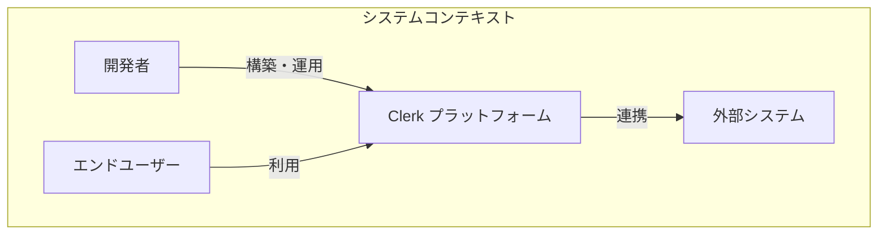
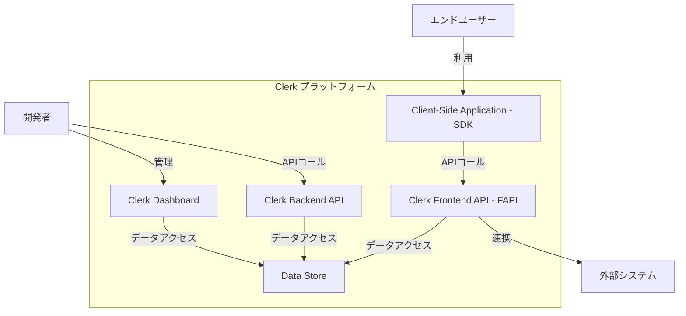
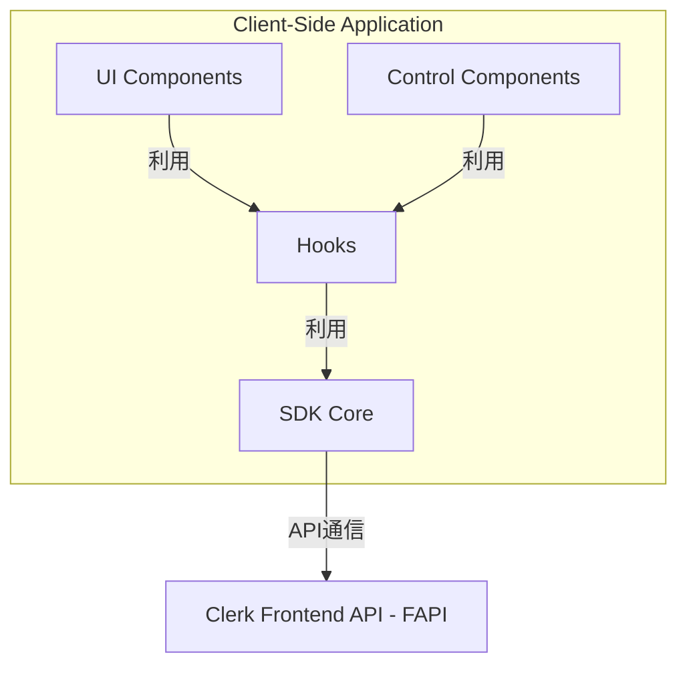
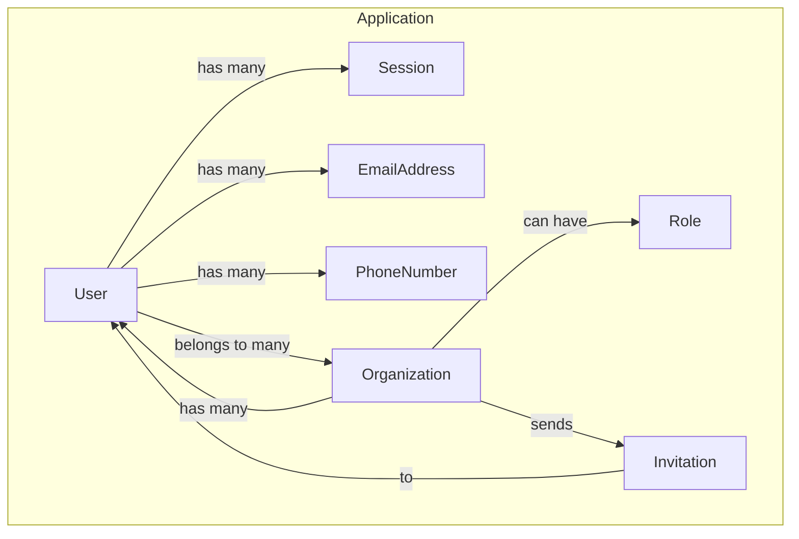
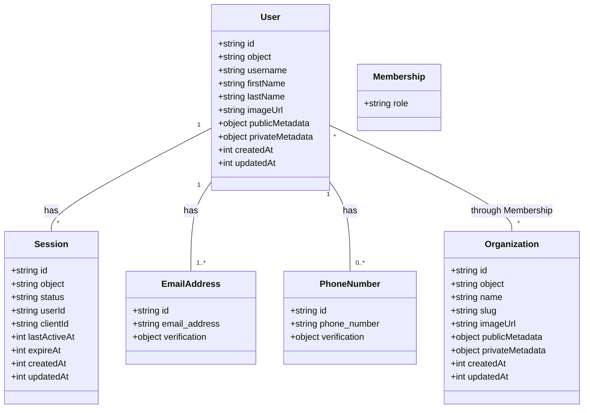

## ■概要

Clerkは、最新のWeb・モバイルアプリケーション向けに設計された、**包括的なユーザー管理プラットフォーム**です。

本プラットフォームは、サインイン機能だけでなく、**UIコンポーネント**、**API**、**管理者ダッシュボード**を統合した完全なスイートを提供します。これにより、開発者は**認証**から**プロファイル管理**、**組織管理**、**セッション管理**まで、ユーザーライフサイクル全体を効率的に構築、運用できます。

Clerkの核心的な価値は、セキュアで多機能な認証システムを自社で開発・維持する**複雑さを抽象化**することにあります。Clerkは、**ソーシャルログイン**や **多要素認証（MFA）** などの機能をベストプラクティスとして組み込み済みで提供します。このため、開発チームは認証関連の負担から解放され、コア製品の開発に集中できます。

Clerkは **「デベロッパーファースト」** のアプローチを採り、**Next.js**や**React**などの現代的なフレームワーク向けのSDKを提供します。これにより、Clerkは現代のWeb開発スタックにおける**基本的なインフラ層**となることを目指しています。


## ■特徴

Clerkは、最新のアプリケーション開発の多様な要件に対応するため、以下の主要な特徴を備えています。

  * **事前構築済みUIコンポーネント**
      * デザイン済みのUIコンポーネント（`<SignIn/>`, `<SignUp/>`, `<UserButton/>`など）を提供
      * 数行のコードでサインイン、サインアップ、プロファイル管理などの機能を実装可能
      * コンポーネントはカスタマイズでき、アプリケーションのブランドに合わせてデザインを調整可能
  * **多様な認証戦略**
      * メール・パスワード認証
      * 20種類以上のプロバイダーに対応したソーシャルログイン（OAuth）
      * パスワードレス認証（メール、SMSのワンタイムパスコード）
      * Web3ウォレット認証
  * **B2B SaaS向けスイート（マルチテナンシー）**
      * 「組織（Organization）」機能を標準でサポート
      * チームベースのアクセス管理、メンバーごとのロール設定、権限管理を実現
      * 堅牢なマルチテナントアーキテクチャを提供
  * **高度なセキュリティ**
      * SOC 2 Type 2準拠
      * 定期的な第三者機関による監査とペネトレーションテストを実施
      * CSRF、XSSからの保護、ボット検知、漏洩パスワード検出などの多層的なセキュリティ機能を標準装備
  * **包括的なセッション管理**
      * アクティブなデバイスの監視
      * 特定デバイスからのセッションを遠隔で無効化
      * セッションのライフサイクル全体を管理
  * **開発者向けツール群**
      * 主要フレームワークに対応したSDK
      * サーバーサイドからユーザーを操作するBackend API
      * データ同期のためのWebhook
      * 設定やユーザー管理を一元化する管理ダッシュボード

これらの特徴は、シンプルな個人向けアプリから複雑なB2B SaaSまで、アプリケーションの成長段階に応じて必要な機能を網羅的にカバーします。


## ■構造

Clerkプラットフォームのアーキテクチャを、C4モデルを用いて段階的に解説します。

### ●システムコンテキスト図

システムコンテキスト図は、Clerkプラットフォームと外部のユーザーやシステムとの相互作用を示します。



| 要素名 | 説明 |
| :--- | :--- |
| 開発者 | Clerkを利用してアプリケーションを構築し、ダッシュボードで設定やユーザー管理を行う人物 |
| エンドユーザー | 開発者が構築したアプリケーションを、Clerkの認証機能を通じて利用する人物 |
| Clerk プラットフォーム | 認証とユーザー管理機能を提供するシステム全体 |
| 外部システム | Clerkが機能提供のために依存する外部サービス群（OAuthプロバイダー、メール配信サービスなど） |

### ●コンテナ図

コンテナ図は、Clerkプラットフォームを構成する主要な実行可能単位（コンテナ）と、その関係性を示します。



| 要素名 | 説明 |
| :--- | :--- |
| Client-Side Application (SDK) | エンドユーザーのブラウザで動作するClerkのフロントエンドSDK。UIコンポーネントの描画やユーザー操作を処理 |
| Clerk Frontend API (FAPI) | エンドユーザーのブラウザからのリクエストを直接処理する専用API。ステートフルな対話を行う |
| Clerk Backend API | 開発者のバックエンドサーバーから利用するRESTful API。サーバー間通信に用いる |
| Clerk Dashboard | 開発者がアプリケーション設定、ユーザー管理、APIキー取得などを行うWebアプリケーション |
| Data Store | ユーザー、セッション、組織などの全データを安全に保持するデータベースシステム |

### ●コンポーネント図

コンポーネント図は、「Client-Side Application (SDK)」コンテナの内部コンポーネントと、その相互作用を示します。



| 要素名 | 説明 |
| :--- | :--- |
| UI Components | UIを描画するコンポーネント群（例: `<SignInButton/>`, `<UserButton/>`） |
| Control Components | 認証状態に応じて子要素の表示を制御するコンポーネント（例: `<SignedIn/>`, `<SignedOut/>`） |
| Hooks | コンポーネント内から認証状態やユーザー情報にアクセスする関数（例: `useUser()`, `useAuth()`） |
| SDK Core | SDKの核となるロジック。FAPIとの通信、トークン更新、ローカルの認証状態管理などを行う |


## ■データ

Clerkが内部で扱うデータの構造を解説します。

### ●概念モデル

システム内の主要なエンティティとそれらの関係性を大まかに示します。



| 要素名 | 説明 |
| :--- | :--- |
| Application | Clerkに登録された、開発者のアプリケーション全体 |
| User | アプリケーションを利用するエンドユーザー |
| Organization | 複数のユーザーが所属するグループやチーム。マルチテナント機能の核 |
| Session | ユーザーが特定のデバイスやブラウザで認証されている状態 |
| Role | 組織内でのユーザーの役割（例: Admin, Member） |
| Invitation | 組織がユーザーを招待するための情報 |
| EmailAddress | ユーザーの認証や連絡に使用されるメールアドレス |
| PhoneNumber | ユーザーの認証や連絡に使用される電話番号 |

### ●情報モデル

エンティティの具体的なデータ構造を示します。



| クラス名 | 属性 | 説明 |
| :--- | :--- | :--- |
| User | id | ユーザーの一意なID |
| | publicMetadata | フロントエンドからアクセス可能なカスタムデータ |
| | privateMetadata | バックエンドからのみアクセス可能な機密性の高いカスタムデータ |
| Organization | id | 組織の一意なID |
| | slug | URLなどで使用される、組織の一意な識別子 |
| | publicMetadata | フロントエンドからアクセス可能な組織のカスタムデータ |
| | privateMetadata | バックエンドからのみアクセス可能な組織のカスタムデータ |
| Session | id | セッションの一意なID |
| | status | セッションの状態（例: "active", "revoked"） |
| | userId | このセッションが紐づくユーザーのID |


## ■構築方法

ClerkをNext.js（App Router）アプリケーションに導入する手順を解説します。

1.  **Clerkアカウントの作成と設定**
    1.  [Clerk公式サイト](https://clerk.com/)でアカウントを作成します。
    2.  Clerkダッシュボードで「Add Application」をクリックし、アプリケーション名を入力して作成します。
2.  **SDKのインストール**
    プロジェクトのルートディレクトリで、以下のコマンドを実行します。
    ```bash
    npm install @clerk/nextjs
    ```
3.  **環境変数の設定**
    1.  Clerkダッシュボードの「API Keys」ページに移動します。
    2.  プロジェクトのルートに `.env.local` ファイルを作成します。
    3.  ダッシュボードから「Publishable key」と「Secret key」をコピーし、ファイルに貼り付けます。
        ```
        NEXT_PUBLIC_CLERK_PUBLISHABLE_KEY=pk_test_...
        CLERK_SECRET_KEY=sk_test_...
        ```
4.  **ミドルウェアの追加**
    プロジェクトのルート（または`src`内）に`middleware.ts`ファイルを作成し、以下の内容を記述します。
    ```typescript
    import { clerkMiddleware } from '@clerk/nextjs/server';

    export default clerkMiddleware();

    export const config = {
      matcher: [
        '/((?!_next|[^?]*\.(?:html?|css|js(?!on)|jpe?g|webp|png|gif|svg|ttf|woff2?|ico|csv|docx?|xlsx?|zip|webmanifest)).*)',
        '/(api|trpc)(.*)',
      ],
    };
    ```
5.  **ClerkProviderの追加**
    `app/layout.tsx`ファイルを編集し、ルートレイアウトを`ClerkProvider`でラップします。
    ```typescript
    import { ClerkProvider } from '@clerk/nextjs';
    import type { Metadata } from 'next';
    import './globals.css';

    export const metadata: Metadata = {
      title: 'My Clerk App',
      description: 'Generated by create next app',
    };

    export default function RootLayout({
      children,
    }: {
      children: React.ReactNode;
    }) {
      return (
        <ClerkProvider>
          <html lang="en">
            <body>{children}</body>
          </html>
        </ClerkProvider>
      );
    }
    ```
6.  **開発サーバーの起動**
    以下のコマンドで開発サーバーを起動し、`http://localhost:3000`にアクセスして動作を確認します。
    ```bash
    npm run dev
    ```


## ■利用方法

構築したアプリケーションでClerkを実際に利用するコード例を解説します。

### ●認証UIコンポーネントの利用

`app/layout.tsx`にヘッダーを追加し、サインイン状態に応じてボタンを表示します。

```typescript
// app/layout.tsx
import {
  ClerkProvider,
  SignInButton,
  SignedIn,
  SignedOut,
  UserButton,
} from '@clerk/nextjs';
import type { Metadata } from 'next';
import './globals.css';

export default function RootLayout({ children }: { children: React.ReactNode }) {
  return (
    <ClerkProvider>
      <html lang="en">
        <body>
          <header style={{ display: 'flex', justifyContent: 'space-between', padding: 20 }}>
            <h1>My App</h1>
            <div>
              <SignedOut>
                <SignInButton />
              </SignedOut>
              <SignedIn>
                <UserButton afterSignOutUrl="/" />
              </SignedIn>
            </div>
          </header>
          <main>{children}</main>
        </body>
      </html>
    </ClerkProvider>
  );
}
```

  * **`<SignedOut/>`**: 未サインイン時に子要素を描画
  * **`<SignedIn/>`**: サインイン時に子要素を描画
  * **`<UserButton/>`**: ユーザーのアバターを表示し、プロファイル管理メニューを提供

### ●ルート保護

認証済みユーザーのみに公開するページ（例: `/dashboard`）を`middleware.ts`で設定します。

```typescript
// middleware.ts
import { clerkMiddleware, createRouteMatcher } from '@clerk/nextjs/server';

const isProtectedRoute = createRouteMatcher(['/dashboard(.*)']);

export default clerkMiddleware((auth, req) => {
  if (isProtectedRoute(req)) {
    auth().protect();
  }
});

export const config = {
  matcher: [
    '/((?!_next|[^?]*\.(?:html?|css|js(?!on)|jpe?g|webp|png|gif|svg|ttf|woff2?|ico|csv|docx?|xlsx?|zip|webmanifest)).*)',
    '/(api|trpc)(.*)',
  ],
};
```

この設定により、`/dashboard`とその配下へのアクセスにはサインインが必須となります。

### ●ユーザー情報の取得

#### ▷サーバーコンポーネントでの取得

`currentUser`ヘルパーを使用します。

```typescript
// app/dashboard/page.tsx
import { currentUser } from '@clerk/nextjs/server';

export default async function DashboardPage() {
  const user = await currentUser();

  if (!user) {
    return <div>Not logged in</div>;
  }

  return (
    <div>
      <h1>Dashboard</h1>
      <p>Hello, {user.firstName || 'User'}!</p>
    </div>
  );
}
```

#### ▷クライアントコンポーネントでの取得

`useUser`フックを使用します。

```typescript
// app/components/UserInfo.tsx
'use client';

import { useUser } from '@clerk/nextjs';

export default function UserInfo() {
  const { isSignedIn, user, isLoaded } = useUser();

  if (!isLoaded) {
    return <div>Loading...</div>;
  }

  if (!isSignedIn) {
    return null;
  }

  return <div>Welcome back, {user.fullName}!</div>;
}
```

### ●ソーシャルログインの設定

1.  Clerkダッシュボードの「User & Authentication」 \> 「Social Connections」に移動します。
2.  「Add Connection」をクリックし、有効にしたいプロバイダー（例: Google）を選択します。
3.  設定を有効にすると、サインイン・サインアップコンポーネントにボタンが自動で表示されます。


## ■運用

アプリケーションデプロイ後の、Clerkの主要な運用タスクを解説します。

  * **ダッシュボードでのユーザー管理**
      * **一覧と詳細**: 「Users & Organizations」セクションで全ユーザーの情報を確認
      * **手動操作**: 特定ユーザーの禁止（Ban）や削除が可能
      * **ユーザー偽装**: デバッグ目的で特定のユーザーとしてログイン可能
  * **APIキーとドメイン管理**
      * **APIキー**: ダッシュボードの「API Keys」ページで開発環境用と本番環境用のキーを確認。デプロイ時には本番用のキーを使用
      * **ドメイン設定**: 本番環境のインスタンスに、アプリケーションがホストされているドメインを登録
  * **セッション期間の設定**
      * **Maximum lifetime**: セッションが強制的に失効するまでの最大期間（デフォルト7日）
      * **Inactivity timeout**: ユーザーの無操作時にセッションが失効するまでの期間
  * **Webhookによるデータ同期**
      * **目的**: Clerk上のイベント（例: `user.created`）をリアルタイムで自社バックエンドに通知し、自社データベースと同期
      * **設定**: ダッシュボードの「Webhooks」セクションで、通知を受け取るエンドポイントURLと購読するイベントを設定

## ■まとめ

* **Clerkがマッチするケース**
  * Next.js/Reactベースの新規プロジェクト
  * 認証機能の開発・運用コストを削減したい場合
  * B2B向けのマルチテナント機能が必要な場合
  * エンタープライズレベルのセキュリティ要件がある場合
* **制約**
  * **ベンダーロックイン**: SaaS型サービスのため、将来的な移行コストを考慮する必要がある
  * **データ所在地**: データセンターの地理的制約（US/EU）
  * **料金体系**: MAU（月間アクティブユーザー）ベースの課金のため、成長に伴うコスト増加を予測する必要がある
  * **カスタマイズ性**: 認証フローの大幅なカスタマイズには制限がある

この記事が少しでも参考になった、あるいは改善点などがあれば、ぜひリアクションやコメント、SNSでのシェアをいただけると励みになります！

## ■参考リンク

### ●公式ドキュメント

  * [Clerk | The Easiest Way to Add Authentication and User Management](https://clerk.com/) - 公式サイト
  * [Welcome to Clerk Docs](https://clerk.com/docs) - ドキュメントホーム
  * [How Clerk works](https://clerk.com/docs/how-clerk-works/overview) - Clerkの仕組み
  * [Next.js Quickstart (App Router)](https://clerk.com/docs/quickstarts/nextjs) - 本記事のベース
  * [Backend API Reference](https://clerk.com/docs/reference/backend-api) - Backend APIリファレンス
  * [clerkMiddleware() Reference](https://clerk.com/docs/references/nextjs/clerk-middleware) - ミドルウェアの詳細

### ●チュートリアル・コミュニティ情報

  * [Using CLERK for Authentication in Your Web Applications - DEV Community](https://dev.to/raazketan/using-clerk-for-authentication-in-your-web-applications-eep)
  * [Getting Started with Clerk in Next.js | by Nasik Nazzar | Medium](https://medium.com/@mnnasik7/getting-started-with-clerk-for-authentication-in-next-js-3f0a61dce0d1)
  * [Clerk Auth v5 Complete Guide with Next.js 15 | Routes Protection - YouTube](https://www.youtube.com/watch?v=v0NibwztMyg)
