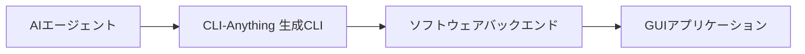
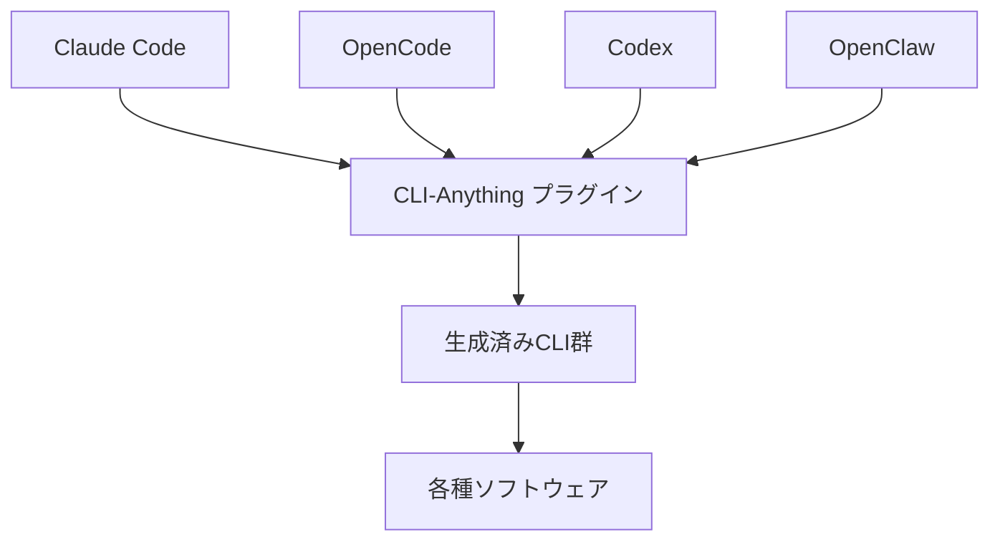
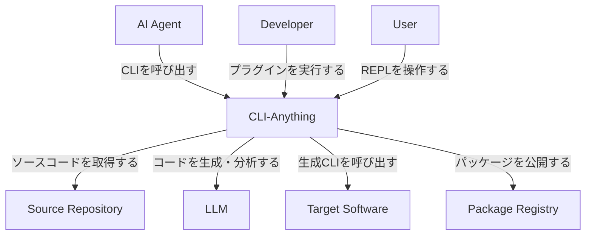
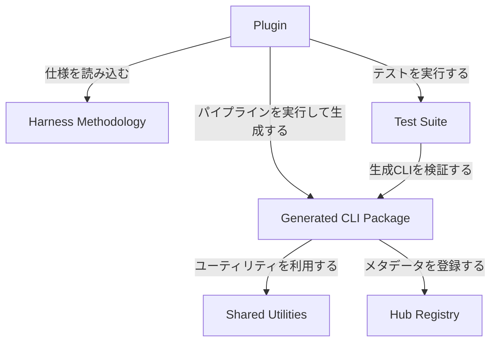
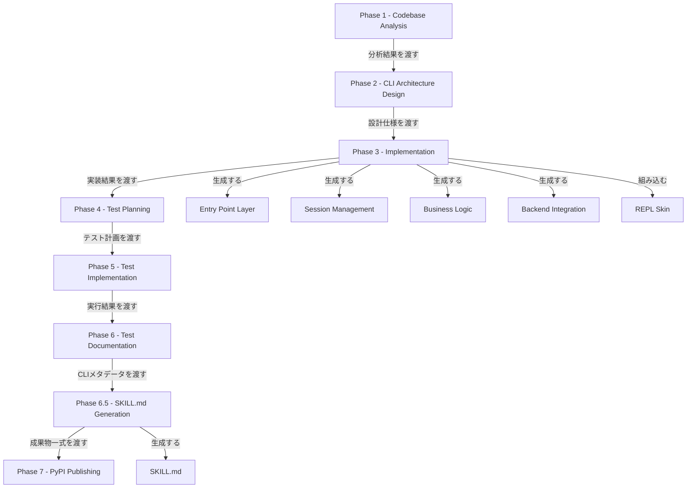
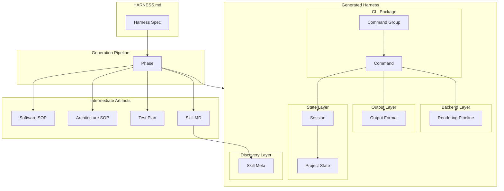
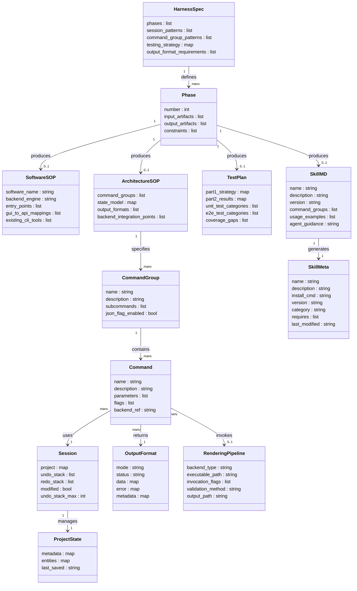
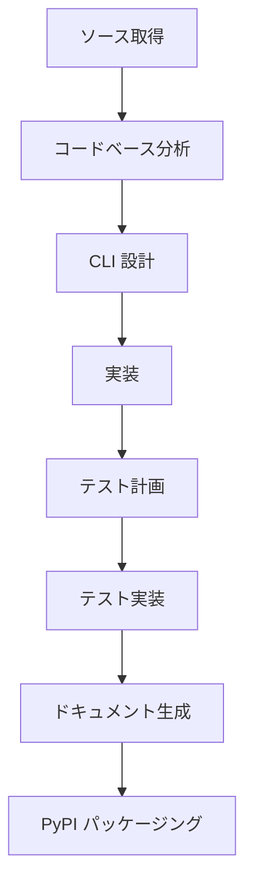

## 概要

CLI-Anything は、香港大学 Data Intelligence Lab（HKUDS）が開発した、任意のソフトウェアを AI エージェントが操作できるエージェントネイティブな CLI へ自動変換するフレームワークです。

GUI アプリケーションのソースコードまたは GitHub リポジトリ URL を入力として受け取り、7段階の自動パイプラインを経て、インストール可能な Python パッケージを生成します。

:::message
この記事は2026年3月末時点のリポジトリ内容に基づいています。
:::

> **前提条件**: CLI 生成にはソースコードへのアクセスが必要です。クローズドソースソフトウェアには適用できません。生成品質は対象ソフトウェアのコード整理度・ドキュメント量に依存します。

AI エージェントはテキスト推論に優れる一方、プロフェッショナルな GUI ソフトウェアの制御が困難です。従来の UI 自動化（スクリーンショット座標クリック）や API 再実装は、脆弱性・機能不足・保守負担の問題を抱えています。

CLI-Anything は、ソフトウェアの実バックエンド（GIMP の Script-Fu、Blender の Python API など）を直接呼び出す CLI ラッパーを生成し、この課題を解決します。



| 要素名                   | 説明                                              |
| ------------------------ | ------------------------------------------------- |
| AIエージェント           | Claude Code、OpenCode 等の AI エージェント        |
| CLI-Anything 生成CLI     | 自動生成された Python パッケージ（JSON 出力対応） |
| ソフトウェアバックエンド | Script-Fu、Python API、subprocess 等の実エンジン  |
| GUIアプリケーション      | GIMP、Blender などの対象ソフトウェア              |

### 関連技術との関係

CLI-Anything は AI エージェントプラットフォームのプラグインとして動作します。Claude Code や OpenCode が生成コマンドを実行し、CLI-Anything が対象ソフトウェアの CLI を自動生成します。



| 要素名                  | 説明                                                                       |
| ----------------------- | -------------------------------------------------------------------------- |
| Claude Code             | Anthropic の公式 CLI。マーケットプレイス経由でプラグインをインストール     |
| OpenCode                | オープンソースの AI コーディングエージェント。スラッシュコマンド経由で利用 |
| Codex                   | OpenAI の CLI エージェント。バンドルスキル経由で利用                       |
| OpenClaw                | ネイティブスキルとして統合                                                 |
| CLI-Anything プラグイン | コードベース分析から生成までを担当するコアフレームワーク                   |
| 生成済みCLI群           | 各ソフトウェア向けに生成された Python パッケージ                           |
| 各種ソフトウェア        | GIMP、Blender 等の対象ソフトウェア                                         |

## 特徴

- **エージェントネイティブ設計**: 全コマンドで `--json` フラグをサポートし、構造化データをエージェントに返す
- **ステートフルセッション管理**: 最大50レベルの undo/redo スタック、プロジェクト永続化、変更追跡
- **デュアルインタラクションモード**: REPL モード（対話型）とスクリプトモード（機械可読出力）の両方に対応
- **実バックエンド統合**: subprocess または REST API 経由で実際のソフトウェアを呼び出し、機能の再実装は行わない
- **自動 SKILL.md 生成**: AI エージェントが CLI の機能を自動発見・理解できるメタデータを生成
- **7段階自動パイプライン**: ソース取得から PyPI 公開まで全工程を自動化
- **CLI-Hub**: 生成済み CLI をエージェントが発見・インストールできるマーケットプレイス

### 対応アプリケーション - 16種類

| カテゴリ   | アプリケーション      |
| ---------- | --------------------- |
| 画像編集   | GIMP、Krita、Inkscape |
| 3D・CAD    | Blender、FreeCAD      |
| 動画編集   | Kdenlive、Shotcut     |
| 音声編集   | Audacity、MuseScore   |
| ライブ配信 | OBS Studio            |
| オフィス   | LibreOffice           |
| 図表作成   | Draw.io、Mermaid      |
| ビデオ会議 | Zoom                  |
| AI推論     | ComfyUI、Ollama       |

### 類似ツールとの比較

| 比較項目           | CLI-Anything                       | Computer-Use - UI自動化           | MCP - API統合           |
| ------------------ | ---------------------------------- | --------------------------------- | ----------------------- |
| 実行方式           | CLI 経由でバックエンド直接呼び出し | スクリーンショット + 座標クリック | REST API / SDK ラッパー |
| リソース消費       | 低（テキストコマンドのみ）         | 高（画面キャプチャ、Vision 処理） | 低〜中                  |
| 対応機能           | フル機能（ソースコード分析ベース） | 画面に表示される機能のみ          | API 公開機能のみ        |
| 対応ソフトウェア数 | 任意（自動生成）                   | GUI があれば全て                  | API があれば全て        |
| 実装の信頼性       | 高（実バックエンド統合）           | 低（UI 変更で壊れる）             | 中（API 変更で壊れる）  |
| GUI依存            | なし                               | あり                              | なし                    |
| 自動生成           | あり                               | なし                              | なし                    |

### ユースケース別推奨

| ユースケース                     | 推奨アプローチ | 理由                                           |
| -------------------------------- | -------------- | ---------------------------------------------- |
| GUI のみのデスクトップアプリ制御 | CLI-Anything   | API なし・GUI 自動化不要でバックエンド直接統合 |
| Web サービス・SaaS 連携          | MCP            | REST API が整備されているため                  |
| 既存 CLI ツールの拡張            | CLI-Anything   | CLI 上に追加 CLI を生成して統合可能            |
| レガシーアプリの一時的な自動化   | Computer-Use   | ソースコード非公開の場合の代替手段             |
| 大規模ワークフロー自動化         | CLI-Anything   | 100% パス率のテストスイートで信頼性を担保      |

### アプリケーション別の対応状況と制約

| アプリケーション | バックエンド方式                     | テスト数                   | 既知の制約                                        |
| ---------------- | ------------------------------------ | -------------------------- | ------------------------------------------------- |
| GIMP             | Script-Fu console - subprocess       | 107件（unit 64 + e2e 43）  | バッチモード限定、GUI ダイアログ不可              |
| Blender          | Python API - bpy - background モード | 208件（unit 150 + e2e 58） | `--background` フラグ必須                         |
| Inkscape         | `--actions` CLI フラグ - subprocess  | 202件（unit 148 + e2e 54） | CLI アクション構文に準拠                          |
| OBS Studio       | WebSocket v5 API                     | 153件（unit 116 + e2e 37） | OBS 起動中のみ操作可能                            |
| LibreOffice      | UNO API - headless subprocess        | -                          | headless モード必須                               |
| Kdenlive         | XML プロジェクトファイル操作         | -                          | MLT フレームワーク経由                            |
| Shotcut          | MLT XML 操作                         | -                          | ワンショットモードでの変更保持に注意（Issue #14） |
| Audacity         | mod-script-pipe / macros             | -                          | パイプ接続の設定が必要                            |
| Krita            | libkis Python API                    | -                          | バッチモードでの起動が必要                        |
| FreeCAD          | FreeCAD Python API                   | -                          | GUI なしモードで実行                              |
| MuseScore        | XML スコアファイル操作               | -                          | MusicXML フォーマット経由                         |
| Draw.io          | XML ダイアグラムファイル操作         | -                          | ファイルシステム経由                              |
| Mermaid          | CLI レンダラー - subprocess          | -                          | Node.js ランタイム必要                            |
| Zoom             | プラットフォーム固有 API             | -                          | AppleScript / AutoHotKey 経由、実験的             |
| ComfyUI          | REST API - localhost                 | -                          | ComfyUI サーバー起動中のみ                        |
| Ollama           | REST API - localhost:11434           | -                          | Ollama サーバー起動中のみ                         |

### テスト実績

2,005件のテストで100%パス率を達成しています。

| テスト種別     | 件数        |
| -------------- | ----------- |
| ユニットテスト | 1,453件     |
| E2Eテスト      | 533件       |
| Node.jsテスト  | 19件        |
| **合計**       | **2,005件** |

## 構造

### システムコンテキスト図



| 要素名            | 説明                                                                     |
| ----------------- | ------------------------------------------------------------------------ |
| AI Agent          | 生成された CLI を通じてソフトウェアを自律操作するエージェント            |
| Developer         | プラグインコマンドを実行して CLI ハーネスを生成する開発者                |
| User              | 生成された REPL インターフェースを対話的に操作するユーザー               |
| CLI-Anything      | GUI ソフトウェアをエージェントネイティブな CLI へ自動変換するシステム    |
| Source Repository | 変換対象ソフトウェアのソースコードを格納するリポジトリ                   |
| LLM               | コードベース分析・設計・実装を担う LLM バックエンド                      |
| Target Software   | 変換対象の GUI アプリケーション。生成 CLI から実行バイナリとして呼び出す |
| Package Registry  | 生成された CLI パッケージを配布する PyPI 等のパッケージレジストリ        |

### コンテナ図



| 要素名                | 説明                                                                                 |
| --------------------- | ------------------------------------------------------------------------------------ |
| Plugin                | Claude Code 等のプラットフォーム上で動作するプラグイン。コマンドのエントリーポイント |
| Harness Methodology   | 7フェーズパイプラインの標準手順を定義する仕様ドキュメント（HARNESS.md）              |
| Generated CLI Package | 生成されたソフトウェア固有の CLI パッケージ。PyPI へ公開可能な名前空間パッケージ     |
| Test Suite            | 生成 CLI の品質を保証するユニットテストおよび E2E テスト群                           |
| Hub Registry          | 生成 CLI 群のメタデータカタログ。エージェントが利用可能な CLI 一覧を管理             |
| Shared Utilities      | 複数の生成 CLI が共通利用する REPL スキンおよびスキル生成ツール                      |

### コンポーネント図



| 要素名                            | 説明                                                                                       |
| --------------------------------- | ------------------------------------------------------------------------------------------ |
| Phase 1 - Codebase Analysis       | バックエンドエンジン・データモデル・GUI-API マッピングを解析して SOP ドキュメントを生成    |
| Phase 2 - CLI Architecture Design | コマンドグループ・状態モデル・出力フォーマット・レンダリングパイプラインを設計             |
| Phase 3 - Implementation          | Click ベースのサブコマンドとフォールバック付き REPL モードを実装                           |
| Phase 4 - Test Planning           | TEST.md にユニットテスト・E2E テストの計画を記述                                           |
| Phase 5 - Test Implementation     | TEST.md の計画に基づきテストコードを実装・実行                                             |
| Phase 6 - Test Documentation      | pytest 実行結果を TEST.md に追記してテスト記録を完成                                       |
| Phase 6.5 - SKILL.md Generation   | skill_generator.py と Jinja2 テンプレートで SKILL.md を生成                                |
| Phase 7 - PyPI Publishing         | `find_namespace_packages()` で setup.py を構成し PyPI へ公開                               |
| Entry Point Layer                 | Click コマンドグループ・`--json` フラグ・REPL/ワンショットモード振り分け                   |
| Session Management                | 50段階の undo/redo スタックと JSON セッションファイルによる状態永続化                      |
| Business Logic                    | ソフトウェア固有のプロジェクト・レイヤー・フィルター・トラック操作ロジック                 |
| Backend Integration               | shutil.which による実行バイナリ検索と subprocess 呼び出しで実ソフトウェアを呼び出す        |
| REPL Skin                         | prompt_toolkit を用いたブランド化 REPL インターフェース                                    |
| SKILL.md                          | CLI の能力・コマンド・使用例を YAML フロントマター付きで記述するエージェント発見用ファイル |

### 生成されるハーネスのディレクトリ構成

```
agent-harness/
├── setup.py                          # 名前空間パッケージ設定
├── cli_anything/
│   └── <software>/                   # 名前空間パッケージ
│       ├── __init__.py
│       ├── __main__.py               # python -m エントリーポイント
│       ├── <software>_cli.py         # Click コマンドグループ定義
│       ├── README.md
│       ├── core/
│       │   ├── project.py            # create/open/save 操作
│       │   ├── session.py            # undo/redo 状態管理
│       │   └── <domain>.py           # ドメイン固有ロジック
│       ├── utils/
│       │   ├── <software>_backend.py # subprocess/REST/API 統合
│       │   └── repl_skin.py          # REPL スタイリング
│       ├── skills/
│       │   └── SKILL.md              # AI エージェント向けメタデータ
│       └── tests/
│           ├── test_core.py          # ユニットテスト
│           ├── test_full_e2e.py      # E2E テスト
│           └── test_<software>_backend.py  # バックエンドテスト
```

### Click コマンドグループの実装パターン

```python
import click
import json as json_module
from .core.session import Session

@click.group()
@click.option('--json', 'json_output', is_flag=True, help='JSON output')
@click.option('--project', default=None, help='Project file path')
@click.pass_context
def cli(ctx, json_output, project):
    """Main entry point"""
    ctx.obj = {'json': json_output, 'session': Session(project)}

@cli.group()
def project():
    """プロジェクト管理コマンド群"""
    pass

@project.command()
@click.option('--name', required=True)
@click.pass_context
def create(ctx, name):
    """新規プロジェクト作成"""
    ctx.obj['session'].snapshot('create project')
    result = {"project_name": name, "created": True}
    if ctx.obj['json']:
        click.echo(json_module.dumps({"status": "ok", "data": result}))
    else:
        click.echo(f"Project '{name}' created.")
```

### Session クラスの実装パターン

```python
import copy

class Session:
    def __init__(self, project_path=None):
        self._undo_stack = []       # 最大50スナップショット
        self._redo_stack = []
        self.project = {}           # インメモリ状態
        self.modified = False

    def snapshot(self, description):
        """変更前の状態をキャプチャ"""
        self._undo_stack.append(copy.deepcopy(self.project))
        self._redo_stack.clear()
        if len(self._undo_stack) > 50:
            self._undo_stack.pop(0)

    def undo(self):
        """直前の操作を取り消す"""
        if self._undo_stack:
            self._redo_stack.append(self.project)
            self.project = self._undo_stack.pop()
            self.modified = True
            return "Undone"
        return "Nothing to undo"
```

### バックエンド統合パターン

3つの統合パターンがあります。

**subprocess パターン（Blender、GIMP 等）:**

```python
import shutil
import subprocess

def find_software():
    path = shutil.which('blender')
    if not path:
        raise RuntimeError("Blender not found in PATH")
    return path

def render(project_file, output_path):
    result = subprocess.run(
        [find_software(), '--background', project_file,
         '--python-expr', 'import bpy; bpy.ops.render.render(write_still=True)'],
        capture_output=True
    )
    return result.returncode == 0
```

**REST API パターン（Ollama、ComfyUI 等）:**

```python
import requests

class OllamaClient:
    def __init__(self, host='localhost', port=11434):
        self.base_url = f"http://{host}:{port}"

    def generate(self, model, prompt):
        response = requests.post(
            f"{self.base_url}/api/generate",
            json={"model": model, "prompt": prompt}
        )
        return response.json()
```

**XML 操作パターン（Kdenlive、MuseScore 等）:**

```python
import xml.etree.ElementTree as ET

def add_track(project_path, track_name):
    tree = ET.parse(project_path)
    root = tree.getroot()
    tracks = root.find('.//tracks')
    new_track = ET.SubElement(tracks, 'track')
    new_track.set('name', track_name)
    tree.write(project_path)
```

## データ

### 概念モデル



| 要素名              | 説明                                                                 |
| ------------------- | -------------------------------------------------------------------- |
| HARNESS.md          | ハーネス生成全体の標準仕様。全フェーズの方法論・規約を定義           |
| Harness Spec        | HARNESS.md が保持する仕様エンティティ                                |
| Generation Pipeline | CLI 生成の7フェーズからなる処理パイプライン                          |
| Phase               | パイプラインの各実行段階                                             |
| Software SOP        | フェーズ1が出力するソフトウェア固有の分析ドキュメント（例: GIMP.md） |
| Architecture SOP    | フェーズ2が出力する CLI 設計ドキュメント                             |
| Test Plan           | フェーズ4・6が出力するテスト計画と実行結果ドキュメント（TEST.md）    |
| Skill MD            | フェーズ6.5が出力する AI エージェント向けスキル定義（SKILL.md）      |
| Generated Harness   | 生成される CLI パッケージ全体                                        |
| CLI Package         | Click ベースのコマンド実装パッケージ                                 |
| Command Group       | ドメインでまとめたコマンドの集合                                     |
| Command             | 個別の CLI 操作                                                      |
| State Layer         | セッションおよびプロジェクト状態の管理層                             |
| Session             | undo/redo スタックを含む状態管理クラス                               |
| Project State       | メモリ上のプロジェクトデータ表現                                     |
| Output Layer        | コマンド出力形式の定義層                                             |
| Output Format       | JSON / Human の出力モード定義                                        |
| Backend Layer       | 実ソフトウェアとのインテグレーション層                               |
| Rendering Pipeline  | ソフトウェアバックエンドへの実行パイプライン                         |
| Discovery Layer     | AI エージェントへのスキル公開層                                      |
| Skill Meta          | CLI-Anything Hub のレジストリに登録される CLI のメタデータ           |

### 情報モデル



| 要素名            | 説明                                                                         |
| ----------------- | ---------------------------------------------------------------------------- |
| HarnessSpec       | HARNESS.md が定義する仕様。生成パイプライン全体の規約を保持                  |
| Phase             | パイプラインの1フェーズ。入力・出力アーティファクトと制約を持つ              |
| SoftwareSOP       | フェーズ1の出力。対象ソフトウェアのバックエンド構造と API 分析結果           |
| ArchitectureSOP   | フェーズ2の出力。コマンドグループ設計と状態モデルの仕様                      |
| TestPlan          | TEST.md に対応するドキュメント。テスト戦略（Part1）と実行結果（Part2）を保持 |
| SkillMD           | SKILL.md に対応するドキュメント。AI エージェント向けのスキル定義を保持       |
| CommandGroup      | 論理ドメイン単位でまとめたコマンドの集合（例: project, layer, export）       |
| Command           | Click デコレータで実装される個別 CLI 操作。JSON 出力フラグを持つ             |
| Session           | undo/redo スタックと変更フラグを持つ状態管理クラス。最大50スナップショット   |
| ProjectState      | インメモリのプロジェクトデータ。JSON でディスクに永続化                      |
| OutputFormat      | コマンドの出力形式定義。JSON モードと Human モードの2種類                    |
| RenderingPipeline | 実ソフトウェアへの実行統合層。subprocess / REST / filesystem の3パターン     |
| SkillMeta         | CLI-Anything Hub のレジストリに登録される CLI のメタデータ                   |

### OutputFormat の JSON スキーマ例

`--json` フラグを指定した場合の出力例です。

```json
{
  "status": "success",
  "data": {
    "project_id": "proj_123",
    "modified": true,
    "undo_depth": 3,
    "redo_depth": 1
  },
  "errors": [],
  "meta": {
    "timestamp": "2026-03-26T10:30:00Z",
    "command": "project create"
  }
}
```

| フィールド | 型     | 説明                                       |
| ---------- | ------ | ------------------------------------------ |
| status     | string | "success" または "error"                   |
| data       | map    | コマンド実行結果のデータ                   |
| errors     | list   | エラーメッセージのリスト（成功時は空）     |
| meta       | map    | タイムスタンプ、実行コマンド等のメタデータ |

## 構築方法

### 前提条件

| 項目             | 要件                                                                               |
| ---------------- | ---------------------------------------------------------------------------------- |
| Python           | 3.10 以上                                                                          |
| pip              | パッケージインストール用                                                           |
| bash             | コマンド実行環境（Windows は Git for Windows または WSL）                          |
| Pythonライブラリ | `click`、`pytest`                                                                  |
| 対象ソフトウェア | CLI 化するアプリケーション本体（例: GIMP、Blender）                                |
| AI エージェント  | Claude Code、OpenCode 等の AI コーディングエージェント（LLM API キーの設定が必要） |

```bash
pip install click pytest
```

### インストール方法

CLI-Anything は5つのエージェントプラットフォームに対応しています。

| プラットフォーム | インストール手順                                 |
| ---------------- | ------------------------------------------------ |
| Claude Code      | マーケットプレイス経由でプラグインをインストール |
| OpenCode         | コマンドファイルを設定ディレクトリへコピー       |
| OpenClaw         | スキルファイルを設定ディレクトリへコピー         |
| Qodercli         | セットアップスクリプトで登録                     |
| Codex            | インストールスクリプトで登録                     |

#### Claude Code へのインストール

```
/plugin marketplace add HKUDS/CLI-Anything
/plugin install cli-anything
```

#### OpenCode へのインストール

```bash
cp CLI-Anything/opencode-commands/*.md ~/.config/opencode/commands/
```

#### OpenClaw へのインストール

```bash
mkdir -p ~/.openclaw/skills/cli-anything
cp CLI-Anything/openclaw-skill/SKILL.md ~/.openclaw/skills/cli-anything/
```

### 設定ファイルの配置先

| プラットフォーム | 設定ファイルパス                                            |
| ---------------- | ----------------------------------------------------------- |
| Claude Code      | `~/.claude/plugins/cli-anything/.claude-plugin/plugin.json` |
| OpenCode         | `~/.config/opencode/commands/` または `.opencode/commands/` |
| OpenClaw         | `~/.openclaw/skills/cli-anything/SKILL.md`                  |
| Qodercli         | `~/.qoder.json` の `plugins.sources.local`                  |
| Codex            | `$CODEX_HOME/skills/cli-anything/`                          |

## 利用方法

### CLI 生成パイプラインの概要

`/cli-anything` コマンドは以下の7段階パイプラインを自動実行します。



| 要素名              | 説明                                         |
| ------------------- | -------------------------------------------- |
| ソース取得          | GitHub URL 指定時はローカルへクローン        |
| コードベース分析    | アーキテクチャと GUI-API マッピングを解析    |
| CLI 設計            | コマンドグループ・状態モデル・出力形式を設計 |
| 実装                | Click フレームワークで REPL 対応 CLI を生成  |
| テスト計画          | テスト計画書を作成                           |
| テスト実装          | ユニットテスト・E2E テストを実装             |
| ドキュメント生成    | README・SKILL.md・SOP を生成                 |
| PyPI パッケージング | インストール可能な Python パッケージを作成   |

### 主要コマンド一覧

| コマンド                               | 用途                              |
| -------------------------------------- | --------------------------------- |
| `/cli-anything <path-or-url>`          | CLI ハーネスを新規生成            |
| `/cli-anything:refine <path> [focus]`  | 既存 CLI のギャップを分析して拡張 |
| `/cli-anything:test <path-or-url>`     | テストを実行して TEST.md を更新   |
| `/cli-anything:validate <path-or-url>` | HARNESS.md 基準への準拠を検証     |

### CLI ハーネスの生成

対象ソフトウェアのソースコードパスまたは GitHub URL を指定して実行します。

```bash
# ローカルパスを指定
/cli-anything ./gimp

# GitHub URL を指定（自動クローン）
/cli-anything https://github.com/blender/blender
```

| 引数 | 必須 | 説明                                     |
| ---- | ---- | ---------------------------------------- |
| `$1` | 必須 | ローカルパスまたは GitHub リポジトリ URL |

- ソフトウェア名単体は指定できません。ソースコードの場所を指定してください
- GitHub URL を指定した場合は自動的にローカルへクローンしてから処理を開始します
- 生成後、`cli-anything-<software>` という名前で PATH に登録されます

### CLI の拡張 - refine

既存の CLI ハーネスに対してギャップ分析を実行し、不足コマンドを追加します。

```bash
# 全体的なギャップ分析
/cli-anything:refine ./gimp

# フォーカスエリアを指定して絞り込み
/cli-anything:refine ./shotcut "batch processing and filters"
```

| 引数 | 必須 | 説明                                             |
| ---- | ---- | ------------------------------------------------ |
| `$1` | 必須 | 元のビルドで使用したソースツリーのパス           |
| `$2` | 任意 | 特定機能領域を自然言語で記述（例: "ビデオ処理"） |

### テストの実行

テストスイートを実行し、結果を TEST.md に記録します。

```bash
/cli-anything:test ./inkscape
```

- `pytest -v -s --tb=short` オプションで実行します
- テスト失敗時は TEST.md を更新せず、以前の結果を保持します

### ハーネスの検証 - validate

HARNESS.md の基準への準拠を8カテゴリで検証します。

```bash
/cli-anything:validate ./audacity
```

| 検証カテゴリ            | 確認内容                                            |
| ----------------------- | --------------------------------------------------- |
| ディレクトリ構造        | 名前空間パッケージの正しい配置                      |
| 必須ファイル            | README.md・CLI エントリーポイント・テストファイル等 |
| CLI 実装基準            | Click フレームワーク・`--json`・`--project` フラグ  |
| コアモジュール基準      | project.py・session.py・export.py の機能要件        |
| テスト基準              | TEST.md・ユニットテスト・E2E テスト・100% パス率    |
| ドキュメント基準        | README・SOP ドキュメント                            |
| PyPI パッケージング基準 | setup.py・パッケージ命名規則・エントリーポイント    |
| コード品質              | 構文エラーなし・PEP 8 準拠                          |

### 生成された CLI の使い方

生成後の CLI は2つのモードで利用できます。

```bash
# 対話モード（REPL 起動）
cli-anything-gimp

# ワンショットモード
cli-anything-gimp image create --width 1920 --json
```

| モード             | 説明                                            |
| ------------------ | ----------------------------------------------- |
| 対話モード         | コマンドなしで起動し、REPL で複数ステップを実行 |
| ワンショットモード | 直接コマンドを指定して実行                      |

| オプション  | 説明                             |
| ----------- | -------------------------------- |
| `--json`    | 機械可読な JSON 形式で出力       |
| `--project` | プロジェクトファイルのパスを指定 |

### pip によるローカルインストール

生成されたパッケージはローカルに `pip install` できます。

```bash
cd gimp/agent-harness
pip install -e .
```

### エンドツーエンドの実行例 - GIMP で画像操作

CLI ハーネスの生成からインストール、実行までの一連の流れです。

```bash
# 1. GIMP の CLI ハーネスを生成
/cli-anything https://github.com/GNOME/gimp

# 2. 生成されたハーネスをローカルにインストール
cd gimp/agent-harness
pip install -e .

# 3. ワンショットモードで画像を開いて JSON 出力を確認
cli-anything-gimp image load --path ./photo.jpg --json
# => {"status": "success", "data": {"image_id": 1, "width": 3024, "height": 4032}, ...}

# 4. 画像をリサイズ
cli-anything-gimp image scale --image-id 1 --width 1920 --json
# => {"status": "success", "data": {"image_id": 1, "width": 1920, "height": 2560}, ...}

# 5. REPL モードで対話的に操作
cli-anything-gimp
> project open --path ./photo.xcf
> layer list --json
> undo
> exit
```

### PyPI への公開

```bash
cd gimp/agent-harness
pip install build twine
python -m build
twine upload dist/*
```

## 運用

### 運用コマンド概要

稼働中の CLI ハーネスを維持・改善するためのコマンドは3つです。

| コマンド                 | 目的                           | 実行タイミング          |
| ------------------------ | ------------------------------ | ----------------------- |
| `/cli-anything:refine`   | カバレッジのギャップ分析と拡張 | 機能追加・不足発覚時    |
| `/cli-anything:test`     | テスト実行と TEST.md 更新      | 変更後・リリース前      |
| `/cli-anything:validate` | HARNESS.md 準拠チェック        | PR 前・定期メンテナンス |

### refine によるギャップ分析と改善

refine は以下の6ステップで実行されます。

| ステップ | 処理内容                      | 成果物                  |
| -------- | ----------------------------- | ----------------------- |
| 1        | 既存 CLI 機能のインベントリ化 | カバレッジマップ        |
| 2        | ソフトウェア全体の機能分析    | 機能カタログ            |
| 3        | ギャップ分析と優先順位付け    | ギャップレポート        |
| 4        | 新規コマンドの実装            | 拡張 CLI 機能           |
| 5        | テストの追加                  | 100% 合格テストスイート |
| 6        | ドキュメント更新              | README・TEST.md         |

ギャップの優先順位は以下の基準で決定されます。

| 優先度     | 基準                                                       |
| ---------- | ---------------------------------------------------------- |
| 高影響度   | よく使われるが未実装の機能                                 |
| 低難度     | シンプルな API 実装が可能な機能                            |
| 相互運用性 | 既存コマンドと組み合わせて新しいワークフローを実現する機能 |

### テスト実行の手順

テストは以下の手順で進行します。

| 手順 | 処理内容                                                             |
| ---- | -------------------------------------------------------------------- |
| 1    | CLI ハーネスを特定                                                   |
| 2    | pytest を `-v -s --tb=short` フラグで実行                            |
| 3    | テスト出力をキャプチャ                                               |
| 4    | `[_resolve_cli] Using installed command:` がログに含まれることを検証 |
| 5    | TEST.md の「Test Results」セクションに結果を追記                     |

### validate による準拠チェック

検証は8カテゴリで実施されます。検証完了時に各カテゴリの合格数と PASS/FAIL 判定を含むレポートを生成します。

| カテゴリ            | 主な確認内容                                                            |
| ------------------- | ----------------------------------------------------------------------- |
| ディレクトリ構造    | `agent-harness/cli_anything/<software>/` の存在、名前空間パッケージ化   |
| 必須ファイル        | README.md、`<software>_cli.py`、core モジュール群、TEST.md              |
| CLI 実装基準        | Click フレームワーク、`--json` / `--project` フラグ、エラーハンドリング |
| コアモジュール基準  | 各モジュールのメソッド・ドキストリング・型ヒント                        |
| テスト基準          | TEST.md に計画と結果の両方を含む、`_resolve_cli()` の環境変数サポート   |
| ドキュメント基準    | インストール・使用法・コマンド参照・例を含む README.md                  |
| PyPI パッケージ基準 | `cli-anything-<software>` 命名規則、`find_namespace_packages()` 使用    |
| コード品質          | 構文エラーなし、PEP 8 準拠、ハードコードパスなし                        |

## ベストプラクティス

### テスト戦略

4層のテストアーキテクチャを採用しています。

```
test_core.py
├── ユニットテスト（合成データのみ、外部依存なし）
└── 各モジュールの関数単体を検証

test_full_e2e.py
├── E2E ネイティブテスト（プロジェクトファイル生成パイプライン検証）
└── XML 構造・フォーマット整合性を検証

test_<software>_backend.py
├── E2E バックエンドテスト（実ソフトウェアを呼び出す）
└── マジックバイト検証で出力形式の正当性を確認

test_cli_installed.py
└── CLI サブプロセステスト（インストール済みコマンドを実行）
```

出力の検証ではプロセス終了コードのみに依存しません。

| 出力形式                | 検証方法                                         |
| ----------------------- | ------------------------------------------------ |
| PDF                     | `%PDF-` マジックバイトの確認                     |
| OOXML（DOCX/XLSX/PPTX） | ZIP 構造のバリデーション                         |
| 動画・画像              | ピクセルレベルのフレーム解析                     |
| 全形式共通              | アーティファクトパスの出力で手動検査を可能にする |

### HARNESS.md 準拠

- リファイン・テスト・バリデーション前に必ず HARNESS.md を読みます
- 既存のアーキテクチャパターン（Click コマンドグループ・JSON サポート・セッション管理・エラーハンドリング）に準拠します

### コントリビューション手順

コントリビューションの種類は3つです。

| 種類                     | 手順                                                                                          |
| ------------------------ | --------------------------------------------------------------------------------------------- |
| 新しいソフトウェア用 CLI | アーキテクチャ文書・SKILL.md・テスト・registry.json エントリ・repl_skin.py をセットで PR 提出 |
| 新機能                   | 先に issue を開いて議論し、承認後に実装                                                       |
| バグ修正                 | 関連 issue を参照し、テストで再現を確認してから PR 提出                                       |

PR 提出フローです。

```
1. main からフィーチャーブランチを作成
2. コーディング規約（PEP 8・型ヒント・全コマンドに --json フラグ）を遵守
3. すべてのテストの合格を確認
4. PR テンプレートを完全記入して main へ PR を作成
```

コミットメッセージは conventional commits 形式を使用します。

```bash
# 例
feat: Krita CLI ハーネス追加
fix: LibreOffice export マジックバイト検証を修正
```

### CI/CD 連携

| ワークフロー           | トリガー          | 内容                                  |
| ---------------------- | ----------------- | ------------------------------------- |
| Deploy to GitHub Pages | main へのプッシュ | ハブサイトの自動デプロイ（30〜50秒）  |
| Copilot code review    | PR 作成           | AI による自動コードレビュー（4〜6分） |

ローカルでのテスト実行コマンドです。

```bash
cd <software>/agent-harness
pip install -e .
python3 -m pytest cli_anything/<software>/tests/ -v
```

## トラブルシューティング

| 症状                                             | 原因                                                                                                              | 対処                                                                                                                  |
| ------------------------------------------------ | ----------------------------------------------------------------------------------------------------------------- | --------------------------------------------------------------------------------------------------------------------- |
| Windows 環境で `cygpath: command not found`      | bash が Cygwin の `cygpath` コマンドを参照しようとするが、環境に存在しない                                        | Git Bash を使用する場合は Cygwin を別途インストールするか、WSL 環境に切り替える                                       |
| ワンショットモードで変更が保持されない           | 各コマンド呼び出しが別プロセスを生成し、Session オブジェクトが毎回初期化される                                    | REPL モードを使用する。または、セッション終了時の自動保存コールバックフックを実装する（Issue #14・PR #15 で対応済み） |
| テストがインストール済みコマンドを解決できない   | `_resolve_cli()` が環境変数 `CLI_ANYTHING_FORCE_INSTALLED` を参照できていない                                     | 環境変数を明示的に設定して再実行する：`CLI_ANYTHING_FORCE_INSTALLED=1 pytest`                                         |
| validate が PyPI パッケージ基準で FAIL           | パッケージ名が `cli-anything-<software>` 命名規則に準拠していないか、`find_namespace_packages()` を使用していない | `setup.py` または `pyproject.toml` のパッケージ名とパッケージ検索設定を修正する                                       |
| ソースコードのみでは CLI 生成精度が低い          | CLI の README や開発文書がない場合、LLM がインターフェースを正確に推測できない                                    | 対象ソフトウェアの公式ドキュメントまたは使用ガイドを refine の焦点領域として補完する                                  |
| E2E バックエンドテストがマジックバイト検証で失敗 | CLI が実ソフトウェアを呼び出さず、Python でファイルを生成・再実装している（アンチパターン）                       | バックエンドモジュールを通じて実ソフトウェアの CLI を呼び出す実装に修正する                                           |

## まとめ

CLI-Anything は、GUI ソフトウェアのソースコードを分析し、実バックエンドを直接呼び出すエージェントネイティブな CLI を7フェーズで自動生成するフレームワークです。16種類のアプリケーションに対応し、2,005件のテストで100%パス率を達成しています。

### 所感

CLI-Anything のアプローチは、AI エージェントによるソフトウェア操作の3つの手段（UI 自動化・API ラッパー・バックエンド直接統合）のうち、最も信頼性の高い「バックエンド直接統合」を自動化する点で画期的です。特に、GIMP の Script-Fu や Blender の bpy のようなソフトウェア固有のバックエンドを LLM で自動解析し、統一的な Click CLI に変換する仕組みは、従来は手動で行っていた統合作業を大幅に省力化します。

一方で、「ソースコードへのアクセスが必須」という制約は実用上の大きなハードルです。商用ソフトウェア（Adobe 製品、Microsoft Office のネイティブ版等）には適用できず、オープンソースソフトウェアに限定されます。また、CLI 生成の品質は LLM のコード理解力に依存するため、ドキュメントが少ないプロジェクトや複雑なアーキテクチャのソフトウェアでは精度の低下が予想されます。

今後、MCP（Model Context Protocol）のような API 統合と CLI-Anything のバックエンド統合を組み合わせることで、より広範なソフトウェアの AI エージェント対応が進むと考えられます。

この記事が少しでも参考になった、あるいは改善点などがあれば、ぜひリアクションやコメント、SNSでのシェアをいただけると励みになります！

## 参考リンク

:::message
調査時点: 2026年3月末。最新の対応状況は [GitHub リポジトリ](https://github.com/HKUDS/CLI-Anything) を参照してください。
:::

- 公式ドキュメント
  - [CLI-Anything Hub](https://hkuds.github.io/CLI-Anything/)
  - [CLI-Anything 公式サイト](https://clianything.net/)
  - [HARNESS.md](https://github.com/HKUDS/CLI-Anything/blob/main/cli-anything-plugin/HARNESS.md)
  - [CONTRIBUTING.md](https://github.com/HKUDS/CLI-Anything/blob/main/CONTRIBUTING.md)
- GitHub
  - [HKUDS/CLI-Anything](https://github.com/HKUDS/CLI-Anything)
  - [cli-anything-plugin README](https://github.com/HKUDS/CLI-Anything/blob/main/cli-anything-plugin/README.md)
  - [cli-anything コマンド定義](https://github.com/HKUDS/CLI-Anything/blob/main/opencode-commands/cli-anything.md)
  - [cli-anything-refine コマンド定義](https://github.com/HKUDS/CLI-Anything/blob/main/opencode-commands/cli-anything-refine.md)
  - [cli-anything-test コマンド定義](https://github.com/HKUDS/CLI-Anything/blob/main/opencode-commands/cli-anything-test.md)
  - [cli-anything-validate コマンド定義](https://github.com/HKUDS/CLI-Anything/blob/main/opencode-commands/cli-anything-validate.md)
  - [Issue #14 - Shotcut ワンショットモードの変更保持問題](https://github.com/HKUDS/CLI-Anything/issues/14)
  - [Issue #57 - Windows cygpath エラー](https://github.com/HKUDS/CLI-Anything/issues/57)
- 記事
  - [CLI-Anything: Make Any Software AI Agent-Ready - AIBit](https://aibit.im/blog/post/cli-anything-make-any-software-ai-agent-ready)
  - [Deep Dive into CLI-Anything - yage.ai](https://yage.ai/share/cli-anything-harness-survey-en-20260316.html)
  - [deepwiki - HKUDS/CLI-Anything](https://deepwiki.com/HKUDS/CLI-Anything)
