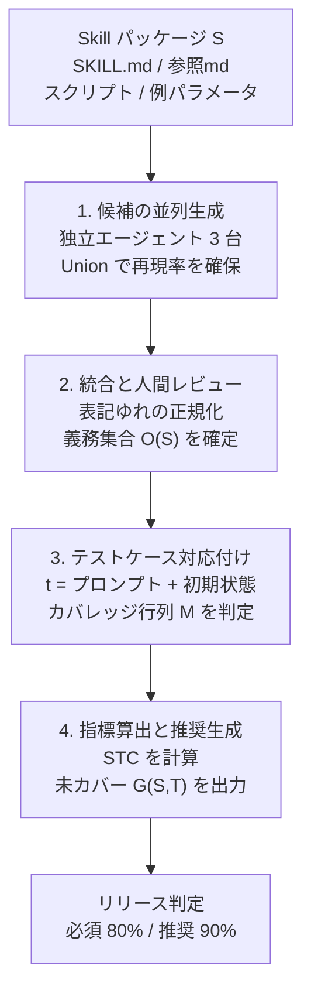
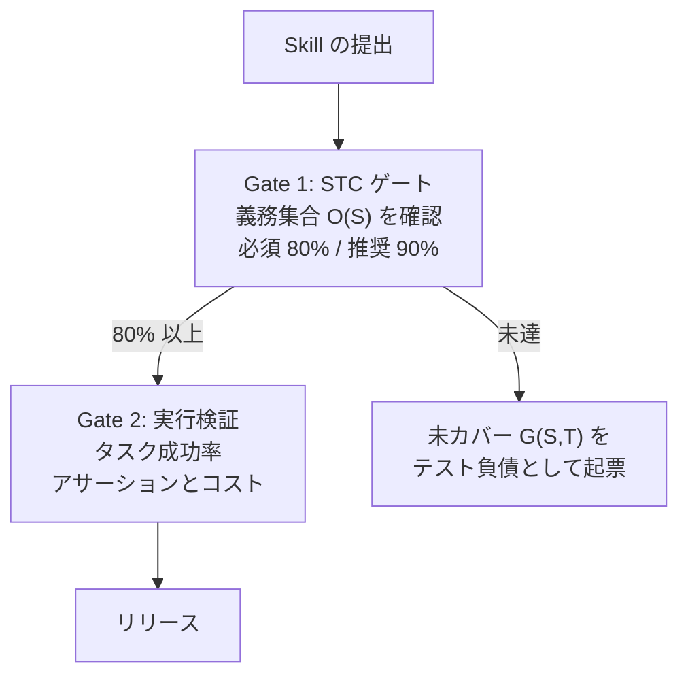

AI Agent に手順を渡す `SKILL.md` 形式のパッケージが、クラウド運用の現場でも普及してきました。一方でその品質確認は「いくつかのプロンプトを流して動いたか」に留まりがちです。

本記事では、Alibaba Cloud などの研究陣による論文 [arXiv:2607.22015](https://arxiv.org/abs/2607.22015) が提唱した指標 **Skill Test Coverage (STC)** を整理します。読み終えると、次の 3 点が持ち帰れます。

- 自然言語で書かれた Skill に対して「テストの分母」をどう定義するか
- 実運用 157 件の Skill を測ったとき、何がどれだけ漏れていたか
- 自分の Agent 評価 CI に、どの粒度でゲートを足せばよいか

## タスク成功率だけでは Skill の穴が見えない

既存の Agent 評価ベンチマーク（SWE-bench、AgentBench など）は、用意された環境でプロンプトを実行し、ゴールに到達したかを測ります。指標は **タスク成功率（Pass Rate）** です。

この測り方には構造的な死角があります。評価は「実行されたパス」しか観測しません。Skill 本文に書かれていても、テストで一度も踏まれなかった分岐は、成功率 100% のレポートの中でも未検証のまま残ります。

クラウド運用の Skill では、この未実行領域が特に厚くなります。

| 本文に書かれるが踏まれにくい手順 | 発動条件の例 |
|---|---|
| 新規リソースの作成分岐 | VPC やサブネットが存在しない初期状態 |
| 事前バリデーション | 権限不足、クォータ超過 |
| 異常時のロールバック | API エラー、タイムアウト |
| ユーザーへの確認・中断 | 破壊的操作の直前 |

論文の問題設定は「Pass Rate が高いのに未検証の運用手順が残る」状態を、**テスト負債**として可視化することにあります。

## STC は「運用テスト義務」を分母にする

STC の中心にあるのは、自然言語の Skill から取り出す監査可能な最小単位です。論文はこれを **運用テスト義務（Operational Test Obligation）** と呼び、4 つ組で定式化しています。

```text
o = (α_o, g_o, q_o, ℓ_o)

α_o : 観測可能なクラウド操作、またはユーザー対話の選択肢
g_o : 発動条件（リソース状態・直前ステータス・ユーザー選択）
q_o : 期待される検証結果
ℓ_o : Skill パッケージ内のソース位置（Provenance）
```

コードのカバレッジで言えば、行カバレッジ（C0）やブランチカバレッジ（C1）に対応する「数えられる単位」を、自然言語ドキュメントに対して用意した形です。`ℓ_o` を持つことで、未カバーの義務が Skill のどの記述に由来するかを常に追跡できます。

Skill `S` から抽出した義務の全集合を `O(S)` とします。これが分母になります。

### テストケースはプロンプト単体ではない

もう 1 つの要点は、テストケースの定義です。STC ではテストケースを次のペアとして扱います。

```text
t = (p, r)

p : ユーザープロンプト
r : 初期リソース状態（VPC の有無・既存設定・権限状態など）
```

同じプロンプトでも、初期状態が違えば発動する義務が変わります。「VPC がある前提」でしか回していないテストスイートは、`r` を固定したまま `p` だけ増やしている状態であり、分岐の網羅には寄与しません。

### カバレッジ判定は「必ず到達する」ことを要求する

テストケース `t_j` に対し、Skill 仕様が許す適合実行トレースの集合を `L_S(t_j)` とします。義務 `o_i` のカバレッジ判定 `M_ij` は次のように定義されます。

```text
M_ij = 1  ⟺  ∀σ ∈ L_S(t_j),  σ ⊨ ◇o_i
```

`◇`（eventually）は「その実行トレースのどこかで `o_i` が達成される」ことを表します。全称量化が付いている点が重要です。**ある 1 回の実行でたまたま踏めた、では 1 と判定されません**。そのプロンプトと初期状態の条件下で必ず到達する場合だけカバー扱いになります。LLM の非決定性を前提に、フレーキーな「たまたま通った」をカバレッジから排除する設計です。

STC はこの行列を義務側に射影した比率です。

```text
STC(S, T) = |∪_j { o_i ∈ O(S) | M_ij = 1 }| / |O(S)|
```

未カバー義務の集合 `G(S, T) = O(S) \ カバー済み義務` が、そのまま改善作業のワークリストになります。

## 測定パイプラインは LLM 抽出と人間レビューのハイブリッド

論文が提示する測定手順は 4 段です。



段階 1 では Qwen3.7-Max を載せた 3 つの独立エージェントが、パッケージ内の全ファイルを観察・分析しながら義務候補を並列抽出します。結果は Union で束ねます。再現率を優先しつつ、エージェント間で食い違った箇所を「解釈が割れている記述」として表面化させる狙いです。

段階 2 で人間レビュアーが入ります。LLM 単体では「単なる背景説明や API リファレンス」と「運用義務」を分離しきれず、義務の過剰分割や取りこぼしが起きるためです。最終的な `O(S)` と `M_ij` は人間が承認します。

段階 4 では、未カバー義務ごとに「どの初期状態を追加すべきか」「どのプロンプトを直すべきか」という改善案を、`ℓ_o` に紐付けた形で生成します。

## 157 件の実測で、3 分の 1 がゲート未達だった

Alibaba Cloud のリリース前開発現場で、実用 Cloud Skills 157 件を初回計測した結果です。

| 指標 | 値（157 件） |
|---|---|
| 平均カバレッジ | 80.3% |
| 中央値 | 91.3% |
| 四分位範囲 | 68.0% 〜 100.0% |
| 10 パーセンタイル | 39.4% |
| STC = 100% 達成 | 42.7%（67 件） |
| 必須ゲート STC ≥ 80% 通過 | 63.7%（100 件）→ **36.3%（57 件）が不合格** |
| 推奨水準 STC ≥ 90% 達成 | 51.6%（81 件）→ 48.4%（76 件）が未達 |

中央値 91.3% だけを見れば健全に見えます。しかし 10 パーセンタイルが 39.4% で、分布は下方向に重いテールを持ちます。**平均と中央値の乖離（80.3% と 91.3%）が、少数の極端に薄い Skill が全体を引き下げている構造をそのまま示しています**。

つまり「いくつかのプロンプトを通しただけ」の状態では、全体の 3 分の 1 以上がテスト不十分なまま本番に出ようとしていました。

### 改善アクションの量も測れる

未カバー義務から生成された改善レポート（132 件対象）の内訳です。

| 指標 | 値 |
|---|---|
| 総推奨件数 | 639 件 |
| 1 Skill あたり平均 | 4.84 件 |
| 1 Skill あたり中央値 | 4.0 件 |
| 四分位範囲 | 3 〜 6 件 |
| 最大 | 17 件 |

ここが STC の実用上の勘所です。出力が「80% 未満なので不合格」というスカラー値で終わらず、「VPC 無しの初期状態でテストケースを作れ」「障害時のセキュリティグループ削除手順を検証しろ」といった着手可能な単位に分解されています。テスト負債が件数で数えられるため、スプリントに載せられます。

## 導入前に押さえる 4 つの限界

強力な指標ですが、万能ではありません。論文自身が主張の境界を明示しています。

### 1. カバレッジは正しさではない

STC が測るのは網羅性だけです。義務 `o_i` がカバー済みでも、Agent が誤ったパラメータを渡す、ハルシネーションで指示を無視する、タイムアウトする、といったリスクは残ります。

STC は「構造ゲート」として使い、タスク成功率や実行ログのアサーション検証という「実効ゲート」と併用する前提です。

### 2. 人間レビューがボトルネックになる

`O(S)` と `M_ij` の確定に人手が必要です。完全無人の CI として回すことは、少なくとも初回計測では想定されていません。レビュー UI の設計と初期コストの見積もりが導入条件になります。

### 3. 初期リソース状態は組合せ爆発する

リソースの有無、ネットワークトポロジ、IAM 権限、既存のエラー状態。`r` の全組合せを用意することは不可能です。リソース有無とエラー回復のような影響度の高い分岐に絞り、モックやサンドボックスで優先的にプロビジョニングする運用が現実解になります。

### 4. 記述が雑なほどスコアが上がる逆インセンティブ

これが最も注意すべき点です。`SKILL.md` に「ECS を起動する」と 1 行だけ書けば `|O(S)|` は小さくなり、カバレッジは容易に高くなります。逆に例外手順まで丁寧に書いた高品質な Skill ほど、未テスト領域が多く算出されます。

**STC を単独の KPI にすると、ドキュメントを薄くする方向に力が働きます**。前提・手順・検証・回復といった必須節を持つ記述フォーマットを先に標準化し、`|O(S)|` の水準そのものをレビュー対象に含める必要があります。

## 自分の Agent 評価 CI にどう入れるか

ここからは、自分の Skill 運用に落とすときの設計指針です。

### 管理単位を「プロンプト数」から「義務のカバー率」へ

これまでの「5 個のプロンプトで動いたから OK」という根拠を、`O(S)` に対するカバー率に置き換えます。抽出は LLM に任せ、最終承認は開発者が行う分担にします。

### 2 段ゲートにする



Gate 1 が構造、Gate 2 が実効です。順序が逆だと、通ったテストの範囲でしか実行検証できません。

### 更新時は差分だけ測る

Skill は更新され続けます。毎回フル計測すると人間レビューのコストが持ちません。

- **差分測定**: `SKILL.md` やスクリプトが更新されたら、新規に追加された義務 `ΔO(S)` を検知し、既存テストスイートで拾えているかだけを差分チェックする
- **負債の可視化**: 未カバー義務 `G(S, T)` を Issue Tracker（GitHub Issues や Asana）にタスクとして起票し、残数を継続的に追う

差分測定に寄せることで、初回計測の重さを一度きりのコストに閉じ込められます。

## まとめ

- 従来の Agent 評価はタスク成功率に偏り、**Skill 本文に書かれていても一度も踏まれていない運用手順**を検知できない
- STC は自然言語 Skill から運用テスト義務 `o = (α_o, g_o, q_o, ℓ_o)` を抽出し、テストケースを `t = (プロンプト, 初期リソース状態)` として定義することで、監査可能な分母を作る
- カバレッジ判定は「必ず到達する」ことを要求するため、たまたま通った実行はカバー扱いにならない
- Alibaba Cloud の実用 Skill 157 件では、初回計測で 36.3%（57 件）が必須ゲート 80% に未達だった
- 出力は合否スカラーではなく、1 Skill あたり平均 4.84 件の具体的な改善アクションになる
- カバレッジは正しさではない。STC は構造ゲートとして、タスク成功率という実効ゲートと 2 段で組む
- 記述が雑なほどスコアが上がる逆インセンティブがあるため、`SKILL.md` の記述フォーマット標準化とセットで導入する

## 参考リンク

1. Si, H., Chen, J., Yu, S., Nie, R., Li, J., Zhao, J., Li, M., & He, D. (2026). *Are Production Cloud Skills Adequately Tested? Measuring and Governing Skill Test Coverage in Practice.* arXiv preprint arXiv:2607.22015v1 [cs.SE]. https://arxiv.org/abs/2607.22015
2. Hong, D. B., Imani, A., & Ahmed, I. (2026). *From anatomy to smells: an empirical study of SKILL.md in agent skills.* arXiv preprint arXiv:2607.01456.
3. Zhu, H., Hall, P. A., & May, J. H. (1997). *Software unit test coverage and adequacy.* ACM Computing Surveys (CSUR), 29(4), 366-427.
4. Martin-Lopez, A., Segura, S., & Ruiz-Cortés, A. (2019). *Test coverage criteria for RESTful web APIs.* In Proceedings of the 10th ACM SIGSOFT International Workshop on Automating Test Case Design, Selection, and Evaluation (pp. 15-21).
