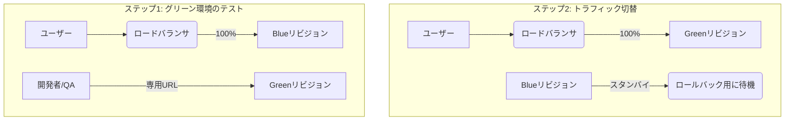
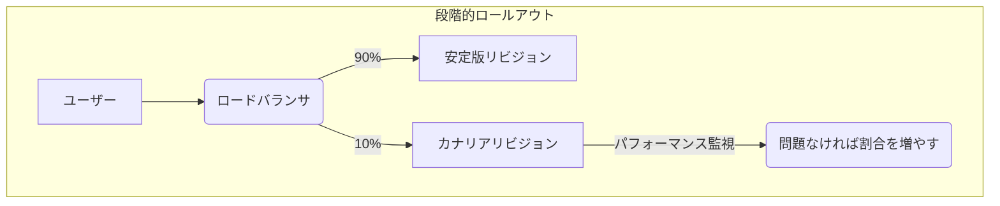
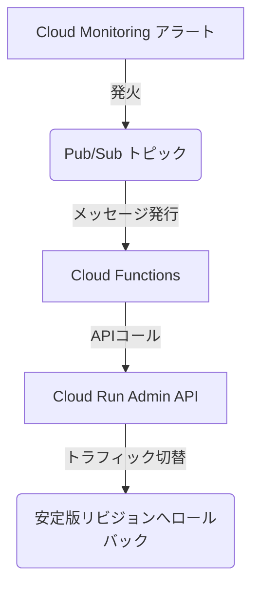

## ■はじめに

Google Cloud Runは、サーバーレスの俊敏性とコンテナの柔軟性を併せ持つ強力なプラットフォームです。しかし、その真価は単にアプリケーションを実行するだけでなく、**高度なデプロイ戦略**を柔軟に実装できる点にあります。

この記事では、Cloud Runで実現できるデプロイ戦略を、技術基盤から具体的な実装、戦略的意思決定までを網羅的に解説します。

  * **Cloud Runデプロイの基本要素**: デプロイの核となる**リビジョン**、**トラフィック分割**、**タグ**の3要素を解説。これらを組み合わせることで、**ブルーグリーンデプロイメント**や**カナリアリリース**といった高度な戦略を構築します。
  * **デプロイ戦略の徹底解説**: 各戦略の特性、メリット・デメリットを掘り下げ、最適なユースケースを提示します。
  * **実践的な実装手法**: `gcloud`コマンドによる手動制御から、Terraform (IaC)、Cloud Deploy、GitHub Actions (CI/CD)まで、具体的なコード例を交えて解説します。
  * **信頼性の確保**: Cloud MonitoringとLoggingを活用したパフォーマンス比較や、アラートを起点とした**自動ロールバック**のアーキテクチャを提案します。

本記事は、あなたのビジネス要件やチームの成熟度に最適なデプロイ戦略を設計し、自動化するための**包括的なガイド**です。この記事を読み終える頃には、自信を持ってCloud Runのデプロイを操れるようになっているでしょう。

## ■第1章 Cloud Runデプロイメントのアーキテクチャ基盤

高度なデプロイ戦略は、Cloud Runの基本的なアーキテクチャ要素の連携によって成り立ちます。ここでは、アプリケーションのライフサイクルを安全かつ柔軟に管理するための根幹的な要素を解説します。

### ●1.1 イミュータブルリビジョン：予測可能なデプロイメントの核

デプロイの基本単位は**リビジョン**です。コンテナイメージや構成を変更してデプロイするたびに、新しいリビジョンが作成されます。

リビジョンの最も重要な特性は**不変性（Immutability）**です。一度作成されたリビジョンは変更できません。この不変性が、デプロイの安全性と予測可能性を担保します。特定のリビジョンは常に同じ構成を指すため、意図しない変更を防ぎ、安定したトラフィックの割り当て先や、信頼できるロールバック先として機能します。

Cloud Runはサービスごとに最大1000個のリビジョンを保持し、上限を超えると古いものから自動的に削除されます。トラフィックを受けないリビジョンはコンピューティングリソースを消費しないため、コストをかけずに過去の安定したリビジョンを迅速なロールバック用に保持できます。

### ●1.2 トラフィック分割：プログレッシブデリバリーのエンジン

**トラフィック分割**は、単一のサービスエンドポイントへのトラフィックを、複数のリビジョン間でパーセンテージに基づいて分割する機能です。例えば、安定版リビジョンに90%、新リビジョンに10%のトラフィックを割り当てる、といった設定が可能です。

この機能は、カナリアリリースやA/Bテストのような段階的なロールアウト戦略を実現する直接的なメカニズムです。トラフィックの割り当ては、コンソール、`gcloud`コマンド、またはサービスのYAMLマニフェストで宣言的に構成できます。

**注意点**: 手動スケーリングを使用する場合、インスタンス数はトラフィックの割合に比例して各リビジョンに割り当てられます。トラフィックを受け取るリビジョンの数よりインスタンス総数が少ないと、一部のリビジョンにインスタンスが割り当てられずエラーになる可能性があるため注意が必要です。

### ●1.3 リビジョンタグ：ダイレクトアクセスとリリース前検証の実現

**リビジョンタグ**は、特定のリビジョンに安定した一意のエイリアス（別名）を付与する機能です。例えば、あるリビジョンに`green`というタグを付けると、`https://green---<サービスURL>`という専用URLが生成されます。このURLへのアクセスは、サービス全体のトラフィック分割ルールを迂回し、直接`green`タグ付きリビジョンにルーティングされます。

#### 主なユースケース

  * **ブルーグリーンデプロイメント**: 新リビジョン（グリーン環境）をトラフィック0%でデプロイし、タグを付与。開発者やQAチームが専用URLで新リビジョンを徹底的にテストできます。この間、本番ユーザーは既存の安定版を利用し続けるため影響はありません。
  * **リリース前の統合テスト**: 本番トラフィックから隔離された状態で、自動化された検証スイートを実行します。

ここで、Google Cloud全体で利用する**リソースタグ**と、Cloud Runの**リビジョンタグ**は異なる機能なので区別しましょう。

| 項目 | **リビジョンタグ (Revision Tag)** | **リソースタグ (Resource Tag)** |
| :--- | :--- | :--- |
| **目的** | トラフィックルーティング、リビジョンの識別 | IAMポリシー制御、課金管理、リソース整理 |
| **対象** | Cloud Runの特定のリビジョン | VMインスタンス、Cloud Storageバケットなど広範なGCPリソース |
| **例** | `green`, `latest-test` | `env:production`, `team:backend` |

#### 基本要素の組み合わせによる戦略構築

Cloud Runには「ブルーグリーンデプロイボタン」のような機能はありません。代わりに、**リビジョン**、**トラフィック分割**、**タグ**という強力な基本要素を提供します。開発者はこれらを組み合わせ、ブルーグリーンやカナリアといった高度なデプロイ戦略を構築します。これは、安全な自動化デプロイメントを実現するには、DevOpsの考え方と、それを支援するCloud BuildやGitHub Actionsといったツールが不可欠であることを意味します。

#### タグとトラフィック分割の相補的関係

リビジョンタグとトラフィック分割は相互補完的な関係にあり、両者を連携させるのが一般的です。

典型的なブルーグリーンデプロイでは、以下の2段階プロセスを踏みます。

1.  `--tag green --no-traffic`オプションで新リビジョンをデプロイし、そのタグ付きURLでテストします。
2.  テスト完了後、`gcloud run services update-traffic`コマンドで、本番トラフィックを`green`**タグ**に対して100%切り替えます。

この「タグでデプロイしてテストし、トラフィック分割で昇格させる」パターンは、安全なリリースを実現する洗練された手法です。

#### タグ付きリビジョンのセキュリティ上の考慮事項

タグ付きリビジョンは、デフォルトで公開URLを生成します。つまり、URLを知っていれば誰でもアクセス可能であり、リリース前の環境においてセキュリティリスクとなり得ます。

このリスクを軽減するには、Cloud Runサービスを外部HTTP(S)ロードバランサーの背後に配置し、**Identity-Aware Proxy (IAP)** でアクセスを保護する方法が有効です。IAPを有効にすれば、特定のGoogleアカウントやサービスアカウントを持つユーザーのみがタグ付きURLにアクセスできるよう、認証・認可のレイヤーを追加できます。

## ■第2章 Cloud Runにおけるデプロイ戦略の分類

第1章で解説した基盤要素をどう組み合わせるかで、デプロイの目的と性質が決まります。ここでは代表的な戦略を分類し、それぞれの方法論、長所、短所、理想的なユースケースを分析します。

### ●2.1 標準デプロイメント：一括切替のベースライン

  * **方法論**: Cloud Runのデフォルト動作。新しいリビジョンをデプロイすると、即座にトラフィックの100%が新リビジョンに切り替わります。「カットオーバーデプロイメント」とも呼ばれます。
  * **長所**: 構成が単純でデプロイが迅速。開発環境やリスクの低い更新に最適。
  * **短所**: リスクが非常に高い。バグがあった場合、全ユーザーが即座に影響を受け、ロールバックには再デプロイが必要。
  * **実装**: `gcloud run deploy`の単純実行、またはコンソールで「このリビジョンをすぐに利用する」を選択。

### ●2.2 ブルーグリーンデプロイメント：ゼロダウンタイム切替による安全性最大化

  * **方法論**: 「ブルー」（現行版）と「グリーン」（新版）の2つの本番環境を並行稼働させます。
    1.  新リビジョン（グリーン）を`green`等のタグを付け、トラフィック0%でデプロイ。
    2.  タグ付きURLでグリーン環境のテストと検証を完了。
    3.  トラフィックをブルーからグリーンへ瞬時に100%切り替え。
    4.  ブルーリビジョンは、即時ロールバック用にスタンバイ状態として保持。

<!-- end list -->



  * **長所**: ダウンタイムを最小化でき、本番と同一環境で徹底的なテストが可能。ほぼ瞬時のロールバックも実現。
  * **短所**: `min-instances > 0` の場合、スタンバイ環境のコストが増加する可能性。デプロイと切替を管理するオーケストレーションが複雑。
  * **実装**: `gcloud run deploy --tag green --no-traffic`でデプロイ後、`gcloud run services update-traffic --to-tags=green=100`で切り替え。

### ●2.3 カナリアリリース：段階的ロールアウトによるリスク最小化

  * **方法論**: 新リビジョン（カナリア）を、まずごく一部のユーザーにのみリリースする手法。KPIを監視しながら、トラフィックを段階的に（例: 1% → 10% → 100%）増やします。

<!-- end list -->



  * **長所**: 問題発生時のユーザーへの影響範囲を限定でき、実トラフィックでパフォーマンスデータを収集可能。
  * **短所**: ロールアウトに時間がかかり、段階的なトラフィック管理が複雑。堅牢なモニタリング体制が不可欠。
  * **実装**: Cloud Runのトラフィック分割機能を利用。`gcloud`コマンドの手動実行、またはCloud DeployやカスタムCI/CDスクリプトで自動化。

### ●2.4 A/Bテスト：データ駆動型機能検証

  * **方法論**: ユーザー行動や機能パフォーマンスを比較するため、2つ以上のリビジョンを長期間並行稼働させる手法。例えば、異なる購入フローを持つリビジョンAとBにトラフィックを50/50で分割し、コンバージョン率を測定します。
  * **長所**: 定量データに基づいた製品の意思決定が可能。ユーザー体験改善に関する仮説を検証できる。
  * **短所**: 慎重な実験計画と分析ツールが必要。複数バージョンを扱うためコードベースが複雑化する可能性。
  * **実装**: Cloud Runのトラフィック分割機能を利用。カナリアリリースとの本質的な違いは、その**意図**（製品の意思決定）と**期間**（数週間以上）にあります。

#### 戦略間の境界と本質

実際の運用では、これらの戦略の境界は曖昧です。重要なのは、用語よりも「隔離テスト」や「トラフィック移行方法」といった根本的な能力で考えることです。また、カナリアやブルーグリーンが安全なコード配信を目指す**運用戦略**であるのに対し、A/Bテストは同じ技術基盤を使いつつ製品の意思決定を目指す**プロダクト戦略**であるという違いも重要です。

#### セッションアフィニティという隠れた複雑性

カナリアリリースやA/Bテストでは、一貫したユーザー体験の提供が重要です。Cloud Runはセッションアフィニティ機能を提供しますが、制約もあります。IPアドレスベースは手軽ですが信頼性が低く、クッキーベースはより正確ですがアプリ側での対応が必要です。この「隠れた複雑性」は、段階的なロールアウト戦略を選択する際には、インフラ構成の変更だけでなく、**アプリケーションレベルのコード変更が必要になる可能性がある**ことを意味します。これは見落とされがちな重要なポイントです。

## ■第3章 実装と自動化：手動制御からGitOpsへ

本章では、各戦略を具体的なツールで実装する手順とコード例を、基本的な制御から高度な自動化へと段階的に解説します。

### ●3.1 基本的な制御：gcloud CLIとGoogle Cloudコンソール

**【このセクションのゴール】**
`gcloud` CLIを使い、Cloud Runデプロイの基本的な手動操作を習得する。学習やデバッグに最適です。

  * **段階的ロールアウト（カナリア）**:
    1.  `gcloud run deploy SERVICE --image IMAGE --no-traffic` でデプロイ。
    2.  `gcloud run services update-traffic SERVICE --to-revisions=LATEST=10` で10%のトラフィックを移行。
    3.  モニタリングしつつ、割合を100%まで引き上げる。
  * **ブルーグリーンデプロイメント**:
    1.  `gcloud run deploy SERVICE --image IMAGE --tag=green --no-traffic` でデプロイ。
    2.  タグ付きURLでテスト。
    3.  `gcloud run services update-traffic SERVICE --to-tags=green=100` でトラフィックを切り替え。
  * **ロールバック**:
      * `gcloud run services update-traffic SERVICE --to-revisions=PREVIOUS_REVISION_ID=100` で安定版リビジョンにトラフィックを戻す。

**表1: デプロイ管理のための主要 gcloud run コマンド**
| コマンド | 説明 | 主要なフラグ |
| :--- | :--- | :--- |
| `gcloud run deploy` | 新リビジョンのデプロイ | `--image`, `--tag`, `--no-traffic` |
| `gcloud run services update-traffic` | トラフィック割り当ての更新 | `--to-revisions`, `--to-tags` |
| `gcloud run revisions list` | リビジョンの一覧表示 | `--service`, `--region` |
| `gcloud run revisions describe` | リビジョンの詳細表示 | `--region` |

### ●3.2 Infrastructure as Code：Terraformによる高度なカナリアデプロイ

**【このセクションのゴール】**
Terraformを使い、宣言的にカナリアデプロイのプロセスを管理するコードパターンを理解する。

Terraformは宣言的なIaCツールですが、手続き的なプロセスを表現するには一工夫必要です。ここでは、`canary_enabled` 変数と `dynamic "traffic"` ブロックを駆使して、この課題を解決する高度なHCLパターンを紹介します。

```hcl
# 変数定義
variable "canary_enabled" {
  description = "カナリアデプロイを有効にするかどうかのスイッチ"
  type        = bool
  default     = false
}
variable "live_image" { /* ... */ }
variable "canary_image" { /* ... */ }
variable "canary_percent" { default = 10 }

# リビジョン名を動的に生成
locals {
  service_name    = "my-canary-service"
  live_rev_name   = "${local.service_name}-live"
  canary_rev_name = "${local.service_name}-canary"
}

# Cloud Runサービスリソース
resource "google_cloud_run_service" "service" {
  name     = local.service_name
  location = "us-central1"
  # このパターンではリビジョン名を明示的に管理するため、自動生成を無効化
  autogenerate_revision_name = false

  template {
    metadata {
      # カナリア有効/無効でリビジョン名を切り替え
      name = var.canary_enabled ? local.canary_rev_name : local.live_rev_name
    }
    spec {
      containers {
        # カナリア有効/無効でコンテナイメージを切り替え
        image = var.canary_enabled ? var.canary_image : var.live_image
      }
    }
  }

  # メインのトラフィックブロック
  traffic {
    percent       = var.canary_enabled ? (100 - var.canary_percent) : 100
    revision_name = local.live_rev_name
  }

  # 動的トラフィックブロック (カナリア有効時のみ生成)
  dynamic "traffic" {
    for_each = var.canary_enabled ? [1] : []
    content {
      percent       = var.canary_percent
      revision_name = local.canary_rev_name
    }
  }

  lifecycle {
    ignore_changes = [
      template[0].metadata[0].name,
    ]
  }
}
```

### ●3.3 マネージドプログレッシブデリバリー：Cloud Deploy

**【このセクションのゴール】**
Google Cloudのマネージドサービスを使い、標準化されたカナリアリリースを実現する方法を知る。

Cloud DeployはGoogle Cloudのマネージドな継続的デリバリーサービスです。複雑なカスタムスクリプトなしで、標準化された堅牢なカナリアリリースを自動化できます。

  * **主要コンポーネント**: **デリバリーパイプライン**（リリースの進行定義）、**ターゲット**（デプロイ先）、**Skaffold**（ビルド・デプロイ方法定義）。
  * **実行フロー**: `gcloud deploy releases create`でリリースを作成すると、Cloud Deployが自動でロールアウトを開始します。その後、コンソールや`gcloud deploy rollouts advance`コマンドで手動承認し、ロールアウトを進行させます。

Cloud Deployは、デプロイプロセスの可視化、制御、標準化といった大きなメリットを提供しますが、その利用にはデリバリーパイプラインやターゲットといった独自の概念を学ぶ必要があります。これは学習コストとトレードオフになります。

### ●3.4 高度なCI/CD：GitHub Actionsによる柔軟なパイプライン

**【このセクションのゴール】**
GitHub Actionsを使い、手動承認を含む柔軟で実践的なCI/CDパイプラインを構築する方法を学ぶ。

GitHub Actionsは非常に柔軟なパイプラインを構築できますが、実装の複雑性は最も高くなります。

#### 手動承認ゲート付きブルーグリーンワークフロー

GitHub Environmentsの **保護ルール（必須レビュー担当者）** を利用して、本番トラフィックの切り替え前に手動承認を挟むワークフローです。

```yaml
name: Blue-Green Deployment with Manual Approval
on:
  push:
    branches: [ main ]
jobs:
  deploy_green:
    name: Deploy Green Revision
    runs-on: ubuntu-latest
    steps:
      # ... (チェックアウト、認証、ビルド)
      - name: Deploy to Cloud Run (Green)
        uses: google-github-actions/deploy-cloudrun@v2
        with:
          service: 'my-service'
          image: 'gcr.io/my-project/my-app:${{ github.sha }}'
          tag: 'green'
          no_traffic: true # トラフィックはまだ流さない
  approve_deployment:
    name: Await Production Approval
    runs-on: ubuntu-latest
    needs: deploy_green
    environment: production # この環境の保護ルールで一時停止
    steps:
      - run: echo "Deployment to production approved."
  switch_traffic_to_green:
    name: Switch Production Traffic
    runs-on: ubuntu-latest
    needs: approve_deployment
    steps:
      # ... (認証)
      - name: Update traffic to Green
        run: >
          gcloud run services update-traffic my-service
          --to-tags=green=100 --region=us-central1
```

#### ジョブ間での出力の受け渡し

先行ジョブ（デプロイ）で作成された新リビジョン名を後続ジョブ（トラフィック更新）で使うには、**ジョブの出力（Job Outputs）**機能を利用します。`google-github-actions/deploy-cloudrun`アクションは`revision`という名前の出力を提供するため、これを利用するのが最も簡単です。

```yaml
# deploy_canary_revision ジョブ
outputs:
  revision_name: ${{ steps.deploy.outputs.revision }}
steps:
  - id: deploy
    uses: google-github-actions/deploy-cloudrun@v2
    # ...

# start_canary_phase_1 ジョブ
needs: deploy_canary_revision
steps:
  - name: Update traffic to 10%
    run: >
      gcloud run services update-traffic my-canary-service
      --to-revisions=${{ needs.deploy_canary_revision.outputs.revision_name }}=10
```

## ■第4章 信頼性の確保：モニタリングとロールバック

信頼性の高い運用には、デプロイしたものが健全か判断し、問題があれば対処するフィードバックループが不可欠です。

### ●4.1 リビジョンの健全性モニタリング

**Cloud Monitoring**（メトリクス）と**Cloud Logging**（ログ）で、新旧リビジョンのパフォーマンスを直接比較することが重要です。

**表2: デプロイ健全性分析のための主要メトリクス**
| メトリクス (Cloud Monitoring) | 分析のポイント |
| :--- | :--- |
| `run.googleapis.com/request_count` | 新リビジョンで5xxエラーが増加していないか |
| `run.googleapis.com/request_latencies` | 新リビジョンでレイテンシが悪化していないか (p95, p99を比較) |
| `run.googleapis.com/container/cpu/utilization` | CPU使用率に大きな変動はないか |
| `run.googleapis.com/container/memory/utilization`| メモリリークや想定外のプレッシャーはないか |

Cloud Loggingで`revision_name`ラベルを使えば、特定リビジョンのログをフィルタリングできます。
`resource.type="cloud_run_revision" resource.labels.revision_name="my-service-v123-canary" severity="ERROR"`

### ●4.2 ロールバック戦略

  * **手動ロールバック**: 最もシンプルな回復手段。コンソールや`gcloud`でトラフィックを安定版リビジョンに100%戻します。
      * **コマンド例**: `gcloud run services update-traffic SERVICE --to-revisions=STABLE_REVISION_NAME=100`
  * **自動ロールバック**: 成熟したCI/CDシステムの目標。モニタリングデータに基づき、ロールバックを自動的にトリガーします。

### ●4.3 自動ロールバックのアーキテクチャ

Cloud Runには組み込みの自動ロールバック機能はありませんが、以下のサービスを組み合わせることで実現できます。



このアーキテクチャでは、Cloud Functionsが「どのリビジョンにロールバックすべきか」を知る必要があります。これには、APIで現在のトラフィック設定から特定する方法や、`stable`のようなタグで安定版を明示的にマークしておく方法があります。

#### 代替案：Cloud Run Release Manager

このアーキテクチャをゼロから構築する代わりに、オープンソースの「**Cloud Run Release Manager**」プロジェクトを利用することもできます。これは、本章で解説した自動ロールバックの仕組みをパッケージ化したもので、導入の手間を大幅に削減できる強力な選択肢です。ただし、利用する際はGoogle公式のプロダクトではなくコミュニティ主導のOSSである点を理解し、プロジェクトのメンテナンス状況や自身の要件との適合性を確認することが重要です。

## ■第5章 戦 lược的分析と推奨事項

ここでは、プロジェクトやチームの状況に応じて最適なデプロイ戦略とツールを選択するためのフレームワークを提供します。

### ●5.1 比較フレームワーク：戦略の選択

**表3: デプロイ戦略の比較分析**
| 観点 | 標準デプロイメント | ブルーグリーン | カナリアリリース | A/Bテスト |
| :--- | :--- | :--- | :--- | :--- |
| **主要目的** | 迅速な更新 | ダウンタイム最小化、即時ロールバック | リスク（影響範囲）の最小化 | データ駆動型の機能・UX検証 |
| **リリース速度** | 最速 | 高速 | 遅い（段階的） | 長期間 |
| **リスクレベル** | 高 | 低 | 非常に低い | 中 |
| **コスト** | 最低 | 高（待機環境） | 中（監視・管理） | 中（分析・管理） |
| **最適な用途** | 開発環境、低リスクな更新 | 高可用性アプリ、ミッションクリティカルな更新 | ユーザー影響を最小限にしたい新機能リリース | 新機能の有効性検証、UI/UX最適化 |

### ●5.2 ツール選択ガイド

  * **gcloud / コンソール**: 学習、手動デプロイ、緊急対応に。最も直接的で基本的な制御方法。
  * **Terraform**: インフラ全体がコード管理されており、チームがTerraformに深い専門知識を持つ場合に。手続き的なデプロイプロセスを組み込む工夫が必要。
  * **Cloud Deploy**: 多くのチームにとっての「**スイートスポット**」。マネージドサービスによる標準化された段階的デプロイを実現したい場合に最適です。カスタムスクリプトの管理から解放されたいチームにおすすめです。
  * **GitHub Actions / カスタムCI/CD**: 最大限の柔軟性が求められる場合に。最も強力ですが、パイプラインの設計、実装、保守のすべてを自前で管理する責任が伴います。

### ●5.3 高度なデプロイに関する考慮事項

  * **セッションアフィニティ**: 段階的ロールアウト中にステートフルな体験を提供するためには、セッション維持が不可欠です。
  * **リリース前リビジョンの保護**: タグ付きURLはデフォルトで公開されるため、ロードバランサーとIAPを組み合わせてアクセスを保護することが重要です。
  * **データベースマイグレーション**: デプロイ戦略はデータベーススキーマの管理と密接に関連します。新しいコードが既存スキーマと後方互換性を持つか（Expand/Contractパターンなど）、連携したマイグレーション戦略が不可欠です。

## ■まとめ

Google Cloud Runは、現代のアプリケーションデリバリーのための強力かつ柔軟なプラットフォームです。その真価を発揮するには、ネイティブ機能をGoogle Cloud内外の豊富なツールエコシステムと**組み合わせ**が必要です。

リビジョンの不変性は安全なロールバックを、トラフィック分割とタグは高度な戦略の実行を可能にします。これらの戦略を本番で確実に運用するには、手動操作からTerraform、Cloud Deploy、GitHub Actionsといったツールを用いた自動化への移行が鍵となります。

信頼性の高いデプロイメントは、コードをリリースするだけでなく、継続的に監視し、問題発生時に自動で回復するフィードバックループ（自動ロールバック）を構築することで完結します。

最終的な戦略とツールの選択は、リスク許容度、開発速度、コスト、チームの技術的成熟度を慎重に比較検討して決定してください。この記事が、あなたの組織にとって最適なデプロイ戦略を設計し、Cloud Runの能力を最大限に引き出すためのきっかけになれば幸いです。

この記事が少しでも参考になった、あるいは改善点などがあれば、ぜひリアクションやコメント、SNSでのシェアをいただけると励みになります！

## ■参考リンク

* [Rollbacks, gradual rollouts, and traffic migration | Cloud Run Documentation - Google Cloud](https://cloud.google.com/run/docs/rollouts-rollbacks-traffic-migration)
  * トラフィック分割、段階的ロールアウト、ロールバックに関する最も基本的な公式ガイド。
* [Manage revisions | Cloud Run Documentation - Google Cloud](https://cloud.google.com/run/docs/managing/revisions)
  * デプロイの核となる「リビジョン」の概念と管理方法についての公式解説。
* [Tag services | Cloud Run Documentation - Google Cloud](https://cloud.google.com/run/docs/configuring/tags)
  * ブルーグリーンデプロイで重要な役割を果たす「リビジョンタグ」機能の公式ガイド。
* [Deploy to Cloud Run with GitHub Actions | Google Cloud Blog](https://cloud.google.com/blog/products/devops-sre/deploy-to-cloud-run-with-github-actions/)
  * GitHub Actionsを使ったCloud Runへのデプロイ自動化に関する公式ブログ記事。

### ●公式ドキュメント

#### Google Cloud

  * [gcloud run services describe | Google Cloud SDK Documentation](https://cloud.google.com/sdk/gcloud/reference/run/services/describe)
  * [Logging and viewing logs in Cloud Run | Cloud Run Documentation](https://cloud.google.com/run/docs/logging)
  * [Use a deployment strategy | Cloud Deploy](https://cloud.google.com/deploy/docs/deployment-strategies)
  * [Canary Deployments to Cloud Run | Cloud Deploy](https://cloud.google.com/deploy/docs/deployment-strategies/canary/cloud-run)

#### GitHub

  * [Managing environments for deployment - GitHub Docs](https://docs.github.com/en/actions/how-tos/managing-workflow-runs-and-deployments/managing-deployments/managing-environments-for-deployment)
  * [Reviewing deployments - GitHub Docs](https://docs.github.com/en/actions/how-tos/managing-workflow-runs-and-deployments/managing-deployments/reviewing-deployments)
  * [Passing information between jobs - GitHub Docs](https://docs.github.com/en/actions/how-tos/writing-workflows/choosing-what-your-workflow-does/passing-information-between-jobs)

### ●公式ブログ・チュートリアル

  * [Cloud Run now supports gradual rollouts and rollbacks | Google Cloud Blog](https://cloud.google.com/blog/products/serverless/cloud-run-now-supports-gradual-rollouts-and-rollbacks)
  * [Using revisions in Cloud Run functions for Traffic Splitting, Gradual Rollouts, and Rollbacks | Google Codelabs](https://codelabs.developers.google.com/codelabs/revisions-2nd-gen-cloud-functions-traffic-splitting-gradual-rollout-rollbacks)
  * [Traffic Management with Cloud Run | Google Cloud Skills Boost](https://www.cloudskillsboost.google/focuses/30844?parent=catalog)

### ●記事

  * [Cloud Run services でタグ付きリビジョンを使用して新しいリビジョンをテストする - G-gen Tech Blog](https://blog.g-gen.co.jp/entry/using-cloud-run-tagged-revision)
  * [メルカリShops における Cloud Run service の Canary Deployment - Mercari Engineering](https://engineering.mercari.com/blog/entry/20220216-mercari-shops-canary-deployment/)
  * [CloudRun Canary Releases with Terraform | by Vlad Markevich - Medium](https://medium.com/@vladislavmarkevich/cloudrun-canary-releases-with-terraform-b63245e31a88)
  * [プレビュー機能の Cloud Deploy カナリアリリースを試してみる - Zenn](https://zenn.dev/cloud_ace/articles/aa8dd7f84d476a)
  * [Intro to Deployment Strategies: Blue-Green, Canary, and More - Harness](https://www.harness.io/blog/blue-green-canary-deployment-strategies)
  * [Key metrics for monitoring Google Cloud Run - Datadog](https://www.datadoghq.com/blog/key-metrics-for-cloud-run-monitoring/)

### ●関連ツール

  * [google-github-actions/deploy-cloudrun - GitHub](https://github.com/google-github-actions/deploy-cloudrun)
      * Cloud Runへのデプロイを簡単にする公式のGitHub Action。
  * [GoogleCloudPlatform/cloud-run-release-manager - GitHub](https://github.com/GoogleCloudPlatform/cloud-run-release-manager)
      * モニタリングと連携した自動ロールバック機能を提供するOSSプロジェクト。
  * [Manual Workflow Approval · Actions · GitHub Marketplace](https://github.com/marketplace/actions/manual-workflow-approval)
      * GitHub Actionsに手動承認ステップを追加するためのサードパーティAction。
