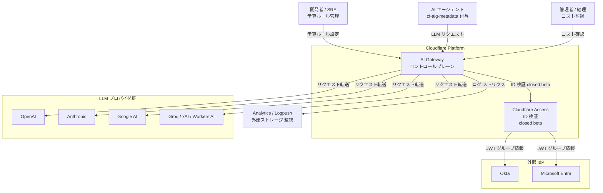
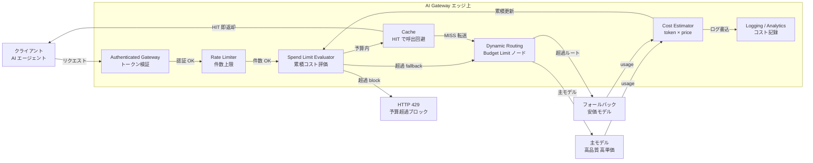
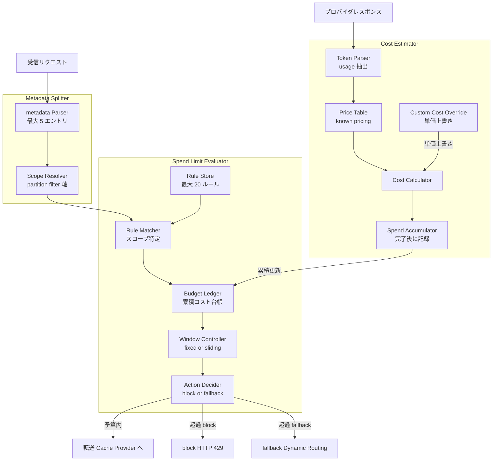
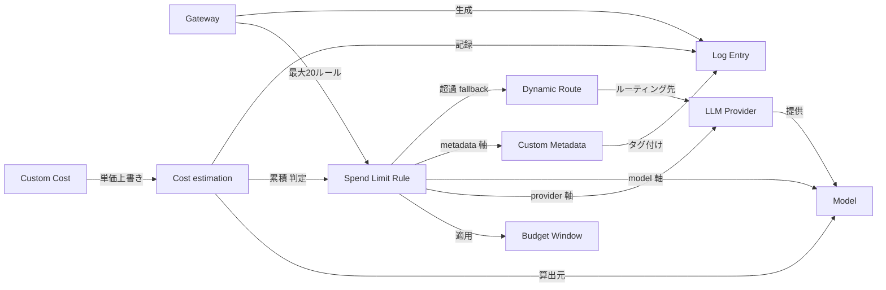
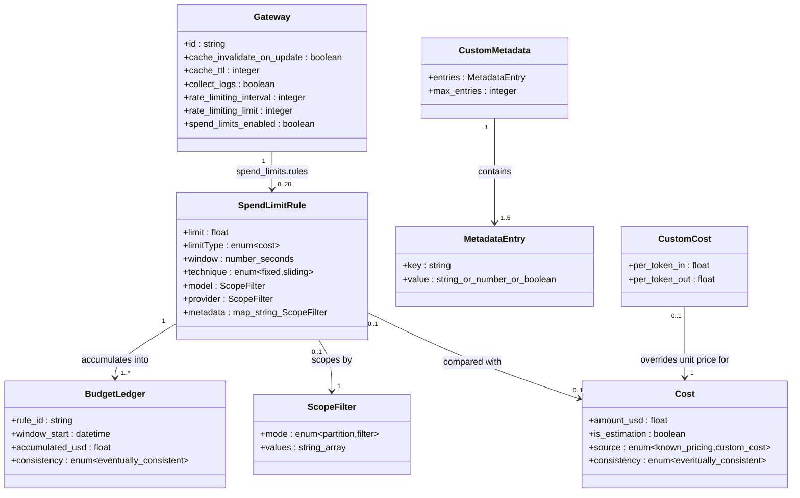

> 検証日: 2026-06-06 / 対象: Cloudflare AI Gateway の Spend Limits（ドル建て予算制御）と ID 連動ポリシー
> ステータス: Spend Limits は **2026-06-05 発表の open beta**（GA ではありません）。本記事はこの時点の一次情報に基づきます。

AIエージェントに仕事を任せるとは、突き詰めると「お金を使う権限を任せる」ことです。エージェントが自律的にモデルを呼び続ければ、その分だけ請求が積み上がります。ところが従来の制御は「トークン数の上限」や「1分あたりのリクエスト数」が中心で、これは *使用量* の制御であって *支出* の制御ではありませんでした。

Cloudflare が 2026-06-05 に AI Gateway へ追加した **Spend Limits** は、この軸を「**ドル建ての累積コスト予算**」へ移します。「このチームに $2,000/月」「このユーザーに $500/月」とゲートウェイ層で宣言し、予算に達したらリクエストを止めるか、安価なモデルへ逃がします。本記事では、この機能を実装エンジニアの視点で構造・データ・設定・運用まで解剖し、open beta ゆえの限界と OSS 代替まで含めて、コスト責任をどう委任設計するかを整理します。

## 概要

Spend Limits は、LLM リクエストの前段に立つ AI Gateway に「コストベースの予算ルール」を持たせる機能です。model / provider / custom metadata 単位で予算を宣言し、累積コストがしきい値に達した時点でブロック、またはより安価なモデルへフォールバックします。

ポイントは、これが単なる料金キャップではなく **権限委任の道具**である点です。アプリ側でトークンを数える実装を持たなくても、ゲートウェイで「誰にいくらまで」を宣言できます。AIエージェントへの権限委任を、費用面の責任分界としてアプリの外側で受け止められます。

一方で限界も明確です。

- コスト判定は実請求ではなく **estimation（推計）** です。
- ユーザー/チームの識別は **自己申告の metadata** に依存し、検証がありません。
- 検証済み ID 連動（Cloudflare Access）は **closed beta** です。
- **Terraform 未対応**で IaC 宣言管理ができません。

OSS の LiteLLM は同等の予算制御を GA かつ self-host で提供します。「マネージドを取るか自前を取るか」は依然として設計判断です。

## 特徴

### トークンでなくドルで予算を切る

予算は USD 建ての累積コストで設定します（API パラメータ `limitType = "cost"`）。請求額そのものを制御する点が、トークン上限やレート制限との違いです。

| 項目 | 内容 |
|---|---|
| 時間窓 | daily / weekly / monthly の3種 |
| リセット方式 | fixed（暦の区切りでリセット）または sliding（直近 N 時間のローリング） |
| スコープ | model / provider / custom metadata の任意の組み合わせ |
| ルール数上限 | 1 gateway あたり最大 20 ルール |

### 超過時に「止める」か「逃がす」かを選べる

| 挙動 | 仕組み | 使いどころ |
|---|---|---|
| ブロック | 超過リクエストを HTTP 429 で拒否（デフォルト） | ハードキャップ。これ以上使わせない |
| フォールバック | Dynamic Routing の primary + fallback 構成で安価モデルへ自動ルーティング | 止めずに品質を落として継続 |

「予算超過 → 安価モデルへ自動迂回」を予算機能としてネイティブに持つ点が、他社に対して先行する特徴です。調査した範囲では、他社のフォールバックは主に障害時のルーティングか常時のコスト最適化が中心で、予算しきい値をトリガーにしたものは目立ちません。

### コストはリアルタイムに推計する

| 項目 | 内容 |
|---|---|
| 算出方法 | トークン使用量 × モデル単価をリクエスト単位で算出し累積 |
| 対象 | known pricing モデル。Unified Billing と BYOK の両方で動作 |
| 推計の性質 | 公式が "cost metric is an estimation" と自認。ストリーミングで計上漏れの事例あり |
| 結果整合 | コストはリクエスト完了後に記録。同時バーストで一時的に上限を超え得る |
| 価格未登録モデル | 判定挙動は公式に明示なし（要再検証） |

### ID 連動は専用機能でなく metadata の次元

per-user / per-team の予算は、専用の budget エンティティではなく `cf-aig-metadata` で送る custom metadata（例: `user_id`, `team`）を split / filter 軸にして実現します。

| 段階 | 内容 |
|---|---|
| open beta（現在） | metadata はクライアントの自己申告を無検証で信頼。なりすまし耐性なし |
| closed beta | Cloudflare Access 連携で JWT から ID を抽出し、IdP グループに per-team ポリシーを直結。アプリの自己申告に依存しない検証済み ID（公開 docs では詳細未掲載・要確認） |

「チーム/ユーザー単位で統制する」という主張の中核を、open beta 段階では検証なしの metadata が担います。本番運用ではこの点を正面から評価する必要があります。

### 設定インターフェースと料金

- 設定は **Dashboard と REST API**。REST は gateway リソースのボディに `spend_limits` を含めます。
- **Terraform は `spend_limits` 属性が未公開**で、IaC 宣言管理ができません（[#6720](https://github.com/cloudflare/terraform-provider-cloudflare/issues/6720) open）。
- AI Gateway 本体も Spend Limits も **全プラン追加料金なし**です。

## 構造

### システムコンテキスト図



| 要素 | 説明 |
|---|---|
| 開発者 / SRE | Gateway 作成・予算ルール設定・Dynamic Route 定義 |
| AI エージェント | LLM を呼び出す自律タスク実行主体。cf-aig-metadata で自己申告 ID を付与 |
| 管理者 / 経理 | 累積コスト・残予算の可視化 |
| LLM プロバイダ群 | 複数プロバイダ。known pricing モデルのみコスト算出対象 |
| Cloudflare Access | JWT 検証・グループポリシー適用。2026-06 時点 closed beta |
| Okta / Microsoft Entra | 企業 IdP。グループ情報を JWT として提供 |
| Analytics / Logpush | 外部ログストレージ・監視基盤への転送 |

### コンテナ図



| 要素 | 説明 |
|---|---|
| Authenticated Gateway | cf-aig-authorization 検証。Gateway 単位のバイナリアクセス制御 |
| Rate Limiter | リクエスト件数の上限。Spend Limits は累積ドルを見る補完関係 |
| Spend Limit Evaluator | 累積コストと予算ルールの突き合わせ。eventually consistent |
| Cost Estimator | トークン量 × モデル価格でコスト算出。推計値 |
| Cache | キャッシュ HIT でプロバイダ呼び出しとトークン消費をゼロ化 |
| Dynamic Routing | Budget Limit ノードで予算超過時の安価モデル切替を実現 |
| Logging / Analytics | prompt / response / cost / token を記録し外部へ転送 |

### コンポーネント図



| 要素 | 説明 |
|---|---|
| Rule Store | spend_limits.rules の永続化。1 gateway 最大 20 ルール。Terraform 未対応 |
| Rule Matcher | model / provider / metadata からマッチするルールを特定。metadata は無検証 |
| Budget Ledger | ルール × ウィンドウ単位の累積コストカウンタ。eventually consistent |
| Window Controller | fixed / sliding とリセットタイミング管理 |
| Action Decider | 累積 ≥ 予算で block / fallback を選択 |
| Cost Estimator | usage からトークン抽出、単価表で算出、累積に加算。ストリーミングで計上漏れ |
| Custom Cost Override | cf-aig-custom-cost で per_token 単価を上書き |
| Metadata Splitter | cf-aig-metadata を解析し partition / filter 軸に解決 |

## データ

### 概念モデル



| 要素 | 説明 |
|---|---|
| Gateway | LLM トラフィックの論理境界。認証・ログ・予算ルールの管理単位 |
| Spend Limit Rule | limitType=cost の予算ルール。1 Gateway に最大 20 ルール |
| Budget Window | period（daily/weekly/monthly）と technique（fixed/sliding） |
| Dynamic Route | 予算超過時に安価モデルへ迂回させるルーティング定義 |
| LLM Provider | 複数プロバイダ。known pricing が有効なもののみ判定対象 |
| Model | プロバイダが提供するモデル。スコープ軸として使用 |
| Custom Metadata | cf-aig-metadata の識別子。split / filter 軸。open beta では無検証 |
| Custom Cost | cf-aig-custom-cost の単価上書き。累積算出に反映 |
| Log Entry | リクエスト/レスポンスごとのログ |
| Cost | トークン量 × 単価の推計コスト。eventually consistent な累積で判定 |

### 情報モデル

REST API（[Create Gateway](https://developers.cloudflare.com/api/resources/ai_gateway/methods/create/)）の確定スキーマでは、`window` は秒数の number、`metadata` はキー名をキーにした map で各値が `{mode:"partition"}` または `{mode:"filter", values:[...]}`、`model` / `provider` は `{mode:"filter", values:[...]}` のオブジェクトです。features ドキュメント本文では概念名として「Split by value」「Filter by value」と呼びますが、API の mode 値は `partition` / `filter` です。



主要エンティティの属性を示します。

| 属性 | 型 | 説明 |
|---|---|---|
| `limit` | float | 予算上限（USD 建ての金額） |
| `limitType` | enum | 現状 `"cost"` のみ確認 |
| `window` | number | 時間窓の長さ（秒数。86400=daily / 604800=weekly / monthly は暦日数） |
| `technique` | enum | `fixed`（暦起点でリセット）/ `sliding`（rolling 移動窓） |
| `model` | object | `{mode:"filter", values:["openai/gpt-4.1"]}`（省略で全モデル） |
| `provider` | object | `{mode:"filter", values:["openai"]}`（省略で全プロバイダ） |
| `metadata` | map | `{key: {mode:"partition"}}` または `{key: {mode:"filter", values:[...]}}` |

### データ上の重要制約

| 制約 | 内容 |
|---|---|
| コストは estimation | token × price の推計値。ストリーミング SSE で usage を返さない場合は計上漏れ |
| metadata は無検証 | open beta では受け取った値をそのまま信頼。user_id 改ざんで他人の予算消費が可能 |
| eventually consistent | 同時バーストで上限を超えて複数リクエストが通過しうる |
| known pricing 非対応モデル | コスト0扱いで素通りか集計対象外かは公式未記載（要再検証） |

## 構築方法

### Gateway 作成

Dashboard では **AI** > **AI Gateway** > **Create Gateway** で名前を入力して作成します。REST API では次のように作成します。

```bash
curl -X POST "https://api.cloudflare.com/client/v4/accounts/$CLOUDFLARE_ACCOUNT_ID/ai-gateway/gateways" \
  -H "Authorization: Bearer $CLOUDFLARE_API_TOKEN" \
  -H "Content-Type: application/json" \
  -d '{
    "id": "prod-gateway",
    "cache_invalidate_on_update": false,
    "cache_ttl": 0,
    "collect_logs": true,
    "rate_limiting_interval": 0,
    "rate_limiting_limit": 0
  }'
```

Create Gateway の必須フィールドは `id` / `cache_invalidate_on_update` / `cache_ttl` / `collect_logs` / `rate_limiting_interval` / `rate_limiting_limit` です。`spend_limits` は optional です。

### Spend Limit ルール設定

Spend Limits は gateway の作成・更新ボディに `spend_limits` オブジェクトを含めて設定します。`window` は秒数の number、`metadata` はキー名をキーにした map、`model` / `provider` はオブジェクトです。1 gateway あたり最大 20 ルールです。

ゲートウェイ全体に $10,000/day の上限（ブロック）を設定する例です。

```json
{
  "spend_limits": {
    "enabled": true,
    "rules": [
      {
        "limit": 10000,
        "limitType": "cost",
        "window": 86400,
        "technique": "fixed"
      }
    ]
  }
}
```

ユーザーごとに $200/day を割り当てる例です。`metadata` の `partition` で値ごとに独立した予算バケットが生成されます。

```json
{
  "spend_limits": {
    "enabled": true,
    "rules": [
      {
        "limit": 200,
        "limitType": "cost",
        "window": 86400,
        "technique": "fixed",
        "metadata": { "user_id": { "mode": "partition" } }
      }
    ]
  }
}
```

engineering チームのみ・特定モデル限定で $50/day を設定する例です。`filter` で対象を絞り込みます。

```json
{
  "spend_limits": {
    "enabled": true,
    "rules": [
      {
        "limit": 50,
        "limitType": "cost",
        "window": 86400,
        "technique": "fixed",
        "provider": { "mode": "filter", "values": ["openai"] },
        "model": { "mode": "filter", "values": ["openai/gpt-4.1"] },
        "metadata": { "team": { "mode": "filter", "values": ["engineering"] } }
      }
    ]
  }
}
```

### 認証と Terraform 制約

Gateway 管理には AI Gateway 編集権限を持つ Cloudflare API トークンが必要です。LLM リクエストを Authenticated Gateway 経由で送る場合は、別途 Gateway 専用トークン（`cf-aig-authorization`）が必要です。

Terraform は `cloudflare_ai_gateway` リソースで Gateway 本体を作れますが、**`spend_limits` 属性は 2026-06 時点で未公開**です。予算ルールは REST API か Dashboard での別途設定になります。

```hcl
resource "cloudflare_ai_gateway" "prod" {
  account_id             = var.cloudflare_account_id
  id                     = "prod-gateway"
  cache_ttl              = 0
  collect_logs           = true
  rate_limiting_interval = 0
  rate_limiting_limit    = 0
  # spend_limits は未対応のため REST API / Dashboard で設定する
}
```

## 利用方法

### Gateway 経由で LLM を呼ぶ

provider-native エンドポイントの形式は次のとおりです。

```
https://gateway.ai.cloudflare.com/v1/{account_id}/{gateway_id}/{provider}/...
```

OpenAI を直接呼ぶ例です。

```bash
curl -X POST "https://gateway.ai.cloudflare.com/v1/$CLOUDFLARE_ACCOUNT_ID/prod-gateway/openai/chat/completions" \
  -H "Authorization: Bearer $OPENAI_API_KEY" \
  -H "Content-Type: application/json" \
  -d '{
    "model": "gpt-4.1-mini",
    "messages": [{"role": "user", "content": "Hello!"}]
  }'
```

### ヘッダの使い方

ユーザー/チームを識別する `cf-aig-metadata` を付与します。最大 5 エントリ、値は string / number / boolean です。

```bash
curl -X POST "https://gateway.ai.cloudflare.com/v1/$CLOUDFLARE_ACCOUNT_ID/prod-gateway/openai/chat/completions" \
  -H "Authorization: Bearer $OPENAI_API_KEY" \
  -H "Content-Type: application/json" \
  -H 'cf-aig-metadata: {"user_id": "u_12345", "team": "engineering", "env": "prod"}' \
  -d '{"model": "gpt-4.1", "messages": [{"role": "user", "content": "What should I build today?"}]}'
```

OpenAI SDK（TypeScript）からは次のように渡します。

```javascript
import OpenAI from "openai";

const client = new OpenAI({
  apiKey: process.env.OPENAI_API_KEY,
  baseURL: `https://gateway.ai.cloudflare.com/v1/${process.env.CLOUDFLARE_ACCOUNT_ID}/prod-gateway/openai`,
});

const response = await client.chat.completions.create(
  { model: "gpt-4.1", messages: [{ role: "user", content: "Hello!" }] },
  { headers: { "cf-aig-metadata": JSON.stringify({ user_id: "u_12345", team: "engineering" }) } }
);
```

交渉済みレートや内部配賦には `cf-aig-custom-cost` で単価を上書きします。

```bash
curl -X POST "https://gateway.ai.cloudflare.com/v1/$CLOUDFLARE_ACCOUNT_ID/prod-gateway/openai/chat/completions" \
  -H "Authorization: Bearer $OPENAI_API_KEY" \
  -H "Content-Type: application/json" \
  -H 'cf-aig-custom-cost: {"per_token_in": 0.000001, "per_token_out": 0.000002}' \
  -d '{"model": "gpt-4.1-mini", "messages": [{"role": "user", "content": "Hello!"}]}'
```

キャッシュヒット時はコスト0扱いになるため、`cf-aig-custom-cost` はプロバイダへ実際に転送された場合のみ適用されます。

### 超過時の挙動

予算超過時のデフォルトは HTTP 429 でのブロックです。time window がリセットされるまで継続します。

```
HTTP/2 429
{ "success": false, "errors": [{"message": "Spend limit exceeded"}] }
```

コストはリクエスト完了後に計上されるため、同時バーストでは一時的に上限を超過することがあります。ハードキャップとして 100% 保証されるものではありません。

### Budget Limit ノードで安価モデルへ逃がす

ブロックでなく安価モデルへ自動フォールバックさせる構成です。

1. Dynamic Route で primary モデル（高品質）と fallback モデル（安価）を定義します。
2. primary モデルに Spend Limit を設定します。
3. 予算超過時、AI Gateway が自動で fallback モデルへルーティングします。

```
[リクエスト]
    ↓
[Budget Limit チェック]
    ├── 予算内  → Primary 高品質モデル
    └── 予算超過 → Fallback 安価モデル
```

Dynamic Routing 自体の設定 schema（Rate / Budget Limit 要素など）は docs に掲載がありますが、これは Spend Limits の gateway ルールとは別系統です。両者を組み合わせる構成は Dashboard 経由が確実です。

### ID 連動ポリシー

| 段階 | 内容 |
|---|---|
| open beta（現在） | cf-aig-metadata でアプリが識別子を送り、metadata の partition / filter でスコープ。自己申告・無検証 |
| closed beta | Cloudflare Access で認証し、JWT から ID を自動抽出して metadata に付与。アプリの自己申告に依存しない検証済み ID（公開 docs では詳細未掲載・要確認） |

closed beta のセットアップ手順・metadata キー名は 2026-06 時点で公開 docs に未記載です（要再検証）。

## 運用

### 予算設計パターン

スコープ次元は model / provider / custom metadata の 3 軸です。専用のチーム予算エンティティは存在せず、`cf-aig-metadata` の key-value を split / filter 軸にして表現します。

| ルール | スコープ次元 | 設定例 |
|---|---|---|
| チームあたり上限 | metadata.team を partition | $2,000 / month per team |
| 特定チームのみ制限 | metadata.team を filter | engineering のみ $5,000 / month |
| アプリあたり上限 | metadata.app を partition | $500 / day per app |
| 高単価モデル上限 | model | 高品質モデルを $1,000 / day でキャップ |
| Gateway 全体ハードキャップ | スコープなし | $10,000 / day |

1 gateway 最大 20 ルール、`cf-aig-metadata` は 1 リクエスト最大 5 エントリの制約があります。環境分離が必要なら gateway 自体を複数作成します（Free: 10 / Paid: 20 per account）。まず 1 gateway + metadata split で試し、アクセス境界が必要になってから gateway 分割を検討する順序が現実的です。

### block と fallback の使い分け

| 観点 | block | fallback |
|---|---|---|
| サービス継続性 | 止まる | 品質低下で継続 |
| コスト予測精度 | 超過分ゼロ | 安価モデルへの費用が追加発生 |
| UX | エラー通知が明示的 | ユーザーは気づかない可能性 |
| 設定複雑度 | シンプル | Dynamic Route の設計が必要 |
| 推奨場面 | 内部ツール・開発環境・エージェント | 本番ユーザー向けサービス |

fallback は AI Gateway 自体がダウンした場合には機能しません。Budget Limit ノードは Gateway 内の機能であり、Gateway 障害時は両方とも止まる単一障害点です。

### 監視

| 手段 | 内容 |
|---|---|
| Analytics | requests / tokens / costs をリアルタイム表示。metadata フィルタで team/app/user 単位に絞り込み |
| Logging | per-request で cost / token / metadata を記録。保存上限は Free 100,000 logs/account、Paid 10,000,000 logs/gateway |
| Logpush | S3 / R2 / Datadog 等へ継続エクスポート（Workers Paid 限定）。jobs 4/account |

cost は estimation のため、プロバイダ dashboard と併用します。AI Gateway はネイティブのアラート機能を持たないため、Logpush → Datadog/Grafana で「予算 80% 到達通知」を作るか、Analytics API のポーリングで代替します。

### account-wide と per-gateway の2層管理

```
Layer 1: Account-wide Unified Billing クレジット
  └─ 全 gateway 横断の総支出キャップ

Layer 2: Per-gateway Spend Limit Rules
  ├─ Gateway production: $20,000 / month
  ├─ Gateway staging:    $1,000 / month
  └─ Gateway development: $500 / month
       └─ metadata.team=alpha: $200 / day
```

BYOK では account-wide の Unified Billing クレジットが存在しないため、per-gateway ルールのみで管理します。BYOK でも known pricing モデルならコスト計算は行われ、Spend Limits は機能します。

## ベストプラクティス

### estimation 誤差を見越したバッファ設定

「$500 に設定すれば請求も正確に $500 で止まる」と考えると外します。公式 Costs docs が "cost metric is an estimation" と自認し、ストリーミングで計上漏れの事例（[#470](https://github.com/cloudflare/ai/issues/470) open）があります。

予算上限は実際に使わせたい金額の **70〜80%** に設定し、20〜30% のバッファを持ちます。確定請求はプロバイダ dashboard で毎日確認します。ストリーミング多用ならプロバイダ側のトークンカウントを正とします。

### ストリーミング多用時の上限突き抜け対策

ストリーミングのコストは応答完了後にしか確定せず、最終チャンクの usage を読めないと加算されません。長時間ストリーミングの並行で、上限を超えた後続リクエストが通る余地があります。

Spend Limits を最終防衛線でなく補助防衛線とし、プロバイダ側に daily token quota を併設します。OpenAI 系では `stream_options: {include_usage: true}` を明示して usage 返却を促します。

### なりすまし対策

`cf-aig-metadata: {"user_id":"alice"}` を送れば Alice のクォータで制限できると考えると危険です。metadata はクライアントの自己申告で検証の記述がありません。未信頼のクライアントが直接 `cf-aig-metadata` を指定できる構成では、`user_id` を詐称して他人の予算消費や自分の上限回避を行える余地があります（CVE ではなく仕様設計からの論理的リスク）。

| 段階 | 対策 |
|---|---|
| open beta の緩和策 | metadata はクライアントでなくバックエンド Workers / サーバーサイドで付与。Authenticated Gateway を有効化。エージェントには Access service token で名前付き ID を与える |
| closed beta GA 後 | Cloudflare Access + IdP（Okta/Entra）で JWT 由来の検証済み ID を metadata に自動付与 |

### 止めない統制の設計

```
Phase 1 通常時: 高品質モデル / 予算 $10,000/月
  └─ Phase 2 超過 fallback: 安価モデル コストを 1/5 程度に圧縮
       └─ Phase 3 全体ハードキャップ到達: HTTP 429 でブロック
```

Dynamic Route の Budget Limit ノードで Phase 1→2 を実装し、account-wide 上限で Phase 3 を受け止めます。

### 自前 LiteLLM とマネージド Cloudflare の選択指針

| 判断軸 | Cloudflare AI Gateway を選ぶ | LiteLLM を選ぶ |
|---|---|---|
| 運用負荷 | インフラ不要・追加料金なし | Redis/PostgreSQL 等 + DevOps |
| 予算粒度 | model/provider/metadata（最大20ルール） | key/user/team/customer/model/agent（最細粒度） |
| ID 検証 | 自己申告（open beta）/ Access 連携（closed beta） | Virtual Keys で検証可能なキー単位制御（GA 済み） |
| 予算連動 fallback | 予算しきい値トリガをネイティブに持つ | 障害時 routing 中心 |
| IaC 管理 | 現行 provider schema に spend_limits 属性なし（2026-06 時点） | Helm Chart / Terraform モジュールが充実 |
| ベータリスク | Spend Limits は open beta | GA 済み・仕様安定 |
| Unified Billing | 1 請求に集約（5% 手数料あり） | BYOK のみ |

素早く始めたい・インフラ管理を避けたい・fallback の段階制御が欲しいなら Cloudflare が向きます。厳密な ID 検証・細粒度のキー単位予算・IaC 完全再現性・self-host が必要なら LiteLLM が向きます。高スケールで TCO を最小化したい場合も LiteLLM self-host が有利です。

## トラブルシューティング

### コストが実請求とズレる

| 原因 | 対処 |
|---|---|
| estimation ベースの誤差 | プロバイダ dashboard を正とし、AI Gateway の値は傾向把握に留める |
| ストリーミング SSE で usage 未取得（[#470](https://github.com/cloudflare/ai/issues/470)） | `stream_options:{include_usage:true}` を付与。直らなければプロバイダ側で別集計 |
| Anthropic usage パース失敗（[#20536](https://github.com/cloudflare/cloudflare-docs/issues/20536)） | ログの Tokens が missing ならこの症状。プロバイダ側で集計 |
| known pricing 非対応モデル | Pricing ページで対象を確認。未登録は cf-aig-custom-cost で手動指定 |

### 予算が効かない / 突き抜ける

| 確認ポイント | 内容 |
|---|---|
| known pricing 対象か | 未登録モデルは素通りの可能性 |
| ストリーミングの計上遅延 | 完了前のリクエストはコスト未計上で通る |
| eventually consistent | バーストで超過。上限の 70〜80% 設定で緩和 |
| ルール数上限 | 1 gateway 20 ルール |
| Unified Billing と BYOK 混在 | コスト計上経路が異なる可能性 |

### 429 が返る / fallback が動かない

| 症状 | 確認ポイント |
|---|---|
| 429 が返り fallback しない | デフォルト block は 429。fallback には Dynamic Routing の Budget Limit ノードが必要 |
| Rate Limiting との混同 | 件数上限の Rate Limiting も 429。ログの request status で区別 |
| 予算超過なのに fallback しない | Dynamic Route が deployed か / Budget Limit ノードの参照先 / fallback 先モデルのエラー / コスト計上漏れで超過判定されていない |

## まとめ

Cloudflare AI Gateway の Spend Limits は、AI のコスト制御を「トークン/レート」から「ドル建て予算」へ移し、超過時に止めるか安価モデルへ逃がすかを選べる機能です。AIエージェントやチームへの権限委任を、コスト責任の委任としてゲートウェイ層で受け止められます。ただし 2026-06 時点では open beta で、コストは推計・ID は自己申告・Terraform 未対応という限界があり、本番では LiteLLM 等の自前運用との比較を含めた設計判断が必要です。

この記事が少しでも参考になった、あるいは改善点などがあれば、ぜひリアクションやコメント、SNSでのシェアをいただけると励みになります！

## 参考リンク

- 公式ドキュメント
  - [Spend Limits](https://developers.cloudflare.com/ai-gateway/features/spend-limits/)
  - [Spend Limits changelog (2026-06-05)](https://developers.cloudflare.com/changelog/post/2026-06-05-spend-limits/)
  - [AI Gateway 概要](https://developers.cloudflare.com/ai-gateway/)
  - [Dynamic Routing](https://developers.cloudflare.com/ai-gateway/features/dynamic-routing/)
  - [Authenticated Gateway](https://developers.cloudflare.com/ai-gateway/configuration/authentication/)
  - [Custom Metadata](https://developers.cloudflare.com/ai-gateway/configuration/custom-metadata/)
  - [Custom Costs](https://developers.cloudflare.com/ai-gateway/configuration/custom-costs/)
  - [Unified Billing](https://developers.cloudflare.com/ai-gateway/features/unified-billing/)
  - [Costs](https://developers.cloudflare.com/ai-gateway/observability/costs/)
  - [Analytics](https://developers.cloudflare.com/ai-gateway/observability/analytics/)
  - [Limits](https://developers.cloudflare.com/ai-gateway/reference/limits/)
  - [REST API Create Gateway](https://developers.cloudflare.com/api/resources/ai_gateway/methods/create/)
- 発表・背景
  - [Cloudflare Blog: Introducing Spend Limits for AI Gateway](https://blog.cloudflare.com/ai-gateway-spend-limits/)
- GitHub
  - [cloudflare/ai#470 ストリーミングコスト未記録](https://github.com/cloudflare/ai/issues/470)
  - [cloudflare-docs#20536 Anthropic usage パース失敗](https://github.com/cloudflare/cloudflare-docs/issues/20536)
  - [terraform-provider-cloudflare#6720 spend_limits 未対応](https://github.com/cloudflare/terraform-provider-cloudflare/issues/6720)
- 代替
  - [LiteLLM: Budgets & Rate Limits](https://docs.litellm.ai/docs/proxy/users)
  - [LiteLLM: Budget Manager](https://docs.litellm.ai/docs/budget_manager)
