> 本記事は Cloudflare が 2025-07-01 "Content Independence Day" で全顧客向けに提供開始した「AI トラフィックを Search / Agent / Training の行為分類で制御する仕組み」と、その周辺プロダクト（AI Crawl Control、Content Signals Policy、managed robots.txt、Bot Management / WAF、Pay Per Crawl）を、一次情報（Cloudflare 公式ブログ・developers docs）と照合して整理した技術調査です。「Block AI bots」の単一トグルから、行為分類プリセットへ整理された 2026-07-01 時点の情報を基準にしています。

## 概要

### 目的と位置づけ

Cloudflare は、AI ボットのトラフィックを「どのボットか」ではなく「何をするためのアクセスか」で制御する仕組みを整備しています。

対象の行為分類は次の 3 種類です。

- **Search**: 検索インデックス構築のためのクロール
- **Agent**: ユーザーの指示でリアルタイムに動作する自動化（chat fetch bot、ブラウザ操作エージェントなど）
- **Training**: モデルの学習・ファインチューニングのためのコンテンツ取得

### 背景: Bot 名の許可表からの脱却

従来の robots.txt / User-Agent ブロックは、ボットの名称単位でしか許可・拒否を表現できませんでした。この方式には次の課題がありました。

- AI ボットの急増により、個別ボット名の管理コストが増大する
- スクレイピング後にコンテンツがどう使われるか（検索表示・即答生成・学習）を区別できない
- サイト運営者が本当に止めたいのは「学習への転用」であっても、SEO に必要な検索クローラーまで巻き込みかねない

Cloudflare はこの課題に段階的に対応してきました。2025 年 7 月 1 日の初回 "Content Independence Day" では、新規ドメインでの AI クローラーのデフォルト遮断と Pay Per Crawl（当時プライベートベータ）を打ち出しました。続いて 2025 年 9 月に Content Signals Policy を公開し、robots.txt に機械可読な行為シグナル（`search` / `ai-input` / `ai-train`）を追加しました。2026 年 7 月 1 日の "Your site, your rules" 発表（本記事が起点とする発表）では、制御単位を Search / Agent / Training の 3 分類に整理し、全顧客向けの選択肢として提供しました。2026 年 9 月 15 日からは、**新規に Cloudflare へオンボードするドメインを対象に**、広告を表示するページで Training と Agent をデフォルト遮断、Search をデフォルト許可という新しい既定値が適用される予定です（既存ゾーンは自動では変更されず、設定変更を促す通知の対象になります）。AI Crawl Control（旧称 AI Audit）は、これらの可視化・許可/遮断・課金設定を担う中核機能です。

> Search / Agent / Training は AI トラフィック制御の 3 分類です。Cloudflare の Verified Bots タクソノミーにはこのほか **Transact**（ユーザー代行の決済・購買処理）を含む複数の行動カテゴリがあります。購買代行エージェントは Agent ではなく Transact に分類され得るため、Agent の定義（リアルタイムのフェッチ・ブラウジング）と Transact の境界を設計時に区別します。

### 関わるプロダクト群

| プロダクト | 役割 |
|---|---|
| AI Crawl Control（旧 AI Audit） | AI クローラーの可視化・許可/遮断・課金設定を行う中核機能。robots.txt 準拠状況の監視も含む |
| Content Signals Policy | robots.txt に `search` / `ai-input` / `ai-train` を宣言する機械可読フォーマット。行為単位の意思表示を標準化 |
| managed robots.txt | Content Signals を含む robots.txt を Cloudflare が自動生成・維持する機能 |
| Bot Management / WAF | ボット判定スコアリングとルールベースの実効的な遮断を担当。Content Signals の「意思表示」を実際のブロックへ接続する土台 |
| Pay Per Crawl / Monetization | 許可の代わりに課金でアクセスを認める収益化の選択肢 |

### 全体像

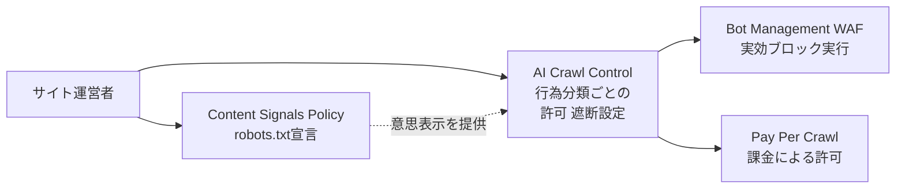

| 要素名 | 説明 |
|---|---|
| A | サイト運営者（Cloudflare 顧客） |
| B | robots.txt に search / ai-input / ai-train の許諾意思を機械可読で宣言する仕組み |
| C | Search / Agent / Training の行為分類ごとにダッシュボードで許可・遮断・課金を設定する中核機能 |
| D | ボット判定スコアとルールで実際の通信を遮断する実行層 |
| E | 遮断の代わりにクロールごとの課金で許可する収益化オプション |

## 特徴

- **行為分類ベースの制御**: ボット名の個別管理ではなく、Search / Agent / Training という 3 つの行為分類でまとめて許可・遮断を設定できる
- **機械可読な意思表示**: Content Signals Policy により、`Content-Signal: search=yes, ai-train=no` のような 1 行の宣言で、検索利用・即答生成利用・学習利用を個別に意思表示できる
- **可視化とセットの制御**: AI Crawl Control のダッシュボードで、どの AI サービスがいつ何にアクセスしたかを確認しながら許可/遮断/課金を判断できる
- **段階的なデフォルト強化**: 2025 年 7 月 1 日の全顧客提供開始を起点に、2026 年 9 月 15 日からは新規オンボードドメインの広告表示ページで Training と Agent をデフォルト遮断へ切り替え予定
- **収益化との接続**: 遮断一択ではなく、Pay Per Crawl によりクロールごとの課金で許可する選択肢を持つ
- **法的意思表示としての設計**: Content Signals は EU 著作権指令 2019/790 第 4 条に基づく権利留保としても機能し得ると位置づけられている（ただし技術的な強制力は持たない旨が明記されている）

### 従来方式との比較

| 比較項目 | 従来の robots.txt / User-Agent ブロック | Content Signals + AI Crawl Control |
|---|---|---|
| 制御単位 | ボット名（User-Agent 文字列）単位 | 行為（Search / Agent / Training）単位 |
| 判定根拠 | クローラー自己申告の UA 文字列 | Cloudflare のボット分類 + Content Signals の宣言（search / ai-input / ai-train） |
| 監査容易性 | 低い。どの目的でアクセスされたか区別できない | 高い。ダッシュボードで行為分類ごとのアクセス状況・robots.txt 準拠状況を追跡できる |
| 契約・SEO との整合 | 検索クローラーと生成 AI クローラーを区別できず、誤って SEO に必要なクロールまで遮断するリスクがある | Search は許可、Training/Agent のみ選択的に遮断でき、SEO への影響を抑えられる |
| 収益化連携 | なし | Pay Per Crawl による課金アクセスと直結 |

## 構造

C4 model の 3 段階（システムコンテキスト / コンテナ / コンポーネント）で、Cloudflare の AI トラフィック行為別制御の内部アーキテクチャを整理します。

### システムコンテキスト図

Cloudflare のエッジ制御面を中心に、周辺アクターと外部システムの関係を示します。

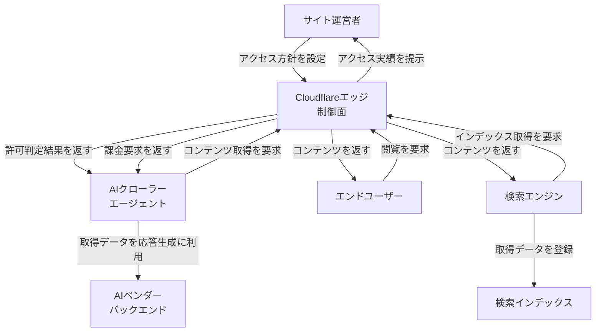

| 要素名 | 説明 |
|---|---|
| サイト運営者 | Cloudflare を利用しコンテンツへのアクセス方針を定める顧客 |
| AIクローラー エージェント | 検索インデックス化・リアルタイム応答生成・モデル学習のいずれかの目的でアクセスする自動化主体 |
| エンドユーザー | サイトを直接閲覧する人間 |
| 検索エンジン | 検索インデックス構築のためにクロールする主体 |
| Cloudflareエッジ 制御面 | 本調査の対象システム。全リクエストの経路上でアクセス可否・課金・記録を担う |
| AIベンダー バックエンド | AIクローラーが取得したデータを学習・応答生成に利用する外部システム |
| 検索インデックス | 検索エンジンが取得したデータを登録する外部システム |

### コンテナ図

Cloudflare エッジ制御面の内部を、主要コンテナ単位に分解します。

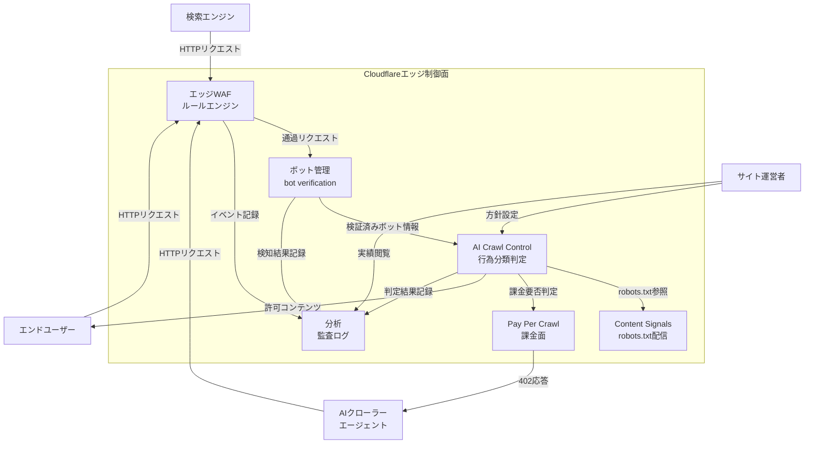

| 要素名 | 説明 |
|---|---|
| エッジWAF ルールエンジン | DDoS 対策・カスタムルール・レート制限・管理ルールを固定順で評価する最前段の関門 |
| ボット管理 bot verification | 検知エンジン群でボットスコアを算出し、検証済みボットか否かを判定するコンテナ |
| AI Crawl Control 行為分類判定 | Search / Agent / Training の行為分類とクローラー単位の許可・遮断・課金設定を担う中核コンテナ |
| Content Signals robots.txt配信 | サイト運営者の意思表示を robots.txt の機械可読シグナルとして生成・配信するコンテナ |
| Pay Per Crawl 課金面 | 遮断の代替として、クロール単位の課金と決済を担うコンテナ |
| 分析 監査ログ | 各コンテナの判定・検知結果を集約し、ダッシュボードとログ出力で可視化するコンテナ |

### コンポーネント図

各コンテナをさらに分解します。

#### エッジWAF

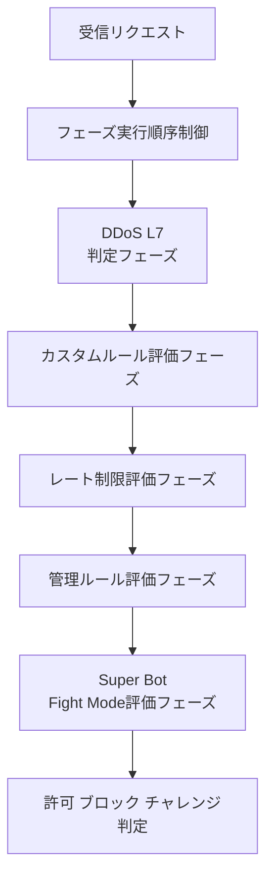

| 要素名 | 説明 |
|---|---|
| 受信リクエスト | Cloudflare データセンターに到達した HTTP リクエスト |
| フェーズ実行順序制御 | 各評価フェーズを固定順で通し、途中の終端アクションで後続をスキップする制御機構 |
| DDoS L7 判定フェーズ | レイヤー 7 の大量アクセスを検知するフェーズ |
| カスタムルール評価フェーズ | アカウント・ゾーン単位のカスタムルールを評価するフェーズ。ボットスコア参照もここに含む |
| レート制限評価フェーズ | 単位時間あたりのリクエスト数を評価するフェーズ |
| 管理ルール評価フェーズ | Cloudflare 提供の管理ルールセットを評価するフェーズ |
| Super Bot Fight Mode評価フェーズ | 無料・Pro 向けの簡易ボット制御を評価するフェーズ |
| 許可 ブロック チャレンジ判定 | 各フェーズの結果に基づく最終アクションの確定 |

#### ボット管理 / bot verification

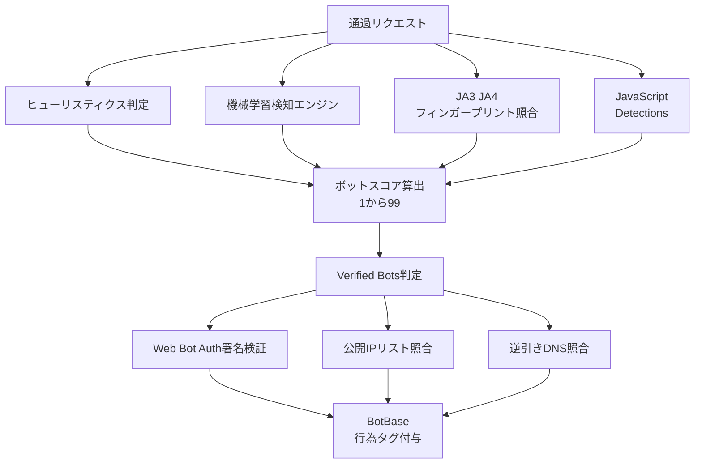

| 要素名 | 説明 |
|---|---|
| 通過リクエスト | エッジ WAF を通過したリクエスト |
| ヒューリスティクス判定 | 既知の悪性フィンガープリントとの照合など複数の経験則チェック |
| 機械学習検知エンジン | 日次で膨大なリクエストから学習した自動化トラフィック識別モデル |
| JA3 JA4 フィンガープリント照合 | TLS/HTTP 接続特性による識別 |
| JavaScript Detections | 軽量スクリプト注入によるヘッドレスブラウザ検出 |
| ボットスコア算出 1から99 | 各検知エンジンの結果を統合したスコアリング |
| Verified Bots判定 | 自己申告の透明性を検証し verified bot か判定する処理 |
| Web Bot Auth署名検証 | HTTP メッセージ署名（Ed25519）による暗号学的な発信元検証 |
| 公開IPリスト照合 | ボット運営者が公開する IP レンジと User-Agent の一致確認 |
| 逆引きDNS照合 | 接続元 IP の逆引きホスト名によるボット運営者確認 |
| BotBase 行為タグ付与 | 検証結果を基に Search / Agent / Training を多重タグ付けし、検索可能なボットディレクトリとして公開する基盤 |

#### AI Crawl Control

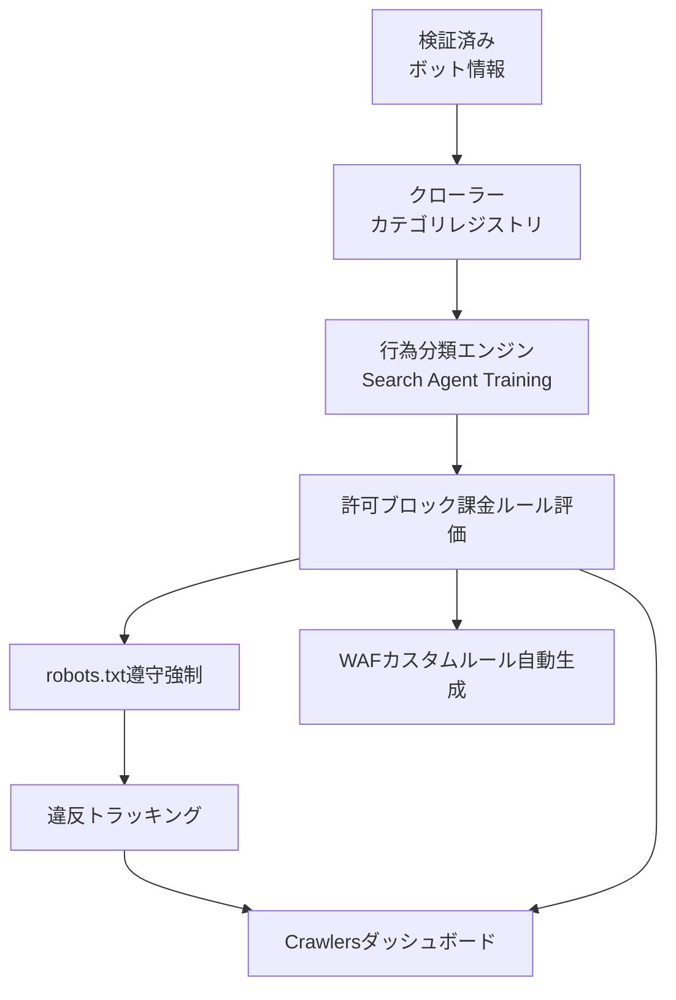

| 要素名 | 説明 |
|---|---|
| 検証済み ボット情報 | ボット管理コンテナから受け取る検証結果と行為タグ |
| クローラー カテゴリレジストリ | AI Crawler / AI Assistant / AI Search / Search Engine Crawler などのカテゴリ台帳。個々のクローラー（例: GPTBot、Googlebot）が属するカテゴリを保持する |
| 行為分類エンジン Search Agent Training | 1 クローラーに複数の行為タグを同時付与する分類ロジック。例えば Googlebot は Search と Training の両方に該当し得る |
| 許可ブロック課金ルール評価 | サイト運営者が設定したカテゴリ単位・個別クローラー単位のルールを適用する判定処理 |
| robots.txt遵守強制 | 許可時でも robots.txt の宛先ルールを強制する Enforce robots.txt 設定の適用 |
| 違反トラッキング | robots.txt 違反回数を記録する処理 |
| WAFカスタムルール自動生成 | ブロック設定時にエッジ WAF へ実効ルールを反映する連携処理 |
| Crawlersダッシュボード | クローラー別のアクセス状況・違反状況を提示する UI |

#### Content Signals / robots.txt配信

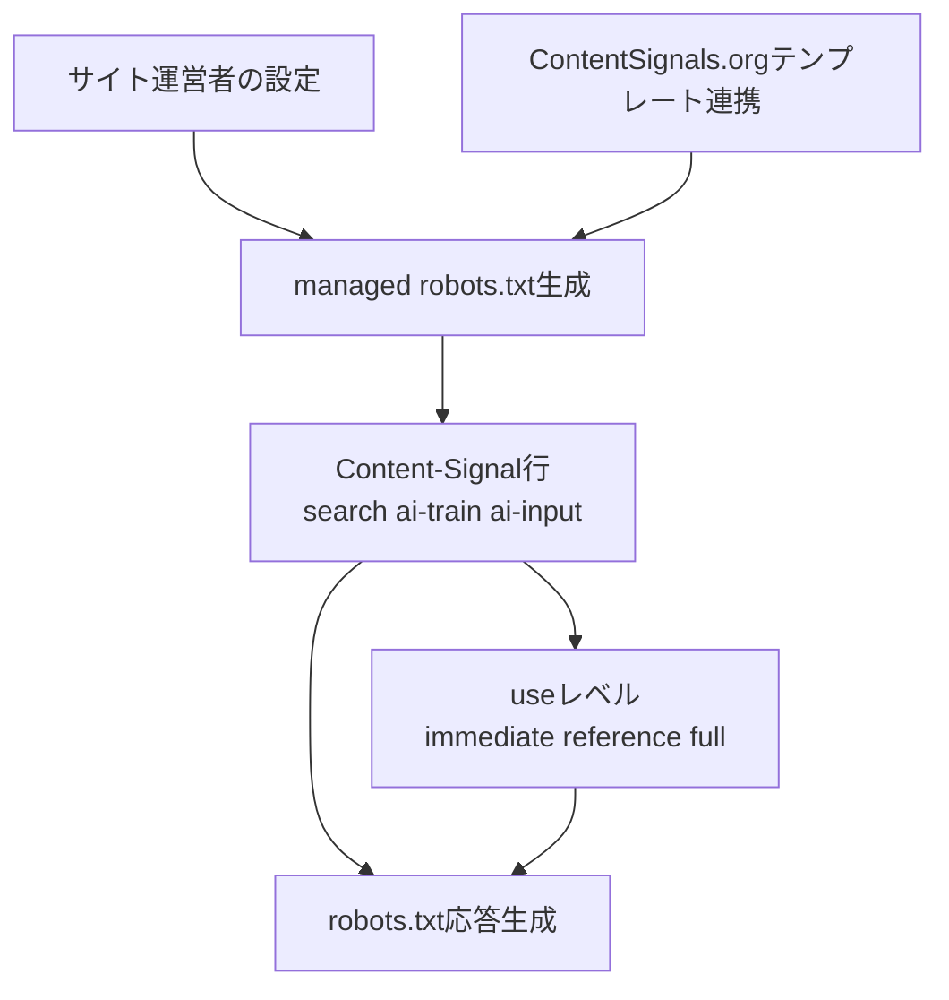

| 要素名 | 説明 |
|---|---|
| サイト運営者の設定 | ダッシュボードまたは手動編集による意思表示の入力 |
| ContentSignals.orgテンプレート連携 | 外部テンプレートサイトで生成した宣言文の取り込み |
| managed robots.txt生成 | Cloudflare が自動維持する robots.txt 本体の生成処理 |
| Content-Signal行 search ai-train ai-input | search / ai-input / ai-train の 3 種の意思表示を 1 行で表現するディレクティブ |
| useレベル immediate reference full | 引用・参照・全文利用のどこまでを許諾するかを示す付加パラメータ |
| robots.txt応答生成 | クローラーからの robots.txt 取得要求に対する最終応答の生成 |

#### Pay Per Crawl / 課金面

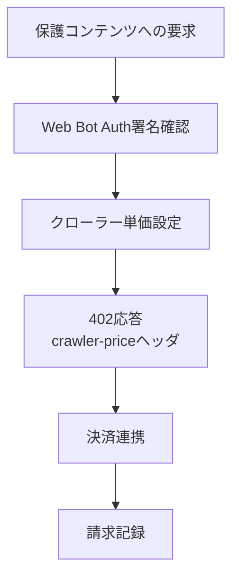

| 要素名 | 説明 |
|---|---|
| 保護コンテンツへの要求 | 課金対象として設定されたコンテンツへのクローラーアクセス |
| Web Bot Auth署名確認 | 課金対象クローラーであることを暗号署名で確認する前提処理 |
| クローラー単価設定 | サイト運営者が設定したクロール単価の参照 |
| 402応答 crawler-priceヘッダ | HTTP 402 Payment Required と価格を提示する応答生成 |
| 決済連携 | クローラー運営者が事前連携した決済アカウントとの精算処理 |
| 請求記録 | 課金実績の記録 |

#### 分析・監査ログ

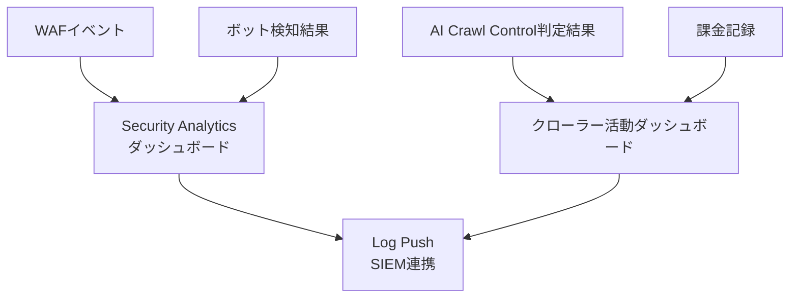

| 要素名 | 説明 |
|---|---|
| WAFイベント | エッジ WAF 各フェーズの評価結果イベント |
| ボット検知結果 | ボット管理コンテナのスコア・検知タグ・検知 ID |
| AI Crawl Control判定結果 | 行為分類ごとの許可・遮断・課金判定結果 |
| 課金記録 | Pay Per Crawl の請求記録 |
| Security Analyticsダッシュボード | セキュリティイベント全般を可視化するダッシュボード |
| クローラー活動ダッシュボード | クローラー別アクセス状況と robots.txt 違反状況を可視化するダッシュボード |
| Log Push SIEM連携 | 外部 SIEM へログを転送する出力機構 |

## データ

Cloudflare の AI トラフィック行為別制御は、サイト運営者が robots.txt（Content Signals）と WAF/Bot Management ルールの二層で「誰の・どの行為を・どう扱うか」を宣言し、Cloudflare のエッジがクローラー識別と行為分類を突き合わせて適用する仕組みです。ここでは、その仕組みが扱う概念モデルと情報モデルを示します。

### 概念モデル

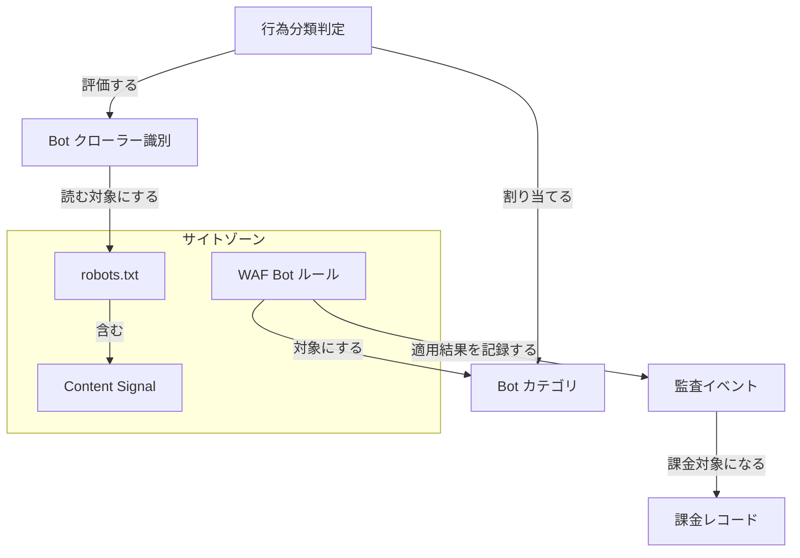

| 要素名 | 説明 |
|---|---|
| サイトゾーン | Cloudflare が管理するドメイン単位の設定境界。robots.txt・Content Signal・WAF Bot ルールを所有する |
| robots.txt | サイトゾーンが配信するテキストファイル。User-agent グループごとに Allow/Disallow と Content Signal 行を含む |
| Content Signal | robots.txt に埋め込む機械可読シグナル。search/ai-input/ai-train の 3 種と拡張の use を持つ |
| Bot クローラー識別 | user-agent 文字列・署名・IP リスト等でクローラーの身元を特定した結果 |
| Bot カテゴリ | Search / Agent / Training など、クローラーの行為に基づく分類の型 |
| 行為分類判定 | Bot クローラー識別を Bot カテゴリへ割り当てるエッジ側の判定処理 |
| WAF Bot ルール | Bot カテゴリを対象に allow/block を適用する規則。charge（課金）は WAF ではなく後段の Pay Per Crawl で評価される別機能 |
| 監査イベント | WAF Bot ルールの適用結果を記録したアクセスログ |
| 課金レコード | Pay Per Crawl で課金対象になった監査イベントに紐づく請求データ |

### 情報モデル

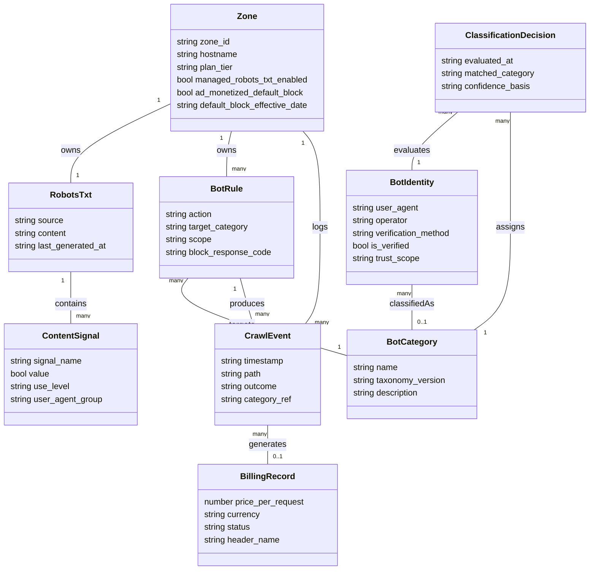

#### 属性値の一次ソース根拠

| クラス / 属性 | 確認できた値 | 出典 |
|---|---|---|
| ContentSignal.signal_name | `search` / `ai-input` / `ai-train` の 3 種 | content-signals-policy |
| ContentSignal.value | `yes` / `no` の 2 値。省略は「意思表明なし（中立）」であり `no` を意味しない | content-signals-policy |
| ContentSignal.use_level | `immediate`（保存・再利用なし） / `reference`（既定値。索引・抜粋・リンクバック） / `full`（要約・再現まで許可） | content-independence-day-ai-options（2026-07-01 の拡張。2025-07-01 の Content Signals Policy 本体には含まれない） |
| BotCategory.name（現行タクソノミー） | Search / Agent / Training / Transact / Data Collection / Security Testing / SEO / Ads Verification / Social・Link Preview / Feed Fetching / Monitoring & Operations | bots/concepts/bot/verified-bots |
| BotCategory.name（旧タクソノミー、後方互換で残存） | AI Crawler / AI Assistant / AI Search / Search Engine Crawler / Archiver 等 | ai-crawl-control/reference/bots |
| BotIdentity.verification_method | Web Bot Auth 署名（Ed25519 鍵ペア + HTTP Message Signatures） / 公開 IP リスト + 固定 user-agent / reverse DNS のいずれか | bots/concepts/bot/verified-bots, introducing-pay-per-crawl |
| BotIdentity.trust_scope | Direct（単一運営者が自社インフラで実行） / Intermediary（1 者が運営し複数エンドユーザーが駆動） | bots/concepts/bot/verified-bots |
| BotRule.action | allow / block / charge（ベータ） | ai-crawl-control/features/manage-ai-crawlers |
| BotRule.block_response_code | ブロック時 403、課金時 402（Payment Required） | manage-ai-crawlers, introducing-pay-per-crawl |
| BillingRecord 単位 | リクエスト単位（per request）の課金。ドメイン全体で単一の flat rate | introducing-pay-per-crawl |
| BillingRecord.header_name | `crawler-price`（402 応答ヘッダーで価格を提示） | introducing-pay-per-crawl |
| Zone.ad_monetized_default_block | 2026-09-15 以降、新規オンボードドメインの広告表示ページで Training と Agent を既定ブロックへ変更（Search は既定許可のまま。既存ゾーンは自動変更対象外） | content-independence-day-ai-options |

## 構築方法

### 前提条件

#### ゾーンとプロキシの要件

- Cloudflare アカウントを作成済みであること
- 対象ドメインを Cloudflare にゾーンとして追加済みであること
- 対象ドメインのトラフィックが Cloudflare を経由（オレンジクラウド = プロキシ有効）していること
  - グレークラウド（DNS only）のレコードには AI Crawl Control / Bot Management / WAF が適用されません

#### 機能別の対応プラン

| 機能 | 対応プラン | 備考 |
|---|---|---|
| AI Crawl Control（旧 AI Audit） | 全プラン（Free 含む） | ゼロコンフィグでデプロイ可能 |
| Search / Agent / Training の一括プリセット（Configure AI bot policies） | 全プラン（Free 含む） | 2026-07-01 提供開始 |
| managed robots.txt（Content Signals 込み） | 全プラン（Free 含む） | |
| Bot Fight Mode | Free | スコアベースのルール作成は不可 |
| Super Bot Fight Mode（SBFM） | Pro / Business | カテゴリ別アクション・WAF 例外ルールが可能 |
| Bot Management（フル機能） | Enterprise（有料アドオン） | リクエスト単位のボットスコア・detection_ids・JA3/JA4 等 |
| WAF Custom Rules | 全プラン（ルール数に上限あり） | 下表参照 |
| アカウントレベルのカスタムルールセット（`kind = "custom"` エントリポイント） | Enterprise | 有料アドオン必須 |
| Pay Per Crawl | 公式表記は closed beta（対応プラン範囲は公式未明示） | Enterprise 顧客向けに account executive 連絡導線を案内 |

#### WAF Custom Rules のプラン別上限

| プラン | ルール数上限 | 正規表現 | カスタムレスポンス等の高度アクション |
|---|---|---|---|
| Free | 5 | 不可 | Log アクションのみ利用不可 |
| Pro | 20 | 不可 | Log アクションのみ利用不可 |
| Business | 100 | 可 | Log アクションのみ利用不可 |
| Enterprise | 1,000 | 可 | すべて利用可能 |

ルール数は `http_request_firewall_custom` フェーズ内の全カスタムルール（ルールセット内のルールを含む）の合計としてカウントされます。

### AI Crawl Control の有効化

#### ダッシュボードでの有効化

1. Cloudflare ダッシュボードにログインし、アカウント・ドメインを選択する
2. 左メニューから **AI Crawl Control** を開く
3. **Overview** タブで、日付範囲・クローラー・オペレーター・ホスト名・パスによるフィルタを使い、AI クローラーのアクセス状況を確認する
4. **Crawlers** タブで、クローラーごとの以下の情報を確認する
   - クローラー名 / オペレーター
   - カテゴリ（AI Crawler / AI Search / AI Assistant / Search Engine など）
   - リクエスト数の推移
   - robots.txt 違反件数
   - Actions 列（Allow / Block / Charge）

Free プランでは Metrics タブの表示期間が制限されます。Enterprise プランではより高度な Bot Management ベースの検出と、任意期間の分析、従量課金オプションが利用できます。

#### AI Crawl Control と他機能の実行順序

AI Crawl Control でクローラーを Block すると、内部的にゾーンの WAF Custom Rule が作成・更新されます。処理順序は次のとおりです。

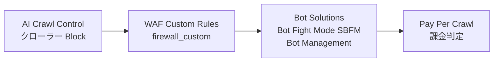

Pay Per Crawl は Bot Solutions より後段で評価されます。課金対象クローラーを Bot Management 側で先に遮断していると課金フローに到達しません。Pay Per Crawl を機能させたいクローラーについては、Bot Solutions 側の「Block AI Bots」設定を無効化しておく必要があります。

### managed robots.txt の有効化

#### 新ダッシュボード

1. **Security** → **Settings** ページへ移動する
2. フィルタで **Bot traffic** を選択する
3. robots.txt 関連の設定項目（Content Signals を含む managed robots.txt）を有効化する

#### 旧ダッシュボード

1. **Security** → **Bots** へ移動する
2. **Configure Bot Fight Mode** を開く
3. **Instruct bot traffic with robots.txt** を有効化する

#### 動作の仕組み

- 有効化すると、`/robots.txt` へのすべてのインバウンド HTTP リクエストをインターセプトします
- 既存の `robots.txt` がある場合は、その内容の前に Cloudflare の指示（Content Signals Policy を含む）を prepend します
- 新規にオンボーディングされたドメイン・顧客に対しては、この機能の有効化が既定で促されます

### Bot Management（Enterprise）の有効化

1. **Security** → **Settings** ページへ移動する
2. フィルタで **Bot traffic** を選択する
3. **Bot management** を選択し、トグルを ON にする
4. トラフィック種別ごとに、鉛筆アイコンから対応アクション（Allow / Block / Managed Challenge 等）を編集する
5. **Configurations** 内で機械学習モデルの自動更新を有効化しておくと、最新の検出モデルが自動適用される

### WAF Custom Rules の準備（ダッシュボード）

1. **Security rules** ページを開く
2. **Create rule** → **Custom rules** を選択する（既存ルールの複製も可）
3. **Rule name** に分かりやすい名前を入力する
4. **Field** ドロップダウンから HTTP プロパティ（`Verified Bot Category` 等）を選び、演算子と値を指定して式を組み立てる
5. **Then take action** でアクション（Block / Managed Challenge / Skip 等）を選ぶ
6. Block を選んだ場合は **configure a custom response** で応答コード・本文をカスタマイズできる
7. **Deploy** で本番反映、または **Save as Draft** で下書き保存する

ダッシュボードはゾーンレベルのカスタムルールセットのみ対応しており、アカウントレベルのカスタムルールセット（`kind = "custom"` のエントリポイント合成）は API/Terraform 経由でのみ設定可能です。

## 利用方法

### 必須パラメータ

| パラメータ | 用途 | 取得・確認方法 |
|---|---|---|
| `zone_id` | ゾーン単位の設定（WAF ルール・Bot Management・managed robots.txt）を対象ゾーンに紐付ける | ダッシュボードの Overview タブ右側「API」欄、または `GET /zones` |
| `account_id` | アカウントレベルのカスタムルールセット作成時に必須（Enterprise） | ダッシュボードの Account Home URL、または `GET /accounts` |
| `CLOUDFLARE_API_TOKEN` | API/Terraform からの認証（Bearer トークン） | My Profile → API Tokens で発行。対象ゾーンへの Zone WAF / DNS 権限を付与 |
| `RULESET_ID` | 既存の `http_request_firewall_custom` フェーズのルールセット ID（ルール追加時に必要） | `GET /zones/{zone_id}/rulesets/phases/http_request_firewall_custom/entrypoint` |

### 行為分類（Search / Agent / Training）単位の許可・遮断

#### ダッシュボードでの設定（推奨・全プラン）

1. **Security** → **Settings** → **Configure AI bot policies** を開く
2. Search / Agent / Training の 3 カテゴリそれぞれについて、次の 3 択から選ぶ
   - **Block on all pages**: 全ページで遮断
   - **Block only on ad-monetized pages**: 広告収益化ページのみ遮断
   - **Allow**: 許可
3. 保存すると、対応する WAF Custom Rule が自動生成・更新される

旧設定（**Security** → **Settings** → **Block AI bots**）は行為分類のないオン/オフのみの遮断です。公式ドキュメント上は **2026-09-15 に廃止（Deprecating）予定** と表示されており、単なる後方互換の残存ではありません。同日以降は Configure AI bot policies の行為分類プリセットへ移行しておく必要があります。

#### カテゴリと代表クローラーの対応

AI Crawl Control 上のカテゴリと行為・代表クローラーの対応は次のとおりです。行為分類プリセットとの対応づけは Cloudflare のカテゴリ定義から妥当と判断した実務的な整理であり、公式が 1:1 対応を明記しているものではありません。

| AI Crawl Control 上のカテゴリ | 対応する行為 | 代表クローラー例 |
|---|---|---|
| AI Crawler | Training | GPTBot（OpenAI）、CCBot（Common Crawl） |
| AI Assistant | Agent | ChatGPT-User（OpenAI）、Claude-User（Anthropic） |
| AI Search / Search Engine | Search | Claude-SearchBot（Anthropic）、PerplexityBot、Googlebot |

AI Crawl Control 上のカテゴリ（AI Crawler / AI Assistant / AI Search / Search Engine）は 2026-07 時点でも別立てで維持されています（所属クローラーも異なり、Googlebot/Bingbot は Search Engine、Claude-SearchBot/PerplexityBot は AI Search）。上表は、これらのカテゴリを行為分類（Search / Agent / Training）へ対応づけた実務的な整理です。カテゴリが統合されたことを示す公式記述は確認できていません。

複数目的で動くクローラー（例: Googlebot が検索インデックス作成と AI Overview 生成の両方に使われる場合）には、設定されたルールのうち **最も制限的なもの** が適用されます。Training を遮断すると、そのクローラー全体が遮断され得る点に注意してください。

#### AI Crawl Control の Crawlers タブでの個別制御

1. **AI Crawl Control** → **Crawlers** タブを開く
2. 対象クローラーの **Actions** 列で以下のいずれかを選ぶ
   - **Allow**: 引用や既存契約などで価値提供が確認できるクローラー
   - **Block**: コンテンツ戦略に反する挙動をするクローラー
   - **Charge**（Beta）: Pay Per Crawl による課金アクセス
3. 有料プランでは **Settings** タブから、Block 時に返す HTTP レスポンスをカスタマイズできる
   - `403 Forbidden`: アクセス拒否の意思表示
   - `402 Payment Required`: 課金が必要である旨の意思表示
   - 任意のメッセージ本文でクローラー運営者への直接メッセージも設定可能

### WAF Custom Rule Expression での行為分類制御

ダッシュボードのプリセットで足りない粒度の制御（特定オペレーターの除外、パス限定の遮断等）は、`cf.verified_bot_category` を使った WAF Custom Rule で組み立てます。Bot Management（Enterprise）を契約している場合は `cf.bot_management.*` フィールドも併用できます。

> 注意: `cf.verified_bot_category` が参照するのは後方互換の Verified Bot カテゴリ（AI Crawler / AI Assistant / AI Search / Search Engine 等）です。2026-07-01 に導入された行為分類 Search / Agent / Training は BotBase タクソノミー側の概念で、WAF Custom Rule の個別フィールドとして 1:1 で用意されているわけではありません。以下のマッピングは近似的な制御であり、行為分類プリセットの厳密な代替ではない点に注意してください。

#### 利用可能な主要フィールド

| フィールド | 型 | 説明 |
|---|---|---|
| `cf.verified_bot_category` | 文字列 | Verified Bot のカテゴリ（Search Engine Crawler / AI Crawler / AI Assistant / AI Search 等） |
| `cf.bot_management.verified_bot` | ブール値 | Cloudflare が許可した Verified Bot かどうか |
| `cf.bot_management.score` | 整数（1-99） | ボットらしさのスコア（小さいほどボットらしい） |
| `cf.bot_management.detection_ids` | リスト | ボット検出 ID のリスト（AI Crawl Control のクローラー個別識別にも使用） |
| `cf.bot_management.static_resource` | ブール値 | 静的リソースかどうかの判定 |
| `cf.bot_management.corporate_proxy` | ブール値 | 企業プロキシからのアクセスかどうか |

#### Expression 例

Training（バルク学習用クローラー）のみを遮断する例です。

```txt
(cf.verified_bot_category eq "AI Crawler")
```

Agent（ユーザー代行の対話型フェッチ・ブラウジングエージェント）のみを遮断する例です。

```txt
(cf.verified_bot_category eq "AI Assistant")
```

Search 系（AI 検索・従来の検索エンジン）を許可対象として明示的に残し、それ以外の AI カテゴリを遮断する例です。

```txt
(cf.verified_bot_category in {"AI Crawler" "AI Assistant"})
```

未検証の自動化トラフィックを一般的にブロックする基本パターン（Verified Bot 除外 → 完全自動化を Block → 疑わしい範囲を Managed Challenge）です。

```txt
# ルール1: Verified Bot は以降のルールをスキップ
(cf.bot_management.verified_bot)

# ルール2: 完全に自動化されたトラフィックをブロック
(cf.bot_management.score eq 1)

# ルール3: 疑わしい自動化トラフィックにチャレンジ
(cf.bot_management.score gt 1 and cf.bot_management.score lt 30)
```

### Content Signals による robots.txt での意思表示

#### 3 つのシグナル

| シグナル | 意味 | 既定値（未指定時） |
|---|---|---|
| `search` | 検索インデックス構築・検索結果でのリンクや短い抜粋の提供（AI 生成サマリーは含まない） | 中立（許諾も制限も表明しない） |
| `ai-input` | RAG・グラウンディング等、生成 AI がリアルタイムに参照する入力としての利用 | 中立 |
| `ai-train` | AI モデルの学習・ファインチューニングへの利用 | 中立 |

これら 3 シグナルに加え、取得後の利用範囲を示す拡張シグナル `use=`（`immediate`: 保存せず即時利用のみ / `reference`（既定）: 索引・抜粋・リンクバック / `full`: 要約・再現まで許可）があります。`use=` は 2026-07-01 の行為分類整理で追加された拡張であり、2025-07-01 の Content Signals Policy 本体には含まれません。

#### 記述構文

`User-agent` ブロック配下に `Content-Signal` フィールドをカンマ区切り・`yes`/`no` 値で記述します。

```txt
User-agent: *
Content-Signal: search=yes, ai-train=no
Allow: /
```

検索を許可し、学習を禁止し、`ai-input` については意思表示しない例です。値を省略したシグナルは「許可も制限もしない」中立状態として扱われます。

Content Signals はあくまで宣言（意思表示）であり、robots.txt の記述自体に強制力はありません。実効的な遮断を行うには、前述の WAF Custom Rule と組み合わせる必要があります。運用手順としては次の流れが推奨されます。

1. contentsignals.org でポリシー文言を生成する
2. 生成されたコメント文と `Content-Signal` 行を `/robots.txt` に貼り付ける
3. 宣言に違反する既知のクローラーに対しては WAF ルールで実効的に遮断する

#### robots.txt 表現例（Content Signal と個別 Disallow の併存）

```txt
User-agent: *
Content-Signal: search=yes, ai-train=no, use=reference
Allow: /

User-agent: GPTBot
Disallow: /

User-agent: ClaudeBot
Disallow: /
```

上記は Content Signal（ゾーン全体のポリシー宣言）と、個別クローラー向け `Disallow`（WAF Bot ルールと連動する経路制御）が併存する構造を示します。Content Signal は行為の可否を宣言する一方、実際のアクセス遮断は WAF Bot ルール側が担う、という役割分担が読み取れます。

#### managed robots.txt が生成する既定の Content Signals

managed robots.txt を有効化すると、既定で次の宣言が挿入されます。

```txt
User-Agent: *
Content-Signal: search=yes, ai-train=no, use=reference
Allow: /
```

`ai-input` はデフォルトでは含まれず、中立のままです。`use=reference`（索引・抜粋・リンクバックまで許可）が既定で付与されます。この `Content-Signal` 宣言が付くのは managed robots.txt を有効化した場合です。既存の独自 `robots.txt` を持たず、かつ managed robots.txt も有効化していないフリープランのドメインには、クローラーのリクエスト時に **コメント形式の human-readable なポリシー文のみ** が動的に提示されます（`Content-Signal` や `Allow` / `Disallow` は付きません）。

#### Content Signals Policy 表示の ON/OFF

1. ゾーン Overview ページの **Control AI Crawlers** を開く
2. **Display Content Signals Policy** のチェックを外すと、robots.txt へのポリシー自動挿入を無効化できる

### 2026-09-15 デフォルト遮断への対応（opt-in / opt-out）

#### 適用内容

- 適用日: 2026-09-15
- 対象範囲: **新規に Cloudflare へオンボードするドメイン**の、**広告を表示するページ**（公式原文: "For all new domains onboarding to Cloudflare, the categories of Training and Agent will be blocked by default on the pages that display ads"）
- 既存ゾーン: 自動では既定値が変更されず、Cloudflare が設定変更を促す通知の対象になる
- 新規既定値
  - Training: 遮断
  - Agent: 遮断
  - Search: 許可（現状維持）
- 複数目的クローラーには最も制限的なルールが適用される（例: Googlebot は Training 遮断を選ぶと全体が遮断され得る）

#### Opt-out 手順（現状維持を望む場合）

1. 2026-09-15 より前に、ダッシュボードの **Security Settings** を開く
2. **Configure AI bot policies** で Training / Agent の設定状態を確認する
3. 明示的に希望の状態（Allow のまま維持等）へ変更・確認しておく

明示的に確認・変更しておくことで、9/15 のデフォルト適用による自動遮断化を回避できます。

#### Opt-in 手順（前倒しで適用したい場合）

1. **Security Settings** → **Configure AI bot policies** を開く
2. Training / Agent を **Block only on ad-monetized pages**（または **Block on all pages**）に変更する
3. 保存すると即座に WAF Custom Rule が生成・適用される

### Terraform でのコード例

#### Bot Management（ai_bots_protection 等）

`cloudflare_bot_management` リソースはゾーン単位の Bot Management 設定を扱います。`ai_bots_protection` はダッシュボードの「Block AI Bots」（行為分類が導入される前の単一トグル）に対応するフィールドで、`block` / `disabled` / `only_on_ad_pages` の 3 値を取ります。

```hcl
resource "cloudflare_bot_management" "example" {
  zone_id                         = var.cloudflare_zone_id
  enable_js                       = true
  ai_bots_protection              = "only_on_ad_pages"
  crawler_protection              = "enabled"
  sbfm_definitely_automated       = "block"
  sbfm_likely_automated           = "managed_challenge"
  sbfm_verified_bots              = "allow"
  sbfm_static_resource_protection = false
  optimize_wordpress              = true
}
```

- `ai_bots_protection`: `block` / `disabled` / `only_on_ad_pages`（AI スクレーパー・クローラーの一括遮断）。`only_on_ad_pages` は Terraform docs 上 Enterprise 顧客では利用不可と注記されている
- `crawler_protection`: `enabled` / `disabled`（AI スクレーパーを「リンク迷路」で妨害する機能）
- `sbfm_*`: Super Bot Fight Mode（Pro/Business）のカテゴリ別アクション

2026-07-01 に追加された Search / Agent / Training の 3 分類プリセットは、本稿執筆時点では Terraform リソースの個別フィールドとしての公開が確認できていません。行為分類ごとの粒度が必要な場合は、次項の WAF Custom Rule を Terraform で管理する方法を使ってください。

#### WAF Custom Rule（ゾーンレベル）

```hcl
resource "cloudflare_ruleset" "zone_custom_firewall" {
  zone_id     = var.cloudflare_zone_id
  name        = "AI crawler category rules"
  description = "Block Training-category AI crawlers"
  kind        = "zone"
  phase       = "http_request_firewall_custom"

  rules = [{
    ref         = "block_ai_training_crawlers"
    description = "Block AI Crawler category (Training)"
    expression  = "(cf.verified_bot_category eq \"AI Crawler\")"
    action      = "block"
  }]
}
```

#### WAF Custom Rule（アカウントレベル、Enterprise）

```hcl
resource "cloudflare_ruleset" "account_firewall_custom_ruleset" {
  account_id  = var.cloudflare_account_id
  name        = "Account-wide AI crawler blocking"
  description = ""
  kind        = "custom"
  phase       = "http_request_firewall_custom"

  rules = [{
    ref         = "block_ai_training_crawlers"
    description = "Block AI Crawler category (Training)"
    expression  = "(cf.verified_bot_category eq \"AI Crawler\")"
    action      = "block"
  }]
}

resource "cloudflare_ruleset" "account_firewall_custom_entrypoint" {
  account_id = var.cloudflare_account_id
  kind       = "root"
  phase      = "http_request_firewall_custom"

  depends_on = [cloudflare_ruleset.account_firewall_custom_ruleset]

  rules = [{
    action = "execute"
    action_parameters = {
      id = cloudflare_ruleset.account_firewall_custom_ruleset.id
    }
  }]
}
```

アカウントレベルのカスタムルールセット（`kind = "custom"` を実行する `kind = "root"` エントリポイント）は Enterprise の有料アドオンが前提です。

### API でのコード例

#### 既存ルールセット ID の取得

ルールを追加するには、まずゾーンの `http_request_firewall_custom` フェーズのエントリポイント ID を取得します。

```bash
curl "https://api.cloudflare.com/client/v4/zones/$ZONE_ID/rulesets/phases/http_request_firewall_custom/entrypoint" \
  --request GET \
  --header "Authorization: Bearer $CLOUDFLARE_API_TOKEN"
```

#### AI クローラーカテゴリを遮断するルールの追加

```bash
curl "https://api.cloudflare.com/client/v4/zones/$ZONE_ID/rulesets/$RULESET_ID/rules" \
  --request POST \
  --header "Authorization: Bearer $CLOUDFLARE_API_TOKEN" \
  --json '{
    "description": "Block Training-category AI crawlers",
    "expression": "(cf.verified_bot_category eq \"AI Crawler\")",
    "action": "block"
  }'
```

#### カスタムレスポンス付きでブロックする例（402 で支払いを促す block 応答）

次の例は、遮断時に HTTP 402 のメッセージで支払いを促す **block 応答**です。Pay Per Crawl（`crawler-price` 等の専用プロトコルと課金イベント集計を伴う仕組み）そのものではありません。実際の課金アクセスを実装する場合は AI Crawl Control の Charge / Pay Per Crawl 機能を使います。

```bash
curl "https://api.cloudflare.com/client/v4/zones/$ZONE_ID/rulesets/$RULESET_ID/rules" \
  --request POST \
  --header "Authorization: Bearer $CLOUDFLARE_API_TOKEN" \
  --json '{
    "description": "Require payment for AI training crawlers",
    "expression": "(cf.verified_bot_category eq \"AI Crawler\")",
    "action": "block",
    "action_parameters": {
        "response": {
            "status_code": 402,
            "content": "Payment required to crawl this content for AI training.",
            "content_type": "text/plain"
        }
    }
  }'
```

## 運用

### AI Crawl Control で行為分類別トラフィックを可視化する

AI Crawl Control のダッシュボードは 3 つのタブで構成されます。

| タブ | 確認できる内容 |
|---|---|
| Overview | 総リクエスト数・変化量・主要ステータスコード・人気パス。OpenAI / Google / Microsoft など企業別の活動状況 |
| Crawlers | クローラー個別のデータ転送量・リクエスト数・現在のアクセス制御設定（Allow / Block / Charge） |
| Metrics | 時系列のクローラー活動、HTTP ステータスコード分布、コンテンツ形式の交渉パターン、リファラー分析（有料プラン） |

- Metrics タブでは、クローラー単位・カテゴリ単位・企業単位でデータをグループ化できます
- 「Most popular paths」で、AI クローラーが頻繁にリクエストしているページを特定できます
- リファラー分析で、AI 経由の流入元と発見経路を把握できます
- プログラマティックに取得する場合は GraphQL Analytics API を使用します。ダッシュボードと同じ検出 ID・リファラーデータ・データ転送メトリクスを取得できます

### Bot Analytics で遮断状況を確認する

Bot Analytics（Security > Analytics > Bot analysis）は AI Crawl Control とは別画面で、ボット全般のトラフィックを可視化します。

| プラン | 確認できる内容 | 遡及期間 |
|---|---|---|
| Business / Enterprise（Bot Management 未加入） | automated / likely automated のトラフィックタイプ別リクエスト、検出ソース別リクエスト、IP アドレス等の属性詳細 | 直近 72 時間、過去 30 日まで遡及可 |
| Enterprise（Bot Management 加入） | 上記に加え bot score（1-99）別のトラフィックタイプ分類・スコア分布・検出エンジン、GraphQL API での bot score/sources/tags/decisions 取得 | 直近 1 週間、過去 30 日まで遡及可 |

- 表示データはアダプティブサンプリングで、ほぼリアルタイムに近い形で確認できます
- Bot Analytics は「遮断されたか」ではなく「どんな種類のトラフィックが来ているか」を把握する用途に向きます。実際の Allow/Block の適用結果は AI Crawl Control の Crawlers タブと WAF の Security Events で突き合わせます

### ルール調整の手順

AI Crawl Control の Crawlers タブから、クローラーごとに次のアクションを選べます。

```text
Actions 列 → Allow / Block / Charge (Pay Per Crawl, ベータ) を選択
Block を選んだ場合 → Settings タブでレスポンスコード (403 / 402) とメッセージをカスタマイズ
```

- 個別クローラー単位の制御では足りない場合（パス単位・条件付き制御など）、Cloudflare WAF のカスタムルールを作成します
- ルール変更前後は Metrics タブでリクエスト数の推移を比較し、意図しない遮断が発生していないか確認します
- Cloudflare 側の行為分類・Bot カテゴリ判定自体が誤っていると判断した場合は、自社ルールの調整では解決しません。Cloudflare サポートや Verified Bots の申請経路を通じて再分類を依頼します

### 監査ログの運用

- AI Crawl Control 自体には専用の監査ログ機能はありません。ルール変更の追跡は Cloudflare 全体の **Audit Logs**（Manage Account > Audit Logs）を使います
- Audit Logs v2 は大半の Cloudflare 製品をカバーし、actor・action type・action result・resource・API/dashboard の別・Ray ID・トークン種別で絞り込めます。ログ保持期間は 18 か月です
- 「誰が Training のデフォルト許可設定を変更したか」「いつ Block ルールが追加されたか」の追跡は、この Audit Logs で行います
- 併せて **Admin Activity Logs** で設定変更の全体像（誰が・いつ・何を）を確認し、想定外の設定変更を早期検知します

### Pay Per Crawl の運用

Pay Per Crawl はゾーン単位で価格を設定し、AI クローラーからのアクセスに課金する機能です（ベータ）。

```text
1. AIクローラーがリクエスト
   → 未払いなら HTTP 402 Payment Required + crawler-price ヘッダーで価格提示
2. クローラーが支払いに同意
   → crawler-exact-price (提示額に同意) または crawler-max-price (上限額を事前提示) ヘッダーを付けて再送
3. 提示価格が上限以下なら
   → HTTP 200 で許可、crawler-charged ヘッダーで課金確定
4. Cloudflare がイベントを集計し、クローラー運営者に請求、パブリッシャーへ収益を分配
```

- 運用側（コンテンツ所有者）は Cloudflare アカウントで支払い受け取り設定を行い、ゾーンごとに価格を設定します
- クローラー運営者側は自身のボットの検証（verification）設定を済ませておく必要があります。未検証のクローラーは Pay Per Crawl の対象外です
- 定常運用では、Metrics タブの「Charge」対象クローラーのアクセス数と、実際の課金イベント数を突き合わせ、想定通り課金が発生しているか確認します

## ベストプラクティス

### Bot 名の許可表でなく行為分類で設計する

- 個別 Bot 名を都度ホワイトリスト化する運用は、新規 AI クローラーの登場のたびにメンテナンスが発生し、抜け漏れが生じやすくなります
- Cloudflare が提供する Search / Agent / Training（+ Content Signal の search / ai-input / ai-train）の行為分類を軸に許可・遮断を設計すると、新規クローラーが分類に自動で乗るため運用コストが下がります
- 複数の目的を持つクローラー（Googlebot・Applebot・Bingbot など Search + Training）は、該当する全ての行為分類に紐づきます。もっとも厳しいカテゴリのルールが適用される点を設計時に把握しておきます

### Verified Bots を前提にした許可設計

Verified Bot と認定されるには 2 つの条件を満たす必要があります。

| 要件区分 | 内容 |
|---|---|
| 誠実な自己認識 | Web Bot Auth の暗号署名 / 安定した User-Agent を伴う公開 IP リスト / 逆引き DNS のいずれかで検証 |
| 非悪用的行動 | robots.txt とクロール指令の遵守、合理的なリクエストレート、サイト設定回避や攻撃履歴がないこと |

- 認定されたボットは行動ベースのカテゴリ（Search / Agent / Training / Transact / Data Collection / Security Testing / SEO / Ads Verification / Social-Link Preview / Feed Fetching / Monitoring & Operations）に分類され、グローバルアローリスト・BotBase（Cloudflare が公開する検索可能なボットディレクトリ）・Cloudflare Radar に公開されます
- 許可設計は「Verified = 無条件許可」ではなく「Verified かつ該当行為分類が許可」の掛け算で行います。従来の「Verified なら通す」という単純運用は、新しい制御モデルでは前提が変わっている点に注意します
- 署名検証（Web Bot Auth）を優先し、フォールバックとして逆引き DNS 検証を使う設計にすると、なりすまし耐性が高まります

### 段階導入（監視 → 部分遮断 → デフォルト遮断）

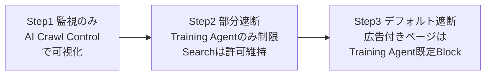

- Step1: まず AI Crawl Control と Bot Analytics で現状のクローラー内訳を把握します。遮断は行わず実態把握を優先します
- Step2: Training / Agent のみを対象に制限を始めます。Search は許可を維持し、検索流入への影響を避けます
- Step3: 9/15 以降のデフォルト挙動（広告付きページは Training / Agent が既定 Block、Search は既定 Allow）に合わせて全体設計を固めます。既定変更前にダッシュボードで自サイトの設定を確認・調整しておきます

### SEO・検索インデックスへの影響回避

- Search は許可、Training / Agent は絞る、という設計を徹底します。Googlebot・Applebot・Bingbot は Search と Training の両方で分類されるため、Training を一律 Block すると意図せず検索クローラーも止まる場合があります
- Cloudflare の Block は robots.txt よりも強制力が強く、Google 側が無視できる助言的な指示とは異なります。誤ってブロックすると、インデックス削除・順位低下に直結します
- 変更前後は Search Console 等でクロールエラー・インデックス数の推移を監視し、異常があれば速やかにルールを戻せる体制にしておきます

### 契約・監査との整合

- ライセンス契約や Pay Per Crawl の契約条件と、実際のアクセス制御設定（Allow / Block / Charge）が一致しているかを、Audit Logs と AI Crawl Control の Crawlers タブで定期的に突合します
- 契約更新・停止のタイミングでは、該当クローラーのアクセス設定変更を Audit Logs に記録し、変更理由をコメントとして残す運用にします

### robots.txt と WAF の二層防御

| 層 | 役割 | 強制力 |
|---|---|---|
| robots.txt（Content Signals 含む） | クローラーへの意思表示。宣言ベース | 任意。誠実なクローラーのみ遵守 |
| WAF / AI Crawl Control（Block） | 実際のアクセス遮断。技術的強制 | 強制。リクエスト自体を拒否 |

- robots.txt は「意思表示」に過ぎず、悪意あるクローラーやステルスクローラーには効果がありません。実効性のある遮断は WAF / AI Crawl Control の Block 設定で担保します
- 誠実な Verified Bot には robots.txt レベルの緩やかな制御で十分ですが、未検証・非協力的なクローラーには WAF 側の技術的遮断を必ず併用します

### Content Signals の法的位置づけ（限界の明示）

- Content Signals（`search` / `ai-input` / `ai-train`）は robots.txt に記述する **意思表示**であり、スクレイピングに対する **技術的な対抗策ではありません**
- ポリシー文には EU 著作権指令 2019/790 第 4 条（テキスト・データマイニングの権利留保）を意識した文言が含まれ、機械可読な形で権利留保の意思表示をする点では一定の法的意味を持ち得ます。ただし、これは「オプトアウトの意思表示の方式」を満たす候補という位置づけであり、各法域での効力は確定していません
- 従う義務を法的に強制する仕組みではないため、**シグナルを無視する事業者が存在する前提** で設計する必要があります。実効性を求める箇所は WAF による技術的遮断で補完します
- managed robots.txt を有効化したサイトには、managed content として既定で `Content-Signal: search=yes, ai-train=no, use=reference` が挿入されます。`ai-input` は意図的に未設定（中立）のままとし、サイト所有者の明示的な選択を待つ方針です。自前の robots.txt も managed 機能も持たない Free ドメインには、リクエスト時にコメント形式の human-readable なポリシー文のみが動的に提示されます（`Content-Signal` 宣言は付きません）

## トラブルシューティング

| 症状 | 原因 | 対処 |
|---|---|---|
| 正規の検索 bot（Googlebot 等）を誤遮断し、検索順位・インデックスが低下した | Googlebot / Applebot / Bingbot は Search と Training の両方に分類される複合目的クローラー。Training を一律 Block すると Search 分も止まる | 行為分類の粒度を見直し、Training のみ Block・Search は Allow に設定を分離する。9/15 のデフォルト変更前にダッシュボードで自サイトの設定を確認する。Search Console でクロールエラー・インデックス推移を監視し、異常があれば即座にルールを戻す |
| robots.txt で `Disallow` や `Content-Signal: ai-train=no` を宣言しても、一部の AI クローラーがクロールを続ける | robots.txt は任意の意思表示であり法的強制力がない。悪意あるクローラーは単純に無視する。Perplexity は宣言済み Bot をブロックされると、一般ブラウザを装った User-Agent や IP ローテーション、ASN 変更でステルスクロールを行っていた事例が Cloudflare により報告されている | robots.txt だけに頼らず WAF / AI Crawl Control の技術的 Block を併用する。Cloudflare は fingerprint 技術（機械学習 + ネットワーク信号）でステルスクローラーを検出し、Verified Bot リストから除外・WAF 管理ルールにステルス署名を追加する対応を取っている。自社でも新規テストドメインで robots.txt 全面禁止を設定し、実際にクロールされるか定期的に検証すると早期発見につながる |
| Google Cloud Workflows や監視ツールなど、正規の自動化ツールが「なりすましボット」として誤ブロックされる | 管理ルールセットが「Googlebot / Bingbot になりすましたリクエスト」を検出する仕組みのため、正規サービスでも標準の IP レンジ外から Bot 風 User-Agent で送信すると誤検知される | 送信元 IP/IP レンジ・URI パス・ASN で識別し、該当の管理ルールをスキップする例外を作成する。例外ルールは管理ルールセットの実行ルールより前に配置する |
| Verified Bot として登録されているはずのクローラーが、逆引き DNS 検証で失敗し verified 扱いにならない | 逆引き DNS 検証は、提供されたドメインサフィックスに対して観測 IP の PTR レコードが正しく設定されている必要がある。PTR 未設定やドメイン不一致だと検証が通らない | クローラー運営者側で IP アドレスに正しい PTR レコードを設定し、Cloudflare に提供するドメインサフィックス・User-Agent パターンと整合させる。可能であれば逆引き DNS より確実な Web Bot Auth の暗号署名方式に切り替える |
| 9/15 のデフォルト変更後、広告付きページで想定外の Bot が遮断された | 広告表示ページでは Training / Agent が既定 Block、Search が既定 Allow に変更される。広告判定のスキャン対象によっては、開発者向けドキュメントページ等でも広告タグが誤検出される場合がある | 変更前に AI Crawl Control の設定を確認し、意図しない Block が発生していないか Metrics タブで比較する。ページ単位で広告有無の判定がずれる場合は、当該パスに対する WAF 例外ルールを追加する |

## まとめ

Cloudflare は AI トラフィックの制御を「どのボットか」から「Search / Agent / Training という行為分類」へ移し、robots.txt の Content Signals（宣言）と WAF / AI Crawl Control の Block（技術的強制）を二層で組み合わせる設計を全顧客へ広げています。権限境界を「何者か」ではなく「何をするか」で切るこの枠組みは、契約・監査・SEO・収益化（Pay Per Crawl）を同じ軸で揃えられる一方、宣言に強制力はなく無視する事業者が存在する前提で WAF による実効遮断を併用する必要があります。2026-09-15 の新規オンボードドメイン向けデフォルト遮断や旧「Block AI bots」トグルの廃止予定も踏まえ、行為分類での段階導入を早めに設計しておくことが実務上の要点です。

この記事が少しでも参考になった、あるいは改善点などがあれば、ぜひリアクションやコメント、SNSでのシェアをいただけると励みになります！

## 参考リンク

### 概要 / 特徴

- [Your site, your rules: new AI traffic options for all customers](https://blog.cloudflare.com/content-independence-day-ai-options/)
- [Giving users choice with Cloudflare's new Content Signals Policy](https://blog.cloudflare.com/content-signals-policy/)
- [Easily manage AI crawlers with our new bot categories](https://blog.cloudflare.com/ai-bots/)
- [Content Signals](https://contentsignals.org/)

### 構造

- [Bot management · Cloudflare Reference Architecture docs](https://developers.cloudflare.com/reference-architecture/diagrams/bots/bot-management/)
- [Web Bot Auth · Cloudflare bot solutions docs](https://developers.cloudflare.com/bots/reference/bot-verification/web-bot-auth/)
- [WAF phases · Cloudflare Web Application Firewall (WAF) docs](https://developers.cloudflare.com/waf/reference/phases/)
- [Security features interoperability · Cloudflare WAF docs](https://developers.cloudflare.com/waf/feature-interoperability/)

### データ

- [Verified bots · Cloudflare bot solutions docs](https://developers.cloudflare.com/bots/concepts/bot/verified-bots/)
- [Bot reference · Cloudflare AI Crawl Control docs](https://developers.cloudflare.com/ai-crawl-control/reference/bots/)
- [Introducing Pay Per Crawl](https://blog.cloudflare.com/introducing-pay-per-crawl/)

### 構築方法 / 利用方法

- [Overview · Cloudflare AI Crawl Control docs](https://developers.cloudflare.com/ai-crawl-control/)
- [Get started with Cloudflare AI Crawl Control](https://developers.cloudflare.com/ai-crawl-control/get-started/)
- [Manage AI crawlers · Cloudflare AI Crawl Control docs](https://developers.cloudflare.com/ai-crawl-control/features/manage-ai-crawlers/)
- [AI Crawl Control with Cloudflare Bots](https://developers.cloudflare.com/ai-crawl-control/configuration/ai-crawl-control-with-bots/)
- [Block AI Bots · Cloudflare bot solutions docs](https://developers.cloudflare.com/bots/additional-configurations/block-ai-bots/)
- [robots.txt setting · Cloudflare bot solutions docs](https://developers.cloudflare.com/bots/additional-configurations/managed-robots-txt/)
- [Control content use for AI training with Cloudflare's managed robots.txt](https://blog.cloudflare.com/control-content-use-for-ai-training/)
- [Custom rules · Cloudflare WAF docs](https://developers.cloudflare.com/waf/custom-rules/)
- [Create a custom rule via API](https://developers.cloudflare.com/waf/custom-rules/create-api/)
- [Bot Management variables · Cloudflare bot solutions docs](https://developers.cloudflare.com/bots/reference/bot-management-variables/)
- [WAF custom rules configuration using Terraform](https://developers.cloudflare.com/terraform/additional-configurations/waf-custom-rules/)
- [cloudflare_bot_management | Terraform Registry](https://registry.terraform.io/providers/cloudflare/cloudflare/latest/docs/resources/bot_management)
- [cloudflare_ruleset | Terraform Registry](https://registry.terraform.io/providers/cloudflare/cloudflare/latest/docs/resources/ruleset)

### 運用 / ベストプラクティス / トラブルシューティング

- [Analyze AI traffic · Cloudflare AI Crawl Control docs](https://developers.cloudflare.com/ai-crawl-control/features/analyze-ai-traffic/)
- [What is Pay Per Crawl?](https://developers.cloudflare.com/ai-crawl-control/features/pay-per-crawl/what-is-pay-per-crawl/)
- [Bot Analytics · Cloudflare bot solutions docs](https://developers.cloudflare.com/bots/bot-analytics/)
- [Fake bot managed rules · Cloudflare WAF docs](https://developers.cloudflare.com/waf/troubleshooting/fake-bot-managed-rules/)
- [Audit Logs · Cloudflare Fundamentals docs](https://developers.cloudflare.com/fundamentals/account/account-security/audit-logs/)
- [Admin Activity Logs · Cloudflare One docs](https://developers.cloudflare.com/cloudflare-one/insights/logs/dashboard-logs/admin-activity-logs/)
- [Perplexity is using stealth, undeclared crawlers to evade no-crawl directives](https://blog.cloudflare.com/perplexity-is-using-stealth-undeclared-crawlers-to-evade-website-no-crawl-directives/)
- [Cloudflare's AI crawler rules can block Googlebot (Search Engine Journal)](https://www.searchenginejournal.com/cloudflares-ai-crawler-rules-can-block-googlebot/581385/)
