## ■概要

### 統合の目的と位置づけ

Cloudflare は 2026-05-21、自社の API ベース CASB (Cloud Access Security Broker) に Anthropic Claude の統合を追加した。Cloudflare One ユーザーは、Claude Enterprise 組織内で起きている会話・添付ファイル・プロジェクト共有・生成物 (Artifact)・組織メンバー / ロール構成を、Anthropic が 2025-08 に GA した Compliance API 経由で監査できるようになった。

この統合は「AI 利用統制の論点が入口での遮断から、SaaS 内部に何が残っているかを事後的に見える化する方向へ広がった」ことを示すものである。従来の DLP プロキシや AI Gateway はプロンプト送信時点で危険なデータを止めるが、止めた後の Claude 内部の保存物・共有設定・権限変更は観測対象外だった。CASB の API ベース統合はこのギャップを埋める位置にある。

本統合は「AI SaaS を Microsoft 365 / Google Workspace / Salesforce と同じ統制スタック (CASB / SIEM / IGA / DSP) で扱えるようにする」という方向性の重要な一歩である。

### 主要事実

| 項目 | 値 |
|---|---|
| 発表日 | 2026-05-21 (Beta 表記なし、実質 GA) |
| Anthropic 側プラン要件 | Claude Enterprise (フル機能) / Claude Console (Activity Feed のみ) |
| Claude Team / Pro / Max | 対象外 |
| Cloudflare 側プラン要件 | Cloudflare One (Zero Trust) ユーザー (新規は最初の 2 連携無料) |
| 認証方式 | API key (`x-api-key` ヘッダ) — OAuth ではない |
| API ベース | `https://api.anthropic.com/v1/compliance/*` |
| レート制限 | 600 req/min / parent organization (全 key・全 scope 共有) |
| Activity Feed 保持期間 | 6 年 |
| データレジデンシー | first-party の `inference_geo` は `global` / `us`。workspace geo (at-rest) は `us` のみ。EU/JP は Bedrock/Vertex 経由 |
| Findings 数 | 16 種 (API key hygiene 1 + Access security 6 + DLP 9) |

### 構造的限界 (採用前に必ず認識する事項)

本統合には以下の構造的限界がある。これらは AI 統制設計において CASB を「補助観測コンポーネント」と位置づける根拠となる。

- **検出ラグ**: Claude 上での操作から CASB の finding 生成まで数分〜24 時間の遅延が発生する
- **リアルタイム遮断不可**: API ベース (out-of-band) スキャンのため、操作の即時阻止はできない
- **Cowork / Claude Code CLI の死角**: Compliance API の content エンドポイントは claude.ai の chat/project/artifact が対象で、Cowork のエージェントセッションや Claude Code CLI のローカル実行は coverage 外と報告されている (出典: General Analysis / MintMCP 解説。Cowork の role 有効化自体は Findings ルール「Claude Cowork enabled for role」で検出される)
- **Shadow Claude (個人 Pro / 直接 API 叩き) は不可視**: 組織契約外の利用は構造的に検出できない

したがって本統合は **AI Gateway + CASB のハイブリッド設計の一部品** として位置づけるのが正しい。

---

## ■特徴

### API ベース統合 — エンドポイント・プロキシ不要

Cloudflare CASB は Compliance API を polling する out-of-band 型のスキャナである。エンドポイントエージェントもインライントラフィック検査も不要で、Anthropic 側で Compliance Access Key を発行して Cloudflare に渡すだけで連携が成立する。

> "Cloudflare CASB now consumes this endpoint to surface actionable security findings without requiring inline traffic inspection or endpoint agents." (Cloudflare Blog, 2026-05-21)

導入の摩擦が低い一方、リアルタイム遮断には使えない。検出後に Gateway policy 化することで初めてインライン制御に繋がる。

### 二系統の API キーと最小権限スコープ

Anthropic は Compliance API 用に 2 種類の鍵を分けている。

| 鍵種別 | プレフィックス | 発行場所 | スコープ |
|---|---|---|---|
| Compliance Access Key | `sk-ant-api01-...` | claude.ai > Organization settings > Data and privacy (primary owner のみ) | 全エンドポイント |
| Admin API key | `sk-ant-admin01-...` | Claude Console > Settings > Admin keys (org admin) | Activity Feed のみ |

Compliance Access Key には 4 つの immutable スコープがある。

| スコープ | 権限内容 |
|---|---|
| `read:compliance_activities` | Activity Feed 読み取り |
| `read:compliance_user_data` | chat / message / file / project / **organization users / group members** 読み取り |
| `read:compliance_org_data` | 組織メタデータ (organizations / roles / groups) 読み取り。**ユーザー一覧と group members の取得には `read:compliance_user_data` も別途必要** |
| `delete:compliance_user_data` | chat / file / project の永続削除 |

Cloudflare CASB は read 系 2-3 スコープのみで成立し、`delete:compliance_user_data` は要求しない。スコープが immutable なため、最小権限を誤ると鍵を再発行するしかない点に注意が必要である。

> "A Compliance Access Key with `read:compliance_user_data` can read every chat, file, and project in every linked organization, including content the primary owner has not seen. Treat Compliance Access Keys like production database credentials." (Anthropic Docs)

### 検出される 16 種類の Findings

Cloudflare 側で検出されるルールは 3 カテゴリ 16 種類である。

**API Key Hygiene (1 件)**

| Finding 名 | 重要度 |
|---|---|
| Anthropic: Unused API key | Medium |

**Access Security (6 件)**

| Finding 名 | 重要度 | 検出対象 |
|---|---|---|
| Anthropic: High-privilege invite | High | 高権限ロールへの招待 |
| Anthropic: Stale pending invite | Low | 未受諾の期限切れ招待 |
| Anthropic: Claude Project visible across organization | Low | 組織全体に公開されたプロジェクト |
| Anthropic: Claude Cowork enabled for role | High | ロールへの Cowork 機能有効化 |
| Anthropic: Claude Connector always allowed enabled for role | High | 外部 Connector の無条件許可 |
| Anthropic: Claude for Chrome enabled for role | High | Chrome 拡張 (browser agent) の有効化 |

**Data Loss Prevention (9 件、全件 High — DLP プロファイル設定が前提)**

| Finding 対象 |
|---|
| Chat のダウンロード可能ファイル |
| Chat のプロンプト |
| Chat のレスポンス |
| Chat のアップロードファイル |
| Chat のプロバイダー生成ファイル |
| プロジェクトファイル |
| プロジェクトドキュメント |
| Artifacts |
| プロジェクト指示 (system prompt 相当) |

DLP プロファイルは Cloudflare 側で定義した正規表現・MIP ラベル・PCI/PII 検出器を Anthropic 上の保存物に適用する形となる。

### parent / linked org モデルによる取得範囲

Claude Enterprise は parent organization (identity 集約) の下に複数の linked organizations (claude.ai 系 / Claude Console 系) がぶら下がる構造を採っている。

- **ディレクトリ系 (linked org 横断)**: organizations, users, roles, groups
- **コンテンツ系 (claude.ai のみ)**: chats, chat messages, files, projects, project attachments, artifacts, project instructions

Claude Console (API Platform) 単独組織には chat 本文がそもそも存在しないため、Compliance API は Activity Feed までしか返さない。

### Finding から Gateway Policy への昇格

Cloudflare が主張する差別化点は、CASB 検出を同じ Cloudflare スタック内の Gateway インライン制御に分単位で繋げられることである。

> "A detected security finding in Claude, such as a user uploading files containing sensitive data, can become a Gateway policy in minutes, and you can use Gateway to block uploads to Claude for specific users, restrict access to the application entirely, or limit functionality until the issue is resolved." (Cloudflare Blog, 2026-05-21)

このループが API ベース CASB の検出ラグ問題を緩和する設計上の答えとなっている。ただし「分単位」の自動化の程度 (UI 1 クリックか手動コピーか) は公式 docs に明記がない。

### Cloudflare One スタック内での位置関係

本統合は Cloudflare One (Zero Trust) の中の CASB モジュールとして機能する。関連コンポーネントとの役割分担は以下のとおりである。

| 制御点 | 担当レイヤー | リアルタイム性 | 取り扱う情報 |
|---|---|---|---|
| 入口 (DNS/HTTP) | Cloudflare Gateway | リアルタイム | URL / SNI / HTTP method |
| プロンプト送信時 | AI Gateway / Prompt Firewall | リアルタイム (TTFT 影響あり) | prompt 本文 / 添付 |
| **保存後の監査** | **CASB (本統合)** | **1h〜24h ラグ** | **会話・添付・プロジェクト・権限** |
| ログ集約 / 長期分析 | SIEM (Logpush 経由) | バッチ | Activity Feed (6 年保持) |
| Shadow AI 検出 | Gateway (HTTP ログ) | 準リアルタイム | 個人 AI SaaS の利用検知 |
| アイデンティティ | IdP (Okta/Entra) + SCIM | 即時 (provisioning) | ユーザ / グループ / ロール |

### Claude Enterprise 管理機能スタック内での位置

Claude Enterprise 側の管理機能と本統合の関係を整理する。

| 機能 | 説明 | CASB との関係 |
|---|---|---|
| Compliance API | 会話・ファイル・組織メタデータの programmatic 取得 | CASB のデータ源 (polling 対象) |
| Activity Feed | 組織全体のイベントログ (6 年保持) | CASB および SIEM 双方に流れる |
| Admin API | Claude Console 組織管理 (ユーザー・API キー管理) | CASB とは別系統 |
| Analytics API | 使用量・コスト集計 | CASB とは別系統 |
| SCIM / SSO | IdP 経由のユーザープロビジョニング | CASB の「ユーザー可視化」を補完 |
| Audit Log CSV Export | claude.ai の別機能 (ルックバック上限あり、CSV のみ) | CASB とは補完関係 |

### Compliance API パートナー生態系の中での位置

Anthropic は Compliance API を 28 以上のパートナーに開放しており、Cloudflare はその 1 つである。

| カテゴリ | パートナー例 |
|---|---|
| CASB / SASE | Cloudflare, Palo Alto Networks |
| SIEM / SecOps | CrowdStrike, ReliaQuest, Cribl Stream |
| Identity | Okta, SailPoint |
| eDiscovery / DSP | Rubrik |

「Cloudflare 集約」がロックインかどうかは設計次第で、同じ Compliance API を別ベンダー経由で読むことも可能である。

---

### 他社 CASB との比較

### 比較テーブル

| 観点 | Cloudflare CASB | Netskope (NewEdge AI) | Palo Alto Prisma Access | Microsoft Defender for Cloud Apps | LLM Gateway 派 (Portkey 等) |
|---|---|---|---|---|---|
| Claude 制御点 | Compliance API pull (out-of-band) | inline GenAI DLP + Tenant Restriction | inline DLP + SaaS App Mgmt | Purview unified audit (Connector 整備中) | 自前 proxy で全 LLM トラフィック把握 |
| リアルタイム性 | 数分〜数時間 (scan event 起点) | inline (ms オーダー) | inline (ms オーダー) | ログ転送 (分オーダー) | inline (ms オーダー) |
| Anthropic 統合の有無 | Compliance API ターンキー (2026-05) | Tenant Restriction + GenAI DLP | Tenant Restriction + SaaS App Mgmt | Connector 整備中 | proxy 経由で対応 |
| Cowork / CLI 死角 | あり (Compliance API 死角に依存) | inline 化で部分カバー可 | inline 化で部分カバー可 | 端末ログ統合次第 | proxy 経由なら可視 |
| 個人プラン Shadow IT 検出 | 不可 (Gateway 併用で部分補完) | URL カテゴリ / SWG で部分検出 | 同左 | Discovery で部分検出 | proxy 経由のみ可視 |
| リアルタイム遮断 | 不可 (Gateway 連携で代替) | 可能 | 可能 | 可能 | 可能 |
| 統合 SKU | Cloudflare ZT Enterprise 必須 | SSE 専業契約 | NGFW + Prisma 抱き合わせ | M365 E5 同梱可 | LLM 利用量比例 |
| AI 固有機能 | 補助観測 (DLP プロファイル連携) | inline DLP + GenAI 分類 | 同左 | Purview AI controls | token budget / model route / safety eval |
| Gartner SSE 2026 位置 | Visionary/Challenger | Leader | Leader | Leader | 対象外 (専業カテゴリ) |
| 強み | Compliance API ターンキー・Cloudflare One 一元管理 | 大量 SSE 顧客基盤 + AI Fast Path | NGFW 既存資産活用 | E5 既得層への展開 | model-aware governance |
| 弱み | retrospective / Cowork 不可視 | Anthropic Connector 成熟度 | 統合の複雑さ | Anthropic 統合まだ薄い | 自前運用コスト |

### Cloudflare CASB の固有の強みと弱み

**強み**

- Anthropic Compliance API を業界最速でターンキー統合した
- Cloudflare One スタック (Gateway / Access / AI Gateway / DLP / SIEM Logpush) との一体化により、Finding から Gateway policy 化まで分単位で完結できる
- エンドポイントエージェント・インラインプロキシ不要で導入摩擦が低い
- Cloudy (社内 LLM) による Findings の平易な説明文が自動付与される (2026-02 以降)
- Webhook (2026-04 以降) による SOAR 連携で semi-realtime 対応が可能

**弱み**

- API ベース (out-of-band) のため、検出は本質的に事後検出 (1h〜24h ラグ)
- リアルタイム遮断は自前ではできず、Gateway 連携が前提
- Cowork / Claude Code CLI が Compliance API 死角であるため、CASB の観測対象外
- 個人 Pro / Shadow Claude は構造的に不可視
- Cloudflare Zero Trust Enterprise 契約が前提で SMB には届きにくい
- false positive は Cloudflare 公式が認めており、triage 負荷が発生する

---

## ■構造

### ●システムコンテキスト図

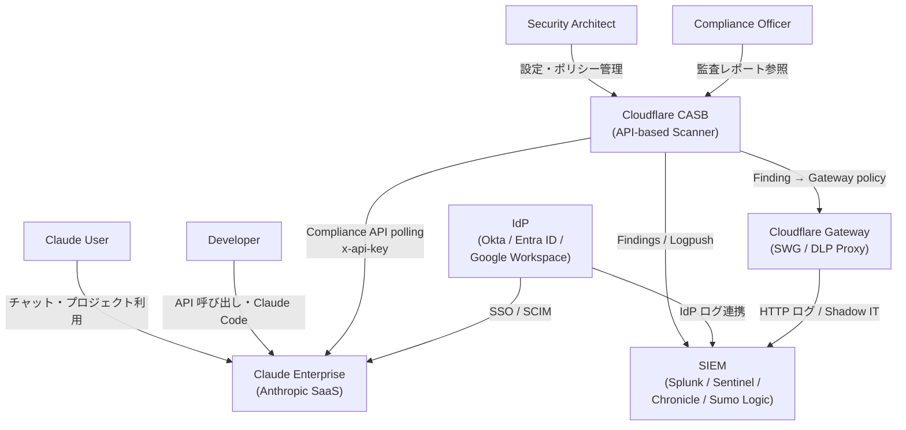

| 要素名 | 説明 |
|---|---|
| Security Architect | CASB のポリシー設定・統合設計を担う役割 |
| Compliance Officer | Findings・監査レポートを参照してコンプライアンス証跡を管理する役割 |
| Claude User | claude.ai でチャット・プロジェクトを利用するエンドユーザー |
| Developer | Claude API や Claude Code CLI を使う開発者 |
| Cloudflare CASB | Compliance API を polling して Findings を生成する out-of-band スキャナー |
| Claude Enterprise | Anthropic が提供する企業向け AI SaaS。Compliance API を公開する |
| SIEM | Splunk / Microsoft Sentinel / Google Chronicle / Sumo Logic 等のログ集約・分析基盤 |
| IdP | Okta / Microsoft Entra ID / Google Workspace 等の ID プロバイダー。SSO と SCIM を提供 |
| Cloudflare Gateway | DNS / HTTP インライン制御。入口 DLP と Shadow AI 検出を担う |

---

### ●コンテナ図

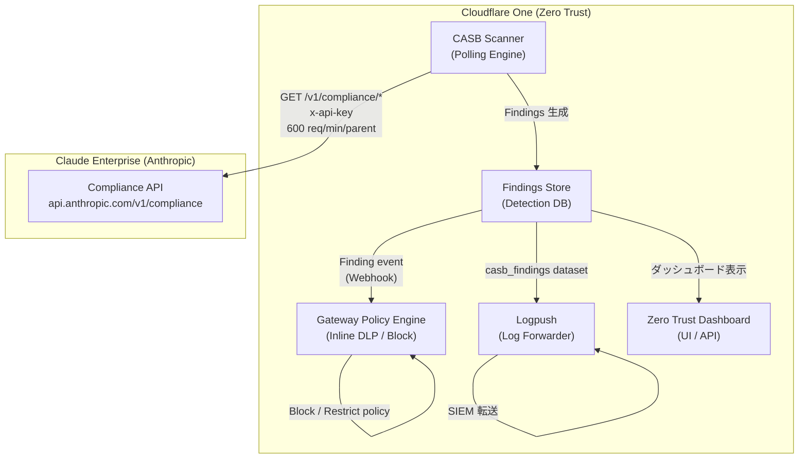

| 要素名 | 説明 |
|---|---|
| CASB Scanner | Compliance API を out-of-band で polling し、16 種の Findings ルールを適用するスキャンエンジン |
| Findings Store | 検出された Findings を保管する内部 DB。severity / category / asset_type で構造化 |
| Gateway Policy Engine | CASB Finding を受けてインライン制御ポリシーを生成・適用する。Finding → Gateway policy 化を分単位で実現 |
| Logpush | casb_findings データセットを外部 SIEM に転送するログパイプライン (Splunk HEC / Azure Blob / S3 / GCS 等) |
| Zero Trust Dashboard | Findings の可視化・トリアージ UI。Cloudy Summaries (AI 要約) を表示 |
| Compliance API | Claude Enterprise が公開する監査用 REST API。Activity Feed・コンテンツ・ディレクトリの 3 系統を提供 |

---

### ●コンポーネント図

#### Compliance API のコンポーネント

```mermaid
graph TD
    subgraph CAPI["Compliance API (api.anthropic.com/v1/compliance)"]
        direction TB

        subgraph AUTH["認証レイヤー"]
            KEY1["Compliance Access Key<br/>sk-ant-api01-...<br/>(Primary Owner 発行)"]
            KEY2["Admin API Key<br/>sk-ant-admin01-...<br/>(Org Admin 発行)"]
        end

        subgraph SCOPE["スコープ (immutable)"]
            S1["read:compliance_activities"]
            S2["read:compliance_user_data"]
            S3["read:compliance_org_data"]
            S4["delete:compliance_user_data"]
        end

        subgraph EP_AF["Activity Feed エンドポイント"]
            AF["GET /v1/compliance/activities<br/>limit max 5000<br/>cursor pagination"]
        end

        subgraph EP_DIR["Directory エンドポイント"]
            ORG["GET /v1/compliance/organizations"]
            USR["GET /v1/compliance/organizations/{uuid}/users"]
            ROLE["GET /v1/compliance/organizations/{uuid}/roles"]
            GRP["GET /v1/compliance/groups"]
        end

        subgraph EP_CNT["Content エンドポイント<br/>(claude.ai org のみ)"]
            CHT["GET /v1/compliance/apps/chats<br/>user_ids 最低1件必須"]
            MSG["GET /v1/compliance/apps/chats/{id}/messages"]
            PRJ["GET /v1/compliance/apps/projects"]
            ATT["GET /v1/compliance/apps/projects/{id}/attachments"]
            ART["GET artifacts (versioned)"]
            FIL["GET /v1/compliance/apps/chats/files/{id}/content"]
        end

        subgraph RL["レート制限"]
            R1["600 req/min / parent org<br/>全 key + 全 endpoint で共有"]
        end
    end

    KEY1 -->|"全エンドポイント利用可"| EP_AF
    KEY1 -->|"全エンドポイント利用可"| EP_DIR
    KEY1 -->|"全エンドポイント利用可"| EP_CNT
    KEY2 -->|"Activity Feed のみ"| EP_AF

    S1 -->|"必要"| AF
    S2 -->|"必要"| USR
    S2 -->|"必要"| CHT
    S2 -->|"必要"| MSG
    S2 -->|"必要"| ATT
    S2 -->|"必要"| ART
    S2 -->|"必要"| FIL
    S3 -->|"必要"| ORG
    S3 -->|"必要"| ROLE
    S3 -->|"必要"| GRP
```

| 要素名 | 説明 |
|---|---|
| Compliance Access Key (sk-ant-api01-...) | claude.ai の Primary Owner のみが発行可能。全 Compliance API エンドポイントにアクセス可能 |
| Admin API Key (sk-ant-admin01-...) | Claude Console の Org Admin が発行。Activity Feed のみアクセス可能 |
| read:compliance_activities | Activity Feed の読み取りを許可するスコープ。全 linked org の audit events を 6 年保持 |
| read:compliance_user_data | chat / message / file / project / org users / group members の読み取りを許可 |
| read:compliance_org_data | organization メタデータ / roles / groups の読み取りを許可。**user listings / group membership には read:compliance_user_data も併用必須** |
| delete:compliance_user_data | chat / file / project の物理削除を許可。Cloudflare CASB は要求しない |
| GET /v1/compliance/activities | 全組織の audit event ストリーム。cursor pagination。最大 limit 5000 |
| GET /v1/compliance/organizations | linked organizations の列挙。ページングなし・最大 1,000 件 (超過時は 500 Internal Server Error 「Response exceeds maximum of 1,000 organizations」が返るため Anthropic サポートに問い合わせる) |
| GET /v1/compliance/apps/chats | claude.ai の会話一覧。user_ids 最低 1 件必須 |
| GET /v1/compliance/apps/chats/{id}/messages | 会話内の prompt / response を取得 |
| GET /v1/compliance/apps/projects | project 一覧。共有設定・visibility を含む |
| GET /v1/compliance/apps/projects/{id}/attachments | project 添付ファイル (project_file / project_doc) |
| artifacts (versioned) | claude_artifact_version_* 単位で版管理。DLP スキャンは全バージョン対象 |
| 600 req/min / parent org | 全 key・全 linked org・全 endpoint が共有する単一の rate limit |

#### CASB Scanner のコンポーネント

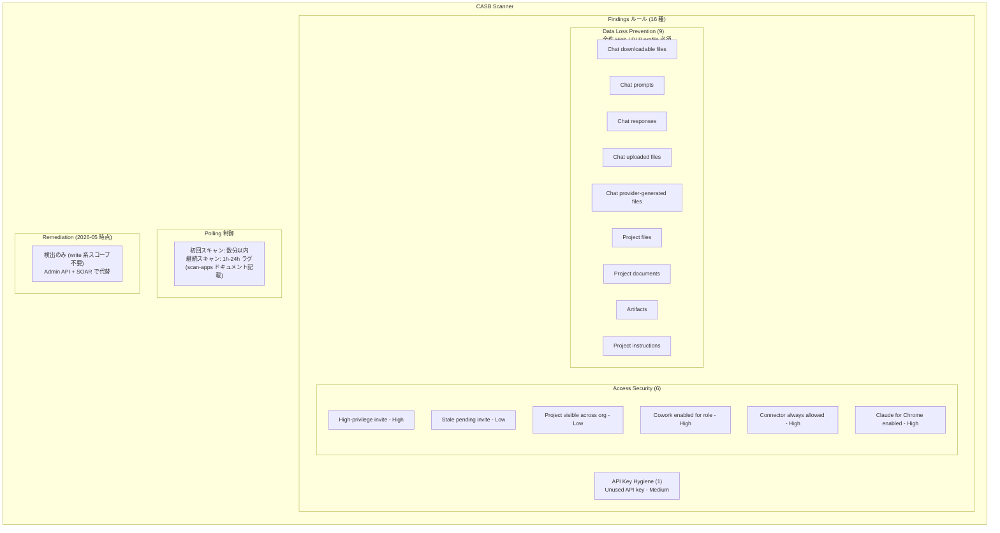

| 要素名 | 説明 |
|---|---|
| Unused API key | 未使用の Anthropic API key を Medium 重要度で検出 |
| High-privilege invite | 高権限ロールへの招待を High で検出 |
| Stale pending invite | 保留中の期限切れ招待を Low で検出 |
| Project visible across org | 組織横断公開プロジェクトを Low で検出 |
| Cowork enabled for role | マルチユーザーコラボ (Cowork) が有効なロールを High で検出 |
| Connector always allowed | 外部 connector を無条件許可したロールを High で検出 |
| Claude for Chrome enabled | Chrome 拡張エージェントが有効なロールを High で検出 |
| DLP (9 種) | Cloudflare DLP プロファイル (PCI/PII/PHI/正規表現) を Claude 保存物に適用。全件 High |
| Polling 制御 | 初回は数分で findings 表示。継続スキャンは 1h〜24h ラグ (API-based CASB 共通の制約) |
| Remediation | 2026-05 時点で Claude 向け自動修復は未提供。検出後は Anthropic Admin API + SOAR で代替 |

---

### ●ネットワーク構成図

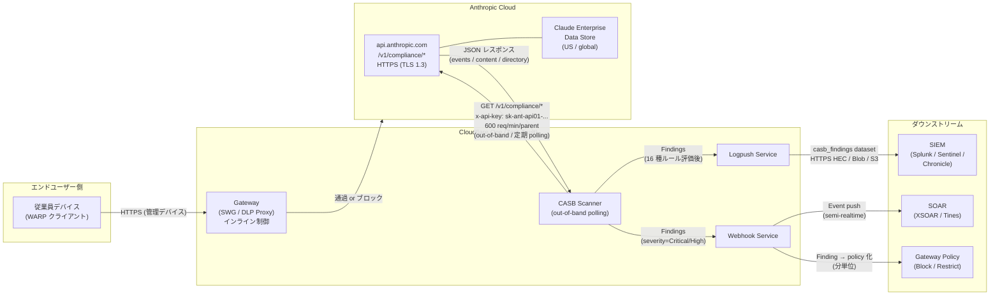

| 要素名 | 説明 |
|---|---|
| 従業員デバイス (WARP) | Cloudflare WARP クライアント経由で Gateway を強制経由させる管理デバイス |
| Gateway (SWG / DLP Proxy) | HTTPS インライン検査。アップロード前 DLP ブロックと Shadow AI 検出を担う。リアルタイム遮断可能 |
| CASB Scanner | api.anthropic.com に対して HTTPS GET を定期 polling。エンドポイントエージェント / プロキシ不要の out-of-band 方式 |
| api.anthropic.com /v1/compliance/* | Compliance API のエントリポイント。認証は x-api-key ヘッダ (OAuth ではない) |
| Claude Enterprise Data Store | Compliance API が読み取る実データの保存先。データレジデンシーは US / global のみ (first-party) |
| Logpush Service | casb_findings データセットを SIEM に継続転送。Splunk HEC / Azure Blob / S3 / GCS に対応 |
| Webhook Service | 2026-04 以降。Finding 発生時に外部 SOAR / チャットへ event を push (到達は秒オーダー、ただし検出まで 1h-24h のラグあり) |
| Gateway Policy | CASB Finding を受けて動的に生成されるインラインブロックポリシー。「分単位」で適用可能 (Cloudflare 表現) |

---

## ■データ

### ●概念モデル

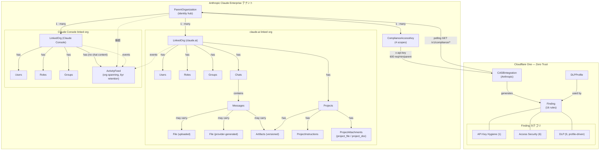

### 所有関係と利用関係の補足

| 関係 | 方向 | 多重度 |
|---|---|---|
| ParentOrganization → LinkedOrganization | 所有 | 1 : many |
| ParentOrganization → ComplianceAccessKey | 所有 | 1 : many |
| LinkedOrganization (claude.ai) → Chat | 所有 | 1 : many |
| Chat → Message | 所有 | 1 : many |
| Message → File (uploaded) | 利用 | 1 : many (0..1 per message) |
| Message → File (provider-generated) | 利用 | 1 : many (0..1 per message) |
| Message → Artifact (version) | 利用 | 1 : many (0..1 per message) |
| Project → ProjectAttachment | 所有 | 1 : many |
| Project → Artifact | 所有 | 1 : many |
| CASBIntegration → Finding | 生成 | 1 : many |
| DLPProfile → Finding (DLP category) | 利用 | many : many |
| ActivityFeed | ParentOrg 横断 (claude.ai + Console) | — |

---

### ●情報モデル

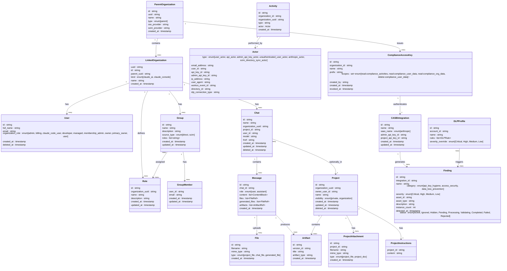

---

### ●エンティティ補足説明

#### ParentOrganization / LinkedOrganization

- ParentOrganization は claude.ai 上にのみ存在し、Claude Console (`platform.claude.com`) には表示されない
- LinkedOrganization の `kind` は `claude_ai`（会話・プロジェクトコンテンツを保持）か `claude_console`（APIワークロード管理のみ、chat content なし）
- `uuid` (標準 UUID 形式) と `id` (`org_`プレフィックス形式) が共存し、前者が正規識別子

#### User

- `organization_role` は built-in 9 値の enum: `admin`, `billing`, `claude_code_user`, `developer`, `managed`, `membership_admin`, `owner`, `primary_owner`, `user`
- アクティブメンバーのみ List に返る (削除ユーザーは即時消滅するが Activity Feed では 6 年間 `user_*` ID で索引可能)

#### Chat / Message

- Chat の `deleted_at` は soft-delete（UI から削除）時に設定。hard-delete（Compliance API DELETE）後は 404 で不可視
- Message の `content` は `[{ type: "text", text: "..." }]` 配列
- `files` (ユーザーアップロード、`claude_file_*` ID)、`generated_files` (AI 生成バイナリ、`claude_gen_file_*` ID)、`artifacts` (versioned テキスト、`claude_artifact_version_*` ID) の 3 種は null 可

#### File

- `id` プレフィックスで種別を区別:
  - `claude_file_*` — ユーザーアップロード (chat & project 共用エンドポイント)
  - `claude_gen_file_*` — AI ツール生成バイナリ
  - `claude_proj_doc_*` — プロジェクトドキュメント (text/plain のみ)
- ダウンロードレスポンスは `Content-Disposition`, `Content-Type`, `Content-MD5` (RFC 1864), `Transfer-Encoding: chunked` ヘッダ付き

#### Artifact

- `id` (安定識別子) と `version_id` (`claude_artifact_version_*`) の 2 層構造
- 同一 Artifact が複数の assistant ターンで改版されるたびに新しい `version_id` が発行される
- ダウンロードは `version_id` 指定 (テキスト本体)

#### ProjectAttachment

- `type` discriminator: `project_file` (binary, `claude_file_*`) / `project_doc` (text/plain, `claude_proj_doc_*`)
- ページネーションは page token 方式 (`next_page`)

#### Activity / Actor

- Activity の `type` は "hundreds of distinct" 値が存在。代表例: `claude_chat_created`, `claude_file_uploaded`, `rbac_role_assigned`, `compliance_api_accessed`, `sso_login_initiated`, `org_join_proposal_decided`
- Actor union: `type` discriminator で 6 種を区別。`scim_directory_sync_actor` の `idp_connection_type` で `OktaSCIMV2` / `AzureSCIMV2` を区別可能
- Activity Feed は最新順 (newest-first) cursor pagination (`after_id` / `before_id`、`first_id` / `last_id` で返却)
- `limit` デフォルト 100、最大 5,000。全エンドポイント合計 600 req/min/parent org の rate limit を共有

#### ComplianceAccessKey

- プレフィックス `sk-ant-api01-...`、claude.ai primary owner のみ発行可
- `scopes` は作成後 immutable (変更には新規発行 + 旧鍵削除が必要)
- Admin API key (`sk-ant-admin01-...`) は `read:compliance_activities` スコープのみ、content 系エンドポイントは 403

#### Finding (Cloudflare CASB)

| フィールド | 型 | 値/例 |
|---|---|---|
| `id` | string | Finding 固有 ID |
| `integration_id` | string | CASBIntegration ID |
| `name` | string | "Anthropic: Unused API key" 等 |
| `category` | enum | `api_key_hygiene`, `access_security`, `data_loss_prevention` |
| `severity` | enum | `Critical`, `High`, `Medium`, `Low` |
| `asset_id` | string | 対象リソース ID (API key ID / user ID / project ID 等) |
| `asset_type` | string | "api_key", "user", "project" 等 |
| `description` | string | 検出内容テキスト |
| `instance_count` | int | 同一 Finding の発生件数 |
| `detected_at` | timestamp | 初回検出日時 |
| `status` | enum | `Active`, `Ignored`, `Hidden`, `Pending`, `Processing`, `Validating`, `Completed`, `Failed`, `Rejected` |

DLP Finding 固有フィールド: `file_name`, `file_link`, `dlp_profiles` (マッチした DLP プロファイル ID 配列)

#### DLPProfile (Cloudflare 側)

- Cloudflare Zero Trust 側で定義。正規表現・MIP 感度ラベル・PCI/PII 検出器をルールとして持つ
- `rules` は DLPRule オブジェクトのリスト (名称・パターン・エントリ数)
- `severity_override` で Finding の severity を上書き可能
- CASB Integration に複数プロファイルを紐付け可。DLP Finding はプロファイルマッチ時のみ発生

---

### ●ページネーション方式まとめ

| エンドポイント群 | ソート順 | 方式 | パラメータ |
|---|---|---|---|
| Activities | newest-first | cursor | `after_id` / `before_id` (返却: `first_id` / `last_id`) |
| Chats / chat messages | oldest-first | cursor | 同上 |
| Projects / attachments / users / roles / groups / group members | endpoint-specific | page token | `page` (返却: `next_page`) |
| Organizations / files | — | ページネーションなし (1 回で全件) | — |

---

## ■構築方法

### 必須パラメータテーブル

統合を動作させるために必要なキー・スコープ・発行場所を一覧で示す。

| キー種別 | プレフィックス | 発行場所 | 必要ロール | Compliance API でのスコープ | CASB スキャン要否 |
|---|---|---|---|---|---|
| **Compliance Access Key** | `sk-ant-api01-...` | claude.ai > Organization settings > Data and privacy | **Primary Owner のみ** | `read:compliance_activities`<br>`read:compliance_user_data`<br>`read:compliance_org_data`<br>`delete:compliance_user_data` (任意) | **必須** (DLP/content scanning) |
| **Admin API key** | `sk-ant-admin01-...` | Claude Console > Settings > Admin keys | org admin | `read:compliance_activities` のみ | 可 (Activity Feed のみ) |
| Analytics API key | — | claude.ai > Analytics > API keys | — | Compliance API 非対象 | 不可 |
| Claude API key | `sk-ant-api03-...` | Claude Console > Settings > API keys | — | Compliance API 非対象 | 不可 |

**CASB 推奨構成**: Compliance Access Key に `read:compliance_activities` + `read:compliance_user_data` + `read:compliance_org_data` の 3 スコープを付与し、`delete:compliance_user_data` は**別の read-only キーと分離**して発行する。スコープは作成後 **immutable** (変更不可・再発行必須)。

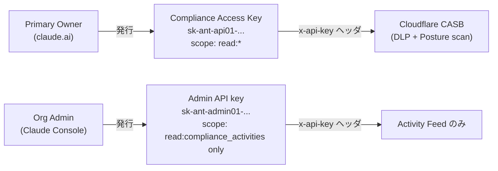

---


### 前提条件

| 条件 | 詳細 |
|---|---|
| Claude Enterprise 契約 | Compliance API のフル機能 (chat/file/project DLP スキャン) に必須。Claude Console (Platform) 組織は Activity Feed のみ。Team / Pro / Max は対象外 |
| Cloudflare One 契約 | Cloudflare Zero Trust の有償 SKU。新規顧客は最初の 2 CASB 連携が無料 |
| Primary Owner の存在 | Compliance Access Key の発行は claude.ai の primary owner のみ可能。Admin API key は Console org admin が発行可能 |
| Anthropic 担当への連絡 | Compliance API は **オンリクエストで有効化**。自動では有効にならない |

### Anthropic 側セットアップ

#### Compliance API 有効化リクエスト

Anthropic 担当者 (Account Executive または Customer Success Manager) に Compliance API 有効化を依頼する。有効化はテナントの **parent organization レベル** で行われ、すべての linked organizations (claude.ai 系・Claude Console 系) に自動で波及する。

有効化後:
- claude.ai 組織: `Organization settings > Data and privacy` に **Compliance access keys** セクションが出現
- Claude Console 組織: 新規作成の Admin API key に `read:compliance_activities` スコープが付与される (有効化前に作成した Admin API key は scope を持たず 403 を返す — 再発行が必要)

#### Compliance Access Key 発行手順

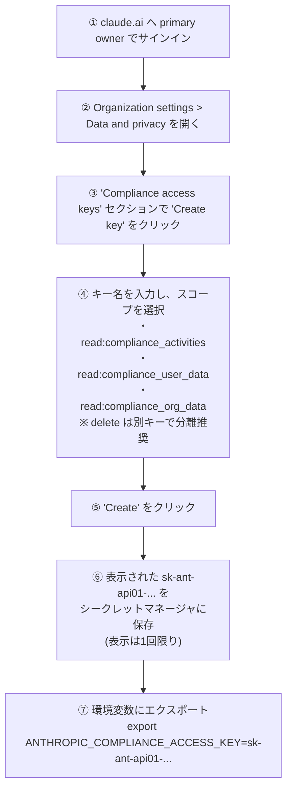

**スコープ選定指針**:

| スコープ | 付与する権限 | CASB に必要か |
|---|---|---|
| `read:compliance_activities` | Activity Feed 読み取り | 必要 (イベント監査) |
| `read:compliance_user_data` | chat / file / project / users / group members 読み取り | 必要 (DLP content scan) |
| `read:compliance_org_data` | organizations / roles / groups メタデータ読み取り | 推奨 (user名解決・posture) |
| `delete:compliance_user_data` | chat / file / project の永続削除 | **不要** (CASB は read のみ) |

> 警告: `read:compliance_user_data` を持つキーは、primary owner が未読の会話を含む**組織内すべてのチャット・ファイル・プロジェクト**を読める。本番 DB 認証情報と同等に扱い、ソースコードや SIEM 設定ファイルへの埋め込みは厳禁。シークレットマネージャに格納すること。

#### スコープ確認・ローテーション

発行済みキーのスコープ確認は以下の方法で行う:

- **UI**: `claude.ai > Organization settings > Data and privacy > Compliance access keys` の Scopes 列を参照
- **キープレフィックス**: `sk-ant-api01-...` = Compliance Access Key (スコープは作成時に指定)
- **API エラー**: スコープ不足時は 403 レスポンスボディに `Got: [...]` / `Needed: [...]` が明示される

```json
{
  "error": {
    "type": "permission_error",
    "message": "Missing required scopes. Got: ['read:compliance_activities'] Needed: ['read:compliance_user_data']"
  }
}
```

ローテーション手順 (無停止):
1. 同スコープで新キーを発行
2. 統合先 (Cloudflare CASB) に新キーを設定
3. 動作確認
4. 旧キーを削除

### Cloudflare 側セットアップ

#### Zero Trust ダッシュボードでの Anthropic 統合追加

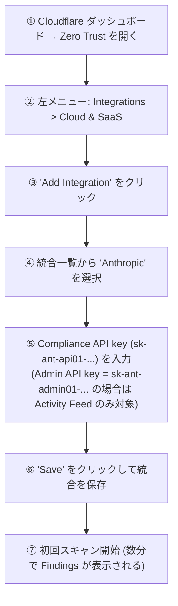

**操作パス**: `Zero Trust > Integrations > Cloud & SaaS > Add Integration > Anthropic`

入力値:
- **Organization-level admin key**: Compliance Access Key (`sk-ant-api01-...`) を貼り付け。DLP/posture findings の検出には `read:compliance_user_data` が含まれるキーが必要
- 保存後、スキャンが即時開始し数分以内に Findings ダッシュボードに検出結果が表示される

#### DLP プロファイル設定

CASB の DLP カテゴリ (9 件) を有効化するには、Cloudflare DLP プロファイルを事前に作成・紐付けする必要がある。

**DLP プロファイル作成手順** (`Zero Trust > Data Loss Prevention > DLP Profiles`):

1. `Create profile` をクリック
2. プロファイル名・説明を入力
3. 以下から検出器を追加:
   - **既定の検出器**: PCI (クレジットカード番号 / CVV)、PII (SSN・メールアドレス・電話番号等)、PHI (医療情報)
   - **正規表現**: 独自の内部識別子や機密コードネームを正規表現で定義
   - **Microsoft Information Protection (MIP) ラベル**: Purview 連携で機密ラベルを再利用
   - **カスタムワードリスト**: 特定の顧客名・プロジェクトコード等のキーワード
4. プロファイルを保存し、Anthropic CASB 統合に紐付け

DLP プロファイルが設定されると、以下のアセットが自動スキャン対象になる:

| DLP Finding 名 | スキャン対象 | Severity |
|---|---|---|
| Downloadable File with DLP Profile match | チャット内のダウンロード可能ファイル | High |
| Claude Chat User Prompt with DLP Profile match | ユーザープロンプトのテキスト | High |
| Claude Chat Assistant Response with DLP Profile match | アシスタントの応答テキスト | High |
| Claude Chat Uploaded File with DLP Profile match | チャットにアップロードされたファイル | High |
| Claude Chat Generated File with DLP Profile match | Claude が生成したファイル (PDF/CSV/スライド等) | High |
| Claude Project File with DLP Profile match | プロジェクト添付ファイル | High |
| Claude Project Document with DLP Profile match | プロジェクトドキュメント (テキスト) | High |
| Claude Chat Artifact with DLP Profile match | Claude 生成の Artifact (コード/Markdown 等) | High |
| Claude Project Instructions with DLP Profile match | プロジェクトのシステムプロンプト | High |

#### 初回スキャン

統合追加直後にスキャンが自動開始する。Cloudflare の説明では「数分以内に Findings が表示される」(初回スキャン)。継続スキャンの周期は公式ドキュメントに明示がないが、通常の API-based CASB は 1〜24 時間ごとに定期実行される。

### Project API key を追加する場合 (任意 scope 拡張)

Claude Console のプロジェクト単位のメタデータまでスキャン対象を広げる場合、**Project-level API key** を追加で設定できる。

- **発行場所**: Claude Console > Settings > API keys (project スコープを選択)
- **付与される追加アクセス**: プロジェクトメタデータおよびプロジェクト固有の API key 情報
- **設定方法**: Cloudflare CASB の Anthropic 統合設定画面で「Add project key」から追加

最小権限原則に従い、プロジェクト操作の監査が不要であれば追加しなくてよい。

---

## ■利用方法

### Findings の確認

#### ダッシュボード表示

Cloudflare Zero Trust ダッシュボードでの確認パス:

```
Zero Trust > Cloud & SaaS findings
```

検出結果は **Posture Findings** (misconfigurations / access security) と **Content Findings** (DLP マッチ) の 2 タブに分かれて表示される。各 Finding には以下の情報が含まれる:

- Finding タイプ名
- Severity (Critical / High / Medium / Low)
- インスタンス数 (同一ルールの検出件数)
- 紐付く統合名 (Anthropic)
- ステータス (Active / Ignored / Remediated 等)
- 検出日時

Cloudflare の社内 LLM "Cloudy" が各 Finding に **plain-language summary** (「なぜリスクか」「どう直すか」) を自動付与する (2026-02 以降)。

#### カテゴリ・asset_type フィルタ

Finding 一覧では以下のフィルタが使用可能:

| フィルタ軸 | 選択肢 |
|---|---|
| Finding タイプ | Posture Findings / Content Findings |
| Severity | Critical / High / Medium / Low |
| Integration | Anthropic / (他の統合) |
| ステータス | Active / Ignored / Hidden / Remediation 中 |

Anthropic 統合の Finding は 3 カテゴリ 16 種:

**API Key Hygiene (1 件)**

| Finding 名 | Severity |
|---|---|
| Anthropic: Unused API key | Medium |

**Access Security (6 件)**

| Finding 名 | Severity |
|---|---|
| Anthropic: High-privilege invite | High |
| Anthropic: Stale pending invite | Low |
| Anthropic: Claude Project visible across organization | Low |
| Anthropic: Claude Cowork enabled for role | High |
| Anthropic: Claude Connector always allowed enabled for role | High |
| Anthropic: Claude for Chrome enabled for role | High |

**Data Loss Prevention (9 件 — DLP プロファイル設定が前提)**

全件 High Severity。前掲の DLP Finding 表を参照。

### Compliance API の直接利用例

Cloudflare CASB はバックグラウンドでこれらの API を polling しているが、セキュリティ担当者が直接呼び出すことも可能。

#### 環境変数の設定

```bash
# Compliance Access Key (claude.ai 発行、DLP/content スキャン用)
export ANTHROPIC_COMPLIANCE_ACCESS_KEY="sk-ant-api01-..."

# Admin API key (Claude Console 発行、Activity Feed のみ)
# export ANTHROPIC_ADMIN_KEY="sk-ant-admin01-..."
```

#### GET /v1/compliance/activities — Activity Feed の取得

```bash
# 最新 1 件を取得
curl --fail-with-body -sS \
  "https://api.anthropic.com/v1/compliance/activities?limit=1" \
  --header "x-api-key: $ANTHROPIC_COMPLIANCE_ACCESS_KEY"
```

```bash
# 期間・イベントタイプで絞り込み
curl --fail-with-body -sS -G \
  "https://api.anthropic.com/v1/compliance/activities" \
  --header "x-api-key: $ANTHROPIC_COMPLIANCE_ACCESS_KEY" \
  --data-urlencode "activity_types[]=claude_file_uploaded" \
  --data-urlencode "activity_types[]=claude_chat_created" \
  --data-urlencode "created_at.gte=2026-05-01T00:00:00Z" \
  --data-urlencode "limit=100"
```

```bash
# ページネーション (next page = older activities)
last_id=$(curl --fail-with-body -sS \
  "https://api.anthropic.com/v1/compliance/activities?limit=100" \
  --header "x-api-key: $ANTHROPIC_COMPLIANCE_ACCESS_KEY" | jq -er '.last_id')

curl --fail-with-body -sS -G \
  "https://api.anthropic.com/v1/compliance/activities" \
  --header "x-api-key: $ANTHROPIC_COMPLIANCE_ACCESS_KEY" \
  --data-urlencode "limit=100" \
  --data-urlencode "after_id=${last_id}"
```

**主要クエリパラメータ**:

| パラメータ | 型 | 説明 |
|---|---|---|
| `limit` | integer | 返却件数 (default 100, max 5000) |
| `after_id` | string | このカーソルより古いイベントを取得 (前進) |
| `before_id` | string | このカーソルより新しいイベントを取得 (後退) |
| `created_at.gte` / `.lte` / `.gt` / `.lt` | RFC3339 | 期間絞り込み |
| `activity_types[]` | string (反復) | イベントタイプ絞り込み |
| `actor_ids[]` | string (反復) | 操作者 ID 絞り込み |
| `organization_ids[]` | string (反復) | 組織 UUID 絞り込み |

#### GET /v1/compliance/apps/chats — チャット一覧の取得

```bash
# 特定ユーザーの 2026-05-01 以降のチャットを取得
curl --fail-with-body -sS -G \
  "https://api.anthropic.com/v1/compliance/apps/chats" \
  --header "x-api-key: $ANTHROPIC_COMPLIANCE_ACCESS_KEY" \
  --data-urlencode "user_ids[]=user_01XyDMpzjS89pFZXqSFUBDr6" \
  --data-urlencode "created_at.gte=2026-05-01T00:00:00Z" \
  --data-urlencode "limit=100"
```

> 注意: `user_ids[]` は **最低 1 個・最大 10 個** が必須。先に `GET /v1/compliance/organizations/{org_uuid}/users` でユーザー ID を取得すること。

#### GET /v1/compliance/apps/chats/{chat_id}/messages — チャットメッセージの取得

```bash
chat_id="claude_chat_01H5CWunD7RpVJ5bHa8RCkja"

curl --fail-with-body -sS \
  "https://api.anthropic.com/v1/compliance/apps/chats/$chat_id/messages" \
  --header "x-api-key: $ANTHROPIC_COMPLIANCE_ACCESS_KEY"
```

レスポンスには `chat_messages` 配列が含まれ、各メッセージに `content` (テキスト)、`files` (ユーザーアップロード)、`generated_files` (Claude 生成ファイル)、`artifacts` (Artifact) の ID が付与される。

#### ファイル・Artifact のダウンロード

```bash
# ユーザーアップロードファイル / プロジェクトファイル (claude_file_* ID)
file_id="claude_file_01UaT9wBcDfGhJkLmNpQrSv7"
curl --fail-with-body -sS -OJ \
  --header "x-api-key: $ANTHROPIC_COMPLIANCE_ACCESS_KEY" \
  "https://api.anthropic.com/v1/compliance/apps/chats/files/$file_id/content"
# -OJ: Content-Disposition の filename でローカル保存

# Claude 生成ファイル (claude_gen_file_* ID)
gen_file_id="claude_gen_file_01TbR8wAcCeFhJkLnPqStUvX"
curl --fail-with-body -sS -OJ \
  --header "x-api-key: $ANTHROPIC_COMPLIANCE_ACCESS_KEY" \
  "https://api.anthropic.com/v1/compliance/apps/chats/generated-files/$gen_file_id/content"

# Artifact コンテンツ (claude_artifact_version_* ID を使用)
artifact_version_id="claude_artifact_version_01KmNpQrSt3UvWxYz5AbCdEfG"
curl --fail-with-body -sS \
  --header "x-api-key: $ANTHROPIC_COMPLIANCE_ACCESS_KEY" \
  "https://api.anthropic.com/v1/compliance/apps/artifacts/$artifact_version_id/content"
```

#### プロジェクト添付ファイル一覧

```bash
project_id="claude_proj_01KGp4eZNug9ri4kE35RSppq"

curl --fail-with-body -sS -G \
  "https://api.anthropic.com/v1/compliance/apps/projects/$project_id/attachments" \
  --header "x-api-key: $ANTHROPIC_COMPLIANCE_ACCESS_KEY"
```

レスポンスの `type` フィールドで `project_file` (バイナリ、`claude_file_*`) と `project_doc` (テキスト、`claude_proj_doc_*`) を判別し、それぞれの対応エンドポイントでダウンロードする。

**レート制限**: 全 `/v1/compliance/*` エンドポイントで合計 **600 req/min / parent organization** (すべてのキー・すべての linked org で共有)。429 時は `anthropic-ratelimit-requests-reset` ヘッダの時刻まで待機し、cursor を advance させないこと。

### DLP プロファイルの作成と紐付け

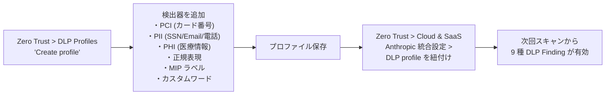

**DLP プロファイル設計の推奨構成**:

| 層 | プロファイル例 | 主な検出器 | Finding Severity |
|---|---|---|---|
| 規制由来 | PCI / HIPAA / GDPR | カード番号・CVV・SSN・PHI | Critical / High |
| 業界固有 | 金融口座番号・医療 ID | 独自の内部識別子 (正規表現) | High |
| 知財・営業秘密 | 内部コードネーム・未公開財務 | キーワードリスト + 正規表現 | Medium |

**誤検知対策**: Artifact (生成コード) は test fixture やコメント内の「fake」データを拾いやすい。Cloudy Summaries の説明文でトリアージし、コードコンテキストを除外する除外ルールを正規表現に組み込む。

### Finding → Gateway policy への昇格

CASB で検出した Finding をインライン制御 (入口ブロック) に昇格させる手順。

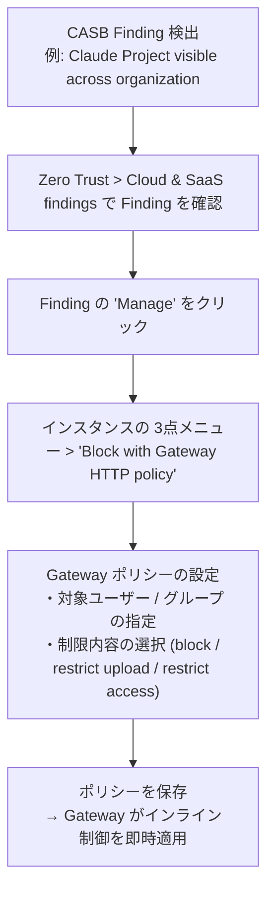

Cloudflare は「CASB finding から Gateway policy 化まで数分」と表現している。

**Gateway policy のユースケース**:

| シナリオ | Gateway 設定例 |
|---|---|
| 特定ユーザーの claude.ai へのアップロードをブロック | HTTP policy: destination=claude.ai, action=block, selector=user_id |
| 組織全体で claude.ai へのアクセスを制限 | HTTP policy: destination=claude.ai, action=block |
| DLP 違反ユーザーのみ quarantine | HTTP policy: selector=group, action=isolate |

> 注意 (2026-05 時点): Anthropic 統合の **自動 Remediation** (Finding から自動でプロジェクト設定を元に戻す機能) は未提供。Gateway policy への昇格は手動または SOAR 経由。

### Logpush / Webhook での SIEM 転送

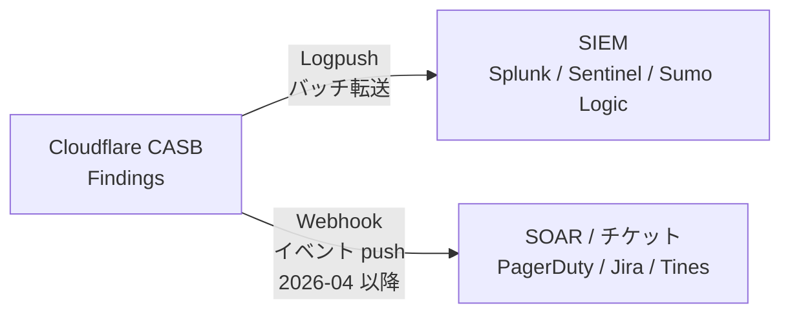

#### Logpush による SIEM 転送

**設定パス**: `Zero Trust > Insights > Logs > Manage Logpush > Create a Logpush job`

データセット: `CASB Findings`

**Splunk HEC への Logpush**:

```bash
# Cloudflare Logpush ジョブを API で作成 (Zone ID または Account ID で指定)
CHANNEL_ID=$(python3 -c 'import uuid; print(uuid.uuid4())')

curl "https://api.cloudflare.com/client/v4/accounts/$CLOUDFLARE_ACCOUNT_ID/logpush/jobs" \
  --request POST \
  --header "Authorization: Bearer $CLOUDFLARE_API_TOKEN" \
  --header "Content-Type: application/json" \
  --data '{
    "name": "casb-findings-to-splunk",
    "destination_conf": "splunk://<SPLUNK_ENDPOINT>:8088/services/collector/raw?channel='"$CHANNEL_ID"'&insecure-skip-verify=false&sourcetype=cloudflare:casb&header_Authorization=Splunk%20<HEC_TOKEN>",
    "dataset": "casb_findings",
    "enabled": true
  }'
```

Splunk HEC の destination_conf フォーマット:
```
splunk://<host>:<port>/services/collector/raw?channel=<UUID>&sourcetype=cloudflare:casb&header_Authorization=Splunk%20<TOKEN>
```

Splunk HEC 疎通確認:
```bash
curl "https://<SPLUNK_ENDPOINT>:8088/services/collector/raw?channel=$CHANNEL_ID&sourcetype=cloudflare:casb" \
  --header "Authorization: Splunk <HEC_TOKEN>" \
  --data '{"test":"ping"}'
# 成功時: {"text":"Success","code":0}
```

**Microsoft Sentinel への転送**:
Sentinel では Azure Blob Storage 経由のインジェストを推奨。Logpush job の `destination_conf` に Azure Blob Storage SAS URL を指定し、Sentinel 側の Codeless Connector Framework またはカスタム Data Collection Rule でインジェストする。

```bash
curl "https://api.cloudflare.com/client/v4/accounts/$CLOUDFLARE_ACCOUNT_ID/logpush/jobs" \
  --request POST \
  --header "Authorization: Bearer $CLOUDFLARE_API_TOKEN" \
  --header "Content-Type: application/json" \
  --data '{
    "name": "casb-findings-to-sentinel",
    "destination_conf": "azure://<STORAGE_ACCOUNT>.blob.core.windows.net/<CONTAINER>?<SAS_TOKEN>",
    "dataset": "casb_findings",
    "enabled": true
  }'
```

**Sumo Logic への転送**:

```bash
curl "https://api.cloudflare.com/client/v4/accounts/$CLOUDFLARE_ACCOUNT_ID/logpush/jobs" \
  --request POST \
  --header "Authorization: Bearer $CLOUDFLARE_API_TOKEN" \
  --header "Content-Type: application/json" \
  --data '{
    "name": "casb-findings-to-sumo",
    "destination_conf": "https://<SUMO_ENDPOINT>/receiver/v1/http/<TOKEN>",
    "dataset": "casb_findings",
    "enabled": true
  }'
```

#### Webhook によるリアルタイム通知 (2026-04 以降)

Webhook は Logpush (バッチ) と異なり、Finding 検出時に **個別 push** される (ただし CASB スキャン自体に 分〜時間のラグがあるため "semi-realtime")。

**Webhook 設定手順**:

1. **Webhook 宛先を事前登録**: `Zero Trust > 設定 > CASB Webhooks` で宛先 URL・認証情報を登録
2. **Finding を開いて送信**: `Cloud & SaaS findings > Finding 選択 > Manage > インスタンスの 3点メニュー > Send webhook`
3. **宛先を選択して送信**
4. 本番送信前に `Test delivery` で疎通確認

**Webhook の典型的な連携先**:

| 連携先 | 用途 |
|---|---|
| Slack / Teams | severity=Critical の Finding を SOC チャネルに即時通知 |
| PagerDuty / Opsgenie | on-call 担当者へのインシデント発火 |
| Splunk SOAR / Cortex XSOAR / Tines | 自動 playbook 起動 (例: Claude project を private 化 → ユーザーに Slack 警告) |
| Jira / ServiceNow | 監査記録用チケットの自動生成 |

**Severity 別トリアージフロー (推奨)**:

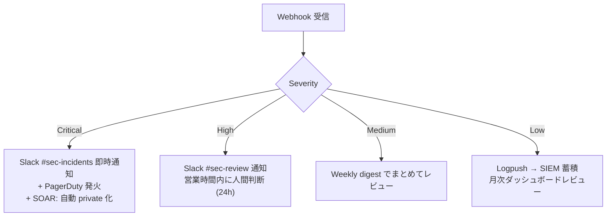

---

## ■運用

### Findings のトリアージ (High/Medium/Low の優先順位、SLA、誰がオーナーか)

Cloudflare CASB が生成する 16 種の Finding は 3 カテゴリ × 複数 severity で構成される。
検出ラグ (1h〜24h) を前提に、以下の SLA とオーナーを設計する。

#### Finding 別オーナーと SLA の目安

| Severity | Finding 例 | 推奨 SLA | 一次オーナー | エスカレ先 |
|---|---|---|---|---|
| **High** | Claude Cowork enabled for role / Connector always allowed / Claude for Chrome enabled / High-privilege invite | 検出後 **4h 以内** に確認・判断 | SOC 担当 | CISO |
| **High (DLP)** | chat/prompt/artifact に PII・PCI・PHI マッチ | 検出後 **4h 以内** に隔離方針決定 | DLP チーム | 法務 / DPO |
| **Medium** | Unused API key | 検出後 **48h 以内** に有効性確認 | Platform 担当 | セキュリティ |
| **Low** | Stale pending invite / Claude Project visible across org | 週次レビューで対処 | IT 管理 | — |

#### トリアージフロー (Webhook 受信後)

```
Webhook 受信 (Finding 生成、semi-realtime)
│
├─ severity = High + category = DLP (PII/PCI/PHI)
│    ├─ Slack #sec-incidents へ即時通知
│    ├─ PagerDuty インシデント発火 (on-call)
│    ├─ SOAR: 対象ユーザへ Slack DM で警告 + 管理者承認を要求
│    └─ 4h 以内に SOC 判断 → 自動 private 化 or 手動削除
│
├─ severity = High + category = Access Security
│    ├─ Slack #sec-review へ通知 (営業時間内)
│    ├─ 当該ロールの担当部署リーダーへ確認メール自動送信
│    └─ 4h 以内に「意図的な設定か否か」判断 → 不要なら Admin Console で無効化
│
├─ severity = Medium
│    └─ Weekly digest (Cloudflare 2025-11 機能) でまとめレビュー
│        → 有効期限切れ API key は当該チームに 48h 以内の回答を要求
│
└─ severity = Low
     └─ Logpush 経由で SIEM に蓄積 → 月次棚卸しで一括クローズ
```

**Cloudflare CASB の false positive 問題への対応**:
- `internally-shared` を `public` と誤判定するケースが公式に明記されている。
- トリアージ時に Finding の詳細 (`description` / Cloudy Summary) を必ず確認し、
  誤検知と判断した場合は「Ignore」+ Cloudflare Support に feedback を送り精度改善を促す。
- 誤検知率が高い Finding ルールは Severity を 1 段落として運用することを検討する。

---

### 継続スキャンと再スキャン (API rate limit 600 req/min/parent org の budget 管理、複数連携での共有戦略)

#### rate limit の構造

Compliance API は **600 req/min per parent organization** の予算を全スコープ・全 key で共有する。
Cloudflare CASB、SIEM forwarder、独自監査ツールが同じ parent org に対して動いている場合、
合計が上限を超えると CASB のスキャンが 429 で止まる。

```
Parent Organization (rate limit: 600 req/min)
  ├── Cloudflare CASB (polling)         ← 消費 X req/min
  ├── Cribl / SIEM forwarder            ← 消費 Y req/min
  ├── 独自レポートスクリプト            ← 消費 Z req/min
  └── 残り budget = 600 - X - Y - Z
```

#### budget 管理の指針

- **Cloudflare CASB が主**: SIEM forwarder や独自スクリプトを CASB 側と切り離し、
  Activity Feed は CASB → Logpush で SIEM に流す構成にすることで、
  直接 Compliance API を叩くコンシューマーを最小化する。
- **帯域配分の目安 (組織規模 ~500 users の場合)**:

| コンシューマー | req/min 目安 | 優先度 |
|---|---|---|
| Cloudflare CASB スキャン | 〜100〜200 | 最高 |
| Activity Feed forwarder (Cribl / 自前) | 〜50〜100 | 高 |
| 独自レポート / ダッシュボード | 〜50 | 低 (業務時間外に分散) |
| 空きバッファ | 200〜400 | スパイク吸収 |

- **429 発生時**: `retry-after` ヘッダ (秒) を読んでバックオフ。cursor は advance しない
  (Anthropic の公式推奨)。

```bash
# 429 レスポンスのヘッダ確認例
curl -i -X GET https://api.anthropic.com/v1/compliance/activities \
  -H "x-api-key: $COMPLIANCE_KEY" \
  -H "anthropic-version: 2023-06-01" | grep -E 'ratelimit|retry-after'

# 例: anthropic-ratelimit-requests-remaining: 0
#     anthropic-ratelimit-requests-reset: 2026-05-22T10:30:00Z
#     retry-after: 60
```

- **scope 不足 (403) は 1 unit 消費**するため、scope 設定ミスが多発すると budget が削れる。
  403 ボディの `"Got": [...], "Needed": [...]` を監視して早期に是正する。

#### 再スキャンの重要な注意点

Cloudflare 公式が明示している制約:
- DLP プロファイルを **後から既存統合に追加** した場合、有効化以降に **modification event** が
  あったファイルしか再評価されない。
- 全件を DLP の網に掛けたい場合は **統合作成時に DLP プロファイルを同時設定** する。
- 設定変更後に旧データを強制再スキャンする公式手段はない (2026-05 時点)。

```
【後付け DLP の落とし穴】
統合作成 ───────────────────────► 現在
          │← DLP プロファイル追加
          │            └─ modification event なし: スキャン対象外
          │
          └─ 追加後に modification event があったファイルのみスキャン
```

対策: 既存統合に DLP を後付けする場合は、全プロジェクト/ファイルの一覧を
Compliance API で取得し、自前スクリプトで「内容を一度 GET → 変更日時を確認」する
補完スクリプトを走らせて死角を最小化する。

---

### Compliance Access Key のローテーション (immutable scope の制約、新鍵作成→旧鍵削除の手順)

#### immutable scope の制約

Compliance Access Key のスコープは**作成時に確定し、後から変更できない**。
これは OAuth のスコープ更新とは異なり、「鍵を更新する」概念が存在しない。
スコープ変更 = 旧鍵廃棄 + 新鍵発行 のセットになる。

#### ローテーション手順

```
Step 1. 新しい Compliance Access Key を発行 (旧鍵はまだ有効)
   claude.ai > Organization settings > Data and privacy
   > Compliance API > Create new key
   → スコープ: read:compliance_activities + read:compliance_user_data
     (+ read:compliance_org_data) を選択。
     ※ delete:compliance_user_data は選択しない (CASB 用途には不要)

Step 2. 新しい鍵を Cloudflare CASB に設定
   Cloudflare Zero Trust > CASB > Integrations > Anthropic
   > Edit Integration > API Key を差し替え

Step 3. 動作確認 (新鍵での接続テスト)
   curl -s https://api.anthropic.com/v1/compliance/activities?limit=1 \
     -H "x-api-key: $NEW_KEY" \
     -H "anthropic-version: 2023-06-01" | jq '.data.id'

Step 4. 旧鍵を無効化
   claude.ai > Organization settings > Data and privacy
   > Compliance API > [旧鍵] > Revoke

Step 5. Activity Feed で `compliance_api_accessed` event を確認
   旧鍵の使用が止まり、新鍵の使用が記録されていることを確認する。
```

#### ローテーション頻度の推奨

| 条件 | 推奨ローテーション周期 |
|---|---|
| 通常運用 | 年 1 回 (90 日ルールがある場合は 90 日) |
| 鍵が漏洩した疑い | 即時。旧鍵を先に Revoke し、CASB の接続が切れた後に新鍵を設定 |
| CASB ベンダー変更 | ベンダー切替と同時にローテーション |
| Primary Owner 異動 | 新 Primary Owner が発行し直す (鍵の所有者が変わる) |

注意事項:
- **Compliance Access Key を発行できるのは Primary Owner のみ**。
  Primary Owner が不在の場合は Anthropic サポートへ連絡が必要。
- `read:compliance_user_data` を持つ鍵は組織内の全会話・全ファイルを読める。
  Anthropic 公式の警告: "Treat Compliance Access Keys like production database credentials."
  鍵の保管は Secret Manager (AWS Secrets Manager / GCP Secret Manager / Vault) を使用し、
  平文での環境変数保持を避ける。

---

### Activity Feed と SIEM の長期保存 (Anthropic 6 年保持 vs SIEM 側保持期間)

#### 保持期間のギャップ

| 層 | 保持期間 | 注意事項 |
|---|---|---|
| Anthropic Activity Feed | **6 年** (queryable within 1 minute of occurring) | API で取得可能な範囲 |
| SIEM (Splunk/Sentinel 標準) | **90 日〜1 年** (ライセンス依存) | 長期保管は別途コールドストレージが必要 |
| S3/GCS/Azure Blob (コールドアーカイブ) | **無制限** (保管コスト次第) | Logpush でリアルタイム流し込み可 |

Anthropic が 6 年保持する Activity Feed を SIEM 側が 90 日しか持たない場合、
「SIEM で検索できるが Anthropic でも取れる」という二重管理の無駄が生じる一方、
「SIEM にない 90 日超の分は Compliance API から再取得する必要がある」という依存も生まれる。

#### 推奨アーキテクチャ

```
Anthropic Activity Feed (6 年)
     │ Compliance API polling (Cloudflare CASB or 自前 forwarder)
     ▼
Cloudflare Logpush ─────────────────────────────────────────────┐
     │                                                           │
     ├─► SIEM Hot tier (Splunk/Sentinel) [90日〜1年]            │
     │    └─ リアルタイム検索・アラート                          │
     │                                                           │
     └─► コールドアーカイブ (S3/GCS/Azure Blob) [無制限]  ◄────┘
          └─ SOC2 / ISO 42001 監査向け長期証跡
             (Logpush は最初から Object Storage にも並列書き込み可)
```

#### Logpush 設定の骨格 (Cloudflare CLI/API)

```bash
# Logpush job を S3 に作成 (CASB findings を長期保管)
curl -X POST "https://api.cloudflare.com/client/v4/accounts/$ACCOUNT_ID/logpush/jobs" \
  -H "X-Auth-Email: $CF_EMAIL" \
  -H "X-Auth-Key: $CF_API_KEY" \
  -H "Content-Type: application/json" \
  -d '{
    "name": "casb-findings-to-s3",
    "dataset": "casb_findings",
    "destination_conf": "s3://$BUCKET_NAME/casb-findings?region=ap-northeast-1",
    "enabled": true,
    "frequency": "high"
  }'
```

#### ISO/IEC 42001 / SOC 2 要件との整合

- **ISO/IEC 42001 § 9.1**: 継続監視の証跡が必要。Logpush + S3 で 6 年分 (Anthropic 保持と同等) を
  保管しておくことで、年次サーベイランス審査でギャップが生じない。
- **SOC 2 Trust Service Criteria CC7.2**: 変更の監視と異常検知の証跡が必要。
  Activity Feed の `actor_type` / `ip_address` が監査証跡として機能する。
- **実務的な保管期間設計**: SIEM Hot 1 年 + コールドアーカイブ 7 年を推奨。
  Anthropic の 6 年を超える 7 年設定はソースが消えた後でも証跡が残る。

---

### 監査レポートの定期出力 (ISO/IEC 42001 / SOC 2 監査向け)

#### 定期レポートの種類と出力源

| レポート | 頻度 | データソース | 主な受け手 |
|---|---|---|---|
| AI 利用ダッシュボード | 週次 | CASB Findings (Weekly Digest 機能) | セキュリティ責任者 |
| DLP インシデントサマリー | 月次 | SIEM (Logpush casb_findings) | DLP チーム / 法務 |
| Access Security 棚卸し | 四半期 | Compliance API /v1/compliance/organizations 系 | IT 管理 / CISO |
| ISO/IEC 42001 § 9.1 証跡 | 年次 (監査前) | コールドアーカイブ + SIEM | 外部監査法人 |
| SOC 2 Type II 準備 | 年次 | Activity Feed + CASB Findings | 外部監査法人 |

#### 月次 DLP レポート生成の curl 例

```bash
# 過去 30 日の DLP カテゴリ Findings を JSON で取得
# (Cloudflare API 経由で CASB findings を列挙)
START_DATE=$(date -u -v-30d '+%Y-%m-%dT%H:%M:%SZ' 2>/dev/null || \
             date -u -d '30 days ago' '+%Y-%m-%dT%H:%M:%SZ')

curl -s "https://api.cloudflare.com/client/v4/accounts/$ACCOUNT_ID/casb/findings" \
  -H "X-Auth-Email: $CF_EMAIL" \
  -H "X-Auth-Key: $CF_API_KEY" \
  -G \
  --data-urlencode "category=data_exposure" \
  --data-urlencode "integration=claude" \
  --data-urlencode "detected_at.gte=$START_DATE" \
  | jq '.result | group_by(.severity) | map({severity: ..severity, count: length})'
```

#### ISO/IEC 42001 監査向け Compliance API 直接照会例

```bash
# 四半期棚卸し: 組織ロール一覧と権限の取得
curl -s "https://api.anthropic.com/v1/compliance/organizations/$ORG_UUID/roles" \
  -H "x-api-key: $COMPLIANCE_KEY" \
  -H "anthropic-version: 2023-06-01" \
  | jq '.data[] | {role_id: .id, name: .name, permissions: [.permissions[].name]}'

# Primary Owner / Admin ユーザー一覧 (高権限棚卸し)
curl -s "https://api.anthropic.com/v1/compliance/organizations/$ORG_UUID/users" \
  -H "x-api-key: $COMPLIANCE_KEY" \
  -H "anthropic-version: 2023-06-01" \
  | jq '.data[] | select(.role == "primary_owner" or .role == "admin") | {email, role, created_at}'
```

---

## ■ベストプラクティス

### 最小権限の scope 設計 (delete は要求しない / read 系のみ)

Compliance Access Key の 4 スコープのうち、**Cloudflare CASB の用途では以下の 2〜3 のみを付与**する。

| スコープ | CASB 用途での必要性 | 付与指針 |
|---|---|---|
| `read:compliance_activities` | Activity Feed 取得 (API key 使用状況、組織変更 event) | **付与** |
| `read:compliance_user_data` | chat / file / project / member のコンテンツ取得 | **付与** |
| `read:compliance_org_data` | organizations / roles / groups メタデータ | 必要な場合のみ付与 |
| `delete:compliance_user_data` | chat / file / project の**永続削除** | **付与しない** |

`delete:compliance_user_data` を持つ鍵が漏洩すると、組織内の全会話・ファイル・プロジェクトを
**取り消し不可の形で消去**できる。CASB は検出ツールであり削除は人手で判断すべき操作なので、
この scope を CASB 鍵に含めることは設計上の誤りとみなす。

```
# スコープ設計の意思決定ツリー
CASB 用途か?
 ├─ Yes → delete scope は付与しない
 │         read:compliance_activities + read:compliance_user_data で開始
 │         グループ名の人間可読化が必要なら read:compliance_org_data を追加
 └─ No (eDiscovery / 法的保全など) → 別鍵を発行し、delete scope を別管理
```

---

### DLP プロファイルの 3 層設計 (Critical / Confidential / Internal)

Cloudflare DLP プロファイルは Claude の chat / file / artifact に横断適用される。
以下の 3 層に分けて設計することで、誤検知率と見落とし率のバランスを取る。

#### 3 層モデル

| 層 | プロファイル名 | 検出対象 | Severity | 対応 |
|---|---|---|---|---|
| Critical | Regulatory-PII | クレジットカード番号 (PCI DSS)、PHI (HIPAA)、EU 個人識別子 (GDPR) | Critical | 即時ブロック要求 + インシデント起票 |
| Confidential | Internal-IP | 未公開財務数字・M&A コードネーム・顧客提案書 ID (正規表現 + キーワード辞書) | High | SOC 確認後に対処 |
| Internal | Business-Sensitive | 組織内コードネーム・プロジェクト略称・内部プロセス文書 | Medium | 週次レビュー |

#### Cloudflare DLP プロファイル作成例 (API)

```bash
# Critical 層: クレジットカード番号検出プロファイル
curl -X POST "https://api.cloudflare.com/client/v4/accounts/$ACCOUNT_ID/dlp/profiles/custom" \
  -H "X-Auth-Email: $CF_EMAIL" \
  -H "X-Auth-Key: $CF_API_KEY" \
  -H "Content-Type: application/json" \
  -d '{
    "name": "critical-pci-pii",
    "description": "Credit card numbers, SSN, EU personal identifiers",
    "entries": [
      {"name": "Credit Card Numbers", "enabled": true, "type": "predefined",
       "predefined_id": "0001"},
      {"name": "Social Security Numbers", "enabled": true, "type": "predefined",
       "predefined_id": "0003"}
    ]
  }'

# Confidential 層: 内部コードネーム辞書 (例: M&A コードネーム "ProjectSakura")
curl -X POST "https://api.cloudflare.com/client/v4/accounts/$ACCOUNT_ID/dlp/profiles/custom" \
  -H "X-Auth-Email: $CF_EMAIL" \
  -H "X-Auth-Key: $CF_API_KEY" \
  -H "Content-Type: application/json" \
  -d '{
    "name": "confidential-internal-ip",
    "entries": [
      {"name": "MA-CodeName-ProjectSakura", "enabled": true, "type": "custom",
       "pattern": {"regex": "ProjectSakura|SAKURA-[0-9]{4}", "require_count": 1}}
    ]
  }'
```

#### 多言語環境での注意

Claude は日本語での業務利用が増えている。英語パターンのみでは見落とす。
以下の日本語 PII を正規表現で補完する:

```
マイナンバー: \d{4}[\s-]?\d{4}[\s-]?\d{4}
運転免許番号: \d{2}-\d{2}-\d{6}
健康保険証番号: \d{8}
```

---

### Cowork / Connector / Claude for Chrome 機能の段階的解禁

Access Security カテゴリの Finding 3 件はいずれも「High-risk 機能が有効化されている」検出。
これらの機能は **段階的に解禁し、解禁状況を CASB で継続監視する** 設計が推奨。

#### 段階的解禁マトリクス

| 機能 | Finding ルール名 | リスク概要 | 解禁推奨条件 |
|---|---|---|---|
| Claude for Chrome | Claude for Chrome enabled for role | ブラウザ上のデータを Claude が参照できる | 管理デバイス限定 + DLP 設定済み |
| Connector (Drive/Gmail/GitHub 等) | Claude Connector always allowed enabled for role | 外部サービスへの自動連携 | 利用サービスの許可リスト承認後 |
| Cowork (エージェント実行) | Claude Cowork enabled for role | ローカル実行・ツール呼び出し | OTel 監視基盤整備後 + sandbox 環境評価後 |

#### 段階的解禁の手順例 (Connector)

```
Phase 1 (初期): 全ロールで Connector を無効化
   → CASB Finding "Connector always allowed" が出ない状態が基準線

Phase 2 (パイロット): 承認済みチームのロールのみ Drive Connector を有効化
   → CASB で "Connector enabled for role: pilot_team" を監視

Phase 3 (本番展開): 月次の Finding レビューで問題がないことを確認後に拡大
   → 新しいロールへの Connector 有効化は変更管理チケットと紐付け

監視: CASB Finding で "Connector always allowed" が意図しないロールに出たら
     直ちに Admin Console で無効化し、変更履歴を Activity Feed で確認
```

---

### Finding → Gateway policy 自動化と人手判断の境界

CASB Findings を Cloudflare Gateway のインライン制御に昇格させる際、
**自動化して良い範囲** と **人手判断を必須とする範囲** を明確に分ける。

#### 自動化可 vs 人手必須の境界

| アクション | 自動化可否 | 理由 |
|---|---|---|
| SOC チャンネルへの Finding 通知 | 自動化可 | 情報伝達のみ |
| Jira/ServiceNow への ticket 作成 | 自動化可 | 記録のみ |
| 対象ユーザへの警告 Slack DM | 自動化可 | ブロックを伴わない |
| Claude Project の visibility を private に変更 | 条件付き自動化可 | Critical DLP のみ自動 (High は人手) |
| Gateway で特定ユーザの Claude アクセスを遮断 | **人手必須** | 業務停止につながる。誤検知時のダメージが大きい |
| 会話・ファイルの削除 (delete scope) | **人手必須 + 二重承認** | 取り消し不可。法的証拠としての保全義務とも競合 |

#### SOAR playbook の骨格 (Tines/Splunk SOAR)

```yaml
# Finding: DLP Critical (PCI data in chat) への自動対応例
trigger:
  source: cloudflare_casb_webhook
  condition: severity == "critical" AND category == "data_exposure"

actions:
  - step: notify_soc
    type: slack_message
    channel: "#sec-incidents"
    message: "CRITICAL DLP Finding: {{ finding.title }} | User: {{ finding.actor_email }}"

  - step: create_ticket
    type: jira_create_issue
    project: SEC
    priority: High
    description: "{{ finding.description }} \n\nFinding ID: {{ finding.id }}"

  - step: wait_for_approval
    type: human_approval
    approver: "@soc-lead"
    timeout: 30m
    message: "Approve private-izing the Claude project? {{ finding.asset_id }}"

  - step: remediate_if_approved
    condition: approval == "approved"
    type: anthropic_admin_api_call  # Admin API 経由で project 設定変更
    endpoint: "PATCH /v1/organizations/{{ org_id }}/projects/{{ project_id }}"
    body: '{"visibility": "private"}'
```

---

### Shadow Claude (個人 Pro / 直接 API) 検出を Gateway DNS で補う

CASB の Compliance API 統合は **組織契約の Claude Enterprise のみを対象**とする。
個人 Pro / 個人 Max / 直接 API キー利用 (Shadow Claude) は構造的に見えない。

#### Shadow Claude 検出のための補完手段

```
[3 層の Shadow Claude 検出]

Layer 1: Cloudflare Gateway (SWG) による DNS/HTTP 観測
   → 管理デバイスが claude.ai にアクセスしているトラフィックを検出
   → Enterprise tenant 外の利用も同じドメインなので「アクセス数」は把握可能
   → 但し Enterprise か個人かの区別はできない (Tenant ID ベースの識別は別途 Tenant Restriction)

Layer 2: Tenant Restriction ヘッダ挿入 (Cloudflare Gateway / Zscaler / Netskope)
   → Cloudflare Gateway の HTTP policy で claude.ai 宛リクエストに
     Tenant Restriction 用のヘッダを強制付与 (具体ヘッダ名は Anthropic Help Center の Tenant Restrictions ページを参照)
   → org-id が合わないリクエストは Anthropic 側でエラー (個人アカウントでのアクセスをブロック)

Layer 3: IdP (Okta/Entra) アプリカタログでの Shadow App 検出
   → SSPM (SaaS Security Posture Management) や IdP のアプリ利用ログで
     claude.ai を "Approved" に分類し、Personal 利用の OAuth トークンを棚卸し

Layer 4: Shadow IT Discovery (Cloudflare Gateway の HTTP ログ分析)
   → URL category "Generative AI" で全 AI SaaS アクセスを可視化
   → api.anthropic.com への直接アクセス (Claude API 直叩き) も検出
```

#### Tenant Restriction 設定の概念 (Cloudflare Gateway HTTP Policy)

```
HTTP Policy:
  Selector: hostname in {claude.ai, api.anthropic.com}
  Action: Allow
  HTTP Response Headers: Add
    "Cloudflare-Access-JWT-Assertion": <CF Access JWT>
    (Anthropic Tenant Restriction ヘッダ: support.claude.com 記事参照)
```

注意: Tenant Restriction の実装方法は Cloudflare / Zscaler / Palo Alto / Netskope で異なる。
詳細は [Anthropic Help Center: Tenant Restrictions](https://support.claude.com/en/articles/13198485-enforce-network-level-access-control-with-tenant-restrictions) を参照。

---

### EU/JP データレジデンシー要件への対応 (Bedrock/Vertex 経由の検討)

#### Anthropic first-party のデータレジデンシー制約

| 設定 | 利用可能値 | EU/JP 対応 |
|---|---|---|
| `inference_geo` (per-request) | `"global"` / `"us"` のみ | **EU/JP は提供なし** |
| workspace geo (at-rest) | `"us"` のみ | **EU/JP は提供なし** |

Claude Enterprise を first-party で使う限り、**データの静止場所は US 固定**。
EU/JP データレジデンシーが法的要件の場合は以下の代替経路を検討する。

#### 代替経路の比較

| 経路 | EU リージョン | JP リージョン | Compliance API |
|---|---|---|---|
| Anthropic first-party | US/global のみ | US/global のみ | 利用可 |
| AWS Bedrock | Frankfurt (`eu-central-1`) 等で利用可 | 東京 (`ap-northeast-1`) は Anthropic 一次確認未完 | **Compliance API は first-party 専用 → 別途設計が必要** |
| Google Vertex AI | EU リージョンで利用可 | 東京リージョンは Anthropic 確認未完 | **同上** |

#### EU/JP 要件がある場合の設計指針

```
1. データ at-rest の保存場所 (Bedrock/Vertex EU/JP リージョン) を確保
   └─ チャット本文や添付の EU/JP 物理保管は達成可能

2. Compliance API による監査クエリは api.anthropic.com (US) 経由になる
   └─ 「データは EU に置くが、監査 API は US を通る」という
      越境転送の二層構造を DPO に説明する必要がある
   └─ GDPR Standard Contractual Clauses (SCC) の締結が事実上必須

3. Cloudflare CASB + Compliance API の組み合わせを EU/JP で使う場合:
   └─ CASB のスキャンは US 経由のため、Bedrock/Vertex の EU 保管と
      CASB の US 経由スキャンの両方が DPIA の対象になる

4. 現実的な対処:
   - EU/JP 要件が strict なら Bedrock/Vertex + 自前 Compliance Pipeline を検討
   - 緩和可能なら first-party Claude Enterprise + SCC + DPIA で対処
```

---

### LLM Gateway (AI Gateway / Portkey / LiteLLM) との並走パターン

CASB は out-of-band の事後監査。LLM Gateway は inline のリアルタイム制御。
両者は競合しない — **役割を分担させる**設計が正しい。

#### 並走パターンの役割分担

```
[ユーザー/アプリ]
     │
     ▼ (全 LLM トラフィック)
[LLM Gateway: Cloudflare AI Gateway / Portkey / LiteLLM]
  ├─ inline DLP: prompt 送信前に PII 検出・マスク
  ├─ model routing: Sonnet / Opus / Haiku の振り分け
  ├─ token budget 制御 (コスト管理)
  ├─ rate limiting (ユーザー別/チーム別)
  ├─ prompt injection 検出 (Firewall for AI)
  └─ semantic caching
     │
     ▼ (フィルタ通過後のリクエスト)
[Anthropic Claude Enterprise API]
     │
     ▼ (Compliance API / out-of-band)
[Cloudflare CASB]
  ├─ chat / file / project / artifact の事後 DLP スキャン
  ├─ Access Security (Cowork/Connector/Chrome の有効化状況)
  ├─ API key hygiene
  └─ Findings → SIEM / SOAR
```

#### Cloudflare AI Gateway との組み合わせ例

```bash
# Cloudflare AI Gateway 経由で Claude を呼ぶ (DLP inline + CASB out-of-band 両立)
curl https://gateway.ai.cloudflare.com/v1/$ACCOUNT_ID/claude-gateway/anthropic/v1/messages \
  -H "X-Auth-Key: $CF_WORKER_TOKEN" \
  -H "anthropic-version: 2023-06-01" \
  -H "Content-Type: application/json" \
  -d '{
    "model": "claude-sonnet-4-6",
    "max_tokens": 1024,
    "messages": [{"role": "user", "content": "業務要件の分析をしてください"}]
  }'
# AI Gateway: DLP でプロンプトを inline スキャン
# CASB:      生成された会話を後から Compliance API で事後スキャン
```

#### LiteLLM Proxy との並走 (OSS 選択肢)

```yaml
# litellm_config.yaml (抜粋)
model_list:
  - model_name: claude-sonnet
    litellm_params:
      model: anthropic/claude-sonnet-4-6
      api_key: os.environ/ANTHROPIC_API_KEY

general_settings:
  # 全リクエストのログを S3 に保存 (Compliance API と相補的)
  store_model_in_db: true
  callbacks: ["s3"]

# これで「LiteLLM が inline ログ」「CASB が Claude UI 側のout-of-band 監査」の
# 二重カバレッジになる
```

---

## ■トラブルシューティング

### 症状 / 原因 / 対処 一覧表

| # | 症状 | 主な原因 | 対処 |
|---|---|---|---|
| 1 | **API key 認証エラー (401)** | 鍵の種別違い / 鍵が失効 / typo | 下記参照 |
| 2 | **rate limit 超過 (429)** | 600 req/min 超過 / 複数コンシューマー競合 | 下記参照 |
| 3 | **Findings が表示されない** | Compliance API 未有効化 / DLP プロファイル未設定 / Console 組織に chat 本文なし | 下記参照 |
| 4 | **誤検知 (false positive)** | internally-shared を public と誤判定 / archived ユーザーを inactive と誤判定 | 下記参照 |
| 5 | **EU residency 顧客が困る** | workspace geo が US のみ | 下記参照 |
| 6 | **Claude Code CLI / Cowork が監査に出ない** | 構造的制約: Compliance API の対象外 | 下記参照 |
| 7 | **DLP プロファイル変更後に旧データが検出されない** | modification event 起点のスキャン仕様 | 下記参照 |

---

#### 1. API key の認証エラー (401)

**症状**: Compliance API へのリクエストが `401 Unauthorized` を返す。
CASB ダッシュボードで "Integration connection failed" が表示される。

**主な原因と確認手順**:

```bash
# 1. 鍵の種別を確認 (prefix で判断)
echo $KEY | cut -c1-15
# sk-ant-api01-... → Compliance Access Key (全エンドポイント可)
# sk-ant-admin01- → Admin API key (Activity Feed のみ)
# sk-ant-api03-... → モデル推論用 API key (Compliance API は 403)

# 2. 直接テストして 401 か 403 かを切り分け
curl -s -o /dev/null -w "%{http_code}" \
  https://api.anthropic.com/v1/compliance/activities?limit=1 \
  -H "x-api-key: $KEY" \
  -H "anthropic-version: 2023-06-01"
# 401 → 鍵自体が無効 (Revoked / typo / 別 org の鍵)
# 403 → 鍵は有効だが scope 不足 (必要: read:compliance_activities)

# 3. 鍵の有効性を claude.ai で確認
# claude.ai > Organization settings > Data and privacy > Compliance API
# 鍵が Revoked 状態 / リストに存在しない場合は再発行
```

**対処**:
- 401: 新しい Compliance Access Key を Primary Owner が発行し、CASB に再設定する。
- 403: 鍵のスコープを確認。scopeは immutable なので不足している場合は再発行が必要。
  403 レスポンスボディ `"Got": [...], "Needed": [...]` でどの scope が足りないか確認する。

---

#### 2. rate limit 超過 (429) — 600 req/min budget の共有

**症状**: CASB のスキャンが断続的に停止する / Findings の更新が止まる。
`429 Too Many Requests` が Compliance API のログに記録される。

**原因の特定**:

```bash
# rate limit ヘッダを確認
curl -I https://api.anthropic.com/v1/compliance/activities?limit=1 \
  -H "x-api-key: $COMPLIANCE_KEY" \
  -H "anthropic-version: 2023-06-01" \
  | grep -E 'ratelimit|retry-after'

# 出力例:
# anthropic-ratelimit-requests-limit: 600
# anthropic-ratelimit-requests-remaining: 0     ← 0 なら枯渇
# anthropic-ratelimit-requests-reset: 2026-05-22T10:31:00Z
# retry-after: 45
```

**対処**:
1. **複数コンシューマーを把握する**: 同じ parent org の Compliance API を叩いているツールを列挙し、
   CASB 以外のコンシューマー (Cribl/SIEM forwarder / 自前スクリプト) の req/min を測定する。
2. **non-CASB コンシューマーのスケジュールを分散**: レポートスクリプトは業務時間外 (深夜) に移動。
3. **CASB 以外のツールは CASB → Logpush 経由で取得**: Compliance API を直接叩かず、
   Cloudflare Logpush 経由で Findings / Activity を受け取る設計に変更する。
4. **429 時は cursor を advance しない**: Anthropic 公式推奨。バックオフ後に同 cursor で再試行する。

---

#### 3. Findings が表示されない

**症状**: CASB ダッシュボードに Claude の Finding が一件も出ない。

**原因の切り分けフロー**:

```
Step 1. Compliance API が有効化されているか確認
   claude.ai > Organization settings > Data and privacy > Compliance API
   → "Enabled" と表示されていない場合は Primary Owner が有効化する

Step 2. Cloudflare CASB の Integration が接続できているか確認
   Cloudflare Zero Trust > CASB > Integrations > Anthropic
   → Status が "Connected" になっているか
   → Connection Failed の場合は API key の再設定 (→ 原因1)

Step 3. DLP プロファイルが設定されているか確認 (DLP Finding の場合)
   DLP カテゴリの Finding は DLP プロファイルが設定されていないと生成されない
   → Cloudflare Zero Trust > DLP > Profiles にプロファイルが存在するか
   → CASB Integration に DLP プロファイルが紐付いているか

Step 4. 対象 Org が Claude Console (Platform) 組織のみの場合
   Claude Console 組織には chat 本文が存在しない
   → DLP Finding は原理的に出ない (Activity Feed のみが対象)
   → claude.ai 側の linked organization が存在するか確認

Step 5. 初回スキャンの完了を待つ
   初回統合後のフルスキャンには数時間〜1 日かかる
   → Integration 作成から 24h 待ってから確認する
```

---

#### 4. 誤検知 (internally-shared を public 誤判定 / archived ユーザーを inactive 誤判定)

**症状**: Finding が発生したが、実際には問題のない設定だった。
Cloudflare 公式トラブルシューティングが明示的に認めている既知の問題。

| 誤検知パターン | 原因 | 対処 |
|---|---|---|
| "Project visible across organization" が組織全体共有でないのに発生 | 共有スコープの判定ロジックの誤判定 | Finding を "Ignore" し、Cloudflare Support に報告 (`developers.cloudflare.com/cloudflare-one/integrations/cloud-and-saas/troubleshooting/casb/` の feedback フォームへ) |
| archived ユーザーが "Inactive user" Finding として出続ける | SCIM deprovision 済みユーザーの残存ステータス | Anthropic Admin Console でユーザーが実際に deactivated されているか確認。された場合は Support に feedback |
| DLP Finding が test fixture / サンプルデータにマッチ | 正規表現が文脈なしでパターンマッチ | DLP プロファイルに除外パターン (`NOT CONTAINS "test" AND NOT CONTAINS "example"`) を追加 |

**誤検知の管理フロー**:

```
Finding 受信
  → Cloudy Summary と Finding 詳細を確認
  → 実際のリスクか誤検知か判断
     ├─ 実リスク → 通常トリアージフローへ
     └─ 誤検知 → CASB ダッシュボードで "Ignore" + タグ付け
                   → 週次で Ignore 件数を集計し、精度改善要求を Cloudflare Support へ
```

---

#### 5. Workspace geo が US のみで EU residency 顧客が困る

**症状**: EU データ居住要件のある組織が Claude Enterprise を first-party で使えない。
または first-party を使っているが GDPR DPO から「EU 外にデータが出ている」と指摘された。

**原因**: Anthropic の workspace geo は `us` のみ提供。EU/JP は未提供 (2026-05 時点)。

**対処オプション**:

| オプション | EU データ保管 | Compliance API | 備考 |
|---|---|---|---|
| A: Anthropic first-party + SCC | US のみ | 利用可 | GDPR Art. 46 SCC 締結で越境転送を正当化 |
| B: AWS Bedrock EU リージョン | EU 可 | **利用不可** (別途設計が必要) | Bedrock API への Claude Code / API 利用は EU に留まる |
| C: Google Vertex AI EU リージョン | EU 可 | **同上** | |
| D: ZDR (Zero Data Retention) + A | US 経由だがデータ非保持 | 縮退 | EU 居住者のデータが US を通過する点は残る |

オプション A を選ぶ場合の最低手順:
1. Anthropic と Data Processing Agreement (DPA) を締結。
2. Standard Contractual Clauses (SCC) を DPA に付属させる。
3. DPIA を作成し、EU から US への転送の必要性・比例性を文書化。
4. 従業員・ユーザーへの透明性通知を行う (GDPR Art. 13/14)。

---

#### 6. Claude Code CLI / Cowork が監査に出てこない (構造的制約、OTel で補う)

**症状**: Claude Code CLI や Cowork (エージェント実行) の操作が
Compliance API にも CASB Findings にも現れない。

**原因**: 第三者の解説では「Cowork のエージェントセッションは Audit Logs / Compliance API / Data Exports に含まれない」と報告されています (General Analysis / MintMCP 解説。Anthropic 公式 docs での明示は本記事執筆時点では未確認)。Cowork の role 有効化自体は CASB の Finding ルール「Claude Cowork enabled for role」で検出されます。

ローカル実行型エージェントの会話ログはユーザーのラップトップ上にのみ存在するため、
クラウド側の Compliance API では取得できない。

**補完手段 (OTel + 複数ソース)**:

```
Claude Code CLI の監査 (Compliance API では取れない部分)
  │
  ├─ 1. OpenTelemetry (OTel) ストリーム
  │      Claude Code は OTel exporter をサポート
  │      → OTEL_EXPORTER_OTLP_ENDPOINT に自社 OTel collector を向ける
  │      → tool call / span / model invocation が SIEM に流れる
  │      ※ Anthropic: "OTel is not a replacement for audit logging"
  │        (会話本文そのものは OTel に乗らないケースあり)
  │
  ├─ 2. LLM Gateway 経由の強制
  │      Claude Code を直接 api.anthropic.com に向けず
  │      LiteLLM / Portkey / AI Gateway 経由に統制
  │      → Gateway 側でログ取得
  │      (管理デバイスの Tenant Restriction と組み合わせる)
  │
  ├─ 3. EDR (Endpoint Detection & Response)
  │      claude-code プロセスの起動・API 通信を端末レベルで記録
  │
  └─ 4. コードリポジトリ監査
         Claude Code が生成・コミットしたコードを GitHub / GitLab
         の commit log / PR レビューで追跡
```

**Claude Code の OTel 設定例**:

```bash
# Claude Code を OTel 経由で社内 collector に向ける
export OTEL_EXPORTER_OTLP_ENDPOINT=https://otel-collector.internal:4318
export OTEL_SERVICE_NAME=claude-code
export OTEL_RESOURCE_ATTRIBUTES="team=engineering,env=production"

# Claude Code 実行 (以後 OTel spans が collector に送信される)
claude --model claude-sonnet-4-6 "このコードをレビューしてください"
```

---

#### 7. DLP プロファイル変更後の後付け検出 — modification event 起点なので旧データに当たらない

**症状**: DLP プロファイルを追加・変更した後、既存のファイル/会話に対して
Findings が生成されない。新しいアップロードやメッセージには Findings が出る。

**原因**: Cloudflare CASB の DLP スキャンは **modification event をトリガー**にして動作する。
プロファイルを後付けしても、既存の変更のないファイルはスキャン対象にならない。
この動作は Cloudflare 公式ドキュメントで明示されている。

**対処**:

```
【即時対応】
既存ファイルの手動スキャン補完スクリプト (Python 例)

import anthropic
import json

client = anthropic.Anthropic(api_key=COMPLIANCE_KEY)

# 1. 全プロジェクトのファイル一覧を取得
projects = client.get("/v1/compliance/apps/projects")

# 2. 各ファイルのコンテンツを GET して DLP プロファイルに突き合わせる
#    (Cloudflare DLP API で自前チェック or 外部 DLP ツールで代替)
for project in projects["data"]:
    attachments = client.get(f"/v1/compliance/apps/projects/{project['id']}/attachments")
    for att in attachments["data"]:
        content = client.get(f"/v1/compliance/apps/chats/files/{att['id']}/content")
        # ここで DLP パターンマッチ処理 (正規表現 / Presidio 等)
        check_dlp(content, project["id"], att["id"])

【予防策】
- 統合作成時に DLP プロファイルを同時設定する (後付けしない)
- DLP プロファイルの変更は「変更管理」として記録し、
  変更前の全ファイルに対して手動補完スキャンをスケジュールする
- 重大な DLP ポリシー変更 (Critical 層の新規追加等) は
  integration を一時削除・再作成することで full scan をトリガーする方法も検討
  (但し削除中は Finding が生成されないことに注意)
```

---

## まとめ

Cloudflare は 2026-05-21、自社の API ベース CASB に Anthropic Compliance API 統合を追加し、Claude Enterprise 組織内の会話・添付・プロジェクト共有・生成物を out-of-band で監査できるようになりました。AI 利用統制の論点は「入口で止める」から「保存物を継続監査する」へ広がっており、本統合はその実装パターンの一つです。一方で API ベース CASB は検出ラグと遮断不可という構造的限界を持ち、Claude Code CLI / Cowork や Shadow Claude が盲点になるため、AI Gateway や IdP 制御と組み合わせたハイブリッド設計が前提となります。

この記事が少しでも参考になった、あるいは改善点などがあれば、ぜひリアクションやコメント、SNSでのシェアをいただけると励みになります！

## ■参考リンク

### Cloudflare 公式
- Cloudflare Blog: Announcing Claude Compliance API support with Cloudflare CASB (2026-05-21) — https://blog.cloudflare.com/casb-anthropic-integration/
- Cloudflare Blog: ChatGPT, Claude, & Gemini security scanning with Cloudflare CASB (2025-08-26) — https://blog.cloudflare.com/casb-ai-integrations/
- Cloudflare Blog: CASB GA — https://blog.cloudflare.com/casb-ga/
- Cloudflare Blog: Remediation in Cloudflare CASB — https://blog.cloudflare.com/remediation-in-cloudflare-casb/
- Cloudflare Docs: CASB overview — https://developers.cloudflare.com/cloudflare-one/applications/casb/
- Cloudflare Docs: Anthropic CASB integration — https://developers.cloudflare.com/cloudflare-one/applications/casb/casb-integrations/anthropic/
- Cloudflare Docs: Cloud & SaaS Anthropic integration — https://developers.cloudflare.com/cloudflare-one/integrations/cloud-and-saas/anthropic/
- Cloudflare Docs: Manage CASB findings — https://developers.cloudflare.com/cloudflare-one/applications/casb/manage-findings/
- Cloudflare Docs: CASB webhooks — https://developers.cloudflare.com/cloudflare-one/applications/casb/casb-webhooks/
- Cloudflare Docs: Scan apps with CASB (scan interval) — https://developers.cloudflare.com/cloudflare-one/applications/scan-apps/
- Cloudflare Docs: Scan for sensitive data (CASB DLP) — https://developers.cloudflare.com/cloudflare-one/cloud-and-saas-findings/casb-dlp/
- Cloudflare Docs: CASB Troubleshooting — https://developers.cloudflare.com/cloudflare-one/integrations/cloud-and-saas/troubleshooting/casb/
- Cloudflare Docs: Logpush integration — https://developers.cloudflare.com/cloudflare-one/insights/logs/logpush/
- Cloudflare Docs: Logpush to Splunk — https://developers.cloudflare.com/logs/get-started/enable-destinations/splunk/
- Cloudflare Docs: AI Gateway DLP — https://developers.cloudflare.com/ai-gateway/features/dlp/
- Cloudflare Docs: Shadow IT SaaS analytics — https://developers.cloudflare.com/cloudflare-one/insights/analytics/shadow-it-discovery/
- Cloudflare Changelog: CASB product — https://developers.cloudflare.com/changelog/product/casb/

### Anthropic 公式
- Anthropic Docs: Compliance API overview — https://platform.claude.com/docs/en/manage-claude/compliance-api
- Anthropic Docs: Compliance API access (scopes, keys) — https://platform.claude.com/docs/en/manage-claude/compliance-api-access
- Anthropic Docs: Activity Feed — https://platform.claude.com/docs/en/manage-claude/compliance-activity-feed
- Anthropic Docs: Content data (chats/files/projects) — https://platform.claude.com/docs/en/manage-claude/compliance-content-data
- Anthropic Docs: Org data (organizations/users/roles/groups) — https://platform.claude.com/docs/en/manage-claude/compliance-org-data
- Anthropic Docs: Compliance errors (429/403/401) — https://platform.claude.com/docs/en/manage-claude/compliance-errors
- Anthropic Docs: Data residency — https://platform.claude.com/docs/en/manage-claude/data-residency
- Anthropic API Reference: Compliance — https://platform.claude.com/docs/en/api/compliance
- Claude Help Center: Tenant Restrictions — https://support.claude.com/en/articles/13198485-enforce-network-level-access-control-with-tenant-restrictions
- Claude Help Center: Access the Compliance API — https://support.claude.com/en/articles/13015708-access-the-compliance-api
- Claude Help Center: Get started with Compliance API integrations — https://support.claude.com/en/articles/15167101

### Compliance API の限界・死角
- General Analysis: Claude Compliance API Coverage and Gaps — https://generalanalysis.com/guides/claude-compliance-api
- MintMCP: Claude Cowork Audit Logging Gap — https://www.mintmcp.com/blog/claude-cowork-audit-logging-gap
- Airia: Shadow Claude Is Already Inside Your Enterprise — https://airia.com/shadow-claude-is-already-inside-your-enterprise-heres-what-to-do-about-it/

### フレームワーク・規制
- ISO/IEC 42001:2023 — https://www.iso.org/standard/81230.html
- NIST AI Risk Management Framework — https://www.nist.gov/itl/ai-risk-management-framework
- OWASP Top 10 for LLM Applications 2025 — https://owasp.org/www-project-top-10-for-large-language-model-applications/
- GDPR — https://gdpr-info.eu/

### LLM Gateway / 並走パターン
- Portkey: LLM proxy vs AI gateway — https://portkey.ai/blog/llm-proxy-vs-ai-gateway/
- LiteLLM: Proxy server documentation — https://docs.litellm.ai/docs/proxy/quick_start

### CASB アーキテクチャ
- Cloud Security Alliance: API vs Proxy CASB — https://cloudsecurityalliance.org/blog/2016/08/11/api-vs-proxy-get-best-protection-casb
- Forcepoint: Three Types of CASB — https://www.forcepoint.com/blog/insights/three-types-casb-how-they-operate

