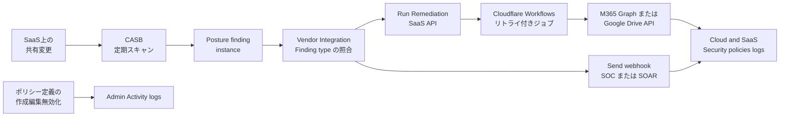

**Cloudflare CASB の automatic remediation policies** は、API ベース（エージェントレス）の CASB が posture finding を検出したときに、あらかじめ設定したアクションを人手なしで起動する Cloudflare One の機能です。
アクションは二系統です。
SaaS 統合 API への first-party 修復（公開や社内全体などのファイル共有設定の取り消し）と、Slack や ServiceNow、公開到達可能なカスタム HTTPS エンドポイントなどへの webhook 送信です。
changelog は 2026-08-21、製品ブログは 2026-09-11 です。
本稿の数値と到達宣言は、この公開ブログと公式ドキュメントの記述に依拠します。

この記事では、ポリシーが何を対象にするか、実行の流れ、権限とベンダー API の制約、導入設計へ落とす項目を、2026-09-13 時点の公式資料に沿って整理します。
想定読者は、SaaS の過共有を自動で閉じたいセキュリティ運用と、限定修復を業務アクセス変更へ広げるかを判断する立場です。

*この記事の全体像。以下、順に解説します。*

## Cloudflare CASBの自動修復ポリシーとは

ポリシーは「検出された finding」に対する応答定義です。
起動の入力は、CASB が生成した finding instance です。
[Remediation Policies](https://developers.cloudflare.com/cloudflare-one/cloud-and-saas-findings/policies/) は、CASB が finding を検出したときに修復を走らせるか webhook を送るかを定義します。
対象の finding instance は、ポリシー作成後に新たに検出されたものだけです。

手動 Remediation は 2026-03-03 に先行しています。
ダッシュボードから 1 件ずつ共有を取り消せますが、finding ごとに人が確認して起動する必要がありました。
ポリシーは、同じ系統のアクションを検出後に人手なしで起動します。

### トリガーとアクション

トリガーは **Vendor**、**Integration**、**Finding type** の組です。
Integration は 1 つ以上を選ぶか、選択した vendor の全 Integration に適用できます。
1 ポリシーで **Run Remediation** と **Send webhooks** を同時に指定できます。

前提は次のとおりです。

- Cloud または SaaS 統合が設定済みであること
- 修復アクションを使うなら、統合を Read-Write に上げること
- webhook アクションを使うなら、送信先が設定済みであること

**Remediation Policies 自体が有料 CASB プラン必須**です。
公式の Availability は、free CASB 統合では使えないと書きます。
修復アクションには、そのうえで統合の Read-Write が必要です。
[Overview](https://developers.cloudflare.com/cloudflare-one/cloud-and-saas-findings/) によれば、無償枠は CASB 統合 2 件までです。
finding instance の詳細閲覧は Enterprise が必要です。

修復は共有設定の除去です。
[2026-03-03 の Remediation 発表](https://blog.cloudflare.com/remediation-in-cloudflare-casb/) は、ファイル削除や所有者変更はしないと書きます。

### 修復対象の finding type

2026-09-13 時点で、first-party 修復が公式に列挙されているのは Microsoft 365 と Google Workspace のファイルとフォルダ系 finding です。
finding type が修復非対応なら、UI は `No automated remediation available for this finding type` を出し、Run Remediation を有効にできません。
webhook は posture finding の全種と全統合に使えます。
content findings は webhook の対象外です。

Google Workspace の修復対象は次の 12 種です。

| Finding type | 共有範囲 | 権限 | DLP |
|---|---|---|---|
| File publicly accessible with edit access | 公開 | edit | なし |
| File publicly accessible with view access | 公開 | view | なし |
| File shared outside company with edit access | 社外 | edit | なし |
| File shared outside company with view access | 社外 | view | なし |
| File shared company-wide with edit access | 社内全体 | edit | なし |
| File shared company-wide with view access | 社内全体 | view | なし |
| 上記 6 種の DLP Profile match 版 | 同上 | 同上 | あり |

Microsoft 365 の修復対象は次の 8 種です。

| Finding type | 共有範囲 | 権限 | DLP |
|---|---|---|---|
| File publicly accessible with edit access | 公開 | edit | なし |
| File publicly accessible with view access | 公開 | view | なし |
| File shared company-wide with edit access | 社内全体 | edit | なし |
| File shared company-wide with view access | 社内全体 | view | なし |
| 上記 4 種の DLP Profile match 版 | 同上 | 同上 | あり |

Microsoft 365 の公式リストに、社外共有（outside company）の修復対象はありません。
Policies の Microsoft 365 列挙は File finding です。
統合ページ側の Folder finding が、ポリシー経路でどう扱われるかは公式未記載です。

### 実行の流れ

検出後の実行基盤は、製品ブログによれば Queue、Worker によるポリシー照合、Cloudflare Workflows です。
ベンダーが 429 を返した場合、Workflow は backoff してジョブを落とさない、と述べます。

ログは二系統です。
**Admin Activity logs** は、誰がポリシー定義を作成、編集、無効化したかを残します。
**Cloud and SaaS Security policies logs** は、どの finding と資産に対して成功または失敗したか、ベンダーが 401 や rate limit を返したかを残します。
コンプライアンス用途では、後者が「特定の finding に特定の自動アクションを、いつ実行したか」の証跡になります。

修復の状態は Pending、Processing、Validating、Completed です。
失敗は Failed（タイムアウト等）または Rejected（権限不足）です。
確認した公式文書（Manage findings、Policies、Troubleshoot）に、undo や共有復元の手順はありません。
回避策は、SaaS 側で共有を付け直すことです。

セットアップ権限は、Microsoft 365 が Global admin、Google Workspace が Super Admin です。
修復には Integration を Read-Write に上げます。
[Microsoft 365 統合](https://developers.cloudflare.com/cloudflare-one/integrations/cloud-and-saas/microsoft-365/) が列挙する修復スコープは、`Files.ReadWrite.All` に加え `Directory.ReadWrite.All`、`Mail.ReadWrite`、`Group.ReadWrite.All`、`RoleManagement.ReadWrite.Directory` などです。
共有解除より広い write が並びます。
[Google Workspace 統合](https://developers.cloudflare.com/cloudflare-one/integrations/cloud-and-saas/google-workspace/) の列挙は、Drive 関連では `drive.readonly` までです。
Google Drive の `permissions.delete` は `https://www.googleapis.com/auth/drive` または `drive.file` が必要です。
Read-Write 時に付く実スコープは、公式には未列挙です。

既存の過共有は、手動 Remediation または一括ジョブ API（`POST .../remediations/jobs`）側で扱います。
ポリシーを作っただけでは消えません。

## 注意点

製品ブログは「検知の瞬間に動く」「公開共有は数分で取り消される」「detection to completed remediation は 5 分以内が目標」と書きます。
公式ドキュメントは、別の時計を示します。

| 主張 | 一次ソースが実際に言っていること |
|---|---|
| 5 分以内 | 「target」。SLA ではない。[blog 2026-09-11](https://blog.cloudflare.com/casb-policies/) |
| p50 48 秒 / p90 72 秒 | 2026-03-03 手動 Remediation の負荷試験と early access。[blog](https://blog.cloudflare.com/remediation-in-cloudflare-casb/) であり、Policies エンジンの公表値ではない |
| 検知の瞬間 | ポリシーは CASB が finding を検出したあと。スキャンはリアルタイムではない。[Troubleshoot](https://developers.cloudflare.com/cloudflare-one/cloud-and-saas-findings/troubleshoot-casb/) は初回数時間、以降おおよそ 24-48 時間。[Overview](https://developers.cloudflare.com/cloudflare-one/cloud-and-saas-findings/) は典型 1-24 時間。公式間で間隔が食い違う |
| 危険な共有を自動修復 | 列挙された file/folder finding のみ。OAuth アプリ、管理者設定、カレンダーなどは webhook のみ |
| マーケ部門の公開例外 | ブログのシナリオ。Create 手順に所有者、グループ、パス例外は無い。[Policies](https://developers.cloudflare.com/cloudflare-one/cloud-and-saas-findings/policies/) |
| 既存の過共有も片付く | 「New or updated policies are not applied retroactively」 |

「5 分」は検出後のジョブ完了目標です。
共有発生から修復完了までの窓ではありません。
スキャン間隔が時間から日単位なら、露出時間はその間隔に支配されます。

DLP 一致の自動修復を「機密ファイル全般」と読むとずれます。
[CASB DLP](https://developers.cloudflare.com/cloudflare-one/cloud-and-saas-findings/casb-dlp/) は、公開ファイルのテキスト、100 MB 以下、画像非対応、と制限します。
既存統合へ DLP プロファイルを後付けすると、有効化以降に変更イベントがあった公開ファイルだけをスキャンします。
未変更の既存ファイルは finding 自体が生まれません。
これはポリシーの非遡及とは別の取りこぼしです。
Google Workspace には outside company の DLP finding がある一方、スキャン説明は公開ファイル限定のままです。
非公開ファイルの DLP 保証は一次未確認です。
CASB DLP には、DLP 製品側の有効化も必要です。

公式の Troubleshoot は偽陽性も案内します。
内部共有を public と誤判定する例、archived な Google Workspace ユーザーを inactive と誤判定する例です。
確認した公式文書に、Ignore / Hide がポリシー発火を止めるかの記載はありません。

Custom Findings は、ブログ時点で「coming weeks」です。
例外条件がそこに載るまでは、例外は SOAR 側に置く前提になります。

## 権限とベンダーAPIはどう制約するか

自動修復は Cloudflare のジョブが、裏側で Microsoft Graph や Google Drive API を叩くことです。
ベンダー側の制約は、Cloudflare の「ジョブを落とさない」説明とは別に設計対象です。

Microsoft Graph は 429 と `Retry-After` を返します。
[throttling 案内](https://learn.microsoft.com/en-us/graph/throttling) は、即時リトライが使用量に加算されるため避ける、と書きます。
書き込みが多いとスロットルしやすいです。
テナント全体のアプリ横断でも発生し得ます。

Google Drive は、同一ファイルへの同時 permissions 操作をサポートしません。
[manage-sharing](https://developers.google.com/workspace/drive/api/guides/manage-sharing)（2026-09-03）によれば last-write-wins です。
継承権限は子から削除できません。
親から外しても、子に直接付与された権限は残ります。

Drive クォータ（2026-05-01 以降の新プロジェクト）は、1,000,000 quota units/分/project、325,000 quota units/分/ユーザー/プロジェクトです。
[limits](https://developers.google.com/workspace/drive/api/guides/limits)（2026-09-11）が一次です。

再共有後に再び検出されて再び取り消されるか（idempotency）は、確認した公式文書に保証がありません。
再検出間隔は、上表のスキャン時計に依存します。

GWS の Read-Write 実 OAuth スコープ、Policies 経路の p50/p90、価格のドル額も一次未確認です。
本番の常時自動 revoke を止める材料になります。
狭い finding type の試験と、webhook に人または SOAR 承認を挟む経路は止めません。

## 同種の自動revokeと比べて何が違うか

同種の revoke は、Netskope や Microsoft Purview が先行しています。
Cloudflare の差分は「検出済みの特定ファイル共有 finding を、有料 CASB 上で人手なしに revoke または通知する」ことにあります。
共有発生から 5 分で閉じる制御面、業務例外付きの GitOps、SaaS 業務アクセス全般の自動変更、としては一次ソースが足りません。

| 基準 | Cloudflare Policies | 手動 CASB Remediation | Netskope Next Gen API / Purview |
|---|---|---|---|
| 起動 | finding 検出後に自動 | 人が 1 件ずつ | ポリシーアクション（条件付き） |
| 条件粒度 | Vendor、Integration、Finding type | 人が見て判断 | Netskope Next Gen は Exposure、Exclusions 等を持つ。Owner 条件は当該文書では Gmail / Outlook に限定（[policy matching](https://docs.netskope.com/en/policy-matching-evaluation)） |
| 遡及 | 新規 instance のみ | 既存も対象 | 製品による |
| 対象 | M365/GWS ファイル共有（M365 は社外共有なし） | 同系統のサポート finding | アプリごとの revoke / Remove sharing link |
| 可逆性 | 確認した公式文書に undo 手順は無い | 同上 | Purview は Restore しない旨を別機能で明記する例あり |
| 監査 | 定義ログと実行ログを分離 | Admin logs | 各製品の監査 |

[Purview DSPM](https://learn.microsoft.com/en-us/purview/data-security-posture-management-oversharing) は、Remove sharing link を sparingly 使えと書きます。
正当なアクセスも失われ得るため、サイト所有者またはアイテム所有者が、権限をより制限した共有リンクを付け直す必要がある、と一次で警告します。
Cloudflare 側に同等の公式復旧手順は、確認した文書にはありません。

## どのfinding typeから自動修復するか

例外が少ない type だけ first-party 自動修復を検討します。
公開 edit と、その DLP 一致が候補です。
マーケ公開や社外コラボが正当な type は webhook のみにします。

既存テナントに DLP を後付けすると、未変更ファイルはスキャン対象外です。
網羅するなら、統合セットアップ時に DLP を付けます。

Microsoft 365 の社外共有は、現状の公式リストでは自動修復対象にしません。
OAuth アプリ、管理者設定、カレンダーなど、修復非対応の finding は webhook に回します。

既存 backlog は、ポリシー作成とは別に、手動 Remediation または一括ジョブ API の計画を持ちます。

導入設計には次を必須項目として書きます。

1. Read-Write の実スコープ（特に Microsoft 365 の Directory / Mail / Group / Role の write、GWS の Drive write）
2. 誤解除時に、SaaS 監査ログから共有を復元する手順
3. 再共有の再検出間隔（1-24 時間と 24-48 時間の公式差を、運用上どちらで見るか）
4. 429 時の遅延許容（ジョブは落ちないが、完了は遅れる）
5. ポリシー条件に所有者、グループ、パスが無いことへの対処（SOAR 側の例外、または finding type の分割）

逆転条件は次です。
Policies に owner / group / path 例外が載る、undo が載る、スキャンが変更通知ベースになる、Microsoft 365 の outside-company が修復リストに入る。

## まとめ

自動修復ポリシーは、検出済みの特定ファイル共有 finding を、有料 CASB 上で人手なしに revoke または通知する機能です。
再試行可能な実行と、定義ログと実行ログの分離は一次で確認できます。
対象は Microsoft 365 と Google Workspace の列挙された file/folder finding に限られ、ポリシーは新規 instance にしか効きません。
「5 分」は検出後の目標であり、スキャンはリアルタイムではありません。
公開 edit と DLP 一致など例外の少ない type から試験し、正当な公開や社外コラボは webhook に人または SOAR 承認を挟むのが安全です。

この記事が少しでも参考になった、あるいは改善点などがあれば、ぜひリアクションやコメント、SNSでのシェアをいただけると励みになります！

## 参考リンク

1. Cloudflare Blog, *Introducing automatic remediation policies with Cloudflare CASB*, 2026-09-11. https://blog.cloudflare.com/casb-policies/
2. Cloudflare Changelog, *Automatically remediate Microsoft 365 and Google Workspace findings with API-based CASB remediation policies*, 2026-08-21. https://developers.cloudflare.com/changelog/post/2026-08-21-casb-policies/
3. Cloudflare One docs, *Remediation Policies*, last updated 2026-08-21. https://developers.cloudflare.com/cloudflare-one/cloud-and-saas-findings/policies/
4. Cloudflare One docs, *Manage security findings*. https://developers.cloudflare.com/cloudflare-one/cloud-and-saas-findings/manage-findings/
5. Cloudflare One docs, *Troubleshoot CASB*, last updated 2026-04-17. https://developers.cloudflare.com/cloudflare-one/cloud-and-saas-findings/troubleshoot-casb/
6. Cloudflare One docs, *Cloud and SaaS findings*, last updated 2026-04-17. https://developers.cloudflare.com/cloudflare-one/cloud-and-saas-findings/
7. Cloudflare Blog, *See risk, fix risk: introducing Remediation in Cloudflare CASB*, 2026-03-03. https://blog.cloudflare.com/remediation-in-cloudflare-casb/
8. Cloudflare One docs, *Google Workspace*. https://developers.cloudflare.com/cloudflare-one/integrations/cloud-and-saas/google-workspace/
9. Cloudflare One docs, *Microsoft 365*. https://developers.cloudflare.com/cloudflare-one/integrations/cloud-and-saas/microsoft-365/
10. Cloudflare One docs, *CASB webhooks*. https://developers.cloudflare.com/cloudflare-one/integrations/cloud-and-saas/webhooks/
11. Cloudflare One docs, *Scan for sensitive data (CASB DLP)*, last updated 2026-06-08. https://developers.cloudflare.com/cloudflare-one/cloud-and-saas-findings/casb-dlp/
12. Google Drive API, *permissions.delete*, last updated 2026-02-24. https://developers.google.com/workspace/drive/api/reference/rest/v3/permissions/delete
13. Google Drive API, *Share files, folders, and drives*, last updated 2026-09-03. https://developers.google.com/workspace/drive/api/guides/manage-sharing
14. Google Drive API, *Usage limits*, last updated 2026-09-11. https://developers.google.com/workspace/drive/api/guides/limits
15. Microsoft Graph, *Throttling guidance*. https://learn.microsoft.com/en-us/graph/throttling
16. Microsoft Purview, *Prevent oversharing with data security posture management*. https://learn.microsoft.com/en-us/purview/data-security-posture-management-oversharing
17. Cloudflare Workflows, *Overview*. https://developers.cloudflare.com/workflows/
18. Netskope, *Policy Matching Evaluation*. https://docs.netskope.com/en/policy-matching-evaluation
