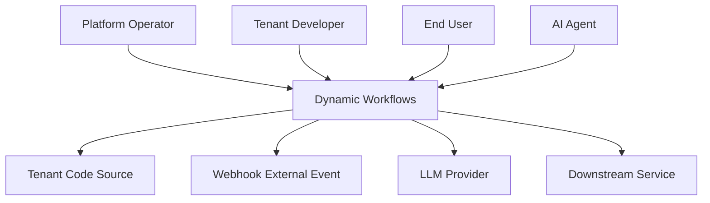
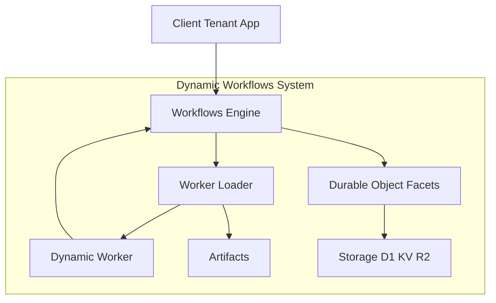
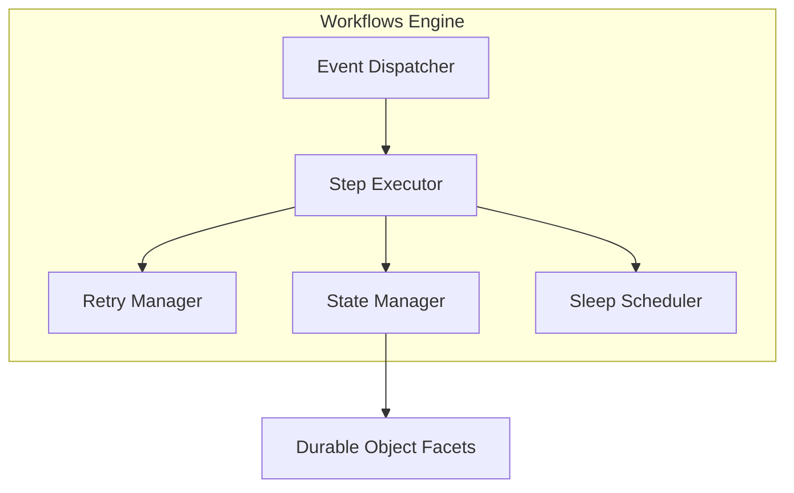
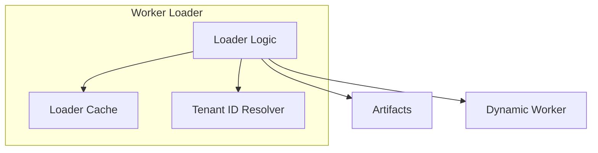
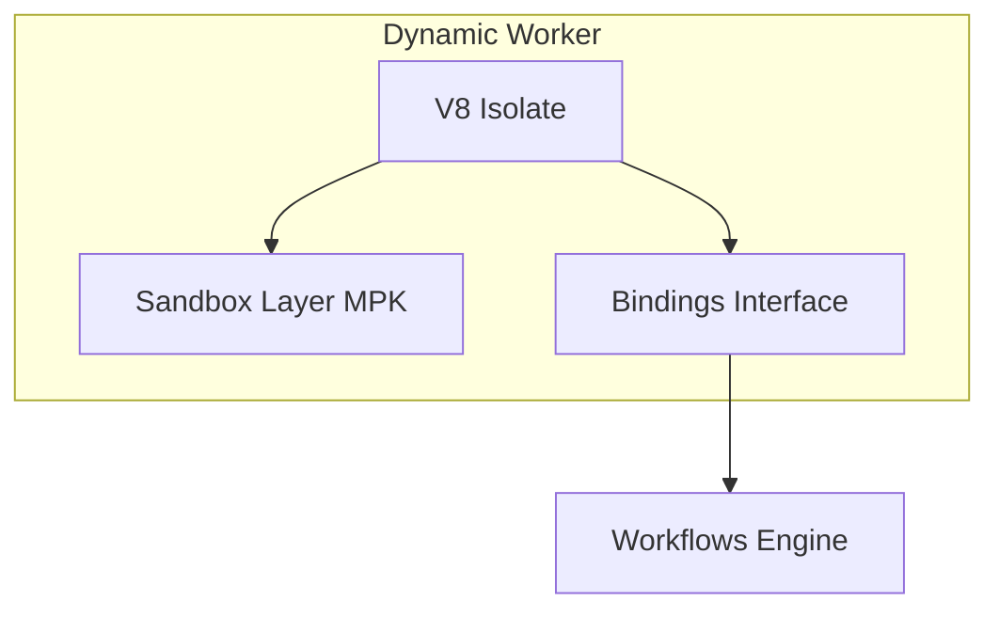
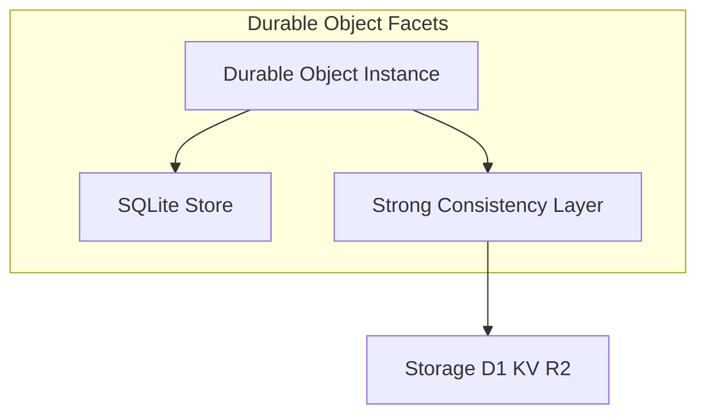
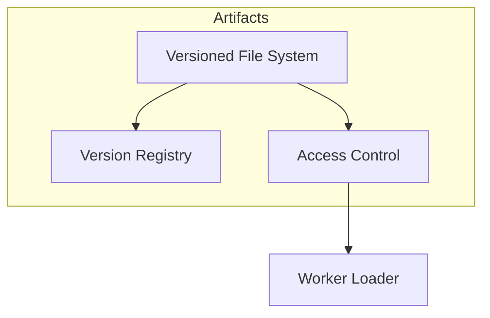
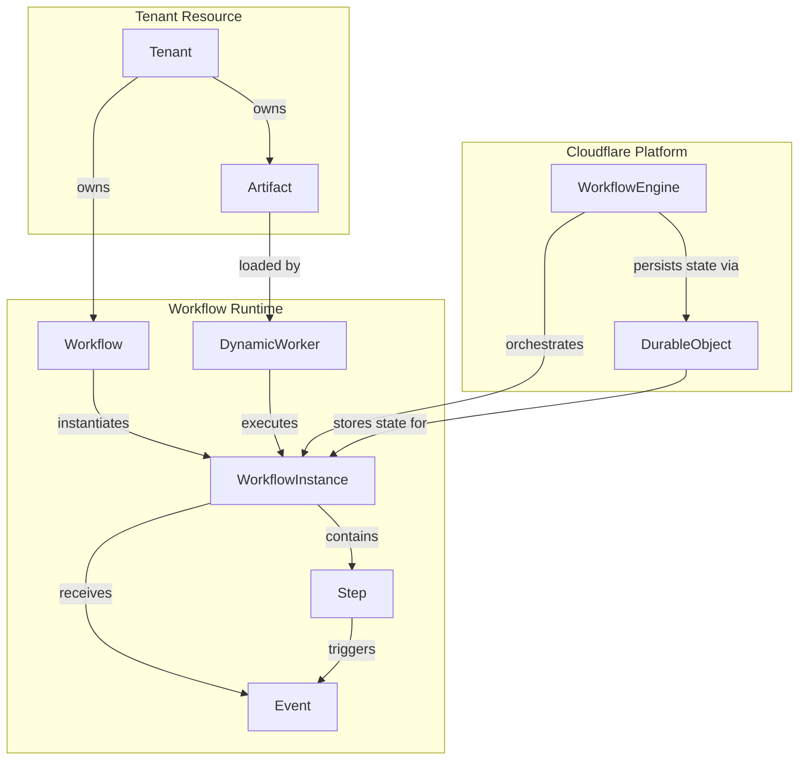
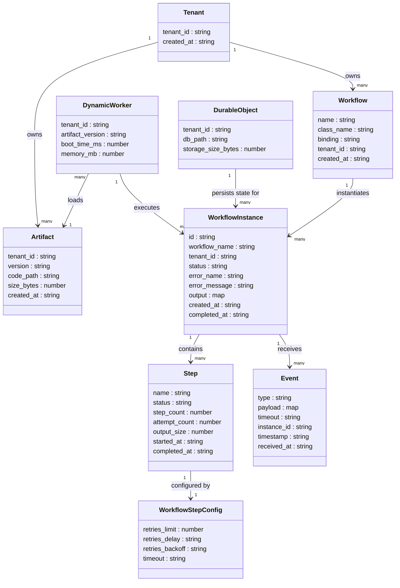

## 概要

**Cloudflare Dynamic Workflows** は、テナント・エージェント・リクエストごとに異なるワークフローコードへ **durable execution（クラッシュ・再起動・長時間スリープを跨いでも、成功済みステップを再実行せずに続きから再開できる実行）** を提供するマルチテナント実行基盤です。2026-05-01 にオープンベータとして発表されました。

従来の Cloudflare Workflows はワークフローコードをデプロイ時に固定する必要がありました。Dynamic Workflows はこの制約を取り除き、実行時に任意のテナントコードを V8 isolate へロードして durable に実行できます。

### 解決する課題

| 課題 | 具体例 |
|---|---|
| マルチテナント SaaS で顧客別カスタムワークフロー | 顧客が記述した承認フロー |
| AI エージェントプラットフォームでの実行時ルーティング | LLM が生成したワークフローコードの durability 付き実行 |
| CI/CD システムでのリポジトリ別パイプライン | リポジトリの YAML/JS を都度 durable 実行 |
| SDK/フレームワークでのプラグイン的拡張点 | ユーザー提供実装への対応 |

### 公式が挙げる 3 大用途

1. **Agent platforms** — LLM が記述したワークフローへの完全な durability 提供
2. **Customizable SDKs and frameworks** — ユーザー提供コードへの durable 実行層
3. **CI/CD systems** — リポジトリ定義パイプラインの durable 実行

### 関連技術スタック

Dynamic Workflows は Cloudflare 上の複数技術が組み合わさったスタックの最上位レイヤーに位置します。

| レイヤー | 役割 |
|---|---|
| Dynamic Workflows | マルチテナント durable execution の薄いラッパー（約 300 行 TypeScript、MIT、npm: `@cloudflare/dynamic-workflows`） |
| Cloudflare Workflows | step.do / step.sleep / retry の durable execution エンジン |
| Dynamic Workers | テナント提供コードを V8 isolate にランタイムでロードする基盤（2026-03-24 オープンベータ発表） |
| Durable Objects | 強整合ステートフルストレージ・テナント別 SQLite（Durable Object Facets） |
| Workers for Platforms | 別概念。マルチテナント Workers のデプロイ管理基盤（公式 docs は「Workflows は Workers for Platforms namespaces にデプロイ不可」と明記。Dynamic Workflows との設計上の棲み分けは整理中） |

## 特徴

- **テナントコードのランタイムロード**: デプロイ時固定ではなく、実行時に V8 isolate へコードをロードして durable 実行できる固有機能です。
- **約 300 行の薄いラッパー**: Dynamic Workers と既存 Workflows API の組み合わせで実現します。
- **idle ほぼ無料**: アイドルテナントのコストはほぼゼロです（公式表現: "approximately nothing"）。
- **メタデータ透過伝播**: `wrapWorkflowBinding()` が RPC ペイロードにテナント識別情報を埋め込み、何時間・何日後の再開でも正しいテナントコードへ自動ルーティングします。
- **既存 Workflows API との互換**: `WorkflowEntrypoint` クラスを拡張するだけで既存コードを流用できます。
- **エッジ分散実行**: Cloudflare Workers の 300+ 拠点での近接実行に対応します。
- **データプレーン同居**: D1 / R2 / Durable Objects / KV と同一プラットフォームで完結します。

### 競合との比較

> 比較表の確認日: 2026-05-03。各セルの出典は記事末尾の「参考リンク」セクションを参照してください。各製品とも頻繁に料金体系・統合機能を更新するため、採用判断時は公式ドキュメントの最新値もあわせて確認してください。

| 項目 | Cloudflare Dynamic Workflows | Temporal | Restate | Inngest | DBOS | AWS Step Functions | Azure Durable Functions |
|---|---|---|---|---|---|---|---|
| 実行方式 | V8 isolate, ランタイム Worker ロード | Replay (Event sourcing) | Journal replay | Event-driven Step | Postgres TX | State Machine (JSON) | Orchestrator/Activity |
| テナント分離 | V8 isolate per tenant | Namespace | ビルトイン namespace | ビルトイン | ビルトイン | IAM / VPC | Function App スコープ |
| コードデプロイ方式 | **ランタイムロード（動的）** | 静的（Versioning API ありだがランタイムコードロードは不可） | Single binary | Multi-cloud デプロイ | Single binary + Postgres | AWS Visual (静的) | Azure Portal / ARM |
| AI Agent 統合 | 「Agent platforms」言及のみ（統合詳細未公開） | OpenAI Agents SDK (Public Preview) / Google ADK (experimental) | Pydantic AI / OpenAI 統合 | AgentKit | Pydantic AI / OpenAI native | 公式推奨パターンなし | 限定的 |
| 料金モデル | $0.002/unique Worker/日（ベータ中無料）+ CPU・呼び出し料金 | $0（self-host OSS）/ Cloud 最低ティア $25/mo〜（Actions ベース） | 非公開（OSS 無料） | $0 Hobby / $75/mo Pro | OSS 無料 / Cloud 非公開 | State transitions × GB-秒 | 実行時間 × リソース |
| 最大実行期間 | 壁時間無制限（CPU 5 分/step） | 無制限 | 無制限 | 無制限 | 無制限 | 1 年（Standard） | 無制限 |
| 本番実績 | 発表直後（2026-05-01）採用報告ゼロ | Temporal 社設立 2019、前身 Cadence は Uber 由来。OpenAI Codex の外部利用企業として紹介、Salesforce 採用 | 限定的 | 中規模 (SoundCloud 等) | MIT-Stanford R&D | AWS 既存統合の膨大な実績 | Azure 既存統合の実績 |
| ベンダーロック | 高（Cloudflare 限定） | 中（self-host 可） | 低（multi-deploy） | 低（multi-cloud） | 低（Postgres + OSS） | 高（AWS 限定） | 高（Azure 限定） |

### アーキテクチャの違い（技術的根拠）

| 観点 | 競合（Temporal 等） | Dynamic Workflows |
|---|---|---|
| コードとデプロイの関係 | ワークフロー定義はデプロイの一部。変更時は再デプロイが必要 | ランタイムに V8 isolate へテナントコードをロード。デプロイ不要 |
| マルチテナント実現方法 | Namespace / IAM / Queue の論理分離 | V8 isolate の物理的メモリ分離（ミリ秒コールドスタート） |
| idle テナントのコスト | Actions/Execution ベース課金のため idle でも一定コスト | isolate はアイドル時に解放。コストほぼゼロ |
| AI エージェント対応 | LLM が生成したコードは実行前に再デプロイが必要 | LLM が生成したコードをそのまま durable 実行可能 |

### ユースケース別推奨

| ユースケース | 推奨 | 理由 |
|---|---|---|
| Cloudflare 完結で AI エージェント基盤を新規構築（PoC） | Dynamic Workflows | idle 無料・エッジ実行・LLM 生成コードの直接実行 |
| 本番クリティカルな AI エージェント | Temporal | 運用実績、OpenAI/Google ADK 連携 (Public Preview / experimental) |
| マルチクラウド・ベンダーロック回避 | Inngest または DBOS | multi-cloud または OSS + Postgres |
| 既存 AWS スタック | AWS Step Functions または Inngest | 既存 AWS 統合の活用 |
| 超低レイテンシー（p99 < 100ms） | Restate | 公開ベンチマーク（2024 年）: <100ms p99（10 steps） |
| Postgres 中心のシンプルな構成 | DBOS | Postgres トランザクション = durability |

## 構造

> 本セクションの C4 図および「データ」セクションの概念モデル・情報モデルは、公式 Blog（[Dynamic Workflows](https://blog.cloudflare.com/dynamic-workflows/) / [Dynamic Workers](https://blog.cloudflare.com/dynamic-workers/)）と公式ドキュメントの公開情報をもとにした概念整理です。Cloudflare 公式が提示する厳密なアーキテクチャ図ではありません。内部実装の詳細（Storage 配置・Artifacts の実体など）は推定を含みます。

### システムコンテキスト図

Dynamic Workflows と外部アクター・外部システムの関係を示します。



| 要素 | 説明 |
|---|---|
| Platform Operator | Dynamic Workflows 基盤の構築・運用主体。Wrangler や REST API を経由してシステムを管理 |
| Tenant Developer | カスタムワークフローコードを提供するテナント側の開発者 |
| End User | テナントアプリケーションのエンドユーザー。ワークフローを起動して結果を受け取る |
| AI Agent | LLM が生成したワークフローコードを動的に実行する自律エージェント |
| Dynamic Workflows | テナント別コードのランタイムルーティングと durable execution を提供する本システム |
| Tenant Code Source | テナントが管理するワークフローコードのリポジトリ。Artifacts を介してロード |
| Webhook External Event | 外部システムからの非同期イベント。`step.waitForEvent()` で受信 |
| LLM Provider | AI 推論エンドポイント（Workers AI、OpenAI 等）。ステップ内から呼び出す |
| Downstream Service | REST API、データベース、メッセージキュー等の連携先 |

### コンテナ図

Dynamic Workflows を構成する主要コンテナとデータフローを示します。



| コンテナ | 説明 |
|---|---|
| Workflows Engine | durability・state 管理・retry を担うプラットフォーム層 |
| Worker Loader | テナント識別子を解釈し、対応コードを Artifacts から Dynamic Worker にロードするルーティング層。キャッシュ機能あり |
| Dynamic Worker | V8 isolate 上でテナントコードをミリ秒単位で起動するランタイム。テナント分離の実体 |
| Durable Object Facets | テナント別 SQLite データベース。ワークフロー永続状態を保持 |
| Artifacts | バージョン管理されたファイルシステム。テナント・エージェント別ソースコード格納 |
| Storage D1 KV R2 | Cloudflare ネイティブのストレージ群。Durable Object Facets の背後で利用 |

### コンポーネント図

各コンテナの内部構造を示します。

#### Workflows Engine



| コンポーネント | 説明 |
|---|---|
| Step Executor | `step.do()` を受け取りテナントコードのステップ関数を呼び出す。成功済みステップは再実行せず State Manager から戻り値を取得（durable replay） |
| Event Dispatcher | `step.waitForEvent()` で外部イベントを待機し、受信時にステップを再開 |
| Retry Manager | デフォルト 5 回・exponential backoff でリトライを制御。`NonRetryableError` 時はスキップ |
| State Manager | ステップ戻り値と進行状態を Durable Object Facets に永続化。Temporal の event sourcing と異なり SQLite に直接保存 |
| Sleep Scheduler | `step.sleep()` および `step.sleepUntil()` の待機タイマーを管理。最大 365 日対応 |

#### Worker Loader



| コンポーネント | 説明 |
|---|---|
| Loader Logic | テナントコードの取得・コンパイル・Dynamic Worker への引き渡しを担うメインロジック |
| Loader Cache | 複数ステップ間で同一テナントの Dynamic Worker を再利用するキャッシュ層 |
| Tenant ID Resolver | `wrapWorkflowBinding()` が埋め込んだ RPC メタデータからテナント識別子を取り出す |

#### Dynamic Worker



| コンポーネント | 説明 |
|---|---|
| V8 Isolate | テナントコードを実行する JavaScript 実行環境。ミリ秒単位のコールドスタート |
| Sandbox Layer MPK | ハードウェア Memory Protection Keys による第 2 層サンドボックス。V8 isolate エスケープや隣接 isolate のメモリ読み取りに対する防御を強化 |
| Bindings Interface | Workers Bindings を通じて Workflows Engine や Durable Object Facets と通信 |

#### Durable Object Facets



| コンポーネント | 説明 |
|---|---|
| Durable Object Instance | テナント別に 1 対 1 のステートフルオブジェクト。同期実行と強整合を保証 |
| SQLite Store | ワークフロー永続状態（ステップ結果・進行位置）を保持するテナント別 SQLite |
| Strong Consistency Layer | 分散環境での強整合読み書きを保証するレイヤー |

#### Artifacts



| コンポーネント | 説明 |
|---|---|
| Versioned File System | テナント・エージェント別にバージョン管理されたソースコードを格納 |
| Version Registry | コードバージョンのメタデータ（バージョン番号・タイムスタンプ）を管理 |
| Access Control | テナント識別子に基づくコードアクセス制御 |

## データ

### 概念モデル

主要エンティティと所有・利用関係を示します。



| エンティティ | 説明 |
|---|---|
| Tenant | プラットフォームのテナント。Artifact と Workflow を所有 |
| Artifact | テナントごとにバージョン管理されたソースコードファイル |
| Workflow | テナントが定義するワークフロー。binding 名と class 名を持つ |
| WorkflowInstance | Workflow の実行インスタンス。Step と Event を含む |
| Step | ワークフローの単一実行ユニット。リトライ設定を持つ |
| Event | 外部から `sendEvent()` で送信されるイベント |
| DynamicWorker | V8 isolate 上で Artifact を実行するランタイム |
| WorkflowEngine | プラットフォームの実行制御層 |
| DurableObject | テナント別 SQLite に状態を永続化する Cloudflare プリミティブ |

### 情報モデル

各エンティティの主要属性と多重度を示します。



#### WorkflowInstance.status の値

| 値 | 説明 |
|---|---|
| queued | 同時実行上限によりキュー待機中 |
| running | 実行中 |
| paused | 一時停止中 |
| waitingForPause | 一時停止待ち（次のステップ境界で停止予定） |
| waiting | `step.waitForEvent` または `step.sleep` で待機中 |
| errored | リトライ上限到達またはエラーで失敗終了 |
| terminated | ユーザー操作による強制終了 |
| complete | 正常完了 |
| unknown | 状態不明 |

#### イベント種別 (workflowsAdaptive データセット)

| 値 | 種別 | 説明 |
|---|---|---|
| WORKFLOW_QUEUED | ワークフロー | キュー登録 |
| WORKFLOW_START | ワークフロー | 実行開始 |
| WORKFLOW_SUCCESS | ワークフロー | 正常完了 |
| WORKFLOW_FAILURE | ワークフロー | 失敗終了 |
| WORKFLOW_TERMINATED | ワークフロー | 強制終了 |
| STEP_START | ステップ | ステップ開始 |
| STEP_SUCCESS | ステップ | ステップ正常完了 |
| STEP_FAILURE | ステップ | ステップ失敗 |
| SLEEP_START | ステップ | sleep 開始 |
| SLEEP_COMPLETE | ステップ | sleep 完了 |
| ATTEMPT_START | ステップ | リトライ試行開始 |
| ATTEMPT_SUCCESS | ステップ | リトライ試行成功 |
| ATTEMPT_FAILURE | ステップ | リトライ試行失敗 |

#### WorkflowStepConfig のデフォルト値

| 項目 | デフォルト値 |
|---|---|
| retries.limit | 5 |
| retries.delay | `10 seconds`（内部表現は 10000 ms。文字列・数値どちらも受理） |
| retries.backoff | exponential |
| timeout | 10 minutes |

`retries.backoff` の選択肢は `constant` / `linear` / `exponential` の 3 種類です。

#### Event の制約

- `type` フィールドは英数字・`-`・`_` のみ使用可能で、最大 100 文字です
- `payload` は JSON シリアライズ可能なオブジェクトで、最大 1 MiB です
- `timeout` のデフォルトは 24 時間で、1 秒〜365 日の範囲で設定可能です
- `payload` および `WorkflowEvent` 全体は実質イミュータブルです。値をステップ間で永続化するには `step.do` のコールバックから戻り値として返してください

## 構築方法

### 前提条件

#### プロダクトごとの利用可能プラン

| プロダクト | Free Workers | Paid Workers |
|---|:---:|:---:|
| Cloudflare Workflows（基盤の durable execution） | ◯ 使える（制限厳しめ） | ◯ |
| Dynamic Workers | ✕ Paid 必須 | ◯ オープンベータ |
| Dynamic Workflows（Dynamic Workers 上に構築） | ✕ Paid 必須 | ◯ オープンベータ |

→ **Dynamic Workflows そのものは Paid 必須**です。基盤の Cloudflare Workflows 単独利用なら Free でも動きます。

#### その他の前提

- **Node.js** v16.17.0 以上が必要です。バージョン管理には Volta または nvm を推奨します
- **wrangler CLI** は npm 経由でインストールします

### wrangler のインストール

```bash
# npx 経由（インストール不要）
npx wrangler --version

# グローバルインストールする場合
npm install -g wrangler
```

### プロジェクト初期化

C3 CLI ツール（`npm create cloudflare`）で Workflow プロジェクトを scaffold します。

```bash
npm create cloudflare@latest -- my-workflow
```

対話式セットアップで以下を選択します。

- テンプレート: Hello World example
- タイプ: Worker only
- 言語: TypeScript
- git 初期化: Yes
- 即時デプロイ: No

### wrangler.jsonc の Workflow binding 設定

```jsonc
{
  "$schema": "node_modules/wrangler/config-schema.json",
  "name": "my-workflow",
  "main": "src/index.ts",
  "compatibility_date": "2026-05-01",
  "observability": {
    "enabled": true
  },
  "workflows": [
    {
      "name": "my-workflow",
      "binding": "MY_WORKFLOW",
      "class_name": "MyWorkflow"
    }
  ]
}
```

- `class_name`: エクスポートするクラス名と一致させます
- `binding`: Worker コード内で `env.MY_WORKFLOW` として参照します

binding 設定後、TypeScript 型定義を生成します。

```bash
npx wrangler types
```

### Dynamic Workers のオープンベータアクセス

- Dynamic Workflows は Dynamic Workers（2026-03-24 オープンベータ発表）の上に構築されます
- Workers Paid プランのユーザーは追加申請なしで利用可能です
- `@cloudflare/dynamic-workflows` パッケージ（MIT ライセンス）として npm に公開されています

### パッケージ追加

```bash
npm install @cloudflare/dynamic-workflows
```

標準の Cloudflare Workflows（`WorkflowEntrypoint`）のみ使う場合、このパッケージは不要です。Dynamic Workflows 固有 API（`createDynamicWorkflowEntrypoint` / `wrapWorkflowBinding`）を使う場合に追加します。

## 利用方法

### Workflow ライフサイクル API 一覧

| メソッド | binding 経由 | 説明 |
|---|---|---|
| create | `env.MY_WORKFLOW.create(options?)` | 新規インスタンスを作成 |
| createBatch | `env.MY_WORKFLOW.createBatch(batch)` | 最大 100 件のインスタンスを同時作成（冪等操作） |
| get | `env.MY_WORKFLOW.get(id)` | インスタンス ID で取得 |
| status | `instance.status()` | インスタンスの状態取得 |
| pause | `instance.pause()` | 実行中インスタンスを一時停止 |
| resume | `instance.resume()` | 一時停止中インスタンスを再開 |
| restart | `instance.restart()` | インスタンスを最初から再開 |
| terminate | `instance.terminate()` | インスタンスを強制終了 |
| sendEvent | `instance.sendEvent({type, payload})` | `waitForEvent` 待機中にイベント送信 |

### WorkflowEntrypoint クラス定義（TypeScript）

```typescript
import { WorkflowEntrypoint, WorkflowStep } from "cloudflare:workers";
import type { WorkflowEvent } from "cloudflare:workers";

type Params = { name?: string };

export class MyWorkflow extends WorkflowEntrypoint<Env, Params> {
  async run(event: WorkflowEvent<Params>, step: WorkflowStep) {
    const data = await step.do("fetch data", async () => {
      const response = await fetch("https://api.cloudflare.com/client/v4/ips");
      return await response.json();
    });

    await step.sleep("pause", "20 seconds");

    const result = await step.do(
      "process data",
      { retries: { limit: 3, delay: "5 seconds", backoff: "linear" } },
      async () => {
        return { name: event.payload.name ?? "World" };
      },
    );
    return result;
  }
}
```

### WorkflowEntrypoint クラス定義（Python）

```python
from workers import WorkflowEntrypoint

class MyWorkflow(WorkflowEntrypoint):
    async def run(self, event, step):
        @step.do('fetch-data')
        async def fetch_data():
            return {"status": "ok"}

        result = await fetch_data()

        await step.sleep("pause", "20 seconds")

        @step.do('process-data', config={"retries": {"limit": 3, "delay": "5 seconds"}})
        async def process_data():
            return {"name": event.payload.get("name", "World")}

        return await process_data()
```

### step.do / step.sleep / step.sleepUntil / step.waitForEvent

#### step.do

```typescript
const result = await step.do(
  "step-with-retry",
  { retries: { limit: 10, delay: "10 seconds", backoff: "exponential" }, timeout: "30 minutes" },
  async () => {
    return { value: 42 };
  },
);
```

戻り値の最大サイズは 1 MiB です。`ReadableStream<Uint8Array>` も返せます（TypeScript のみ、永続状態にカウント）。

#### step.sleep / step.sleepUntil

```typescript
await step.sleep("wait 1 hour", "1 hour");
await step.sleepUntil("wait until deadline", new Date("2026-12-31T00:00:00Z"));
```

使用可能な単位: `second` / `minute` / `hour` / `day` / `week` / `month` / `year`（最大 365 日）

#### step.waitForEvent

```typescript
let stripeEvent = await step.waitForEvent<IncomingStripeWebhook>(
  "receive invoice paid webhook from Stripe",
  { type: "stripe-webhook", timeout: "1 hour" },
);
```

- `type` は必須（最大 100 文字、英数字・`-`・`_` のみ）
- デフォルトタイムアウトは 24 時間（1 秒〜365 日で設定可能）

### NonRetryableError

```typescript
import { NonRetryableError } from "cloudflare:workflows";

await step.do("validate payload", async () => {
  if (!event.payload.data) {
    throw new NonRetryableError("event.payload.data did not contain the expected payload");
  }
});
```

### インスタンス作成

#### binding 経由

```typescript
const instance = await env.MY_WORKFLOW.create({
  id: crypto.randomUUID(),
  params: { name: "Alice" },
});
```

#### REST API 経由

```bash
curl https://api.cloudflare.com/client/v4/accounts/$ACCOUNT_ID/workflows/$WORKFLOW_NAME/instances \
    -X POST \
    -H "Authorization: Bearer $CLOUDFLARE_API_TOKEN" \
    -H "Content-Type: application/json" \
    -d '{"params": {"name": "Alice"}}'
```

#### wrangler CLI 経由

```bash
npx wrangler workflows trigger my-workflow '{"name": "Alice"}' --id my-custom-id
```

### sendEvent でイベント注入

```typescript
const instance = await env.MY_WORKFLOW.get(instanceId);
await instance.sendEvent({
  type: "stripe-webhook",
  payload: webhookPayload,
});
```

### Dynamic Workflows 固有 API

#### Worker Loader の実装例

```typescript
import {
  createDynamicWorkflowEntrypoint,
  wrapWorkflowBinding,
  DynamicWorkflowBinding,
} from '@cloudflare/dynamic-workflows';

function loadTenant(env: Env, tenantId: string) {
  return env.LOADER.get(tenantId, async () => ({
    compatibilityDate: '2026-01-01',
    mainModule: 'index.js',
    modules: { 'index.js': await fetchTenantCode(tenantId) },
    env: { WORKFLOWS: wrapWorkflowBinding({ tenantId }) },
  }));
}

export const DynamicWorkflow = createDynamicWorkflowEntrypoint<Env>(
  async ({ env, metadata }) => {
    const stub = loadTenant(env, metadata.tenantId);
    return stub.getEntrypoint('TenantWorkflow');
  }
);

// Dynamic Worker 経由で Workflow instance を作成するために必須
export { DynamicWorkflowBinding };
```

#### テナントコード（テナント側は通常の Workflows と同一）

```typescript
import { WorkflowEntrypoint } from "cloudflare:workers";

export class TenantWorkflow extends WorkflowEntrypoint {
  async run(event, step) {
    return step.do('greet', async () => `Hello, ${event.payload.name}!`);
  }
}
```

#### dispatchWorkflow（低レベルプリミティブ）

```typescript
import { dispatchWorkflow } from '@cloudflare/dynamic-workflows';

export class MyDynamicWorkflow extends WorkflowEntrypoint {
  async run(event, step) {
    return dispatchWorkflow(
      { env: this.env, ctx: this.ctx },
      event,
      step,
      ({ metadata, env }) => loadRunnerForTenant(env, metadata),
    );
  }
}
```

#### `createDynamicWorkflowEntrypoint` と `dispatchWorkflow` の使い分け

| 関数 | 用途 |
|---|---|
| `createDynamicWorkflowEntrypoint` | 標準的なマルチテナントパターン。エントリポイントクラスを丸ごとラップして自動ルーティング |
| `dispatchWorkflow` | カスタム `WorkflowEntrypoint` サブクラスでルーティング前後にカスタムロジック（ログ・認可チェック・前処理）を挟みたい場合 |

## 運用

### デプロイ・更新

```bash
# デプロイ
wrangler deploy

# 特定環境へデプロイ
wrangler deploy --env production
```

> **テナントコードの更新と in-flight インスタンス**: Artifacts に新バージョンをデプロイしても、実行中インスタンスは Worker Loader キャッシュに保持された旧バージョンのコードで継続実行されます。新バージョンを確実に適用したい場合は、インスタンスを `terminate` して再起動するか、バージョン番号をテナント識別子に含める設計（`tenantId:v2` 等）を検討してください（公式ドキュメント未確定事項のため要検証）。

### インスタンス管理（Wrangler CLI）

```bash
# 一覧
wrangler workflows list
wrangler workflows instances list MY_WORKFLOW

# 詳細（ステップ・リトライ・エラーログ）
wrangler workflows describe MY_WORKFLOW
wrangler workflows instances describe MY_WORKFLOW <instanceId>

# トリガー
wrangler workflows trigger MY_WORKFLOW '{"name":"test"}'

# ライフサイクル
wrangler workflows instances pause MY_WORKFLOW <instanceId>
wrangler workflows instances resume MY_WORKFLOW <instanceId>
wrangler workflows instances restart MY_WORKFLOW <instanceId>
wrangler workflows instances terminate MY_WORKFLOW <instanceId>

# イベント注入（waitForEvent 待機中インスタンスへ）
wrangler workflows instances send-event MY_WORKFLOW <instanceId> \
  --type stripe-webhook \
  --payload '{"amount": 1000}'
```

### TypeScript binding でのインスタンス管理

```typescript
const instance = await env.MY_WORKFLOW.get(instanceId);

await instance.status();
await instance.pause();
await instance.resume();
await instance.restart();
await instance.terminate();

await instance.sendEvent({
  type: "stripe-webhook",
  payload: webhookPayload,
});
```

### ログ確認

```bash
# リアルタイム
wrangler tail --format pretty
wrangler tail --format json

# インスタンス単位
wrangler workflows instances describe MY_WORKFLOW <instanceId>
```

Cloudflare Dashboard → Workers & Pages → ワークフロー名 → Logs でも確認できます。

### メトリクス

Dashboard → Workflows → ワークフロー名でメトリクスを確認します（デフォルト時間範囲: 過去 24 時間、データ保持: 31 日間）。

GraphQL Analytics API でプログラム的に取得します。

```graphql
{
  viewer {
    accounts(filter: { accountTag: "YOUR_ACCOUNT_ID" }) {
      workflowsAdaptiveGroups(
        filter: {
          workflowName: "my-workflow"
          datetimeGeq: "2026-05-01T00:00:00Z"
        }
        limit: 100
      ) {
        dimensions {
          workflowName
          instanceId
          stepName
          eventType
        }
        count
      }
    }
  }
}
```

### 制限値の確認

下表は **Cloudflare Workflows（基盤）** の制限値です。Dynamic Workflows は Workers Paid プラン上で動作するため Paid 列が適用されます（Free 列は基盤の Workflows を単独で使う場合の参考値）。

| 項目 | Free | Paid |
|---|---|---|
| 最大ステップ数 | 1,024 | 10,000（上限 25,000） |
| step.sleep() 最大 | 365 日 | 365 日 |
| ステップ CPU 時間 | 10ms | 30 秒（上限 5 分） |
| ステップ戻り値 | 1 MiB | 1 MiB |
| イベントペイロード | 1 MiB | 1 MiB |
| 永続状態 | 100 MB | 1 GB |
| 同時実行インスタンス | 100 | 50,000 |
| インスタンス作成レート | 100/秒 | 300/秒（アカウント）、100/秒（ワークフロー） |
| キュー済みインスタンス上限 | 100,000 | 2,000,000 |
| サブリクエスト上限 | 50/リクエスト | 10,000/リクエスト（上限 1,000 万） |
| ステップ最大リトライ | 10,000 | 10,000 |
| 完了インスタンス保持期間 | 3 日 | 30 日 |
| Workers メモリ | 128 MB / isolate | 128 MB / isolate |
| createBatch 1 回の上限 | 100 件 | 100 件 |

ステップは**壁時間無制限**ですが、**CPU 時間は上限あり**（最大 5 分）です。Cron Triggers / Queue Consumers の 15 分ハード制限とは異なります。

スリープ・イベント待機中のインスタンスは同時実行数にカウントされません。

### 料金

#### Cloudflare Workers + Workflows 料金（基盤）

下表は **Cloudflare Workers + Workflows（基盤）** の料金で、Dynamic Workflows でも適用されます。Workflows 専用契約は不要で Workers プランに含まれます。

| 項目 | Free | Paid |
|---|---|---|
| リクエスト | 1 日 100,000 件 | 月 1,000 万件 + 超過分 $0.30/100 万件 |
| CPU 時間 | 起動あたり 10ms | 月 3,000 万 ms + 超過分 $0.02/100 万 ms |
| ストレージ（状態） | 1 GB/月 | 1 GB/月含む + $0.20/GB-月 |

#### Dynamic Workers 料金（Dynamic Workflows 利用時に追加）

Dynamic Workflows は Dynamic Workers 上で動くため、上記に加えて以下の料金が発生します。

| 項目 | 料金 |
|---|---|
| Dynamic Workers | $0.002 / unique Worker / 日（ベータ中無料） |

「unique Worker」は 1 日に Worker Loader でロードされた一意な Worker の数を指す概念です。同一の識別子で同一コードを繰り返し起動するケースは 1 件としてカウントされる想定ですが、Worker ID とコード内容の組み合わせがどこまで「一意」と判定されるかの厳密な定義は公式 pricing で要確認です。

> 補足: 料金表の「ストレージ（状態） 1 GB/月」と制限値テーブルの「永続状態 100 MB / 1 GB」は別次元の制限です。前者はアカウント全体のストレージ無料枠、後者はインスタンス単位の永続状態上限です。

### スケール操作

同時実行制限の引き上げは Cloudflare ダッシュボードまたはサポートへ申請します。複数インスタンスをまとめて起動する場合は `createBatch()` でスループットを向上できます。

## ベストプラクティス

### AI エージェント設計パターン

#### Idempotency Boundary（冪等性境界）

各 `step.do()` が再実行されても副作用が重複しないよう設計します。

```typescript
await step.do("send notification", async () => {
  const already = await db.get(`notified:${userId}`);
  if (already) return { skipped: true };
  await sendEmail(userId);
  await db.set(`notified:${userId}`, true);
  return { sent: true };
});
```

- ステップ名はキャッシュキーになります。非決定論的な名前（タイムスタンプ等）は避けてください
- 外部 API が冪等 ID をサポートしない場合は `requestId → result` マッピングサービスを用意します

#### HITL (Human-in-the-Loop)

`step.waitForEvent()` で最大 365 日の承認待機を実現します。

```typescript
class ApprovalWorkflow extends WorkflowEntrypoint {
  async run(event: WorkflowEvent<Params>, step: WorkflowStep) {
    const analysis = await step.do("analyze request", async () => {
      return await callLLM(event.payload.request);
    });

    const approval = await step.waitForEvent("wait for human approval", {
      type: "approval-decision",
      timeout: "7 days",
    });

    if (approval.payload.approved) {
      await step.do("execute approved action", async () => {
        return await executeAction(analysis);
      });
    }
  }
}
```

外部から承認を送信する例:

```typescript
const instance = await env.MY_WORKFLOW.get(instanceId);
await instance.sendEvent({
  type: "approval-decision",
  payload: { approved: true, reviewer: "alice@example.com" },
});
```

#### Saga 補償パターン

Tool call は構造化データ収集のみとし、実際の副作用は workflow activity で行います。さらに、複数の副作用ステップを連鎖する場合は補償ロジックも step に分割します。

```typescript
// 1. ツール呼び出しと実副作用を分離する基本形
const toolResult = await step.do("collect order data via tool", async () => {
  return await llmToolCall({ tool: "get_order_details", orderId });
});

await step.do("write order to DB", async () => {
  await db.insert("orders", toolResult);
});

// 2. 複数副作用の補償トランザクション例
async function placeOrder(event, step) {
  const reservation = await step.do("reserve inventory", async () => {
    return await inventory.reserve(event.payload.orderId);
  });

  try {
    const charge = await step.do("charge payment", async () => {
      return await payment.charge(event.payload.userId, event.payload.amount);
    });
    await step.do("send confirmation", async () => {
      return await notify.send(event.payload.userId, { charge, reservation });
    });
  } catch (e) {
    await step.do("compensate inventory", async () => {
      return await inventory.release(reservation.id);
    });
    // 補償完了後にワークフロー全体を失敗として確定させる
    throw new NonRetryableError(`order placement failed: ${e.message}`);
  }
}
```

#### D1 を使った冪等テーブル（外部 API が冪等 ID 非対応の場合）

事前に D1 へ冪等テーブルを作成します。

```sql
-- wrangler d1 execute <DB> --command "..." で実行
CREATE TABLE IF NOT EXISTS idempotency (
  request_id TEXT PRIMARY KEY,
  result     TEXT NOT NULL,
  created_at INTEGER NOT NULL
);
```

```typescript
await step.do("call non-idempotent API", async () => {
  const requestId = `${event.instanceId}:send-email`;
  const cached = await env.DB.prepare(
    "SELECT result FROM idempotency WHERE request_id = ?",
  ).bind(requestId).first();
  if (cached) return JSON.parse(cached.result);

  const result = await externalApi.send(event.payload);
  await env.DB.prepare(
    "INSERT INTO idempotency (request_id, result, created_at) VALUES (?, ?, ?)",
  ).bind(requestId, JSON.stringify(result), Date.now()).run();
  return result;
});
```

#### マルチエージェント委譲

親ワークフローが子ワークフローを起動し、`step.waitForEvent` で完了を待ちます。

```typescript
const childId = crypto.randomUUID();
await step.do("spawn child workflow", async () => {
  await env.CHILD_WORKFLOW.create({ id: childId, params: { task: subtask } });
  return { childId };
});

const childResult = await step.waitForEvent("await child completion", {
  type: "child-complete",
  timeout: "1 hour",
});
```

子ワークフローの最終ステップで `parent.sendEvent({ type: "child-complete", payload: ... })` を呼び出します。

#### Plan Caching

LLM の生成プランを step に保存して、再実行時のトークンコストを削減します。

```typescript
const plan = await step.do("generate research plan", async () => {
  return await llm.generatePlan(event.payload.topic);
});

for (const subtask of plan.subtasks) {
  await step.do(`execute subtask: ${subtask.id}`, async () => {
    return await llm.executeSubtask(subtask);
  });
}
```

#### Step 粒度

LLM 呼び出し 1 回 = ステップ 1 つ。Tool 呼び出し 1 回 = ステップ 1 つ。1 ステップに複数のサービス呼び出しを混ぜると、障害時に全体が再実行されます。

```typescript
// good: 関係のない呼び出しは分割
const a = await step.do("call api1", () => api1());
const b = await step.do("call api2", () => api2());
```

### マルチテナント設計

#### Worker Loader でテナント別コードを動的ロード

Worker Loader はステップ間で Dynamic Worker をキャッシュするため、長時間実行のワークフローでもロードコストを繰り返し払いません。

#### Durable Object Facets でテナント別 SQLite

```toml
[[durable_objects.bindings]]
name = "TenantDB"
class_name = "TenantStorage"

[[migrations]]
tag = "v1"
new_sqlite_classes = ["TenantStorage"]
```

#### tenant_id を WorkflowEvent payload に含める

```typescript
await env.WORKFLOW.create({
  id: `${tenantId}-${crypto.randomUUID()}`,
  params: { tenantId, ...userParams },
});
```

メタデータはルーティングヒントであり、認可情報ではありません。`instance.status()` から読み返せるため、認証情報をメタデータに含めないでください。

#### tenant_id を含めた構造化ログ

```typescript
console.log(JSON.stringify({
  level: "info",
  tenantId: event.payload.tenantId,
  instanceId: event.instanceId,
  step: "process-data",
  durationMs: elapsed,
}));
```

### エラーハンドリング

- `NonRetryableError` でリトライを抑制（認証エラー・不正ペイロード等）
- `try/catch` でステップ継続（オプショナルなエンリッチメント等）
- サブリクエスト上限 10,000/ステップ（Paid デフォルト）への対処はステップ分割または上限引き上げ申請

### 観測性の設定

```toml
[observability]
enabled = true
```

`wrangler tail --format json | jq '.logs[]'` でログ解析ツールに流せます。

### セキュリティと既知の制約

#### LLM 生成コードを durable 実行する際のリスク

Dynamic Workflows は LLM が生成した任意の TypeScript/JavaScript を V8 isolate にロードして durable 実行できますが、以下のリスクへの対応が必要です。

- **プロンプトインジェクション経由の悪意あるコード生成**: コード生成プロンプトに外部入力を直接含める場合、悪意あるコードが Artifacts に登録される可能性があります。生成コードの静的解析・許可リストによるバインディング制限を行ってください
- **サプライチェーン攻撃**: テナントが import する npm パッケージの依存ツリーを把握しづらいため、社内承認済みのバンドル済みコードのみを Artifacts にデプロイする運用が安全です

#### 非決定論的コードによる replay 破綻

`step.do()` の中身は失敗時に再実行されます。`Math.random()` や `Date.now()` をステップ内で直接呼び出すと、再実行時に異なる結果になり状態が破綻します。Dynamic Workers でテナントコードを実行する場合、プラットフォーム側ではこの種のバグを検知できません。

```typescript
// bad: 再実行で異なる ID が生成される
await step.do("create record", async () => {
  return await db.insert({ id: crypto.randomUUID(), ... });
});

// good: ID をステップ前に確定する
const id = await step.do("generate id", async () => crypto.randomUUID());
await step.do("create record", async () => {
  return await db.insert({ id, ... });
});
```

#### CPU 5 分制限と LLM 推論

GPT-4 / Claude 3.7 系の長い推論は数分に及ぶことがあります。1 ステップで完結しない場合は次の対策を取ります。

- ステップに `timeout: "5 minutes"` を設定し、超過時は `NonRetryableError` でフォールバック
- ストリーミング応答を避け、推論完了後にのみ結果を返す
- 重い推論は Queue + 別 Worker にオフロードし、結果を `step.waitForEvent` で受け取る

### 状態管理のルール

`step.do()` の戻り値のみが永続化されます。

```typescript
// good: step.do() の戻り値として保存
const imageList = await step.do("fetch images", async () => {
  return await fetch("...").then(r => r.json());
});
```

`Promise.race()` / `Promise.any()` は `step.do()` 内で使います。

## トラブルシューティング

| 症状 | 原因 | 対処 |
|---|---|---|
| ワークフローが突然失敗し、リトライを繰り返す | ステップが例外をスローし、デフォルト 5 回リトライ上限に達した | `wrangler workflows instances describe` でエラー詳細を確認。`NonRetryableError` で即失敗させるか、リトライ上限・遅延を調整 |
| インスタンスが `errored` になったが原因不明 | 例外メッセージが短い | `wrangler workflows instances describe <NAME> <ID>` でステップごとのログを確認。`wrangler tail` で Worker 側の詳細ログも確認 |
| ステップ数上限超過（1,024 / 10,000 / 25,000） | ループが大きすぎる・再帰が深い | ループをバッチ分割するか、サブワークフローとして別インスタンスに委譲 |
| `step.sleep()` が 365 日を超えられない | プラットフォーム上限 | 365 日スリープ後に `step.do()` でワークフローを再スケジュール（新インスタンスを起動） |
| `step.do()` 戻り値が 1 MiB を超える | 大きなオブジェクトを返している | R2 / D1 / KV に書き出し、step の戻り値はキーだけにする |
| CPU 時間 5 分超過でステップが中断 | 重い計算処理をステップ内で実行 | 処理を分割。CPU 集約計算は Queue + 別 Worker にオフロード |
| Workers Paid 必須エラー | Free プランで Paid 限定機能を使用 | Cloudflare Dashboard で Workers Paid プランに移行 |
| Dynamic Workers ベータアクセス未承認 | Workers Paid ユーザー向けオープンベータに未加入 | Cloudflare Dashboard から Dynamic Workers / Dynamic Workflows のオープンベータを有効化 |
| ステップ名が重複してキャッシュが壊れる | ループ内でステップ名を固定にしている | `step.do(\`process item ${item.id}\`, ...)` のように一意な名前にする |
| ステップ名に乱数・タイムスタンプを使うとキャッシュが効かない | ステップ名はキャッシュキーのため非決定論的名前は毎回新規扱い | ステップ名はイベントペイロードや step の出力から決定論的に生成 |
| `await` 忘れでステップ結果が消える | `await step.do()` の `await` を省略 | すべての `step.do()` / `step.sleep()` / `step.waitForEvent()` を必ず `await` する |
| インスタンス作成レート制限に抵触 | 一括起動で 100/秒（ワークフロー）を超えた | `createBatch()` を使う。またはフロー制御で 100/秒以下に抑える |
| スリープ中のインスタンスが同時実行数を消費していると思われる | 誤解 | `sleeping` / `waiting` 状態は同時実行数にカウントされない |
| Worker Loader がテナントコードを毎回再ロードする | インスタンス ID がステップごとに変わっている | `dispatchWorkflow()` に一貫した ID を渡す |
| メタデータから認証情報を読み取れてしまう | metadata を認可に使っている | metadata はルーティングヒントのみ。認証はワークフロー外の認可サービスで行う |

## まとめ

Cloudflare Dynamic Workflows は、テナントごとに異なるワークフローコードを V8 isolate にランタイムでロードして durable に実行するマルチテナント基盤です。約 300 行 TypeScript の薄いラッパーながら、idle ほぼ無料・エッジ実行・LLM 生成コードの直接実行という独自の経済性とエージェント親和性を備えています。

非対称性として、Dynamic Workflows が Temporal に劣る点は「本番実績ゼロ（2026-05-03 時点）・AI エージェント統合の公式パターン未整備・Cloudflare 外への可搬性なし」の 3 点、優れる点は「idle ほぼ無料による大規模マルチテナントのコスト構造・LLM 生成コードの再デプロイ不要な直接実行」です。PoC やスタートアップの新規構築では Dynamic Workflows、ミッションクリティカルな本番システムでは Temporal、というのが現時点の使い分けの目安になります。

この記事が少しでも参考になった、あるいは改善点などがあれば、ぜひリアクションやコメント、SNS でのシェアをいただけると励みになります！

## 参考リンク

- 公式ドキュメント
  - [Cloudflare Workflows ドキュメント](https://developers.cloudflare.com/workflows/)
  - [Workflows: Get started guide](https://developers.cloudflare.com/workflows/get-started/guide/)
  - [Workflows: Workers API](https://developers.cloudflare.com/workflows/build/workers-api/)
  - [Workflows: Sleeping and Retrying](https://developers.cloudflare.com/workflows/build/sleeping-and-retrying/)
  - [Workflows: Events and Parameters](https://developers.cloudflare.com/workflows/build/events-and-parameters/)
  - [Workflows: Trigger Workflows](https://developers.cloudflare.com/workflows/build/trigger-workflows/)
  - [Workflows: Wrangler Commands](https://developers.cloudflare.com/workflows/reference/wrangler-commands/)
  - [Workflows: Python Workers API](https://developers.cloudflare.com/workflows/python/python-workers-api/)
  - [Workflows: Build / Rules of Workflows](https://developers.cloudflare.com/workflows/build/rules-of-workflows/)
  - [Workflows: Observability (metrics-analytics)](https://developers.cloudflare.com/workflows/observability/metrics-analytics/)
  - [Workflows: Reference / Limits](https://developers.cloudflare.com/workflows/reference/limits/)
  - [Workflows: Reference / Pricing](https://developers.cloudflare.com/workflows/reference/pricing/)
  - [Cloudflare API: Workflow Instances](https://developers.cloudflare.com/api/resources/workflows/subresources/instances/methods/create/)
  - [Cloudflare Durable Objects ドキュメント](https://developers.cloudflare.com/durable-objects/)
  - [Workers for Platforms](https://developers.cloudflare.com/cloudflare-for-platforms/workers-for-platforms/)
  - [Cloudflare Workers - Workers Bindings API](https://developers.cloudflare.com/workers/runtime-apis/bindings/)
- 公式ブログ・発表
  - [Dynamic Workflows: durable execution that follows the tenant - Cloudflare Blog](https://blog.cloudflare.com/dynamic-workflows/)
  - [Dynamic Workers - Cloudflare Blog](https://blog.cloudflare.com/dynamic-workers/)
  - [Safe in the sandbox: security hardening for Cloudflare Workers](https://blog.cloudflare.com/safe-in-the-sandbox-security-hardening-for-cloudflare-workers/)
- GitHub・npm
  - [GitHub: cloudflare/workers-sdk](https://github.com/cloudflare/workers-sdk)
  - [@cloudflare/dynamic-workflows (npm, MIT)](https://www.npmjs.com/package/@cloudflare/dynamic-workflows)
- 競合プロダクト
  - [Temporal](https://temporal.io/)
  - [Temporal × OpenAI Agents SDK 統合発表](https://temporal.io/blog/announcing-openai-agents-sdk-integration)
  - [Restate](https://restate.dev/)
  - [Restate AI examples (GitHub)](https://github.com/restatedev/ai-examples)
  - [Inngest AI](https://inngest.com/ai)
  - [Inngest AgentKit](https://agentkit.inngest.com/)
  - [DBOS](https://www.dbos.dev/)
  - [AWS Step Functions](https://aws.amazon.com/step-functions/)
  - [Azure Durable Functions](https://learn.microsoft.com/azure/azure-functions/durable/durable-functions-overview)
- 設計論・国内事例
  - [Diagrid: Checkpoints are not Durable Execution](https://www.diagrid.io/blog/checkpoints-are-not-durable-execution-why-langgraph-crewai-google-adk-and-others-fall-short-for-production-agent-workflows)
  - [Anthropic: Effective harnesses for long-running agents](https://www.anthropic.com/engineering/effective-harnesses-for-long-running-agents)
  - [LayerX: Temporal Workflow で実現する Durable な AI Agent](https://zenn.dev/layerx/articles/b5f6cf6e47221e)
