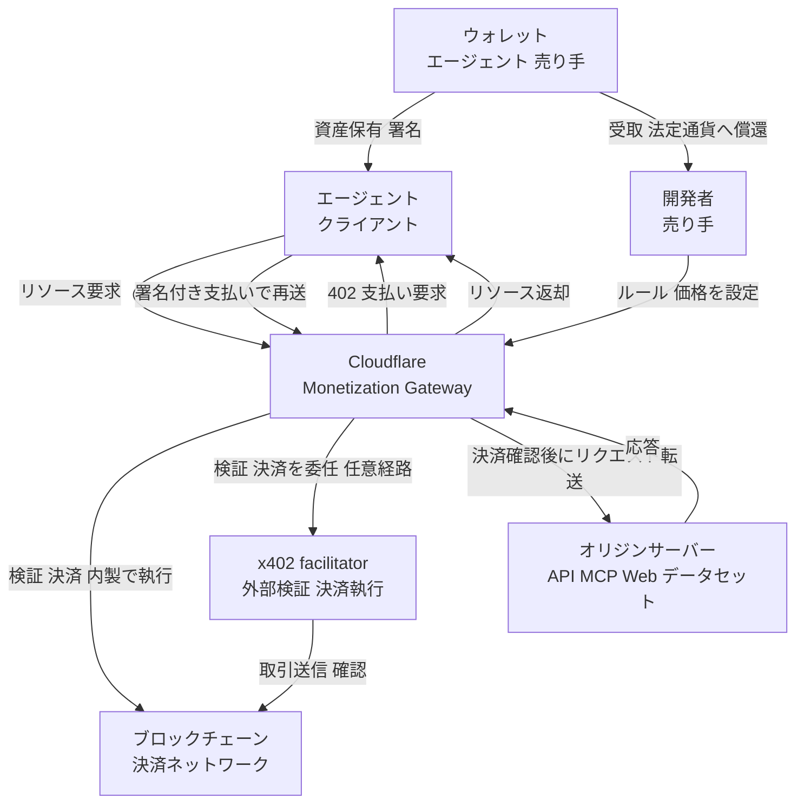
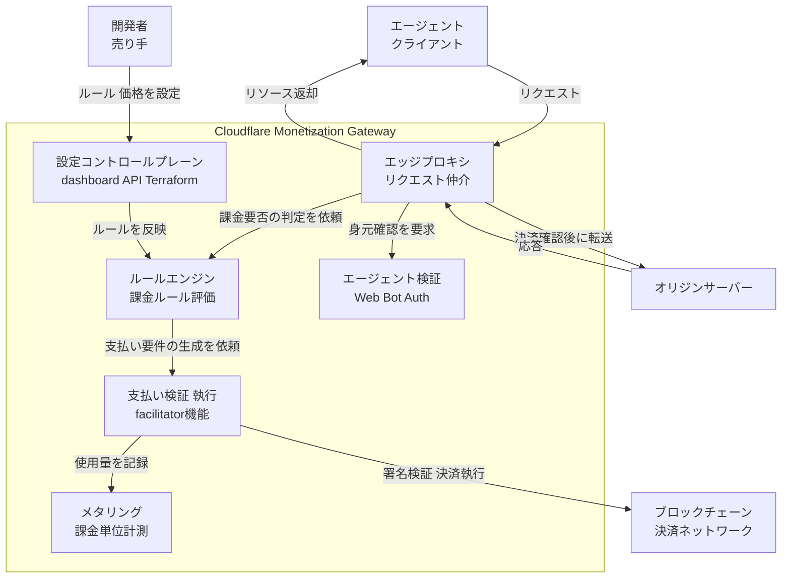
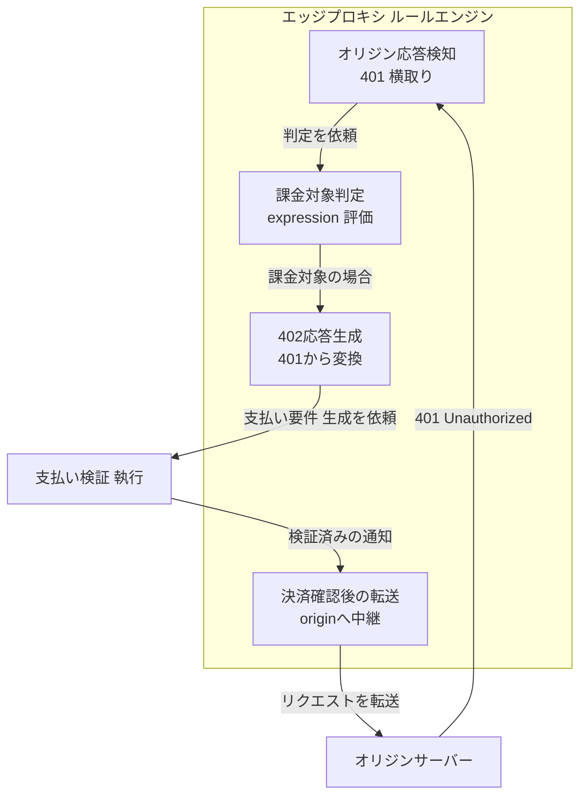
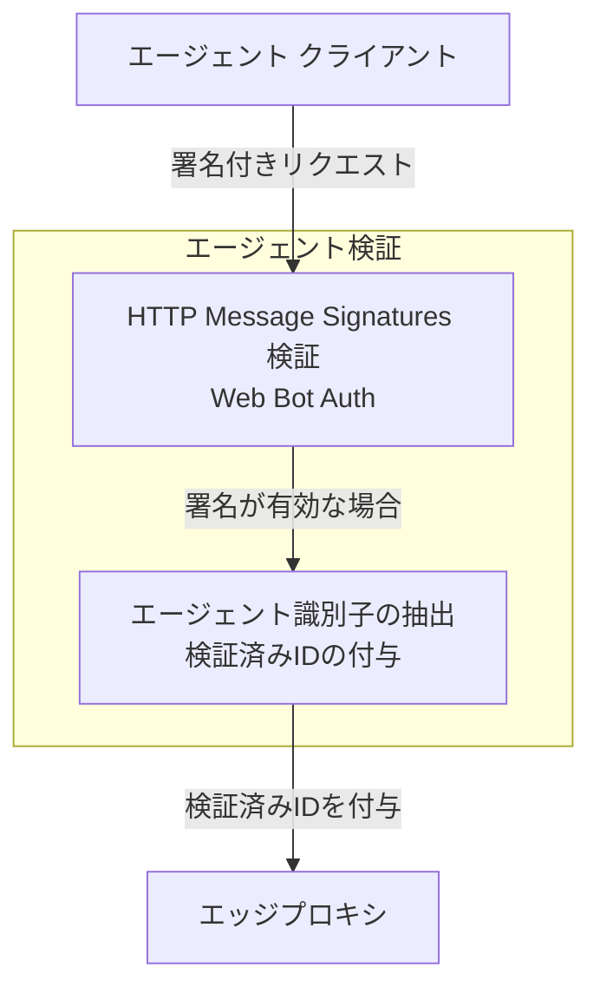
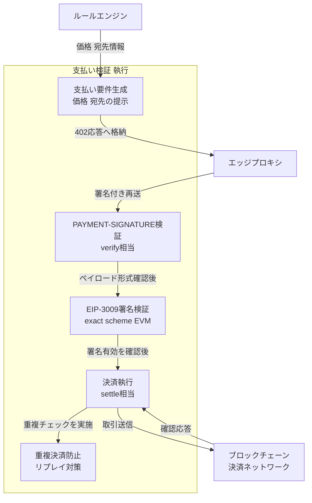
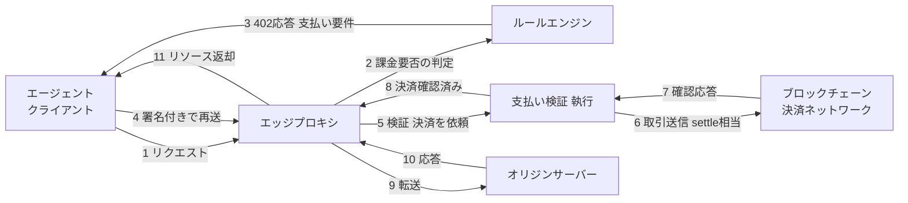
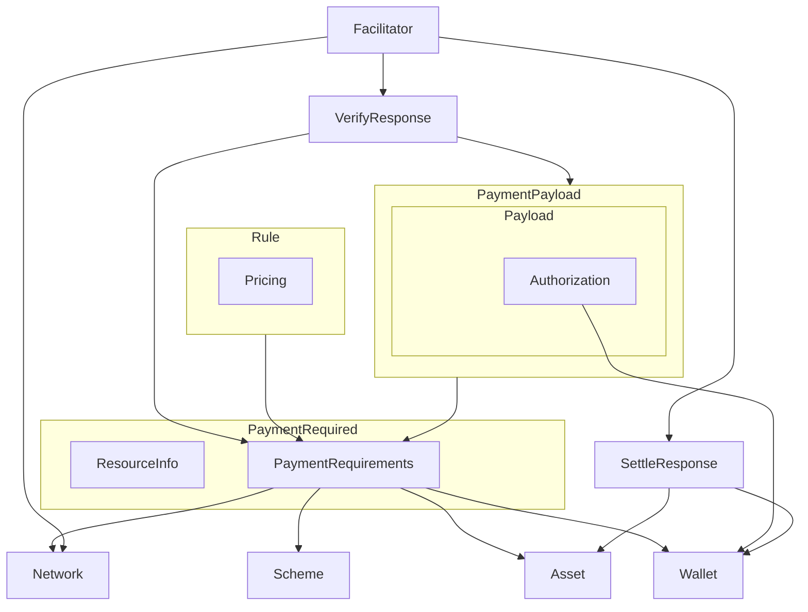
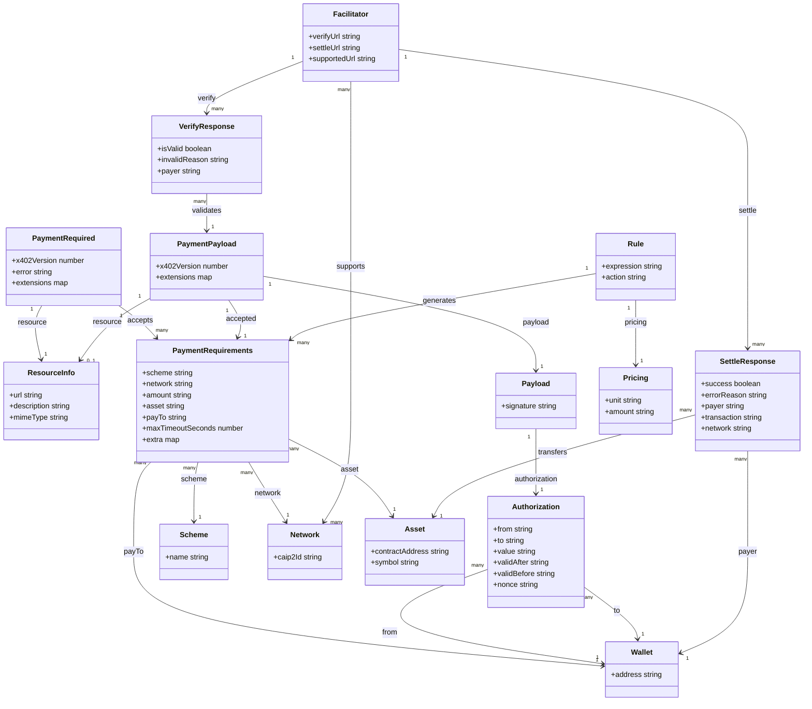

> 本記事は Cloudflare Monetization Gateway（2026-07-01 発表、waitlist / early access 段階）を、オープン決済プロトコル x402（v2 仕様）と照合して整理した技術調査です。Gateway の内部実装名は公式未公開のため、内部構成に触れる箇所は x402 の一般的な構成に基づく整理です。

## 概要

エージェントが Web トラフィックの主要な担い手になりつつあります。エージェントは広告を見ません。エージェントは月額サブスクリプションを維持する動機を持ちません。一方で AI クローラーは、人間の訪問者 1 件あたり数百〜数万回の頻度でコンテンツを要求します。

この変化は、既存の課金モデルの前提を崩します。座席課金（seat-based）や月額サブスクリプションは「誰が使うか」を基準に設計されています。エージェント時代の呼び出しは「何回・どれだけ使ったか」で発生します。従来モデルのまま運用すると、次のいずれかが起こります。

- API 提供者がエージェント由来の大量リクエストを無償で受け続ける
- API キー発行と契約事務が呼び出し規模に追いつかず、アクセス制御が形骸化する

Cloudflare Monetization Gateway は、この課金単位のギャップを Cloudflare エッジ（330 以上の都市）で埋める仕組みです。Web ページ・データセット・API・MCP ツールなど、Cloudflare の背後にある任意のリソースに対して、リクエスト単位の従量課金を単一のコントロールプレーンで設定できます。決済確認はオリジンサーバーに到達する前にエッジで完結するため、オリジン側の実装負担が軽くなります。

### x402 プロトコルと Cloudflare Monetization Gateway の関係

x402 は、HTTP の `402 Payment Required` ステータスコードを軸に構築されたオープンな決済標準です。`402` は 1992 年から予約されながら標準実装を持たなかったステータスコードで、x402 はこれを実運用に戻す試みです。Coinbase が原型を提案し、現在は x402 Foundation（Linux Foundation がスポンサー、25 以上の業界リーダーが参加）が標準化を担っています。Cloudflare は Coinbase とともに x402 Foundation の設立に関わった一員です。

x402 のフローは次の順序で進みます。

1. クライアントがリソースをリクエストする
2. 支払いが必要な場合、サーバーが `402 Payment Required` と支払い条件（価格・受理する資産・支払い先）を返す
3. クライアントが支払いペイロードを作成し、署名付きで再リクエストする
4. サーバーまたは facilitator が支払いペイロードを検証する（`/verify` 相当）
5. 検証が通れば、ブロックチェーン上で決済を実行する（`/settle` 相当）
6. サーバーがリソースを返す

このうち手順 4〜5 の「検証と決済実行」を代行するサーバーが facilitator です。サーバー側はオンチェーンの署名検証や送金処理を facilitator に委譲できます（facilitator の利用は任意です）。

Cloudflare Monetization Gateway における Cloudflare の役割は、この facilitator 機能をエッジに統合することです。買い手（エージェント）と売り手（オリジン）の間にプロキシとして位置し、エージェント検証・ルール適用・支払い確認を、リクエストがオリジンに到達する前にエッジで一括処理します。加えて、認証と課金を分離できる点が特徴です。`401 Unauthorized` を横取りして `402` に変換する、あるいは Web Bot Auth によるエージェント検証と従量課金を組み合わせるといった構成を、売り手側のポリシーとして選択できます。

決済資産は stablecoin（USDC など）です。売り手は蓄積した stablecoin をそのまま次の取引に使うか、法定通貨に償還して銀行口座で受け取れます。

### 従来の課金方式との比較

| 比較項目 | API キー + 月額サブスク | Stripe 等の checkout | OAuth 課金連携 | x402 / Monetization Gateway |
|---|---|---|---|---|
| 課金単位 | 座席・月額固定枠 | 注文・取引単位 | ユーザーセッション単位 | リクエスト単位の従量課金 |
| アカウント要否 | 必須（契約・請求先登録） | 必須（顧客アカウント） | 必須（OAuth 認可） | 不要（署名そのものが認証情報） |
| 決済レール | 銀行振込・カード（月次請求） | カード・カード代行 | カード・銀行（契約先経由） | stablecoin（USDC 等）のオンチェーン送金 |
| 認証との結合 | 認証 = 課金判定基準（キー発行が契約） | 認証と決済は別フロー、都度リダイレクト | 認証フローに決済スコープを組み込む | 認証と課金を分離可能（401→402 変換など売り手が選択） |
| 対象呼び出し規模 | 人間の低頻度アクセス向け | 人間の単発購入向け | 人間の対話的操作向け | エージェントによる高頻度・機械間呼び出し向け |

### 他の x402 facilitator / 実装との位置づけ

x402 の facilitator は Cloudflare 以外にも複数存在します。

- **Coinbase**: x402 を提案した原発信者。複数ネットワーク向けに facilitator を提供します。
- **x402.org facilitator**: プロトコルのリファレンス実装が参照する facilitator（テストネット向け）。
- **thirdweb**: x402 SDK 対応の gasless facilitator を提供します。
- **x402-rs**: Rust 実装の facilitator。crypto ネイティブな API やエージェント向け pay-per-request サービスを想定します。

Cloudflare Monetization Gateway は、これらの facilitator 群と並ぶ選択肢の 1 つですが、単体の決済検証サービスではなく、エッジでのボット検証・ルール適用・課金設定管理までを一体化したゲートウェイである点が異なります。

## 特徴

- Cloudflare の背後にある Web ページ / データセット / API / MCP ツールを、リクエスト単位で課金対象にできます。
- 決済確認をオリジン到達前にエッジで完結させます。
- 課金ルールは既存の Cloudflare rules と同様の expression で記述し、dashboard / API / Terraform から管理できます。
- リクエスト単位の固定額課金（例: 検索 1 回あたり数セント）と、使用量に応じた変額課金（例: アップロードに base $0.001 + $0.01/MB）の両方に対応します。
- 成果に応じた課金（例: 解決したサポートエスカレーションのみ $0.99）を設定できます。
- 認証と課金を分離できます。`401 Unauthorized` を `402 Payment Required` に変換する構成や、Web Bot Auth によるエージェント検証と従量課金を組み合わせる構成を選べます。
- 決済資産は stablecoin（USDC 等）で、売り手は蓄積した stablecoin をそのまま取引に使うか法定通貨に償還できます。
- x402 Foundation（Linux Foundation スポンサー）の一員として、Cloudflare は facilitator の役割をエッジで担います。
- 2026-07-01 発表時点では waitlist / early access 段階で、一般提供（GA）には至っていません。

## 構造

Cloudflare Monetization Gateway は、2026-07-01 時点で waitlist 段階の製品です。公式ブログは全体構成の役割単位までは公開していますが、内部コンポーネントの正式名称までは開示していません。以下のコンポーネント名は x402 の一般的な facilitator 構成（`/verify`・`/settle` 相当）と Web Bot Auth の署名検証パターンに基づく整理であり、Cloudflare 社内の実装名を示すものではありません。

### システムコンテキスト図

エージェント（クライアント）が有料リソースにアクセスしようとする際、Cloudflare Monetization Gateway がリクエストの入口に立ちます。開発者（売り手）は事前にルールと価格を設定し、実際の決済検証・執行はブロックチェーン決済ネットワークおよび x402 facilitator の役割と連動して行われます。



| 要素名 | 説明 |
|---|---|
| エージェント クライアント | 有料リソースを自動購入するアクター。ウォレットを保有し、署名付き支払いペイロードを生成する |
| 開発者 売り手 | Cloudflare の顧客。課金ルール・価格・収益配分を設定する。買い手のオンボーディングや独自の請求システム構築は不要 |
| Cloudflare Monetization Gateway | Cloudflare エッジ上で「エージェント検証 → ルール適用 → 支払い確認」をオリジン到達前に行う本システム |
| オリジンサーバー | 保護対象となる API・MCP ツール・Web ページ・データセットを提供するサーバー。決済確認後にのみ Gateway からリクエストが転送される |
| ブロックチェーン 決済ネットワーク | stablecoin 建ての取引を記録・確定する外部台帳。Base 等 CAIP-2 で識別される EVM チェーンや Solana を想定 |
| x402 facilitator | 支払いペイロードの検証と決済執行を担う x402 プロトコル上の役割。Cloudflare は自らこの役割をエッジで担うが、Gateway が未対応の範囲では外部の facilitator が同役割を担う場合もある |
| ウォレット エージェント 売り手 | エージェント側は支払い原資と署名鍵を保持し、売り手側は受け取った stablecoin を保管・償還する |

### コンテナ図

Cloudflare Monetization Gateway をドリルダウンすると、リクエストを仲介するエッジプロキシを中心に、ルール評価・エージェント検証・支払い検証と執行・メタリング・設定管理の各コンテナが連携します。



#### 外部要素（コンテキストからの再掲）

| 要素名 | 説明 |
|---|---|
| エージェント クライアント | Gateway に対してリクエストを送る自動化された買い手 |
| オリジンサーバー | Gateway 背後の保護対象リソース |
| ブロックチェーン 決済ネットワーク | 支払い検証・執行コンテナが取引を送信する外部台帳 |
| 開発者 売り手 | 設定コントロールプレーンを通じてルール・価格を管理する主体 |

#### Cloudflare Monetization Gateway 内部コンテナ

| 要素名 | 説明 |
|---|---|
| エッジプロキシ | 330 以上の都市に展開する Cloudflare エッジ上でリクエストを最初に受け、各コンテナへの仲介とオリジンへの転送可否を制御する |
| ルールエンジン | 既存 Cloudflare rules と同様の expression 記法で、どのトラフィックに課金が必要かを判定する。REST 動詞指定・可変価格・認証状態に基づく条件分岐に対応する |
| エージェント検証 | Web Bot Auth によりリクエスト送信元エージェントの身元を検証する。認証（誰であるか）と課金（いくら払うか）の判断を分離する役割を担う |
| 支払い検証 執行 | x402 の facilitator 機能に相当する処理をエッジで内製実行する。支払いペイロードの検証と、ブロックチェーンへの決済執行を担う |
| メタリング | Cloudflare の使用量ベース課金追跡基盤を用いて、リクエスト数・使用量・成果単位などの課金単位を計測する |
| 設定コントロールプレーン | dashboard・Cloudflare API・Terraform を通じて、売り手がルールと価格を一元管理するための構成管理面 |

### コンポーネント図

各コンテナをさらにドリルダウンします。ここでのコンポーネント名は x402 v2 仕様・Web Bot Auth の一般的な構成に基づく整理であり、Cloudflare の内部実装名の公開情報ではありません。

#### エッジプロキシ / ルールエンジン: 401→402 変換

オリジンが返す `401 Unauthorized` を Gateway が横取りし、課金対象と判定した場合に `402 Payment Required` へ変換します。



| 要素名 | 説明 |
|---|---|
| オリジン応答検知 | オリジンからの `401 Unauthorized` を横取りする窓口 |
| 課金対象判定 | ルールエンジンの expression に基づき、リクエストが課金対象かどうかを判定する |
| 402応答生成 | 課金対象と判定されたリクエストに対し、`401` を `402 Payment Required` に変換して返す |
| 決済確認後の転送 | 支払い検証・執行から決済確認を受けた後にのみ、リクエストをオリジンへ中継する |

#### エージェント検証: Web Bot Auth



| 要素名 | 説明 |
|---|---|
| HTTP Message Signatures 検証 | Web Bot Auth に基づき、リクエストに付与された署名の正当性を検証する |
| エージェント識別子の抽出 | 検証成功後、エージェントの識別子を後続コンポーネントに引き渡す。誰であるかの確認と支払い額の確認は独立して扱われる |

#### 支払い検証 執行: facilitator 相当の内部処理



| 要素名 | 説明 |
|---|---|
| 支払い要件生成 | ルールエンジンから受け取った価格・支払い先情報を、x402 の `accepts` 形式の支払い要件（PaymentRequirements）として組み立てる |
| PAYMENT-SIGNATURE検証 | クライアントが再送する `PAYMENT-SIGNATURE` ヘッダーのペイロードを、facilitator の `/verify` 相当の処理で構造検証する |
| EIP-3009署名検証 | exact scheme・EVM ネットワークの場合、`transferWithAuthorization` の署名を検証する。買い手はガス代を負担しない |
| 決済執行 | facilitator の `/settle` 相当の処理として、検証済みペイロードをブロックチェーンへ送信し確定を待つ |
| 重複決済防止 | 同一支払いペイロードの二重送信を検出する。ネットワークによっては一定時間のキャッシュで対策する |

#### x402 往復フローの全体像

構造図で示した各コンテナ・コンポーネントが、実際のリクエストでどう連鎖するかを往復の関係として示します。ヘッダー名・フィールドの詳細は「データ」の章で扱うため、ここでは主体間の呼び出し順序を示します。



| ステップ | 内容 |
|---|---|
| 1〜2 | エージェントのリクエストをエッジプロキシが受け、ルールエンジンが課金要否を判定する |
| 3〜4 | 課金対象の場合は支払い要件付きの 402 応答を返し、エージェントは署名付きペイロードで再送する |
| 5〜7 | 支払い検証・執行コンポーネントがペイロードを検証し、ブロックチェーンへ決済を送信・確認する |
| 8〜11 | 決済確認後にのみエッジプロキシがオリジンへリクエストを転送し、応答をエージェントへ返す |

検証（`/verify`）が失敗した場合（`VerifyResponse.isValid` が false）は、オリジンへ転送せず、支払い要件を付けた 402 を再度返すか、リクエスト不正として 4xx を返します。決済まで到達した後の失敗は `SettleResponse.success` が false となり、この場合もリソースは返しません。

## データ

x402 v2 プロトコルは、402 応答から検証・決済完了までの一連のやり取りをいくつかのエンティティで表現します。ここでは概念モデルでエンティティ間の所有関係・利用関係を整理し、情報モデルで各エンティティの属性を整理します。

> バージョン注記: x402 には v1（Coinbase 初期）と v2（x402 Foundation、`x402Version: 2`）があり、ヘッダー名・フィールド名が異なります。本ドキュメントは **v2 を正**とします。金額フィールドは `amount`（v1 の `maxAmountRequired` から改称）、リクエスト側ヘッダーは `PAYMENT-SIGNATURE`（v1 の `X-PAYMENT`）です。

### 概念モデル



#### PaymentRequired（402 応答）

| 要素名 | 説明 |
|---|---|
| ResourceInfo | 課金対象のリソースを表す。PaymentRequired が所有する |
| PaymentRequirements | 受理可能な支払い条件を表す。PaymentRequired が `accepts` 配列として所有する |

#### PaymentPayload（PAYMENT-SIGNATURE ヘッダーの中身）

| 要素名 | 説明 |
|---|---|
| Payload | scheme 固有の支払いデータを表す。PaymentPayload が `payload` として所有する。exact EVM では署名と Authorization を含む |
| Authorization | クライアントが署名した EIP-3009 の送金認可を表す。Payload が所有する |

#### Rule（Cloudflare の課金ルール）

| 要素名 | 説明 |
|---|---|
| Pricing | 課金単位・金額の定義を表す。Rule が所有する |

#### その他のエンティティ（利用関係）

| 要素名 | 説明 |
|---|---|
| Scheme | 支払い方式（exact / upto）を表す。PaymentRequirements が参照する |
| Network | 決済対象のブロックチェーンネットワークを表す。PaymentRequirements と Facilitator が参照する |
| Asset | 決済に使う stablecoin 等の ERC-20 トークンを表す。PaymentRequirements と SettlementResponse が参照する |
| Wallet | 支払人・受取人のアドレスを表す。PaymentRequirements・Authorization・SettlementResponse が参照する |
| Facilitator | 支払いの検証・決済実行を代行するサーバーを表す。VerifyResponse・SettleResponse を生成する |
| VerifyResponse | Facilitator の `/verify` 応答を表す（v2 spec §5.4 の名称）。PaymentPayload と PaymentRequirements を突き合わせて検証する |
| SettleResponse | Facilitator の `/settle` 応答（PAYMENT-RESPONSE ヘッダーの中身）を表す。v2 spec は §5.3 で `SettlementResponse` と `SettleResponse` の両表記を使う |

Rule は Cloudflare エッジの課金ルール（expression によるリクエストマッチング）と、そのルールに紐づく Pricing（課金単位）から、x402 の PaymentRequirements を生成する接続点です。Cloudflare は「エージェント検証 → ルール適用 → 支払い確認」をオリジン到達前にエッジで実施し、Rule/Pricing の評価結果を PaymentRequirements の `amount` 等に反映します。

### 情報モデル



#### 属性の説明

| エンティティ | 属性名 | 型 | 説明 |
|---|---|---|---|
| PaymentRequired | x402Version | number | プロトコルバージョン。v2 では固定値 `2` |
| PaymentRequired | error | string | エラーメッセージ |
| PaymentRequired | extensions | map | 拡張用の任意項目。省略可能 |
| ResourceInfo | url | string | 課金対象リソースの URL |
| ResourceInfo | description | string | リソースの説明文 |
| ResourceInfo | mimeType | string | リソースの MIME タイプ |
| PaymentRequirements | scheme | string | 支払い方式。`exact` または `upto` |
| PaymentRequirements | network | string | 決済ネットワークを表す CAIP-2 識別子（例: `eip155:8453`） |
| PaymentRequirements | amount | string | 要求金額。トークンの最小単位の文字列（v1 の `maxAmountRequired` から改称） |
| PaymentRequirements | asset | string | 決済トークンのコントラクトアドレス |
| PaymentRequirements | payTo | string | 支払い先ウォレットアドレス |
| PaymentRequirements | maxTimeoutSeconds | number | 支払い完了までの許容タイムアウト秒数 |
| PaymentRequirements | extra | map | scheme 固有の補足情報。exact EVM では EIP-712 ドメインの `name`/`version` に加え、資産移転方式を示す `assetTransferMethod`（`eip3009` / `permit2` / `erc7710`。`eip3009` が推奨のデフォルト）を含みうる |
| PaymentPayload | x402Version | number | プロトコルバージョン |
| PaymentPayload | resource | object | アクセス対象リソースを表す ResourceInfo。任意項目 |
| PaymentPayload | accepted | object | クライアントが選んだ PaymentRequirements。402 応答の `accepts` から選択した 1 件を echo する |
| PaymentPayload | payload | object | scheme 固有の支払いデータ（下記 Payload） |
| PaymentPayload | extensions | map | 402 応答で提示された拡張情報を echo する。任意項目 |
| Payload | signature | string | authorization に対する EIP-712 署名値。exact EVM では Payload 直下に置かれる |
| Authorization | from | string | 支払人アドレス。署名の復元先と一致する必要がある |
| Authorization | to | string | 受取人アドレス |
| Authorization | value | string | 転送するトークン量 |
| Authorization | validAfter | string | この時刻より前は実行不可（Unix タイムスタンプ） |
| Authorization | validBefore | string | この時刻より後は実行不可（Unix タイムスタンプ） |
| Authorization | nonce | string | リプレイ攻撃を防ぐ一意な識別子 |
| VerifyResponse | isValid | boolean | 検証結果。必須項目 |
| VerifyResponse | invalidReason | string | 検証失敗時の理由。任意項目 |
| VerifyResponse | payer | string | 支払人アドレス。任意項目 |
| SettleResponse | success | boolean | 決済成功可否。必須項目 |
| SettleResponse | errorReason | string | 決済失敗時の理由。任意項目 |
| SettleResponse | payer | string | 支払人アドレス。任意項目 |
| SettleResponse | transaction | string | オンチェーン取引のトランザクションハッシュ |
| SettleResponse | network | string | 決済が実行されたネットワーク |
| Scheme | name | string | 方式名。`exact`（指定額を厳密に転送）または `upto`（上限までの変額） |
| Network | caip2Id | string | CAIP-2 形式のネットワーク識別子 |
| Asset | contractAddress | string | ERC-20 トークンのコントラクトアドレス |
| Asset | symbol | string | トークンのシンボル（例: USDC） |
| Wallet | address | string | ウォレットアドレス |
| Facilitator | verifyUrl | string | `/verify` エンドポイントの URL |
| Facilitator | settleUrl | string | `/settle` エンドポイントの URL |
| Facilitator | supportedUrl | string | `GET /supported` エンドポイントの URL。対応する scheme / network / 署名者の一覧を返す discovery 用 |
| Rule | expression | string | リクエストにマッチさせる Cloudflare rules expression |
| Rule | action | string | マッチ時の課金アクション |
| Pricing | unit | string | 課金単位（例: 検索 1 回、MB あたり） |
| Pricing | amount | string | 課金単位あたりの金額 |

PaymentPayload の `accepted` は、クライアントが選んだ PaymentRequirements をそのまま echo する項目です。PaymentRequired が所有する PaymentRequirements とは別インスタンスではなく、選択結果への参照として扱います。Rule と Pricing は Cloudflare 独自の概念で、x402 の PaymentRequirements とは 1 対多で対応し、エッジでのルール評価結果が `amount` 等の値として反映されます。

## 構築方法

このセクションでは、x402 プロトコルで課金エンドポイントを立てる具体手順と、Cloudflare Monetization Gateway でルールを設定する流れを扱います。稼働後のスケール・監視・障害対応・ベストプラクティスは「運用」以降の章で扱います。

### 前提条件

x402 の課金エンドポイントを構築するには、次を用意します。

- **ウォレット**: 支払いを受け取る EVM 互換（または Solana 互換）ウォレット。`payTo` に設定するアドレスです。
- **USDC（テストネット）**: 動作確認には Base Sepolia 上のテスト USDC を使います。Circle の公式 faucet（`https://faucet.circle.com/`）でネットワークに Base Sepolia を選び、ウォレットアドレスを入力して取得します。Coinbase Developer Platform の faucet でも Base Sepolia の資金を取得できます。
- **testnet ネットワーク ID**: Base Sepolia は CAIP-2 表記で `eip155:84532` です。本番相当の Base mainnet は `eip155:8453` です。
- **facilitator の選択**: facilitator は支払いペイロードの検証（`/verify`）とオンチェーン決済実行（`/settle`）を代行するサーバーです。任意ですが導入が推奨されます。テスト用途では `https://x402.org/facilitator`（Base Sepolia 等に対応）を使えます。本番では稼働中の mainnet facilitator から選びます。
- **Node.js / npm、または Python**: サーバー実装言語に応じて用意します。

### x402 SDK の導入（v2）

x402 v2（x402 Foundation / Linux Foundation 管理）の SDK は `@x402/*` スコープで構成されています。旧世代の単体パッケージ `x402-express` / `x402-fetch` とは別物なので混同しないでください。

Express サーバーを x402 対応にする場合のインストール例です。

```bash
npm install @x402/express @x402/core @x402/evm
```

Hono の場合は次のとおりです。

```bash
npm install @x402/hono @x402/core @x402/evm
```

`@x402/evm` は EVM 系チェーン向けの scheme 実装です。Solana を扱う場合は Solana 用の scheme 実装パッケージを追加します。クライアント（エージェント）側は `@x402/core/client` と、対応チェーンの scheme 実装（例: `@x402/evm/exact/client`）を使います。

```bash
npm install @x402/core @x402/evm
```

Python でサーバー / クライアントを実装する場合は、フレームワークに応じた extras 付きで `x402` パッケージを入れます。

```bash
# HTTP クライアント (httpx) + EVM 署名を使う場合
# httpx だけでは eth-account / web3 が入らず、EVM 署名コードで ModuleNotFoundError になる
pip install "x402[httpx,evm]"
```

> バージョンについて: 具体的なバージョンを pin する場合は、事前に `npm view @x402/core versions` や PyPI の `x402` プロジェクトページで最新版を確認してください。SDK は活発に更新されるため、本ドキュメントでは具体版を固定しません。

### Cloudflare Monetization Gateway 側: 導入の流れ

Cloudflare Monetization Gateway は 2026-07-01 発表時点で **waitlist / early access** の段階です。GA（一般提供）ではありません。Cloudflare 公式ブログによれば、興味を持った利用者は早期アクセスの参加フォームから登録する形が案内されています。

公式ブログが示す範囲では、ルールの設定方法は次の 3 通りです。

- **Dashboard**: Cloudflare ダッシュボードから直接ルールを作成する方法。
- **Cloudflare API**: プログラムでルールを構成する方法。既存の Cloudflare rules と同様の expression 構文を、Monetization Gateway 専用の product API で記述します。
- **Terraform**: Infrastructure as Code でルールを管理する方法。

いずれの経路でも、Cloudflare エッジ（330 以上の都市）で「エージェント検証 → ルール適用 → 支払い確認」をオリジン到達前に完結させる設計です。個別の設定キー・スキーマは公式が詳細公開していないため、後述の rule expression 例は「発表済み構想に基づく実装案」として扱ってください。

### バージョン / 前提の確認方法

推測で SDK バージョンや Cloudflare API 仕様を決め打ちしないでください。作業前に次を確認します。

```bash
# npm 上の x402 SDK 最新版を確認
npm view @x402/core versions
npm view @x402/express version
npm view @x402/hono version
npm view @x402/evm version
```

- x402 プロトコル / SDK の一次情報: `https://docs.x402.org/` および GitHub `coinbase/x402` / `x402-foundation/x402`。
- Cloudflare Monetization Gateway の一次情報: `https://blog.cloudflare.com/monetization-gateway/`（2026-07-01 公開）。設定 API の詳細キーは early access 提供後に開示される見込みで、現時点の公開情報のみを正とします。

## 利用方法

### 必須パラメータ

x402 の支払い要件（`accepts` 配列の各要素）を構成する主要パラメータです。サーバー側の `paymentMiddleware` 設定、および Cloudflare Monetization Gateway のルール双方に共通する概念です。

| パラメータ | 説明 | 例 |
|---|---|---|
| `scheme` | 支払い方式。`exact`（固定額を厳密に転送）または `upto`（上限額まで可変、使用量課金向け） | `"exact"` |
| `network` | 決済ネットワークの CAIP-2 識別子 | `"eip155:84532"`（Base Sepolia）/ `"eip155:8453"`（Base mainnet） |
| `amount` / `price` | 課金額。facilitator への payload では最小単位の整数文字列 `amount`、`paymentMiddleware` の route 定義では人間可読な `price`（例: `"$0.001"`） | `"1000"` または `"$0.001"` |
| `asset` | 支払いに使う ERC-20 トークンのコントラクトアドレス（USDC 等） | `"0x036CbD53842c5426634e7929541eC2318f3dCF7e"` |
| `payTo` | 受取先ウォレットアドレス | `"0xYourEvmAddress"` |
| `maxTimeoutSeconds` | 支払い完了までの許容タイムアウト秒数 | `300` |
| facilitator url | 支払い検証・決済を委譲する facilitator のエンドポイント | `"https://x402.org/facilitator"` |

### サーバー側: Express での課金エンドポイント（v2）

`GET /weather` を 1 リクエストあたり $0.001 で課金する例です。`paymentMiddleware` に route ごとの `accepts` 定義を渡し、`x402ResourceServer` が `HTTPFacilitatorClient` 経由で検証・決済を行います。

```typescript
import express from "express";
import { paymentMiddleware, x402ResourceServer } from "@x402/express";
import { ExactEvmScheme } from "@x402/evm/exact/server";
import { HTTPFacilitatorClient } from "@x402/core/server";

const app = express();

const facilitatorClient = new HTTPFacilitatorClient({
  url: "https://x402.org/facilitator",
});

const server = new x402ResourceServer(facilitatorClient)
  .register("eip155:84532", new ExactEvmScheme());

app.use(
  paymentMiddleware(
    {
      "GET /weather": {
        accepts: [
          {
            scheme: "exact",
            price: "$0.001",
            network: "eip155:84532",
            payTo: "0xYourEvmAddress",
          },
        ],
        description: "Weather data API",
        mimeType: "application/json",
      },
    },
    server,
  ),
);

app.get("/weather", (req, res) => {
  res.json({ report: { weather: "sunny", temperature: 70 } });
});

app.listen(4021);
```

Hono の場合も `@x402/hono` の `paymentMiddleware` + `x402ResourceServer` で同型に書けます。

```typescript
import { Hono } from "hono";
import { paymentMiddleware, x402ResourceServer } from "@x402/hono";
import { ExactEvmScheme } from "@x402/evm/exact/server";
import { HTTPFacilitatorClient } from "@x402/core/server";

const app = new Hono();

const server = new x402ResourceServer(
  new HTTPFacilitatorClient({ url: "https://x402.org/facilitator" }),
).register("eip155:84532", new ExactEvmScheme());

app.use(
  paymentMiddleware(
    {
      "GET /weather": {
        accepts: [
          { scheme: "exact", price: "$0.001", network: "eip155:84532", payTo: "0xYourEvmAddress" },
        ],
        description: "Weather data API",
        mimeType: "application/json",
      },
    },
    server,
  ),
);

app.get("/weather", (c) => c.json({ report: { weather: "sunny", temperature: 70 } }));

export default app;
```

未払いリクエストへの応答は、`PAYMENT-REQUIRED` ヘッダーに支払い要件が載ります（v2）。ヘッダー値の実体は **JSON を Base64 エンコードした文字列**（例: `PAYMENT-REQUIRED: eyJ4NDAy...`）で、クライアントの `decodePaymentRequiredHeader` がデコードします。次に示すのはデコード後の中身です。`PAYMENT-SIGNATURE`（リクエスト側）と `PAYMENT-RESPONSE`（決済応答側）も同様に Base64 エンコードされた JSON を運びます。

```json
{
  "x402Version": 2,
  "error": "Payment required",
  "resource": {
    "url": "http://localhost:4021/weather",
    "description": "Weather data API",
    "mimeType": "application/json"
  },
  "accepts": [
    {
      "scheme": "exact",
      "network": "eip155:84532",
      "amount": "1000",
      "asset": "0x036CbD53842c5426634e7929541eC2318f3dCF7e",
      "payTo": "0xYourEvmAddress",
      "maxTimeoutSeconds": 300,
      "extra": { "name": "USDC", "version": "2" }
    }
  ]
}
```

### クライアント側（エージェント）: 402 を受けて支払う

TypeScript の `x402Client` を使う例です。402 応答の `PAYMENT-REQUIRED` ヘッダーをデコードし、署名済みペイロードを `PAYMENT-SIGNATURE` ヘッダーに載せて再送します。これは公式 example の custom client（低レベル）に相当します。より簡潔に書きたい場合は、高レベルラッパー `@x402/fetch` の `wrapFetchWithPayment`（fetch を包んで 402 検出・署名・再送を自動化）や `@x402/axios` を使う経路もあります。用途に応じて選んでください。

```typescript
import { x402Client } from "@x402/core/client";
import { decodePaymentRequiredHeader, encodePaymentSignatureHeader } from "@x402/core/http";
import { ExactEvmScheme } from "@x402/evm/exact/client";
import { privateKeyToAccount } from "viem/accounts";

const evmPrivateKey = process.env.EVM_PRIVATE_KEY as `0x${string}`;

const client = new x402Client().register(
  "eip155:*",
  new ExactEvmScheme(privateKeyToAccount(evmPrivateKey)),
);

async function fetchWithPayment(url: string, init?: RequestInit): Promise<Response> {
  let response = await fetch(url, init);

  if (response.status === 402) {
    const paymentRequired = decodePaymentRequiredHeader(
      response.headers.get("PAYMENT-REQUIRED")!,
    );
    const paymentPayload = await client.createPaymentPayload(paymentRequired);

    response = await fetch(url, {
      ...init,
      headers: {
        ...init?.headers,
        "PAYMENT-SIGNATURE": encodePaymentSignatureHeader(paymentPayload),
      },
    });
  }

  return response;
}

const res = await fetchWithPayment("https://example.com/weather");
```

Python では `x402HttpxClient` が 402 の検出・署名・再送を自動で行います。

```python
from x402.http.clients import x402HttpxClient
from x402 import x402Client
from x402.mechanisms.evm import EthAccountSigner
from x402.mechanisms.evm.exact.register import register_exact_evm_client
from eth_account import Account

client = x402Client()
account = Account.from_key(evm_private_key)
register_exact_evm_client(client, EthAccountSigner(account))

async with x402HttpxClient(client) as http:
    response = await http.get("https://example.com/weather")
    data = response.json()
```

### MCP ツール課金の観点

x402 は Web API だけでなく、MCP（Model Context Protocol）サーバーの個別ツール呼び出しをゲートする用途にも使えます。考え方は次のとおりです。

- MCP サーバーが持つ各ツールを、HTTP リソースと同様に `accepts`（scheme / network / amount / payTo）を持つ課金対象として扱います。
- エージェントがツールを呼ぶと、MCP サーバーは通常の HTTP レスポンスと同じ要領で 402 相当の支払い要求を返します。
- エージェントは支払いペイロードを生成して署名し、リクエストに添付して再送します。
- MCP サーバー（または背後の facilitator）が署名を検証し、決済が確認できてからツールを実行して結果を返します。
- ランタイム構成要素は 4 つです。MCP サーバー本体、支払いミドルウェア（保護対象ツールに 402 を返し、署名済みヘッダーを受理する）、facilitator（署名検証と決済のブロードキャスト）、そして受取用ウォレットです。

これにより、ツール作者は呼び出しごとに収益化でき、エージェント側は実際に使ったツールの分だけ支払う従量課金モデルが成立します。Cloudflare Monetization Gateway もこの構図を「Web ページ / データセット / API / MCP ツール」を横断する単一のポリシー管理として位置づけています。

### Cloudflare rule expression の例（実装案）

Cloudflare Monetization Gateway は、既存の Cloudflare rules と同様の expression 構文を専用 product API で記述する、と公式ブログが述べています。以下は公式が言及する範囲（401→402 変換、REST verb 単位の課金、変額 up to $2）に基づく **実装案** であり、断定された設定キーではありません。実際の API 利用時は Cloudflare の公式ドキュメント / early access 案内を都度確認してください。なお下記の `action_parameters` のキー名（`scheme`/`network`/`asset`/`pay_to` など）は Cloudflare product API の**仮名**であり、x402 の正式なフィールド名ではありません。特に `asset: "USDC"` は説明のための略記で、x402 payload では `asset` はトークンのコントラクトアドレス（例: `0x036C...`）です。両者を混同しないでください。

```jsonc
// 実装案: 疑似設定例。Cloudflare 公式が詳細スキーマを
// 未公開のため、キー名は構想ベースの仮置きです。
{
  "rules": [
    {
      "description": "REST verb 単位: /api/premium/* への GET/POST を課金",
      "expression": "http.request.method in {\"GET\" \"POST\"} and http.request.uri.path matches \"^/api/premium/\"",
      "action": "monetize",
      "action_parameters": {
        "scheme": "exact",
        "network": "eip155:8453",
        "amount": "10000",
        "asset": "USDC",
        "pay_to": "0xYourEvmAddress"
      }
    },
    {
      "description": "401 を 402 に変換して支払い指示を付与",
      "expression": "http.response.code == 401",
      "action": "convert_to_payment_required",
      "action_parameters": {
        "scheme": "exact",
        "network": "eip155:8453",
        "amount": "1000",
        "asset": "USDC",
        "pay_to": "0xYourEvmAddress"
      }
    },
    {
      "description": "変額課金: 画像生成は使用 compute に応じ最大 $2",
      "expression": "http.request.uri.path eq \"/api/image-generate\"",
      "action": "monetize",
      "action_parameters": {
        "scheme": "upto",
        "network": "eip155:8453",
        "max_amount": "2000000",
        "asset": "USDC",
        "pay_to": "0xYourEvmAddress"
      }
    }
  ]
}
```

上記の `action` / `action_parameters` のキー名は、Cloudflare 公式ブログの記述（rule expression は既存 Cloudflare rules 相当、401→402 変換、REST verb 単位、変額 up to $2）を満たすように組み立てた仮の構成案です。実際の product API・Terraform provider がこの通りのスキーマになるとは限りません。

## 運用

Cloudflare Monetization Gateway は 2026-07-01 発表時点で waitlist / early access 段階です。dashboard の具体的な画面仕様や API の詳細スキーマは公式に未公開のため、本セクションでは公開済みの一次情報（Cloudflare Blog、x402 仕様、facilitator ドキュメント）から読み取れる運用像と、x402 プロトコル自体の仕様に基づく運用観点を扱います。数値 SLA や未公開の価格は記載しません。

### エッジで課金する運用像

Cloudflare Monetization Gateway は、決済ハンドシェイクをオリジン到達前にエッジ（330 以上の都市）で完結させる設計です。運用上のポイントは次のとおりです。

- **オリジン保護**: 支払い検証・enforcement をエッジで行うため、未払いリクエストはオリジンに到達しません。高頻度マイクロ課金（per call の決済判定）をエッジ側でさばき、オリジンは「支払い済みリクエストのみ処理する」状態に保てます。
- **高頻度マイクロ課金のさばき方**: 課金ルールは既存の Cloudflare rules と同様の expression で記述します。パス単位・メソッド単位でルールを分け、`GET /api/premium/*` のような単純な per-request 課金から、アップロードのようにサイズに応じた変額課金まで、1 つのコントロールプレーンで管理できます。
- **メタリング**: x402 の `accepts` 配列は 1 リソースに対して複数の scheme / network を提示できます。エッジでどの scheme が選ばれたかをログに残しておくと、課金単位ごとの実績集計（per call / per MB / per 成功タスク）がしやすくなります。

```json
// 402 応答の accepts 例（v2、複数 scheme を提示するケース）
// 実際の PAYMENT-REQUIRED ヘッダー値は下記 JSON を Base64 エンコードした文字列
{
  "x402Version": 2,
  "accepts": [
    { "scheme": "exact", "network": "eip155:8453", "amount": "1000", "asset": "0x...", "payTo": "0x..." },
    { "scheme": "upto",  "network": "eip155:8453", "amount": "200000", "asset": "0x...", "payTo": "0x..." }
  ]
}
```

### 状態確認・収益確認

x402 は決済が買い手 → 売り手 wallet への peer-to-peer 送金です。したがって収益確認は「Cloudflare のダッシュボード」だけでなく「オンチェーンの wallet 残高」の 2 系統で捉える必要があります。

- **受領確認**: facilitator の `/settle` はブロックチェーンへのトランザクション実行結果（成功可否・トランザクションハッシュ）を返します。サーバー側はこの応答をログ化し、リクエストと決済トランザクションを突合できるようにしておきます。
- **wallet 残高**: 決済資産は stablecoin（USDC など）です。売り手の受け取り wallet（`payTo` アドレス）の残高は、通常のオンチェーン wallet 確認手段（block explorer、ウォレット UI）で追跡します。Monetization Gateway 固有の残高ダッシュボード仕様は waitlist 段階のため未公開です。
- **法定通貨への償還**: Cloudflare Blog は「売り手は蓄積した stablecoin を自身の取引に使うか、法定通貨に償還して銀行口座で受け取れる」としています。償還の具体的な手段（オンランプ / オフランプ事業者、対応国・KYC 要件）は公式に詳細公開されていません。導入前に自社が想定する償還ルートの対応可否を個別に確認することを推奨します。

### testnet（Base Sepolia）→ mainnet（Base）の移行運用

x402 は CAIP-2 形式で network を指定します。testnet と mainnet は文字列が異なるだけで、コード構造は同じです。

| 項目 | testnet（Base Sepolia） | mainnet（Base） |
|---|---|---|
| `network` 値 | `eip155:84532` | `eip155:8453` |
| USDC コントラクトアドレス（`asset`） | testnet 用アドレス | mainnet 用アドレス（誤って testnet アドレスを流用しない） |
| 資金 | faucet で取得したテスト USDC | 実 stablecoin（実損が発生する） |

移行時の運用手順の目安です。

1. testnet でルール（価格・scheme・401/402 の分岐条件）を一通り動作確認します。
2. facilitator が mainnet の network をサポートしているか確認します（facilitator によって対応 network が異なります）。
3. `network` と `asset`（USDC コントラクトアドレス）をセットで mainnet 値に切り替えます。片方だけ切り替えると network mismatch / asset mismatch が発生します。
4. `payTo` の受け取り wallet が mainnet 上で管理下にあるアドレスか（秘密鍵を保有しているか）を再確認します。testnet 用の使い捨てアドレスを mainnet にそのまま使わないようにします。
5. 少額の実決済で 1 往復（402 → 支払い → 200）を確認してから、本番トラフィックに開放します。

### 価格変更・ルール更新

Cloudflare Blog は課金ルールを「dashboard、または Cloudflare API・Terraform を通じてコードとして管理できる」としています。infra-as-code として扱う場合の運用上の注意点です。

- 価格・ルールをコード管理する場合、既存の Cloudflare rules 運用（WAF ルール等）と同様に、変更はレビュー → apply → 反映確認のフローに乗せます。
- 価格変更はエージェント側のクライアント実装（支払い上限のチェックロジック等）に影響するため、変更のタイミングと影響範囲を周知してから適用するのが安全です。
- Terraform provider のリソース名・具体的なスキーマは waitlist 段階では公式に未公開です。GA 前に IaC 化を計画する場合は、公式ドキュメント公開後にリソース定義を確定させる前提で設計しておきます。

## ベストプラクティス

### 課金単位設計（最重要の設計判断）

課金単位の設計は、次の 3 つの問いに答えることに帰着します。

1. **誰が払うか**: エンドユーザー（人間）か、エージェント（プログラム）か。エージェント時代は「誰が使うか」ではなく「何回・どれだけ使ったか」で課金が発生する前提に立つ必要があります。
2. **何を 1 課金単位にするか**:
   - **per call**: 呼び出し 1 回ごとに固定額（`exact` scheme）。例: 検索 1 回あたり数セント。
   - **per MB / per 使用量**: アップロード・処理量に比例した変額（`upto` scheme）。例: base $0.001 + $0.01/MB。
   - **per 成功タスク**: 成果に応じた課金。例: 解決したサポートエスカレーションのみ課金。失敗・未解決には課金しない設計です。
3. **認証と課金を分けるか**: 「誰であるかの確認（認証・認可）」と「使った分を払わせる（課金）」は別レイヤーの責務です。分離すると、認可はデータ層 / アプリ層に残したまま、課金判定だけをエッジに委譲できます。

課金単位の選択は、責任境界の設計そのものです。per call は実装が単純な一方、処理コストが呼び出しごとに大きく変動するワークロード（画像生成等）には不向きです。逆に per 成功タスクは公平ですが、「成功の定義」をサーバー側でどう検知するかという追加実装が必要になります。

### 認証と課金の分離パターン

- **401 → 402 変換**: 認証に失敗した（未認証の）呼び出し元だけを 402 に誘導するパターンです。認証済みの契約者は既存の認証フローのまま無償 / 契約課金で通し、未契約のエージェントだけに従量課金を課す、という切り分けができます。
- **Web Bot Auth + 従量課金の組み合わせ**: エージェントであることの検証（bot 認証）と、使った分の課金は別軸です。「このエージェントは何者か」を Web Bot Auth で確認し、「いくら払うべきか」は課金ルールで判定する、という 2 段構成にできます。
- **認可はアプリ層 / データ層に残す**: エッジでの課金判定は「支払いが完了しているか」の確認であり、「このリソースへのアクセス権があるか」の認可判定とは別問題です。認可ロジックをエッジ課金にすべて寄せると、アプリ側のアクセス制御ロジックとエッジのルール定義が二重管理になり、齟齬が生まれやすくなります。課金はエッジ、認可はアプリ / データ層、という責任分担を保つのが安全です。

### リプレイ攻撃・二重支払い対策

x402 の exact scheme（EVM）は EIP-3009 の `transferWithAuthorization` を使い、次の 3 要素でリプレイ・二重支払いを防ぎます。

| 要素 | 役割 |
|---|---|
| `nonce` | 署名ごとに一意な値。トークンコントラクトが消費済み nonce を記録するため、同一署名でのオンチェーン再送金は不可能になる |
| `validAfter` / `validBefore` | 認可の有効時間ウィンドウ。ウィンドウ外の署名はコントラクトレベルで拒否されるため、古い署名が漏洩しても長期間悪用されにくい |
| `maxTimeoutSeconds` | 支払い要件（`accepts`）側で指定する、決済完了までの許容秒数。facilitator はこの秒数内に settlement を完了させる必要があり、超過した認可はサーバー側で無効として扱う |

nonce は「衝突を避ける」ものではなく「一度使われたら二度と使えない」仕組みである点に注意が必要です。同じ nonce を持つ支払いペイロードを再送すると、2 回目はオンチェーンの検証で reject されます。

### 変額課金（upto scheme）の使いどころ

- `exact` scheme は固定額の厳密な転送です。「検索 1 回◯円」のように単価が確定しているケースに向きます。
- `upto` scheme は上限額までの可変課金です。「画像生成は使用した compute 量に応じて最大 $2」のように、処理コストが呼び出しごとに変動するワークロードに向きます。
- 変額課金を採用する場合、買い手側は「上限までは引き落とされ得る」ことを許可した上で署名する形になるため、実際の請求額の算出根拠（何に基づいて金額を決めるか）をサーバー側で明確にしておくことが望ましいです。

### セキュリティ

- **facilitator の信頼**: facilitator はオンチェーンの署名検証・送金実行を代行する、決済フロー上の信頼点です。自前で運用しない限り、facilitator の可用性・正当性に決済フローが依存します。facilitator の利用は任意（プロトコル上は必須ではない）なので、要件次第では自前検証も選択肢になります。
- **署名検証**: exact scheme（EVM）は EIP-712 署名を EIP-3009 の `transferWithAuthorization` に載せます。`extra.name` / `extra.version` は EIP-712 ドメインの一部であり、これが要件と一致しないと署名検証は失敗します。
- **gasless（EIP-3009）の注意**: 買い手は署名のみを行い、ガス代はサーバー / facilitator 側が負担してオンチェーン送信するため、買い手は wallet に native token（ETH 等）を保有していなくても支払えます。運用側はこのガス代を facilitator / 自社のどちらが負担するかを事前に整理しておく必要があります。
- **facilitator の信頼境界**: facilitator に検証・決済を委譲する構成では、承認と決済確定の順序、権限外での settlement 判断、HTTP ヘッダーやプロキシ経由でのリクエスト混同といった、信頼境界に起因するリスクを考慮する必要があります。運用上は、決済状態遷移の監査ログ化、facilitator との通信の保護、決済確定前の状態検証を徹底するのが有効です。

### マルチ network / asset 対応、手数料・settlement 遅延

- `accepts` は配列のため、1 つのリソースに対して複数の network / asset を同時に提示できます（例: Base と Solana の両対応）。買い手が対応可能な network で支払えるように選択肢を残す設計です。
- 対応 network を増やす場合、facilitator 側がその network をサポートしているかを個別に確認する必要があります（facilitator ごとに対応 network が異なります）。
- オンチェーン決済である以上、ネットワークの混雑状況によって settlement 完了までの時間が変動し得ます。`maxTimeoutSeconds` は、この遅延を見込んだ許容範囲としてサーバー側が設定する値です。

## トラブルシューティング

| 症状 | 想定原因 | 対処 |
|---|---|---|
| 402 が返らない / 課金されない | ルール（expression）の対象パス・メソッドが実際のリクエストと一致していない。または未払いでも通す例外ルールが先勝ちしている | ルールのマッチ条件とルール適用順序を確認する。特定リクエストでログを取り、どのルールにヒットしたか確認する |
| 署名検証失敗 | クライアントの署名生成ロジックの不備、EIP-712 ドメイン（`extra.name` / `extra.version`）の不一致、または秘密鍵 / アドレスの取り違え | クライアントが `paymentRequirements` の `extra` をそのまま署名ドメインに使っているか確認する。テスト用の既知の鍵で署名を再現し、期待値と突合する |
| 受取人不一致 | クライアントが古い / 別の `payTo` アドレス向けに署名した | 402 応答の `payTo` を都度読み直してから署名しているか確認する。キャッシュした古い `paymentRequirements` を再利用していないか確認する |
| 金額不足 | 署名した `value` が `accepts` の `amount` を満たしていない。価格改定直後に古い金額で署名している | 価格変更のタイミングとクライアントのキャッシュ更新タイミングを合わせる。402 応答を都度取得してから署名する実装にする |
| `validBefore` 期限切れ | 署名からリクエスト送信までに時間を要し、有効期限を超過した。クライアント / サーバー間の時刻ずれ | クライアント側の署名〜送信の処理時間を短縮する。長い処理（ユーザー承認待ち等）を挟む場合は署名を都度取り直す設計にする |
| `validAfter` 未到達 | クライアントの時刻がサーバー / facilitator より進んでいる、または未来時刻を誤って設定した | クライアントの時刻同期（NTP）を確認する。`validAfter` の生成ロジックを見直す |
| 残高不足 | 買い手 wallet の stablecoin 残高が不足している | 買い手側に残高補充を促す。testnet では faucet からテスト USDC を再取得する |
| network mismatch | クライアントが `accepts` にない network で署名した。testnet / mainnet の network 値取り違え | `accepts[].network`（CAIP-2）とクライアントの署名対象 network を突合する。`eip155:84532`（Base Sepolia）と `eip155:8453`（Base）の取り違えがないか確認する |
| asset mismatch（USDC アドレス誤り） | testnet 用と mainnet 用の USDC コントラクトアドレスを混同している、または対応外トークンで署名した | `accepts[].asset` のコントラクトアドレスと、クライアントが参照しているアドレス定数を突合する。network 切り替え時は asset も必ずセットで切り替える |
| facilitator 到達不可 | facilitator の URL 誤り、ネットワーク障害、facilitator 側の一時的な不調 | facilitator の health / status を確認する。複数 facilitator を切り替えられる構成であればフェイルオーバーする |
| testnet / mainnet 取り違え | 環境変数や設定ファイルで testnet 用の network / asset / facilitator エンドポイントを本番に流用した | デプロイ環境ごとに network / asset / facilitator の設定値を明示的に分離し、mainnet 用設定に testnet 値が紛れ込んでいないか deploy 前にチェックする |
| リプレイで nonce 衝突 | 同一 `nonce` の支払いペイロードを（リトライ処理などで意図せず）再送した | nonce は署名時に一意生成し、リトライ時は新しい nonce で署名を作り直す。同一 nonce の再送はオンチェーンで reject される仕様を前提にクライアントのリトライロジックを設計する |
| protocol version 不一致 | クライアントが v1（`X-PAYMENT` / `maxAmountRequired`）の実装のまま、サーバーが v2（`PAYMENT-SIGNATURE` / `amount`）を要求している | クライアント / サーバー双方の x402 SDK バージョンを揃える。v1 / v2 混在環境では `x402Version` フィールドで判定し、ヘッダー名・フィールド名を切り替える |

## まとめ

Cloudflare Monetization Gateway は、HTTP 402 と x402 プロトコルを使い、API・MCP ツール・データセットへの機械間マイクロ課金を Cloudflare エッジで完結させる仕組みです。本記事では、その往復フロー・データモデル・実装コード・運用設計を x402 v2 仕様と照合しながら整理し、「認証と課金をどこで分けるか」という責任境界の設計判断を軸に読み解きました。

エージェントに向けて自分の API やツールを課金対象にするとき、「誰が払うか・何を 1 課金単位にするか・認証と課金を分けるか」をどう設計するかの叩き台になれば幸いです。この記事が少しでも参考になった、あるいは改善点などがあれば、ぜひリアクションやコメント、SNSでのシェアをいただけると励みになります！

## 参考リンク

### 概要 / 特徴

- [Announcing the Monetization Gateway: charge for any resource behind Cloudflare via x402（Cloudflare Blog）](https://blog.cloudflare.com/monetization-gateway/)
- [Launching the x402 Foundation with Coinbase, and support for x402 transactions（Cloudflare Blog）](https://blog.cloudflare.com/x402/)
- [x402 — Payment Required](https://www.x402.org/)
- [x402 documentation](https://docs.x402.org/)

### 構造 / データ

- [coinbase/x402（GitHub）](https://github.com/coinbase/x402)
- [x402 specification v2（coinbase/x402）](https://github.com/coinbase/x402/blob/main/specs/x402-specification-v2.md)
- [scheme_exact_evm.md（coinbase/x402）](https://github.com/coinbase/x402/blob/main/specs/schemes/exact/scheme_exact_evm.md)
- [Facilitator（x402 docs）](https://docs.x402.org/core-concepts/facilitator)
- [Web Bot Auth（IETF draft: HTTP Message Signatures for automated agents）](https://datatracker.ietf.org/doc/draft-meunier-web-bot-auth-architecture/)

### 構築方法 / 利用方法

- [x402 quickstart for sellers（coinbase/x402）](https://github.com/coinbase/x402/blob/main/docs/getting-started/quickstart-for-sellers.mdx)
- [x402-foundation/x402（GitHub）](https://github.com/x402-foundation/x402)
- [Circle Testnet Faucet](https://faucet.circle.com/)
- [Coinbase Developer Platform Faucet](https://www.coinbase.com/developer-platform/products/faucet)
