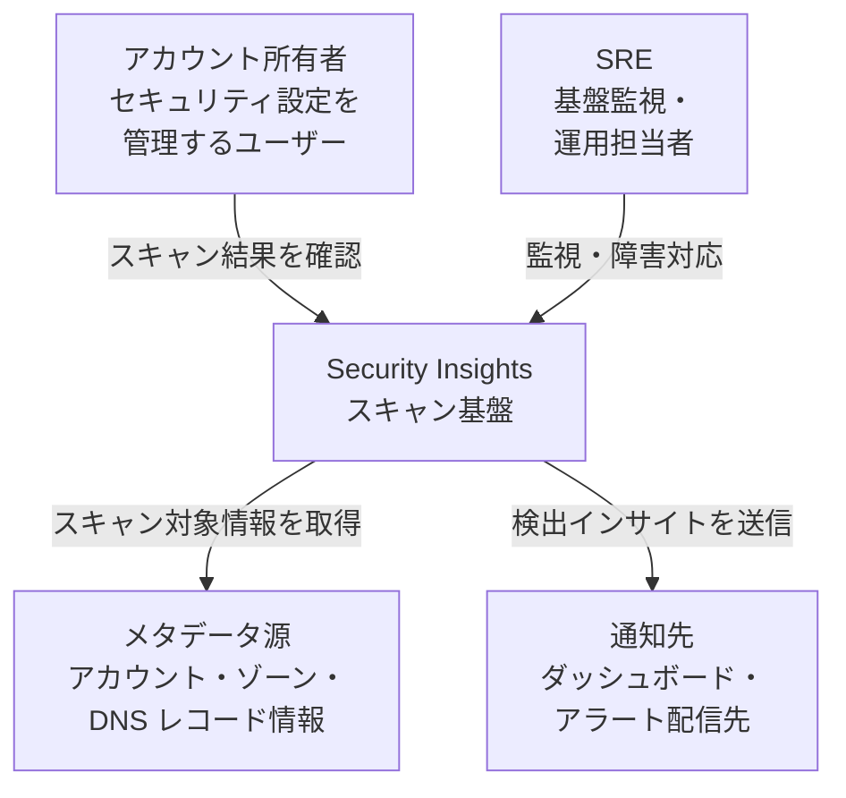
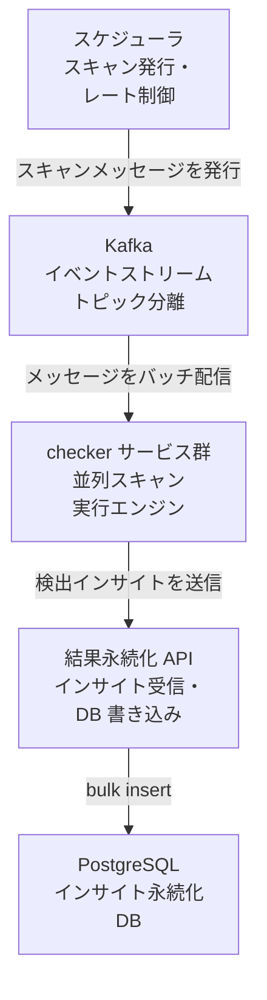
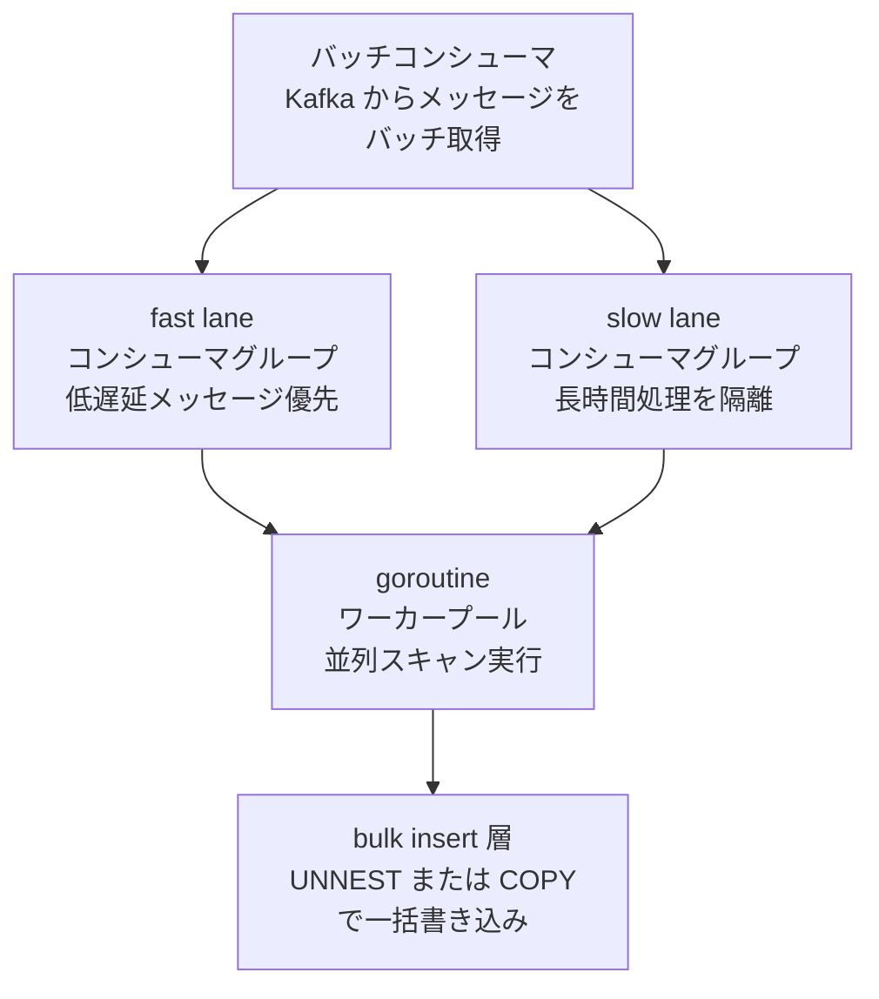
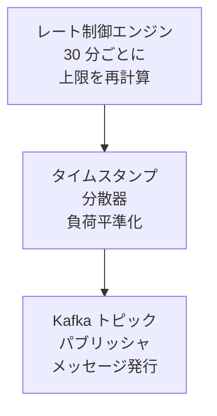
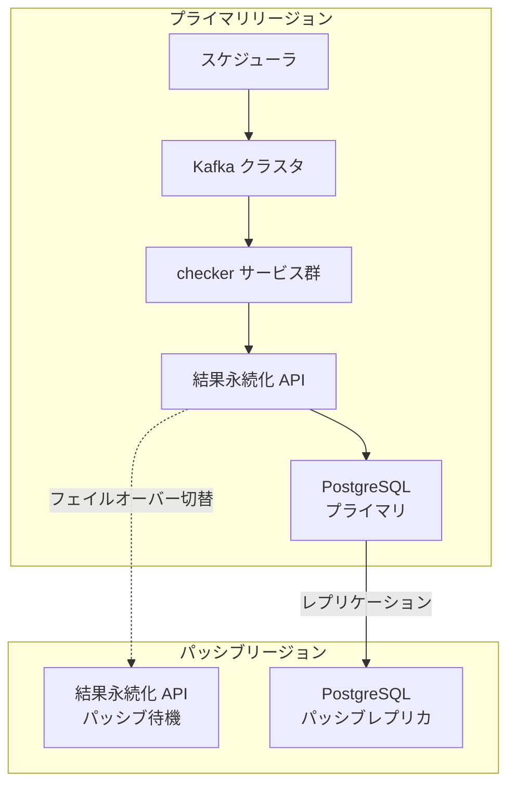
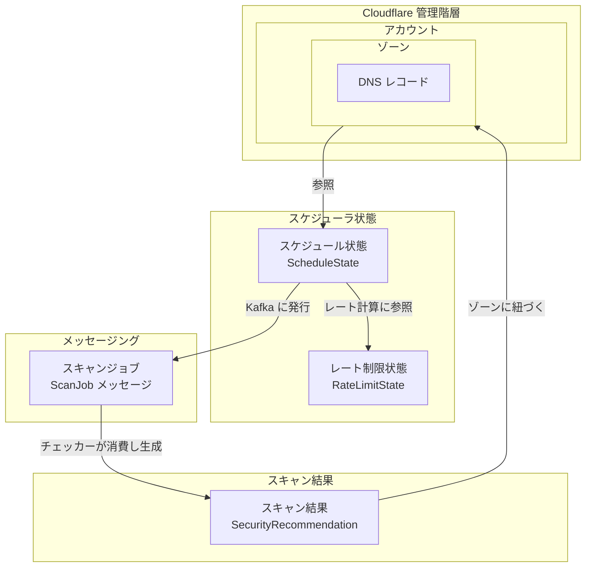
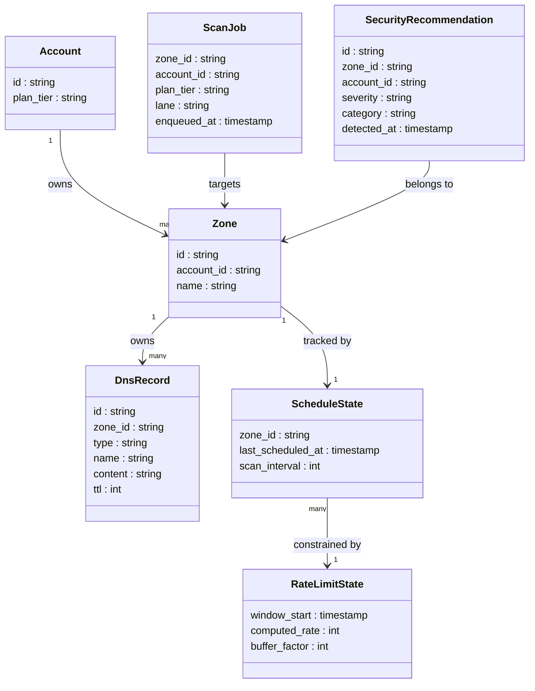
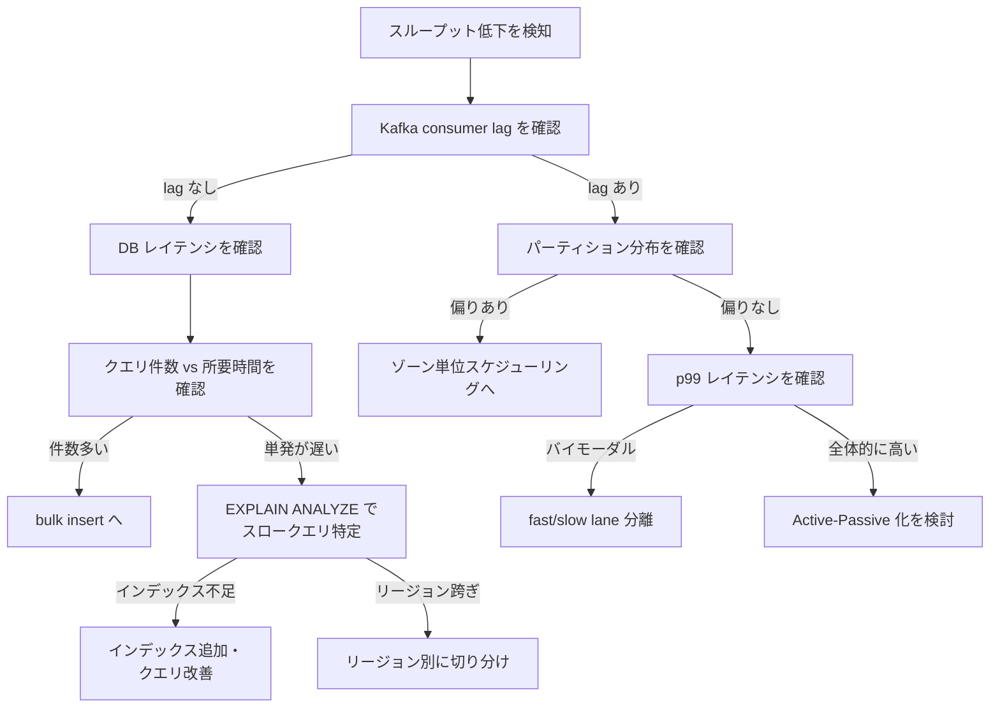

> 一次情報: [Scaling Security Insights: how we achieved a 10x increase in global scanning capacity](https://blog.cloudflare.com/scaling-security-scans/) (Cloudflare Blog, 2026-06-12)
> 本記事は Cloudflare の社内アーキテクチャ事例をもとにした技術調査です。コード例は公式の逐語実装ではなく、事例の手法を反映した実装例です。

## ■概要

### Security Insights とは

Cloudflare Security Insights は、Cloudflare アカウント全体のセキュリティ設定を定期スキャンし、リスクと設定ミスを検出するサービスです。スキャン対象は DNS レコード・SSL/TLS・WAF・Access 設定・非プロキシホスト名を含むアカウント内の全ドメインです。検出された問題はダッシュボードに Moderate / High / Critical の重要度別にまとめられ、修正アクションが提示されます。

### なぜスキャン頻度を上げる必要があったか

自動化された攻撃の高速化によって、セキュリティ設定ミスが悪用されるまでの時間が短くなっています。従来は週 1〜2 回のスキャンにとどまり、新たに発生したリスクが**最大 2 週間検出されない**可能性がありました。この検出ウィンドウを縮めるため、スキャン頻度の大幅な引き上げが必要になりました。

### 制約条件

追加のハードウェア投資なしで、スループットを約 10 倍にすることが求められました。解決策はコード・クエリ・メトリクス分析による根本原因の除去です。「サーバーを足す」ではなく「既存の詰まりを測って潰す」というアプローチが、この事例の核心です。

### スキャン頻度の Before / After

| プラン | 改善前 | 改善後 |
|---|---|---|
| Free | 週 1〜2 回 | 7 日ごと |
| Pro / Business | 週 1〜2 回 | 3 日ごと |
| Enterprise | 週 1〜2 回 | 毎日 |

オンデマンドスキャンは Business / Enterprise / Teams プランで手動実行できます (出典: [Security Insights - how it works](https://developers.cloudflare.com/security-center/security-insights/how-it-works/)。本項目は公式ブログでなく公式ドキュメント由来)。

### 処理量の改善

| 指標 | 改善前 | 改善後 |
|---|---|---|
| スループット | 10 scans/sec | 120+ scans/sec (ピーク) |
| 改善倍率 | — | 約 12 倍 (目標 100 scans/sec を超過) |

## ■特徴

### 主要な改善テクニック一覧

| テクニック | 解決した問題 |
|---|---|
| Kafka バッチ消費 + goroutine 並列処理 | 1 メッセージずつの逐次処理による低スループット |
| fast-slow lane 分離 | 処理の重いメッセージによる先頭行ブロッキング (head-of-line blocking) |
| DB bulk insert (UNNEST + COPY ハイブリッド) | 1 API 呼び出しあたり最大 50 万回の DB 往復 |
| API リージョン最適化 (Active-Passive) | プライマリ DB とリモート API 間のレイテンシによる接続プール枯渇 |
| Adaptive rate limiting | スケジューラによる数百万スキャンの数分内集中スパイク |
| Zone 単位スケジューリング + タイムスタンプ分散 | 大規模アカウントの多ゾーンによる Kafka パーティション飽和 |

### ボトルネック分析の教訓

- スループットを上げる前に「どこが詰まるか」を計測して特定することが不可欠です。
- Kafka のラグメトリクスを監視すると、パーティション偏りや consumer 飽和を早期に発見できます。
- DB 往復回数は「API 呼び出し数 × 1 回」とは限りません。1 呼び出しが 50 万回の往復を生む構造を見落としやすいです。
- リージョン間レイテンシは単体では小さく見えても、並列スキャンの増加で接続プールを枯渇させます。
- スケジューラのバースト特性を見逃すと、均等に見えるワークロードが実際には数分間に集中します。
- 新規ハードウェア追加より、既存コード・クエリ・設定の最適化が費用対効果の高いアプローチです。

## ■構造

Cloudflare Security Insights スキャン基盤の内部アーキテクチャを C4 model 3 段階で図解します。

### ●システムコンテキスト図



| 要素名 | 説明 |
|---|---|
| アカウント所有者 | セキュリティ設定を管理し、スキャン結果をダッシュボードで確認するユーザー |
| SRE | スキャン基盤のスループット・ラグを監視し、障害時に対応する運用担当者 |
| Security Insights スキャン基盤 | スケジュール駆動でアカウント・ゾーンのセキュリティ設定を自動検査するシステム |
| メタデータ源 | アカウント・ゾーン・DNS レコードなど、スキャン対象の構成情報を提供する内部リソース |
| 通知先 | 検出されたインサイトを受け取るダッシュボードおよびアラート配信先 |

### ●コンテナ図



| 要素名 | 説明 |
|---|---|
| スケジューラ | アカウント・ゾーンの優先度とスキャン頻度をもとにスキャンメッセージを Kafka へ発行する。30 分ごとにレート上限を再計算し、タイムスタンプを分散して負荷を平準化する |
| Kafka イベントストリーム | パーティション分割されたトピックでスキャンメッセージを保持する。コンシューマグループごとに独立した読み取り位置を管理し、fast/slow レーンの分離を実現する |
| checker サービス群 | Go 製のマイクロサービス群。特定の資産・設定カテゴリを専門的にスキャンし、結果を結果永続化 API へ送信する |
| 結果永続化 API | checker からインサイトを受信し、PostgreSQL へ一括書き込みする内部 API。プライマリリージョンに書き込みを集約する Active-Passive 構成で稼働する |
| PostgreSQL | インサイトを永続化するリレーショナル DB。プライマリとパッシブの 2 リージョンで構成される |

### ●コンポーネント図

#### checker サービス内部



| 要素名 | 説明 |
|---|---|
| バッチコンシューマ | Kafka トピックからメッセージをバッチ単位で取得する。取得したメッセージを fast lane と slow lane に振り分けて渡す |
| fast lane コンシューマグループ | ミリ秒〜秒単位で完了するスキャンを処理する専用コンシューマグループ。slow lane の処理遅延による head-of-line blocking から隔離される |
| slow lane コンシューマグループ | 完了まで数分〜数時間かかるスキャンを処理する専用コンシューマグループ。fast lane のスループットに影響を与えずに長時間処理を収容する |
| goroutine ワーカープール | バッチ内の各メッセージを個別の goroutine で並列処理する。Go ランタイムの軽量スレッドにより高い並行性を実現する |
| bulk insert 層 | スキャン結果を結果永続化 API 経由で PostgreSQL へ一括書き込みする。小規模データには UNNEST、大規模データ (最大 50 万件/API 呼び出し) には COPY を使い分ける |

#### スケジューラ内部



| 要素名 | 説明 |
|---|---|
| レート制御エンジン | 保有するアカウント数とゾーン数の合計をもとに、30 分間隔でスキャン発行レートの上限を非同期に再計算する |
| タイムスタンプ分散器 | 各スキャンのスケジュールタイムスタンプに揺らぎを加え、ピーク時の一斉発行を防いで負荷を平準化する |
| Kafka トピックパブリッシャ | レート制限と優先度に従ってスキャンメッセージを Kafka トピックへ発行する |

#### デプロイ・リージョン構成図



| 要素名 | 説明 |
|---|---|
| プライマリリージョン | スケジューラ・Kafka・checker・API・PostgreSQL の全コンポーネントが稼働するリージョン。すべての書き込みトラフィックをここで処理する |
| パッシブリージョン | PostgreSQL パッシブレプリカを配置するリージョン。公式ブログは API を Active-Active から Active-Passive に変更したと述べる。パッシブ側の API スタンバイ配置とフェイルオーバー手順はブログに明示がなく、一般的な Active-Passive 構成からの推測 |
| レプリケーション | プライマリの PostgreSQL からパッシブレプリカへデータを同期する。Active-Active 構成で問題となっていたリージョン間の往復遅延を排除するため Active-Passive に移行した |
| フェイルオーバー切替 | プライマリの結果永続化 API が障害を起こした際、パッシブのスタンバイインスタンスへ切り替え、可用性を維持する |

## ■データ

### ●概念モデル

スキャン基盤が扱うエンティティと所有・参照関係を示します。



| 要素名 | 説明 |
|---|---|
| アカウント | Cloudflare 顧客組織。plan_tier を持つ |
| ゾーン | アカウント配下のドメイン単位。スケジューリングの最小単位 |
| DNS レコード | ゾーン配下の個別 DNS 設定。スキャン対象の一つ |
| ScheduleState | ゾーンごとの最終スキャン日時と次回スキャン間隔を管理する状態 |
| RateLimitState | スケジューラ全体のスループット上限を動的に管理する状態 |
| ScanJob メッセージ | スケジューラが Kafka に発行するスキャン指示メッセージ |
| SecurityRecommendation | チェッカーがスキャン結果として生成するセキュリティ推奨 |

### ●情報モデル

主要エンティティの属性を示します。ブログに明示されない属性には「(推測)」と注記します。



| エンティティ | 属性 | 説明 |
|---|---|---|
| Account | id | Cloudflare アカウント識別子 |
| Account | plan_tier | Free / Pro / Business / Enterprise のいずれか。スキャン間隔を決定する |
| Zone | id | ゾーン識別子 |
| Zone | account_id | 所属アカウントへの参照 |
| Zone | name | ドメイン名 (推測) |
| DnsRecord | type | A / AAAA / CNAME 等のレコード種別 |
| DnsRecord | content | レコードの値 |
| DnsRecord | ttl | キャッシュ有効期間 (秒) |
| ScanJob | zone_id | スキャン対象ゾーン |
| ScanJob | plan_tier | スキャン間隔の決定に使用 |
| ScanJob | lane | fast / slow の振り分け結果。処理時間の重いチェックを slow lane に隔離する (推測) |
| ScanJob | enqueued_at | Kafka キューへの投入日時 (推測) |
| SecurityRecommendation | severity | 重大度 (推測) |
| SecurityRecommendation | category | リスク分類 (推測) |
| SecurityRecommendation | detected_at | スキャン検出日時 (推測) |
| ScheduleState | zone_id | 状態を持つゾーン識別子 |
| ScheduleState | last_scheduled_at | 最後にスキャンをスケジュールした日時。次回スキャン時刻の算出基準 |
| ScheduleState | scan_interval | plan_tier から決まるスキャン間隔 (秒)。Free=7日 / Pro・Business=3日 / Enterprise=1日 |
| RateLimitState | window_start | レート計算ウィンドウの開始時刻 (推測) |
| RateLimitState | computed_rate | 30 分ごとに再計算されるスループット上限 (スキャン数/秒) |
| RateLimitState | buffer_factor | 予期しないダウンタイムへの対応係数 (推測) |

#### plan_tier とスキャン間隔の対応

| plan_tier | スキャン間隔 |
|---|---|
| Free | 7 日 |
| Pro | 3 日 |
| Business | 3 日 |
| Enterprise | 1 日 |

## ■構築方法

各スケーリング技法を自分の基盤に導入するための実装パターンを示します。コードは事例の手法を反映した実装例です。

### 前提環境

| 項目 | 要件 |
|---|---|
| 言語 | Go 1.21 以上 |
| メッセージブローカー | Apache Kafka (コンシューマグループ対応) |
| データベース | PostgreSQL 14 以上 |
| Go ライブラリ | `github.com/segmentio/kafka-go`, `github.com/jackc/pgx/v5`, `golang.org/x/time/rate` |

### Kafka バッチ消費 + goroutine 並列処理

- 1 メッセージずつ逐次処理する同期モードは、各メッセージの処理完了待ちが直列化し、並列性が出ないためスループットが上がりません。
- Kafka からメッセージをバッチ単位で取得し、各メッセージを goroutine worker pool に投入することで、CPU コアを最大限に活用できます。
- トレードオフとして、プロセス再起動時に未 commit のバッチ全体が再処理されるため、処理の冪等性を保証する設計が必要です。
- コンシューマグループ利用時は `FetchMessage` + `CommitMessages` を使います。`ReadMessage` は読み取り直後に自動コミットするため、worker 処理の完了を待たずにオフセットが進み、再処理の安全性を確保できません。

```go
package main

import (
    "context"
    "log"
    "sync"
    "time"

    "github.com/segmentio/kafka-go"
)

const (
    batchSize  = 100 // 1 バッチあたりの最大メッセージ数
    numWorkers = 16  // worker goroutine 数
)

func runConsumer(ctx context.Context, reader *kafka.Reader, processMsg func(kafka.Message) error) {
    for {
        batch := make([]kafka.Message, 0, batchSize)

        // 最初の 1 件はブロッキング取得 (自動コミットしない FetchMessage)
        msg, err := reader.FetchMessage(ctx)
        if err != nil {
            break
        }
        batch = append(batch, msg)

        // 残りは短いタイムアウトで詰め込む
    drainLoop:
        for len(batch) < batchSize {
            ctx2, cancel := context.WithTimeout(ctx, 5*time.Millisecond)
            m, err := reader.FetchMessage(ctx2)
            cancel()
            if err != nil {
                break drainLoop
            }
            batch = append(batch, m)
        }

        // バッチを worker pool で並列処理
        jobs := make(chan kafka.Message, len(batch))
        var wg sync.WaitGroup
        for i := 0; i < numWorkers; i++ {
            wg.Add(1)
            go func() {
                defer wg.Done()
                for m := range jobs {
                    if err := processMsg(m); err != nil {
                        log.Printf("process error: %v", err)
                    }
                }
            }()
        }
        for _, m := range batch {
            jobs <- m
        }
        close(jobs)
        wg.Wait()

        // 全 worker 完了後にバッチ末尾のオフセットをコミット
        if err := reader.CommitMessages(ctx, batch...); err != nil {
            log.Printf("commit error: %v", err)
        }
    }
}
```

- `batchSize` と `numWorkers` はスキャン対象件数・CPU コア数に応じて調整します。
- `FetchMessage` のタイムアウトを短く設定し、バッチが満杯になる前にも定期的に処理を流す設計にします。
- オフセットコミットは全 goroutine が処理を完了した後 (`wg.Wait()` の直後) に `CommitMessages` で行い、再処理の安全性を確保します。
- 上記の簡略例は失敗をログ出力するだけで全件コミットします。本番では失敗メッセージを区別し、(a) バッチに失敗が 1 件でもあればコミットしない、または (b) 失敗分を DLQ (dead letter queue) に送ってからコミットする設計にします。`CommitMessages` はパーティション内の最大オフセットを進めるため、途中失敗を飛ばすと取りこぼします。
- バッチ全体が再処理されても安全なよう、書き込み先は主キー + `ON CONFLICT DO UPDATE` で冪等にします。

### Fast Lane / Slow Lane の分離

- Kafka はパーティション内の順序を保証するため、遅いメッセージが先頭にあると後続の全メッセージが詰まります (head-of-line blocking)。
- Cloudflare の事例では、consumer group と checker を slow lane / fast lane の 2 つに分割しました。メッセージが遅いか速いかを素早く判定し、fast lane の checker が遅いメッセージに遭遇したらそれを skip します。slow lane が専用リソースで遅いメッセージを処理します (原文: "splitting our consumer groups and checkers in two ... If the 'fast lane' checker encounters a slow message, it skips it.")。
- 実装方法は 2 通りあります。(a) 同一トピックを 2 つの consumer group で読み、fast 側は遅いメッセージを skip する (Cloudflare 方式)。(b) ルーターで fast/slow の別トピックに事前振り分けする (下記コード例はこちら)。どちらも fast lane を遅いメッセージから隔離する目的は同じです。

判定基準の例:

| 基準 | Fast Lane | Slow Lane |
|---|---|---|
| スキャン対象の種別 | 軽量チェック (DNS, HTTP ヘッダ) | 重い外部 API 呼び出し |
| 過去の平均処理時間 | 閾値未満 (例: 500ms) | 閾値以上 |
| プランティア | Free (簡易) | Enterprise (詳細) |

```go
// ルーター: メッセージを fast/slow topic に振り分ける
func routeMessage(ctx context.Context, msg kafka.Message, fastWriter, slowWriter *kafka.Writer) error {
    var payload ScanRequest
    if err := json.Unmarshal(msg.Value, &payload); err != nil {
        return err
    }

    // 判定: スキャン種別が重いかどうか
    dest := fastWriter
    if isHeavyScan(payload) {
        dest = slowWriter
    }

    return dest.WriteMessages(ctx, kafka.Message{
        Key:   msg.Key,
        Value: msg.Value,
    })
}

func isHeavyScan(req ScanRequest) bool {
    // 例: 外部 API を呼ぶチェッカーや処理時間が長いものを slow 判定
    heavyCheckers := map[string]bool{
        "ssl_full":     true,
        "third_party":  true,
        "deep_content": true,
    }
    return heavyCheckers[req.CheckerType]
}
```

- 上記コード例は (b) ルーター方式です。この場合 fast lane と slow lane はそれぞれ独立した Kafka Topic と Consumer Group ID を持ちます。Cloudflare 方式 (a) では単一トピックを 2 つの consumer group が読み、fast lane の checker が遅いメッセージを skip します。
- slow lane の worker 数は少なくしても構いません。fast lane をブロックしないことが目的です。
- ルーターは別プロセスとして動かすか、取り込みパイプラインの最初のステップとして組み込みます。

### DB bulk insert の UNNEST + COPY ハイブリッド

- 1 件ずつ INSERT を繰り返す実装は、50 万件のインサイトに対して 50 万回のネットワーク往復が発生します。
- PostgreSQL の `UNNEST` を使った配列渡し INSERT と、`COPY` プロトコルを使ったバルク転送を使い分けることで、行ごとの往復を UNNEST では 1 本の SQL に、COPY では少数の一括転送 + 後続 INSERT にまとめられます。
- Cloudflare の事例では、件数に応じてこの 2 手法を切り替えるハイブリッド戦略を採用しています。

UNNEST と COPY の使い分け:

| 手法 | 適した件数 | 特徴 |
|---|---|---|
| `INSERT ... SELECT UNNEST(...)` | 数千件まで | `ON CONFLICT DO UPDATE` が使える。SQL 1 本で完結 |
| `CopyFrom` (COPY プロトコル) | 数千件以上 | 最高速。ただし `ON CONFLICT` 非対応 |
| COPY → 一時テーブル → INSERT ... ON CONFLICT | 大量 + upsert が必要 | 柔軟だが PostgreSQL システムテーブルの膨張に注意 |

Cloudflare が採用したアプローチは「閾値以下は UNNEST (ミリ秒単位)、超過時は COPY (秒単位)」です。COPY + 一時テーブル方式はシステムテーブルの膨張を招くため、限定的に使用しています。

```go
// UNNEST バルク upsert (閾値以下)
func bulkUpsertWithUnnest(ctx context.Context, conn *pgx.Conn, issues []SecurityIssue) error {
    ids := make([]int64, len(issues))
    zoneIDs := make([]string, len(issues))
    severity := make([]string, len(issues))
    details := make([]string, len(issues))
    updatedAt := make([]time.Time, len(issues))

    for i, iss := range issues {
        ids[i] = iss.ID
        zoneIDs[i] = iss.ZoneID
        severity[i] = iss.Severity
        details[i] = iss.Details
        updatedAt[i] = iss.UpdatedAt
    }

    _, err := conn.Exec(ctx, `
        INSERT INTO security_issues (id, zone_id, severity, details, updated_at)
        SELECT * FROM UNNEST(
            $1::bigint[],
            $2::text[],
            $3::text[],
            $4::text[],
            $5::timestamptz[]
        )
        ON CONFLICT (id) DO UPDATE
            SET severity   = EXCLUDED.severity,
                details    = EXCLUDED.details,
                updated_at = EXCLUDED.updated_at
    `, ids, zoneIDs, severity, details, updatedAt)

    return err
}
```

```go
// CopyFrom バルク insert (閾値超過時、ステージングテーブルへ)
// db は *pgx.Conn / pgxpool.Pool / pgx.Tx いずれも満たす (CopyFrom を持つ)
func bulkInsertWithCopy(ctx context.Context, db interface {
    CopyFrom(context.Context, pgx.Identifier, []string, pgx.CopyFromSource) (int64, error)
}, issues []SecurityIssue) error {
    _, err := db.CopyFrom(
        ctx,
        pgx.Identifier{"security_issues_staging"},
        []string{"id", "zone_id", "severity", "details", "updated_at"},
        pgx.CopyFromSlice(len(issues), func(i int) ([]any, error) {
            return []any{
                issues[i].ID,
                issues[i].ZoneID,
                issues[i].Severity,
                issues[i].Details,
                issues[i].UpdatedAt,
            }, nil
        }),
    )
    return err
}
```

```go
// ハイブリッド切り替えロジック
const unnestThreshold = 2000 // この件数を超えたら COPY に切り替え

func bulkUpsert(ctx context.Context, conn *pgx.Conn, issues []SecurityIssue) error {
    if len(issues) <= unnestThreshold {
        return bulkUpsertWithUnnest(ctx, conn, issues)
    }
    return bulkInsertViaCopy(ctx, conn, issues)
}

func bulkInsertViaCopy(ctx context.Context, conn *pgx.Conn, issues []SecurityIssue) error {
    // staging への投入 → upsert を 1 トランザクションで囲む
    tx, err := conn.Begin(ctx)
    if err != nil {
        return err
    }
    defer tx.Rollback(ctx) // commit 済みなら no-op

    // 0. トランザクション内のみ有効な一時テーブルを作る (並行リクエストで競合しない)
    if _, err := tx.Exec(ctx, `
        CREATE TEMP TABLE security_issues_staging
        (LIKE security_issues INCLUDING DEFAULTS)
        ON COMMIT DROP
    `); err != nil {
        return err
    }
    // 1. COPY で一時テーブルに高速投入
    if err := bulkInsertWithCopy(ctx, tx, issues); err != nil {
        return err
    }
    // 2. 一時テーブル → 本テーブルへ upsert
    if _, err := tx.Exec(ctx, `
        INSERT INTO security_issues
        SELECT * FROM security_issues_staging
        ON CONFLICT (id) DO UPDATE
            SET severity   = EXCLUDED.severity,
                details    = EXCLUDED.details,
                updated_at = EXCLUDED.updated_at
    `); err != nil {
        return err
    }
    return tx.Commit(ctx)
}
```

- `unnestThreshold` の最適値はデータ型・行サイズ・PostgreSQL の設定によって異なります。実環境でベンチマークして決定してください。
- staging は**並行リクエストで共有しない**ことが重要です。共有テーブルを毎回 `TRUNCATE` するとロック競合や他トランザクションのデータ破壊を招きます。上記は `CREATE TEMP TABLE ... ON COMMIT DROP` でトランザクションごとに隔離します。`bulkInsertWithCopy` は `CopyFrom` を持つ interface を受けるため、トランザクション内では `pgx.Tx` を渡します。
- Cloudflare 事例では COPY + 一時テーブル方式が PostgreSQL のシステムテーブル膨張 (bloat) を招いたと報告しています。一時テーブルの作成・破棄を高頻度で繰り返す場合はこの bloat に注意し、ワーカー単位の永続ステージングテーブル再利用 (`request_id` 列で分離) や `autovacuum` 設定の見直しも選択肢です。
- 1 クエリあたり最大 65535 個のバインドパラメータという上限は、PostgreSQL プロトコルの `Bind` メッセージがパラメータ数を 2 バイト (`Int16`) で持つことに由来します。pgx / pgconn はこれを extended protocol の上限 65535 として扱います。UNNEST は列ごとに 1 個の配列パラメータを渡すため、この上限の影響を受けにくい利点があります。1 行 1 プレースホルダで展開する素朴な multi-row INSERT では、列数 × 行数が上限を超える場合にバッチ分割が必要です。

### Adaptive Rate Limiting

- スキャン頻度を固定値で設定すると、対象件数の増減でスパイクや過負荷が発生します。
- 30 分ごとにスキャン対象件数を再集計し、レートを自動再計算することで、スケジュールを均等に分散できます。
- `golang.org/x/time/rate` の `rate.Limiter` と `SetLimit` メソッドを使うことで、動作中のレートを安全に変更できます。

```go
package scanner

import (
    "context"
    "math"
    "time"

    "golang.org/x/time/rate"
)

// プランごとのスキャン間隔設定
const (
    freeScanInterval time.Duration = 7 * 24 * time.Hour
    proScanInterval  time.Duration = 3 * 24 * time.Hour
    bizScanInterval  time.Duration = 3 * 24 * time.Hour
    entScanInterval  time.Duration = 24 * time.Hour

    rateLimitBufferFactor = 1.1 // 10% のバッファを持たせる
    rateRecalcInterval    = 30 * time.Minute
)

// computeRate: 対象件数からレートを計算する (事例の手法を反映した実装例)
func computeRate(free, pro, biz, ent int64) rate.Limit {
    r := float64(free)/freeScanInterval.Seconds() +
        float64(pro)/proScanInterval.Seconds() +
        float64(biz)/bizScanInterval.Seconds() +
        float64(ent)/entScanInterval.Seconds()

    r *= rateLimitBufferFactor
    return rate.Limit(r)
}

type RateAdaptingScanner struct {
    limiter *rate.Limiter
    db      DB
}

func NewRateAdaptingScanner(db DB) *RateAdaptingScanner {
    s := &RateAdaptingScanner{
        limiter: rate.NewLimiter(1, 1), // 初期値: 仮設定
        db:      db,
    }
    go s.recalcLoop()
    return s
}

// recalcLoop: 30 分ごとにレートを再計算してリミッターを更新する
func (s *RateAdaptingScanner) recalcLoop() {
    ticker := time.NewTicker(rateRecalcInterval)
    defer ticker.Stop()

    for range ticker.C {
        counts, err := s.db.CountZonesByPlan(context.Background())
        if err != nil {
            continue
        }
        newLimit := computeRate(counts.Free, counts.Pro, counts.Biz, counts.Ent)
        s.limiter.SetLimit(newLimit)
        // burst は最低 1 を確保 (低レート時に Wait が永久ブロックしないように)
        burst := int(math.Ceil(float64(newLimit) * 2))
        if burst < 1 {
            burst = 1
        }
        s.limiter.SetBurst(burst)
    }
}

// Scan: レートリミッターに従ってスキャンを実行する
func (s *RateAdaptingScanner) Scan(ctx context.Context, zone Zone) error {
    if err := s.limiter.Wait(ctx); err != nil {
        return err
    }
    return performScan(zone)
}
```

- `rate.Limiter.SetLimit` はスレッドセーフです。goroutine から安全に呼び出せます。
- `SetBurst` でバースト上限も合わせて設定します。バーストが小さすぎると、再計算直後に Wait が長時間ブロックされます。
- `rateLimitBufferFactor` (10%) は、再計算間隔内に処理しきれるよう余裕を持たせるためのものです。
- `computeRate` が返す値は毎秒のイベント数です。例: 対象 1000 件 ÷ 7 日インターバル ≒ 0.0017 req/s。

### API リージョン最適化 (Active-Passive)

- スキャンワーカーとプライマリ DB が異なるリージョンにある場合、1 回の API 呼び出しごとにリージョン間の往復遅延が加算されます。
- Cloudflare の事例では、リモートリージョンの API がプライマリ DB に接続しており、1 API 呼び出しあたり約 3 秒の応答時間が発生していました (同一リージョンでは 10ms)。
- Active-Passive 構成では、書き込みを必要とするワーカーをプライマリ DB と同じリージョンのみで稼働させ、クロスリージョンの往復を排除します。

```go
package db

import (
    "context"
    "fmt"
    "os"

    "github.com/jackc/pgx/v5/pgxpool"
)

type DBCluster struct {
    primary *pgxpool.Pool // 書き込み用: プライマリ DB
    replica *pgxpool.Pool // 読み取り専用: リージョンローカルレプリカ
    region  string
}

func NewDBCluster(ctx context.Context, primaryDSN, replicaDSN string) (*DBCluster, error) {
    primary, err := pgxpool.New(ctx, primaryDSN)
    if err != nil {
        return nil, fmt.Errorf("primary pool: %w", err)
    }
    replica, err := pgxpool.New(ctx, replicaDSN)
    if err != nil {
        return nil, fmt.Errorf("replica pool: %w", err)
    }
    return &DBCluster{
        primary: primary,
        replica: replica,
        region:  os.Getenv("REGION"),
    }, nil
}

// WriteConn: 書き込みは常にプライマリへ
func (c *DBCluster) WriteConn() *pgxpool.Pool { return c.primary }

// ReadConn: 読み取りはリージョンローカルのレプリカへ
func (c *DBCluster) ReadConn() *pgxpool.Pool { return c.replica }
```

Active-Passive 切り替えのチェックリスト:

| 確認項目 | 内容 |
|---|---|
| 書き込みワーカーの配置 | プライマリ DB と同一リージョンに限定 |
| 接続プールのサイズ | リージョン内通信はレイテンシが低いため、プールサイズを小さくできる |
| フェイルオーバー | プライマリ障害時の Passive 昇格ポリシーを定義 |
| レプリカラグの監視 | 読み取り専用レプリカのレプリケーション遅延を `pg_stat_replication` で監視 |

- 「追加投資なし」でスケールする核心は、既存のインフラを正しいリージョンに集約することです。
- コネクションプールが枯渇してタイムアウトが発生している場合、まずリージョン間レイテンシを疑います。

## ■利用方法

各技法を実際に運用へ載せるときの使い方を示します。

### 監視メトリクスの取得

スループット・レイテンシ・キュー滞留の 3 軸を常時収集します。

```promql
# 最遅パーティションのラグが閾値超過、かつ消費が止まっている状態を検知
max by(group, topic)(kafka_consumer_group_partition_lag) > 10000
  and rate(kafka_consumer_fetch_manager_records_consumed_total[5m]) == 0
```

```bash
# consumer lag をグループ単位で一覧
kafka-consumer-groups.sh \
  --bootstrap-server <broker>:9092 \
  --group scan-consumer \
  --describe
```

### スキャン頻度 SLO の確認

「全ゾーンのスキャンが設定間隔内に完了すること」を SLO の基本形とします。

```sql
-- 設定間隔の 1.2 倍を超えて未スキャンのゾーンを確認
SELECT zone_id, last_scanned_at, scan_interval_minutes,
       EXTRACT(EPOCH FROM (NOW() - last_scanned_at))/60 AS lag_minutes
FROM zone_scan_status
WHERE EXTRACT(EPOCH FROM (NOW() - last_scanned_at))/60 > scan_interval_minutes * 1.2
ORDER BY lag_minutes DESC;
```

### ゾーン単位スケジューリングへの移行

スケジュール状態をアカウント単位でなくゾーン単位で持ち、初期分散のためジッターを加えます。

```python
import random

def schedule_zone(zone_id, interval_seconds):
    jitter = random.uniform(0, interval_seconds)
    next_run = now() + jitter
    update_zone_schedule(zone_id, next_run)
```

## ■運用

### スループット・レイテンシ・キュー滞留の監視指標

監視の基本軸は「スループット / レイテンシ / キュー滞留」の 3 本です。

- スループット: `scan_rate_per_second` をスキャン実行数/秒として収集し、SLO との乖離をアラートに設定します。`scheduled_scans_total` と `completed_scans_total` の差分がキュー積み上がりを示します。
- レイテンシ: `scan_duration_seconds{quantile="0.99"}` を監視します。通常は秒単位で、分〜時間単位に伸びた場合は head-of-line blocking を疑います。リージョン別の `api_request_duration_ms{region}` を常時比較します。
- キュー滞留: `kafka_consumer_group_lag` をパーティション単位で収集し、`max by(partition)` で最遅パーティションを監視します。ラグが高く消費レートがゼロの組み合わせは、スタックしたメッセージの証拠です。

### DB 往復回数の監視

- `db_query_duration_ms{operation="insert"}` と `db_query_count_total` をセットで監視します。
- 1 件ずつ INSERT が走ると「クエリ件数が急増するが所要時間が短い」パターンが現れます。bulk insert への切替えでクエリ件数が激減し、同時にスループットが向上します。

### リージョン別レイテンシの監視

- API サービスを Active-Active 構成で動かしている場合、リモートリージョン経由の書き込みが接続プール枯渇の温床になります。
- `db_connection_pool_wait_ms{region}` を監視し、特定リージョンのみ高騰する場合はプライマリ DB への書き込み集約を検討します。

### スケール操作: パーティション数 vs バッチ並列度の調整

| 操作 | 効果 | コスト | 適用タイミング |
|---|---|---|---|
| Kafka パーティション追加 | コンシューマ並列度を上限まで拡張 | ブローカーリソース増加、再バランス発生 | 他の手段を使い切ったあと最後の手段 |
| コンシューマ並列度増加 | 既存パーティション範囲内でスループット向上 | CPU/メモリ | パーティション数がコンシューマ数より多い場合に有効 |
| バッチサイズ拡大 | DB 往復を削減 | メモリ増加、レイテンシ増加 | INSERT がボトルネックの場合 |
| fast/slow lane 分離 | head-of-line blocking 解消 | コード変更、コンシューマグループ追加 | p99 が異常に高い場合 |

パーティション追加はリソースコストが高いため最後の手段とし、まずコード・SQL・アーキテクチャ改善で限界まで引き出します。

## ■ベストプラクティス

### 核心教訓: 「ハードウェアを足す前にボトルネックを測って潰す」

Cloudflare はハードウェア追加なしでスループットを 10 倍にしました。この結果は以下のプロセスの産物です。

1. ログ・メトリクスでボトルネックを特定する (推測しない)
2. 最小の変更で最大の効果を出す最適化を選ぶ
3. 改善後にまた測定し、次のボトルネックを探す

この「測定 → 最適化 → 測定」のサイクルは、スキャン基盤に限らず CI/CD・静的解析・AI 評価基盤に転用できます。

### head-of-line blocking の検知と fast/slow lane 分離

検知シグナル:

- p99 レイテンシが通常の 10 倍以上に跳ね上がる
- 同じパーティションのメッセージが長時間滞留する
- 一部のチェッカーだけスループットが低い

閾値チューニングの指針:

- まず p95/p99 レイテンシの実績分布を確認します。バイモーダル分布 (速いメッセージと遅いメッセージが 2 峰に分かれる) があれば fast/slow lane 分離が効きます。
- slow lane に振り分けるタイムアウト閾値は、fast lane の p95 処理時間の 2〜3 倍を出発点にします。

### bulk insert 閾値の決め方

| バッチサイズ | 推奨方法 | 理由 |
|---|---|---|
| 1 万行まで | INSERT + UNNEST | COPY 準備オーバーヘッドを回避、レイテンシ低 |
| 1 万行超 | COPY | 4〜10 倍の速度差が現れる |

閾値は DB 性能特性に依存するため、実環境でベンチマークして決定します。

### adaptive rate limit の周期設定

- レート計算を 30 分ごとに非同期で再計算します。同期的に計算するとスキャン実行をブロックします。
- 計算式の基本構造:

```
required_rate = Σ(zone_count_per_plan / scan_interval_per_plan)
actual_rate_limit = required_rate × buffer_factor  # buffer_factor: 1.1〜1.3
```

- `buffer_factor` は Kafka ラグの実績から調整します。ラグが恒常的に増加するなら `buffer_factor` を上げます。

### Active-Passive 書き込み集約

切替えの判断基準 (一般的な目安):

- リージョン間ラウンドトリップが 20ms 超で恒常的に続く
- 接続プール使用率が 80% 超で常態化している
- 特定リージョンの DB 書き込みタイムアウトが増加している

| 指標 | 変更前 (Active-Active) | 変更後 (Active-Passive) |
|---|---|---|
| リモート API レイテンシ | 約 3 秒 | 約 10ms |
| 接続プール枯渇 | 発生 | 解消 |
| パーティション処理の偏り | Amsterdam 側 consumer が遅延 | 解消 |

Cloudflare 事例の問題は、Amsterdam の API プロセスが Portland のプライマリ DB へ遠隔接続したことによるレイテンシと接続プール枯渇です (書き込み競合ではありません)。アクティブな API をプライマリ DB と同じリージョンに追従させることで解決しました。

PgBouncer など接続プーラーも有効ですが、リージョン間レイテンシ問題の根本解決にはなりません。

### スケジュール偏り (thundering herd) の回避

大量のアカウント/ゾーンが同じ `last_scheduled_at` を持つと、定期実行のたびに一斉スパイクが発生します。

1. ゾーン単位の独立スケジューリング: アカウント単位でなくゾーン単位で `last_scheduled_at` を持ちます。大型アカウントの全ゾーンが連鎖しなくなります。
2. ランダムジッター: 既存の `last_scheduled_at` に `random(0, interval)` を加算して初期分散を作ります。
3. 分散ロック: 同一ゾーンの重複実行を Redis SETNX などで排除します。
4. adaptive rate limit: スケジュール周期を変更したときに全件が同時に再スケジュールされないよう、変更後の実行をレート制限します。

### CI/CD・静的解析・AI 評価基盤への転用観点

| 本事例のパターン | 転用先 | 転用形態 |
|---|---|---|
| fast/slow lane | CI/CD パイプライン | 軽量テストと重量テストを別キューで並列実行 |
| bulk insert | ログ集約 | ログをバッファして一括書き込み |
| adaptive rate limit | AI 評価バッチ | モデル API 呼び出しレートを負荷に応じて動的調整 (例: OpenAI の token-per-minute 制限に rate.Limiter を結びつける) |
| thundering herd 回避 | 静的解析ジョブ | PR 単位でジッターを加えて解析ジョブを分散 |
| head-of-line blocking 対策 | LLM 推論キュー | 長大プロンプトを専用ワーカーに分離 |

## ■トラブルシューティング

### 頻出症状一覧

| 症状 | 原因 | 対処 |
|---|---|---|
| 一部メッセージで全体が詰まる | head-of-line blocking | slow lane を別コンシューマグループに分離。タイムアウト閾値を測定して fast/slow lane に振り分け |
| DB が詰まる・書き込みスループットが低い | 1 件ずつ INSERT している | bulk insert (UNNEST/COPY ハイブリッド) に変更。まず `db_query_count_total` で件数を確認 |
| 特定リージョンの API レイテンシが異常に高い | リージョン跨ぎ書き込み → 接続プール枯渇 | プライマリ DB への書き込みを集約 (Active-Passive 化)。`db_connection_pool_wait_ms{region}` で切り分け |
| 特定時刻にスキャンスパイクが発生する | スケジューリング同期 (thundering herd) | `last_scheduled_at` の分布を確認。ゾーン単位の独立スケジューリング + ランダムジッターを追加 |
| Kafka パーティションが飽和する | 大型アカウントの全ゾーンが 1 パーティションに連鎖 | アカウント単位からゾーン単位にスケジュール粒度を下げる (公式で確認できる対策)。パーティションキーをゾーン ID に変更するのは実装案 |
| スキャンレートがオンボード後に追いつかない | レート計算が静的 | adaptive rate limit を導入。アカウント/ゾーン増加を 30 分ごとに再計算してレートを自動更新 |
| consumer lag が恒常的に増加する | スループット不足 | まずコード・SQL 改善で対処。余地がなければコンシューマ並列度を増やし、最後にパーティション追加 |
| 消費レートはゼロなのに lag が減らない | スタックしたコンシューマ | `kafka-consumer-groups.sh --describe` で OFFSET の変化を確認。コンシューマを再起動して回復 |

### 診断フロー



`db_query_duration_ms` などのカスタムメトリクスは `pgx.Conn.Exec` をラップして計装します。単発クエリが遅い場合は `EXPLAIN (ANALYZE, BUFFERS)` と `pg_stat_statements` でスロークエリを特定し、インデックス不足・ロック競合とリージョン跨ぎ書き込みを切り分けます。

## ■まとめ

Cloudflare はサーバーを増やさず、Kafka のバッチ消費と goroutine 並列化・fast/slow lane 分離・PostgreSQL の bulk insert・API のリージョン集約・adaptive rate limit・ゾーン単位スケジューリングを順に積み上げ、セキュリティスキャンを 10 scans/sec から 120+ scans/sec へ約 12 倍にしました。「AI やハードウェアを足す前に、メトリクスで詰まりを測って潰す」という順序は、CI/CD・静的解析・AI 評価基盤など頻度を上げたいあらゆるバッチ処理に転用できます。

この記事が少しでも参考になった、あるいは改善点などがあれば、ぜひリアクションやコメント、SNSでのシェアをいただけると励みになります！

## ■参考リンク

- 一次情報
  - [Scaling Security Insights: how we achieved a 10x increase in global scanning capacity (Cloudflare Blog)](https://blog.cloudflare.com/scaling-security-scans/)
  - [Security Insights - how it works (Cloudflare Docs)](https://developers.cloudflare.com/security-center/security-insights/how-it-works/)
  - [Security Center (Cloudflare Docs)](https://developers.cloudflare.com/security-center/)
- 公式ドキュメント (技術要素)
  - [PostgreSQL INSERT](https://www.postgresql.org/docs/current/sql-insert.html)
  - [golang.org/x/time/rate](https://pkg.go.dev/golang.org/x/time/rate)
  - [jackc/pgx/v5](https://pkg.go.dev/github.com/jackc/pgx/v5)
  - [segmentio/kafka-go](https://pkg.go.dev/github.com/segmentio/kafka-go)
- 記事 (head-of-line blocking / fast-slow lane)
  - [Side-stepping head-of-line blocking in Kafka consumers](https://medium.com/@michael.diggin/side-stepping-head-of-line-blocking-in-kafka-consumers-6e7cbe44feb4)
  - [Priority lanes in Kafka Streams: preventing head-of-line blocking](https://medium.com/@souquieres.adam/priority-lanes-in-kafka-streams-preventing-head-of-line-blocking-b891385e7f36)
- 記事 (PostgreSQL bulk insert)
  - [PostgreSQL UNNEST cheat sheet for bulk operations](https://dev.to/forbeslindesay/postgres-unnest-cheat-sheet-for-bulk-operations-1obg)
  - [Speed up your PostgreSQL bulk inserts with COPY](https://dev.to/josethz00/speed-up-your-postgresql-bulk-inserts-with-copy-40pk)
  - [Testing Postgres ingest: INSERT vs batch INSERT vs COPY](https://www.tigerdata.com/learn/testing-postgres-ingest-insert-vs-batch-insert-vs-copy)
- 記事 (Active-Passive / thundering herd / Kafka 監視)
  - [PostgreSQL HA in the cloud: Active-Active or Active-Passive](https://medium.com/@vishalpriyadarshi/postgresql-ha-in-the-cloud-active-active-or-active-passive-692724024d3e)
  - [Active-Active vs Active-Passive (Redis)](https://redis.io/blog/active-active-vs-active-passive/)
  - [The thundering herd problem (Encore)](https://encore.dev/blog/thundering-herd-problem)
  - [Kafka monitoring: key metrics and tools (Instaclustr)](https://www.instaclustr.com/education/apache-kafka/kafka-monitoring-key-metrics-and-5-tools-to-know-in-2025/)
  - [Best practices for Kafka data observability (Factor House)](https://factorhouse.io/articles/best-practices-kafka-data-observability)
