CloudflareはCDNやDNSだけの会社ではありません。公開Webの配信と防御、エッジでのコード実行、データ保存、社内システムへのZero Trust接続までを、同じグローバルネットワーク上で提供しています。

一方で、製品名が多く、初めて全体を見ると「どれを選び、どう組み合わせるのか」が分かりにくいところです。本記事では理解のため、Application Services、Developer Platform、Cloudflare Oneを中心とする3領域に整理します。これは公式の料金ページをそのまま3分割した契約体系ではありません。

この記事では、2026年8月25日時点の公式情報を基に、代表的なサービスを次の順で整理します。

- 公開Web、開発者基盤、Zero Trustという3つの入口
- Anycastエッジ、`workerd`、バインディングの内部構造
- KV、R2、D1、Durable Objectsなどのデータ製品の使い分け
- WorkerとTunnelを実際に構築・運用する方法
- 料金、制限、監視、典型障害で迷いやすい点


*この記事の全体像。以下、順に解説します。*

## 概要

Cloudflareは自社を「connectivity cloud」と位置づけています。要点は、セキュリティ、接続、コード実行を別々のネットワークへ迂回させず、Cloudflareの各データセンターで動かすことです。

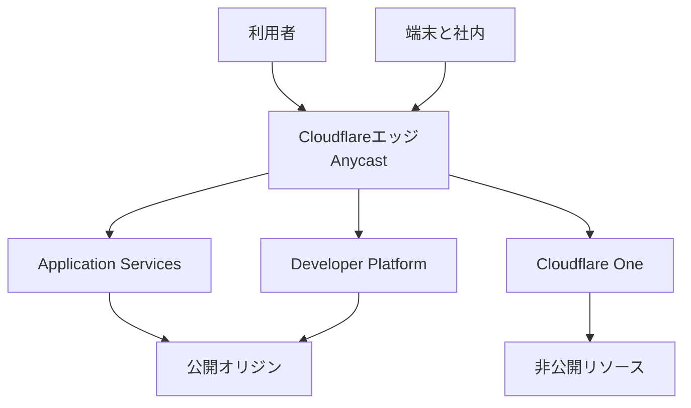

サービス群は大きく3系統に分けると理解しやすくなります。

| 系統 | 主な製品 | 解決する問題 |
|---|---|---|
| Application Services | Authoritative DNS、CDN、WAF、DDoS、Bot、SSL/TLS、Turnstile | 公開サイトやAPIの配信、性能、可用性、攻撃対策 |
| Developer Platform | Workers、Static Assets、Pages、KV、R2、D1、Durable Objects、Queues、AI | グローバルなアプリ実行とデータ処理 |
| Cloudflare One | Access、Gateway、Tunnel、Cloudflare One Clientを中心に、SASEとNetwork Servicesを統合 | 従業員、端末、SaaS、社内アプリ、拠点ネットワークの接続 |

公開Webの基本経路は、Cloudflareを権威DNSにし、A、AAAA、CNAMEレコードをProxied、いわゆるオレンジクラウドにする形です。DNSはオリジンIPではなくCloudflareのAnycast IPを返し、HTTP/HTTPSはエッジでTLS終端、WAF、DDoS緩和、キャッシュ、Workers実行を経由します。

ここで扱うサイトプラン、Workers Paid、Zero Trustの有料プランは独立しています。たとえばサイトをProプランにしてもWorkers PaidやZero Trustの有料枠が自動で付くわけではありません。公式のPlansページではNetwork & CDN、SASE、Zero Trust、Compute & Storageなど、目的別の区分も使われています。

## ネットワーク規模

Cloudflareの規模を示す公式値はページと更新時点で揺れます。2026年8月25日の確認では、都市数は330+、335、348、容量は388 Tbpsまたは534 Tbpsと複数の表記が併存していました。そのため、資料で引用するときは値だけを独り歩きさせず、参照ページと確認日を併記するのが安全です。

| 公式ページ | 2026年8月25日時点の記載例 |
|---|---|
| [Network](https://www.cloudflare.com/network/) | 348都市、8地域、13,000以上の相互接続、利用者の95%まで50ms以内、「5サイトに1つ」 |
| [Application Services](https://www.cloudflare.com/application-services/) | 約20%のWebサイトをプロキシ、335都市、388 Tbps |
| [Connectivity cloud](https://www.cloudflare.com/connectivity-cloud/) | 335都市、534 Tbps |

「5サイトに1つ」や「約20%」はWebサイト数についての説明であり、インターネットトラフィック全体のシェアではありません。また、Cloudflareが強調するのはPoP数だけではなく、各サービスを同じデータセンター群で動かすhomogeneous deploymentです。

## 関連技術との関係

Cloudflareは複数レイヤーを束ねるため、比較対象もレイヤーごとに変わります。

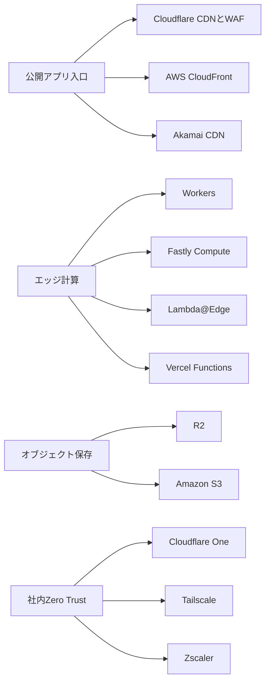

### 実行モデルの違い

WorkersはV8 Isolateを実行単位にします。1つのランタイムプロセスに多数のIsolateを載せ、既存プロセス内で実行コンテキストを作るため、関数ごとにVMやコンテナを起動する方式とは性質が異なります。

| 対象 | 実行モデル | 向く処理 |
|---|---|---|
| Cloudflare Workers | V8 Isolate。リクエスト間でIsolateを再利用可能 | HTTP処理、API、エッジ認証、フルスタックWeb |
| CloudFront Functions | 軽量JavaScript、サブミリ秒、ネットワークアクセスなし | ヘッダーやURLの軽量な書き換え |
| Lambda@Edge | Node.jsまたはPythonをリージョンへ複製 | CloudFrontイベントで比較的重い処理 |
| Fastly Compute | リクエスト単位のWasmサンドボックス | CDN経路上の分離された計算 |
| Vercel Functions | Fluid compute、主にNode.js、リージョン実行 | Webフレームワークと統合したバックエンド |

Workersのグローバル変数はIsolateの寿命に依存するため、永続状態として扱えません。共有状態が必要ならKV、D1、Durable Objectsなどへ出します。

### 類似ツール比較

比較するときは「Cloudflare全体」と単一製品を比べないことが重要です。CDNならCloudFrontやAkamai、エッジ計算ならFastly ComputeやLambda@Edge、オブジェクト保存ならS3、社内接続ならTailscaleやZscalerが近い比較対象です。

Cloudflareの特徴は、CDN、WAF、Workers、Zero Trustを同じAnycastエッジへ載せられる点です。一方、AWSのようにサービスを明示的に組み合わせたい場合、Vercelのようにフレームワーク中心で運用したい場合、Tailscaleのように端末間の直接メッシュが欲しい場合は別の選択が合理的です。

## ユースケース別の推奨

| やりたいこと | 第一候補 | 選定理由 |
|---|---|---|
| 公開サイトを高速化し基礎防御する | DNS、CDN、Universal SSL、DDoS、WAF | Freeから主要機能を試せる |
| ログインやフォームのBot対策 | Bot Fight Mode、Bot Management、Turnstile | Bot判定とCAPTCHA代替を選べる |
| 新しい静的またはフルスタックWeb | WorkersとStatic Assets | 現在の主プラットフォーム。既存Pagesからの移行先 |
| 設定、A/B、読み取り中心のセッション | Workers KV | グローバルキャッシュと高いread比率向け |
| 画像、ログ、データセット | R2 | S3互換、インターネット向けegress課金なし |
| 軽量なリレーショナルデータ | D1 | SQLiteベース。読み取り中心のアプリ向け |
| 既存PostgresまたはMySQL | Hyperdrive | 接続プールとクエリキャッシュ |
| 協調編集、WebSocket、強い一貫性 | Durable Objects | 1 IDにつき世界で1インスタンス |
| バックグラウンド処理 | Queues、長い多段処理はWorkflows | 少なくとも1回配信、耐久実行 |
| RAGや意味検索 | Workers AIとVectorize | 推論とベクトル検索をWorkerから利用 |
| 社内WebをVPNなしで公開 | Access、Tunnel、One Client | 身元評価と外向きトンネル |
| インターネット利用を制御 | Gateway | DNS、ネットワーク、HTTPポリシー |

Spectrum、Magic Transit、Magic WANのようなL4やWAN製品は強力ですが、Webアプリ、Workers、Zero Trustから入る構成では通常、次の検討段階です。

## プラン差

### Application Services

サイト単位のFree、Pro、Business、Contractがあります。2026年8月25日時点では、FreeにもDNS、CDN、Universal SSL、unmetered DDoS、Free Managed Rulesetが含まれます。Pro以降は画像最適化やWAF機能が増え、Businessは100% uptime SLAやPCI DSS対応を掲げます。

| 観点 | Free | Pro | Business | Contract |
|---|---|---|---|---|
| 月額の目安 | 0 USD | 年払い20 USD、月払い25 USD | 年払い200 USD、月払い250 USD | 個別契約 |
| 主な用途 | 趣味、検証 | プロ向けサイト | オンライン事業 | 基幹アプリ |
| WAF | Free Managed Ruleset | Managed Rules | より高度な機能 | Account-levelを含む企業機能 |
| SLA | なし | なし | 100% | 100% |

価格と機能は変更され得るため、導入時は[Plans](https://www.cloudflare.com/plans/)と各製品のAvailability表を再確認してください。

### Zero Trust

Zero TrustはFree、Pay-as-you-go、Contractです。2026年8月25日時点で、Freeは50ユーザーまで、Pay-as-you-goは7 USD/ユーザー/月と案内されています。ログ保持やサポート、DLPなどの機能差があるため、ユーザー数だけでなく監査要件で選びます。

### WorkersとDeveloper Platform

Workers Paidはサイトプランと別で、最低5 USD/月/アカウントです。FreeはHTTPリクエスト10万/日、CPU 10ms/invocationです。Paidは月1,000万リクエストと3,000万CPU msを含み、超過分は従量課金です。通常の静的アセットリクエストは無料・無制限ですが、Workers Cachingを有効にしてキャッシュから配信する場合は通常のリクエスト課金対象です。WorkersのegressとR2のインターネットegressは追加課金0と公式に記載されています。

## 主要なサービス（できること）

### ネットワーク

- **CDNとReverse Proxy**: キャッシュ、TLS終端、オリジンIPの秘匿、Tiered Cache、Cache Reserve
- **Authoritative DNS**: ゾーンの正本DNS、DNSSEC、CNAME flattening
- **1.1.1.1**: 公開の再帰DNSリゾルバ。Authoritative DNSとは別製品

### セキュリティ

- **WAF**: Managed Rules、Custom Rules、Rate Limiting、攻撃スコア
- **DDoS Protection**: L3/4とL7の自動緩和
- **Bot製品**: Bot Fight Mode、Super Bot Fight Mode、Bot Management
- **SSL/TLS**: Universal SSL、オリジン証明書、Total TLS
- **Turnstile**: CloudflareのCDN配下でなくても利用できる人間判定ウィジェット

### Compute

- **Workers**: JavaScript、TypeScript、Python、Rust/Wasmをエッジで実行
- **Static Assets**: Workerと同じデプロイで静的ファイルを配信
- **Pages**: Git連携やDirect Uploadによるホスティング。新規開発の中心はWorkersへ移行
- **Workflows**: 再試行や待機を含む数分から数週間の耐久実行
- **Workers for Platforms**: 顧客コードをDispatch Namespaceで分離実行

### Storage

- **KV**: 結果整合のKey-Value。読み取り中心
- **R2**: S3互換オブジェクトストレージ
- **D1**: SQLiteベースのサーバレスSQL
- **Durable Objects**: 計算と強一貫ストレージを同じ場所へ配置
- **Queues**: 少なくとも1回配信のメッセージング
- **Hyperdrive**: 既存Postgres/MySQL向けの接続プール

### AI

- **Workers AI**: WorkersやREST APIから呼べるサーバレス推論
- **Vectorize**: 埋め込みの保存、メタデータフィルタ、近傍検索

### Zero Trust

- **Access**: アプリ単位のZTNA。IdP、国、IP、端末姿勢などを評価
- **Gateway**: DNS、ネットワーク、HTTPを検査するSecure Web Gateway
- **Tunnel**: `cloudflared`からCloudflareへ外向き接続し、公開IPを不要にする
- **Cloudflare One Client**: 端末通信と姿勢情報をCloudflareエッジへ送るクライアント

### Media

- **Images**: 画像の変換、最適化、保存、配信
- **Stream**: 動画のアップロード、保存、アダプティブ配信、ライブ配信

## 特徴

Cloudflareを選ぶ理由は、単一機能のベンチマークより、複数レイヤーを一つの経路へまとめられる点にあります。

- 同じAnycastネットワークでDNS、CDN、WAF、Workers、Access、Gatewayを動かせる
- proxied DNSレコードを入口にし、TLS、攻撃対策、キャッシュ、コード実行を連結できる
- WorkersはV8 Isolateを使い、バインディングでデータ製品へ権限付き接続できる
- FreeからCDN、Universal SSL、DDoS、基本WAFを導入できる
- R2のインターネットegressが0で、Workersの通常の静的アセット配信も無料・無制限。ただしWorkers Caching利用時はリクエスト課金対象
- Tunnelによりオリジンのインバウンドポートを閉じられる
- AccessとGatewayで身元、端末姿勢、通信先を同じポリシー面から扱える

注意点は、製品ごとに整合性、上限、プラン、観測機能が異なることです。「Cloudflare上だからすべて強一貫」「Freeだからすべて無料」とは限りません。

## 構造

### システムコンテキスト図

利用者と顧客オリジンの間にCloudflareが立ち、開発者とセキュリティ管理者がコントロールプレーンから設定します。Accessは外部IdPと連携し、R2はS3互換クライアントからも利用できます。

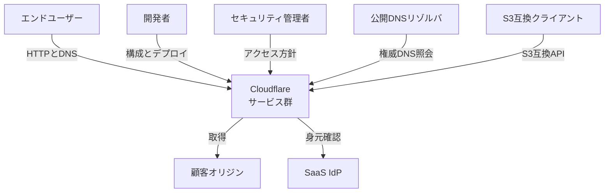

### コンテナ図

管理面と実行面を分けると全体が見やすくなります。ダッシュボード、REST API、Wranglerは設定を保持・配信するコントロールプレーンです。実際のリクエストは最寄りのAnycastエッジで処理されます。

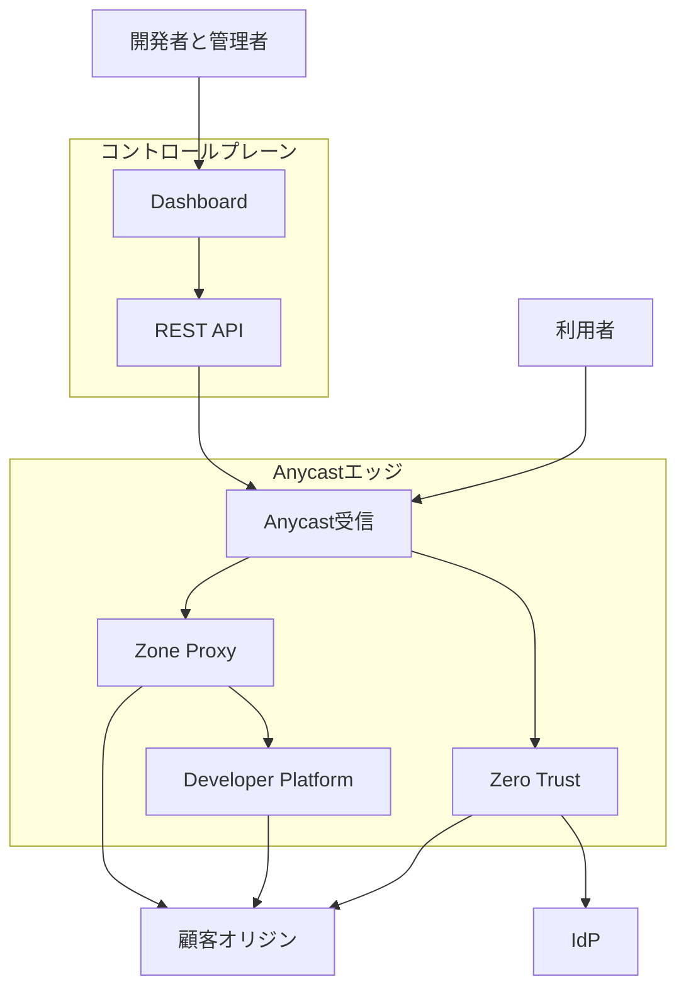

### コンポーネント図

このH3では、管理ツール、Zone Proxy、Workersランタイム、バインディング、マルチテナント実行、Zero Trustの順に内部を見ます。

#### コントロールプレーンと開発者ツール

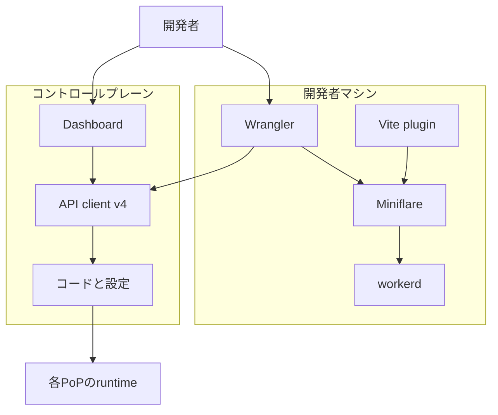

Wranglerはビルド、ローカル実行、デプロイ、リソース操作を担います。Miniflareはローカルで`workerd`を使うため、本番との差を小さくできます。

#### Zone Proxy

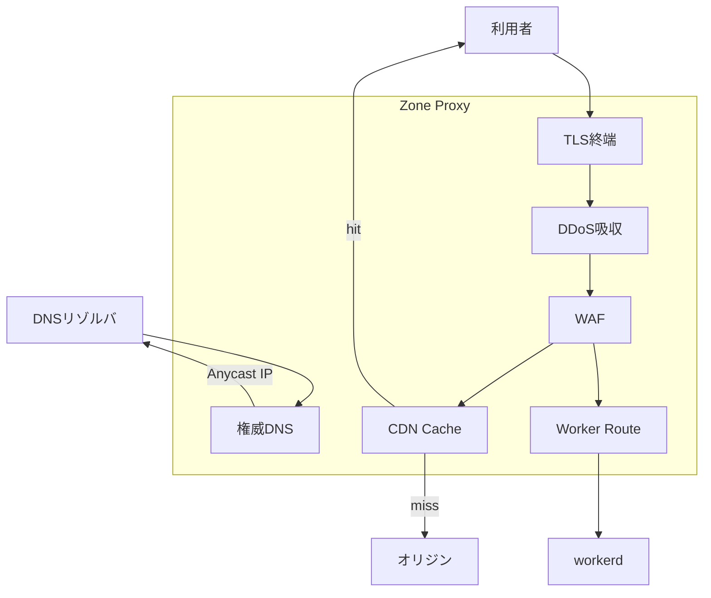

TLS終端、DDoS吸収、WAF、キャッシュ、Worker Routeが同じ経路に並びます。Argo Smart RoutingやTiered Cacheは、この基本経路のオリジン到達を最適化します。

#### Developer Platformランタイム `workerd`

本番では、`workerd`の外側にInbound Proxy、Supervisor、Outbound Proxy、Linux namespaceやseccompによるサンドボックスがあります。信頼度が異なるテナントはcordonでプロセス群を分けます。

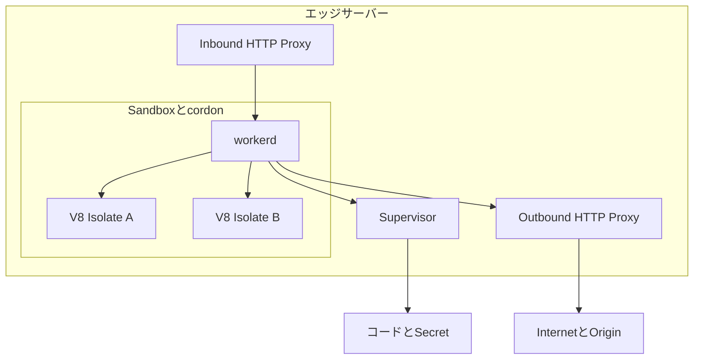

1プロセス内では、リクエストごとに`IoContext`を作り、対象Isolateのロックを取得し、モジュールの`fetch`ハンドラを呼びます。

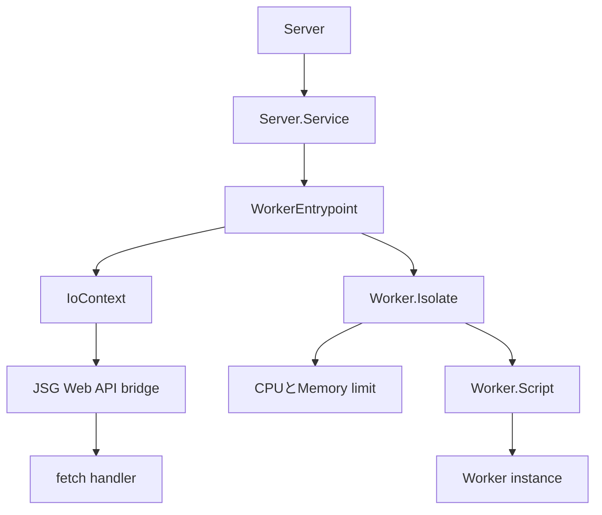

`IoContext`は1リクエストのI/O寿命と`waitUntil`を追跡します。Isolateは単一スレッドで入り、CPUとメモリの制限を受けます。

#### バインディングとストレージ

Bindingは、設定されたリソースだけを`env`へ公開するcapabilityです。URLと資格情報をコードへ直書きするより、権限と参照先を構成として分離できます。

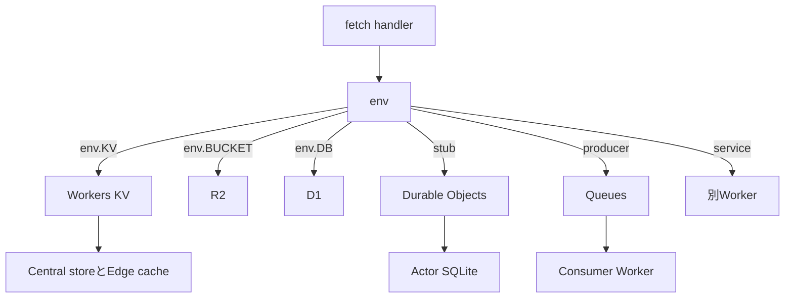

#### Workers for Platformsの分離

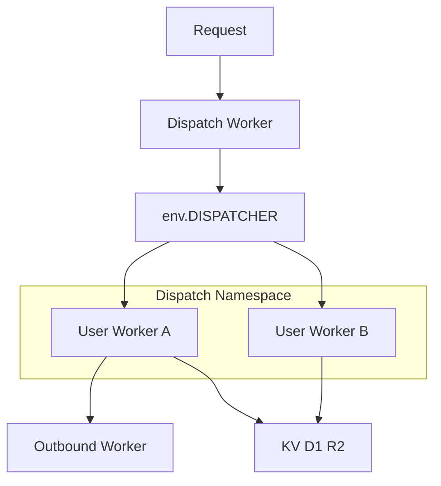

入口のDispatch Workerが顧客名を決め、Dispatch Namespace内のUser Workerへ処理を渡します。既定の`untrusted`ではテナントごとにキャッシュ空間などが分離されます。

#### Zero Trust

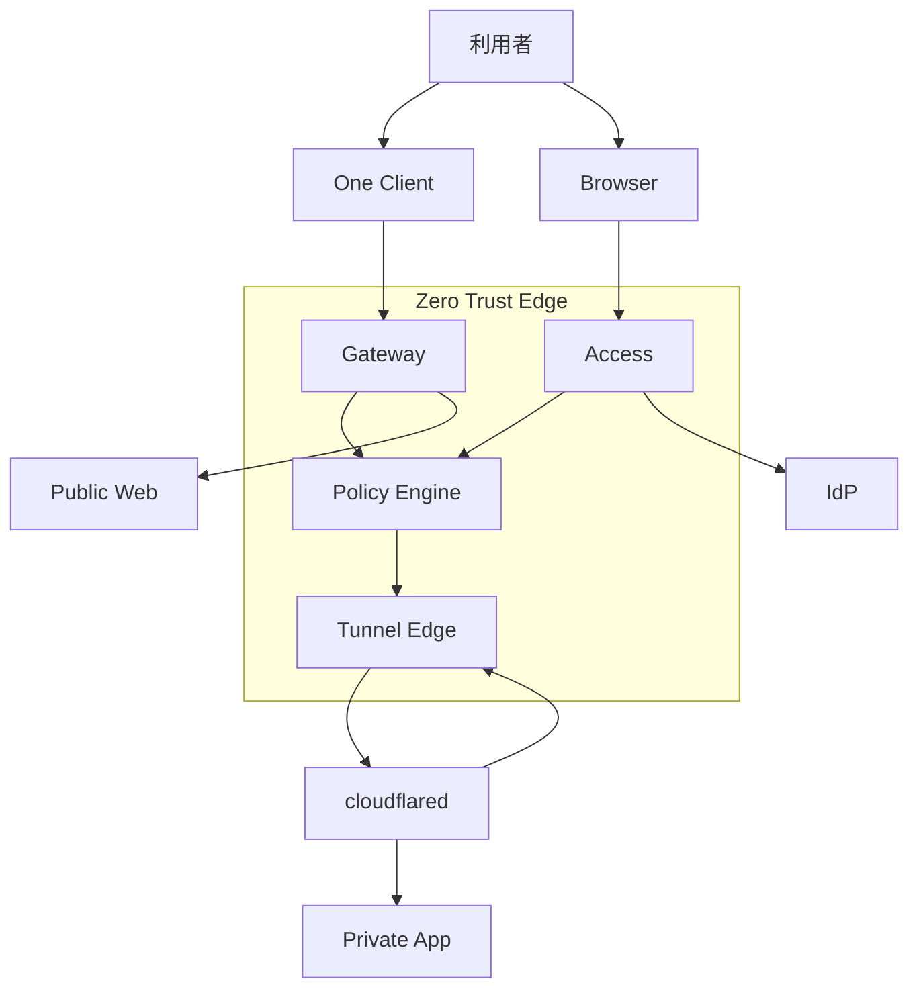

Accessはアプリへの入口、Gatewayは端末のインターネット出口を制御します。Tunnelは`cloudflared`からエッジへの外向き接続で、認証後の通信を非公開アプリへ運びます。

### ネットワーク構成図

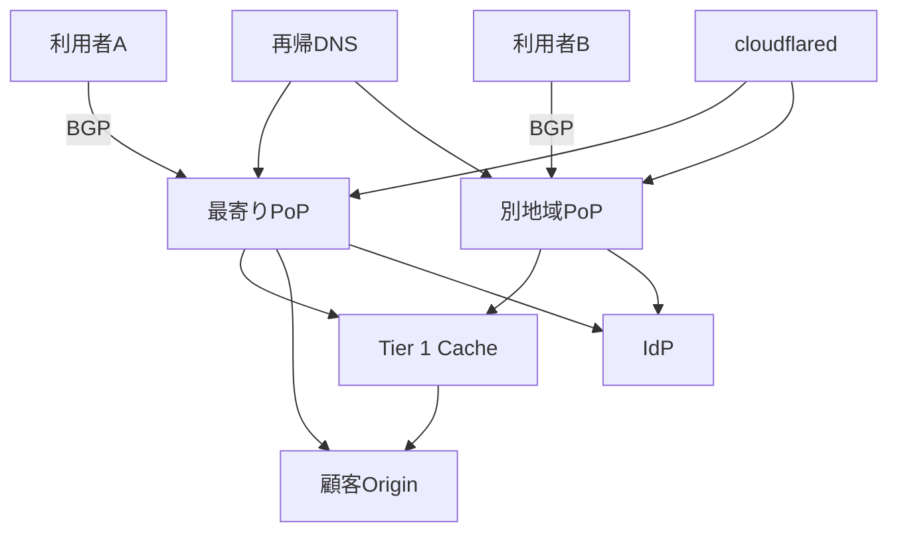

典型経路は3つです。

| 経路 | 処理順 |
|---|---|
| Zone Proxy | DNS、Anycast、TLS、WAF、Cache、Origin |
| Developer Platform | Anycast、Worker Route、Isolate、BindingまたはOrigin fetch |
| Zero Trust | BrowserまたはOne Client、Access/Gateway、Tunnel Edge、`cloudflared`、Private App |

## データ

### 概念モデル

テナントの頂点はAccountです。ZoneはDNSやWAFの単位、Workerやストレージ、Tunnelは主にAccount単位です。UserはAccountの外側にあり、Memberが両者を結びます。

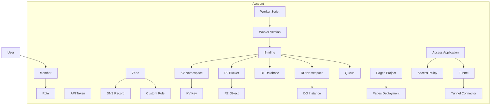

設計時に重要なのは識別子です。

| リソース | APIの主な単位 | 識別子 |
|---|---|---|
| Account | `/accounts/{account_id}` | 32文字の`account_id` |
| Zone | `/zones/{zone_id}` | 32文字の`zone_id` |
| Worker Script | `/accounts/{account_id}/workers/scripts/{script_name}` | `script_name` |
| KV Namespace | `/accounts/{account_id}/storage/kv/namespaces/{namespace_id}` | `namespace_id` |
| R2 Bucket | `/accounts/{account_id}/r2/buckets/{bucket_name}` | `bucket_name` |
| D1 Database | `/accounts/{account_id}/d1/database/{database_id}` | 応答では`uuid` |
| Queue | `/accounts/{account_id}/queues/{queue_id}` | `queue_id` |
| Access Application | `/{accounts_or_zones}/{id}/access/apps/{app_id}` | `app_id` |
| Tunnel | `/accounts/{account_id}/cfd_tunnel/{tunnel_id}` | UUID |

### 情報モデル

情報モデルでは、どのリソースがZone単位かAccount単位か、Bindingが何を参照するかを押さえれば十分です。巨大な全属性図より、運用で触る関係を優先します。

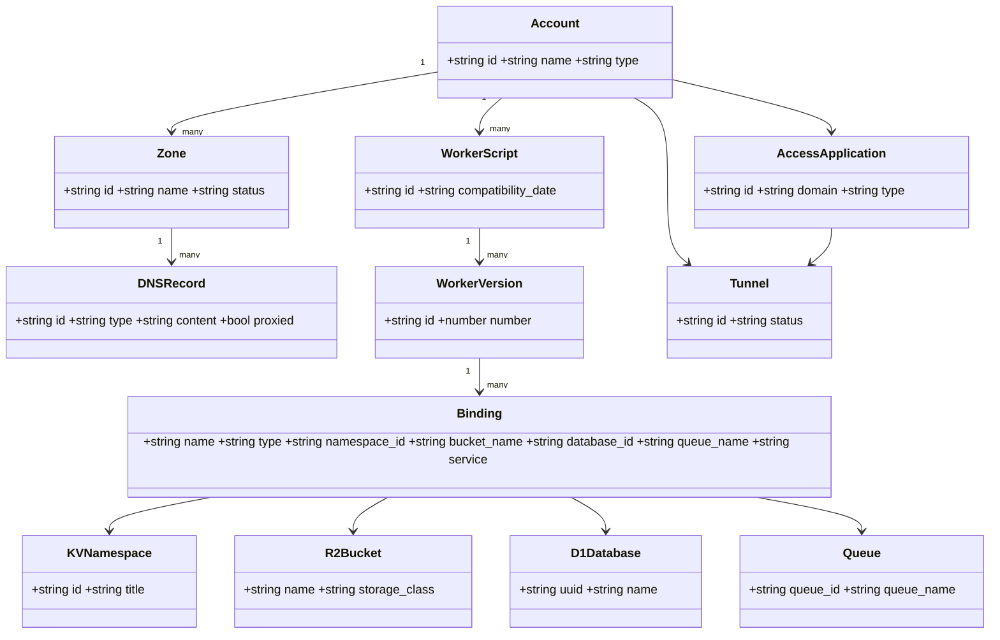

APIレスポンスで特に混同しやすい点は次のとおりです。

- Worker Scriptのパス識別子は`script_name`、Version IDは36文字です。
- D1はパスで`database_id`を使い、応答の識別子フィールドは`uuid`です。
- Bindingの型は`kv_namespace`、`r2_bucket`、`d1`、`durable_object_namespace`、`queue`、`service`などです。実APIに共通の`resource_id`はなく、型に応じて`namespace_id`、`bucket_name`、`database_id`、`queue_name`、`service`を使います。
- Access ApplicationはAccountまたはZoneスコープを取り得ます。
- Tunnelの`status`は`inactive`、`degraded`、`healthy`、`down`です。
- API Tokenの秘密値は作成時に一度だけ返ります。

## 構築方法

### アカウントとAPIトークン

対話開発では`npx wrangler login`のOAuthを使います。CIやREST APIではGlobal API Keyではなく、対象AccountとZoneへ絞ったAPI Tokenを使います。

```bash
curl "https://api.cloudflare.com/client/v4/user/tokens/verify" \
  --header "Authorization: Bearer <API_TOKEN>"
```

WorkerのデプロイではEdit Cloudflare Workersテンプレート、DNS操作ではEdit Zone DNSテンプレートを起点に、不要な権限を削ります。

### 最初のWorker

Wranglerはプロジェクトへローカルインストールし、チームでバージョンを固定します。C3でWorkerを作る最短経路は次のとおりです。

```bash
npm create cloudflare@latest -- my-first-worker
cd my-first-worker
npx wrangler dev
npx wrangler deploy
```

```js
export default {
  async fetch(request, env, ctx) {
    return new Response("Hello World!");
  },
};
```

`wrangler dev`はローカルの`workerd`を既定で`http://localhost:8787`に起動します。`wrangler deploy`は`workers.dev`またはCustom Domainへ公開します。

### DNSをProxiedにする

ドメインをCloudflareへ追加し、ネームサーバーを切り替えます。A、AAAA、CNAMEレコードの`proxied`を`true`にすると、オリジンIPの代わりにAnycast IPが返ります。

```bash
curl "https://api.cloudflare.com/client/v4/zones/${ZONE_ID}/dns_records" \
  --header "Authorization: Bearer ${CLOUDFLARE_API_TOKEN}" \
  --header "Content-Type: application/json" \
  --data '{
    "type": "A",
    "name": "www.example.com",
    "content": "192.0.2.1",
    "ttl": 1,
    "proxied": true
  }'
```

### Cloudflare Tunnel

本番ではダッシュボードで管理するremotely-managed tunnelが主経路です。`cloudflared`をオリジンへ入れ、Networking、Tunnelsから発行されたコマンドを実行し、Published application routeでホスト名と`http://localhost:8000`のようなService URLを結びます。Tunnel単体の構築、冗長化、障害対応は既存の[Cloudflare Tunnel解説](https://zenn.dev/suwash/articles/cloudflare_tunnel_20260220)に詳しく、本記事では他サービスとの接続関係を中心に扱います。

検証用のQuick Tunnelはアカウントなしでも使えます。

```bash
cloudflared tunnel --url http://localhost:8080
```

ローカル管理を選ぶ場合は、UUIDとcredentials JSONを作り、DNS Routeと設定ファイルを用意します。

```bash
cloudflared tunnel login
cloudflared tunnel create app-origin
cloudflared tunnel route dns app-origin app.example.com
cloudflared tunnel run app-origin
```

### Accessアプリケーション

AccessではSelf-hosted、SaaS、Infrastructure、Bookmarkの4種を選びます。社内WebではSelf-hosted applicationを作成し、公開ホスト名、IdP、Allowポリシー、Session Durationを設定します。Allowに一致しないアクセスは既定で拒否されます。TunnelのPublished application routeと同じホスト名へ紐づけると、認証後だけオリジンへ到達できます。

## 利用方法

### Wrangler設定とBinding

新規プロジェクトでは`wrangler.jsonc`が推奨です。最低限、`name`、`main`、`compatibility_date`を指定し、必要なリソースをBindingします。

```jsonc
{
  "$schema": "./node_modules/wrangler/config-schema.json",
  "name": "my-worker",
  "main": "src/index.js",
  "compatibility_date": "2026-08-25",
  "kv_namespaces": [{ "binding": "KV", "id": "<KV_ID>" }],
  "r2_buckets": [{ "binding": "BUCKET", "bucket_name": "my-bucket" }],
  "d1_databases": [{
    "binding": "DB",
    "database_name": "app-db",
    "database_id": "<D1_ID>"
  }],
  "queues": {
    "producers": [{ "binding": "QUEUE", "queue": "jobs" }],
    "consumers": [{ "queue": "jobs" }]
  }
}
```

`env.staging`などの名前付き環境では、`vars`やBindingをトップレベルから継承しません。環境ごとに明示してください。Secretは`vars`ではなく`npx wrangler secret put KEY`で登録します。

### KV、R2、D1、Durable Objects

KVは読み取り中心で、同一キーへの書き込みは毎秒1回までです。キーは最大512バイト、値は最大25 MiBです。

```js
await env.KV.put("config", JSON.stringify({ enabled: true }), {
  expirationTtl: 600,
});
const config = await env.KV.get("config", { type: "json" });
```

R2はWorker BindingとS3互換APIの2経路があります。S3エンドポイントは`https://<ACCOUNT_ID>.r2.cloudflarestorage.com`、リージョンは`auto`です。R2 Access KeyはCloudflare API Tokenとは別物です。

```js
const object = await env.BUCKET.get("image.png");
if (!object) return new Response("Not Found", { status: 404 });
return new Response(object.body, {
  headers: { etag: object.httpEtag },
});
```

D1は`prepare`、`bind`、`all`または`run`の順で使います。

```js
const { results } = await env.DB.prepare(
  "SELECT * FROM Customers WHERE CompanyName = ?",
).bind("Bs Beverages").all();
return Response.json(results);
```

Durable Objectsは名前やIDからstubを取得し、公開メソッドをRPCで呼びます。新しいクラスではSQLite storageと`exports`設定が現行です。同じSQLエンジンでも、D1はアプリ全体のリレーショナルDB、Durable Objectsはユーザーやルーム単位の強一貫Actorとして使い分けます。

### Queues、Hyperdrive、AI

```js
export default {
  async fetch(request, env) {
    await env.QUEUE.send({ path: new URL(request.url).pathname });
    return new Response("queued");
  },
  async queue(batch) {
    for (const message of batch.messages) {
      console.log(message.body);
      message.ack();
    }
  },
};
```

Hyperdriveは`env.HYPERDRIVE.connectionString`をPostgresやMySQLのドライバーへ渡します。Workers AIは`env.AI.run(model, input)`、Vectorizeは`env.VECTORIZE.query(vector, options)`で呼びます。モデルIDとベクトル次元はデプロイ時点のカタログとIndex定義を必ず照合してください。

### Workers Static Assets

新しい静的サイトではWorkersの`assets`を使えます。APIをWorkerで処理し、それ以外をStatic Assetsへ渡す構成です。

```jsonc
{
  "name": "my-spa",
  "main": "src/index.js",
  "compatibility_date": "2026-08-25",
  "assets": {
    "directory": "./dist",
    "binding": "ASSETS",
    "not_found_handling": "single-page-application",
    "run_worker_first": ["/api/*"]
  }
}
```

Workers Sitesは非推奨です。既存Pagesは継続利用できますが、本格的なObservabilityやGradual Deploymentsが必要ならWorkersとStatic Assetsへの移行を検討します。

## 運用

### デプロイとロールバック

Workerのコードや設定を変更するとVersionが作られ、Deploymentがトラフィック配分を決めます。ストレージの状態はVersionに含まれません。削除済みのBinding先やDurable Objectのclass lifecycleに依存するVersionへはロールバックできない場合があります。

```bash
npx wrangler deployments status
npx wrangler versions list
npx wrangler versions upload --message "canary"
npx wrangler versions deploy <NEW_VERSION>@10% <OLD_VERSION>@90% -y
npx wrangler rollback <VERSION_ID> --message "rollback after errors"
```

### ログ、トレース、メトリクス

| チャネル | 用途 | 注意点 |
|---|---|---|
| Workers Logs | 保存、検索、例外分析 | Freeは3日、Paidは7日の保持 |
| `wrangler tail` | デプロイ直後のリアルタイム確認 | 高流量ではサンプリング |
| Tail Workers | ログの加工と転送 | PaidまたはEnterprise |
| Logpush | R2やS3などへTrace Eventを出力 | AccountのLogs Edit権限 |
| OpenTelemetry | OTLP互換先へバッチ出力 | 新規統合の有力候補 |

```jsonc
{
  "observability": {
    "enabled": true,
    "head_sampling_rate": 0.01
  }
}
```

MetricsではRequests、Subrequests、CPU Time、Wall Time、Memory、Invocation Statusを見ます。例外は`$metadata.error EXISTS`や`$workers.outcome = "exception"`で絞り込みます。

### 代表的な制限

| 製品 | 押さえる上限 |
|---|---|
| Workers Free | 10万リクエスト/日、CPU 10ms、メモリ128MB、gzip後3MB |
| Workers Paid | CPU既定30秒、最大5分、メモリ128MB、gzip後10MB |
| KV | 同一キー1 write/秒、値25 MiB、結果整合 |
| D1 | Free 500MB/DB、Paid 10GB/DB、SQL実行30秒、単一スレッド |
| R2 | オブジェクト約5TiB、単一PUT約5GiB、同一キー1 write/秒 |

上限は変更され得るため、リリース前に[Workers limits](https://developers.cloudflare.com/workers/platform/limits/)、[KV limits](https://developers.cloudflare.com/kv/platform/limits/)、[D1 limits](https://developers.cloudflare.com/d1/platform/limits/)、[R2 limits](https://developers.cloudflare.com/r2/platform/limits/)を確認してください。

### TunnelとWAF

`cloudflared`は1プロセスあたり4本の接続を張り、少なくとも2データセンターへ分散します。HealthyはCloudflareまでの接続が健全という意味で、内部Service URLまで成功している保証ではありません。高可用性は同じTunnelへreplicaを追加します。

WAFの誤検知はSecurity Eventsから対象リクエストを絞り、Ruleset Engineの`http_request_firewall_custom` phaseへCustom Ruleを追加します。キャッシュパージは全消しより単一URLを優先します。

## ベストプラクティス

### ストレージを整合性で選ぶ

| 要件 | 製品 |
|---|---|
| 読み取り中心、多少の伝播遅延を許容 | KV |
| Blob、画像、ログ、S3互換 | R2 |
| 読み取り中心の軽量SQL | D1 |
| 1 ID単位の強一貫、協調、WebSocket | Durable Objects |
| 既存Postgres/MySQL | Hyperdrive |
| 非同期メッセージ | Queues |

KVは同一キーへ高頻度に書くRedis代替ではありません。即時一貫性が必要ならDurable Objects、10GBを超えるリレーショナルデータは複数D1または既存DBとHyperdriveを検討します。

### `compatibility_date`を計画的に更新する

`compatibility_date`はランタイム挙動を固定します。新しい日付へ上げる前にCompatibility Flagsの差分を確認し、Previewと段階デプロイで検証します。2026年8月4日以降のCompatibility DateではNode.js互換が日付だけで有効になるなど、日付により既定が変わります。

### SecretとAPI Tokenを最小権限にする

- 本番Secretは`wrangler secret put`または`--secrets-file`で登録する
- `.dev.vars`や`.env`はGit管理しない
- Global API KeyではなくAPI Tokenを使う
- Account、Zone、Client IP、TTLを必要範囲へ絞る
- Cache PurgeやLogpushなど用途別Tokenを分ける

### CIと環境を分離する

公式GitHub Actionは`cloudflare/wrangler-action@v3`です。TokenとAccount IDはRepository Secretsへ置きます。

```yaml
name: Deploy Worker
on:
  push:
    branches: [main]
jobs:
  deploy:
    runs-on: ubuntu-latest
    timeout-minutes: 60
    steps:
      - uses: actions/checkout@v6
      - uses: cloudflare/wrangler-action@v3
        with:
          apiToken: ${{ secrets.CLOUDFLARE_API_TOKEN }}
          accountId: ${{ secrets.CLOUDFLARE_ACCOUNT_ID }}
```

Wrangler Environmentは別Workerとしてデプロイされます。Bindingと`vars`は環境へ継承されないため、stagingとproductionで明示的に分けます。

### 計算をデータへ寄せる

既定のWorkerは利用者の近くで実行されます。バックエンドDBとの往復が支配的ならSmart Placementを検討します。エッジ認証WorkerとDB近傍WorkerをService Bindingで分ける構成も有効です。

Durable Objectは最初の`get()`地点の近くに作られ、その後は原則移動しません。`locationHint`は初回だけ効くベストエフォートです。法令要件には`jurisdiction("eu")`などを使います。

### AccessとTunnelでオリジンを閉じる

Tunnelのアウトバウンドだけを許可し、オリジンのインバウンドを閉じます。同じホスト名をAccessで保護し、`cloudflared`側のProtect with Accessまたはアプリ側のJWT検証で迂回を防ぎます。公開IPを残す場合はCloudflare IP Rangeだけを許可します。

## トラブルシューティング

最初に観測面を切り分けます。

- WorkerはMetrics、Workers Logs、`wrangler tail --status error`
- Tunnelは`cloudflared tunnel list`、Live Logs、オリジンへのローカル`curl`
- One ClientはDEX Device Overviewと`warp-diag`
- WAFはSecurity Events
- 広域障害は[Cloudflare Status](https://www.cloudflarestatus.com)

| 症状 | 主な原因 | 最初の対処 |
|---|---|---|
| Error 1101 | 未捕捉例外、未解決Promise、I/Oオブジェクトのリクエスト横断共有 | Logsと`wrangler tail`でExceptionを確認 |
| Error 1102 | CPU時間の上限超過 | CPU profileで重い処理を特定し、処理分割またはPaidの`cpu_ms`を検討 |
| `Exceeded Memory`または`Memory limit would be exceeded` | 1 Isolateあたりのメモリ上限超過 | Memory profile、Stream化、大きなデータの外部保存 |
| Validation Error 10021 | 構文エラー、Global scopeの起動CPU超過、起動メモリ超過など | 詳細メッセージで切り分け、初期化をHandlerまたはBuild時へ移動 |
| Error 1042 | 同一Zoneの別Workerへ`fetch()` | Service BindingまたはCustom Domain |
| Error 1019 | Worker呼び出しが16回を超えるLoop | 自己再入とチェーンを短縮 |
| Error 1027 | Freeの10万リクエスト/日超過 | UTC 0時待ちまたはPaid |
| KVが古い | 結果整合とEdge Cache | 即時一貫ならDurable Objects |
| D1 overloaded | 遅いQuery、単一スレッドへの同時負荷 | Index、Query分割、DB分割 |
| R2 403 | `AccessDenied`、`ExpiredRequest`、`SignatureDoesNotMatch`、`NotEntitled`など | レスポンスの`Code`を確認し、権限、期限、署名、契約状態を切り分ける。署名不一致ならContent-Typeなどを照合 |
| R2 429 | 同一Keyへの並列Write、`r2.dev`の可変制限、REST APIのレート制限 | Endpointと操作を確認。Key分散、本番Custom Domain、指数Backoff、S3互換APIまたはWorkers APIを使い分ける |
| Tunnel Error 1033 | HealthyなConnectorがない | Process、Firewall、4接続を確認 |
| Tunnel 502 | Tunnelは正常だがServiceへ到達不可 | localhostのPort、Protocol、証明書を確認 |
| Redirect Loop | FlexibleとOrigin HTTPS Redirectなどの衝突 | SSL modeとRedirect Ruleを整理 |
| Error 1000 | DNSがCloudflare IPや自己Proxyを指す | 実Origin IPまたはTunnelへ変更 |

### リダイレクトループの構造

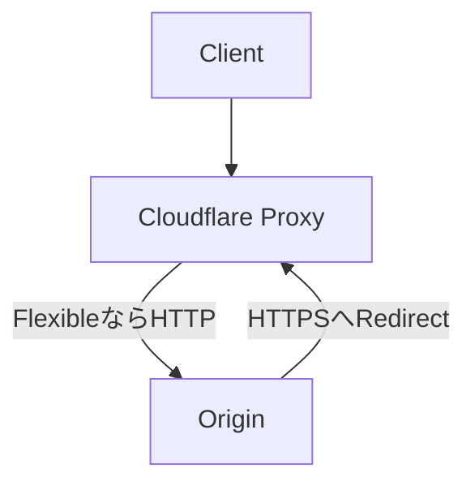

典型例は、CloudflareがFlexibleモードでオリジンへHTTP接続し、オリジンがHTTPSへリダイレクトする構成です。オリジン証明書を用意してFullまたはFull Strictへ揃え、Redirectを一か所で管理します。

### WorkersとPagesの観測差

| 機能 | Workers | Pages |
|---|---|---|
| Gradual Deployments | 対応 | 未対応 |
| Workers Logs | 対応 | 未対応 |
| Logpush | 対応 | 未対応 |
| Tail Workers | 対応 | 未対応 |
| Real-time Logs | 対応 | 対応 |
| CronとQueue Consumer | 対応 | 未対応 |

Pages Functionsで本格的な観測や段階デプロイが必要になったら、WorkersとStatic Assetsへの移行が分かりやすい選択です。

## まとめ

Cloudflareの代表的なサービス群は、次の3層で捉えると整理できます。

1. Application Servicesが公開WebのDNS、配信、TLS、WAF、DDoSを担う
2. Developer PlatformがWorkersとBindingを通じて計算、保存、AIを担う
3. Cloudflare OneがAccess、Gateway、Tunnelで人と端末の接続を担う

これらをつなぐ背骨は、同一のAnycastエッジ、`workerd`のV8 Isolate、権限付きBinding、AccountとZoneを頂点とするリソースモデルです。導入時はまず対象経路を1つ選び、整合性、上限、認証、観測を製品ごとに確認すると、過剰な組み合わせを避けられます。

この記事が少しでも参考になった、あるいは改善点などがあれば、ぜひリアクションやコメント、SNSでのシェアをいただけると励みになります！

## 参考リンク

- [Cloudflare Network](https://www.cloudflare.com/network/)
- [Cloudflare Application Services](https://www.cloudflare.com/application-services/)
- [Cloudflare Plans](https://www.cloudflare.com/plans/)
- [How Cloudflare works](https://developers.cloudflare.com/fundamentals/concepts/how-cloudflare-works/)
- [How Workers works](https://developers.cloudflare.com/workers/reference/how-workers-works/)
- [Workers security model](https://developers.cloudflare.com/workers/reference/security-model/)
- [cloudflare/workerd](https://github.com/cloudflare/workerd)
- [Choose a data or storage product](https://developers.cloudflare.com/workers/platform/storage-options/)
- [Workers pricing](https://developers.cloudflare.com/workers/platform/pricing/)
- [Wrangler configuration](https://developers.cloudflare.com/workers/wrangler/configuration/)
- [Workers Static Assets](https://developers.cloudflare.com/workers/static-assets/)
- [Cloudflare API](https://developers.cloudflare.com/api/)
- [Workers limits](https://developers.cloudflare.com/workers/platform/limits/)
- [Workers observability](https://developers.cloudflare.com/workers/observability/)
- [Versions and Deployments](https://developers.cloudflare.com/workers/versions-and-deployments/)
- [Cloudflare Tunnel](https://developers.cloudflare.com/cloudflare-one/networks/connectors/cloudflare-tunnel/)
- [Access applications](https://developers.cloudflare.com/cloudflare-one/access-controls/applications/)
- [Cache purge](https://developers.cloudflare.com/cache/how-to/purge-cache/)
- [Workers vs Pages compatibility matrix](https://developers.cloudflare.com/workers/static-assets/migration-guides/migrate-from-pages/)
