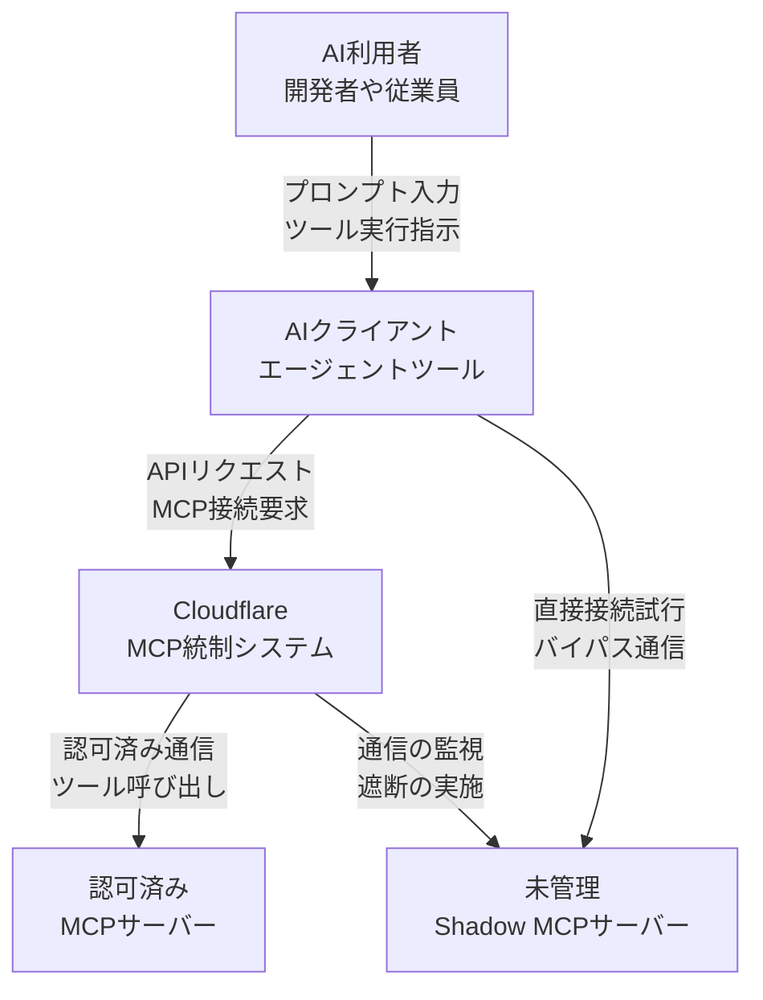
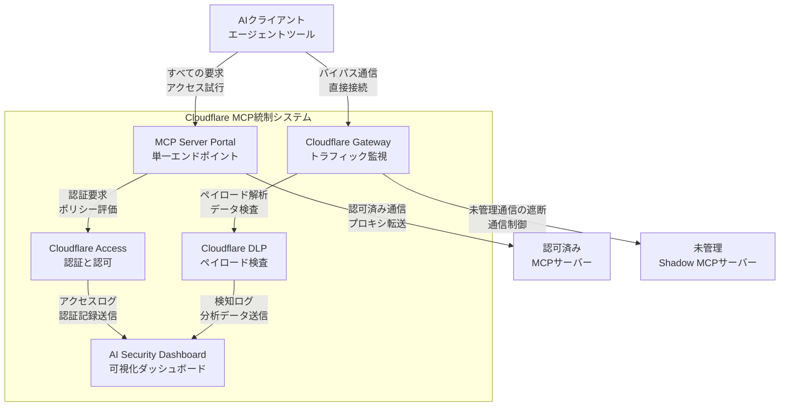
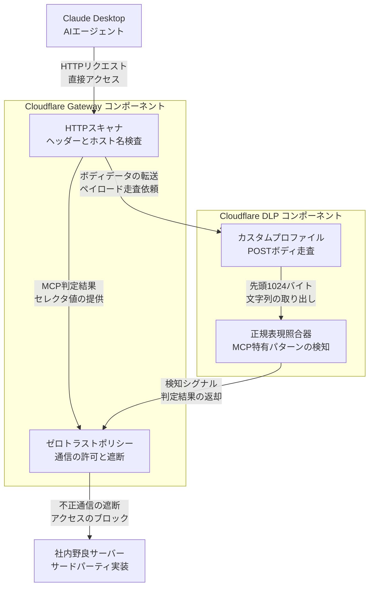
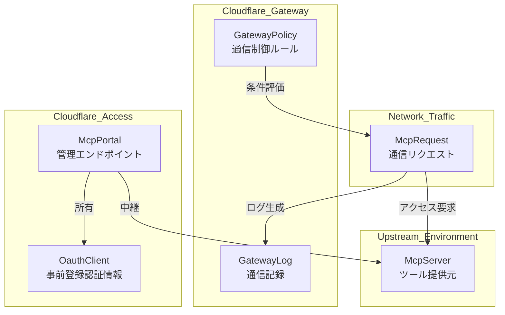
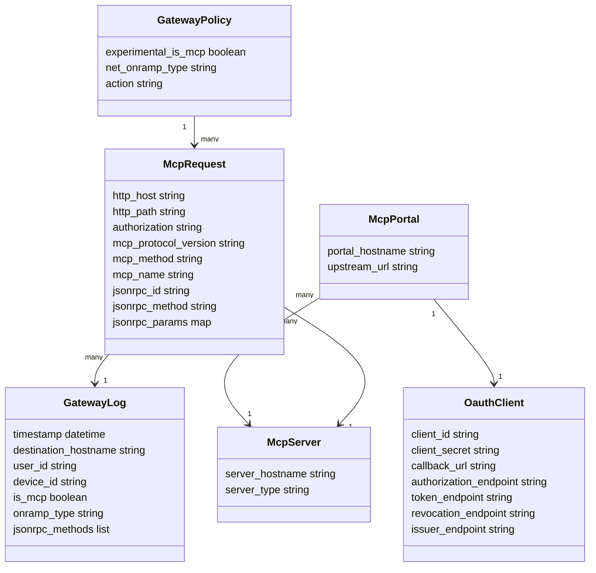
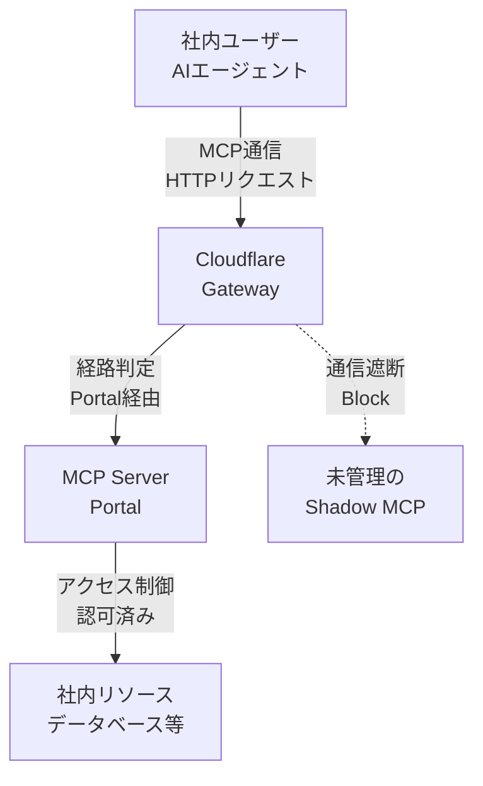
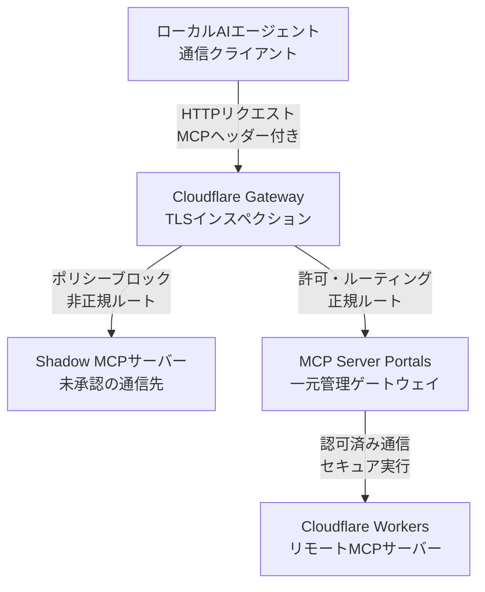
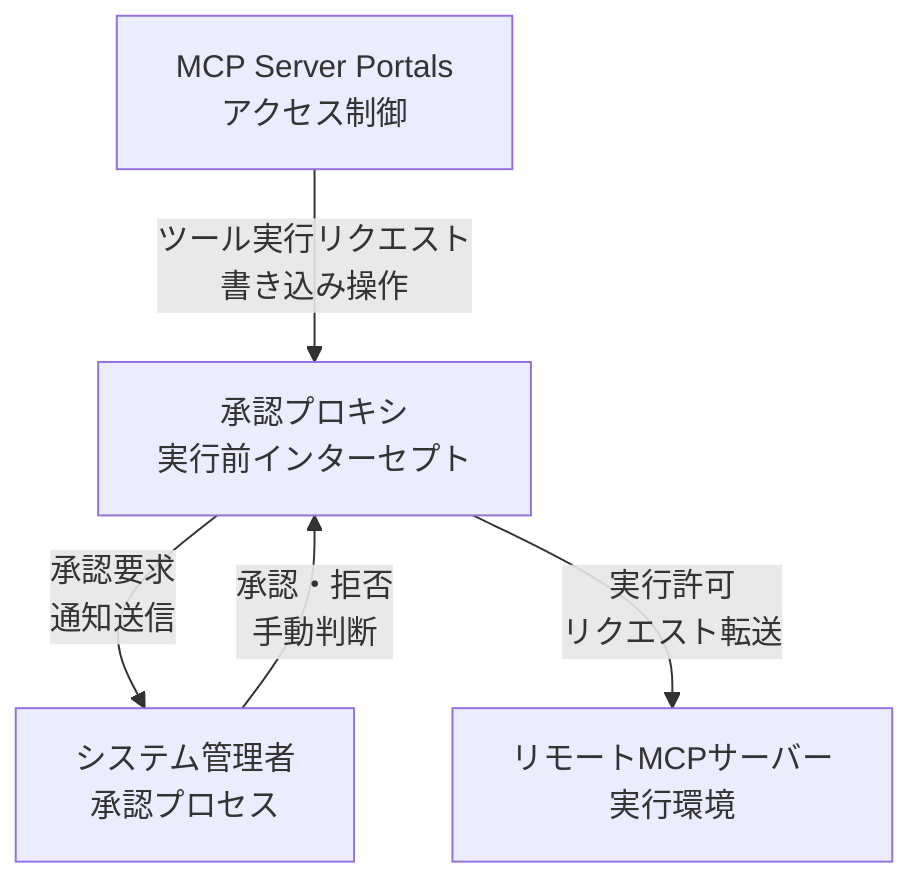

## Shadow MCPとは何が問題なのか

Model Context Protocol（MCP）は、AIエージェントが外部のツールやデータソースへ接続するための標準プロトコルです。従業員がAIクライアントに便利なMCPサーバーを1行追加するだけで、社内のデータが管理外のエンドポイントへ流れ始めます。この「管理者が把握していないMCPサーバーへの接続」がShadow MCPです。

問題は2つに分かれます。

- **見えない**: どのMCPサーバーに、誰が、どれだけ繋いでいるかを管理者が把握できません。
- **迂回できる**: 承認済みサーバーを用意しても、利用者がその正規経路を通らず直接接続できてしまいます。

Cloudflareは2026年8月、この2つをネットワークレイヤーで扱う機能を提供しました。要点は「MCPトラフィックをURLやパスではなく**プロトコルヘッダー**で判定する」ことと、「通信が**どの経路から入ってきたか**を条件に書ける」ことです。

この記事では、Cloudflare GatewayによるMCP検出とMCP Server Portalによる経路統制について、アーキテクチャ・データモデル・実際のポリシー記述・運用時の分析クエリ・つまずきどころまでを扱います。想定読者は、社内のAIエージェント利用を統制する立場の方です。


*この記事の全体像。以下、順に解説します。*

### 制御アプローチの比較

MCPリクエストを止められる場所は3つあり、それぞれ守備範囲が違います。

| 制御ポイント | 仕組み | 守備範囲の特徴 |
| --- | --- | --- |
| クライアント内制御 | クライアントのフックでリクエスト送信前に遮断 | ローカル（`stdio`）も対象にできるが、利用される全クライアントに同じ設定を配る必要がある |
| ネットワーク境界制御 | Secure Web Gatewayで通信を検査 | 管理デバイスの通信を網羅的に把握できるが、ネットワークを通らない通信は見えない |
| サーバー側制御 | ツール実行前に送信元やパラメータを検査 | 詳細な認可ができるが、保護対象は自分が導入したサーバーに限られる |

この記事の主題であるCloudflare Gatewayは2段目のネットワーク境界制御です。3つは排他ではなく、`stdio`のようにネットワークを通らない経路はクライアント側で、破壊的なツール実行はサーバー側で、というように分担させます。

### 従来のURL・パスベース制御との違い

ネットワークレイヤーでMCPを見つける手法として、これまで一般的だったのはホスト名やパスの文字列一致でした。

| 比較項目 | Cloudflare Gateway | 従来のURL・パスベース制御 |
| --- | --- | --- |
| 検出方式 | プロトコル固有のヘッダーとペイロード特性による分類 | ホスト名・URL・パスの文字列マッチング |
| 未知サーバーへの対応 | 任意のドメイン・任意のパスで動くサーバーを識別可能 | 事前に把握している宛先しか捕捉できない |
| 誤検知 | プロトコルの実態で判定するため起きにくい | 名前に `mcp` を含むだけの無関係な宛先を拾う |
| 保守負荷 | 宛先リストの維持が不要 | ドメインリストを継続的に更新する必要がある |
| 経路統制 | Portal経由か直接接続かを識別可能 | 経路の区別が困難 |

なお「TLS復号が要るのはプロトコル判定だけ」ではありません。HTTPSのURLやパスを条件にする場合も復号が必要です。両者を分けるのは復号の要否ではなく、**未知の宛先を捕捉できるかどうか**です。従来手法は、ホスト名に `mcp` を含まないサーバーを取りこぼす一方、`mcp` を含むだけの無関係なサイトを誤検知します。任意のドメインの任意のパスでMCPサーバーは動くため、文字列の一致は本質的に当てになりません。

### ユースケース別の推奨アプローチ

| ユースケース | 推奨アプローチ |
| --- | --- |
| Shadow MCPの発見と遮断 | Cloudflare Gateway（ネットワーク境界制御） |
| 認証・認可や実行ログの集中管理 | MCP Server Portals + Cloudflare Access / Gateway |
| ローカル環境（`stdio`）での実行制御 | クライアント内制御（フック） |

## 主な機能

- **プロトコルレベルのトラフィック検出**: URLやパスから独立して、`MCP-Protocol-Version` をはじめとするプロトコル固有のヘッダーやペイロード特性からMCPトラフィックを分類します。Gateway HTTPポリシーでは `experimental.is_mcp` セレクタとして使えます。
- **経路（Traffic Source）の識別**: `net.onramp.type` セレクタで、通信がMCP Server Portalを経由したのか直接接続なのかを区別します。承認済みサーバーへの直接アクセス、つまりPortal迂回もこれで遮断できます。
- **Shadow MCPの可視化**: 総リクエスト数、ユニークユーザー数、ユニークサーバー数、Portal外のサーバー上位、利用者上位をダッシュボードで確認できます。
- **ステートレスプロトコルへの対応**: MCP仕様 2026-07-28 のステートレスなHTTP通信に対応し、リクエスト単位で操作を識別・制御します。
- **Portalの認証統合**: 動的クライアント登録に対応しないOAuthプロバイダー向けに、クライアントID・シークレット・コールバックURLを手動で登録できます。
- **プライベートサーバーの統合**: パブリックインターネットから到達できないネットワーク上のMCPサーバーをPortalへ束ねる機能が開発中です。

なお `experimental.is_mcp` は接頭辞のとおりベータ機能で、一般提供までに名称や挙動が変わる可能性があります。ポリシー定義はコードで管理し、変更に追随できる状態にしておくのが安全です。

## アーキテクチャ

Cloudflareが提供するMCPのセキュリティ機構と、未管理のサーバーを検知・統制する仕組みを3階層で見ていきます。

### システムコンテキスト図

まず全体の境界です。組織内のAI利用者が、Cloudflareの統制システムを経由してMCPサーバーへアクセスする構図を示します。統制を迂回してShadow MCPへ直接向かう線が同時に存在する点が、この図の核心です。



| 要素名 | 説明 |
|---|---|
| AI利用者 | 組織内でAIツールを操作し、業務を遂行するユーザー |
| AIクライアント | 利用者が操作するAIエージェントやLLMアプリケーション |
| Cloudflare<br/>MCP統制システム | トラフィックを監視し、アクセス制御と可視化を提供する中核プラットフォーム |
| 認可済み<br/>MCPサーバー | IT部門によって承認され、管理下にあるMCPエンドポイント |
| 未管理<br/>Shadow MCPサーバー | 許可を得ずに立ち上げられ、直接通信の相手になる野良のMCPサーバー |

### コンテナ図

統制システムの内部を展開します。「単一エンドポイントの提供」と「ネットワークおよびペイロードの監視」という2系統の組み合わせで成り立っています。



外部要素は次のとおりです。

| 要素名 | 説明 |
|---|---|
| AIクライアント | システムにアクセス要求を送信するAIエージェントツール |
| 認可済み<br/>MCPサーバー | Portalを経由した通信のみを受け付けるサーバー |
| 未管理<br/>Shadow MCPサーバー | 監視をすり抜けようとする不透明なエンドポイント |

統制システム内部の各コンテナは次の役割を持ちます。

| 要素名 | 説明 |
|---|---|
| MCP Server Portal | 複数のMCPサーバーを束ね、AIクライアントに単一の接続先を提供する |
| Cloudflare Access | アクセス元を認証し、ゼロトラストポリシーに基づいて通信を許可する |
| Cloudflare Gateway | ネットワークトラフィックを監視し、MCP通信を判定して遮断する |
| Cloudflare DLP | リクエストの中身を検査し、MCP特有のデータ構造を特定する |
| AI Security Dashboard | 認証や検知のログを集約し、Shadow MCPの利用状況を可視化する |

### コンポーネント図

検知の中身をドリルダウンします。HTTPリクエストの受け口から、JSON-RPCメソッドの特定、遮断判断までの流れです。



外部要素は次のとおりです。

| 要素名 | 説明 |
|---|---|
| Claude Desktop | AIクライアントの具体例。未認可のHTTPエンドポイントへ通信を試行する |
| 社内野良サーバー | 従業員がローカルや社内ネットワークに構築したShadow MCPの実体 |

Gateway側のコンポーネントは次の役割を持ちます。

| 要素名 | 説明 |
|---|---|
| HTTPスキャナ | リクエストを解析し、`MCP-Protocol-Version` などMCP固有のヘッダーを識別する |
| ゼロトラストポリシー | スキャナやDLPの判定結果を受け取り、通信の遮断や通過を制御する |

DLP側は組み込みの判定とは別に、管理者が任意で設定する補助検知です。JSONパーサーではなく、あくまで文字列パターンの照合である点に注意します。

| 要素名 | 説明 |
|---|---|
| カスタムプロファイル | POSTリクエストのボディを走査対象として取り込む |
| 正規表現照合器 | 取り込んだ文字列にMCP特有のメソッド名パターンを照合する |

ここで押さえておくべき制約があります。Cloudflareの監視はネットワークトラフィックに依存します。AIクライアントとMCPサーバーが同一端末内で `stdio`（標準入出力）を使う場合、通信はネットワーク層を通りません。したがってGateway経由では原理的に検出できません。ローカル実行の統制は、クライアントフックやデバイス管理と組み合わせて塞ぐ必要があります。

## データモデル

検出と経路統制を支えるデータの形を確認します。ここで示す属性名は理解のための整理です。ポリシーセレクタ、Portalのアクティビティログ、Logpushの列名、GraphQLの集計次元では、同じ概念でも名前が異なる点に注意してください。

### 概念モデル

主要なエンティティとその関係です。「リクエスト」「ポリシー」「ログ」「Portal」「サーバー」の5つを押さえれば全体が読めます。



| 要素名 | 説明 |
|---|---|
| McpRequest | MCPクライアントが送信するHTTPリクエストおよびJSON-RPCメッセージ |
| GatewayPolicy | 検出判定や送信経路に基づいてアクセス制御を行うポリシールール |
| GatewayLog | 検査済みトラフィックから抽出されたMCP固有シグナルを含む通信記録 |
| McpPortal | 上流への通信を中継し、ID認証とツールカタログを提供する管理用エンドポイント |
| OauthClient | 上流サーバーへの認可のためPortalに登録されるOAuthクライアント認証情報 |
| McpServer | パブリックSaaS、内部アプリ、APIを背後に持つ実際のツール提供サーバー |

### 情報モデル

各エンティティが持つ属性を概念レベルで整理したものです。**属性名はこの記事の整理であり、Logpushの `gateway_http` データセットの実列名とは一致しません**（実列は `HTTPHost` / `URL` / `UserID` / `DeviceID` などです）。ログ連携を実装する際は、必ず現行のLogpushフィールド定義を参照してください。



| 要素名 | 説明 |
|---|---|
| McpRequest | `MCP-Protocol-Version` などのHTTPヘッダーと、JSON-RPCのメソッド・引数を保持する（通信そのものの構造であり、これらがログへ保存されるという意味ではない） |
| GatewayPolicy | `experimental.is_mcp` による判定と `net.onramp.type` による経路条件を保持する |
| GatewayLog | 宛先ホストやユーザー識別子に加え、MCP判定結果と経由元を保持する |
| McpPortal | Portalが公開するホスト名と、プロキシ先となる上流URLを保持する |
| OauthClient | クライアントID・シークレット・コールバックURLと、自動探索できない場合のエンドポイント群を保持する |
| McpServer | アクセス先サーバーのホスト名と種別を保持する |

## 導入手順

### 前提条件

検出側（Gateway）と統制側（Portal）で必要なものが違います。

- **Gateway検出**: Cloudflare One（Zero Trust）アカウントと、GatewayのHTTPインスペクション（TLS復号）が有効であること
- **MCP Server Portal**: Cloudflare上で有効なドメイン（full setup または partial (CNAME) setup）と、Cloudflare Zero Trustに構成済みのIDプロバイダー

Portalそのものはマネージドサービスです。Cloudflare Workersや `wrangler` CLIは前提条件ではありません。必要になるのは、上流のMCPサーバーを自分でホストする場合だけです。

リモートのMCPサーバーはほぼHTTPSで動くため、実務上はTLSインスペクションが前提になります。復号していないHTTPSリクエストのヘッダーは読めないため、無効のままだと `experimental.is_mcp` は判定できず、ポリシーが空振りします（平文HTTPはTLS復号なしでもHTTPポリシーの検査対象です）。

### ダッシュボードからのポリシー設定

1. Cloudflare Zero Trustダッシュボードにログインします。
2. **Gateway > Firewall Policies > HTTP** に移動します。
3. **Add a policy** をクリックします。
4. Trafficタブで条件を設定します。Selectorは `experimental.is_mcp`、Operatorは `is`、Valueは `true` です。
5. Actionタブで動作を選び、保存します。

最初から `Block` にせず、`Allow` で記録だけ取る運用から始めるのが安全です。既存の利用実態を把握する前に遮断すると、業務で使われている正規のMCP利用まで止まります。

### Terraformによるポリシー管理

リソース名はProvider v5で `cloudflare_teams_rule` から `cloudflare_zero_trust_gateway_policy` へ改称されています。以下はv5向けの記述です。

```hcl
resource "cloudflare_zero_trust_gateway_policy" "block_shadow_mcp" {
  account_id  = "your_account_id"
  name        = "Block Shadow MCP Traffic"
  description = "Block MCP traffic that did not arrive through the Portal"
  precedence  = 1
  action      = "block"
  filters     = ["http"]
  traffic     = "experimental.is_mcp == true and net.onramp.type != \"mcp_portal\""
}
```

`net.onramp.type` は、ダッシュボード上で Traffic Source と表示されるセレクタのAPIフィールド名です。トラフィックの入口を示し、Portalを経由した通信には `mcp_portal` が入ります。この条件式は「MCPと判定されたが、Portalを通っていない通信」だけを切り出します。ホスト名の文字列一致に頼らないため、Portalのホスト名を変えてもポリシーを書き換える必要がありません。

### APIによるポリシー作成

同じルールをAPIから作成する場合です。トークンには Zero Trust: Read と Gateway: Write の権限が必要です。

```bash
curl -X POST \
  "https://api.cloudflare.com/client/v4/accounts/${CF_ACCOUNT_ID}/gateway/rules" \
  -H "Authorization: Bearer ${CF_API_TOKEN}" \
  -H "Content-Type: application/json" \
  -d '{
    "name": "Block Shadow MCP Traffic",
    "description": "Block MCP traffic that did not arrive through the Portal",
    "action": "block",
    "enabled": true,
    "precedence": 1,
    "filters": ["http"],
    "traffic": "experimental.is_mcp == true and net.onramp.type != \"mcp_portal\""
  }'
```

### MCP Server Portalの作成

Portalはダッシュボードの **Zero Trust > Access controls > AI controls > Add MCP server portal** から作成します。必要なのはPortal名、ドメインとサブドメイン、配下に置くMCPサーバー、そしてアクセスポリシーです。Portalは `https://<subdomain>.<domain>/mcp` で公開されます。

APIから操作する場合は次のエンドポイントを使います。

```bash
# Portal の一覧
curl -s "https://api.cloudflare.com/client/v4/accounts/${CF_ACCOUNT_ID}/access/ai-controls/mcp/portals" \
  -H "Authorization: Bearer ${CF_API_TOKEN}"

# upstream の MCP サーバーを登録
curl -X POST \
  "https://api.cloudflare.com/client/v4/accounts/${CF_ACCOUNT_ID}/access/ai-controls/mcp/servers" \
  -H "Authorization: Bearer ${CF_API_TOKEN}" \
  -H "Content-Type: application/json" \
  -d '{
    "name": "weather",
    "hostname": "https://tools.example.com/mcp",
    "auth_type": "unauthenticated"
  }'
```

フィールド名は `url` ではなく `hostname` です。`auth_type` には `oauth` / `bearer` / `unauthenticated` を指定します。なお、このPOSTはMCPサーバーを**アカウントに登録する**だけで、特定のPortalへの割り当てにはなりません。Portal側の更新APIでサーバーのマッピングを設定して初めて、そのPortal経由で利用できるようになります。

APIやTerraformでPortalを作成した場合、DNSレコードは自動作成されません。Portalのホスト名に対して `gateway.agents.cloudflare.com` を指すCNAMEレコードを、プロキシ有効で手動作成します。この手順を飛ばすとPortalへのアクセスが522エラーになります。

## 利用方法

運用の骨格は3段階です。

- **正規の経路を1つ用意する**: Portalを立て、利用者に配布する接続先をPortalのURL1つに統一します。
- **経路を見て遮断する**: `experimental.is_mcp == true` かつ経路が `mcp_portal` でない通信をブロックします。
- **遮断前に観測する**: まずAllowで記録し、既存利用を洗い出してからBlockへ切り替えます。

### Gateway HTTPポリシーの主要パラメータ

ポリシー作成API（`POST /accounts/{account_id}/gateway/rules`）で最低限指定する項目です。

| パラメータ名 | 型 | 説明 |
|---|---|---|
| `name` | string | ポリシーの識別名 |
| `action` | string | 適用するアクション（`allow`、`block` など） |
| `traffic` | string | トラフィックを評価するフィルター条件式 |
| `precedence` | number | 評価順序。小さいほど先に評価される |

### Portal迂回を遮断する条件式

```text
experimental.is_mcp == true and net.onramp.type != "mcp_portal"
```

これを `action: block` で適用すると、野良MCPサーバーへの直接接続に加えて、**承認済みサーバーへPortalを通さず直接アクセスする通信**も止まります。承認済みかどうかではなく、経路が正しいかどうかで判断している点が要点です。

### 検出対象となるリクエストの形

判定に使われるのは、MCP仕様 2026-07-28 で定められたHTTPヘッダーです。仕様に沿ったツール呼び出しリクエストは次の形になります。

```http
POST /mcp HTTP/1.1
Host: tools.example.com
Authorization: Bearer <access-token>
Accept: application/json, text/event-stream
Content-Type: application/json
MCP-Protocol-Version: 2026-07-28
Mcp-Method: tools/call
Mcp-Name: get_weather

{
  "jsonrpc": "2.0",
  "id": 42,
  "method": "tools/call",
  "params": {
    "name": "get_weather",
    "arguments": { "location": "Seattle, WA" },
    "_meta": {
      "io.modelcontextprotocol/protocolVersion": "2026-07-28",
      "io.modelcontextprotocol/clientInfo": {
        "name": "ExampleClient",
        "version": "1.0.0"
      },
      "io.modelcontextprotocol/clientCapabilities": {}
    }
  }
}
```

- `Accept`: クライアントは `application/json` と `text/event-stream` の両方を列挙する必要があります。
- `MCP-Protocol-Version`: POSTリクエストで必須です。ヘッダー値はボディの `params._meta` にある `io.modelcontextprotocol/protocolVersion` と一致していなければならず、食い違えばサーバーは400を返します。
- `Mcp-Method` / `Mcp-Name`: 操作種別とツール名がヘッダーに現れます（`Mcp-Name` は `tools/call`、`resources/read`、`prompts/get` で必要です）。ただしCloudflare側でこれらが操作単位のログとして残るのはPortalのアクティビティログであり、Gateway HTTPログの標準列ではありません。
- Cloudflare側はこうしたプロトコル固有ヘッダーとペイロードの特性を検査して分類します。`experimental.is_mcp` はその**分類結果**であり、特定のヘッダー1つの有無と完全に等価だと決めつけないほうが安全です。

### クライアントの接続先をPortalへ寄せる

利用者のAIクライアントには、個々のMCPサーバーではなくPortalのURLだけを配布します。設定ファイル型のクライアントでは、`mcp-remote` 経由の記述が推奨されています。

```json
{
  "mcpServers": {
    "company-portal": {
      "command": "npx",
      "args": ["-y", "mcp-remote@latest", "https://mcp.example.com/mcp"]
    }
  }
}
```

`serverURL` によるURL直接指定は、Portalのセッション生成と管理で問題が出る可能性があるとして非推奨です。Portalは複数の上流サーバーを1つのエンドポイントに束ねます。1つのPortalに登録できるMCPサーバーは最大40個です。

### 通信フローの全体像



| 要素名 | 説明 |
| --- | --- |
| 社内ユーザー | MCPプロトコルでリソースにアクセスするクライアント |
| Cloudflare Gateway | トラフィックを検査し、MCP通信を検知・制御するゲートウェイ |
| MCP Server Portal | 認可された唯一の通信経路 |
| 未管理の Shadow MCP | 組織の管理外で動作している野良のMCPサーバー |
| 社内リソース | アクセス対象となるデータベースや内部API |

## 運用

### 日常的に確認する観点

- **Portal外のサーバー上位**: Portalを経由せずアクセスされている宛先ホスト。これは「Portal迂回候補」であって、そのままShadow MCPと断定はできません。未承認サーバーへの接続と、承認済みサーバーへの直接接続の両方が混ざるためです。承認済みサーバーの台帳と突き合わせて初めて分類が確定します。
- **利用者別のリクエスト量**: 特定の利用者に偏っていれば個別の是正で足ります。分散していればポリシー側の整備が先です。
- **経路別の内訳**: Portal経由と直接接続の比率。統制の浸透度を示す直接の指標です。
- **ユニークサーバー数の推移**: 増加が続く場合、承認プロセスが利用実態に追いついていません。

### GraphQL Analytics APIによるログ分析

セレクタ導入以前から使えるヒューリスティックな分析として、Gateway HTTPログを `gatewayHttpRequestsAdaptiveGroups` データセットに対して集計する方法があります。最大30日分を遡れます。

```graphql
query MCPTrafficScan($accountTag: string, $since: string, $until: string) {
  viewer {
    accounts(filter: { accountTag: $accountTag }) {
      gatewayHttpRequestsAdaptiveGroups(
        limit: 100
        filter: {
          datetime_geq: $since
          datetime_leq: $until
          OR: [
            { httpHost_like: "%mcp%" }
            { httpRequestURI_like: "%/mcp%" }
            { httpRequestURI_like: "%/sse%" }
          ]
        }
        orderBy: [count_DESC]
      ) {
        count
        dimensions {
          httpHost
          httpRequestURI
          action
        }
      }
    }
  }
}
```

リクエストボディには `query` と `variables` の両方を含めます。日時はISO-8601形式です。

```bash
cat > query.json <<'JSON'
{
  "query": "query MCPTrafficScan($accountTag: string, $since: string, $until: string) { viewer { accounts(filter: {accountTag: $accountTag}) { gatewayHttpRequestsAdaptiveGroups(limit: 100, filter: {datetime_geq: $since, datetime_leq: $until, OR: [{httpHost_like: \"%mcp%\"}, {httpRequestURI_like: \"%/mcp%\"}, {httpRequestURI_like: \"%/sse%\"}]}, orderBy: [count_DESC]) { count dimensions { httpHost httpRequestURI action } } } } }",
  "variables": {
    "accountTag": "<ACCOUNT_ID>",
    "since": "2026-07-17T00:00:00Z",
    "until": "2026-08-16T00:00:00Z"
  }
}
JSON

curl -s https://api.cloudflare.com/client/v4/graphql \
  -H "Authorization: Bearer ${CF_API_TOKEN}" \
  -H "Content-Type: application/json" \
  --data @query.json | jq '.data.viewer.accounts[0].gatewayHttpRequestsAdaptiveGroups'
```

取得できるのは最大30日分です。`since` と `until` の間隔は30日以内に収めます。

この方法は文字列一致なので、前述のとおり取りこぼしと誤検知があります。あくまでヘッダー方式が使えない期間の補完、または移行前後の比較用と位置づけます。

### DLPによるJSON-RPCペイロード検査

ヘッダーを送らないレガシーな実装を拾う場合は、DLPプロファイルでPOSTボディを走査します。制約が2つあります。走査対象は**ボディ先頭1,024バイトまで**、正規表現はPCREではなく**Rust regex構文**です。

```text
"method"\s{0,5}:\s{0,5}"(initialize|tools/call|tools/list|resources/read|resources/list)"
```

このプロファイルをGateway HTTPポリシーの条件に組み込みます。

```text
any(http.request.body.scan.dlp.profiles[*] == "MCP JSON-RPC Detection")
```

ヘッダー方式とボディ走査は排他ではありません。前者を主、後者を補助として併用し、後者の検知件数が減っていくことを移行の進捗指標として使えます。

### 検査フローの確認



| 要素名 | 説明 |
|---|---|
| ローカルAIエージェント | 従業員のPC等で稼働する通信クライアント |
| Cloudflare Gateway | TLSインスペクションを通じてトラフィックを検査するゲートウェイ |
| Shadow MCPサーバー | 許可を得ずに立ち上げられた未承認の通信先 |
| MCP Server Portals | トラフィックを認証し、適切なサーバーへ振り分ける一元管理ゲートウェイ |
| Cloudflare Workers | アクセス制御下で実行されるリモートMCPサーバー |

### ログの保全とエクスポート

Portalのアクティビティログには、時刻・ステータス・サーバー名・呼び出されたツール名・所要時間が記録されます。Enterpriseプランでは Logpush で外部ストレージやSIEMへ継続的にエクスポートできます。ダッシュボード上の保持期間には上限があるため、監査要件がある場合は最初にLogpushを設定しておきます。

## ベストプラクティス

### 導入順序

- **TLSインスペクションを先に有効化する**: HTTPSのMCP通信は復号しなければ判定できず、以降のポリシーが機能しません。
- **Blockより先にログを取る**: 最初はAllowで記録し、既存利用の棚卸しを終えてから遮断へ切り替えます。
- **経路条件で書く**: ホスト名やパスの文字列一致でなく `net.onramp.type` で書き、Portalのホスト名変更に強くします。
- **Portalの認可はAccess側に寄せる**: ツール単位の可視性はPortalのカタログ設定で絞り、ネットワークポリシーに認可ロジックを持ち込みません。
- **書き込み系ツールは承認を挟む**: 破壊的操作はサーバー層の制御で止め、ネットワーク層の遮断だけに依存しません。
- **`stdio`はエンドポイント側で塞ぐ**: ネットワークを通らない経路はGatewayでは見えないため、デバイス管理やクライアントフックと役割分担します。

### 推奨構成

ローカルのMCPサーバーからリモートMCPサーバーへの移行を推奨します。Cloudflare Workersは、その際のホスティング先の候補です。

ただし「Workers上でホストすれば見える」わけではありません。ホスティング先と観測経路は別の話です。可視化を成立させるには、次の3点をそれぞれ用意する必要があります。

- 利用者がPortal経由で接続していること
- Portalの Gateway routing を有効にし、上流へのツール呼び出しをGatewayに通していること
- 利用者の端末トラフィックがGatewayを経由していること

なお Gateway routing を有効にしても、管理者の認証情報で行われるバックグラウンド同期は上流へ直接接続するため、Gatewayログには現れません。可視化できるのは「管理経路を通るリアルタイムのツール呼び出し」です。あわせてCloudflare Accessで、ユーザー・グループ・デバイスポスチャに基づく条件付きアクセスを適用します。

### 書き込み操作の統制

ツール実行時に人間の承認を挟む仕組みを入れると、意図しないデータ書き換えを防げます。ネットワーク層の遮断は「繋がせない」ための制御であり、「繋がった先で壊させない」ための制御は別に必要です。



| 要素名 | 説明 |
|---|---|
| MCP Server Portals | ユーザーやデバイスの状態に基づいてアクセス制御を実施するポータル |
| 承認プロキシ | ツール実行を傍受し、書き込み操作を保留する層 |
| リモートMCPサーバー | 実際のツール処理を実行する環境 |
| システム管理者 | 破壊的な操作に対して手動で承認判断を行う担当者 |

## トラブルシューティング

### 症状別の切り分け

| 症状 | 原因 | 対処 |
|---|---|---|
| Shadow MCP通信が検出されない | TLSインスペクションの対象外になっているか、ローカルの `stdio` 通信を使っている | TLSインスペクションを有効化する。`stdio` はネットワーク監視で検出できないため、エンドポイント管理を併用する |
| 正規のMCP通信がブロックされる | ポリシーが過剰に厳格か、Portalを経由しない直接通信になっている | 許可条件が正しい経路（`mcp_portal`）を指しているか確認し、ポリシーの優先順位を見直す |
| 承認プロンプトが表示されない | 対象のツール実行が読み取り専用と判定されている | サーバー側のツール定義で書き込み権限が必要な設定になっているか確認し、対象ツールがフックに含まれているか確認する |

### Portal固有のエラー

Portalは独自ホスト名を持つプロキシなので、失敗はDNS・OAuth・トランスポートの3系統に分かれます。

- **522エラーが返る**: Portalホスト名のCNAMEが `gateway.agents.cloudflare.com` を指しているか、プロキシが有効かを確認します。API・Terraform経由の作成ではDNSレコードが自動生成されません。
- **サーバーがWaitingのまま進まない**: 上流のURLに到達できるか、Streamable HTTPまたはSSEに対応しているかを確認し、ダッシュボードから同期を手動実行します。
- **OAuthのリダイレクトURIが拒否される**: 上流のOAuthアプリに `https://<portal-hostname>/servers-callback` を許可URLとして登録します。共有コールバックを使う構成では `https://oauth-callbacks.cloudflareaccess.com/cdn-cgi/access/outbound-oauth-callback` が対象です。
- **上流が403を返す**: プロキシ経由のクライアントを拒否するサーバーがあります。この場合はPortal配下に置けないため、別経路の統制へ切り替えます。
- **Gateway routingを有効にすると失敗する**: この機能はStreamable HTTPのみ対応です。SSEのみの上流では使えません。DLPでブロックされていないかGatewayログも確認します。
- **管理者トークンが無通知で失効する**: 手動OAuthのツール一覧は最初の認可時にしか取得されません。ツールが消えた場合は再認可を実施します。

### 検出が効かないときの確認順序

- **TLSインスペクションが有効か**: HTTPS通信は無効なら判定できません。まずここを確認します。
- **通信がデバイスクライアントを経由しているか**: Gatewayに到達していない通信はログに現れません。
- **`stdio` ではないか**: ローカルプロセス間通信はネットワークを通らないため、原理的に検出できません。
- **クライアントが新仕様に対応しているか**: `MCP-Protocol-Version` を送らない旧実装はヘッダー方式では拾えません。DLPのボディ走査で補います。
- **セレクタがベータであることを踏まえているか**: 名称や挙動が変わる可能性があります。ポリシー定義はコード管理しておきます。

## まとめ

Shadow MCPの統制は、「MCP通信をどう見つけるか」と「正しい経路を通っているか」の2つに分解できます。

- 検出は**プロトコル特性**で行います。`MCP-Protocol-Version` などのヘッダーとペイロード特性から分類する `experimental.is_mcp` により、任意のドメイン・任意のパスで動くMCPサーバーを、ホスト名の文字列一致に頼らず識別できます。
- 統制は**経路**で行います。`net.onramp.type` でPortal経由かどうかを条件にすることで、野良サーバーへの接続だけでなく、承認済みサーバーへのPortal迂回も同じ1本のポリシーで止められます。
- 前提はTLSインスペクションです。HTTPSのMCP通信は復号しなければ判定できません。導入は「TLS復号を有効化 → Allowで観測 → 実態を把握 → Blockへ切替」の順に進めます。
- 限界も明確です。`stdio` によるローカル通信はネットワークを通らないため検出できません。ここはクライアント側やデバイス管理で分担します。書き込み操作の抑止も、ネットワーク層ではなくサーバー層の責務です。

ネットワーク境界での統制は万能ではありませんが、「誰がどのMCPサーバーに繋いでいるか」を初めて数字で把握できるようにします。統制の設計は、まずこの可視化から始めるのが現実的です。

この記事が少しでも参考になった、あるいは改善点などがあれば、ぜひリアクションやコメント、SNSでのシェアをいただけると励みになります！

## 参考リンク

- [How Cloudflare detects MCP traffic and helps secure it | Cloudflare Blog](https://blog.cloudflare.com/mcp-security-updates/)
- [MCP protocol detection and AI Security dashboard · Changelog](https://developers.cloudflare.com/changelog/post/2026-08-12-mcp-detection-and-dashboard/)
- [Traffic Source selector in Gateway policies · Changelog](https://developers.cloudflare.com/changelog/post/2026-08-12-traffic-source-selector/)
- [Route MCP server portal traffic through Cloudflare Gateway · Changelog](https://developers.cloudflare.com/changelog/post/2026-03-20-mcp-portal-gateway-routing/)
- [MCP server portals · Cloudflare One docs](https://developers.cloudflare.com/cloudflare-one/access-controls/ai-controls/mcp-portals/)
- [HTTP policies · Cloudflare One docs](https://developers.cloudflare.com/cloudflare-one/traffic-policies/http-policies/)
- [TLS decryption · Cloudflare One docs](https://developers.cloudflare.com/cloudflare-one/traffic-policies/http-policies/tls-decryption/)
- [Detect MCP traffic in Gateway logs · Cloudflare One docs](https://developers.cloudflare.com/cloudflare-one/tutorials/detect-mcp-traffic-gateway-logs/)
- [Gateway logs · Cloudflare One docs](https://developers.cloudflare.com/cloudflare-one/insights/logs/dashboard-logs/gateway-logs/)
- [Data Loss Prevention · Cloudflare One docs](https://developers.cloudflare.com/cloudflare-one/data-loss-prevention/)
- [Model Context Protocol · Cloudflare Agents docs](https://developers.cloudflare.com/agents/model-context-protocol/)
