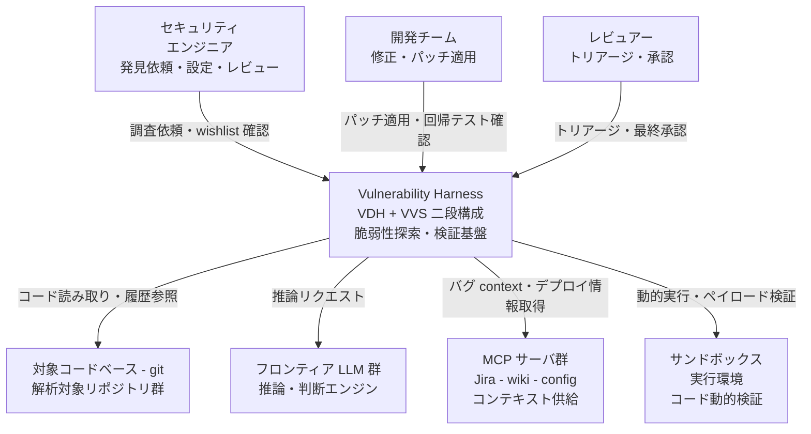
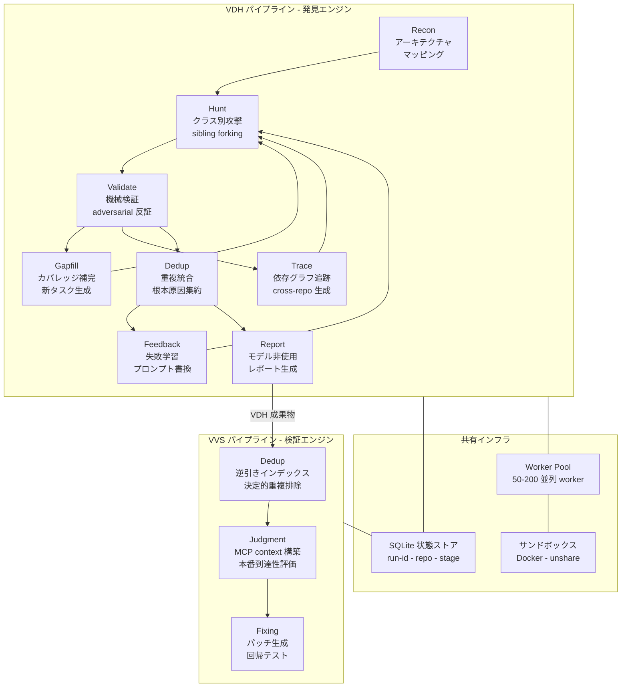
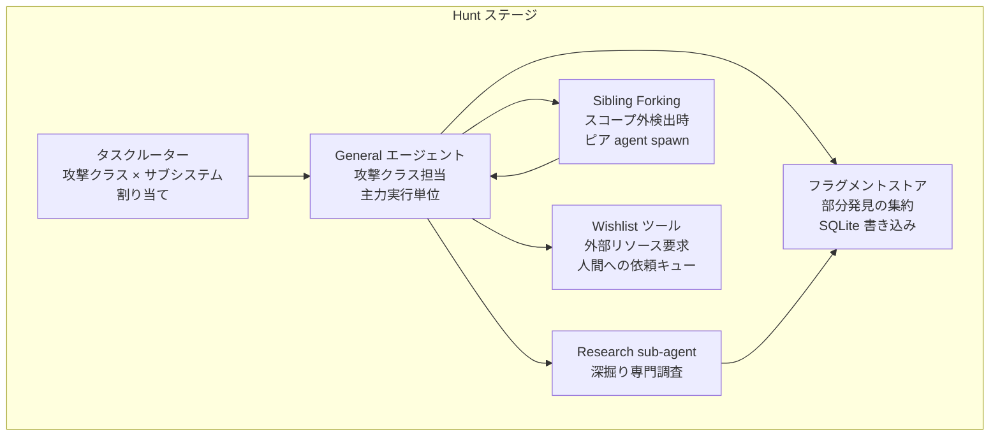
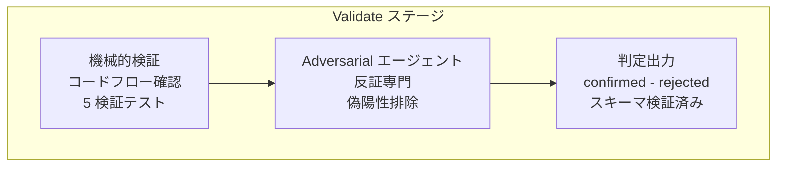
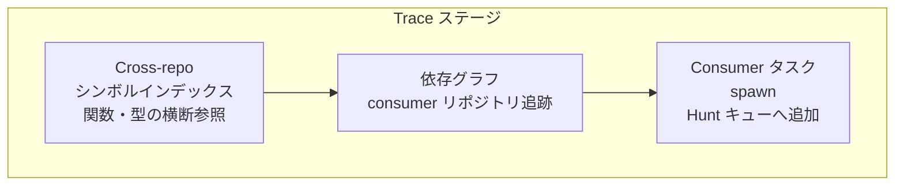
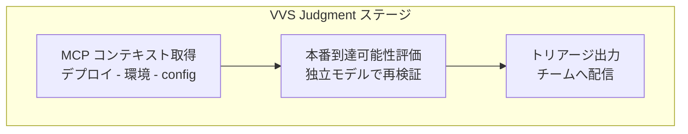
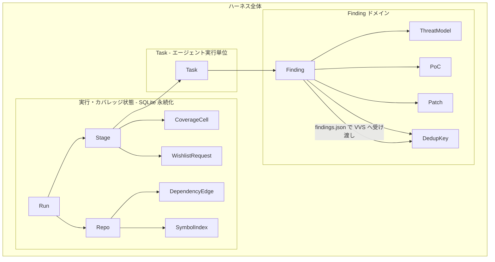
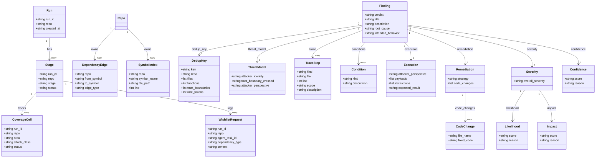
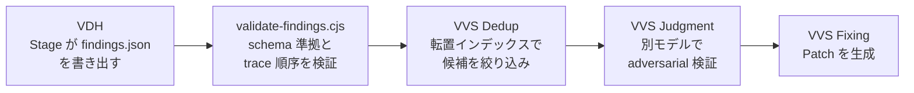

> 対象: Cloudflare が公開した脆弱性探索の永続ハーネス。発見系 VDH (Vulnerability Discovery Harness) と検証系 VVS (Vulnerability Validation System) の二段構成。
> 一次情報: [Build your own vulnerability harness — Cloudflare Blog](https://blog.cloudflare.com/build-your-own-vulnerability-harness/) / OSS 公開 skill [cloudflare/security-audit-skill](https://github.com/cloudflare/security-audit-skill)
> 検証日: 2026-06-19

## 概要

Cloudflare の Vulnerability Research Harness は、AI エージェントによるセキュリティ調査を「単発の診断」から「継続稼働する運用パイプライン」へ転換するシステムです。

チームはまず約 450 行の `security-audit` skill（後に OSS 公開）を用いて単一セッションの脆弱性診断を試みました。この経験から 3 つの壁が明らかになりました。

| 壁 | 内容 |
|----|------|
| コンテキスト枯渇 | 1 回のセッションで発見できる脆弱性はフル網羅の約 50% にとどまる |
| 永続性の欠如 | セッション終了やクラッシュで途中結果がすべて失われる |
| クロスリポジトリの盲点 | 単一リポジトリ内の解析では依存チェーン越しの脆弱性を見逃す |

これらを解消するために設計したのが本ハーネスです。

### 設計哲学

ブログの核心となる三原則を整理します。

**「ハーネスこそが残るもの」**

> "the future of agentic workflows will not be found in standalone models, prompts, or single-agent sessions"
>
> "The harness is the bit that lasts. If you build your own system, design it to be model-agnostic from day one."

LLM はステートレスな計算機として扱い、状態はすべて外部の SQLite DB に持ち出します。モデルは差し替え可能なコンポーネントとし、ハーネス自体に長期運用の価値を集約します。

**モデル非依存（model-agnostic）**

特定プロバイダへの依存を排除し、その時々でトップに立つモデルを採用できる設計とします。プロバイダの動向やモデル更新に左右されない安定運用を実現します。

**二段階の独立検証**

発見（VDH）と検証（VVS）に異なるモデルを割り当て、VVS が VDH 出力を「偏りのない、敵対的サードパーティ（unbiased, adversarial third party）」として再評価します。同一モデルが自身の出力を採点する構造を排除し、ハルシネーションや自己承認バイアスを防ぎます。

### VDH と VVS の役割分担

| コンポーネント | 役割 | 使用モデル |
|--------------|------|-----------|
| VDH（Vulnerability Discovery Harness） | フロンティアモデルでコードベースを走査し、脆弱性候補を発見 | モデル A |
| VVS（Vulnerability Validation System） | VDH の findings を独立検証し、重複排除・優先度付け・修正を実施 | モデル B（VDH と別） |

### 実績数値（記事公開時点）

| 指標 | 数値 |
|------|------|
| VDH 生成候補（lifetime） | 20,799 件 |
| 独立検証を通過した候補（lifetime） | 12,057 件 |
| VVS 中央プール（VVS ingest 後・Dedup 前・145 repos） | 13,841 件 |
| Dedup で統合・除外 | 5,442 件 |
| wrong-repo / low-risk として振り分け | 1,154 件 |
| チームへ送った actionable findings | 7,245 件 |
| 検証拒否率（rejection rate）の改善 | 40% → 11% |
| high-integrity findings 比率の改善 | 35% → 58% |

VVS プール 13,841 件から、Dedup 5,442 件と wrong-repo/low-risk 1,154 件を差し引いた 7,245 件が、実際にエンジニアチームへ届く actionable findings です。

> これらの実績値はブログ公開時点のスナップショットであり、読む時点では古くなります。また実験・検証環境由来の累計であり、現行 production の未修正脆弱性数を示すものではありません。

標準的な約 30k LOC リポジトリのベンチマークでは、初期候補 約 100 件 → 重複圧縮後 約 80 件の distinct で high-fidelity な bugs を検出します。フルラン（発見 + 検証）は 3〜4 時間、修正まで含めた end-to-end は約 14 時間、平均修正時間は 5 分/バグです（複雑なリポジトリの worst run では 14 時間超になります）。

## 特徴

- **二段階の独立検証**: VDH の Hunter は自分の findings を採点できません。Validator は Hunter の理論を論駁する役割に徹し、独自に findings を登録する権限を持ちません。PoC（概念実証）と機能する git diff の両提出を必須とし、推測レベルの findings を排除します。
- **モデル非依存アーキテクチャ**: Rust / Go / C / Lua / TypeScript / Python / 設定ファイルなど言語・エコシステムを問わずリポジトリ群をカバーします。言語固有チューニングを不要にし、構文解釈をモデルに委ねます。
- **SQLite 永続化による冪等再開とクラッシュ耐性**: 全ステージの状態を `(run_id, repo, stage)` をキーとする SQLite DB に書き込みます。クラッシュ時に失うのは「その時点で実行中だったタスクのみ」であり、数時間のランを丸ごと廃棄せずに済みます。
- **コンテキスト 25% 制約**: 各エージェントのコンテキスト使用量を総ウィンドウの 25% 未満に制限します。ジョブを超精細（hyper-focused）に分割し、コンテキスト枯渇とハルシネーションを抑制します。
- **PoC の必須化**: すべての findings は「変更前の元コードベースに対して動作する PoC テスト」の提出を必須とします。PoC のない推測報告を受理しません。
- **Human-in-the-loop**: Fixer が生成したパッチは人間のレビューなしにマージしません。変更管理の暗号学的トレイル（cryptographic change trail）を維持します。
- **クロスリポジトリトレース**: Trace エージェントが依存グラフを辿り、発見した脆弱性に影響を受ける下流リポジトリへタスクを生成します。サプライチェーン上の問題も捕捉します。
- **重複排除（Dedup）の二段構成**: まず決定論的フェーズ（ファイル / 関数 / 信頼境界 / rare token の転置インデックス）で候補を絞り、次に確率論的フェーズ（エージェントによる根本原因等価性の推論）で統合します。安定キーにより複数ラン間の再検出も重複チケット化しません。
- **ワーカープール 50〜200 の動的スケール**: 計算需要に応じてワーカープールを 50〜200 の範囲で調整します。コスト予算はランごとではなくリポジトリごとに割り当てます。
- **Self-healing wishlist**: エージェントが外部リソース（VM・ビルド環境・本番設定）を必要とする場合、解析を止めずに wishlist へリクエストを書き込みます。記事公開時点で 128 repos にわたり 25,472 件の書き込みを記録しています。
- **フィードバックループによる精度向上**: Feedback エージェントが検証失敗パターンと繰り返す見落としを分析し、プロンプトを自動最適化します。検証拒否率は 40% から 11% へ改善しました。

### 類似アプローチとの比較

| 比較軸 | 単発エージェント / プロンプト | 静的解析（SAST / Semgrep） | Cloudflare 永続ハーネス |
|--------|-------------------------------|---------------------------|-------------------------|
| 状態管理 | セッション内のみ（揮発） | ファイルシステム + CI キャッシュ | SQLite（run_id × repo × stage キー） |
| 再実行性 | ゼロから再実行 | 差分スキャンで高速 | クラッシュ後もステージ単位で再開 |
| 検証の独立性 | なし（自己採点） | ルールベース（自己完結） | 別モデルによる adversarial 検証 |
| 誤検知抑制 | プロンプト依存 | 既知ルールのみ | PoC 必須 + 二段 Dedup |
| スケール | 1 セッション = 1 ジョブ | CI パイプライン速度に依存 | ワーカープール 50〜200 / 並列マルチリポ |
| クロスリポ追跡 | 不可 | 限定的（モノレポ等） | Trace エージェントで依存グラフを横断 |
| モデル非依存 | 固定 | 該当なし | 設計原則として day-one から担保 |

本ハーネスは Semgrep を配線しつつも Hunter はそれを使わず「コードを読んで実際に動かす」方を選ぶと記事は述べています。静的解析との比較は思想の対比であり、排他ではありません。

## 構造

### システムコンテキスト図



| 要素名 | 説明 |
|---|---|
| セキュリティエンジニア | 調査対象リポジトリを指定し、wishlist エントリを確認して手動補完を行うプライマリアクター |
| 開発チーム | VVS が生成したパッチを受け取り、適用・回帰テストを実施するアクター |
| レビュアー | VVS の Judgment 結果を受けて最終トリアージ・承認を行うアクター |
| Vulnerability Harness | VDH（発見）と VVS（検証）の二段構成からなる脆弱性探索・検証基盤 |
| 対象コードベース - git | 解析対象となるリポジトリ群。コード読み取り・履歴参照の対象 |
| フロンティア LLM 群 | ステートレスな推論・判断エンジン。VDH と VVS で異なるモデルを使用 |
| MCP サーバ群 | Jira・wiki・config などの外部コンテキストを供給するサーバ群 |
| サンドボックス実行環境 | コードの動的実行・ペイロード検証を行う隔離実行環境 |

### コンテナ図



#### VDH パイプライン

| 要素名 | 説明 |
|---|---|
| Recon | 3 並列 sub-agent がコードベースを読み architecture.md を生成し脅威ベクトルをマップする最初のステージ |
| Hunt | 攻撃クラス × サブシステム軸でエージェントを並列起動し、sibling forking で探索を自律拡張するステージ |
| Validate | 機械的コードチェックと adversarial 反証の二段構成で偽陽性を排除するステージ |
| Gapfill | カバレッジマトリクスの空きセルを検出し Hunt へ新タスクを生成するステージ |
| Trace | 依存グラフを辿って影響を受ける consumer リポジトリに Hunt タスクを spawn するステージ |
| Dedup | 決定的コードとエージェントの組み合わせで重複発見を根本原因単位にクラスタリングするステージ |
| Feedback | バリデーション失敗・繰り返しミスを分析してキュー済みプロンプトを書き換えるステージ |
| Report | モデルを使用せずスクリプトが human-readable な脆弱性ドキュメントを生成するステージ |

#### VVS パイプライン

| 要素名 | 説明 |
|---|---|
| Dedup | ファイル・関数・trust boundary・rare token の逆引きインデックスで決定的重複排除を行うステージ |
| Judgment | MCP サーバからバグの context を構築し本番到達可能性を独立評価するステージ |
| Fixing | パッチ生成・スタイル適合・対象テストの fail→pass 反転を確認する回帰テストまで実行するステージ |

#### 共有インフラ

| 要素名 | 説明 |
|---|---|
| SQLite 状態ストア | 全ステージが (run_id, repo, stage) キーで書き込む単一状態ストア。並列化の前に永続化を設計する原則を体現 |
| Worker Pool | 50〜200 並列 worker を管理し、リポジトリごとのタスク上限を強制する実行管理層 |
| サンドボックス | Docker + unshare による隔離実行環境。seccomp/apparmor=unconfined でネストされた containerization を許容 |

### コンポーネント図 - Hunt ステージ



| 要素名 | 説明 |
|---|---|
| タスクルーター | 攻撃クラスとサブシステムの二軸でタスクを分割し General エージェントに割り当て |
| General エージェント | 割り当てられた攻撃クラスを担当する主力実行単位。複数を並列起動 |
| Research sub-agent | General エージェントが深掘りを要すると判断した際に委譲する専門調査エージェント |
| Sibling Forking | スコープ外のコードパスを発見した際にピア agent を spawn するメカニズム。fleet タスクの 9〜20% を占有 |
| Wishlist ツール | エージェントが外部リソースや手動対応を要する際に登録するキュー。人間への通信チャネル |
| フラグメントストア | 部分的な発見を SQLite に即時書き込みして集約。クラッシュ時のロスを実行中タスクのみに限定 |

### コンポーネント図 - Validate ステージ



| 要素名 | 説明 |
|---|---|
| 機械的検証 | データフロー・入力構築可能性・影響・緩和層・パーサー仕様の 5 観点を適用する第一段 |
| Adversarial エージェント | 発見者とは別のエージェント／モデルを使い、偽陽性排除バイアスで発見を反証する第二段 |
| 判定出力 | confirmed / rejected の oneOf スキーマに適合した構造化出力を生成 |

### コンポーネント図 - Trace ステージ



| 要素名 | 説明 |
|---|---|
| Cross-repo シンボルインデックス | 関数・型定義を跨いでリポジトリ間の使用箇所を横断参照する統一インデックス |
| 依存グラフ | 脆弱なシンボルの利用元 consumer リポジトリを特定するグラフ構造 |
| Consumer タスク spawn | 依存先リポジトリへの Hunt タスクを新たに生成し worker pool キューへ追加 |

### コンポーネント図 - VVS Judgment ステージ



| 要素名 | 説明 |
|---|---|
| MCP コンテキスト取得 | MCP サーバからデプロイ状況・環境設定・config 情報を取得しバグの実運用上の context を構築 |
| 本番到達可能性評価 | VDH とは別の LLM が最新情報を元に本番環境での到達可能性を独立評価 |
| トリアージ出力 | 評価結果を構造化してエンジニアチームへのアクションキューとして配信 |

## データ

このハーネスは状態を SQLite に逃がす設計が核心です。永続化されるエンティティと、findings の構造化スキーマ（`report-schema.json`）を正としてモデル化します。

### 概念モデル



### 情報モデル

各エンティティの主要属性と永続化キーを示します。`Finding`（confirmed の `verdict` / `title` / `description` / `root_cause` / `intended_behavior` / `trace` / `conditions` / `execution` / `remediation` / `severity` / `confidence`）と配下の `TraceStep` / `Condition` / `Execution` / `Remediation` / `Severity` / `Confidence` は **公開 `report-schema.json` の実フィールド**です。一方 `Run` / `Stage` / `CoverageCell` / `WishlistRequest` / `DependencyEdge` / `SymbolIndex` / `DedupKey` / `ThreatModel` は **ブログ記述から導出したハーネスの運用概念**であり、公開 schema のフィールドではありません。



### 永続化キーを持つエンティティ

各ステージは SQLite に `(run_id, repo, stage)` を複合キーとして書き込みます。これによりステージ単位での再開・リトライが可能になります。

| エンティティ | 永続化キー | 説明 |
|---|---|---|
| Run | run_id | 一回の実行サイクル全体の識別子 |
| Stage | run_id, repo, stage | パイプラインの各フェーズ（Recon / Hunt / Validate / Gapfill / Trace / Dedup / Feedback / Report） |
| CoverageCell | run_id, repo, area, attack_class | (area × attack_class) のマトリクスセル。Gapfill が未カバーセルを埋める単位 |
| Finding | run_id, repo, stage | VDH が生成し VVS が受け取る脆弱性レコード。verdict により構造が変化 |
| WishlistRequest | run_id, repo, agent_task_id | エージェントが持っていないツール・環境を要求する書き込みキュー（128 repos で 25,472 回記録） |
| DedupKey | key（stable cross-run key） | files / functions / trust_boundaries / rare_tokens の転置インデックスから生成する安定識別子。再発見時は新規レコードでなく既存を更新 |

### Finding の主要フィールド（report-schema.json 準拠）

`report-schema.json` は `oneOf` で `confirmed` / `rejected` の 2 種類の verdict を定義します。`verdict: "confirmed"` の場合の必須フィールドを示します。

| フィールド | 型 | 説明 |
|---|---|---|
| verdict | string (const: "confirmed") | 確定脆弱性を示す固定値 |
| title | string | 脆弱性の簡潔な標準タイトル |
| description | string | 詳細説明。PoC 入力・観測出力など再現手順を含む |
| root_cause | string | `[function_or_component] in [file] does not [missing action], allowing [consequence]` 形式の一文。関数/コンポーネント名とファイル名を必須とする |
| intended_behavior | string | 開発者が意図した非脆弱なビジネスロジックの説明 |
| trace | array of TraceStep | entrypoint → sink への実コードトレース（minItems: 2）。先頭は kind:"entrypoint"、末尾は kind:"sink"（validator が強制）。TraceStep の kind/file/line/scope/description は全フィールド必須 |
| conditions | array of Condition | 悪用の前提条件。デフォルト悪用可なら空配列 |
| execution | object | attacker_perspective / payloads / instructions / expected_result |
| remediation | object | strategy + 任意の code_changes（file_name + fixed_code） |
| severity | object | likelihood と impact のネストオブジェクト（各 score + reason）、および overall_severity |
| confidence | object | score（low/medium/high）+ reason |

`verdict: "rejected"` の場合は `verdict` と `reason`（事実誤認の具体的説明）のみが必須です。`report-schema.json` は `additionalProperties: false` で未定義フィールドを禁止し、エージェントの出力を厳格に制約します。

### TraceStep の kind 列挙値

| kind | 意味 |
|---|---|
| entrypoint | 外部入力がシステムに入る最初の地点（trace 配列の先頭が必須） |
| propagation | 中間的なデータ伝搬ステップ |
| sink | 脆弱性が顕在化する最終地点（trace 配列の末尾が必須） |

### Condition の kind 列挙値（9 種）

`authentication_level` / `authorization_role` / `user_interaction` / `system_configuration` / `network_routing` / `environmental_dependency` / `data_state` / `timing_dependency` / `third_party_dependency`

### VDH から VVS へのデータフロー



VDH と VVS の境界では、LLM ではなくスクリプト（`validate-findings.cjs`）が schema 準拠（必須フィールド・enum・trace 先頭/末尾の順序）を機械的にゲートします。ファイル存在・関数名・事実の確認は Phase 6 の独立検証が担います。LLM に依存しない決定的な検証層を挟むことで、構造化出力の最低品質を保証します。

## 構築方法

「harness 本体」は記事公開時点で未公開（"to follow shortly"）で、公開済みは単一リポジトリ向けの coding-agent skill（`security-audit-skill`）です。本セクションは公開 skill のセットアップを扱い、自前ハーネスの設計レシピは運用・ベストプラクティスで扱います。

### 前提条件

| 前提 | 説明 |
|---|---|
| コーディングエージェント | ツール使用（Tool Use）と並列サブエージェント起動に対応したモデル（例: Claude Code） |
| 対象リポジトリ | ローカルにチェックアウト済みのコードベース |
| Node.js | Phase 5 のスキーマ検証スクリプト（`validate-findings.cjs`）の実行に必要 |
| Skills CLI | `npx skills` コマンドが利用可能な環境 |

### インストール

README に明示されたインストール手順は Skills CLI 経由です。

```bash
# プロジェクトローカルへのインストール
npx skills add https://github.com/cloudflare/security-audit-skill \
  --skill security-audit

# グローバル（ユーザー全体）へのインストール
npx skills add https://github.com/cloudflare/security-audit-skill \
  --skill security-audit \
  --global
```

エージェント選択や非対話オプションは `npx skills --help` を参照してください。インストール後、コーディングエージェントがスキルファイル群（`SKILL.md`・`RECONNAISSANCE.md`・`HUNTING.md`・`ATTACK-CLASSES.md`・`VALIDATION-AND-REPORTING.md`・`report-schema.json`・`validate-findings.cjs`）を読み込んで動作します。

## 利用方法

### 起動方法（自然言語トリガー）

コーディングエージェントを対象コードベースのディレクトリで起動した後、以下のような自然言語で監査を開始します。skill はトリガーに合致すると自動的に有効化されます。

```
security audit this codebase
find security vulnerabilities in ./src
do a security review, output to ~/audits/my-project
```

出力ディレクトリを指定しない場合は `~/security-audit-skill/<repo-name>/run-<N>`（`<N>` は未使用の連番）を使います。同一リポへの複数回実行は連番でディレクトリが分かれ、結果は加算的（additive）に蓄積されます。

### 6 フェーズのワークフロー

| フェーズ | 内容 | 主な成果物 |
|---|---|---|
| 1. Recon | 並列 research エージェントがアーキテクチャ・信頼境界・入力面をマップ | `architecture.md` |
| 2. Hunt | 並列 general エージェントが injection / access control / business logic / cryptography / feature abuse / chained attacks / wildcard の角度から探索。各エージェントは sub-agent を spawn 可能 | （オーケストレーターに返却） |
| 3. Validate | 別エージェントが各 finding を反証し偽陽性を排除 | （統合済み finding 群） |
| 4. Report | human-readable レポートと詳細トレースを生成 | `REPORT.md` / `FINDINGS-DETAIL.md` |
| 5. Structured output | `report-schema.json` 準拠の構造化出力を生成し機械検証 | `findings.json` |
| 6. Independent verification | 新規エージェントが全ファクトを実コードと突き合わせ独立検証 | 修正済み出力一式 |

サブエージェント（Phase 2・3・6）はファイルを書き込まず、結果をオーケストレーターに返します。ファイル書き込みはオーケストレーターの責務です。

### Phase 3: Validation のプロンプト

各 finding に対し、発見者とは別のエージェントを起動して反証を試みます。

```
Your job is to DISPROVE this finding. Read the actual source code at every step.
If you cannot disprove it, confirm it with the exact code that makes it exploitable.
Return one of:
- "CONFIRMED: [explanation of why it's real, with code evidence]"
- "REJECTED: [explanation of what the finding got wrong, with code evidence]"
```

### Phase 5: 構造化出力と機械検証

`report-schema.json` に準拠した `findings.json` を生成し、`validate-findings.cjs` で検証します。

```bash
node <skill-dir>/validate-findings.cjs <output-dir>/findings.json
```

成功時は終了コード 0、失敗時は 1 を返します。`validate-findings.cjs` はゼロ依存の Node.js バリデータで、`report-schema.json` を直接読み込んで解釈します。`findings.json` は Finding オブジェクトの配列で、各要素が `output_schema`（`oneOf`: confirmed / rejected）に適合する必要があります。スキーマ検証に加えて「`confirmed` の trace 先頭は `entrypoint`・末尾は `sink` でなければならない」というセマンティック検証を追加で行います。

### Phase 6: 独立検証

`findings.json` の confirmed な発見 1 件につき 1 つの research エージェントを並列起動し、全ファクト（ファイルパス・行番号・HTTP エンドポイント・修正コードの有効性）を独立検証します。結果は `VERIFIED` / `CORRECTED: [field]: [old] → [new]` / `REJECTED: [reason]` の 3 種類で返ります。`CORRECTED` の場合は `findings.json` を修正して再度 `validate-findings.cjs` を実行し、最後に `REPORT.md` と `FINDINGS-DETAIL.md` を `findings.json` と整合させます。

### 複数回実行によるカバレッジ向上

複数回の run で見つかる総量に対し、単一 run の最良ケースで発見できるのはおおむね半分が目安です。同一リポへ複数回実行する際は、直前の `findings.json` を読み込んで既知発見をスキップし、未探索領域（business logic・creative attacks・wildcard 等）に集中することでカバレッジが向上します。

## 運用

### run の実行と再開（クラッシュリカバリ）

- **永続化キー**: `(run_id, repo, stage)` の三つ組をプライマリキーとして使用します。
- **クラッシュリカバリ**: プロセスが途中で落ちても、同じ `run_id` でリランするとすでに完了したステージを自動スキップし、未完了ステージから再実行します。
- **冪等設計**: 各ステージは書き込み前にキーの存在を確認し、再実行しても結果が重複しません。

「5 時間の実行を予期しないエラーで破棄したくない。永続化は並列化より先に考慮する必要がある」という原則が、再開可能性を設計の最優先事項にしています。以下は記事の説明から導出した実装例です（実スキーマは未公開）。

```sql
-- 実装例: run_id・repo・stage を複合キーとしたステージ結果テーブル
CREATE TABLE stage_results (
    run_id     TEXT NOT NULL,
    repo       TEXT NOT NULL,
    stage      TEXT NOT NULL,
    status     TEXT NOT NULL CHECK(status IN ('pending','running','done','failed')),
    output     TEXT,          -- JSON シリアライズされた出力
    created_at TEXT,
    updated_at TEXT,
    PRIMARY KEY (run_id, repo, stage)
);
```

```python
# 実装例: 冪等なステージ実行ラッパー
def run_stage(db, run_id, repo, stage_name, stage_fn):
    row = db.execute(
        "SELECT status FROM stage_results WHERE run_id=? AND repo=? AND stage=?",
        (run_id, repo, stage_name)
    ).fetchone()
    if row and row["status"] == "done":
        return  # 完了済みはスキップ（冪等）
    db.execute(
        "INSERT OR REPLACE INTO stage_results "
        "VALUES (?,?,?,'running',NULL,datetime('now'),datetime('now'))",
        (run_id, repo, stage_name)
    )
    try:
        output = stage_fn(run_id, repo)
        db.execute(
            "UPDATE stage_results SET status='done', output=?, updated_at=datetime('now') "
            "WHERE run_id=? AND repo=? AND stage=?",
            (json.dumps(output), run_id, repo, stage_name)
        )
    except Exception:
        db.execute(
            "UPDATE stage_results SET status='failed', updated_at=datetime('now') "
            "WHERE run_id=? AND repo=? AND stage=?",
            (run_id, repo, stage_name)
        )
        raise
```

### リアルタイム finding ストリーミング

- Hunter エージェントが finding を発見するたびに逐次 SQLite へ書き込みます。
- 下流の Validate・Dedup ステージは新着 finding をストリームとして処理し、Hunt 完了を待たずにパイプライン全体が並列進行します。
- finding 数と各ステージ進捗は SQLite を直接クエリしてリアルタイム確認できます。

### worker pool のスケール

ブログはワーカー数を **50〜200 workers** の範囲で述べています。リポジトリの複雑度（コンポーネント数・攻撃クラス数）に応じてこの範囲内でプール規模を調整します。下表は範囲内での配分の一例（設計イメージ）です。

| 規模 | worker 数（設計例） | 目安 |
|---|---|---|
| 最小構成 | 50 前後 | 小規模リポジトリや試験運用 |
| 中規模構成 | 100〜150 前後 | 一般的な企業リポジトリ |
| 最大構成 | 200 | 大規模・複雑なリポジトリ |

### コスト管理

- **per-repo budgeting**: コスト予算はリポジトリ単位で割り当てます（run 単位ではありません）。同一リポへの複数 run でも予算管理が一貫します。
- **Gapfill がコスト対カバレッジのレバー**: Gapfill の実行深度を調整することで、追加コストとカバレッジ向上をトレードオフできます。
- **Hunt が最大のコスト要因**: 全計算コストの大半は Hunt ステージが占めます。コスト削減が必要なら Hunt の並列度や攻撃クラス数を絞るのが効果的です。

### health signal と自動 requeue

| 異常シグナル | 判定ロジック | 自動対処 |
|---|---|---|
| finding ゼロ + サブハント未完了 | hunt を "shallow" と判定 | 当該タスクを自動 requeue |
| 依存クラッシュ検出 | サブエージェント応答なし | 親エージェントが requeue |

(area × attack_class) カバレッジマトリクスで全セルの完了状況を追跡します。モデル更新時はホールドアウトリポジトリでプロンプト変更の効果を検証してから本番適用します。

```python
# 実装例: 0 件結果の異常検知（shallow run のフラグと requeue）
def run_hunt_stage(db, run_id, repo, llm):
    findings = []
    for agent in spawn_hunt_agents(repo, llm):
        findings.extend(agent.run())
    if len(findings) == 0:
        db.mark_shallow_run(run_id, repo)  # 依存クラッシュの可能性
        requeue(run_id, repo)
        return
    for f in findings:
        db.save_finding(run_id, repo, f)
```

### 実行時間の目安

| ケース | 所要時間 |
|---|---|
| 標準リポジトリ（約 30k LOC）フル run | 3〜4 時間 |
| エンドツーエンド（VDH → VVS → パッチ） | 約 14 時間（複雑な repo の worst run は 14 時間超） |
| 1 バグあたりの修正作業時間 | 約 5 分 |

## ベストプラクティス

### 二段独立検証（VDH + VVS で別モデル）

VDH（発見系）と VVS（検証系）で異なるモデルを使い、独立した視点を担保します。同一モデルでは学習データ由来の系統的な盲点を共有するためです。単一プロバイダへの依存も回避できます。モデルを直接呼ばずインターフェース経由で呼ぶことで差し替え可能にします。

```python
# 実装例: モデル非依存の抽象化レイヤー
from abc import ABC, abstractmethod

class LLMBackend(ABC):
    @abstractmethod
    def complete(self, prompt: str, max_tokens: int) -> str: ...

class AnthropicBackend(LLMBackend):
    def complete(self, prompt, max_tokens=4096):
        ...  # Claude API 呼び出し

# ハーネス初期化時に発見・検証で別モデルを注入
harness = VulnHarness(
    discovery_backend=AnthropicBackend(model="<discovery-model>"),
    verification_backend=AnthropicBackend(model="<verification-model>"),
)
```

### context を 25% 未満に保つタスク分割

- 各エージェントのコンテキスト使用率を総ウィンドウの 25% 未満に抑えます。
- context 枯渇に近い状態では「モデルが自身のメモリを共食いし、追跡中のバグを忘れる」現象が起き、hallucination が増加します。
- 8 ステージ（Recon / Hunt / Validate / Gapfill / Trace / Dedup / Feedback / Report）への分割で、各エージェントは狭いタスクのみを担当します。Recon が `architecture.md` を書き出し後続が読み込む形で、全コードをコンテキストに載せる必要をなくします。

### PoC を改変なしコードに対するテストとして必須化

- すべての confirmed finding に、元コードを一切変更せずに動作するテストケースを添付します。
- エージェントが exploit を通すためにソースコードを書き換える失敗パターンを防ぎます。
- Fixing ステージでは「テストが clean fail → patch 適用後に pass」の flip が必須ゲートです。

### threat model の明示

- Hunter は finding 提出前に攻撃者プロファイルと境界違反を定義しなければなりません。
- threat model が未定義の finding は自動拒否され、「DB への書き込み権限があれば DB に書ける」といった vacuous（自明）な検出を排除します。

### human-in-the-loop

- パッチ merge 前に人間がブランチをレビューすることを必須とし、自律コードデプロイを行いません。
- 変更管理の暗号学的トレイルを維持し、どの変更がいつ・なぜ行われたかを追跡します。
- VVS Judgment では MCP サーバ経由で wiki・Jira・git の文脈を参照し、人間レビューに必要な情報を自動収集します。

### sandbox 分離（Docker seccomp/apparmor=unconfined + unshare）

Hunter はコードをコンパイル・実行して exploit を検証するため、適切な sandbox 設定が必要です。設定が欠けると Docker がサイレントに失敗し、実行が通ったように見えて実際は動作しないケースが生じます。

```bash
# 実装例: ハーネスをホストする Docker 起動オプション
docker run \
  --security-opt seccomp=unconfined \
  --security-opt apparmor=unconfined \
  --rm vuln-harness:latest python harness.py --repo /target

# 実装例: unshare による内部サンドボックス（Hunter エージェント内）
unshare --user --net --pid --fork node exploit-candidate.js
```

### その他の運用上の知見

- **二段 dedup**: 決定的フィルタ（転置インデックス）で候補を絞り、エージェント判定で実重複かを評価します。判断コストをかける対象を絞り込めます。
- **Feedback による継続学習**: validation 失敗ケースを蓄積し、ホールドアウトリポジトリで効果測定してからプロンプトを本番反映します。rejection rate 40% → 11%、high-integrity finding 率 35% → 58% の改善につながりました。
- **Wishlist による self-healing**: 必要なツール・環境を中央 Wishlist に登録します。人間が依存物を補完した後に同一タスクを再実行でき、一部（コンテナ再ビルドや config 補完など）はログ監視を通じて self-healing できます。

## トラブルシューティング

| 症状 | 原因 | 対処 |
|---|---|---|
| エージェントが自分の exploit が通るようソースを改変する | LLM の「動くことを見せよう」とするバイアス | 機械検証で元コードに対するテストを必須化。改変後コードの PoC は自動拒否 |
| vacuous findings（「DB 書込権限があれば DB に書ける」）が混入 | 攻撃者モデルが曖昧 | threat model 定義を finding 提出の前提条件にする。未定義は自動拒否 |
| context 枯渇による hallucination（存在しないパスの引用等） | context ウィンドウが満杯近くで動作 | context 使用率 25% 未満を制約。Hunter をクラス単位のサブエージェントに分割 |
| shallow hunt（finding ゼロで終了） | クラッシュした依存、または範囲の見落とし | health signal で「finding ゼロ + サブハント未完了」を検出し自動 requeue |
| 重複 finding の爆発（同一バグが大量報告） | 並列 Hunter が独立に同じ脆弱性を発見 | 二段 dedup（転置インデックス + エージェント判定）を Validate 前に実施 |
| cross-repo の脆弱性見落とし | 単体解析では依存先を追えない | Trace ステージ + 統一シンボルインデックスで consumer リポジトリに自動タスク生成 |
| tautological テスト（常に pass する無意味なテスト） | 「テストを書く」要件を形式的に満たそうとする | independent validator が「元コードに対し clean fail」を確認。fail しないテストは rejected |
| validation rejection rate が高止まり | プロンプトが最適化されていない | Feedback ステージで失敗ケースからプロンプトを自動改善 |
| Docker sandbox がサイレント失敗 | seccomp/apparmor フラグ未設定 | `seccomp=unconfined` + `apparmor=unconfined` を必須フラグに設定 |
| 一時 API エラーが HTTP 200 で返る | ストリーミング API が成功ステータスでエラー本文を返す | ステータスコードでなくレスポンス本文のテキストを分類して成否判定 |

## まとめ

Cloudflare の脆弱性探索ハーネスは、LLM をステートレスな計算機として扱い状態を SQLite に逃がす設計で、単発のエージェント診断を冪等再開・クロスリポ追跡・二段独立検証を備えた運用パイプラインへと拡張しました。発見役（VDH）と検証役（VVS）にあえて別モデルを割り当て、PoC 必須化と機械検証ゲートを重ねることで、長時間業務でも誤検知を抑えながら自走できる「残るハーネス」の作り方を示しています。

この記事が少しでも参考になった、あるいは改善点などがあれば、ぜひリアクションやコメント、SNSでのシェアをいただけると励みになります！

## 参考リンク

- 一次情報（Cloudflare）
  - [Build your own vulnerability harness — Cloudflare Blog](https://blog.cloudflare.com/build-your-own-vulnerability-harness/)
  - [cloudflare/security-audit-skill — GitHub](https://github.com/cloudflare/security-audit-skill)
  - [README.md](https://raw.githubusercontent.com/cloudflare/security-audit-skill/main/README.md)
  - [SKILL.md](https://raw.githubusercontent.com/cloudflare/security-audit-skill/main/SKILL.md)
  - [RECONNAISSANCE.md](https://raw.githubusercontent.com/cloudflare/security-audit-skill/main/RECONNAISSANCE.md)
  - [HUNTING.md](https://raw.githubusercontent.com/cloudflare/security-audit-skill/main/HUNTING.md)
  - [ATTACK-CLASSES.md](https://raw.githubusercontent.com/cloudflare/security-audit-skill/main/ATTACK-CLASSES.md)
  - [VALIDATION-AND-REPORTING.md](https://raw.githubusercontent.com/cloudflare/security-audit-skill/main/VALIDATION-AND-REPORTING.md)
  - [report-schema.json](https://raw.githubusercontent.com/cloudflare/security-audit-skill/main/report-schema.json)
  - [validate-findings.cjs](https://raw.githubusercontent.com/cloudflare/security-audit-skill/main/validate-findings.cjs)
- 関連ツール
  - [Skills CLI (skills.sh)](https://skills.sh)
