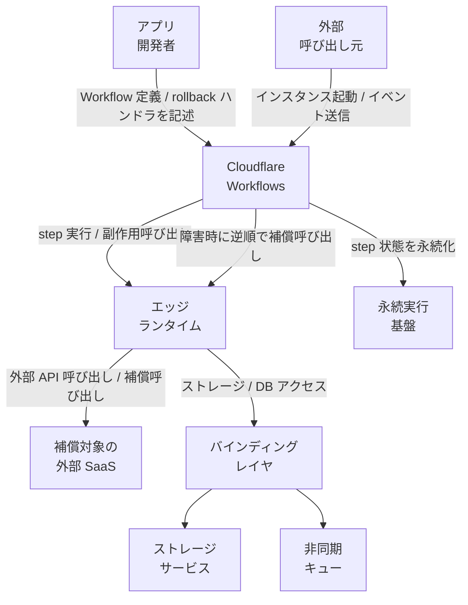
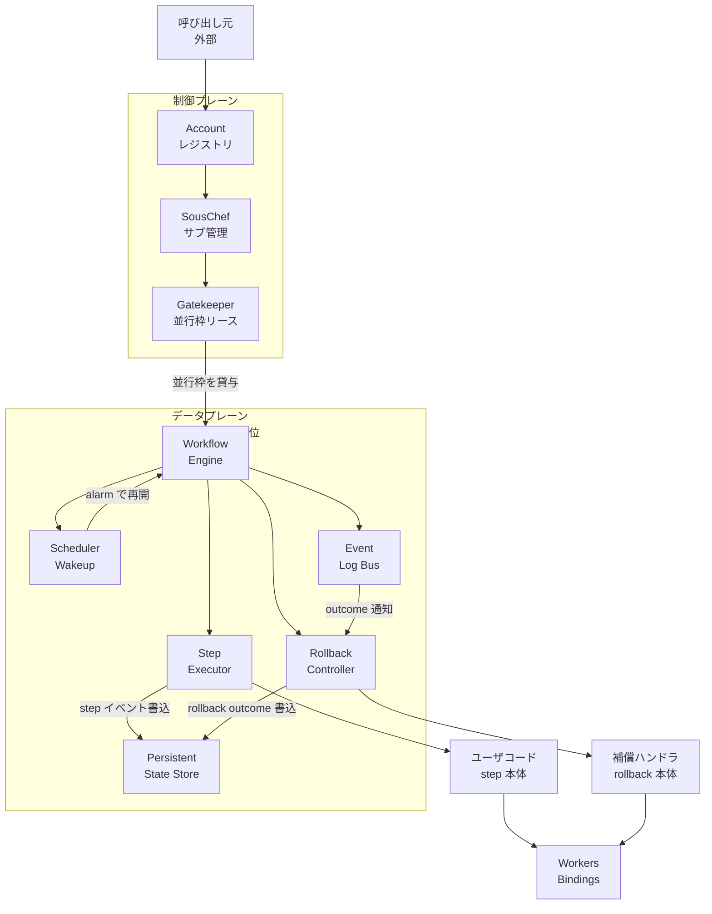
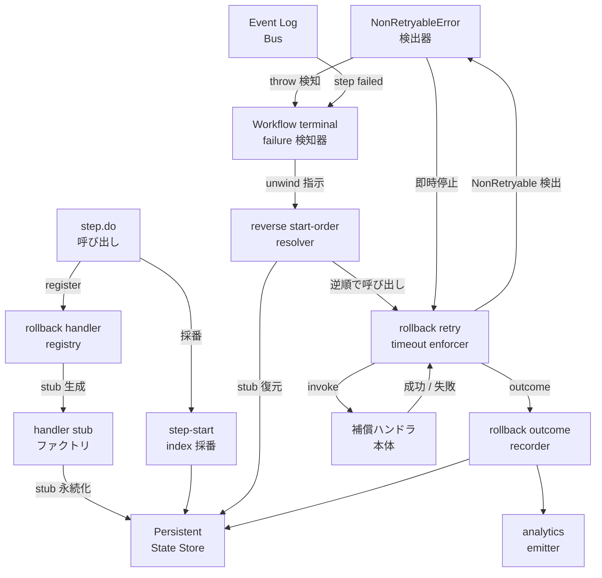
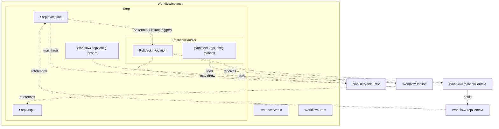
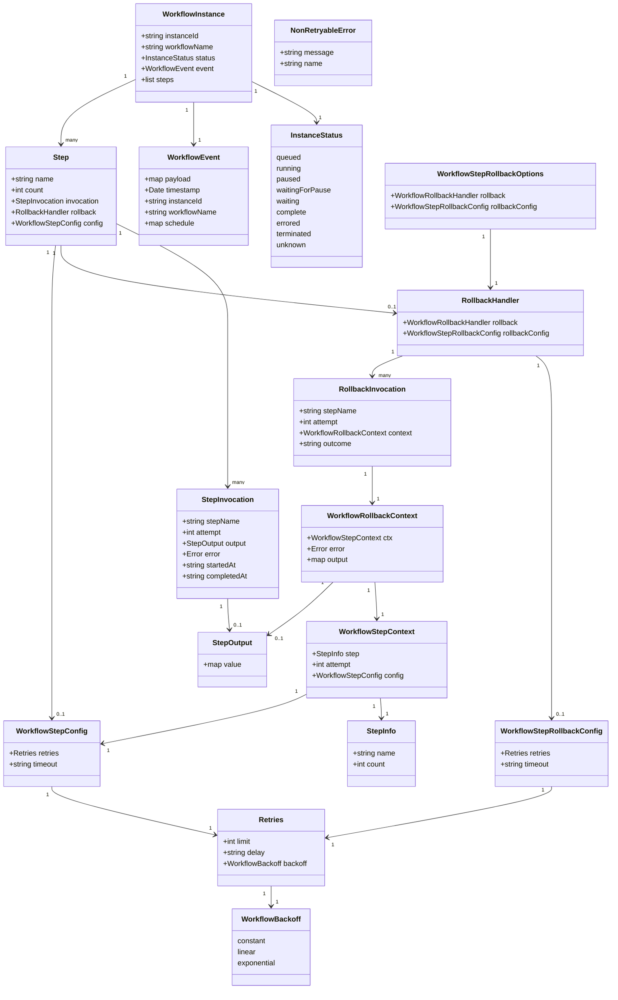

Cloudflare Workflows に 2026 年 6 月 5 日に追加された saga スタイルの補償処理 (rollback) 機能を、構造・データモデル・利用方法・運用観点で整理した技術調査ドキュメントです。

## ■概要

Cloudflare Workflows Rollbacks は、2026 年 6 月 5 日に Cloudflare Workflows プリミティブへ追加された saga スタイルの補償処理 (compensation) 機能です。`step.do()` の第三引数として rollback ハンドラを登録しておくと、Workflow が terminally fail したときに、開始順 (step-start order) の逆順で登録済みハンドラを実行します。

これまで Workflows はステップごとの自動リトライと durable な状態永続化により「失敗した地点から再開できる」durable execution エンジンとして提供されてきました。一方で、外部システムに副作用を残したまま下流ステップが失敗した場合、開発者が手作業で補償ロジックを追跡・実装する必要がありました。Rollbacks 機能は、この補償ロジックを Workflows のプリミティブとして取り込み、retries / timeout / lifecycle イベント / analytics といった既存の運用機構をそのまま流用できるようにしたものです。

公式ブログでは、銀行 A から銀行 B への送金、在庫予約と決済認可、チケット作成、インフラのプロビジョニングなど、複数の外部システムを跨いで副作用を生むユースケースが代表例として挙げられています。

### Cloudflare Workflows そのものの位置づけ

Cloudflare Workflows は、Cloudflare Workers の上に直接構築された durable execution エンジンです。2025 年に一般提供 (GA) となり、その後 control plane を再構築した v2 では同時実行 5 万インスタンス / 毎秒 300 インスタンス生成 / 200 万キューイングまで規模が拡張されました。Rollbacks は、その上に積まれた最新の機能レイヤです。

Workflows と関連プリミティブの関係は次の通りです。

| プリミティブ | 役割 | Rollbacks との関係 |
|---|---|---|
| Cloudflare Workers | リクエスト駆動の実行ランタイム | Workflows / Rollback ハンドラの実行コンテナ |
| Durable Objects | グローバルに単一のステートフルアクター | Workflows インスタンスの永続実行基盤として利用 |
| Cloudflare Workflows | 多段ステップを durable に実行するエンジン | Rollbacks のホスト |
| `step.do()` | 副作用を含むステップを冪等に実行する API | Rollback ハンドラの登録ポイント |
| `step.sleep` / `step.sleepUntil` / `waitForEvent` | 時間・外部イベント待ち | `waitForEvent` の rollback は現状未対応 |

Rollbacks は `step.do(name, callback, rollbackOptions)` というオプション渡しの形を採用し、`step.do()` の戻り値を「将来の値」として扱う既存セマンティクスを壊さない設計になっています。

### SAGA パターン一般との対応

SAGA パターンは、分散システムで 1 つの長期トランザクションを「ローカルトランザクション + 補償トランザクション」の連鎖に分解する設計です。一般的に SAGA の実装パターンは次の 3 つに分類されます。

| 実装パターン | 概要 | 代表例 |
|---|---|---|
| in-step rollback (本機能) | forward step と同じ宣言の中に rollback を埋め込む | Cloudflare Workflows / Restate |
| 別ワークフロー / 別ステート | 失敗時に補償用の別ワークフローへ遷移させる | AWS Step Functions (Catch + 別 State) |
| 別ハンドラ (orchestrator が呼ぶ) | 補償アクティビティをコードレベルで別関数に切り出し orchestrator が逆順に呼ぶ | Temporal (Saga utility) / Azure Durable Functions |

Cloudflare Workflows Rollbacks は、補償ロジックを「forward step のメタデータ」として宣言的に置く in-step rollback 型で、ハンドラには共通の retries / timeout / `NonRetryableError` セマンティクスが適用されます。

### 類似ツールとの比較

#### SAGA サポート方式と実行モデル

| ツール | SAGA サポート方式 | 補償の実行順序 | rollback ごとの retries / timeout | idempotency 機構 | ランタイム |
|---|---|---|---|---|---|
| Cloudflare Workflows Rollbacks | in-step rollback (`step.do` の引数) | reverse step-start order (順次のみ) | `rollbackConfig.retries` / `timeout` を独立指定可能 | `step.do` 戻り値の永続化と replay。冪等性は利用者責務 | Cloudflare Workers |
| Temporal SAGA | コードで `Saga` ユーティリティに補償関数を push、catch で逆順実行 | 登録順の逆順 | activity の retries / timeout を流用 | activity の冪等性は利用者責務 | Temporal Cluster (self-host / Cloud) |
| AWS Step Functions | 各 State に `Catch` を付け、専用の補償 State へ分岐 | 開発者が State Machine 上で配線 | Retry / Catch を State 単位で設定 | DynamoDB 等で利用者が実装 | AWS マネージド |
| Azure Durable Functions | orchestrator 関数内で try/catch して逆順に compensating activity を呼ぶ | 開発者がコードで保証 | activity ごとの retry policy | Durable Task の replay + 利用者責務 | Azure Functions |
| Inngest | compensation 機能は明示プリミティブ未提供 (step.run の例外を捕捉して別 step として補償を書く) | 開発者がコードで保証 | step ごとの retry policy | step 戻り値の永続化 | Inngest クラウド / self-host |
| Trigger.dev v3 | task / subtask の lifecycle hook + try/catch で実装 (専用 saga API は無し) | 開発者がコードで保証 | task 単位の retry / timeout | run の永続化 + 利用者責務 | Trigger.dev クラウド / self-host |
| Restate | try ブロックで compensations 配列に push、catch で逆順実行 (Go は `defer`) | 配列の逆順 | サービス呼び出しの retries を流用 | invocation id ベースの自動 dedupe | Restate サーバ |

#### 観測性とライフサイクル露出

| ツール | rollback ライフサイクルの露出 | 標準ダッシュボード | 代表的な観測項目 |
|---|---|---|---|
| Cloudflare Workflows Rollbacks | instance status に rollback outcome、analytics に lifecycle イベント | Cloudflare Dashboard / Workflows Analytics | rollback 開始 / 完了 / 失敗、step 名、エラー |
| Temporal SAGA | Workflow / Activity の history event | Temporal Web | compensation activity の試行履歴 |
| AWS Step Functions | Execution history / CloudWatch Events | Step Functions コンソール | State 単位の入出力と失敗 |
| Azure Durable Functions | Application Insights / Durable Task hub | Azure Portal | orchestration history |
| Inngest | Run timeline | Inngest Dashboard | step ごとの実行履歴 |
| Trigger.dev v3 | Run inspector | Trigger.dev Dashboard | task 単位の log / retry |
| Restate | invocation log | Restate UI / OTel | invocation 単位の実行履歴 |

#### ユースケース別の推奨

| ユースケース | 推奨される選択肢 | 理由 |
|---|---|---|
| Cloudflare Workers エコシステムでエッジ実行を完結させたい | Cloudflare Workflows Rollbacks | Workers / Durable Objects と同一プラットフォームで完結し、rollback も同一プリミティブで宣言できる |
| 既存の Java / Go / Python サービスから細かな業務制御をしたい | Temporal SAGA | 多言語 SDK、複雑な child workflow / signal / query が必要なケースで成熟 |
| AWS 上で IaC ベースに State Machine を可視化したい | AWS Step Functions | State Machine が JSON / ASL で宣言でき、Catch / Compensation を構成図に落とせる |
| Azure 上で既存の Functions と統合したい | Azure Durable Functions | C# / TypeScript の orchestrator 関数として記述でき、既存 Functions 資産を流用できる |
| マネージドキュー型で前段に置きたい | Inngest / Trigger.dev | event-driven な前段ジョブから書きやすい。一方で saga 専用プリミティブは Cloudflare ほど明示的ではない |
| RPC ベースで API/関数の上に薄く乗せたい | Restate | 補償を try/catch + 配列 push (Go は defer) で書け、invocation id で重複呼びを抑制 |

## ■特徴

- `step.do()` の第三引数として `rollback` ハンドラと `rollbackConfig` を渡し、forward step と同じ宣言の中に補償ロジックを置きます。
- Workflow が terminally fail したとき、登録済み rollback ハンドラを reverse step-start order で順次実行します。完了順ではなく開始順の逆である点が特徴です。
- 失敗した当該 step も rollback ハンドラを登録していれば対象になります。「副作用が一部だけ反映された step」の補償漏れを避けるためです。
- rollback ハンドラ単位に `rollbackConfig.retries` (`limit` / `delay` / `backoff`) と `timeout` を独立に指定でき、forward step の retry policy とは別に運用できます。
- ハンドラの引数は `{ ctx, error, output }` の 3 フィールドで固定されており、`output` は step が永続化に成功していなければ `undefined` になります。step 名は `ctx.step.name` 経由で参照します。「副作用は走ったが永続化前に落ちた」ケースも補償対象として扱えます。
- rollback ハンドラ内で `NonRetryableError` を throw すると、その rollback 自身のリトライを即座に止め、次の rollback に進みます。回復不能な補償失敗を握り続けないための仕組みです。
- リトライ枯渇まで rollback が失敗し続けた場合は、その rollback outcome を `failed` として記録し、以降の rollback を停止して Workflow を `errored` 状態で終了させます。
- Workflows は durable step history を持つため、catch ベースの単純な try/finally と異なり、engine 再起動を跨いでも登録済み rollback ハンドラを replay によって再構築できます。これが persisted step history を使った saga の中核思想です。
- rollback の進行は instance status レスポンスとして露出し、開始 / 失敗 / 完了の lifecycle イベントは Workflows Analytics から追跡できます。Cloudflare Dashboard の通常の Workflows 観測機構に統合されます。
- 公式コード例の通り、forward 側で `NonRetryableError` を throw して即座に Workflow を失敗させ、直前までに登録された rollback ハンドラを開始順の逆で走らせる用法が推奨されます。
- Workflows のステップ上限 (デフォルト 10,000 / 最大 25,000、Workers Free プランは 1,024) や step 戻り値の構造化複製制約 (1 MB 以下) は rollback ハンドラにもそのまま適用されます。

### 現時点の制約

- parallel rollback は未対応で、現在は順次実行のみです。複数 step を並列起動した場合でも、unwind は step-start order の逆で 1 件ずつ走ります。
- `step.waitForEvent` の rollback は未対応です。外部イベント待機のキャンセル / 補償は対象外です。
- Python Workflows での rollback は未対応で、TypeScript / JavaScript の Workers Workflow に限定されています。
- 公式アナウンス時点で、上記 3 点はいずれも今後対応予定として案内されており、現状は本番設計時に明示的に回避策を組み合わせる必要があります。

## ■構造

Cloudflare Workflows の Rollback は、既存の durable execution エンジンに「逆順 unwind」「個別 retry / timeout」「専用 outcome 記録」を追加する形で実装されています。ここでは C4 model に沿って、システム外部との関係 → コンテナ内部 → Rollback Controller のコンポーネントの 3 段階で構造を解説します。

### ●システムコンテキスト図



| 要素 | 説明 |
|---|---|
| アプリ開発者 | Workflow クラスを書き、`step.do()` の第 3 引数で `rollback` ハンドラと `rollbackConfig` を登録する役割 |
| 外部呼び出し元 | HTTP / cron / Queue メッセージ / `waitForEvent` 経由で Workflow インスタンスを起動・進行させる側 (Workers / 外部システム両方) |
| 補償対象の外部 SaaS | 課金プロバイダ・在庫 API・通知サービスなど、副作用を残しうる外部システム。失敗時に rollback ハンドラから補償 API (refund / release / void) が呼ばれる |
| Cloudflare Workflows | Workflow 定義の登録・インスタンス管理・step 実行・状態永続化・rollback unwind を担う durable execution プラットフォーム |
| エッジランタイム | Workflow / step / rollback ハンドラのユーザコードを実行するアイソレート実行環境 |
| 永続実行基盤 | step ごとの開始 / 終了 / output / rollback 登録の有無を SQLite 同等のストアに記録する Durable Object 層 |
| バインディングレイヤ | step 内から外部リソースへアクセスするためのバインディング集合。R2 / D1 / Queues などへの入口 |
| ストレージサービス | オブジェクトストレージ・リレーショナルストアなど、step / 補償処理から読み書きされる耐久ストレージ |
| 非同期キュー | Workflow をトリガする入口、または step から非同期処理を発火する出口として使われるメッセージブローカ |

### ●コンテナ図

Workflows 本体は「制御プレーン (どのインスタンスをどこで動かすか)」と「データプレーン (実際に step を回し状態を持つ)」に分かれます。Rollback はデータプレーン側の Engine に組み込まれます。



| 要素 | 説明 |
|---|---|
| Account レジストリ | アカウント単位で最小限のメタデータと並行上限を管理する制御プレーンの入口。インスタンス作成要求の受け付けを担当 |
| Gatekeeper | アカウント内の同時実行スロットを SousChef へリースするバッチ制リース機構。秒単位で要求を集約し制御プレーンの過負荷を防ぐ |
| SousChef | アカウント内のインスタンス部分集合についてメタデータとライフサイクルを保持するサブマネージャ |
| Workflow Engine | インスタンスごとに 1:1 で起きる Durable Object。そのインスタンスの「存在の唯一の真実 (source of truth)」として、操作を 1 ホップで完結させる |
| Step Executor | `step.do()` / `step.sleep()` / `step.waitForEvent()` を実行し、forward 実行・retry・timeout・replay を司る |
| Scheduler / Wakeup | Durable Object の alarm を使い、sleep 期間・retry backoff・waitForEvent timeout 経過後に Engine を起こす |
| Event / Log Bus | step 開始・完了・失敗・rollback outcome といったイベントを順序付けて配信し、replay の入力にもなる内部ログ |
| Rollback Controller | Workflow が terminal failure に至った時点で起動し、登録済みハンドラを逆順に解決して補償を実行・記録するコンテナ |
| Persistent State Store | step ごとの start / end / output / rollback 登録の有無 / rollback outcome を保存する SQLite 同等のストア |
| Workers Bindings | step / 補償ハンドラから R2 / D1 / Queues / Service Binding / 外部 API へアクセスするための統一インターフェイス |
| ユーザコード (step 本体) | 開発者が書く forward step の本体。副作用はここでのみ起こす |
| 補償ハンドラ (rollback 本体) | 開発者が書く補償処理。`{ ctx, error, output }` を受け取り、対応する副作用を打ち消す |

### ●コンポーネント図

Rollback Controller の中身に踏み込み、`step.do()` 呼び出しから rollback が登録される forward パスと、Workflow が terminal failure に至った時点で unwind されるパスを示します。



| 要素 | 説明 |
|---|---|
| step.do 呼び出し | forward step の宣言。第 3 引数の `rollbackOptions` が渡された場合のみ rollback 経路が起動する |
| rollback handler registry | step 名・start index と rollback ハンドラ stub の対応表。Engine 内に保持され Persistent State Store へ書き出される |
| handler stub ファクトリ | ハンドラ本体への参照を stub (別所で実行されるコードを呼べる小さな参照) として包む。replay 時の再構築の単位 |
| step-start index 採番 | step が開始した順序を単調増加で記録する番号付け。逆順 unwind の唯一の根拠となる |
| Workflow terminal failure 検知器 | forward 側の失敗が Workflow を terminal に落とした時点を Event Log Bus から検知し、Rollback Controller を起動するトリガ |
| NonRetryableError 検出器 | forward でも rollback でも `NonRetryableError` を捕捉し、retry を即座に打ち切るスイッチ |
| reverse start-order resolver | Persistent State Store から rollback ハンドラ stub と start index を読み、開始順の逆向きにキューを組み立てる |
| rollback retry / timeout enforcer | `rollbackConfig` の `retries` (`limit` / `delay` / `backoff`) と `timeout` を forward step とは独立に適用するスケジューラ |
| rollback outcome recorder | 各 rollback ハンドラの成功 / 失敗 / `NonRetryableError` 終了を Persistent State Store にイベントとして書き、後段の Workflow 状態 (Complete / Errored) を確定させる |
| analytics emitter | rollback の成否・件数・所要時間などをアカウント横断の analytics へ送出。観測性とダッシュボード可視化の入口 |
| Persistent State Store | forward step と rollback の両方のイベントを単一のログとして保持し、Engine 再起動時の replay 元となる |
| Event Log Bus | step 開始・完了・失敗・rollback outcome を順序付きで配信し、replay の入力にも terminal failure 検知の入力にもなる |
| 補償ハンドラ本体 | 開発者が書いた `WorkflowRollbackHandler`。`{ ctx, error, output }` を受け取り、対応する外部副作用を打ち消す |

Forward パスは `step.do` 呼び出しで rollback handler を registry に登録し、stub をストアへ永続化する流れで、副作用そのものは forward 側に閉じます。Rollback パスは、Workflow terminal failure 検知をトリガに resolver が start-order を逆順に並べ、enforcer が個別の retry / timeout 設定で各ハンドラを呼び、outcome を recorder が記録 → analytics に流します。replay で Engine が再起動しても、stub と outcome がストアに残っているため二重実行を避けつつ続きから unwind できます。

## ■データ

Cloudflare Workflows Rollback のデータモデルを「概念モデル (エンティティ間の所有・利用関係)」と「情報モデル (主要属性)」の二段で示します。型は公式 workers-api ref を一次情報として採用します。Rollback ハンドラの引数は `WorkflowRollbackContext = { ctx, error, output }` であり、step 名は `ctx.step.name` (`WorkflowStepContext.step.name`) 経由で参照します。

### ●概念モデル

WorkflowInstance を頂点に、forward 実行用の Step (StepInvocation) と、saga 補償のための RollbackHandler (RollbackInvocation) が対になって所有されます。Rollback は forward が terminally fail した時のみ動作し、RollbackContext を介して forward 側の出力・エラーを参照します。



補足:

- 1 つの WorkflowInstance は 0..N の Step を保持し、各 Step は 0..1 の RollbackHandler を持ちます (`step.do` の rollback option を渡したときだけ生成される)。
- WorkflowInstance の terminal fail で、reverse step-start order に Step を辿り、RollbackHandler が登録されている Step だけ RollbackInvocation が走ります。
- RollbackInvocation は `WorkflowRollbackContext` を受け取り、その中の `ctx` (`WorkflowStepContext`) から step 名・attempt・config を参照できます。
- 失敗した当該 Step も rollback 登録があれば RollbackInvocation の対象に含まれます。
- RollbackInvocation 内で `NonRetryableError` が throw されると即座にリトライ停止、Workflow は `errored` で終了します。

### ●情報モデル

公式 API ref の型定義を classDiagram で図解します。WorkflowDuration は string (`"30 seconds"` 等) または number (ミリ秒) を取る合算型として string|number で表記します。



主要属性の典拠:

- **`WorkflowRollbackContext<T = unknown> = { ctx: WorkflowStepContext, error: Error, output: T | undefined }`** — 公式 workers-api ref。forward step が StepOutput を永続化する前に失敗した場合 `output` は `undefined`。step 名・実行コンテキストは `ctx.step.name` / `ctx.attempt` / `ctx.config` で参照する。
- **`WorkflowStepRollbackOptions<T = unknown> = { rollback: WorkflowRollbackHandler<T>, rollbackConfig?: WorkflowStepRollbackConfig }`** — 公式 workers-api ref。
- **`WorkflowRollbackHandler<T = unknown> = (ctx: WorkflowRollbackContext<T>) => Promise<void>`** — 公式 workers-api ref。
- **`WorkflowStepRollbackConfig = Pick<WorkflowStepConfig, "retries" | "timeout">`** — 公式 workers-api ref。`WorkflowStepConfig` から retry / timeout だけを切り出した形。省略すると forward と同じ既定値が適用される。
- **`WorkflowStepConfig = { retries?: { limit, delay, backoff }, timeout? }`** — 公式 workers-api ref。`delay` / `timeout` は WorkflowDuration (string `"30 seconds"` または number ミリ秒)。
- **`WorkflowBackoff = "constant" | "linear" | "exponential"`** — 公式 workers-api ref。
- **`WorkflowEvent<T> = { payload: Readonly<T>, timestamp: Date, instanceId: string, workflowName: string, schedule?: WorkflowCronSchedule }`** — 公式 workers-api ref。`timestamp` は Date オブジェクト。`schedule` は Cron Trigger 起動時のみ存在し `{ cron, scheduledTime }` を含む。
- **`WorkflowStepContext = { step: { name, count }, attempt, config }`** — 公式 step-context ref。forward / rollback いずれの実行コンテキストでも参照可能で、`WorkflowRollbackContext.ctx` の実体でもある。
- **`InstanceStatus`** — 公式 workers-api ref。`queued / running / paused / waitingForPause / waiting / complete / errored / terminated / unknown` の 9 状態。Rollback がリトライ尽きで失敗した場合は `errored` で確定する。
- **`NonRetryableError`** — `cloudflare:workflows` から import。forward 側で throw すると即時 Workflow 失敗 → rollback unwind 開始、rollback 側で throw するとそれ以降のリトライを止める。

`step.do` のオーバーロード上、Step に紐づくのは「forward 用 `WorkflowStepConfig`」と「rollback 用 `WorkflowStepRollbackConfig`」の 2 つで、独立してリトライ・タイムアウトを設定できます。これにより「forward は短いタイムアウトで早く失敗させ、rollback は長めにリトライさせる」といった非対称な耐障害性ポリシーが表現できます。

## ■構築方法

### 前提条件

- Cloudflare アカウント (Workers 有効化済み。Workflows は Workers Free / Paid どちらでも利用可)
- Node.js: `18.0.0` 以上 (Wrangler の要件)
- Wrangler CLI: 4.x 系を推奨 (Workflows binding と rollback API は最新版で安定対応)
- TypeScript: 5.x (公式 starter は TS 構成)
- 言語: **TypeScript / JavaScript のみ**。Python Workflows は現時点で rollback 未対応

バージョン確認:

```bash
node --version          # v18.x 以上
npx wrangler --version  # 4.x
```

### プロジェクト作成 (公式 starter)

最短経路は `cloudflare/workflows-starter` テンプレートから生成する方法です。

```bash
npm create cloudflare@latest -- \
  my-workflow \
  --template=cloudflare/workflows-starter
cd my-workflow
npm install
```

生成される主なファイル:

- `src/index.ts` — Workflow クラス + Worker fetch handler (Workflow を起動するエントリ)
- `wrangler.jsonc` — Workflow binding の宣言
- `package.json` — `wrangler dev` / `wrangler deploy` スクリプト

### `wrangler.jsonc` (または `wrangler.toml`) での Workflows binding

Workflow を Worker から呼び出すには `workflows` binding を宣言する必要があります。`name` (binding 名) と `class_name` (Workflow クラス名) を Worker 内の `env.<BINDING>` に紐づけます。

`wrangler.jsonc` の例:

```jsonc
{
  "name": "my-workflow",
  "main": "src/index.ts",
  "compatibility_date": "2026-06-01",
  "workflows": [
    {
      "name": "billing-workflow",
      "binding": "BILLING_WORKFLOW",
      "class_name": "BillingWorkflow"
    }
  ]
}
```

`wrangler.toml` で書く場合:

```toml
name = "my-workflow"
main = "src/index.ts"
compatibility_date = "2026-06-01"

[[workflows]]
name = "billing-workflow"
binding = "BILLING_WORKFLOW"
class_name = "BillingWorkflow"
```

Workflow クラス名 (`class_name`) を後で変更する場合、新規 binding として扱うため migration が必要になります。初回設計時に確定させてください。

### Workflow クラスの最小定義

`WorkflowEntrypoint` を継承し、`run(event, step)` を実装します。これが「rollback を追加する前のスケルトン」になります。

```typescript
// src/index.ts
import { WorkflowEntrypoint, WorkflowEvent, WorkflowStep } from "cloudflare:workers";

type Env = {
  BILLING_WORKFLOW: Workflow;
};

type Params = {
  customerId: string;
  amount: number;
};

export class BillingWorkflow extends WorkflowEntrypoint<Env, Params> {
  async run(event: WorkflowEvent<Params>, step: WorkflowStep) {
    const { customerId, amount } = event.payload;

    const charge = await step.do("create charge", async () => {
      // 副作用 (API 呼び出し / DB 書き込み) は必ず step.do の中で
      return { chargeId: `ch_${customerId}_${event.instanceId}` };
    });

    return { ok: true, chargeId: charge.chargeId };
  }
}

// Worker fetch handler から Workflow を起動するエントリ
export default {
  async fetch(req: Request, env: Env): Promise<Response> {
    const instance = await env.BILLING_WORKFLOW.create({
      params: { customerId: "cus_123", amount: 1000 },
    });
    return Response.json({ id: instance.id });
  },
};
```

### ローカル開発とデプロイ

```bash
# ローカル開発 (Miniflare ベース。Workflows もローカル実行可)
npx wrangler dev

# 本番デプロイ
npx wrangler deploy

# Workflow インスタンスを CLI から手動起動
npx wrangler workflows trigger billing-workflow '{"customerId":"cus_123","amount":1000}'

# 実行状況・履歴 (rollback の発火確認はここから dashboard へ遷移)
npx wrangler workflows list
npx wrangler workflows instances list billing-workflow
```

`wrangler dev` 中も Workflow は実体としてローカル実行されるため、rollback ハンドラの動作確認もローカルで完結します。

## ■利用方法

### API 必須パラメータ早見表

| API | 必須引数 | 任意引数 | 戻り値 |
|---|---|---|---|
| `step.do(name, callback)` | `name`, `callback` | - | `Promise<T>` |
| `step.do(name, config, callback)` | `name`, `config`, `callback` | - | `Promise<T>` |
| `step.do(name, callback, rollbackOptions)` | `name`, `callback` | `rollbackOptions` | `Promise<T>` |
| `step.sleep(name, duration)` | `name`, `duration` | - | `Promise<void>` |
| `step.sleepUntil(name, timestamp)` | `name`, `timestamp` | - | `Promise<void>` |
| `step.waitForEvent(name, options)` | `name`, `options.type` | `options.timeout` | `Promise<void>` |

補足型 (公式 workers-api ref から):

```typescript
type WorkflowRollbackContext<T = unknown> = {
  ctx: WorkflowStepContext;
  error: Error;
  output: T | undefined;
};

type WorkflowRollbackHandler<T = unknown> = (
  ctx: WorkflowRollbackContext<T>,
) => Promise<void>;

type WorkflowStepRollbackOptions<T = unknown> = {
  rollback: WorkflowRollbackHandler<T>;
  rollbackConfig?: WorkflowStepRollbackConfig;
};

// rollback は forward step config から retries / timeout のみを取り出した構造
type WorkflowStepRollbackConfig = Pick<WorkflowStepConfig, "retries" | "timeout">;

type WorkflowStepConfig = {
  retries?: {
    limit: number;
    delay: string | number;
    backoff?: "constant" | "linear" | "exponential";
  };
  timeout?: string | number;
};

// rollback ハンドラから step 名・attempt・config にアクセスするコンテキスト
type WorkflowStepContext = {
  step: { name: string; count: number };
  attempt: number;
  config: WorkflowStepConfig;
};
```

### `step.do()` の 3 オーバーロード

- **(1) 名前のみ**: 最も単純。デフォルトの retry / timeout が適用される。
- **(2) config 付き**: 中央引数で `retries` / `timeout` を上書き。rollback はなし。
- **(3) rollback 付き**: 第 3 引数に `{ rollback, rollbackConfig }` を渡し、saga 補償を登録する。

```typescript
// (1) 名前のみ
await step.do("simple step", async () => {
  return await doSomething();
});

// (2) config 付き (forward retry/timeout のみ)
await step.do(
  "configured step",
  { retries: { limit: 5, delay: "10 seconds", backoff: "exponential" }, timeout: "1 minute" },
  async () => {
    return await flakeyApi();
  },
);

// (3) rollback 付き
await step.do(
  "step with rollback",
  async () => {
    return await reserveResource();
  },
  {
    rollback: async ({ ctx, output, error }) => {
      // step 名は ctx.step.name で参照 (例: console.log(ctx.step.name))
      await releaseResource((output as { id: string }).id);
    },
  },
);
```

### rollback ハンドラの最小コード例 (BillingWorkflow)

公式 docs の BillingWorkflow をそのまま最小例として使います。`output` には forward step の戻り値が入り、`error` には Workflow を fail させた直接原因の Error が入ります。

```typescript
import { WorkflowEntrypoint } from "cloudflare:workers";

export class BillingWorkflow extends WorkflowEntrypoint {
  async run(_event, step) {
    await step.do(
      "create charge",
      async () => {
        const charge = await createCharge();
        return { chargeId: charge.id };
      },
      {
        rollback: async ({ ctx, output, error }) => {
          const { chargeId } = output as { chargeId: string };
          await refundCharge(chargeId, {
            reason: `${ctx.step.name}: ${error.message}`,
          });
        },
        rollbackConfig: {
          retries: {
            limit: 3,
            delay: "30 seconds",
            backoff: "linear",
          },
          timeout: "5 minutes",
        },
      },
    );
  }
}
```

### rollback + idempotency キーを使った銀行間送金 SAGA

副作用を伴う送金処理は、forward 側も rollback 側も **idempotency key** を渡して二重実行を防ぎます。Workflows は engine 再起動で step.do 外のコードが複数回走り得るため、idempotency key は step.do の戻り値 (= 永続化される) に組み込むのが安全です。

```typescript
import { WorkflowEntrypoint, WorkflowEvent, WorkflowStep } from "cloudflare:workers";

type Env = { TRANSFER_WORKFLOW: Workflow };
type Params = { fromAccount: string; toAccount: string; amount: number };

export class TransferWorkflow extends WorkflowEntrypoint<Env, Params> {
  async run(event: WorkflowEvent<Params>, step: WorkflowStep) {
    const { fromAccount, toAccount, amount } = event.payload;

    // 1) 送金元口座から引き落とし
    const debit = await step.do(
      "debit source account",
      async () => {
        const idempotencyKey = `debit:${event.instanceId}:${fromAccount}`;
        const tx = await bankApi.debit({ account: fromAccount, amount, idempotencyKey });
        return { txId: tx.id, idempotencyKey };
      },
      {
        rollback: async ({ output }) => {
          if (output === undefined) return;
          const { txId, idempotencyKey } = output as { txId: string; idempotencyKey: string };
          // 逆向き credit に compensating idempotency key を付与
          await bankApi.credit({
            account: fromAccount,
            amount,
            idempotencyKey: `compensate:${idempotencyKey}`,
            reverseOf: txId,
          });
        },
        rollbackConfig: {
          retries: { limit: 5, delay: "30 seconds", backoff: "exponential" },
          timeout: "10 minutes",
        },
      },
    );

    // 2) 送金先口座へ入金
    await step.do(
      "credit destination account",
      async () => {
        const idempotencyKey = `credit:${event.instanceId}:${toAccount}`;
        const tx = await bankApi.credit({ account: toAccount, amount, idempotencyKey });
        return { txId: tx.id };
      },
      {
        rollback: async ({ output }) => {
          if (output === undefined) return;
          const { txId } = output as { txId: string };
          await bankApi.debit({
            account: toAccount,
            amount,
            idempotencyKey: `compensate:${txId}`,
            reverseOf: txId,
          });
        },
      },
    );

    return { ok: true, debitTx: debit.txId };
  }
}
```

ポイント:

- forward 用 idempotency key を step の戻り値に格納し、rollback ハンドラはそれを読んで compensating key を派生させる。
- rollback は **reverse step-start order** で発火するため、上の例では「2) credit → 1) debit」の順で補償が走る。
- `event.instanceId` は Workflow インスタンス単位でユニーク。日付や `Date.now()` を idempotency key に混ぜると step がリプレイされたときに値が変わるので使わない (deterministic 必須)。

### `NonRetryableError` で即時 fail + rollback 起動

forward step のリトライをスキップして直ちに Workflow を terminally fail させたい場合、`cloudflare:workflows` の `NonRetryableError` を throw します。これで登録済みの rollback ハンドラが reverse 順に走ります。

```typescript
import { WorkflowEntrypoint } from "cloudflare:workers";
import { NonRetryableError } from "cloudflare:workflows";

export class OrderWorkflow extends WorkflowEntrypoint {
  async run(_event, step) {
    await step.do(
      "reserve inventory",
      async () => {
        const reservation = await reserveInventory();
        return { reservationId: reservation.id };
      },
      {
        rollback: async ({ output }) => {
          const { reservationId } = output;
          await releaseInventory(reservationId);
        },
        rollbackConfig: {
          retries: { limit: 3, delay: "10 seconds", backoff: "linear" },
          timeout: "2 minutes",
        },
      },
    );

    await step.do("charge card", async () => {
      // ここで NonRetryableError を投げると forward retry をスキップして即 fail。
      // 直前までに rollback 登録した "reserve inventory" が補償実行される。
      throw new NonRetryableError("payment processor rejected the charge");
    });
  }
}
```

### 並列 step (`Promise.all`) と rollback ハンドラ登録

複数 step を並列に開始することは可能で、それぞれに rollback ハンドラを登録できます。**ただし現状の rollback 実行は sequential** (reverse step-start order の逐次) で、parallel rollback は未対応 (今後対応予定) です。

```typescript
import { WorkflowEntrypoint } from "cloudflare:workers";

export class FanoutWorkflow extends WorkflowEntrypoint {
  async run(_event, step) {
    // 3 つのリソース確保を並列に開始 (start order は宣言順)
    const [a, b, c] = await Promise.all([
      step.do(
        "reserve A",
        async () => ({ id: await reserveA() }),
        { rollback: async ({ output }) => { await releaseA((output as any).id); } },
      ),
      step.do(
        "reserve B",
        async () => ({ id: await reserveB() }),
        { rollback: async ({ output }) => { await releaseB((output as any).id); } },
      ),
      step.do(
        "reserve C",
        async () => ({ id: await reserveC() }),
        { rollback: async ({ output }) => { await releaseC((output as any).id); } },
      ),
    ]);

    // 後段の commit が失敗すると上 3 件の rollback が
    // "reserve C" → "reserve B" → "reserve A" の逆順で **逐次** 実行される。
    await step.do("commit transaction", async () => {
      await commit(a.id, b.id, c.id);
    });
  }
}
```

制約まとめ:

- 並列開始した step も rollback は逐次 (sequential rollback)。同時に compensating API を撃ちたい場合は、当面 rollback ハンドラ内で `Promise.all` を組むか、設計で逐次でも回るようにする。
- 並列 rollback (parallel rollback) は公式ロードマップ上で「今後対応予定」。

### `rollbackConfig` で retries / timeout / backoff を変える

forward step の retry / timeout とは独立に、rollback ハンドラのリトライ挙動を設定できます。「forward は速い retry、rollback はゆっくり粘る」といったポリシー分離が可能です。

```typescript
await step.do(
  "external write",
  async () => {
    return await externalWrite();
  },
  {
    rollback: async ({ output }) => {
      await externalDelete((output as any).id);
    },
    rollbackConfig: {
      retries: {
        limit: 10,             // 補償はしつこくリトライ
        delay: "1 minute",     // 1 分間隔
        backoff: "exponential" // 1m → 2m → 4m ... と指数バックオフ
      },
      timeout: "30 minutes",   // 1 回の rollback ハンドラ実行は最大 30 分
    },
  },
);
```

rollback ハンドラ内で `NonRetryableError` を throw すると、`rollbackConfig.retries.limit` を待たずに即座に rollback リトライを停止し、その rollback outcome は `failed` として記録されます (→ Workflow は `errored` 終了に向かう)。

### `step.waitForEvent` の例 (rollback 未対応の注記)

`step.waitForEvent` は外部イベント (Webhook 等) で Workflow を起こすための API です。`options.type` は最大 100 文字のイベント識別子、`options.timeout` は省略時 24 時間です。**現時点で rollback ハンドラを attach する 3 引数オーバーロードは未対応**です。waitForEvent step そのものに補償処理を登録したい場合は、現状は `step.do` で wrap して中で `step.waitForEvent` 待ちのキャンセル処理を回す等の設計回避が必要です。

```typescript
import { WorkflowEntrypoint } from "cloudflare:workers";

export class ApprovalWorkflow extends WorkflowEntrypoint {
  async run(_event, step) {
    await step.do("send approval request", async () => {
      await sendApprovalEmail();
      return { sent: true };
    });

    // 承認イベントを最大 24h 待つ (デフォルト)。
    // 注意: 現状 step.waitForEvent には rollback ハンドラを直接 attach できない。
    await step.waitForEvent("await approval", {
      type: "approval.received",
      timeout: "24 hours",
    });

    await step.do("finalize", async () => {
      await finalize();
    });
  }
}
```

参考: `step.sleep` / `step.sleepUntil` は副作用を持たないため rollback の対象外で、これらに rollback を付ける API も存在しません。

## ■運用

稼働中の Workflow インスタンスをどう観察・制御するか、観測軸はどう分けるかを整理します。

### インスタンス状態の確認

- 単一インスタンスの完全な実行履歴 (step ごとの retry / output / error / rollback outcome) を見るには `wrangler workflows instances describe`。Dashboard でも同等情報が見えますが、CI / オペレータ向けには CLI が速いです。
- インスタンス一覧と現在の status は `wrangler workflows instances list`。`--status` で `errored` / `paused` のような分類で絞り込み、巡回モニタリングで使います。
- インスタンス status は次の列挙値: `queued` / `running` / `paused` / `errored` / `terminated` / `complete` / `waiting` (sleep / event 待ち) / `waitingForPause` / `unknown`。
- **rollback 実行中は status が `running` のまま**で互換性が保たれます。完了後に instance の `rollback` プロパティ (各 rollback step の outcome) を見て compensation 成否を判断します。

```bash
# 単一インスタンスを掘る (latest は最後に起動したもの)
npx wrangler workflows instances describe billing-workflow latest \
  --step-output --truncate-output-limit 20000

# errored だけ一覧化 (rollback が失敗した、または rollback ハンドラ未登録)
npx wrangler workflows instances list billing-workflow --status errored

# 動いている / 待っているものだけ見る
npx wrangler workflows instances list billing-workflow --status running
npx wrangler workflows instances list billing-workflow --status waiting
```

### ログ確認 (リアルタイム)

- `wrangler tail` で Workflow の Worker stdout / stderr とエラーを stream できます。`console.log` を step 内で吐いていれば、ここに反映されます。
- step.do 外の `console.log` は **engine 再起動で複数回出る**ことがあるので、ログを 1 回限りにしたい場合は必ず step 内に閉じ込めます (rules-of-workflows)。
- Dashboard 側の Real-time logs / Logs Explorer は履歴検索と filter (workflow name, instance id, severity) に向きます。インシデント発生後の調査は dashboard、稼働中の watch は `wrangler tail` と使い分けます。

```bash
# Workflow の Worker をライブ tail
npx wrangler tail --format pretty

# instance id で絞り込みたい場合は jq で filter
npx wrangler tail --format json | jq 'select(.event.workflowInstanceId == "<ID>")'
```

### 一時停止 / 再開 / 終了

- 既に走っているインスタンスへの介入は 3 つ: `pause` / `resume` / `terminate`。
- `terminate` で止めても **rollback は走りません**。rollback は「Workflow 自身が terminal failure に至った時」だけ発火する設計のため、運用者が「資金引き落としは戻したい」と思って `terminate` しても自動補償は起きません。補償が必要な状況なら、まず未捕捉 exception を起こさせる (例: feature flag で fail-fast パスを ON にする) か、別途オペレーション Workflow で補償を流します。
- `pause` は次の step.do に入る境界で停止します。`resume` で続行。長時間メンテ・依存サービス障害時の傷口拡大防止に使います。

```bash
# メンテ中に止める
npx wrangler workflows instances pause billing-workflow <ID>

# 復旧後に再開
npx wrangler workflows instances resume billing-workflow <ID>

# どうしようもなく止める (rollback は起きない)
npx wrangler workflows instances terminate billing-workflow <ID>
```

### rollback の lifecycle イベント

ロールバックは Workflow 全体ライフサイクルの一部として記録されます。観測軸は最低 3 つに分けて取ります:

1. **forward 失敗 (= rollback トリガー)**: どの step が terminal failure したか。`describe` の error フィールド + step name で識別。
2. **各 rollback step の outcome**: 成功 / `failed` (リトライ枯渇または `NonRetryableError` で即停止)。reverse start-order で並ぶ。公式ブログは枯渇ケースの outcome 値として `failed` を明記しており、`NonRetryableError` で止まったケースも同じく失敗扱いとして以降の rollback を停止する。
3. **rollback 全体の終了状態**: 全 compensation 成功 → instance は `complete` ではなく `errored` で終わる (forward が失敗している以上、最終 status は失敗扱い)。compensation が枯渇した場合も `errored` だが、ハンドラ側の error 情報が残る。

rollback は Workflow が失敗した「理由」ではなく、失敗した「後に」Workflows が何をしたかであり、forward 失敗と rollback 失敗は別の事象として記録されます。アラート設計でもこの 2 軸を混ぜません。

### analytics で forward 失敗と rollback 失敗を区別する

メトリクス・ログを分けて取らないと「決済が失敗した件数」と「決済の取り消しに失敗した件数」が混ざります。次の観測軸を分けて持ちます。

| 観測したい事象 | 取り方 |
|---|---|
| forward step の failure 件数 | `wrangler workflows instances list --status errored` の件数、または `describe` の step outcome を集計 |
| rollback step の failure 件数 | `describe` の rollback section で `outcome=failed` の step 数。インスタンス単位で集計して critical アラート対象に |
| rollback が完走したのに `errored` で終わったインスタンス | forward 失敗の原因切り分け用。ビジネスロジック修正の優先度を決める input |
| rollback が枯渇した (compensation 不能) インスタンス | **最優先で手動介入**。決済戻し失敗・在庫戻し失敗などはオペレータが直接補償する必要あり |

実装上は Workflow から構造化ログ (`console.log(JSON.stringify({ phase: 'rollback', step, outcome }))`) を吐き、Logpush で BigQuery / R2 に流して集計するパターンが現実的です。

### バージョン更新と in-flight インスタンス

- Workflow コードを `wrangler deploy` で更新しても、**既に走っている (in-flight) インスタンスは古いバージョンのコードで実行を続けます**。これは Durable Object と同じで、replay 中の整合性を担保するためです。
- 新しいインスタンスから新コードが反映されます。
- rollback ハンドラを後から追加した場合、既存 in-flight インスタンスには適用されません。「rollback ハンドラを忘れていた」ことに気づいたら、**その時点で走っているインスタンスは旧コード前提で完走させ、新規からハンドラ込みで運用**という方針になります。
- step 名を変えるリリース (= deterministic cache key を変える) は in-flight インスタンスの replay を壊しうるので避けます。どうしても変える場合は新 Workflow class を生やしてマイグレーションします。

## ■ベストプラクティス

### 不可逆副作用カテゴリと compensation 設計の対応

「rollback を書く」とは、forward 副作用ごとに「巻き戻し方を先に決める」ことです。現場頻出カテゴリで対応を表にまとめます。

| 副作用カテゴリ | forward (やること) | rollback (補償) | idempotency 戦略 |
|---|---|---|---|
| 課金 (Stripe / PSP) | `charge(amount, idempotencyKey)` | `refund(chargeId, reason)` | forward と rollback の両方で **異なる idempotency key** を持つ。例: `${txId}:charge` と `${txId}:refund` |
| 在庫予約 | `reserveInventory(skus)` → `reservationId` | `releaseInventory(reservationId)` | `reservationId` を output として永続化、release は何回呼んでも OK な API を選ぶ |
| 通知送信 (push / email 即時系) | `sendNotification(userId, payload)` | 取り消し API があれば `cancelNotification(notifId)`、無ければ「**訂正通知**」を別途送る (compensating notification) | 取り消しは送信 ID 単位の冪等性。訂正通知は文面に「先ほどの通知は取り消されました」と明示 |
| 登録 / 更新 | `createOrder(...)` → `orderId` | `archiveOrder(orderId)` / soft-delete + audit log | 物理削除でなく **soft-delete + audit** で証跡を残す。再実行で同じ archive 操作が冪等 |
| インフラ provision | `provisionDB(...)` → `dbId` | `teardownDB(dbId)` | resource id ベースの teardown、既に消えていれば 404 を成功扱い |
| メール / 物理出荷 / FAX 送付 | (送ったら戻せない) | **rollback 不可** → 前段で止める | 後述の「Undo 不可カテゴリ」へ |
| 外部 webhook 発火 | `POST partner-webhook` | 取り消し webhook を別途送る (相手が対応していれば) | partner 側が冪等性を保証していない場合は、forward 前に partner に「予約発火」だけ送り、確定 webhook は最後に送る (TPC 風) |

### Undo 不可カテゴリ — 前段で止める

メール送信 / SMS / 物理出荷 / 法的通知 など **送ったら戻せない副作用** は rollback で消せません。設計時に次のいずれかで「失敗が起こりうる窓を閉じる」ことが必要です。

- **人間承認 gating**: `step.waitForEvent` で operator approval を挟み、承認後に「もう戻せない step」を実行する。
- **dry-run**: 直前の step で全前提を検証する dry-run API を呼び、成功した場合のみ本実行へ進む。
- **two-phase commit パターン**: 「予約 → 全 step OK が確認できたら確定」の 2 段にする。予約段階なら取り消し可能。
- **後段に集約**: 不可逆 step を Workflow の最後に置く。直前まで rollback で巻き戻せる状態を保ち、最後の不可逆 step だけは「失敗したら人間が後追い」と割り切る。

### idempotency key の階層化設計

forward と rollback で同じ key を使うと「rollback 自身の再実行」と「forward の再実行」を区別できなくなります。階層化して持ちます。

```typescript
// 良い例: transferId をルートに、phase と step 名を suffix で持つ
const idemForward  = `${transferId}:debit-account-a`;
const idemRollback = `${transferId}:rollback:debit-account-a`;

await step.do('debit-account-a', async () => {
  return await bankApi.debit(accountA, amount, { idempotencyKey: idemForward });
}, {
  rollback: async ({ output }) => {
    if (output === undefined) return;             // 永続化前失敗は何もしない
    await bankApi.credit(accountA, amount, {
      sourceTxId: output.txId,
      idempotencyKey: idemRollback,
    });
  },
  rollbackConfig: { retries: { limit: 5, delay: '30 seconds', backoff: 'exponential' }, timeout: '5 minutes' },
});
```

- key は **deterministic** に作る (= `crypto.randomUUID()` を使わない)。Workflow instance id / 業務 id をルートにする。
- step 名は cache key と二重利用なので、idempotency key と一緒に管理して命名ぶれをなくす。

### rollback ハンドラを冪等にする

- rollbackConfig.retries で複数回呼ばれうる。「2 回目以降は no-op」「相手が既に refund 済みなら成功扱い」で受ける。
- 例: refund API が 409 Conflict (already refunded) を返したら成功として扱う。

```typescript
rollback: async ({ output, error }) => {
  if (output === undefined) return;
  try {
    await psp.refund(output.chargeId, { idempotencyKey: `${txId}:refund` });
  } catch (e) {
    if (e.status === 409 && /already.*refunded/i.test(e.body)) return;  // 冪等成功
    throw e;
  }
}
```

### rollback ハンドラ内で `NonRetryableError` を使うタイミング

- rollback の retry を即停止したいのは、**「リトライしても永久に直らない」と確証が持てた時**のみ。
  - 例: 対象 charge が既に dispute (チャージバック) で凍結されている → refund 不可能 → 人間介入待ち。
  - 例: 在庫が物理的に出荷済みで release 不能 → 別ワークフローへエスカレーション。
- `NonRetryableError` を投げると rollback chain がそこで止まり instance は `errored` で終わります。**以降の rollback step は実行されない**ので、「ここから先は人間が手で巻き戻す」と決めた境界で投げます。
- 逆に「ネットワーク一時失敗・5xx」では絶対に投げない (リトライで自然回復する)。

```typescript
import { NonRetryableError } from 'cloudflare:workflows';

rollback: async ({ output }) => {
  const r = await psp.refund(output.chargeId, { idempotencyKey: rollbackKey });
  if (r.status === 'dispute_locked') {
    throw new NonRetryableError(`refund blocked by dispute on ${output.chargeId} — needs manual ops`);
  }
}
```

### 並列 step (Promise.all + 複数 step.do) の rollback

- 現状 rollback 実行は **sequential** (reverse start-order)。`Promise.all([step.do(A), step.do(B)])` で A と B を並列に走らせても、rollback は B → A の順で **1 つずつ** 流れます。
- 並列で fan-out して何十件も rollback を打つ設計だと、rollback フェーズが直列に積まれて長時間化します。並列度が高い fan-out では「1 つの step.do の中で `Promise.all([...])` で副作用を束ね、rollback ハンドラ側で同じ束を並列に巻き戻す」のもパターンの 1 つです (ただし冪等性は step 単位で担保する必要あり)。
- 「parallel rollback」は将来対応予定。それまでは並列 step を安易に増やさないようにします。

### 「成功手順より先に補償手順を設計する」

- forward を書く前に rollback を先に書く規律。forward が決まる → rollback が後追い、だと **不可逆副作用の混入を見落とします**。
- レビュー時のチェックリスト:
  - 各 step.do に対し「失敗したら何をすれば原状回復できるか」が言語化されているか
  - rollback できない副作用が forward chain の **中盤** に紛れていないか (中盤に置くと、それより後の step 失敗時に巻き戻せない不可逆操作が残る)
  - rollback 中に呼ぶ依存サービスの SLA / レイテンシ / 冪等性が forward と同等以上か

### catch ブロックでは握りつぶさない

- step.do を try / catch で握って continue すると **Workflow は terminal failure に至らない** → rollback は発火しません。
- 「リトライで救えるかも」を狙うなら step.do の `retries` config を使います (rollback と独立にリトライ設定できる)。
- 業務上「失敗してもこの step は無視して良い」のなら、そもそも rollback ハンドラを付けない / 補償不要な操作にする方が安全です。中途半端に catch して握ると forward 失敗の観測も失われます。

```typescript
// NG: 握りつぶして rollback が発火しない
try {
  await step.do('charge', chargeFn, { rollback: refundFn });
} catch (e) {
  console.error(e);
  // ← ここで return すると refundFn は呼ばれない
}

// OK: そのまま throw させる (Workflow は失敗、rollback chain が発火)
await step.do('charge', chargeFn, { rollback: refundFn });
```

### step 数上限と sleep の扱い

- 1 Workflow instance あたりの step 上限は **デフォルト 10,000 / 最大 25,000** (構成変更時)。Workers Free プランでは **1,024 step** に制限されます。
- `step.sleep` / `step.sleepUntil` は **この上限にカウントされない**。長期 saga (請求の月次バッチ等) で sleep を多用しても安心。
- rollback handler の実行は forward step 数とは別カウントで、rollback config の retries 分はカウント計算が異なります。saga の forward を 9,999 step まで膨らませると rollback で詰むので、実用上は 1 saga = 100 step 以下に抑える設計が無難です。

### deterministic 制約 (step 名)

- step 名 = cache key。`Date.now()` / `Math.random()` / `crypto.randomUUID()` を含めると replay 時に同じ key が再構築できず壊れます。
- ループで動的に名前を作る場合は **入力配列が deterministic** であることを保ちます (event.payload や前 step の output から派生させる)。
- rollback ハンドラの中で step.do を呼ぶ場合 (ネスト) も同じルールです。

### Workflow secret の管理

- rollback ハンドラから refund API を叩くための API key は **Workers secrets** で管理 (`wrangler secret put`)。コードに埋め込みません。
- 大規模 / マルチ環境では **Cloudflare Secrets Store** にまとめてバインディング経由でアクセスします。
- forward と rollback で同じ secret を使うケースが多いですが、PSP によっては「refund-only key」を発行できるため、rollback だけ scope を絞ったキーを使うと事故時の被害を抑えられます。

## ■トラブルシューティング

症状 → 原因 → 対処の対応表です。

| 症状 | 主な原因 | 対処 |
|---|---|---|
| rollback が発火しない | ① catch で error を握りつぶしている / ② Workflow が terminal failure に至っていない / ③ rollback ハンドラが該当 step に登録されていない | `describe` で instance status を確認し、`errored` でないなら catch を疑う。`errored` ならハンドラ登録忘れを疑う |
| rollback が無限リトライする | `rollbackConfig.retries` 未設定で既定の再試行が継続している、もしくは limit が大きすぎる | `rollbackConfig.retries = { limit: 3〜5, delay: '30 seconds', backoff: 'exponential' }` を明示。永続失敗なら `NonRetryableError` を投げる |
| rollback で `output` が `undefined` | step が出力を永続化する前に失敗した (forward 関数の内部で例外) | rollback ハンドラ冒頭で `if (output === undefined) return;` を必須にする。または `output?.chargeId` を optional chaining で扱う |
| rollback の順序が想定と違う | reverse **start-order** を completion-order と誤解している | `Promise.all` で並列起動した場合も start order の逆順で unwind。`describe` の step timeline を見て start 順を確認 |
| 並列起動した step の片方の rollback が実行されない | 起動はしたが forward 関数本体に入る前に Workflow が失敗 / rollback ハンドラが未登録 | start order に乗ったかは `describe` で確認。乗っていれば登録漏れ、乗っていなければ並列起動より早い fail-fast パスを疑う |
| Workflow が `errored` で止まる (rollback 完走したのに) | forward 失敗が原因。rollback は成功している | これが **正常動作**。forward 側のロジック / 外部 API 障害を修正する。rollback 成功は `describe` の rollback section で確認 |
| Workflow が `errored` で止まる (rollback が枯渇) | rollback ハンドラがリトライ上限まで失敗 → 以降の rollback が停止 | `describe` で **どの rollback step が `failed` か**を確認。compensation 不能なら人間が補償オペを実施。原因 step の API レスポンスを精査して `NonRetryableError` を明示すべきだったかも検討 |
| `step.waitForEvent` の rollback が登録できない | **現状未対応** (将来対応予定) | 待ち合わせ step の代わりに「待ち合わせ → 業務副作用」を 2 step に分け、副作用 step の側に rollback を付ける |
| Python Workflows で rollback 引数が型エラー | **Python Workflows の rollback は現状未対応** (TypeScript のみ) | TypeScript Workflow に移すか、Python から TS Workflow を `instance.create()` で呼ぶ |
| rollback 実行中に instance status が `running` のまま | これは仕様 (互換性のため) | rollback 中であることは `describe` の rollback section の存在で判断 |
| `terminate` したのに補償が走らない | `terminate` は rollback を起こさない (terminal failure ではなくユーザ介入での停止) | 補償が必要なら別 Workflow で手動補償フローを流す。あるいは Workflow 内で fail-fast の経路を仕込んでから `terminate` ではなく自然失敗を起こさせる |
| 新バージョンに rollback ハンドラを足したのに古い in-flight には適用されない | in-flight は旧コードで replay 継続する仕様 | 旧コード前提で完走させる。新規 instance から有効。手動補償が必要なら別途オペレーション Workflow を流す |
| rollback ハンドラ内で `console.log` が複数回出る | rollback がリトライされている / rollback ハンドラが engine 再起動でリプレイされた | step 内部に閉じ込めれば 1 度しか出ない。step 外の `console.log` は重複し得る (rules-of-workflows 仕様) |

## ■まとめ

Cloudflare Workflows Rollbacks は、`step.do()` の第三引数として補償ハンドラを宣言するだけで、saga スタイルの巻き戻しを durable execution エンジンの観測軸・retry / timeout・ライフサイクル機構にそのまま乗せられる機能です。「成功手順より先に補償手順を設計する」「不可逆副作用は前段で止める」「冪等性は idempotency key の階層化で支える」という設計原則と、現状の制約 (parallel rollback / `waitForEvent` rollback / Python は未対応) を押さえれば、課金・在庫・通知・登録・インフラ provision のような副作用カテゴリでも安全に AI エージェントや自動化の実行系として組み込めます。

この記事が少しでも参考になった、あるいは改善点などがあれば、ぜひリアクションやコメント、SNS でのシェアをいただけると励みになります！

## ■参考リンク

### 公式 (Cloudflare Workflows)

- [How we built saga rollbacks for Cloudflare Workflows (Cloudflare Blog, 2026-06-25)](https://blog.cloudflare.com/rollbacks-for-workflows/)
- [Changelog: Rollback support now available in Workflows](https://developers.cloudflare.com/changelog/post/2026-06-05-saga-rollbacks/)
- [Cloudflare Workflows 製品ドキュメント](https://developers.cloudflare.com/workflows/)
- [Workers API Reference (WorkflowEntrypoint / step.do / Rollback options)](https://developers.cloudflare.com/workflows/build/workers-api/)
- [Sleeping and Retrying (NonRetryableError)](https://developers.cloudflare.com/workflows/build/sleeping-and-retrying/)
- [Rules of Workflows](https://developers.cloudflare.com/workflows/build/rules-of-workflows/)
- [Events and Parameters (waitForEvent)](https://developers.cloudflare.com/workflows/build/events-and-parameters/)
- [Step context reference](https://developers.cloudflare.com/workflows/build/step-context/)
- [Workflows llms-full.txt (API ref 一括)](https://developers.cloudflare.com/workflows/llms-full.txt)
- [Cloudflare Workflows is now Generally Available](https://blog.cloudflare.com/workflows-ga-production-ready-durable-execution/)
- [Cloudflare Workflows v2: rebuilding the control plane](https://blog.cloudflare.com/workflows-v2/)
- [Wrangler `workflows` commands](https://developers.cloudflare.com/workers/wrangler/commands/workflows/)
- [Wrangler CLI overview](https://developers.cloudflare.com/workers/wrangler/)
- [workflows-starter テンプレート (GitHub)](https://github.com/cloudflare/workflows-starter)
- [Architecting on Cloudflare — Chapter 7: Durable Execution](https://architectingoncloudflare.com/chapter-07/)

### 類似ツール (SAGA 比較)

- [Temporal: Saga Pattern in Microservices](https://temporal.io/blog/mastering-saga-patterns-for-distributed-transactions-in-microservices)
- [Temporal: Saga Compensating Transactions](https://temporal.io/blog/compensating-actions-part-of-a-complete-breakfast-with-sagas)
- [AWS Prescriptive Guidance — Serverless saga pattern with AWS Step Functions](https://docs.aws.amazon.com/prescriptive-guidance/latest/patterns/implement-the-serverless-saga-pattern-by-using-aws-step-functions.html)
- [Microsoft Learn: Saga design pattern (Azure Architecture Center)](https://learn.microsoft.com/en-us/azure/architecture/patterns/saga)
- [Restate: Sagas Guide](https://docs.restate.dev/guides/sagas)
- [Trigger.dev v3: Durable Serverless functions](https://trigger.dev/blog/v3-announcement)
