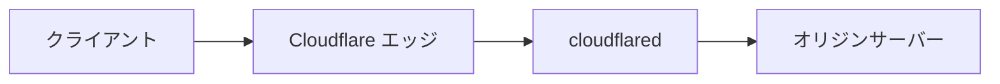
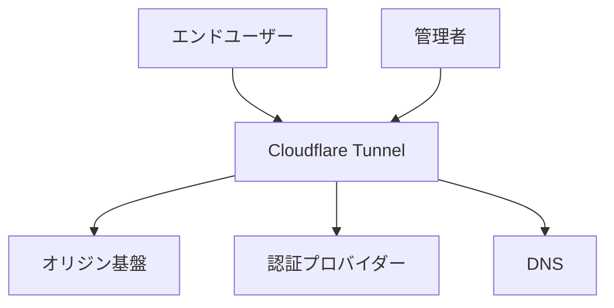
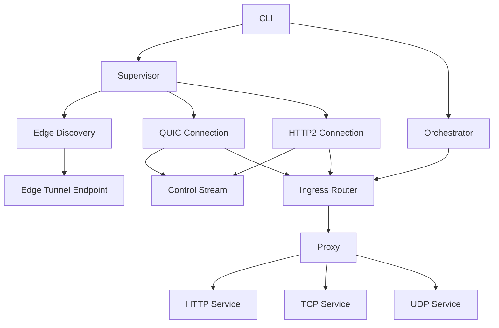
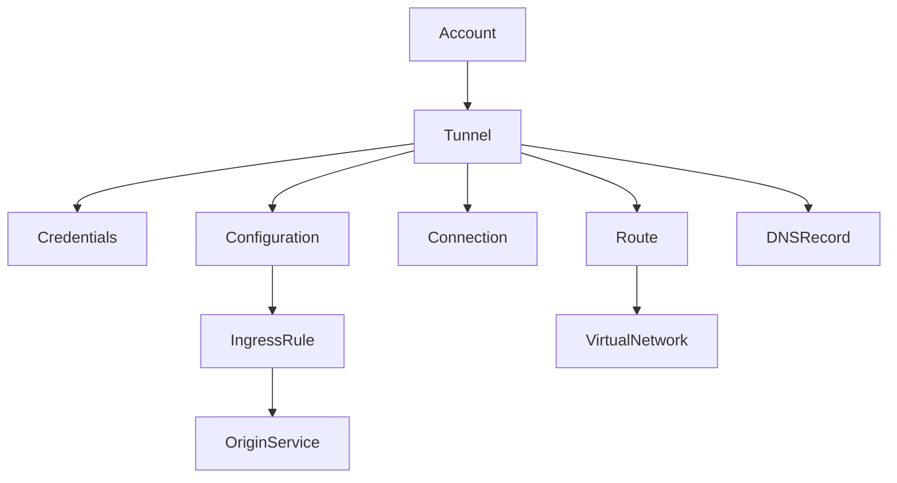
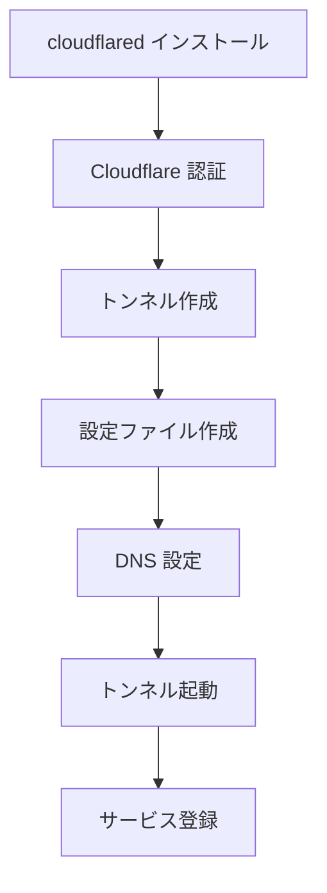
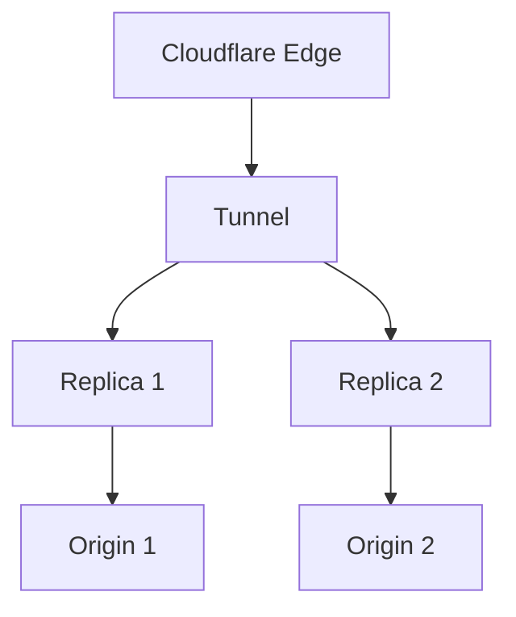
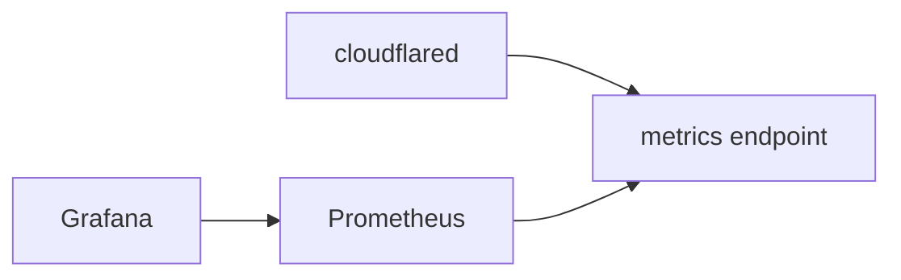

## 概要

Cloudflare Tunnel は、パブリック IP の公開や受信ポート開放なしで、オリジンサービスを Cloudflare エッジへ安全に接続する仕組みです。オリジン側の `cloudflared` がアウトバウンド接続を確立し、ユーザー通信を中継します。



| 要素名 | 説明 |
|---|---|
| クライアント | トンネル先のサービスを利用する利用者やシステム |
| Cloudflare エッジ | リクエスト受付とトンネル転送を行う分散エッジ |
| cloudflared | オリジン側で動作し、エッジへ接続するコネクター |
| オリジンサーバー | 非公開のまま提供するアプリケーション基盤 |

## 特徴

- アウトバウンド接続のみの公開方式
- 4 本の並列接続による高可用性
- QUIC 優先、HTTP/2 フォールバック
- HTTP、TCP、UDP、SSH、RDP、gRPC など多様なプロトコル対応
- 1 トンネル内でのホスト名・パス単位ルーティング
- 設定の動的反映と自動再接続
- Quick Tunnel、Named Tunnel、Access 連携の動作モード
- Docker、Kubernetes、Terraform など多様な運用形態
- Prometheus メトリクスによる監視対応

### 導入判断の目安

| 条件 | 推奨 |
|---|---|
| 受信ポート開放を避けたい | Cloudflare Tunnel |
| 既存VPNを段階置換したい | Cloudflare Tunnel + Access |
| レイヤ7の認証を強制したい | Access ポリシー併用 |
| 単純な外部公開のみ必要 | Quick Tunnel で検証後に Named Tunnel |

## 構造

### システムコンテキスト



| 要素名 | 説明 |
|---|---|
| エンドユーザー | HTTPS でアプリケーションにアクセスする利用者 |
| 管理者 | トンネル作成、設定、監視を実施する運用者 |
| Cloudflare Tunnel | エッジとオリジン間の接続経路を提供する仕組み |
| オリジン基盤 | プライベートネットワーク上のサービス実行基盤 |
| 認証プロバイダー | Access ポリシー評価に利用する外部認証基盤 |
| DNS | トンネル宛て CNAME を解決する名前解決基盤 |

### コンポーネント



| 要素名 | 説明 |
|---|---|
| Supervisor | 複数接続の維持、再接続、フェイルオーバー制御 |
| Edge Discovery | 接続先エッジ探索と解決 |
| QUIC Connection | 優先プロトコルのデータ転送路 |
| HTTP2 Connection | フォールバック用転送路 |
| Control Stream | トンネル登録と制御メッセージ処理 |
| Orchestrator | 設定変更検知と反映制御 |
| Ingress Router | ルール評価と転送先選択 |
| Proxy | HTTP、TCP、UDP の中継実行 |

## データモデル

### 概念モデル



| 要素名 | 説明 |
|---|---|
| Tunnel | オリジン接続の論理単位 |
| Credentials | トンネル認証情報 |
| Configuration | ingress と originRequest の設定集合 |
| IngressRule | ホスト名、パス、サービスの対応規則 |
| Connection | cloudflared とエッジ間の実接続 |
| Route | プライベートネットワーク向け IP ルート |
| DNSRecord | トンネル向け CNAME レコード |
| VirtualNetwork | 重複アドレスを分離する論理ネットワーク |

## 構築手順

### 全体フロー



| 要素名 | 説明 |
|---|---|
| cloudflared インストール | 実行環境へのバイナリ導入 |
| Cloudflare 認証 | アカウント認証と証明書取得 |
| トンネル作成 | UUID と資格情報生成 |
| 設定ファイル作成 | ingress ルール定義 |
| DNS 設定 | ホスト名とトンネルの関連付け |
| トンネル起動 | 実接続確立 |
| サービス登録 | 自動起動設定 |

### 最短セットアップ

```bash
cloudflared tunnel login
cloudflared tunnel create my-app-tunnel
cloudflared tunnel route dns my-app-tunnel app.example.com
cloudflared tunnel run my-app-tunnel
```

| チェック項目 | 確認方法 |
|---|---|
| CNAME 作成完了 | `cloudflared tunnel route dns` の結果確認 |
| 接続正常 | `cloudflared tunnel info my-app-tunnel` |
| 到達確認 | `https://app.example.com` へアクセス |

### インストールと認証

| OS | コマンド |
|---|---|
| macOS | `brew install cloudflare/cloudflare/cloudflared` |
| Debian、Ubuntu | `sudo apt-get install cloudflared` |
| RHEL、CentOS、Fedora | `sudo yum install cloudflared` |

```bash
cloudflared tunnel login
```

### トンネル作成

```bash
cloudflared tunnel create my-app-tunnel
```

| 生成物 | 説明 |
|---|---|
| Tunnel UUID | トンネル識別子 |
| Credentials JSON | `~/.cloudflared/<UUID>.json` |

### 設定ファイル例

```yaml
tunnel: ae21a96c-24d1-4ce8-a6ba-962cba5976d3
credentials-file: /home/user/.cloudflared/ae21a96c-24d1-4ce8-a6ba-962cba5976d3.json
loglevel: info

ingress:
  - hostname: app.example.com
    service: http://localhost:8080
  - hostname: api.example.com
    service: http://localhost:8000
  - service: http_status:404
```

| 項目 | 説明 |
|---|---|
| hostname | 受信ホスト名条件 |
| path | パス正規表現条件 |
| service | 転送先サービス |
| catch all | 末尾 `http_status:404` 必須 |

### DNS 設定と起動

```bash
cloudflared tunnel route dns my-app-tunnel app.example.com
cloudflared tunnel run my-app-tunnel
```

### サービス登録

```bash
cloudflared service install
systemctl start cloudflared
systemctl status cloudflared
```

## 利用パターン

### API で管理する

```bash
curl "https://api.cloudflare.com/client/v4/accounts/$ACCOUNT_ID/cfd_tunnel" \
  --request POST \
  --header "Authorization: Bearer $CLOUDFLARE_API_TOKEN" \
  --json '{"name":"api-tunnel","config_src":"cloudflare"}'
```

### 高可用性構成



| 要素名 | 説明 |
|---|---|
| Replica 1、2 | 同一 UUID を共有する冗長コネクター |
| Origin 1、2 | レプリカ背後の実サービス |

### SSH と RDP を通す

```yaml
ingress:
  - hostname: ssh.example.com
    service: ssh://localhost:22
  - hostname: rdp.example.com
    service: rdp://localhost:3389
  - service: http_status:404
```

```bash
cloudflared access ssh --hostname ssh.example.com
cloudflared access rdp --hostname rdp.example.com --url localhost:3390
```

### プライベートネットワーク接続

```yaml
warp-routing:
  enabled: true
```

```bash
cloudflared tunnel route ip add 10.0.0.0/24 <TUNNEL_ID>
cloudflared tunnel vnet add staging-vnet
```

## 運用

### ログとメトリクス

```bash
cloudflared tunnel --loglevel info --logfile /var/log/cloudflared/tunnel.log run my-tunnel
cloudflared tunnel --metrics 0.0.0.0:60123 run my-tunnel
```

| 項目 | 説明 |
|---|---|
| loglevel | `debug`、`info`、`warn`、`error` |
| metrics | Prometheus 用エンドポイント公開 |

| KPI | 監視意図 |
|---|---|
| `cloudflared_tunnel_total_requests` | トラフィック総量の把握 |
| `cloudflared_tunnel_request_errors` | 失敗率の早期検知 |
| `cloudflared_tunnel_active_streams` | 混雑と処理負荷の把握 |



### 更新と診断

```bash
cloudflared update
cloudflared tunnel diagnostics
```

| 運用作業 | 推奨頻度 |
|---|---|
| バージョン更新確認 | 週次 |
| 診断情報採取 | 障害発生時 |
| Access ポリシー棚卸し | 月次 |

## ベストプラクティス

- 同一トンネル UUID で複数レプリカを常時稼働
- ingress 最終行に `http_status:404` を常時設定
- 本番では `--metrics` で固定ポート指定
- 設定ファイルを Git 管理し、変更履歴を追跡
- トラフィック制御が必要な場合のみロードバランサー併用

### 更新時の安全手順

| 手順 | 目的 |
|---|---|
| 新レプリカ起動 | 切替前の経路確保 |
| 旧レプリカ停止 | 二重障害の回避 |
| 更新実施 | 脆弱性・不具合修正 |
| 旧レプリカ再参加 | 冗長度の回復 |

## トラブルシューティング

### 典型的な障害と対応

| 事象 | 主因 | 対応 |
|---|---|---|
| Inactive | トンネル未起動 | `cloudflared tunnel run` 実行 |
| QUIC 接続失敗 | UDP 7844 制限 | `--protocol http2` 指定 |
| too many open files | FD 上限不足 | `LimitNOFILE` 引き上げ |
| TLS 検証失敗 | 証明書不整合 | `originRequest` の証明書設定見直し |
| websocket bad handshake | 設定不整合 | Access、SSL、WebSocket 設定確認 |

```bash
cloudflared tunnel list
cloudflared tunnel info my-tunnel
cloudflared tunnel diagnostics
```

### 初動確認チェックリスト

| 観点 | 確認内容 |
|---|---|
| プロトコル | QUIC 失敗時の HTTP2 フォールバック有無 |
| DNS | CNAME が `cfargotunnel.com` を指す状態 |
| 認証 | Access ポリシーと IdP 連携状態 |
| オリジン | サービス自体のヘルス状態 |

## 参考リンク

- 公式ドキュメント
  - [Cloudflare Tunnel](https://developers.cloudflare.com/cloudflare-one/networks/connectors/cloudflare-tunnel/)
  - [Set up your first tunnel](https://developers.cloudflare.com/cloudflare-one/networks/connectors/cloudflare-tunnel/get-started/)
  - [Configure a tunnel](https://developers.cloudflare.com/cloudflare-one/networks/connectors/cloudflare-tunnel/configure-tunnels/)
  - [Cloudflare Tunnel API](https://developers.cloudflare.com/api/resources/zero_trust/subresources/tunnels/)
  - [Quick Tunnels](https://developers.cloudflare.com/cloudflare-one/networks/connectors/cloudflare-tunnel/do-more-with-tunnels/trycloudflare/)
  - [SSH use case](https://developers.cloudflare.com/cloudflare-one/networks/connectors/cloudflare-tunnel/use-cases/ssh/)
  - [RDP use case](https://developers.cloudflare.com/cloudflare-one/networks/connectors/cloudflare-tunnel/use-cases/rdp/)
  - [Private networks](https://developers.cloudflare.com/cloudflare-one/networks/connectors/cloudflare-tunnel/private-net/)
  - [Tunnel changelog](https://developers.cloudflare.com/cloudflare-one/changelog/tunnel/)
  - [Tunnels FAQ](https://developers.cloudflare.com/cloudflare-one/faq/cloudflare-tunnels-faq/)
- GitHub
  - [cloudflare/cloudflared](https://github.com/cloudflare/cloudflared)
- 記事
  - [deepwiki cloudflare cloudflared](https://deepwiki.com/cloudflare/cloudflared)
  - [Cloudflare Community](https://community.cloudflare.com/)